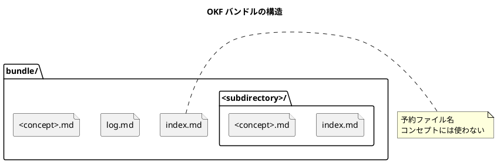
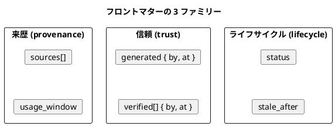
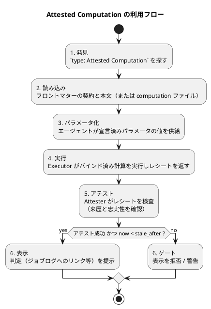
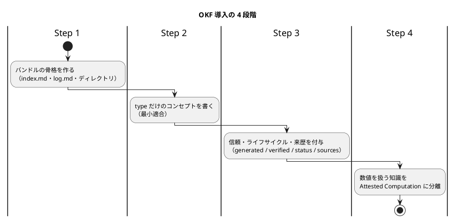

# OKF 導入ガイド（Open Knowledge Format v0.2）

このドキュメントは、Google Cloud Platform が公開している [Open Knowledge Format (OKF) SPEC.md](https://github.com/GoogleCloudPlatform/open-knowledge-format/blob/main/SPEC.md) **Version 0.2** を基に、仕様の内容を日本語で整理し、プロジェクトに導入するための手順をまとめたものです。

仕様の正本は英語版 SPEC.md です。本ガイドと英語版で差異がある場合は英語版を正とします。

---

## 1. OKF とは

OKF は、データやシステムを取り巻く**知識**（メタデータ・コンテキスト・整理された知見）を表現するための、人間にもエージェントにも扱いやすいオープンなフォーマットです。人が書き、エージェントが生成し、組織間で交換し、その両方が消費することを想定して設計されています。

フォーマットは意図的に最小限に抑えられています。**YAML フロントマターを持つ Markdown ファイルのディレクトリ**がすべてであり、スキーマレジストリも中央機関も必須ツールもありません。`cat` できれば読め、`git clone` できれば配布できます。

### 1.1 背景と動機

AI エージェント向けの知識表現は急速に進化しており、互換性のない規約が多数生まれています。OKF は、知識は誰もがアクセスできる確立されたフォーマットで表現するのが最善であるという立場を取ります。

- **可読性**：ツールなしで人間が読める
- **解析可能性**：専用 SDK なしでエージェントが解析できる
- **差分可能性**：バージョン管理で差分が取れる
- **可搬性**：ツール・組織・時間を超えて持ち運べる

知識コーパスは「一度書いて読むだけ」のものではなく、**エージェントによって継続的に書き換え・保守されるもの**になりつつあります。多くのコンセプトが機械生成される状況では、消費側は次の問いに答える必要があります。

| 問い | 概念 |
| :--- | :--- |
| 何から作られ、どう検証されたのか | **来歴（provenance）** |
| どの程度信頼してよいのか | **信頼（trust）** |
| 今も正しいのか | **鮮度（freshness）** |
| これは最新版か | **ライフサイクル（lifecycle）** |
| この数値は決められた方法で算出されたか | **アテステーション（attestation）** |

OKF v0.2 は、来歴・信頼・ライフサイクル・アテステーションを第一級の要素にしつつ、フォーマット自体は最小限の規約にとどめています。標準化するのは、知識コーパスを自己記述的にするために必要な少数の構造規約だけで、それ以外は生産者に委ねられます。

### 1.2 目標

1. **生産者**（人・エージェント・エクスポートパイプライン）が書き込める汎用フォーマットを定義する
2. **消費者**（エージェント・UI・検索インデックス・決定的なコード）がどう読み、辿るべきかを示す
3. システムや組織をまたいだ知識の**交換**を容易にする
4. エージェントが保守するコーパスを**信頼可能**にするための最小限のフロントマターフィールドを、ランタイムを規定せずに標準化する

### 1.3 非目標

- コンセプト型の固定タクソノミーを定義すること
- ストレージ・配信・クエリ基盤を規定すること
- ドメイン固有スキーマ（Avro・Protobuf・OpenAPI など）を置き換えること。OKF はそれらを*参照*するのであって、包含しない
- Executor や Attester が指すコードのパッケージングや起動方法を規定すること。OKF が固定するのはインターフェースであり、パッケージングではない

---

## 2. 用語

| 用語 | 意味 |
| :--- | :--- |
| **Knowledge Bundle（バンドル）** | 自己完結した階層構造の知識ドキュメント集合。配布の単位 |
| **Concept（コンセプト）** | バンドル内の知識の 1 単位。1 つの Markdown ドキュメントで表す。有形の資産（テーブル・API）でも抽象的な概念（メトリクス・業務プロセス）でもよい |
| **Concept ID** | バンドル内でのコンセプトファイルのパスから `.md` を除いたもの |
| **Frontmatter（フロントマター）** | Markdown ファイル先頭の `---` で区切られた YAML メタデータブロック |
| **Body（本文）** | フロントマター以降のすべて |
| **Link（リンク）** | 暗黙の親子階層を超えた関係を表す、コンセプト間の標準 Markdown リンク |
| **Source（ソース）** | コンセプトの導出元となる材料。バンドル内外を問わず `sources` フィールドに記録する |
| **Provenance（来歴）** | コンセプトの導出元となるソースの集合 |
| **Credibility signal（信頼性シグナル）** | ソースごとの客観的事実（`author`・`usage_count`・`last_modified`）。OKF は判定ではなくシグナルを記録する（§5.1） |
| **Actor（アクター）** | 行為者を示す文字列。エージェントは `<producer>/<version>`、人は `human:<id>`、自動プロセスは `process:<id>`（§7） |
| **Trust tier（信頼ティア）** | `verified` から導出されるレベル。unverified / machine-confirmed / human-reviewed（§5.3） |
| **Attested Computation** | 値の正当な算出方法を持つコンセプト（`type: Attested Computation`）。消費者はそれを実行して値が正しく生成されたことを確認できる（§10） |
| **Executor** | 計算を実行しレシートを返す実行手順またはコード（§10.2） |
| **Receipt（レシート）** | 実行が返す証拠。`executor.receipt` で形が決まる。ランタイム成果物であり、バンドルには保存しない（§10） |
| **Attester** | レシートを検査して判定を返す決定的な（LLM を使わない）コード（§10.2） |

---

## 3. バンドル構造

バンドルは Markdown ファイルのディレクトリツリーです。ディレクトリ構造はドメインに依存せず、生産者は扱う知識に合わせて自由に整理できます。

```text
path/to/bundle/
  index.md                      # 任意。段階的開示のためのディレクトリ一覧
  log.md                        # 任意。更新の時系列履歴
  <concept>.md                  # バンドルルートのコンセプト
  <subdirectory>/               # サブディレクトリでコンセプトをグループ化
    index.md
    <concept>.md
    <subdirectory>/
      ...
```



バンドルは次の形で配布できます（MAY）。

- Git リポジトリ（履歴・帰属・差分が得られるため**推奨**）
- ディレクトリの tarball または zip
- より大きなリポジトリ内のサブディレクトリ

### 3.1 予約ファイル名

以下のファイル名は階層のどのレベルでも定義済みの意味を持ち、コンセプトドキュメントに使ってはなりません（MUST NOT）。

| ファイル名 | 用途 |
| :--- | :--- |
| `index.md` | ディレクトリ一覧。§8 参照 |
| `log.md` | 更新履歴。§9 参照 |

それ以外の `.md` ファイルはすべてコンセプトドキュメントです。

タグは `tags` フロントマターフィールド（§4.1）を通じて第一級の概念であり続けますが、OKF はタグ別にドキュメントを集約する別ファイル形式を規定しません。タグ閲覧ビューが欲しい消費者は、フロントマターを走査して消費時に合成できます。

---

## 4. コンセプトドキュメント

すべてのコンセプトは UTF-8 の Markdown ファイルで、2 つの部分から成ります。

1. **YAML フロントマターブロック**：ファイル先頭の `---` 行と、閉じる `---` 行で区切る
2. **Markdown 本文**：自由形式の内容

### 4.1 フロントマター

```yaml
---
type: <Type name>                  # 必須（REQUIRED）
title: <任意の表示名>
description: <任意の 1 行要約>
resource: <任意。対象資産の正規 URI>
tags: [<tag>, <tag>, ...]          # 任意
# ... 信頼・ライフサイクル・来歴・計算の各ファミリー（§5・§10 参照）
# ... その他、生産者定義のキー/値
---
```

**必須：**

- `type`：コンセプトの種類を示す短い文字列。消費者はルーティング・フィルタ・表示に使います。例：`BigQuery Table`、`BigQuery Dataset`、`API Endpoint`、`Metric`、`Playbook`、`Reference`、`Attested Computation`

  `type` の値は中央登録されません。生産者は説明的で自明な値を選ぶべきであり（SHOULD）、消費者は未知の型を（通常は汎用コンセプトとして扱うことで）許容しなければなりません（MUST）。

`type` は唯一の常時必須キーです。`type` だけを持つコンセプトは完全に適合しています（§11）。

**推奨：**

- `title`：人間向けの表示名。省略時、消費者はファイル名から導出してもよい（MAY）
- `description`：コンセプトを要約する 1 文。`index.md` 生成・検索スニペット・プレビューに使う
- `resource`：コンセプトが説明する対象資産を一意に識別する URI。物理的な資源ではなく抽象的な概念を説明するコンセプトでは省略する
- `tags`：横断的な分類のための短い文字列の YAML リスト

任意の**来歴**・**信頼**・**ライフサイクル**ファミリー（§5）と、Attested Computation コンセプト向けの**計算**フィールド（§10）も記述できます。

**拡張：** 生産者は追加のキーを自由に含めてよい（MAY）。消費者はラウンドトリップ時に未知のキーを保持すべきであり（SHOULD）、未知のフィールドを理由にドキュメントを拒否してはなりません（MUST NOT）。

### 4.2 本文

本文は標準の Markdown です。構造は人の読解にもエージェントの検索にも役立つため、生産者は自由文よりも構造的な Markdown（見出し・リスト・表・フェンス付きコードブロック）を優先すべきです（SHOULD）。

必須の本文セクションはありません。以下の見出しは**慣習的**な意味を持ち、該当する場合は使うべきです（SHOULD）。

| 見出し | 用途 |
| :--- | :--- |
| `# Schema` | 資産のカラム/フィールドの構造的説明 |
| `# Examples` | 具体的な利用例。多くはフェンス付きコードブロック |
| `# Computation` | Attested Computation の正当な計算。§10 参照 |

個々の主張を外部ソースに帰属させるには、本文の引用リストではなく、`sources` エントリをキーとする Markdown 脚注を使います（§5.1）。

### 4.3 例：リソースに紐づくコンセプト

```markdown
---
type: BigQuery Table
title: Customer Orders
description: One row per completed customer order across all channels.
resource: https://console.cloud.google.com/bigquery?p=acme&d=sales&t=orders
tags: [sales, orders, revenue]
generated: { by: reference_agent/gemini-2.5-pro, at: 2026-05-28T14:30:00Z }
---

# Schema

| Column        | Type      | Description                              |
|---------------|-----------|------------------------------------------|
| `order_id`    | STRING    | Globally unique order identifier.        |
| `customer_id` | STRING    | Foreign key into [customers](/tables/customers.md). |
| `total_usd`   | NUMERIC   | Order total in US dollars.               |
| `placed_at`   | TIMESTAMP | When the customer submitted the order.   |

# Joins

Joined with [customers](/tables/customers.md) on `customer_id`.
```

### 4.4 例：リソースに紐づかないコンセプト

```markdown
---
type: Playbook
title: "Incident response: data freshness alert"
description: Steps to triage a freshness alert on the orders pipeline.
tags: [oncall, incident]
generated: { by: human:ahormati, at: 2026-04-12T09:00:00Z }
---

# Trigger

A freshness alert fires when `orders` lags more than 30 minutes behind its
expected SLA. See the [orders table](/tables/orders.md).

# Steps

1. Check the [ingestion job dashboard](https://example.com/dash).
2. ...
```

---

## 5. 来歴・信頼・ライフサイクル

これらのフロントマターファミリーは、「どこから来たか」「どれだけ信頼できるか」「今も最新か」をフロントマターだけで答えられるようにします。すべて任意です。省略にも意味があります。未検証のコンセプトは検証済みのものと区別されますが、拒否されることはありません（§11）。

OKF のタイムスタンプ値はすべて、明示的な UTC オフセットを持つ ISO 8601 日時です。例：`2026-06-30T14:00:00Z`



### 5.1 来歴：`sources`

`sources` は、バンドル内外を問わず、コンセプトの導出元となる材料を記録します。

```yaml
sources:
  - id: ga4-schema
    resource: https://developers.google.com/analytics/bigquery/export-schema
    title: GA4 BigQuery Export schema
    author: team:ga4-docs
    usage_count: 5000
    last_modified: 2026-05-30T00:00:00Z
usage_window: { from: 2026-06-01T00:00:00Z, to: 2026-06-30T00:00:00Z }
```

各 `sources` エントリ：

- `resource`：エントリ内で**必須**。消費者が辿れる具体的な成果物（絶対 URL・バンドル相対パス・`references/` サブディレクトリへのパス、§6）か、辿れない母集団・スコープ記述子（例：`all queries in BigQuery project X`）のいずれかを示す
- `id`：任意。個々の主張を帰属させるための安定キー（後述）。本文がそのソースを引用する場合は存在すべき（SHOULD）
- `title`：任意。ソースの人間向けラベル
- 任意の信頼性シグナル `author`・`usage_count`・`last_modified`（次項）

**ソース信頼性シグナル。** OKF は、消費者がコンセプトの抽出元ソースを評価することで信頼度を判断できるよう、ソースごとの客観的シグナルを記録します。信頼性スコアは保存しません。スコアは主観的で、消費者間で移植できず、陳腐化するためです。信頼ティア（§5.3）と同様、信頼性はシグナルから*推論*するものであり、保存するものではありません。各シグナルは任意で、`sources` エントリに置きます。

- `author`：ソースを作った人または物。アクター規約（§7）で記述する。権威性のシグナル
- `usage_count`：`usage_window` の期間内に `resource` が利用された回数（ダッシュボード閲覧・クエリ実行・ページ閲覧）。採用度と生存性のシグナル。単一成果物ならその成果物自身の利用回数、スコープ記述子ならスコープ内でコンセプトに触れる利用の回数
- `last_modified`：ソース自体が最後に変更された日時。新しさのシグナル。コンセプトが書かれた日時を記録する `generated.at`（§5.2）とは区別する
- `usage_window`：`sources` の兄弟として一度だけ書き、すべての `usage_count` を `{ from, to }` の日時範囲で枠づける。個々のエントリが独自の `usage_window` を持って共有値を上書きしてもよい（MAY）

`usage_count` は粗いシグナルです。「生きているか死んでいるか」「桁のオーダー」「そのソース自身の履歴に対する推移」の比較には使えますが、種類をまたいだ精密なランキングには向きません。スケジュールクエリの実行回数と、人が意図してダッシュボードを見た回数は同じ重みではありません。消費者は生存性とトレンドとして読み、スコアとして扱うべきではありません（SHOULD）。

系譜（lineage）は専用フィールドではなくリンクで表現します。`resource` が別の OKF コンセプトを指す場合、その導出エッジはバンドルグラフ（§6）にすでに存在するため、消費者はそのソースの `sources` に再帰して信頼性を伝播させてもよい（MAY）。外部の末端ソースは固有のシグナルだけを持ちます。より深い系譜（明示的な外部 `derived_from` やデータリネージ）は v0.2 のスコープ外です。

**主張ごとの帰属。** 特定の主張を帰属させるには、ラベルが `sources[].id` である Markdown 脚注を使います。

```markdown
The `events_` table is sharded daily as `events_YYYYMMDD`.[^ga4-schema]

[^ga4-schema]: GA4 BigQuery Export schema
```

脚注ラベルが `sources` への結合キーです。消費者は脚注の文面を解析するのではなく、一致するエントリを通じて帰属を解決します。位置（`sources[0]`）ではなくキーでラベル付けするのは、エージェントがこれらのドキュメントを絶えず書き換えるためです。位置インデックスはリストが並び替えられた瞬間に静かに誤帰属しますが、安定した `id` は並び替えに耐えます。

### 5.2 信頼：`generated` と `verified`

`generated` は現在の内容がどう生成されたかを記録します。`verified` は誰または何が内容をソースや `resource` に照らして確認したかを記録します。コンセプトを*書いた*者と*確認した*者は同じとは限らないため、両者は分けて保持します。

```yaml
generated: { by: reference_agent/gemini-2.5-pro, at: 2026-06-20T22:53:05Z }
```

- `generated.by`：`generated` 内で**必須**。アクター（§7）
- `generated.at`：内容の最後の意味ある変更を示す ISO 8601 日時。消費者は最近の編集と古い事実を区別するために使う

```yaml
verified:
  - { by: human:ahormati, at: 2026-06-25T09:00:00Z }
  - { by: process:finance-nightly, at: 2026-06-26T02:00:00Z }
```

- `verified`：検証イベントのリスト。各要素は `by`（アクター）と `at`（ISO 8601 日時）を持つ。複数エントリで独立した確認（人のサインオフと夜間プロセスなど）を表す。「どれくらい最近か」は最新の `at`
- `verified` は `generated.at` とは独立。内容は再確認なしに変わりうるし、事実は再生成なしに再確認されうる
- 検証者が 1 人の場合、リストのダッシュなしで 1 つの `{ by, at }` マッピングとして書いてもよい（MAY）。消費者は裸のマッピングを 1 要素のリストとして扱わなければならない（MUST）

```yaml
verified: { by: human:ahormati, at: 2026-06-25T09:00:00Z }
```

### 5.3 信頼ティア

消費者は `verified` から信頼ティアを導出します（低い順）。

| 条件 | ティア |
| :--- | :--- |
| `verified` キーなし | **unverified（未検証）** |
| `human:` 以外のアクターのみによる `verified` | **machine-confirmed（機械確認済み）** |
| `human:<id>` アクターによる `verified` あり | **human-reviewed（人間レビュー済み）** |

信頼フロントマターのないコンセプトも消費可能であり、消費者は拒否してはなりません（MUST NOT、§11）。信頼ティアは助言的なシグナルであり、アクセス制御ではありません。

### 5.4 ライフサイクル：`status`

```yaml
status: stable        # draft | stable | deprecated
```

- `draft`：未レビュー。不完全な可能性がある
- `stable`：デフォルト。消費可能
- `deprecated`：リンクと履歴のために残されているが、もう最新ではない

`status` がなければ `stable` とみなします。

### 5.5 ライフサイクル：`stale_after`

```yaml
stale_after: 2026-09-23T00:00:00Z   # この時刻以降、内容は陳腐化している
```

任意。絶対時刻です。`now >= stale_after` のときコンセプトは陳腐化しています。相対 TTL ではなく絶対時刻にすることで、陳腐化の判定が「いつ読まれたか」を参照しない単純な比較になります。

---

## 6. クロスリンクとパス

### 6.1 コンセプト間のリンク

コンセプトは標準の Markdown リンクで他のコンセプトにリンクしてよい（MAY）。2 つの形式がサポートされます。

- **絶対（バンドル相対）：** `/` で始まり、バンドルルートからの相対と解釈する。ドキュメントがサブディレクトリ内で移動しても安定するため、こちらが**推奨**

  ```markdown
  See the [customers table](/tables/customers.md) for the join key.
  ```

- **相対：** 標準の Markdown 相対パス

  ```markdown
  See the [neighboring concept](./other.md).
  ```

コンセプト A から B へのリンクは*関係*を主張します。具体的な種類（親子・参照・結合・依存）はリンク自体ではなく周囲の文章で伝えます。グラフビューを構築する消費者は通常、すべてのリンクを型なし関係の有向エッジとして扱います。

消費者は壊れたリンクを許容しなければなりません（MUST）。バンドル内に存在しない対象へのリンクは不正ではなく、まだ書かれていない知識を表しているだけかもしれません。

### 6.2 パス値を持つフィールド

`resource`・`sources[].resource`・`computation`・`executor.resource`・`attester.resource`（§10）はパスまたは URI を持ちます。`sources[].resource` はスコープ記述子（§5.1）でもよく、その場合はパスではありません。各パス値フィールドは次を受け付けます。

- 絶対 URL（例：`https://...`）
- `/` で始まるバンドル相対パス
- 相対パス（例：`../computations/revenue.md`）

### 6.3 `references/` 規約

`references/` サブディレクトリは慣習的に、外部資料・実行手順・コードをバンドル内の第一級コンセプトとしてミラーします。ソース・Executor・Attester はよくここを指します（例：`references/attesters/revenue.py`）。これは命名規約であり、要件ではありません。

---

## 7. アクター規約

行為者を記録するフィールド（`generated.by`・`verified[].by`）は単一のアクター規約を使います。

| 形式 | 対象 | 例 |
| :--- | :--- | :--- |
| `<producer>/<version>` | エージェント・ツール | `reference_agent/gemini-2.5-pro` |
| `human:<id>` | 人 | `human:ahormati` |
| `process:<id>` | 自動プロセス | `process:finance-nightly` |

信頼を分類する消費者（§5.3）は `human:` プレフィックスをキーにするため、生産者は人が書いた、または人が確認した内容には必ずこのプレフィックスを使わなければなりません（MUST）。

---

## 8. インデックスファイル

`index.md` はバンドルルートを含む任意のディレクトリに置けます（MAY）。ディレクトリの内容を列挙して**段階的開示**を支援し、人やエージェントが個々のドキュメントを開く前に何があるかを把握できるようにします。

インデックスファイルにはフロントマターを置きません。唯一の例外として、バンドルルートの `index.md` は `okf_version` キーを持ってもよい（MAY、§12）。本文は 1 つ以上のセクションから成り、各セクションは見出しの下にコンセプトをまとめます。

```markdown
# Section / Group Heading

* [Title 1](relative-url-1) - short description of item 1
* [Title 2](relative-url-2) - short description of item 2

# Another Section

* [Subdirectory](subdir/) - short description of the subdirectory
```

エントリはリンク先コンセプトのフロントマターにある description を含むべきです（SHOULD）。生産者は `index.md` を自動生成してもよく（MAY）、消費者は存在しない場合にその場で合成してもよい（MAY）。

---

## 9. ログファイル

`log.md` は階層の任意のレベルに置け（MAY）、そのスコープの変更履歴を記録します。形式は日付でグループ化されたフラットなリストで、新しいものが先頭です。

```markdown
# Directory Update Log

## 2026-05-22
* **Update**: Added a BigQuery table reference for [Customer Metrics](/tables/customer-metrics.md).
* **Creation**: Established the [Dataplex Playbook](/playbooks/dataplex.md).

## 2026-05-15
* **Initialization**: Created foundational directory structure.
```

日付見出しは ISO 8601 の `YYYY-MM-DD` 形式でなければなりません（MUST）。ログエントリは文章であり、先頭の太字（`**Update**`・`**Creation**`・`**Deprecation**`）は慣習であって要件ではありません。

---

## 10. Attested Computation コンセプト

Attested Computation コンセプトは、値が何を*意味する*かだけでなく、それを*算出する*正当な方法を持ちます。これにより消費者は、エージェントが独自に即興した計算ではなく、承認された計算を実行したことを確認できます。来歴（§5.1）が「この主張はどこから来たか」に答えるのに対し、アテステーションは「この数値は決められた方法で生成されたか」に答えます。OKF は計算とその確認手段を記録するだけで、自身は何も実行しません。

### 10.1 計算はそれ自体がコンセプト

承認された計算は `type: Attested Computation` の独立したコンセプトです。値を必要とするコンセプト（`Metric`・`BigQuery Table`）は通常の Markdown リンク（§6）でそれにリンクします。独立コンセプトにする理由は 3 つあります。

- **`runtime` が `parameters` の意味を定める。** パラメータは runtime によって SQL バインド変数・dbt var・Python 引数のいずれかになる。`runtime` と `parameters` を 1 つのフロントマターに置くことでバインドの意味が自明になる
- **1 つの計算、多くの消費者。** 同じ計算がメトリクス・ダッシュボードコンセプト・レポートを支えられる。コンセプトとして 1 回参照され、再利用される
- **信頼状態は計算ごと。** `verified`・`stale_after`・単一の `attester` は 1 つのものを記述する。売上・利益・利益率はそれぞれ独立に検証・アテストされるので、1 つのフロントマターに 3 エントリではなく 3 つのコンセプトになる

### 10.2 契約フィールド

契約はコンセプトのトップレベルフロントマターです。来歴・信頼・ライフサイクルファミリー（§5）に加え、Attested Computation コンセプトは次を持ちます。

| フィールド | 説明 |
| :--- | :--- |
| `runtime` | この型では**必須**。計算の実行方法を示す唯一のフィールドで、Executor と Attester の解釈方法と `parameters` の意味を決める。例：`bigquery`・`postgres`・`dbt`・`python`・`Looker` |
| `parameters` | エージェントが埋めてよい、型付き・名前付きの穴のリスト。各要素は `{ name, type, required }`。バインドの意味は `runtime` に従う |
| `computation` | 任意。計算を保持するファイルへのパス（§6.2）。本文のインラインフェンスの代わりに使う（§10.3）。省略時は本文の `# Computation` フェンスが計算 |
| `executor` | 計算の実行方法。`resource` は実行手順またはコードを示し、ランナー（エージェントまたは決定的な消費者コード）がそれに従う。`receipt` は実行が返さなければならないフィールド、すなわち Attester が検査する証拠を宣言する（例：BigQuery の `job_id` と実際に実行された SQL） |
| `attester` | 決定的なチェック。`resource` はレシートを受け取り判定を返すコード（LLM なし）を示す。消費者側で実行することを想定 |

`resource` の背後にあるもの（Skill・スクリプト・コンテナ）はパッケージングの選択であり、OKF はインターフェースを固定し、パッケージングは固定しません（§1）。

```markdown
---
type: Attested Computation
title: Revenue for fiscal year
description: Recognized revenue for a fiscal year, per Finance's definition.
status: stable
runtime: bigquery
parameters:
  - { name: year, type: integer, required: true }
executor:
  resource: references/skills/run-on-bq.md
  receipt: [job_id, executed_sql, result]
attester:
  resource: references/attesters/revenue.py
generated: { by: reference_agent/gemini-2.5-pro, at: 2026-06-20T22:53:05Z }
verified: { by: human:ahormati, at: 2026-06-25T09:00:00Z }
stale_after: 2026-09-23T00:00:00Z
sources:
  - id: rev-policy
    resource: https://wiki.acme/finance/revenue-recognition
    title: Revenue recognition policy
---

# Computation

    SELECT SUM(amount) AS revenue
    FROM finance.recognized_revenue
    WHERE fiscal_year = @year

The computation binds only the declared `parameters`, per the recognition
policy.[^rev-policy]

[^rev-policy]: Revenue recognition policy
```

### 10.3 計算本体

計算は 2 つの方法のいずれかで提供します。

- **インライン：** 本文の `# Computation` 直下に 1 つのフェンス付きコードブロック。契約と並べてレビューする短い計算に最適
- **ファイル：** `computation` にパス（§6.2）を設定し、本文のフェンスを省略。長い計算や生成された計算、非 OKF ツールと共有する実ファイルとして既に管理している計算に最適

```yaml
runtime: bigquery
computation: references/computations/lib/revenue.sql
parameters:
  - { name: year, type: integer, required: true }
```

エージェントは宣言された `parameters` の*値*だけを供給してよく（MAY）、計算を作成・編集してはなりません（MUST NOT）。`computation` にパラメータ値をバインドして実行可能な成果物にするのは消費者の仕事であり、Attester は同じバインドを独立に再導出して実際に実行されたものと比較します。比較はレシートが持つ展開・コンパイル済みの成果物（`executed_sql`・`compiled_sql`）に対して行われるため、書き換えられたクエリ・差し替えられた計算ファイル・改変された依存はチェックに失敗します。型付きでパラメータのみの表面が、「承認されたものが実行されたか」を判断ではなく機械的な比較にします。

### 10.4 計算を利用するコンセプト

ドキュメントが単一の計算で済むことはまれです。売上・利益・利益率を論じる損益計算書の概要は 1 つの読みやすいコンセプトのままで、数値ごとに 1 つの Attested Computation にリンクします。

```markdown
---
type: Metric
title: Revenue
description: Recognized revenue for a fiscal year.
tags: [finance, revenue]
status: stable
generated: { by: reference_agent/gemini-2.5-pro, at: 2026-06-20T22:53:05Z }
---

# Definition

Recognized revenue sums `amount` over rows booked to the fiscal year,
computed by [the revenue computation](../computations/revenue.md).
```

各計算が独立したコンセプトなので、利益が `stale_after` を過ぎていても売上は新鮮でありえ、それぞれが自身の実行でアテストされます。同じ場所に置くかどうかはディレクトリの選択（`index.md` 付きの `computations/` フォルダ）であり、フロントマターの選択ではありません。

### 10.5 消費者の利用手順（参考情報）

この節は参考情報であり、規範ではありません。以下のランタイム成果物はバンドルに**保存しません**。



1. **発見**：フロントマターのシグナル `type: Attested Computation` で探す。`index.md` に持ち上げられる。消費者は直接到達するか、それを使うコンセプトからのリンクを辿る
2. **読み込み**：フロントマターから契約を、本文（または `computation` が示すファイル）から計算を読む
3. **パラメータ化**：エージェントが宣言済みパラメータの値を供給する
4. **実行**：Executor がバインド済みの計算を実行し、`executor.receipt` の形のレシートを返す
5. **アテスト**：消費者がレシートに対して Attester を実行する。来歴（実行された計算が、エージェント作成の SQL ではなく、主張されたパラメータでバインドした `computation` と等しいこと）と忠実性（表示される値が、エージェントの文章からではなくジョブ ID で再読した権威あるソースと一致すること）を確認する
6. **ゲート**：失敗したアテステーションの表示を拒否する。`now >= stale_after` なら警告または拒否する。成功時は判定（ジョブログへのリンクなど）を提示し、信頼を可視化する

### 10.6 検証とアテステーションの違い

`verified`（§5.2）とアテステーションは別物で、両方が存在します。

| 観点 | `verified` | アテステーション |
| :--- | :--- | :--- |
| 何を確認するか | *定義*がポリシーに合致しているか | 1 回の*実行*が正当な方法で値を生成したか |
| 粒度 | ドキュメント単位 | 呼び出し単位 |
| タイミング | 低頻度 | 実行のたび |
| 保存場所 | バンドル内に記録 | ランタイム。バンドルには保存しない |

定義が古いコンセプトでもきれいにアテストされうるし、検証したばかりの定義でも実行のたびにアテステーションが必要です。だから両方が必要なのです。

---

## 11. 適合性

バンドルが OKF v0.2 に**適合**するのは次の場合です。

1. ツリー内の予約されていないすべての `.md` ファイルが、解析可能な YAML フロントマターブロックを含む
2. すべてのフロントマターブロックが空でない `type` フィールドを含む
3. 予約ファイル名（`index.md`・`log.md`）が存在する場合、それぞれ §8・§9 の構造に従う

信頼・ライフサイクル・来歴・計算ファミリーが存在する場合、生産者は §5〜§10 に従うべきであり（SHOULD）、消費者は：

- 裸の `verified` マッピングを 1 要素のリストとして扱わなければならない（MUST、§5.2）
- 任意ファミリーの欠落を理由にコンセプトを拒否してはならない（MUST NOT、§5.3）
- 信頼ティアと陳腐化はここで規定されたフィールドのみから導出すべきであり（SHOULD）、失敗したアテステーションは黙って捨てず表面化すべき（SHOULD、§10.5）

消費者はその他の制約をすべてソフトなガイダンスとして扱うべきです（SHOULD）。特に、次を理由にバンドルを拒否してはなりません（MUST NOT）。

- 任意フロントマターフィールドの欠落
- 未知の `type` 値
- 未知の追加フロントマターキー
- 壊れたクロスリンク
- `index.md` の欠落

---

## 12. バージョニング

この仕様は OKF バージョン **0.2** を定めます。改訂は `<major>.<minor>` でバージョン付けされます。

- **マイナー**バージョンアップは後方互換な追加（新しい任意フィールド・新しい慣習的セクション見出し）を導入する
- **メジャー**バージョンアップは破壊的変更（必須フィールドの改名・予約ファイル名の変更）を行いうる

バンドルは、バンドルルートの `index.md` のフロントマターブロック（`index.md` にフロントマターが許される唯一の場所）に `okf_version: "0.2"` を書いて対象バージョンを宣言してもよい（MAY）。宣言されたバージョンを理解しない消費者は、バンドルを拒否するのではなくベストエフォートで消費を試みるべきです（SHOULD）。

### 検討したが先送りした事項

以下は意図的に将来の改訂に委ねられています。

- 完全なランタイムプロトコル：レシートと判定のワイヤフォーマット、実行を取り巻くアテステーションのライフサイクル
- Attester の ABI・可搬性・サンドボックス化（配信と Skills に関する将来の作業とセットになる見込み）
- アテステーションのキャッシュ
- セマンティックレイヤーテンプレート（Looker・dbt）。Attester の比較が SQL の等価性からモデルとバインドの等価性に移る

---

## 13. v0.1 からの変更点

v0.2 は OKF v0.1 を置き換え、§12 におけるマイナーバージョンアップですが、v0.1 のフィールドを改名または廃止する 2 つの意図的な破壊的変更を以下に明示します。v0.1 バンドルは、ここで示すフォールバックのもとで v0.2 消費者が消費できます。

### 13.1 破壊的変更

- **`timestamp` は `generated.at` に置き換えられた。** コンセプトの最後の内容変更は `generated: { by, at }`（§5.2）として記録する。消費者は `generated` がない場合にレガシーの `timestamp` にフォールバックしてもよい（MAY）
- **本文の `# Citations` リストは `sources` に置き換えられた。** 来歴はフロントマターに移る（§5.1）。消費者は `sources` を読むべきであり（SHOULD）、v0.1 ドキュメントではレガシーの `# Citations` 本文リストを解析してもよい（MAY）

### 13.2 追加的変更

以下はすべて追加的です。新しい任意キー・新しいコンセプト型 1 つ・新しい慣習的見出し 1 つ。これらがなければ素の v0.1 コンセプトになります。

- 新しいフロントマターファミリー：`sources` とソースごとの信頼性シグナル（`author`・`usage_count`・`last_modified`）および兄弟の `usage_window`、`generated`・`verified`、`status`・`stale_after`（§5）
- 新しいコンセプト型 `Attested Computation` とその計算キー `runtime`・`parameters`・`computation`・`executor`・`attester`（§10）
- 新しい慣習的本文見出し `# Computation`（§4.2）
- `generated.by` と `verified[].by` のアクター規約（§7）

それ以外（バンドル構造・予約ファイル名・必須の `type`・推奨の `title`/`description`/`resource`/`tags`・クロスリンク・インデックスファイル・ログファイル・寛容な適合性）は変更なく引き継がれます。

---

## 14. プロジェクトへの導入手順

ここからは仕様ではなく、本プロジェクトで OKF バンドルを立ち上げるための実践的な手順です。

### 14.1 導入の判断基準

OKF が向いているのは次のような知識です。

- エージェント（Claude Code・Codex など）に繰り返し参照させたいドメイン知識・データ資産の説明・運用プレイブック
- 人とエージェントの双方が書き換え、来歴と検証状態を追跡したい知識
- リポジトリと一緒に Git で配布・差分管理したい知識

逆に、ソースコードそのもの、OpenAPI や DDL のような既存スキーマ、頻繁に変わる一時的なメモには向きません。OKF はそれらを*参照*する側です。

### 14.2 段階的な導入



**Step 1：バンドルの骨格を作る**

```text
docs/knowledge/                 # バンドルルート
  index.md                      # okf_version: "0.2" を宣言
  log.md
  tables/
    index.md
  playbooks/
    index.md
  computations/
    index.md
  references/
    skills/
    attesters/
```

バンドルルートの `index.md` の例：

```markdown
---
okf_version: "0.2"
---

# データ資産

* [tables/](tables/) - 業務データベースのテーブル定義

# 運用

* [playbooks/](playbooks/) - 障害対応・定型作業の手順

# 計算

* [computations/](computations/) - 承認済みの指標計算
```

**Step 2：`type` だけの最小コンセプトから始める**

最初から全フィールドを埋める必要はありません。`type` と `title`・`description` だけの文書でも適合します（§11）。既存の設計ドキュメントや手順書をコンセプトに移すときは、まずこの形で移し、本文は構造的 Markdown（見出し・表・コードブロック）に整えます。

**Step 3：信頼・ライフサイクル・来歴を付与する**

エージェントに生成させた文書には必ず `generated` を付け、人がレビューしたら `verified` に `human:<id>` を追加します。定期的に見直すべき文書には `stale_after` を設定し、置き換えた文書は削除せず `status: deprecated` にしてリンクを保ちます。外部資料を根拠にした主張は `sources` に登録し、本文では `[^id]` 脚注で帰属させます。

**Step 4：数値を扱う知識を Attested Computation に分離する**

KPI・売上・件数のように「値が正しいこと」が重要な知識は、計算を `type: Attested Computation` の独立コンセプトに切り出し、`runtime`・`parameters`・`executor`・`attester` を宣言します。説明側のコンセプト（`Metric` など）はリンクで参照するだけにします。

### 14.3 生産者チェックリスト

- [ ] 予約ファイル名（`index.md`・`log.md`）をコンセプトに使っていない
- [ ] すべてのコンセプトが解析可能なフロントマターと空でない `type` を持つ
- [ ] タイムスタンプはすべて UTC オフセット付き ISO 8601（例：`2026-08-25T00:00:00Z`）
- [ ] 人が書いた・確認した内容のアクターは `human:<id>`
- [ ] `generated.by` はエージェントなら `<producer>/<version>` 形式
- [ ] `sources[].resource` が必ずある。本文で引用するなら `id` もある
- [ ] コンセプト間リンクはバンドル相対（`/` 始まり）を優先
- [ ] `index.md` のエントリにコンセプトの `description` を反映
- [ ] `log.md` の日付見出しは `YYYY-MM-DD`
- [ ] Attested Computation には `runtime` があり、計算はインラインフェンスか `computation` ファイルのどちらか一方

### 14.4 消費者（エージェント）向けの読み方

エージェントがバンドルを読む際の推奨手順です。

1. ルートの `index.md` から段階的に辿り、必要なコンセプトだけを開く
2. `status: deprecated` と `now >= stale_after` のコンセプトは、参照しても結論の根拠にしない
3. `verified` から信頼ティアを導出し、human-reviewed を優先する。unverified は「候補」として扱う
4. 数値は Attested Computation を通して取得し、レシートを Attester で確認できない値は表示しない
5. 未知の `type`・未知のキー・壊れたリンクで処理を止めない（§11）

### 14.5 Claude Code のスキル体系との関係

本プロジェクトの `.claude/skills/` は「作業手順」を、OKF バンドルは「作業の対象となる知識」を担います。スキルの `PROJECT.md` からバンドル内のコンセプトを参照させると、エージェントは手順と知識を分離したまま両方を使えます。エージェントに知識を書かせるときは `generated.by` に使用したモデル ID（例：`claude-code/claude-fable-5`）を記録し、人がレビューしたら `verified` を追加する運用にします。

---

## 付録 A：実例 — 損益計算書

1 つのバンドルですべてのファミリーを使う例を、v0.1 から v0.2 への移行として示します。売上と粗利益の 2 つの数値を持つ損益計算書です。

### v0.1 形式

単一ドキュメント。両方の数値が 1 つのコンセプトにあり、SQL はエージェントが読んだり無視したり書き換えたりできる文章の中にあり、引用はフラットなリスト、タイムスタンプは `timestamp` だけです。

```markdown
---
type: Metric
title: Income statement (fiscal year)
description: Headline income-statement figures for a fiscal year.
tags: [finance, income-statement]
timestamp: '2026-05-28T22:53:05+00:00'
---

# Definition
The income statement reports revenue and gross profit for a fiscal year.

# Revenue
Recognized revenue sums `amount` over rows booked to the fiscal year:

    SELECT SUM(amount) AS revenue
    FROM finance.recognized_revenue
    WHERE fiscal_year = <year>

# Gross profit
Gross profit by segment, per the cost-allocation standard:

    SELECT gross_profit FROM fct_income_statement
    WHERE fiscal_year = <year> AND segment = <segment>

# Citations
- https://wiki.acme/finance/fpa-handbook
- https://wiki.acme/finance/revenue-recognition
- https://wiki.acme/finance/cost-allocation
```

### v0.2 形式

2 つの数値を、説明用コンセプトからリンクされる Attested Computation に分割します。すべてのファミリーを埋め、2 つの計算を意図的に異なる状態に置くことで、1 つの消費者が 2 つの判定に至ります。

```text
bundles/finance/
  metrics/income-statement.md      type: Metric  (説明し、両方にリンク)
  computations/revenue.md          type: Attested Computation  (runtime: bigquery)
  computations/profit.md           type: Attested Computation  (runtime: dbt)
  references/skills/run-on-bq.md, run-dbt.md
  references/attesters/sql-equality.py, dbt-binding.py
```

`metrics/income-statement.md`：読むためのドキュメント。信頼はここではなくリンク先に宿ります。

```markdown
---
type: Metric
title: Income statement (fiscal year)
description: Headline income-statement figures for a fiscal year.
tags: [finance, income-statement]
status: stable
generated: { by: reference_agent/gemini-2.5-pro, at: 2026-06-20T22:53:05Z }
verified: { by: human:ahormati, at: 2026-06-25T09:00:00Z }
stale_after: 2026-12-31T00:00:00Z
sources:
  - id: fpa-handbook
    resource: https://wiki.acme/finance/fpa-handbook
    title: FP&A reporting handbook
---

# Definition
The income statement reports [revenue](../computations/revenue.md) and
[gross profit](../computations/profit.md) for a fiscal year, per the FP&A
reporting handbook.[^fpa-handbook] Each figure is produced by a sanctioned,
attestable computation; this concept only narrates them.

[^fpa-handbook]: FP&A reporting handbook
```

`computations/revenue.md`：BigQuery SQL。人間検証済みで新鮮、信頼性シグナル付きの稼働中ダッシュボードで裏付けられています。

```markdown
---
type: Attested Computation
title: Revenue for fiscal year
description: Recognized revenue for a fiscal year, per Finance's definition.
tags: [finance, revenue]
status: stable
runtime: bigquery
parameters:
  - { name: year, type: integer, required: true }
executor:
  resource: references/skills/run-on-bq.md
  receipt: [job_id, executed_sql, result]
attester:
  resource: references/attesters/sql-equality.py
generated: { by: reference_agent/gemini-2.5-pro, at: 2026-06-28T14:00:00Z }
verified: { by: human:ahormati, at: 2026-06-25T09:00:00Z }
stale_after: 2026-12-31T00:00:00Z
sources:
  - id: rev-policy
    resource: https://wiki.acme/finance/revenue-recognition
    title: Revenue recognition policy
    author: team:finance-fpa
    last_modified: 2026-04-02T00:00:00Z
  - id: exec-rev-dash
    resource: dashboards/exec-revenue
    title: Executive revenue dashboard
    author: team:finance-fpa
    usage_count: 5000
    last_modified: 2026-06-18T00:00:00Z
usage_window: { from: 2026-06-01T00:00:00Z, to: 2026-06-30T00:00:00Z }
---

# Computation

    SELECT SUM(amount) AS revenue
    FROM finance.recognized_revenue
    WHERE fiscal_year = @year

Recognized revenue per the recognition policy,[^rev-policy] corroborated by
the executive revenue dashboard.[^exec-rev-dash]

[^rev-policy]: Revenue recognition policy
[^exec-rev-dash]: Executive revenue dashboard
```

`computations/profit.md`：dbt モデル。プロセス検証済みで、`stale_after` を過ぎています。

```markdown
---
type: Attested Computation
title: Gross profit for fiscal year
description: Gross profit by segment for a fiscal year, per the cost-allocation standard.
tags: [finance, profit]
status: stable
runtime: dbt
parameters:
  - { name: year, type: integer, required: true }
  - { name: segment, type: string, required: true }
executor:
  resource: references/skills/run-dbt.md
  receipt: [run_id, compiled_sql, result]
attester:
  resource: references/attesters/dbt-binding.py
generated: { by: reference_agent/gemini-2.5-pro, at: 2026-06-14T14:00:00Z }
verified: { by: process:finance-nightly, at: 2026-06-12T08:00:00Z }
stale_after: 2026-06-15T00:00:00Z
sources:
  - id: cost-alloc
    resource: https://wiki.acme/finance/cost-allocation
    title: Cost allocation standard
---

# Computation

    SELECT gross_profit
    FROM {{ ref('fct_income_statement') }}
    WHERE fiscal_year = {{ var('year') }}
      AND segment = {{ var('segment') }}

Gross profit by segment per the cost-allocation standard.[^cost-alloc]

[^cost-alloc]: Cost allocation standard
```

この 2 つを読んだ消費者は、`revenue.md` を human-reviewed かつ新鮮と判定して表示し、`profit.md` を machine-confirmed かつ陳腐化と判定して警告または表示拒否します。

---

## 参考文献

- [Open Knowledge Format — SPEC.md (v0.2)](https://github.com/GoogleCloudPlatform/open-knowledge-format/blob/main/SPEC.md)
- [Open Knowledge Format リポジトリ](https://github.com/GoogleCloudPlatform/open-knowledge-format)
