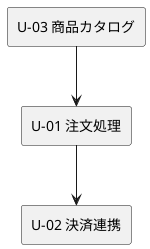
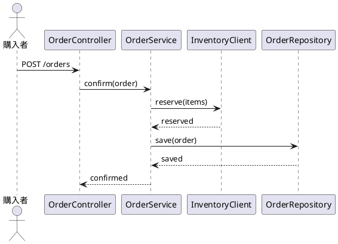

# AI-DLC 移行で作る成果物のテンプレート

移行ステップで作成する文書の骨格。各ガイドのテンプレートを移行用に抜粋したもので、詳細な説明は各ガイドを参照する。

## 目次

1. リスク台帳（`docs/requirements/<project>/risk_register.md`）
2. Unit 定義・依存 DAG・ストーリーマップ（`docs/requirements/<project>/units.md`）
3. ユーザーストーリー（AI-DLC 版の項目）
4. リリース計画への追記（`docs/development/<project>/release_plan.md`）
5. Bolt 計画（`docs/development/<project>/bolt_plan-N.md`）
6. 静的モデル・動的モデル（`docs/design/<project>/`）
7. ガードレール（各スキルの `PROJECT.md`）

---

## 1. リスク台帳

```markdown
# リスク台帳：<project>

## AI に渡せる範囲（In/Out）

| トピック | In | Out | AI に任せる | 備考 |
| :--- | :---: | :---: | :---: | :--- |
| ユーザー認証 | ✓ | | 設計と実装 | 認証方式の選択は人が承認（確認必須） |
| 決済処理 | | ✓ | — | 外部サービス。契約テストのみ AI が生成。本番キーは渡さない |
| 本番データ | | ✓ | — | AI には渡さない。テストはマスク済みデータで行う |

## 確認必須の操作

- 新規ファイル作成（計画に無いもの）
- アーキテクチャ・フォルダ構造の変更
- 外部 API・外部ライブラリの導入
- 認証・認可の実装
- スキーマ変更・マイグレーション
- デプロイ設定・環境変数・本番環境への操作

## リスク一覧

| ID | リスク | 組織台帳との対応 | 対策 | 承認ゲート |
| :--- | :--- | :--- | :--- | :--- |
| R-01 | 決済情報の取り扱い | SEC-03 | テスト用モックで実装 | 決済ステップは必ず人が検証 |
| R-02 | DB スキーマ変更 | CHG-01 | マイグレーションは人が確認してから適用 | スキーマ変更ステップで停止 |
```

---

## 2. Unit 定義・依存 DAG・ストーリーマップ

````markdown
# Unit 定義：<project>

## Unit 一覧

### U-01：注文処理

- **Intent**: <このユニットが寄与する Intent>
- **目的**: 購入者が商品を注文し、注文を確定できる
- **含まれるストーリー**: US-03 カートに追加する、US-04 配送先を入力する、US-06 注文を確定する
- **NFR**: 注文確定は 2 秒以内。同一注文の二重送信を防ぐ
- **リスク**: R-02（スキーマ変更）
- **測定基準**: 注文完了率、カート放棄率
- **推奨 Bolt**: Bolt 1（ウォーキングスケルトン：カート追加 → 注文確定を API から DB まで通す）、Bolt 2（配送先・確認メール）
- **エントロピー評価**: 意図 LOW／構造 MED／検証 LOW／リスク MED／仮定 LOW
- **AI の仮定**: 在庫引当は注文確定時に行う（要確認）

### U-02：決済連携
...

## 依存 DAG



並列に回せる Unit: U-03 完了後に U-01 と U-04（在庫管理）

## ストーリーマップ

| ユースケース | Unit | ストーリー | 受入条件の書式 |
| :--- | :--- | :--- | :--- |
| UC-001 商品を注文する | U-03 商品カタログ | US-01 商品を検索する | Given/When/Then |
| UC-001 商品を注文する | U-01 注文処理 | US-03 カートに追加する | Given/When/Then |
| UC-001 商品を注文する | U-02 決済連携 | US-05 支払い方法を選択する | 要書き直し |

未配置のストーリー: US-09（管理者向けレポート。Unit の追加を要判断）
````

---

## 3. ユーザーストーリー（AI-DLC 版の項目）

既存のストーリーに次の欄を加える。

```markdown
# US-03 カートに追加する

**Unit**: U-01 注文処理
**ユースケース**: UC-001

**として**: 購入者
**したい**: 商品をカートに追加する
**なぜなら**: まとめて注文したい

**受入条件**:

- [ ] Given 在庫が 10 個の商品 / When 3 個をカートに追加する / Then カートの数量が 3 になる
- [ ] Given 在庫が 2 個の商品 / When 3 個をカートに追加する / Then 在庫不足が通知され、カートは変わらない

**参照する成果物**:

- ドメインモデル: docs/design/<project>/domain_model.md
- 既存実装: apps/<project>/src/.../Order.java（同じ方式で実装する）
- ドメイン用語: docs/design/<project>/glossary.md

**確認ポイント**: カートテーブルの追加（スキーマ変更）

**AI の仮定**: カートはセッション単位ではなく購入者単位で永続化する（要確認）
```

---

## 4. リリース計画への追記

既存の `release_plan.md` に次の節を加える。ストーリーポイントの列は「参考」として残す。

```markdown
## Unit のエントロピー評価とテスト戦略

| Unit | 意図 | 構造 | 検証 | リスク | 仮定 | AI 自律度 | スコープ | 深さ | テスト戦略 |
| :--- | :---: | :---: | :---: | :---: | :---: | :--- | :--- | :--- | :--- |
| U-03 商品カタログ | LOW | LOW | LOW | LOW | LOW | 高 | 実装中心 | Standard | Standard |
| U-01 注文処理 | LOW | MED | LOW | MED | LOW | 中 | 全ステージ | Standard | Standard |
| U-02 決済連携 | MED | HIGH | MED | HIGH | MED | 低 | 全ステージ | Comprehensive | Comprehensive |

## Bolt の並び

| Bolt | Unit | ゴール | 確認したい仮説 | 並列 |
| :--- | :--- | :--- | :--- | :--- |
| 1 | U-03 | ウォーキングスケルトン：検索を API から DB まで通す | AI が生成するリポジトリの品質が十分か | — |
| 2 | U-01 | カート追加 → 注文確定 | 在庫引当のタイミング | Bolt 3 と並列 |
```

---

## 5. Bolt 計画

```markdown
# Bolt 3 計画：<project>

## Bolt ゴール
注文 Unit の「カートに商品を追加する」ストーリーを、API からデータベースまで通して動かす。
これで AI が生成するドメインモデルとリポジトリの品質がこのコードベースで十分かどうかが分かる。

## 対象
- Unit: U-01 注文処理
- ストーリー: US-03（受入条件 AC-01, AC-02）
- アプローチ: インサイドアウト
- ゲート密度: 各ステップでゲート（ウォーキングスケルトンの結果で見直す）

## ステップ計画（AI が作成、人が承認）
- [ ] 1. カート集約のドメインモデルを設計する
- [ ] 2. カートへの追加のテストを書く（Red）
- [ ] 3. カート追加を実装する（Green）
- [ ] 4. リファクタリングする
- [ ] 5. リポジトリのテストを書く（Red） ※スキーマ変更のため要確認
- [ ] 6. リポジトリを実装する（Green）

## AI の仮定
- 数量は値オブジェクトにする（要確認）

## 読み替え元
iteration_plan-3.md（deprecated、replaced_by: /development/<project>/bolt_plan-3.md）
```

---

## 6. 静的モデル・動的モデル（ブラウンフィールド）

```markdown
# 静的モデル：<project>

| コンポーネント | 責務 | 依存先 | 備考 |
| :--- | :--- | :--- | :--- |
| OrderService | 注文の確定と在庫引当の呼び出し | OrderRepository, InventoryClient | 在庫引当の失敗時に注文を破棄する分岐あり（業務ルール候補 BR-01） |
| OrderRepository | 注文の永続化 | JDBC | |

## 業務ルール候補（コードから抽出）

| ID | コード上の条件 | 業務ルールとしての解釈 | 状態 |
| :--- | :--- | :--- | :--- |
| BR-01 | `if (stock < qty) throw` | 在庫不足の注文は確定できない | 確認済み |
| BR-02 | `if (total > 100000) requireApproval()` | 10 万円超の注文は承認が要る | 要確認（現行業務に存在するか不明） |

## 使われていない経路
- `OrderService.reopen()`：呼び出し元なし。要確認
```

````markdown
# 動的モデル：<project>

## UC-001 商品を注文する


````

---

## 7. ガードレール（各スキルの `PROJECT.md`）

`developing-backend/PROJECT.md` の追記例。

```markdown
## AI-DLC の規律（本プロジェクト固有）

### TDD の三原則をプロンプトに明示する
AI は一度にたくさん書けるため、放っておくとテストを書かずに実装し、失敗を確認せずに進み、
テストが要求する以上の機能を先回りして実装する。ステップ計画を書かせるとき、
「テストを書き、失敗を確認してから最小限を実装する。先回りしない」を必ず含める。

### ステップ計画の置き場所
docs/development/<project>/bolt_plan-N.md。承認前に実装を始めない。

### 既存を参照させる
- 値オブジェクト: apps/<project>/src/main/java/.../domain/
- テストフィクスチャ: apps/<project>/src/test/java/.../fixture/
- 命名規則: テストは「<振る舞い>_<条件>_<期待結果>」の日本語名
AI は既存を探さず似た実装を作りやすい。新規に作る前に上記を参照させる。

### 確認必須の操作
risk_register.md の「確認必須の操作」に従う。該当ステップでは計画に注記し、実行前に停止する。

### 修正の反映先
人が AI の振る舞いを修正したら、全プロジェクト共通は CLAUDE.md、本プロジェクト固有はこのファイル、
特定 Unit の判断は bolt_plan の「AI の仮定」欄と docs/journal/ に書く。
```
