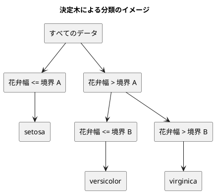

# 第 3 章: 決定木による分類と明白な実装

## 3.1 はじめに

第 1 章では「20 代ならきのこ派」というルールを人間が書き、第 2 章では欠損値を補完した特徴量を用意しました。この章では、「どの特徴量のどこで区切るか」をデータから自動で探すアルゴリズム、**決定木** を自作します。

自作したあとは、JVM の機械学習ライブラリ [Tribuo](https://tribuo.org/) の決定木（CART）に同じデータを学習させ、予測を突き合わせます。Clojure 版は [Java 版](../java/03-decision-tree-and-obvious-implementation.md)・[Scala 版](../scala/03-decision-tree-and-obvious-implementation.md) と同じ JVM・同じ Tribuo 4.3.2 を使い（[ADR 011](../../../adr/011-clojure-ml-libraries.md)）、第 2 章で見たとおり同じ乱数で分割したので、**Java 版・Scala 版と同じ数値が出るはず**です。それを確かめます。

Clojure 版では、次の 3 点に注目してください。

- 木を表す **判別共用体が無い**。葉も節もマップにして、鍵があるかどうかで見分ける。Scala 3 の `enum`・Rust の `enum` が与えてくれた**網羅性の検査は手に入りません**
- **同点のときにどちらを選ぶか**を、標準の関数に任せると取り違える。`max-key` は同値のとき後ろを返し、`frequencies` は順を保たない。いっぽう `sort-by` は安定
- Java 向けに作られた Tribuo の API（可変なオブジェクト・配列・型引数）を、Clojure の相互運用と**型ヒント**で呼ぶ

## 3.2 決定木の仕組み

### データを 2 つに分けることを繰り返す

決定木は、データを「ある特徴量がある値以下か、より大きいか」で 2 つに分けることを繰り返します。分けた先で同じラベルばかりになったら、そこで分けるのをやめて、そのラベルを予測に使います。



### どこで分けるかをジニ不純度で決める

「よい分け方」とは、分けた後のそれぞれのグループで、ラベルがなるべく 1 種類にそろう分け方です。そろい具合を数値にしたものが **ジニ不純度** です。

ジニ不純度 = 1 − Σ（各ラベルの割合）²

| グループのラベル | 割合 | ジニ不純度 |
|----------------|------|-----------|
| setosa ×3 | setosa 1.0 | 1 − 1.0² = 0 |
| setosa ×1、virginica ×1 | 0.5、0.5 | 1 − (0.5² + 0.5²) = 0.5 |
| 3 品種 ×1 ずつ | 1/3 ずつ | 1 − 3 × (1/3)² = 2/3 |

ラベルが 1 種類にそろうと 0、混ざるほど大きくなります。分け方の候補ごとに、分けた後の左右のジニ不純度を件数で重み付けして平均し、最も小さくなる分け方を選びます。

## 3.3 TODO リストの作成

**TODO リスト**:

- [ ] ジニ不純度を計算する
- [ ] いちばん多いラベルを返す
  - [ ] 同数なら先に現れたラベルを返す
- [ ] 最良の分割を探す
  - [ ] ラベルを完全に分けられる境界を見つける
  - [ ] 複数の特徴量から最良の特徴量と境界を選ぶ
  - [ ] ラベルが 1 種類なら分割しない
- [ ] 決定木を学習して予測する
- [ ] 木の深さを制限する
- [ ] 学習した木を読める形で表示する
- [ ] Tribuo の決定木と突き合わせる
- [ ] 実データで深さと正解率の関係を表示する

## 3.4 ジニ不純度を計算する

### 仮実装から始める

ラベルが 1 種類ならジニ不純度は 0 です。

```clojure
(deftest ジニ不純度
  (testing "一種類だけならジニ不純度は零になる"
    (is (< (abs (ch/gini ["setosa" "setosa"])) 1e-12))))
```

`ch/gini` がまだ無いので落ちます（Red）。**Clojure は動的型付けですが、未定義の var はコンパイル時に見つかります。** 第 1 章で見たとおり、名前の解決だけは静的なので、Red の見え方は `Unable to resolve symbol` です。

仮実装で `0.0` を返して Green にします。

### 三角測量

2 種類が半分ずつ、3 品種が 1 件ずつの場合を足します。

```clojure
  (testing "二種類が半々ならジニ不純度は零点五になる"
    (is (< (abs (- (ch/gini ["setosa" "virginica"]) 0.5)) 1e-12)))
  (testing "三種類が均等ならジニ不純度は三分の二になる"
    (is (< (abs (- (ch/gini ["setosa" "versicolor" "virginica"]) (/ 2.0 3))) 1e-12)))
```

3 つめの期待値に `(/ 2.0 3)` と書いているところが Clojure 特有です。**`(/ 2 3)` と書くと有理数 `2/3` になります。** Clojure は分数を正確に持てる言語なので、整数どうしの割り算は約分された有理数を返します。ここでは浮動小数点数と比べたいので、片方を `2.0` にして小数の割り算にしています。

`==` ではなく許容誤差付きで比べているのは、`2/3` が浮動小数点で正確に表せないからです。第 1 章の正解率、第 2 章の平均値と同じ扱いです。

### Green: 明白な実装

```clojure
(defn gini
  "ジニ不純度。ラベルが 1 種類なら 0 で、種類が多く均等なほど大きい。"
  [labels]
  (if (empty? labels)
    0.0
    (- 1.0 (reduce + (map (fn [[_ n]] (let [share (/ (double n) (count labels))] (* share share)))
                          (frequencies labels))))))
```

**`frequencies` が、ラベルごとの件数を数えます。** `(frequencies ["a" "b" "a"])` が `{"a" 2 "b" 1}` になる標準の関数で、Scala 版が `foldLeft` と `ListMap` で 6 行かけて書いたところが 1 語です。

`(fn [[_ n]] ...)` の引数に注目してください。マップを `map` でたどると `[鍵 値]` のベクタが順に渡るので、**引数の位置で分配束縛して**値だけを取り出しています。`_` は「使わない」の印です。

空のラベルで `0.0` を返す枝は、後で `best-split` から空のグループが渡りうるので置いています。`(/ (double n) 0)` が `NaN` になるのを避けるためで、テストでは直接確かめていません（分割の候補を作る過程で空にならないため）。

`(double n)` で明示的に小数にしています。これを忘れると `(/ 2 3)` が有理数になり、`(* share share)` が `4/9` になって、最終的に `1 - 4/9 = 5/9` という有理数が返ります。**値としては正しいのに型が違う**ので、`==` では通り `=` では落ちる、という分かりにくい失敗をします。Clojure で数値を扱うときの定番の注意点です。

## 3.5 いちばん多いラベルを返す

葉に置くラベルは、そこに残ったデータの多数決で決めます。

```clojure
(deftest いちばん多いラベル
  (testing "いちばん多いラベルを返す"
    (is (= "virginica" (ch/majority ["setosa" "virginica" "virginica"]))))
  (testing "同数なら先に現れたラベルを返す"
    (is (= "virginica" (ch/majority ["virginica" "setosa"])))))
```

2 つめが肝心です。**同数のときにどちらを選ぶかは、決めておかないと結果が揺れます。** Java 版・Scala 版は「先に現れたほう」と決めたので、そろえます。

### `max-key` は同値のとき後ろを返す

最初は `max-key` で書けると思いました。`(max-key f x y ...)` は `f` の値が最大になる引数を返す関数です。しかし、**同値のときにどちらを返すかを確かめると、こうなります**。

```clojure
(println "max-key =" (max-key {"setosa" 1 "virginica" 1} "setosa" "virginica"))
(println "max-key 逆 =" (max-key {"setosa" 1 "virginica" 1} "virginica" "setosa"))
```

```text
max-key = virginica
max-key 逆 = setosa
```

**どちらの場合も、後ろの引数が返ります。** `max-key` は `>` ではなく `<` で畳む（「今までの最大より小さくなければ更新する」）ので、同値でも更新されるためです。`min-key` は逆に前を返します。これは「最初の最大値を返す」ことを期待していると必ず取り違えるところで、Scala 版の `maxBy`（最初を返す）と振る舞いが違います。

### `frequencies` は順を保たない

もう 1 つ、`frequencies` の戻り値をそのままたどるのも危険です。

```clojure
(println "frequencies の順 =" (pr-str (keys (frequencies ["virginica" "setosa" "virginica"]))))
```

```text
frequencies の順 = ("virginica" "setosa")
```

この例では挿入順に見えますが、**保証されていません**。`frequencies` は `transient` の空マップから作るので、鍵が 8 個までは配列マップ（挿入順）、超えるとハッシュマップ（並びは不定）になります。アヤメの品種は 3 つなので偶然たまたま挿入順ですが、**そこに頼った実装は、ラベルの種類が増えた瞬間に壊れます**。第 2 章の最後で触れた「マップの鍵の並びに頼らない」がここでも効きます。

### Green: 2 つの落とし穴を避けて書く

```clojure
(defn majority
  "いちばん多いラベルを返す。同数なら先に現れたほうを選ぶ。
   frequencies は順を保たないので、最初に現れた順（distinct）でたどり、厳密な不等号で比べる。"
  [labels]
  (let [counts (frequencies labels)]
    (reduce (fn [best label] (if (> (counts label) (counts best)) label best))
            (distinct labels))))
```

2 つの落とし穴に、2 つの手当てが対応しています。

- **たどる順は `(distinct labels)`** — 元の並びのまま重複を落とすので、「先に現れた順」がそのまま得られます。`frequencies` は件数を引く辞書としてだけ使います
- **比較は厳密な `>`** — 同数なら `best` を更新しないので、先に現れたほうが残ります。`max-key` を使っていたら後ろが残っていました

`(counts label)` と、マップを関数として呼んでいます。**Clojure のマップは自分自身が関数**で、鍵を渡すと値が返ります。キーワードが関数であること（第 1 章）と対になる性質で、`(get counts label)` より短く書けます。

docstring に理由を 2 行書いたのは、**この関数が「なぜこう書いてあるか」だけでできている**からです。素直に書けば `(key (apply max-key val counts))` の 1 行で済むのに、そうしていない理由がコードからは読めません。

## 3.6 最良の分割を探す

### 分割をマップで表す

分割は「どの列の、どの値で区切るか、そのときの不純度はいくつか」の 3 つ組です。

```clojure
{:feature :花弁幅 :threshold 0.75 :impurity 0.0}
```

Scala 版は `case class Split(feature, threshold, impurity)` を宣言しました。Clojure 版はここもマップです。

### テスト

```clojure
(defn- column [value] {:花弁幅 value})

(def ^:private three-species
  [(mapv column [0.2 0.3 1.2 1.4 2.0 2.2])
   ["setosa" "setosa" "versicolor" "versicolor" "virginica" "virginica"]])

(deftest 分割の選び方
  (testing "分けられないときは分割を返さない"
    (is (nil? (ch/best-split [(column 0.2) (column 0.3)] ["setosa" "setosa"] [:花弁幅]))))
  (testing "不純度がいちばん小さくなる分割を選ぶ"
    (let [[x t] three-species
          split (ch/best-split x t [:花弁幅])]
      (is (= :花弁幅 (:feature split)))
      (is (< (abs (- (:threshold split) 0.75)) 1e-12)))))
```

`three-species` は、花弁幅だけを持つ 6 件のフィクスチャです。0.2・0.3 が setosa、1.2・1.4 が versicolor、2.0・2.2 が virginica なので、**0.3 と 1.2 の中点 0.75 で切れば setosa が完全に分かれます**。

**フィクスチャがただのベクタなので、`def` でトップレベルに置けます。** 型を宣言していないぶん、テストの準備がこれだけ短くなります。`column` という 1 行のヘルパーを足しただけで、6 件のデータが `(mapv column [0.2 0.3 ...])` で作れます。

「分けられないときは `nil`」もここで決めています。Scala 版は `Option[Split]` の `None`、Rust 版は `Option`。Clojure は第 2 章と同じく `nil` です。

### 期待値は 0.75 だが、実装は 0.7500...

`(:threshold split)` を `0.75` と厳密に比べず、許容誤差にしているのは慎重さのためです。`(0.3 + 1.2) / 2.0` は 2 進数で正確に表せる値なので実際には `= 0.75` でも通りますが、**境界の値が正確に表せるかどうかはデータ次第**なので、最初から誤差込みで書いています。実データの境界（0.2950）は正確に表せません。

### Green: 候補を列挙して選ぶ

分割の探索は、2 つの関数に分けました。

```clojure
(defn- weighted-gini
  "左右の不純度の重み付き平均。"
  [left right]
  (/ (+ (* (count left) (gini left)) (* (count right) (gini right)))
     (+ (count left) (count right))))

(defn- candidates
  "1 つの列で、隣り合う値の中点を境界にした分割の候補をすべて返す。
   sort-by は安定なので、同じ値の並びは元の順のまま。"
  [x t feature]
  (let [sorted (sort-by first (map (fn [features label] [(get features feature) label]) x t))
        values (mapv first sorted)
        labels (mapv second sorted)]
    (keep (fn [i]
            (when-not (== (values (dec i)) (values i))
              {:feature feature
               :threshold (/ (+ (values (dec i)) (values i)) 2.0)
               :impurity (weighted-gini (subvec labels 0 i) (subvec labels i))}))
          (range 1 (count sorted)))))
```

`candidates` に、第 2 章までの道具が集まっています。

- **`(map (fn [features label] ...) x t)`** — 第 2 章の `(mapv vector x t)` と同じく、2 つのコレクションを同時にたどります
- **`sort-by first`** — 値で並べ替えます。**`sort-by` は安定**（同じ値の要素の相対順が変わらない）なので、同じ値の行の並びは元のままです。これは仕様として保証されていて、`majority` の「先に現れたほう」と合わせて、**同点のときの振る舞いが決まります**
- **`keep` + `when-not`** — 第 2 章の `column-means` と同じ形です。隣り合う値が同じなら境界を作れないので、`when-not` が `nil` を返し、`keep` がそれを落とします。「候補を作りつつ、作れないものは飛ばす」が 1 つの式になります
- **`subvec`** — ベクタの一部を、**中身を写さずに**見る関数です。`(subvec labels 0 i)` は元のベクタを参照するだけなので、候補ごとに配列を作り直しません。`values` と `labels` を `mapv` でベクタにしておいたのは、`subvec` と添字アクセス（`(values i)`）を使うためです

`(values i)` と、ベクタを関数として呼んでいます。マップと同じく**ベクタも関数**で、添字を渡すと要素が返ります。

```clojure
(defn best-split
  "左右の不純度の重み付き平均が最も小さくなる分割を返す。分けられなければ nil。
   同じ不純度なら先に見つけた（列の順で前の）分割を選ぶ。"
  [x t columns]
  (when-not (or (empty? x) (zero? (gini t)))
    (let [all (mapcat #(candidates x t %) columns)]
      (when (seq all)
        (reduce (fn [best candidate]
                  (if (< (:impurity candidate) (:impurity best)) candidate best))
                all)))))
```

`mapcat` が、列ごとの候補を 1 本につなぎます。`columns` の順にたどるので、**先に来るのは列の順で前の特徴量の候補**です。そして `reduce` の比較は厳密な `<` なので、同じ不純度なら先に見つけたものが残ります。`majority` とまったく同じ手当てで、理由も同じです。

`when-not` と `when` が二重になっているのは、「分けられない」の理由が 2 通りあるからです。データが空か、ラベルが 1 種類か（`(zero? (gini t))`）。どちらも `nil` を返し、呼ぶ側は `nil` か分割かだけを見ます。

## 3.7 決定木を学習して予測する

### 木をどう表すか

ここが Clojure でいちばん悩むところです。決定木は「葉か、節か」のどちらかで、ほかの形は無い——という構造を、Clojure では**表せません**。

| 言語 | 木の表し方 | 網羅性の検査 |
|------|-----------|------------|
| Scala 3 | `enum Tree: case Leaf(...); case Node(...)` | `match` をコンパイラが検査（`-Xfatal-warnings` で強制） |
| Rust | `enum Tree { Leaf(...), Node(...) }` | `match` をコンパイラが検査（必須） |
| Java | sealed interface + 2 つの record | `switch` 式をコンパイラが検査 |
| **Clojure** | **マップ 2 種（`{:label ...}` と `{:split ... :left ... :right ...}`）** | **無い** |

選んだ形はこうです。

```clojure
;; 木は葉か節のどちらかで、どちらもマップで表す。
;; 葉は {:label "setosa"}、節は {:split ... :left ... :right ...}。
;; Clojure には判別共用体が無いので、鍵があるかどうかで見分ける（網羅性は検査されない）。

(defn leaf? "葉かどうかを返す。" [tree] (contains? tree :label))
(defn node? "節かどうかを返す。" [tree] (contains? tree :split))
```

**`:label` があれば葉、`:split` があれば節**という取り決めです。`defrecord` でレコード型を 2 つ作って `satisfies?` で見分ける手もありますが、その場合も「2 つしか無い」ことは検査されないので、得るものは型名だけです。素のマップのままにして、**見分ける述語に名前を付ける**ほうを選びました。

失うものははっきりしています。

- **場合分けを書き忘れても、コンパイラは何も言いません。** Scala 版は `case` を 1 つ消すと `match may not be exhaustive` が出ます。Clojure では `(if (leaf? tree) ... ...)` の `else` が正しいかどうか、人が保証します
- **第 3 の形が混ざっても気づけません。** `{:label "x" :split ...}` のようなマップを作ってしまっても、`leaf?` が先に真になるだけです

得るものもあります。**木がただのデータなので、`=` でそのまま比べられ、`println` でそのまま読め、`assoc` で一部を差し替えられます。** 後で出てくる `format-tree` のテストが、木を組み立て直さずに書けているのはそのおかげです。

### 学習

```clojure
(defn fit
  "深さの上限まで分割を繰り返して木を作る。max-depth が nil なら上限なし。"
  [x t columns max-depth]
  (let [split (when-not (and max-depth (zero? max-depth)) (best-split x t columns))]
    (if (nil? split)
      {:label (majority t)}
      (let [pairs (map vector x t)
            [left right] [(filter #(goes-left? split (first %)) pairs)
                          (remove #(goes-left? split (first %)) pairs)]
            next-depth (when max-depth (dec max-depth))]
        {:split split
         :left (fit (mapv first left) (mapv second left) columns next-depth)
         :right (fit (mapv first right) (mapv second right) columns next-depth)}))))
```

**「分割が見つからなければ葉」が、すべての終了条件をまとめています。** ラベルが 1 種類でも、深さの上限に達しても、分けられる境界が無くても、`split` は `nil` になります。`best-split` が 3 つの場合をすべて `nil` に写しているので、`fit` 側の場合分けは 1 つで済みました。

深さの上限は `nil`（上限なし）か数値で表します。`(when-not (and max-depth (zero? max-depth)) ...)` は「上限があり、それが 0 なら分割しない」。`(when max-depth (dec max-depth))` は「上限があれば 1 減らす、なければ `nil` のまま」。**`nil` を「無い」として扱う関数が並んでいるので、`Option` の `map` に当たる処理が `when` で書けています。**

`filter` と `remove` を 2 回に分けているのは読みやすさのためです。`(group-by ...)` や `split-with` でも書けますが、「左へ行くもの」「行かないもの」がそのまま 2 行に並ぶほうが、アルゴリズムとの対応が見えます。

### 予測

```clojure
(defn predict-one
  "木をたどって 1 件のラベルを予測する。"
  [tree features]
  (if (leaf? tree)
    (:label tree)
    (recur (if (goes-left? (:split tree) features) (:left tree) (:right tree)) features)))
```

**`recur` が末尾呼び出しです。** JVM には末尾呼び出しの最適化が無いので、Clojure は `recur` という専用の形を用意して「ここは自分を呼び直すだけ」と明示させます。`(predict-one ... ...)` と書いても動きますが、木が深いとスタックが尽きます。

`recur` には検査が付いていて、**末尾でない位置に書くとコンパイルエラー**になります。「再帰のつもりが末尾でなかった」という誤りだけは、静的に防げます。

`fit` のほうは `recur` にできません。左右の 2 回呼ぶので、片方は末尾になりようがないからです。木の深さはデータの件数までなので、実用上は問題になりません。

```clojure
(deftest 決定木の学習と予測
  (testing "深さを制限しなければ訓練データを全部当てる"
    (let [[x t] three-species]
      (is (= t (ch/predict (ch/fit x t [:花弁幅] nil) x)))))
  (testing "深さ一なら二つの葉になる"
    (let [[x t] three-species
          tree (ch/fit x t [:花弁幅] 1)]
      (is (ch/node? tree))
      (is (ch/leaf? (:left tree)))
      (is (ch/leaf? (:right tree))))))
```

2 つめのテストが、**木がただのデータであることの見返り**です。`(:left tree)` で部分木をそのまま取り出して、`leaf?` を当てられます。アクセサも訪問者パターンも要りません。

## 3.8 学習した木を表示する

```clojure
(defn format-tree
  "木を字下げ付きの文字列にする。"
  ([tree] (format-tree tree ""))
  ([tree indent]
   (if (leaf? tree)
     (str indent (:label tree) "\n")
     (let [{:keys [feature threshold]} (:split tree)
           border (format "%.4f" threshold)]
       (str indent (name feature) " <= " border "\n" (format-tree (:left tree) (str indent "  "))
            indent (name feature) " > " border "\n" (format-tree (:right tree) (str indent "  ")))))))
```

第 1 章の `dataset/dir` と同じ**多アリティ**で、字下げの初期値を与えています。既定引数の無い言語で既定引数を書く、Clojure の定型です。

```clojure
(testing "木を字下げ付きの文字列にする"
  (let [[x t] three-species]
    (is (= "花弁幅 <= 0.7500\n  setosa\n花弁幅 > 0.7500\n  versicolor\n"
           (ch/format-tree (ch/fit x t [:花弁幅] 1))))))
```

**期待値を 1 つの文字列リテラルで書いています。** 表示は「読める形にする」ことが目的なので、行に分けて組み立てるより、出てくるものをそのまま書いたほうが変化に気づけます。

`(format "%.4f" threshold)` は `String/format` の包みです。ロケールを渡していないので既定のロケールが使われますが、`%.4f` の小数点はどのロケールでも `.` になる——とは限りません（ドイツ語圏なら `,`）。Java 版・Scala 版は `Locale.ROOT` を明示しています。Clojure 版は `clojure.core/format` が `String/format` をロケールなしで呼ぶため、**環境によっては出力が変わりえます**。テストが固定しているので気づけますが、移植性を重んじるなら `(String/format java.util.Locale/ROOT "%.4f" ...)` と書くべきところです。

## 3.9 Tribuo の決定木と突き合わせる

### なぜ Tribuo なのか

Clojure の機械学習ライブラリには `scicloj.ml`・`tech.ml.dataset` といった選択肢があります。当初は Java 版の初期と同じく [Smile](https://haifengl.github.io/) を第一候補にしていましたが、調べたところ **Smile 3.1.1 のライセンスが GPL-3.0** でした。本シリーズのリポジトリは公開なので、GPL の伝播を考えずに依存に入れるわけにはいきません。

そこで、Java 版・Kotlin 版・Scala 版がすでに使っている **Tribuo 4.3.2**（Apache-2.0、Oracle Labs）に合わせました。この判断は [ADR 011](../../../adr/011-clojure-ml-libraries.md) に記録しています。結果として、**同じ JVM・同じライブラリ・同じ乱数**という 3 つがそろい、Java 版・Scala 版との突き合わせが意味を持つ形になりました。「ライセンスの制約から入った選択が、比較可能性という別の価値を生んだ」ことになります。

### Tribuo のデータセットに変換する

```clojure
(def ^:private label-factory
  "Tribuo のラベルの作り方。"
  (LabelFactory.))

(def ^:private min-child-weight
  "子の節に必要な事例の重みの最小値。1 にすると、自作の木と同じく 1 件になるまで分けられる。"
  1.0)

(defn- to-example
  "特徴量とラベルを Tribuo の事例にする。列名は文字列の配列で渡す。"
  ^Example [features columns ^Label label]
  (ArrayExample. label
                 ^"[Ljava.lang.String;" (into-array String (map name columns))
                 (double-array (map #(get features %) columns))))
```

短い関数ですが、Clojure から Java を呼ぶときの要点が詰まっています。

- **`^Example` が戻り値の型ヒント**、`^Label` が引数の型ヒントです。Clojure は型を宣言しませんが、**曖昧なオーバーロードを選び分けるためのヒント**は書けます。`ArrayExample` には引数の数と型が同じくらい似た多重定義が並んでいるので、ヒントが無いと実行時にリフレクションで解決され、遅いうえに選択を誤りえます
- **`^"[Ljava.lang.String;"` が、いちばん見慣れない書き方**でしょう。`String` の配列を表す JVM 内部の型名です。`^String[]` のような書き方が Clojure には無いので、JVM の記法をそのまま文字列で書きます。`[L` が「参照型の配列」、続くのがクラス名、末尾のセミコロンまでが 1 つの型名です
- **`(into-array String ...)`・`(double-array ...)`** で、Clojure のシーケンスを Java の配列にします。Scala 版の `toArray` に当たります。毎回新しい配列を作るので、Tribuo に渡した後に書き換えられても手元のマップは無事です
- **`(map name columns)`** — 列名はキーワード（`:がく片幅`）なので、Tribuo に渡す前に文字列に直します。第 2 章で列名をキーワードにした代金を、ここで払っています

```clojure
(defn- to-dataset
  "特徴量と正解ラベルを Tribuo のデータセットにする。"
  [x t columns]
  (let [examples (mapv (fn [features label] (to-example features columns (Label. label))) x t)
        provenance (SimpleDataSourceProvenance. "features" label-factory)]
    (MutableDataset. (ListDataSource. examples label-factory ^Provenance provenance))))
```

`ListDataSource` は Java の `List` を受け取りますが、**Clojure のベクタは `java.util.List` を実装している**ので、変換は要りません。Scala 版が `asJava` を書いたところが不要です。Clojure のコレクションが Java のインターフェースを満たすように作られていることの、分かりやすい見返りです。

`^Provenance` のヒントは、`ListDataSource` のコンストラクタが `DataSourceProvenance` と `Provenance` の両方を取る形を持つために必要でした。ここも「どの多重定義を呼ぶか」の問題です。

`SimpleDataSourceProvenance` が要るのは、Tribuo が **モデルにデータの出どころを記録する**設計だからです。どのデータをどの設定で学習したかがモデル自身に残ります。Java 版・Scala 版と同じ扱いです。

### 学習と予測

```clojure
(defn tribuo-predict
  "Tribuo の CART（ジニ不純度）で学習して予測する。深さは max-depth（nil なら上限なし）。"
  [x-train t-train x-test columns max-depth]
  (let [trainer (CARTClassificationTrainer. (int (or max-depth Integer/MAX_VALUE))
                                            (float min-child-weight) (float 0.0) (float 1.0)
                                            (GiniIndex.) 0)
        model (.train trainer (to-dataset x-train t-train columns))]
    (mapv (fn [features]
            (.getLabel (.getOutput (.predict model (to-example features columns LabelFactory/UNKNOWN_LABEL)))))
          x-test)))
```

`(or max-depth Integer/MAX_VALUE)` が、2 つの「上限なし」の約束をつなぎます。自作の木は `nil`、Tribuo は `Integer/MAX_VALUE`。`or` が短絡するので 1 つの式で済みました（第 2 章の `get` の話とは違い、`or` はマクロなので安全です）。

`(int ...)`・`(float ...)` の変換は必須です。Clojure の数値は既定で `long`／`double` なので、`int`／`float` を取るコンストラクタには明示的に落とす必要があります。忘れると `ClassCastException` か、リフレクションでの解決失敗になります。**「数値の型を書かなくていい」言語が、Java の API の前では書かされる**場面です。

`CARTClassificationTrainer` の引数は Java 版・Scala 版と同じです。

| 引数 | 渡した値 | 意味 |
|------|---------|------|
| maxDepth | 呼び出し側で指定 | 木の深さの上限。制限なしは `Integer/MAX_VALUE` |
| minChildWeight | `1.0` | 件数（重み）がこの値に満たない節は分割しない |
| minImpurityDecrease | `0.0` | 分割に必要な不純度の減少量の下限 |
| fractionFeaturesInSplit | `1.0` | 分割ごとに調べる特徴量の割合。1.0 ですべて調べる |
| impurity | `(GiniIndex.)` | ジニ不純度で分割を選ぶ |
| seed | `0` | 乱数のシード |

**`minChildWeight` の既定値は 5** で、件数が 5 未満の節は分割しません。自作の決定木は 1 件になるまで分け切るので、突き合わせでは `1.0` にして条件をそろえます。ここをそろえないと、深いところで木の形が変わります。

予測のときは、ラベルの分からない事例に `LabelFactory/UNKNOWN_LABEL` を渡します。Tribuo の事例は必ずラベルを持つ設計なので、「まだ分からない」を表す特別なラベルが用意されています。

### 同点のときの選び方

Kotlin 版では、iris で予測を比べたところ深さ 3 以上で 1 件だけ一致せず、その原因が 2 つの「同点」の扱いの違いだと突き止めました（[ADR 002](../../../adr/002-kotlin-ml-libraries.md)）。

- **葉の多数決が同数のとき**: 自作の `majority` は先に現れたラベルを返すので、ラベルの並び順で予測が変わります。Tribuo は並び順に依存しません
- **同じ不純度の分割候補が複数あるとき**: 自作の `best-split` は列の順で先の特徴量を選び、Tribuo は特徴量名の順で先のものを選びます

どちらも「どちらを選んでも不純度は同じ」場面での選び方の違いで、どちらかが間違っているわけではありません。Clojure から呼んでも同じ Tribuo なので、この振る舞いは変わりません。Clojure 版では、この 2 つの学習用テストを持たず、Java 版・Kotlin 版で確かめた結果を引き継いでいます。

ただし、3.5 節で見たとおり **Clojure では「先に現れたほう」を保つこと自体に手当てが要りました**。`max-key` に任せていたら後ろが選ばれ、`frequencies` の順にたどっていたら不定になります。同点の扱いをそろえる前に、同点の扱いを決めきる必要があった、ということです。

### 実データで突き合わせる

```clojure
(deftest 自作とTribuoの予測はどの深さでも一致する
  ;; java.util.Random と同じ手順で分けているので、Java 版・Scala 版とも同じ結果になる
  (when-let [split (iris-split)]
    (doseq [max-depth [1 2 3 4 5 nil]]
      (let [ours (ch/predict (ch/fit (:x-train split) (:t-train split) (columns split) max-depth)
                             (:x-test split))
            theirs (ch/tribuo-predict (:x-train split) (:t-train split) (:x-test split)
                                      (columns split) max-depth)]
        (is (= ours theirs) (str "深さ " max-depth))))))
```

**深さ 1〜5 と制限なしのどれでも、テストデータ 45 件の予測が Tribuo と全件一致**しました。Java 版・Scala 版と同じ結果です。

`clojure.test` にはパラメータ化テストの仕組みが無いので、`doseq` で回しています。`is` の 2 つ目の引数に深さを渡しているので、失敗したときにどの深さかが分かります。Scala 版が `foreach` で回したのと同じやり方です。

Kotlin 版は深さ 3 以上で 1 件ずつ一致しませんでしたが、これは Tribuo の振る舞いが変わったからではありません。第 2 章で見たとおり、Clojure 版は Java 版・Scala 版と同じ `java.util.Random` で分けるので、訓練データとテストデータに入る行が Kotlin 版と違います。この分割では、テストデータの予測が「多数決が同数の葉」や「同じ不純度の分割候補の違いで進む先が変わる行」に当たらなかった、ということです。

正解率と木の形も固定しました。

```clojure
(deftest 深さ二の決定木はテストデータの四十五件中四十三件を正しく分類する
  (when-let [split (iris-split)]
    (let [tree (ch/fit (:x-train split) (:t-train split) (columns split) 2)
          predictions (ch/predict tree (:x-test split))]
      (is (< (abs (- (chapter01/accuracy predictions (:t-test split)) (/ 43.0 45))) 1e-12)))))

(deftest 深さ二の決定木は花弁幅で三種類に分かれる
  (when-let [split (iris-split)]
    (is (= (str "花弁幅 <= 0.2950\n  Iris-setosa\n"
                "花弁幅 > 0.2950\n  花弁幅 <= 0.6500\n    Iris-versicolor\n"
                "  花弁幅 > 0.6500\n    Iris-virginica\n")
           (ch/format-tree (ch/fit (:x-train split) (:t-train split) (columns split) 2))))))
```

正解率の計算に、第 1 章の `chapter01/accuracy` をそのまま使っています。第 1 章はきのこ派・たけのこ派、この章はアヤメの品種ですが、**「予測と正解のベクタを受け取って一致率を返す」という形は同じ**なので、型を宣言していないぶん、そのまま再利用できます。

`columns` は分割の結果から取り出しています。

```clojure
(defn- columns [split] (vec (keys (first (:x-train split)))))
```

第 2 章の最後で触れた「マップの鍵の並びは 8 個までなら挿入順」に、ここで頼っています。**特徴量は 4 列なので配列マップになり、`fill-missing` が `columns` の順に組み立てた並びがそのまま出ます。** ただし列が 9 つ以上になれば崩れるので、堅くするなら `:columns` を分割の結果にも持ち回すべきところです。この章では列が 4 つに固定されているので、そのままにしました。**「今は動くが、条件が変わると崩れる」ことを自覚して残している**箇所です。

## 3.10 実データで深さと正解率を表示する

```clojure
(def ^:private max-depths
  "正解率を比べる深さ。nil は制限なし。"
  [1 2 3 4 5 nil])

(defn- score
  "正解率を小数 4 桁の文字列にする。"
  [predictions labels]
  (format "%.4f" (chapter01/accuracy predictions labels)))

(defn- accuracy-row
  "自作と Tribuo で学習し、正解率を 1 行にする。"
  [max-depth split columns]
  (let [tree (fit (:x-train split) (:t-train split) columns max-depth)
        tribuo (tribuo-predict (:x-train split) (:t-train split) (:x-test split) columns max-depth)]
    (str/join "\t" [(or max-depth "制限なし")
                    (score (predict tree (:x-train split)) (:t-train split))
                    (score (predict tree (:x-test split)) (:t-test split))
                    (score tribuo (:t-test split))])))

(defn run
  "深さごとの正解率と、深さ 2 の決定木を表示する。"
  []
  (let [split (chapter02/prepare-iris (str (dataset/dir) "/iris.csv") 0.3 0)
        columns (vec (keys (first (:x-train split))))]
    (println "深さ\t訓練データ\tテストデータ\tTribuo")
    (doseq [max-depth max-depths]
      (println (accuracy-row max-depth split columns)))
    (println)
    (println "深さ 2 の決定木:")
    (print (format-tree (fit (:x-train split) (:t-train split) columns 2)))))
```

`(or max-depth "制限なし")` がここでも効いています。**深さの並び `[1 2 3 4 5 nil]` に「制限なし」を混ぜたまま**、表示のときだけ文字列に差し替えられます。Scala 版は `MaxDepths` のループと「制限なし」の行を別に書いていました。`nil` が値として自由に混ざる言語ならではの短さです。

`(str/join "\t" [...])` で 4 つの欄を並べます。Tribuo の正解率まで同じ表に出しているのは、**自作と一致していることが実行しただけで見える**ようにするためです。

実行します。

```text
$ clojure -M:run chapter03
深さ	訓練データ	テストデータ	Tribuo
1	0.6762	0.6444	0.6444
2	0.9333	0.9556	0.9556
3	0.9524	0.9556	0.9556
4	0.9619	0.9556	0.9556
5	0.9810	0.9333	0.9333
制限なし	1.0000	0.9333	0.9333

深さ 2 の決定木:
花弁幅 <= 0.2950
  Iris-setosa
花弁幅 > 0.2950
  花弁幅 <= 0.6500
    Iris-versicolor
  花弁幅 > 0.6500
    Iris-virginica
```

**3 列目と 4 列目が、どの深さでも同じ値です。** 自作の決定木と Tribuo の CART が、テストデータ 45 件について同じ予測を返しています。

そして **この表は Java 版・Scala 版とまったく同じ数値**です。第 2 章で乱数と手順をそろえた効果が、章をまたいで確かめられました。

表そのものも読みどころです。

- **深さ 1 では 0.6444** — 1 回しか分けられないので、3 品種を 2 つにしか分けられません
- **深さ 2 で 0.9556** — 花弁幅だけを 2 回使って、3 品種をほぼ分け切っています
- **訓練データの正解率は深さとともに上がり続け、制限なしで 1.0000** — 訓練データを完全に覚えました
- **テストデータの正解率は深さ 5 から下がる（0.9556 → 0.9333）** — これが **過学習** です。訓練データに合わせすぎて、見ていないデータに弱くなりました

「訓練データで 100% 当たる」ことが良いことではない、というのがこの表の教えです。第 1 章で「学習に使ったデータで性能を測ってはいけない」と書いた理由が、数字として出ています。

木の中身も読めます。**花弁幅だけで 3 品種がほぼ分かれています。** 0.2950 以下なら `Iris-setosa`、0.6500 より大きければ `Iris-virginica`。これは第 2 章の散布図で人が見つけられる傾向と同じで、**決定木はそれを自動で見つけた**ことになります。境界の値（0.2950・0.6500）が第 2 章で標準化していない生の値に見えないのは、iris.csv の値が 0〜1 に収まる形で配布されているためです。

## 3.11 可視化について

Clojure 版には Notebook の節を設けません。深さと正解率の折れ線グラフや、Tribuo の `getTopFeatures`（特徴量が分割に使われた回数）は [Kotlin 版の第 3 章](../kotlin/03-decision-tree-and-obvious-implementation.md) の「Notebook で探索する」の節を、scikit-learn による木の図は [Python 版の第 3 章](../python/03-decision-tree-and-obvious-implementation.md) を参照してください。Clojure 版で深さと正解率の関係を見るには、3.10 節の表と `format-tree` の出力が同じ役割を果たします。

## 3.12 まとめ

この章では、決定木を自作し、Tribuo の決定木と予測を突き合わせました。Clojure に固有の論点は次のとおりです。

1. **判別共用体が無いので、木もマップ** — 葉は `{:label ...}`、節は `{:split ... :left ... :right ...}`。`leaf?`／`node?` で見分ける。**網羅性は検査されない**ので、場合分けの漏れは人が保証する。見返りは、木がただのデータなので `=` で比べられ、部分木をそのまま取り出せること
2. **同点のときの選び方を、標準の関数に任せない** — `max-key` は同値のとき**後ろ**を返す（`<` で畳むため）。`frequencies` は鍵が 8 個を超えると順を保たない。`distinct` の順でたどり、厳密な `>` で畳むことで「先に現れたほう」を守った。いっぽう `sort-by` は安定なので、そこは任せられる
3. **数値の型を自分で落とす** — `(double n)` を忘れると有理数になり、`(int ...)`・`(float ...)` を忘れると Java の API に渡らない。型を書かない言語が、Java の前では書かされる
4. **型ヒントで多重定義を選ぶ** — `^Example`・`^Label`・`^Provenance`、そして `^"[Ljava.lang.String;"`。型宣言ではなく「どのメソッドを呼ぶか」を決めるための注釈として要る
5. **Clojure のベクタはそのまま `java.util.List`** — Scala 版が `asJava` を書いたところが不要。いっぽう配列は `into-array`・`double-array` で作る
6. **`nil` が値として混ざれる** — 深さの上限なしを `nil` で表し、`[1 2 3 4 5 nil]` と並べたまま `(or max-depth "制限なし")` で表示だけ差し替えた。`recur` で末尾再帰を明示する必要があることと合わせて、Clojure の書き味が出た部分
7. **Java 版・Scala 版と完全に一致した** — 深さごとの正解率も、深さ 2 の木の境界（0.2950・0.6500）も、Tribuo との全件一致も同じ。GPL の Smile を避けて Tribuo を選んだ判断（[ADR 011](../../../adr/011-clojure-ml-libraries.md)）が、比較可能性という別の価値を生んだ

**TODO リスト（この章の完了時点）**:

- [x] ジニ不純度を計算する
- [x] いちばん多いラベルを返す
- [x] 最良の分割を探す
- [x] 決定木を学習して予測する
- [x] 木の深さを制限する
- [x] 学習した木を読める形で表示する
- [x] Tribuo の決定木と突き合わせる
- [x] 実データで深さと正解率の関係を表示する

深さ 2 の決定木の正解率は 45 件中 43 件（0.9556）で、テストデータの正解率は深さ 5 から下がり始めました。次の章では、ここまでのコードとデータをどう管理するか（バージョン管理とデータ管理）を扱います。
