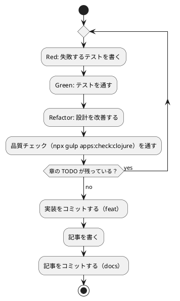

# 第 4 章: バージョン管理とデータ管理

## 4.1 はじめに

第 1 部では、TDD でデータを読み込み、前処理し、決定木で分類するプログラムを Clojure で作りました。第 2 部では、そのプログラムを「変更を楽に安全にできる」状態に保つための道具立てを、バージョン管理（第 4 章）、パッケージ管理と静的解析（第 5 章）、タスクランナーと CI/CD（第 6 章）の順に整えます。

この章ではバージョン管理を扱います。機械学習のプロジェクトでは、コードに加えて **学習データ** と **学習済みモデル** というファイルが登場します。これらをコードと同じようにコミットしてよいとは限りません。この章では、Git で何を管理し、何を管理しないか、そして実験の結果を再現できるようにするには何を固定すればよいかを学びます。

Git の使い方は言語に依存しないので、[Python 版の第 4 章](../python/04-version-control-and-data-management.md)・[Scala 版の第 4 章](../scala/04-version-control-and-data-management.md) と同じ構成で進めます。Clojure 版で注目するのは次の 3 点です。

- **Clojure CLI が作るファイル** を除外する。sbt の `target/` や Gradle の `build/` に当たるものが、Clojure では `.cpcache/`（クラスパスのキャッシュ）という見慣れない名前で増える
- **`clojure.test` にはテストをスキップする仕組みが無い**。JUnit の `assumeTrue`、ScalaTest の `assume`、RSpec の `skip` に当たるものが標準では無いので、実データのテストの守り方を自分で決める必要がある
- **乱数は JVM の `java.util.Random`**。第 2 章で Java 版・Scala 版と同じ乱数・同じ手順（Fisher-Yates）にそろえたので、再現性の話は Java 版・Scala 版とまったく同じ土俵になる

## 4.2 コミットメッセージの重要性

コミット履歴は「なぜこの変更をしたのか」の記録です。機械学習のプロジェクトでは、「前処理を変えたら正解率が変わった」「ライブラリと予測が一致しない原因をテストに残した」といった変化の理由を、あとから追跡できることが特に重要になります。

コミットは次の 2 つを守ると追いやすくなります。

- **1 コミット 1 目的** — 機能追加と設定変更、実装と記事を 1 つのコミットに混ぜない
- **形式をそろえる** — 種類と対象がひと目で分かる書式でメッセージを書く

## 4.3 Conventional Commits

### フォーマット

本シリーズでは [Conventional Commits](https://www.conventionalcommits.org/ja/) の形式でコミットメッセージを書きます。

```text
<type>(<scope>): <subject>

<body>

<footer>
```

`scope` には変更の対象を書きます。本リポジトリでは、言語別の実装なら `clojure`、記事シリーズなら `getting-start-ml`、ADR なら `adr`、CI の定義なら `ci` のように書きます。

### コミットタイプ

| type | 用途 |
|------|------|
| `feat` | 新機能（章の実装など） |
| `fix` | バグ修正 |
| `test` | テストの追加・修正 |
| `refactor` | 振る舞いを変えないコードの変更 |
| `docs` | ドキュメントだけの変更（記事・ADR など） |
| `build` | ビルドの設定や依存関係の変更 |
| `chore` | そのほかの雑務 |
| `ci` | CI の設定の変更 |

### 実践例

本リポジトリの実際のコミット履歴から、Clojure 版の ADR から第 3 章までを抜き出します（古い順）。

```text
c6d0344e docs(adr): 011 Clojure 版のライブラリの選定を提案する
03f385c5 feat(clojure): Clojure 版の雛形と学習データの置き場を求める処理を追加する
94a2c257 feat(clojure): 第 1 章のルールによる判定と正解率を実装する
5e660a3e ci(clojure): Clojure CI と apps:check:clojure タスクを追加する
56306ada feat(clojure): 第 2 章の表の読み込み・欠損値の補完・分割を実装する
0773f9b1 docs(adr): Clojure 版の機械学習を Smile から Tribuo に差し替える
b04b64bf feat(clojure): 第 3 章の自作の決定木と Tribuo との突き合わせを実装する
```

`git log --oneline` で見ると、どのコミットが何のための変更かを type と scope だけで区別できます。ライブラリの選定（`docs(adr)`）、雛形と実装（`feat(clojure)`）、CI（`ci(clojure)`）を分けてあるので、たとえば「なぜ Tribuo なのか」を知りたいときは ADR のコミットだけを見れば済みます。

ここで目を引くのは、ADR のコミットが **2 回** あることです。最初の `c6d0344e` では、機械学習ライブラリに Smile 3.1.1 を選ぶ案を書いていました。Java の相互運用でそのまま呼べることまで確かめてあったのですが、そのあとライセンスが GPL-3.0 だと分かり、`0773f9b1` で Java 版・Scala 版と同じ Tribuo 4.3.2 に差し替えています（[ADR 011](../../../adr/011-clojure-ml-libraries.md)）。

この「調べて、動かして、やめた」という経過は、コードには残りません。第 3 章の実装だけを見ても、Smile を検討した痕跡はどこにもないからです。判断を ADR に書き、差し替えを独立したコミットにしておくと、履歴から理由をたどれます。しかも、この差し替えが第 3 章の実装（`b04b64bf`）より **前** にあることで、「決めてから書いた」という順番も残ります。

## 4.4 何をコミットし、何をコミットしないか

機械学習のプロジェクトには、コミットしてはいけないファイルが増えます。理由は大きく 3 つあります。

| 分類 | 例 | コミットしない理由 |
|------|-----|------------------|
| 再配布できないもの | 学習データ | ライセンスで利用者が限られている |
| 再生成できるもの | ビルド成果物、依存とクラスパスのキャッシュ、学習済みモデル | 大きく、差分が読めず、コードとデータから作り直せる |
| 秘匿すべきもの | `.env` の認証情報 | 漏洩すると取り返しがつかない |

### 学習データ

本シリーズの学習データは、書籍『スッキリわかる Python による機械学習入門』の配布データです。配布データの利用は書籍購入者に限られており、本リポジトリは公開されているので、データはコミットしません。ルートの `.gitignore` で、データの置き場所 `apps/data/` をまるごと除外しています。この設定は全言語で共通です。

```text
# 依存関係
node_modules/

# 環境変数（暗号化済みの .env.vault とテンプレートの .env.example は管理対象）
.env

# 学習データ（書籍購入者のみ利用可のため再配布しない。docs/article/getting-start-ml/outline.md を参照）
apps/data/

# ビルド成果物・一時ファイル
site/
tmp/
```

### Clojure プロジェクト固有のファイル

`apps/clojure/.gitignore` では、Clojure CLI が作るディレクトリ、カバレッジの出力先、学習済みモデルの保存先 `model/` を除外しています。

```text
# Clojure CLI とビルドの成果物
.cpcache/
target/
classes/

# カバレッジの結果
target/coverage/

# 学習済みモデルの保存先（第 15 章）
model/
```

| パス | 中身 | ほかの言語版で対応するもの |
|------|------|------------------------|
| `.cpcache/` | Clojure CLI が `deps.edn` から組み立てたクラスパスのキャッシュ。`deps.edn` を変えると作り直される | （Gradle・sbt には無い。Clojure CLI に固有） |
| `target/` | ビルドの成果物と cloverage のレポート（`target/coverage/`） | sbt・Leiningen の `target/`、Gradle の `build/` |
| `classes/` | `compile` で AOT コンパイルしたときのクラスファイルの出力先 | Gradle の `build/classes/` |
| `model/` | 学習済みモデルの保存先（第 8 章で使う） | Java 版・Scala 版と同じ |

Scala 版では、エディタの道具（Metals・Bloop）が作るディレクトリまで除外していました。Clojure 版でその位置にあるのは `.cpcache/` と、開発の道具が使う `.lsp/`・`.clj-kondo/` です。本シリーズでは、clj-kondo をキャッシュ無しで走らせているので `.clj-kondo/` は作られず、`.gitignore` にも書いていません（第 5 章）。「書いていない」ことが意図であることを、ここに記しておきます。

`target/coverage/` は、`target/` の行だけで除外されます。それでも別に書いているのは、どこにカバレッジの結果が出るのかを `.gitignore` を読んだ人に伝えるためです。

依存ライブラリは、プロジェクトの中には置かれません。Clojure CLI は取得したライブラリをユーザーのホームの `~/.m2/repository`（Maven のリポジトリ）と `~/.gitlibs`（Git から取る依存）に置きます。だから `node_modules/` や `vendor/` に当たる除外の行が要りません（第 5 章）。

### 除外されていることを確かめる

`.gitignore` が意図どおりに効いているかは、`git check-ignore -v` で確認できます。どのファイルの何行目の規則で除外されたかが表示されます。

```bash
git check-ignore -v apps/data/sukkiri-ml/iris.csv apps/clojure/.cpcache/ apps/clojure/target/ apps/clojure/classes/ apps/clojure/model/ tmp/sukkiri-ml-codes.zip
```

```text
.gitignore:8:apps/data/	apps/data/sukkiri-ml/iris.csv
apps/clojure/.gitignore:2:.cpcache/	apps/clojure/.cpcache/
apps/clojure/.gitignore:3:target/	apps/clojure/target/
apps/clojure/.gitignore:4:classes/	apps/clojure/classes/
apps/clojure/.gitignore:10:model/	apps/clojure/model/
.gitignore:12:tmp/	tmp/sukkiri-ml-codes.zip
```

ディレクトリのパスは末尾に `/` を付けて指定しています。`model/` のように末尾が `/` の規則はディレクトリだけに当てはまるので、まだ存在しないパスを `/` なしで調べると、除外されていないように見えます。

データを配置したあとに `git status --short` を実行し、`apps/data/` 以下のファイルが一覧に出てこないことも確かめておきます。

### 改行を `.gitattributes` でそろえる

Git が管理するのはファイルの中身なので、改行コードも管理の対象です。Windows で作業した人のコミットに CRLF が混ざると、差分が全行に出て読めなくなります。

Ruby 版では、これを 2 層で防いでいました。`.gitattributes` に `apps/ruby/** text=auto eol=lf` と書いて Git に正規化させ、さらに RuboCop の `Layout/EndOfLine` で CRLF を指摘させる、という組み合わせです。

Clojure 版で同じことができるかを確かめるため、CRLF のファイルを置いて整形の検査にかけてみました。

```bash
printf '(ns getting-started-ml.crlf)\r\n\r\n(defn f [x]\r\n  (inc x))\r\n' > src/getting_started_ml/crlf.clj
cljfmt check src/getting_started_ml/crlf.clj
```

```text
All source files formatted correctly
```

cljfmt は **CRLF を指摘しません**。clj-kondo も改行コードは見ません。つまり Clojure の検査の道具立てには、RuboCop の `Layout/EndOfLine` に当たる層がありません。防ぐ手立ては Git の側にしかない、ということになります。

そこでリポジトリのルートの `.gitattributes` に 1 行足しました。

```text
apps/clojure/** text=auto eol=lf
```

`text=auto` は「テキストと判断したファイルを正規化する」、`eol=lf` は「作業ツリーに取り出すときも LF にする」という指定です。CI は Linux、開発は macOS ですが、将来 Windows で触る人がいても改行が混ざりません。道具で守れないものは、仕組みの側で守ります。

## 4.5 データの入手手順をコードにする

データをコミットしない代わりに、**データの入手と配置の手順** をリポジトリに残します。手順が文章だけだと、人によって置き場所がずれたり、ファイルが足りないまま実行して分かりにくいエラーになったりします。

本リポジトリでは、配置と確認を Gulp のタスクにしています（`ops/scripts/data.js`）。このタスクは言語に依存しないので、全言語で同じものを使います。

```bash
npx gulp data:setup
npx gulp data:check
```

配布 ZIP を `tmp/` に置いてから `data:setup` を実行し、`data:check` で揃っているかを確かめます。`data:help` の表示と、失敗したときの表示は [Python 版の 4.5 節](../python/04-version-control-and-data-management.md) と [Kotlin 版の 4.5 節](../kotlin/04-version-control-and-data-management.md) を参照してください。

### プログラムからデータの場所を知る

Clojure の実装は、第 1 章で作った `getting-started-ml.dataset` でデータの場所を解決します。環境変数 `ML_DATA_DIR` があればその場所を、無ければ `../data/sukkiri-ml` を使います。

```clojure
(ns getting-started-ml.dataset
  "学習データのディレクトリを求める。")

(def env-name
  "実データの置き場をテストや CI から差し替えるための環境変数の名前。"
  "ML_DATA_DIR")

(def default-dir
  "既定の置き場。テストは apps/clojure で走るので、相対パスで apps/data に届く。"
  "../data/sukkiri-ml")

(defn dir
  "学習データのディレクトリを返す。環境変数はテストで差し替えられるように引数で受け取る。"
  ([] (dir (System/getenv)))
  ([env]
   (let [value (get env env-name)]
     (if (or (nil? value) (empty? value)) default-dir value))))
```

Scala 版は「環境変数を読む関数」を引数で受け取っていましたが、Clojure 版は **環境変数のマップそのもの** を受け取ります。`System/getenv` は引数無しで呼ぶと `Map` を返し、Clojure の `get` はそれをそのまま読めるからです。テストからはただのマップを渡せば済みます。

```clojure
(deftest 学習データの置き場
  (testing "環境変数が無ければ既定の場所を使う"
    (is (= "../data/sukkiri-ml" (dataset/dir {}))))
  (testing "環境変数があればその場所を使う"
    (is (= "/tmp/data" (dataset/dir {"ML_DATA_DIR" "/tmp/data"}))))
  (testing "環境変数が空なら既定の場所を使う"
    (is (= "../data/sukkiri-ml" (dataset/dir {"ML_DATA_DIR" ""})))))
```

引数の数で 2 つの実装を切り替える（多相アリティ）のは Clojure の定型で、`(dir)` が本番、`(dir env)` がテスト用の入口になります。関数を渡すか、マップを渡すかの違いはありますが、「外の世界を引数にして、テストから差し替える」という考え方はどの言語版でも同じです。

### 環境変数をテストに渡す

Java 版・Kotlin 版では、Gradle が「入力が変わらなければテストを再実行しない」ため、環境変数をテストタスクの入力として宣言する必要がありました。Scala 版では `build.sbt` に `Test / envVars` を書きました。

Clojure CLI には、この設定が **要りません**。

```bash
ML_DATA_DIR=/path/to/data clojure -M:test
```

`clojure -M:test` は、その場で JVM を起動してテストを走らせるだけです。ビルドツールがタスクの入出力を管理したり、デーモンを常駐させたりしないので、シェルで渡した環境変数がそのまま `System/getenv` に届きます。`deps.edn` に環境変数の受け渡しの設定は 1 行もありません。毎回すべてをコンパイルして走らせるぶん遅い、という裏返しでもあります。

### データが無い環境でもテストを通す — `clojure.test` にスキップは無い

コミットしないデータに依存するテストは、データの無い環境（CI や、データをまだ入手していない読者の環境）では失敗してしまいます。ほかの言語版は、テストフレームワークのスキップの仕組みでこれを守っていました。

| 言語版 | 仕組み | 結果の数え方 |
|-------|-------|------------|
| Java 版・Kotlin 版 | JUnit の `assumeTrue` | SKIPPED |
| Scala 版 | ScalaTest の `assume` | CANCELED |
| Ruby 版 | RSpec の `skip` | pending |
| Clojure 版 | **無い** | — |

`clojure.test` には、テストを途中で取りやめて「スキップした」と数える仕組みがありません。あるのは `deftest`・`is`・`testing` と、失敗・エラーの集計だけです。そこで Clojure 版は、**データが無ければテストの本体を実行しない** という素朴な形にしました。

```clojure
(defn- csv-file
  "学習データのファイルを返す。無ければ nil（テストはスキップする）。"
  []
  (let [path (str (dataset/dir) "/iris.csv")]
    (if (.exists (java.io.File. path))
      path
      (binding [*out* *err*]
        (println "学習データ iris.csv が配置されていない（gulp data:setup）のでスキップする")
        nil))))

(deftest 実データの列ごとの欠損値の数を数える
  (when-let [path (csv-file)]
    (let [table (ch/load-table path)]
      (is (= 150 (count (:rows table))))
      (is (= [[:がく片長さ 2] [:がく片幅 1] [:花弁長さ 2] [:花弁幅 2] [:種類 0]]
             (ch/count-missing table))))))
```

`when-let` は、束縛した値が `nil` でなければ本体を実行し、`nil` なら何もせずに `nil` を返します。ファイルがあればパスが返って本体が動き、無ければ標準エラーにメッセージを出して本体を飛ばします。

この形には、はっきりした弱点があります。**テストは「実行された」と数えられてしまう** ことです。データの無い環境で走らせると、こうなります。

```bash
clojure -M:test
```

```text
Testing getting-started-ml.iris-data-test
学習データ iris.csv が配置されていない（gulp data:setup）のでスキップする
学習データ iris.csv が配置されていない（gulp data:setup）のでスキップする
学習データ iris.csv が配置されていない（gulp data:setup）のでスキップする

Testing getting-started-ml.iris-tree-test
学習データ iris.csv が配置されていない（gulp data:setup）のでスキップする
学習データ iris.csv が配置されていない（gulp data:setup）のでスキップする
学習データ iris.csv が配置されていない（gulp data:setup）のでスキップする

Testing getting-started-ml.kvst-data-test
学習データ KvsT.csv が配置されていない（gulp data:setup）のでスキップする

Ran 21 tests containing 51 assertions.
0 failures, 0 errors.
```

データを置いて走らせると、テストの数は同じままで、**アサーションの数だけが増えます**。

```bash
ML_DATA_DIR=<データの置き場> clojure -M:test
```

```text
Ran 21 tests containing 70 assertions.
0 failures, 0 errors.
```

どちらも「21 tests」です。ScalaTest なら 10 件が CANCELED と表示されて一目で分かるところが、Clojure では **51 と 70 というアサーションの数の差** にしか表れません。7 つのテストが中身を実行しなかったことは、標準エラーのメッセージでしか分かりません。だからメッセージを出すのをやめてはいけない、というのがこの形の約束です。

もっと厳密にやるなら、`clojure.test` の `:test` メタデータを差し替える方法や、テストを除外する `test-runner` のオプション（`-e`・`--exclude` でメタデータを指定する）で「データが要るテスト」を分ける方法もあります。本シリーズでは、実行する側が何も指定しなくてもデータの有無に追従してほしいので、テストの中で判断する形を選びました。仕組みが無い言語では、**何を諦めたかを自覚して選ぶ** ことになります。

単体テストは架空の値で作ったデータで書き、実データのテストは `when-let` で守る、という 2 段構えにすると、CI ではデータ無しでも品質チェックが回り、手元ではデータを使った確認もできます。単体テストのデータに配布データの行をそのまま写さないことも大切です。テストのコードはコミットされるので、写した行はデータの再配布になってしまいます。

## 4.6 実験を再現できるようにする

機械学習の結果は、コードとデータが同じでも、次のものが違うと変わります。

| 変わる原因 | 固定する方法 | 本リポジトリでの置き場所 |
|-----------|------------|----------------------|
| 乱数（データの分割、モデルの初期値） | シードを指定する | 各章のコード（第 2 章の `seed`、Tribuo のトレーナーの `seed`） |
| ライブラリのバージョン | 版を 1 か所に書く | `apps/clojure/deps.edn`（第 5 章） |
| Clojure のバージョン | 依存として版を書く | `apps/clojure/deps.edn`（`1.12.0`、第 5 章） |
| Clojure CLI のバージョン | Nix の開発環境で固定する | `ops/nix/environments/clojure/shell.nix` |
| JDK のバージョン | Nix の開発環境で固定する | `ops/nix/environments/clojure/shell.nix` |

Scala 版の表と比べると、「sbt のバージョン」の行の位置づけが違います。sbt は `project/build.properties` の 1 行でプロジェクトが版を決めていましたが、Clojure CLI の版はプロジェクトの中では決められません。環境に入っているものが使われます。そのかわり、Clojure 言語そのものは `deps.edn` の依存の 1 つなので、版をプロジェクトで固定できます。「何がプロジェクトの持ち物で、何が環境の持ち物か」の線の引き方が、ビルドツールごとに違うということです。

### 乱数のシード

第 2 章の `shuffle-with-seed` は、`java.util.Random` を使った Fisher-Yates の並べ替えでした。

```clojure
(defn shuffle-with-seed
  "シードを使って Fisher-Yates のシャッフルで並べ替える。元のベクタは変えない。
   java.util.Random を使うので、Java 版・Scala 版と同じ並びになる。"
  [items seed]
  (let [random (Random. seed)
        shuffled (object-array items)]
    (doseq [i (range (dec (count items)) 0 -1)]
      (let [j (.nextInt random (inc i))
            tmp (aget shuffled i)]
        (aset shuffled i (aget shuffled j))
        (aset shuffled j tmp)))
    (vec shuffled)))
```

Clojure は不変のデータ構造を使う言語ですが、ここでは `object-array` で可変の配列を作り、その場で入れ替えています。Java 版・Scala 版と同じ手順を写し取るには、この書き方が素直だからです。`(vec shuffled)` で最後に不変のベクタに戻すので、外から見れば「ベクタを受け取ってベクタを返す関数」のままです。可変を関数の中に閉じ込める、というのが Clojure の定型です。

同じシード 0 で 2 回、シード 1 で 1 回、シードを指定せずに 1 回、0〜9 の並べ替えを実行し、最後に Clojure 標準の `shuffle`（シードを指定できない）も並べてみます。

```clojure
(import '[java.util Random])

(defn shuffled [^Random random]
  (let [a (int-array (range 10))]
    (doseq [i (range 9 0 -1)]
      (let [j (.nextInt random (int (inc i)))
            tmp (aget a i)]
        (aset a i (aget a j))
        (aset a j tmp)))
    (vec a)))

(println (shuffled (Random. 0)))
(println (shuffled (Random. 0)))
(println (shuffled (Random. 1)))
(println (shuffled (Random.)))
(println (shuffle (range 10)))
(println (System/getProperty "java.version"))
```

`nix develop .#clojure` の中で `clojure -M shuffle.clj` を 2 回実行した結果です。

```text
[4 8 9 6 3 5 2 1 7 0]
[4 8 9 6 3 5 2 1 7 0]
[6 9 7 8 4 2 0 3 1 5]
[8 5 1 2 0 3 6 7 4 9]
[4 5 8 6 0 2 1 9 3 7]
21.0.8
```

```text
[4 8 9 6 3 5 2 1 7 0]
[4 8 9 6 3 5 2 1 7 0]
[6 9 7 8 4 2 0 3 1 5]
[2 0 4 7 3 9 5 6 1 8]
[5 0 2 1 4 6 8 3 9 7]
21.0.8
```

読み取れることが 3 つあります。

1. シードを指定した 3 行は、実行を繰り返しても同じ並びになり、シードを変えると並びが変わる。シードを指定しない 4 行目と、Clojure 標準の `shuffle` を使った 5 行目は、実行のたびに変わった
2. Clojure 標準の `shuffle` は、内部で `java.util.Collections/shuffle` をシード無しで呼ぶので、**再現できません**。第 2 章でわざわざ Fisher-Yates を自分で書いたのはこのためです
3. この並び `[4 8 9 6 3 5 2 1 7 0]`・`[6 9 7 8 4 2 0 3 1 5]` は、[Java 版の第 4 章](../java/04-version-control-and-data-management.md)・[Scala 版の第 4 章](../scala/04-version-control-and-data-management.md) が実測した並びと一致しています

最後の `21.0.8` にも注目してください。Nix の開発環境で `java -version` と打つと `25.0.2` と表示されますが、Clojure CLI が起動した JVM は 21.0.8 でした。Nix の `clojure` のパッケージが自分用の JDK 21 を持っているからです。検査もテストも Clojure CLI 経由で走るので、実際に効いているのはこちらの 21 です。Java 版・Kotlin 版・Scala 版と同じ JDK 21 の世界にいる、と言えます。

第 2 章では、この性質を次のテストで固定しました。テストがあるので、うっかりシードを使わない実装（たとえば標準の `shuffle`）に変えてしまっても気付けます。

```clojure
  (testing "同じシードなら同じ並びになる"
    (let [items (vec (range 10))]
      (is (= (ch/shuffle-with-seed items 0) (ch/shuffle-with-seed items 0)))
      (is (not= (ch/shuffle-with-seed items 0) (ch/shuffle-with-seed items 1)))))
  (testing "Java 版・Scala 版と同じ並びになる"
    (is (= [4 8 9 6 3 5 2 1 7 0] (ch/shuffle-with-seed (vec (range 10)) 0))))
```

2 つ目のテストは、Java 版・Scala 版で実測した並びをそのまま期待値にしたもので、「ほかの JVM の言語版と同じ分け方である」ことを壊したら落ちます。

### 仕様で決まっていること、決まっていないこと

Kotlin 版では、`kotlin.random.Random(seed)` の乱数列が同じになるのは同じ版の Kotlin の間だけで、将来の版でアルゴリズムが変わりうる、とドキュメントに書かれていました。`java.util.Random` は事情が違います。JDK 21 の API ドキュメントは次のように定めています。

> If two instances of `Random` are created with the same seed, and the same sequence of method calls is made for each, they will generate and return identical sequences of numbers. In order to guarantee this property, particular algorithms are specified for the class `Random`. Java implementations must use all the algorithms shown here for the class `Random`, for the sake of absolute portability of Java code.
>
> — [Java SE 21 API: java.util.Random](https://docs.oracle.com/en/java/javase/21/docs/api/java.base/java/util/Random.html)

`Random` のアルゴリズム（48 ビットの線形合同法）は仕様の一部で、どの Java の実装も、どの版もこれに従わなければなりません。Clojure 版はこのクラスを Java の相互運用でそのまま使っているので、この保証をそのまま受け取れます。Clojure の標準ライブラリには、シードを取る乱数の関数がありません。`rand`・`rand-int`・`shuffle` はどれもシードを指定できないので、再現性が要る場面では Java のクラスを直接使う、というのが Clojure での答えになります。

分かっていることをまとめます。

| 事柄 | 根拠 | 確かさ |
|------|------|-------|
| 同じシードの `Random` は、同じ呼び出しに同じ数列を返す | `java.util.Random` の仕様 | すべての Java の実装・版で保証される |
| Clojure 版の `shuffle-with-seed` は、同じシードで同じ並びを返す | 上の仕様 + 手順が自前のコードにある | コードを変えない限り、JDK の版にはよらないはず |
| Clojure 版・Scala 版・Java 版が同じ並びになる | 3 つの言語版で実行して確かめた | 手順を写し取ってそろえた結果。ライブラリの実装には依存していない |

3 行目は、Scala 版の同じ表より強い主張になっています。Scala 版は Java 版の `Collections.shuffle`（手順が仕様で保証されていない）と突き合わせていましたが、Clojure 版・Scala 版はどちらも Fisher-Yates を自分で書いているので、一致が崩れるとすればコードを変えたときだけです。

同じシードでも、言語が違えば分け方は変わります。乱数を作るアルゴリズムが NumPy・Kotlin・JVM で違うからです。実際、第 3 章の深さ 2 の決定木の正解率は、Kotlin 版がテストデータの 45 件中 42 件、Java 版・Scala 版・Clojure 版が 45 件中 43 件（0.9556）でした。記事に載せる正解率などの数値は、シードと版を固定した実装を実データで動かした結果です。数値をテストで固定するときは、どのシードで得た値かを必ずコードに残します。

## 4.7 TDD とコミットのタイミング

TDD のサイクルとコミットは、次のように対応させると履歴が読みやすくなります。



- テストが通らない状態ではコミットしない
- 実装と記事は別のコミットにする
- ビルドの設定や依存関係の変更（`build`）、CI の変更（`ci`）も、それぞれ別のコミットにする
- 学習データ・モデルがステージングされていないことを、コミットの前に `git status` で確かめる

Clojure 版では、CI とタスクの追加（`5e660a3e`）を第 1 章の実装（`94a2c257`）の直後、第 2 章より前に入れています。これも意図的です。品質チェックの仕組みは、守るコードが少ないうちに入れるほうが、あとから全部の指摘に一度に向き合うより楽です。ウォーキングスケルトン（動く骨組み）に CI を通してから肉付けする、という順番です。

## 4.8 まとめ

この章では、機械学習のプロジェクトでのバージョン管理を学びました。

1. **Conventional Commits** — type と scope で、変更の種類と対象が分かるコミットメッセージを書く。コードに残らない判断（Smile をやめて Tribuo にした理由）は ADR にして、実装より前にコミットする
2. **コミットしないものを決める** — 再配布できない学習データ、再生成できる `.cpcache/`・`target/`・モデル、秘匿すべき認証情報を `.gitignore` で除外する。依存は `~/.m2` と `~/.gitlibs` に置かれるので、プロジェクトの中に除外する対象がない
3. **改行は Git で守る** — cljfmt も clj-kondo も CRLF を指摘しないことを実測で確かめたので、`.gitattributes` に `apps/clojure/** text=auto eol=lf` を足した。道具で守れないものは仕組みで守る
4. **入手手順をコードにする** — データを置く場所と確認方法を Gulp タスクにし、プログラムからは `dataset/dir` で場所を解決する。環境変数のマップを引数で受け取れるので、テストからはただのマップを渡せる
5. **データが無くてもテストを通す** — `clojure.test` にスキップの仕組みは無いので、`when-let` で本体を飛ばす。テストの数は変わらず、アサーションの数（51 と 70）だけが動くことを知ったうえで使う
6. **再現性** — `java.util.Random` の数列は仕様で保証される。Clojure 標準の `shuffle` はシードを取れないので、Fisher-Yates を自前で書いて Java 版・Scala 版と同じ分け方をテストで固定した

次の章では、ライブラリと Clojure の版を固定する `deps.edn` の仕組み（ロックファイルはありません）と、コードの品質を機械的に確かめる cljfmt・clj-kondo・cloverage を扱います。
