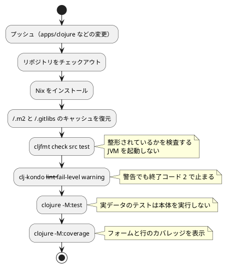

# 第 6 章: タスクランナーと CI/CD

## 6.1 はじめに

前の章で、整形・静的解析・カバレッジの道具をそろえました。道具は、**実行されなければ意味がありません**。この章では、それらを 1 つの手順にまとめ、プッシュするたびに自動で実行されるようにします。

Clojure 版で使うものは次の 4 つです。

| 層 | 道具 | 受け持つこと |
|----|------|------------|
| 言語の道具 | Clojure CLI（`deps.edn` の別名） | 依存の解決・テスト・カバレッジ・章の実行 |
| 検査の道具 | cljfmt・clj-kondo | 整形の検査・静的解析 |
| リポジトリのタスクランナー | Gulp（`ops/scripts/`） | 学習データの配置、言語をまたいだ検査の呼び出し、Nix への切り替え |
| 環境と CI | Nix + GitHub Actions | 手元と CI で同じ道具・同じ版を使う |

Clojure 版には、Gradle の `check` や Rake の `task :check` に当たる **まとめ役がビルドツールの側にありません**。Clojure CLI は「クラスパスを組み立てて JVM を起動する」道具であって、タスクランナーではないからです。この章では、その足りないところを何で埋めたかを見ていきます。

## 6.2 タスクランナー — Clojure CLI の別名

### 使うコマンド

第 5 章までに出てきたものをまとめます。

| コマンド | 内容 |
|---------|------|
| `clojure -M:test` | テストを実行する |
| `clojure -M:coverage` | テストを実行してカバレッジのレポートを作る |
| `clojure -M:run <章の名前>` | 章の処理を実行する |
| `clojure -P -M:test` | 依存を取得してクラスパスを作る（実行はしない） |
| `clojure -Stree` | 依存の木を表示する |
| `cljfmt check src test` | 整形されているかを検査する |
| `cljfmt fix src test` | コードを整形する |
| `clj-kondo --lint src test --fail-level warning` | 静的解析を実行する（warning でも失敗させる） |

前の 5 つが Clojure CLI、後ろの 3 つは独立したコマンドです。整形と静的解析が `deps.edn` の外にあるのは、cljfmt も clj-kondo も **ネイティブにコンパイルされた実行ファイル** として配られているからです。JVM の起動を待たずに済むので、`clj-kondo --lint` は 0.2 秒ほどで終わります（第 5 章の実測）。そのかわり、道具の版はプロジェクトの `deps.edn` ではなく、環境（Nix）が決めます。

### 章の処理を実行する

各章には、その章の処理を通しで実行する関数があります。入口は 1 つにまとめてあります。

```clojure
(ns getting-started-ml.main
  "章を選んで実行する。使い方: clojure -M:run chapter01"
  (:require [clojure.string :as str]
            [getting-started-ml.chapter01 :as chapter01]
            [getting-started-ml.chapter02 :as chapter02]
            [getting-started-ml.chapter03 :as chapter03]))

(def ^:private chapters
  {"chapter01" chapter01/run
   "chapter02" chapter02/run
   "chapter03" chapter03/run})

(defn -main
  "章の名前を受け取り、その章を実行する。"
  [& args]
  (if-let [run (get chapters (first args))]
    (run)
    (binding [*out* *err*]
      (println (str "使い方: clojure -M:run <章>（章: " (str/join ", " (sort (keys chapters))) "）"))
      (System/exit 1))))
```

章の名前から関数へのマップを作り、引数で選びます。Clojure では関数が値なので、`chapter01/run` と書けばそれが値としてマップに入ります。Scala 版も同じ形（`Map[String, ...]`）でしたが、あちらは関数の型（`(String => Unit) => Unit`）を書く必要がありました。Clojure は型を書かないので、マップのリテラルがそのまま対応表になります。

`if-let` は、値が `nil` でなければそれを束縛して本体を実行し、`nil` なら else 側に進みます。「マップを引いて、あれば呼ぶ、なければ使い方を出す」がこの 1 つの形に収まります。

```bash
ML_DATA_DIR=<データの置き場> clojure -M:run chapter03
```

```text
深さ	訓練データ	テストデータ	Tribuo
1	0.6762	0.6444	0.6444
2	0.9333	0.9556	0.9556
3	0.9524	0.9556	0.9556
4	0.9619	0.9556	0.9556
5	0.9810	0.9333	0.9333
制限なし	1.0000	0.9333	0.9333

深さ 2 の決定木:
花弁幅 <= 0.2950
  Iris-setosa
花弁幅 > 0.2950
  花弁幅 <= 0.6500
    Iris-versicolor
  花弁幅 > 0.6500
    Iris-virginica
```

いちばん右の「Tribuo」の列が、自作の決定木と Tribuo の CART の正解率がすべての深さで一致していることを示しています（第 3 章）。深さごとの数値も、木の分かれ目の値（0.2950・0.6500）も、[Java 版](../java/03-decision-tree-and-obvious-implementation.md)・[Scala 版](../scala/03-decision-tree-and-obvious-implementation.md) と同じです。第 4 章で見たとおり、乱数と分割の手順をそろえたからです。

章の名前を間違えたときや、引数を付けなかったときは使い方を表示します。

```bash
clojure -M:run
```

```text
使い方: clojure -M:run <章>（章: chapter01, chapter02, chapter03）
EXIT=1
```

`System/exit` で 1 を返しているので、シェルやスクリプトから見て失敗と分かります。表示は標準エラー（`*err*`）に出しています。標準出力に出すと、章の出力をファイルに落としたときに使い方の文が混ざってしまうからです。

### 環境変数を渡す

学習データの場所は、第 4 章で見たとおり環境変数で渡します。

```bash
ML_DATA_DIR=/path/to/data clojure -M:test
```

Clojure CLI は、毎回その場で JVM を起動するだけなので、環境変数の受け渡しに設定は要りません。Gradle のようにデーモンが常駐して前回の結果を再利用することもないので、「環境変数を変えたのにテストが再実行されない」という問題も起きません。

## 6.3 Notebook について

Python 版と Kotlin 版では、この節で Notebook によるデータの探索と、出力セルを消してからコミットする仕組みを扱いました。Clojure 版では Notebook（Clerk など）を使わず、データの様子は各章の `run` の出力とテストで確かめています。REPL で試したことは、そのままテストに書き写します。

Notebook で分かったことをテストに移す流れと、出力セルに学習データが残らないようにする仕組みは、[Python 版の 6.3 節](../python/06-task-runner-and-ci-cd.md)（nbstripout）と [Kotlin 版の 6.3 節](../kotlin/06-task-runner-and-ci-cd.md)（Gradle のタスクで出力セルを検査・削除）を参照してください。グラフによる可視化も、Python 版・Kotlin 版の各章を参照してください。

## 6.4 検査の道具を環境に足す

Clojure 版で最初につまずいたのは、道具そのものが環境に無かったことです。

本リポジトリの開発環境は Nix で定義しています。Clojure の環境（`ops/nix/environments/clojure/shell.nix`）には、Clojure CLI・Leiningen・babashka・clojure-lsp が入っていました。ところが **cljfmt も clj-kondo も入っていませんでした**。

紛らわしいことに、環境に入ったときの表示には `clj-kondo` という文字が出ていました。clojure-lsp が起動時に出すメッセージの一部で、clojure-lsp が内部で clj-kondo を使っていることを知らせる行だったのです。「表示に名前があるから入っている」と思い込むと、`clj-kondo --lint` を打った瞬間に `command not found` で現実に引き戻されます。**環境に何があるかは、起動メッセージではなくコマンドを打って確かめます。**

そこで環境定義に 2 つを足しました。

```nix
  buildInputs = baseShell.buildInputs ++ (with packages; [
    clojure
    leiningen
    babashka
    clojure-lsp
    # 検査に使う道具。環境に無いと CI と手元で同じ検査ができない
    clj-kondo
    cljfmt
  ]);
```

そして、環境に入ったときにそれぞれの版が表示されるようにしました。

```nix
    echo "  - clj-kondo: $(clj-kondo --version)"
    echo "  - cljfmt: $(cljfmt --version 2>&1 | head -n 1)"
```

```text
Clojure development environment activated
  - Clojure: Clojure CLI version 1.12.3.1577
  - Leiningen: Leiningen 2.11.2 on Java 21.0.8 OpenJDK 64-Bit Server VM
  - Babashka: babashka v1.12.209
  - Clojure LSP: clojure-lsp 2025.11.28-12.47.43
  - clj-kondo: clj-kondo v2025.10.23
  - cljfmt: cljfmt 0.15.6
```

版を表示させる意味は 2 つあります。1 つは、記事に載せる数値がどの版で得られたかをログから追えること。もう 1 つは、**そのコマンドが本当に存在することの証明** になることです。入っていなければ、環境に入った時点でエラーが出ます。

Ruby 版でも、Nix の環境の `RUBYLIB` が `bundle exec` の邪魔をしていて、環境定義に `unset RUBYLIB` を足しました。環境定義はインフラの設定ではなく、**開発の道具立ての一部** です。道具が足りないと分かったら、手元にだけ入れて済ませず、定義に足して全員と CI に行き渡らせます。

## 6.5 Clojure CLI と Gulp の分担

本リポジトリには、言語ごとの道具とは別に、リポジトリ全体の作業を受け持つ Gulp のタスクがあります（`ops/scripts/`）。第 4 章の `data:setup` もその 1 つです。Clojure の品質チェックは、Gulp の `apps:check:clojure` タスクから実行できます。

```javascript
  {
    name: 'clojure',
    nix: 'clojure',
    dir: path.join('apps', 'clojure'),
    // clj-kondo と cljfmt は Nix の環境にしかないので、そろっていなければ Nix の中で実行する
    tools: [{ cmd: 'clojure', version: 'clojure --version' }, { cmd: 'clj-kondo', version: 'clj-kondo --version' }],
    setup: 'clojure -P -M:test',
    // CI（.github/workflows/clojure-ci.yml）と同じ順に、整形・静的解析・テスト・カバレッジを検査する
    check:
      'cljfmt check src test && clj-kondo --lint src test --fail-level warning && clojure -M:test && clojure -M:coverage',
  },
```

`tools` には、前提になるコマンドと、それが使えるかを確かめる方法を書きます。Scala 版は `sbt` の 1 つだけでしたが、Clojure 版は `clojure` と `clj-kondo` の **2 つ** を挙げています。前の節で見たとおり、検査の道具が Clojure CLI とは別に配られているからです。どちらかが欠けていれば、Nix の `clojure` 環境の中で実行します。

```bash
npx gulp apps:check:clojure
```

```text
[..] Starting 'apps:check:clojure'...
clojure: ローカルの clojure, clj-kondo が使えないため、nix develop .#clojure の中で実行します。

[.] nix develop .#clojure --command bash -c "cd 'apps/clojure' && cljfmt check src test && clj-kondo --lint src test --fail-level warning && clojure -M:test && clojure -M:coverage"
Clojure development environment activated
  - Clojure: Clojure CLI version 1.12.3.1577
...
All source files formatted correctly
linting took 189ms, errors: 0, warnings: 0
```

```text
Ran 21 tests containing 51 assertions.
0 failures, 0 errors.
...
|                    ALL FILES |   64.72 |   75.00 |
|------------------------------+---------+---------|
[..] Finished 'apps:check:clojure' after 15 s
```

手元に Clojure CLI も clj-kondo も入っていなかったので、メッセージのとおり Nix の環境に切り替わりました。学習データを置いていないので、アサーションは 51 件、カバレッジは 64.72% です（第 5 章）。全体で 15 秒でした。同じ検査が sbt の Scala 版では 1.34 分かかっていたので、かなり速いことになります。整形と静的解析が JVM を起動せずに終わること（clj-kondo の実測は 189 ミリ秒）と、Clojure が事前のコンパイルを必要としないことが効いています。

2 つのタスクランナーは、次のように分担しています。

| 役割 | Clojure CLI と検査の道具（`apps/clojure`） | Gulp（リポジトリのルート） |
|------|------------------------------------|------------------------|
| 何を知っているか | ソース・依存・別名の定義 | 言語ごとのアプリの場所・前提ツール・学習データの場所 |
| 品質チェックの中身 | 持たない（コマンドの並びがそれにあたる） | 持たない。並びを書いて呼ぶだけ |
| 前提ツールが無いとき | 何もできない | Nix の環境（`nix develop .#clojure`）に切り替える |
| 全言語をまとめて | 扱わない | `apps:check` で、学習データの確認（`data:check`）と全言語の検査を続けて実行する |

Scala 版では「sbt に `check` が無いので、コマンドの並びが Gulp と CI に重複する」ことを弱点として挙げました。Clojure 版はさらに一歩進んで、**ビルドツールの外にある道具まで並びに含まれます**。重複を承知で、両方に同じ並びを書き、片方を変えたらもう片方も変える、とコメントで結びつけています（`ops/scripts/apps.js` の「CI と同じ順に」）。

`deps.edn` に自前のタスクを定義する道（babashka の `bb.edn` でタスクを書く、`-T` のツールを作る、など）もあります。Nix の環境には babashka も入っているので、選択肢としてはありました。それでも素のコマンドの並びにしたのは、**実体がどこにあるかを増やさない** ためです。読む人は `deps.edn` と `apps.js` と CI の定義を読めば全部が分かります。

## 6.6 GitHub Actions による CI

### ワークフロー設定

`.github/workflows/clojure-ci.yml` です。

```yaml
name: Clojure CI

on:
  push:
    branches: [main]
    paths:
      - 'apps/clojure/**'
      - 'ops/nix/environments/clojure/**'
      - '.github/workflows/clojure-ci.yml'
  pull_request:
    paths:
      - 'apps/clojure/**'
      - 'ops/nix/environments/clojure/**'
      - '.github/workflows/clojure-ci.yml'

jobs:
  test:
    runs-on: ubuntu-latest
    steps:
      - uses: actions/checkout@v5

      - uses: cachix/install-nix-action@v31
        with:
          github_access_token: ${{ secrets.GITHUB_TOKEN }}

      # deps.edn には lock ファイルが無いので、依存の記述そのものを鍵にする
      - name: Cache maven and gitlibs
        uses: actions/cache@v4
        with:
          path: |
            ~/.m2/repository
            ~/.gitlibs
          key: ${{ runner.os }}-clojure-${{ hashFiles('apps/clojure/deps.edn') }}
          restore-keys: |
            ${{ runner.os }}-clojure-

      - name: Check formatting
        run: |
          nix develop .#clojure --command bash -c 'cd apps/clojure && cljfmt check src test'

      # clj-kondo は警告でも失敗させる
      - name: clj-kondo
        run: |
          nix develop .#clojure --command bash -c 'cd apps/clojure && clj-kondo --lint src test --fail-level warning'

      # 実データのテストは学習データが無ければスキップされる
      - name: Test
        run: |
          nix develop .#clojure --command bash -c 'cd apps/clojure && clojure -M:test'

      - name: Coverage
        run: |
          nix develop .#clojure --command bash -c 'cd apps/clojure && clojure -M:coverage'
```

### ワークフローのポイント

- **`paths` で対象を絞る** — Clojure の実装・Nix の環境定義・このワークフローが変わったときだけ実行します。記事だけの変更や、ほかの言語の変更では実行されません。環境定義を入れてあるのは、前の節のように道具を足したときに CI でも確かめたいからです
- **Nix で環境をそろえる** — `nix develop .#clojure` で、`shell.nix` に定義した環境（Clojure CLI・clj-kondo・cljfmt）に入ってからコマンドを実行します。手元と CI で道具の版が同じになります
- **4 つを別のステップに分ける** — 手元の `apps:check:clojure` は `&&` でつないだ 1 行ですが、CI では 4 つのステップに分けました。どこで落ちたかが GitHub の画面で一目で分かるからです。順番と中身は同じです
- **キャッシュの鍵は `deps.edn` のハッシュ** — ロックファイルが無いので（第 5 章）、依存の記述そのものを鍵にします。保存するのは `~/.m2/repository`（Maven から取ったライブラリ）と `~/.gitlibs`（Git から取った test-runner）の 2 つです
- **学習データは置かない** — 学習データは再配布できないので CI には置きません。実データのテストは本体を実行せず、標準エラーにメッセージを出します
- **カバレッジは表示だけ** — `clojure -M:coverage` がログに数字を出すところまでで、下限による失敗は設けていません（第 5 章）

### CI パイプラインの流れ



### 実際のログを読む

CI の定義を入れた最初の実行のログです（`gh run view --log` で取得し、時刻の列を除いています）。

キャッシュのステップです。

```text
Cache not found for input keys: Linux-clojure-8385c4671f071327a413d6b95b7be48c47156b660d235853f2d6864d6e817638, Linux-clojure-
```

最初の実行なので、キーにも接頭辞にも一致するキャッシュがありません。このときは、すべてを取りに行くことになります。

ジョブの最後に、次回のためのキャッシュが保存されます。

```text
Sent 4710935 of 4710935 (100.0%), 29.8 MBs/sec
Cache saved with key: Linux-clojure-8385c4671f071327a413d6b95b7be48c47156b660d235853f2d6864d6e817638
```

4.7 MB です。Scala 版（sbt 本体・プラグイン・コンパイラを含めて 245 MB）と比べるとずいぶん小さく見えますが、これはこの時点の `deps.edn` に Tribuo がまだ無かったからです。

第 3 章で Tribuo を足すと、`deps.edn` が変わったのでキーも変わりました。

```text
Cache restored from key: Linux-clojure-8385c4671f071327a413d6b95b7be48c47156b660d235853f2d6864d6e817638
...
Sent 12890524 of 12890524 (100.0%), 15.4 MBs/sec
Cache saved with key: Linux-clojure-dd71e34ef2feee124ee4de28cb03a9873b6d5cee109ed9c351608ab1aacae1c7
```

新しいキーでは見つからなかったので、`restore-keys` の接頭辞（`Linux-clojure-`）で **前回のキャッシュが復元され**、足りない Tribuo の分だけを取りに行き、12.9 MB の新しいキャッシュとして保存されました。`restore-keys` を書いておく価値がここに出ます。依存を 1 つ足すたびに全部を取り直す、という無駄を避けられます。

最新の実行では、キャッシュが効いた状態で各ステップが進みます。

```text
Cache restored from key: Linux-clojure-dd71e34ef2feee124ee4de28cb03a9873b6d5cee109ed9c351608ab1aacae1c7
All source files formatted correctly
linting took 124ms, errors: 0, warnings: 0
Ran 21 tests containing 51 assertions.
|                    ALL FILES |   64.72 |   75.00 |
```

手元で `npx gulp apps:check:clojure` を走らせたときとまったく同じ数字（51 件のアサーション、64.72%）が出ています。手元と CI で道具の版も JDK も同じで、どちらにも学習データが無いからです。**同じ入力に同じ結果が返る** ことが確かめられたので、CI が落ちたときには「CI の環境のせい」を疑わずに、コードを疑えます。ジョブ全体は 1 分ほどでした。

## 6.7 三種の神器と CI

第 4〜6 章で整えたものを、ソフトウェア開発の「三種の神器」（バージョン管理・テスティング・自動化）に当てはめると次のようになります。

| 三種の神器 | 道具 | 本シリーズでの使い方 |
|-----------|------|------------------|
| バージョン管理 | Git、Conventional Commits、`.gitignore`、`.gitattributes` | 学習データ・`.cpcache/`・`target/`・モデルをコミットしない。改行は Git で LF にそろえる |
| テスティング | `clojure.test`、cloverage | 単体テストは架空の値、実データのテストは `when-let` で本体を飛ばす |
| 自動化 | Clojure CLI の別名、cljfmt、clj-kondo、GitHub Actions、Nix、Gulp | 環境の再現、品質チェックの一括実行、データの配置、CI |

### 利用可能なコマンド一覧

| コマンド | 内容 | 実行する場所 |
|---------|------|------------|
| `npx gulp data:setup` | 学習データを配置する | リポジトリのルート |
| `npx gulp data:check` | 学習データの配置を確認する | リポジトリのルート |
| `npx gulp apps:check:clojure` | Clojure の品質チェックを実行する（道具が無ければ Nix の中で） | リポジトリのルート |
| `cljfmt check src test` | 整形されているかを検査する | `apps/clojure` |
| `cljfmt fix src test` | コードを整形する | `apps/clojure` |
| `clj-kondo --lint src test --fail-level warning` | 静的解析を実行する | `apps/clojure` |
| `clojure -M:test` | テストを実行する | `apps/clojure` |
| `clojure -M:coverage` | カバレッジのレポートを作る | `apps/clojure` |
| `clojure -M:run chapter03` | 章の処理を実行する（学習データが必要） | `apps/clojure` |
| `clojure -Stree` | 依存の木を表示する | `apps/clojure` |

## 6.8 まとめ

この章では、品質チェックを自動化し、どの環境でも同じ手順で実行できるようにしました。

1. **Clojure CLI の別名** — `-M:test`・`-M:coverage`・`-M:run` で、1 つの `deps.edn` に複数の顔を持たせる。タスクランナーではないので、検査をまとめる役は持たない
2. **章の実行** — 章の名前から関数へのマップを作り、`if-let` で引く。動的型付けなので、対応表がマップのリテラルそのものになる
3. **道具を環境定義に足す** — cljfmt と clj-kondo が Nix の環境に無かったので足した。起動メッセージに名前が出ていても、それが別のツールの出力であることがある。あるかどうかはコマンドを打って確かめる
4. **Clojure CLI と Gulp の分担** — 検査の中身はコマンドの並びに置き、Gulp は前提ツール（`clojure` と `clj-kondo` の 2 つ）を確かめて呼び出すだけにする。無ければ Nix の環境に切り替える
5. **GitHub Actions** — Nix で環境をそろえ、手元と同じ検査を 4 つのステップに分けて実行する。ロックファイルが無いので、キャッシュの鍵は `deps.edn` のハッシュにし、`restore-keys` で差分だけを取りに行けるようにする
6. **手元と CI が一致する** — 同じ道具・同じ JDK・同じ「データ無し」の条件なので、アサーションの数もカバレッジも完全に同じ数字になる

第 2 部で、TDD を回し続けるための道具立てがそろいました。次の第 3 部では、回帰問題と、欠損値・カテゴリ値・外れ値を含む現実的なデータの前処理に取り組みます。
