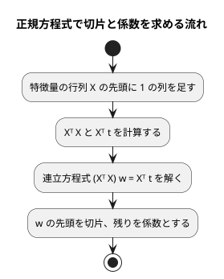

# 第 7 章: 線形回帰による数値予測

## 7.1 はじめに

第 1〜3 章では、グループを当てる **分類** を扱いました。この章からは、数値そのものを当てる **回帰** に進みます。題材は、映画の SNS での反響や主演俳優の露出度から、興行収入を予測する問題です。

この章では、最も基本的な回帰モデルである **線形回帰** を自作します。Python 版は NumPy の行列演算を使いました。[Java 版の第 7 章](../java/07-linear-regression.md) は `double[][]` を包んだクラスを作って `a.times(b)` と書き、[Scala 版](../scala/07-linear-regression.md) は `Vector[Vector[Double]]` を包んだ case class にして `a * b` と書きました。

Clojure には型の宣言がありません。そこで、**行列を包まずに、ベクタのベクタそのものとして扱います**。Clojure のベクタは変更できないので、Java 版・C# 版が配列のために書いた「写して守る」「深く比べる」コードはどちらも要りません。`=` がそのまま値の比較になり、行列はリテラルで書けます。そのかわり「行によって列数が違わないか」は型が守ってくれないので、自分から確かめる関数を持ちます。

次に、Tribuo の線形回帰に置き換えて結果を突き合わせます。[ADR 011](../../../adr/011-clojure-ml-libraries.md) のとおり、Java 版・Kotlin 版・Scala 版と **同じ Tribuo 4.3.2 を同じ JDK 21 で呼ぶ** ので、数値が一致するかどうかを言語をまたいで確かめられます。[Python 版の第 7 章](../python/07-linear-regression.md) と同じく、外れ値の除去と回帰の評価指標（MAE・RMSE・決定係数 R²）も実装します。この章の行列と評価指標は、第 11〜13 章でも使います。

Notebook と可視化の節は設けません。散布図で外れ値を確かめる手順は [Python 版](../python/07-linear-regression.md) と [Kotlin 版の 7.13 節](../kotlin/07-linear-regression.md) を参照してください。

## 7.2 線形回帰とは

### 特徴量の重み付きの和で予測する

線形回帰は、予測値を「切片」と「特徴量ごとの係数 × 特徴量」の和で表すモデルです。この章のデータに当てはめると次の式になります。

```text
予測値 = 切片 + 係数1 × SNS1 + 係数2 × SNS2 + 係数3 × actor + 係数4 × original
```

学習とは、訓練データに対して予測値と実測値のずれが最も小さくなるように、切片と係数を決めることです。ずれの大きさには「誤差の 2 乗の合計」を使います。これを最小にする方法を **最小二乗法** と呼びます。

### 正規方程式

最小二乗法の解は、行列を使うと 1 つの式で求められます。特徴量を行列 `X`、実測値をベクトル `t`、切片と係数をまとめたベクトルを `w` とすると、誤差の 2 乗の合計を最小にする `w` は次の **正規方程式** を満たします。

```text
(Xᵀ X) w = Xᵀ t
```

`X` の先頭には、すべての値が 1 の列を足しておきます。この列にかかる係数が切片になります。



この流れに必要な行列の操作は、**積**・**転置**・**連立方程式を解く** の 3 つです。Clojure の標準ライブラリに行列はなく、`core.matrix` のような線形代数のライブラリは [ADR 011](../../../adr/011-clojure-ml-libraries.md) で「表は素のマップとベクタで表す」と決めた方針に合わないので、この 3 つを持つ名前空間を自作します。逆行列を作らずに連立方程式として解くのは、Python 版・Java 版・Scala 版と同じく、そのほうが数値計算の誤差が小さくなるためです。

## 7.3 題材とデータ

この章で使うのは `cinema.csv` です。100 本の映画について、次の 6 列が記録されています。

| 列 | 内容 | 欠損値 |
|----|------|-------|
| cinema_id | 映画の ID | なし |
| SNS1 | SNS での反響の数（1 つ目の指標） | 1 件 |
| SNS2 | SNS での反響の数（2 つ目の指標） | なし |
| actor | 主演俳優のメディア露出の指標 | 1 件 |
| original | 原作の有無（0 または 1） | なし |
| sales | 興行収入 | なし |

「SNS1」「SNS2」「actor」「original」が特徴量、「sales」が正解ラベル（予測したい数値）です。`cinema_id` は映画を区別するための番号なので、特徴量には使いません。

Kotlin 版では、Kotlin DataFrame が SNS1 を `Int?`（欠損値を含む整数の列）と推論し、補完した平均値（小数）が入らないという問題が起きました。Clojure 版は第 2 章の `load-table` でセルを文字列のまま持ち、`chapter02/number` で読むときに `double` か `nil` にするので、列の型を推論する段階がありません。この問題は Java 版・Scala 版と同じく起きません。

このデータには、SNS2 の値が大きいのに興行収入が低い、傾向から外れた映画が 1 本含まれています。このような **外れ値** は、最小二乗法の結果を大きく引っ張ります。誤差を 2 乗して足し合わせるので、大きく外れた 1 点の影響が大きくなるためです。

## 7.4 TODO リストの作成

**TODO リスト**:

- [ ] 行列を扱う名前空間を作る
  - [ ] 行列の積を求める
  - [ ] 転置行列を求める
  - [ ] 連立方程式を解く
- [ ] 評価指標を計算する（MAE・RMSE・R²）
- [ ] 正規方程式で線形回帰を学習する
  - [ ] 直線上の点から切片と係数を求める
  - [ ] 複数の特徴量から切片と係数を求める
- [ ] 学習したモデルで予測する
- [ ] 外れ値を取り除く
  - [ ] SNS2 が 1000 を超え、興行収入が 8500 未満の行を取り除く
  - [ ] 条件の片方だけを満たす行は残す
- [ ] 外れ値の除去・分割・補完をまとめる
- [ ] Tribuo と結果が一致することを確かめる
- [ ] 実データで学習・評価して表示する

Java 版・Scala 版と同じく、CSV の読み込みは第 2 章の `chapter02/load-table` に任せ、土台になる行列から始めます。外れ値の条件「SNS2 が 1000 を超え、興行収入が 8500 未満」は、書籍『スッキリわかる Python による機械学習入門』の同じデータでの分析手順に合わせたものです。

ファイルの置き方は次のとおりです。第 3 章までは 1 章 1 ファイルでしたが、この章からは章の名前空間の下に部品を分けます。

| ファイル | 名前空間 | 中身 |
|---------|---------|------|
| `src/getting_started_ml/chapter07/matrix.clj` | `getting-started-ml.chapter07.matrix` | 行列の積・転置・連立方程式 |
| `src/getting_started_ml/chapter07/metrics.clj` | `getting-started-ml.chapter07.metrics` | MAE・RMSE・R² |
| `src/getting_started_ml/chapter07/tribuo.clj` | `getting-started-ml.chapter07.tribuo` | Tribuo への橋渡し |
| `src/getting_started_ml/chapter07.clj` | `getting-started-ml.chapter07` | 線形回帰・前処理・`run` |

名前空間の `-` はファイル名では `_` になります（`getting-started-ml` → `getting_started_ml`）。ここを間違えると `Could not locate …` で読み込みに失敗します。

## 7.5 行列を扱う名前空間を作る

### 行列の積: テストファースト

最初のテストは、2 行 2 列どうしの積です。

```clojure
;; test/getting_started_ml/chapter07/matrix_test.clj
(ns getting-started-ml.chapter07.matrix-test
  "行列の積・転置・連立方程式の解法のテスト。"
  (:require [clojure.test :refer [deftest is]]
            [getting-started-ml.chapter07.matrix :as matrix]))

(deftest 行列の積を求める
  (is (= [[19.0 22.0] [43.0 50.0]]
         (matrix/multiply [[1.0 2.0] [3.0 4.0]] [[5.0 6.0] [7.0 8.0]]))))
```

ここが Clojure 版のいちばん大きな違いです。**行列を作る関数を呼んでいません。** `[[1.0 2.0] [3.0 4.0]]` がそのまま行列です。期待値も同じくベクタのリテラルで、`=` で比べられます。Java 版は `new Matrix(new double[][]{…})` と `Arrays.deepEquals` を使う `equals` を書き、Scala 版は `Matrix(Vector(Vector(…)))` という包みを 1 枚かぶせました。Clojure ではその包みを置きません。

名前空間がまだ無いので、テストは読み込みの段階で落ちます。

```console
$ clojure -M:test -n getting-started-ml.chapter07.matrix-test
Execution error (FileNotFoundException) at getting-started-ml.chapter07.matrix-test/eval1941$loading (matrix_test.clj:1).
Could not locate getting_started_ml/chapter07/matrix__init.class, getting_started_ml/chapter07/matrix.clj or getting_started_ml/chapter07/matrix.cljc on classpath. Please check that namespaces with dashes use underscores in the Clojure file name.
```

静的な型が無いので、Java 版・Scala 版の「コンパイルが通らない」にあたるのは「名前空間が見つからない」という実行時の失敗です。エラーの本文が「dashes と underscores を確かめよ」と案内してくれるのは親切な部類でした。

### Green: 仮実装

テストを通すだけの最小の実装から始めます。

```clojure
;; src/getting_started_ml/chapter07/matrix.clj
(ns getting-started-ml.chapter07.matrix)

(defn multiply
  "行列の積。"
  [a b]
  [[19.0 22.0] [43.0 50.0]])
```

ところが、これは検査を通りません。clj-kondo が引数を使っていないことを警告します。

```console
$ clj-kondo --lint src test --fail-level warning
src/getting_started_ml/chapter07/matrix.clj:6:4: warning: unused binding a
src/getting_started_ml/chapter07/matrix.clj:6:6: warning: unused binding b
linting took 125ms, errors: 0, warnings: 2
```

Scala 版が `-Wunused:all` に止められて `val _ = other` と書いたのと同じ場面です。Clojure では引数の名前を `_a` `_b` にすると警告が消えます。**仮実装のあいだだけ名前の頭に `_` を付ける** のが、Clojure での「わざと使っていない」の示し方です。

### 三角測量: 行数と列数が違う行列

仮実装を本物にするために、2 つ目のテストを足します。

```clojure
(deftest 行数と列数が違う行列の積を求める
  (is (= [[7.0] [16.0]]
         (matrix/multiply [[1.0 2.0 3.0] [4.0 5.0 6.0]] [[1.0] [0.0] [2.0]]))))
```

```console
FAIL in (行数と列数が違う行列の積を求める) (matrix_test.clj:11)
expected: (= [[7.0] [16.0]] (matrix/multiply [[1.0 2.0 3.0] [4.0 5.0 6.0]] [[1.0] [0.0] [2.0]]))
  actual: (not (= [[7.0] [16.0]] [[19.0 22.0] [43.0 50.0]]))
```

`clojure.test` の失敗の表示は、式をそのまま `(not (= 期待値 実際の値))` の形で見せます。ScalaTest の `Analysis:` のような差分の要約は出ませんが、行列が素のベクタなので、そのまま読めば食い違いが分かります。ここで本物の積に置き換えます。

```clojure
(defn multiply
  "行列の積。左の列数と右の行数が同じでなければならない。"
  [a b]
  (check a)
  (check b)
  (when-not (= (column-count a) (row-count b))
    (throw (IllegalArgumentException.
            (str "左の行列の列数 " (column-count a) " と右の行列の行数 " (row-count b) " が違います"))))
  (let [columns (transpose b)]
    (mapv (fn [row] (mapv (fn [col] (reduce + (map * row col))) columns)) a)))
```

- 内積は `(reduce + (map * row col))` です。`map` は 2 つのベクタを組にして掛け、`reduce +` が **左から順に** 足します。この足し算の順序が Java 版の添字のループと同じなので、7.9 節で見るとおり浮動小数点の丸め誤差まで一致します
- 右の行列は先に `transpose` して列の並びにしておきます。列を毎回引き直すより速く、式も短くなります
- `mapv` はベクタを返す `map` です。遅延シーケンスではなくベクタにしておくと、`=` で行列のリテラルと比べられ、`nth` で添字も引けます

### 形が正しいことは自分で確かめる

型が無いので、「行によって列数が違うベクタのベクタ」も渡せてしまいます。そこで、行列として使える形かどうかを確かめる関数を置き、入口で呼びます。

```clojure
(defn check
  "行列として使える形かどうかを確かめ、そのまま返す。形が違えば失敗する。"
  [m]
  (when (or (empty? m) (empty? (first m)))
    (throw (IllegalArgumentException. "行列は 1 行 1 列以上でなければなりません")))
  (when-not (apply = (map count m))
    (throw (IllegalArgumentException. "行によって列数が違います")))
  m)
```

```clojure
(deftest 行によって列数が違う値からは行列にならない
  (is (thrown? IllegalArgumentException (matrix/check [[1.0 2.0] [3.0]]))))

(deftest 左の列数と右の行数が違えば積を求められない
  (is (thrown? IllegalArgumentException (matrix/multiply [[1.0 2.0]] [[1.0 2.0]]))))
```

Scala 版は `case class Matrix` の中の `require` で、**行列を作った瞬間に** 同じことを確かめました。Clojure では行列を作る瞬間が無いので、**使う瞬間に** 確かめます。`check` が引数をそのまま返すのは、`(check m)` を式の途中に挟めるようにするためです。

この違いは、そのまま長所と短所です。リテラルで書けて包みが要らない代わりに、「この値は行列である」という保証を持ち運べません。確かめる場所を自分で決めることになります。

### 不変であることをテストしない

Java 版・C# 版には「コンストラクタに渡した配列を後から書き換えても行列は変わらない」というテストがありました。Clojure のベクタは変更できないので、このテストは書けません。書く必要もありません。第 2 章・第 3 章と同じ判断です。

### 転置と連立方程式

転置は、列を順に取り出して並べるだけです。

```clojure
(defn column
  "j 列目（0 始まり）の値を返す。"
  [m j]
  (mapv #(nth % j) m))

(defn transpose
  "行と列を入れ替えた行列を返す。"
  [m]
  (mapv #(column m %) (range (column-count (check m)))))
```

連立方程式は、部分ピボット選択つきのガウスの消去法で解きます。テストは、答えが分かっている 2 元・3 元の連立方程式と、**先頭の対角成分が 0 になる場合** です。

```clojure
(deftest 連立方程式の解を求める
  ;; 2x + y = 5, x + 3y = 5 → x = 2, y = 1
  (is (= [[2.0] [1.0]]
         (matrix/solve [[2.0 1.0] [1.0 3.0]] (matrix/column-vector [5.0 5.0])))))

(deftest 対角成分が零でも行を入れ替えて解を求める
  ;; 先頭の行の 1 列目が 0 なので、部分ピボット選択が無ければ 0 で割ってしまう
  (is (= [[3.0] [2.0]]
         (matrix/solve [[0.0 1.0] [1.0 1.0]] (matrix/column-vector [2.0 5.0])))))
```

実装は、前進消去を再帰、後退代入を `reduce` で書きます。Java 版・C# 版は可変の 2 次元配列を書き換えながら進めますが、ここでは毎回新しいベクタを返します。

```clojure
(defn- swap-largest
  "ピボットの列の絶対値が最も大きい行を、ピボットの行と入れ替える。"
  [rows pivot]
  (let [largest (apply max-key #(abs (nth (rows %) pivot)) (range pivot (count rows)))]
    (assoc rows pivot (rows largest) largest (rows pivot))))

(defn- eliminate
  "拡大係数行列を、上三角行列になるまで前進消去する。"
  [rows pivot]
  (if (>= pivot (count rows))
    rows
    (let [swapped (swap-largest rows pivot)
          pivot-row (swapped pivot)]
      (recur (mapv (fn [i row]
                     (if (<= i pivot)
                       row
                       (let [factor (/ (nth row pivot) (nth pivot-row pivot))]
                         (mapv #(- %1 (* factor %2)) row pivot-row))))
                   (range (count swapped)) swapped)
             (inc pivot)))))

(defn- back-substitute
  "上三角行列を、下の行から順に代入して解く。"
  [rows]
  (let [n (count rows)]
    (reduce (fn [x i]
              (let [known (reduce + (map #(* (nth (rows i) %) (nth x %)) (range (inc i) n)))]
                (assoc x i (/ (- (nth (rows i) n) known) (nth (rows i) i)))))
            (vec (repeat n 0.0))
            (range (dec n) -1 -1))))
```

- `(assoc rows pivot (rows largest) largest (rows pivot))` は、2 か所を一度に差し替えます。ベクタは関数としても使えるので `(rows largest)` が `largest` 番目の行です
- `recur` は末尾再帰の呼び出しで、スタックを積まずに繰り返します。ループを書いているのと同じ実行になり、名前（`swapped`・`pivot-row`）が途中の状態に付きます
- 後退代入は `reduce` で「解のベクタ `x` を下の行から埋めていく」形です。`assoc` は新しいベクタを返すので、書き換えではなく積み上げになります

`solve` は、係数行列に右辺の列を足した拡大係数行列を作って渡します。

```clojure
(defn solve
  "正方行列 a について a x = b を満たす列ベクトル x を、部分ピボット選択つきのガウスの消去法で求める。"
  [a b]
  (check a)
  (check b)
  (when-not (= (row-count a) (column-count a))
    (throw (IllegalArgumentException.
            (str "正方行列ではありません（" (row-count a) " 行 " (column-count a) " 列）"))))
  (when-not (and (= (row-count b) (row-count a)) (= 1 (column-count b)))
    (throw (IllegalArgumentException. "右辺は同じ行数の列ベクトルでなければなりません")))
  (column-vector (back-substitute (eliminate (mapv conj a (column b 0)) 0))))
```

`(mapv conj a (column b 0))` の 1 行が拡大係数行列です。`conj` はベクタの末尾に値を足すので、各行に右辺の値が 1 つずつ付きます。

## 7.6 評価指標を計算する

MAE・RMSE・R² を、実測値 `t` と予測値 `y` から求めます。テストは 3 つの指標それぞれの性質を固定します。

```clojure
;; test/getting_started_ml/chapter07/metrics_test.clj
(deftest MAEは誤差の絶対値の平均になる
  (is (near? 1.0 (metrics/mean-absolute-error [3.0 1.0 4.0] [2.0 2.0 5.0]))))

(deftest RMSEは誤差の二乗の平均の平方根になる
  ;; 誤差 3 と 4 → √((9 + 16) / 2) = √12.5
  (is (near? (Math/sqrt 12.5) (metrics/root-mean-squared-error [0.0 0.0] [3.0 -4.0]))))

(deftest R2は予測がすべて正解なら一になる
  (is (near? 1.0 (metrics/r2-score [1.0 2.0 3.0] [1.0 2.0 3.0]))))

(deftest R2は平均値を予測し続けるモデルなら零になる
  (is (near? 0.0 (metrics/r2-score [1.0 2.0 3.0] [2.0 2.0 2.0]))))
```

`near?` は許容誤差つきの比較です。`clojure.test` には ScalaTest の `+-` にあたるものが無いので、テストの名前空間に自分で置きます。

```clojure
(defn- near? [a b] (< (abs (- a b)) 1e-12))
```

`abs` は Clojure 1.11 から標準にある関数で、`Math/abs` を呼ぶ必要はありません。実装は次のとおりです。

```clojure
;; src/getting_started_ml/chapter07/metrics.clj
(defn- residuals
  "実測値と予測値の差。件数が違えば失敗する。"
  [t y]
  (when-not (= (count t) (count y))
    (throw (IllegalArgumentException.
            (str "実測値と予測値の件数が違います: " (count t) " と " (count y)))))
  (mapv - t y))

(defn- sum-of-squares
  "値の 2 乗の合計。"
  [values]
  (reduce + (map #(* % %) values)))

(defn mean-absolute-error
  "平均絶対誤差（MAE）。誤差の絶対値の平均。"
  [t y]
  (let [r (residuals t y)]
    (/ (reduce + (map abs r)) (count r))))

(defn root-mean-squared-error
  "平均二乗誤差の平方根（RMSE）。"
  [t y]
  (let [r (residuals t y)]
    (Math/sqrt (/ (sum-of-squares r) (count r)))))

(defn r2-score
  "決定係数（R²）。1 から「残差の 2 乗の合計 ÷ 平均との差の 2 乗の合計」を引いた値。"
  [t y]
  (let [residual (sum-of-squares (residuals t y))
        mean (/ (reduce + t) (count t))]
    (- 1.0 (/ residual (sum-of-squares (map #(- % mean) t))))))
```

`(mapv - t y)` は「2 つのベクタを要素ごとに引く」です。`map` に複数のコレクションを渡せるので、`zip` にあたる中間のコレクションを作らずに済みます。Scala 版の `lazyZip` が狙っていたことが、Clojure では `map` の既定の振る舞いです。

件数の検査を `residuals` の中に置いたので、3 つの指標すべてが同じ検査を通ります。テストは MAE で 1 本だけ書けば足ります。

```clojure
(deftest 実測値と予測値の件数が違えば失敗する
  (is (thrown? IllegalArgumentException (metrics/mean-absolute-error [1.0] [1.0 2.0]))))
```

## 7.7 正規方程式で線形回帰を学習する

### モデルはマップ、係数はベクタの組

学習したモデルは、切片と「列名つきの係数」を持ちます。第 2 章の [データの表し方](../../../article/getting-start-ml/outline.md) の方針どおり、マップで表します。

```clojure
;; モデルは {:intercept 切片 :coefficients [[列名 係数] ...]} で表す。
;; 係数をベクタの組で持つので列の順がそのまま残り、= で値として比べられる。
```

係数を **マップにしない** のが要点です。Clojure のマップは要素が 9 個以上になると順序を保たないので、列の順を残したい値をマップで持つと、あとで並びに頼れなくなります。Java 版が `LinkedHashMap` を包んで守ったこと、Scala 版が `Vector[(String, Double)]` を選んだことを、Clojure でも「ベクタの組のベクタ」で行います。

```clojure
(defn model
  "列名と、同じ順に並んだ係数からモデルを作る。"
  [intercept columns coefficients]
  (when-not (= (count columns) (count coefficients))
    (throw (IllegalArgumentException.
            (str "列名と係数の数が違います: " (count columns) " と " (count coefficients)))))
  {:intercept intercept :coefficients (mapv vector columns coefficients)})

(defn coefficient
  "列名で係数を読む。無ければ失敗する。"
  [model column]
  (if-let [pair (first (filter #(= column (first %)) (:coefficients model)))]
    (second pair)
    (throw (IllegalArgumentException. (str "係数がありません: " (name column))))))
```

予測は、係数を畳み込むだけです。

```clojure
(defn predict-one
  "1 行分の特徴量の予測値。係数は列名で対応させるので、列の並び順は問わない。"
  [model features]
  (reduce (fn [sum [column value]] (+ sum (* value (get features column))))
          (:intercept model)
          (:coefficients model)))

(defn predict
  "行ごとの予測値。"
  [model x]
  (mapv #(predict-one model %) x))
```

`(fn [sum [column value]] …)` の 2 つ目の引数は **分配束縛** です。`[列名 係数]` の組をその場でほどけるので、`first`・`second` を書かずに済みます。

特徴量は第 3 章と同じく「列名のキーワードから `double` へのマップ」なので、並び順は予測に影響しません。テストでそれを固定します。

```clojure
(deftest 列の並び順が違っても列名で係数を対応させる
  (let [model (ch/model 1.0 columns [2.0 3.0])]
    (is (near? (ch/predict-one model {:SNS1 2.0 :actor 3.0})
               (ch/predict-one model (array-map :actor 3.0 :SNS1 2.0))))))
```

`array-map` を使っているのは、「並びが違うマップ」を確実に作るためです。リテラルの `{…}` も要素が少なければ配列マップになりますが、順を明示したいところでは関数で作ります。

### 学習

計画行列を作り、正規方程式を解きます。

```clojure
(deftest 計画行列の先頭には一の列が入る
  (is (= [[1.0 1.0 2.0] [1.0 3.0 4.0]]
         (ch/design-matrix [{:SNS1 1.0 :actor 2.0} {:SNS1 3.0 :actor 4.0}] columns))))

(deftest 直線上の点から切片と係数を求める
  ;; y = 3 + 2x をちょうど通る 3 点
  (let [model (ch/fit [{:x 0.0} {:x 1.0} {:x 2.0}] [3.0 5.0 7.0] [:x])]
    (is (near? 3.0 (:intercept model)))
    (is (near? 2.0 (ch/coefficient model :x)))))

(deftest 複数の特徴量から切片と係数を求める
  ;; y = 1 + 2a - 3b をちょうど通る 4 点
  (let [x [{:a 0.0 :b 0.0} {:a 1.0 :b 0.0} {:a 0.0 :b 1.0} {:a 1.0 :b 1.0}]
        model (ch/fit x [1.0 3.0 -2.0 0.0] [:a :b])]
    (is (near? 1.0 (:intercept model)))
    (is (near? 2.0 (ch/coefficient model :a)))
    (is (near? -3.0 (ch/coefficient model :b)))))
```

```clojure
(defn design-matrix
  "先頭に 1 の列を足した特徴量の行列（計画行列）を作る。1 の列の係数が切片になる。"
  [x columns]
  (mapv (fn [features] (into [1.0] (map #(get features %)) columns)) x))

(defn fit
  "(Xᵀ X) w = Xᵀ t を解いて、切片と係数を求める。"
  [x t columns]
  (when (empty? x)
    (throw (IllegalArgumentException. "訓練データが空です")))
  (when-not (= (count x) (count t))
    (throw (IllegalArgumentException.
            (str "特徴量と実測値の件数が違います: " (count x) " と " (count t)))))
  (let [design (design-matrix x columns)
        transposed (matrix/transpose design)
        weights (matrix/column
                 (matrix/solve (matrix/multiply transposed design)
                               (matrix/multiply transposed (matrix/column-vector t)))
                 0)]
    (model (first weights) columns (vec (rest weights)))))
```

`fit` は列の並びを **引数で受け取ります**。Scala 版は `x.head.columns` で先頭の特徴量から列名を取れましたが、Clojure の特徴量はただのマップなので、並びの情報を持っていません。第 3 章の `fit` が `columns` を受け取ったのと同じ形にそろえました。

`(into [1.0] (map …) columns)` は、`[1.0]` から始めて変換した値を足し込む書き方です。中間のシーケンスを作らずに 1 の列を先頭に置けます。

## 7.8 外れ値の除去・分割・補完をまとめる

### 外れ値を取り除く

外れ値の条件は「SNS2 が 1000 を超え、**かつ** 興行収入が 8500 未満」です。片方だけでは外れ値になりません。テストは 4 通りの組み合わせを 1 つの表で確かめます。

```clojure
(def ^:private table
  {:columns [:SNS2 :sales]
   :rows [{:SNS2 "1200" :sales "8000"}   ; 両方満たす → 外れ値
          {:SNS2 "1200" :sales "9000"}   ; SNS2 だけ → 残す
          {:SNS2 "500" :sales "8000"}    ; sales だけ → 残す
          {:SNS2 "500" :sales "9000"}]}) ; どちらも満たさない → 残す

(deftest SNS2が千を超え売上が八千五百未満の行を取り除く
  (is (= 3 (count (:rows (ch/remove-outliers table))))))

(deftest 条件の片方だけを満たす行は残す
  (is (= [["1200" "9000"] ["500" "8000"] ["500" "9000"]]
         (mapv (juxt :SNS2 :sales) (:rows (ch/remove-outliers table))))))
```

`(juxt :SNS2 :sales)` は「2 つの関数を並べて呼び、結果をベクタにする」関数を作ります。行のマップから見たい列だけを取り出して比べられるので、テストの期待値が短くなります。

実装は、表のマップの `:rows` だけを差し替えます。

```clojure
(defn- outlier?
  "外れ値の行かどうかを返す。"
  [row]
  (and (> (chapter02/number row :SNS2) outlier-sns2)
       (< (chapter02/number row target) outlier-sales)))

(defn remove-outliers
  "外れ値の行を除いた表を返す。"
  [table]
  (update table :rows #(vec (remove outlier? %))))
```

`update` は「マップの 1 つの鍵の値に関数をかけた新しいマップを返す」関数です。`:columns` はそのまま残るので、Scala 版の `table.copy(rows = …)` と同じことが、コピーを書かずに済みます。表が `{:columns … :rows …}` という素のマップだからこそ使える手です。

### 前処理を 1 つの関数にする

外れ値の除去・分割・補完の順序が要点です。**分割してから、訓練データの平均値で両方を補完** します。テストデータの平均値を補完に使うと、テストデータの情報が訓練に漏れるからです（第 2 章）。

```clojure
(defn prepare-cinema
  "cinema.csv を読み込み、外れ値を除き、分割してから訓練データの平均値で両方の欠損値を補完する。"
  [csv-file test-size seed]
  (let [table (remove-outliers (chapter02/load-table csv-file))
        t (mapv #(chapter02/number % target) (:rows table))
        split (chapter02/split-train-test (:rows table) t test-size seed)
        means (chapter02/column-means (:x-train split) feature-columns)]
    (assoc split
           :x-train (chapter02/fill-missing (:x-train split) feature-columns means)
           :x-test (chapter02/fill-missing (:x-test split) feature-columns means))))
```

第 2 章の `prepare-iris` とほぼ同じ形です。違いは、外れ値を先に除くことと、特徴量の列を「正解ラベル以外すべて」ではなく `feature-columns` で選ぶこと（`cinema_id` を外すため）の 2 点です。

`chapter02/fill-missing` は、補完した結果を `(into {} …)` で作ります。この章の特徴量は 4 列なので配列マップになり、鍵の順は `feature-columns` の順のままです。とはいえ **その順に頼らない** のがこの章の方針で、`fit`・`design-matrix`・`predict-one` はすべて列名で引いています。列が 9 個以上になる第 8 章では、順に頼っていたら壊れていました。

## 7.9 Tribuo に置き換える

### どのトレーナーが最小二乗解になるかを確かめる

Tribuo には線形回帰のトレーナーが複数あります。Kotlin 版（ADR 002）・Java 版（ADR 005）・Scala 版（ADR 007）で調べた結果を、Clojure でも確かめました。乱数で作った特徴量 3 列にノイズを加えた架空のデータ（`t = 4 + 1.5a - 0.5b + 2c + ノイズ`、30 件）で、最初の 1 件の予測値を比べた結果です。

| 学習方法 | 最初の 1 件の予測値 |
|---------|-------------------|
| 自作（正規方程式） | 28.884235137468824 |
| `SLMTrainer(true)` | 28.884235137468863 |
| `LARSTrainer()` | 28.884235137468863 |
| `SLMTrainer(false)` | 31.118855730190532 |

- `SLMTrainer(true)` と `LARSTrainer()` は、自作と小数第 13 位まで一致しました
- **4 つの値はすべて Java 版・Scala 版と完全に一致しました。** 自作の 28.884235137468824 は Java 版・Scala 版と同じで、Kotlin 版（28.884235137468828）とは末尾の桁が違います。Clojure の `(reduce + (map * row col))` が左から順に足すので、Java 版の添字のループと足し算の順序が同じになるためです
- `SLMTrainer(false)` は一致しません。Java 版・Scala 版で見たとおり、このとき学習した重みのベクトルにはバイアスの位置に値がありませんでした
- 架空のデータが Java 版・Scala 版と一致するのは、`java.util.Random` を **同じ順で呼んでいる** からです。特徴量を列ごとに 30 件ずつ作り、そのあと行ごとに `nextGaussian` を呼ぶ手順をそろえました

このうち、`SLMTrainer(true)` と `LARSTrainer()` の 2 つをテストに残します。勾配降下法の `LinearSGDTrainer` は別の成果物（`tribuo-regression-sgd`）に入っていて、この設定では最小二乗解に届かないので依存に足しません。勾配降下法は第 10 章で扱います。

### 特徴量を Tribuo のデータセットに変換する

第 3 章の `tribuo-predict` と同じく、事例（`Example`）とデータセット（`MutableDataset`）に変換します。回帰では、正解ラベルが `Label` ではなく数値を持つ `Regressor` になります。トレーナーは引数で受け取り、`SLMTrainer` と `LARSTrainer` を同じ関数で試せるようにします。

```clojure
;; src/getting_started_ml/chapter07/tribuo.clj
(ns getting-started-ml.chapter07.tribuo
  "第 7 章: 特徴量を Tribuo の回帰の事例に変え、Tribuo のトレーナーで学習・予測する。"
  (:import [com.oracle.labs.mlrg.olcut.provenance Provenance]
           [org.tribuo Example Model MutableDataset Trainer]
           [org.tribuo.datasource ListDataSource]
           [org.tribuo.impl ArrayExample]
           [org.tribuo.provenance SimpleDataSourceProvenance]
           [org.tribuo.regression RegressionFactory Regressor]))

(def output-name
  "予測する数値の名前。"
  "sales")

(def ^:private regression-factory
  "Tribuo の回帰の出力の作り方。"
  (RegressionFactory.))

(defn- to-example
  "特徴量と出力を Tribuo の事例にする。列名は文字列の配列で渡す。"
  ^Example [features columns ^Regressor output]
  (ArrayExample. output
                 ^"[Ljava.lang.String;" (into-array String (map name columns))
                 (double-array (map #(get features %) columns))))

(defn to-dataset
  "特徴量と実測値を Tribuo のデータセットにする。"
  ^MutableDataset [x t columns]
  (let [examples (mapv (fn [features value]
                         (to-example features columns (Regressor. output-name (double value))))
                       x t)
        provenance (SimpleDataSourceProvenance. "features" regression-factory)]
    (MutableDataset. (ListDataSource. examples regression-factory ^Provenance provenance))))

(defn train
  "渡したトレーナーで学習する。"
  ^Model [^Trainer trainer x t columns]
  (.train trainer (to-dataset x t columns)))

(defn- predict-one
  "1 件の特徴量の数値を予測する。Tribuo の回帰は複数の数値を同時に予測できるので、配列の先頭を取る。"
  [^Model model features columns]
  (let [example (to-example features columns RegressionFactory/UNKNOWN_REGRESSOR)
        ^Regressor output (.getOutput (.predict model example))]
    (aget ^doubles (.getValues output) 0)))

(defn predict
  "学習したモデルで、特徴量ごとの数値を予測する。"
  [^Model model x columns]
  (mapv #(predict-one model % columns) x))
```

- `^"[Ljava.lang.String;"` は「`String` の配列」を表す型ヒントです。`ArrayExample` には `String[]` と `double[]` を取る構築子と `List` を取る構築子があり、ヒントが無いと反射でどれを呼ぶか決められません。第 3 章の `to-example` と同じ書き方です
- `^Example`・`^Model` を関数名の前に付けているのは **戻り値の型ヒント** です。これを書いておくと、呼び出し側の `.train`・`.predict` が反射なしで解決されます
- `mapv` の関数に 2 つのコレクション（`x` と `t`）を渡して組にしています。ここでも `zip` は要りません
- Tribuo に渡すときだけ、不変のマップとベクタから可変のオブジェクトと Java の配列に降ります。**降りる場所を 1 つの名前空間に閉じ込める** のが、[ADR 011](../../../adr/011-clojure-ml-libraries.md) で決めた方針です

テストは、自作の予測と 1 件ずつ突き合わせます。

```clojure
(deftest SLMTrainerの予測は自作の線形回帰の予測と一致する
  (let [[x t] (noisy-dataset)
        model (tribuo/train (SLMTrainer. true) x t columns)
        mine (ch/predict (ch/fit x t columns) x)]
    (is (every? true? (map near? (tribuo/predict model x columns) mine)))))
```

`noisy-dataset` は特徴量と実測値をベクタで返し、`(let [[x t] (noisy-dataset)] …)` の分配束縛で受け取ります。Java 版は組に名前を付けた `record Noisy` を作る必要がありましたが、Clojure では Scala 版・Kotlin 版・F# 版と同じく、ベクタと分配束縛で済みます。

### 係数を突き合わせる

予測値が一致したので、係数も一致するはずです。ところが、学習したモデル（`SparseLinearModel`）の重みを取り出すと、自作の係数とは違う値でした。

| 特徴量 | 自作の係数 | `SparseLinearModel` の重み |
|--------|----------|--------------------------|
| a | 1.4967484681545709 | 0.5294490880561531 |
| b | -0.56959990171371 | -0.22329887049401564 |
| c | 1.9280374530469377 | 0.7595789924844588 |

**いずれの値も Java 版・Scala 版と完全に一致しました。** ADR 002 に記録されているとおり、`SLMTrainer(true)` は学習の前に、特徴量と正解ラベルをそれぞれ「平均を引き、平均との差の 2 乗の合計の平方根で割る」形に変換します。重みは、この変換後の空間での値です。そこで、重みに「正解ラベルの変換の大きさ ÷ 特徴量の変換の大きさ」を掛けて元の単位に戻せば、自作の係数と一致するはずです。これを Clojure で確かめる学習用テストにしました。

```clojure
(deftest Tribuoの重みは正規化した空間の値で元の単位に戻すと自作の係数と一致する
  (let [[x t] (noisy-dataset)
        ^SparseLinearModel model (tribuo/train (SLMTrainer. true) x t columns)
        weights (.next (.iterator (.values (.getWeights model))))
        mine (ch/fit x t columns)]
    (doseq [column columns]
      (let [values (mapv #(get % column) x)
            weight (.get weights (.getID (.getFeatureIDMap model) (name column)))]
        (is (> (abs (- weight (ch/coefficient mine column))) 1e-3) (str (name column) " の重み"))
        (is (near? (/ (* weight (centered-norm t)) (centered-norm values))
                   (ch/coefficient mine column))
            (str (name column) " を元の単位に戻した値"))))))
```

- `^SparseLinearModel model` は **束縛への型ヒント** です。Scala 版の `asInstanceOf[SparseLinearModel]`、Java 版のキャストにあたります。Clojure では実行時にキャストが起きるわけではなく、「この名前をこの型として呼び出す」とコンパイラに伝えるだけですが、`.getWeights` を呼ぶにはこれが要ります
- 重みのベクトルの何番目がどの特徴量かは、`.getID` で引きます。第 3 章で見たとおり Tribuo は特徴量を名前の順に並べるので、列の順の添字では引けません
- 重みそのものは自作の係数と一致しないことも確かめ、「元の単位に戻す」変換が意味を持つことをテストに残しました
- `is` の 3 つ目の引数は失敗したときのメッセージです。`doseq` で 3 列を回すので、どの列で落ちたかが分かるようにしています

### 評価指標を突き合わせる

Tribuo の `RegressionEvaluator` は、MAE・RMSE・R² をまとめて計算します。自作の評価指標と一致することも確かめます。

```clojure
(deftest Tribuoの評価器のMAEとRMSEとR2は自作の評価指標と一致する
  (let [[x t] (noisy-dataset)
        model (tribuo/train (SLMTrainer. true) x t columns)
        y (tribuo/predict model x columns)
        evaluation (.evaluate (RegressionEvaluator.) model (tribuo/to-dataset x t columns))
        target (Regressor. tribuo/output-name Double/NaN)]
    (is (near? (.mae evaluation target) (metrics/mean-absolute-error t y)))
    (is (near? (.rmse evaluation target) (metrics/root-mean-squared-error t y)))
    (is (near? (.r2 evaluation target) (metrics/r2-score t y)))))
```

`(Regressor. tribuo/output-name Double/NaN)` は「どの数値についての指標か」を指す鍵で、値そのものは使われません。第 3 章の分類の評価器と同じく、Tribuo は評価の結果を出力の名前で引く形になっています。

なお、`SLMTrainer` は学習のたびに `At iteration 0 Average residual …`・`Feature selected: …` を `java.util.logging` に書きます。テストの出力に混ざりますが、失敗ではありません。

## 7.10 実データで学習・評価する

### 結果を表示する

第 1〜3 章と同じく、章ごとの `run` に結果の表示をまとめます。

```clojure
(defn run
  "映画の興行収入を線形回帰で予測し、係数と評価指標を表示する。"
  []
  (let [csv-file (str (dataset/dir) "/cinema.csv")
        table (chapter02/load-table csv-file)
        split (prepare-cinema csv-file test-size seed)
        model (fit (:x-train split) (:t-train split) feature-columns)
        y (predict model (:x-test split))
        t (:t-test split)]
    (println (str "データ件数: " (count (:rows table))))
    (println (str "外れ値を除いた件数: " (count (:rows (remove-outliers table)))))
    (println (str "訓練データ: " (count (:x-train split)) " 件, "
                  "テストデータ: " (count (:x-test split)) " 件"))
    (println (format "切片: %.2f" (:intercept model)))
    (println (str "係数: "
                  (str/join ", " (map (fn [[column value]] (format "%s=%.4f" (name column) value))
                                      (:coefficients model)))))
    (println (format "テストデータの評価: R2=%.4f, MAE=%.2f, RMSE=%.2f"
                     (metrics/r2-score t y)
                     (metrics/mean-absolute-error t y)
                     (metrics/root-mean-squared-error t y)))))
```

Java 版・Scala 版は、テストから出力を固定できるように `run(print: String => Unit)` と表示先を引数で受け取りました。Clojure では `println` をそのまま書きます。`*out*` が動的な束縛なので、テスト側で `with-out-str` を使えば出力をそのまま文字列として捕まえられるからです。**表示先を引数で持ち回す設計が要りません。**

`src/getting_started_ml/main.clj` の対応表に `"chapter07"` を足すと、次のように実行できます。

```console
$ clojure -M:run chapter07
データ件数: 100
外れ値を除いた件数: 99
訓練データ: 79 件, テストデータ: 20 件
切片: 6114.60
係数: SNS1=1.3804, SNS2=0.5218, actor=0.2900, original=208.8827
テストデータの評価: R2=0.6184, MAE=302.20, RMSE=376.14
```

この出力は、テストで 1 行ずつ固定します。

```clojure
;; test/getting_started_ml/cinema_data_test.clj（抜粋）
(deftest 実行すると学習した係数と評価指標を表示する
  (when (data?)
    (is (= ["データ件数: 100"
            "外れ値を除いた件数: 99"
            "訓練データ: 79 件, テストデータ: 20 件"
            "切片: 6114.60"
            "係数: SNS1=1.3804, SNS2=0.5218, actor=0.2900, original=208.8827"
            "テストデータの評価: R2=0.6184, MAE=302.20, RMSE=376.14"]
           (str/split-lines (with-out-str (ch/run)))))))
```

`clojure.test` にはスキップの仕組みが無いので、第 3 章と同じく「データが無ければ理由を標準エラーに出して早く戻る」形にします。

```clojure
(defn- data?
  "学習データがあるかどうかを返す。無ければ理由を標準エラーに出す。"
  []
  (or (.exists (java.io.File. ^String @csv-file))
      (binding [*out* *err*]
        (println "学習データ cinema.csv が配置されていない（gulp data:setup）のでスキップする")
        false)))
```

ScalaTest の `assume` や JUnit の `Assumptions` はテストを canceled として数えますが、この形では「表明が 0 個のテスト」として成功に数えられます。走ったかどうかを結果の数字からは区別できないので、標準エラーの行で示します。

### Java 版・Scala 版との一致

**この章の数値は、Java 版・Scala 版の第 7 章とすべて一致しました。**

| 項目 | Clojure 版 | Java 版・Scala 版 |
|------|-----------|------------------|
| データ件数 | 100 | 100 |
| 外れ値を除いた件数 | 99 | 99 |
| 訓練データ・テストデータ | 79 件・20 件 | 79 件・20 件 |
| 切片 | 6114.60 | 6114.60 |
| 係数 | SNS1=1.3804, SNS2=0.5218, actor=0.2900, original=208.8827 | 同じ |
| R²・MAE・RMSE | 0.6184・302.20・376.14 | 同じ |
| 架空のデータの予測値（自作） | 28.884235137468824 | 同じ |
| `SparseLinearModel` の重み | 0.5294490880561531 ほか | 同じ |

一致した理由は 2 つあります。

1. **分割が同じ** — 第 2 章の `shuffle-with-seed` が `java.util.Random` と Fisher-Yates で書かれていて、Java 版・Scala 版と同じ乱数・同じ手順だからです。同じシードなら同じ行が同じ側に入ります
2. **計算の順序が同じ** — 内積を左から順に足すので、浮動小数点の丸め誤差まで同じになりました。表示の桁（小数第 2 位・第 4 位）で丸める前の段階で一致しているので、「たまたま丸めて同じに見える」わけではありません

Clojure の `+` は数値の型を見て動く多相な関数ですが、渡しているのがすべて `double` なので、Java の `double` の足し算がそのまま走ります。**動的型付けの言語でも、値の型がそろっていれば数値は 1 ビットも変わりません。**

### 係数を読む

係数は「その特徴量が 1 増えたとき、ほかの特徴量が同じなら、予測値がどれだけ増えるか」を表します。

- `original=208.8827`: 原作がある映画は、ない映画より興行収入の予測が約 209 大きい
- `SNS1=1.3804`・`SNS2=0.5218`: SNS での反響が 1 増えるごとに、予測が約 1.38・約 0.52 大きくなる
- `actor=0.2900`: 主演俳優の露出の指標が 1 増えるごとに、予測が約 0.29 大きくなる

係数の大きさは、特徴量の単位に左右されます。`original` は 0 か 1 しか取らず、`actor` は数千〜1 万を超える値を取るので、係数の大小をそのまま「影響の大きさ」と読むことはできません。影響の大きさを比べるには、特徴量をそろえた尺度に変換（標準化）してから学習します。標準化は第 9 章で扱います。7.9 節で見た Tribuo の重みは、まさにこの「そろえた尺度」での値でした。

### 評価指標を読む

- `R2=0.6184`: テストデータの興行収入のばらつきのうち、約 62% をこのモデルで説明できている
- `MAE=302.20`: 予測は平均して約 302 外れている
- `RMSE=376.14`: MAE より大きいのは、大きく外れた予測が 2 乗で重く数えられるため

実データでも、自作のモデルと Tribuo の 2 つのトレーナーの R² が一致することを確かめました。

```clojure
(deftest 実データで自作のモデルとTribuoのSLMTrainerとLARSTrainerのR2が一致する
  (when (data?)
    (let [split (ch/prepare-cinema @csv-file 0.2 0)
          columns ch/feature-columns
          mine (metrics/r2-score (:t-test split)
                                 (ch/predict (ch/fit (:x-train split) (:t-train split) columns)
                                             (:x-test split)))]
      (doseq [trainer [(SLMTrainer. true) (LARSTrainer.)]]
        (let [model (tribuo/train trainer (:x-train split) (:t-train split) columns)
              theirs (metrics/r2-score (:t-test split)
                                       (tribuo/predict model (:x-test split) columns))]
          (is (< (abs (- theirs mine)) 1e-9) (str (.getSimpleName (class trainer)))))))))
```

Scala 版は 2 つのトレーナーを 1 つのベクタに入れるために `Vector[Trainer[Regressor]](…)` と型引数を明示する必要がありました。Clojure ではベクタに何を入れてもよいので、`[(SLMTrainer. true) (LARSTrainer.)]` と書くだけです。**共通の親の型を探す作業そのものが起きません。** そのかわり、`tribuo/train` が `Trainer` 以外を渡されても呼ばれるまで気づかないので、テストがその役を担います。

## 7.11 品質チェック

`nix develop .#clojure` の中で、整形の検査・静的解析・テスト・カバレッジを順に実行します。

```console
$ cljfmt check src test && clj-kondo --lint src test --fail-level warning && clojure -M:test
linting took 374ms, errors: 0, warnings: 0

Running tests in #{"test"}
…
Ran 57 tests containing 121 assertions.
0 failures, 0 errors.
```

`clojure.test` と cognitect-labs/test-runner は、**テストごとの名前を出しません**。名前空間ごとの `Testing …` の行と、最後の合計だけです。ScalaTest が 1 件ずつ緑の行を出すのとは対照的で、「何が通ったか」を一覧したいときは失敗させてみるしかありません。テストの名前を日本語で書けるのに、成功したときは読めないという、少し惜しい組み合わせです。

カバレッジは cloverage で測ります。

```console
$ clojure -M:coverage
|--------------------------------------+---------+---------|
|                            Namespace | % Forms | % Lines |
|--------------------------------------+---------+---------|
|         getting-started-ml.chapter07 |  100.00 |  100.00 |
|  getting-started-ml.chapter07.matrix |   96.53 |   95.83 |
| getting-started-ml.chapter07.metrics |  100.00 |  100.00 |
|  getting-started-ml.chapter07.tribuo |  100.00 |  100.00 |
|--------------------------------------+---------+---------|
```

`matrix` で届いていないのは、`solve` の「右辺が列ベクトルでない」場合の分岐など、内側の検査の一部です。

### 検査に 2 回止められた

この章で検査が止めてくれたのは次の 2 つでした。

1. **仮実装で引数を使っていない**（clj-kondo） — 7.5 節のとおり。`_a`・`_b` と名前を変えて先へ進み、本実装で元に戻しました
2. **Java の相互運用が深くなりすぎた**（cljfmt） — `tribuo/predict` を、`aget`・`.getValues`・`.getOutput`・`.predict` を 1 つの式に入れ子で書いたところ、cljfmt が字下げの差分を出しました

```console
$ cljfmt check src test
src/getting_started_ml/chapter07/tribuo.clj has incorrect formatting
@@ -41,7 +41,7 @@
   [^Model model x columns]
   (mapv (fn [features]
           (aget ^doubles (.getValues ^Regressor
-                                     (.getOutput (.predict model (to-example features columns
+                          (.getOutput (.predict model (to-example features columns
```

cljfmt が求める字下げに直すこともできましたが、**式そのものが読めなくなっていたのが本当の問題** でした。型ヒントが式の途中に挟まると、括弧の対応が目で追えません。`predict-one` を切り出して `let` で段階に名前を付けると、整形の指摘も消えました。整形の道具が設計の匂いを教えてくれた形です。

なお、Clojure では `defn` で定義した名前を `let` の束縛が隠せます。`fit` の中で `(let [model …] …)` と書くと、同じ名前空間の `model` 関数を呼べなくなります。clj-kondo は「Number cannot be called as a function」と推論できる範囲では止めてくれますが、値の型が分からなければ実行時まで気づきません。この章では束縛の名前を `weights` に分けて避けました。

## 7.12 まとめ

この章では、行列から作り、正規方程式による線形回帰を Clojure の TDD で実装しました。

1. **行列は包まない** — ベクタのベクタをそのまま行列として扱ったので、型を作る手間も、写して守る処理も、`equals` の実装も要らなかった。テストの期待値がリテラルで書け、`=` がそのまま値の比較になる
2. **形は自分で確かめる** — そのかわり「行によって列数が違わないか」を型が守ってくれない。`check` を使う瞬間に呼ぶ形にした。「作る瞬間に守る」Scala 版との対比がはっきり出た
3. **書き換えない消去法** — 前進消去を `recur` の再帰、後退代入を `reduce` と `assoc` で書いた。可変の 2 次元配列を使う Java 版・C# 版と結果は同じで、途中の状態に名前が付く
4. **順序はベクタで保つ** — 係数をマップにせず「ベクタの組のベクタ」にした。Clojure のマップは 9 要素を超えると順序を保たないので、順を残したい値はベクタで持つ
5. **`zip` が要らない** — `map` が複数のコレクションを取るので、組にする中間のコレクションを作らずに内積も残差も書ける
6. **表示先を引数で持ち回さない** — `*out*` が動的な束縛なので、`println` をそのまま書いて `with-out-str` でテストできる。Java 版・Scala 版が `print: String => Unit` を引数にしたところが消えた
7. **Tribuo との突き合わせ** — `SLMTrainer(true)` と `LARSTrainer()` の予測は自作と一致し、`SparseLinearModel` の重みは正規化した空間の値で、元の単位に戻すと自作の係数と一致した。`RegressionEvaluator` の MAE・RMSE・R² も自作と一致した
8. **Java 版・Scala 版と数値が完全に一致した** — 分割の乱数と内積の足し算の順序がそろっているので、外れ値の件数・分割の件数・切片・係数・評価指標・架空のデータの予測値のすべてが同じ値になった。動的型付けでも、値の型がそろっていれば数値は変わらない

この章の `matrix`・`metrics`・線形回帰は、第 11 章の評価、第 12 章の正則化、第 13 章の主成分分析でも使います。次の章では、欠損値や文字列の列が多いタイタニック号の乗客データを使い、より実践的な分類と前処理パイプラインを作ります。
