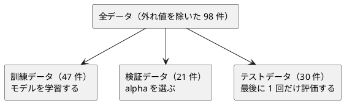

# 第 12 章: 正則化とモデル選択

## 12.1 はじめに

第 11 章では、モデルの測り方を作りました。この章では、測った結果を使って **モデルを選びます**。

- **正則化** — 係数が大きくなりすぎないように罰則を加え、過学習を抑えます。リッジ回帰を第 7 章の行列で自作します
- **モデル選択** — 正則化の強さ `alpha` を変えて実験し、**検証データ** で選びます。テストデータは最後に 1 回だけ使います

Clojure 版で見どころになるのは、次の 3 点です。

- **既存の名前空間を 1 行も変えずに演算を足す。** Java 版は `MatrixOperations` という新しいクラスに `static` メソッドを、Scala 版は拡張メソッドを用意しました。Clojure では、行列がただのベクタのベクタなので、`matrix-plus` という **ふつうの関数** をこの章に書くだけです
- **実験結果は書き換えられない。** Java 版は `record Experiment`、Scala 版は `case class` を使いました。Clojure はマップを作った時点で変わりません
- **数値は Java 版・Scala 版と完全に一致する。** 外れ値の除き方・2 回の分割・標準化・多項式の順をすべてそろえたので、**この章の実行結果の数値は 1 桁も違いません**

[Python 版の第 12 章](../python/12-regularization-and-model-selection.md) と同じ TODO リストで進め、[Java 版](../java/12-regularization-and-model-selection.md)・[Scala 版](../scala/12-regularization-and-model-selection.md) と対比します。

## 12.2 過学習と正則化

### 係数が大きくなりすぎる

線形回帰は、誤差の 2 乗の合計が最小になるように係数を決めます。特徴量が多いと、訓練データの細かな揺れにまで合わせようとして、係数の絶対値が大きくなりがちです。係数が大きいモデルは、入力が少し変わっただけで予測が大きく変わるので、未知のデータに弱くなります。

### 係数の大きさに罰則を加える

正則化は、誤差の 2 乗の合計に「係数の大きさ」への罰則を加えて最小化します。

| 手法 | 最小化するもの | 係数への効果 |
|------|--------------|------------|
| 線形回帰 | 誤差の 2 乗の合計 | 制約なし |
| リッジ回帰 | 誤差の 2 乗の合計 + `alpha` × 係数の 2 乗の合計 | 全体を小さく縮める |
| ラッソ回帰 | 誤差の 2 乗の合計 + `alpha` × 係数の絶対値の合計 | 一部の係数をちょうど 0 にする |

`alpha` は正則化の強さです。0 なら線形回帰と同じで、大きくするほど係数は小さくなります。大きすぎると、今度は訓練データにも合わなくなります（学習不足）。

### リッジ回帰の解き方

リッジ回帰は、行列の計算で係数を直接求められます（閉形式）。特徴量の行列を `X`、正解を `t` として、それぞれから平均を引いた（中心化した）うえで、次の連立一次方程式を解きます。

```text
(Xᵀ X + alpha × I) w = Xᵀ t
```

`I` は単位行列です。切片は「正解の平均 − 特徴量の平均と係数の内積」で求めます。中心化してから解くのは、**切片には罰則をかけない** ためです。第 7 章の正規方程式に `alpha × I` が加わっただけなので、第 7 章の `matrix/transpose`・`matrix/multiply`・`matrix/solve` をそのまま使えます。足りないのは、行列の足し算・数と行列の積・単位行列の 3 つです。

## 12.3 題材とデータ

### Boston.csv

この章で使うのは `Boston.csv` です。そのうち、住居の平均部屋数（`RM`）・生徒と教師の比率（`PTRATIO`）・低所得者の割合（`LSTAT`）の 3 つを特徴量に、住宅価格（`PRICE`）を正解にします。学習データの入手と配置は [第 1 章](01-machine-learning-and-first-test.md) を参照してください。

### 過学習が起きやすい状況を作る

3 つの特徴量をそれぞれ標準化（平均 0・標準偏差 1）したうえで、2 乗の列と、2 つの列の積（交互作用）の列を加えます。3 列が 9 列に増え、少ない件数に対しては過学習が起きやすくなります。第 9 章の `expand` は「多項式の列を作ってから標準化」でしたが、この章は他の言語版と同じく「**標準化してから 2 次の項を作る**」順なので、章の中に最小限の変換を用意します。

### 訓練・検証・テストの 3 つに分ける

`alpha` をテストデータの結果で選ぶと、テストデータが「未知のデータ」ではなくなります。そこで 3 つに分けます。



分割には第 2 章の `split-train-test` を 2 回使います。1 回目で全体を訓練用とテスト用に、2 回目で訓練用をさらに訓練データと検証データに分けます。

## 12.4 TODO リストの作成

**TODO リスト**:

- [ ] 行列の足し算・数と行列の積・単位行列を足す
- [ ] リッジ回帰を自作する
  - [ ] `alpha` が 0 なら最小二乗法と同じ係数と切片になる
  - [ ] `alpha` が 0 なら第 7 章の線形回帰と同じ係数になる
  - [ ] `alpha` を大きくすると係数が小さくなる
  - [ ] 切片には罰則がかからない
  - [ ] 係数と切片から予測する
- [ ] 正則化の強さごとの実験結果を記録する
- [ ] 検証データの決定係数が最も高い実験を選ぶ（同点なら先を選ぶ）
- [ ] 0 になった係数の特徴量名を返す
- [ ] 標準化してから 2 次の多項式特徴量を作る
- [ ] z スコアで外れ値の行を除く
- [ ] Tribuo の `ElasticNetCDTrainer` でラッソ回帰とリッジ回帰を表す
- [ ] 実データを 3 つに分けて、線形回帰・リッジ回帰・ラッソ回帰を比べる

## 12.5 第 7 章の行列に演算を足す

第 7 章の `matrix` 名前空間には、転置・積・連立方程式の求解があります。足りない 3 つを、この章の名前空間に書きます。

```clojure
(deftest 行列の演算
  (testing "同じ大きさの行列を足す"
    (is (= [[2.0 4.0] [6.0 8.0]] (ch/matrix-plus [[1.0 2.0] [3.0 4.0]] [[1.0 2.0] [3.0 4.0]]))))
  (testing "大きさが違えば失敗する"
    (is (thrown? IllegalArgumentException (ch/matrix-plus [[1.0 2.0]] [[1.0] [2.0]]))))
  (testing "すべての成分を定数倍する"
    (is (= [[2.0 4.0] [6.0 8.0]] (ch/matrix-scale 2.0 [[1.0 2.0] [3.0 4.0]]))))
  (testing "単位行列は対角だけが一になる"
    (is (= [[1.0 0.0 0.0] [0.0 1.0 0.0] [0.0 0.0 1.0]] (ch/identity-matrix 3))))
  (testing "単位行列を掛けても変わらない"
    (is (= x (matrix/multiply x (ch/identity-matrix 2))))))
```

```clojure
(defn matrix-plus
  "同じ大きさの行列の和。"
  [a b]
  (when-not (and (= (matrix/row-count a) (matrix/row-count b))
                 (= (matrix/column-count a) (matrix/column-count b)))
    (throw (IllegalArgumentException.
            (str (matrix/row-count a) " 行 " (matrix/column-count a) " 列の行列と "
                 (matrix/row-count b) " 行 " (matrix/column-count b) " 列の行列は足せません"))))
  (mapv #(mapv + %1 %2) a b))

(defn matrix-scale
  "すべての成分を scalar 倍した行列。"
  [scalar m]
  (mapv (fn [row] (mapv #(* scalar %) row)) m))

(defn identity-matrix
  "size 行 size 列の単位行列。"
  [size]
  (mapv (fn [i] (mapv #(if (= i %) 1.0 0.0) (range size))) (range size)))
```

Java 版は、`Matrix` クラスを変えずに済ませるために `MatrixOperations` という別のクラスに `static` メソッドを置きました（既存の型に振る舞いを足せないからです）。Scala 版は暗黙の変換で拡張メソッドにしました。**Clojure では、この悩みが起きません。** 行列は言語のベクタそのもので、誰のものでもないので、関数を書く場所を悩む必要がありません。`matrix-plus` を `chapter07.matrix` に置くか `chapter12` に置くかは「どの章の読者に見せたいか」という編集上の判断だけです。ここは第 7 章を読み終えた人が第 12 章で出会うものとして、この章に置きました。

`(mapv #(mapv + %1 %2) a b)` は「行ごとに、成分ごとに足す」です。`mapv` に 2 つのコレクションを渡すと対応する要素どうしを渡すので、二重のループが 1 行になります。長さの検査を先に書いているのは、第 11 章と同じ理由です（`mapv` は短いほうで止まります）。

`(= x (matrix/multiply x (ch/identity-matrix 2)))` が `=` の 1 行で書けるのは、行列が値だからです。Java 版は `assertThat(...).isEqualTo(...)` の前に `Matrix` に `equals` を実装する必要がありました。

## 12.6 リッジ回帰を自作する

### Red: 最小二乗法と同じになるテスト

`alpha` が 0 なら、リッジ回帰は最小二乗法と一致するはずです。答えの分かるデータで固定します。

```clojure
(def ^:private x
  "1 列ずつずらした 2 列の特徴量。"
  [[1.0 2.0] [2.0 1.0] [3.0 4.0] [4.0 3.0] [5.0 6.0]])

(def ^:private t
  "x の 1 列目の 2 倍と 2 列目の 3 倍に 1 を足した正解。"
  [9.0 8.0 19.0 18.0 29.0])

(deftest リッジ回帰
  (testing "alpha が零なら最小二乗法と同じ解になる"
    (let [model (ch/ridge-fit x t 0.0)]
      (is (close-to-all? [2.0 3.0] (:coefficients model)))
      (is (close-to? 1.0 (:intercept model)))))
  (testing "第 7 章の正規方程式と同じ係数と切片になる"
    (let [features (mapv (fn [[a b]] {:a a :b b}) x)
          theirs (chapter07/fit features t [:a :b])
          mine (ch/ridge-fit x t 0.0)]
      (is (close-to-all? (mapv second (:coefficients theirs)) (:coefficients mine)))
      (is (close-to? (:intercept theirs) (:intercept mine)))))
  (testing "alpha を大きくするほど係数は小さくなる"
    (let [sums (mapv #(ch/coefficient-abs-sum (ch/ridge-fit x t %)) [0.0 1.0 10.0 100.0])]
      (is (= sums (reverse (sort sums))))
      (is (< (last sums) (first sums)))))
  (testing "切片には罰則がかからないので正解の平均に近づく"
    (is (close-to? (/ (reduce + t) (count t)) (:intercept (ch/ridge-fit x t 1e9)) 1e-3)))
  (testing "件数が違えば失敗する"
    (is (thrown? IllegalArgumentException (ch/ridge-fit x [1.0] 0.0)))))
```

2 つ目のテストは、第 7 章の `fit`（マップの特徴量と列名を受け取る）との突き合わせです。**同じ計算を 2 通りの入口で書いたことが、どちらのバグも見つけます。**

4 つ目は、`alpha` を極端に大きく（`1e9`）すると係数がほぼ 0 になり、切片が正解の平均に近づくことを確かめます。「切片には罰則をかけない」という設計判断を、性質として書いたテストです。

### Green: 中心化して解く

```clojure
(defn ridge-fit
  "特徴量と正解から平均を引いてから (Xᵀ X + alpha I) w = Xᵀ t を解いて係数を求め、切片は平均値から求める。
   平均を引くのは、切片に罰則をかけないため。alpha が 0 なら最小二乗法と同じ解になる。"
  [x t alpha]
  (when-not (= (matrix/row-count x) (count t))
    (throw (IllegalArgumentException.
            (str "特徴量と正解の件数が違います: " (matrix/row-count x) " と " (count t)))))
  (let [x-means (column-means x)
        t-mean (/ (reduce + t) (count t))
        xc (center x x-means)
        tc (matrix/column-vector (mapv #(- % t-mean) t))
        xct (matrix/transpose xc)
        penalized (matrix-plus (matrix/multiply xct xc)
                               (matrix-scale alpha (identity-matrix (count x-means))))
        coefficients (matrix/column (matrix/solve penalized (matrix/multiply xct tc)) 0)]
    {:coefficients coefficients
     :intercept (- t-mean (reduce + (map * x-means coefficients)))}))
```

`let` の束縛が、そのまま式の組み立ての順になっています。`(Xᵀ X + alpha I) w = Xᵀ t` の左辺が `penalized`、右辺が `(matrix/multiply xct tc)` で、`matrix/solve` に渡しています。

モデルは `{:coefficients [..] :intercept ..}` のマップです。Java 版は `record RegularizedModel(List<Double> coefficients, double intercept)` を、Scala 版は `case class` を定義しました。Clojure ではリテラルを書いて返すだけで、「書き換えられない」ことは言語がもとから保証しています。

### 予測する

```clojure
(defn predict
  "行ごとの予測値。行列の列数は係数の数と同じでなければならない。"
  [{:keys [coefficients intercept]} x]
  (when-not (= (matrix/column-count x) (count coefficients))
    (throw (IllegalArgumentException.
            (str "特徴量の列数 " (matrix/column-count x) " と係数の数 " (count coefficients) " が違います"))))
  (mapv (fn [row] (reduce + intercept (map * row coefficients))) x))
```

`(reduce + intercept (map * row coefficients))` が「切片から始めて、係数と特徴量の積を足していく」です。初期値を切片にすると、内積と切片の足し算を 1 つの式で書けます。

列数の検査があるのは、行列の列の順と係数の順が **位置で対応している** からです。第 7 章のモデルは `[[列名 係数] …]` と名前で対応させていましたが、この章は多項式で作った 9 列を扱うので、位置で持つほうが素直でした。そのぶん、取り違えを型が守ってくれないので、実行時に確かめます。

## 12.7 実験結果を記録して選ぶ

`alpha` ごとに学習し、訓練データと検証データの決定係数と、係数の絶対値の合計を記録します。

```clojure
(defn run-ridge-experiments
  "alpha ごとにリッジ回帰を訓練データで学習し、訓練データと検証データの決定係数を記録する。"
  [x-train t-train x-valid t-valid alphas]
  (mapv (fn [alpha]
          (let [model (ridge-fit x-train t-train alpha)]
            {:alpha alpha
             :train-score (metrics/r2-score t-train (predict model x-train))
             :validation-score (metrics/r2-score t-valid (predict model x-valid))
             :coefficient-abs-sum (coefficient-abs-sum model)}))
        alphas))
```

決定係数は第 7 章の `metrics/r2-score` をそのまま使います。第 7 章で Tribuo と突き合わせてあるので、この章で作り直す理由がありません。

選ぶところには、Clojure の癖があります。

```clojure
(defn best-experiment
  "検証データの決定係数が最も高い実験。同じ値なら先の実験を選ぶ。
   max-key は同点なら後ろを返すので、厳密な不等号で畳む。"
  [experiments]
  (when (empty? experiments)
    (throw (IllegalArgumentException. "実験結果が 1 件もありません")))
  (reduce (fn [best experiment]
            (if (> (:validation-score experiment) (:validation-score best)) experiment best))
          experiments))
```

`(apply max-key :validation-score experiments)` と書きたくなりますが、`max-key` は **同じ値のとき後ろの要素を返します**。第 3 章の最頻値、第 8 章の葉のラベル、第 10 章の多数決でも同じ落とし穴がありました。Java 版の `max(Comparator.comparingDouble(...))` と Scala 版の `maxBy` は先を返すので、そろえるには厳密な `>` で畳みます。

```clojure
    (testing "同じ値なら先の実験を選ぶ"
      (is (= 1.0 (:alpha (ch/best-experiment [{:alpha 1.0 :validation-score 0.5}
                                              {:alpha 2.0 :validation-score 0.5}])))))
```

この 3 行のテストが、**「なぜ `max-key` を使わなかったか」を将来の読者に説明します。** コメントだけでは、次の人が「短く書ける」と直してしまいます。

## 12.8 0 になった係数の特徴量名を返す

ラッソ回帰は、一部の係数をちょうど 0 にします。どの特徴量が落ちたかを名前で返します。

```clojure
(defn zero-coefficient-names
  "係数がちょうど 0 になった特徴量の名前を、列の順に返す。"
  [coefficients feature-names]
  (when-not (= (count coefficients) (count feature-names))
    (throw (IllegalArgumentException. "係数と特徴量名の数が違います")))
  (vec (keep (fn [[value name*]] (when (zero? value) name*))
             (map vector coefficients feature-names))))
```

`keep` は「`nil` でない結果だけを残す」ので、`filter` してから `map` するより 1 段少なく書けます。`(map vector a b)` で 2 つの並びを組にしてから畳むのは、Clojure でよく使う形です。

`(zero? value)` は厳密な 0 との比較です。「ほぼ 0」ではありません。ラッソ回帰が係数を **ちょうど** 0 にすることが、この手法の性質そのものだからです。

## 12.9 最小限の前処理

### 標準化してから 2 次の項を作る

```clojure
(defn scaler-fit
  "訓練データの列ごとの平均と、件数 n で割る標準偏差を求める。"
  [x columns]
  (let [stats (mapv (fn [column]
                      (let [values (mapv #(get % column) x)
                            mean (/ (reduce + values) (count values))]
                        [mean (Math/sqrt (/ (reduce + (map #(let [d (- % mean)] (* d d)) values))
                                            (count values)))]))
                    columns)]
    {:columns (vec columns) :means (mapv first stats) :stds (mapv second stats)}))

(defn scaler-transform
  "標準化した値と、その 2 次の項を並べた行列にする。"
  [{:keys [columns means stds]} x]
  (let [ps (pairs (count columns))]
    (mapv (fn [features]
            (let [z (mapv (fn [column mean std] (/ (- (get features column) mean) std))
                          columns means stds)]
              (into z (map (fn [[i j]] (* (z i) (z j)))) ps)))
          x)))
```

- 標準偏差は **件数 `n` で割る母標準偏差** です（第 9 章の `standardizer` と同じ）。12.10 節の外れ値の検出では `n - 1` で割る標本標準偏差を使うので、同じ章の中で 2 つの流儀が混ざります。Java 版・Scala 版も同じ使い分けをしているので、数値をそろえるためにそのまま合わせました
- `(mapv f columns means stds)` と 3 つのコレクションを渡して、列名・平均・標準偏差を同時に回しています
- `(z i)` は「ベクタを関数として呼ぶ」記法で、`(nth z i)` と同じです。2 次の項が「標準化した値どうしの積」であることが短く書けます

列名も同じ順で作ります。

```clojure
(defn feature-names
  "変換後の列名。元の列、2 乗の列（\"RM^2\"）、積の列（\"RM LSTAT\"）の順。"
  [{:keys [columns]}]
  (into (mapv name columns)
        (map (fn [[i j]]
               (if (= i j)
                 (str (name (columns i)) "^2")
                 (str (name (columns i)) " " (name (columns j))))))
        (pairs (count columns))))
```

`pairs` が返す `[i j]`（`i <= j`）の並びを、変換と名前づけの **両方が同じ順で使う** ので、列と名前がずれません。第 9 章の `term-name` と同じ形の名前（scikit-learn の `get_feature_names_out` に合わせた `"RM^2"`・`"RM LSTAT"`）にしています。

### z スコアで外れ値を除く

```clojure
(defn remove-outliers
  "列ごとの z スコア（標準偏差は件数 n - 1 で割る標本標準偏差）の絶対値が
   threshold を超える値を 1 つでも持つ行を除く。"
  [table columns threshold]
  (let [stats (mapv (fn [column] …) columns)]
    (update table :rows
            (fn [rows]
              (vec (remove (fn [row]
                             (some (fn [[column mean std]]
                                     (> (abs (/ (- (chapter02/number row column) mean) std))
                                        threshold))
                                   stats))
                           rows))))))
```

第 9 章は IQR（四分位範囲）で外れ値を見ましたが、この章は z スコア（平均から標準偏差の何倍離れているか）です。**外れ値の定義は 1 つではない** ので、章ごとに違う定義を試しています。

`(update table :rows f)` は、表のマップの `:rows` だけを `f` で作り直します。`:columns` はそのまま残ります。Java 版が `new Table(table.columns(), kept)` と全部のフィールドを書き直したのに比べて、**変えたい部分だけを書く** 形です。

テストは、明らかに外れた 1 件を混ぜたデータで確かめます。学習データの行は書きません。

```clojure
(deftest 外れ値を除く
  (let [table {:columns [:v] :rows (conj (mapv (fn [v] {:v (str v)}) (range 20)) {:v "1000"})}]
    (testing "z スコアが閾値を超える行を除く"
      (is (= 20 (count (:rows (ch/remove-outliers table [:v] 3.0))))))
    (testing "閾値を上げれば残る"
      (is (= 21 (count (:rows (ch/remove-outliers table [:v] 10.0))))))))
```

## 12.10 Tribuo の ElasticNetCDTrainer で表す

### ElasticNetCDTrainer が最小化するもの

ラッソ回帰は、係数の絶対値への罰則が微分できない点を含むため、1 回の行列計算では解けません。Python 版・Kotlin 版と同じく自作はせず、Tribuo の `ElasticNetCDTrainer`（座標降下法）を使います。このトレーナーは、特徴量を中心化したうえで次を最小化します（`n` は件数）。

```text
(1/2n) × 誤差の 2 乗の合計 + alpha × l1Ratio × 係数の絶対値の合計 + (alpha × (1 − l1Ratio) / 2) × 係数の 2 乗の合計
```

12.2 節のリッジ回帰（`誤差の 2 乗の合計 + λ × 係数の 2 乗の合計`）と比べると全体が `1/2n` 倍なので、自作の `alpha` は `ElasticNetCDTrainer` の `alpha × (1 − l1Ratio) × n` に当たります。**同じ尺度で比べるには、自作の `alpha` を件数 `n` で割って渡します。**

### Red: ラッソ回帰とリッジ回帰のテスト

```clojure
(deftest TribuoのElasticNetCDTrainerと突き合わせる
  (testing "同じ alpha の尺度でリッジ回帰の係数と切片が一致する"
    (doseq [alpha [0.1 1.0 10.0]]
      (let [mine (ch/ridge-fit x t alpha)
            theirs (ch/fit-ridge x t alpha)]
        (is (close-to-all? (:coefficients mine) (:coefficients theirs) 1e-6) (str "alpha=" alpha))
        (is (close-to? (:intercept mine) (:intercept theirs) 1e-6) (str "alpha=" alpha)))))
  (testing "ラッソ回帰は係数をちょうど零にする"
    (let [noisy (mapv (fn [[a b]] [a b (* 0.001 a)]) x)
          lasso (ch/fit-lasso noisy t 1.0)]
      (is (= 3 (count (:coefficients lasso))))
      (is (seq (ch/zero-coefficient-names (:coefficients lasso) ["a" "b" "noise"])))))
  (testing "l1Ratio に零は受け付けないので極小の値を使う"
    (is (thrown-with-msg? com.oracle.labs.mlrg.olcut.config.PropertyException
                          #"L1 Ratio must be between 0 and 1"
                          (ch/fit-elastic-net x t 0.1 0.0)))
    (is (some? (ch/fit-elastic-net x t 0.1 1e-12))))
  (testing "ラッソ回帰は alpha が強いほど係数が小さくなる"
    (is (< (ch/coefficient-abs-sum (ch/fit-lasso x t 5.0))
           (ch/coefficient-abs-sum (ch/fit-lasso x t 0.1))))))
```

3 つ目のテストで、`l1Ratio = 0`（純粋なリッジ回帰）が受け付けられないことを固定しました。最初は `IllegalArgumentException` を期待して書き、実際には OLCUT の `PropertyException`（`Component: l1Ratio, L1 Ratio must be between 0 and 1. Found value 0.0`）が飛ぶことが分かりました。`thrown-with-msg?` でメッセージまで固定しているので、ライブラリの更新でこの制約が変わればテストが教えてくれます。代わりに使う極小の値 `1e-12` は、Kotlin 版（ADR 002）・Java 版と同じにしています。

### Green: 行列を Tribuo のデータセットに変換する

```clojure
(defn tribuo-columns
  "Tribuo に渡すときの列名。Tribuo は列名の順に特徴量を並べ替えるので、桁をそろえた名前にする。"
  [n]
  (mapv #(keyword (format "x%02d" %)) (range n)))

(defn fit-elastic-net
  "ElasticNetCDTrainer で学習し、係数と切片を取り出す。
   Tribuo は特徴量の平均を引いてから学習するので、切片は特徴量と正解の平均値から求める。"
  [x t alpha l1-ratio]
  (let [columns (tribuo-columns (matrix/column-count x))
        trainer (ElasticNetCDTrainer. (double alpha) (double l1-ratio) (double tolerance)
                                      (int max-iterations) false 0)
        ^SparseLinearModel model (tribuo/train trainer (to-features x columns) t columns)
        ^SparseVector weights (first (vals (.getWeights model)))
        coefficients (mapv (fn [column]
                             (.get weights (.getID (.get (.getFeatureIDMap model) (name column)))))
                           columns)
        x-means (column-means x)]
    {:coefficients coefficients
     :intercept (- (/ (reduce + t) (count t)) (reduce + (map * x-means coefficients)))}))

(defn fit-lasso
  "l1Ratio を 1 にしたラッソ回帰。"
  [x t alpha]
  (fit-elastic-net x t alpha 1.0))

(defn fit-ridge
  "自作のリッジ回帰と同じ alpha の尺度で、ElasticNetCDTrainer にリッジ回帰を学習させる。
   ElasticNetCDTrainer は誤差の 2 乗の合計を 2n で割った値に罰則を足すので、alpha を件数 n で割って渡す。"
  [x t alpha]
  (fit-elastic-net x t (/ alpha (count t)) min-l1-ratio))
```

- データセットへの変換は、第 7 章の `chapter07.tribuo/train` をそのまま使えます。行列の行をマップに変えるだけです
- 列名を `x00`・`x01` … と **桁をそろえている** のは、Tribuo が特徴量を名前の順に並べ替えるからです。`x0`・`x1` … `x10` だと、名前の順では `x1` の次が `x10` になります。9 列のうちは問題になりませんが、名前の順に依存する設計だと分かった以上、最初からそろえておきます
- 係数の取り出しは、`getFeatureIDMap` で列名から ID を引き、`SparseVector` から読みます。Tribuo は 0 の係数を持たない疎ベクトルなので、`.get` は存在しない ID に対して 0 を返します。ラッソ回帰で 0 になった列が **そのまま 0 として読めます**
- Tribuo は特徴量の平均を引いてから学習するので、切片は自分で「正解の平均 − 特徴量の平均と係数の内積」から求めます。自作の `ridge-fit` と同じ式です

## 12.11 実データで比べる

### 3 つに分けて特徴量を作る

```clojure
(defn prepare-boston
  "外れ値を除き、全体を訓練用とテスト用に、訓練用をさらに訓練データと検証データに分ける。
   標準化の平均と標準偏差は訓練データだけから求め、3 つとも同じ値で変換する。"
  [csv-file test-size validation-size seed]
  (let [table (remove-outliers (chapter02/load-table csv-file)
                               (conj feature-columns target) outlier-threshold)
        x (mapv (fn [row] (into {} (map (fn [column] [column (chapter02/number row column)]))
                                feature-columns))
                (:rows table))
        t (mapv #(chapter02/number % target) (:rows table))
        outer (chapter02/split-train-test x t test-size seed)
        inner (chapter02/split-train-test (:x-train outer) (:t-train outer) validation-size seed)
        scaler (scaler-fit (:x-train inner) feature-columns)]
    {:x-train (scaler-transform scaler (:x-train inner)) :t-train (:t-train inner)
     :x-valid (scaler-transform scaler (:x-test inner)) :t-valid (:t-test inner)
     :x-test (scaler-transform scaler (:x-test outer)) :t-test (:t-test outer)
     :feature-names (feature-names scaler)
     :kept (count (:rows table))}))
```

標準化の平均と標準偏差は **訓練データだけ** から求め、検証データ・テストデータも同じ値で変換します。検証データやテストデータの統計を使うと、それも情報の漏れ（リーク）になります。第 8 章のパイプラインと同じ約束です。

### 結果を表示する

```console
$ clojure -M:run chapter12
データ件数: 98（外れ値 2 件を除外）
訓練データ: 47 件, 検証データ: 21 件, テストデータ: 30 件
特徴量: RM, PTRATIO, LSTAT, RM^2, RM PTRATIO, RM LSTAT, PTRATIO^2, PTRATIO LSTAT, LSTAT^2
alpha  訓練 R²  検証 R²  係数の絶対値の合計
  0.0  0.8827  0.7272  14.187
  0.1  0.8827  0.7274  14.104
  1.0  0.8823  0.7288  13.594
 10.0  0.8681  0.7349  11.573
100.0  0.6583  0.5985  5.684
検証データで選んだ alpha: 10.0
テストデータの決定係数: 線形回帰 0.5224, リッジ回帰 0.6243
ラッソ回帰（alpha=0.5）で係数が 0 になった特徴量: PTRATIO^2, PTRATIO LSTAT, LSTAT^2
```

表示の前に、Tribuo の座標降下法が収束のたびに出す INFO のログを止めています。

```clojure
  ;; Tribuo の座標降下法が収束のたびに出す INFO のログを表示しない
  (.setLevel (Logger/getLogger (.getName ElasticNetCDTrainer)) Level/WARNING)
```

Java 版は「`Logger` が弱い参照で管理されるので、設定した `Logger` を `static final` で持ち続ける」という注意書きを添えていました。Clojure 版の `run` は 1 回の実行の中で表示まで終えるので、束縛を保持しなくても消えません。長く動くプログラムなら同じ注意が要ります。

### 結果を読む

- `alpha` を大きくするほど、係数の絶対値の合計は 14.187 から 5.684 へ小さくなりました。訓練データの決定係数は下がり続けます
- 検証データの決定係数は `alpha = 10.0` で最も高く（0.7349）、`100.0` では訓練・検証とも大きく下がりました。正則化が強すぎて学習不足になっています
- 検証データで選んだ `alpha = 10.0` のリッジ回帰は、テストデータの決定係数が 0.6243 で、線形回帰の 0.5224 を上回りました。**訓練データでは線形回帰のほうが高い（0.8827）のに、未知のデータでは正則化したモデルのほうがよく当たっています**
- ラッソ回帰は、9 列のうち `PTRATIO^2`・`PTRATIO LSTAT`・`LSTAT^2` の 3 列の係数をちょうど 0 にしました

**実行結果の数値は、Java 版・Scala 版の 12.10 節とすべて一致します。** 外れ値の除き方（`n - 1` の標準偏差で z スコア）・2 回の分割・標準化（`n` の標準偏差）・2 次の項の順を、手順の細部までそろえたためです。Kotlin 版では同じ手順でもリッジ回帰がテストで線形回帰を下回りました。分割の乱数が違い、3 つに入る行が違うからです。100 件ほどのデータでは、**分け方によって結論まで変わりうる** ことを示しています。1 回の分け方に頼らない方法として、第 11 章の交差検証を組み合わせられます。

### 実データのテスト

```clojure
(deftest 実データでも自作のリッジ回帰はTribuoのElasticNetCDTrainerと一致する
  ;; 係数と切片は Java 版・Scala 版と一致する（分割も手順も同じため）
  (when (data?)
    (let [{:keys [x-train t-train]} (boston)
          mine (ch/ridge-fit x-train t-train 10.0)
          theirs (ch/fit-ridge x-train t-train 10.0)]
      (is (every? true? (map #(< (abs (- %1 %2)) 1e-6)
                             (:coefficients mine) (:coefficients theirs))))
      (is (< (abs (- (:intercept mine) (:intercept theirs))) 1e-6)))))
```

人工データで一致していても、実データ（9 列・47 件）でも一致するとは限りません。閉形式と反復計算が同じ答えに行き着くことを、本番に近い条件で確かめます。許容誤差 `1e-6` は、座標降下法の打ち切り（`tolerance` は `1e-10`）に見合う大きさです。

表示は、第 1 章から続けている形のテストで固定します。学習データが無ければ、理由を標準エラーに出して早く戻ります。

```clojure
(defn- data?
  "学習データがあるかどうかを返す。無ければ理由を標準エラーに出す。"
  []
  (or (.exists (java.io.File. ^String @csv-file))
      (binding [*out* *err*]
        (println "学習データ Boston.csv が配置されていない（gulp data:setup）のでスキップする")
        false)))
```

## 12.12 品質チェック

```console
$ cljfmt check src test && clj-kondo --lint src test --fail-level warning && clojure -M:test
All source files formatted correctly
linting took 910ms, errors: 0, warnings: 0
…
Ran 139 tests containing 382 assertions.
0 failures, 0 errors.
```

```console
$ clojure -M:coverage
|-------------------------------------------+---------+---------|
|                                 Namespace | % Forms | % Lines |
|-------------------------------------------+---------+---------|
|              getting-started-ml.chapter12 |   98.55 |  100.00 |
|-------------------------------------------+---------+---------|
```

この章では Tribuo の追加の成果物は要りませんでした。`ElasticNetCDTrainer` は、第 7 章で入れた `tribuo-regression-slm` に含まれています。

## 12.13 可視化について

Clojure 版では Notebook と可視化を扱いません。`alpha` と決定係数の関係、係数の大きさの推移（正則化パス）のグラフは、[Python 版の第 12 章](../python/12-regularization-and-model-selection.md) と [Kotlin 版の第 12 章](../kotlin/12-regularization-and-model-selection.md) を参照してください。

`run-ridge-experiments` が返すのはマップのベクタなので、`(mapv :coefficient-abs-sum experiments)` のように、見たい列だけを取り出してそのまま並べられます。

## 12.14 まとめ

この章では、リッジ回帰を自作し、検証データでモデルを選ぶ流れを Clojure の TDD で実装しました。

| 作ったもの | Clojure での表し方 | 他の版 |
|-----------|------------------|-------|
| 行列の足し算・定数倍・単位行列 | ふつうの関数 | `MatrixOperations` の `static` メソッド / 拡張メソッド |
| 正則化したモデル | `{:coefficients [..] :intercept ..}` | `record` / `case class` |
| 実験結果 | `{:alpha .. :train-score .. …}` | `record Experiment` / `case class` |
| 前処理（標準化と多項式） | 平均と標準偏差を持つマップ + 2 つの関数 | `record PolynomialScaler` |

Clojure 版ならではの学びです。

1. **既存の型に演算を足す悩みが無い** — 行列が言語のベクタそのものなので、拡張メソッドも別クラスも要らない。関数をどこに書くかは、設計の制約ではなく編集上の判断になった
2. **`max-key` は同点で後ろを返す** — モデル選択の同点は「先を選ぶ」でそろえるため、厳密な `>` で畳んだ。3 行のテストが、短く書き直そうとする将来の自分を止める
3. **変えたいところだけ書く** — `(update table :rows f)` で、表の列はそのままに行だけを作り直した。全部のフィールドを書き写す必要がない
4. **ベクタは関数** — 2 次の項が `(* (z i) (z j))` と短く書ける。`pairs` の並びを変換と名前づけの両方で使うので、列と名前がずれない
5. **例外の型は当ててみないと分からない** — `l1Ratio = 0` は `IllegalArgumentException` ではなく OLCUT の `PropertyException` だった。`thrown-with-msg?` でメッセージまで固定して、ライブラリ側の約束をテストに残した
6. **手順の細部が数値を決める** — 標準偏差を `n` で割るか `n - 1` で割るか、分割を何回どの順でかけるか。ここまでそろえたので、実行結果の数値が Java 版・Scala 版と完全に一致した

次の章では、特徴量を減らして構造を見る主成分分析を実装します。
