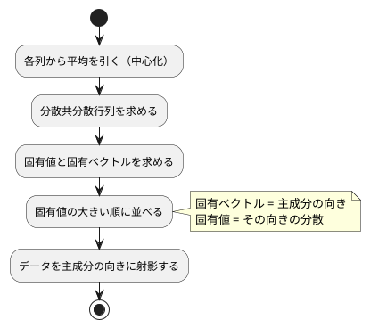

# 第 13 章: 主成分分析による次元削減

## 13.1 はじめに

ここまでの章では、正解ラベルのあるデータで予測をしてきました。この章から扱う **教師なし学習** では、正解ラベルを使わずに、データそのものの構造を調べます。

最初に扱うのは **主成分分析（PCA）** です。住宅価格のデータには 15 個もの列がありますが、列どうしは互いに関係しあっていて、実際にはもっと少ない数の「軸」で大部分を説明できることがあります。主成分分析は、データのばらつきを最もよく説明する新しい軸を探し、たくさんの列を少数の軸に要約します。

[Python 版の第 13 章](../python/13-principal-component-analysis.md) は NumPy の固有値分解で主成分分析を自作し、scikit-learn の `PCA` と突き合わせました。[Java 版](../java/13-principal-component-analysis.md) と [Scala 版](../scala/13-principal-component-analysis.md) は、第 7 章の行列型と Tribuo の `DenseMatrix` の固有値分解を組み合わせました。Clojure 版も同じ構成です。分散共分散行列は [第 7 章](07-linear-regression.md) で作った `getting-started-ml.chapter07.matrix`（行列を「長さのそろったベクタのベクタ」でそのまま表す名前空間）で求め、固有値分解だけを Tribuo に任せます。

Tribuo には主成分分析のモジュールが無いので、この章にはライブラリへの置き換えの節がありません（理由は 13.12 節）。その代わりに、Tribuo の固有値分解の振る舞いを **学習用テスト** で確かめ、主成分分析が満たすべき数学的な性質をテストにして、自作の実装を検証します。

Notebook と可視化の節は設けません。累積寄与率のグラフや主成分の散布図は [Python 版](../python/13-principal-component-analysis.md) を参照してください。

## 13.2 主成分分析とは

### ばらつきが最も大きい方向を探す

2 つの列が強く相関しているデータを散布図にすると、点は斜めの帯のように並びます。このとき、帯に沿った方向の 1 本の軸を取れば、2 つの列の情報をほぼ 1 つの数値で表せます。この「ばらつき（分散）が最も大きい方向」が **第 1 主成分** です。第 2 主成分は、第 1 主成分と直交する方向のうち、ばらつきが最も大きい方向です。

### 分散共分散行列の固有ベクトル

主成分は、次の手順で求められます。



**分散共分散行列** は、対角に各列の分散、それ以外に 2 列の共分散を並べた行列です。この行列の **固有ベクトル** が主成分の向き、**固有値** がその向きのデータの分散になります。行列 `A` の固有ベクトル `v` と固有値 `λ` は、`A v = λ v`（`A` を掛けても向きが変わらず、長さだけが `λ` 倍になる）を満たします。

### 寄与率

固有値は、その主成分が説明する分散の大きさです。固有値を全体の合計で割った値を **寄与率** と呼び、大きい順に足し上げたものを **累積寄与率** と呼びます。「累積寄与率が 0.8 に届くまで」といった目安で、使う主成分の数を決めます。

## 13.3 題材とデータ

ボストンの住宅価格（`Boston.csv`、100 件）を使います。[第 9 章](09-feature-engineering.md) では `PRICE` を予測する回帰の題材でしたが、この章では正解ラベルを使わないので、`PRICE` も含めたすべての列を主成分分析にかけます。`CRIME` はカテゴリ値なのでダミー変数にし、`RM` の欠損値は列の平均値で補完します。

主成分分析は「ばらつきの大きさ」を見るので、単位の大きい列（`TAX` は数百、`NOX` は 0.5 前後）がそのままでは支配的になります。そこで、[第 9 章](09-feature-engineering.md) の標準化ですべての列を平均 0・標準偏差 1 にそろえてから分析します。

## 13.4 TODO リストの作成

```text
[ ] 列ごとの平均を求める
[ ] 各列から平均を引く（中心化）
[ ] 分散共分散行列を求める
[ ] Tribuo の固有値分解の振る舞いを学習用テストで確かめる
[ ] 分散共分散行列を固有値分解して主成分を求める
[ ] 固有ベクトルの符号をそろえる
[ ] 寄与率と累積寄与率を求める
[ ] データを主成分の向きに射影する
[ ] 累積寄与率がしきい値に届く主成分の数を求める
[ ] 主成分への影響が大きい列を求める
[ ] Boston を前処理して実データで要約する
```

## 13.5 分散共分散行列を求める

最初のテストは、2 列の分散と共分散です。`[[1 2] [2 4] [3 6]]` は 2 列目が 1 列目のちょうど 2 倍なので、1 列目の分散が 1、2 列目の分散が 4、共分散が 2 になります。

```clojure
(deftest 分散共分散行列は分散と共分散を並べる
  (testing "2 列の分散と共分散"
    (let [c (ch/covariance-matrix [[1.0 2.0] [2.0 4.0] [3.0 6.0]])]
      (is (close-to? 1.0 (get-in c [0 0])))
      (is (close-to? 4.0 (get-in c [1 1])))
      (is (close-to? 2.0 (get-in c [0 1])))
      (is (= (get-in c [0 1]) (get-in c [1 0])))))
```

実装は、列ごとの平均を引いてから、第 7 章の転置と積を使って `Xcᵀ Xc / (n − 1)` を求めるだけです。

```clojure
(defn column-means
  "列ごとの平均を返す。"
  [m]
  (mapv (fn [j] (let [values (matrix/column m j)]
                  (/ (reduce + values) (count values))))
        (range (matrix/column-count (matrix/check m)))))

(defn center
  "各列から平均を引く（中心化）。"
  [m means]
  (mapv (fn [row] (mapv - row means)) m))

(defn covariance-matrix
  "列ごとの分散と、2 列ずつの共分散を並べた行列。件数から 1 を引いた数で割る。"
  [m]
  (let [c (center m (column-means m))
        n (matrix/row-count m)]
    (mapv (fn [row] (mapv #(/ % (dec n)) row))
          (matrix/multiply (matrix/transpose c) c))))
```

`center` の本体が `(mapv (fn [row] (mapv - row means)) m)` の 1 行で済むのは、`mapv` が複数のコレクションを受け取れるからです。`(mapv - row means)` は「行と平均のベクタを要素ごとに引く」という意味で、[Java 版](../java/13-principal-component-analysis.md) が二重ループと配列の写しで書いた処理がそのまま式になります。スカラー倍（`(dec n)` で割る処理）も同じく `mapv` の入れ子で書けます。第 7 章の行列は変更できないベクタなので、`center` が元の行列を壊す心配もありません。

## 13.6 Tribuo の固有値分解を確かめる

### 学習用テストを書く

固有値分解は Tribuo の `DenseMatrix` に任せます。使う前に、振る舞いを **学習用テスト**（自分の予想をテストの形で確かめる小さなテスト）で固定します。確かめたいのは 3 つです。固有値は大きい順か小さい順か、固有ベクトルの取り出し方、対称でない行列を渡したときどうなるか。

```clojure
(deftest Tribuoの固有値分解は固有値を大きい順に返す
  (let [^DenseMatrix m (DenseMatrix/createDenseMatrix
                        (into-array [(double-array [2.0 0.0]) (double-array [0.0 5.0])]))
        eigen (.orElseThrow (.eigenDecomposition m))]
    (is (= [5.0 2.0] (vec (.toArray (.eigenvalues eigen)))))))
```

対角に 2 と 5 が並ぶ行列の固有値は 2 と 5 です。返ってきたのは `[5.0 2.0]` で、**大きい順** でした。主成分は寄与率の大きい順に欲しいので、並べ替えは要りません。

Clojure から Java の 2 次元配列を作るときは `(into-array [(double-array [...]) ...])` と書きます。`double-array` が 1 行、`into-array` がその配列の配列を作ります。

固有ベクトルの性質も確かめます。`i` 番目の固有ベクトルは、元の行列を掛けても向きが変わらず、`i` 番目の固有値倍になるはずです。

```clojure
(deftest Tribuoの固有ベクトルは掛けても向きが変わらず固有値倍になる
  (let [^DenseMatrix m (DenseMatrix/createDenseMatrix
                        (into-array [(double-array [2.0 1.0]) (double-array [1.0 2.0])]))
        eigen (.orElseThrow (.eigenDecomposition m))
        values (vec (.toArray (.eigenvalues eigen)))]
    (doseq [i (range 2)]
      (let [v (vec (.toArray (.getEigenVector eigen i)))
            multiplied (first (matrix/transpose
                               (matrix/multiply (mapv vec (map vec (.toArray m)))
                                                (matrix/column-vector v))))]
        (is (every? true? (map #(close-to? %1 (* (values i) %2)) multiplied v)))))))
```

### ドキュメントの記述をテストに固定する

`eigenDecomposition` が返すのは `Optional` です。ドキュメントには「対称行列でなければ空を返す」とあります。この記述もテストにしておきます。

```clojure
(deftest 対称でない行列は固有値分解できない
  (let [^DenseMatrix m (DenseMatrix/createDenseMatrix
                        (into-array [(double-array [1.0 2.0]) (double-array [3.0 4.0])]))]
    (is (not (.isPresent (.eigenDecomposition m))))))
```

分散共分散行列は必ず対称なので通常は空になりませんが、空だったときに黙って進まないよう、実装では例外にします。

```clojure
(defn eigen-decomposition
  "Tribuo で対称行列を固有値分解し、固有値と固有ベクトルを大きい順に返す。
   対称でない行列は分解できないので失敗する。"
  [m]
  (let [^DenseMatrix dense (DenseMatrix/createDenseMatrix
                            (into-array (map double-array m)))
        decomposition (.eigenDecomposition dense)]
    (when-not (.isPresent decomposition)
      (throw (IllegalArgumentException. "固有値分解できません（対称行列ではありません）")))
    (let [eigen (.get decomposition)
          values (vec (.toArray (.eigenvalues eigen)))]
      {:values values
       :vectors (mapv #(vec (.toArray (.getEigenVector eigen %))) (range (count values)))})))
```

Tribuo に渡す直前で `double-array` に落とし、返ってきた `DenseVector` はすぐ `vec` でベクタに戻します。**配列で扱うのはライブラリの境界だけ** という方針は、[第 7 章](07-linear-regression.md)・[第 10 章](10-logistic-regression-and-ensemble.md) と同じです。

## 13.7 主成分を求める

### 完全に相関する 2 列

2 列目が 1 列目のちょうど 2 倍なら、点は 1 本の直線に並びます。第 1 主成分だけで分散をすべて説明できるはずです。

```clojure
(deftest 完全に相関する二列なら第一主成分だけで分散をすべて説明する
  (let [model (ch/fit (correlated) 2)]
    (is (close-to? 1.0 (first (:explained-variance-ratio model))))
    (is (close-to? 0.0 (second (:explained-variance-ratio model))))))
```

学習した結果は、`Java` 版の `PcaModel` レコードにあたるものをマップで表します。Clojure では、値の組を返すのに新しい型を定義する必要はありません。

```clojure
(defn fit
  "分散共分散行列を固有値分解し、寄与率の大きい順に n-components 個の主成分を求める。"
  [m n-components]
  (let [{:keys [values vectors]} (eigen-decomposition (covariance-matrix m))
        total (reduce + values)
        variances (vec (take n-components values))]
    {:mean (column-means m)
     :components (normalize-signs (vec (take n-components vectors)))
     :explained-variance variances
     :explained-variance-ratio (mapv #(/ % total) variances)}))
```

### 符号の規則を決める

固有ベクトルは、符号を反転しても同じ向きの軸を表します。ライブラリや実行環境によってどちらが返るかは決まっていないので、**絶対値が最大の要素が正になる** という規則で自分でそろえます。

```clojure
(deftest 主成分の向きは絶対値が最大の要素が正になるようにそろえる
  (testing "絶対値が最大の要素が負なら符号を反転する"
    (is (= [[0.8 -0.6]] (ch/normalize-signs [[-0.8 0.6]]))))
  (testing "絶対値が最大の要素がすでに正ならそのまま"
    (is (= [[-0.3 0.4 0.9]] (ch/normalize-signs [[-0.3 0.4 0.9]])))))
```

```clojure
(defn normalize-signs
  "固有ベクトルは符号が逆でも同じ向きを表すので、絶対値が最大の要素が正になるようにそろえる。"
  [components]
  (mapv (fn [row]
          ;; max-key は同値のとき後ろを返すので、絶対値が同じなら前を残すように > で畳む
          (let [largest (reduce (fn [a b] (if (> (abs b) (abs a)) b a)) row)
                sign (Math/signum (double largest))]
            (mapv #(* sign %) row)))
        components))
```

ここは Clojure で一度つまずくところです。`(apply max-key abs row)` と書きたくなりますが、`max-key` は **同じ値のときに後ろの要素を返します**。絶対値が同じ正負の要素が並ぶと、Java 版（絶対値が大きいときだけ更新する＝前を残す）と選ぶ要素が変わり、符号が逆の主成分になってしまいます。そこで、厳密な `>` で畳む `reduce` を自分で書き、「絶対値が真に大きいときだけ更新する」ようにしました。数値が他の言語版と一致するかどうかは、この 1 文字にかかっています。

### 突き合わせる相手が無いときは性質をテストにする

Tribuo に主成分分析が無いので、予測値を突き合わせる相手がいません。代わりに、主成分が満たすべき **性質** をテストにします。長さが 1 であること、互いに直交すること、分散共分散行列の固有ベクトルになっていることです。

```clojure
(deftest 主成分は長さ一で互いに直交する
  (let [components (:components (ch/fit [[1.0 2.0 0.5] [2.0 4.0 0.1]
                                         [3.0 6.0 0.9] [4.0 8.0 0.2]] 3))]
    (doseq [row components]
      (is (close-to? 1.0 (Math/sqrt (reduce + (map * row row))))))
    (is (close-to? 0.0 (reduce + (map * (components 0) (components 1)))))
    (is (close-to? 0.0 (reduce + (map * (components 0) (components 2)))))))
```

内積が `(reduce + (map * a b))` と書けるので、性質のテストが数式のまま読めます。

## 13.8 データを主成分の向きに射影する

学習したモデルで、データを新しい軸の座標に変換します。平均を引いてから、主成分を並べた行列の転置を掛けます。

```clojure
(defn transform
  "平均を引いてから、データを主成分の向きに射影する。"
  [{:keys [mean components]} m]
  (matrix/multiply (center m mean) (matrix/transpose components)))
```

引数の `{:keys [mean components]}` は分配束縛です。モデルのマップから必要なキーだけを取り出せるので、`(:mean model)` を何度も書かずに済みます。

```clojure
(deftest 平均を引いてから主成分の向きに射影する
  (let [x (correlated)
        model (ch/fit x 1)
        projected (ch/transform model x)]
    (is (= 4 (matrix/row-count projected)))
    (is (= 1 (matrix/column-count projected)))
    (is (close-to? 0.0 (reduce + (map first projected))))))
```

中心化してから射影するので、射影後の列の平均は 0 になります。

## 13.9 必要な主成分の数を求める

累積寄与率がしきい値に届くまでの主成分の数を返します。

```clojure
(deftest 累積寄与率がしきい値に届くまでの主成分の数を返す
  (testing "3 つで 0.8 に届く"
    (is (= 3 (ch/components-needed [0.5 0.2 0.15 0.1 0.05] 0.8))))
  (testing "しきい値を上げると必要な主成分の数が増える"
    (is (= 4 (ch/components-needed [0.5 0.2 0.15 0.1 0.05] 0.9))))
  (testing "どこまで足しても届かなければすべての主成分を使う"
    (is (= 2 (ch/components-needed [0.5 0.2] 0.99)))))
```

```clojure
(defn components-needed
  "累積寄与率がしきい値に届くまでの主成分の数。届かなければすべての主成分の数。"
  [ratios threshold]
  (or (first (keep-indexed (fn [i cumulative] (when (>= cumulative threshold) (inc i)))
                           (reductions + ratios)))
      (count ratios)))
```

`reductions` は「畳み込みの途中経過を並べたもの」を返す関数で、`(reductions + [0.5 0.2 0.15])` は `(0.5 0.7 0.85)` になります。累積寄与率そのものです。`keep-indexed` で「しきい値に届いた最初の位置」を探し、`first` で取り出します。`reductions` も `keep-indexed` も遅延シーケンスなので、届いた時点で計算が止まります。Java 版のように変数を更新するループを書く必要はありません。

## 13.10 主成分への影響が大きい列を求める

主成分の意味を読むために、係数（ローディング）の絶対値が大きい列を並べます。

```clojure
(deftest 係数の絶対値が大きい順に列名と係数を返す
  (is (= [{:column :LSTAT :value -0.9} {:column :RM :value 0.5} {:column :ZN :value 0.1}]
         (ch/top-loadings [0.5 -0.9 0.1] [:RM :LSTAT :ZN] 3)))
  (is (= [{:column :LSTAT :value -0.9}] (ch/top-loadings [0.5 -0.9 0.1] [:RM :LSTAT :ZN] 1))))
```

```clojure
(defn top-loadings
  "主成分の係数の絶対値が大きい順に、列名と係数を k 個返す。
   sort-by は安定なので、絶対値が同じなら元の列の順が残る。"
  [component columns k]
  (vec (take k (sort-by #(- (abs (:value %)))
                        (mapv (fn [column value] {:column column :value value})
                              columns component)))))
```

列名と係数の組は、レコードを定義せずマップで表しました。Java 版の `Loading` レコード、Scala 版の `Loading` case class にあたるものです。`(mapv (fn [column value] ...) columns component)` のように `mapv` に 2 つのコレクションを渡せば、`zip` してから詰め替える処理が 1 度で済みます。並べ替えは「絶対値の符号を反転した値」で昇順にするだけで降順になり、`sort-by` は安定なので同じ絶対値なら元の列の順が残ります。

## 13.11 Boston を前処理して実データで要約する

前処理は、第 9 章までに作った部品を 3 つ並べるだけです。

```clojure
(defn standardize-table
  "CRIME をダミー変数にし、欠損値を列の平均値で補完してから、すべての列を標準化する。"
  [table]
  (let [crimes (mapv #(chapter02/text % category) (:rows table))
        {:keys [columns rows]} (chapter09/encode table category (chapter09/categories crimes))
        filled (chapter02/fill-missing rows columns (chapter02/column-means rows columns))]
    {:columns columns
     :x (chapter09/standardize-all (chapter09/standardizer filled columns) filled)}))
```

Clojure 版の特徴量は、列名（キーワード）から値へのマップです。ところが **Clojure のマップは 9 要素以上になると順序を保ちません**（小さいマップは配列で表されて挿入順が残りますが、大きくなるとハッシュマップに切り替わります）。Boston は 15 列あるので、`(keys features)` の順を信用すると列の順が崩れます。そこで、列の順は必ずベクタで持ち回り、行列に変換するときにその順で並べます。

```clojure
(defn to-matrix
  "特徴量のリストを、1 件を 1 行とする行列にする。
   マップは 9 要素以上で順序を保たないので、列の順はベクタで持ち回る。"
  [x columns]
  (mapv (fn [features] (mapv #(get features %) columns)) x))
```

架空の 4 件（`CRIME` が 3 種類、`RM` に欠損値が 1 件）で、ダミー変数の列名と標準化の結果を確かめます。

```clojure
(deftest CRIMEをダミー変数の列に置き換える
  (is (= [:RM :PRICE :CRIME_low :CRIME_very_low] (:columns (ch/standardize-table (boston-like))))))

(deftest 欠損値を補完してから各列を平均零と標準偏差一にそろえる
  (let [{:keys [columns x]} (ch/standardize-table (boston-like))]
    (doseq [column columns]
      (let [values (mapv #(get % column) x)
            mean (/ (reduce + values) (count values))
            variance (/ (reduce + (map #(* (- % mean) (- % mean)) values)) (count values))]
        (is (close-to? 0.0 mean) (name column))
        (is (close-to? 1.0 (Math/sqrt variance)) (name column))))))
```

`is` の第 2 引数はテストが落ちたときのメッセージです。列名を渡しておくと、どの列で落ちたかが出力に出ます。

実データのテストは、CSV が無ければ理由を標準エラーに出して早く戻ります（`clojure.test` にはスキップの仕組みが無いので、[第 8 章](08-classification-and-preprocessing-pipeline.md) から使っている `when-let` の形です）。100 件・15 列になること、実データでも主成分が固有ベクトルの性質を満たし寄与率の合計が 1 になること、そして表示を固定します。

```clojure
(deftest 実行すると寄与率と主成分の解釈を表示する
  (when (boston)
    (is (= ["データ件数: 100, 列数: 15"
            "寄与率: PC1 0.4110, PC2 0.1448, PC3 0.1019, PC4 0.0645, PC5 0.0623, PC6 0.0581"
            "累積寄与率が 0.8 に届く主成分の数: 6（累積寄与率 0.8427）"
            "第 1 主成分で影響の大きい列: INDUS 0.359, NOX 0.350, TAX 0.328"
            "第 2 主成分で影響の大きい列: PRICE 0.444, CRIME_low 0.423, RM 0.405"]
           (str/split-lines (with-out-str (ch/run)))))))
```

表示のテストは `with-out-str` で標準出力を文字列に集めるだけで書けます。Java 版のように `System.out` を差し替えるヘルパーも、Scala 版のように表示先を関数で受け取る工夫も要りません。

`clojure -M:run chapter13` で実行した結果です。

```text
データ件数: 100, 列数: 15
寄与率: PC1 0.4110, PC2 0.1448, PC3 0.1019, PC4 0.0645, PC5 0.0623, PC6 0.0581
累積寄与率が 0.8 に届く主成分の数: 6（累積寄与率 0.8427）
第 1 主成分で影響の大きい列: INDUS 0.359, NOX 0.350, TAX 0.328
第 2 主成分で影響の大きい列: PRICE 0.444, CRIME_low 0.423, RM 0.405
```

[Java 版の 13.12 節](../java/13-principal-component-analysis.md)・[Scala 版の 13.11 節](../scala/13-principal-component-analysis.md) の出力と、桁までそろって一致しました。この章は分割も乱数も使わず、計算は中心化・積・固有値分解だけなので、同じ JVM・同じ Tribuo 4.3.2 で同じ値になります。主成分の向きまで一致するのは、13.7 節で符号の規則を決め、`max-key` の落とし穴を避けたからです。

### 結果を読む

- **第 1 主成分だけで 4 割を説明する**: 15 列のばらつきのうち 41.1% を、1 本の軸で説明できます
- **15 列を 6 本の軸に要約できる**: 累積寄与率 0.8 を目安にすると、6 つの主成分で全体の 84.3% を説明できます
- **第 1 主成分は「産業化・都市化」の軸と読める**: 非小売業の土地の割合（INDUS）、窒素酸化物の濃度（NOX）、固定資産税率（TAX）が同じ向きに強く効いています
- **第 2 主成分は「住環境のよさ」の軸と読める**: 住宅価格（PRICE）、犯罪率が低い地区（CRIME_low）、部屋数（RM）が同じ向きに効いています

主成分の「意味」は計算で決まるものではなく、係数を見た人間の解釈です。符号の向きも `normalize-signs` の規則で決めたものなので、「値が大きいほど都市化している」のか「小さいほど」なのかは、係数の符号とあわせて読む必要があります。

## 13.12 ライブラリへの置き換えを省略する理由

他の章では、自作のアルゴリズムを Tribuo のトレーナーに置き換えて結果を突き合わせてきました。この章では、その節を省略します。[ADR 011](../../../adr/011-clojure-ml-libraries.md) のとおり、Tribuo 4.3.2 には主成分分析のモジュール（学習して射影するトレーナーや変換器）が無いためです。Clojure 版のために別の線形代数ライブラリ（`core.matrix` など）を足すこともせず、Java 版・Scala 版と同じく Tribuo の固有値分解を使った自作を最終実装とします。

その代わりに、この章では次の形で Tribuo を使い、検証しました。

| 検証の手段 | 何を確かめたか |
|-----------|--------------|
| 学習用テスト | Tribuo の固有値分解が、固有値を大きい順に並べ、対称でない行列では空の `Optional` を返すこと |
| 性質のテスト | 主成分が長さ 1 で直交し、分散共分散行列の固有ベクトルになっていること |
| 実データのテスト | 実データでも固有ベクトルの性質を満たし、寄与率の合計が 1 になること。表示が Java 版・Scala 版の結果と一致すること |

主成分分析の手順のうち、計算が難しいのは固有値分解だけです。そこだけをライブラリに任せ、前後の中心化・分散共分散行列・並べ替え・符号・射影を自作したことで、この章の実装が最終実装になります。

## 13.13 品質チェック

`nix develop .#clojure` の中で、整形の検査・静的解析・テスト・カバレッジをまとめて実行します。

```console
$ cljfmt check src test && clj-kondo --lint src test --fail-level warning && clojure -M:test
All source files formatted correctly
linting took 874ms, errors: 0, warnings: 0
…
```

第 13 章のテストは、部品のテスト（`chapter13-test`）16 件と、実データのテスト（`boston-pca-data-test`）3 件です。学習データが無い環境（`ML_DATA_DIR=/nonexistent clojure -M:test`）では、実データのテストが「配置されていないのでスキップする」と標準エラーに出して何も検証せず、テスト全体は成功します。

第 7 章の `matrix` と第 9 章の `encode`・`standardizer` は変更していません。要素ごとの引き算やスカラー倍のように、この章だけで必要になった処理は `chapter13` の中に書きました。TDD の途中で済ませたリファクタリングは、`covariance-matrix` と `transform` に重複していた中心化を `center` に切り出したこと、固有値分解の呼び出しを `eigen-decomposition` に分けて `fit` から Java の相互運用を追い出したことの 2 つです。

## 13.14 まとめ

この章では、主成分分析を分散共分散行列と固有値分解から組み立てました。

1. **分散共分散行列** — 第 7 章の `matrix` の転置と積を再利用し、`Xcᵀ Xc / (n − 1)` で求めた。中心化もスカラー倍も `mapv` だけで書け、配列を写して守る処理は要らなかった
2. **学習用テストで予想を正す** — Tribuo の固有値は小さい順だろうという予想をテストで確かめ、大きい順・対称行列だけ、という振る舞いを固定した
3. **符号の規則を決める** — 絶対値が最大の要素の符号で向きをそろえた。`max-key` は同値のとき後ろを返すので、厳密な `>` で畳む `reduce` を使った
4. **突き合わせる相手が無いときは性質をテストにする** — scikit-learn の代わりに、直交性・固有ベクトル・寄与率の順という性質で自作の主成分分析を検証した
5. **次元削減と解釈** — Boston の 15 列を累積寄与率 0.8 を目安に 6 本の軸へ要約し、Java 版・Scala 版と同じ寄与率・同じ主成分・同じ符号が得られることを確かめた

Clojure 版ならではの学びもありました。

- **`mapv` は複数のコレクションを取る** — 中心化も、列名と係数を組にする処理も、`zip` してから詰め替えずに 1 つの式で書けた
- **累積は `reductions` で言い表せる** — 累積寄与率の判定を、変数を更新するループではなく「累積してから最初に超えた位置」と書けた
- **マップは 9 要素以上で順序を保たない** — 15 列の特徴量から行列を作るときに列の順を守るため、列名はベクタで持ち回る必要があった
- **`max-key` は同値のとき後ろを返す** — 符号をそろえる処理で他の言語版と結果を合わせるには、厳密な比較で畳む必要があった
- **表示のテストは `with-out-str` で済む** — 標準出力を差し替えるヘルパーも、表示先を引数にする工夫も要らなかった

次の章では、同じく教師なし学習の K-means で、データを似たもの同士のグループに分けます。
