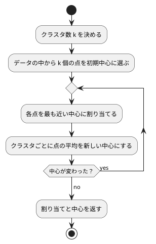

# 第 14 章: K-means によるクラスタリング

## 14.1 はじめに

[前章](13-principal-component-analysis.md) の主成分分析は、教師なし学習のうち「列を要約する」手法でした。この章で扱う **クラスタリング** は「行をグループに分ける」手法です。正解ラベルが無いまま、似たもの同士を同じグループにまとめます。

最も基本的なアルゴリズムが **K-means** です。あらかじめ決めたクラスタ数だけ「中心」を置き、各点を最も近い中心に割り当て、割り当てられた点の平均を新しい中心にする、という手続きを中心が動かなくなるまで繰り返します。

[Python 版の第 14 章](../python/14-k-means-clustering.md) は NumPy で K-means を自作し、scikit-learn の `KMeans` と突き合わせました。Clojure 版も同じく自作してから、Tribuo の `KMeansTrainer` と比べます。ただし Tribuo には初期中心を渡す口が無いので、比べるのは **SSE の大きさ** です（14.14 節）。

## 14.2 K-means の仕組み



クラスタリングの良さは **SSE（誤差平方和）** で測ります。各点と、所属するクラスタの中心との距離の 2 乗を合計した値です。K-means は毎回の更新で SSE を下げますが、下がる方向にしか動かないので、初期中心によっては最もよい分け方の手前で止まります（**局所解**、14.13 節）。

クラスタ数を増やせば SSE は必ず下がるので、SSE だけでクラスタ数は決められません。クラスタ数に対して SSE をプロットし、減り方がゆるやかになる「肘」を探す方法を **エルボー法** と呼びます。

## 14.3 題材とデータ

卸売業者の顧客ごとの年間支出額（`Wholesale.csv`、440 件）を使います。列は `Channel`（販売チャネル）・`Region`（地域）と、6 つの商品カテゴリごとの支出額です。`Channel` と `Region` は区分を表す番号で支出額ではないので、この章では除きます。

支出額はカテゴリによって桁が違う（`Fresh` は数万、`Delicassen` は数千）ので、[第 9 章](09-feature-engineering.md) の標準化で列ごとに平均 0・標準偏差 1 にそろえてから距離を測ります。

## 14.4 TODO リストの作成

```text
[ ] 支出額の列を読み込む
[ ] 列ごとに標準化する
[ ] 2 点間の距離の 2 乗を求める
[ ] 各点を最も近い中心に割り当てる
[ ] クラスタごとに中心を更新する
[ ] SSE を計算する
[ ] 中心が変わらなくなるまで繰り返す
[ ] 初期中心をシードで選ぶ
[ ] クラスタ数ごとの SSE を求める（エルボー法）
[ ] 初期中心を複数試して最小の SSE を選ぶ
[ ] Tribuo の KMeansTrainer と比べる
[ ] クラスタごとの特徴をまとめる
```

## 14.5 支出額の列を読み込む

`Channel` と `Region` を除いた列だけを、数値の特徴量にします。

```clojure
(deftest ChannelとRegionを除いた支出額の列を読み込む
  (let [{:keys [columns x]} (ch/spending (spending-table))]
    (is (= [:Fresh :Milk] columns))
    (is (= [100.0 300.0 500.0] (mapv :Fresh x)))))
```

```clojure
(defn spending
  "Channel と Region を除いた支出額の列を読み込む。欠損値があれば失敗する。"
  [table]
  (let [columns (vec (remove categories (:columns table)))]
    {:columns columns
     :x (mapv (fn [row]
                (into {} (map (fn [column]
                                [column (or (chapter02/number row column)
                                            (throw (IllegalArgumentException.
                                                    (str "空欄があります: " (name column)))))]))
                      columns))
              (:rows table))}))
```

`categories` は `#{:Channel :Region}` というセットです。Clojure のセットは関数として呼べるので、`(remove categories columns)` と書くだけで「セットに入っている列を除く」になります。

戻り値は、列の順（ベクタ）と特徴量（マップのベクタ）の組です。[第 13 章](13-principal-component-analysis.md) と同じく、**列の順はマップに任せずベクタで持ち回ります**。このデータは 6 列なので今回は順序が保たれますが、9 列を超えると崩れるという同じ落とし穴があるので、扱いをそろえておきます。

## 14.6 列ごとに標準化する

標準化は第 9 章の `standardizer`・`standardize-all` をそのまま使い、点（数値のベクタ）に変換するところだけを書きます。

```clojure
(defn standardize
  "第 9 章の標準化（件数で割る標準偏差）で列ごとにそろえ、1 件を 1 つの点にする。"
  [x columns]
  (let [standardized (chapter09/standardize-all (chapter09/standardizer x columns) x)]
    (mapv (fn [features] (mapv #(get features %) columns)) standardized)))
```

テストでは、変換後の各列の平均が 0、標準偏差が 1 になることを確かめます。

## 14.7 各点を最も近い中心に割り当てる

距離は 2 乗のまま比べます。平方根を取っても大小は変わらないので、計算を省けます。

```clojure
(defn squared-distance
  "2 点間の距離の 2 乗。"
  [a b]
  (reduce + (map (fn [x y] (let [d (- x y)] (* d d))) a b)))
```

割り当てのテストには、「距離が同じなら先に並ぶ中心を選ぶ」というケースを入れました。

```clojure
(deftest 各点を最も近い中心のクラスタに割り当てる
  (testing "1 次元の点"
    (is (= [0 0 1 1] (ch/assign-clusters [[0.0] [1.0] [10.0] [11.0]] [[0.5] [10.5]]))))
  (testing "2 次元の点をユークリッド距離で割り当てる"
    (is (= [0 0 0 1 1 1] (ch/assign-clusters (two-groups) [[0.0 0.0] [10.0 10.0]]))))
  (testing "距離が同じなら先に並ぶ中心を選ぶ"
    (is (= [0] (ch/assign-clusters [[1.0]] [[0.0] [2.0]])))))
```

```clojure
(defn assign-clusters
  "各点を、最も近い中心のクラスタ番号に割り当てる。
   距離が同じなら先に並ぶ中心を選ぶように、厳密な < で畳む。"
  [points centers]
  (mapv (fn [point]
          (first (reduce (fn [[nearest best] [k center]]
                           (let [d (squared-distance point center)]
                             (if (< d best) [k d] [nearest best])))
                         [0 Double/POSITIVE_INFINITY]
                         (map-indexed vector centers))))
        points))
```

ここも [第 13 章](13-principal-component-analysis.md) と同じ落とし穴があります。`(apply min-key #(squared-distance point %) centers)` と書くと中心そのものは取れますが、**同じ距離のときにどちらを返すか** が Java 版（先に見つけた方を残す）と変わり、境界上の点のクラスタ番号がずれます。番号も必要なので、`[番号 距離]` の組を厳密な `<` で畳む `reduce` を書きました。Java 版の二重ループと同じ順序・同じ比較になり、数値が一致します。

## 14.8 中心を更新する

クラスタごとに、割り当てられた点の平均を新しい中心にします。1 点も割り当てられなかったクラスタは、前の中心をそのまま残します（そうしないと中心が消えてクラスタ数が変わってしまいます）。

```clojure
(deftest クラスタごとに割り当てられた点の平均を新しい中心にする
  (testing "平均が新しい中心になる"
    (is (= [[0.5] [10.5]]
           (ch/update-centers [[0.0] [1.0] [10.0] [11.0]] [0 0 1 1] [[0.0] [10.0]]))))
  (testing "点が 1 つも割り当てられなかったクラスタは中心を変えない"
    (is (= [[0.5] [99.0]]
           (ch/update-centers [[0.0] [1.0]] [0 0] [[0.0] [99.0]])))))
```

```clojure
(defn update-centers
  "クラスタごとに、割り当てられた点の平均を新しい中心にする。
   点が 1 つも割り当てられなかったクラスタは、前の中心をそのまま残す。"
  [points labels previous]
  (let [members (group-by second (map vector points labels))]
    (mapv (fn [k]
            (if-let [assigned (seq (map first (get members k)))]
              (mapv #(/ % (count assigned)) (apply mapv + assigned))
              (nth previous k)))
          (range (count previous)))))
```

`(apply mapv + assigned)` が、点のベクタを要素ごとに足し合わせる処理です。`assigned` が `[[1 2] [3 4]]` なら `(mapv + [1 2] [3 4])` になり `[4 6]` が返ります。Java 版が合計用の配列と件数の配列を用意して二重ループで足していた処理が、1 つの式になります。

## 14.9 SSE を計算する

```clojure
(defn sum-of-squared-errors
  "各点と、所属するクラスタの中心との距離の 2 乗の合計（誤差平方和）。"
  [points labels centers]
  (reduce + (map (fn [point label] (squared-distance point (nth centers label)))
                 points labels)))
```

足す順序は点の並び順です。他の言語版と同じ順序なので、浮動小数点の誤差まで含めて同じ値になります。

## 14.10 中心が変わらなくなるまで繰り返す

収束の判定は「新しい中心が前の中心と等しいか」です。Clojure のベクタは値として比較できるので、`=` をそのまま使えます（Java 版が `Arrays.deepEquals` を必要としたところです）。

```clojure
(defn fit
  "中心が変わらなくなるか、更新の回数が上限に達するまで、割り当てと中心の更新を繰り返す。"
  ([points initial-centers] (fit points initial-centers default-max-iterations))
  ([points initial-centers max-iterations]
   (let [centers (loop [centers initial-centers
                        iteration 0]
                   (if (>= iteration max-iterations)
                     centers
                     (let [next-centers (update-centers points
                                                        (assign-clusters points centers)
                                                        centers)]
                       (if (= next-centers centers)
                         centers
                         (recur next-centers (inc iteration))))))
         labels (assign-clusters points centers)]
     {:labels labels
      :centers centers
      :sse (sum-of-squared-errors points labels centers)})))
```

`loop`/`recur` は Clojure の末尾再帰です。可変の変数を使わずに「中心が動かなくなるまで」を表せます。上限の既定値 300 は scikit-learn の `KMeans` と同じで、引数の数が違う実装（アリティ）で表しました。

```clojure
(deftest 最大反復回数に達したら収束していなくても打ち切る
  (let [once (ch/fit (three-pairs) [[0.0] [2.0]] 1)
        none (ch/fit (three-pairs) [[0.0] [2.0]] 0)]
    (is (= [[0.5] [15.5]] (mapv #(mapv double %) (:centers once))))
    (is (= [[0.0] [2.0]] (:centers none)))
    (is (> (:sse none) (:sse once)))))
```

## 14.11 初期中心をシードで選ぶ

初期中心は、点の中からクラスタ数だけを重複なく選びます。乱数は [第 8 章](08-classification-and-preprocessing-pipeline.md) のシャッフルを使い回します。

```clojure
(defn choose-initial-centers
  "シード付きの乱数で点を並べ替え、先頭から n-clusters 個を初期中心にする。
   第 2 章の java.util.Random のシャッフルを使うので、Java 版・Scala 版と同じ点を選ぶ。"
  [points n-clusters seed]
  (mapv #(nth points %)
        (take n-clusters (chapter02/shuffle-with-seed (vec (range (count points))) seed))))
```

第 2 章の `shuffle-with-seed` は `java.util.Random` の Fisher-Yates シャッフルで、Java の `Collections.shuffle(list, new Random(seed))` と同じ手順・同じ並びになります。**この章の数値が Java 版と一致するかどうかは、ここで決まります。** 遅延シーケンスと `java.util.Random` を混ぜると評価の順で並びが変わるので、第 2 章の実装は `mapv` で即座に評価しています。

## 14.12 エルボー法でクラスタ数を選ぶ

クラスタ数ごとの SSE を返します。

```clojure
(defn sse-by-cluster-count
  "クラスタ数ごとに、初期中心を n-init 通り試した最小の SSE を、クラスタ数の順に並べて返す。
   マップは順序を保たないので、[クラスタ数 SSE] の組のベクタにする。"
  ([points cluster-counts seed] (sse-by-cluster-count points cluster-counts seed default-n-init))
  ([points cluster-counts seed n-init]
   (mapv (fn [n] [n (:sse (fit-with-restarts points n seed n-init))]) cluster-counts)))
```

戻り値は `[[1 2640.0] [2 1954.18] …]` の形です。Java 版は `LinkedHashMap`、Scala 版は `SeqMap` で順序を保ちましたが、Clojure のマップには順序を保つ実装が標準にありません（小さいマップでたまたま挿入順になるだけです）。クラスタ数の順に取り出したいので、組のベクタにしました。

## 14.13 局所解と複数回の試行

### 実データで起きたこと

ここまでの関数で、標準化した実データのエルボー法を試してみました。使い捨てのスクリプトで、初期中心 1 通りで k = 1 から 10 までの SSE を求め、シードを変えて表示した結果の一部です（小数第 2 位まで。確かめたあとでスクリプトは削除しました）。

| k | シード 0 | シード 1 | シード 5 |
|---|---------|---------|---------|
| 2 | 2267.09 | 1954.18 | 1956.12 |
| 4 | 1345.47 | 1533.99 | 1345.47 |
| 6 | 993.26 | 947.20 | 1015.81 |
| 7 | 934.29 | 952.13 | 908.79 |
| 9 | 719.53 | 758.35 | 793.95 |
| 10 | 754.63 | 618.17 | 877.40 |

シード 0 では k = 2 の SSE が 2267.09 で、シード 1 の 1954.18 より大きくなりました。シード 0 では k = 9 の 719.53 から k = 10 の 754.63 へ、シード 1 では k = 6 の 947.20 から k = 7 の 952.13 へ、シード 5 では k = 9 の 793.95 から k = 10 の 877.40 へ、k を増やしたのに SSE が増えています。**この表は [Java 版](../java/14-k-means-clustering.md)・[Scala 版](../scala/14-k-means-clustering.md) の同じ表と 1 桁も違いません。** 初期中心の選び方（`java.util.Random` の Fisher-Yates）も、中心の更新と SSE の足し算の順序もそろえたからです。

### 局所解をテストで再現する

1 次元に 3 組の点を並べた例で確かめます。3 つのクラスタに分けるなら、0 と 1、10 と 11、20 と 21 に分けるのが最適で、SSE は 0.5 × 3 = 1.5 です。ところが、左の組から 2 点・中央の組から 1 点を初期中心にすると、0 と 1 が別々のクラスタのまま、残りの 4 点が 1 つのクラスタにまとめられて止まります。

```clojure
(deftest 初期中心によっては局所解に陥る
  (is (close-to? 101.0 (:sse (ch/fit (three-pairs) [[0.0] [1.0] [10.0]])))))

(deftest 複数の初期中心の候補のうちSSEが最小の結果を返す
  (let [result (ch/best (three-pairs) [[[0.0] [1.0] [10.0]] [[0.0] [10.0] [20.0]]])]
    (is (close-to? 1.5 (:sse result)))
    (is (= [[0.5] [10.5] [20.5]] (mapv #(mapv double %) (:centers result))))))
```

複数の候補から最小を選ぶ処理と、シードをずらして候補を作る処理を分けて書きました。

```clojure
(defn best
  "初期中心の候補ごとにクラスタリングし、SSE が最小の結果を返す。"
  [points initial-center-candidates]
  (reduce (fn [a b] (if (< (:sse b) (:sse a)) b a))
          (mapv #(fit points %) initial-center-candidates)))

(defn fit-with-restarts
  "シードを 1 ずつずらして初期中心を n-init 通り選び、SSE が最小の結果を返す。"
  ([points n-clusters seed] (fit-with-restarts points n-clusters seed default-n-init))
  ([points n-clusters seed n-init]
   (best points (mapv #(choose-initial-centers points n-clusters (+ seed %)) (range n-init)))))
```

`best` も `min-key` ではなく厳密な `<` の `reduce` です。SSE が同じ結果が並んだときに、Java 版の `min(Comparator)`（先に見つけた方を残す）と同じものを選ぶためです。この章では `assign-clusters`・`normalize-signs`（第 13 章）とあわせて 3 か所、同じ理由で同じ書き方をしています。

`n-init` の既定値 10 は、scikit-learn の `KMeans` の `n_init` と同じです。

## 14.14 Tribuo の KMeansTrainer と比べる

### 初期中心を渡せない

Python 版では、scikit-learn の `KMeans` に同じ初期中心を配列で渡し、クラスタ番号・中心・SSE がすべて一致することを確かめました。Tribuo の `KMeansTrainer` のコンストラクターの引数はクラスタ数・最大反復回数・距離・初期化の方法・スレッド数・シードで、初期中心そのものを受け取る引数はありません。初期化の方法は、ランダムに選ぶ `RANDOM` と、互いに離れた点を選びやすくする **k-means++** の `PLUSPLUS` の 2 つだけです。

この事実を、学習用テストとして残します。

```clojure
(deftest KMeansTrainerの初期化方法はRANDOMとPLUSPLUSだけ
  (is (= ["RANDOM" "PLUSPLUS"] (mapv #(.name %) (KMeansTrainer$Initialisation/values))))
  (is (not-any? (fn [constructor]
                  (some #(or (.isArray ^Class %)
                             (.isAssignableFrom java.util.Collection ^Class %))
                        (.getParameterTypes constructor)))
                (.getConstructors KMeansTrainer))))
```

Clojure から Java の入れ子クラスを参照するときは、`KMeansTrainer$Initialisation` と `$` でつないだ名前を `:import` します。クラスそのものは、シンボル `KMeansTrainer` がそのまま `Class` オブジェクトとして評価されるので、`(.getConstructors KMeansTrainer)` と書けます。

同じ初期中心を渡せないので、クラスタ番号や中心の一致は確かめられません。[ADR 011](../../../adr/011-clojure-ml-libraries.md) のとおり、同じクラスタ数での **SSE の大きさ** を比べます。

### Tribuo のデータセットに変換する

Tribuo のクラスタリングでは、事例の出力の型が `ClusterID` です。学習するときはクラスタが決まっていないので、未割り当てを表す `ClusteringFactory/UNASSIGNED_CLUSTER_ID` を渡します。

```clojure
(defn tribuo-dataset
  "点の集まりを、クラスタ番号の無い Tribuo のデータセットにする。"
  [points]
  (let [factory (ClusteringFactory.)
        dataset (MutableDataset. (SimpleDataSourceProvenance. "points" factory) factory)
        names (feature-names (count (first points)))]
    (doseq [point points]
      (.add dataset (ArrayExample. ^ClusterID ClusteringFactory/UNASSIGNED_CLUSTER_ID
                                   ^"[Ljava.lang.String;" names
                                   (double-array point))))
    dataset))
```

`ArrayExample` のコンストラクターは引数の型が複数あるので、型ヒントを付けて呼び分けます。配列の型ヒントは `^"[Ljava.lang.String;"` という JVM の内部表記で書きます。Clojure で Java のライブラリを使うとき、ここだけは見慣れない書き方になります。

特徴量の名前を `x00`・`x01` … と 0 埋めするのは、**Tribuo が特徴量を名前の辞書順に並べ替える** からです。`x0`〜`x10` にすると `x10` が `x2` より前に来て、列の順が入れ替わります。

比較は自作と同じ定義の SSE で行います。Tribuo が学習した中心に、自作の `assign-clusters` で割り当て直してから SSE を求めます。

```clojure
(defn tribuo-sse
  "Tribuo で学習した中心に自作の割り当てをして、自作と同じ定義の SSE を求める。"
  [points n-clusters seed]
  (let [centers (tribuo-centers points n-clusters seed)]
    (sum-of-squared-errors points (assign-clusters points centers) centers)))
```

## 14.15 実データでクラスタリングする

### クラスタごとの特徴をまとめる

標準化した値のままでは読めないので、元の単位（円）に戻した平均を、件数の多い順に並べます。

```clojure
(defn summarize-clusters
  "クラスタごとの件数と、元の単位での列ごとの平均を、件数の多い順に並べる。"
  [x columns labels]
  (->> (map vector x labels)
       (group-by second)
       (mapv (fn [[cluster members]]
               (let [rows (mapv first members)]
                 {:cluster cluster
                  :count (count rows)
                  :means (into {} (map (fn [column]
                                         [column (/ (reduce + (map #(get % column) rows))
                                                    (count rows))]))
                               columns)})))
       (sort-by (juxt #(- (:count %)) :cluster))
       vec))
```

`group-by` が返すマップは順序を保たないので、並べ替えの基準に件数だけを使うと、件数が同じクラスタの並びが不定になります。`(juxt #(- (:count %)) :cluster)` で「件数の降順、同数ならクラスタ番号の昇順」と明示しました。Java 版が `TreeMap` に入れてから安定ソートで得ていた順序と同じです。

### 実データのテスト

学習データが無ければ理由を標準エラーに出して早く戻ります。440 件・6 列になること、標準化したデータのクラスタ数 1 の SSE が「件数 × 列数」になること、クラスタ数を増やすほど SSE が減ることを確かめます。

```clojure
(deftest 標準化したデータのクラスタ数一のSSEは件数と列数の積になる
  (when-let [{:keys [columns x]} (wholesale)]
    ;; 件数で割る標準偏差で標準化したので、列ごとの分散は 1 になる
    (let [points (ch/standardize x columns)
          sse (second (first (ch/sse-by-cluster-count points [1] 0)))]
      (is (< (abs (- sse (* 440.0 6))) 1e-6)))))

(deftest クラスタ数を増やすほどSSEが小さくなる
  (when-let [{:keys [columns x]} (wholesale)]
    (let [sse (mapv second (ch/sse-by-cluster-count (ch/standardize x columns) (range 1 11) 0))]
      (is (every? true? (map < (rest sse) sse))))))
```

1 つ目は、自作の標準化が「件数で割る標準偏差」なのでちょうど 2640 になるという性質です（不偏標準偏差なら 2634 になります）。2 つ目は、`(map < (rest sse) sse)` で隣り合う 2 つを比べ、減り続けていることを確かめています。初期中心を 10 通り試すようにしたので、14.13 節で見た「k を増やすと SSE が増える」現象は起きません。

### 実行して結果を表示する

`clojure -M:run chapter14` の結果です。

```text
データ件数: 440（支出額 6 列）
クラスタ数ごとの SSE（初期中心 10 通りの最小値）:
クラスタ数	自作	Tribuo（k-means++）
1	2640.00	2640.00
2	1954.18	1954.78
3	1614.52	1607.67
4	1334.36	1317.90
5	1085.27	1058.77
6	947.20	917.67
7	888.22	839.38
8	775.24	742.02
9	690.81	655.14
10	618.17	606.81

クラスタ数 5 のクラスタごとの件数と平均支出額:
クラスタ	件数	Fresh	Milk	Grocery	Frozen	Detergents_Paper	Delicassen
2	265	8909	2967	3804	2248	989	962
1	96	5509	10556	16478	1420	7199	1659
0	65	31117	4260	5374	7225	849	2286
3	10	15965	34709	48537	3055	24875	2943
4	4	52022	31696	18491	29826	2699	19656
```

Tribuo が学習の経過を標準エラーに出すので、`(.setLevel (Logger/getLogger "org.tribuo") Level/WARNING)` で警告以上だけにしています。

### 結果を読む

**この表は [Java 版](../java/14-k-means-clustering.md)・[Scala 版](../scala/14-k-means-clustering.md) の表と、SSE も件数も平均支出額も完全に一致しました。** 自作の列が一致するのは初期中心の乱数と計算の順序がそろっているから、Tribuo の列が一致するのは同じ Tribuo 4.3.2 に同じ標準化の値と同じシードを渡しているからです。

**自作と Tribuo の SSE を比べると**、k = 2 だけは自作（1954.18）のほうが Tribuo（1954.78）より小さく、k = 3 から 10 では Tribuo（k-means++ で 10 通り）のほうが小さくなりました。差は k = 7 で最も大きく、自作の 888.22 に対して Tribuo は 839.38 です。どちらも「初期中心を変えて 10 回試し、最小の SSE を使う」点は同じなので、違いは初期中心の選び方にあります。データの点からランダムに選ぶ自作より、互いに離れた点を選びやすい k-means++ のほうが、このデータでは局所解を避けやすかったと読めます。

**エルボー法で読むと**、自作の SSE の減り方は k = 3 → 4 で 280.16、k = 4 → 5 で 249.09、k = 5 → 6 で 138.07、k = 6 → 7 で 58.98 と小さくなっていきますが、k = 7 → 8 では 112.98 と再び大きくなり、はっきりした肘は見えません。ここでは Python 版・Java 版・Scala 版と同じくクラスタ数を 5 にしました。エルボーが 1 点に決まらないときは、クラスタを解釈できるかどうかも合わせて判断します。

クラスタ数 5 の結果は、次のように読めます。

- **265 件のクラスタ**: どの支出額も少なめの、最も多いグループ
- **96 件のクラスタ**: Grocery・Milk・Detergents_Paper が多めのグループ
- **65 件のクラスタ**: Fresh が突出して多いグループ
- **10 件のクラスタ**: Milk・Grocery・Detergents_Paper が非常に多いグループ
- **4 件のクラスタ**: Fresh・Milk・Frozen・Delicassen がどれも極端に多い顧客。グループというより外れ値に近い存在です

K-means は外れ値にも中心を 1 つ割いてしまうことが、この結果から分かります。外れ値の扱いは [第 9 章](09-feature-engineering.md) で扱いました。

## 14.16 品質チェック

`nix develop .#clojure` の中で、整形の検査・静的解析・テストをまとめて実行します。

```console
$ cljfmt check src test && clj-kondo --lint src test --fail-level warning && clojure -M:test
All source files formatted correctly
linting took 874ms, errors: 0, warnings: 0
…
Ran 153 tests containing 365 assertions.
0 failures, 0 errors.
```

第 14 章のテストは、部品のテスト（`chapter14-test`）17 件と、実データのテスト（`wholesale-data-test`）4 件です。学習データが無い環境（`ML_DATA_DIR=/nonexistent clojure -M:test`）では、実データのテストが理由を標準エラーに出して何も検証せず、テスト全体は成功します。

この章で追加した依存は、Tribuo のクラスタリングのモジュール 1 つだけです。

```clojure
        org.tribuo/tribuo-clustering-kmeans {:mvn/version "4.3.2"}}
```

TDD の途中で済ませた設計の判断は次のとおりです。

- **不変のベクタで通す** — 点も中心も Clojure のベクタにし、途中で配列に落とさなかった。配列に戻すのは Tribuo に渡すときだけ
- **アリティで既定値を表す** — `fit` の上限回数と `fit-with-restarts`・`sse-by-cluster-count` の `n-init` を、引数の数が違う実装で既定値付きにした。Java 版のオーバーロードは要らない
- **定義の共有** — Tribuo との比較でも、SSE は自作の `assign-clusters` と `sum-of-squared-errors` で求め、同じ定義で比べた

第 2 章の前処理と第 9 章の標準化は変更していません。

## 14.17 まとめ

この章では、K-means を割り当て・更新・SSE の小さな関数から組み立て、Tribuo の `KMeansTrainer` と比べました。

1. **初期中心を引数で受け取る** — 乱数で選ぶ処理と分けたので、テストでは初期中心を固定して結果を確かめられた。局所解もテストで再現できた
2. **初期中心 1 通りではエルボー法を読めない** — 実データでシードごとに SSE の曲線が変わり、k を増やして SSE が増えることもあった。10 通り試した最小の SSE で比べた
3. **Tribuo とは SSE の大きさで比べる** — 初期中心を渡せないので、シードを変えた最小の SSE で比べた。k = 3〜10 では k-means++ の Tribuo のほうが小さかった
4. **Java 版・Scala 版と数値が完全に一致した** — 初期中心の乱数（`java.util.Random` の Fisher-Yates）と、中心の更新・SSE の足し算の順序をそろえたので、シードごとの SSE の表も、最終的な SSE もクラスタごとの平均も同じ値になった

Clojure 版ならではの学びもありました。

- **収束は `loop`/`recur` で書ける** — 可変の変数を使わずに「中心が動かなくなるまで」を表せた。止まる条件も `(= next-centers centers)` と値の比較で書ける
- **不変なら写しも比較も悩まない** — Java 版が `clone()` と `Arrays.deepEquals` で解いた問題が、ベクタではそもそも起きなかった
- **`min-key`・`max-key` は同値のとき後ろを返す** — 最も近い中心も、SSE が最小の結果も、他の言語版と同じものを選ぶには厳密な比較で畳む必要があった
- **セットは関数として呼べる** — 除きたい列の集合をそのまま `remove` に渡せた
- **Java の入れ子クラスと配列の型ヒント** — `KMeansTrainer$Initialisation` と `^"[Ljava.lang.String;"` は、Java のライブラリを使うときに覚えておく書き方

次の章では、ここまでに作ったモデルを Web API として公開します。
