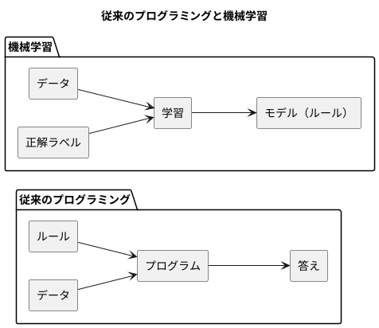
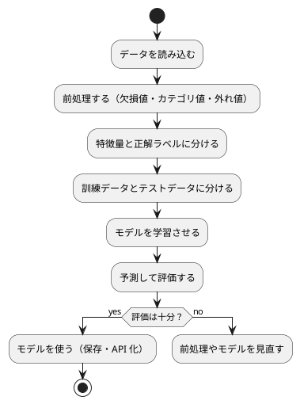

# 第 1 章: 機械学習とはじめてのテスト

## 1.1 はじめに

この章では、機械学習とは何かを確認したうえで、テスト駆動開発（TDD）で最初のプログラムを C# で作ります。題材は「きのこの山派か、たけのこの里派か」を身長・体重・年代から判定する問題です。

この章ではまだ機械学習のアルゴリズムを使いません。人間が考えたルールで判定し、その正解率を測るところまで進みます。「ルールを人間が書く」とはどういうことかを先に体験しておくと、第 3 章で「ルールをデータから学ばせる」ことの意味がはっきりします。

[Python 版の第 1 章](../python/01-machine-learning-and-first-test.md) と同じ題材・同じ TODO リストで進めます。C# 版は [F# 版の第 1 章](../fsharp/01-machine-learning-and-first-test.md) と同じ .NET・xUnit v3 の上で書くので、同じことを C# で書くとどうなるかに注目しながら読んでください。

## 1.2 機械学習とは

### ルールを書くか、データに学ばせるか

従来のプログラミングでは、人間が判定のルールをコードとして書きます。

```csharp
public static string PredictByRule(Features features) =>
    features.AgeGroup == KinokoAgeGroup ? "きのこ" : "たけのこ";
```

これはこの章で実際に作るメソッドです。「20 代ならきのこ派」というルールは、人間がデータを眺めて立てた仮説にすぎません。データが増えたり傾向が変わったりすれば、人間がルールを書き直す必要があります。

機械学習では、ルールそのものをデータから導きます。人間が用意するのは「特徴量（判定の手がかり）」と「正解ラベル（本当の答え）」の組です。学習アルゴリズムがその組からルールを作り、未知のデータに当てはめて予測します。



### 機械学習のワークフロー

機械学習のプログラムは、おおむね次の流れで作ります。本シリーズの各章は、この流れのどこかを深掘りする構成になっています。



この章で扱うのは「データを読み込む」「特徴量と正解ラベルに分ける」「予測して評価する」の 3 つです。「学習させる」の代わりに、人間が書いたルールで予測します。

### 分類と回帰

| 種類 | 予測するもの | 例 |
|------|------------|-----|
| 分類 | どのグループに属するか（離散値） | きのこ派かたけのこ派か、アヤメの品種 |
| 回帰 | どれくらいの量か（連続値） | 映画の興行収入、住宅価格 |

この章の問題は、2 つのグループのどちらかを当てる分類です。

## 1.3 題材とデータ

### データの入手と配置

本シリーズの学習データは、書籍『スッキリわかる Python による機械学習入門』（インプレス, 2020）の配布データを使います。配布データは書籍購入者のみ利用できるため、リポジトリには含まれていません。[書籍サポートページ](https://sukkiri.jp/books/sukkiri_ml) から `sukkiri-ml-codes.zip` を入手し、リポジトリの `tmp/` に置いてから、リポジトリのルートで次を実行してください。

```bash
npx gulp data:setup
npx gulp data:check
```

`apps/data/sukkiri-ml/` に学習データが配置されます。このディレクトリは `.gitignore` の対象なので、誤ってコミットされることはありません。すべての言語版が同じデータを参照します。

### KvsT.csv

この章で使うのは `KvsT.csv` です。19 人分のデータが次の 4 列で記録されています。

| 列 | 意味 | 値 |
|----|------|-----|
| 身長 | 身長（cm） | 整数 |
| 体重 | 体重（kg） | 整数 |
| 年代 | 年代 | 10, 20, 30, 40 のいずれか |
| 派閥 | きのこの山派かたけのこの里派か | `きのこ` または `たけのこ` |

「身長」「体重」「年代」が特徴量、「派閥」が正解ラベルです。列名が日本語であることと、ファイルの先頭に BOM（バイトオーダーマーク）が付いていることに注意してください。

## 1.4 TODO リストの作成

仕様をそのままコードにするには大きすぎるので、まず TODO リストに分解します。

> TODO リスト
>
> 何をテストすべきだろうか——着手する前に、必要になりそうなテストをリストに書き出しておこう。
>
> — テスト駆動開発

**TODO リスト**:

- [ ] CSV を読み込む
  - [ ] BOM 付き CSV の 1 行を人物として読み込む
  - [ ] 複数行を行の順に読み込む
- [ ] 特徴量と正解ラベルに分ける
- [ ] ルールで派閥を判定する
  - [ ] 20 代ならきのこ派と判定する
  - [ ] 20 代以外ならたけのこ派と判定する
- [ ] 正解率を計算する
- [ ] 実データで正解率を表示する

## 1.5 開発環境の準備

### プロジェクトの構成

C# の実装は `apps/csharp/` にあります。この章を書き終えた時点の構成です。

```text
apps/csharp/
├── MachineLearning.sln
├── global.json
├── Directory.Build.props
├── Directory.Packages.props
├── .editorconfig
├── .gitignore
├── src/
│   └── MachineLearning/
│       ├── MachineLearning.csproj
│       ├── packages.lock.json
│       ├── Program.cs
│       ├── Dataset/
│       │   └── DataDir.cs
│       └── Chapter01/
│           ├── Features.cs
│           ├── KinokoTakenoko.cs
│           ├── Person.cs
│           └── Program.cs
└── tests/
    └── MachineLearning.Tests/
        ├── MachineLearning.Tests.csproj
        ├── packages.lock.json
        ├── SetupTests.cs
        ├── Dataset/
        │   └── DataDirTests.cs
        └── Chapter01/
            ├── KinokoTakenokoTests.cs
            └── KvsTDataTests.cs
```

本体（`src/MachineLearning`）とテスト（`tests/MachineLearning.Tests`）の 2 つのプロジェクトを、1 つのソリューション（`MachineLearning.sln`）にまとめています。F# 版と同じ構成です。

C# では、公開する型ごとに 1 つのファイルを作り、ファイル名を型名と同じにするのが慣習です。F# 版では `KinokoTakenoko.fs` の 1 ファイルにレコード型と関数をまとめましたが、C# 版では record ごとにファイルが分かれます。また F# と違い、**ファイルの並び順に意味はありません**。`.csproj` にコンパイルするファイルを列挙する必要も無く、ディレクトリ配下の `.cs` が自動で対象になります。新しいファイルを作ったら即使えるのは C# のほうが楽ですが、依存が一方向であることをコンパイラが保証してくれるのは F# の利点です。

`global.json` で .NET SDK の版を指定します。

```json
{
  "sdk": {
    "version": "10.0.100",
    "rollForward": "latestPatch"
  },
  "test": {
    "runner": "Microsoft.Testing.Platform"
  }
}
```

F# 版は `version` を 10.0.101 に固定していますが、C# 版は 10.0.100 にしました。`rollForward: latestPatch` を付けると「10.0.1xx のうち手元にある最新のパッチ」が使われるので、手元の 10.0.100 でも、より新しい SDK を持つ環境でも解決できます。逆に 10.0.101 固定では、10.0.100 しか入っていない手元の環境で SDK が見つからずに止まります。**下限として書いて上にロールフォワードさせる** のが、複数の環境で動かすときの書き方です。

`test.runner` は、`dotnet test` がテストを動かす仕組みの指定です。.NET SDK 10 の `dotnet test` は、従来の仕組み（VSTest）で動くテストプロジェクトを止めるので、新しい仕組みの Microsoft.Testing.Platform で動く xUnit v3 を使います。

2 つのプロジェクトに共通する設定は `Directory.Build.props` に書きます。このファイルは、同じディレクトリとその下のプロジェクトすべてに自動で読み込まれます。

```xml
<Project>
  <PropertyGroup>
    <TargetFramework>net10.0</TargetFramework>
    <Nullable>enable</Nullable>
    <ImplicitUsings>enable</ImplicitUsings>
    <LangVersion>latest</LangVersion>
    <InvariantGlobalization>true</InvariantGlobalization>
    <!-- コンパイラとアナライザーの警告をエラーにする -->
    <TreatWarningsAsErrors>true</TreatWarningsAsErrors>
    <!-- .editorconfig のコードスタイル（IDE のルール）をビルドでも検査する -->
    <EnforceCodeStyleInBuild>true</EnforceCodeStyleInBuild>
    <!-- .NET アナライザーの水準。All は公開メソッドの引数の検査まで求めるので Recommended にする（ADR 006） -->
    <AnalysisMode>Recommended</AnalysisMode>
    <!-- 依存関係の依存関係まで正確な版を packages.lock.json に記録する -->
    <RestorePackagesWithLockFile>true</RestorePackagesWithLockFile>
    <!-- dotnet test から Microsoft.Testing.Platform のテストを実行できるようにする -->
    <TestingPlatformDotnetTestSupport>true</TestingPlatformDotnetTestSupport>
  </PropertyGroup>
</Project>
```

- `Nullable` は **null 許容参照型** を有効にします。`string` は「null にならない文字列」、`string?` は「null かもしれない文字列」として、コンパイラが検査します。F# の `option` に当たる仕組みですが、`option` が実行時にも別の型であるのに対し、こちらはコンパイル時だけの注釈です。第 2 章の欠損値で効いてきます
- `ImplicitUsings` は、`using System;` や `using System.Linq;` といった定番の名前空間を自動で読み込みます。ファイルの先頭に `using` が並ばないのは、この設定のためです
- `InvariantGlobalization` は、実行環境のロケールに左右されない文化圏（インバリアント）で動かす指定です。小数点がカンマで表示されるといった環境差を防ぎます
- `TreatWarningsAsErrors` は、コンパイラとアナライザーの警告をエラーにします。F# 版はパターンマッチの網羅漏れの警告を拾うためにこれを入れましたが、C# では使っていない変数などの警告が対象になります（後の「静的解析」で実例を見ます）
- 依存ライブラリの版は `Directory.Packages.props` にまとめて書きます（**中央パッケージ管理**）

```xml
<Project>
  <PropertyGroup>
    <!-- 依存ライブラリの版をこのファイルにまとめる（中央パッケージ管理） -->
    <ManagePackageVersionsCentrally>true</ManagePackageVersionsCentrally>
  </PropertyGroup>
  <ItemGroup>
    <PackageVersion Include="coverlet.MTP" Version="10.0.1" />
    <PackageVersion Include="xunit.v3" Version="4.0.1" />
  </ItemGroup>
</Project>
```

中央パッケージ管理では、各プロジェクトの `.csproj` には **版を書かずに** パッケージ名だけを書きます。

```xml
<ItemGroup>
  <PackageReference Include="xunit.v3" />
  <PackageReference Include="coverlet.MTP" />
</ItemGroup>
```

F# 版では、中央パッケージ管理を有効にしたことで FSharp.Core の自動参照が効かなくなり、テストが実行時に失敗しました。C# の標準ライブラリはランタイムに含まれていてパッケージ参照が要らないので、C# 版ではこの問題は起きません。

`RestorePackagesWithLockFile` を有効にすると、依存関係の依存関係まで含めた正確な版が `packages.lock.json` に記録されます。このファイルをコミットしておけば、あとから `dotnet restore` したときに同じ版が入ります。本体のプロジェクトは外部パッケージを使っていないので、中身は空です。

```json
{
  "version": 2,
  "dependencies": {
    "net10.0": {}
  }
}
```

`.editorconfig` には、整形の規則と、整形の崩れを検出するルールの強さを書きます。

```ini
root = true

[*.{cs,csproj,props,json}]
end_of_line = lf
indent_style = space
indent_size = 4
insert_final_newline = true

[*.cs]
# 整形の崩れは dotnet format と、ビルド時の IDE0055 で検出する
dotnet_diagnostic.IDE0055.severity = warning
csharp_new_line_before_open_brace = all
csharp_indent_case_contents = true
dotnet_sort_system_directives_first = true
```

`IDE0055`（書式設定の修正）を `warning` にし、`TreatWarningsAsErrors` と組み合わせることで、整形が崩れたままではビルドが通らなくなります。F# 版は整形に外部ツール（Fantomas）を使いましたが、C# 版は SDK に同梱の `dotnet format` と `.editorconfig` だけで足ります。

パッケージは次のコマンドで入れます。

```bash
cd apps/csharp
dotnet restore
```

### 環境確認テスト

テスティングフレームワークが動くことを、最小のテストで確認します。

```csharp
// tests/MachineLearning.Tests/SetupTests.cs
namespace MachineLearning.Tests;

public class SetupTests
{
    [Fact(DisplayName = "テスティングフレームワークが動作する")]
    public void TestingFrameworkWorks()
    {
        Assert.Equal(2, 1 + 1);
    }
}
```

- `[Fact]` は、そのメソッドが 1 つのテストであることを xUnit に伝える **属性** です
- C# のメソッド名には空白や日本語を含められないので、F# 版のように二重のバッククォートで日本語の名前を付けることはできません。代わりに `[Fact(DisplayName = "…")]` で表示名を付けます。テストの一覧がそのまま仕様の一覧として読めるように、本シリーズでは表示名を日本語で書きます
- `using Xunit;` を書いていないのは、テストプロジェクトの `.csproj` で `<Using Include="Xunit" />` を指定し、全ファイルで暗黙に読み込ませているからです

テストは次のコマンドで実行します。

```bash
dotnet run --project tests/MachineLearning.Tests/MachineLearning.Tests.csproj
```

```text
Test run summary: Passed!
  total: 1
  failed: 0
  succeeded: 1
  skipped: 0
  duration: 488ms
```

xUnit v3 のテストプロジェクトは、`OutputType` が `Exe` の普通の実行可能プログラムです。そのため `dotnet run` でそのまま動かせます。`dotnet test` でも実行できます。

```bash
dotnet test
```

```text
テストの実行の概要: 成功!
  合計: 15
  失敗: 0
  成功: 12
  スキップ済み: 3
  期間: 3s 593ms
```

上の出力は、この章を書き終えた時点（テスト 15 件、学習データ未配置で 3 件スキップ）で `dotnet test` を実行した結果です。本シリーズでは、手元では起動が速い `dotnet run --project tests/…` を、CI では `dotnet test` を使います。

`dotnet test` は **カレントディレクトリから上に探した最も近い `global.json`** の `test.runner` を読みます。`apps/csharp/` の外から実行すると、この指定が見つからずに従来の仕組み（VSTest）で動こうとして失敗します。`dotnet test` を使うときは、`apps/csharp/` に移動してから実行してください。

### 学習データの場所を解決する

機械学習のコードに入る前に、学習データの場所を決めるクラスを TDD で作っておきます。学習データの場所は、環境変数 `ML_DATA_DIR` で指定でき、指定が無ければ `apps/data/sukkiri-ml/` を使います。環境変数を読む関数を引数で受け取るようにすると、テストでは本物の環境変数を書き換えずに済みます。

```csharp
// tests/MachineLearning.Tests/Dataset/DataDirTests.cs
namespace MachineLearning.Tests.Dataset;

using MachineLearning.Dataset;

public class DataDirTests
{
    [Fact(DisplayName = "環境変数 ML_DATA_DIR が指定されていればそのディレクトリを返す")]
    public void UsesEnvironmentVariable()
    {
        var env = new Dictionary<string, string> { ["ML_DATA_DIR"] = "/tmp/ml-data" };

        Assert.Equal("/tmp/ml-data", DataDir.From(name => env.GetValueOrDefault(name)));
    }
}
```

```text
tests/MachineLearning.Tests/Dataset/DataDirTests.cs(3,23): error CS0234: 型または名前空間の名前 'Dataset' が名前空間 'MachineLearning' に存在しません (アセンブリ参照があることを確認してください)
```

C# も F# と同じく、テストの実行より前の **コンパイル** の段階で「そんな名前空間は無い」と失敗します。

2 つ目のテストとして、環境変数が無い場合を書きます。

```csharp
    [Fact(DisplayName = "環境変数が無ければ apps/data/sukkiri-ml を返す")]
    public void DefaultsToAppsData()
    {
        var directory = DataDir.From(name => null);

        Assert.EndsWith(Path.Combine("apps", "data", "sukkiri-ml"), Path.GetFullPath(directory), StringComparison.Ordinal);
    }
```

他の言語の版と同じく、既定の場所を `apps/csharp/` から見た相対パス `../data/sukkiri-ml` にしてみます。

```csharp
// src/MachineLearning/Dataset/DataDir.cs
namespace MachineLearning.Dataset;

/// <summary>学習データのディレクトリを求める。</summary>
public static class DataDir
{
    /// <summary>環境変数 ML_DATA_DIR が無ければ apps/data/sukkiri-ml を使う。</summary>
    public static string From(Func<string, string?> getenv) =>
        getenv("ML_DATA_DIR") ?? Path.Combine("..", "data", "sukkiri-ml");
}
```

- 引数 `getenv` の型 `Func<string, string?>` は「文字列を受け取り、null かもしれない文字列を返す関数」です。F# の `string -> string option` に当たりますが、無いことを `None` ではなく `null` で表し、`?` で「null がありうる」ことをコンパイラに伝えます
- `??` は **null 合体演算子** で、「左が null でなければ左、null なら右」を返します。F# の `Option.defaultValue` に当たります

ところが、テストは失敗します。

```text
failed 環境変数が無ければ apps/data/sukkiri-ml を返す (4ms)
  Assert.EndsWith() Failure: String end does not match
  String:       ···"ts/MachineLearning.Tests/bin/Debug/data/sukkiri-ml"
  Expected end: "apps/data/sukkiri-ml"
```

相対パスが `tests/MachineLearning.Tests/bin/Debug/` を基準に解決されています。テストは、ビルドした出力先（`bin/Debug/net10.0/`）をカレントディレクトリにして実行されるからです。Python・Kotlin・TypeScript の版はプロジェクトのディレクトリでテストを実行するので、相対パスで済んでいました。F# 版で踏んだのと同じ落とし穴です。

そこで、既定の場所をこのソースファイルの場所から求めます。

```csharp
namespace MachineLearning.Dataset;

using System.Runtime.CompilerServices;

/// <summary>学習データのディレクトリを求める。</summary>
public static class DataDir
{
    /// <summary>環境変数 ML_DATA_DIR が無ければ apps/data/sukkiri-ml を使う。</summary>
    /// <param name="getenv">環境変数を読む関数。テストでは差し替える。</param>
    public static string From(Func<string, string?> getenv)
    {
        ArgumentNullException.ThrowIfNull(getenv);
        return getenv("ML_DATA_DIR") ?? Path.Combine(SourceDirectory(), "..", "..", "..", "..", "data", "sukkiri-ml");
    }

    /// <summary>実行中のプロセスの環境変数から学習データのディレクトリを求める。</summary>
    public static string Current() => From(Environment.GetEnvironmentVariable);

    /// <summary>このファイルが置かれたディレクトリ。テストは bin/Debug/net10.0 で動くので、既定の場所はここから求める。</summary>
    private static string SourceDirectory([CallerFilePath] string path = "") => Path.GetDirectoryName(path)!;
}
```

- `[CallerFilePath]` は、**呼び出し元のソースファイルのパス** を、コンパイル時に既定の引数として埋め込む属性です。`SourceDirectory()` を引数なしで呼ぶと、この `DataDir.cs` 自身のフルパスが渡ります。そこから 4 つ上がると `apps/` です。F# の `__SOURCE_DIRECTORY__` に当たりますが、F# が「ディレクトリを表す組み込みの値」なのに対し、C# は「引数の既定値を埋める属性」という仕組みで実現します。そのため、いったんメソッドに切り出す必要があります
- `Path.GetDirectoryName` は `string?` を返します（引数が根ディレクトリなら null）。`!` は **null 免除演算子** で、「ここは null にならないと書き手が保証する」という意味です。null 許容参照型を有効にしていると、この一言が無いとコンパイラが警告し、`TreatWarningsAsErrors` によってエラーになります
- `Environment.GetEnvironmentVariable` は、環境変数が無いと `null` を返す .NET のメソッドです。その型はちょうど `Func<string, string?>` なので、`Current()` ではそのままメソッドを渡せます。F# 版が `Option.ofObj` で `null` を `None` に変換していたのに対し、C# では変換が要りません
- `ArgumentNullException.ThrowIfNull` は、`null` を渡す呼び出し元（null 許容参照型を有効にしていない古いコードなど）に備えた検査です

```text
Test run summary: Passed!
  total: 3
  failed: 0
  succeeded: 3
  skipped: 0
```

## 1.6 CSV を読み込む

### テストファースト

TODO リストの最初の項目「BOM 付き CSV の 1 行を人物として読み込む」から始めます。実装より先にテストを書きます。

> テストファースト
>
> いつテストを書くべきだろうか——それはテスト対象のコードを書く前だ。
>
> — テスト駆動開発

テストでは学習データそのものは使いません。一時ディレクトリに、架空の値を 1 行だけ書いた CSV を作ります。

```csharp
// tests/MachineLearning.Tests/Chapter01/KinokoTakenokoTests.cs
namespace MachineLearning.Tests.Chapter01;

using MachineLearning.Chapter01;

public class LoadPeopleTests : IDisposable
{
    private readonly string directory = Directory.CreateTempSubdirectory("ml-csharp-").FullName;

    [Fact(DisplayName = "BOM 付き CSV を読み込んで人物のリストを返す")]
    public void ReadsCsvWithBom()
    {
        var csvFile = Path.Combine(this.directory, "kvst.csv");
        File.WriteAllText(csvFile, "\uFEFF身長,体重,年代,派閥\n165,58,30,きのこ\n");

        var people = KinokoTakenoko.LoadPeople(csvFile);

        Assert.Equal([new Person(165, 58, 30, "きのこ")], people);
    }

    public void Dispose()
    {
        Directory.Delete(this.directory, recursive: true);
        GC.SuppressFinalize(this);
    }
}
```

- `"\uFEFF"` は BOM の文字です。配布データと同じ形式のファイルでテストするために、先頭に付けています
- xUnit には JUnit の `@TempDir` に当たる仕組みがありません。代わりに、テストクラスのフィールドで一時ディレクトリを作り、`IDisposable` の `Dispose` で消します。xUnit は、テストクラスが `IDisposable` を実装していれば、各テストの後に `Dispose` を呼びます
- `Assert.Equal([new Person(...)], people)` の `[...]` は **コレクション式**（C# 12 以降）です。期待する要素を並べるだけで、文脈から必要なコレクションの型に変換されます
- `GC.SuppressFinalize(this)` は、`Dispose` を書いたときにアナライザー（CA1816）が求める定型句です

### Red: 失敗を確認する

```text
tests/MachineLearning.Tests/Chapter01/KinokoTakenokoTests.cs(3,23): error CS0234: 型または名前空間の名前 'Chapter01' が名前空間 'MachineLearning' に存在しません (アセンブリ参照があることを確認してください)
```

### Green: 仮実装

> 仮実装を経て本実装へ
>
> 失敗するテストを書いてから、最初に行う実装はどのようなものだろうか——ベタ書きの値を返そう。
>
> — テスト駆動開発

```csharp
// src/MachineLearning/Chapter01/Person.cs
namespace MachineLearning.Chapter01;

/// <summary>学習データ KvsT.csv の 1 行。身長・体重・年代と、正解ラベルの派閥を持つ。</summary>
public record Person(int Height, int Weight, int AgeGroup, string Faction);
```

```csharp
// src/MachineLearning/Chapter01/KinokoTakenoko.cs
namespace MachineLearning.Chapter01;

/// <summary>きのこ派・たけのこ派の判定。</summary>
public static class KinokoTakenoko
{
    public static IReadOnlyList<Person> LoadPeople(string csvFile) =>
        [new Person(165, 58, 30, "きのこ")];
}
```

`record`（C# 9 以降）は、宣言に並べた成分から、コンストラクタ・読み出し用のプロパティ（`Height` など）・値による比較（`Equals`・`GetHashCode`）・表示（`ToString`）を自動で用意します。F# のレコード型とほぼ同じ役割で、どちらも「値として等しいか」で比べられるので、期待値をそのまま書いてテストできます。違いは、F# のレコードが `{ Height = 165; ... }` と名前で書くのに対し、C# の record は位置で書くこと、そして F# のレコードが既定で不変なのに対し、C# は `record` と書いたときだけ不変な `init` プロパティになることです。

C# には関数をクラスの外に置く書き方が無いので、処理は `KinokoTakenoko` の `static` メソッドにします。インスタンスを作る必要が無いので、クラス自体を `static` にしています。

```text
Test run summary: Passed!
  total: 2
  failed: 0
  succeeded: 2
  skipped: 0
  duration: 488ms
```

### 三角測量

> 三角測量
>
> テストから最も慎重に一般化を引き出すやり方はどのようなものだろうか——2 つ以上の例があるときだけ、一般化を行うようにしよう。
>
> — テスト駆動開発

```csharp
    [Fact(DisplayName = "複数行の CSV を読み込んで行の順に人物のリストを返す")]
    public void ReadsRowsInOrder()
    {
        var csvFile = Path.Combine(this.directory, "kvst.csv");
        File.WriteAllText(csvFile, "\uFEFF身長,体重,年代,派閥\n161,52,20,きのこ\n183,74,50,たけのこ\n");

        var people = KinokoTakenoko.LoadPeople(csvFile);

        Assert.Equal(
            [new Person(161, 52, 20, "きのこ"), new Person(183, 74, 50, "たけのこ")],
            people);
    }
```

```text
failed 複数行の CSV を読み込んで行の順に人物のリストを返す (10ms)
  Assert.Equal() Failure: Collections differ
                         ↓ (pos 0)
  Expected: <generated> [Person { Height = 161, Weight = 52, AgeGroup = 20, Faction = きのこ }, Person { Height = 183, Weight = 74, AgeGroup = 50, Faction = たけのこ }]
  Actual:   <generated> [Person { Height = 165, Weight = 58, AgeGroup = 30, Faction = きのこ }]
                         ↑ (pos 0)
```

record の `ToString` のおかげで、どの成分が違うのかが読める失敗メッセージになります。`↓` と `↑` は、期待値と実際の値が最初に食い違った位置を指しています。

ヘッダー行の列名から「何列目か」の対応表を作り、各行を `Person` に変換します。

```csharp
namespace MachineLearning.Chapter01;

/// <summary>きのこ派・たけのこ派の判定。</summary>
public static class KinokoTakenoko
{
    /// <summary>
    /// BOM 付きの UTF-8 の CSV を読み込み、列名で値を取り出して人物のリストにする。
    /// .NET の File.ReadAllLines は BOM を取り除くので、列名から BOM を消す処理は要らない。
    /// </summary>
    public static IReadOnlyList<Person> LoadPeople(string csvFile)
    {
        var lines = File.ReadAllLines(csvFile);
        var header = lines[0].Split(',');
        var index = header.Select((name, i) => (name, i)).ToDictionary(pair => pair.name, pair => pair.i);
        return [.. lines.Skip(1)
            .Where(line => !string.IsNullOrWhiteSpace(line))
            .Select(line => line.Split(','))
            .Select(values => new Person(
                int.Parse(values[index["身長"]]),
                int.Parse(values[index["体重"]]),
                int.Parse(values[index["年代"]]),
                values[index["派閥"]]))];
    }
}
```

- `header.Select((name, i) => (name, i))` は、列名に 0 から始まる番号を添えます。`ToDictionary` で「列名 → 列番号」の辞書にします。`(name, i)` は **タプル** で、要素に名前が付いているので `pair.name`・`pair.i` で取り出せます。F# 版の `Array.tryFindIndex` で列を探す書き方に対し、C# 版は先に対応表を作ってから引きます
- `Skip(1)` でヘッダー行を飛ばし、`Select` で各行を `Person` に変換します
- `[.. 式]` は **スプレッド要素** で、並びの中身をそのまま展開して新しいコレクションを作ります。ここでは `IReadOnlyList<Person>` として返すために使っています。F# の `List.map` の結果がそのままリストなのに対し、C# の LINQ は遅延評価の列（`IEnumerable<T>`）を返すので、ここで実体のあるリストにしておきます

```text
Test run summary: Passed!
  total: 3
  failed: 0
  succeeded: 3
  skipped: 0
```

### BOM の扱い

Python の `csv` モジュールや Kotlin の `readLines`、Java の `Files.readAllLines` では、BOM が先頭の列名に残ってしまい、`"身長"` という列名で引けなくなります。F# 版でも、列を探す関数が BOM 付きの `"\uFEFF身長"` を見つけられずに失敗しました。

C# ではこの落とし穴が起きません。`File.ReadAllLines` は既定でバイトオーダーマークからエンコーディングを判別し、**BOM を取り除いてから** 文字列を返します。上の `LoadPeople` で、先頭の列名から BOM を取り除く処理を書いていないのはそのためです。

ただし「書かなくてよい」と口で言うだけでは、あとから読む人には根拠が分かりません。そこで、この振る舞いをテストで固定しておきます。

```csharp
    [Fact(DisplayName = ".NET は BOM を取り除くので、列名に BOM は残らない")]
    public void DotNetStripsBom()
    {
        var csvFile = this.WriteCsv("165,58,30,きのこ\n");

        var header = File.ReadAllLines(csvFile)[0].Split(',');

        Assert.Equal("身長", header[0]);
    }
```

BOM 付きの CSV を読んでも、先頭の列名は BOM の付かない `"身長"` になります。ライブラリの振る舞いに頼る箇所をテストで固定しておくと、.NET の版を上げたときに前提が崩れていないかを検査で確かめられます。他の言語の版で落とし穴になったところを、C# では「起きないことを保証するテスト」として残す形です。

**TODO リスト**:

- [x] CSV を読み込む
  - [x] BOM 付き CSV の 1 行を人物として読み込む
  - [x] 複数行を行の順に読み込む
- [ ] 特徴量と正解ラベルに分ける
- [ ] ルールで派閥を判定する
  - [ ] 20 代ならきのこ派と判定する
  - [ ] 20 代以外ならたけのこ派と判定する
- [ ] 正解率を計算する
- [ ] 実データで正解率を表示する

## 1.7 特徴量と正解ラベルに分ける

残りのテストは、対象のメソッドごとにクラスを分けて同じファイルに書きます。JUnit の `@Nested` に当たる入れ子のクラスは xUnit では使わず、1 つのファイルに複数の公開クラスを並べます。C# は Java と違い、1 ファイル 1 公開型という制約がありません。

```csharp
public class SplitFeaturesAndLabelsTests
{
    [Fact(DisplayName = "人物のリストを特徴量と正解ラベルに分ける")]
    public void SplitsPeople()
    {
        List<Person> people = [new(161, 52, 20, "きのこ"), new(183, 74, 50, "たけのこ")];

        var (features, labels) = KinokoTakenoko.SplitFeaturesAndLabels(people);

        Assert.Equal([new Features(161, 52, 20), new Features(183, 74, 50)], features);
        Assert.Equal(["きのこ", "たけのこ"], labels);
    }
}
```

`[new(161, 52, 20, "きのこ"), ...]` の `new(...)` は、**型を省いたコンストラクタ呼び出し**（target-typed new）です。左辺の `List<Person>` から要素の型が決まるので、`new Person(...)` と書かなくても済みます。

```text
tests/MachineLearning.Tests/Chapter01/KinokoTakenokoTests.cs(47,14): error CS8130: 暗黙的に型指定された分解変数 'features' の型を推論できません。
tests/MachineLearning.Tests/Chapter01/KinokoTakenokoTests.cs(47,24): error CS8130: 暗黙的に型指定された分解変数 'labels' の型を推論できません。
tests/MachineLearning.Tests/Chapter01/KinokoTakenokoTests.cs(47,49): error CS0117: 'KinokoTakenoko' に 'SplitFeaturesAndLabels' の定義がありません
tests/MachineLearning.Tests/Chapter01/KinokoTakenokoTests.cs(49,27): error CS0246: 型または名前空間の名前 'Features' が見つかりませんでした (using ディレクティブまたはアセンブリ参照が指定されていることを確認してください)
```

やることが明らかな変換なので、明白な実装で進めます。

> 明白な実装
>
> シンプルな操作を実現するにはどうすればよいだろうか——そのまま実装しよう。
>
> — テスト駆動開発

```csharp
// src/MachineLearning/Chapter01/Features.cs
namespace MachineLearning.Chapter01;

/// <summary>判定の手がかりになる特徴量。</summary>
public record Features(int Height, int Weight, int AgeGroup);
```

```csharp
    /// <summary>人物のリストを特徴量と正解ラベルに分ける。</summary>
    public static (IReadOnlyList<Features> Features, IReadOnlyList<string> Labels) SplitFeaturesAndLabels(
        IEnumerable<Person> people)
    {
        ArgumentNullException.ThrowIfNull(people);
        var list = people.ToList();
        return (
            [.. list.Select(person => new Features(person.Height, person.Weight, person.AgeGroup))],
            [.. list.Select(person => person.Faction)]);
    }
```

戻り値の型 `(IReadOnlyList<Features> Features, IReadOnlyList<string> Labels)` は、**名前付きのタプル** です。F# 版の `Features list * Faction list` と同じく型を新しく宣言せずに組を返せますが、C# では要素に名前を付けられるので、`var (features, labels) = ...` と分解しても、`result.Features` と名前で取り出しても書けます。Java 版のように組のためだけの型を作る必要はありません。

引数を `IEnumerable<Person>` にしているのは、呼び出し側が配列でもリストでも LINQ の結果でも渡せるようにするためです。中で 2 回走査するので、先に `ToList()` で一度だけ実体化しています。

## 1.8 ルールで派閥を判定する

20 代のテストを書き、仮実装で Green にします。

```csharp
public class PredictByRuleTests
{
    [Fact(DisplayName = "20 代ならきのこ派と判定する")]
    public void TwentiesAreKinoko() =>
        Assert.Equal("きのこ", KinokoTakenoko.PredictByRule(new Features(161, 52, 20)));
}
```

```csharp
    public static string PredictByRule(Features features) => "きのこ";
```

テストメソッドを `=>` で書いているのは **式本体メンバー** という書き方で、本体が 1 つの式だけのメソッドを短く書けます。

三角測量として、20 代以外のテストを追加します。

```csharp
    [Fact(DisplayName = "20 代以外ならたけのこ派と判定する")]
    public void OthersAreTakenoko() =>
        Assert.Equal("たけのこ", KinokoTakenoko.PredictByRule(new Features(183, 74, 50)));
```

```text
failed 20 代以外ならたけのこ派と判定する (26ms)
  Assert.Equal() Failure: Strings differ
             ↓ (pos 0)
  Expected: "たけのこ"
  Actual:   "きのこ"
             ↑ (pos 0)
```

C# の `if` は文なので値を返せません。値を返す条件分岐には、条件演算子 `条件 ? 真のときの値 : 偽のときの値` を使います。F# では `if ... then ... else ...` がそのまま式なので、この区別はありません。

```csharp
    /// <summary>「20 代ならきのこ派」というルールの年代</summary>
    private const int KinokoAgeGroup = 20;

    /// <summary>人間が決めたルールで派閥を判定する。</summary>
    public static string PredictByRule(Features features)
    {
        ArgumentNullException.ThrowIfNull(features);
        return features.AgeGroup == KinokoAgeGroup ? "きのこ" : "たけのこ";
    }
```

`20` は最初から名前付きの定数にしました。F# 版の `[<Literal>] let KinokoAgeGroup = 20` に当たります。

派閥をここでは `string` で表していますが、F# 版は `Kinoko | Takenoko` という判別共用体にして、ありえない値を作れないようにしました。C# で同じことをするには `sealed interface` と record、あるいは `enum` を使います。第 3 章で決定木の節を表すときに、この違いをあらためて扱います。

## 1.9 正解率を計算する

すべて正解のテストと仮実装から始めます。

```csharp
public class AccuracyTests
{
    [Fact(DisplayName = "すべての予測が正解なら正解率は 1")]
    public void AllCorrect() =>
        Assert.Equal(1.0, KinokoTakenoko.Accuracy(["きのこ", "たけのこ"], ["きのこ", "たけのこ"]));
}
```

```csharp
    public static double Accuracy(IReadOnlyList<string> predictions, IReadOnlyList<string> labels) => 1.0;
```

三角測量として、4 件中 3 件が正解の場合と、件数が違う場合を加えます。件数がずれるのは前処理のバグなので、黙って計算せずに例外で知らせることをテストで約束します。

```csharp
    [Fact(DisplayName = "4 件中 3 件の予測が正解なら正解率は 0.75")]
    public void ThreeOfFour() =>
        Assert.Equal(
            0.75,
            KinokoTakenoko.Accuracy(
                ["きのこ", "きのこ", "たけのこ", "たけのこ"],
                ["きのこ", "たけのこ", "たけのこ", "たけのこ"]));

    [Fact(DisplayName = "予測と正解ラベルの件数が違えばエラーになる")]
    public void SizeMismatch() =>
        Assert.Throws<ArgumentException>(() => KinokoTakenoko.Accuracy(["きのこ"], ["きのこ", "たけのこ"]));
```

```text
failed 4 件中 3 件の予測が正解なら正解率は 0.75 (42ms)
  Assert.Equal() Failure: Values differ
  Expected: 0.75
  Actual:   1
failed 予測と正解ラベルの件数が違えばエラーになる (1ms)
  Assert.Throws() Failure: No exception was thrown
  Expected: typeof(System.ArgumentException)
```

```csharp
    /// <summary>予測が正解ラベルと一致した割合を返す。</summary>
    public static double Accuracy(IReadOnlyList<string> predictions, IReadOnlyList<string> labels)
    {
        ArgumentNullException.ThrowIfNull(predictions);
        ArgumentNullException.ThrowIfNull(labels);
        if (predictions.Count != labels.Count)
        {
            throw new ArgumentException("予測と正解ラベルの件数が違います", nameof(predictions));
        }

        var correct = predictions.Zip(labels).Count(pair => pair.First == pair.Second);
        return (double)correct / labels.Count;
    }
```

- F# 版は `failwith` で汎用の例外を投げましたが、C# では引数の誤りを表す `ArgumentException` を投げます。`nameof(predictions)` は「どの引数が悪いか」を文字列で渡す書き方で、引数名を書き換えたときに直し忘れません
- `predictions.Zip(labels)` は、2 つの列を先頭から組にします。F# の `List.zip` と同じですが、C# は長さが違っても短いほうに合わせて黙って打ち切るので、先に件数を検査しておくことに意味があります
- 文字列の比較には `==` を使えます。C# の `string` は `==` が中身の比較として定義されているので、Java のように `equals` を呼ぶ必要はありません
- `(double)correct` で `double` に変換してから割ります。整数どうしの割り算は整数の割り算になり、3 / 4 は 0 になってしまうためです

## 1.10 実データで正解率を表示する

### データが無ければスキップする

実データを使うテストは、1.5 節で作った `DataDir.Current()` で学習データの場所を求め、学習データが配置されていなければスキップします。xUnit v3 の `Assert.SkipUnless` は、条件が偽のときにテストをスキップにします。

```csharp
// tests/MachineLearning.Tests/Chapter01/KvsTDataTests.cs
namespace MachineLearning.Tests.Chapter01;

using MachineLearning.Chapter01;
using MachineLearning.Dataset;

public class KvsTDataTests
{
    private readonly string csvFile = Path.Combine(DataDir.Current(), "KvsT.csv");

    [Fact(DisplayName = "実データから 19 人分を読み込む")]
    public void LoadsNineteenPeople()
    {
        Assert.SkipUnless(File.Exists(this.csvFile), "学習データ KvsT.csv が配置されていない（gulp data:setup）");

        Assert.Equal(19, KinokoTakenoko.LoadPeople(this.csvFile).Count);
    }

    [Fact(DisplayName = "ルールによる判定の正解率を実データで計算する")]
    public void AccuracyOfRule()
    {
        Assert.SkipUnless(File.Exists(this.csvFile), "学習データ KvsT.csv が配置されていない（gulp data:setup）");

        var (features, labels) = KinokoTakenoko.SplitFeaturesAndLabels(KinokoTakenoko.LoadPeople(this.csvFile));
        var predictions = features.Select(KinokoTakenoko.PredictByRule).ToList();

        Assert.Equal(14.0 / 19, KinokoTakenoko.Accuracy(predictions, labels), 12);
    }
}
```

- `features.Select(KinokoTakenoko.PredictByRule)` は、メソッドをそのまま `Select` に渡して各特徴量を判定します。F# 版の `features |> List.map predictByRule` に当たります
- 浮動小数点数の比較には、`Assert.Equal` の 3 つ目の引数で比べる小数点以下の桁数を指定します
- F# 版はスキップの判定をファイル冒頭の関数にまとめましたが、C# ではテストクラスのフィールドとメソッドの中に書いています

この 2 つのテストは、実装を書き終えた後に書いたので、最初から通りました。

### 結果を表示する

表示のテストを書きます。出力先を `TextWriter` として引数で受け取るようにし、テストでは `StringWriter` に書かせます。

```csharp
    [Fact(DisplayName = "実行するとデータ件数と正解率を表示する")]
    public void PrintsSummary()
    {
        Assert.SkipUnless(File.Exists(this.csvFile), "学習データ KvsT.csv が配置されていない（gulp data:setup）");

        using var output = new StringWriter();
        Program.Run(output);

        Assert.Equal(
            "データ件数: 19" + Environment.NewLine + "ルールによる判定の正解率: 0.7368" + Environment.NewLine,
            output.ToString());
    }
```

- `using var output = ...` は、変数のスコープを抜けるときに自動で `Dispose` を呼ぶ書き方です。F# 版は「1 行を表示する関数」（`string -> unit`）を渡しましたが、C# では .NET に元からある `TextWriter` を渡すほうが自然です。本番では `Console.Out` を、テストでは `StringWriter` を渡します
- `Environment.NewLine` を使っているのは、`WriteLine` が書き込む改行が OS によって違う（Windows では `\r\n`）ためです

```csharp
// src/MachineLearning/Chapter01/Program.cs
namespace MachineLearning.Chapter01;

using System.Globalization;
using MachineLearning.Dataset;

/// <summary>実データでルールによる判定の正解率を表示する。</summary>
public static class Program
{
    public static void Run(TextWriter output)
    {
        ArgumentNullException.ThrowIfNull(output);
        var people = KinokoTakenoko.LoadPeople(Path.Combine(DataDir.Current(), "KvsT.csv"));
        var (features, labels) = KinokoTakenoko.SplitFeaturesAndLabels(people);
        var predictions = features.Select(KinokoTakenoko.PredictByRule).ToList();
        output.WriteLine($"データ件数: {people.Count}");
        output.WriteLine(
            "ルールによる判定の正解率: "
            + KinokoTakenoko.Accuracy(predictions, labels).ToString("F4", CultureInfo.InvariantCulture));
    }
}
```

`$"..."` は **文字列補間** で、`{}` の中に式を書けます。F# 版は `$"…{accuracy …:F4}"` のように補間の中に書式まで書けましたが、C# の補間で `{値:F4}` と書くと実行環境の文化圏に従うので、ロケールによっては小数点がカンマ（`0,7368`）になります。そこで `ToString("F4", CultureInfo.InvariantCulture)` と明示しました。`Directory.Build.props` の `InvariantGlobalization` でも同じ結果になりますが、テストで表示を固定する箇所では、設定に頼らず書いておきます。

コマンドラインからは、章の名前を引数にして実行します。プログラムの入り口は `src/MachineLearning/Program.cs` に置きます。

```csharp
// src/MachineLearning/Program.cs
namespace MachineLearning;

/// <summary>章を選んで実行する入口。使い方: dotnet run --project src/MachineLearning -- chapter01</summary>
public static class Program
{
    private static readonly Dictionary<string, Action<TextWriter>> Chapters = new(StringComparer.Ordinal)
    {
        ["chapter01"] = Chapter01.Program.Run,
    };

    public static int Main(string[] args)
    {
        ArgumentNullException.ThrowIfNull(args);
        if (args.Length == 1 && Chapters.TryGetValue(args[0], out var run))
        {
            run(Console.Out);
            return 0;
        }

        Console.Error.WriteLine($"使い方: dotnet run --project src/MachineLearning -- ({string.Join(" | ", Chapters.Keys)})");
        return 1;
    }
}
```

- F# 版は `match argv with | [| "chapter01" |] -> ...` とパターンマッチで章を選びましたが、C# 版は「章の名前 → 実行するメソッド」の辞書にしました。章が増えても分岐が伸びず、使い方の表示にも同じ辞書を使えます
- `Action<TextWriter>` は「`TextWriter` を 1 つ受け取り、何も返さない関数」の型です。`Chapter01.Program.Run` というメソッドをそのまま値として登録できます
- `TryGetValue(..., out var run)` は、辞書にキーがあれば値を `run` に入れて `true` を返します。無ければ例外ではなく `false` が返るので、使い方の表示に進めます
- `Main` の戻り値は終了コードです

```bash
dotnet run --project src/MachineLearning -- chapter01
```

```text
データ件数: 19
ルールによる判定の正解率: 0.7368
```

第 1 章には乱数を使う処理が無いので、他の言語の版と同じ 19 件・0.7368 になります。

学習データを配置した状態では、15 件すべてが通ります。

```text
Test run summary: Passed!
  total: 15
  failed: 0
  succeeded: 15
  skipped: 0
  duration: 642ms
```

データが無い環境では、実データのテスト 3 件がスキップされます。

```bash
ML_DATA_DIR=/nonexistent dotnet run --project tests/MachineLearning.Tests/MachineLearning.Tests.csproj
```

```text
skipped 実行するとデータ件数と正解率を表示する (0ms)
  学習データ KvsT.csv が配置されていない（gulp data:setup）
skipped 実データから 19 人分を読み込む (0ms)
  学習データ KvsT.csv が配置されていない（gulp data:setup）
skipped ルールによる判定の正解率を実データで計算する (0ms)
  学習データ KvsT.csv が配置されていない（gulp data:setup）

Test run summary: Passed!
  total: 15
  failed: 0
  succeeded: 12
  skipped: 3
  duration: 438ms
```

**TODO リスト**:

- [x] CSV を読み込む
  - [x] BOM 付き CSV の 1 行を人物として読み込む
  - [x] 複数行を行の順に読み込む
- [x] 特徴量と正解ラベルに分ける
- [x] ルールで派閥を判定する
  - [x] 20 代ならきのこ派と判定する
  - [x] 20 代以外ならたけのこ派と判定する
- [x] 正解率を計算する
- [x] 実データで正解率を表示する

## 1.11 リファクタリング

### テストの重複をまとめる

CSV を読み込むテストでは、ヘッダー行と CSV の書き出しが重複していました。ヘッダーを定数に、書き出しをヘルパーメソッドにまとめます。

```csharp
public class LoadPeopleTests : IDisposable
{
    private const string Header = "\uFEFF身長,体重,年代,派閥\n";

    private readonly string directory = Directory.CreateTempSubdirectory("ml-csharp-").FullName;

    private string WriteCsv(string rows)
    {
        var path = Path.Combine(this.directory, "kvst.csv");
        File.WriteAllText(path, Header + rows);
        return path;
    }

    [Fact(DisplayName = "BOM 付き CSV を読み込んで人物のリストを返す")]
    public void ReadsCsvWithBom()
    {
        var csvFile = this.WriteCsv("165,58,30,きのこ\n");

        var people = KinokoTakenoko.LoadPeople(csvFile);

        Assert.Equal([new Person(165, 58, 30, "きのこ")], people);
    }
```

### 整形と静的解析

C# 版の検査は、すべてビルドの中で動きます。

| 仕組み | 検査すること | 例 |
|--------|------------|-----|
| C# コンパイラ + `TreatWarningsAsErrors` | バグになりやすい書き方 | 使っていない変数、到達しないコード |
| .NET アナライザー（`AnalysisMode: Recommended`） | 設計と実装の指針（CA ルール） | `static` にできるメソッド、文化圏の指定漏れ |
| `.editorconfig` + `EnforceCodeStyleInBuild` | 整形とコードスタイル（IDE ルール） | インデント・改行・空白の位置 |
| `dotnet format` | 整形（自動修正もできる） | 同上 |

整形の崩れは、ビルドの段階でエラーになります。試しに、record の宣言に余分な空白を入れ、インデントを崩したファイルをビルドすると、次のように止まります。

```text
src/MachineLearning/Chapter01/Person.cs(4,34): error IDE0055: 書式設定を修正 (https://learn.microsoft.com/dotnet/fundamentals/code-analysis/style-rules/ide0055)
src/MachineLearning/Chapter01/Person.cs(6,3): error IDE0055: 書式設定を修正 (https://learn.microsoft.com/dotnet/fundamentals/code-analysis/style-rules/ide0055)
src/MachineLearning/Chapter01/Person.cs(6,24): error IDE0055: 書式設定を修正 (https://learn.microsoft.com/dotnet/fundamentals/code-analysis/style-rules/ide0055)
```

同じ崩れを `dotnet format` でも検出できます。`--verify-no-changes` を付けると、直さずに「どこを直すべきか」だけを報告します。

```bash
dotnet format --verify-no-changes
```

```text
src/MachineLearning/Chapter01/Person.cs(4,34): error WHITESPACE: 空白の書式設定を修正します。 2 文字を削除します。
src/MachineLearning/Chapter01/Person.cs(6,3): error WHITESPACE: 空白の書式設定を修正します。 \s\s の挿入
src/MachineLearning/Chapter01/Person.cs(6,24): error WHITESPACE: 空白の書式設定を修正します。 1 文字を削除します。
```

`--verify-no-changes` を外して `dotnet format` を実行すると、これらは自動で直ります。

`TreatWarningsAsErrors` は、TDD の途中でも効きます。仮実装に戻して失敗を確かめようとしたとき、本実装で使っていた変数を残したままにしていると、コンパイルが次のように止まります。

```text
src/MachineLearning/Chapter01/KinokoTakenoko.cs(11,13): error CS0219: 変数 'bomLength' は割り当てられていますが、その値は使用されていません
```

仮実装の段階では、まだ必要の無いコードを書かないという TDD の規律を、ツールが後押ししてくれます。

一方、F# 版で `TreatWarningsAsErrors` が最も効いていた「パターンマッチの網羅漏れ」は、C# では同じようには効きません。C# の `switch` 式は、場合分けが尽くされていなくても既定では警告どまりで、実行時に `SwitchExpressionException` になります。この違いは、決定木の節を型で表す第 3 章であらためて扱います。

すべての検査を通してビルドし、テストを実行します。

```bash
dotnet build
dotnet run --project tests/MachineLearning.Tests/MachineLearning.Tests.csproj
```

```text
Test run summary: Passed!
  total: 15
  failed: 0
  succeeded: 15
  skipped: 0
  duration: 642ms
```

カバレッジは coverlet で測ります。設定と読み方は第 5 章で扱います。

<details>
<summary>この章の完成コード（src/MachineLearning/Chapter01/KinokoTakenoko.cs）</summary>

```csharp
namespace MachineLearning.Chapter01;

/// <summary>きのこ派・たけのこ派の判定。</summary>
public static class KinokoTakenoko
{
    /// <summary>「20 代ならきのこ派」というルールの年代</summary>
    private const int KinokoAgeGroup = 20;

    /// <summary>
    /// BOM 付きの UTF-8 の CSV を読み込み、列名で値を取り出して人物のリストにする。
    /// .NET の File.ReadAllLines は BOM を取り除くので、列名から BOM を消す処理は要らない。
    /// </summary>
    public static IReadOnlyList<Person> LoadPeople(string csvFile)
    {
        var lines = File.ReadAllLines(csvFile);
        var header = lines[0].Split(',');
        var index = header.Select((name, i) => (name, i)).ToDictionary(pair => pair.name, pair => pair.i);
        return [.. lines.Skip(1)
            .Where(line => !string.IsNullOrWhiteSpace(line))
            .Select(line => line.Split(','))
            .Select(values => new Person(
                int.Parse(values[index["身長"]]),
                int.Parse(values[index["体重"]]),
                int.Parse(values[index["年代"]]),
                values[index["派閥"]]))];
    }

    /// <summary>人物のリストを特徴量と正解ラベルに分ける。</summary>
    public static (IReadOnlyList<Features> Features, IReadOnlyList<string> Labels) SplitFeaturesAndLabels(
        IEnumerable<Person> people)
    {
        ArgumentNullException.ThrowIfNull(people);
        var list = people.ToList();
        return (
            [.. list.Select(person => new Features(person.Height, person.Weight, person.AgeGroup))],
            [.. list.Select(person => person.Faction)]);
    }

    /// <summary>人間が決めたルールで派閥を判定する。</summary>
    public static string PredictByRule(Features features)
    {
        ArgumentNullException.ThrowIfNull(features);
        return features.AgeGroup == KinokoAgeGroup ? "きのこ" : "たけのこ";
    }

    /// <summary>予測が正解ラベルと一致した割合を返す。</summary>
    public static double Accuracy(IReadOnlyList<string> predictions, IReadOnlyList<string> labels)
    {
        ArgumentNullException.ThrowIfNull(predictions);
        ArgumentNullException.ThrowIfNull(labels);
        if (predictions.Count != labels.Count)
        {
            throw new ArgumentException("予測と正解ラベルの件数が違います", nameof(predictions));
        }

        var correct = predictions.Zip(labels).Count(pair => pair.First == pair.Second);
        return (double)correct / labels.Count;
    }
}
```

</details>

## 1.12 まとめ

この章では、機械学習のワークフローのうち「読み込む」「特徴量と正解ラベルに分ける」「予測して評価する」を、C# の TDD で実装しました。

1. **コンパイルが最初の Red になる** — 存在しない型やメソッドは、テストの実行前にコンパイラが知らせた
2. **record と名前付きタプル** — 値による比較と読みやすい `ToString` で、テストの期待値と失敗メッセージが簡潔になった。組には型を作らず、要素に名前の付いたタプルを返した
3. **null 許容参照型** — 「無いかもしれない」を `?` で表し、`??` で既定値に落とした。F# の `option` と違って実行時の包みは増えず、`Environment.GetEnvironmentVariable` をそのまま関数として渡せた
4. **LINQ とコレクション式** — 遅延評価の列を `[.. 式]` で実体のあるリストに落とし、`Select`・`Zip`・`Count` で変換と集計を書いた
5. **実行する場所の違い** — テストはビルドの出力先で動くので、学習データの場所を `[CallerFilePath]` から求めた（F# の `__SOURCE_DIRECTORY__` に当たる）
6. **ライブラリの振る舞いをテストで固定する** — `File.ReadAllLines` が BOM を取り除くことをテストにし、他の言語の版で落とし穴だった箇所を「起きないことの保証」に変えた
7. **検査はすべてビルドの中** — 整形（IDE0055）・アナライザー（CA）・コンパイラの警告を `TreatWarningsAsErrors` でエラーにし、第 1 章から指摘を受けながら書いた

人間が書いた「20 代ならきのこ派」というルールの正解率は、他の言語の版と同じ 0.7368 でした。次の章では、データフレームのライブラリを使わずに、record のリストと LINQ で欠損値を含むアヤメのデータを前処理し、訓練データとテストデータに分けます。
