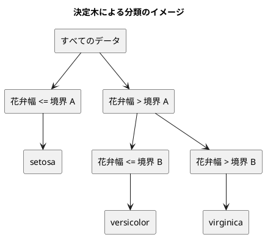

# 第 3 章: 決定木による分類と明白な実装

## 3.1 はじめに

第 1 章では「20 代ならきのこ派」というルールを人間が書き、第 2 章では欠損値を補完した特徴量 `Features` を用意しました。この章では、「どの特徴量のどこで区切るか」をデータから自動で探すアルゴリズム、**決定木** を自作します。

自作したあとは、.NET の機械学習ライブラリ [ML.NET](https://dotnet.microsoft.com/apps/ai/ml-dotnet) に同じデータを学習させ、予測を突き合わせます。ML.NET には scikit-learn の `DecisionTreeClassifier` に当たる単一の決定木の学習器が無いので、[F# 版の第 3 章](../fsharp/03-decision-tree-and-obvious-implementation.md) と同じく、勾配ブースティングの学習器 FastTree に木を 1 本だけ作らせて代わりにします。

[Python 版の第 3 章](../python/03-decision-tree-and-obvious-implementation.md)・F# 版の第 3 章と同じ TODO リストで進めます。C# 版では、次の 3 点に注目してください。

- 木を **抽象レコードと sealed な派生** で表す。C# には F# の判別共用体も Java の `sealed interface` も無い
- `switch` 式の網羅性を、コンパイラが **証明できない**。`_` の分岐を外すと CS8509 でビルドが止まることを実測する
- ML.NET は C# 向けの API なので、F# 版で必要だった `[<CLIMutable>]` に当たる工夫が要らない

第 2 章で分割を F# 版とそろえたので、この章の **数値はすべて F# 版と一致** します。深さごとの正解率も、ML.NET との一致数も、深さ 2 の木の境界も同じです。

## 3.2 決定木の仕組み

### データを 2 つに分けることを繰り返す

決定木は、データを「ある特徴量がある値以下か、より大きいか」で 2 つに分けることを繰り返します。分けた先で同じラベルばかりになったら、そこで分けるのをやめて、そのラベルを予測に使います。



### どこで分けるかをジニ不純度で決める

「よい分け方」とは、分けた後のそれぞれのグループで、ラベルがなるべく 1 種類にそろう分け方です。そろい具合を数値にしたものが **ジニ不純度** です。

ジニ不純度 = 1 − Σ（各ラベルの割合）²

| グループのラベル | 割合 | ジニ不純度 |
|----------------|------|-----------|
| setosa ×3 | setosa 1.0 | 1 − 1.0² = 0 |
| setosa ×1、virginica ×1 | 0.5、0.5 | 1 − (0.5² + 0.5²) = 0.5 |
| 3 品種 ×1 ずつ | 1/3 ずつ | 1 − 3 × (1/3)² = 2/3 |

ラベルが 1 種類にそろうと 0、混ざるほど大きくなります。分け方の候補ごとに、分けた後の左右のジニ不純度を件数で重み付けして平均し、最も小さくなる分け方を選びます。

## 3.3 TODO リストの作成

**TODO リスト**:

- [ ] ジニ不純度を計算する
- [ ] 最良の分割を探す
  - [ ] ラベルを完全に分けられる境界を見つける
  - [ ] 複数の特徴量から不純度が最も小さい特徴量と境界を選ぶ
  - [ ] ラベルが 1 種類なら分割しない
- [ ] 決定木を学習して予測する
  - [ ] 1 種類のラベルだけを学習したらそのラベルを予測する
  - [ ] 境界の左右で異なるラベルを予測する
- [ ] 木の深さを制限する
- [ ] 学習した木を読める形で表示する
- [ ] ML.NET の決定木と突き合わせる
- [ ] 実データで深さと正解率を表示する

ジニ不純度と `Fit`・`Predict` は仮実装と三角測量で刻み、手順のはっきりした `BestSplit` や木の表示は **明白な実装** で書きます。

> 明白な実装
>
> シンプルな操作を実現するにはどうすればよいだろうか——そのまま実装しよう。
>
> — テスト駆動開発

## 3.4 ジニ不純度を計算する

### 仮実装から始める

ラベルが 1 種類ならジニ不純度は 0 です。

```csharp
// tests/MachineLearning.Tests/Chapter03/DecisionTreeTests.cs
namespace MachineLearning.Tests.Chapter03;

using MachineLearning.Chapter02;
using MachineLearning.Chapter03;

public class GiniTests
{
    [Fact(DisplayName = "1 種類のラベルだけならジニ不純度は 0")]
    public void Pure() => Assert.Equal(0.0, DecisionTrees.Gini(["setosa", "setosa", "setosa"]));
}
```

`DecisionTrees` がまだ無いので、第 1 章・第 2 章と同じくコンパイルの段階で止まります（Red）。

```text
tests/MachineLearning.Tests/Chapter03/DecisionTreeTests.cs(4,23): error CS0234: 型または名前空間の名前 'Chapter03' が名前空間 'MachineLearning' に存在しません (アセンブリ参照があることを確認してください)
tests/MachineLearning.Tests/Chapter03/IrisDataTests.cs(5,23): error CS0234: 型または名前空間の名前 'Chapter03' が名前空間 'MachineLearning' に存在しません (アセンブリ参照があることを確認してください)
```

仮実装で 0 を返します。

```csharp
// src/MachineLearning/Chapter03/DecisionTrees.cs
namespace MachineLearning.Chapter03;

using MachineLearning.Chapter02;

/// <summary>決定木を作り、予測し、表示する関数。</summary>
public static class DecisionTrees
{
    public static double Gini(IReadOnlyList<string> labels) => 0.0;
}
```

F# 版はモジュールに `gini` を置きましたが、C# には関数をクラスの外に置く書き方が無いので、第 1 章の `KinokoTakenoko` と同じく `static` メソッドだけを持つクラスにします。

### 三角測量

2 種類のラベルが半分ずつの場合と、3 品種が 1 件ずつの場合を加えます。

```csharp
    [Fact(DisplayName = "2 種類のラベルが半分ずつならジニ不純度は 0.5")]
    public void Half() => Assert.Equal(0.5, DecisionTrees.Gini(["setosa", "virginica"]));

    [Fact(DisplayName = "3 種類のラベルが同じ数ならジニ不純度は 3 分の 2")]
    public void Three() => Assert.Equal(2.0 / 3, DecisionTrees.Gini(["setosa", "versicolor", "virginica"]), 12);
```

```text
failed 3 種類のラベルが同じ数ならジニ不純度は 3 分の 2 (7ms)
  Assert.Equal() Failure: Values are not within 12 decimal places
  Expected: 0.66666666666700003 (rounded from 0.66666666666666663)
  Actual:   0 (rounded from 0)

failed 2 種類のラベルが半分ずつならジニ不純度は 0.5 (1ms)
  Assert.Equal() Failure: Values differ
  Expected: 0.5
  Actual:   0
```

2/3 は 2 進数の小数で正確に表せないので、`Assert.Equal` の 3 つ目の引数で小数第 12 位までで比べています。F# 版の `Assert.Equal(2.0 / 3.0, gini ..., 12)` と同じ書き方で、xUnit のオーバーロードがそのまま使えます。

例が揃ったので、定義どおりに一般化します。

```csharp
    /// <summary>ジニ不純度。ラベルが 1 種類なら 0 で、種類が多く均等なほど大きい。</summary>
    public static double Gini(IReadOnlyList<string> labels)
    {
        ArgumentNullException.ThrowIfNull(labels);
        double total = labels.Count;
        return 1.0 - Counts(labels).Values.Sum(count => Math.Pow(count / total, 2));
    }

    /// <summary>ラベルごとの件数を、ラベルが先に現れた順に並べて返す。</summary>
    private static Dictionary<string, int> Counts(IReadOnlyList<string> labels)
    {
        var counts = new Dictionary<string, int>(StringComparer.Ordinal);
        foreach (var label in labels)
        {
            counts[label] = counts.GetValueOrDefault(label) + 1;
        }

        return counts;
    }
```

- `counts.GetValueOrDefault(label) + 1` は、キーが無ければ 0 から数え始めます。F# 版の `List.countBy id` に当たります
- `total` を `double` にしているのは、`int` 同士の割り算が切り捨てになるためです。`count / total` は `int` を `double` で割るので、`double` の割り算になります
- .NET の `Dictionary` は、**削除をしなければ挿入した順** で列挙されます。この性質は 3.6 節の多数決で使います。仕様として保証された順序ではありませんが、`Counts` が作った直後の辞書をそのまま数えるだけなので、この使い方の範囲では安定します。F# 版の `List.countBy` が「最初に現れた順」を保証するのと、結果としては同じ並びになります

## 3.5 最良の分割を探す

### 分割を表す record

分割は「どの特徴量を」「どの値（境界）で」分けたか、「分けた後の不純度」の 3 つで表します。

```csharp
// src/MachineLearning/Chapter03/Tree.cs
/// <summary>決定木の分割。特徴量の値が境界以下なら左、境界より大きければ右へ進む。</summary>
public sealed record Split(string Feature, double Threshold, double Impurity);
```

成分がすべて値型と文字列なので、ここは record が素直に使えます。第 2 章の `Features` を record にできなかったのは、成分に配列を持たせたかったからでした。

### テスト

テスト用の特徴量を短く作れるように、1 列だけの `Features` を並べるヘルパーを用意します。

```csharp
internal static class Samples
{
    /// <summary>1 列だけの特徴量を値の数だけ作る。</summary>
    internal static IReadOnlyList<Features> Column(string name, params double[] values) =>
        [.. values.Select(value => new Features([name], [value]))];

    /// <summary>3 品種のうち、境界の右側に versicolor 2 件と virginica 1 件が残るデータ。</summary>
    internal static IReadOnlyList<Features> ThreeSpeciesX() => Column("花弁幅", 0.1, 0.2, 0.3, 0.5, 0.6, 0.9);

    internal static IReadOnlyList<string> ThreeSpeciesT() =>
        ["setosa", "setosa", "setosa", "versicolor", "versicolor", "virginica"];
}
```

`params double[] values` は **可変長引数** です。`Column("花弁幅", 0.1, 0.2, 0.7, 0.8)` のように値をいくつでも並べて渡せます。F# 版の `byPetalWidth [ 0.1; 0.2 ]` に当たりますが、リストのかっこが要りません。

`Samples` を `internal` にしたのは、同じテストプロジェクトの別のファイルからも使うためです。Java 版がパッケージプライベートのクラスを別ファイルに置いたのと同じ意図です。

```csharp
public class BestSplitTests
{
    [Fact(DisplayName = "ラベルを完全に分けられる境界を見つける")]
    public void Separates()
    {
        var split = DecisionTrees.BestSplit(
            Samples.Column("花弁幅", 0.1, 0.2, 0.7, 0.8),
            ["setosa", "setosa", "virginica", "virginica"]);

        Assert.NotNull(split);
        Assert.Equal("花弁幅", split.Feature);
        Assert.Equal(0.45, split.Threshold, 12);
        Assert.Equal(0.0, split.Impurity, 12);
    }

    [Fact(DisplayName = "ラベルが 1 種類なら分割しない")]
    public void NoSplitForPureLabels() =>
        Assert.Null(DecisionTrees.BestSplit(Samples.Column("花弁幅", 0.1, 0.2, 0.7), ["setosa", "setosa", "setosa"]));
}
```

`BestSplit` の戻り値は `Split?` にします。F# 版の `Split option`、Java 版の `Optional<Split>` に当たりますが、C# の null 許容参照型は **コンパイル時の注釈** なので、実行時の包みが増えません。

`Assert.NotNull(split)` を先に書いているのは、これを通った後の `split` をコンパイラが「null でない」と見なしてくれるためです。xUnit の `Assert.NotNull` には、そのことをコンパイラに伝える属性（`NotNull`）が付いています。この 1 行が無いと、続く `split.Feature` が「null かもしれない参照の逆参照です」という警告になり、`TreatWarningsAsErrors` でビルドが止まります。F# 版が `match bestSplit x t with | Some split -> ... | None -> Assert.Fail ...` と場合分けしていたところが、C# では 1 行のアサーションで済みます。

境界を `Assert.Equal(0.45, split.Threshold, 12)` と桁数つきで比べているのには理由があります。`(0.2 + 0.7) / 2` は 2 進数の浮動小数点数では 0.45 ちょうどにならず 0.44999999999999996 になるためです。Python 版・Kotlin 版・Java 版と同じ落とし穴です。

複数の特徴量から選ぶテストも加えます。

```csharp
    [Fact(DisplayName = "複数の特徴量から不純度が最も小さくなる特徴量と境界を選ぶ")]
    public void ChoosesBestFeature()
    {
        List<string> columns = ["がく片長さ", "花弁長さ"];
        List<Features> x =
        [
            new(columns, [0.1, 0.2]),
            new(columns, [0.3, 0.1]),
            new(columns, [0.2, 0.9]),
            new(columns, [0.4, 0.6]),
        ];

        var split = DecisionTrees.BestSplit(x, ["setosa", "setosa", "virginica", "virginica"]);

        Assert.NotNull(split);
        Assert.Equal("花弁長さ", split.Feature);
        Assert.Equal(0.4, split.Threshold, 12);
    }
```

`new(columns, [0.1, 0.2])` は、第 1 章で使った型を省いたコンストラクタ呼び出し（target-typed new）です。`List<Features>` の要素として書いているので、`new Features(...)` と書かなくても型が決まります。

### 明白な実装

特徴量ごとに値を並べ替え、隣り合う値の中点をすべて境界の候補にして、分けた後の不純度が最小になる候補を選びます。

```csharp
    /// <summary>左右の不純度の重み付き平均が最も小さくなる分割。同じ不純度なら先に見つけた（列の順で前の）分割を選ぶ。</summary>
    public static Split? BestSplit(IReadOnlyList<Features> x, IReadOnlyList<string> t)
    {
        ArgumentNullException.ThrowIfNull(x);
        ArgumentNullException.ThrowIfNull(t);
        if (Gini(t) == 0.0)
        {
            return null;
        }

        Split? best = null;
        foreach (var feature in x[0].Columns)
        {
            var sorted = x.Select((features, i) => (Value: features.Value(feature), Label: t[i]))
                .OrderBy(pair => pair.Value)
                .ToList();
            for (var i = 1; i < sorted.Count; i++)
            {
                if (sorted[i].Value == sorted[i - 1].Value)
                {
                    continue;
                }

                var left = sorted.Take(i).Select(pair => pair.Label).ToList();
                var right = sorted.Skip(i).Select(pair => pair.Label).ToList();
                var impurity = ((left.Count * Gini(left)) + (right.Count * Gini(right))) / sorted.Count;
                if (best is null || impurity < best.Impurity)
                {
                    best = new Split(feature, (sorted[i - 1].Value + sorted[i].Value) / 2, impurity);
                }
            }
        }

        return best;
    }
```

- `x.Select((features, i) => (Value: ..., Label: t[i]))` で、特徴量の値と正解ラベルを **名前付きのタプル** の組にしてから `OrderBy` で並べ替えます。F# 版の `List.zip ... |> List.sortBy fst` に当たります。Java 版は `zip` も `Pair` も無いので行の位置を並べ替えていましたが、C# はタプルがそのまま使えます
- `OrderBy` は **安定な並べ替え** です。同じ値どうしの順は元の順のまま保たれます
- 同じ値が続くところには境界を置けないので飛ばします。`sorted[i].Value` は `double` なので、`==` がそのまま値の比較になります。Java 版が `List<Double>` の箱を `equals` で比べる必要があったのに対し、C# のタプルは値をそのまま持つのでこの注意は要りません
- 不純度が「より小さい」ときだけ更新するので、同じ不純度の候補が複数あれば、先に見つかった（列の順・値の順で前の）候補が残ります。F# 版の `List.minBy` も最小のうち最初のものを返すので、同じ選び方です。ただし F# 版は特徴量を `Map` のキーの順（文字列の順）に調べ、C# 版は `Features.Columns`（CSV の列の順）に調べます。iris の 4 列ではどちらも同じ木になりましたが、「同点のときにどちらを選ぶか」が実装によって違いうることは、頭の隅に置いておいてください
- `best is null` は null との比較です。`== null` と書いても動きますが、`is null` は演算子のオーバーロードに左右されないので、C# では推奨される書き方です

3 件とも一度で通りました。明白な実装がうまくいったときの形です。

## 3.6 決定木を学習して予測する

### 仮実装

Python 版・F# 版と同じく、`Fit` で学習し `Predict` で予測する形にします。`Fit` が自分自身を返すと、作成と学習を 1 行で書けます。

```csharp
public class DecisionTreeTests
{
    [Fact(DisplayName = "1 種類のラベルだけを学習するとそのラベルを予測する")]
    public void SingleLabel()
    {
        var model = DecisionTree.Unlimited().Fit(Samples.Column("花弁幅", 0.1, 0.2), ["setosa", "setosa"]);

        Assert.Equal(["setosa", "setosa"], model.Predict(Samples.Column("花弁幅", 0.15, 0.9)));
    }
}
```

F# 版の `fit` は学習した **木を返す** 関数でした。木が無ければ `predict` を呼べないので、「学習する前に予測する」という誤りをコンパイラが防げます。C# 版はクラスに学習した木を持たせ、Python 版・Kotlin 版・Java 版と同じ形にしました。C# で F# 版と同じ形にすることもできますが、`Fit`・`Predict` という名前でモデルを扱うのは .NET でも広く使われている書き方で、第 15 章で API にするときにも都合がよいためです。その代わり、学習する前に呼んだときの振る舞いはテストで約束します。

仮実装では、最初のラベルを覚えておいて返します。

```csharp
public sealed class DecisionTree
{
    private string label = string.Empty;

    public static DecisionTree Unlimited() => new();

    public DecisionTree Fit(IReadOnlyList<Features> x, IReadOnlyList<string> t)
    {
        this.label = t[0];
        return this;
    }

    public IReadOnlyList<string> Predict(IReadOnlyList<Features> x) => [.. x.Select(_ => this.label)];
}
```

ラムダ式の引数 `_` は **破棄** です。受け取った値を使わないことを、名前で示しています。

### 三角測量

```csharp
    [Fact(DisplayName = "境界の左右で異なるラベルを予測する")]
    public void LeftAndRight()
    {
        var model = DecisionTree.Unlimited()
            .Fit(Samples.Column("花弁幅", 0.1, 0.2, 0.7, 0.8), ["setosa", "setosa", "virginica", "virginica"]);

        Assert.Equal(["setosa", "virginica"], model.Predict(Samples.Column("花弁幅", 0.15, 0.75)));
    }
```

深さの制限と、学習する前の予測のテストも先に書いておきます。

```csharp
    [Fact(DisplayName = "深さを制限しなければすべての訓練データを分け切る")]
    public void UnlimitedDepth()
    {
        var model = DecisionTree.Unlimited().Fit(Samples.ThreeSpeciesX(), Samples.ThreeSpeciesT());

        Assert.Equal(Samples.ThreeSpeciesT(), model.Predict(Samples.ThreeSpeciesX()));
    }

    [Fact(DisplayName = "深さを 1 に制限すると境界の先は多数派のラベルを予測する")]
    public void DepthOne()
    {
        var model = DecisionTree.WithMaxDepth(1).Fit(Samples.ThreeSpeciesX(), Samples.ThreeSpeciesT());

        Assert.Equal(["setosa", "versicolor"], model.Predict(Samples.Column("花弁幅", 0.2, 0.95)));
    }

    [Fact(DisplayName = "学習する前に予測するとエラーになる")]
    public void PredictBeforeFit()
    {
        var error = Assert.Throws<InvalidOperationException>(
            () => DecisionTree.Unlimited().Predict(Samples.Column("花弁幅", 0.1)));

        Assert.Equal("Fit で学習してから Predict を呼んでください", error.Message);
    }
```

```text
failed 深さを 1 に制限すると境界の先は多数派のラベルを予測する (68ms)
  Assert.Equal() Failure: Collections differ at index 1
  Expected: "versicolor"
  Actual:   "setosa"
failed 境界の左右で異なるラベルを予測する (0ms)
  Assert.Equal() Failure: Collections differ at index 1
  Expected: "virginica"
  Actual:   "setosa"
failed 深さを制限しなければすべての訓練データを分け切る (0ms)
  Assert.Equal() Failure: Collections differ at index 3
  Expected: "versicolor"
  Actual:   "setosa"
failed 学習する前に予測するとエラーになる (3ms)
  Assert.Throws() Failure: No exception was thrown
  Expected: typeof(System.InvalidOperationException)
```

深さ 1 では、1 回だけ分けます。花弁幅 0.4 の境界の右には versicolor 2 件と virginica 1 件が入るので、多数派の versicolor を予測してほしい、というのがこのテストの意図です。

### 木を抽象レコードと sealed な派生で表す

木は「葉」と「節」の 2 種類のデータでできています。

- **葉（`Leaf`）**: 予測するラベルを持つ
- **節（`Node`）**: 分割と、左右の子（葉か節）を持つ

F# 版は、これを判別共用体で書きました。

```fsharp
type Tree<'L> =
    | Leaf of 'L
    | Node of Split * Tree<'L> * Tree<'L>
```

Java 版は `sealed interface Tree permits Leaf, Node` で、実装できる型を限りました。**C# には、どちらの仕組みもありません**。近いことをするには、抽象クラス（または抽象レコード）と派生を使い、外から派生を増やせないようにします。

```csharp
// src/MachineLearning/Chapter03/Tree.cs
/// <summary>
/// 決定木。C# には sealed interface が無いので、抽象レコードと sealed な派生で閉じる。
/// このファイルの外では派生を作れないように、コンストラクターを internal にする。
/// </summary>
public abstract record Tree
{
    internal Tree()
    {
    }
}

/// <summary>予測するラベルを持つ葉。</summary>
public sealed record Leaf(string Label) : Tree;

/// <summary>分割と、左右の部分木を持つ節。</summary>
public sealed record Node(Split Split, Tree Left, Tree Right) : Tree;
```

- `abstract record Tree` に **`internal` のコンストラクターだけ** を用意しました。派生クラスは必ず基底のコンストラクターを呼ぶので、このアセンブリの外からは `Tree` を継承できません。C# で「継承できる相手を限る」慣用句です
- `Leaf` と `Node` は `sealed` なので、さらに継承されることもありません
- `record` にしたので、`Equals`・`ToString` が中身から作られます。成分は文字列・`Split`・`Tree` で、どれも record か値なので、木どうしを値として比べられます
- F# 版の `Tree<'L>` はラベルの型が型引数でしたが、C# 版は `string` に固定しました。第 7 章以降で数値の正解ラベルを扱う回帰木を書くなら、ここを型引数にします

この形は、F# の判別共用体に **できることのうち大事な部分** を再現します。ただし、次の節で見るように、再現できないことが 1 つあります。

### switch 式の網羅性は証明できない

木をたどる `PredictOne` は、葉と節で場合分けします。

```csharp
    /// <summary>1 件の特徴量のラベルを予測する。</summary>
    public static string PredictOne(Tree tree, Features features) =>
        tree switch
        {
            Leaf leaf => leaf.Label,
            Node node => PredictOne(GoesLeft(node.Split, features) ? node.Left : node.Right, features),
            _ => throw new ArgumentException($"知らない木です: {tree}", nameof(tree)),
        };
```

`tree switch { ... }` は **`switch` 式** で、`Leaf leaf` のように型でパターンマッチし、その型の変数として使えます。Java 版の `switch (tree) { case Leaf leaf -> ... }` とほぼ同じ書き方です。

違うのは、最後の `_ => throw ...` です。Java 版は、`Tree` が `sealed` で実装が 2 つだけだとコンパイラが知っているので、`default` を書かずに済みました。むしろ `default` を書くと網羅性の検査が効かなくなるので、**書かない** のが定石でした。

C# で同じことをしようとして `_` の分岐を消すと、ビルドが止まります。

```text
src/MachineLearning/Chapter03/DecisionTrees.cs(55,14): error CS8509: この switch 式では入力型の可能な値がすべて扱われるわけではありません (すべてが網羅されているわけではありません)。たとえば、パターン '_' がカバーされていません。
```

コンストラクターを `internal` にして派生を閉じても、C# のコンパイラは「`Tree` は `Leaf` か `Node` のどちらかしかない」と **証明できません**。`Tree` 型の変数には、たとえば `null` も入りえます。そのため CS8509（網羅されていない）の警告になり、第 1 章で入れた `TreatWarningsAsErrors` によってエラーになります。

| 言語 | 木の表し方 | 網羅性の検査 |
|------|-----------|-------------|
| F# | 判別共用体 `Leaf \| Node` | コンパイラが証明する。漏れは FS0025（警告→エラー） |
| Java | `sealed interface Tree permits Leaf, Node` | コンパイラが証明する。`default` は書かない |
| C# | 抽象レコード + `internal` コンストラクター + `sealed` な派生 | 証明できない。最後に `_` を書く |

`_` を書く以上、「後から `Tree` に 3 つ目の種類を足したら、扱っていない `switch` をコンパイラが教えてくれる」という利点は得られません。足したときに気づけるのは、`_` の `throw` が実行時に飛んだときです。そこで例外のメッセージには、どの木で起きたかを `$"知らない木です: {tree}"` と入れておきます。`record` の `ToString` が中身を表示するので、原因を追いやすくなります。

第 1 章の 1.11 節で「F# 版で `TreatWarningsAsErrors` が最も効いていたパターンマッチの網羅漏れは、C# では同じようには効かない」と書いたのは、このことです。

### 再帰で木を作る

```csharp
    /// <summary>深さの上限まで分割を繰り返して木を作る。maxDepth が負なら上限なし。</summary>
    internal static Tree Build(IReadOnlyList<Features> x, IReadOnlyList<string> t, int maxDepth)
    {
        var split = maxDepth == 0 ? null : BestSplit(x, t);
        if (split is null)
        {
            return new Leaf(Majority(t));
        }

        var left = Enumerable.Range(0, x.Count).Where(i => GoesLeft(split, x[i])).ToList();
        var right = Enumerable.Range(0, x.Count).Where(i => !GoesLeft(split, x[i])).ToList();
        var childDepth = maxDepth < 0 ? maxDepth : maxDepth - 1;
        return new Node(
            split,
            Build(Pick(x, left), Pick(t, left), childDepth),
            Build(Pick(x, right), Pick(t, right), childDepth));
    }

    /// <summary>多数派のラベル。同数なら先に現れたラベルを選ぶ。</summary>
    internal static string Majority(IReadOnlyList<string> labels) =>
        Counts(labels).Aggregate((best, next) => next.Value > best.Value ? next : best).Key;

    private static bool GoesLeft(Split split, Features features) =>
        features.Value(split.Feature) <= split.Threshold;

    private static IReadOnlyList<T> Pick<T>(IReadOnlyList<T> values, IReadOnlyList<int> positions) =>
        [.. positions.Select(i => values[i])];
```

- 分け方が見つからない（ラベルが 1 種類にそろった）か、深さの上限に達したら葉にします。そうでなければ、行を左右に分けて、それぞれで再び `Build` を呼びます
- 深さの「上限なし」は負の数（`-1`）で表します。F# 版は `int option` の `None` で表し、`Option.map` で減らしました。C# の `int?` でも同じことは書けますが、`Build` は `internal` で外から呼ばれないので、簡単な約束で済ませています。外に見せる `DecisionTree` は、次の節のとおり作り方ごとに名前を分けます
- `Majority` の `Aggregate` は、件数が「より多い」ときだけ更新するので、同数なら先に現れたラベルが残ります。F# 版の `List.maxBy snd` と同じ選び方です
- `Pick` は、行の位置のリストで要素を取り出します。F# 版が `List.partition` で組をそのまま 2 つに分けていたのに対し、C# 版は位置で分けてから `x` と `t` の両方を同じ位置で取り出します

### ファクトリで作り方に名前を付ける

F# 版は `fit (Some 2) ...` と `fit None ...` を引数で書き分けました。C# にも `int?` はありますが、`new DecisionTree(null)` と書くより、作り方に名前が付いているほうが呼び出し側で読めます。

```csharp
// src/MachineLearning/Chapter03/DecisionTree.cs
/// <summary>自作の決定木の分類器。Fit で学習してから Predict で予測する。</summary>
public sealed class DecisionTree
{
    private const int UnlimitedDepth = -1;

    private readonly int maxDepth;

    private DecisionTree(int maxDepth) => this.maxDepth = maxDepth;

    /// <summary>学習した木。学習する前は null。</summary>
    public Tree? Tree { get; private set; }

    /// <summary>深さを制限しない決定木。</summary>
    public static DecisionTree Unlimited() => new(UnlimitedDepth);

    /// <summary>深さの上限を指定した決定木。</summary>
    public static DecisionTree WithMaxDepth(int maxDepth) =>
        maxDepth < 0
            ? throw new ArgumentOutOfRangeException(nameof(maxDepth), "深さの上限は 0 以上にしてください")
            : new DecisionTree(maxDepth);

    /// <summary>訓練データから木を作る。</summary>
    public DecisionTree Fit(IReadOnlyList<Features> x, IReadOnlyList<string> t)
    {
        this.Tree = DecisionTrees.Build(x, t, this.maxDepth);
        return this;
    }

    /// <summary>特徴量ごとのラベルを予測する。</summary>
    public IReadOnlyList<string> Predict(IReadOnlyList<Features> x)
    {
        ArgumentNullException.ThrowIfNull(x);
        var tree = this.Tree ?? throw new InvalidOperationException("Fit で学習してから Predict を呼んでください");
        return [.. x.Select(features => DecisionTrees.PredictOne(tree, features))];
    }
}
```

- `DecisionTree.Unlimited()` と `DecisionTree.WithMaxDepth(2)` は、呼び出し側で何を作っているかが読めます。Java 版の static ファクトリと同じ形です
- 「上限なし」を `-1` で表すことは `DecisionTree` の中だけの約束で、外からは見えません。`WithMaxDepth` は負の数を受け付けません
- 学習した木は `Tree? Tree { get; private set; }` という **プロパティ** で見せます。読むのは誰でもでき、書けるのはクラスの中だけです。Java 版が `Optional<Tree> tree()` というメソッドで包んだところを、C# は null 許容参照型と自動プロパティでそのまま書けます
- `this.Tree ?? throw new InvalidOperationException(...)` は、第 2 章で使った null 合体演算子と throw 式の組み合わせです。木があればローカル変数 `tree`（`Tree` 型、null でない）に入り、無ければ例外になります。1 行で「取り出す」と「無ければ失敗させる」を書けます

仮実装から本実装に進む途中で、`maxDepth` のフィールドだけを先に足してみると、ビルドが止まります。

```text
src/MachineLearning/Chapter03/DecisionTree.cs(8,26): error CS0169: フィールド 'DecisionTree.maxDepth' は使用されていません
```

第 1 章の CS0219（使っていない変数）と同じく、**使われないものを先に書かない** という TDD の規律を、ツールが後押ししています。Java 版で Error Prone の `UnusedVariable` が担っていた役割を、C# ではコンパイラ自身が果たします。

## 3.7 学習した木を表示する

決定木の長所は、学習した結果を人が読めることです。木をテキストにする `Format` を作ります。

```csharp
public class FormatTests
{
    [Fact(DisplayName = "葉だけの木はラベルを表示する")]
    public void LeafOnly() => Assert.Equal("setosa", DecisionTrees.Format(new Leaf("setosa")));

    [Fact(DisplayName = "節は条件ごとに字下げして表示する")]
    public void NodeTree()
    {
        Tree tree = new Node(
            new Split("花弁幅", 0.4, 0.0),
            new Leaf("setosa"),
            new Node(new Split("花弁長さ", 0.75, 0.0), new Leaf("versicolor"), new Leaf("virginica")));

        Assert.Equal(
            string.Join(
                Environment.NewLine,
                "花弁幅 <= 0.4000",
                "  setosa",
                "花弁幅 > 0.4000",
                "  花弁長さ <= 0.7500",
                "    versicolor",
                "  花弁長さ > 0.7500",
                "    virginica"),
            DecisionTrees.Format(tree));
    }
}
```

テストでは、`Node(...)` と `Leaf(...)` で表示したい形の木を直接組み立てています。学習を通さずに書けるのは、木がただのデータだからです。F# 版のテストとまったく同じ発想で、記法だけが違います。

```csharp
    /// <summary>木を、条件ごとに字下げした文字列にする。</summary>
    public static string Format(Tree tree) => Format(tree, string.Empty);

    private static string Format(Tree tree, string indent) =>
        tree switch
        {
            Leaf leaf => indent + leaf.Label,
            Node node => string.Join(
                Environment.NewLine,
                $"{indent}{node.Split.Feature} <= {node.Split.Threshold.ToString("F4", CultureInfo.InvariantCulture)}",
                Format(node.Left, indent + "  "),
                $"{indent}{node.Split.Feature} > {node.Split.Threshold.ToString("F4", CultureInfo.InvariantCulture)}",
                Format(node.Right, indent + "  ")),
            _ => throw new ArgumentException($"知らない木です: {tree}", nameof(tree)),
        };
```

- 部分木を表示した文字列に、字下げを 2 文字足して渡します。深い部分木ほど、再帰の段数だけ字下げが重なります
- F# 版は行のリスト（`string list`）を返し、`Main` で 1 行ずつ表示しました。C# 版は改行でつないだ 1 つの文字列を返します。`Environment.NewLine` を使うのは、第 2 章と同じく OS による改行の違いに合わせるためです
- `ToString("F4", CultureInfo.InvariantCulture)` で小数第 4 位まで表示します。第 1 章で見たとおり、`$"{値:F4}"` と補間の中に書式を書くと実行環境の文化圏に従ってしまうので、明示しています。F# 版が `$"{split.Threshold:F4}"` と短く書けたのは、F# 版のプロジェクト設定で文化圏が固定されているためです
- ここでも `_` の分岐が要ります。`switch` 式を使うたびに書くことになるので、`PredictOne` と同じメッセージにそろえました

## 3.8 ML.NET の決定木と突き合わせる

### ML.NET には単一の決定木が無い

ML.NET の多クラス分類の学習器には、scikit-learn の `DecisionTreeClassifier` のような「決定木を 1 本だけ作る」ものがありません。木を使う学習器は、FastTree（勾配ブースティング）や FastForest（ランダムフォレスト）のように、木を何本も組み合わせるものです。

そこで [ADR 006](../../../adr/006-csharp-ml-libraries.md) では、F# 版（[ADR 004](../../../adr/004-fsharp-ml-libraries.md)）と同じ組み合わせで代わりにすると決めました。

- 2 値分類の FastTree に、木を 1 本だけ作らせる（`numberOfTrees: 1`）
- 多クラスは、クラスごとに「そのクラスか、それ以外か」の 2 値分類器を作る **OneVersusAll** で組む
- 深さの上限の代わりに、葉の数の上限（`numberOfLeaves`）を指定する。深さ d の決定木の葉は最大 2 の d 乗個なので、それに合わせる

自作の決定木とは仕組みが違うので、境界の値までは一致しない前提で、**予測** を突き合わせます。

### ML.NET を導入する

```xml
<!-- Directory.Packages.props -->
    <PackageVersion Include="Microsoft.ML" Version="5.0.0" />
    <PackageVersion Include="Microsoft.ML.FastTree" Version="5.0.0" />
```

```xml
<!-- src/MachineLearning/MachineLearning.csproj -->
  <ItemGroup>
    <PackageReference Include="Microsoft.ML" />
    <PackageReference Include="Microsoft.ML.FastTree" />
  </ItemGroup>
```

第 1 章で中央パッケージ管理にしたので、版は `Directory.Packages.props` に、プロジェクト側にはパッケージ名だけを書きます。`dotnet restore` を実行すると、依存関係の依存関係まで含めた正確な版が `packages.lock.json` に記録されます。

### C# の値を ML.NET に渡す

ML.NET は、データを「引数なしのコンストラクターと、書き換えられるプロパティを持つクラス」で受け取ります。

```csharp
// src/MachineLearning/Chapter03/MlNetAdapter.cs
namespace MachineLearning.Chapter03;

using MachineLearning.Chapter02;
using Microsoft.ML;
using Microsoft.ML.Data;

/// <summary>ML.NET に渡す 1 行。ML.NET は書き換えられるプロパティを持つクラスを求める。</summary>
public sealed class MlRow
{
    public float[] Features { get; set; } = [];

    public string Label { get; set; } = string.Empty;
}

/// <summary>ML.NET が返す予測。列の名前（PredictedLabel）でプロパティに対応づけられる。</summary>
public sealed class MlPrediction
{
    public string PredictedLabel { get; set; } = string.Empty;
}
```

F# 版では、レコードが不変で引数なしのコンストラクターも持たないため、`[<CLIMutable>]` という属性を付けて「コンパイル後は引数なしのコンストラクターと書き換えられるプロパティを持つ」形にする必要がありました。**C# ではその工夫が要りません**。ML.NET が求めている形を、`{ get; set; }` のプロパティを持つ普通のクラスとしてそのまま書けます。ML.NET は C# 向けに作られた API なので、C# から使うときは橋渡しが 1 段少なくて済みます。

代わりに、null 許容参照型を有効にしている C# 側の事情が出ます。`Features` と `Label` に `= []`・`= string.Empty` と初期値を書いているのは、書かないと「コンストラクターを抜けるときに null でない値が入っていません」という警告になり、`TreatWarningsAsErrors` でビルドが止まるためです。

- ML.NET の学習器は、特徴量を `Features` という名前の `float32`（単精度の浮動小数点数）のベクトルの列で受け取ります。第 2 章の `Features` は `double` の値を持つので、`(float)` で変換して詰め替えます
- 予測を受け取る `MlPrediction` は、`PredictedLabel` という **列の名前と同じ名前のプロパティ** で結果を受け取ります

### ベクトルの長さをスキーマで指定する

もう 1 つの問題は、ベクトルの長さです。ML.NET は、`Features` 列が何個の値を持つかを事前に知る必要があります。C# の例では `[VectorType(4)]` という属性で長さを書きますが、属性には定数しか書けません。自作の決定木は特徴量の数によらずに動くので、ML.NET との橋渡しも特徴量の数によらずに使えるようにしたいところです。そこで、実行時に長さを指定する `SchemaDefinition` を使います。ここは F# 版とまったく同じ対処です。

```csharp
    /// <summary>特徴量の数は実行時に決まるので、Features 列のベクトルの長さをスキーマで指定する。</summary>
    private static SchemaDefinition SchemaFor(int featureCount)
    {
        var schema = SchemaDefinition.Create(typeof(MlRow));
        schema["Features"].ColumnType = new VectorDataViewType(NumberDataViewType.Single, featureCount);
        return schema;
    }
```

`SchemaDefinition.Create(typeof(MlRow))` は、クラスの形から列の定義を作ります。その `Features` 列の型だけを、長さの決まったベクトルに差し替えます。

### アダプターの実装

```csharp
    /// <summary>
    /// 木を 1 本だけ作る FastTree を、クラスごとの 2 値分類（OneVersusAll）で多クラスにして学習する。
    /// ML.NET には単一の決定木（CART）の学習器が無いので、勾配ブースティングの 1 本目の木で代わりにする。
    /// 葉の数の上限 numberOfLeaves は、深さ d の決定木なら 2 の d 乗に当たる。
    /// </summary>
    public static Func<IReadOnlyList<Features>, IReadOnlyList<string>> TrainFastTree(
        int numberOfLeaves, IReadOnlyList<Features> x, IReadOnlyList<string> t)
    {
        ArgumentNullException.ThrowIfNull(x);
        ArgumentNullException.ThrowIfNull(t);
        var context = new MLContext(seed: 0);
        var schema = SchemaFor(x[0].Columns.Count);
        var data = context.Data.LoadFromEnumerable(ToRows(x, i => t[i]), schema);
        var fastTree = context.BinaryClassification.Trainers.FastTree(
            numberOfLeaves: numberOfLeaves, numberOfTrees: 1, minimumExampleCountPerLeaf: 1);
        var pipeline = context.Transforms.Conversion.MapValueToKey("Label")
            .Append(context.MulticlassClassification.Trainers.OneVersusAll(fastTree))
            .Append(context.Transforms.Conversion.MapKeyToValue("PredictedLabel"));
        var model = pipeline.Fit(data);

        return newX =>
        {
            var newData = context.Data.LoadFromEnumerable(ToRows(newX, _ => string.Empty), schema);
            return [.. context.Data
                .CreateEnumerable<MlPrediction>(model.Transform(newData), reuseRowObject: false)
                .Select(prediction => prediction.PredictedLabel)];
        };
    }

    private static List<MlRow> ToRows(IReadOnlyList<Features> x, Func<int, string> label) =>
        [.. x.Select((features, i) => new MlRow
        {
            Features = [.. features.Values.Select(value => (float)value)],
            Label = label(i),
        })];
```

- 戻り値の型 `Func<IReadOnlyList<Features>, IReadOnlyList<string>>` は「特徴量のリストを渡すとラベルのリストが返る関数」です。学習した `model` と `MLContext` は、この **ラムダ式が覚えている（クロージャ）** ので、呼び出し側からは ML.NET の存在が見えません。F# 版が `Map<string, float> list -> string list` を返したのと同じ設計です
- `MLContext(seed: 0)` は、ML.NET のすべての操作の入り口です。乱数のシードを渡して、結果を再現できるようにします。`seed:` のように **引数に名前を付けて渡す** と、どの引数かが読めます
- パイプラインは、「文字列のラベルを番号（キー）にする」「OneVersusAll で学習する」「予測した番号を文字列のラベルに戻す」の 3 段です。ML.NET の分類器は、正解ラベルを番号で受け取るためです。F# 版は `EstimatorChain()` から `.Append(...)` をつなぎましたが、C# では最初の変換に直接 `.Append(...)` をつなげます
- `minimumExampleCountPerLeaf: 1` は、葉に最低 1 件あればよいという指定です。既定では葉ごとに 10 件以上を求めるので、テストの小さなデータでは分けられません
- `ToRows` の第 2 引数で、学習のときは正解ラベルを、予測のときは空文字列を詰めます。ML.NET のデータは列の形が決まっているので、予測のときもラベルの列そのものは必要です

## 3.9 実データで深さと正解率を表示する

### 実行して表示する

深さの上限ごとに、自作の決定木の訓練データとテストデータの正解率と、テストデータの予測が ML.NET とどれだけ一致したかを表示します。

```csharp
// src/MachineLearning/Chapter03/Program.cs
/// <summary>深さごとの正解率、ML.NET との予測の一致数、深さ 2 の決定木を表示する。</summary>
public static class Program
{
    private const double TestSize = 0.3;
    private const int Seed = 0;
    private const int TreeDepthToShow = 2;

    private static readonly int[] MaxDepths = [1, 2, 3, 4, 5];

    public static void Run(TextWriter output)
    {
        ArgumentNullException.ThrowIfNull(output);
        var split = Preprocessing.PrepareIris(Path.Combine(DataDir.Current(), "iris.csv"), TestSize, Seed);
        output.WriteLine("深さ\t訓練データ\tテストデータ\tML.NET と一致");
        foreach (var maxDepth in MaxDepths)
        {
            WriteRow(output, maxDepth.ToString(CultureInfo.InvariantCulture), DecisionTree.WithMaxDepth(maxDepth), LeafLimit(maxDepth, split), split);
        }

        WriteRow(output, "制限なし", DecisionTree.Unlimited(), split.XTrain.Count, split);

        var shallow = DecisionTree.WithMaxDepth(TreeDepthToShow).Fit(split.XTrain, split.TTrain);
        output.WriteLine();
        output.WriteLine($"深さ {TreeDepthToShow} の決定木:");
        output.WriteLine(DecisionTrees.Format(shallow.Tree!));
    }

    /// <summary>深さ d の決定木の葉の数の上限（2 の d 乗）。</summary>
    private static int LeafLimit(int maxDepth, TrainTestSplit<Features, string> split) =>
        Math.Min((int)Math.Pow(2, maxDepth), split.XTrain.Count);

    private static void WriteRow(
        TextWriter output,
        string label,
        DecisionTree model,
        int numberOfLeaves,
        TrainTestSplit<Features, string> split)
    {
        model.Fit(split.XTrain, split.TTrain);
        var train = KinokoTakenoko.Accuracy(model.Predict(split.XTrain), split.TTrain);
        var test = KinokoTakenoko.Accuracy(model.Predict(split.XTest), split.TTest);
        var mlNet = MlNetAdapter.TrainFastTree(numberOfLeaves, split.XTrain, split.TTrain)(split.XTest);
        var agreed = model.Predict(split.XTest).Zip(mlNet).Count(pair => string.Equals(pair.First, pair.Second, StringComparison.Ordinal));
        output.WriteLine(
            $"{label}\t{Format(train)}\t{Format(test)}\t{agreed}/{split.XTest.Count}");
    }

    private static string Format(double value) => value.ToString("F4", CultureInfo.InvariantCulture);
}
```

- 正解率は、第 1 章の `KinokoTakenoko.Accuracy` をそのまま使います。文字列のリストを 2 つ受け取る形なので、派閥でも品種でも使えます
- `MlNetAdapter.TrainFastTree(...)(split.XTest)` は、学習して返ってきた関数に、そのままテストデータを渡しています。かっこが 2 つ続くのは、関数を返す関数を呼んですぐ使っているためです
- `shallow.Tree!` の `!` は null 免除演算子です。`Fit` の直後なので木があることは分かっていますが、`Tree` の型は `Tree?` なのでコンパイラに保証を伝えます
- `Chapter02.Features` と `Chapter01.Features` の名前がぶつかるので、ファイルの先頭で `using Features = MachineLearning.Chapter02.Features;` と **別名** を付けています。F# 版はモジュールごとに名前が分かれていたのでこの調整が要りませんでした

`src/MachineLearning/Program.cs` の対応表に、第 3 章を加えます。

```csharp
        ["chapter03"] = Chapter03.Program.Run,
```

```bash
dotnet run --project src/MachineLearning -- chapter03
```

```text
深さ	訓練データ	テストデータ	ML.NET と一致
1	0.6952	0.6000	32/45
2	0.9619	0.8889	45/45
3	0.9714	0.8889	43/45
4	0.9810	0.9111	44/45
5	1.0000	0.9111	44/45
制限なし	1.0000	0.9111	44/45

深さ 2 の決定木:
花弁幅 <= 0.2750
  Iris-setosa
花弁幅 > 0.2750
  花弁幅 <= 0.6900
    Iris-versicolor
  花弁幅 > 0.6900
    Iris-virginica
```

### 結果を読む

- 深さを増やすと訓練データの正解率は上がり、深さ 5 で 1.0 になります。一方、テストデータの正解率は 0.9111 で頭打ちです。深さを増やしても、新しいデータへの当たりやすさは上がっていません。訓練データの細かな違いまで覚えてしまう **過学習** が起きています
- 深さ 2 の木は、花弁幅だけで 3 品種を分けています。花弁幅は品種による違いがはっきりした特徴量です
- **この表は、F# 版の第 3 章の表とすべて同じ値です**。深さごとの正解率も、ML.NET との一致数も、深さ 2 の木の境界 0.2750・0.6900 も一致します。第 2 章で分割を F# 版にそろえたので、訓練データに入った 105 件が同じだからです。Python 版・Kotlin 版・Java 版とは、分割が違うので数値が変わります

言語を変えても、乱数と手順をそろえれば同じ結果になる——当たり前のようですが、これは「実装が正しい」ことの、なかなか強い裏付けです。2 つの独立した実装（F# 版と C# 版）が、小数第 4 位まで同じ答えを出したということだからです。

### ML.NET と一致しない理由

深さ 2 では、テストデータの 45 件すべてで予測が一致しました。深さ 1 では 45 件中 32 件しか一致しません。

深さ 1 の自作の決定木は、1 回だけ分けて 2 つの葉を作ります。3 品種のうち 1 つは、どちらの葉でも予測されません。正解率が 0.6 にとどまるのはそのためです。

ML.NET の OneVersusAll は、品種ごとに「その品種か、それ以外か」を判定する木を **3 本** 作り、最も確からしいと判定した品種を選びます。3 本の木はそれぞれ別の境界で分けられるので、葉が 2 つずつでも 3 品種すべてを予測できます。深さ 1 どうしでは、比べている仕組みそのものが違うのです。

深さ 3 以上で 1〜2 件ずれるのは、次の違いによると考えられます。

- FastTree は、特徴量の値をあらかじめいくつかの区間に分け（ビン分割）、区間の境目だけを境界の候補にする。自作の決定木は、隣り合う値の中点をすべて候補にする
- FastTree は、ジニ不純度ではなく勾配ブースティングの損失を小さくするように分ける

仕組みの違う 2 つの実装が、深さ 2 で予測をすべて一致させたことは、自作の決定木が妥当に動いていることの裏付けになります。

### 実データのテスト

実測した値を、実データのテストとして残します。

```csharp
// tests/MachineLearning.Tests/Chapter03/IrisDataTests.cs
public class IrisDataTests
{
    private readonly string csvFile = Path.Combine(DataDir.Current(), "iris.csv");

    [Fact(DisplayName = "深さ 2 の決定木はテストデータの 45 件中 40 件を正しく分類する")]
    public void DepthTwoAccuracy()
    {
        Assert.SkipUnless(File.Exists(this.csvFile), "学習データ iris.csv が配置されていない（gulp data:setup）");

        var split = this.IrisSplit();

        var predictions = DecisionTree.WithMaxDepth(2).Fit(split.XTrain, split.TTrain).Predict(split.XTest);

        Assert.Equal(40.0 / 45, KinokoTakenoko.Accuracy(predictions, split.TTest), 12);
    }

    [Theory(DisplayName = "深さごとに ML.NET の FastTree と一致する件数を確かめる")]
    [InlineData(1, 32)]
    [InlineData(2, 45)]
    [InlineData(3, 43)]
    [InlineData(4, 44)]
    [InlineData(5, 44)]
    public void AgreementWithMlNet(int maxDepth, int expected)
    {
        Assert.SkipUnless(File.Exists(this.csvFile), "学習データ iris.csv が配置されていない（gulp data:setup）");

        var split = this.IrisSplit();
        var mine = DecisionTree.WithMaxDepth(maxDepth).Fit(split.XTrain, split.TTrain).Predict(split.XTest);
        var mlNet = MlNetAdapter.TrainFastTree((int)Math.Pow(2, maxDepth), split.XTrain, split.TTrain)(split.XTest);

        var agreed = mine.Zip(mlNet).Count(pair => string.Equals(pair.First, pair.Second, StringComparison.Ordinal));

        Assert.Equal(expected, agreed);
    }

    private TrainTestSplit<Features, string> IrisSplit() => Preprocessing.PrepareIris(this.csvFile, 0.3, 0);
}
```

`[Theory]` と `[InlineData]` は、xUnit の **データ駆動のテスト** です。深さと期待する一致数の組を並べると、組ごとに 1 件のテストとして実行されます。F# 版は深さごとの一致数を `Main` の出力のテストだけで固定していましたが、C# 版では深さごとに分けて、どの深さで崩れたかが分かるようにしました。Java 版の `@ParameterizedTest` に当たります。

表示のテストも、第 1 章・第 2 章と同じく、`Program.Run` の出力をまるごと比べます。

```csharp
    [Fact(DisplayName = "実行すると深さごとの正解率と深さ 2 の決定木を表示する")]
    public void PrintsSummary()
    {
        Assert.SkipUnless(File.Exists(this.csvFile), "学習データ iris.csv が配置されていない（gulp data:setup）");

        using var output = new StringWriter();
        MachineLearning.Chapter03.Program.Run(output);

        Assert.Equal(
            string.Join(
                Environment.NewLine,
                "深さ\t訓練データ\tテストデータ\tML.NET と一致",
                "1\t0.6952\t0.6000\t32/45",
                "2\t0.9619\t0.8889\t45/45",
                "3\t0.9714\t0.8889\t43/45",
                "4\t0.9810\t0.9111\t44/45",
                "5\t1.0000\t0.9111\t44/45",
                "制限なし\t1.0000\t0.9111\t44/45",
                string.Empty,
                "深さ 2 の決定木:",
                "花弁幅 <= 0.2750",
                "  Iris-setosa",
                "花弁幅 > 0.2750",
                "  花弁幅 <= 0.6900",
                "    Iris-versicolor",
                "  花弁幅 > 0.6900",
                "    Iris-virginica") + Environment.NewLine,
            output.ToString());
    }
```

`Chapter03.Program` と、テストクラス自身の名前空間にある `Program` を区別するために、`MachineLearning.Chapter03.Program.Run` と完全な名前で書いています。

```bash
cd apps/csharp
dotnet test
```

```text
テストの実行の概要: 成功!
  合計: 59
  失敗: 0
  成功: 59
  スキップ済み: 0
  期間: 5s 846ms
```

第 3 章までのテストは 59 件（第 1 章 15 件、第 2 章 24 件、第 3 章 20 件）です。データが無い環境では、実データのテスト 14 件がスキップされます。

```text
スキップされました 深さ 2 の決定木はテストデータの 45 件中 40 件を正しく分類する (0ms)
  学習データ iris.csv が配置されていない（gulp data:setup）

テストの実行の概要: 成功!
  合計: 59
  失敗: 0
  成功: 45
  スキップ済み: 14
```

`[Theory]` のテストは、`Assert.SkipUnless` がデータの組ごとに評価されるので、5 件ともスキップされます。

**TODO リスト**:

- [x] ジニ不純度を計算する
- [x] 最良の分割を探す
  - [x] ラベルを完全に分けられる境界を見つける
  - [x] 複数の特徴量から不純度が最も小さい特徴量と境界を選ぶ
  - [x] ラベルが 1 種類なら分割しない
- [x] 決定木を学習して予測する
  - [x] 1 種類のラベルだけを学習したらそのラベルを予測する
  - [x] 境界の左右で異なるラベルを予測する
- [x] 木の深さを制限する
- [x] 学習した木を読める形で表示する
- [x] ML.NET の決定木と突き合わせる
- [x] 実データで深さと正解率を表示する

## 3.10 可視化について

C# 版には Notebook の節を設けません。深さと正解率の折れ線グラフは、[F# 版の第 3 章](../fsharp/03-decision-tree-and-obvious-implementation.md) の「Notebook で探索する」の節を、scikit-learn による木の図は [Python 版の第 3 章](../python/03-decision-tree-and-obvious-implementation.md) を参照してください。

C# 版の分割は F# 版と一致するので、F# 版の Notebook が示した「訓練データの正解率は深さ 5 で 1.0 に達し、テストデータの正解率は深さ 4 以降 0.9111 のまま横ばい」という観察は、そのまま C# 版にも当てはまります。3.9 節の表が、同じ内容を数値で示しています。

<details>
<summary>この章の完成コード（src/MachineLearning/Chapter03/DecisionTrees.cs）</summary>

```csharp
namespace MachineLearning.Chapter03;

using System.Globalization;
using MachineLearning.Chapter02;

/// <summary>決定木を作り、予測し、表示する関数。</summary>
public static class DecisionTrees
{
    /// <summary>ジニ不純度。ラベルが 1 種類なら 0 で、種類が多く均等なほど大きい。</summary>
    public static double Gini(IReadOnlyList<string> labels)
    {
        ArgumentNullException.ThrowIfNull(labels);
        double total = labels.Count;
        return 1.0 - Counts(labels).Values.Sum(count => Math.Pow(count / total, 2));
    }

    /// <summary>左右の不純度の重み付き平均が最も小さくなる分割。同じ不純度なら先に見つけた（列の順で前の）分割を選ぶ。</summary>
    public static Split? BestSplit(IReadOnlyList<Features> x, IReadOnlyList<string> t)
    {
        ArgumentNullException.ThrowIfNull(x);
        ArgumentNullException.ThrowIfNull(t);
        if (Gini(t) == 0.0)
        {
            return null;
        }

        Split? best = null;
        foreach (var feature in x[0].Columns)
        {
            var sorted = x.Select((features, i) => (Value: features.Value(feature), Label: t[i]))
                .OrderBy(pair => pair.Value)
                .ToList();
            for (var i = 1; i < sorted.Count; i++)
            {
                if (sorted[i].Value == sorted[i - 1].Value)
                {
                    continue;
                }

                var left = sorted.Take(i).Select(pair => pair.Label).ToList();
                var right = sorted.Skip(i).Select(pair => pair.Label).ToList();
                var impurity = ((left.Count * Gini(left)) + (right.Count * Gini(right))) / sorted.Count;
                if (best is null || impurity < best.Impurity)
                {
                    best = new Split(feature, (sorted[i - 1].Value + sorted[i].Value) / 2, impurity);
                }
            }
        }

        return best;
    }

    /// <summary>1 件の特徴量のラベルを予測する。</summary>
    public static string PredictOne(Tree tree, Features features) =>
        tree switch
        {
            Leaf leaf => leaf.Label,
            Node node => PredictOne(GoesLeft(node.Split, features) ? node.Left : node.Right, features),
            _ => throw new ArgumentException($"知らない木です: {tree}", nameof(tree)),
        };

    /// <summary>木を、条件ごとに字下げした文字列にする。</summary>
    public static string Format(Tree tree) => Format(tree, string.Empty);

    /// <summary>深さの上限まで分割を繰り返して木を作る。maxDepth が負なら上限なし。</summary>
    internal static Tree Build(IReadOnlyList<Features> x, IReadOnlyList<string> t, int maxDepth)
    {
        var split = maxDepth == 0 ? null : BestSplit(x, t);
        if (split is null)
        {
            return new Leaf(Majority(t));
        }

        var left = Enumerable.Range(0, x.Count).Where(i => GoesLeft(split, x[i])).ToList();
        var right = Enumerable.Range(0, x.Count).Where(i => !GoesLeft(split, x[i])).ToList();
        var childDepth = maxDepth < 0 ? maxDepth : maxDepth - 1;
        return new Node(
            split,
            Build(Pick(x, left), Pick(t, left), childDepth),
            Build(Pick(x, right), Pick(t, right), childDepth));
    }

    /// <summary>多数派のラベル。同数なら先に現れたラベルを選ぶ。</summary>
    internal static string Majority(IReadOnlyList<string> labels) =>
        Counts(labels).Aggregate((best, next) => next.Value > best.Value ? next : best).Key;

    /// <summary>ラベルごとの件数を、ラベルが先に現れた順に並べて返す。</summary>
    private static Dictionary<string, int> Counts(IReadOnlyList<string> labels)
    {
        var counts = new Dictionary<string, int>(StringComparer.Ordinal);
        foreach (var label in labels)
        {
            counts[label] = counts.GetValueOrDefault(label) + 1;
        }

        return counts;
    }

    private static bool GoesLeft(Split split, Features features) =>
        features.Value(split.Feature) <= split.Threshold;

    private static IReadOnlyList<T> Pick<T>(IReadOnlyList<T> values, IReadOnlyList<int> positions) =>
        [.. positions.Select(i => values[i])];

    private static string Format(Tree tree, string indent) =>
        tree switch
        {
            Leaf leaf => indent + leaf.Label,
            Node node => string.Join(
                Environment.NewLine,
                $"{indent}{node.Split.Feature} <= {node.Split.Threshold.ToString("F4", CultureInfo.InvariantCulture)}",
                Format(node.Left, indent + "  "),
                $"{indent}{node.Split.Feature} > {node.Split.Threshold.ToString("F4", CultureInfo.InvariantCulture)}",
                Format(node.Right, indent + "  ")),
            _ => throw new ArgumentException($"知らない木です: {tree}", nameof(tree)),
        };
}
```

</details>

`Tree.cs`・`DecisionTree.cs`・`MlNetAdapter.cs`・`Program.cs` は、本文に載せたものが完成版です（`MlNetAdapter.cs` と `Program.cs` は `using` を省略しています）。

## 3.11 まとめ

この章では、決定木を自作し、ML.NET の FastTree と予測を突き合わせました。

1. **仮実装と三角測量、そして明白な実装** — ジニ不純度と `Fit`・`Predict` はベタ書きの値から 2 つ目の例で一般化し、手順のはっきりした `BestSplit` と `Format` は明白な実装で書いた
2. **判別共用体の代わり** — 抽象レコードに `internal` のコンストラクターを置き、`sealed` な派生で閉じた。値としての比較と読める `ToString` は record が用意してくれる
3. **網羅性は証明できない** — 派生を閉じても、C# のコンパイラは `switch` 式の網羅を証明しない。`_` を外すと CS8509 でビルドが止まることを実測した。F# の判別共用体・Java の sealed interface との、はっきりした差
4. **null 許容参照型で「無い」を表す** — 分割できないことを `Split?`、学習前の木を `Tree?` で表し、`??` と throw 式、`Assert.NotNull` で扱った。実行時の包みは増えない
5. **ML.NET への橋渡しは 1 段少ない** — ML.NET が求める可変なクラスを C# ではそのまま書けるので、F# 版の `[<CLIMutable>]` に当たる工夫が要らない。`SchemaDefinition` でベクトルの長さを実行時に指定する点だけは同じ
6. **F# 版と完全に一致した** — 深さごとの正解率、ML.NET との一致数、深さ 2 の木の境界（0.2750・0.6900）が F# 版と同じ値になった。第 2 章で乱数と分割の手順をそろえた成果

深さ 2 の決定木の正解率は 45 件中 40 件（0.8889）で、テストデータの正解率は深さ 4 以降 0.9111 で横ばいでした。次の章では、ここまでのコードとデータをどう管理するか（バージョン管理とデータ管理）を扱います。
