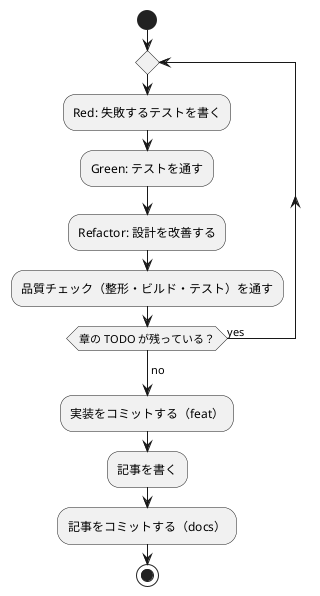

# 第 4 章: バージョン管理とデータ管理

## 4.1 はじめに

第 1 部では、TDD でデータを読み込み、前処理し、決定木で分類するプログラムを作りました。第 2 部では、そのプログラムを「変更を楽に安全にできる」状態に保つための道具立てを、バージョン管理（第 4 章）、パッケージ管理と静的解析（第 5 章）、タスクランナーと CI/CD（第 6 章）の順に整えます。

この章ではバージョン管理を扱います。機械学習のプロジェクトでは、コードに加えて **学習データ** と **学習済みモデル** というファイルが登場します。これらをコードと同じようにコミットしてよいとは限りません。この章では、Git で何を管理し、何を管理しないか、そして実験の結果を再現できるようにするには何を固定すればよいかを学びます。

Git の使い方は言語に依存しないので、[Python 版の第 4 章](../python/04-version-control-and-data-management.md)・[Kotlin 版の第 4 章](../kotlin/04-version-control-and-data-management.md)・[TypeScript 版の第 4 章](../typescript/04-version-control-and-data-management.md) と同じ構成で進めます。C# 版では次の 2 点に注目してください。

- **`bin/`・`obj/` の除外** — `dotnet build` と `dotnet restore` が作るディレクトリを除外し、`packages.lock.json` と `global.json` はコミットする
- **乱数と .NET の版** — 第 2 章の分割で使った `System.Random` のシード付きの乱数列が、.NET の版によって変わるかを、ドキュメント・ソースコード・実行の 3 つで確かめ、学習用テストで固定する

同じ .NET の上にある [F# 版の第 4 章](../fsharp/04-version-control-and-data-management.md) とは、扱う話題がほぼ同じになります。違いは、C# 版には Notebook が無いこと（可視化は Python 版・Kotlin 版で扱います）と、ローカルツール（`.config/dotnet-tools.json`）を使わないことです。整形も静的解析も .NET SDK に入っているものだけで済むからで、詳しくは第 5 章で扱います。

## 4.2 コミットメッセージの重要性

コミット履歴は「なぜこの変更をしたのか」の記録です。機械学習のプロジェクトでは、「前処理を変えたら正解率が変わった」「ライブラリと予測が一致しない原因をテストに残した」といった変化の理由を、あとから追跡できることが特に重要になります。

コミットは次の 2 つを守ると追いやすくなります。

- **1 コミット 1 目的** — 機能追加と設定変更、実装と記事を 1 つのコミットに混ぜない
- **形式をそろえる** — 種類と対象がひと目で分かる書式でメッセージを書く

## 4.3 Conventional Commits

### フォーマット

本シリーズでは [Conventional Commits](https://www.conventionalcommits.org/ja/) の形式でコミットメッセージを書きます。

```text
<type>(<scope>): <subject>

<body>

<footer>
```

`scope` には変更の対象を書きます。本リポジトリでは、C# 版の実装なら `csharp`、記事シリーズなら `getting-start-ml`、Nix の環境定義なら `nix` のように書きます。C# 版の実装は `apps/csharp/` にあり、scope も言語名にそろえます。F# 版と C# 版は同じ .NET・同じ Nix の環境（`ops/nix/environments/dotnet/`）を共有しているので、scope を `dotnet` にすると、どちらの言語の変更かが分からなくなってしまいます。

### コミットタイプ

| type | 用途 |
|------|------|
| `feat` | 新機能（章の実装など） |
| `fix` | バグ修正 |
| `test` | テストの追加・修正 |
| `refactor` | 振る舞いを変えないコードの変更 |
| `style` | 振る舞いを変えない書式の変更（整形ツールに合わせるなど） |
| `docs` | ドキュメントだけの変更（記事など） |
| `chore` | ビルドやツール、依存関係の変更 |
| `ci` | CI の設定の変更 |

### 実践例

本リポジトリの実際のコミット履歴から、C# 版の雛形から第 4 章までを抜き出します（古い順）。

```text
300c02a0 feat(csharp): C# 版の雛形（.NET 10・xUnit v3・アナライザー）を apps/csharp に追加する
edadd7dc feat(csharp): 第 1 章のきのこ派・たけのこ派の判定を TDD で実装する
37a6c218 ci(csharp): C# CI と apps:check:csharp タスクを追加する
6deceae5 refactor(csharp): .NET が BOM を取り除くので列名の BOM の除去をやめ、その振る舞いをテストで固定する
e645a8dd docs(adr): dotnet test の作業ディレクトリとビルドサーバーの影響を正しく記録する
b474ec58 docs(getting-start-ml): C# 版の第 1 章とトップページを追加する
2c3d755e feat(csharp): 第 2 章の表・欠損値の補完・訓練データとテストデータへの分割を追加する
278ec291 feat(csharp): 第 3 章の自作の決定木（抽象レコードと sealed な派生）を追加する
bd7194b3 feat(csharp): 第 3 章の ML.NET の FastTree との突き合わせと実データでの確認を追加する
c1c9866d style(csharp): 第 3 章の using の並び順を dotnet format に合わせる
8649384b test(csharp): 第 4 章 System.Random のシード付きの乱数列を固定する学習用テストを追加する
```

`git log --oneline` で見ると、どのコミットが何のための変更かを type と scope だけで区別できます。環境と雛形（`feat(csharp)`）、CI（`ci(csharp)`）、CI で見つかった問題の修正（`style(csharp)`）、記事（`docs(getting-start-ml)`）、設計判断の記録（`docs(adr)`）が分かれているので、たとえば「CI で何が起きて、どう直したか」を追いたいときは `ci` と `style` のコミットだけを見れば済みます。`c1c9866d` の経緯は第 6 章で扱います。

件名だけでは理由が分からない変更では、本文に **理由** を書きます。この章のコミット（`8649384b`）の本文は次のとおりです。

```text
test(csharp): 第 4 章 System.Random のシード付きの乱数列を固定する学習用テストを追加する

.NET 8・9・10 でシード付きの乱数列とシャッフルの結果が変わらないことを実測したうえで、
第 3 章の数値がその性質に頼っていることを学習用テストで固定する。
```

件名だけでは「なぜ .NET の標準ライブラリの振る舞いをテストするのか」が分かりません。本文があれば、このテストを消してよいかを後から判断できます。

`6deceae5` のように `refactor` で「やめた」ことを記録するのも同じ考え方です。第 1 章で列名の BOM を自分で取り除いていたのを、.NET が取り除くと分かってやめた、という判断がコミットに残っています。

## 4.4 何をコミットし、何をコミットしないか

機械学習のプロジェクトには、コミットしてはいけないファイルが増えます。理由は大きく 3 つあります。

| 分類 | 例 | コミットしない理由 |
|------|-----|------------------|
| 再配布できないもの | 学習データ | ライセンスで利用者が限られている |
| 再生成できるもの | ビルド成果物（`bin/`・`obj/`）、テストの結果、学習済みモデル | 大きく、差分が読めず、コードとデータから作り直せる |
| 秘匿すべきもの | `.env` の認証情報 | 漏洩すると取り返しがつかない |

### 学習データ

本シリーズの学習データは、書籍『スッキリわかる Python による機械学習入門』の配布データです。配布データの利用は書籍購入者に限られており、本リポジトリは公開されているので、データはコミットしません。ルートの `.gitignore` で、データの置き場所 `apps/data/` をまるごと除外しています。この設定はすべての言語の版で共通です。

```text
# 依存関係
node_modules/

# 環境変数（暗号化済みの .env.vault とテンプレートの .env.example は管理対象）
.env

# 学習データ（書籍購入者のみ利用可のため再配布しない。docs/article/getting-start-ml/outline.md を参照）
apps/data/

# ビルド成果物・一時ファイル
site/
tmp/

# IDE・エディタの個人設定
.idea/
.vscode/

# Claude Code の個人設定
.claude/settings.local.json
# エージェントの作業用 worktree
.claude/worktrees/

# OS
.DS_Store
Thumbs.db
```

### .NET プロジェクト固有のファイル

`apps/csharp/.gitignore` では、`dotnet` のコマンドが作るディレクトリに加えて、学習済みモデルの保存先を除外しています。

```text
bin/
obj/
TestResults/
model/
```

| パス | 中身 |
|------|------|
| `bin/` | `dotnet build` の出力（`MachineLearning.dll`、依存ライブラリの DLL、実行ファイル） |
| `obj/` | `dotnet restore` が解決した依存関係（`project.assets.json`）と、ビルドの中間ファイル |
| `TestResults/` | `dotnet test` にカバレッジを出力させたときの結果（第 5 章） |
| `model/` | 学習済みモデルの保存先（第 8 章で使う） |

F# 版の `.gitignore` にある `.ipynb_checkpoints/` は、C# 版にはありません。C# 版では Notebook を使わないからです。

`bin/` と `obj/` には、先頭に `/` を付けていません。`.gitignore` の規則は、`/` で始まらなければ、そのディレクトリより下の **どの深さにある** 同じ名前にも当てはまります。本体の `src/MachineLearning/bin/` とテストの `tests/MachineLearning.Tests/bin/` の両方を、1 行で除外できます。手元では、この 2 つの `bin/` だけで 39 MB ありました（ML.NET の DLL が多くを占めます）。

一方で、次のファイルは **コミットします**。

| ファイル | 役割 |
|---------|------|
| `global.json` | .NET SDK の版（10.0.100 以上の 10.0.1xx） |
| `Directory.Build.props`・`Directory.Packages.props` | プロジェクト共通の設定と、依存ライブラリの版 |
| `src/MachineLearning/packages.lock.json`・`tests/MachineLearning.Tests/packages.lock.json` | 依存関係の依存関係まで含めた正確な版とハッシュ |
| `.editorconfig` | 整形とコードスタイルの設定 |

どれも「どの版で、どう書いたか」を記録するファイルで、第 5 章で詳しく扱います。`obj/project.assets.json` も解決した依存関係を記録していますが、こちらは手元のパスを含む生成物で、`packages.lock.json` から作り直せるのでコミットしません。

学習済みモデルは、コードと学習データがあれば作り直せます。モデルのファイルをコミットするより、「どのコードとどのデータから、どの設定で作ったか」をコミットで追えるようにするほうが、再現性の面でも役に立ちます。

### 除外されていることを確かめる

`.gitignore` が意図どおりに効いているかは、`git check-ignore -v` で確認できます。どのファイルの何行目の規則で除外されたかが表示されます。

```bash
git check-ignore -v apps/data/sukkiri-ml/iris.csv apps/csharp/src/MachineLearning/bin/ apps/csharp/src/MachineLearning/obj/ apps/csharp/tests/MachineLearning.Tests/bin/ apps/csharp/TestResults/ apps/csharp/model/ tmp/sukkiri-ml-codes.zip
```

```text
.gitignore:8:apps/data/	apps/data/sukkiri-ml/iris.csv
apps/csharp/.gitignore:1:bin/	apps/csharp/src/MachineLearning/bin/
apps/csharp/.gitignore:2:obj/	apps/csharp/src/MachineLearning/obj/
apps/csharp/.gitignore:1:bin/	apps/csharp/tests/MachineLearning.Tests/bin/
apps/csharp/.gitignore:3:TestResults/	apps/csharp/TestResults/
apps/csharp/.gitignore:4:model/	apps/csharp/model/
.gitignore:12:tmp/	tmp/sukkiri-ml-codes.zip
```

コミットするはずのファイルが除外されていないことも確かめます。除外されていなければ何も表示されず、終了コードが 1 になります。

```bash
git check-ignore -v apps/csharp/src/MachineLearning/packages.lock.json apps/csharp/global.json
echo $?
```

```text
1
```

ディレクトリのパスは末尾に `/` を付けて指定しています。`bin/` のように末尾が `/` の規則はディレクトリだけに当てはまるので、まだ存在しないパスを `/` なしで調べると、除外されていないように見えます。

### 改行コードについて

ルートの `.gitattributes` には、`apps/fsharp/**` の改行コードを LF に固定する行があります。Windows で整形ツール（Fantomas）が CRLF で書き出し、コミットされた LF と食い違うのを防ぐためでした。

C# 版では、改行コードを `.editorconfig` の `end_of_line = lf` で指定しています。`dotnet format` はこの設定に従うので、どの OS でも LF で書き出されます。整形ツールの設定とコミットされる内容が最初から一致しているぶん、`.gitattributes` に頼る必要がありません。設定の重なり方は言語ごとの道具立てで変わるので、「どの道具が改行コードを決めているか」を 1 か所に絞っておくのが大切です。

## 4.5 データの入手手順をコードにする

データをコミットしない代わりに、**データの入手と配置の手順** をリポジトリに残します。手順が文章だけだと、人によって置き場所がずれたり、ファイルが足りないまま実行して分かりにくいエラーになったりします。

本リポジトリでは、配置と確認を Gulp のタスクにしています（`ops/scripts/data.js`）。このタスクは言語に依存しないので、すべての言語の版で同じものを使います。配布 ZIP を `tmp/` か `apps/data/` に置いてから、リポジトリのルートで実行します。

```bash
npx gulp data:setup
npx gulp data:check
```

タスクの一覧と、失敗したときの表示は [Python 版の 4.5 節](../python/04-version-control-and-data-management.md) を参照してください。

### プログラムからデータの場所を知る

C# の実装は、第 1 章で作った `DataDir` でデータの場所を解決します。環境変数 `ML_DATA_DIR` があればその場所を、無ければ `apps/data/sukkiri-ml/` を使います。

```csharp
// src/MachineLearning/Dataset/DataDir.cs
namespace MachineLearning.Dataset;

using System.Runtime.CompilerServices;

/// <summary>学習データのディレクトリを求める。</summary>
public static class DataDir
{
    /// <summary>環境変数 ML_DATA_DIR が無ければ apps/data/sukkiri-ml を使う。</summary>
    /// <param name="getenv">環境変数を読む関数。テストでは差し替える。</param>
    public static string From(Func<string, string?> getenv)
    {
        ArgumentNullException.ThrowIfNull(getenv);
        return getenv("ML_DATA_DIR") ?? Path.Combine(SourceDirectory(), "..", "..", "..", "..", "data", "sukkiri-ml");
    }

    /// <summary>実行中のプロセスの環境変数から学習データのディレクトリを求める。</summary>
    public static string Current() => From(Environment.GetEnvironmentVariable);

    /// <summary>このファイルが置かれたディレクトリ。テストは bin/Debug/net10.0 で動くので、既定の場所はここから求める。</summary>
    private static string SourceDirectory([CallerFilePath] string path = "") => Path.GetDirectoryName(path)!;
}
```

- データの場所をコードに直接書かず、1 か所で解決するようにしておくと、CI や読者の環境など置き場所が違う場合にも環境変数だけで切り替えられます
- 既定の場所を `[CallerFilePath]` から求めているのは、`dotnet test` が `bin/Debug/net10.0/` をカレントディレクトリにしてテストを動かすためでした（第 1 章）。`bin/` はコミットしない生成物の置き場で、データの場所の基準にはできません。F# 版の `__SOURCE_DIRECTORY__` に当たるものが C# には無いので、コンパイラが呼び出し元のソースファイルのパスを埋める `[CallerFilePath]` を使っています
- `getenv` を引数で受け取る `From` を用意してあるので、環境変数を差し替えたテストが書けます。`Environment.GetEnvironmentVariable` を直接呼ぶ `Current` は、その薄い包みです

`dotnet test` の子プロセス（テストの実行ファイル）には、環境変数がそのまま引き継がれます。Kotlin 版の Gradle のように「入力が変わらなければテストを実行しない」という判断もしないので、`ML_DATA_DIR` を変えれば次の実行からそのまま反映されます。

### データが無い環境でもテストを通す

コミットしないデータに依存するテストは、データの無い環境（CI や、データをまだ入手していない読者の環境）では失敗してしまいます。C# 版では、F# 版と同じく xUnit v3 の `Assert.SkipUnless` で、データが無ければテストをスキップします（第 1 章）。

```csharp
public class IrisDataTests
{
    private readonly string csvFile = Path.Combine(DataDir.Current(), "iris.csv");

    [Fact(DisplayName = "深さ 2 の決定木はテストデータの 45 件中 40 件を正しく分類する")]
    public void DepthTwoAccuracy()
    {
        Assert.SkipUnless(File.Exists(this.csvFile), "学習データ iris.csv が配置されていない（gulp data:setup）");
        // ...
    }
}
```

データの無い場所を `ML_DATA_DIR` に指定すると、スキップされることを確かめられます。

```bash
ML_DATA_DIR=/nonexistent dotnet test --filter-namespace "*Chapter03*"
```

```text
スキップされました 深さ 2 の決定木はテストデータの 45 件中 40 件を正しく分類する (0ms)
スキップされました 実行すると深さごとの正解率と深さ 2 の決定木を表示する (0ms)
スキップされました 深さごとに ML.NET の FastTree と一致する件数を確かめる(maxDepth: 3, expected: 43) (0ms)
テストの実行の概要: 成功!
  合計: 20
  失敗: 0
  成功: 13
  スキップ済み: 7
```

- `--filter-namespace` は、xUnit v3 が Microsoft.Testing.Platform に加えるオプションで、名前空間でテストを絞り込みます。`*` は任意の文字列に当てはまります
- スキップの理由として、`Assert.SkipUnless` に渡したメッセージ（`gulp data:setup`）が表示されます。読者は、次に何をすればよいかがすぐに分かります
- `[Theory]` のテストは、引数の組ごとに 1 件と数えられます。深さ 1〜5 の 5 件が、それぞれスキップされています

単体テストは架空の値で作ったデータで書き、実データのテストは `Assert.SkipUnless` で守る、という 2 段構えにすると、CI ではデータ無しでも品質チェックが回り、手元ではデータを使った確認もできます。単体テストのデータに配布データの行をそのまま写さないことも大切です。テストのコードはコミットされるので、写した行はデータの再配布になってしまいます。第 2 章のテストが架空の値（`0.1`・`0.2` など）ばかりなのは、このためです。

## 4.6 実験を再現できるようにする

機械学習の結果は、コードとデータが同じでも、次のものが違うと変わります。

| 変わる原因 | 固定する方法 | 本リポジトリでの置き場所 |
|-----------|------------|----------------------|
| 乱数（データの分割、モデルの初期値） | シードを指定する | 各章のコード（第 2 章の `SplitTrainTest` の `seed`、ML.NET の `MLContext(seed: ...)`） |
| ライブラリのバージョン | 版を 1 か所に固定し、依存関係の依存関係までロックする | `Directory.Packages.props`・`packages.lock.json`（第 5 章） |
| .NET SDK のバージョン | SDK の版を固定する | `global.json`（第 5 章） |
| .NET の実行環境のバージョン | 対象のフレームワークを固定する | `Directory.Build.props` の `TargetFramework`（`net10.0`） |

### 乱数のシード

第 2 章の `Shuffle` は、`System.Random` にシードを渡して作った乱数生成器で、Fisher–Yates のシャッフルをしていました。

```csharp
public static IReadOnlyList<T> Shuffle<T>(IReadOnlyList<T> items, int seed)
{
    ArgumentNullException.ThrowIfNull(items);
    var random = new Random(seed);
    var array = items.ToArray();
    for (var i = array.Length - 1; i >= 1; i--)
    {
        var j = random.Next(i + 1);
        (array[i], array[j]) = (array[j], array[i]);
    }

    return array;
}
```

同じシードなら同じ順、違うシードなら違う順になることは、第 2 章のテストで固定しています。ただし、このテストが確かめているのは「同じ実行環境の中で」同じ順になることだけです。第 3 章の実データのテストが「45 件中 40 件」という数値を固定できているのは、シード 0 で分けたときにテストデータに入る行が、いつ実行しても同じだからです。.NET を上げたときに乱数列が変われば、テストデータに入る行が変わり、この数値も変わります。

### シード付きの乱数列は .NET の版で変わるか

この問いを、3 つの方法で確かめます。

**ドキュメント**: .NET の `System.Random` の解説は、シードを指定して同じ乱数列を得る例のあとに、次のように注意しています。

> Note that the example may produce different sequences of random numbers if run on different versions of .NET.
>
> — [Supplemental API remarks for Random](https://learn.microsoft.com/en-us/dotnet/fundamentals/runtime-libraries/system-random)

同じシードでも、.NET の版が違えば違う乱数列になる **可能性がある**、ということです。Kotlin の `Random(seed)` のドキュメント（[Kotlin 版の 4.6 節](../kotlin/04-version-control-and-data-management.md)）と同じく、版をまたいだ再現は約束されていません。

**ソースコード**: 一方で、.NET の実装（`Random.cs`）は、シードを渡したかどうかでアルゴリズムを使い分けています。

```csharp
public Random() =>
    _impl = GetType() == typeof(Random) ? new XoshiroImpl() : new CompatDerivedImpl(this);

public Random(int Seed) =>
    _impl = GetType() == typeof(Random) ? new CompatSeedImpl(Seed) : new CompatDerivedImpl(this, Seed);
```

シードを渡さなければ新しいアルゴリズム（`XoshiroImpl`）を、シードを渡せば以前の .NET と同じアルゴリズム（`CompatSeedImpl`）を使います。ソースコードのコメントには、シードを渡したときは「過去に使われてきたのと同じアルゴリズムを守る必要がある」という趣旨が書かれています。互換性を意図して作られてはいるが、ドキュメントとしては約束していない、というのが現在の状態です。

**実行**: 手元には .NET 8・9・10 の実行環境が入っていたので、使い捨てのプロジェクトの対象を `net8.0;net9.0;net10.0` の 3 つにして、同じコードを実行しました。コードは、`new Random(0)` の `Next()` を 3 回呼んだ値と、第 2 章と同じ Fisher–Yates のシャッフルで 0〜9 を並べ替えた結果、シードを渡さない `new Random()` の値を表示します。

```bash
dotnet run -f net8.0
dotnet run -f net9.0
dotnet run -f net10.0
```

```text
実行環境: .NET 8.0.22
Random(0).Next() を 3 回: [1559595546; 1755192844; 1649316166]
Shuffle(0..9, 0): [0; 4; 5; 8; 2; 1; 3; 6; 9; 7]
シードなし: [0; 0; 3; 0; 5; 9; 9; 4; 1; 8]
実行環境: .NET 9.0.11
Random(0).Next() を 3 回: [1559595546; 1755192844; 1649316166]
Shuffle(0..9, 0): [0; 4; 5; 8; 2; 1; 3; 6; 9; 7]
シードなし: [5; 1; 4; 0; 8; 9; 2; 4; 6; 4]
実行環境: .NET 10.0.0
Random(0).Next() を 3 回: [1559595546; 1755192844; 1649316166]
Shuffle(0..9, 0): [0; 4; 5; 8; 2; 1; 3; 6; 9; 7]
シードなし: [7; 3; 4; 2; 9; 2; 6; 5; 3; 9]
```

- `-f`（`--framework`）は、複数の対象のフレームワークのうち、どれでビルドして実行するかを選ぶオプションです
- シード 0 の乱数列とシャッフルの結果は、3 つの版で同じでした
- シャッフルの結果 `[0; 4; 5; 8; 2; 1; 3; 6; 9; 7]` は、[F# 版の 4.6 節](../fsharp/04-version-control-and-data-management.md) が記録した順と同じです。同じ `System.Random` と同じ Fisher–Yates を使っているので、言語が違っても並びが一致します。第 3 章の正解率が F# 版と一致したのは、この一致が土台になっています
- シードを渡さない `new Random()` は、版に関係なく実行のたびに変わります

3 つの方法の結果をまとめると、「.NET 8〜10 では、シード付きの乱数列は変わらなかった。ただし将来の版で変わらないとは約束されていない」となります。「変わらない」と断言できるのは、あくまで試した 3 つの版についてだけです。

### 学習用テストで乱数列を固定する

約束されていない性質に数値のテストが頼っているなら、その性質そのものをテストにしておきます。.NET を上げて乱数列が変わったとき、第 3 章の「45 件中 40 件」のテストだけが失敗すると、原因が決定木の実装にあるのか乱数にあるのかを調べる必要があります。乱数列のテストも一緒に失敗すれば、原因はすぐに分かります。

```csharp
// tests/MachineLearning.Tests/Chapter04/RandomSequenceTests.cs
namespace MachineLearning.Tests.Chapter04;

using MachineLearning.Chapter02;

/// <summary>
/// System.Random のシード付きの乱数列を固定する学習用テスト。
/// .NET を上げてこのテストが失敗したら、分割に入る行と記事の数値が変わる。
/// </summary>
public class RandomSequenceTests
{
    [Fact(DisplayName = "シード 0 の乱数列は .NET 8・9・10 で同じ値になる")]
    public void SeededSequenceIsStable()
    {
        var random = new Random(0);

        int[] values = [random.Next(), random.Next(), random.Next()];

        Assert.Equal([1559595546, 1755192844, 1649316166], values);
    }

    [Fact(DisplayName = "シード 0 で 0 から 9 を並べ替えた順は F# 版と同じ")]
    public void ShuffleMatchesFSharp() =>
        Assert.Equal([0, 4, 5, 8, 2, 1, 3, 6, 9, 7], Preprocessing.Shuffle([.. Enumerable.Range(0, 10)], 0));

    [Fact(DisplayName = "シードを渡さなければ乱数列は Random を作るたびに変わる")]
    public void UnseededSequenceVaries()
    {
        static IReadOnlyList<int> Draw(Random random) => [.. Enumerable.Range(0, 10).Select(_ => random.Next())];

        Assert.NotEqual(Draw(new Random()), Draw(new Random()));
    }
}
```

- これは自分のコードではなく、.NET の振る舞いを確かめる **学習用テスト** です。期待値は上の実行で得た値なので、書いた時点で通ります（失敗から始める TDD のテストとは役割が違います）
- `int[] values = [random.Next(), random.Next(), random.Next()]` は、コレクション式の要素を左から順に評価します。`Random` は呼ぶたびに状態が進む可変なオブジェクトなので、この順番に意味があります
- `static IReadOnlyList<int> Draw(...)` は **ローカル関数** です。`static` を付けると、外側の変数を取り込まないことがコンパイラに保証されます。取り込むつもりのない値を誤って使ったら、そこでコンパイルエラーになります
- `[.. Enumerable.Range(0, 10).Select(...)]` のコレクション式は、`IEnumerable<int>` を配列に展開して `IReadOnlyList<int>` にします。`ToList()` を書かずに済む C# 12 以降の書き方です
- 3 つ目のテストは、「シードを渡さなければ毎回変わる」ことを確かめます。10 個の値がすべて一致する確率は無視できるほど小さいので、このテストが偶然に失敗することは実際上ありません

テストを追加して実行します。C# 版はプロジェクトファイルにファイルを列挙しない（`.cs` は自動で含まれる）ので、ファイルを置くだけで対象になります。F# 版では `.fsproj` の `Compile` に順番を含めて書き足す必要がありました。

```bash
dotnet test --filter-namespace "*Chapter04*"
```

```text
テストの実行の概要: 成功!
  合計: 3
  失敗: 0
  成功: 3
  スキップ済み: 0
```

このテストは、`global.json` の SDK と `TargetFramework` を上げるときの見張り役になります。

### シードだけでは再現できないもの

シードを固定しても、乱数を作るアルゴリズムが違えば結果は変わります。Python 版（NumPy）・Kotlin 版（`kotlin.random`）・TypeScript 版（自作の乱数生成器）・Java 版（`Collections.shuffle`）は、どれも同じシード 0 で分割していますが、乱数を作るアルゴリズムがすべて違うので、テストデータに入る行は版ごとに違います。第 3 章で、C# 版の正解率が Java 版などと一致しなかったのはこのためです。

逆に、F# 版と C# 版は同じ `System.Random` と同じシャッフルの手順を使っているので、分割も、その先の正解率も一致しました。言語が違っても、乱数のアルゴリズムと使い方が同じなら再現できる、ということです。

記事に載せる正解率などの数値は、シードと版を固定した実装を実データで動かした結果です。数値をテストで固定するときは、どのシードで得た値かを必ずコードに残し、乱数列そのものも学習用テストで固定しておきます。

## 4.7 TDD とコミットのタイミング

TDD のサイクルとコミットは、次のように対応させると履歴が読みやすくなります。



- テストが通らない状態ではコミットしない
- 実装と記事は別のコミットにする
- 設定や依存関係の変更（`chore`）、CI の変更（`ci`）も、それぞれ別のコミットにする
- 学習データ・モデルがステージングされていないことを、コミットの前に `git status` で確かめる

第 3 章の実装が 2 つのコミット（`278ec291` と `bd7194b3`）に分かれているのは、自作の決定木と、ML.NET との突き合わせが別の目的だからです。前者だけを戻したいときに、後者を巻き込まずに済みます。この章の学習用テストは、自分のコードの機能を増やすものではないので、`feat` ではなく `test` にしました。

<details>
<summary>この章の完成コード（tests/MachineLearning.Tests/Chapter04/RandomSequenceTests.cs）</summary>

```csharp
namespace MachineLearning.Tests.Chapter04;

using MachineLearning.Chapter02;

/// <summary>
/// System.Random のシード付きの乱数列を固定する学習用テスト。
/// .NET を上げてこのテストが失敗したら、分割に入る行と記事の数値が変わる。
/// </summary>
public class RandomSequenceTests
{
    [Fact(DisplayName = "シード 0 の乱数列は .NET 8・9・10 で同じ値になる")]
    public void SeededSequenceIsStable()
    {
        var random = new Random(0);

        int[] values = [random.Next(), random.Next(), random.Next()];

        Assert.Equal([1559595546, 1755192844, 1649316166], values);
    }

    [Fact(DisplayName = "シード 0 で 0 から 9 を並べ替えた順は F# 版と同じ")]
    public void ShuffleMatchesFSharp() =>
        Assert.Equal([0, 4, 5, 8, 2, 1, 3, 6, 9, 7], Preprocessing.Shuffle([.. Enumerable.Range(0, 10)], 0));

    [Fact(DisplayName = "シードを渡さなければ乱数列は Random を作るたびに変わる")]
    public void UnseededSequenceVaries()
    {
        static IReadOnlyList<int> Draw(Random random) => [.. Enumerable.Range(0, 10).Select(_ => random.Next())];

        Assert.NotEqual(Draw(new Random()), Draw(new Random()));
    }
}
```

</details>

## 4.8 まとめ

この章では、機械学習のプロジェクトでのバージョン管理を学びました。

1. **Conventional Commits** — type と scope で、変更の種類と対象が分かるコミットメッセージを書く。同じ .NET を共有する F# 版と区別するため、scope は `csharp` にする。本文には変更の理由を書く
2. **コミットしないものを決める** — 再配布できない学習データ、再生成できる `bin/`・`obj/`・テストの結果・モデル、秘匿すべき認証情報を `.gitignore` で除外する。`global.json`・`packages.lock.json`・`.editorconfig` はコミットする
3. **入手手順をコードにする** — データを置く場所と確認方法を Gulp タスクにし、プログラムからは `DataDir` で場所を解決する。既定の場所は `[CallerFilePath]` から求める
4. **データが無くてもテストを通す** — 実データのテストは `Assert.SkipUnless` でスキップする
5. **再現性** — 乱数のシードに加えて、ライブラリ・SDK・実行環境の版を固定する。シード付きの `System.Random` の乱数列は .NET 8・9・10 で同じで、F# 版の並びとも一致したが、版をまたいだ再現は約束されていないので、学習用テストで固定した

次の章では、ライブラリと SDK の版を固定する NuGet と `global.json` の仕組みと、コードの品質を機械的に確かめる整形・静的解析のツールを扱います。
