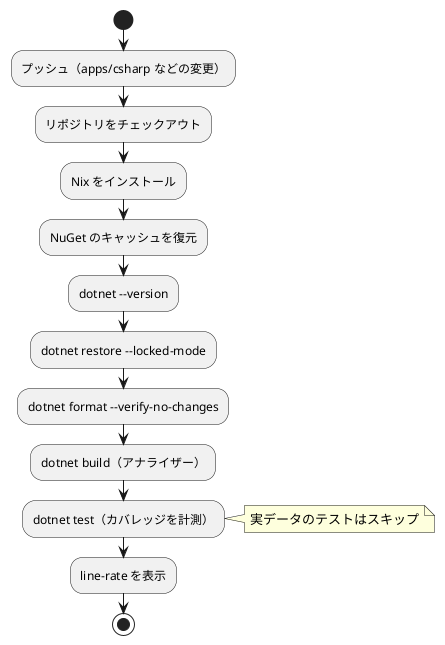

# 第 6 章: タスクランナーと CI/CD

## 6.1 はじめに

第 5 章までで、テスト（xUnit v3）、整形（`dotnet format`）、静的解析（.NET アナライザー）、警告をエラーにする設定、カバレッジ（coverlet）がそろいました。ただ、コマンドを覚えて毎回正しい順番で実行するのは手間で、実行し忘れも起きます。

この章では、次の 2 つを整えます。

1. **タスクランナー** — `dotnet` CLI のコマンドと、リポジトリ全体の Gulp のタスクの役割を分け、品質チェックを 1 つのタスクで実行できるようにする
2. **CI/CD** — GitHub Actions で、プッシュのたびに同じ品質チェックを自動実行する

最後に、CI に載せてから起きた失敗と、そこから学べることを紹介します。

[Python 版の第 6 章](../python/06-task-runner-and-ci-cd.md) では tox を、[Kotlin 版の第 6 章](../kotlin/06-task-runner-and-ci-cd.md) では Gradle を、[TypeScript 版の第 6 章](../typescript/06-task-runner-and-ci-cd.md) では npm scripts をタスクランナーにしました。C# 版では、`dotnet` CLI に品質チェックをまとめる仕組みが無いので、[F# 版](../fsharp/06-task-runner-and-ci-cd.md) と同じく、まとめる役をリポジトリの Gulp に任せます。

C# 版には Notebook がないので、F# 版の 6.3 節（Notebook の出力セルの削除）に当たる節はありません。可視化は [Python 版の第 6 章](../python/06-task-runner-and-ci-cd.md)・[Kotlin 版の第 6 章](../kotlin/06-task-runner-and-ci-cd.md) を参照してください。

## 6.2 タスクランナー — dotnet CLI と Gulp

### dotnet CLI のコマンド

C# 版で使うコマンドは、どれも `dotnet` CLI のものです。F# 版と違い、ローカルツール（`dotnet tool restore`）は要りません。

| コマンド | 役割 | 章 |
|---------|------|----|
| `dotnet restore --locked-mode` | 依存パッケージを入れ、`packages.lock.json` と食い違えば失敗する | 第 5 章 |
| `dotnet build` | ビルドする（型チェックとアナライザーを含む） | 第 1 章 |
| `dotnet test` | ビルドしてテストを実行する | 第 1 章 |
| `dotnet format MachineLearning.sln --verify-no-changes` | 整形が必要なファイルがあれば失敗する | 第 5 章 |
| `dotnet run --project src/MachineLearning -- chapter03` | 章の `Program.Run` を実行する | 第 1 章 |
| `dotnet list package --vulnerable --include-transitive` | 依存関係の既知の脆弱性を確かめる | 第 5 章 |

Gradle の `check` や npm scripts の `check` と違い、`dotnet` CLI には「整形の検査・静的解析・テストをまとめて実行する」コマンドがありません。MSBuild のターゲットを自分で書けばまとめられますが、コマンドの呼び出しをプロジェクトファイルに書き込むことになり、C# のプロジェクトとしては見慣れない形になります。

### dotnet test は apps/csharp で実行する

C# 版で特に気をつけるのは、**`dotnet test` を `apps/csharp` を作業ディレクトリにして実行する** ことです。第 1 章でも触れましたが、理由は `global.json` の置き場所にあります。

```json
{
  "sdk": { "version": "10.0.100", "rollForward": "latestPatch" },
  "test": { "runner": "Microsoft.Testing.Platform" }
}
```

`test.runner` は、`dotnet test` がどのテストの実行基盤を使うかを決める設定です。この設定は「**作業ディレクトリから上に向かって探した、最も近い `global.json`**」から読まれます。本リポジトリの `global.json` は `apps/csharp/` にあるので、リポジトリのルートから実行すると読まれません。

```bash
# リポジトリのルートから実行した場合
dotnet test apps/csharp/tests/MachineLearning.Tests/MachineLearning.Tests.csproj --no-restore --no-build
```

```text
error : Testing with VSTest target is no longer supported by Microsoft.Testing.Platform on .NET 10 SDK and later. If you use dotnet test, you should opt-in to the new dotnet test experience. For more information, see https://aka.ms/dotnet-test-mtp-error
```

`test.runner` を読めなかった `dotnet test` は、古い VSTest の経路に落ち、xUnit v3 が対応していないために失敗します。プロジェクトのパスを正しく渡しているのに失敗するので、原因が分かりにくいエラーです。

`apps/csharp` で実行すれば、同じテストが通ります。

```bash
cd apps/csharp
dotnet test --no-restore --no-build
```

```text
テストの実行の概要: 成功!
  合計: 62
  失敗: 0
  成功: 48
  スキップ済み: 14
```

この決まりは、次に作る Gulp のタスクと CI のワークフローの両方に反映してあります。どちらも、コマンドの前に `apps/csharp` へ移動します。

### Gulp で品質チェックをまとめる

本リポジトリには、言語に依存しない作業を受け持つ Gulp（ルートの `gulpfile.js` と `ops/scripts/`）があり、各言語の版の環境を用意する `apps:setup:*` と、品質チェックを実行する `apps:check:*` のタスクを定義しています（`ops/scripts/apps.js`）。C# 版の定義は次のとおりです。

```javascript
  {
    name: 'csharp',
    nix: 'dotnet',
    dir: path.join('apps', 'csharp'),
    tools: [{ cmd: 'dotnet', version: 'dotnet --version' }],
    setup: 'dotnet restore --locked-mode && dotnet build --no-restore',
    // CI（.github/workflows/csharp-ci.yml）と同じ順に、整形・アナライザー・テストを検査する
    check: 'dotnet format MachineLearning.sln --verify-no-changes --no-restore && dotnet build --no-restore && dotnet test --no-restore --no-build',
  },
```

- `setup` と `check` は、`dir`（`apps/csharp`）で実行するシェルのコマンドです。`&&` でつないでいるので、どれか 1 つが失敗するとそこで止まります
- `dir` を `apps/csharp` にしてあるので、`dotnet test` は必ず正しい作業ディレクトリで動きます
- 順番は、速く終わり、直し方が機械的なものから並べています。書式の崩れは `dotnet format MachineLearning.sln` で直せるので先に、テストの失敗は原因を考える必要があるので最後に置いています
- `tools` のコマンド（`dotnet --version`）が失敗したら、つまり `global.json` の条件を満たす SDK が手元に無ければ、Nix が使える環境では `nix develop .#dotnet` の中で同じコマンドを実行します
- `nix: 'dotnet'` は F# 版と同じ環境を指しています。.NET SDK は 1 つで両方の言語に使えるので、環境定義を分ける必要がありません

```bash
# 品質チェックをまとめて実行する（リポジトリのルートで）
npx gulp apps:check:csharp
```

学習データを配置していない環境での結果です（一部を抜き出しています）。

```text
[apps/csharp] dotnet format MachineLearning.sln --verify-no-changes --no-restore && dotnet build --no-restore && dotnet test --no-restore --no-build
  MachineLearning -> .../apps/csharp/src/MachineLearning/bin/Debug/net10.0/MachineLearning.dll
  MachineLearning.Tests -> .../apps/csharp/tests/MachineLearning.Tests/bin/Debug/net10.0/MachineLearning.Tests.dll

ビルドに成功しました。
    0 個の警告
    0 エラー

テストの実行の概要: 成功!
  合計: 62
  失敗: 0
  成功: 48
  スキップ済み: 14
[10:16:31] Finished 'apps:check:csharp' after 42 s
```

`dotnet format --verify-no-changes` は、問題が無ければ何も表示しません。スキップされた 14 件は、学習データが無いために `Assert.SkipUnless` で飛ばされた実データのテストです（第 4 章）。

### dotnet CLI と Gulp の役割分担

| 道具 | 実行する場所 | 受け持つもの |
|------|------------|------------|
| `dotnet` CLI | `apps/csharp` | C# 版の個々の作業（復元・ビルド・テスト・整形） |
| Gulp | リポジトリのルート | 言語に依存しない作業（学習データの配置 `data:setup`、ドキュメントのビルド `mkdocs:build` など）と、各言語の版の品質チェックをまとめて呼ぶ `apps:check:*` |

TypeScript 版では、Gulp から `apps/node` のテストを呼ばず、品質チェックを npm scripts だけで完結させていました。C# 版では `dotnet` CLI にまとめる仕組みが無いので、まとめる役だけを Gulp に任せています。個々のコマンドは `dotnet` CLI のものなので、Gulp を入れていない環境でも、上の表のコマンドを `apps/csharp` で順に実行すれば同じ検査ができます。CI（6.4 節）も、Gulp を使わずに同じコマンドを 1 つずつ実行します。

### 章の Program.Run を実行する

各章の `Program.Run` は、`Program.cs` の入り口から、章の名前を引数にして実行します。

```bash
dotnet run --project src/MachineLearning -- chapter03
```

- `--project` で実行するプロジェクトを指定し、`--` より後ろの引数をプログラムに渡します
- 章の名前が無いか間違っていると、使い方を表示して終了コード 1 で終わります

```text
使い方: dotnet run --project src/MachineLearning -- (chapter01 | chapter02 | chapter03)
```

この表示は、`Program.cs` が持つ章の対応表（`Dictionary<string, Action<TextWriter>>`）のキーから組み立てています。章を足したときに、対応表に 1 行加えるだけで使い方の表示も更新されます。

### タスクの実行

```bash
# 品質チェックをまとめて実行する（リポジトリのルートで）
npx gulp apps:check:csharp

# 個別に実行する（apps/csharp で）
dotnet format MachineLearning.sln --verify-no-changes --no-restore
dotnet build --no-restore
dotnet test --no-restore --no-build

# 整形する
dotnet format MachineLearning.sln --no-restore

# カバレッジを計測する
dotnet test --coverlet --coverlet-include '[MachineLearning]*' --coverlet-output-format cobertura --results-directory TestResults

# 章の Program.Run を実行する（学習データが必要）
dotnet run --project src/MachineLearning -- chapter03
```

### 環境変数を dotnet test に渡す

`dotnet test` と `dotnet run` は、実行したシェルの環境変数をそのままテストやプログラムに引き継ぎます。Python 版の tox の `passenv` や、Kotlin 版の Gradle の `inputs.property` のような設定は要りません。Gulp の `apps:check:csharp` も、子プロセスに環境変数を引き継ぐので、`ML_DATA_DIR` を指定して実行できます。

```bash
ML_DATA_DIR=/nonexistent npx gulp apps:check:csharp
```

データを配置した環境でも、この指定でデータ無しの状態を再現できます。CI と同じ条件を手元で確かめられるので、「CI だけで落ちる」状況を減らせます。

## 6.3 GitHub Actions による CI

### ワークフロー設定

プッシュのたびに品質チェックを自動実行するため、`.github/workflows/csharp-ci.yml` を用意しています。

```yaml
name: C# CI

on:
  push:
    branches: [main, develop]
    paths:
      - "apps/csharp/**"
      - ".github/workflows/csharp-ci.yml"
      - "ops/nix/environments/dotnet/**"
      - "flake.nix"
      - "flake.lock"
  pull_request:
    branches: [main]
    paths:
      - "apps/csharp/**"
      - ".github/workflows/csharp-ci.yml"
      - "ops/nix/environments/dotnet/**"
      - "flake.nix"
      - "flake.lock"

permissions:
  contents: read

env:
  DOTNET_CLI_TELEMETRY_OPTOUT: "1"
  DOTNET_NOLOGO: "1"

jobs:
  test:
    runs-on: ubuntu-latest

    steps:
      - name: Checkout the repository
        uses: actions/checkout@v4

      - name: Install Nix
        uses: cachix/install-nix-action@v30
        with:
          nix_path: nixpkgs=channel:nixos-unstable

      # dotnet restore が再利用するダウンロード済みのパッケージ（~/.nuget/packages）を保存する
      - name: Cache NuGet packages
        uses: actions/cache@v4
        with:
          path: ~/.nuget/packages
          key: ${{ runner.os }}-nuget-csharp-${{ hashFiles('apps/csharp/**/packages.lock.json') }}
          restore-keys: |
            ${{ runner.os }}-nuget-csharp-

      - name: Show the .NET SDK version
        run: nix develop .#dotnet --command bash -c "cd apps/csharp && dotnet --version"

      # packages.lock.json と食い違う依存があれば失敗させる
      - name: Restore packages
        run: nix develop .#dotnet --command bash -c "cd apps/csharp && dotnet restore --locked-mode"

      - name: Check formatting
        run: >-
          nix develop .#dotnet --command bash -c
          "cd apps/csharp && dotnet format MachineLearning.sln --verify-no-changes --no-restore"

      # .NET アナライザーとコードスタイル（IDE0055）の指摘は TreatWarningsAsErrors でビルドが失敗する
      - name: Build with analyzers
        run: nix develop .#dotnet --command bash -c "cd apps/csharp && dotnet build --no-restore"

      # 学習データは再配布できないため CI には配置しない。実データのテストはスキップされる
      - name: Run tests with coverage
        run: >-
          nix develop .#dotnet --command bash -c
          "cd apps/csharp && dotnet test --no-restore --no-build --coverlet --coverlet-include '[MachineLearning]*'
          --coverlet-output-format cobertura --results-directory TestResults"

      # 実データのテストがスキップされるので、手元より低い値になる。下限は設けず表示だけする
      - name: Show coverage
        run: grep -o -m 1 'line-rate="[0-9.]*"' apps/csharp/TestResults/*.cobertura.*xml
```

### ワークフローのポイント

- **`paths` で対象を絞る** — C# の実装・このワークフロー・Nix の環境定義が変わったときだけ実行します。記事だけの変更や、ほかの言語の変更では実行されません。F# 版のワークフローと Nix の環境定義（`ops/nix/environments/dotnet/`）を共有しているので、環境を変えると両方の CI が動きます
- **Nix で環境をそろえる** — `nix develop .#dotnet` で、`ops/nix/environments/dotnet/shell.nix` に定義した環境に入ってからコマンドを実行します。SDK の版は最初のステップで表示します
- **`cd apps/csharp` を毎回書く** — 各ステップは `nix develop ... --command bash -c "cd apps/csharp && ..."` の形です。`bash -c` は毎回新しいシェルなので、前のステップの移動は残りません。`dotnet test` が `global.json` を読めるようにするために、この移動が要ります（6.2 節）
- **ロックファイルで依存関係を確かめる** — `dotnet restore --locked-mode` で、`packages.lock.json` と食い違う依存関係があれば失敗させます（第 5 章）。ビルドとテストは `--no-restore` で、このステップで入れたパッケージを使います
- **NuGet のキャッシュを使う** — ダウンロードしたパッケージ（`~/.nuget/packages`）を保存します。キャッシュのキーには、版を決めるファイル（`packages.lock.json`）のハッシュを使い、版を変えたら新しいキャッシュになるようにしています。キーに `csharp` を入れてあるのは、F# 版のワークフローのキャッシュと混ざらないようにするためです
- **テストはビルドし直さない** — `dotnet test --no-restore --no-build` は、直前の「Build with analyzers」のステップが作ったものを使います。同じビルドを 2 回しないぶん速く、テストが通ったビルドと、アナライザーが検査したビルドが同じものだと保証されます
- **手元と同じコマンドを使う** — 各ステップは、6.2 節の `apps:check:csharp` と同じコマンドを 1 つずつ実行します。ステップを分けておくと、GitHub の画面でどの検査が失敗したかがすぐに分かります
- **学習データは置かない** — 学習データは再配布できないので CI には置きません。実データのテストは `Assert.SkipUnless` でスキップされます
- **カバレッジは表示だけ** — 最後のステップは、カバレッジのファイルから `line-rate` を抜き出して表示します。第 5 章で見たように、計測に失敗してもテストは成功してしまいますが、ファイルが無ければこの `grep` が失敗するので、計測の失敗に気づけます

### CI パイプラインの流れ



第 3 章までを取り込んだ時点で CI が成功したときのログの一部です。

```text
  - .NET SDK: 10.0.101
Build succeeded.
Test run summary: Passed!
  total: 59
  failed: 0
  succeeded: 45
  skipped: 14
line-rate="0.6666"
```

- Nix が用意した SDK は 10.0.101 で、手元の 10.0.100 とは違います。`global.json` の `rollForward: latestPatch` が、この差を受け入れています（第 5 章）
- CI には学習データが無いので、59 件のうち 45 件が成功し、実データのテスト 14 件がスキップされました
- CI の Linux の環境では、テストの結果が英語で表示されます
- カバレッジは 66.66% です。手元でデータ無しで計測した値と一致します

## 6.4 CI だけで見つかった失敗

C# 版の CI は、第 3 章の実装をプッシュしたときに一度失敗しました。失敗したのは「Check formatting」のステップです。

```text
apps/csharp/src/MachineLearning/Chapter03/Program.cs(1,1): error IMPORTS: Fix imports ordering.
##[error]Process completed with exit code 2.
```

### 原因: using の並び順

`Chapter03/Program.cs` の `using` が、次の順に並んでいました。

```csharp
using System.Globalization;
using MachineLearning.Chapter01;
using MachineLearning.Chapter02;
using Features = MachineLearning.Chapter02.Features;
using MachineLearning.Dataset;
```

第 3 章で `Features` の別名（`using Features = ...`）を足したとき、関係のある `MachineLearning.Chapter02` のすぐ下に置きました。人間には読みやすい並びですが、C# の決まりでは、別名の `using` はふつうの `using` をすべて並べた後ろに来ます。

```csharp
using System.Globalization;
using MachineLearning.Chapter01;
using MachineLearning.Chapter02;
using MachineLearning.Dataset;
using Features = MachineLearning.Chapter02.Features;
```

直しは 1 行の入れ替えで、`style(csharp): 第 3 章の using の並び順を dotnet format に合わせる`（`c1c9866d`）としてコミットしました。振る舞いは変わらないので、`fix` ではなく `style` です。

### なぜ手元で気づかなかったのか

第 5 章で確かめたとおり、この崩れは **ビルドでは見つかりません**。同じ状態で `dotnet build` を実行すると成功します。

```text
    0 個の警告
    0 エラー
```

実装しながら `dotnet build` と `dotnet test` だけを回していたので、崩れに気づかないままプッシュしてしまいました。手元で `npx gulp apps:check:csharp`（整形の検査を含む）を実行していれば、CI に送る前に分かったはずです。

### この経緯から学べること

- **検査の入り口を 1 つにする** — 個々のコマンドを覚えていても、急いでいるときには一部だけを実行してしまいます。`apps:check:csharp` のように、CI と同じ順・同じ内容のタスクを 1 つ用意しておき、コミットの前にそれを実行するのが確実です
- **CI の順番を、直しやすいものから並べる** — 整形の検査をビルドより前に置いてあるので、この失敗は 1 分ほどで分かりました。テストの後ろに置いていたら、ビルドとテストを待ってから「空白の話」で落ちることになります
- **ツールごとに守備範囲が違うと知っておく** — `dotnet build` の `IDE0055` は空白しか見ず、`using` の並び順は `dotnet format` だけが見ます。「ビルドが通ったから大丈夫」は、検査の守備範囲を確かめてから言えることです

第 5 章の「プロジェクトを登録していないソリューションでは `dotnet format` が何も検査しない」も、同じ性質の落とし穴です。道具が何を検査しているかを一度は実測し、検査が失敗する形を作っておく、というのが第 2 部を通しての考え方でした。

## 6.5 三種の神器と CI

第 4〜6 章で整えたものを、ソフトウェア開発の「三種の神器」（バージョン管理・テスティング・自動化）に当てはめると次のようになります。

| 三種の神器 | 道具 | 本シリーズでの使い方 |
|-----------|------|------------------|
| バージョン管理 | Git、Conventional Commits、`.gitignore` | 学習データ・`bin/`・`obj/`・モデルをコミットしない。`packages.lock.json`・`global.json`・`.editorconfig` はコミットする |
| テスティング | xUnit v3、coverlet | 単体テストは架空の値、実データのテストは `Assert.SkipUnless` でスキップ可能にする。乱数列は学習用テストで固定する |
| 自動化 | `dotnet` CLI（NuGet・`dotnet format`・アナライザー）、GitHub Actions、Nix、Gulp | 環境の再現、品質チェックの一括実行、データの配置、CI |

### 利用可能なコマンド一覧

| コマンド | 内容 | 実行する場所 |
|---------|------|------------|
| `npx gulp data:setup` | 学習データを配置する | リポジトリのルート |
| `npx gulp data:check` | 学習データの配置を確認する | リポジトリのルート |
| `npx gulp apps:setup:csharp` | 依存パッケージを入れ、ビルドする | リポジトリのルート |
| `npx gulp apps:check:csharp` | 整形の検査・ビルド（アナライザー）・テストをまとめて実行する | リポジトリのルート |
| `dotnet test --no-restore --no-build` | テストを実行する | `apps/csharp` |
| `dotnet format MachineLearning.sln --no-restore` | コードを整形する | `apps/csharp` |
| `dotnet list package --vulnerable --include-transitive` | 依存関係の既知の脆弱性を確かめる | `apps/csharp` |
| `dotnet run --project src/MachineLearning -- chapter03` | 章の `Program.Run` を実行する | `apps/csharp` |

## 6.6 まとめ

この章では、品質チェックを自動化し、どの環境でも同じ手順で実行できるようにしました。

1. **dotnet CLI と Gulp** — 個々の作業は `dotnet` CLI で行い、まとめて実行する役だけを Gulp の `apps:check:csharp` に任せる。環境変数はそのまま子プロセスに引き継がれる
2. **作業ディレクトリ** — `dotnet test` は `apps/csharp` で実行する。`global.json` の `test.runner` は作業ディレクトリから上に探した最も近いものから読まれ、読めないと古い VSTest の経路に落ちて失敗する
3. **GitHub Actions** — Nix で .NET SDK をそろえ、`--locked-mode` で依存関係を確かめ、手元と同じコマンドを 1 ステップずつ実行する。学習データの無い CI では実データのテストがスキップされ、カバレッジは表示だけにする
4. **CI だけで見つかった失敗** — `using` の並び順はビルドでは見つからず、`dotnet format` でしか見つからない。検査の入り口を `apps:check:csharp` の 1 つにまとめ、コミットの前に通す

第 2 部で、TDD を回し続けるための道具立てがそろいました。次の第 3 部では、回帰問題と、欠損値・カテゴリ値・外れ値を含む現実的なデータの前処理に取り組みます。
