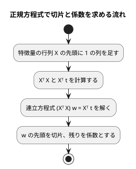
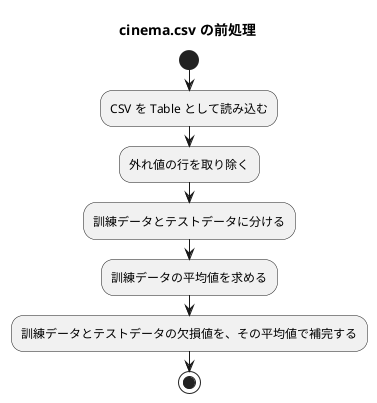

# 第 7 章: 線形回帰による数値予測

## 7.1 はじめに

第 1〜3 章では「きのこ派かたけのこ派か」「アヤメのどの品種か」という、グループを当てる **分類** を扱いました。この章からは、数値そのものを当てる **回帰** に進みます。題材は、映画の SNS での反響や主演俳優の露出度から、興行収入を予測する問題です。

この章では、最も基本的な回帰モデルである **線形回帰** を自作します。.NET の標準ライブラリには行列の型がありません。C# 版では、行列を **不変のクラス** で表し、積・転置・連立方程式を解くメソッドを TDD で書いたうえで、正規方程式で切片と係数を求めます。

次に、ML.NET の線形回帰（SDCA）に置き換えて、予測と評価指標を突き合わせます。

[Python 版の第 7 章](../python/07-linear-regression.md)・[Kotlin 版の第 7 章](../kotlin/07-linear-regression.md)・[TypeScript 版の第 7 章](../typescript/07-linear-regression.md)・[F# 版の第 7 章](../fsharp/07-linear-regression.md) と同じ TODO リストで進めます。C# 版では、次の 3 点に注目してください。

- F# 版は行列を型の別名（`type Matrix = float[][]`）で表しますが、C# の配列は書き換えられるので、配列を包んだ不変のクラスにします。中身で比べる `Equals` を自分で書く必要があることも、第 2 章の `Features` と同じです
- 仮実装（決め打ちの値を返す実装）が、.NET アナライザーの CA1822 に引っかかってビルドできない場面があります。C# では「仮実装で Green にする」という TDD の定石が、静的解析とぶつかります
- ML.NET の SDCA は、特徴量の大きさに敏感で、しかも既定では実行のたびに結果が変わります。どちらもテストで確かめて対処します

なお、記事に載せるコードでは、公開メソッドの先頭にある `ArgumentNullException.ThrowIfNull` の検査を省いています（実装には入っています）。

第 11〜13 章では、この章で作った行列と評価指標を再利用します。公開する API は次のとおりです。

| 型・メソッド | 役割 |
|------|------|
| `Matrix.FromRows` / `Transpose` / `Multiply` / `Solve` / `WithLeadingOnes` / `Dot` | 不変の行列と、正規方程式に必要な操作 |
| `LinearModel(double Intercept, Features Coefficients)` | 学習結果。係数は第 2 章の `Features` で持つ |
| `LinearRegression.Fit` / `Predict` / `DesignMatrix` | 正規方程式による学習・予測・計画行列 |
| `RegressionMetrics.MeanAbsoluteError` / `RootMeanSquaredError` / `R2Score` | 回帰の評価指標 |
| `Cinema.Load` / `FeatureColumns` / `RemoveOutliers` / `Prepare` | cinema.csv の読み込みと前処理 |
| `MlNetRegression.TrainSdca` | ML.NET の SDCA で学習し、予測する関数を返す |

## 7.2 線形回帰とは

### 特徴量の重み付きの和で予測する

線形回帰は、予測値を「切片」と「特徴量ごとの係数 × 特徴量」の和で表すモデルです。この章のデータに当てはめると次の式になります。

```text
予測値 = 切片 + 係数1 × SNS1 + 係数2 × SNS2 + 係数3 × actor + 係数4 × original
```

学習とは、訓練データに対して予測値と実測値のずれが最も小さくなるように、切片と係数を決めることです。ずれの大きさには「誤差の 2 乗の合計」を使います。これを最小にする方法を **最小二乗法** と呼びます。

### 正規方程式

最小二乗法の解は、行列を使うと 1 つの式で求められます。特徴量を行列 `X`、実測値をベクトル `t`、切片と係数をまとめたベクトルを `w` とすると、誤差の 2 乗の合計を最小にする `w` は次の **正規方程式** を満たします。

```text
(Xᵀ X) w = Xᵀ t
```

`X` の先頭には、すべての値が 1 の列を足しておきます。この列にかかる係数が切片になります。



この流れに必要な行列の操作は、**積**・**転置**・**連立方程式を解く** の 3 つです。逆行列を作らずに連立方程式として解くのは、ほかの言語の版と同じく、そのほうが数値計算の誤差が小さくなるためです。

## 7.3 題材とデータ

この章で使うのは `cinema.csv` です。100 本の映画について、次の 6 列が記録されています。

| 列 | 内容 | 欠損値 | C# での型 |
|----|------|-------|----------|
| cinema_id | 映画の ID | なし | `string`（`Row.Text`） |
| SNS1 | SNS での反響の数（1 つ目の指標） | 1 件 | `double?`（`Row.Number`） |
| SNS2 | SNS での反響の数（2 つ目の指標） | なし | `double?` |
| actor | 主演俳優のメディア露出の指標 | 1 件 | `double?` |
| original | 原作の有無（0 または 1） | なし | `double?` |
| sales | 興行収入 | なし | `double?` を補完なしで使う |

「SNS1」「SNS2」「actor」「original」が特徴量、「sales」が正解ラベル（予測したい数値）です。`cinema_id` は映画を区別するための番号なので、特徴量には使いません。

F# 版は型プロバイダ（`CsvProvider`）で列ごとの型を決め、欠損値を `float option` で表します。C# 版には型プロバイダがないので、第 2 章で作った `Table`・`Row` をそのまま使います。`Row.Number` は空欄なら `null` を返す `double?` なので、F# の `float option` と同じ役割を果たします。`Table` を使えるので、この章のために CSV の読み込みを書き直す必要はありません。

このデータには、SNS2 の値が大きいのに興行収入が低い、傾向から外れた映画が 1 本含まれています。このような **外れ値** は、最小二乗法の結果を大きく引っ張ります。誤差を 2 乗して足し合わせるので、大きく外れた 1 点の影響が大きくなるためです。

散布図で外れ値を確かめる手順は、[Python 版の 7.13 節](../python/07-linear-regression.md) と [Kotlin 版の 7.13 節](../kotlin/07-linear-regression.md) の可視化を参照してください。C# 版では Notebook を扱いません。

## 7.4 TODO リストの作成

**TODO リスト**:

- [ ] cinema.csv を読み込む
- [ ] 外れ値を取り除く
  - [ ] SNS2 が 1000 を超え、興行収入が 8500 未満の行を取り除く
  - [ ] 条件の片方だけを満たす行は残す
- [ ] 行列の操作を作る
  - [ ] 行列の積を求める
  - [ ] 転置行列を求める
  - [ ] 連立方程式を解く
- [ ] 正規方程式で線形回帰を学習する
  - [ ] 1 つの特徴量から切片と係数を求める
  - [ ] 複数の特徴量から切片と係数を求める
- [ ] 学習したモデルで予測する
- [ ] 評価指標を計算する（MAE・RMSE・R²）
- [ ] ML.NET の SDCA と結果を突き合わせる
- [ ] 外れ値の除去・分割・補完をまとめる
- [ ] 実データで学習・評価して表示する

外れ値の条件「SNS2 が 1000 を超え、興行収入が 8500 未満」は、書籍『スッキリわかる Python による機械学習入門』の同じデータでの分析手順に合わせたものです。

## 7.5 データを読み込み外れ値を取り除く

### 読み込みは第 2 章の表を使う

第 2 章の `Table.Load` がそのまま使えるので、`Cinema.Load` はそれを呼ぶだけにします。特徴量の列は、ID と正解ラベルを除いた残りとして求めます。

```csharp
[Fact(DisplayName = "特徴量の列は cinema_id と sales を除いた 4 列")]
public void FeatureColumns()
{
    var table = Cinema.Load(this.WriteCsv("1,10,20,5000,0,8000\n"));

    Assert.Equal(["SNS1", "SNS2", "actor", "original"], Cinema.FeatureColumns(table));
}
```

テストの CSV は、学習データの行ではなく、同じ列を持つ架空の値で書きます。`WriteCsv` は一時ディレクトリにヘッダー付きの CSV を書き出すヘルパーです。

### Green: まず片方の条件だけで取り除く

外れ値の条件は「SNS2 が 1000 を超え、**かつ** 興行収入が 8500 未満」です。まず「SNS2 が 1000 を超える」だけを見る実装で Green にします。

```csharp
private static bool IsOutlier(Row row) => row.Number("SNS2") > OutlierSns2;
```

`row.Number("SNS2")` は `double?` です。C# では `double?` と `double` の `>` 比較がそのまま書けて、左が `null` なら結果は `false` になります。ここが F# 版との大きな違いです。F# は `float option` と数値の比較がコンパイルエラー（FS0001）になるので、「値が無いときどうするか」を決めるまで先に進めません。C# は黙って `false` になるので、**欠損値の扱いを決めたことをテストで示す** 必要があります。

### 三角測量: 条件の片方だけを満たす行は残す

境界のちょうど上と下を `[Theory]` で 2 件書きます。

```csharp
[Theory(DisplayName = "条件の片方だけを満たす行は残す")]
[InlineData("1001", "8500")]
[InlineData("1000", "8499")]
public void KeepsRowsMatchingOneCondition(string sns2, string sales)
{
    var table = Cinema.Load(this.WriteCsv($"1,10,{sns2},5000,0,{sales}\n"));

    Assert.Single(Cinema.RemoveOutliers(table).Rows);
}
```

1 件目（SNS2 が 1001、興行収入が 8500）が Red になるので、条件を 2 つに増やします。

```csharp
private static bool IsOutlier(Row row) =>
    row.Number("SNS2") is > OutlierSns2 && row.Number(Target) < OutlierSales;
```

`is > OutlierSns2` はパターンマッチの関係パターンです。`double?` に対して書くと「値があって、かつ 1000 より大きい」という意味になります。`null` のときに `false` になることを、次のテストで固定します。

```csharp
[Fact(DisplayName = "SNS2 が欠損している行は外れ値かどうか判断できないので残す")]
public void KeepsMissingSns2()
{
    var table = Cinema.Load(this.WriteCsv("1,10,,5000,0,8000\n"));

    Assert.Single(Cinema.RemoveOutliers(table).Rows);
}
```

F# は型で強制され、C# はテストで守る。同じ結論に別の道から着くのが、この 2 つの言語の対比です。

外れ値を除いた表は、`record` の `with` 式で行だけを差し替えて作ります。元の表は変わりません。

```csharp
public static Table RemoveOutliers(Table table) =>
    table with { Rows = [.. table.Rows.Where(row => !IsOutlier(row))] };
```

## 7.6 行列の操作を作る

### 不変のクラスで包む

F# 版は `type Matrix = float[][]` という型の別名です。C# でも `double[][]` をそのまま使えますが、配列は誰からでも書き換えられます。第 2 章の `Features` と同じ理由で、配列を包んで複製する不変のクラスにします。

```csharp
public sealed class Matrix : IEquatable<Matrix>
{
    private readonly double[][] rows;

    private Matrix(double[][] rows) => this.rows = rows;

    public int RowCount => this.rows.Length;

    public int ColumnCount => this.rows[0].Length;

    public double this[int row, int column] => this.rows[row][column];

    public static Matrix FromRows(IReadOnlyList<IReadOnlyList<double>> rows)
    {
        // 行が 0 件・行ごとに列数が違う場合は例外にしてから
        return new Matrix([.. rows.Select(row => row.ToArray())]);
    }
}
```

`Equals` は成分で比べるように自分で書きます。`record` にすると配列の成分を参照で比べてしまうので、第 2 章の `Features` と同じ判断です。成分で比べられると、行列のテストが `Assert.Equal(Matrix.FromRows(...), product)` の 1 行で書けます。

### 仮実装が CA1822 で止まる

行列の積は、まず 1 行 1 列の行列どうしで仮実装（決め打ちの値を返す）から始めるつもりでした。

```csharp
public Matrix Multiply(Matrix other) => FromRows([[6.0]]);
```

ところが、この実装ではビルドが通りません。

```text
src/MachineLearning/Chapter07/Matrix.cs(70,19): error CA1822: メンバー 'Multiply' はインスタンス データにアクセスしないため、static にマークできます
```

インスタンスの状態を読まないメソッドは `static` にできる、という .NET アナライザーの指摘（CA1822）です。本プロジェクトは `TreatWarningsAsErrors` を有効にしているので、警告がエラーになってビルドが止まります。決め打ちの値を返す仮実装は「インスタンスの状態を読まない」ので、必ずこの指摘に当たります。

Python や Kotlin では素通りする TDD の定石が、C# の静的解析とぶつかる場面です。対処は 2 つあります。

1. インスタンスメソッドの仮実装をあきらめ、明白な実装に進む
2. 仮実装のあいだだけ `static` にして、三角測量で中身が要るようになったらインスタンスメソッドに戻す

ここでは 1 を選びました。行列の積は「左の行と右の列の内積を並べる」という定義がはっきりしていて、明白な実装で書けるからです。仮実装は「何を書けばいいか分からないとき」の手段なので、分かっているならそれで構いません。

### 内積・転置・積

先に内積を作ります。

```csharp
[Fact(DisplayName = "内積は対応する成分を掛けて足す")]
public void Dot()
{
    Assert.Equal(32.0, Matrix.Dot([1.0, 2.0, 3.0], [4.0, 5.0, 6.0]), 12);
}
```

`Matrix.Dot` は長さが違えば `ArgumentException` を投げます。F# 版は `Array.map2` が長さの違いで例外を投げてくれますが、C# の `Zip` は短いほうに合わせて黙って切り詰めるので、自分で検査します。

```csharp
public static double Dot(IReadOnlyList<double> u, IReadOnlyList<double> v)
{
    if (u.Count != v.Count)
    {
        throw new ArgumentException($"ベクトルの長さが違います: {u.Count} と {v.Count}", nameof(v));
    }

    var sum = 0.0;
    for (var i = 0; i < u.Count; i++)
    {
        sum += u[i] * v[i];
    }

    return sum;
}
```

転置は LINQ で列ごとに集め直します。F# には `Array.transpose` がありますが、LINQ には相当するものがないので自分で書きます。

```csharp
public Matrix Transpose() =>
    new([.. Enumerable.Range(0, this.ColumnCount)
        .Select(column => this.rows.Select(row => row[column]).ToArray())]);
```

積は、右の行列を転置してから行ごとに内積を取ります。

```csharp
public Matrix Multiply(Matrix other)
{
    if (this.ColumnCount != other.RowCount)
    {
        throw new ArgumentException(
            $"左の行列の列数 {this.ColumnCount} と右の行列の行数 {other.RowCount} が違います", nameof(other));
    }

    var columns = other.Transpose();
    return new([.. this.rows.Select(row =>
        Enumerable.Range(0, columns.RowCount).Select(i => Dot(row, columns.rows[i])).ToArray())]);
}
```

行数と列数が違う行列（2×3 と 3×2）で三角測量し、積が求められない組み合わせ（1×2 と 1×2）で例外になることも確かめます。

### 連立方程式を解く

ガウスの消去法で解きます。1 元 1 次（`3x = 6`）で始めて、2 元 1 次（`2x + y = 4`、`x + 3y = 7`）で三角測量します。

実装では、行列の中で配列を書き換えます。ただし書き換えるのは、メソッドの中で新しく作った拡大係数行列だけです。「引数を書き換えない」ことはテストで守ります。

```csharp
[Fact(DisplayName = "連立方程式を解いても元の行列とベクトルは変わらない")]
public void SolveDoesNotMutate()
{
    var a = Matrix.FromRows([[2.0, 1.0], [1.0, 3.0]]);
    double[] b = [4.0, 7.0];

    _ = a.Solve(b);

    Assert.Equal(Matrix.FromRows([[2.0, 1.0], [1.0, 3.0]]), a);
    MatrixTests.AssertValues([4.0, 7.0], b);
}
```

### 対角成分が 0 の場合

素朴なガウスの消去法は、対角成分が 0 になると 0 で割ってしまいます。それを示すテストを書きます。

```csharp
[Fact(DisplayName = "対角成分が 0 でも部分ピボット選択で解ける")]
public void SolveZeroPivot()
{
    var a = Matrix.FromRows([[0.0, 1.0], [1.0, 0.0]]);

    AssertValues([2.0, 1.0], a.Solve([1.0, 2.0]));
}
```

部分ピボット選択を入れる前は、例外ではなく静かに `NaN` が返ります。

```text
失敗 対角成分が 0 でも部分ピボット選択で解ける (152ms)
  Assert.Equal() Failure: Values are not within 9 decimal places
  Expected: 2 (rounded from 2)
  Actual:   NaN (rounded from NaN)
```

浮動小数点の 0 除算は例外にならないので、テストが無ければ「解けたつもり」で先に進んでしまいます。対処は、その列で絶対値が最も大きい行を対角の位置に持ってくる **部分ピボット選択** です。

```csharp
var largest = pivot;
for (var i = pivot + 1; i < n; i++)
{
    if (Math.Abs(augmented[i][pivot]) > Math.Abs(augmented[largest][pivot]))
    {
        largest = i;
    }
}

(augmented[pivot], augmented[largest]) = (augmented[largest], augmented[pivot]);
```

`(a, b) = (b, a)` はタプルによる入れ替えです。第 2 章の Fisher–Yates のシャッフルでも同じ書き方をしました。部分ピボット選択は、0 除算を避けるだけでなく、数値計算の誤差も小さくします。

最後に、計画行列を作るための「先頭に 1 の列を足す」操作を足します。

```csharp
public Matrix WithLeadingOnes() => new([.. this.rows.Select(row => row.Prepend(1.0).ToArray())]);
```

## 7.7 正規方程式で線形回帰を学習する

### 学習結果の型

学習結果は切片と係数です。係数は「列名の並びと値の並び」なので、第 2 章の `Features` がそのまま使えます。

```csharp
public sealed record LinearModel(double Intercept, Features Coefficients);
```

F# 版は `Map<string, float>` で持ちますが、`Map` は列の順を名前順に並べ替えます。C# の `Features` は列の並びを保つので、特徴量と同じ順で係数を読めます。値で比べる `Equals` も `Features` が持っているので、`LinearModel` どうしを `Assert.Equal` で比べられます。

### 1 つの特徴量から

`t = 3a + 5` の 3 点で始めます。

```csharp
[Fact(DisplayName = "1 つの特徴量から切片と係数を求める")]
public void FitOneFeature()
{
    double[] a = [0.0, 1.0, 2.0];
    IReadOnlyList<Features> x = [.. a.Select(value => new Features(A, [value]))];

    var model = LinearRegression.Fit(x, [5.0, 8.0, 11.0]);

    Assert.Equal(5.0, model.Intercept, 9);
    Assert.Equal(3.0, model.Coefficients.Value("a"), 9);
}
```

### 三角測量: 複数の特徴量

`t = 3a - 2b + 5` の 5 点で三角測量します。特徴量が増えても同じ式で解けることを確かめる、正規方程式の要になるテストです。

```csharp
[Fact(DisplayName = "複数の特徴量から切片と係数を求める")]
public void FitTwoFeatures()
{
    double[] a = [0.0, 1.0, 0.0, 2.0, 1.0];
    double[] b = [0.0, 0.0, 1.0, 1.0, 3.0];
    var t = a.Zip(b).Select(pair => (3.0 * pair.First) - (2.0 * pair.Second) + 5.0).ToList();

    var model = LinearRegression.Fit(Rows(a, b), t);

    Assert.Equal(5.0, model.Intercept, 9);
    MatrixTests.AssertValues([3.0, -2.0], model.Coefficients.Values);
}
```

実装は正規方程式をそのまま書き写した 4 行です。

```csharp
public static LinearModel Fit(IReadOnlyList<Features> x, IReadOnlyList<double> t)
{
    if (x.Count != t.Count)
    {
        throw new ArgumentException($"特徴量 {x.Count} 件と正解ラベル {t.Count} 件の数が違います", nameof(t));
    }

    var design = DesignMatrix(x);
    var designT = design.Transpose();
    var weights = designT.Multiply(design).Solve(designT.Multiply(t));
    return new LinearModel(weights[0], new Features(x[0].Columns, [.. weights.Skip(1)]));
}
```

`DesignMatrix` は、特徴量を行列にして先頭に 1 の列を足すだけです。第 11〜12 章でも使うので、`private` にせず公開しています。

```csharp
public static Matrix DesignMatrix(IReadOnlyList<Features> x) =>
    Matrix.FromRows([.. x.Select(row => row.Values)]).WithLeadingOnes();
```

## 7.8 学習したモデルで予測する

予測は「切片 + 係数 × 特徴量の和」です。

```csharp
public static IReadOnlyList<double> Predict(LinearModel model, IReadOnlyList<Features> x)
{
    var columns = model.Coefficients.Columns;
    var weights = model.Coefficients.Values;
    return [.. x.Select(row =>
        model.Intercept + Matrix.Dot([.. columns.Select(row.Value)], weights))];
}
```

特徴量の値を **係数が持つ列名の順に** 読み直しているので、渡した特徴量の列の並びが違っても同じ結果になります。これをテストで固定しておくと、第 9 章で特徴量を作り足すときに安心です。

```csharp
[Fact(DisplayName = "予測は係数の列だけを使うので、列の並びが違っても同じ結果になる")]
public void PredictByColumnName()
{
    var model = new LinearModel(5.0, new Features(AB, [3.0, -2.0]));
    IReadOnlyList<Features> x = [new(["b", "a"], [2.0, 1.0])];

    MatrixTests.AssertValues([4.0], LinearRegression.Predict(model, x));
}
```

`columns.Select(row.Value)` はメソッドグループの変換です。`row.Value` は `Features` の「列名で値を読む」メソッドで、無い列を渡すと列名を示す例外になります。

## 7.9 評価指標を計算する

分類の評価は「当たった件数の割合」でしたが、回帰では「どれだけ外れたか」を測ります。3 つの指標を作ります。

- **MAE**（平均絶対誤差）: 誤差の絶対値の平均。実測値と同じ単位で読める
- **RMSE**（二乗平均平方根誤差）: 誤差の 2 乗の平均の平方根。大きく外れた予測を重く数える
- **R²**（決定係数）: 常に平均値を予測する場合と比べて、誤差の 2 乗の合計をどれだけ減らせたかの割合

MAE を仮実装（0 を返す）で始め、誤差のある例で三角測量します。RMSE と R² は定義が明らかなので、明白な実装で書きます。

```csharp
[Fact(DisplayName = "R2 は 1 - 誤差の 2 乗の合計 / 実測値と平均値の差の 2 乗の合計")]
public void R2()
{
    // 実測値の平均は 5、平均との差の 2 乗の合計は 4 + 0 + 4 = 8、誤差の 2 乗の合計は 1 + 0 + 4 = 5
    Assert.Equal(1.0 - (5.0 / 8.0), RegressionMetrics.R2Score([3.0, 5.0, 7.0], [2.0, 5.0, 9.0]), 12);
}
```

3 つの指標はどれも残差から始まるので、残差を求める `private` メソッドにまとめます。件数が違えば例外にするのも、ここ 1 か所です。

```csharp
private static IReadOnlyList<double> Residuals(IReadOnlyList<double> t, IReadOnlyList<double> y) =>
    t.Count != y.Count
        ? throw new ArgumentException($"実測値 {t.Count} 件と予測値 {y.Count} 件の数が違います", nameof(y))
        : [.. t.Zip(y).Select(pair => pair.First - pair.Second)];
```

引数の順は「実測値・予測値」です。MAE と RMSE は入れ替えても同じ値になりますが、R² は変わります。「常に平均値を予測すると R² は 0 になる」というテストを置いておくと、順を取り違えたときに気づけます。

## 7.10 ML.NET の SDCA に置き換える

### Ols を使わない理由

ML.NET にも最小二乗法の学習器 `Ols` があります。ただし `Ols` は Microsoft.ML.Mkl.Components が必要で、そのパッケージが依存する Intel MKL のネイティブライブラリは x64 向けだけが配布されています。arm64 の環境では動きません（[ADR 004](../../../adr/004-fsharp-ml-libraries.md)）。

F# 版はここで FSharp.Stats に逃げましたが、C# 版では追加のライブラリを入れない方針（[ADR 006](../../../adr/006-csharp-ml-libraries.md)）なので、ML.NET の中で動く学習器を探します。反復で解く **SDCA**（確率的双対座標上昇法）は、純粋なマネージドコードで書かれていて、CPU を選びません。

### 特徴量の大きさに敏感

まず、第 3 章の `MlNetAdapter` と同じ形で、`Features` を ML.NET の入力に変える橋渡しを書き、SDCA をそのまま当ててみました。結果は次のとおりです。

```text
ML.NET(SDCA): 切片=0.00, 係数: SNS1=0.0671, SNS2=0.0832, actor=0.9458, original=-0.0001
ML.NET(SDCA) の R2: -0.5124
```

R² が負なので、「常に平均値を予測する」より悪い予測です。原因は特徴量の大きさの違いです。actor は数千の桁、original は 0 か 1 で、範囲が 4 桁ほど違います。反復で少しずつ重みを動かす解法は、この差に足を取られます（正規方程式は一度に解くので影響を受けません）。

ML.NET の作法どおり、平均 0・分散 1 に正規化する変換をパイプラインの前に置きます。

```csharp
var pipeline = context.Transforms.NormalizeMeanVariance("Features")
    .Append(context.Regression.Trainers.Sdca(options));
```

正規化を入れると、係数は正規化後の尺度になるので、自作の係数とは直接比べられません。そこで、第 3 章の `MlNetAdapter` と同じく **予測する関数を返す** 形にして、予測と評価指標で突き合わせます。

```csharp
public static Func<IReadOnlyList<Features>, IReadOnlyList<double>> TrainSdca(
    IReadOnlyList<Features> x, IReadOnlyList<double> t, int iterations = 100)
```

### 実行のたびに結果が変わる

正規化を入れて 2 回続けて実行すると、こうなりました。

```text
ML.NET(SDCA) のテストデータの評価: R2: 0.7641
ML.NET(SDCA) のテストデータの評価: R2: 0.7766
```

`new MLContext(seed: 0)` でシードを固定しているのに、値が変わります。SDCA は既定では複数のスレッドで並行して重みを更新するので、更新の順が実行ごとに違うためです。記事に載せる数値もテストの期待値も固定できないので、スレッドを 1 本に絞ります。

```csharp
var options = new SdcaRegressionTrainer.Options
{
    L2Regularization = 1e-7f,
    L1Regularization = null,
    MaximumNumberOfIterations = iterations,
    NumberOfThreads = 1,
};
```

`L2Regularization` を最小にしているのは、正則化が係数を 0 に引き寄せて最小二乗法の解からずらすためです（正則化そのものは第 12 章で扱います）。

再現することを、学習用テストとして記録します。

```csharp
[Fact(DisplayName = "学習用テスト: SDCA はスレッドを 1 本にすると同じ予測を返す")]
public void SdcaIsReproducible()
{
    var (x, t) = NoisyDataset();

    var first = MlNetRegression.TrainSdca(x, t)(x);
    var second = MlNetRegression.TrainSdca(x, t)(x);

    MatrixTests.AssertValues(first, second);
}
```

### 自作と突き合わせる

`t = 4 + 1.5a - 0.5b + 2c + ノイズ`（30 件）で、自作の予測と SDCA の予測を比べます。SDCA は反復で近づける解法なので、正規方程式の厳密解とぴったり同じにはなりません。そこで「2 つの予測列の R² が 0.999 を超える」という形で突き合わせます。

```csharp
[Fact(DisplayName = "SDCA の予測は自作の線形回帰とおおむね一致する")]
public void AgreesWithNormalEquation()
{
    var (x, t) = NoisyDataset();

    var mine = LinearRegression.Predict(LinearRegression.Fit(x, t), x);
    var library = MlNetRegression.TrainSdca(x, t)(x);

    Assert.True(
        RegressionMetrics.R2Score(mine, library) > 0.999,
        $"自作と SDCA の予測の R2 が低すぎる: {RegressionMetrics.R2Score(mine, library)}");
}
```

この章で作った `R2Score` を、モデルの評価ではなく「2 つの実装がどれだけ同じか」の物差しに使っています。許容誤差を成分ごとに決めるより、まとめて 1 つの数で言えるぶん読みやすくなります。

## 7.11 外れ値の除去・分割・補完をまとめる

前処理を 1 つのメソッドにまとめます。順番が大事です。



補完に使う平均値は **訓練データだけ** から求めます。テストデータの値を混ぜると、本番では知り得ない情報が学習に漏れます（リーケージ）。第 2 章と同じ考え方です。

```csharp
public static TrainTestSplit<Features, double> Prepare(string csvFile, double testSize, int seed)
{
    var table = RemoveOutliers(Load(csvFile));
    var columns = FeatureColumns(table);
    var sales = table.Rows.Select(row => row.Number(Target) ?? throw new InvalidDataException("興行収入が空欄です"));
    var split = Preprocessing.SplitTrainTest(table.Rows, [.. sales], testSize, seed);
    var means = Preprocessing.ColumnMeans(split.XTrain, columns);
    return new TrainTestSplit<Features, double>(
        Preprocessing.FillMissing(split.XTrain, columns, means),
        Preprocessing.FillMissing(split.XTest, columns, means),
        split.TTrain,
        split.TTest);
}
```

第 2 章で作った `SplitTrainTest`・`ColumnMeans`・`FillMissing` を、1 行も書き換えずに使えました。`SplitTrainTest<TX, TT>` の正解ラベルの型を `string`（アヤメの品種）から `double`（興行収入）に変えるだけで、分類から回帰に持ち越せます。型引数を置いておいた効果がここで出ます。

`??` の右に `throw` を書けるのは C# 7 以降の throw 式です。正解ラベルが空欄のデータは学習に使えないので、補完せずに失敗させます。

## 7.12 実データで学習・評価する

### 結果を表示する

訓練データとテストデータを 8:2 に分け（シード 0）、自作の線形回帰で学習して、テストデータで評価します。ML.NET の SDCA の評価も並べて表示します。

```csharp
public static void Run(TextWriter output)
{
    var csvFile = Path.Combine(DataDir.Current(), "cinema.csv");
    var table = Cinema.Load(csvFile);
    var split = Cinema.Prepare(csvFile, TestSize, Seed);
    var model = LinearRegression.Fit(split.XTrain, split.TTrain);
    var y = LinearRegression.Predict(model, split.XTest);
    var libraryY = MlNetRegression.TrainSdca(split.XTrain, split.TTrain)(split.XTest);

    output.WriteLine($"データ件数: {table.Rows.Count}");
    output.WriteLine($"外れ値を除いた件数: {Cinema.RemoveOutliers(table).Rows.Count}");
    output.WriteLine($"訓練データ: {split.XTrain.Count} 件, テストデータ: {split.XTest.Count} 件");
    output.WriteLine($"切片: {Format(model.Intercept, "F2")}");
    output.WriteLine($"係数: {FormatCoefficients(model.Coefficients)}");
    output.WriteLine("テストデータの評価: " + Evaluate(split.TTest, y));
    output.WriteLine("ML.NET(SDCA) の評価: " + Evaluate(split.TTest, libraryY));
}
```

書式を整えるときは `CultureInfo.InvariantCulture` を渡します。渡さないと実行環境のロケールで小数点の記号が変わり、テストが環境依存になります（.NET アナライザーの CA1305 も同じことを指摘します）。

`Program.cs` の対応表に `["chapter07"] = Chapter07.Program.Run` を加えて実行します。

```bash
dotnet run --project src/MachineLearning -- chapter07
```

```text
データ件数: 100
外れ値を除いた件数: 99
訓練データ: 79 件, テストデータ: 20 件
切片: 6330.97
係数: SNS1=1.1481, SNS2=0.5122, actor=0.2748, original=242.5101
テストデータの評価: R2=0.7740, MAE=320.18, RMSE=396.73
ML.NET(SDCA) の評価: R2=0.7659, MAE=338.69, RMSE=403.77
```

### F# 版と一致するか

切片・係数・評価指標は、[F# 版の第 7 章](../fsharp/07-linear-regression.md) の値と表示の桁まですべて一致しました。

| 項目 | C# 版 | F# 版 |
|------|------|------|
| 外れ値を除いた件数 | 99 | 99 |
| 訓練 / テスト | 79 / 20 | 79 / 20 |
| 切片 | 6330.97 | 6330.97 |
| SNS1 | 1.1481 | 1.1481 |
| SNS2 | 0.5122 | 0.5122 |
| actor | 0.2748 | 0.2748 |
| original | 242.5101 | 242.5101 |
| R² | 0.7740 | 0.7740 |
| MAE | 320.18 | 320.18 |
| RMSE | 396.73 | 396.73 |

一致した理由は 2 つあります。1 つは、分割が第 2 章で確かめたとおり F# 版と同じ行になること（同じ `System.Random(seed)` と同じ Fisher–Yates のシャッフル）です。もう 1 つは、正規方程式が反復ではなく一度に解く方法で、部分ピボット選択の手順まで同じなので、浮動小数点の計算の順まで一致することです。Python 版（R² 0.6811）や Kotlin 版（R² 0.8469）と違うのは、乱数生成器が違ってテストデータに入る映画が違うためです。

ライブラリとの突き合わせだけは一致しません。F# 版が使った FSharp.Stats は最小二乗法を直接解くので、係数まで自作と一致しました。C# 版の SDCA は反復で近づける解法なので、R² は 0.7659 で自作の 0.7740 とわずかに違います。「同じデータでも、解法が違えば小数点以下は違う」ことが、そのまま見えた形です。

これらの値はテストで固定しています。

```csharp
[Fact(DisplayName = "実データの切片と係数は F# 版と一致する")]
public void CoefficientsMatchFSharp()
{
    this.RequireData();
    var split = Cinema.Prepare(this.csvFile, 0.2, 0);

    var model = LinearRegression.Fit(split.XTrain, split.TTrain);

    Assert.Equal(6330.97, model.Intercept, 2);
    Assert.Equal(1.1481, model.Coefficients.Value("SNS1"), 4);
    Assert.Equal(0.5122, model.Coefficients.Value("SNS2"), 4);
    Assert.Equal(0.2748, model.Coefficients.Value("actor"), 4);
    Assert.Equal(242.5101, model.Coefficients.Value("original"), 4);
}
```

`RequireData` は、学習データが無ければ `Assert.SkipUnless` でテストをスキップします。表示のテストは、第 2・3 章と同じく `Program.Run` の出力をまるごと比べます。先に `Run` を書いてから実行結果をテストに固定したもので、Red を経ていないので、振る舞いを記録して後の変更から守るためのテストとして扱います。

### 係数を読む

係数は「ほかの特徴量を変えずに、その特徴量だけを 1 増やしたときの予測値の増え方」です。

- `original=242.5101` は、原作があると予測値が約 243 高くなることを表します
- `SNS1=1.1481` は、SNS1 が 100 増えると予測値が約 115 高くなることを表します

ただし、係数の大きさをそのまま特徴量の重要さとして比べることはできません。actor は数千の桁、original は 0 か 1 というように、特徴量ごとに値の範囲が大きく違うからです。actor の係数 0.2748 は小さく見えますが、actor の値の幅は数千あるので、予測値への影響は小さくありません。7.10 節で SDCA に正規化が要ったのも、同じ理由です。特徴量の範囲をそろえてから比べる **標準化** は、第 9 章で扱います。

### 評価指標を読む

テストデータ 20 件での MAE は 320.18、RMSE は 396.73 でした。RMSE が MAE より大きいのは、大きく外れた予測が一部にあり、それを 2 乗で重く数えているためです。R² の 0.7740 は、常に平均値を予測する場合と比べて、誤差の 2 乗の合計を約 77% 減らせたことを表します。

テストデータの分け方だけで R² がどれくらい揺れるかは、[F# 版の 7.13 節](../fsharp/07-linear-regression.md) で確かめています（0.706〜0.836）。同じ分け方をする C# 版でも同じ傾向になります。モデルの良し悪しを 1 回の分割で判断できないことは、第 11 章の交差検証で扱います。

## 7.13 品質チェック

整形とアナライザーを通してから、テストを実行します。

```bash
cd apps/csharp
dotnet format MachineLearning.sln --no-restore --verify-no-changes
dotnet build MachineLearning.sln --no-restore
dotnet test
```

`dotnet test` は `apps/csharp` を作業ディレクトリにして実行します（`global.json` の `test.runner` は最も近い `global.json` から読まれるため）。

学習データがある場合の結果です。

```text
テストの実行の概要: 成功!
  合計: 96
  失敗: 0
  成功: 96
  スキップ済み: 0
```

学習データが無い場合は、実データのテストがスキップされて成功します。

```text
テストの実行の概要: 成功!
  失敗: 0
  成功: 77
  スキップ済み: 19
```

この章で追加したのは、行列 12 件・線形回帰 6 件・評価指標 6 件・Cinema 5 件・ML.NET 2 件・実データ 5 件です。

## 7.14 まとめ

この章では、回帰問題の基本となる線形回帰を、不変の行列型から自作し、ML.NET の SDCA と突き合わせました。

1. **不変の行列を自分で用意する** — .NET には行列の型がない。F# 版のように `double[][]` の別名にすると中身を書き換えられるので、配列を複製して包み、成分で比べる `Equals` を書いた。第 2 章の `Features` と同じ判断
2. **null 許容値型はテストで守る** — `double?` と数値の比較は、左が `null` なら黙って `false` になる。F# の `option` のようにコンパイラが止めてくれないので、「欠損している行をどう扱うか」をテストで固定した
3. **仮実装と静的解析はぶつかる** — 決め打ちの値を返すインスタンスメソッドは CA1822 に当たり、`TreatWarningsAsErrors` によってビルドが止まる。定義がはっきりしている操作は明白な実装で進めればよい
4. **静かに壊れるものをテストで捕まえる** — 対角成分が 0 のガウスの消去法は例外ではなく `NaN` を返す。テストが無ければ「解けたつもり」で進む。部分ピボット選択で直した
5. **ライブラリの癖は学習用テストに記録する** — SDCA は特徴量の大きさに敏感（正規化しないと R² が -0.5124）で、既定では実行のたびに結果が変わる（0.7641 と 0.7766）。正規化とスレッド 1 本で再現できるようにし、その振る舞いをテストに残した
6. **型引数が分類から回帰への橋になる** — 第 2 章の `TrainTestSplit<TX, TT>` の正解ラベルを `string` から `double` に変えるだけで、前処理をそのまま持ち越せた

実データでは、切片・係数・MAE・RMSE・R² が F# 版と表示の桁まで一致しました。分割が同じで、正規方程式が反復に頼らない解法だからです。

次の章では、欠損値や文字列の列が多いタイタニック号の乗客データを使い、より実践的な分類と前処理パイプラインを作ります。
