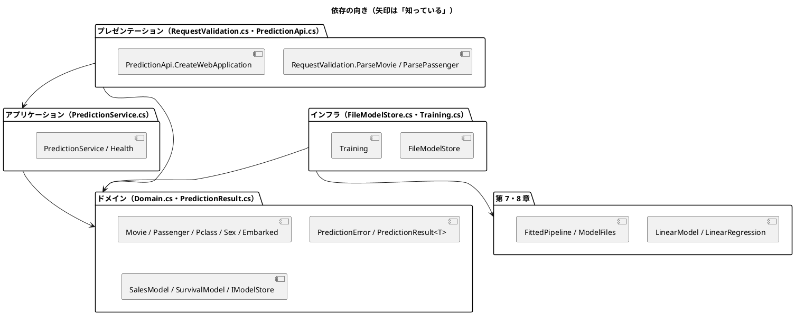

# 第 15 章: 機械学習 API とモジュール設計

## 15.1 はじめに

ここまでの章では、モデルを学習して評価するところまでを扱いました。モデルは、学習しただけでは誰の役にも立ちません。この章では、第 7 章の興行収入の予測と第 8 章の生存の予測を、**HTTP の API** として公開します。

API を作ると、機械学習とは別の関心事が増えます。

- 外から来る JSON が正しい形か（**入力の検証**）
- 学習済みモデルをどこから読み込むか（**モデルの置き場**）
- モデルが無いときや、予期しない例外が起きたときに、何を返すか（**エラーの扱い**）

これらを 1 つのファイルに書くと、変更が難しくなります。関心事ごとに層（モジュール）を分け、依存の向きをそろえます。

[Python 版の第 15 章](../python/15-machine-learning-api-and-module-design.md)・[Kotlin 版の第 15 章](../kotlin/15-machine-learning-api-and-module-design.md)・[F# 版の第 15 章](../fsharp/15-machine-learning-api-and-module-design.md)・[Java 版の第 15 章](../java/15-machine-learning-api-and-module-design.md) と同じ API を作ります。C# 版では、次の 3 点に注目してください。

- F# の `Result<'T, PredictionError>` に当たる型が C# の標準ライブラリに無いので、**`PredictionResult<T>` を自分で作る**。抽象レコードと sealed な派生（`Success<T>`・`Failure<T>`）で表し、`Match` で分ける
- F# の判別共用体（`Pclass`・`Sex`・`Embarked`）を **enum** で表し、JSON の値との対応づけは検証のところに置く
- モデルの置き場を **interface** にして、テストではスタブ、本番ではファイルの置き場を差し込む

## 15.2 レイヤードアーキテクチャ

### 4 つの層と依存の向き

ほかの版と同じく、4 つの層に分けます。呼び方も F# 版とそろえます。

| 層 | ファイル | 役割 | 知っている層 |
|----|---------|------|------------|
| ドメイン | `Domain.cs`・`PredictionResult.cs` | 入力（`Movie`・`Passenger`）と予測結果の型、客室の等級・性別・乗船港の enum、予測できなかった理由（`PredictionError`）、「モデル」と「モデルの置き場」の約束（`SalesModel`・`SurvivalModel` のデリゲートと `IModelStore`） | 何も知らない |
| アプリケーション | `PredictionService.cs` | 予測のユースケース（モデルを読み込んで予測する）と、ヘルスチェック（`Health`） | ドメイン |
| インフラ | `FileModelStore.cs`・`Training.cs` | モデルのファイルへの保存・読み込みと、第 7・8 章のモデルをドメインの約束に合わせるアダプター。学習して保存する処理 | ドメイン、第 7・8 章 |
| プレゼンテーション | `RequestValidation.cs`・`PredictionApi.cs` | 入力の検証、Minimal API のエンドポイント、HTTP の状態コード | ドメイン、アプリケーション |



ポイントは、**アプリケーション層がインフラ層を知らない** ことです。`PredictionService` は「置き場（`IModelStore`）から読み込んで予測する」ことしか知らず、それがファイルなのか、テスト用のスタブなのかを気にしません。

プレゼンテーション層の `CreateWebApplication` も、置き場を引数で受け取ります。どの置き場を使うかを決めるのは、サーバーを起動する `Program`（15.8 節）だけです。

F# 版では、`.fsproj` に書いたファイルの順番がそのまま依存の向きになり、逆向きの依存はコンパイルできませんでした。C# にはその仕組みがありません。名前空間はすべて `MachineLearning.Chapter15` で、ファイルの順番も関係しないので、**ドメイン層から `PredictionApi` を呼ぶコードも書けてしまいます**。依存の向きは、各ファイルの先頭に書いたドキュメントコメントと、レビューで守ります。

```csharp
/// <summary>アプリケーション層。置き場からモデルを読み込んで予測するユースケースと、ヘルスチェック。</summary>
public sealed class PredictionService
```

### インサイドアウトで進める

TDD の進め方には、外側（API）から作る **アウトサイドイン** と、内側（ドメイン・アプリケーション）から作る **インサイドアウト** があります。この章ではインサイドアウトを選びます。内側の層は外側を知らないので、スタブだけでテストできます。

## 15.3 TODO リストの作成

**TODO リスト**:

- [ ] ドメインの型を決める
- [ ] 予測の結果を表す型（`PredictionResult<T>`）を作る
- [ ] 予測サービスを作る
  - [ ] モデルが無ければ失敗を返す
  - [ ] ヘルスチェック
- [ ] 入力を検証する
  - [ ] 不正な理由をまとめて返す
  - [ ] 年齢と乗船港は省略できる
- [ ] Minimal API でエンドポイントを作る
  - [ ] 不正な入力は 422、モデルが無ければ 503、知らない経路は 404
- [ ] モデルを保存して読み込む
  - [ ] ファイルが無いときと壊れているときを区別する
- [ ] 実データで学習したモデルで動かす

## 15.4 ドメイン層とアプリケーション層

### ドメインを enum とレコードで表す

```csharp
// src/MachineLearning/Chapter15/Domain.cs
/// <summary>客室の等級。</summary>
public enum Pclass
{
    First = 1,
    Second = 2,
    Third = 3,
}

/// <summary>性別。</summary>
public enum Sex
{
    Male,
    Female,
}

/// <summary>乗船した港。</summary>
public enum Embarked
{
    Cherbourg,
    Queenstown,
    Southampton,
}

/// <summary>興行収入を予測する映画の特徴量。</summary>
public sealed record Movie(double Sns1, double Sns2, double Actor, bool Original);

/// <summary>生存を予測する乗客。年齢と乗船港は分からないことがある。</summary>
public sealed record Passenger(
    Pclass Pclass,
    Sex Sex,
    double? Age,
    int SibSp,
    int Parch,
    double Fare,
    Embarked? Embarked);
```

- 第 8 章では、客室の等級を `int`、性別と乗船港を `string` で表していました。CSV の値をそのまま持つためです。API のドメインでは、とりうる値を列挙します。F# 版は判別共用体でしたが、C# では **enum** を使います
- 判別共用体と違い、C# の enum は「名前の付いた整数」です。`(Pclass)4` と書けばコンパイルを通ってしまうので、「4 等の客室をそもそも作れない」とは言えません。ドメインに入る前の検証（15.5 節）で、JSON の値と enum の対応づけを閉じるのがこの版のやり方です
- 分からないことがある年齢と乗船港は `double?`・`Embarked?` です。第 2 章の欠損値を `double?` で表したのと同じ考え方です
- 入力も出力もすべて `record` です。レコードは値で等しさを比べるので、テストの期待値をそのまま書けます

### 失敗の表し方 — 3 つの言語の違い

モデルの読み込みは失敗しうる処理です。「失敗をどう表すか」は、言語ごとに使える道具が違います。

| 版 | 失敗の表し方 | 呼び出す側 |
|----|------------|-----------|
| F# | 組み込みの `Result<'T, PredictionError>` | `match` か `Result.map` で扱う。扱うまで値を取り出せない |
| Java | 検査例外 `ModelNotFoundException` | `catch` するか、自分の宣言にも `throws` を書くかをコンパイラに強制される |
| C# | 自作の `PredictionResult<T>`（抽象レコードと sealed な派生） | `Match` で成功と失敗の両方を書く |

C# には検査例外がなく、`Result` に当たる型も標準ライブラリにありません。例外にすると、呼び出す側が `catch` を書き忘れてもコンパイルが通ります。そこで、**予測の結果を表す型を自分で作る** ことにしました。第 3 章の決定木のノードと同じく、抽象レコードと sealed な派生で表します。

```csharp
// src/MachineLearning/Chapter15/PredictionResult.cs
/// <summary>
/// 予測の結果。F# の Result&lt;'T, PredictionError&gt; に当たる型を、C# では自分で作る。
/// 成功と失敗を抽象レコードと sealed な派生で表し、switch 式で分けて扱う。
/// </summary>
/// <typeparam name="T">成功したときの値の型</typeparam>
public abstract record PredictionResult<T>
{
    internal PredictionResult()
    {
    }

    /// <summary>成功なら値を、失敗なら理由を渡して、どちらも同じ型に変える。</summary>
    public TResult Match<TResult>(Func<T, TResult> onSuccess, Func<PredictionError, TResult> onError)
    {
        ArgumentNullException.ThrowIfNull(onSuccess);
        ArgumentNullException.ThrowIfNull(onError);
        return this switch
        {
            Success<T> success => onSuccess(success.Value),
            Failure<T> failure => onError(failure.Error),
            _ => throw new ArgumentException($"知らない結果です: {this}"),
        };
    }

    /// <summary>成功のときだけ値を変える。</summary>
    public PredictionResult<TResult> Map<TResult>(Func<T, TResult> map) =>
        this.Match<PredictionResult<TResult>>(
            value => new Success<TResult>(map(value)),
            error => new Failure<TResult>(error));

    /// <summary>成功かどうか。</summary>
    public bool IsSuccess => this is Success<T>;
}

/// <summary>成功した結果。</summary>
public sealed record Success<T>(T Value) : PredictionResult<T>;

/// <summary>失敗した結果。</summary>
public sealed record Failure<T>(PredictionError Error) : PredictionResult<T>;
```

- `internal` のコンストラクターは、このアセンブリの外から新しい派生を作れないようにする印です。「成功か失敗の 2 つだけ」を、C# なりに閉じています
- とはいえ、コンパイラは `switch` 式が 2 つの場合を尽くしていることを知りません。F# なら網羅性の検査でエラーになるところが、C# では「どれにも当たらない場合」を書かないと警告になります。`_ => throw ...` は、その届かないはずの枝です
- `Match` は、成功と失敗のどちらも同じ型に変える関数です。API では「成功なら 200 の JSON、失敗なら 503 の JSON」と、両方が `IResult` になります（15.6 節）
- `Map` は F# の `Result.map` に当たります。`Match` で書けるので、`Map` は `Match` を使った 3 行です

### 予測できなかった理由

```csharp
/// <summary>
/// 予測できなかった理由。F# 版は判別共用体で表しているが、C# には無いので
/// 抽象レコードと sealed な派生で表す（第 3 章の決定木と同じ形）。
/// </summary>
public abstract record PredictionError(string Model)
{
    /// <summary>人に見せる説明。ファイルのパスは含めない。</summary>
    public abstract string Describe();
}

/// <summary>学習済みモデルが見つからない。</summary>
public sealed record ModelNotFound(string Model) : PredictionError(Model)
{
    public override string Describe() => $"学習済みモデル {this.Model} が見つかりません";
}

/// <summary>学習済みモデルのファイルはあるが、読み込めない（壊れている・形が違う）。</summary>
public sealed record ModelUnreadable(string Model) : PredictionError(Model)
{
    public override string Describe() => $"学習済みモデル {this.Model} を読み込めません";
}
```

- エラーはモデルの名前だけを持ち、ファイルのパスを持ちません。応答に内部の情報（サーバーのディレクトリ構成）が漏れないようにするためです
- F# 版では、理由から説明を作る `describe` を `match` で 1 か所に書きました。C# では、説明を作る責任を **それぞれの派生** に持たせています。理由を増やしたら `Describe` を実装しなければコンパイルできないので、F# の網羅性の検査と同じ効果が、抽象メソッドで得られます

### モデルと置き場の約束

```csharp
/// <summary>映画の特徴量から興行収入を予測するモデル。</summary>
public delegate double SalesModel(Movie movie);

/// <summary>乗客が生存するかを判定するモデル。</summary>
public delegate bool SurvivalModel(Passenger passenger);

/// <summary>学習済みモデルの置き場。読み込めなければ理由を返す。</summary>
public interface IModelStore
{
    PredictionResult<SalesModel> LoadSalesModel();

    PredictionResult<SurvivalModel> LoadSurvivalModel();
}
```

- モデルは「映画を受け取って金額を返す関数」そのものです。F# 版の `type SalesModel = Movie -> float` に当たるものを、C# では **デリゲート** で書きます。`Func<Movie, double>` でも同じですが、名前を付けると引数と戻り値が何を表すかが読めます
- 置き場は、F# 版では関数 2 つのレコードでした。C# では **interface** です。テストではスタブのクラス、本番では `FileModelStore` を差し込みます

### Red: スタブで予測サービスをテストする

```csharp
// tests/MachineLearning.Tests/Chapter15/Stubs.cs
/// <summary>テスト用のモデルの置き場。</summary>
internal sealed class StubStore : IModelStore
{
    private readonly PredictionResult<SalesModel> sales;
    private readonly PredictionResult<SurvivalModel> survival;

    private StubStore(PredictionResult<SalesModel> sales, PredictionResult<SurvivalModel> survival)
    {
        this.sales = sales;
        this.survival = survival;
    }

    /// <summary>渡したモデルを返す置き場。</summary>
    internal static StubStore With(SalesModel sales, SurvivalModel survival) =>
        new(new Success<SalesModel>(sales), new Success<SurvivalModel>(survival));

    /// <summary>どのモデルも見つからない置き場。</summary>
    internal static StubStore Empty() =>
        new(new Failure<SalesModel>(new ModelNotFound("cinema")), new Failure<SurvivalModel>(new ModelNotFound("survived")));

    /// <summary>モデルのファイルはあるが読み込めない置き場。</summary>
    internal static StubStore Unreadable() =>
        new(new Failure<SalesModel>(new ModelUnreadable("cinema")), new Failure<SurvivalModel>(new ModelUnreadable("survived")));

    public PredictionResult<SalesModel> LoadSalesModel() => this.sales;

    public PredictionResult<SurvivalModel> LoadSurvivalModel() => this.survival;
}
```

```csharp
// tests/MachineLearning.Tests/Chapter15/PredictionServiceTests.cs
[Fact(DisplayName = "映画の特徴量から興行収入を予測する")]
public void PredictsSales()
{
    var service = new PredictionService(StubStore.With(_ => 1234.5, _ => true));

    var result = service.PredictSales(TestMovie);

    Assert.Equal(new Success<SalesPrediction>(new SalesPrediction(1234.5)), result);
}

[Fact(DisplayName = "モデルが無ければ ModelNotFound の失敗を返す")]
public void MissingModel()
{
    var service = new PredictionService(StubStore.Empty());

    var error = Assert.IsType<Failure<SalesPrediction>>(service.PredictSales(TestMovie)).Error;

    Assert.Equal(new ModelNotFound("cinema"), error);
    Assert.Equal("学習済みモデル cinema が見つかりません", error.Describe());
}
```

スタブのモデルは、学習もファイルも使わない、ただのラムダ式です。`_ => 1234.5` が `SalesModel` のデリゲートになります。結果もレコードなので、`new Success<SalesPrediction>(new SalesPrediction(1234.5))` をそのまま期待値に書けます。

まだ何も実装していないので、コンパイルできません。

```text
error CS0246: 型または名前空間の名前 'StubStore' が見つかりませんでした (using ディレクティブまたはアセンブリ参照が指定されていることを確認してください)
```

### Green: Map で予測する

```csharp
// src/MachineLearning/Chapter15/PredictionService.cs
/// <summary>アプリケーション層。置き場からモデルを読み込んで予測するユースケースと、ヘルスチェック。</summary>
public sealed class PredictionService
{
    private readonly IModelStore store;

    public PredictionService(IModelStore store) => this.store = store;

    public PredictionResult<SalesPrediction> PredictSales(Movie movie) =>
        this.store.LoadSalesModel().Map(model => new SalesPrediction(model(movie)));

    public PredictionResult<SurvivalPrediction> PredictSurvival(Passenger passenger) =>
        this.store.LoadSurvivalModel().Map(model => new SurvivalPrediction(model(passenger)));

    /// <summary>モデルごとに、読み込めるかどうかを返す。</summary>
    public Health Health() =>
        new(this.store.LoadSalesModel().IsSuccess, this.store.LoadSurvivalModel().IsSuccess);
}

/// <summary>モデルごとに読み込めるかどうか。</summary>
public sealed record Health(bool Cinema, bool Survived);
```

`Map` は、成功なら中の値（モデル）を使って予測を作り、失敗ならそのまま通します。F# 版の `Result.map` と同じ形の式が、自作の型でも書けています。

## 15.5 入力を検証する（プレゼンテーション層）

### 何を検証するか

API の入力は、映画なら `{"sns1": 200, "sns2": 500, "actor": 3000, "original": 1}`、乗客なら `{"pclass": 1, "sex": "female", "age": null, "sib_sp": 0, "parch": 0, "fare": 50, "embarked": "C"}` の JSON です。項目名と、とりうる値はほかの版と同じです。

- 数値の項目は 0 以上。`sib_sp`・`parch` は整数
- `original` は 0 か 1、`pclass` は 1・2・3、`sex` は `male`・`female`、`embarked` は `C`・`Q`・`S`
- `age` と `embarked` は省略でき、`null` も省略と同じ扱い
- 不正な項目がいくつあっても、**理由をまとめて** 返す

### Red: 理由をまとめて返すテスト

```csharp
// tests/MachineLearning.Tests/Chapter15/RequestValidationTests.cs
[Theory(DisplayName = "不正な項目の理由を返す")]
[InlineData("""{"sns1": -1, "sns2": 500, "actor": 3000, "original": 1}""", "sns1 は 0 以上にしてください")]
[InlineData("""{"sns1": "多い", "sns2": 500, "actor": 3000, "original": 1}""", "sns1 は数値にしてください")]
[InlineData("""{"sns1": 200, "sns2": 500, "actor": 3000, "original": 2}""", "original は 0、1 のどれかにしてください")]
[InlineData("""{"sns2": 500, "actor": 3000, "original": 1}""", "sns1 を指定してください")]
public void RejectsInvalidMovie(string body, string expected)
{
    var result = RequestValidation.ParseMovie(body);

    Assert.False(result.IsValid);
    Assert.Contains(expected, result.Errors);
}

[Fact(DisplayName = "不正な項目が複数あれば理由をすべて集める")]
public void CollectsAllErrors()
{
    var result = RequestValidation.ParseMovie("""{"sns1": -1, "sns2": -2, "actor": 3000, "original": 1}""");

    Assert.Equal(["sns1 は 0 以上にしてください", "sns2 は 0 以上にしてください"], result.Errors);
}
```

- `[Theory]` と `[InlineData(...)]` は、同じテストを入力を変えて何度も実行する xUnit の書き方です。1 行の `InlineData` が 1 回のテストになります
- `"""..."""` は、中に `"` をそのまま書ける生文字列リテラルです。JSON をそのまま貼れます

### 検証の結果と、理由を集める素朴な書き方

```csharp
// src/MachineLearning/Chapter15/RequestValidation.cs
/// <summary>検証の結果。正しければ値を、不正なら理由の一覧を持つ。</summary>
public sealed record Validation<T>(T? Value, IReadOnlyList<string> Errors)
{
    public bool IsValid => this.Errors.Count == 0;
}
```

F# 版では、`and!` の計算式（コンピュテーション式）を作り、`MergeSources` で 2 つの `Error` のリストを連結することで、理由を自動的に集めていました。C# には計算式がありません。同じことを LINQ で組むこともできますが、この章では **理由のリストを 1 つ持ち回り、不正を見つけたら足していく** という素朴な書き方にしました。

```csharp
/// <summary>本文を映画の特徴量にする。</summary>
public static Validation<Movie> ParseMovie(string body) =>
    ParseWith(body, json =>
    {
        var errors = new List<string>();
        var sns1 = NonNegativeNumber(json, "sns1", errors);
        var sns2 = NonNegativeNumber(json, "sns2", errors);
        var actor = NonNegativeNumber(json, "actor", errors);
        var original = OneOf(json, "original", new Dictionary<string, bool>(StringComparer.Ordinal) { ["0"] = false, ["1"] = true }, errors);
        return errors.Count == 0
            ? Valid(new Movie(sns1!.Value, sns2!.Value, actor!.Value, original!.Value))
            : Invalid<Movie>(errors);
    });
```

- 項目ごとの検証は、`errors` を受け取り、不正なら理由を足して `null` を返します。途中で止めないので、4 つの項目は **全部** 検証されます。F# の `and!` と同じ結果を、素直な手続きで得ています
- すべての項目が正しいときだけ `Movie` を作ります。`sns1!.Value` の `!` は「ここでは `null` でないと分かっている」という印で、`errors.Count == 0` がその根拠です。F# 版では、計算式が「全部 `Ok` のときだけ `return` を実行する」ことを型で保証していました。C# 版のこの `!` は、その保証を人が引き受けた分です

乗客の検証も同じ形です。JSON の値と enum の対応づけは、ここに書きます。

```csharp
/// <summary>本文を乗客の特徴量にする。年齢と乗船港は省略できる。</summary>
public static Validation<Passenger> ParsePassenger(string body) =>
    ParseWith(body, json =>
    {
        var errors = new List<string>();
        var pclass = OneOf(json, "pclass", new Dictionary<string, Pclass>(StringComparer.Ordinal)
        {
            ["1"] = Pclass.First,
            ["2"] = Pclass.Second,
            ["3"] = Pclass.Third,
        }, errors);
        var sex = OneOf(json, "sex", new Dictionary<string, Sex>(StringComparer.Ordinal)
        {
            ["male"] = Sex.Male,
            ["female"] = Sex.Female,
        }, errors);
        var age = OptionalNonNegativeNumber(json, "age", errors);
        var sibSp = NonNegativeInteger(json, "sib_sp", errors);
        var parch = NonNegativeInteger(json, "parch", errors);
        var fare = NonNegativeNumber(json, "fare", errors);
        var embarked = OptionalOneOf(json, "embarked", new Dictionary<string, Embarked>(StringComparer.Ordinal)
        {
            ["C"] = Embarked.Cherbourg,
            ["Q"] = Embarked.Queenstown,
            ["S"] = Embarked.Southampton,
        }, errors);
        return errors.Count == 0
            ? Valid(new Passenger(pclass!.Value, sex!.Value, age, sibSp!.Value, parch!.Value, fare!.Value, embarked))
            : Invalid<Passenger>(errors);
    });
```

`OneOf` は、JSON の値（`"1"` や `"female"`）を enum の値（`Pclass.First` や `Sex.Female`）に対応づけます。**検証と変換を同時に** 行うので、ドメインに入るのは対応づけを通った値だけです。15.4 節で「enum は `(Pclass)4` と書けてしまう」と書きましたが、外から来る値がドメインに入る道はこの `OneOf` だけなので、ここで閉じておけば API としては安全です。

### OneOf の型引数に struct の制約が要る

`OneOf` は、`bool`・`Pclass`・`Sex`・`Embarked` のどれにも使いたい関数です。不正なら「値が無い」ことを返したいので、戻り値を `TValue?` にしました。すると、コンパイルエラーになりました。

```text
error CS0403: Null 非許容の値型である可能性があるため、Null を型パラメーター 'TValue' に変換できません。'default(TValue)' を使用してください。
```

`TValue` が参照型かもしれないし値型かもしれない状態では、`TValue?` の意味が決まりません。enum と `bool` はどちらも値型なので、型引数に `struct` の制約を付けると、`TValue?` が `Nullable<TValue>` に決まり、`null` を返せるようになります。

```csharp
/// <summary>JSON の値（数値か文字列）を、決められた値の一覧のどれかに対応づける。</summary>
private static TValue? OptionalOneOf<TValue>(
    JsonElement json, string name, IReadOnlyDictionary<string, TValue> choices, List<string> errors)
    where TValue : struct
{
    var value = Field(json, name);
    if (value is null)
    {
        return null;
    }

    var raw = value.Value.ValueKind == JsonValueKind.String ? value.Value.GetString() : value.Value.GetRawText();
    if (raw is not null && choices.TryGetValue(raw, out var choice))
    {
        return choice;
    }

    errors.Add($"{name} は {string.Join("、", choices.Keys)} のどれかにしてください");
    return null;
}
```

F# 版では、`float` と `int` の両方で使う `notNegative` が同じ壁（FS0064）に当たり、`inline` で解決しました。「ジェネリックの型引数に、数値型・値型といった制約をどう伝えるか」は、.NET の 2 つの言語それぞれの事情が出るところです。

JSON そのものが壊れている場合も、理由を返します。

```csharp
private static Validation<T> ParseWith<T>(string body, Func<JsonElement, Validation<T>> validate)
{
    try
    {
        using var document = JsonDocument.Parse(body);
        return document.RootElement.ValueKind == JsonValueKind.Object
            ? validate(document.RootElement)
            : Invalid<T>(["JSON のオブジェクトにしてください"]);
    }
    catch (JsonException)
    {
        return Invalid<T>(["JSON の形式が正しくありません"]);
    }
}
```

## 15.6 Minimal API でエンドポイントを作る（プレゼンテーション層）

### ASP.NET Core を参照する

F# 版が Giraffe を使ったところを、C# 版は ASP.NET Core の **Minimal API** だけで書きます。追加のパッケージは要りません。ASP.NET Core は NuGet のパッケージではなく、.NET SDK に含まれる共有フレームワークなので、`FrameworkReference` で参照します。

```xml
<!-- src/MachineLearning/MachineLearning.csproj -->
  <ItemGroup>
    <!-- 第 15 章の予測 API（ASP.NET Core Minimal API） -->
    <FrameworkReference Include="Microsoft.AspNetCore.App" />
  </ItemGroup>
```

統合テストには、サーバーを起動せずに HTTP の要求を送れる `Microsoft.AspNetCore.TestHost` を使います。

```xml
<!-- Directory.Packages.props -->
    <PackageVersion Include="Microsoft.AspNetCore.TestHost" Version="10.0.12" />
```

### Red: TestHost で API をテストする

```csharp
// tests/MachineLearning.Tests/Chapter15/PredictionApiTests.cs
/// <summary>置き場を使う API を、ネットワークを使わないテスト用のサーバーで起動する。</summary>
private static async Task<HttpClient> ClientAsync(IModelStore store)
{
    var builder = WebApplication.CreateBuilder();
    builder.WebHost.UseTestServer();
    var app = PredictionApi.CreateWebApplication(builder, store);
    await app.StartAsync();
    return app.GetTestClient();
}

[Fact(DisplayName = "映画の特徴量を送ると予測した興行収入を返す")]
public async Task PredictsSales()
{
    var (status, body) = await PostAsync(Stub, "/cinema/sales", MovieJson);

    Assert.Equal(HttpStatusCode.OK, status);
    Assert.Equal("""{"sales":1200}""", body);
}

[Fact(DisplayName = "モデルが無ければ 503 と、パスを含まない理由を返す")]
public async Task MissingModel()
{
    var (status, body) = await PostAsync(StubStore.Empty(), "/cinema/sales", MovieJson);

    Assert.Equal(HttpStatusCode.ServiceUnavailable, status);
    Assert.Equal("""{"detail":"学習済みモデル cinema が見つかりません"}""", body);
}
```

- `UseTestServer()` に差し替えると、ネットワークのポートを開かずに、メモリの中で要求と応答をやりとりします。ポートの競合も、後片付けの失敗もありません
- `async Task` を返すテストは、xUnit がそのまま待ってくれます。TestHost のクライアントは同期の送信に対応していないので、`PostAsync`・`GetAsync` を `await` します

### エンドポイントを組み立てる

```csharp
// src/MachineLearning/Chapter15/PredictionApi.cs
/// <summary>置き場を使う API を組み立てる。起動はしない。</summary>
public static WebApplication CreateWebApplication(WebApplicationBuilder builder, IModelStore store)
{
    ArgumentNullException.ThrowIfNull(builder);
    var service = new PredictionService(store);
    var app = builder.Build();

    app.MapPost("/cinema/sales", async (HttpRequest request) =>
        await PredictAsync(request, RequestValidation.ParseMovie, service.PredictSales).ConfigureAwait(false));
    app.MapPost("/survived", async (HttpRequest request) =>
        await PredictAsync(request, RequestValidation.ParsePassenger, service.PredictSurvival).ConfigureAwait(false));
    app.MapGet("/health", () =>
    {
        var models = service.Health();
        var status = models.Cinema && models.Survived ? "ok" : "degraded";
        return Results.Json(new HealthResponse(status, models));
    });
    app.MapFallback(() => Results.Json(new { detail = "見つかりません" }, statusCode: StatusCodes.Status404NotFound));

    return app;
}
```

- `MapPost`・`MapGet` は「この経路にこの処理」を登録します。F# 版の `choose` と `>=>` に当たるものが、メソッドの呼び出しとして並びます
- `MapFallback` は、どの経路にも当たらなかった要求を受け止めます。F# 版で `choose` のリストの最後に置いた 404 のハンドラーと同じ役目です
- `Results.Json` は、値を JSON にして状態コードを添えます。`new { detail = ... }` の匿名型も JSON になります

検証と予測の流れは、映画と乗客で共通です。

```csharp
/// <summary>本文を検証し、正しければ予測する。不正なら 422 と理由の一覧、モデルが無ければ 503 を返す。</summary>
private static async Task<IResult> PredictAsync<TInput, TOutput>(
    HttpRequest request,
    Func<string, RequestValidation.Validation<TInput>> parse,
    Func<TInput, PredictionResult<TOutput>> predict)
{
    using var reader = new StreamReader(request.Body);
    var body = await reader.ReadToEndAsync().ConfigureAwait(false);
    var validation = parse(body);
    if (!validation.IsValid)
    {
        return Results.Json(new { detail = validation.Errors }, statusCode: StatusCodes.Status422UnprocessableEntity);
    }

    return predict(validation.Value!).Match(
        prediction => Results.Json(prediction),
        error => Results.Json(new { detail = error.Describe() }, statusCode: StatusCodes.Status503ServiceUnavailable));
}
```

- `PredictAsync` は、検証の関数と予測の関数を受け取る **高階関数** です。2 つのエンドポイントで、同じ「検証して、予測して、応答にする」流れを共有しています
- 検証の失敗は 422、予測の失敗（`PredictionError`）は 503 と、**失敗の種類ごとに状態コードが決まります**。`Match` に渡す 2 つのラムダ式が、そのまま「成功の応答」と「失敗の応答」です。書き忘れると引数が足りずコンパイルできないので、失敗の応答を落とすことがありません
- 本文は `Movie` のような型で受けず、文字列のまま読んで自分で検証します。ASP.NET Core に JSON を型に変換させると、`"sns1": "多い"` のような入力が変換の段階で 400 になり、こちらの日本語の理由を返せなくなるためです

ヘルスチェックの応答は、項目の順を決めるために名前付きのレコードにしています。

```csharp
/// <summary>ヘルスチェックの応答。</summary>
public sealed record HealthResponse(string Status, Health Models);
```

F# 版では、匿名レコードがフィールドを名前の順に並べてしまい、テストが失敗したという話がありました。C# の匿名型は書いた順に並ぶので、同じ問題は起きません。それでも、応答の形に名前を付けておくほうが読めます。

## 15.7 モデルを保存して読み込む（インフラ層）

### 第 7・8 章のモデルを約束に合わせる

置き場は、第 7 章の線形回帰と第 8 章のパイプラインを、ドメインの約束（`SalesModel`・`SurvivalModel`）に合わせます。

```csharp
// src/MachineLearning/Chapter15/FileModelStore.cs
/// <summary>映画の特徴量を、第 7 章のモデルが期待する列の並びにそろえる。</summary>
private static Features ToFeatures(LinearModel model, Movie movie)
{
    var values = new Dictionary<string, double>(StringComparer.Ordinal)
    {
        ["SNS1"] = movie.Sns1,
        ["SNS2"] = movie.Sns2,
        ["actor"] = movie.Actor,
        ["original"] = movie.Original ? 1 : 0,
    };
    return new Features(model.Coefficients.Columns, [.. model.Coefficients.Columns.Select(column => values[column])]);
}

/// <summary>乗客の特徴量を、第 8 章のパイプラインが受け取るセルの文字列にする。分からない値は空欄。</summary>
private static Row ToRow(Passenger passenger) =>
    new(new Dictionary<string, string>(StringComparer.Ordinal)
    {
        ["Pclass"] = ((int)passenger.Pclass).ToString(System.Globalization.CultureInfo.InvariantCulture),
        ["Sex"] = passenger.Sex == Sex.Male ? "male" : "female",
        ["Age"] = passenger.Age?.ToString(System.Globalization.CultureInfo.InvariantCulture) ?? string.Empty,
        ["SibSp"] = passenger.SibSp.ToString(System.Globalization.CultureInfo.InvariantCulture),
        ["Parch"] = passenger.Parch.ToString(System.Globalization.CultureInfo.InvariantCulture),
        ["Fare"] = passenger.Fare.ToString(System.Globalization.CultureInfo.InvariantCulture),
        ["Embarked"] = passenger.Embarked switch
        {
            Embarked.Cherbourg => "C",
            Embarked.Queenstown => "Q",
            Embarked.Southampton => "S",
            _ => string.Empty,
        },
    });
```

- ドメインの値（enum）から、第 8 章のパイプラインが読む CSV のセル（文字列）に戻します。分からない年齢・乗船港は空欄で、第 2 章の `Row` が欠損値として読みます
- `Pclass` の enum には `First = 1` と番号を振ってあるので、`(int)passenger.Pclass` がそのまま「1・2・3」になります
- `Embarked` の `switch` 式には `_ => string.Empty` が要ります。`Embarked?` が `null` のとき（乗船港が分からないとき）に当たる枝です

### ファイルが無い・読めないを区別する

```csharp
/// <summary>ファイルが無ければ ModelNotFound、読み込めなければ ModelUnreadable を返す。</summary>
private static PredictionResult<T> Load<T>(string model, string file, Func<string, T> read)
{
    if (!File.Exists(file))
    {
        return new Failure<T>(new ModelNotFound(model));
    }

    try
    {
        return new Success<T>(read(file));
    }
    catch (Exception e) when (e is JsonException or InvalidDataException or ArgumentException)
    {
        return new Failure<T>(new ModelUnreadable(model));
    }
}

public PredictionResult<SalesModel> LoadSalesModel() =>
    Load<SalesModel>(SalesModelName, this.SalesModelFile(), file =>
    {
        var saved = JsonSerializer.Deserialize<SavedLinearModel>(File.ReadAllText(file))
            ?? throw new JsonException("中身が空です");
        var model = new LinearModel(saved.Intercept, new Features(saved.Columns, saved.Coefficients));
        return movie => LinearRegression.Predict(model, [ToFeatures(model, movie)])[0];
    });

public PredictionResult<SurvivalModel> LoadSurvivalModel() =>
    Load<SurvivalModel>(SurvivalModelName, this.SurvivalModelFile(), file =>
    {
        var pipeline = ModelFiles.Load(file);
        return passenger => pipeline.PredictOne(ToRow(passenger)) == 1;
    });
```

- 壊れたファイルを「見つからない」と報告すると、利用者は原因を取り違えます。そこで、`ModelNotFound` と `ModelUnreadable` を区別しました
- `catch (Exception e) when (...)` は、C# の **例外フィルター** です。JSON の形が違うなど「読めない」とみなす例外だけを捕まえ、それ以外（ディスクの障害など）はそのまま外に出します。捕まえた例外のメッセージは捨て、モデルの名前だけを持つ `ModelUnreadable` にして、内部の情報を外に出しません
- 読み込んだモデルは `movie => ...` のラムダ式です。`model` を覚えた「映画を受け取る関数」、つまり `SalesModel` になります
- 置き場は、呼ばれるたびにファイルを読み込みます。学習し直してファイルを置き換えれば、サーバーを再起動せずに新しいモデルが使われます（15.8 節で確かめます）

### 保存の形式

第 7 章の線形回帰（`LinearModel`）は、切片と係数の `Features` を持つレコードです。`Features`（第 2 章）はクラスで、列名と値を配列で持ちます。System.Text.Json はこのクラスをそのままでは読み書きできないので、保存用の形に詰め替えます。

```csharp
/// <summary>線形回帰モデルを JSON にするための形。</summary>
private sealed record SavedLinearModel(
    double Intercept, IReadOnlyList<string> Columns, IReadOnlyList<double> Coefficients);

/// <summary>線形回帰モデルを JSON で保存する。</summary>
public void SaveSalesModel(LinearModel model)
{
    ArgumentNullException.ThrowIfNull(model);
    Directory.CreateDirectory(this.modelDirectory);
    var saved = new SavedLinearModel(
        model.Intercept,
        [.. model.Coefficients.Columns],
        [.. model.Coefficients.Values]);
    File.WriteAllText(this.SalesModelFile(), JsonSerializer.Serialize(saved));
}
```

実データで学習した `cinema.json` は、次のようになりました。

```json
{"Intercept":6330.966006849874,"Columns":["SNS1","SNS2","actor","original"],"Coefficients":[1.148053913801588,0.5121636834406887,0.2748475602760621,242.51013305641095]}
```

第 8 章のパイプラインは、第 8 章の `ModelFiles` がすでに JSON で保存・読み込みしているので、それをそのまま使います。

```csharp
/// <summary>学習済みパイプラインを保存する（第 8 章の ModelFiles）。</summary>
public void SaveSurvivalModel(FittedPipeline pipeline)
{
    Directory.CreateDirectory(this.modelDirectory);
    ModelFiles.Save(pipeline, this.SurvivalModelFile());
}
```

```csharp
// tests/MachineLearning.Tests/Chapter15/FileModelStoreTests.cs
[Fact(DisplayName = "保存した線形回帰モデルを読み込んで興行収入を予測する")]
public void SalesModel()
{
    var store = new FileModelStore(this.directory);
    var columns = new[] { "SNS1", "SNS2", "actor", "original" };
    store.SaveSalesModel(new LinearModel(100.0, new Features(columns, [1.0, 2.0, 0.5, 10.0])));

    var model = Assert.IsType<Success<SalesModel>>(store.LoadSalesModel()).Value;

    Assert.Equal(210.0, model(new Movie(10.0, 20.0, 100.0, true)), 9);
}

[Fact(DisplayName = "モデルのファイルが壊れていれば ModelUnreadable を返す")]
public void BrokenFile()
{
    File.WriteAllText(Path.Combine(this.directory, "cinema.json"), "{");

    var error = Assert.IsType<Failure<SalesModel>>(new FileModelStore(this.directory).LoadSalesModel()).Error;

    Assert.Equal(new ModelUnreadable("cinema"), error);
}
```

- 学習の結果ではなく、テストが決めた係数（切片 100、SNS1 が 1、SNS2 が 2、俳優が 0.5、原作が 10）で確かめます。`100 + 1 × 10 + 2 × 20 + 0.5 × 100 + 10 × 1` で 210 です
- `Assert.IsType<Success<SalesModel>>(...)` は、成功であることを確かめつつ、中の値を取り出します。読み込んだモデルはデリゲートなので、等しさでは比べられません
- モデルが無いときのテストでは、説明にディレクトリのパスが含まれないことも確かめています（`Assert.DoesNotContain(this.directory, error.Describe(), ...)`）

## 15.8 実データで学習したモデルで動かす

### 学習と保存

第 7・8 章と同じ条件（テストデータの割合 0.2、シード 0、深さ 5、クラスの重みあり）で学習して保存します。

```csharp
// src/MachineLearning/Chapter15/Training.cs
/// <summary>第 7・8 章と同じ条件でモデルを学習し、置き場に保存する。</summary>
public static class Training
{
    private const double TestSize = 0.2;
    private const int Seed = 0;
    private const int MaxDepth = 5;

    public static void TrainAndSaveModels(string dataDirectory, FileModelStore store)
    {
        ArgumentNullException.ThrowIfNull(store);
        var cinema = Cinema.Prepare(Path.Combine(dataDirectory, "cinema.csv"), TestSize, Seed);
        store.SaveSalesModel(LinearRegression.Fit(cinema.XTrain, cinema.TTrain));

        var rows = Table.Load(Path.Combine(dataDirectory, "Survived.csv")).Rows;
        var split = Preprocessing.SplitTrainTest(rows, SurvivedData.Labels(rows), TestSize, Seed);
        var pipeline = Pipeline.Build(MaxDepth, ClassWeight.Balanced)
            .Fit(SurvivedData.ToTable(split.XTrain), split.TTrain);
        store.SaveSurvivalModel(pipeline);
    }
}
```

### 統合テスト

実データで学習して保存したモデルを、本物の置き場（`FileModelStore`）から読み込んで予測します。

```csharp
// tests/MachineLearning.Tests/Chapter15/TrainedModelsTests.cs
[Fact(DisplayName = "学習したパイプラインで 1 等客室の女性は生存と予測する")]
public void FirstClassWoman()
{
    var model = Assert.IsType<Success<SurvivalModel>>(this.TrainedStore().LoadSurvivalModel()).Value;

    Assert.True(model(new Passenger(Pclass.First, Sex.Female, 30.0, 0, 0, 80.0, Embarked.Cherbourg)));
}

[Fact(DisplayName = "学習したパイプラインで 3 等客室の男性は死亡と予測する")]
public void ThirdClassMan()
{
    var model = Assert.IsType<Success<SurvivalModel>>(this.TrainedStore().LoadSurvivalModel()).Value;

    Assert.False(model(new Passenger(Pclass.Third, Sex.Male, 30.0, 0, 0, 8.0, Embarked.Southampton)));
}

private FileModelStore TrainedStore()
{
    RequireData();
    var store = new FileModelStore(this.directory);
    Training.TrainAndSaveModels(DataDir.Current(), store);
    return store;
}
```

スタブで確かめたサービスと API に、本物の置き場（インフラ層）を差し込むだけで、実データのモデルで動きます。置き場を interface にしておいたので、プレゼンテーション層とアプリケーション層は 1 行も変わっていません。学習データは一時ディレクトリに保存し、テストの後で消します。

### 学習してサーバーを起動する

```csharp
// src/MachineLearning/Chapter15/Program.cs
/// <summary>学習済みモデルの保存先（apps/csharp/model/ は .gitignore の対象）</summary>
public const string ModelDirectory = "model";

/// <summary>API が待ち受けるポート</summary>
public const int Port = 8015;

public static void Run(TextWriter output) => TrainAndReport(output, ModelDirectory);

/// <summary>保存先を指定して学習し、結果を表示する。テストから一時ディレクトリを渡すために使う。</summary>
public static void TrainAndReport(TextWriter output, string modelDirectory)
{
    ArgumentNullException.ThrowIfNull(output);
    Training.TrainAndSaveModels(DataDir.Current(), new FileModelStore(modelDirectory));
    output.WriteLine(
        $"学習済みモデルを保存しました: {FileModelStore.SalesModelName}.json, {FileModelStore.SurvivalModelName}.json");
    output.WriteLine($"API を起動します: http://127.0.0.1:{Port}");
}

/// <summary>学習してから API を起動する（手元で試すとき用）。</summary>
public static void RunServer(string modelDirectory, int port)
{
    TrainAndReport(Console.Out, modelDirectory);
    var builder = WebApplication.CreateBuilder();
    builder.WebHost.UseUrls($"http://127.0.0.1:{port}");
    PredictionApi.CreateWebApplication(builder, new FileModelStore(modelDirectory)).Run();
}
```

テストで使った `CreateWebApplication` を、本物のサーバーでもそのまま使います。違うのは、`WebApplicationBuilder` に `UseTestServer()` をしないことだけです。

`RunServer` は、呼ぶと止めるまで戻りません。ほかの章の `Run(TextWriter)` はすべて「実行して終わる」ものなので、`dotnet run --project src/MachineLearning -- chapterNN` の対応表には入れていません（対応表の `Run` は学習と保存だけを行い、起動する URL を表示します）。サーバーを実際に動かすときは、`RunServer` を呼ぶ小さなプログラムから起動します。

```csharp
// 起動用（apps/csharp の外に置いた確認用のプロジェクト）
MachineLearning.Chapter15.Program.RunServer("model", 8015);
```

```text
学習済みモデルを保存しました: cinema.json, survived.json
API を起動します: http://127.0.0.1:8015
info: Microsoft.Hosting.Lifetime[14]
      Now listening on: http://127.0.0.1:8015
info: Microsoft.Hosting.Lifetime[0]
      Application started. Press Ctrl+C to shut down.
```

別の端末から、`curl` で要求を送ります。

```bash
curl -s http://127.0.0.1:8015/health
curl -s -X POST -H "Content-Type: application/json" \
  -d '{"sns1": 200, "sns2": 500, "actor": 3000, "original": 1}' \
  http://127.0.0.1:8015/cinema/sales
curl -s -X POST -H "Content-Type: application/json" \
  -d '{"pclass": 1, "sex": "female", "sib_sp": 0, "parch": 0, "fare": 50, "embarked": "C"}' \
  http://127.0.0.1:8015/survived
curl -s -X POST -H "Content-Type: application/json" \
  -d '{"pclass": 3, "sex": "male", "age": 30, "sib_sp": 0, "parch": 0, "fare": 8, "embarked": "S"}' \
  http://127.0.0.1:8015/survived
curl -s -w " %{http_code}" -X POST -H "Content-Type: application/json" \
  -d '{"pclass": 4, "sex": "female", "sib_sp": 0, "parch": 0, "fare": -1}' \
  http://127.0.0.1:8015/survived
curl -s -w " %{http_code}" http://127.0.0.1:8015/unknown
```

```text
{"status":"ok","models":{"cinema":true,"survived":true}}
{"sales":7883.711445215134}
{"survived":true}
{"survived":false}
{"detail":["pclass は 1、2、3 のどれかにしてください","fare は 0 以上にしてください"]} 422
{"detail":"見つかりません"} 404
```

- 1 等の女性の乗客は生存、3 等の 30 歳の男性の乗客は死亡と予測されました
- 年齢を省略した乗客も予測できています。欠けた年齢は、第 8 章のパイプラインが客室の等級と性別ごとの中央値で補完します
- 不正な項目が 2 つある要求には、422 と 2 つの理由がまとめて返りました
- 興行収入の予測は **7883.711445215134** で、[F# 版](../fsharp/15-machine-learning-api-and-module-design.md) と小数点以下まで一致しました。同じ .NET の上で、同じ分け方（第 2 章の `SplitTrainTest`）・同じ正規方程式で学習しているので、当然といえば当然ですが、層を分けても数値が変わらないことの確認になります

置き場は呼ばれるたびにファイルを読むので、サーバーを動かしたまま `model/cinema.json` を退けると、そのモデルだけが使えなくなります。

```text
{"detail":"学習済みモデル cinema が見つかりません"} 503
{"status":"degraded","models":{"cinema":false,"survived":true}}
```

ファイルを壊れた JSON（`{` だけ）に置き換えると、理由が変わります。

```text
{"detail":"学習済みモデル cinema を読み込めません"} 503
```

「モデルが無い」と「モデルが読めない」が、応答でも区別できています。どちらの説明にも、ファイルのパスは出ていません。

学習済みモデルは `apps/csharp/model/` に保存されます。このディレクトリは `.gitignore` で除外しています（第 4 章）。

### テストの実行結果

```bash
dotnet test
```

```text
テストの実行の概要: 成功!
  合計: 233
  失敗: 0
  成功: 233
  スキップ済み: 0
```

第 1〜15 章のすべてのテストの件数です。第 15 章のテストは 38 件（`Theory` の入力ごとに 1 件と数えます）です。

<details>
<summary>この章の完成コード（src/MachineLearning/Chapter15/Domain.cs）</summary>

```csharp
namespace MachineLearning.Chapter15;

/// <summary>客室の等級。</summary>
public enum Pclass
{
    First = 1,
    Second = 2,
    Third = 3,
}

/// <summary>性別。</summary>
public enum Sex
{
    Male,
    Female,
}

/// <summary>乗船した港。</summary>
public enum Embarked
{
    Cherbourg,
    Queenstown,
    Southampton,
}

/// <summary>興行収入を予測する映画の特徴量。</summary>
public sealed record Movie(double Sns1, double Sns2, double Actor, bool Original);

/// <summary>生存を予測する乗客。年齢と乗船港は分からないことがある。</summary>
public sealed record Passenger(
    Pclass Pclass,
    Sex Sex,
    double? Age,
    int SibSp,
    int Parch,
    double Fare,
    Embarked? Embarked);

/// <summary>予測した興行収入。</summary>
public sealed record SalesPrediction(double Sales);

/// <summary>生存するかどうかの予測。</summary>
public sealed record SurvivalPrediction(bool Survived);

/// <summary>
/// 予測できなかった理由。F# 版は判別共用体で表しているが、C# には無いので
/// 抽象レコードと sealed な派生で表す（第 3 章の決定木と同じ形）。
/// </summary>
public abstract record PredictionError(string Model)
{
    /// <summary>人に見せる説明。ファイルのパスは含めない。</summary>
    public abstract string Describe();
}

/// <summary>学習済みモデルが見つからない。</summary>
public sealed record ModelNotFound(string Model) : PredictionError(Model)
{
    public override string Describe() => $"学習済みモデル {this.Model} が見つかりません";
}

/// <summary>学習済みモデルのファイルはあるが、読み込めない（壊れている・形が違う）。</summary>
public sealed record ModelUnreadable(string Model) : PredictionError(Model)
{
    public override string Describe() => $"学習済みモデル {this.Model} を読み込めません";
}

/// <summary>映画の特徴量から興行収入を予測するモデル。</summary>
public delegate double SalesModel(Movie movie);

/// <summary>乗客が生存するかを判定するモデル。</summary>
public delegate bool SurvivalModel(Passenger passenger);

/// <summary>学習済みモデルの置き場。読み込めなければ理由を返す。</summary>
public interface IModelStore
{
    PredictionResult<SalesModel> LoadSalesModel();

    PredictionResult<SurvivalModel> LoadSurvivalModel();
}
```

（`PredictionResult.cs`・`PredictionService.cs`・`RequestValidation.cs`・`PredictionApi.cs`・`FileModelStore.cs`・`Training.cs`・`Program.cs` は本文のとおりです。）

</details>

## 15.9 まとめ

この章では、第 7・8 章のモデルを HTTP の API として公開し、関心事ごとにモジュールを分けました。

1. **4 つの層と依存の向き** — ドメイン・アプリケーション・インフラ・プレゼンテーションに分け、アプリケーション層が置き場の実体を知らないようにした。F# のようにファイルの順番で強制できない分、コメントとレビューで守る
2. **失敗を型で表す** — C# には検査例外も `Result` も無いので、`PredictionResult<T>` を抽象レコードと sealed な派生で自作し、`Match` で成功と失敗の両方を書かせた
3. **enum と検証で値を閉じる** — 客室の等級・性別・乗船港を enum にし、JSON の値との対応づけを `OneOf` に集めた。ドメインに入るのは対応づけを通った値だけになる
4. **理由をまとめて集める** — 不正な項目をすべて調べ、理由のリストに足していく素朴な書き方で、F# の `and!` と同じ応答を返した
5. **interface で差し替える** — 置き場を interface にして、テストではスタブ、本番ではファイルの置き場を差し込んだ。TestHost でネットワークを使わずに API を統合テストした

### シリーズの振り返り

C# 版では、同じ 15 章を「レコードと型で意図を書く」ことに注目して進めました。

- 第 2 章の `double?` で欠損値を、第 3 章の抽象レコードと sealed な派生で決定木を、第 15 章で予測の結果と失敗の理由を表した。C# に判別共用体は無くても、同じ形は作れる
- 第 2 章の `Table`・`Row`・`Features` が、第 8 章のパイプラインと第 15 章の API まで同じ形で使い回せた
- 学習用テストで ML.NET の癖を確かめ、第 15 章では TestHost で HTTP の振る舞いまでテストに閉じ込めた

Notebook と可視化は、[Python 版](../python/index.md) と [Kotlin 版](../kotlin/index.md) の各章を参照してください。

### 次の言語へ

同じ題材を、ほかの言語の版でも読んでみてください。[F# 版](../fsharp/index.md) は同じ .NET で、判別共用体と `Result` を使って同じ API を書いています。[Java 版](../java/index.md) は検査例外で失敗を表し、[Kotlin 版](../kotlin/index.md) は `Result`、[TypeScript 版](../typescript/index.md) は例外と zod を使っています。同じ問題を別の言語で解くと、それぞれの言語が何を得意とするかが見えてきます。
