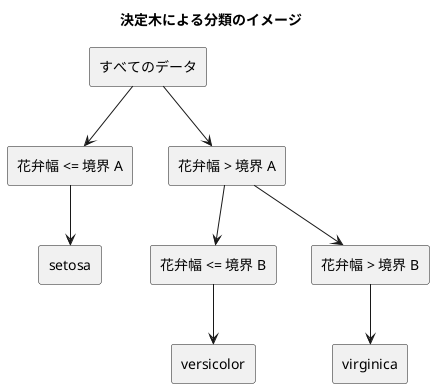

# 第 3 章: 決定木による分類と明白な実装

## 3.1 はじめに

第 1 章では「20 代ならきのこ派」というルールを人間が書き、第 2 章では欠損値を補完した特徴量を用意しました。この章では、「どの特徴量のどこで区切るか」をデータから自動で探すアルゴリズム、**決定木** を自作します。

ほかの言語版は、ここで自作したあとに機械学習ライブラリの決定木と突き合わせます。Java 版・Scala 版・Clojure 版は Tribuo の CART と、Python 版は scikit-learn と。**Elixir 版には、突き合わせる相手がいません。**

**Scholar には決定木がありません。** ランダムフォレストもありません（[ADR 012](../../../adr/012-elixir-ml-libraries.md)）。Scholar は線形回帰・ロジスティック回帰・K-means・主成分分析・評価指標・前処理を持っていますが、本シリーズの背骨である決定木が丸ごと欠けています。

これは Elixir の機械学習の生態系の現状であり、隠さずに正面から扱います。結果として、**この章で作る木がそのまま最終実装になります**。第 8 章でも第 10 章でも、決定木が要る場面ではここで書いたコードを呼びます。「ライブラリが育っていない領域では、自作がそのまま本番の実装になる」——この章はその実例です。

そして、突き合わせる相手がいないぶん、**数値の正しさは自分で保証しなければなりません**。第 2 章で乱数をそろえたおかげで、Java 版・Scala 版・Clojure 版の記事に載っている正解率と木の境界が、そのまま期待値として使えます。ライブラリの代わりに、**ほかの言語版の記事が突き合わせの相手になります**。

Elixir 版では、次の 3 点に注目してください。

- 木を表す **判別共用体が無い**。葉も節もマップにして、鍵があるかどうかで見分ける。Scala 3 の `enum`・Rust の `enum` が与えてくれた**網羅性の検査は手に入りません**
- **パターンマッチの関数節で葉と節を見分ける**。`if` を書かずに済むのが、Clojure 版（`leaf?` で分岐）との違い
- **同点のときにどちらを選ぶかが、標準の関数と最初から噛み合う**。`Enum.max_by/2`・`Enum.min_by/2` は同値なら先のものを返し、`Enum.sort_by/2` は安定。Clojure 版が `max-key` のために書き直しを迫られたところが、Elixir では素直に書ける

## 3.2 決定木の仕組み

### データを 2 つに分けることを繰り返す

決定木は、データを「ある特徴量がある値以下か、より大きいか」で 2 つに分けることを繰り返します。分けた先で同じラベルばかりになったら、そこで分けるのをやめて、そのラベルを予測に使います。



### どこで分けるかをジニ不純度で決める

「よい分け方」とは、分けた後のそれぞれのグループで、ラベルがなるべく 1 種類にそろう分け方です。そろい具合を数値にしたものが **ジニ不純度** です。

ジニ不純度 = 1 − Σ（各ラベルの割合）²

| グループのラベル | 割合 | ジニ不純度 |
|----------------|------|-----------|
| setosa ×3 | setosa 1.0 | 1 − 1.0² = 0 |
| setosa ×1、virginica ×1 | 0.5、0.5 | 1 − (0.5² + 0.5²) = 0.5 |
| 3 品種 ×1 ずつ | 1/3 ずつ | 1 − 3 × (1/3)² = 2/3 |

ラベルが 1 種類にそろうと 0、混ざるほど大きくなります。分け方の候補ごとに、分けた後の左右のジニ不純度を件数で重み付けして平均し、最も小さくなる分け方を選びます。

## 3.3 TODO リストの作成

**TODO リスト**:

- [ ] ジニ不純度を計算する
- [ ] いちばん多いラベルを返す
  - [ ] 同数なら先に現れたラベルを返す
- [ ] 最良の分割を探す
  - [ ] ラベルを完全に分けられる境界を見つける
  - [ ] 複数の特徴量から最良の特徴量と境界を選ぶ
  - [ ] ラベルが 1 種類なら分割しない
- [ ] 決定木を学習して予測する
- [ ] 木の深さを制限する
- [ ] 学習した木を読める形で表示する
- [ ] 実データで深さと正解率の関係を表示する

Clojure 版の TODO リストにあった「ライブラリの決定木と突き合わせる」が、Elixir 版にはありません。**代わりに、実データの正解率を Java 版・Scala 版・Clojure 版の記事の数値と突き合わせます。**

## 3.4 ジニ不純度を計算する

### 仮実装から始める

ラベルが 1 種類ならジニ不純度は 0 です。

```elixir
test "ラベルが一種類なら零になる" do
  assert C.gini(["a", "a", "a"]) == 0.0
end
```

`C.gini/1` がまだ無いので落ちます（Red）。Elixir は動的型付けですが、**存在しない関数の呼び出しはコンパイル時に警告になります**（`mix.exs` で `warnings_as_errors: true` にしているので、エラーとして止まります）。Red の見え方が Python 版・Ruby 版の実行時エラーとは少し違うところです。

仮実装で `0.0` を返して Green にします。

### 三角測量

2 種類が半分ずつ、そして空のリストを足します。

```elixir
test "二種類が半々なら零点五になる" do
  assert C.gini(["a", "a", "b", "b"]) == 0.5
end

test "空なら零になる" do
  assert C.gini([]) == 0.0
end
```

**`==` で厳密に比べています。** 第 2 章では `assert_in_delta` を使ったのに、ここでは使っていません。`0.5` も `0.0` も 2 進数で正確に表せる値だからです。期待値が正確に表せるかどうかで使い分けています。

「空なら 0」は、後で `best_split/3` から空のグループが渡りうるので置いています。ゼロ除算で `ArithmeticError` になるのを避けるためです。

### Green: 明白な実装

```elixir
@doc "ジニ不純度。ラベルが 1 種類なら 0 で、種類が多く均等なほど大きい。"
def gini([]), do: 0.0

def gini(labels) do
  total = length(labels)

  1.0 -
    (labels
     |> Enum.frequencies()
     |> Enum.map(fn {_label, n} -> n / total * (n / total) end)
     |> Enum.sum())
end
```

**空のリストの場合を、関数節のパターンで分けています。** `def gini([]), do: 0.0` と書くだけで、空のリストが来たときはこちらが呼ばれます。関数の中に `if labels == [] do ... end` を書く必要がありません。**場合分けが関数の頭に出る**のが、Elixir でいちばん頻繁に使う道具です。

順序は重要です。`def gini([])` を後ろに書くと、`def gini(labels)` のほうが先に一致してしまい、空のリストでもそちらが呼ばれます（そしてゼロ除算になります）。**関数節は上から順に試される**ので、特殊な場合を先に書きます。

`Enum.frequencies/1` が、ラベルごとの件数を数えます。`Enum.frequencies(["a", "b", "a"])` が `%{"a" => 2, "b" => 1}` になる標準の関数で、Scala 版が `foldLeft` と `ListMap` で 6 行かけて書いたところが 1 語です。Clojure の `frequencies` と同じ名前・同じ働きです。

`fn {_label, n} -> ... end` の引数に注目してください。マップを `Enum.map` でたどると `{鍵, 値}` のタプルが順に渡るので、**引数の位置でパターンマッチして**値だけを取り出しています。`_label` の先頭のアンダースコアは「使わない」の印で、これを付けないとコンパイラが未使用変数を警告します。

`n / total` を 2 回書いているのは、Elixir の `/` が**常に浮動小数点の除算である**ためです。整数どうしでも `4 / 2` は `2.0` を返します。Clojure が `(/ 2 3)` で有理数 `2/3` を返し、`(double n)` を明示的に書く必要があったのとはちょうど逆で、**Elixir では浮動小数点への変換を忘れようがありません**。整数除算が欲しいときは `div/2` を明示的に呼びます。「既定がどちらか」が言語ごとに違い、Elixir の既定はこの場面では都合がよい側でした。

## 3.5 いちばん多いラベルを返す

葉に置くラベルは、そこに残ったデータの多数決で決めます。

```elixir
test "いちばん多いラベルを返す" do
  assert C.majority(["a", "b", "b"]) == "b"
end

test "同数なら先に現れたほうを選ぶ" do
  assert C.majority(["b", "a"]) == "b"
  assert C.majority(["a", "b"]) == "a"
end
```

2 つめが肝心です。**同数のときにどちらを選ぶかは、決めておかないと結果が揺れます。** Java 版・Scala 版・Clojure 版は「先に現れたほう」と決めたので、そろえます。

同数のテストを 2 本（`["b", "a"]` と `["a", "b"]`）書いているのは、**「たまたま b が返る」実装を弾くため**です。1 本だけなら「常に先頭を返す」でも「常に辞書順で後ろを返す」でも通ってしまいます。2 本並べると、「先に現れたほう」という規則だけが両方を満たします。三角測量です。

### `Enum.max_by/2` は同値なら先のものを返す

Clojure 版はここで苦労しました。`max-key` が同値のとき**後ろ**を返すので、「最初の最大値を返す」つもりで書くと取り違えます。Clojure 版は `max-key` を諦めて、厳密な `>` で畳む形に書き直しました。

**Elixir では書き直しが要りません。** 確かめました。

```elixir
IO.inspect(Enum.max_by([{:a, 1}, {:b, 1}], fn {_, n} -> n end))
IO.inspect(Enum.min_by([{:a, 1}, {:b, 1}], fn {_, n} -> n end))
```

```text
{:a, 1}
{:a, 1}
```

**`Enum.max_by/2` も `Enum.min_by/2` も、同値なら先のものを返します。** これは文書に書かれた保証で、「同点なら最初に現れたものを返す」と明記されています。Clojure の `max-key` とちょうど逆です。

| 関数 | 同値のとき | |
|------|----------|---|
| Clojure の `max-key` | **後ろ**を返す | 書き直しが要った |
| Clojure の `min-key` | 前を返す | |
| **Elixir の `Enum.max_by/2`** | **先のものを返す** | **そのまま使える** |
| **Elixir の `Enum.min_by/2`** | **先のものを返す** | **そのまま使える** |
| Scala の `maxBy` | 最初を返す | |

「同じことをする関数が、言語ごとに同点のときの振る舞いが違う」——これは**文書を読むか実測するかでしか分からない**部分です。同じ名前だから同じだろう、と思い込むと 1 件だけ予測が食い違い、原因を探すのに何時間もかかります。

### `Enum.frequencies/1` の戻り値は順を保たない

もう 1 つの落とし穴は、第 2 章と同じです。`Enum.frequencies/1` が返すのはマップなので、**キーの順は保証されません**。3 品種なら挿入順に見えますが、ラベルの種類が増えれば崩れます。

### Green: たどる順を自分で決める

```elixir
@doc """
いちばん多いラベルを返す。同数なら先に現れたほうを選ぶ。

`Enum.frequencies/1` が返すマップは順を保たないので、最初に現れた順
（`Enum.uniq/1`）でたどる。`Enum.max_by/2` は同値なら先のものを返すので、
ここでは Clojure の `max-key`（同値なら後ろ）と逆の心配をしなくてよい。
"""
def majority(labels) do
  counts = Enum.frequencies(labels)
  labels |> Enum.uniq() |> Enum.max_by(&counts[&1])
end
```

2 行です。Clojure 版が `reduce` と厳密な `>` で書いたところが、`Enum.max_by/2` にそのまま任せられました。

- **たどる順は `Enum.uniq/1`** — 元の並びのまま重複を落とすので、「先に現れた順」がそのまま得られます。`Enum.frequencies/1` の結果は件数を引く辞書としてだけ使います
- **選び方は `Enum.max_by/2`** — 同値なら先のもの。たどる順が「先に現れた順」なので、これで「同数なら先に現れたほう」になります

`counts[&1]` の `[]` はマップからの取り出しで、`&counts[&1]` はキャプチャ記法です。`fn label -> counts[label] end` と同じ意味になります。

ドキュメントに理由を 3 行書いたのは、**この関数が「なぜこう書いてあるか」でできている**からです。`Enum.uniq/1` を挟んでいる理由も、`Enum.max_by/2` をそのまま使ってよい理由も、コードからは読めません。**Clojure 版と読み比べたときに「なぜ向こうは書き直したのに、こちらはそのままなのか」が分かる**ように、ここに残しました。

## 3.6 最良の分割を探す

### 分割をマップで表す

分割は「どの列の、どの値で区切るか、そのときの不純度はいくつか」の 3 つ組です。

```elixir
%{feature: :花弁幅, threshold: 0.75, impurity: 0.0}
```

Scala 版は `case class Split(feature, threshold, impurity)` を宣言しました。Elixir 版はここもマップです。

### テスト

```elixir
defp x, do: [%{値: 1.0}, %{値: 2.0}, %{値: 3.0}, %{値: 4.0}]
defp t, do: ["a", "a", "b", "b"]
defp columns, do: [:値]

test "分けられる境界を見つける" do
  split = C.best_split(x(), t(), columns())
  assert split.feature == :値
  assert split.threshold == 2.5
  assert split.impurity == 0.0
end

test "ラベルが一種類なら分けない" do
  assert C.best_split(x(), ["a", "a", "a", "a"], columns()) == nil
end

test "データが無ければ分けない" do
  assert C.best_split([], [], columns()) == nil
end

test "同じ値ばかりなら分けない" do
  assert C.best_split([%{値: 1.0}, %{値: 1.0}], ["a", "b"], columns()) == nil
end
```

フィクスチャは「1.0・2.0 が `a`、3.0・4.0 が `b`」の 4 件です。**2.0 と 3.0 の中点 2.5 で切れば完全に分かれる**ので、不純度は 0.0 になります。

**フィクスチャを `defp x, do: [...]` という 1 行の私有関数にしました。** 型を宣言していないので、マップのリテラルを並べるだけでデータになります。`setup` ブロックもモジュール属性も要りません。

「分けられないときは `nil`」もここで決めています。Scala 版は `Option[Split]` の `None`、Rust 版は `Option`。Elixir は第 2 章と同じく `nil` です。「分けられない」の理由が 3 通り（データが空・ラベルが 1 種類・同じ値ばかり）あることを、3 本のテストで固定しました。**呼ぶ側は理由を区別せず、`nil` かどうかだけを見ればよい**という設計を、テストで表明しています。

### Green: 候補を列挙して選ぶ

分割の探索は、2 つの関数に分けました。

```elixir
# 1 つの列で、隣り合う値の中点を境界にした分割の候補をすべて返す。
# Enum.sort_by は安定なので、同じ値の並びは元の順のまま。
defp candidates(x, t, feature) do
  sorted = x |> Enum.map(&Map.fetch!(&1, feature)) |> Enum.zip(t) |> Enum.sort_by(&elem(&1, 0))
  values = Enum.map(sorted, &elem(&1, 0))
  labels = Enum.map(sorted, &elem(&1, 1))

  1..(length(sorted) - 1)//1
  |> Enum.filter(fn i -> Enum.at(values, i - 1) != Enum.at(values, i) end)
  |> Enum.map(fn i ->
    {left, right} = Enum.split(labels, i)

    %{
      feature: feature,
      threshold: (Enum.at(values, i - 1) + Enum.at(values, i)) / 2.0,
      impurity: weighted_gini(left, right)
    }
  end)
end

defp weighted_gini(left, right) do
  (length(left) * gini(left) + length(right) * gini(right)) / (length(left) + length(right))
end
```

`candidates/3` に、第 2 章までの道具が集まっています。

- **`Map.fetch!/2`** — 第 2 章の `Map.fetch/2` の「無ければ例外」版です。列が無ければ `KeyError` で落ちます。`Map.get/2` なら `nil` が返って比較演算で妙なことになるので、ここでも「黙って通る」経路を塞いでいます
- **`Enum.zip(t)`** — パイプラインの中で値とラベルを組にします。第 2 章の分割と同じ形です
- **`Enum.sort_by(&elem(&1, 0))`** — 値で並べ替えます。**`Enum.sort_by/2` は安定**（同じ値の要素の相対順が変わらない）で、これは文書で保証されています。同じ値の行の並びは元のままなので、`majority/1` の「先に現れたほう」と合わせて、**同点のときの振る舞いが決まります**
- **`1..(length(sorted) - 1)//1`** — 1 から `n-1` までの範囲です。`//1` の刻み幅を明示しているのは、`sorted` が 1 件のときに `1..0` という逆向きの範囲になり、刻み幅が無いと警告が出るためです。第 2 章の `last..1//-1` と対になる書き方で、**Elixir では範囲の向きを明示する**習慣が身に付きます
- **`Enum.filter` + `Enum.map`** — 隣り合う値が同じなら境界を作れないので先に落とし、残ったものだけを候補にします。Clojure 版が `keep` + `when-not` で 1 手にまとめたところが、Elixir では 2 手に分かれます。そのぶん「何を落として何を作るか」が読めます
- **`Enum.split(labels, i)`** — i 番目で左右に分けます

```elixir
@doc """
左右の不純度の重み付き平均が最も小さくなる分割を返す。分けられなければ `nil`。

同じ不純度なら先に見つけた（列の順で前の）分割を選ぶ。
"""
def best_split([], _t, _columns), do: nil

def best_split(x, t, columns) do
  if gini(t) == 0.0 do
    nil
  else
    case Enum.flat_map(columns, &candidates(x, t, &1)) do
      [] -> nil
      all -> Enum.min_by(all, & &1.impurity)
    end
  end
end
```

**「データが空」の場合を、また関数節のパターンで分けました。** `def best_split([], _t, _columns), do: nil` の 1 行です。`gini/1` のときと同じ形で、**特殊な場合を関数の頭に追い出す**のが Elixir の定型になっています。

`Enum.flat_map/2` が、列ごとの候補を 1 本につなぎます。`columns` の順にたどるので、**先に来るのは列の順で前の特徴量の候補**です。そして `Enum.min_by/2` は同値なら先のものを返すので、同じ不純度なら列の順で前の分割が選ばれます。**`majority/1` とまったく同じ理由で、標準の関数にそのまま任せられました。**

`case ... do [] -> ...; all -> ... end` で、候補が空のときと空でないときを分けています。`if Enum.empty?(all)` と書いてもよいのですが、**`case` にするとリストの形そのもので分岐している**ことが見えます。

### 期待値は 2.5 だが、実データの境界は 0.2950

`assert split.threshold == 2.5` と厳密に比べられるのは、`(2.0 + 3.0) / 2.0` が 2 進数で正確に表せるからです。**実データの境界（0.2950）は正確には表せません。** そちらは実データのテストで正解率として確かめます。「期待値が正確に表せるかどうか」で比較の仕方を選び分けるのは、第 1 章から続く方針です。

## 3.7 決定木を学習して予測する

### 木をどう表すか

ここが Elixir でいちばん悩むところです。決定木は「葉か、節か」のどちらかで、ほかの形は無い——という構造を、Elixir では**表せません**。

| 言語 | 木の表し方 | 網羅性の検査 |
|------|-----------|------------|
| Scala 3 | `enum Tree: case Leaf(...); case Node(...)` | `match` をコンパイラが検査（`-Xfatal-warnings` で強制） |
| Rust | `enum Tree { Leaf(...), Node(...) }` | `match` をコンパイラが検査（必須） |
| Java | sealed interface + 2 つの record | `switch` 式をコンパイラが検査 |
| Clojure | マップ 2 種 | 無い |
| **Elixir** | **マップ 2 種（`%{label: ...}` と `%{split: ..., left: ..., right: ...}`）** | **無い** |

選んだ形はこうです。

```elixir
@moduledoc """
第 3 章: 決定木による分類。

Scholar には決定木がないので、ここで作る木がそのまま最終実装になる。
木は葉か節のどちらかで、どちらもマップで表す。葉は `%{label: "setosa"}`、
節は `%{split: ..., left: ..., right: ...}`。Elixir には判別共用体が無いので、
鍵があるかどうかで見分ける（網羅性は検査されない）。
"""

@doc "葉かどうかを返す。"
def leaf?(tree), do: is_map_key(tree, :label)

@doc "節かどうかを返す。"
def node?(tree), do: is_map_key(tree, :split)
```

**`:label` があれば葉、`:split` があれば節**という取り決めです。`is_map_key/2` はガード節でも使える組み込み関数で、`Map.has_key?/2` と同じ判定をします。構造体（`defstruct`）で 2 つの型を作る手もありますが、その場合も「2 つしか無い」ことは検査されないので、得るものは型名だけです。素のマップのままにして、**見分ける述語に名前を付ける**ほうを選びました。

失うものははっきりしています。

- **場合分けを書き忘れても、コンパイラは何も言いません。** Scala 版は `case` を 1 つ消すと `match may not be exhaustive` が出ます。Elixir では、関数節を 1 つ消すと `FunctionClauseError` が**実行時に**出ます。落ちてはくれますが、それはテストを走らせたときです
- **第 3 の形が混ざっても気づけません。** `%{label: "x", split: ...}` のようなマップを作ってしまっても、`leaf?/1` が真になるだけです

得るものもあります。**木がただのデータなので、`==` でそのまま比べられ、`IO.inspect` でそのまま読め、`%{tree | ...}` で一部を差し替えられます。** 後で出てくる `format_tree/2` のテストが、木を組み立て直さずに書けているのはそのおかげです。

### 学習

```elixir
@doc "深さの上限まで分割を繰り返して木を作る。`max_depth` が `nil` なら上限なし。"
def fit(x, t, columns, max_depth) do
  split = if max_depth == 0, do: nil, else: best_split(x, t, columns)

  if is_nil(split) do
    %{label: majority(t)}
  else
    {left, right} = Enum.split_with(Enum.zip(x, t), &goes_left?(split, elem(&1, 0)))
    next_depth = if max_depth, do: max_depth - 1

    %{
      split: split,
      left:
        fit(Enum.map(left, &elem(&1, 0)), Enum.map(left, &elem(&1, 1)), columns, next_depth),
      right:
        fit(Enum.map(right, &elem(&1, 0)), Enum.map(right, &elem(&1, 1)), columns, next_depth)
    }
  end
end

defp goes_left?(split, features), do: Map.fetch!(features, split.feature) <= split.threshold
```

**「分割が見つからなければ葉」が、すべての終了条件をまとめています。** ラベルが 1 種類でも、深さの上限に達しても、分けられる境界が無くても、`split` は `nil` になります。`best_split/3` が 3 つの場合をすべて `nil` に写しているので、`fit/4` 側の場合分けは 1 つで済みました。

**`Enum.split_with/2` が、左右への振り分けを 1 手でやります。** 述語が真の要素と偽の要素に分けて、`{真のリスト, 偽のリスト}` を返します。Clojure 版が `filter` と `remove` を 2 行に分けて書いた（そして「読みやすさのため」と理由を付けた）ところが、Elixir では標準の関数 1 つです。**「分ける」という操作そのものに名前が付いている**ので、2 回たどることもありません。

`next_depth = if max_depth, do: max_depth - 1` の `else` が無いところに注目してください。**Elixir の `if` は、`else` が無く条件が偽なら `nil` を返します。** つまり「上限があれば 1 減らす、なければ `nil` のまま」が片側だけの式で書けます。Clojure 版の `(when max-depth (dec max-depth))` と同じ形で、**`nil` を「無い」の自然な表現にしている言語に共通する省き方**です。

`max_depth == 0` の判定は `if` で書いています。ここは `fit(x, t, columns, 0)` という関数節にもできますが、そうすると「深さ 0 のときだけ葉を作る」という重複した処理が要ります。`split` を `nil` にして下の分岐に合流させるほうが、終了条件が 1 か所にまとまります。

### 予測

```elixir
@doc "木をたどって 1 件のラベルを予測する。"
def predict_one(%{label: label}, _features), do: label

def predict_one(%{split: split, left: left, right: right}, features) do
  if goes_left?(split, features) do
    predict_one(left, features)
  else
    predict_one(right, features)
  end
end

@doc "特徴量ごとのラベルを予測する。"
def predict(tree, x), do: Enum.map(x, &predict_one(tree, &1))
```

**ここが、この章でいちばん Elixir らしい部分です。**

葉と節を、**2 つの関数節のパターンで見分けています**。`%{label: label}` というパターンは「`:label` という鍵を持つマップ」に一致し、同時にその値を `label` に束縛します。`%{split: split, left: left, right: right}` は「`:split`・`:left`・`:right` を持つマップ」に一致し、3 つの値を一度に取り出します。

**`leaf?/1` を呼ぶ `if` が、1 つも要りません。**

```clojure
;; Clojure 版: leaf? で分岐する
(if (leaf? tree)
  (:label tree)
  (recur (if (goes-left? (:split tree) features) (:left tree) (:right tree)) features))
```

```elixir
# Elixir 版: パターンで分かれる
def predict_one(%{label: label}, _features), do: label
def predict_one(%{split: split, left: left, right: right}, features), do: ...
```

Clojure 版は「葉かどうかを判定してから、葉なら `:label` を取り出す」と 2 段階で書きました。Elixir 版は「葉の形に一致したら、その中の `label` はこれ」と 1 段階です。**判定と取り出しが同じ場所で起きる**のが、パターンマッチの値打ちです。

`leaf?/1`・`node?/1` は残してありますが、使うのはテストの中だけになりました。木の走査そのものにはパターンで足ります。

再帰が末尾呼び出しなので、Erlang VM の最適化が効いてスタックは伸びません。Clojure が `recur` という専用の形を書かなければならなかった（JVM に末尾呼び出し最適化が無いため）ところが、Elixir では普通の再帰のままです。そのかわり、**「ここは末尾だ」という保証はコンパイラから得られません**。`recur` は末尾でない位置に書くとコンパイルエラーになるので、あちらは誤りを静的に防げていました。ここも取引です。

```elixir
test "深さ一で葉と節ができる" do
  tree = C.fit(x(), t(), columns(), 1)
  assert C.node?(tree)
  assert C.leaf?(tree.left)
  assert C.leaf?(tree.right)
  assert tree.left.label == "a"
  assert tree.right.label == "b"
end

test "深さ零なら葉だけになる" do
  tree = C.fit(x(), t(), columns(), 0)
  assert C.leaf?(tree)
  assert tree.label == "a"
end

test "深さの上限が無ければ分けられるだけ分ける" do
  tree = C.fit(x(), t(), columns(), nil)
  assert C.predict(tree, x()) == t()
end
```

**`tree.left.label` と、部分木をそのまま辿れます。** 木がただのデータであることの見返りで、アクセサも訪問者パターンも要りません。

「深さ零なら葉だけになる」で `tree.label == "a"` を確かめているのが、`majority/1` の「同数なら先に現れたほう」の効いている場所です。ラベルは `["a", "a", "b", "b"]` で `a` と `b` が 2 件ずつ、同数です。**先に現れた `a` が返ることを、木のテストからも押さえています。**

```elixir
test "境界そのものは左へ進む" do
  tree = C.fit(x(), t(), columns(), 1)
  assert C.predict_one(tree, %{値: 2.5}) == "a"
end
```

境界ちょうどの値がどちらへ行くかを固定しました。`goes_left?/2` が `<=` なので左です。**境界の扱いは「どちらでもよい」ように見えて、決めておかないと言語版ごとにずれます。** 1 行で押さえておく価値があります。

## 3.8 学習した木を表示する

```elixir
@doc "木を字下げ付きの文字列にする。"
def format_tree(tree, indent \\ "")

def format_tree(%{label: label}, indent), do: "#{indent}#{label}\n"

def format_tree(%{split: split, left: left, right: right}, indent) do
  border = format_number(split.threshold)

  "#{indent}#{split.feature} <= #{border}\n" <>
    format_tree(left, indent <> "  ") <>
    "#{indent}#{split.feature} > #{border}\n" <>
    format_tree(right, indent <> "  ")
end
```

`predict_one/2` と**まったく同じ形**です。葉の節と節の節が、パターンで分かれます。木を扱う関数がどれも同じ骨格になるので、1 つ読めれば残りも読めます。

`def format_tree(tree, indent \\ "")` という本体の無い宣言が、**既定引数の置き場**です。関数節が複数あるときは、既定引数を宣言だけの行にまとめて書かなければなりません（各節に書くとコンパイルエラーになります）。Clojure 版が多アリティで書いたところに当たります。

```elixir
test "字下げ付きの文字列にする" do
  tree = C.fit(x(), t(), columns(), 1)

  assert C.format_tree(tree) == """
         値 <= 2.5000
           a
         値 > 2.5000
           b
         """
end
```

**期待値をヒアドキュメント（`"""`）で書いています。** 出てくるものをそのまま並べられるので、変化に気づけます。Elixir のヒアドキュメントは**終了の `"""` の字下げの分だけ、各行の先頭から空白を取り除きます**。上の例では終了の `"""` が 9 桁目にあるので、`値 <= 2.5000` は字下げ無し、`  a` は空白 2 つ、として読まれます。テストの中で自然にインデントしたまま、期待値には余計な空白が入りません。

### `:io_lib.format` はロケールに依らない

小数の書式に、Elixir の標準ライブラリではなく Erlang の関数を使っています。

```elixir
# :io_lib.format はロケールに依らないので、小数点は常に「.」になる。
defp format_number(value), do: ~c"~.4f" |> :io_lib.format([value]) |> to_string()
```

`~c"~.4f"` の `~c` シギルは**文字リスト**（charlist）のリテラルです。Erlang の関数は文字列を文字リストで受け取るので、Elixir のバイナリ文字列（`"..."`）ではなくこちらを渡します。`:io_lib.format/2` の戻り値も文字リストの入れ子（iolist）なので、`to_string/1` で Elixir の文字列に戻します。**Erlang の関数を呼ぶときは、入口と出口で文字列の表現を変換する**というのが、Elixir と Erlang の境界の作法です。

`~.4f` は「小数点以下 4 桁」の書式指定で、Erlang の書式文字列は C の `printf` とは記法が違います（`%` ではなく `~`）。

肝心なのは、**`:io_lib.format` がロケールに依らないこと**です。小数点は常に `.` になり、ドイツ語圏の環境で `,` になることはありません。

これは Clojure 版との対比になります。Clojure 版は `clojure.core/format` を使っていて、これは `String.format` をロケール無しで呼ぶため、**環境によっては出力が変わりえます**。Clojure 版の記事はこれを「移植性を重んじるなら `Locale/ROOT` を明示すべきところ」と既知の制限として書いています（[ADR 011](../../../adr/011-clojure-ml-libraries.md)）。

**Erlang の書式関数にはロケールという概念がそもそもありません。** BEAM は分散システムのために作られた処理系で、「同じ入力から同じバイト列が出る」ことが前提にされています。その設計思想が、ここでは「環境によって出力が変わらない」という形で利いています。**何も明示しなくても移植性が保たれる**、数少ない場面です。

## 3.9 実データで深さと正解率を表示する

### 突き合わせる相手がいない

ここでほかの言語版なら、ライブラリの決定木と予測を突き合わせます。**Scholar には決定木がないので、できません。**

代わりに何をするか。**ほかの言語版の記事に載っている数値を期待値にします。**

第 2 章で乱数をそろえたので、訓練データに入る 105 行は Java 版・Scala 版・Clojure 版と同じです。同じデータに同じアルゴリズムを当てれば、同じ正解率と同じ境界が出るはずです。出なければ、どちらかの実装が間違っています。

```elixir
@tag :data
test "深さごとの正解率がほかの言語版と一致する" do
  split =
    GettingStartedMl.Chapter02.prepare_iris(
      Path.join(GettingStartedMl.Dataset.dir(), "iris.csv"),
      0.3,
      0
    )

  tree = C.fit(split.x_train, split.t_train, C.feature_columns(), 2)

  assert_in_delta GettingStartedMl.Chapter01.accuracy(
                    C.predict(tree, split.x_test),
                    split.t_test
                  ),
                  0.9556,
                  0.0001
end
```

深さ 2 のテストデータの正解率が `0.9556`。**Java 版・Scala 版・Clojure 版の記事と同じ値です。**

正解率の計算に、第 1 章の `Chapter01.accuracy/2` をそのまま使っています。第 1 章はきのこ派・たけのこ派、この章はアヤメの品種ですが、**「予測と正解のリストを受け取って一致率を返す」という形は同じ**なので、型を宣言していないぶん、そのまま再利用できます。

### 列の順を関数として持つ

```elixir
@doc "アヤメのデータの特徴量の列。正解ラベルの列を除いた順。"
def feature_columns, do: [:がく片長さ, :がく片幅, :花弁長さ, :花弁幅]
```

**列の順を、リテラルのリストとして持っています。** Clojure 版はここで `(vec (keys (first (:x-train split))))` と、補完済みの特徴量のマップの鍵を並べていました。「4 列なので偶然に挿入順で出ている」ことを自覚しつつ、「列が 9 つ以上になれば崩れる」と但し書きを付けて残していた箇所です。

Elixir 版はその道を選びません。第 2 章で見たとおりマップの順は保証されないので、**列の順が要る場所では最初から順を明示します**。分割の選び方が「同じ不純度なら列の順で前」である以上、**列の順は結果を左右する仕様**であって、たまたまの副産物にしてはいけません。

### 深さごとの正解率を表示する

```elixir
@max_depths [1, 2, 3, 4, 5, nil]

@doc "深さごとの正解率と、深さ 2 の決定木を表示する。"
def run do
  split = Chapter02.prepare_iris(Path.join(Dataset.dir(), "iris.csv"), 0.3, 0)
  columns = feature_columns()

  IO.puts("深さ\t訓練データ\tテストデータ")

  for max_depth <- @max_depths do
    IO.puts(accuracy_row(max_depth, split, columns))
  end

  IO.puts("")
  IO.puts("深さ 2 の決定木:")
  IO.write(format_tree(fit(split.x_train, split.t_train, columns, 2)))
end

defp accuracy_row(max_depth, split, columns) do
  tree = fit(split.x_train, split.t_train, columns, max_depth)

  Enum.join(
    [
      max_depth || "制限なし",
      score(predict(tree, split.x_train), split.t_train),
      score(predict(tree, split.x_test), split.t_test)
    ],
    "\t"
  )
end

defp score(predictions, labels) do
  format_number(Chapter01.accuracy(predictions, labels))
end
```

`max_depth || "制限なし"` が効いています。**深さの並び `[1, 2, 3, 4, 5, nil]` に「制限なし」を混ぜたまま**、表示のときだけ文字列に差し替えられます。`nil` が値として自由に混ざる言語ならではの短さです。第 2 章の `fill_missing/3` では `||` が落とし穴になりましたが、ここでは右側が `nil` になりようがないので安全です。**同じ演算子が、右側に何を置くかで危なくもなり便利にもなります。**

`Enum.join/2` に整数と文字列が混ざったリストを渡していますが、これは通ります。`Enum.join/2` が各要素に `to_string/1` を当てるためです。

実行します。

```text
$ mix run -e "GettingStartedMl.Chapter03.run()"
深さ	訓練データ	テストデータ
1	0.6762	0.6444
2	0.9333	0.9556
3	0.9524	0.9556
4	0.9619	0.9556
5	0.9810	0.9333
制限なし	1.0000	0.9333

深さ 2 の決定木:
花弁幅 <= 0.2950
  Iris-setosa
花弁幅 > 0.2950
  花弁幅 <= 0.6500
    Iris-versicolor
  花弁幅 > 0.6500
    Iris-virginica
```

**この表は Java 版・Scala 版・Clojure 版とまったく同じ数値です。** 深さ 2 の木の境界（0.2950・0.6500）まで一致しました。

ライブラリの決定木と突き合わせられなくても、**ほかの言語版の自作の決定木と突き合わせられました**。第 2 章で乱数をそろえた効果が、章をまたいで確かめられたことになります。突き合わせの相手がライブラリでなくなっただけで、**「別々に書かれた実装が同じ数値を出す」という保証の形は変わりません**。

表そのものも読みどころです。

- **深さ 1 では 0.6444** — 1 回しか分けられないので、3 品種を 2 つにしか分けられません
- **深さ 2 で 0.9556** — 花弁幅だけを 2 回使って、3 品種をほぼ分け切っています
- **訓練データの正解率は深さとともに上がり続け、制限なしで 1.0000** — 訓練データを完全に覚えました
- **テストデータの正解率は深さ 5 から下がる（0.9556 → 0.9333）** — これが **過学習** です。訓練データに合わせすぎて、見ていないデータに弱くなりました

「訓練データで 100% 当たる」ことが良いことではない、というのがこの表の教えです。第 1 章で「学習に使ったデータで性能を測ってはいけない」と書いた理由が、数字として出ています。

木の中身も読めます。**花弁幅だけで 3 品種がほぼ分かれています。** 0.2950 以下なら `Iris-setosa`、0.6500 より大きければ `Iris-virginica`。これは第 2 章の散布図で人が見つけられる傾向と同じで、**決定木はそれを自動で見つけた**ことになります。境界の値（0.2950・0.6500）が生の測定値に見えないのは、iris.csv の値が 0〜1 に収まる形で配布されているためです。

テストを走らせます。

```text
$ mix test --include data
49 tests, 0 failures
```

（第 1 章・第 2 章のテストも含めた数です。）

## 3.10 自作が最終実装になるということ

この章の決定木は、第 8 章・第 10 章でもそのまま使われます。ほかの言語版が「第 3 章で自作したものを、第 8 章以降はライブラリに置き換える」と進むところを、Elixir 版は**自作のまま進みます**。

これが良いことなのか悪いことなのかは、両面あります。

**悪い面**は素直です。ライブラリの決定木は、枝刈り・欠損値の扱い・カテゴリ変数の扱い・並列化など、この章では書かない工夫を積んでいます。実務で大きなデータを扱うなら、自作の木では足りません。Elixir で決定木が要る仕事をするなら、この現状は素直に不利です。

**良い面**は、この章を書いた側から見えます。ライブラリに置き換える前提だと、自作のコードは「ライブラリを理解するための踏み台」になりがちです。突き合わせが済んだら捨てられる、学習用のコードです。Elixir 版の決定木は捨てられません。**捨てられないコードは、捨てられるコードより丁寧に書かれます。** 同点のときの選び方を決めきったのも、境界の扱いをテストで固定したのも、「この先ずっとこれを使う」からです。

そして、**アルゴリズムが自分の手の内にあること**の値打ちがあります。第 2 章の乱数と同じです。ジニ不純度で分割を選ぶ決定木は、この章の 150 行ほどで全部です。ライブラリの中で何が起きているかを想像する必要がありません。境界の値がなぜ 0.2950 なのかを問われたら、`candidates/3` が中点を取っているところまで辿れます。

「ライブラリが育っていない領域では、自作がそのまま本番の実装になる」——これは Elixir の機械学習に限った話ではありません。新しい領域、狭い領域、特殊な要件。そういう場所では、**ライブラリを探すより自分で書くほうが早く、そして結果的に確かである**ことがあります。この章はその練習でもあります。

## 3.11 可視化について

Elixir 版には Livebook の節を設けません。深さと正解率の折れ線グラフは [Kotlin 版の第 3 章](../kotlin/03-decision-tree-and-obvious-implementation.md) の「Notebook で探索する」の節を、scikit-learn による木の図は [Python 版の第 3 章](../python/03-decision-tree-and-obvious-implementation.md) を参照してください。Elixir 版で深さと正解率の関係を見るには、3.9 節の表と `format_tree/2` の出力が同じ役割を果たします。

## 3.12 まとめ

この章では、決定木を自作しました。ライブラリと突き合わせる代わりに、ほかの言語版の数値と突き合わせました。Elixir に固有の論点は次のとおりです。

1. **Scholar に決定木が無いので、自作が最終実装になる** — ランダムフォレストもない。ほかのどの言語版よりも置き換えの範囲が狭い（[ADR 012](../../../adr/012-elixir-ml-libraries.md)）。捨てられないコードは丁寧に書かれる、という別の値打ちがある
2. **判別共用体が無いので、木もマップ** — 葉は `%{label: ...}`、節は `%{split: ..., left: ..., right: ...}`。**網羅性は検査されない**ので、場合分けの漏れは実行時の `FunctionClauseError` まで分からない。見返りは、木がただのデータなので `==` で比べられ、`tree.left.label` で部分木を辿れること
3. **パターンマッチの関数節で葉と節を見分ける** — `predict_one(%{label: label}, _features)` と `predict_one(%{split: ..., left: ..., right: ...}, features)` の 2 節。**判定と取り出しが同じ場所で起きる**ので、`leaf?/1` を呼ぶ `if` が要らない。Clojure 版との書き味の差がいちばん出た部分。`format_tree/2` も同じ骨格
4. **同点のときの選び方が、標準の関数と最初から噛み合う** — `Enum.max_by/2`・`Enum.min_by/2` は同値なら**先のもの**を返す（文書の保証）。Clojure の `max-key`（同値なら後ろ）とちょうど逆なので、Clojure 版が必要とした書き直しが要らなかった。`Enum.sort_by/2` が安定であることと合わせて、「同点なら先に現れたほう」がそのまま書ける
5. **`Enum.split_with/2` で左右に 1 手で振り分ける** — Clojure 版が `filter` と `remove` に分けたところが標準の関数 1 つ。2 回たどることもない
6. **`:io_lib.format` はロケールに依らない** — 小数点は常に `.`。Clojure 版の `clojure.core/format` がロケール依存で既知の制限になっているのと対照的で、**何も明示しなくても移植性が保たれる**。`~c` シギルと `to_string/1` で、Erlang の文字リストとの境界を越える
7. **`/` は常に浮動小数点の除算** — Clojure が `(double n)` を明示的に書く必要があったところが、Elixir では忘れようがない。整数除算が欲しいときだけ `div/2` を書く
8. **Java 版・Scala 版・Clojure 版と完全に一致した** — 深さごとの正解率も、深さ 2 の木の境界（0.2950・0.6500）も同じ。ライブラリと突き合わせられなくても、**別々に書かれた実装が同じ数値を出す**という保証の形は変わらない

**TODO リスト（この章の完了時点）**:

- [x] ジニ不純度を計算する
- [x] いちばん多いラベルを返す
- [x] 最良の分割を探す
- [x] 決定木を学習して予測する
- [x] 木の深さを制限する
- [x] 学習した木を読める形で表示する
- [x] 実データで深さと正解率の関係を表示する

深さ 2 の決定木のテストデータの正解率は 0.9556 で、テストデータの正解率は深さ 5 から下がり始めました。次の章では、ここまでのコードとデータをどう管理するか（バージョン管理とデータ管理）を扱います。
