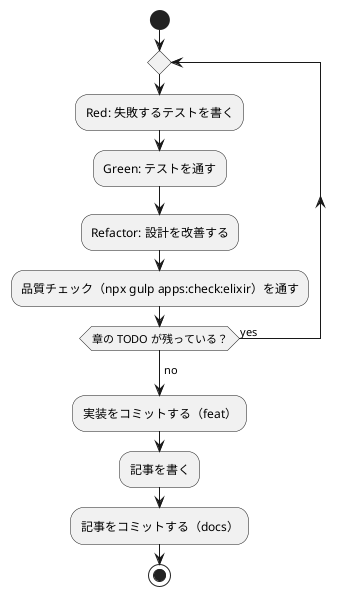

# 第 4 章: バージョン管理とデータ管理

## 4.1 はじめに

第 1 部では、TDD でデータを読み込み、前処理し、決定木で分類するプログラムを Elixir で作りました。第 2 部では、そのプログラムを「変更を楽に安全にできる」状態に保つための道具立てを、バージョン管理（第 4 章）、パッケージ管理と静的解析（第 5 章）、タスクランナーと CI/CD（第 6 章）の順に整えます。

この章ではバージョン管理を扱います。機械学習のプロジェクトでは、コードに加えて **学習データ** と **学習済みモデル** というファイルが登場します。これらをコードと同じようにコミットしてよいとは限りません。この章では、Git で何を管理し、何を管理しないか、そして実験の結果を再現できるようにするには何を固定すればよいかを学びます。

Git の使い方は言語に依存しないので、[Python 版の第 4 章](../python/04-version-control-and-data-management.md)・[Clojure 版の第 4 章](../clojure/04-version-control-and-data-management.md) と同じ構成で進めます。Elixir 版で注目するのは次の 3 点です。

- **Mix が作るファイル** を除外する。`_build/` と `deps/` が、Clojure の `.cpcache/`・sbt の `target/`・Gradle の `build/` に当たります。加えて Erlang VM が異常終了したときに残す `erl_crash.dump` という、ほかの言語版には無いものがあります
- **`mix.lock` はコミットする**。Clojure 版には（`deps.edn` にロックの仕組みが無く）そもそもロックファイルがありませんでしたが、Elixir には Ruby の `Gemfile.lock` に当たるものがあり、これはコミットします
- **ExUnit にはスキップの仕組みがある**。`clojure.test` には無かったものが Elixir にはあり、`@tag :data` と `ExUnit.start(exclude: ...)` の組み合わせで「学習データが無い環境では実データのテストを外す」が素直に書けます

## 4.2 コミットメッセージの重要性

コミット履歴は「なぜこの変更をしたのか」の記録です。機械学習のプロジェクトでは、「前処理を変えたら正解率が変わった」「ライブラリと予測が一致しない原因をテストに残した」といった変化の理由を、あとから追跡できることが特に重要になります。

コミットは次の 2 つを守ると追いやすくなります。

- **1 コミット 1 目的** — 機能追加と設定変更、実装と記事を 1 つのコミットに混ぜない
- **形式をそろえる** — 種類と対象がひと目で分かる書式でメッセージを書く

## 4.3 Conventional Commits

### フォーマット

本シリーズでは [Conventional Commits](https://www.conventionalcommits.org/ja/) の形式でコミットメッセージを書きます。

```text
<type>(<scope>): <subject>

<body>

<footer>
```

`scope` には変更の対象を書きます。本リポジトリでは、言語別の実装なら `elixir`、記事シリーズなら `getting-start-ml`、ADR なら `adr`、CI の定義なら `ci` のように書きます。

### コミットタイプ

| type | 用途 |
|------|------|
| `feat` | 新機能（章の実装など） |
| `fix` | バグ修正 |
| `test` | テストの追加・修正 |
| `refactor` | 振る舞いを変えないコードの変更 |
| `docs` | ドキュメントだけの変更（記事・ADR など） |
| `build` | ビルドの設定や依存関係の変更 |
| `chore` | そのほかの雑務 |
| `ci` | CI の設定の変更 |

### 実践例

本リポジトリの実際のコミット履歴から、Elixir 版の ADR から第 3 章までを抜き出します（古い順）。

```text
e7d6ded6 docs(getting-start-ml): Elixir 版の執筆計画と ADR 012 を追加する
1c02aa21 feat(elixir): Elixir 版の雛形と第 1 章を追加する
e05b86f9 feat(elixir): 第 2 章の前処理と自作の乱数を追加する
4405e30a feat(elixir): 第 3 章の決定木を追加する
9e45bb07 docs(elixir): 第 1 章の記事を追加する
```

`git log --oneline` で見ると、どのコミットが何のための変更かを type と scope だけで区別できます。ライブラリの選定（`docs(getting-start-ml)`）、実装（`feat(elixir)`）、記事（`docs(elixir)`）が分かれているので、たとえば「なぜ Scholar の決定木を使わないのか」を知りたいときは ADR のコミットだけを見れば済みます。

Clojure 版では、Smile を選んだ ADR をあとから Tribuo に差し替えるという「調べて、動かして、やめた」経過が 2 つのコミットに残っていました。Elixir 版の ADR は 1 回で確定していますが、そのかわり ADR そのものの中に **やめたものの一覧**（[ADR 012](../../../adr/012-elixir-ml-libraries.md) の「検討した代替案」）が書いてあります。EXGBoost・Explorer・EXLA・Phoenix・`Nx.Random` を、それぞれなぜ採らなかったかを表にしてあります。

この違いは、Elixir 版では **調べる作業を実装より前にまとめて済ませた** ことから来ています。ADR 012 の「コンテキスト」には、使い捨ての Mix プロジェクトで確かめた 10 項目の表があります。その中に「Scholar に決定木が無い」という、シリーズの背骨に関わる発見がありました。もし確かめずに第 3 章を書き始めていたら、決定木を Scholar に置き換える節を用意したまま行き止まりにぶつかっていたはずです。**調べたことは、採らなかったものも含めてコミットに残します。** コードには残らないからです。

## 4.4 何をコミットし、何をコミットしないか

機械学習のプロジェクトには、コミットしてはいけないファイルが増えます。理由は大きく 3 つあります。

| 分類 | 例 | コミットしない理由 |
|------|-----|------------------|
| 再配布できないもの | 学習データ | ライセンスで利用者が限られている |
| 再生成できるもの | ビルド成果物、依存の展開先、学習済みモデル | 大きく、差分が読めず、コードとデータから作り直せる |
| 秘匿すべきもの | `.env` の認証情報 | 漏洩すると取り返しがつかない |

### 学習データ

本シリーズの学習データは、書籍『スッキリわかる Python による機械学習入門』の配布データです。配布データの利用は書籍購入者に限られており、本リポジトリは公開されているので、データはコミットしません。ルートの `.gitignore` で、データの置き場所 `apps/data/` をまるごと除外しています。この設定は全言語で共通です。

```text
# 依存関係
node_modules/

# 環境変数（暗号化済みの .env.vault とテンプレートの .env.example は管理対象）
.env

# 学習データ（書籍購入者のみ利用可のため再配布しない。docs/article/getting-start-ml/outline.md を参照）
apps/data/

# ビルド成果物・一時ファイル
site/
tmp/
```

### Elixir プロジェクト固有のファイル

`apps/elixir/.gitignore` では、Mix が作るディレクトリ、カバレッジの出力先、学習済みモデルの保存先 `model/`、そして Erlang VM のクラッシュダンプを除外しています。

```text
# Mix のビルドと依存
_build/
deps/

# カバレッジの結果
cover/

# 学習済みモデルの保存先（第 15 章）
model/

# Erlang のクラッシュダンプ
erl_crash.dump
```

| パス | 中身 | ほかの言語版で対応するもの |
|------|------|------------------------|
| `_build/` | コンパイルした BEAM ファイルと、環境（`dev`・`test`）ごとの成果物 | Clojure の `.cpcache/`、sbt・Gradle の `target/`・`build/` |
| `deps/` | 依存ライブラリの **ソースそのもの**。`mix deps.get` が Hex から取ってきて展開する | Ruby の `vendor/bundle`、Node の `node_modules/` |
| `cover/` | `mix test --cover` が出す HTML のレポート（第 5 章） | Ruby の `coverage/`、Clojure の `target/coverage/` |
| `model/` | 学習済みモデルの保存先（第 8 章で使う） | ほかの言語版と同じ |
| `erl_crash.dump` | Erlang VM が異常終了したときに残す、VM のすべてのプロセスの状態のダンプ | （ほかの言語版には無い） |

`deps/` に注目してください。Clojure CLI はライブラリをユーザーのホームの `~/.m2/repository` に置いていたので、プロジェクトの中に除外する対象がありませんでした。Mix は **プロジェクトの中に展開します**。Node の `node_modules/` や、Ruby で `bundle config set --local path vendor/bundle` を指定したときと同じ形です。しかも中身は JAR のような固めたものではなく、ソースのままです。`deps/nx/lib/nx.ex` を開けば Nx の実装がそのまま読めるので、動きが分からないときに便利です。ただし当然コミットの対象ではありません。

`erl_crash.dump` は、ほかの言語版に対応するものがありません。Erlang VM は落ちるとき、動いていたすべてのプロセスとメモリの状態を 1 つのテキストファイルに書き出します。大きくなりがちで、しかも実行時のデータ（つまり学習データの中身）が含まれることがあるので、**再配布できないものが紛れ込む経路** でもあります。無条件に除外しておきます。

### `mix.lock` はコミットする

`mix.lock` は、`mix deps.get` が解決した依存の版とハッシュを記録するファイルです。これは **コミットします**。

```text
%{
  "bandit": {:hex, :bandit, "1.12.5", "af205a8e550f304...", [:mix], [{:hpax, "~> 1.0", ...}], "hexpm", "c5684ca062fa407..."},
  "bunt": {:hex, :bunt, "1.0.0", "081c2c665f086849...", [:mix], [], "hexpm", "dc5f86aa08a5f6fa..."},
  ...
}
```

Elixir のマップのリテラルそのものです。ライブラリの名前から、取得元（`:hex`）・版・チェックサム・そのライブラリ自身の依存・リポジトリ・もう 1 つのチェックサムへのタプルが並びます。本シリーズの `mix.lock` は 21 行で、直接の依存 8 つと推移的に入ってくる 11 つが記録されています。

コミットする理由は Ruby 版の `Gemfile.lock` と同じです。`mix.exs` には `{:nx, "~> 0.13"}` のような **範囲** を書くので、`mix.exs` だけでは版が決まりません。`mix.lock` があれば、誰がいつ `mix deps.get` を走らせても同じ版が入ります。CI でも同じです。しかも 2 つ入っているチェックサム（外側がパッケージ全体、末尾が Hex のレジストリの記録）によって、取ってきたものがすり替わっていないことまで確かめられます。

Clojure 版には、この仕組みが **ありません**。`deps.edn` に厳密な版を書き、解決結果は毎回計算し直す、という方針でした。「ロックファイルがあること」は当たり前ではなく、言語ごとの設計判断だということです。Elixir はロックファイルを持つ側なので、その恩恵を素直に受け取ります。

第 5 章で `mix.exs` と `mix.lock` の役割分担をもう少し詳しく見ます。

### 除外されていることを確かめる

`.gitignore` が意図どおりに効いているかは、`git check-ignore -v` で確認できます。どのファイルの何行目の規則で除外されたかが表示されます。

```bash
git check-ignore -v apps/data/sukkiri-ml/iris.csv apps/elixir/_build/ apps/elixir/deps/ apps/elixir/cover/ apps/elixir/model/ apps/elixir/erl_crash.dump tmp/sukkiri-ml-codes.zip
```

```text
.gitignore:8:apps/data/	apps/data/sukkiri-ml/iris.csv
apps/elixir/.gitignore:2:_build/	apps/elixir/_build/
apps/elixir/.gitignore:3:deps/	apps/elixir/deps/
apps/elixir/.gitignore:6:cover/	apps/elixir/cover/
apps/elixir/.gitignore:9:model/	apps/elixir/model/
apps/elixir/.gitignore:12:erl_crash.dump	apps/elixir/erl_crash.dump
.gitignore:12:tmp/	tmp/sukkiri-ml-codes.zip
```

ディレクトリのパスは末尾に `/` を付けて指定しています。`model/` のように末尾が `/` の規則はディレクトリだけに当てはまるので、まだ存在しないパスを `/` なしで調べると、除外されていないように見えます。`erl_crash.dump` はファイルなので `/` を付けません。

データを配置したあとに `git status --short` を実行し、`apps/data/` 以下のファイルが一覧に出てこないことも確かめておきます。

### 改行を `.gitattributes` でそろえる

Git が管理するのはファイルの中身なので、改行コードも管理の対象です。Windows で作業した人のコミットに CRLF が混ざると、差分が全行に出て読めなくなります。

Clojure 版では、cljfmt も clj-kondo も CRLF を指摘しないことを実測で確かめたうえで、防ぐ手立ては Git の側にしかないと判断していました。Elixir ではどうなのかを確かめるため、CRLF のファイルを置いて整形の検査にかけてみます。

```bash
printf 'defmodule GettingStartedMl.Crlf do\r\n  def f(x) do\r\n    x + 1\r\n  end\r\nend\r\n' > lib/getting_started_ml/crlf.ex
mix format --check-formatted
echo "EXIT=$?"
```

```text
** (Mix) mix format failed due to --check-formatted.
The following files are not formatted:

.../apps/elixir/lib/getting_started_ml/crlf.ex

1   -|defmodule GettingStartedMl.Crlf do↵
2   -|  def f(x) do↵
3   -|    x + 1↵
4   -|  end↵
5   -|end↵
  1 +|defmodule GettingStartedMl.Crlf do
  2 +|  def f(x) do
  3 +|    x + 1
  4 +|  end
  5 +|end

EXIT=1
```

**`mix format` は CRLF を指摘します。** しかも `↵` という記号で「ここに余分な文字がある」ことを見せ、直したあとの姿を差分で示してくれます。中身は 1 文字も変えず改行だけの問題なのに、5 行すべてが差分に出るところが、まさに CRLF が混ざったときの Git の差分の見え方と同じです。Clojure 版の cljfmt が素通しだったのとは対照的で、Elixir では **道具の側にも守りがあります**。

それでもリポジトリのルートの `.gitattributes` には 1 行足してあります。

```text
apps/elixir/** text=auto eol=lf
```

`text=auto` は「テキストと判断したファイルを正規化する」、`eol=lf` は「作業ツリーに取り出すときも LF にする」という指定です。`mix format` があるのになぜ要るのか。答えは **守備範囲** です。`mix format` が見るファイルは `.formatter.exs` の `inputs` に書いたものだけです。

```elixir
[
  inputs: ["{mix,.formatter}.exs", "{config,lib,test}/**/*.{ex,exs}"]
]
```

つまり `mix.exs`・`.formatter.exs`・`config/`・`lib/`・`test/` の Elixir のソースだけです。`mix.lock`・`.gitignore`・記事の Markdown・CI の YAML は含まれません。`mix.lock` に CRLF が混ざると、依存を 1 つ足しただけで 21 行全部が差分に出ます。道具が守れるのはコードだけで、**プロジェクトを構成するファイルの大半は道具の外にあります**。2 層で守る理由はここにあります。

## 4.5 データの入手手順をコードにする

データをコミットしない代わりに、**データの入手と配置の手順** をリポジトリに残します。手順が文章だけだと、人によって置き場所がずれたり、ファイルが足りないまま実行して分かりにくいエラーになったりします。

本リポジトリでは、配置と確認を Gulp のタスクにしています（`ops/scripts/data.js`）。このタスクは言語に依存しないので、全言語で同じものを使います。

```bash
npx gulp data:setup
npx gulp data:check
```

配布 ZIP を `tmp/` に置いてから `data:setup` を実行し、`data:check` で揃っているかを確かめます。`data:help` の表示と、失敗したときの表示は [Python 版の 4.5 節](../python/04-version-control-and-data-management.md) と [Kotlin 版の 4.5 節](../kotlin/04-version-control-and-data-management.md) を参照してください。

### プログラムからデータの場所を知る

Elixir の実装は、第 1 章で作った `GettingStartedMl.Dataset` でデータの場所を解決します。環境変数 `ML_DATA_DIR` があればその場所を、無ければ `../data/sukkiri-ml` を使います。

```elixir
defmodule GettingStartedMl.Dataset do
  @moduledoc "学習データのディレクトリを求める。"

  @env_name "ML_DATA_DIR"
  @default_dir "../data/sukkiri-ml"

  @doc """
  学習データのディレクトリを返す。

  環境変数はテストで差し替えられるように引数で受け取る。
  """
  def dir(env \\ System.get_env()) do
    case Map.get(env, @env_name) do
      nil -> @default_dir
      "" -> @default_dir
      value -> value
    end
  end
end
```

Clojure 版と同じく、**環境変数のマップそのもの** を引数で受け取ります。`System.get_env/0` は引数無しで呼ぶとマップを返すので、テストからはただのマップを渡せば済みます。

違うのは、引数の数で 2 つの実装を切り替える（多相アリティ）のではなく、**既定の引数** (`\\`) を使うところです。Elixir の `def f(x \\ 既定値)` は、コンパイル時に `f/0` と `f/1` の 2 つの関数節を生成します。結果は Clojure の多相アリティと同じですが、書く側は 1 つ書けば済みます。そして既定値の式（`System.get_env()`）は、**呼ばれるたびに評価されます**。モジュールを読み込んだときに 1 回だけ評価されて固定される、ということはありません。だからテストの途中で環境変数を変えても追従します。

`case` の 3 つの節に注目してください。`nil`（環境変数が無い）と `""`（空）を別々の節として並べ、最後に `value` で受けています。`if` を書いていません。Clojure 版は `(if (or (nil? value) (empty? value)) ...)` と条件を組み立てていましたが、Elixir は **値そのものをパターンに書ける** ので、条件が分岐の形に溶けます。第 1 章から一貫している Elixir の流儀です。

テストは次のように書きます。

```elixir
defmodule GettingStartedMl.DatasetTest do
  use ExUnit.Case, async: true

  alias GettingStartedMl.Dataset

  describe "学習データの置き場" do
    test "環境変数が無ければ既定の場所を使う" do
      assert Dataset.dir(%{}) == "../data/sukkiri-ml"
    end

    test "環境変数があればその場所を使う" do
      assert Dataset.dir(%{"ML_DATA_DIR" => "/tmp/data"}) == "/tmp/data"
    end

    test "環境変数が空なら既定の場所を使う" do
      assert Dataset.dir(%{"ML_DATA_DIR" => ""}) == "../data/sukkiri-ml"
    end

    test "引数を省略すると実際の環境変数を読む" do
      assert is_binary(Dataset.dir())
    end
  end
end
```

4 つめのテストだけ、期待値を具体的な文字列にしていません。実際の環境変数を読む経路なので、走らせる環境によって答えが変わるからです。それでも「文字列が返る」ことは常に成り立ちます。**環境に依存する部分でも、依存しない性質だけは主張できます。** このテストがあるおかげで、既定の引数の式が壊れたら（たとえば `System.get_env()` を `System.get_env("ML_DATA_DIR")` と書き間違えて文字列ではなく `nil` を渡してしまったら）気付けます。

なお、テスト名を日本語で書き、しかも `describe` でまとめられるのは ExUnit の素直なところです。Ruby 版の RuboCop では、日本語のメソッド名を許すために設定を 2 つ足す必要がありました（第 5 章）。Elixir の `test "..."` はマクロに文字列を渡しているだけなので、識別子の規則にそもそも触れません。

### 環境変数をテストに渡す

Java 版・Kotlin 版では、Gradle が「入力が変わらなければテストを再実行しない」ため、環境変数をテストタスクの入力として宣言する必要がありました。Scala 版では `build.sbt` に `Test / envVars` を書きました。

Mix には、この設定が **要りません**。

```bash
ML_DATA_DIR=/path/to/data mix test
```

`mix test` は、その場で BEAM を起動してテストを走らせるだけです。ビルドツールがタスクの入出力を管理したり、デーモンを常駐させたりしないので、シェルで渡した環境変数がそのまま `System.get_env/0` に届きます。`mix.exs` に環境変数の受け渡しの設定は 1 行もありません。Clojure CLI と同じ事情です。

ただし Mix には **環境（`MIX_ENV`）** という別の仕組みがあります。`mix test` を打つと自動的に `MIX_ENV=test` になり、`_build/test/` の下に別々にコンパイルされます。`config/config.exs` を環境ごとに分けることもできます。本シリーズでは環境による設定の切り替えは使っていませんが、`_build/` の下に `dev` と `test` の 2 つができるのはこのためです。

### データが無い環境でもテストを通す — `@tag :data`

コミットしないデータに依存するテストは、データの無い環境（CI や、データをまだ入手していない読者の環境）では失敗してしまいます。言語版ごとの対処を並べます。

| 言語版 | 仕組み | 結果の数え方 |
|-------|-------|------------|
| Java 版・Kotlin 版 | JUnit の `assumeTrue` | SKIPPED |
| Scala 版 | ScalaTest の `assume` | CANCELED |
| Ruby 版 | RSpec の `skip` | pending |
| Clojure 版 | 無い（`when-let` で本体を飛ばす） | — |
| Elixir 版 | **ExUnit の `@tag` と `exclude`** | excluded |

Elixir には仕組みがあります。しかも Clojure 版が諦めた「実行されなかったことが数に出る」ところまで満たします。

実データを使うテストには `@tag :data` を付けます。

```elixir
  @tag :data
  test "実データでルールによる判定の正解率を求める" do
    people = C.load_people(Path.join(GettingStartedMl.Dataset.dir(), "KvsT.csv"))
    {x, t} = C.split_features_and_labels(people)
    assert length(people) == 19
    assert_in_delta C.accuracy(Enum.map(x, &C.predict_by_rule/1), t), 0.7368, 0.0001
  end
```

そして `test/test_helper.exs` で、データのディレクトリが無ければ `:data` のタグを外します。

```elixir
# 実データ（書籍の購入者だけが使える）が無い環境では、:data のテストを外す。
exclude = if File.dir?(GettingStartedMl.Dataset.dir()), do: [], else: [:data]

unless exclude == [] do
  IO.puts("学習データが見つからないので :data のテストを外します（#{GettingStartedMl.Dataset.dir()}）")
end

ExUnit.start(exclude: exclude)
```

`test_helper.exs` は、テストを走らせる前に 1 回だけ実行されるファイルです。ここは単なる Elixir のスクリプトなので、`File.dir?/1` でディレクトリの有無を調べ、その結果で `ExUnit.start/1` に渡すオプションを組み立てられます。**設定ファイルではなくコードなので、実行時に決められます。**

データが無い環境で走らせると、こうなります。

```bash
mix test --cover
```

```text
学習データが見つからないので :data のテストを外します（../data/sukkiri-ml）
Running ExUnit with seed: 275396, max_cases: 16
Excluding tags: [:data]

..................................................
Finished in 0.1 seconds (0.1s async, 0.00s sync)
53 tests, 0 failures, 3 excluded
```

`Excluding tags: [:data]` と `3 excluded` が出ます。**外したことが結果の数に出る** ので、Clojure 版で問題にした「アサーションの数の差にしか表れない」が起きません。しかも、どのタグを外したかまで表示されます。

`IO.puts` で自分のメッセージも出しているのは、`Excluding tags:` だけでは **なぜ** 外したのかが分からないからです。「データが無いから外した」のか「コマンドラインで `--exclude data` を指定したから外した」のかは、表示だけでは区別できません。理由と、探した場所（`../data/sukkiri-ml`）を書いておくと、読者が `ML_DATA_DIR` の設定を忘れたときにすぐ気付けます。

データを置いて走らせると、この 3 件が実行され、`53 tests, 0 failures` になります。テストの総数は変わらず、`3 excluded` の表示が消えます。

もう 1 つ、Elixir らしいのは **タグの粒度が自由** なことです。`@tag :data` はモジュール単位でも（`@moduletag`）、`describe` のブロック単位でも付けられます。実際、第 2 章と第 3 章では `describe` の中に `@tag :data` を書いています。実データのテストと、架空の値の単体テストが同じファイルに同居していても、タグで分けられます。

単体テストは架空の値で作ったデータで書き、実データのテストは `@tag :data` で守る、という 2 段構えにすると、CI ではデータ無しでも品質チェックが回り、手元ではデータを使った確認もできます。単体テストのデータに配布データの行をそのまま写さないことも大切です。テストのコードはコミットされるので、写した行はデータの再配布になってしまいます。

## 4.6 実験を再現できるようにする

機械学習の結果は、コードとデータが同じでも、次のものが違うと変わります。

| 変わる原因 | 固定する方法 | 本リポジトリでの置き場所 |
|-----------|------------|----------------------|
| 乱数（データの分割、モデルの初期値） | シードを指定する | 各章のコード（第 2 章の `GettingStartedMl.Random`） |
| ライブラリのバージョン | `mix.exs` に範囲を書き、`mix.lock` で固定する | `apps/elixir/mix.exs`・`apps/elixir/mix.lock`（第 5 章） |
| Elixir のバージョン | `mix.exs` の `elixir:` で要求を書き、Nix で固定する | `apps/elixir/mix.exs`・`ops/nix/environments/elixir/shell.nix` |
| OTP のバージョン | Nix の開発環境（Elixir が自分の OTP を持つ） | `ops/nix/environments/elixir/shell.nix` |

Clojure 版の表と比べると、「言語の版」の扱いが違います。Clojure は言語そのものが `deps.edn` の依存の 1 つだったので、プロジェクトで完全に固定できました。Elixir の `mix.exs` に書けるのは `elixir: "~> 1.18"` という **要求** で、実際に使われるのは環境に入っている Elixir です。要求を満たさない版で `mix compile` を走らせるとエラーになりますが、`~> 1.18` を満たす 1.18 と 1.19 のどちらが使われるかは環境が決めます。これは第 6 章で実際に問題として現れます。

### 乱数のシード

第 2 章では、**乱数生成器そのものを自作** しました。`Nx.Random`（Threefry）も Erlang の `:rand` も、ほかの言語版と並びが合わないからです（[ADR 012](../../../adr/012-elixir-ml-libraries.md)）。書いたのは `java.util.Random` と同じ 48 ビットの線形合同法です。

```elixir
  @mask 0xFFFFFFFFFFFF
  @multiplier 0x5DEECE66D
  @increment 0xB

  @doc "シードから状態を作る。`java.util.Random` の `setSeed` と同じ。"
  def new(seed), do: bxor(seed, @multiplier) &&& @mask

  # 上位ビットだけを使う。48 ビットの状態から欲しいビット数を取り出す。
  defp next_bits(state, bits) do
    next = state * @multiplier + @increment &&& @mask
    {next >>> (48 - bits), next}
  end
```

Clojure 版は `java.util.Random` を Java の相互運用でそのまま呼んでいました。Elixir にはその道がないので、**漸化式を自分で書く** ことになります。乗数 `0x5DEECE66D`、加数 11、48 ビットのマスク。この 3 つの定数と 1 行の式が、`java.util.Random` の中身のすべてです。JVM の言語版が「仕様で保証されている」と説明していたものを、Elixir 版は自分の手の中に持っています。

不変のデータを扱う言語なので、状態を持ち回るところが Java と違います。`next_bits/2` は「取り出したビット」と「次の状態」をタプルで返し、`shuffle/2` は `Enum.reduce/3` の累積値に配列と状態の組を持たせます。

```elixir
  def shuffle(items, seed) do
    array = List.to_tuple(items)
    last = tuple_size(array) - 1

    if last < 1 do
      items
    else
      {shuffled, _state} =
        Enum.reduce(last..1//-1, {array, new(seed)}, fn i, {acc, state} ->
          {j, next} = next_int(state, i + 1)
          {swap(acc, i, j), next}
        end)

      Tuple.to_list(shuffled)
    end
  end
```

Clojure 版は `object-array` で可変の配列を作り、その場で入れ替えていました。Elixir にはその逃げ道がないので、タプルを毎回作り直します（`swap/3` が新しいタプルを返します）。同じ Fisher-Yates を、**可変を使わずに** 書いたことになります。`Enum.reduce` の累積値に「配列と乱数の状態」の組を入れるのが、この種の書き換えの定型です。

第 2 章では、この性質を次のテストで固定しました。テストがあるので、うっかりシードを使わない実装（たとえば `Enum.shuffle/1`）に変えてしまっても気付けます。

```elixir
  describe "自作の乱数" do
    test "シード 0 の並びが Java 版・Scala 版・Clojure 版と一致する" do
      assert Random.shuffle(Enum.to_list(0..9), 0) == [4, 8, 9, 6, 3, 5, 2, 1, 7, 0]
    end

    test "同じシードなら何度でも同じ並びになる" do
      assert Random.shuffle(Enum.to_list(1..20), 42) == Random.shuffle(Enum.to_list(1..20), 42)
    end

    test "シードが違えば並びが変わる" do
      refute Random.shuffle(Enum.to_list(0..9), 0) == Random.shuffle(Enum.to_list(0..9), 1)
    end
```

1 つ目のテストの期待値 `[4, 8, 9, 6, 3, 5, 2, 1, 7, 0]` は、Java 版・Scala 版・Clojure 版が実測した並びと同じです。Clojure 版の第 4 章に載っている `[4 8 9 6 3 5 2 1 7 0]` と見比べてください。表記が違うだけで、同じ数列です。

### 仕様で決まっていること、決まっていないこと

Clojure 版は、`java.util.Random` のアルゴリズムが Java の仕様の一部であることを根拠に「どの JDK でも同じ数列になる」と言えました。Elixir 版の根拠は違います。**自分のコードだから同じになる**、です。

| 事柄 | 根拠 | 確かさ |
|------|------|-------|
| 同じシードで同じ並びを返す | 自分で書いた漸化式に状態以外の入力が無い | コードを変えない限り、Elixir や OTP の版にはよらない |
| Java 版・Clojure 版と同じ並びになる | 5 つの言語版で実行して確かめた | 手順を写し取ってそろえた結果。ライブラリの実装には依存していない |
| `Enum.shuffle/1` は再現できない | `:rand` のプロセス辞書の状態を使う | シードを渡す口が無い |
| `Nx.Random.shuffle` は再現できるが並びが違う | Threexfry。シード 0 で `[2, 7, 9, 6, 0, 8, 1, 3, 4, 5]` | アルゴリズムが違うので JVM の言語版と一致しない |

3 行目と 4 行目に、Elixir の標準・準標準の選択肢を並べました。どちらもこの場面では使えません。`Enum.shuffle/1` は Clojure 標準の `shuffle` と同じで、シードを渡す口がありません。`Nx.Random` はシードを渡せて再現もできますが、Threefry という別のアルゴリズムなので、ほかの言語版と並びが合いません。**「再現できる」と「ほかと一致する」は別の要求です。** 前者だけなら `Nx.Random` で足りましたが、本シリーズは後者も要るので自作しました。

同じシードでも、言語が違えば分け方は変わります。乱数を作るアルゴリズムが NumPy・Ruby・JVM で違うからです。Elixir 版は自作によってその差を消したので、第 3 章の深さ 2 の決定木の正解率も Java 版・Scala 版・Clojure 版と同じ 45 件中 43 件（0.9556）になります。記事に載せる正解率などの数値は、シードと版を固定した実装を実データで動かした結果です。数値をテストで固定するときは、どのシードで得た値かを必ずコードに残します。

## 4.7 TDD とコミットのタイミング

TDD のサイクルとコミットは、次のように対応させると履歴が読みやすくなります。



- テストが通らない状態ではコミットしない
- 実装と記事は別のコミットにする
- ビルドの設定や依存関係の変更（`build`）、CI の変更（`ci`）も、それぞれ別のコミットにする
- 学習データ・モデル・`erl_crash.dump` がステージングされていないことを、コミットの前に `git status` で確かめる

Elixir 版では、CI の定義（`.github/workflows/elixir-ci.yml`）と `apps:check:elixir` タスクを、雛形と第 1 章のコミット（`1c02aa21`）に含めています。Clojure 版が第 1 章の直後に独立したコミットで入れたのより、さらに早い段階です。品質チェックの仕組みは、守るコードが少ないうちに入れるほうが、あとから全部の指摘に一度に向き合うより楽です。ウォーキングスケルトン（動く骨組み）に CI を通してから肉付けする、という順番です。

## 4.8 まとめ

この章では、機械学習のプロジェクトでのバージョン管理を学びました。

1. **Conventional Commits** — type と scope で、変更の種類と対象が分かるコミットメッセージを書く。コードに残らない判断（Scholar に決定木が無いこと、EXGBoost を採らなかった理由）は ADR にして、実装より前にコミットする
2. **コミットしないものを決める** — 再配布できない学習データ、再生成できる `_build/`・`deps/`・`cover/`・モデル、そして実行時のデータが紛れ込む `erl_crash.dump` を `.gitignore` で除外する。`deps/` は依存の **ソース** がプロジェクトの中に展開されるので、読むぶんには便利だがコミットはしない
3. **`mix.lock` はコミットする** — `mix.exs` には範囲を書くので、それだけでは版が決まらない。ロックファイルがあること自体が言語ごとの設計判断で、Clojure 版には無かった
4. **改行は 2 層で守る** — `mix format` は CRLF を `↵` 付きで指摘してくれる（cljfmt とは違う）。それでも `.gitattributes` に `apps/elixir/** text=auto eol=lf` を足すのは、`mix format` の守備範囲が `.formatter.exs` の `inputs` に限られ、`mix.lock` や YAML が外にあるから
5. **入手手順をコードにする** — データを置く場所と確認方法を Gulp タスクにし、プログラムからは `Dataset.dir/1` で場所を解決する。既定の引数（`\\`）が呼ばれるたびに評価されることと、`case` で `nil` と `""` をパターンとして並べられることが Elixir らしいところ
6. **データが無くてもテストを通す** — `@tag :data` と `ExUnit.start(exclude: ...)` で外す。`test_helper.exs` はコードなので、ディレクトリの有無を見て実行時に決められる。`3 excluded` と結果の数に出るので、Clojure 版の弱点が無い
7. **再現性** — `Enum.shuffle/1` はシードを取れず、`Nx.Random` は再現できてもほかの言語版と並びが違う。そこで `java.util.Random` の 3 つの定数と 1 行の漸化式を自分で書き、`[4, 8, 9, 6, 3, 5, 2, 1, 7, 0]` をテストで固定した

次の章では、`mix.exs` と `mix.lock` による版の固定と、`mix format`・Credo・`mix compile --warnings-as-errors`・`mix test --cover` という 4 つの検査の道具を扱います。型（`@spec`・Dialyzer）を使わないと決めた理由も、そこで説明します。
