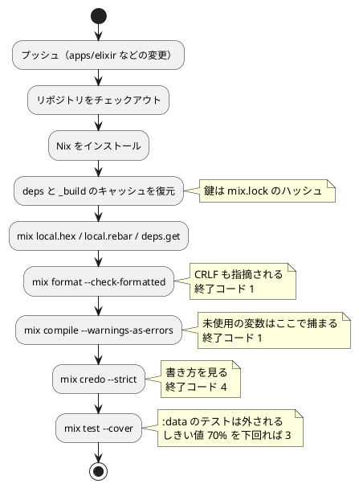

# 第 6 章: タスクランナーと CI/CD

## 6.1 はじめに

前の章で、整形・コンパイラの警告・Credo・カバレッジの道具をそろえました。道具は、**実行されなければ意味がありません**。この章では、それらを 1 つの手順にまとめ、プッシュするたびに自動で実行されるようにします。

Elixir 版で使うものは次の 4 つです。

| 層 | 道具 | 受け持つこと |
|----|------|------------|
| 言語の道具 | Mix（`mix.exs`） | 依存の解決・コンパイル・テスト・カバレッジ・章の実行 |
| 検査の道具 | `mix format`・Credo | 整形の検査・書き方の静的解析 |
| リポジトリのタスクランナー | Gulp（`ops/scripts/`） | 学習データの配置、言語をまたいだ検査の呼び出し、Nix への切り替え |
| 環境と CI | Nix + GitHub Actions | 手元と CI で同じ道具・同じ版を使う |

Clojure 版では、検査の道具（cljfmt・clj-kondo）がビルドツールの外にある独立したコマンドでした。Elixir では 4 つとも `mix` のサブコマンドです。そのぶん Mix はタスクランナーに近いのですが、**Gradle の `check` や Rake の `task :check` に当たるまとめ役はありません**。`mix test` を打てば必要なものがコンパイルされる、という程度の連鎖はありますが、「整形も警告も Credo もまとめて」という既定のタスクは無いのです。この章では、その足りないところを何で埋めたかを見ていきます。

## 6.2 タスクランナー — Mix

### 使うコマンド

第 5 章までに出てきたものをまとめます。

| コマンド | 内容 |
|---------|------|
| `mix deps.get` | 依存を取得する（`mix.lock` を作る・更新する） |
| `mix deps.tree` | 依存の木を表示する |
| `mix compile --warnings-as-errors` | コンパイルする（警告を失敗にする） |
| `mix format --check-formatted` | 整形されているかを検査する |
| `mix format` | コードを整形する |
| `mix credo --strict` | 静的解析を実行する |
| `mix test` | テストを実行する |
| `mix test --cover` | テストを実行してカバレッジを測る |
| `mix run -e '<式>'` | アプリケーションを起動して式を評価する |

`mix help` を打つと、使えるタスクの一覧が出ます。標準のものに混じって、依存として入れた Credo のタスクが並んでいるのが分かります。

```text
mix compile           # Compiles source files
mix credo             # Run code analysis (use `--help` for options)
mix credo.gen.check   # Generate a new custom check for Credo
mix credo.gen.config  # Generate a new config for Credo
mix deps              # Lists dependencies and their status
mix deps.clean        # Deletes the given dependencies' files
mix deps.compile      # Compiles dependencies
mix deps.get          # Gets all out of date dependencies
mix deps.tree         # Prints the dependency tree
mix deps.unlock       # Unlocks the given dependencies
mix deps.update       # Updates the given dependencies
mix format            # Formats the given files/patterns
mix run               # Runs the current application
mix test              # Runs a project's tests
mix test.coverage     # Build report from exported test coverage
```

`mix credo` が `mix compile` と同じ並びに出ているのがポイントです。Credo は Hex のパッケージですが、`Mix.Task` を実装しているので **Mix のサブコマンドとして生えてきます**。Clojure 版の clj-kondo が「Nix の環境に入れた別のコマンド」だったのとは対照的で、道具の在り処が `mix.exs` の 1 行に集約されます。

そのかわり、道具の版はプロジェクトの `mix.lock` が決めます。第 5 章で見た `credo 1.7.19` がそれです。**プロジェクトを取ってきて `mix deps.get` を打てば、検査の道具まで同じ版がそろう** のは、Elixir の素直なところです。Clojure 版では、道具の版は Nix の環境が決めていました。

### 章の処理を実行する

各章には、その章の処理を通しで実行する `run/0` があります。

```elixir
  @doc "実データでルールによる判定の正解率を表示する。"
  def run do
    people = load_people(Path.join(Dataset.dir(), "KvsT.csv"))
    {x, t} = split_features_and_labels(people)
    predictions = Enum.map(x, &predict_by_rule/1)

    IO.puts("データ件数: #{length(people)}")
    IO.puts("ルールによる判定の正解率: #{:io_lib.format(~c"~.4f", [accuracy(predictions, t)])}")
  end
```

呼び方は `mix run -e` です。

```bash
ML_DATA_DIR=<データの置き場> mix run -e 'GettingStartedMl.Chapter03.run()'
```

Clojure 版や Scala 版は、章の名前から関数へのマップを持つ `main` を作り、`clojure -M:run chapter03` のように名前で選んでいました。Elixir 版ではその入口を作っていません。`mix run -e` に **モジュール名と関数名をそのまま書ける** からです。

| 言語版 | 呼び方 | 入口のコード |
|-------|-------|------------|
| Clojure 版 | `clojure -M:run chapter03` | `main` 名前空間に章名と関数のマップ（15 行ほど） |
| Scala 版 | `sbt "run chapter03"` | `Main` オブジェクトに `Map[String, ...]` |
| Elixir 版 | `mix run -e 'GettingStartedMl.Chapter03.run()'` | **無し** |

打つ文字は長くなりますが、**書かなくてよいコードが 15 行あります**。しかも章を足すたびに入口を書き換える必要がありません。第 15 章まで進むと章は 12 個になるので、その分だけ触らずに済む場所が増えます。

トレードオフもあります。章の名前を間違えたときの表示が、自作の入口なら「使い方」を出せるのに対し、`mix run -e` では Elixir のエラーがそのまま出ます。とはいえ、これは記事を読みながら打つコマンドであって、利用者に配る道具ではありません。**読者が打つコマンドの数だけ、入口のコードを書く理由がある** と考えて、ここでは書かないことを選びました。第 15 章で API を作るときには、`mix run` ではない別の入口（Bandit のサーバー）が要ります。

学習データを置かずに実行すると、こうなります。

```bash
mix run -e 'GettingStartedMl.Chapter01.run()'
echo "EXIT=$?"
```

```text
** (File.Error) could not read file "../data/sukkiri-ml/KvsT.csv": no such file or directory
    (elixir 1.18.4) lib/file.ex:385: File.read!/1
    (getting_started_ml 0.1.0) lib/getting_started_ml/csv.ex:20: GettingStartedMl.Csv.read/1
    (getting_started_ml 0.1.0) lib/getting_started_ml/chapter01.ex:22: GettingStartedMl.Chapter01.load_people/1
    (getting_started_ml 0.1.0) lib/getting_started_ml/chapter01.ex:47: GettingStartedMl.Chapter01.run/0
    nofile:1: (file)
EXIT=1
```

第 5 章で触れた `File.read!/1` の `!` が効いています。**探したパスがそのまま表示される** ので、`ML_DATA_DIR` を渡し忘れたことがすぐ分かります。スタックトレースには、どの章のどの関数から来たかも出ます。例外にして止めるという素朴な選び方が、この場面では親切に働きます。

### 環境変数を渡す

学習データの場所は、第 4 章で見たとおり環境変数で渡します。

```bash
ML_DATA_DIR=/path/to/data mix test
```

Mix は、毎回その場で BEAM を起動するだけなので、環境変数の受け渡しに設定は要りません。Gradle のようにデーモンが常駐して前回の結果を再利用することもないので、「環境変数を変えたのにテストが再実行されない」という問題も起きません。Clojure CLI と同じ事情です。

## 6.3 Notebook について

Python 版と Kotlin 版では、この節で Notebook によるデータの探索と、出力セルを消してからコミットする仕組みを扱いました。Elixir には Livebook という対応する道具がありますが、本シリーズでは使わず、データの様子は各章の `run/0` の出力とテストで確かめています。`iex -S mix` で試したことは、そのままテストに書き写します。

Notebook で分かったことをテストに移す流れと、出力セルに学習データが残らないようにする仕組みは、[Python 版の 6.3 節](../python/06-task-runner-and-ci-cd.md)（nbstripout）と [Kotlin 版の 6.3 節](../kotlin/06-task-runner-and-ci-cd.md)（Gradle のタスクで出力セルを検査・削除）を参照してください。グラフによる可視化も、Python 版・Kotlin 版の各章を参照してください。

Livebook を使わない理由は、第 4 章の `.gitignore` の話と同じ筋です。Livebook のノート（`.livemd`）は Markdown なのでコミットしやすいのですが、実行結果を含めて保存すると **学習データの中身がリポジトリに入ります**。出力を消す仕組みを別に用意することになり、扱う道具が 1 つ増えます。本シリーズの規模では、テストと `run/0` で足ります。

## 6.4 Nix の環境定義

本リポジトリの開発環境は Nix で定義しています。Elixir の環境は `ops/nix/environments/elixir/shell.nix` です。

```nix
{ packages ? import <nixpkgs> {} }:
let
  baseShell = import ../../shells/shell.nix { inherit packages; };
in
packages.mkShell {
  inherit (baseShell) pure;
  buildInputs = baseShell.buildInputs ++ (with packages; [
    elixir
    erlang
    elixir-ls
  ]);
  shellHook = ''
    ${baseShell.shellHook}
    echo "Elixir development environment activated"
    echo "  - Elixir: $(elixir --version | grep Elixir)"
    echo "  - Erlang: $(erl -noshell -eval 'io:fwrite("~s~n", [erlang:system_info(otp_release)]), halt().')"
  '';
}
```

入れているのは 3 つだけです。Clojure 版の環境には、あとから cljfmt と clj-kondo を足す必要がありました。Elixir では、検査の道具が `mix.exs` の依存として入るので、環境に足すものがありません。**道具の在り処が 1 か所に寄っている** ことの、分かりやすい効き目です。

環境に入ったときの表示が、第 5 章で見た食い違いを見せます。

```text
Elixir development environment activated
  - Elixir: Elixir 1.18.4 (compiled with Erlang/OTP 27)
  - Erlang: 28
```

`erl` は 28 と答え、Elixir は 27 でコンパイルされたと言っています。この 2 行を並べて表示させているのは、**食い違いを隠さないため** です。Elixir だけを表示していたら、`erl` を直接叩いたときに混乱します。版を表示させる意味は 2 つあって、1 つは記事に載せる数値がどの版で得られたかをログから追えること、もう 1 つは **そのコマンドが本当に存在することの証明** になることです。入っていなければ、環境に入った時点でエラーが出ます。

## 6.5 Mix と Gulp の分担

本リポジトリには、言語ごとの道具とは別に、リポジトリ全体の作業を受け持つ Gulp のタスクがあります（`ops/scripts/`）。第 4 章の `data:setup` もその 1 つです。Elixir の品質チェックは、Gulp の `apps:check:elixir` タスクから実行できます。

```javascript
  {
    name: 'elixir',
    nix: 'elixir',
    dir: path.join('apps', 'elixir'),
    tools: [{ cmd: 'mix', version: 'mix --version' }],
    setup: 'mix deps.get',
    // CI（.github/workflows/elixir-ci.yml）と同じ順に、整形・警告・静的解析・テスト・カバレッジを検査する
    check:
      'mix format --check-formatted && mix compile --warnings-as-errors && mix credo --strict && mix test --cover',
  },
```

`tools` には、前提になるコマンドと、それが使えるかを確かめる方法を書きます。Clojure 版は `clojure` と `clj-kondo` の 2 つを挙げていましたが、Elixir 版は **`mix` の 1 つだけ** です。検査の道具が依存として入るので、`mix` さえあれば `mix deps.get` で残りがそろいます。

```bash
npx gulp apps:check:elixir
```

```text
[..] Starting 'apps:check:elixir'...

[apps/elixir] mix format --check-formatted && mix compile --warnings-as-errors && mix credo --strict && mix test --cover
Checking 11 source files ...

Analysis took 0.1 seconds (0.02s to load, 0.1s running 69 checks on 11 files)
75 mods/funs, found no issues.

Cover compiling modules ...
学習データが見つからないので :data のテストを外します（../data/sukkiri-ml）
Running ExUnit with seed: 293231, max_cases: 16
Excluding tags: [:data]

..................................................
Finished in 0.1 seconds (0.1s async, 0.00s sync)
50 tests, 0 failures (3 excluded)
```

```text
| Percentage | Module                     |
|------------|----------------------------|
|     66.00% | GettingStartedMl.Chapter02 |
|     73.21% | GettingStartedMl.Chapter03 |
|     76.92% | GettingStartedMl.Chapter01 |
|     85.71% | GettingStartedMl.Csv       |
|     94.74% | GettingStartedMl.Random    |
|    100.00% | GettingStartedMl.Dataset   |
|------------|----------------------------|
|     75.46% | Total                      |
[..] Finished 'apps:check:elixir' after 3.29 min
```

### 手元の `mix` が Nix の外にあると何が起きるか

上の出力を、第 5 章の `nix develop .#elixir` の中で走らせた出力と見比べてください。**表示が食い違っています。**

| 項目 | Nix の中（Elixir 1.18.4） | Gulp から（手元の Elixir 1.19.5） |
|------|------------------------|--------------------------------|
| テストの数え方 | `53 tests, 0 failures, 3 excluded` | `50 tests, 0 failures (3 excluded)` |
| カバレッジの表 | 罫線が `-----------\|------` | Markdown 風の `\|------------\|------` |
| 総計 | 75.46% | 75.46% |

Gulp は `tools` に書いた `mix` が **手元にあった** ので、Nix に切り替えずにそのまま実行しました。そして手元の Elixir は 1.19.5（OTP 28）でした。

```bash
elixir --version
```

```text
Erlang/OTP 28 [erts-16.4] [source] [64-bit] [smp:8:8] [ds:8:8:10] [async-threads:1] [dtrace]

Elixir 1.19.5 (compiled with Erlang/OTP 28)
```

Elixir 1.19 で、ExUnit の集計の表示が変わっています。1.18 は除外したテストを総数 53 に含め、1.19 は含めずに 50 と数えて括弧で添えます。同じテスト・同じコードなのに、表示が違うのです。カバレッジの表の罫線も変わっています。

これは **バグではありません**。`mix.exs` の `elixir: "~> 1.18"` は 1.19 も満たすので、両方とも正しい実行です。それでも、記事に数値を載せる立場では厄介です。「53 tests」と書いた記事を読んだ人が、手元で「50 tests」を見たら、自分の環境が壊れていると思うでしょう。

学べることが 2 つあります。

1. **数字が食い違ったら、まず版を疑う。** コードではなく、走らせたランタイムが違うのかもしれません。第 5 章で「版はシェルではなく走っているプログラムに聞く」と書いたのは、このためです
2. **総計は一致した。** 75.46% と、モジュールごとの内訳は 1 桁目まで同じでした。表示の書式は変わっても、測っているものは変わっていません。**何が変わり、何が変わらないかを見分ける** ことが、環境が違う結果を読むときの要点です

CI は `nix develop .#elixir` の中で走るので、記事の数値は Nix の中（1.18.4）のものにそろえています。手元に別の版の Elixir が入っている人は、`nix develop .#elixir` に入ってから打つか、表示の違いを承知で読んでください。

### 2 つのタスクランナーの分担

| 役割 | Mix（`apps/elixir`） | Gulp（リポジトリのルート） |
|------|-------------------|------------------------|
| 何を知っているか | ソース・依存・検査の道具 | 言語ごとのアプリの場所・前提ツール・学習データの場所 |
| 品質チェックの中身 | 持たない（コマンドの並びがそれにあたる） | 持たない。並びを書いて呼ぶだけ |
| 前提ツールが無いとき | 何もできない | Nix の環境（`nix develop .#elixir`）に切り替える |
| 全言語をまとめて | 扱わない | `apps:check` で、学習データの確認（`data:check`）と全言語の検査を続けて実行する |

Clojure 版と同じく、**検査の並びが Gulp と CI に重複します**。片方を変えたらもう片方も変える、とコメントで結びつけています（`ops/scripts/apps.js` の「CI と同じ順に」）。

`mix.exs` に自前の Mix タスクを定義する道（`lib/mix/tasks/check.ex` に `Mix.Task` を実装する）もあります。そうすれば `mix check` の 1 語で済み、重複も消えます。それでも素のコマンドの並びにしたのは、**実体がどこにあるかを増やさない** ためです。読む人は `mix.exs` と `apps.js` と CI の定義を読めば全部が分かります。Mix タスクを足すと、読む場所が 1 つ増え、しかもそのタスク自身がテストもされないコードになります。

## 6.6 4 つの検査が本当に効いていることを確かめる

設定を書いただけでは、本当に検査されているか分かりません。**わざと違反を入れて落ちることを確かめる** のが確実です。4 つを 1 つずつ壊しました。結果は次のとおりです。

| 壊したもの | コマンド | 終了コード |
|-----------|---------|----------|
| 整形（`def f( x )` と `x+1`） | `mix format --check-formatted` | **1** |
| 未使用の変数（`unused = x + 1`） | `mix compile --warnings-as-errors` | **1** |
| `@moduledoc` を書かない | `mix credo --strict` | **4** |
| 落ちるアサーション（`assert 1 == 2`） | `mix test` | **2** |

**4 つとも違う道具で、終了コードは 1・1・4・2 とばらばらです。** 3 つの値が出てきます。

Credo の 4 は、第 5 章で見たとおり指摘の分類（可読性）を表すビットです。ExUnit の 2 は「テストが失敗した」で、これも 1 ではありません。

`&&` でつないだ 1 行や CI のステップは「0 かどうか」で判断するので、この違いは問題になりません。しかし、たとえば「終了コードが 1 なら失敗として扱い、それ以外は成功」と書いたスクリプトがあれば、Credo の指摘とテストの失敗を **両方とも見逃します**。値をハードコードせずに `if ! コマンド; then` や `set -e` の形で書く、というのは、こういう場面のための習慣です。

落ちるテストの表示も見ておきます。

```text
  1) test わざと落ちる (GettingStartedMl.ViolationTest)
     test/getting_started_ml/violation_test.exs:4
     Assertion with == failed
     code:  assert 1 == 2
     left:  1
     right: 2
     stacktrace:
       test/getting_started_ml/violation_test.exs:5: (test)

Finished in 0.03 seconds (0.03s async, 0.00s sync)
1 test, 1 failure
```

ExUnit は、`assert` に渡した **式そのもの**（`assert 1 == 2`）と、左辺・右辺の値を分けて表示します。マクロなので、評価前の式を持っているからです。`assert Dataset.dir(%{}) == "../data/sukkiri-ml"` のような比較が落ちたときも、`left:` と `right:` に実際の値が並ぶので、何と何が違ったのかがすぐ分かります。期待値と実際値をどちらの引数に書くか、という流儀の問題がそもそも起きません。

これらの実験は、一時的なファイル（`lib/getting_started_ml/violation.ex`・`test/getting_started_ml/violation_test.exs`）を置いて行い、確かめてから消しました。第 5 章の `test_coverage` の実験（`threshold:` を `summary:` の外に出す・`ignore_modules:` を外す）も同じやり方です。**壊して確かめたら、必ず元に戻します。**

## 6.7 GitHub Actions による CI

### ワークフロー設定

`.github/workflows/elixir-ci.yml` です。

```yaml
name: Elixir CI

on:
  push:
    branches: [main]
    paths:
      - 'apps/elixir/**'
      - 'ops/nix/environments/elixir/**'
      - '.github/workflows/elixir-ci.yml'
  pull_request:
    paths:
      - 'apps/elixir/**'
      - 'ops/nix/environments/elixir/**'
      - '.github/workflows/elixir-ci.yml'

jobs:
  test:
    runs-on: ubuntu-latest
    steps:
      - uses: actions/checkout@v5

      - uses: cachix/install-nix-action@v31
        with:
          github_access_token: ${{ secrets.GITHUB_TOKEN }}

      - name: Cache deps and build
        uses: actions/cache@v4
        with:
          path: |
            apps/elixir/deps
            apps/elixir/_build
          key: ${{ runner.os }}-elixir-${{ hashFiles('apps/elixir/mix.lock') }}
          restore-keys: |
            ${{ runner.os }}-elixir-

      - name: Fetch dependencies
        run: |
          nix develop .#elixir --command bash -c 'cd apps/elixir && mix local.hex --force && mix local.rebar --force && mix deps.get'

      - name: Check formatting
        run: |
          nix develop .#elixir --command bash -c 'cd apps/elixir && mix format --check-formatted'

      # 未使用の変数などは Credo ではなくコンパイラが警告するので、警告を失敗にする
      - name: Compile with warnings as errors
        run: |
          nix develop .#elixir --command bash -c 'cd apps/elixir && mix compile --warnings-as-errors'

      - name: Credo
        run: |
          nix develop .#elixir --command bash -c 'cd apps/elixir && mix credo --strict'

      # 実データのテストは学習データが無ければ :data のタグごと外される
      - name: Test with coverage
        run: |
          nix develop .#elixir --command bash -c 'cd apps/elixir && mix test --cover'
```

### ワークフローのポイント

- **`paths` で対象を絞る** — Elixir の実装・Nix の環境定義・このワークフローが変わったときだけ実行します。記事だけの変更や、ほかの言語の変更では実行されません。環境定義を入れてあるのは、Elixir の版を変えたときに CI でも確かめたいからです
- **Nix で環境をそろえる** — `nix develop .#elixir` で、`shell.nix` に定義した環境（Elixir 1.18.4・OTP 27）に入ってからコマンドを実行します。前の節で見たとおり、手元に別の版があると表示が変わるので、CI は必ず Nix の中で走らせます
- **`mix local.hex --force` と `mix local.rebar --force`** — Hex（パッケージマネージャー）と rebar3（Erlang のビルドツール）を、`mix` 自身に取ってこさせます。手元では一度入れれば残りますが、CI は毎回まっさらな環境なので必要です。`--force` は「すでにあるか」を尋ねずに入れるためで、対話的な確認で止まらないようにします
- **`mix deps.get` を独立したステップにする** — 依存の取得が失敗したのか、検査が失敗したのかを、GitHub の画面で区別できるようにします
- **4 つの検査を別のステップに分ける** — 手元の `apps:check:elixir` は `&&` でつないだ 1 行ですが、CI では 4 つのステップに分けました。どこで落ちたかが一目で分かるからです。順番と中身は同じです
- **キャッシュの鍵は `mix.lock` のハッシュ** — `mix.lock` が変わらなければ、依存も変わりません（第 5 章）。Clojure 版はロックファイルが無いので `deps.edn` のハッシュを使っていましたが、Elixir にはロックがあるので、本来の意味どおりの鍵が使えます
- **キャッシュするのは `deps` と `_build` の 2 つ** — `deps/` は依存のソース、`_build/` はそれをコンパイルした BEAM ファイルです。`deps/` だけを保存すると、毎回すべてを **コンパイルし直す** ことになります。第 5 章で見たとおり、Scholar は 70 ファイル、Credo は 257 ファイルあるので、ここが効きます
- **学習データは置かない** — 学習データは再配布できないので CI には置きません。実データのテストは `:data` のタグごと外され、`3 excluded` と表示されます（第 4 章）
- **カバレッジは失敗しうる** — `mix test --cover` は、しきい値 70% を下回れば終了コード 3 で失敗します（第 5 章）。Clojure 版が「表示だけ」にしていたのとは違います。データが無い CI で通る 75.46% に余裕を見て 70 にしてあるので、テストを消さない限り落ちません

### `_build` をキャッシュすることの落とし穴

`_build/` をキャッシュに含めるのは効きますが、注意が要ります。`_build/` には、依存だけでなく **自分のコードをコンパイルしたもの** も入ります。`restore-keys` で前のキャッシュが復元されると、古い BEAM ファイルが残った状態でコンパイルが始まります。

Mix は、ソースの更新時刻とハッシュを見て必要なものだけ作り直すので、通常これは正しく動きます。しかし **Elixir や OTP の版が変わったとき** は話が別で、古い版でコンパイルした BEAM ファイルが混ざると、分かりにくい失敗をすることがあります。`ops/nix/environments/elixir/**` を `paths` に入れてあるのは、環境定義を変えたときに CI を走らせて、これに早く気付くためでもあります。

もし妙な失敗が続いたら、キャッシュの鍵に Elixir の版を混ぜる（`${{ runner.os }}-elixir-<版>-${{ hashFiles(...) }}`）か、GitHub の画面からキャッシュを消します。**キャッシュは速さのための最適化であって、正しさの前提にしてはいけません。**

### CI パイプラインの流れ



## 6.8 三種の神器と CI

第 4〜6 章で整えたものを、ソフトウェア開発の「三種の神器」（バージョン管理・テスティング・自動化）に当てはめると次のようになります。

| 三種の神器 | 道具 | 本シリーズでの使い方 |
|-----------|------|------------------|
| バージョン管理 | Git、Conventional Commits、`.gitignore`、`.gitattributes`、`mix.lock` | 学習データ・`_build/`・`deps/`・`cover/`・モデル・`erl_crash.dump` をコミットしない。`mix.lock` はコミットする。改行は `mix format` と Git の 2 層で LF にそろえる |
| テスティング | ExUnit、`mix test --cover` | 単体テストは架空の値、実データのテストは `@tag :data` で外す。しきい値は `summary:` の中に書く |
| 自動化 | Mix、`mix format`、Credo、GitHub Actions、Nix、Gulp | 環境の再現、品質チェックの一括実行、データの配置、CI |

### 利用可能なコマンド一覧

| コマンド | 内容 | 実行する場所 |
|---------|------|------------|
| `npx gulp data:setup` | 学習データを配置する | リポジトリのルート |
| `npx gulp data:check` | 学習データの配置を確認する | リポジトリのルート |
| `npx gulp apps:check:elixir` | Elixir の品質チェックを実行する（`mix` が無ければ Nix の中で） | リポジトリのルート |
| `mix deps.get` | 依存を取得する | `apps/elixir` |
| `mix deps.tree` | 依存の木を表示する | `apps/elixir` |
| `mix format` | コードを整形する | `apps/elixir` |
| `mix format --check-formatted` | 整形されているかを検査する | `apps/elixir` |
| `mix compile --warnings-as-errors` | 警告を失敗にしてコンパイルする | `apps/elixir` |
| `mix credo --strict` | 静的解析を実行する | `apps/elixir` |
| `mix test` | テストを実行する | `apps/elixir` |
| `mix test --cover` | テストとカバレッジを実行する | `apps/elixir` |
| `mix run -e 'GettingStartedMl.Chapter03.run()'` | 章の処理を実行する（学習データが必要） | `apps/elixir` |

## 6.9 まとめ

この章では、品質チェックを自動化し、どの環境でも同じ手順で実行できるようにしました。

1. **道具が Mix の下に寄る** — `mix format` は標準、Credo は依存として入れれば `mix credo` として生えてくる。Nix の環境に足すものが無く、道具の版まで `mix.lock` がそろえる。そのかわり検査をまとめる既定のタスクは無い
2. **章の実行に入口を書かない** — `mix run -e 'GettingStartedMl.Chapter03.run()'` でモジュールと関数を直に指定する。Clojure 版・Scala 版が持っていた 15 行の入口が要らない。打つ文字は長くなるが、章を足しても触る場所が増えない
3. **手元の版と Nix の版が違うと表示が変わる** — Gulp は手元の `mix`（Elixir 1.19.5）を使い、ExUnit の集計が `53 tests, 3 excluded` から `50 tests (3 excluded)` に変わった。**総計の 75.46% は一致した**。数字が食い違ったらまず版を疑い、何が変わって何が変わらないかを見分ける
4. **4 つとも壊して確かめた** — 終了コードは 1・1・4・2 とばらばらだった。「0 かどうか」で判断する限り問題ないが、値をハードコードするスクリプトは Credo とテストの失敗を見逃す
5. **GitHub Actions** — Nix で環境をそろえ、手元と同じ検査を 4 つのステップに分けて実行する。キャッシュの鍵は `mix.lock` のハッシュにし、`deps` と `_build` の両方を保存してコンパイルをやり直さない。`_build` のキャッシュは版が変わったときに危ういので、環境定義の変更でも CI を走らせる
6. **CI でカバレッジが落ちる** — しきい値 70% は、学習データが無い条件（75.46%）で通る値にしてある。低いほうの条件で決める

第 2 部で、TDD を回し続けるための道具立てがそろいました。次の第 3 部では、回帰問題と、欠損値・カテゴリ値・外れ値を含む現実的なデータの前処理に取り組みます。Nx のテンソルが本格的に登場し、**既定の型が単精度（f32）である** という Elixir 版でいちばん引っかかりやすい性質に、第 7 章で正面から向き合います。
