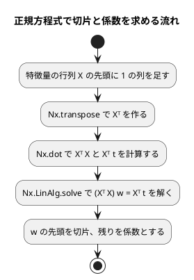

# 第 7 章: 線形回帰による数値予測

## 7.1 はじめに

第 1〜3 章では、グループを当てる **分類** を扱いました。この章からは、数値そのものを当てる **回帰** に進みます。題材は、映画の SNS での反響や主演俳優の露出度から、興行収入を予測する問題です。

この章では、最も基本的な回帰モデルである **線形回帰** を自作します。[Java 版の第 7 章](../java/07-linear-regression.md) は `double[][]` を包んだ行列クラスを作り、[Clojure 版](../clojure/07-linear-regression.md) はベクタのベクタをそのまま行列として扱い、どちらも行列の積・転置・ガウスの消去法を自分で書きました。

Elixir 版は違います。**Nx（Numerical Elixir）があるので、行列を自作しません。** `Nx.dot/2`・`Nx.transpose/1`・`Nx.LinAlg.solve/2` がそのまま使えるので、この章で自作するのは「正規方程式を組み立てて解く手順」だけです。[Python 版](../python/07-linear-regression.md) が NumPy でやったことに、いちばん近い形になります。

そしてここが Elixir 版でいちばん最初に効いてくる落とし穴です。**Nx のテンソルは既定が単精度（f32）** で、`type: :f64` を書き忘れると係数が `0.999998927116394` のようにずれます。NumPy が既定で倍精度なのとちょうど裏返しです（[ADR 012](../../../adr/012-elixir-ml-libraries.md)）。7.5 節で、同じデータを f32 と f64 の両方で解いて実測で見せます。

最後に [Scholar](https://github.com/elixir-nx/scholar) の線形回帰と突き合わせます。この章は、Elixir 版で **初めてライブラリと数値を比べられる章** です。第 3 章の決定木は Scholar に無いので、自作したものがそのまま最終実装でした。結果は 7.9 節のとおりで、**条件のよいデータでは一致し、実データでは一致しません**。その理由まで突き止めます。

Livebook による探索と可視化の節は設けません。散布図で外れ値を確かめる手順は [Python 版](../python/07-linear-regression.md) と [Kotlin 版の 7.13 節](../kotlin/07-linear-regression.md) を参照してください。

## 7.2 線形回帰とは

### 特徴量の重み付きの和で予測する

線形回帰は、予測値を「切片」と「特徴量ごとの係数 × 特徴量」の和で表すモデルです。この章のデータに当てはめると次の式になります。

```text
予測値 = 切片 + 係数1 × SNS1 + 係数2 × SNS2 + 係数3 × actor + 係数4 × original
```

学習とは、訓練データに対して予測値と実測値のずれが最も小さくなるように、切片と係数を決めることです。ずれの大きさには「誤差の 2 乗の合計」を使います。これを最小にする方法を **最小二乗法** と呼びます。

### 正規方程式

最小二乗法の解は、行列を使うと 1 つの式で求められます。特徴量を行列 `X`、実測値をベクトル `t`、切片と係数をまとめたベクトルを `w` とすると、誤差の 2 乗の合計を最小にする `w` は次の **正規方程式** を満たします。

```text
(Xᵀ X) w = Xᵀ t
```

`X` の先頭には、すべての値が 1 の列を足しておきます。この列にかかる係数が切片になります。



逆行列を作らずに連立方程式として解くのは、Python 版・Java 版・Clojure 版と同じく、そのほうが数値計算の誤差が小さくなるためです。Nx にも `Nx.LinAlg.invert/1` はありますが、使いません。

## 7.3 題材とデータ

この章で使うのは `cinema.csv` です。100 本の映画について、次の 6 列が記録されています。

| 列 | 内容 | 欠損値 |
|----|------|-------|
| cinema_id | 映画の ID | なし |
| SNS1 | SNS での反響の数（1 つ目の指標） | 1 件 |
| SNS2 | SNS での反響の数（2 つ目の指標） | なし |
| actor | 主演俳優のメディア露出の指標 | 1 件 |
| original | 原作の有無（0 または 1） | なし |
| sales | 興行収入 | なし |

「SNS1」「SNS2」「actor」「original」が特徴量、「sales」が正解ラベル（予測したい数値）です。`cinema_id` は映画を区別するための番号なので、特徴量には使いません。

第 2 章の `load_table/1` はセルを文字列のまま持ち、`Chapter02.number/2` で読むときに浮動小数点数か `nil` にします。列の型を推論する段階が無いので、Kotlin 版が Kotlin DataFrame の型推論で困った問題（SNS1 が `Int?` と推論され、補完した平均値が入らない）は起きません。

このデータには、SNS2 の値が大きいのに興行収入が低い、傾向から外れた映画が 1 本含まれています。このような **外れ値** は、最小二乗法の結果を大きく引っ張ります。誤差を 2 乗して足し合わせるので、大きく外れた 1 点の影響が大きくなるためです。

そして 7.9 節で分かるのですが、**この 4 列は桁がひどくそろっていません**。`original` は 0 か 1 しか取らず、`actor` は 1 万を超えます。この「条件の悪さ」が、Scholar と自作の結果を食い違わせる原因になります。

## 7.4 TODO リストの作成

**TODO リスト**:

- [ ] Nx のテンソルの型を確かめる
  - [ ] 既定が f32 であることを固定する
  - [ ] f32 と f64 で係数が変わることを実測する
- [ ] 評価指標を計算する（MAE・RMSE・R²）
- [ ] 正規方程式で線形回帰を学習する
  - [ ] 計画行列の先頭に 1 の列を足す
  - [ ] 直線上の点から切片と係数を求める
  - [ ] 複数の特徴量から切片と係数を求める
- [ ] 学習したモデルで予測する
- [ ] 外れ値を取り除く
  - [ ] SNS2 が 1000 を超え、興行収入が 8500 未満の行を取り除く
  - [ ] 条件の片方だけを満たす行は残す
- [ ] 外れ値の除去・分割・補完をまとめる
- [ ] Scholar と結果が一致するかを確かめる
- [ ] 実データで学習・評価して表示する

Clojure 版・Java 版の TODO リストの先頭にあった「行列を扱う名前空間を作る」「行列の積を求める」「転置行列を求める」「連立方程式を解く」の 4 項目が、まるごと消えています。Nx がそれを持っているからです。**ライブラリがある領域では、自作の対象そのものが減ります。** 第 3 章の決定木でその逆（Scholar に無いので全部自作）を見たばかりなので、対比がはっきりします。

ファイルは 1 つです。Clojure 版は `chapter07/matrix.clj`・`chapter07/metrics.clj`・`chapter07/tribuo.clj` に分けましたが、行列を自作しないぶん量が減ったので、Elixir 版は `lib/getting_started_ml/chapter07.ex` にまとめます。

| ファイル | モジュール | 中身 |
|---------|-----------|------|
| `lib/getting_started_ml/chapter07.ex` | `GettingStartedMl.Chapter07` | 評価指標・線形回帰・外れ値・前処理・Scholar への橋渡し・`run` |
| `test/getting_started_ml/chapter07_test.exs` | `GettingStartedMl.Chapter07Test` | 上記のテスト |

## 7.5 Nx のテンソルと f64

### Red: 既定の型を固定する

最初のテストは、モデルでも行列でもありません。**Nx のテンソルの既定の型** です。

```elixir
describe "テンソルの型" do
  test "既定のテンソルは単精度になる" do
    assert Nx.type(Nx.tensor([1.0, 2.0])) == {:f, 32}
    assert Nx.type(Nx.tensor([1.0, 2.0], type: :f64)) == {:f, 64}
  end
end
```

これは自分のコードのテストではなく、**使うライブラリの性質を杭として打っておくテスト** です。Nx の既定が将来変わったら、ここが落ちて教えてくれます。ふだんはこういうテストを書きませんが、この章のあとの数値がすべてこの一点に乗っているので、例外的に残しました。

### f32 と f64 で係数が変わる

型を引数で受け取れるようにしておくと、同じデータを両方で解いて比べられます。

```elixir
test "f32 で解くと係数が一の手前でずれる" do
  x = [%{a: 1.0, b: 1.0}, %{a: 2.0, b: 1.0}, %{a: 3.0, b: 2.0}, %{a: 4.0, b: 3.0}]
  t = [2.0, 3.0, 5.0, 7.0]

  assert_in_delta C.coefficient(C.fit(x, t, [:a, :b], :f64), :a), 1.0, 1.0e-12
  refute_in_delta C.coefficient(C.fit(x, t, [:a, :b], :f32), :a), 1.0, 1.0e-12
  assert_in_delta C.coefficient(C.fit(x, t, [:a, :b], :f32), :a), 1.0, 1.0e-5
end
```

`t = a + b` をちょうど通る 4 点なので、正しい答えは切片 0・係数 1・係数 1 です。実際に返ってきた値を並べます。

| 型 | 切片 | a の係数 | b の係数 |
|----|------|---------|---------|
| f64 | -2.842170943040401e-15 | 0.9999999999999927 | 1.0000000000000118 |
| f32 | 3.5762906236413983e-7 | 0.999998927116394 | 1.0000014305114746 |

f64 は小数第 14 位でずれ、f32 は小数第 6 位でずれます。**桁が 8 つ違います。** `refute_in_delta` と `assert_in_delta` を並べて「1e-12 では合わないが 1e-5 では合う」と書いているのは、ずれの大きさそのものをテストで固定するためです。

実データではもっとはっきりします。7.10 節の `run` は、同じ映画のデータを両方で解いて切片を並べます。

```text
切片: 6114.60
f32 で解いた切片: 6114.60 (6114.59716796875)
```

表示の桁（小数第 2 位）では同じに見えますが、f64 の 6114.595505694404 と f32 の 6114.59716796875 は小数第 3 位から違います。**丸めて表示すると気づけません。** ほかの言語版と係数を突き合わせる `係数: SNS1=1.3804, SNS2=0.5218, actor=0.2900, original=208.8827` の 4 桁は、f32 でも次のとおり見かけ上は一致します。

| 列 | f64 | f32 |
|----|-----|-----|
| SNS1 | 1.3803702543273981 | 1.380367398262024 |
| SNS2 | 0.5217797476455532 | 0.521778404712677 |
| actor | 0.2900051032720427 | 0.2900052070617676 |
| original | 208.88268148822763 | 208.88218688964844 |

この章はこれで済みますが、第 11 章の評価指標や第 13 章の主成分分析では、この差がそのまま結果の食い違いになります。**`Nx.tensor/2` を書くときは必ず `type: :f64` を付ける**、というのがこのシリーズの Elixir 版の決まりです。

## 7.6 評価指標を計算する

MAE・RMSE・R² を、実測値 `t` と予測値 `y` から求めます。ここはテンソルを使わず、素のリストで書きます。件数が 100 件程度なので、テンソルにする手間のほうが大きいからです。

```elixir
test "MAE は誤差の絶対値の平均になる" do
  assert_in_delta C.mean_absolute_error([3.0, 1.0, 4.0], [2.0, 2.0, 5.0]), 1.0, 1.0e-12
end

test "RMSE は誤差の二乗の平均の平方根になる" do
  # 誤差 3 と 4 → √((9 + 16) / 2) = √12.5
  assert_in_delta C.root_mean_squared_error([0.0, 0.0], [3.0, -4.0]),
                  :math.sqrt(12.5),
                  1.0e-12
end

test "R2 は予測がすべて正解なら一になる" do
  assert_in_delta C.r2_score([1.0, 2.0, 3.0], [1.0, 2.0, 3.0]), 1.0, 1.0e-12
end

test "R2 は平均値を予測し続けるモデルなら零になる" do
  assert_in_delta C.r2_score([1.0, 2.0, 3.0], [2.0, 2.0, 2.0]), 0.0, 1.0e-12
end
```

`assert_in_delta/3` は ExUnit に最初からある許容誤差つきの比較です。Clojure 版はテストの名前空間に `near?` を自分で置きましたが、Elixir では要りません。

```elixir
@doc "平均絶対誤差（MAE）。誤差の絶対値の平均。"
def mean_absolute_error(t, y) do
  r = residuals(t, y)
  Enum.sum(Enum.map(r, &abs/1)) / length(r)
end

@doc "平均二乗誤差の平方根（RMSE）。"
def root_mean_squared_error(t, y) do
  r = residuals(t, y)
  :math.sqrt(sum_of_squares(r) / length(r))
end

@doc "決定係数（R²）。1 から「残差の 2 乗の合計 ÷ 平均との差の 2 乗の合計」を引いた値。"
def r2_score(t, y) do
  mean = Enum.sum(t) / length(t)
  1.0 - sum_of_squares(residuals(t, y)) / sum_of_squares(Enum.map(t, &(&1 - mean)))
end
```

残差は `Enum.zip_with/3` で求めます。

```elixir
defp residuals(t, y) do
  if length(t) != length(y) do
    raise ArgumentError, "実測値と予測値の件数が違います: #{length(t)} と #{length(y)}"
  end

  Enum.zip_with(t, y, &(&1 - &2))
end

defp sum_of_squares(values), do: Enum.sum(Enum.map(values, &(&1 * &1)))
```

`Enum.zip_with/3` は「2 つのリストを組にしてから関数をかける」を 1 回の走査で行います。組のリストを中間に作らないので、Clojure 版の `(mapv - t y)` と同じ効率です。件数の検査を `residuals/2` の中に置いたので、3 つの指標すべてが同じ検査を通ります。テストは MAE で 1 本だけ書けば足ります。

```elixir
test "実測値と予測値の件数が違えば失敗する" do
  assert_raise ArgumentError, fn -> C.mean_absolute_error([1.0], [1.0, 2.0]) end
end
```

`:math.sqrt/1` は Erlang の関数です。Elixir の標準ライブラリに平方根は無いので、Erlang のモジュールを直接呼びます。アトムで始まる `:math` がそれで、BEAM の上では Erlang の関数を呼ぶのに橋渡しが要りません。

## 7.7 正規方程式で線形回帰を学習する

### モデルはマップ、列の順はリスト

学習したモデルは、切片と「列名つきの係数」を持ちます。

```elixir
%{intercept: 切片, columns: [列名], coefficients: [係数]}
```

**係数をマップにしません。** Elixir のマップはキーの順を保たない（小さいうちは挿入順に見えても、32 要素を超えると `%{}` の内部表現が変わって崩れる）ので、列の順を残したい値はリストで持ちます。第 2 章・第 3 章で `columns` のリストを持ち回ってきたのと同じ判断で、この章では「列名のリスト」と「同じ順の係数のリスト」の 2 本にしました。

```elixir
@doc "列名と、同じ順に並んだ係数からモデルを作る。"
def model(intercept, columns, coefficients) do
  if length(columns) != length(coefficients) do
    raise ArgumentError,
          "列名と係数の数が違います: #{length(columns)} と #{length(coefficients)}"
  end

  %{intercept: intercept, columns: columns, coefficients: coefficients}
end

@doc "列名で係数を読む。無ければ失敗する。"
def coefficient(model, column) do
  case Enum.find_index(model.columns, &(&1 == column)) do
    nil -> raise ArgumentError, "係数がありません: #{column}"
    index -> Enum.at(model.coefficients, index)
  end
end
```

予測は、列名と係数を組にして畳み込むだけです。

```elixir
@doc "1 行分の特徴量の予測値。係数は列名で対応させるので、列の並び順は問わない。"
def predict_one(model, features) do
  model.columns
  |> Enum.zip(model.coefficients)
  |> Enum.reduce(model.intercept, fn {column, weight}, sum ->
    sum + weight * Map.fetch!(features, column)
  end)
end

@doc "行ごとの予測値。"
def predict(model, x), do: Enum.map(x, &predict_one(model, &1))
```

特徴量は第 3 章と同じく「列名のアトムから浮動小数点数へのマップ」なので、並び順は予測に影響しません。

```elixir
test "列の並び順が違っても列名で係数を対応させる" do
  model = C.model(1.0, columns(), [2.0, 3.0])

  assert C.predict_one(model, %{SNS1: 2.0, actor: 3.0}) ==
           C.predict_one(model, %{actor: 3.0, SNS1: 2.0})
end
```

Clojure 版はこのテストのために `array-map` で「並びの違うマップ」をわざわざ作りました。Elixir のマップリテラルは書いた順を保証しないので、2 通りの書き方をするだけでテストになります。**言語がすでに順を保証していないという事実を、テストで確かめている** 形です。

### 学習

計画行列を作り、正規方程式を解きます。まず計画行列です。

```elixir
test "先頭には一の列が入る" do
  assert C.design_matrix([%{SNS1: 1.0, actor: 2.0}, %{SNS1: 3.0, actor: 4.0}], columns()) ==
           [[1.0, 1.0, 2.0], [1.0, 3.0, 4.0]]
end
```

```elixir
@doc "先頭に 1 の列を足した特徴量の行列（計画行列）を作る。1 の列の係数が切片になる。"
def design_matrix(x, columns) do
  Enum.map(x, fn features -> [1.0 | Enum.map(columns, &Map.fetch!(features, &1))] end)
end
```

`[1.0 | リスト]` は「先頭に足した新しいリスト」です。Elixir のリストは連結リストなので、先頭に足すのが最も安い操作です。Clojure 版の `(into [1.0] …)` が同じことを狙っていました。

次に学習です。テストは、答えの分かっている 2 通りです。

```elixir
test "直線上の点から切片と係数を求める" do
  model = C.fit([%{x: 0.0}, %{x: 1.0}, %{x: 2.0}], [3.0, 5.0, 7.0], [:x])
  assert_in_delta model.intercept, 3.0, 1.0e-9
  assert_in_delta C.coefficient(model, :x), 2.0, 1.0e-9
end

test "複数の特徴量から切片と係数を求める" do
  x = [%{a: 0.0, b: 0.0}, %{a: 1.0, b: 0.0}, %{a: 0.0, b: 1.0}, %{a: 1.0, b: 1.0}]
  model = C.fit(x, [1.0, 3.0, -2.0, 0.0], [:a, :b])
  assert_in_delta model.intercept, 1.0, 1.0e-9
  assert_in_delta C.coefficient(model, :a), 2.0, 1.0e-9
  assert_in_delta C.coefficient(model, :b), -3.0, 1.0e-9
end
```

実装は、Nx の 4 つの関数を並べるだけです。

```elixir
def fit(x, t, columns, type \\ :f64)

def fit([], _t, _columns, _type), do: raise(ArgumentError, "訓練データが空です")

def fit(x, t, columns, type) do
  if length(x) != length(t) do
    raise ArgumentError, "特徴量と実測値の件数が違います: #{length(x)} と #{length(t)}"
  end

  design = Nx.tensor(design_matrix(x, columns), type: type)
  transposed = Nx.transpose(design)
  values = Nx.new_axis(Nx.tensor(t, type: type), 1)

  [intercept | coefficients] =
    Nx.dot(transposed, design)
    |> Nx.LinAlg.solve(Nx.dot(transposed, values))
    |> Nx.squeeze(axes: [1])
    |> Nx.to_flat_list()

  model(intercept, columns, coefficients)
end
```

読みどころは 3 つあります。

- **空のデータを関数節で弾く** — `def fit([], _t, _columns, _type)` は、第 1 引数が空リストのときだけ呼ばれる節です。Clojure 版の `(when (empty? x) (throw …))` を、条件式ではなくパターンで書けます。件数の食い違いのほうはパターンでは表せないので `if` で書きました。**パターンで書けるところはパターンで、書けないところは素直に条件式で**、という使い分けになります
- **既定の引数は「頭」を別に書く** — `def fit(x, t, columns, type \\ :f64)` の 1 行だけの定義（本体なし）が必要です。既定値つきの関数に複数の節があるとき、既定値は本体のない「関数の頭」に 1 回だけ書きます。忘れると `definitions with multiple clauses and default values require a header` というコンパイルエラーになります
- **`[intercept | coefficients] = …`** は、リストの先頭と残りを一度に取り出す **パターンマッチによる分解** です。左辺がパターンなので、`hd/1`・`tl/1` を呼び分けずに「先頭が切片、残りが係数」と書けます。Clojure 版の `(first weights)`・`(vec (rest weights))` が 1 つの式になりました

`Nx.new_axis(…, 1)` は 1 次元のテンソルを `{n, 1}` の列ベクトルにし、`Nx.squeeze(axes: [1])` はそれを 1 次元に戻します。`Nx.LinAlg.solve/2` が `{n, n}` と `{n, 1}` を取るので、その形を作るための往復です。

## 7.8 外れ値の除去・分割・補完をまとめる

### 外れ値を取り除く

外れ値の条件は「SNS2 が 1000 を超え、**かつ** 興行収入が 8500 未満」です。片方だけでは外れ値になりません。テストは 4 通りの組み合わせを 1 つの表で確かめます。

```elixir
defp outlier_table do
  %{
    columns: [:SNS2, :sales],
    rows: [
      # 両方満たす → 外れ値
      %{SNS2: "1200", sales: "8000"},
      # SNS2 だけ → 残す
      %{SNS2: "1200", sales: "9000"},
      # sales だけ → 残す
      %{SNS2: "500", sales: "8000"},
      # どちらも満たさない → 残す
      %{SNS2: "500", sales: "9000"}
    ]
  }
end

test "SNS2 が千を超え売上が八千五百未満の行を取り除く" do
  assert length(C.remove_outliers(outlier_table()).rows) == 3
end

test "条件の片方だけを満たす行は残す" do
  rows = C.remove_outliers(outlier_table()).rows

  assert Enum.map(rows, &{&1[:SNS2], &1[:sales]}) ==
           [{"1200", "9000"}, {"500", "8000"}, {"500", "9000"}]
end
```

ここで Elixir の書き方に 1 つ制約が出ます。**大文字で始まるキーは `row.SNS2` と書けません。** ドットのあとが大文字だと、Elixir はそれをモジュールの別名（`Row.SNS2`）として読もうとします。`row[:SNS2]` か `Map.fetch!(row, :SNS2)` で引きます。`cinema.csv` の列名は英小文字が多いので第 7 章では 2 か所だけですが、列名が `Pclass`・`Sex`・`Age` の第 8 章では全面的にこの書き方になります。

実装は、表のマップの `:rows` だけを差し替えます。

```elixir
@doc "外れ値の行を除いた表を返す。列はそのまま残す。"
def remove_outliers(table), do: %{table | rows: Enum.reject(table.rows, &outlier?/1)}

defp outlier?(row) do
  Chapter02.number(row, :SNS2) > @outlier_sns2 and
    Chapter02.number(row, @target) < @outlier_sales
end
```

`%{table | rows: …}` は **更新構文** です。「このキーがすでにあるマップの、そのキーだけを差し替えた新しいマップ」を返します。キーが無ければ実行時に `KeyError` になるので、`Map.put/3` より意図がはっきりします。Clojure 版の `(update table :rows …)` にあたりますが、キーの存在まで確かめてくれるぶん厳しい書き方です。`:columns` はそのまま残ることも、テストで固定しました。

```elixir
test "列はそのまま残る" do
  assert C.remove_outliers(outlier_table()).columns == [:SNS2, :sales]
end
```

### 前処理を 1 つの関数にする

外れ値の除去・分割・補完の順序が要点です。**分割してから、訓練データの平均値で両方を補完** します。テストデータの平均値を補完に使うと、テストデータの情報が訓練に漏れるからです（第 2 章）。

```elixir
@doc "cinema.csv を読み込み、外れ値を除き、分割してから訓練データの平均値で両方の欠損値を補完する。"
def prepare_cinema(path, test_size, seed) do
  table = remove_outliers(Chapter02.load_table(path))
  t = Enum.map(table.rows, &Chapter02.number(&1, @target))
  split = Chapter02.split_train_test(table.rows, t, test_size, seed)
  means = Chapter02.column_means(split.x_train, @feature_columns)

  %{
    split
    | x_train: Chapter02.fill_missing(split.x_train, @feature_columns, means),
      x_test: Chapter02.fill_missing(split.x_test, @feature_columns, means)
  }
end
```

第 2 章の `prepare_iris/3` とほぼ同じ形です。違いは、外れ値を先に除くことと、特徴量の列を「正解ラベル以外すべて」ではなく `@feature_columns` で選ぶこと（`cinema_id` を外すため）の 2 点です。

## 7.9 Scholar に置き換える

### 条件のよいデータでは一致する

`Scholar.Linear.LinearRegression.fit/2` は、特徴量の行列と実測値のテンソルを取り、`coefficients` と `intercept` を持つ構造体を返します。自作と同じ形のモデルに詰め替えます。

```elixir
@doc "`Scholar.Linear.LinearRegression` で学習し、自作と同じ形のモデルにする。"
def scholar_fit(x, t, columns) do
  trained =
    LinearRegression.fit(
      Nx.tensor(feature_matrix(x, columns), type: :f64),
      Nx.tensor(t, type: :f64)
    )

  model(Nx.to_number(trained.intercept), columns, Nx.to_flat_list(trained.coefficients))
end
```

`feature_matrix/2` は計画行列ではありません。**1 の列を足しません。** Scholar は切片を自分で扱う（`fit_intercept?: true` が既定）ので、1 の列を足して渡すと切片が二重になります。自作の `design_matrix/2` と別に用意したのはこのためです。

詰め替えてしまえば、`predict/2` は自作のモデルと同じものを受け取れます。テストは、7.7 節と同じ「答えの分かっている 4 点」で行いました。

```elixir
test "条件のよいデータなら Scholar の線形回帰と一致する" do
  x = [%{a: 0.0, b: 0.0}, %{a: 1.0, b: 0.0}, %{a: 0.0, b: 1.0}, %{a: 1.0, b: 1.0}]
  t = [1.0, 3.0, -2.0, 0.0]
  mine = C.fit(x, t, [:a, :b])
  theirs = C.scholar_fit(x, t, [:a, :b])

  assert_in_delta theirs.intercept, mine.intercept, 1.0e-9
  assert_in_delta C.coefficient(theirs, :a), C.coefficient(mine, :a), 1.0e-9
  assert_in_delta C.coefficient(theirs, :b), C.coefficient(mine, :b), 1.0e-9
end
```

**通ります。** 切片 1.0、係数 2.0 と -3.0 がぴったり返ってきます。

### 実データでは一致しない

ところが、映画のデータで同じことをすると一致しません。

| 列 | 自作（正規方程式） | Scholar |
|----|------------------|---------|
| 切片 | 6114.595505694404 | 5752.427174169188 |
| SNS1 | 1.3803702543273981 | 1.4020850076169045 |
| SNS2 | 0.5217797476455532 | 0.5111885673731663 |
| actor | 0.2900051032720427 | 0.3088185658005658 |
| original | 208.88268148822763 | 579.3171766264653 |

`original` は 209 と 579 で、3 倍近く違います。**どちらが正しいのか** を確かめる方法は 1 つです。最小二乗法は「誤差の 2 乗の合計を最小にする」と定義されているので、その値を比べれば決着が付きます。

```elixir
@tag :data
test "Scholar の残差平方和は自作の正規方程式より大きい" do
  split = C.prepare_cinema(Path.join(Dataset.dir(), "cinema.csv"), 0.2, 0)
  columns = C.feature_columns()
  mine = C.fit(split.x_train, split.t_train, columns)
  theirs = C.scholar_fit(split.x_train, split.t_train, columns)

  assert sum_of_squares(split.t_train, C.predict(mine, split.x_train)) <
           sum_of_squares(split.t_train, C.predict(theirs, split.x_train))
end
```

| モデル | 訓練データの残差平方和 |
|--------|---------------------|
| 自作（正規方程式） | 11083165.678053146 |
| Scholar | 14073810.00913097 |

**自作のほうが小さい** ので、自作が最小二乗解で、Scholar は届いていません。ライブラリを疑うのは気が引けますが、定義がはっきりしている問題なので、測れば分かります。

### なぜ届かないのか

Scholar の実装を読むと、理由が分かります。`lstsq` は擬似逆行列を使っています。

```elixir
# deps/scholar/lib/scholar/linear/linear_regression.ex
defnp lstsq(a, b, a_offset, b_offset, fit_intercept?) do
  pinv = Nx.LinAlg.pinv(a)
  coeff = Nx.dot(b, [0], pinv, [1])
  intercept = LinearHelpers.set_intercept(coeff, a_offset, b_offset, fit_intercept?)
  {coeff, intercept}
end
```

`Nx.LinAlg.pinv/2` は特異値分解（SVD）で擬似逆行列を作ります。そこで、平均を引いた特徴量の行列の特異値を見てみました。

```text
[12988.342330407535, 2648.6451078665864, 1589.571544574889, 4.277635771536587]
```

いちばん大きい特異値といちばん小さい特異値の比が約 3000 倍あります。`original` が 0 か 1 しか取らないのに `actor` が 1 万を超えるので、当然こうなります。そして、返ってきた擬似逆行列が擬似逆行列の定義（`A A⁺ A = A`）をどれだけ満たしているかを測ると、

```text
|A A⁺ A − A| の最大値: 432.7369421453743
```

**満たしていません。** 元の行列の要素の最大値が約 4021 なので、1 割を超える誤差です。`Nx.LinAlg.pinv/2` は特異値が `eps`（既定 1e-10）より小さければ 0 と見なして落としますが、ここでの最小の特異値は 4.28 なので、切り捨てが原因ではありません。原因は、既定のバックエンド `Nx.BinaryBackend` の SVD の精度です。行列の再構成の誤差は 3.38e-5 程度で、行列全体としては十分小さいのですが、**最小の特異値 4.28 に対しては相対的に大きく**、その方向の情報が壊れます。逆数を取るので、壊れた成分がそのまま係数に出ます。

f32 で渡しても f64 で渡しても同じ値が返ってきたので、これは丸め誤差ではなくアルゴリズムの性質です。

### 尺度をそろえれば近づく

原因が「桁の違う列が混ざっていること」なら、そろえれば直るはずです。列ごとに平均を引いて標準偏差で割ってから Scholar に渡し、係数を元の単位に戻します。

```elixir
def scholar_fit_standardized(x, t, columns) do
  features = Nx.tensor(feature_matrix(x, columns), type: :f64)
  means = Nx.mean(features, axes: [0])
  deviations = Nx.standard_deviation(features, axes: [0])

  trained =
    LinearRegression.fit(
      Nx.divide(Nx.subtract(features, means), deviations),
      Nx.tensor(t, type: :f64)
    )

  coefficients = Nx.divide(trained.coefficients, deviations)

  model(
    Nx.to_number(Nx.subtract(trained.intercept, Nx.dot(coefficients, means))),
    columns,
    Nx.to_flat_list(coefficients)
  )
end
```

| 列 | 自作 | Scholar（そのまま） | Scholar（尺度をそろえて戻した） |
|----|------|-------------------|---------------------------|
| 切片 | 6114.595505694404 | 5752.427174169188 | 6114.570855694505 |
| SNS1 | 1.3803702543273981 | 1.4020850076169045 | 1.3806615104146762 |
| SNS2 | 0.5217797476455532 | 0.5111885673731663 | 0.5216522213462363 |
| actor | 0.2900051032720427 | 0.3088185658005658 | 0.29000771793221114 |
| original | 208.88268148822763 | 579.3171766264653 | 208.83313409528316 |

**戻りました。** 有効数字 4 桁までそろいます。これをテストに残します。

```elixir
@tag :data
test "列をそろえてから渡せば Scholar の係数は自作の係数に近づく" do
  split = C.prepare_cinema(Path.join(Dataset.dir(), "cinema.csv"), 0.2, 0)
  columns = C.feature_columns()
  mine = C.fit(split.x_train, split.t_train, columns)
  theirs = C.scholar_fit_standardized(split.x_train, split.t_train, columns)

  for column <- columns do
    assert_in_delta C.coefficient(theirs, column), C.coefficient(mine, column), 0.05
  end
end
```

許容誤差 0.05 は、1e-9 で比べる自作どうしのテストとは性格が違います。「一致する」ではなく「**同じ問題を解いていると言える程度には近い**」ことを固定するテストです。テストの許容誤差は、その桁で何を主張したいかで決めます。

尺度をそろえる処理は第 9 章の **標準化** そのものです。この章では「ライブラリを正しく動かすための下ごしらえ」として出てきましたが、第 9 章では特徴量そのものを作り変える技法として正面から扱います。

### 何を学んだか

ほかの言語版では、ライブラリと自作が一致するかどうかを確かめて終わりでした。Elixir 版は一致しなかったので、**なぜ一致しないのかを突き止めるところまで** 行きました。手順はこうです。

1. 定義に立ち返って、どちらが正しいかを測れる指標（残差平方和）を選ぶ
2. ライブラリのソースを読んで、解き方（`pinv`）を知る
3. 解き方の弱点が出る条件（特異値の比）をデータで測る
4. 弱点の出ない形にデータを変えて、仮説を確かめる

依存を入れるということは、その中身を読む覚悟をするということです。Scholar は 70 ファイルほどの Elixir のコードで、`deps/scholar/` にそのまま置かれているので、読むのに何の準備も要りませんでした。**ソースを読める依存を選ぶ** ことの価値が、この節で現金化された形です。

## 7.10 実データで学習・評価する

### 結果を表示する

第 1〜3 章と同じく、章ごとの `run/0` に結果の表示をまとめます。

```console
$ mix run -e 'GettingStartedMl.Chapter07.run()'
データ件数: 100
外れ値を除いた件数: 99
訓練データ: 79 件, テストデータ: 20 件
切片: 6114.60
係数: SNS1=1.3804, SNS2=0.5218, actor=0.2900, original=208.8827
f32 で解いた切片: 6114.60 (6114.59716796875)
Scholar の切片: 5752.43, 係数: SNS1=1.4021, SNS2=0.5112, actor=0.3088, original=579.3172
テストデータの評価: R2=0.6184, MAE=302.20, RMSE=376.14
```

この出力は、テストで 1 行ずつ固定します。

```elixir
@tag :data
test "実行するとほかの言語版と同じ係数と評価指標を表示する" do
  output = ExUnit.CaptureIO.capture_io(&C.run/0)

  assert String.split(output, "\n", trim: true) == [
           "データ件数: 100",
           "外れ値を除いた件数: 99",
           "訓練データ: 79 件, テストデータ: 20 件",
           "切片: 6114.60",
           "係数: SNS1=1.3804, SNS2=0.5218, actor=0.2900, original=208.8827",
           "f32 で解いた切片: 6114.60 (6114.59716796875)",
           "Scholar の切片: 5752.43, 係数: SNS1=1.4021, SNS2=0.5112, actor=0.3088, original=579.3172",
           "テストデータの評価: R2=0.6184, MAE=302.20, RMSE=376.14"
         ]
end
```

`ExUnit.CaptureIO.capture_io/1` は、標準出力への書き込みを文字列として捕まえます。Java 版・Scala 版は `run(print: String => Unit)` と表示先を引数で受け取りましたが、Elixir では要りません。`IO.puts/1` をそのまま書けます。BEAM では標準出力がプロセスのグループリーダーというプロセスで、ExUnit がそれを差し替えてくれるからです。Clojure 版の `with-out-str`（`*out*` の動的束縛）と同じ狙いを、プロセスの仕組みで実現しています。

実データを使うテストには `@tag :data` を付けます。`test/test_helper.exs` が、データのディレクトリが無ければこのタグを外す設定にしてあるので、購入者でない読者の環境でも `mix test` が通ります。

```elixir
exclude = if File.dir?(GettingStartedMl.Dataset.dir()), do: [], else: [:data]
```

### ほかの言語版との一致

**この章の数値は、Java 版・Scala 版・Clojure 版の第 7 章とすべて一致しました。**

| 項目 | Elixir 版 | Java 版・Scala 版・Clojure 版 |
|------|----------|---------------------------|
| データ件数 | 100 | 100 |
| 外れ値を除いた件数 | 99 | 99 |
| 訓練データ・テストデータ | 79 件・20 件 | 79 件・20 件 |
| 切片 | 6114.60 | 6114.60 |
| 係数 | SNS1=1.3804, SNS2=0.5218, actor=0.2900, original=208.8827 | 同じ |
| R²・MAE・RMSE | 0.6184・302.20・376.14 | 同じ |

一致した理由は 2 つあります。

1. **分割が同じ** — 第 2 章で `java.util.Random` と同じ 48 ビットの線形合同法を自作し、Fisher-Yates も同じ手順にそろえたからです。同じシードなら同じ行が同じ側に入ります
2. **倍精度で計算している** — `type: :f64` を明示しているので、JVM の `double` と同じ表現・同じ丸めで計算されます。7.5 節のとおり、これを忘れていたら小数第 4 位より下で食い違っていました

ただし、**「同じ計算をしている」わけではありません**。Java 版・Clojure 版はガウスの消去法を自分で書き、Elixir 版は `Nx.LinAlg.solve/2` を呼んでいます。解き方が違うので、Clojure 版が誇っていた「内積を左から順に足すので丸め誤差の最後の 1 ビットまで一致する」という性質は、Elixir 版にはありません。表示の桁（小数第 2 位・第 4 位）で一致していることを確かめただけです。**どの桁までの一致を主張しているかを、書く側が意識する** 必要があります。

### 係数を読む

係数は「その特徴量が 1 増えたとき、ほかの特徴量が同じなら、予測値がどれだけ増えるか」を表します。

- `original=208.8827`: 原作がある映画は、ない映画より興行収入の予測が約 209 大きい
- `SNS1=1.3804`・`SNS2=0.5218`: SNS での反響が 1 増えるごとに、予測が約 1.38・約 0.52 大きくなる
- `actor=0.2900`: 主演俳優の露出の指標が 1 増えるごとに、予測が約 0.29 大きくなる

係数の大きさは、特徴量の単位に左右されます。7.9 節で見たとおり、この 4 列は桁が 4 つ以上違うので、係数の大小をそのまま「影響の大きさ」と読むことはできません。影響の大きさを比べるには、7.9 節でやったように標準化してから学習します。標準化は第 9 章で扱います。

### 評価指標を読む

- `R2=0.6184`: テストデータの興行収入のばらつきのうち、約 62% をこのモデルで説明できている
- `MAE=302.20`: 予測は平均して約 302 外れている
- `RMSE=376.14`: MAE より大きいのは、大きく外れた予測が 2 乗で重く数えられるため

## 7.11 品質チェック

`nix develop .#elixir` の中で、整形の検査・警告・静的解析・テストとカバレッジを順に実行します。

```console
$ mix format --check-formatted && mix compile --warnings-as-errors && mix credo --strict && mix test --cover
Checking 14 source files ...
Analysis took 0.9 seconds (0.08s to load, 0.8s running 69 checks on 14 files)
168 mods/funs, found no issues.
…
102 tests, 0 failures
```

カバレッジは次のとおりです。

```text
Percentage | Module
-----------|--------------------------
    98.68% | GettingStartedMl.Chapter07
```

### 検査に 2 回止められた

この章で Credo が止めてくれたのは次の 2 つでした。

1. **入れ子のモジュールを別名にしていない**（`Credo.Check.Design.AliasUsage`） — `Scholar.Linear.LinearRegression.fit(…)` と 2 か所で書いたところを指摘されました。`alias Scholar.Linear.LinearRegression` をモジュールの先頭に置いて `LinearRegression.fit(…)` に直しました
2. **同じ値を掛けても意味のない式**（`Credo.Check.Warning.OperationOnSameValues` 系） — テストに `4 / (2 * 1)` と「重みの定義をそのまま書いた」式を置いたところ、「左側をそのまま返します」と指摘されました。定義を見せたかったのですが、`4 / 2` に直しました

コンパイラにも 1 回止められました。7.8 節で触れた大文字のキーの件です。

```console
error: invalid alias: "capture.Sex_male". If you wanted to define an alias, an alias must expand to an atom at compile time but it did not, you may use Module.concat/2 to build it at runtime.
```

`row.Sex_male` と書いたコードで、`Sex_male` がモジュールの別名と解釈されていました。**エラーメッセージが原因をそのまま説明してくれる** のは助かる部類です。`row[:Sex_male]` に直しました。

## 7.12 まとめ

この章では、Nx のテンソルを使って正規方程式による線形回帰を Elixir の TDD で実装しました。

1. **行列を自作しない** — Nx があるので、Java 版・Clojure 版が書いた行列の積・転置・ガウスの消去法が要らなかった。TODO リストの先頭 4 項目がまるごと消え、この章のコードは 1 ファイルに収まった。第 3 章の「決定木が無いので全部自作」とちょうど裏返しになる
2. **`type: :f64` を必ず書く** — Nx の既定は f32 で、同じデータの係数が `0.9999999999999927` と `0.999998927116394` に分かれた。表示を丸めると気づけないので、既定の型を固定するテストと、f32 のずれの大きさを固定するテストを残した
3. **パターンで書けるところはパターンで** — 空のデータは `def fit([], …)` の関数節で弾き、切片と係数は `[intercept | coefficients] = …` で一度に分解した。件数の食い違いのようにパターンで表せない条件は、素直に `if` で書く
4. **順を保ちたい対応づけはリストで持つ** — 係数をマップにせず「列名のリスト」と「同じ順の係数のリスト」にした。Elixir のマップはキーの順を保たない
5. **表示先を引数で持ち回さない** — `IO.puts/1` をそのまま書き、テストでは `ExUnit.CaptureIO.capture_io/1` で捕まえる。標準出力がプロセスなので、差し替えが外から効く
6. **Scholar と一致しなかった** — 条件のよいデータでは一致したが、映画のデータでは `original` の係数が 209 と 579 に分かれた。残差平方和を測ると自作のほうが小さく、Scholar は最小二乗解に届いていなかった
7. **一致しない理由を突き止めた** — Scholar は `Nx.LinAlg.pinv`（SVD）で解いており、桁の違う列が混ざったこのデータでは `Nx.BinaryBackend` の SVD の精度が足りず、`A A⁺ A = A` が 432 もずれていた。列の尺度をそろえてから渡すと、有効数字 4 桁までそろった
8. **ほかの言語版とは表示の桁まで一致した** — 分割の乱数と倍精度がそろっているため。ただし解き方（消去法か `Nx.LinAlg.solve/2` か）は違うので、「最後の 1 ビットまで同じ」とは言えない

次の章では、欠損値や文字列の列が多いタイタニック号の乗客データを使い、より実践的な分類と前処理パイプラインを作ります。Scholar の前処理（`SimpleImputer`・`OneHotEncoder`）とも突き合わせますが、決定木はやはり自作です。
