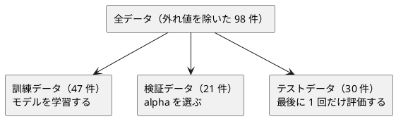

# 第 12 章: 正則化とモデル選択

## 12.1 はじめに

第 11 章では、モデルの測り方を作りました。この章では、測った結果を使って **モデルを選びます**。

- **正則化** — 係数が大きくなりすぎないように罰則を加え、過学習を抑えます。リッジ回帰を Nx で自作します
- **モデル選択** — 正則化の強さ `alpha` を変えて実験し、**検証データ** で選びます。テストデータは最後に 1 回だけ使います

Elixir 版で見どころになるのは、次の 4 点です。

- **Scholar にリッジ回帰はあるが、ラッソ回帰は無い。** リッジ回帰は `Scholar.Linear.RidgeRegression` と突き合わせられますが、ラッソ回帰は自作したものがそのまま最終実装になります（[ADR 012](../../../adr/012-elixir-ml-libraries.md)）。第 3 章の決定木、第 8 章の前処理に続いて 3 度目です
- **書き換わる変数が無いところで座標降下法を書く。** ラッソ回帰は行列を解いて終わりにできず、係数を 1 つずつ動かす反復計算になります。Ruby 版は `@weights` と `@residuals` を書き換えるクラスにしました。**Elixir は係数をタプルに入れて畳み込みで持ち回ります**
- **リッジ回帰の差は「解き方の既定」だった。** 9 列の多項式特徴量では **f64 でも 5e-6 の差** が残りましたが、Scholar の `solver` を既定の `:svd` から `:cholesky` に変えると **1 ビットも違わなくなりました**。第 7 章で線形回帰が特異値分解のせいでずれたのと、同じ理由の再登場です
- **正則化の強さの尺度は実装ごとに違う。** 自作のラッソは件数で割らない目的関数を使うので、件数で割る実装（Java 版・Clojure 版が使う Tribuo）の `alpha = 0.5` は、訓練データ 47 件では `23.5` にあたります

[Python 版の第 12 章](../python/12-regularization-and-model-selection.md) と同じ TODO リストで進め、[Clojure 版](../clojure/12-regularization-and-model-selection.md)・[Java 版](../java/12-regularization-and-model-selection.md)・[Ruby 版](../ruby/12-regularization-and-model-selection.md) と対比します。

## 12.2 過学習と正則化

### 係数が大きくなりすぎる

線形回帰は、誤差の 2 乗の合計が最小になるように係数を決めます。特徴量が多いと、訓練データの細かな揺れにまで合わせようとして、係数の絶対値が大きくなりがちです。係数が大きいモデルは、入力が少し変わっただけで予測が大きく変わるので、未知のデータに弱くなります。

### 係数の大きさに罰則を加える

正則化は、誤差の 2 乗の合計に「係数の大きさ」への罰則を加えて最小化します。

| 手法 | 最小化するもの | 係数への効果 |
|------|--------------|------------|
| 線形回帰 | 誤差の 2 乗の合計 | 制約なし |
| リッジ回帰 | 誤差の 2 乗の合計 + `alpha` × 係数の 2 乗の合計 | 全体を小さく縮める |
| ラッソ回帰 | 誤差の 2 乗の合計 + `alpha` × 係数の絶対値の合計 | 一部の係数をちょうど 0 にする |

`alpha` は正則化の強さです。0 なら線形回帰と同じで、大きくするほど係数は小さくなります。大きすぎると、今度は訓練データにも合わなくなります（学習不足）。

### リッジ回帰の解き方

リッジ回帰は、行列の計算で係数を直接求められます（閉形式）。特徴量の行列を `X`、正解を `t` として、それぞれから平均を引いた（中心化した）うえで、次の連立一次方程式を解きます。

```text
(Xᵀ X + alpha × I) w = Xᵀ t
```

`I` は単位行列です。切片は「正解の平均 − 特徴量の平均と係数の内積」で求めます。中心化してから解くのは、**切片には罰則をかけない** ためです。第 7 章の正規方程式に `alpha × I` が加わっただけなので、第 7 章と同じく `Nx.transpose/1`・`Nx.dot/2`・`Nx.LinAlg.solve/2` で解けます。足りないのは単位行列だけで、これは `Nx.eye/2` があります。

### ラッソ回帰の解き方

ラッソ回帰はそうはいきません。`alpha × 係数の絶対値の合計` は原点で折れていて微分できないので、閉形式がありません。係数を 1 つずつ順に動かし、**軟しきい値作用素** で 0 に寄せる反復計算（座標降下法）を使います。

```text
w_j ← soft_threshold(列 j と残差の内積, alpha) / 列 j の 2 乗和
soft_threshold(v, a) = v - a  (v > a のとき)
                     = v + a  (v < -a のとき)
                     = 0      (それ以外)
```

「しきい値より小さい相関しかない列は、係数をちょうど 0 にする」というのが、ラッソが特徴量を選べる理由です。

## 12.3 題材とデータ

### Boston.csv

この章で使うのは `Boston.csv` です。そのうち、住居の平均部屋数（`RM`）・生徒と教師の比率（`PTRATIO`）・低所得者の割合（`LSTAT`）の 3 つを特徴量に、住宅価格（`PRICE`）を正解にします。学習データの入手と配置は [第 1 章](01-machine-learning-and-first-test.md) の「題材とデータ」を参照してください。

### 過学習が起きやすい状況を作る

3 つの特徴量をそれぞれ標準化（平均 0・標準偏差 1）したうえで、2 乗の列と、2 つの列の積（交互作用）の列を加えます。3 列が 9 列に増え、少ない件数に対しては過学習が起きやすくなります。この章では、他の言語版と同じく「**標準化してから 2 次の項を作る**」順で、章の中に最小限の変換を用意します。

### 訓練・検証・テストの 3 つに分ける

`alpha` をテストデータの結果で選ぶと、テストデータが「未知のデータ」ではなくなります。そこで 3 つに分けます。



分割には第 2 章の `split_train_test/4` を 2 回使います。1 回目で全体を訓練用とテスト用に、2 回目で訓練用をさらに訓練データと検証データに分けます。

## 12.4 TODO リストの作成

**TODO リスト**:

- [ ] リッジ回帰を自作する
  - [ ] `alpha` が 0 なら最小二乗法と同じ係数と切片になる
  - [ ] `alpha` が 0 なら第 7 章の線形回帰と同じ係数になる
  - [ ] `alpha` を大きくすると係数が小さくなる
  - [ ] 切片には罰則がかからない
  - [ ] 係数と切片から予測する
- [ ] ラッソ回帰を座標降下法で自作する
  - [ ] 軟しきい値作用素
  - [ ] `alpha` が 0 に近ければ最小二乗法とほぼ同じになる
  - [ ] `alpha` を大きくすると係数がちょうど 0 になる
- [ ] 正則化の強さごとの実験結果を記録する
- [ ] 検証データの決定係数が最も高い実験を選ぶ（同点なら先を選ぶ）
- [ ] 0 になった係数の特徴量名を返す
- [ ] 標準化してから 2 次の多項式特徴量を作る
- [ ] z スコアで外れ値の行を除く
- [ ] `Scholar.Linear.RidgeRegression` と突き合わせる
- [ ] 実データを 3 つに分けて、線形回帰・リッジ回帰・ラッソ回帰を比べる

## 12.5 リッジ回帰を自作する

### Red: 最小二乗法と同じになるテスト

`alpha` が 0 なら正則化が効かないので、最小二乗法と同じ答えになるはずです。`t = 2 * x1 + 1 * x2 + 1` にちょうど乗る 5 行のデータを用意しました。

```elixir
  # 2 列の小さな人工データ。t = 2 * x1 + 1 * x2 + 1 にちょうど乗る。
  defp x, do: [[1.0, 2.0], [2.0, 1.0], [3.0, 5.0], [4.0, 3.0], [5.0, 7.0]]
  defp t, do: [5.0, 6.0, 12.0, 12.0, 18.0]

  describe "リッジ回帰" do
    test "alpha が零なら最小二乗法と同じ係数と切片になる" do
      fitted = C.ridge_fit(x(), t(), 0.0)

      assert_in_delta Enum.at(fitted.coefficients, 0), 2.0, 1.0e-9
      assert_in_delta Enum.at(fitted.coefficients, 1), 1.0, 1.0e-9
      assert_in_delta fitted.intercept, 1.0, 1.0e-9
    end
```

期待値を手で置くだけでなく、**第 7 章の実装とも突き合わせます**。第 7 章の `fit/4` は列名をキーにしたマップを取るので、行列からマップに直して渡します。

```elixir
    test "alpha が零なら第 7 章の線形回帰と同じ係数になる" do
      columns = [:a, :b]
      rows = Enum.map(x(), fn [a, b] -> %{a: a, b: b} end)
      seventh = Chapter07.fit(rows, t(), columns)
      fitted = C.ridge_fit(x(), t(), 0.0)

      assert_in_delta fitted.intercept, seventh.intercept, 1.0e-9

      for {column, coefficient} <- Enum.zip(columns, fitted.coefficients) do
        assert_in_delta coefficient, Chapter07.coefficient(seventh, column), 1.0e-9
      end
    end
```

第 7 章は「先頭に 1 の列を足した計画行列」で切片も一緒に解き、この章は「中心化してから解いて切片を後から求める」ので、**手順が違うのに同じ答えになる** ことを確かめています。三角測量です。

正則化が効いていることも、2 つの性質で固定します。

```elixir
    test "alpha を大きくすると係数が小さくなる" do
      sums =
        Enum.map([0.0, 1.0, 10.0, 100.0], fn alpha ->
          C.coefficient_abs_sum(C.ridge_fit(x(), t(), alpha))
        end)

      assert sums == Enum.sort(sums, :desc)
    end

    test "切片には罰則がかからない" do
      # 正解に 100 を足すと、切片だけが 100 増えて係数は変わらない
      shifted = C.ridge_fit(x(), Enum.map(t(), &(&1 + 100.0)), 10.0)
      base = C.ridge_fit(x(), t(), 10.0)

      assert_in_delta shifted.intercept, base.intercept + 100.0, 1.0e-9

      for {a, b} <- Enum.zip(shifted.coefficients, base.coefficients) do
        assert_in_delta a, b, 1.0e-9
      end
    end
```

2 つ目は、中心化の効果をそのまま仕様にしたテストです。正解を 100 だけ平行移動しても、**係数は 1 つも動かず、切片だけが 100 増える**。これが「切片に罰則がかからない」ということです。中心化を忘れると、`alpha` が切片も縮めてしまい、このテストが落ちます。

### Green: 中心化して解く

```elixir
  def ridge_fit(x, t, alpha) do
    if length(x) != length(t) do
      raise ArgumentError, "特徴量と正解の件数が違います: #{length(x)} と #{length(t)}"
    end

    x_means = column_means(x)
    t_mean = Enum.sum(t) / length(t)
    centered = Nx.tensor(center(x, x_means), type: :f64)
    transposed = Nx.transpose(centered)
    residuals = Nx.new_axis(Nx.tensor(Enum.map(t, &(&1 - t_mean)), type: :f64), 1)

    penalized =
      Nx.add(
        Nx.dot(transposed, centered),
        Nx.multiply(Nx.eye(length(x_means), type: :f64), alpha)
      )

    coefficients =
      penalized
      |> Nx.LinAlg.solve(Nx.dot(transposed, residuals))
      |> Nx.squeeze(axes: [1])
      |> Nx.to_flat_list()

    model(coefficients, t_mean - dot(x_means, coefficients))
  end
```

第 7 章の `fit/4` とほとんど同じ形です。違いは 3 つだけです。

- **中心化を Elixir 側で済ませてからテンソルにする。** `column_means/1` と `center/2` は素のリストの関数です。Nx に移す前に引いてしまえば、切片の扱いを Nx の中に持ち込まずに済みます
- **`Nx.eye(n, type: :f64)` に `alpha` を掛けて足す。** これが正則化そのものです。`alpha` が 0 なら 0 行列を足すだけなので、第 7 章と同じ解になります
- **`type: :f64` を 3 か所で明示する。** 第 7 章で決めた約束をそのまま守ります。既定の f32 だと、`alpha = 0.1` と `1.0` の差が係数の有効桁に埋もれます

`Nx.squeeze(axes: [1])` で `{n, 1}` の列ベクトルを `{n}` に落として、`Nx.to_flat_list/1` でリストに戻します。**モデルの外側は素のリストとマップ** に保つのが、第 7 章から続けている方針です。

### 予測する

```elixir
  @doc "行ごとの予測値。行列の列数は係数の数と同じでなければならない。"
  def predict(%{coefficients: coefficients, intercept: intercept}, x) do
    Enum.map(x, fn row ->
      if length(row) != length(coefficients) do
        raise ArgumentError,
              "特徴量の列数 #{length(row)} と係数の数 #{length(coefficients)} が違います"
      end

      intercept + dot(row, coefficients)
    end)
  end
```

第 7 章の `predict_one/2` は列名で係数を引いていたので、列の並び順を問いませんでした。この章のモデルは **列名を持たない** ので、並び順が唯一の対応づけです。そのぶん、**列数が違ったら必ず止める** ようにしました。`dot/2` の中身は `Enum.zip_with/3` なので、放っておくと短いほうに合わせて黙って通ります。第 11 章の `require_same_size/2` と同じ判断です。

## 12.6 ラッソ回帰を座標降下法で自作する

### 軟しきい値作用素

関数節のガードで、3 つの場合をそのまま並べます。

```elixir
  @doc "軟しきい値作用素。`|value|` が `threshold` 以下なら 0 にし、そうでなければ 0 のほうへ縮める。"
  def soft_threshold(value, threshold) when value > threshold, do: value - threshold
  def soft_threshold(value, threshold) when value < -threshold, do: value + threshold
  def soft_threshold(_value, _threshold), do: 0.0
```

```elixir
    test "軟しきい値作用素はしきい値の分だけ零に寄せる" do
      assert C.soft_threshold(3.0, 1.0) == 2.0
      assert C.soft_threshold(-3.0, 1.0) == -2.0
      assert C.soft_threshold(0.5, 1.0) == 0.0
      assert C.soft_threshold(-0.5, 1.0) == 0.0
    end
```

`assert_in_delta` ではなく `==` で比べています。**0 になることがこの関数の存在意義** なので、「だいたい 0」では意味がありません。ラッソが特徴量を選べるのは、ここが厳密に 0 だからです。

### 書き換わる変数を使わずに反復する

Ruby 版は `CoordinateDescent` というクラスを作り、`@weights` と `@residuals` を書き換えながら係数を 1 つずつ動かしました。Elixir にはそれができません。係数をタプルに入れ、残差と一緒に畳み込みで持ち回ります。

```elixir
  def lasso_fit(x, t, alpha) do
    if length(x) != length(t) do
      raise ArgumentError, "特徴量と正解の件数が違います: #{length(x)} と #{length(t)}"
    end

    x_means = column_means(x)
    t_mean = Enum.sum(t) / length(t)
    columns = transpose(center(x, x_means))
    norms = Enum.map(columns, fn column -> dot(column, column) end)
    weights = Tuple.duplicate(0.0, length(columns))

    {fitted, _residuals} =
      descend(
        Enum.zip([columns, norms, 0..(length(columns) - 1)]),
        alpha,
        weights,
        Enum.map(t, &(&1 - t_mean)),
        @max_iterations
      )

    coefficients = Tuple.to_list(fitted)
    model(coefficients, t_mean - dot(x_means, coefficients))
  end
```

係数を **タプル** にしたのは、`put_elem/3` で特定の位置だけを差し替えられるからです。リストだと `List.replace_at/3` が毎回先頭からたどるので、列数の 2 乗の手間になります。第 11 章の `pick/2` で「添字で引きたいならタプル」と書いたのと同じ理由で、今度は「**添字で書き換えたいならタプル**」です。

列・列の 2 乗和・位置を `Enum.zip/1` で 1 つのリストにまとめてから渡しているのも、毎回の掃引で作り直さないためです。

反復は 2 つの再帰の節で表します。

```elixir
  # 係数がどれも @tolerance より動かなくなるまで、すべての係数を 1 回ずつ動かす。
  defp descend(_columns, _alpha, weights, residuals, 0), do: {weights, residuals}

  defp descend(columns, alpha, weights, residuals, iterations) do
    {weights, residuals, delta} = sweep(columns, alpha, weights, residuals)

    if delta < @tolerance do
      {weights, residuals}
    else
      descend(columns, alpha, weights, residuals, iterations - 1)
    end
  end
```

**繰り返しの上限をカウントダウンの引数にして、0 の節で止めます。** Ruby 版の `MAX_ITERATIONS.times { break if ... }` にあたるものです。`while` が無い言語では、上限が引数に現れるほうがむしろ読みやすくなります。

1 回の掃引は `Enum.reduce/3` です。

```elixir
  # すべての係数を 1 回ずつ動かし、いちばん大きく動いた大きさを一緒に返す。
  defp sweep(columns, alpha, weights, residuals) do
    Enum.reduce(columns, {weights, residuals, 0.0}, fn entry, acc ->
      update(entry, alpha, acc)
    end)
  end

  defp update({_column, +0.0, _index}, _alpha, acc), do: acc

  defp update({column, norm, index}, alpha, {weights, residuals, delta}) do
    old = elem(weights, index)

    # いったん列の寄与を残差に戻してから、残差との相関で係数を決め直す
    restored = Enum.zip_with(residuals, column, fn r, value -> r + old * value end)
    weight = soft_threshold(dot(column, restored), alpha) / norm
    removed = Enum.zip_with(restored, column, fn r, value -> r - weight * value end)

    {put_elem(weights, index, weight), removed, max(delta, abs(weight - old))}
  end
```

- 累積は `{係数, 残差, いちばん大きな動き}` の 3 つ組です。Ruby 版がインスタンス変数 2 つと `map(...).max` で表したものが、そのまま 1 つのタプルになりました
- **ゼロ除算の防止も関数節で書けました。** 定数列（2 乗和が 0）は `update({_column, +0.0, _index}, _alpha, acc), do: acc` の節が受け止め、何もせずに次へ進みます。`if @norms[index].zero?` という早期リターンより、「そういう列は動かさない」という意図が形に出ます
- 残差は毎回 `Enum.zip_with/3` で作り直します。書き換えないので、途中の状態が別のところに漏れません。列数 9・件数 47 のこの章では、速度は問題になりませんでした

### Red: 0 になることを確かめる

```elixir
    test "alpha が零に近ければ最小二乗法とほぼ同じになる" do
      fitted = C.lasso_fit(x(), t(), 1.0e-9)

      assert_in_delta Enum.at(fitted.coefficients, 0), 2.0, 1.0e-6
      assert_in_delta Enum.at(fitted.coefficients, 1), 1.0, 1.0e-6
      assert_in_delta fitted.intercept, 1.0, 1.0e-6
    end

    test "alpha を大きくすると係数がちょうど零になる" do
      fitted = C.lasso_fit(x(), t(), 50.0)

      assert fitted.coefficients == [0.0, 0.0]
      # 係数がすべて 0 なら、予測は正解の平均値になる
      assert_in_delta fitted.intercept, Enum.sum(t()) / length(t()), 1.0e-9
    end

    test "リッジ回帰と違って係数がちょうど零になる" do
      lasso = C.lasso_fit(x(), t(), 20.0)
      ridge = C.ridge_fit(x(), t(), 20.0)

      assert Enum.any?(lasso.coefficients, &(&1 == 0.0))
      refute Enum.any?(ridge.coefficients, &(&1 == 0.0))
    end
```

3 つ目が、リッジとラッソの違いを 1 つのテストにしたものです。**同じ `alpha` でも、ラッソは 0 にし、リッジは 0 にしない**。12.2 節の表の「係数への効果」の欄が、そのまま実行できる形になりました。

2 つ目の「係数がすべて 0 なら切片は正解の平均値」は、切片の式 `t_mean - dot(x_means, coefficients)` の当然の帰結ですが、書いておくと **反復が暴走していないことの安全網** になります。

## 12.7 実験結果を記録して選ぶ

```elixir
  @doc "`alpha` ごとにリッジ回帰を訓練データで学習し、訓練データと検証データの決定係数を記録する。"
  def run_ridge_experiments(data, alphas) do
    Enum.map(alphas, fn alpha ->
      fitted = ridge_fit(data.x_train, data.t_train, alpha)

      %{
        alpha: alpha,
        train_score: Chapter07.r2_score(data.t_train, predict(fitted, data.x_train)),
        validation_score: Chapter07.r2_score(data.t_valid, predict(fitted, data.x_valid)),
        coefficient_abs_sum: coefficient_abs_sum(fitted)
      }
    end)
  end
```

Java 版は `record Experiment`、Scala 版は `case class` を使いました。Elixir はマップを作った時点で変わりません。`run_ridge_experiments/2` が受け取るのはデータそのものではなく **`x_train`・`t_train`・`x_valid`・`t_valid` を持つ何か** なので、テストでは人工データのマップをそのまま渡せます。

```elixir
  def best_experiment([]), do: raise(ArgumentError, "実験結果が 1 件もありません")
  def best_experiment(experiments), do: Enum.max_by(experiments, & &1.validation_score)
```

空の場合を **1 つ目の関数節** で受けているのが Elixir らしいところです。`if experiments == []` と書く必要がありません。

同点の扱いには言語ごとの違いがあります。

```elixir
    test "同じ値なら先の実験を選ぶ" do
      experiments = [
        %{alpha: 1.0, validation_score: 0.5},
        %{alpha: 2.0, validation_score: 0.5}
      ]

      assert C.best_experiment(experiments).alpha == 1.0
    end
```

**`Enum.max_by/2` は同値なら先のものを返します。** Clojure 版は `max-key` が同値なら後ろを返すので、厳密な不等号で自分で畳み直していました。第 3 章の `majority/1` でも同じことに気づいていて、Elixir は 2 度とも「先を選ぶ」側でした。**弱い正則化を選ぶ（＝迷ったらモデルを複雑にしない）** という意味で、こちらが望ましい振る舞いです。ただし、これは言語が選んだ既定なので、テストに書いて仕様として固定しておきます。

## 12.8 0 になった係数の特徴量名を返す

```elixir
  @doc "係数がちょうど 0 になった特徴量の名前を、列の順に返す。"
  def zero_coefficient_names(coefficients, names) do
    if length(coefficients) != length(names) do
      raise ArgumentError, "係数と特徴量名の数が違います"
    end

    coefficients
    |> Enum.zip(names)
    |> Enum.filter(fn {value, _name} -> value == 0.0 end)
    |> Enum.map(&elem(&1, 1))
  end
```

ここでも `value == 0.0` と厳密に比べます。`abs(value) < 1.0e-12` のような判定にすると、**「ラッソが 0 にした」と「たまたま小さい」の区別が消えます**。ラッソの価値は前者にあるので、曖昧にしません。

`Enum.zip/2` の前に長さを確かめているのは、ここでも同じ理由です。係数が 1 つ足りないまま並べると、**名前が 1 つずれた結果が黙って返ります**。

## 12.9 最小限の前処理

### 標準化してから 2 次の項を作る

```elixir
  @doc "訓練データの列ごとの平均と、件数 n で割る標準偏差を求める。"
  def scaler_fit(x, columns) do
    stats =
      Enum.map(columns, fn column ->
        values = Enum.map(x, &Map.fetch!(&1, column))
        mean = Enum.sum(values) / length(values)
        {mean, :math.sqrt(sum_of_squares(Enum.map(values, &(&1 - mean))) / length(values))}
      end)

    %{
      columns: columns,
      means: Enum.map(stats, &elem(&1, 0)),
      stds: Enum.map(stats, &elem(&1, 1))
    }
  end

  @doc "標準化した値と、その 2 次の項を並べた行列にする。"
  def scaler_transform(scaler, x) do
    %{columns: columns, means: means, stds: stds} = scaler
    combinations = pairs(length(columns))

    Enum.map(x, fn features ->
      z =
        Enum.zip([columns, means, stds])
        |> Enum.map(fn {column, mean, std} -> (Map.fetch!(features, column) - mean) / std end)

      z ++ Enum.map(combinations, fn {i, j} -> Enum.at(z, i) * Enum.at(z, j) end)
    end)
  end
```

第 8 章の前処理と同じく、**`fit` と `transform` を分けます**。平均と標準偏差は訓練データだけから求め、検証データとテストデータも同じ値で変換します。分けないと、検証データの分布が訓練に漏れます。

```elixir
    test "検証データにも訓練データの平均と標準偏差を使う", %{rows: rows, scaler: scaler} do
      # 訓練データの平均（a=3.0）をそのまま引くので、a=3.0 の行は 0 になる
      [[a | _]] = C.scaler_transform(scaler, [%{a: 3.0, b: 20.0}])
      assert_in_delta a, 0.0, 1.0e-12
      assert length(rows) == 3
    end
```

標準偏差は **件数 n で割ります**（母標準偏差）。12.9 節の外れ値除去では **n - 1 で割ります**（標本標準偏差）。ややこしいですが、他の言語版と数値をそろえるために、どちらもそのまま合わせました。`scaler_fit/2` と `remove_outliers/3` のドキュメント文字列に、どちらで割るかを明記してあります。

2 次の項の列は、`pairs/1` が返す `{i, j}`（`i <= j`）の組で作ります。

```elixir
  # 2 次の項を作る列の組（i <= j）。
  defp pairs(n), do: for(i <- 0..(n - 1), j <- i..(n - 1), do: {i, j})
```

内包表記の `j <- i..(n - 1)` で、**前の生成子の変数を後ろの生成子の範囲に使える** のが効いています。`i <= j` を条件で弾く書き方より短く、重複が構造的に出ません。

列名も同じ組から作ります。

```elixir
  def feature_names(%{columns: columns}) do
    names = Enum.map(columns, &to_string/1)

    names ++
      Enum.map(pairs(length(columns)), fn
        {i, i} -> "#{Enum.at(names, i)}^2"
        {i, j} -> "#{Enum.at(names, i)} #{Enum.at(names, j)}"
      end)
  end
```

無名関数の 2 つの節で、2 乗（`{i, i}`）と積（`{i, j}`）を分けています。**同じ変数名を 2 回書くと「同じ値」というパターン** になるのが Elixir のパターンマッチです。`if i == j` と書かずに済みました。

```elixir
    test "列名は元の列、二乗、積の順になる", %{scaler: scaler} do
      assert C.feature_names(scaler) == ["a", "b", "a^2", "a b", "b^2"]
    end
```

列の並びと列名の並びが一致していることが、12.8 節の `zero_coefficient_names/2` が正しい名前を返す前提になります。

### z スコアで外れ値を除く

```elixir
  def remove_outliers(table, columns, threshold) do
    stats =
      Enum.map(columns, fn column ->
        values = Enum.map(table.rows, &required_number(&1, column))
        mean = Enum.sum(values) / length(values)

        {column, mean,
         :math.sqrt(sum_of_squares(Enum.map(values, &(&1 - mean))) / (length(values) - 1))}
      end)

    %{table | rows: Enum.reject(table.rows, &outlier?(&1, stats, threshold))}
  end
```

第 7 章の外れ値は「SNS2 が大きく、興行収入が小さい」という **データを見て決めた条件** でした。この章は z スコアという一般的な規準です。特徴量の 3 列と正解の 1 列のどれか 1 つでも、平均から標準偏差の 3 倍を超えて離れていたら、その行を除きます。

```elixir
  defp required_number(row, column) do
    Chapter02.number(row, column) || raise(ArgumentError, "値が空欄です: #{column}")
  end
```

第 2 章の `number/2` は空欄に `nil` を返します。この章では **補完せずに失敗させます**。平均と標準偏差を求める途中に `nil` が混ざると、`ArithmeticError` という分かりにくい形で落ちるからです。「どの列が空欄か」を言えるところで止めます。

```elixir
    test "空欄があれば失敗する" do
      table = %{columns: [:v], rows: [%{v: "1"}, %{v: ""}]}

      assert_raise ArgumentError, fn -> C.remove_outliers(table, [:v], 3.0) end
    end
```

## 12.10 Scholar のリッジ回帰と突き合わせる

### 尺度が同じかどうかを先に確かめる

`Scholar.Linear.RidgeRegression` のドキュメントには、最小化するものが `||y - Xw||²₂ + α||w||²₂` と書かれています。自作の `(Xᵀ X + alpha I) w = Xᵀ t` は、これを微分して 0 と置いたものなので、**`alpha` の尺度がそのまま一致します**。件数で割る・割らないの読み替えは要りません。

`fit_intercept?` は既定で `true` で、そのときは Scholar も中心化してから解き、切片に罰則をかけません。ここも自作と同じです。

```elixir
  def scholar_ridge_fit(x, t, alpha, solver \\ :svd) do
    fitted =
      RidgeRegression.fit(Nx.tensor(x, type: :f64), Nx.tensor(t, type: :f64),
        alpha: alpha,
        solver: solver
      )

    model(
      Nx.to_flat_list(fitted.coefficients),
      Nx.to_number(Nx.squeeze(fitted.intercept))
    )
  end
```

`solver` を引数にしてあるのは、この節の後半で解き方の違いを見せるためです。既定は Scholar と同じ `:svd` にしました。

第 7 章の `LinearRegression` と違い、**リッジ回帰は f64 のまま解いてくれます**。

```elixir
    test "Scholar のリッジ回帰も f64 のまま返る" do
      fitted =
        RidgeRegression.fit(
          Nx.tensor(x(), type: :f64),
          Nx.tensor(t(), type: :f64),
          alpha: 1.0
        )

      assert Nx.type(fitted.coefficients) == {:f, 64}
    end
```

第 11 章の `Scholar.Metrics.Classification` が f32 に落としたのと対照的です。**Scholar の中でも、テンソルの型が素直に通るところと通らないところがある** ので、章ごとに実測して確かめています。

### 人工データでは 1e-8 で一致する

```elixir
    test "同じ alpha なら係数と切片が一致する" do
      for alpha <- [0.1, 1.0, 10.0, 100.0] do
        mine = C.ridge_fit(x(), t(), alpha)
        theirs = C.scholar_ridge_fit(x(), t(), alpha)

        assert_in_delta mine.intercept, theirs.intercept, 1.0e-8

        for {a, b} <- Enum.zip(mine.coefficients, theirs.coefficients) do
          assert_in_delta a, b, 1.0e-8
        end
      end
    end
```

2 列 5 行のデータなら、4 つの `alpha` すべてで 1e-8 まで一致しました。第 7 章の `LinearRegression` が特異値分解のせいで最小二乗解に届かなかったのとは違い、**リッジ回帰は素直に同じ答えに来ます**。

### 実データでは 5e-6 の差が残った

ところが、9 列 47 件の実データでは同じ許容誤差では通りませんでした。

```console
Expected the difference between 20.49549461089489 and 20.495498828011463
(4.217116572391433e-6) to be less than or equal to 1.0e-6
```

係数の最大の差は `5.06e-6` です。どちらも f64 で計算しているのに、有効桁が 6 桁ほどしか合っていません。原因を `RidgeRegression` のオプションまで追うと、**解き方の既定** でした。

| `solver` | 解き方 | 既定 |
|---|---|---|
| `:svd` | `A` の特異値分解から係数を求める | **こちら** |
| `:cholesky` | `Nx.LinAlg.solve/2` で `(Xᵀ X + alpha I) w = Xᵀ t` を解く | |

ドキュメントには「`:svd` は特異な行列に対して `:cholesky` より安定だが遅い」と書かれています。自作が使っているのは `Nx.LinAlg.solve/2` なので、**`:cholesky` のほうが自作と同じ解き方** です。切り替えて確かめました。

```elixir
    @tag :data
    test "solver を cholesky にすると実データでも一ビットも違わない" do
      data = boston()
      mine = C.ridge_fit(data.x_train, data.t_train, 10.0)
      theirs = C.scholar_ridge_fit(data.x_train, data.t_train, 10.0, :cholesky)

      assert mine.coefficients == theirs.coefficients
      assert mine.intercept == theirs.intercept
    end
```

**`assert_in_delta` ではなく `==` で通りました。** 係数 9 つも切片も、1 ビットも違いません。差 5e-6 は「実装のどちらかが間違っている」のではなく、**特異値分解と LU 分解という 2 つの正しい解き方の、丸め方の違い** だったと分かります。

差が 6 桁まで広がるのは、データの条件数のせいです。標準化した 3 列から作った 2 次の項（`RM^2`・`RM PTRATIO`・…）は元の列と強く相関するので、`Xᵀ X` はほとんど特異になります。`alpha = 10.0` を足しても条件数は大きいままで、f64 の有効桁（約 16 桁）から 10 桁ほどを失えば、6 桁しか合わないのは計算どおりです。

第 7 章では、`LinearRegression` が `Nx.LinAlg.pinv`（特異値分解）で解くために最小二乗解に届かず、列を標準化して初めて近づきました。**同じ原因が、リッジ回帰では `solver` というオプションとして表に出ている** わけです。第 7 章と違い、こちらは呼ぶ側が選べます。

既定の `:svd` との比較も、許容誤差 1e-5 のテストとして残しました。

```elixir
    @tag :data
    test "実データでも自作のリッジ回帰は Scholar と一致する" do
      data = boston()
      mine = C.ridge_fit(data.x_train, data.t_train, 10.0)
      theirs = C.scholar_ridge_fit(data.x_train, data.t_train, 10.0)

      # 9 列の多項式特徴量は桁が近く条件数が大きいので、閉形式（自作）と
      # 既定の特異値分解（Scholar）の差は f64 でも 1e-5 の手前までしか詰まらない
      assert_in_delta mine.intercept, theirs.intercept, 1.0e-5

      for {a, b} <- Enum.zip(mine.coefficients, theirs.coefficients) do
        assert_in_delta a, b, 1.0e-5
      end
    end
```

2 つのテストが並んでいることに意味があります。**「既定ならこれくらいずれる」「解き方をそろえれば完全に一致する」の両方** が、実行できる形で残りました。表示にも `Scholar のリッジ回帰との係数の最大の差` として出しています。

### ラッソ回帰は Scholar に無い

`Scholar.Linear` にあるのは `LinearRegression`・`RidgeRegression`・`LogisticRegression`・`PolynomialRegression`・`BayesianRidgeRegression`・`IsotonicRegression`・`SVM` で、**ラッソ回帰も Elastic Net もありません**。Java 版・Clojure 版は Tribuo の `ElasticNetCDTrainer` と、Ruby 版は Rumale の `Lasso` と突き合わせましたが、Elixir 版にはその相手がいません。

そこで、12.6 節で作ったものが **そのまま最終実装** になります。第 3 章の決定木、第 8 章の前処理パイプラインに続いて 3 度目です。ライブラリと照らせない代わりに、次の 3 つで正しさを支えました。

1. `alpha` を 0 に近づけると最小二乗法に一致する（12.6 節）
2. `alpha` を大きくすると係数がちょうど 0 になり、切片は正解の平均値になる（12.6 節）
3. 実データで 0 になった特徴量が、Java 版・Clojure 版が Tribuo で得た 3 列と一致する（12.11 節）

3 つ目が、**間接的な突き合わせ** です。相手のライブラリがこの言語に無くても、他の言語版の実行結果が仕様の役を果たします。

### 正則化の強さの尺度をそろえる

3 つ目を成り立たせるには、`alpha` の尺度を読み替える必要がありました。自作のラッソが最小にするのは `½‖t - Xw‖² + alpha ‖w‖₁` で、**件数で割りません**。Tribuo の `ElasticNetCDTrainer` は、誤差の 2 乗の合計を `2n` で割った値に罰則を足します。したがって、同じ解にするには次の関係になります。

```text
自作の alpha = Tribuo の alpha × 訓練データの件数
```

訓練データは 47 件なので、Clojure 版・Java 版の `0.5` は `0.5 × 47 = 23.5` にあたります。

```elixir
  # ラッソ回帰の正則化の強さ。自作の目的関数は件数で割らないので、件数で割る実装
  # （Clojure 版・Java 版が使う Tribuo の ElasticNetCDTrainer）の alpha=0.5 は
  # 訓練データ 47 件では 0.5 * 47 = 23.5 にあたる。
  @lasso_alpha 23.5
```

実際に `23.5` で走らせると、0 になった特徴量が **`PTRATIO^2`・`PTRATIO LSTAT`・`LSTAT^2`** の 3 列で、Clojure 版・Java 版と一致しました。`20.0` でも `30.0` でも同じ 3 列になるので、選択は安定しています。

**「同じ alpha」と書いてあっても、目的関数が同じとは限りません。** Ruby 版が Rumale と突き合わせるときに「中心化せずに渡すと切片にも罰則がかかる」ことを確かめていたのと同じ種類の注意です。ライブラリを替えるとき、まず読むのは「何を最小化するか」の式です。

## 12.11 実データで比べる

### 3 つに分けて特徴量を作る

```elixir
  def prepare_boston(path, test_size, validation_size, seed) do
    table =
      remove_outliers(
        Chapter02.load_table(path),
        [@target | @feature_columns],
        @outlier_threshold
      )

    x = Enum.map(table.rows, &feature_map/1)
    t = Enum.map(table.rows, &required_number(&1, @target))
    outer = Chapter02.split_train_test(x, t, test_size, seed)
    inner = Chapter02.split_train_test(outer.x_train, outer.t_train, validation_size, seed)
    scaler = scaler_fit(inner.x_train, @feature_columns)

    %{
      x_train: scaler_transform(scaler, inner.x_train),
      t_train: inner.t_train,
      x_valid: scaler_transform(scaler, inner.x_test),
      t_valid: inner.t_test,
      x_test: scaler_transform(scaler, outer.x_test),
      t_test: outer.t_test,
      feature_names: feature_names(scaler),
      kept: length(table.rows)
    }
  end
```

`split_train_test/4` を 2 回呼び、**外側の訓練データを内側でもう一度分けます**。内側の「テストデータ」が検証データになるので、`x_valid: scaler_transform(scaler, inner.x_test)` と名前を付け替えています。第 2 章の関数を作り直さずに済みました。

`scaler_fit/2` に渡すのは `inner.x_train` だけです。**検証データもテストデータも、標準化の統計には 1 件も使いません。**

### 結果を表示する

```console
$ mix run -e "GettingStartedMl.Chapter12.run()"
データ件数: 98（外れ値 2 件を除外）
訓練データ: 47 件, 検証データ: 21 件, テストデータ: 30 件
特徴量: RM, PTRATIO, LSTAT, RM^2, RM PTRATIO, RM LSTAT, PTRATIO^2, PTRATIO LSTAT, LSTAT^2
alpha  訓練 R²  検証 R²  係数の絶対値の合計
  0.0  0.8827  0.7272  14.187
  0.1  0.8827  0.7274  14.104
  1.0  0.8823  0.7288  13.594
 10.0  0.8681  0.7349  11.573
100.0  0.6583  0.5985  5.684
検証データで選んだ alpha: 10.0
テストデータの決定係数: 線形回帰 0.5224, リッジ回帰 0.6243
Scholar のリッジ回帰との係数の最大の差: 5.1e-6
ラッソ回帰（alpha=23.5）で係数が 0 になった特徴量: PTRATIO^2, PTRATIO LSTAT, LSTAT^2
```

### 結果を読む

- `alpha` を大きくするほど、係数の絶対値の合計は 14.187 から 5.684 へ小さくなりました。訓練データの決定係数は下がり続けます
- 検証データの決定係数は `alpha = 10.0` で最も高く（0.7349）、`100.0` では訓練・検証とも大きく下がりました。正則化が強すぎて学習不足になっています
- 検証データで選んだ `alpha = 10.0` のリッジ回帰は、テストデータの決定係数が 0.6243 で、線形回帰の 0.5224 を上回りました。**訓練データでは線形回帰のほうが高い（0.8827）のに、未知のデータでは正則化したモデルのほうがよく当たっています**
- ラッソ回帰は、9 列のうち `PTRATIO^2`・`PTRATIO LSTAT`・`LSTAT^2` の 3 列の係数をちょうど 0 にしました

**リッジ回帰の実行結果の数値は、Java 版・Scala 版・Clojure 版の同じ節とすべて一致します。** 外れ値の除き方（`n - 1` の標準偏差で z スコア）・2 回の分割（`GettingStartedMl.Random` が `java.util.Random` と同じ線形合同法）・標準化（`n` の標準偏差）・2 次の項の順を、手順の細部までそろえたためです。ラッソ回帰が 0 にした 3 列も、12.10 節の尺度の読み替えを経て一致しました。

Kotlin 版では同じ手順でもリッジ回帰がテストで線形回帰を下回りました。分割の乱数が違い、3 つに入る行が違うからです。100 件ほどのデータでは、**分け方によって結論まで変わりうる** ことを示しています。1 回の分け方に頼らない方法として、第 11 章の交差検証を組み合わせられます。

### 実データのテスト

結論そのものも、性質としてテストに書いておきます。

```elixir
    @tag :data
    test "検証データで選んだリッジ回帰はテストデータで線形回帰を上回る" do
      data = boston()
      best = C.best_experiment(C.run_ridge_experiments(data, C.alphas()))

      score = fn alpha ->
        Chapter07.r2_score(
          data.t_test,
          C.predict(C.ridge_fit(data.x_train, data.t_train, alpha), data.x_test)
        )
      end

      assert score.(best.alpha) > score.(0.0)
    end
```

0.6243 と 0.5224 という数値そのものではなく、**「選んだモデルのほうが良い」という関係** を書きました。前処理の細部を直したときに、数値が動いても結論が保たれているかを教えてくれます。

表示は、第 1 章から続けている形のテストで固定します。値は実装を実データで動かして得たものなので、Red を経ていません。

```elixir
    @tag :data
    test "実行すると正則化の結果を表示する" do
      output = ExUnit.CaptureIO.capture_io(&C.run/0)

      assert String.split(output, "\n", trim: true) == [
               "データ件数: 98（外れ値 2 件を除外）",
               …
               "ラッソ回帰（alpha=23.5）で係数が 0 になった特徴量: PTRATIO^2, PTRATIO LSTAT, LSTAT^2"
             ]
    end
```

## 12.12 品質チェック

```console
$ mix format --check-formatted && mix compile --warnings-as-errors && mix credo --strict && mix test --cover
Checking 19 source files ...
Analysis took 0.6 seconds (0.05s to load, 0.5s running 69 checks on 19 files)
277 mods/funs, found no issues.

181 tests, 0 failures

Percentage | Module
-----------|--------------------------
    97.30% | GettingStartedMl.Chapter12
```

この章で Credo が止めてくれたのは、第 11 章と同じ `Credo.Check.Design.AliasUsage` でした。テストの中で `Scholar.Linear.RidgeRegression.fit(...)` とフルに書いていたところです。`alias Scholar.Linear.RidgeRegression` を足して直しました。

`mix format` は `remove_outliers/3` のタプルと `prepare_boston/4` の `remove_outliers` の呼び出しを、行の長さの都合で折り返しました。整形の結果が読みにくくなったら、それは **式が長すぎるという指摘** なので、素直に受け入れて変数に切り出すか、折り返しのままにするかを選びます。この章では折り返しのままにしました。

学習データが無い環境（`ML_DATA_DIR=/nonexistent mix test`）では、`:data` のテストが 16 件除外されて通ります。

## 12.13 可視化について

Elixir 版では Notebook と可視化を扱いません。`alpha` と係数の大きさの関係（正則化パス）、訓練と検証の決定係数の曲線、リッジとラッソの係数の比較は、[Python 版の第 12 章](../python/12-regularization-and-model-selection.md) と [Kotlin 版の第 12 章](../kotlin/12-regularization-and-model-selection.md) の「Notebook による探索と可視化」の節を参照してください。

`run_ridge_experiments/2` が返すのはマップのリストなので、`Enum.map(experiments, & &1.coefficient_abs_sum)` のように、そのまま座標の並びにできます。

## 12.14 まとめ

この章では、リッジ回帰とラッソ回帰を Elixir の TDD で自作し、検証データでモデルを選び、リッジ回帰を Scholar と突き合わせました。

| 作ったもの | Elixir での表し方 | 他の版 |
|-----------|------------------|-------|
| 正則化したモデル | `%{coefficients: [..], intercept: ..}` のマップ | `record` / `case class` / `Data.define` |
| 実験結果 | `%{alpha:, train_score:, validation_score:, coefficient_abs_sum:}` | `record Experiment` |
| 座標降下法の状態 | `{係数のタプル, 残差, いちばん大きな動き}` の 3 つ組 | 書き換わるインスタンス変数 |
| 標準化＋多項式 | `%{columns:, means:, stds:}` と `scaler_transform/2` | `PolynomialScaler` クラス |
| リッジ回帰 | `Nx.LinAlg.solve/2` で閉形式 | 行列ライブラリ / Tribuo |
| ラッソ回帰 | 自作の座標降下法（**最終実装**） | Tribuo の `ElasticNetCDTrainer` / Rumale の `Lasso` |

Elixir 版ならではの学びです。

1. **書き換わる変数が無くても反復計算は書ける** — 係数をタプルに入れ、`Enum.reduce/3` で `{係数, 残差, 動き}` を持ち回った。Ruby 版のクラスとインスタンス変数が、そのまま 1 つの畳み込みになった。繰り返しの上限は引数のカウントダウンで表す
2. **添字で書き換えたいならタプル** — `put_elem/3` は定数時間、`List.replace_at/3` は線形。第 11 章の `pick/2` で「添字で引きたいならタプル」と学んだことの裏返し
3. **例外的な場合は関数節で受ける** — 2 乗和が 0 の列は `update({_column, +0.0, _index}, ...)` の節が、実験が空の場合は `best_experiment([])` の節が受ける。`if` の早期リターンより、意図が形に出る
4. **パターンの同名変数が `i == j` の代わりになる** — `{i, i} -> "…^2"` と `{i, j} -> "… …"` の 2 節で、2 乗と積を分けた
5. **`Enum.max_by/2` は同値なら先を返す** — Clojure の `max-key` と逆。迷ったら弱い正則化を選ぶという望ましい振る舞いだが、言語の既定なのでテストに書いて固定した
6. **0 かどうかは厳密に比べる** — ラッソの価値は「ちょうど 0」にある。`abs(x) < 1e-12` で判定すると、その価値が消える
7. **「一致しない」の原因はオプションにあった** — 既定の `solver: :svd` では 5e-6 ずれたが、`:cholesky` に変えると 1 ビットも違わなかった。第 7 章の `LinearRegression` が特異値分解でずれたのと同じ原因が、リッジ回帰では呼ぶ側が選べる形で表に出ている。**許容誤差を緩める前に、相手の既定を読む**
8. **「同じ alpha」でも目的関数が違えば別物** — 件数で割る実装の `0.5` は、割らない実装では `23.5`。尺度を読み替えて初めて、他の言語版と同じ 3 列が 0 になった
9. **ライブラリに無いものは、他の言語版の結果で突き合わせる** — Scholar にラッソ回帰は無い。相手がいなくても、Java 版・Clojure 版が Tribuo で得た結果が仕様の役を果たす

次の章では、主成分分析で次元を削減します。`Scholar.Decomposition.PCA` があるので、久しぶりに「自作してからライブラリと突き合わせる」流れに戻ります。
