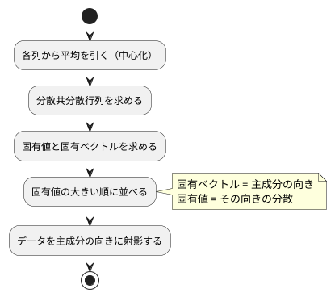

# 第 13 章: 主成分分析による次元削減

## 13.1 はじめに

ここまでの章では、正解ラベルのあるデータで予測をしてきました。この章から扱う **教師なし学習** では、正解ラベルを使わずに、データそのものの構造を調べます。

最初に扱うのは **主成分分析（PCA）** です。住宅価格のデータには 15 個もの列がありますが、列どうしは互いに関係しあっていて、実際にはもっと少ない数の「軸」で大部分を説明できることがあります。主成分分析は、データのばらつきを最もよく説明する新しい軸を探し、たくさんの列を少数の軸に要約します。

[Python 版の第 13 章](../python/13-principal-component-analysis.md) は NumPy の固有値分解で主成分分析を自作し、scikit-learn の `PCA` と突き合わせました。Elixir 版も同じ構成です。中心化・分散共分散行列・並べ替え・符号・射影・寄与率を自作し、固有値分解だけを Nx の `Nx.LinAlg.eigh` に任せます。

この章は、Elixir 版では数少ない **「ライブラリのほうが充実している」章** です。[Java 版](../java/13-principal-component-analysis.md)・[Scala 版](../scala/13-principal-component-analysis.md)・[Clojure 版](../clojure/13-principal-component-analysis.md) が使う Tribuo には主成分分析そのものが無く、固有値分解だけを借りて章を終えました。[Ruby 版](../ruby/13-principal-component-analysis.md) の Rumale には PCA がありますが **寄与率を持たない** ので、主成分から自分で計算し直す必要がありました。ところが `Scholar.Decomposition.PCA` は `:components`・`:mean`・`:explained_variance`・`:explained_variance_ratio` をすべて持っています（[ADR 012](../../../adr/012-elixir-ml-libraries.md)）。つまり **自作の結果を、寄与率まで含めて 1 つ残らず突き合わせられます**。13.10 節がこの章の見どころです。

Livebook と可視化の節は設けません。累積寄与率のグラフや主成分の散布図は [Python 版](../python/13-principal-component-analysis.md) を参照してください。

## 13.2 主成分分析とは

### ばらつきが最も大きい方向を探す

2 つの列が強く相関しているデータを散布図にすると、点は斜めの帯のように並びます。このとき、帯に沿った方向の 1 本の軸を取れば、2 つの列の情報をほぼ 1 つの数値で表せます。この「ばらつき（分散）が最も大きい方向」が **第 1 主成分** です。第 2 主成分は、第 1 主成分と直交する方向のうち、ばらつきが最も大きい方向です。

### 分散共分散行列の固有ベクトル

主成分は、次の手順で求められます。



**分散共分散行列** は、対角に各列の分散、それ以外に 2 列の共分散を並べた行列です。この行列の **固有ベクトル** が主成分の向き、**固有値** がその向きのデータの分散になります。行列 `A` の固有ベクトル `v` と固有値 `λ` は、`A v = λ v`（`A` を掛けても向きが変わらず、長さだけが `λ` 倍になる）を満たします。

### 寄与率

固有値は、その主成分が説明する分散の大きさです。固有値を全体の合計で割った値を **寄与率** と呼び、大きい順に足し上げたものを **累積寄与率** と呼びます。「累積寄与率が 0.8 に届くまで」といった目安で、使う主成分の数を決めます。

## 13.3 題材とデータ

ボストンの住宅価格（`Boston.csv`、100 件）を使います。[第 9 章](09-feature-engineering.md) では `PRICE` を予測する回帰の題材でしたが、この章では正解ラベルを使わないので、`PRICE` も含めたすべての列を主成分分析にかけます。`CRIME` はカテゴリ値なのでダミー変数にし、`RM` の欠損値は列の平均値で補完します。

主成分分析は「ばらつきの大きさ」を見るので、単位の大きい列（`TAX` は数百、`NOX` は 0.5 前後）がそのままでは支配的になります。そこで、すべての列を平均 0・標準偏差 1 にそろえてから分析します。

## 13.4 TODO リストの作成

```text
[ ] 列ごとの平均を求める
[ ] 各列から平均を引く（中心化）
[ ] 分散共分散行列を求める
[ ] Nx の固有値分解の振る舞いを学習用テストで確かめる
[ ] 分散共分散行列を固有値分解して主成分を求める
[ ] 固有ベクトルの符号をそろえる
[ ] 寄与率と累積寄与率を求める
[ ] データを主成分の向きに射影する
[ ] 累積寄与率がしきい値に届く主成分の数を求める
[ ] 主成分への影響が大きい列を求める
[ ] Scholar の PCA と突き合わせる
[ ] Boston を前処理して実データで要約する
```

## 13.5 分散共分散行列を求める

### Red: 分散と共分散

最初のテストは、2 列の分散と共分散です。`[[1, 2], [2, 4], [3, 6]]` は 2 列目が 1 列目のちょうど 2 倍なので、1 列目の分散が 1、2 列目の分散が 4、共分散が 2 になります。

```elixir
test "分散と共分散を並べる" do
  c = C.covariance_matrix([[1.0, 2.0], [2.0, 4.0], [3.0, 6.0]])

  assert close_to?(1.0, c |> Enum.at(0) |> Enum.at(0))
  assert close_to?(4.0, c |> Enum.at(1) |> Enum.at(1))
  assert close_to?(2.0, c |> Enum.at(0) |> Enum.at(1))
  assert Enum.at(Enum.at(c, 0), 1) == Enum.at(Enum.at(c, 1), 0)
end
```

### Green: 行列はリストのリスト

行列は「長さのそろったリストのリスト」で表します。[第 7 章](07-linear-regression.md) で Nx のテンソルを使ったのは正規方程式を解くところだけで、それ以外の計算は素のリストのままでした。この章も同じ方針で、Nx に渡すのは固有値分解と Scholar の境界だけにします。

```elixir
@doc "列ごとの平均を返す。"
def column_means(m) do
  m |> transpose() |> Enum.map(&(Enum.sum(&1) / length(&1)))
end

@doc "各列から平均を引く（中心化）。"
def center(m, means), do: Enum.map(m, &Enum.zip_with(&1, means, fn v, mean -> v - mean end))

@doc "列ごとの分散と、2 列ずつの共分散を並べた行列。件数から 1 を引いた数で割る。"
def covariance_matrix(m) when length(m) < 2 do
  raise ArgumentError, "主成分分析には 2 件以上のデータが必要です（#{length(m)} 件）"
end

def covariance_matrix(m) do
  centered = center(m, column_means(m))
  n = length(m)

  centered
  |> transpose()
  |> Enum.map(fn row ->
    Enum.map(transpose(centered), fn column -> dot(row, column) / (n - 1) end)
  end)
end
```

転置と内積は、`Enum` の関数だけで書けます。

```elixir
defp transpose(m), do: m |> Enum.zip_with(& &1)

defp dot(a, b), do: Enum.sum(Enum.zip_with(a, b, &(&1 * &2)))
```

`Enum.zip_with/2` は「リストのリストを受け取り、各位置の要素を集めたリストに関数を適用する」関数です。恒等関数 `& &1` を渡すと、集めた要素をそのまま返すので **転置そのもの** になります。`Enum.zip_with/3` は 2 つのリストを要素ごとに組み合わせるので、中心化（引き算）も内積（掛けて足す）も 1 行で書けます。[Java 版](../java/13-principal-component-analysis.md) が二重ループと配列の写しで書いた処理が、そのまま式になります。

件数が 1 件以下なら、`n - 1` が 0 になって割り算が壊れます。ここは **ガード節** で止めます。`def covariance_matrix(m) when length(m) < 2 do` のように、関数の頭に条件を書けるのが Elixir です。`if` で分岐するより、「この関数はこの形の引数を受け取る」という約束がはっきりします。

## 13.6 Nx の固有値分解を確かめる

### 学習用テストを書く

固有値分解は Nx の `Nx.LinAlg.eigh`（対称行列用の固有値分解）に任せます。使う前に、振る舞いを **学習用テスト**（自分の予想をテストの形で確かめる小さなテスト）で固定します。確かめたいのは 3 つです。固有値は大きい順か小さい順か、固有ベクトルは行に並ぶのか列に並ぶのか、対称でない行列を渡したらどうなるか。

```elixir
test "固有値を大きい順に返す" do
  %{values: values} = C.eigen_decomposition([[2.0, 0.0], [0.0, 5.0]])

  assert values == [5.0, 2.0]
end
```

対角に 2 と 5 が並ぶ行列の固有値は 2 と 5 です。返ってきたのは `[5.0, 2.0]` で、**大きい順** でした。主成分は寄与率の大きい順に欲しいので、並べ替えは要りません。

固有ベクトルの性質も確かめます。`i` 番目の固有ベクトルは、元の行列を掛けても向きが変わらず、`i` 番目の固有値倍になるはずです。

```elixir
test "固有ベクトルは掛けても向きが変わらず固有値倍になる" do
  m = [[2.0, 1.0], [1.0, 2.0]]
  %{values: values, vectors: vectors} = C.eigen_decomposition(m)

  Enum.zip(values, vectors)
  |> Enum.each(fn {value, vector} ->
    multiplied = Enum.map(m, fn row -> Enum.sum(Enum.zip_with(row, vector, &(&1 * &2))) end)

    assert Enum.all?(Enum.zip(multiplied, vector), fn {left, right} ->
             close_to?(left, value * right)
           end)
  end)
end
```

このテストを通すには、`Nx.LinAlg.eigh` が返す固有ベクトルが **列に並んでいる** ことに気づく必要があります。`i` 番目の固有ベクトルは `v[:, i]` です。1 行に 1 つずつ並べたいので、転置してから取り出します。

### 対称でない行列を渡すと、黙って別の答えが返る

ここが Nx の一番の落とし穴でした。`Nx.LinAlg.eigh` に対称でない行列を渡しても、**例外は出ません**。

```elixir
test "Nx.LinAlg.eigh は上三角だけを見るので、対称かどうかは自分で確かめる" do
  # [[1, 2], [3, 4]] の固有値は 5.37 と -0.37 だが、上三角から作った
  # [[1, 2], [2, 4]] の固有値 5 と 0 が黙って返る
  {values, _vectors} = Nx.LinAlg.eigh(Nx.tensor([[1.0, 2.0], [3.0, 4.0]], type: :f64))

  assert Nx.to_flat_list(values) == [5.0, 0.0]
end
```

`[[1, 2], [3, 4]]` の本当の固有値は 5.372 と −0.372 です。ところが返ってきたのは `[5.0, 0.0]` でした。これは **上三角だけを取って作った `[[1, 2], [2, 4]]` の固有値** です。`eigh` は対称行列を前提にしているので、下三角を読まずに済ませているのです。

Clojure 版で使った Tribuo の `eigenDecomposition` は、対称でない行列に空の `Optional` を返しました。**渡し方を間違えたと分かる** 設計です。Nx はそうではないので、自分で確かめて失敗させます。

```elixir
@doc """
対称行列を固有値分解し、固有値と固有ベクトルを大きい順に返す。

`Nx.LinAlg.eigh` は上三角だけを見るので、対称でない行列を渡しても黙って
別の行列の答えを返す。対称かどうかはここで確かめて失敗させる。
"""
def eigen_decomposition(m) do
  check_symmetric(m)
  {values, vectors} = Nx.LinAlg.eigh(Nx.tensor(m, type: :f64))

  %{
    values: Nx.to_flat_list(values),
    # 固有ベクトルは列に並ぶので、転置して 1 行に 1 つずつにする
    vectors: vectors |> Nx.transpose() |> Nx.to_list()
  }
end
```

```elixir
defp check_symmetric(m) do
  size = length(m)

  if Enum.any?(m, &(length(&1) != size)) do
    raise ArgumentError, "正方行列ではありません: #{size} 行"
  end

  if m != transpose(m) do
    raise ArgumentError, "固有値分解できません（対称行列ではありません）"
  end
end
```

対称かどうかの判定が `m != transpose(m)` の 1 行で済むのは、Elixir のリストが **値として比較できる** からです。Java 版が `Arrays.deepEquals` を必要としたところです。

Nx に渡す直前で `Nx.tensor(m, type: :f64)` に変換し、返ってきたテンソルはすぐ `Nx.to_list/1` でリストに戻します。**テンソルで扱うのはライブラリの境界だけ** という方針は、第 7 章と同じです。`type: :f64` を明示するのも同じ理由で、既定の f32 のままだと寄与率が 4 桁目からずれて、ほかの言語版と比べられません。

## 13.7 主成分を求める

### 完全に相関する 2 列

2 列目が 1 列目のちょうど 2 倍なら、点は 1 本の直線に並びます。第 1 主成分だけで分散をすべて説明できるはずです。

```elixir
test "完全に相関する 2 列なら第 1 主成分だけで分散をすべて説明する" do
  model = C.fit(correlated(), 2)

  assert close_to?(1.0, Enum.at(model.explained_variance_ratio, 0))
  assert close_to?(0.0, Enum.at(model.explained_variance_ratio, 1))
end
```

学習した結果は、Java 版の `PcaModel` レコードにあたるものをマップで表します。Elixir では、値の組を返すのに構造体を定義する必要はありません。

```elixir
@doc "分散共分散行列を固有値分解し、寄与率の大きい順に n_components 個の主成分を求める。"
def fit(m, n_components) do
  %{values: values, vectors: vectors} = m |> covariance_matrix() |> eigen_decomposition()
  check_n_components(n_components, length(values))
  total = Enum.sum(values)
  variances = Enum.take(values, n_components)

  %{
    mean: column_means(m),
    components: vectors |> Enum.take(n_components) |> normalize_signs(),
    explained_variance: variances,
    explained_variance_ratio: Enum.map(variances, &(&1 / total))
  }
end
```

`%{values: values, vectors: vectors} = ...` はパターンマッチでの分解です。マップから必要なキーだけを取り出せるので、`model.values` を何度も書かずに済みます。

### 符号の規則を決める

固有ベクトルは、符号を反転しても同じ向きの軸を表します。ライブラリや実行環境によってどちらが返るかは決まっていないので、**絶対値が最大の要素が正になる** という規則で自分でそろえます。

```elixir
test "絶対値が最大の要素が負なら符号を反転する" do
  assert C.normalize_signs([[-0.8, 0.6]]) == [[0.8, -0.6]]
end

test "絶対値が最大の要素がすでに正ならそのまま" do
  assert C.normalize_signs([[-0.3, 0.4, 0.9]]) == [[-0.3, 0.4, 0.9]]
end

test "絶対値が同じなら前の要素を見る" do
  assert C.normalize_signs([[-0.5, 0.5]]) == [[0.5, -0.5]]
end
```

```elixir
@doc "固有ベクトルは符号が逆でも同じ向きを表すので、絶対値が最大の要素が正になるようにそろえる。"
def normalize_signs(components), do: Enum.map(components, &normalize_sign/1)

# 絶対値が最大の要素。同じなら前の要素を残すように、厳密な > で畳む。
defp largest(row), do: Enum.reduce(row, &if(abs(&1) > abs(&2), do: &1, else: &2))

defp normalize_sign(row) do
  if largest(row) < 0.0, do: Enum.map(row, &(-&1)), else: row
end
```

ここは、どの言語版でも一度つまずくところです。`Enum.max_by(row, &abs/1)` と書きたくなりますが、`Enum.max_by/2` は **同じ値のときに先の要素を返します**（Clojure の `max-key` は逆に後ろを返します）。言語ごとに違う振る舞いに数値の一致を預けたくないので、どの言語版でも「絶対値が真に大きいときだけ更新する」畳み込みを自分で書きました。3 番目のテストがその規則を固定しています。`[-0.5, 0.5]` で `-0.5` を選べば全体の符号が反転し、`0.5` を選べばそのままになるので、**この 1 つの選択で主成分の向きが決まります**。

Elixir の `Enum.reduce/2`（初期値なしの版）は、先頭の要素を初期値にして残りを畳み込みます。`&if(abs(&1) > abs(&2), do: &1, else: &2)` の `&1` が次の要素、`&2` がここまでの最大です。

### 主成分の数を確かめる

`n_components` が範囲の外なら、静かに空のリストを返すのではなく失敗させます。

```elixir
defp check_n_components(n_components, size) do
  unless n_components >= 1 and n_components <= size do
    raise ArgumentError, "主成分の数は 1 以上 #{size} 以下にしてください: #{n_components}"
  end
end
```

### 性質をテストにする

主成分が満たすべき **性質** もテストにします。長さが 1 であること、互いに直交することです。

```elixir
test "長さ 1 で互いに直交する" do
  components =
    C.fit(
      [[1.0, 2.0, 0.5], [2.0, 4.0, 0.1], [3.0, 6.0, 0.9], [4.0, 8.0, 0.2]],
      3
    ).components

  Enum.each(components, fn row ->
    assert close_to?(1.0, :math.sqrt(Enum.sum(Enum.map(row, &(&1 * &1)))))
  end)

  assert close_to?(0.0, dot(Enum.at(components, 0), Enum.at(components, 1)))
  assert close_to?(0.0, dot(Enum.at(components, 0), Enum.at(components, 2)))
end
```

ライブラリと突き合わせられる章でも、性質のテストは残します。Scholar と自作が **同じように間違えている** ことは、突き合わせだけでは分からないからです。

## 13.8 データを主成分の向きに射影する

学習したモデルで、データを新しい軸の座標に変換します。平均を引いてから、各主成分との内積を取ります。

```elixir
@doc "平均を引いてから、データを主成分の向きに射影する。"
def transform(%{mean: mean, components: components}, m) do
  Enum.map(center(m, mean), fn row -> Enum.map(components, &dot(row, &1)) end)
end
```

引数の位置でマップを分解しているので、関数の本体に「モデルから何を使うのか」を書かずに済みます。

```elixir
test "平均を引いてから主成分の向きに射影する" do
  x = correlated()
  model = C.fit(x, 1)
  projected = C.transform(model, x)

  assert length(projected) == 4
  assert length(hd(projected)) == 1
  assert close_to?(0.0, Enum.sum(Enum.map(projected, &hd/1)))
end
```

中心化してから射影するので、射影後の列の平均は 0 になります。

## 13.9 必要な主成分の数と、影響が大きい列

### 累積寄与率がしきい値に届くまでの数

```elixir
test "3 つで 0.8 に届く" do
  assert C.components_needed([0.5, 0.2, 0.15, 0.1, 0.05], 0.8) == 3
end

test "しきい値を上げると必要な主成分の数が増える" do
  assert C.components_needed([0.5, 0.2, 0.15, 0.1, 0.05], 0.9) == 4
end

test "どこまで足しても届かなければすべての主成分を使う" do
  assert C.components_needed([0.5, 0.2], 0.99) == 2
end
```

```elixir
@doc "累積寄与率がしきい値に届くまでの主成分の数。届かなければすべての主成分の数。"
def components_needed(ratios, threshold) do
  cumulative = Enum.scan(ratios, &(&1 + &2))

  case Enum.find_index(cumulative, &(&1 >= threshold)) do
    nil -> length(ratios)
    index -> index + 1
  end
end
```

`Enum.scan/2` は「畳み込みの途中経過を並べたもの」を返す関数で、`Enum.scan([0.5, 0.2, 0.15], &(&1 + &2))` は `[0.5, 0.7, 0.85]` になります。累積寄与率そのものです。Clojure の `reductions`、Ruby の `each_with_object` を使った累積と同じ役割で、変数を更新するループを書かずに済みます。

見つからなかったときに `Enum.find_index/2` が返す `nil` は、`case` で明示的に受けます。`||` で書くと 0 番目（`0 + 1 = 1`）が偽と見なされる心配はありませんが、「見つからなかった」ことを場合分けで表すほうが読めます。

### 主成分への影響が大きい列

主成分の意味を読むために、係数（ローディング）の絶対値が大きい列を並べます。

```elixir
test "係数の絶対値が大きい順に列名と係数を返す" do
  assert C.top_loadings([0.5, -0.9, 0.1], [:RM, :LSTAT, :ZN], 3) == [
           %{column: :LSTAT, value: -0.9},
           %{column: :RM, value: 0.5},
           %{column: :ZN, value: 0.1}
         ]
end

test "絶対値が同じなら列の順を保つ" do
  assert C.top_loadings([0.5, -0.5], [:RM, :LSTAT], 2) == [
           %{column: :RM, value: 0.5},
           %{column: :LSTAT, value: -0.5}
         ]
end
```

```elixir
@doc """
主成分の係数の絶対値が大きい順に、列名と係数を k 個返す。

`Enum.sort_by/3` は安定なので、絶対値が同じなら元の列の順が残る。
"""
def top_loadings(component, columns, k) do
  columns
  |> Enum.zip(component)
  |> Enum.map(fn {column, value} -> %{column: column, value: value} end)
  |> Enum.sort_by(&abs(&1.value), :desc)
  |> Enum.take(k)
end
```

列名と係数の組は、構造体を定義せずマップで表しました。Java 版の `Loading` レコード、Ruby 版の `Loading` データクラスにあたるものです。並べ替えは `Enum.sort_by/3` に `:desc` を渡すだけで、`-abs(...)` のような符号の反転は要りません。`Enum.sort_by/3` は安定なので、絶対値が同じなら元の列の順が残ります。2 番目のテストがそれを固定しています。

## 13.10 Scholar の PCA と突き合わせる

### 寄与率を持っているライブラリ

`Scholar.Decomposition.PCA.fit/2` が返す構造体は、次のフィールドを持っています。

| フィールド | 中身 | 自作の対応 |
|-----------|------|-----------|
| `:components` | 主成分を 1 行に 1 つずつ、寄与率の大きい順に並べた行列 | `:components` |
| `:mean` | 列ごとの平均 | `:mean` |
| `:explained_variance` | 主成分ごとの分散（件数から 1 を引いた数で割る） | `:explained_variance` |
| `:explained_variance_ratio` | 主成分ごとの寄与率 | `:explained_variance_ratio` |
| `:singular_values` | 特異値 | （持たない） |

**自作のモデルのフィールドが 1 つ残らず揃っています。** Tribuo（Java 版・Scala 版・Clojure 版）には主成分分析そのものが無く、Rumale（Ruby 版）には寄与率が無かったので、全面的に突き合わせられるのは本シリーズでは Python 版と Elixir 版だけです。

```elixir
@doc "`Scholar.Decomposition.PCA` で学習し、自作と同じ形のモデルにする。"
def scholar_fit(m, n_components) do
  model = PCA.fit(Nx.tensor(m, type: :f64), num_components: n_components)

  %{
    mean: Nx.to_flat_list(model.mean),
    components: model.components |> Nx.to_list() |> normalize_signs(),
    explained_variance: Nx.to_flat_list(model.explained_variance),
    explained_variance_ratio: Nx.to_flat_list(model.explained_variance_ratio)
  }
end
```

### 符号の規則だけは自分で合わせる

`scholar_fit/2` で `normalize_signs/1` を通しているのには理由があります。Scholar は **特異値分解の左特異行列（U）の絶対値が最大の行** で符号を決めています（`Scholar.Decomposition.Utils.flip_svd/3` の既定が `u_based = true`）。これは scikit-learn の `PCA` と同じ規則ですが、「主成分の絶対値が最大の要素を正にする」という自作の規則とは別物です。

```elixir
test "符号をそろえないと主成分の向きが逆になることがある" do
  x = [[1.0, 2.0], [2.0, 4.0], [3.0, 6.1], [4.0, 8.0]]
  raw = C.scholar_components(x, 2)

  # Scholar は左特異ベクトル（U）の絶対値が最大の行で符号を決めるので、
  # 「主成分の絶対値が最大の要素が正」という自作の規則とは限らない
  assert C.normalize_signs(raw) != raw
end
```

符号だけをそろえてしまえば、あとは数値がそのまま比べられます。

```elixir
test "寄与率も主成分も自作と一致する" do
  # 固有値が重なると固有ベクトルの向きが一意に決まらないので、3 列とも独立に動くデータにする
  x = [[2.5, 2.4, 0.5], [0.5, 0.7, 1.2], [2.2, 2.9, 0.3], [1.9, 2.2, 2.1], [3.1, 3.0, 0.7]]
  mine = C.fit(x, 3)
  theirs = C.scholar_fit(x, 3)

  assert Enum.all?(
           Enum.zip(mine.explained_variance_ratio, theirs.explained_variance_ratio),
           fn
             {a, b} -> close_to?(a, b, 1.0e-8)
           end
         )

  assert close_to?(0.0, max_gap(mine.components, theirs.components), 1.0e-8)
  assert close_to?(0.0, Enum.max(Enum.map(Enum.zip(mine.mean, theirs.mean), &gap/1)), 1.0e-8)
end
```

このテストのデータを選ぶのに一度失敗しました。最初は 13.7 節と同じ `[[1, 2, 0.5], [2, 4, 0.1], ...]` を使ったのですが、1 列目と 2 列目が完全に相関しているので **3 つめの固有値が 0** になります。固有値が 0（や重複）のときの固有ベクトルは向きが一意に決まらないので、自作と Scholar で 0.894 も離れました。固有値が重ならないデータに替えると、そのまま一致しました。**突き合わせが落ちたときに、まずライブラリを疑わずに数学を疑う** のが正解だった例です。

### 差を数値で表示する

差の大きさを実行時にも見えるようにしておきます。

```elixir
@doc "自作と Scholar の、寄与率と主成分の差の絶対値の最大。"
def scholar_gaps(m, n_components) do
  mine = fit(m, n_components)
  theirs = scholar_fit(m, n_components)

  %{
    ratio: max_gap([mine.explained_variance_ratio], [theirs.explained_variance_ratio]),
    component: max_gap(mine.components, theirs.components)
  }
end
```

### 解き方は違うのに、答えは同じ

ここで面白いのは、**自作と Scholar では解き方が違う** ことです。

| | 自作 | Scholar |
|---|------|---------|
| 解き方 | 分散共分散行列の固有値分解（`Nx.LinAlg.eigh`） | 中心化したデータの特異値分解（`Nx.LinAlg.svd`） |
| 寄与率 | 固有値 ÷ 固有値の合計 | 特異値² ÷ (件数 − 1) を合計で割る |
| 符号 | 主成分の絶対値が最大の要素を正にする | U の絶対値が最大の行で決める |

数学的には同じ答えに行き着くはずですが、途中の計算が違うので、浮動小数点の誤差まで一致する保証はありません。実データでどうなるかは 13.12 節で確かめます。

## 13.11 Boston を前処理する

前処理は、ダミー変数化・欠損値の補完・標準化の 3 つを並べるだけです。どれも [第 9 章](09-feature-engineering.md) で書いたものをそのまま呼びます。

```elixir
@doc "CRIME をダミー変数にし、欠損値を列の平均値で補完してから、すべての列を標準化する。"
def standardize_table(table) do
  crimes = Enum.map(table.rows, &Chapter02.text(&1, category()))
  encoded = Chapter09.encode(table, category(), Chapter09.categories(crimes))
  means = Chapter02.column_means(encoded.rows, encoded.columns)
  filled = Chapter02.fill_missing(encoded.rows, encoded.columns, means)

  %{
    columns: encoded.columns,
    x: Chapter09.standardize_all(Chapter09.standardizer(filled, encoded.columns), filled)
  }
end
```

第 9 章の `standardizer/2` は、列ごとの平均と **件数で割る標準偏差**（不偏標準偏差ではありません）をデータから求め、あとで別のデータにも同じ値を使えるように、学習した値を持つマップを返します。すべて同じ値の列は標準偏差を 1 にして、0 での割り算を避けます。ここで書き直さずに呼ぶのは、同じ標準化が 2 つあると片方だけ直したときに気づけないからです。

### 列の順はリストで持ち回る

Elixir 版の特徴量は、列名（アトム）から値へのマップです。ところが **Elixir のマップはキーの順を保ちません**。小さいマップはキーの順に、大きいマップはハッシュの順に並ぶので、`Map.keys/1` の順を信用すると列が入れ替わります。そこで、列の順は必ずリストで持ち回り、行列に変換するときにその順で並べます。

```elixir
@doc """
特徴量のリストを、1 件を 1 行とする行列にする。

マップはキーの順を保たないので、列の順は必ずリストで持ち回る。
"""
def to_matrix(x, columns) do
  Enum.map(x, fn features -> Enum.map(columns, &Map.fetch!(features, &1)) end)
end
```

Clojure 版も「9 要素以上のマップは順序を保たない」という同じ問題に当たりました。Elixir の場合は要素が 32 個を超えたあたりで表現が切り替わりますが、**境界を覚えるのではなく、最初からリストで持つ** のが正解です。

架空の 4 件（`CRIME` が 3 種類、`RM` に欠損値が 1 件）で、ダミー変数の列名と標準化の結果を確かめます。

```elixir
test "CRIME をダミー変数の列に置き換える" do
  assert C.standardize_table(boston_like()).columns ==
           [:RM, :PRICE, :CRIME_low, :CRIME_very_low]
end

test "欠損値を補完してから各列を平均 0・標準偏差 1 にそろえる" do
  %{columns: columns, x: x} = C.standardize_table(boston_like())

  Enum.each(columns, fn column ->
    values = Enum.map(x, &Map.fetch!(&1, column))
    mean = Enum.sum(values) / length(values)
    variance = Enum.sum(Enum.map(values, &((&1 - mean) * (&1 - mean)))) / length(values)

    assert close_to?(0.0, mean), "#{column} の平均"
    assert close_to?(1.0, :math.sqrt(variance)), "#{column} の標準偏差"
  end)
end
```

`assert` の第 2 引数はテストが落ちたときのメッセージです。列名を入れておくと、どの列で落ちたかが出力に出ます。

## 13.12 実データで要約する

### 実データのテスト

実データのテストは `@tag :data` を付けます。学習データが無い環境では `test/test_helper.exs` がこのタグを除外するので、テスト全体は成功します（[第 1 章](01-machine-learning-and-first-test.md) から使っている仕組みです）。

```elixir
@tag :data
test "Scholar の PCA と寄与率も主成分も一致する" do
  %{columns: columns, x: x} = boston()
  gaps = C.scholar_gaps(C.to_matrix(x, columns), 15)

  assert gaps.ratio < 1.0e-12
  assert gaps.component < 1.0e-9
end
```

**固有値分解と特異値分解という違う道を通ったのに、実データの 15 列でも寄与率は 1.0e-12 未満、主成分は 1.0e-9 未満しか違いませんでした。** どちらも f64 で、どちらも同じ `Nx.BinaryBackend` の上で動いているからです。

### 実行して結果を表示する

```elixir
IO.puts("データ件数: #{length(m)}, 列数: #{length(columns)}")
IO.puts("寄与率: #{format_ratios(model.explained_variance_ratio, needed)}")
IO.puts("累積寄与率が #{@threshold} に届く主成分の数: #{needed}（累積寄与率 #{format(cumulative, 4)}）")

Enum.each(0..(@components_to_explain - 1)//1, fn index ->
  loadings = top_loadings(Enum.at(model.components, index), columns, @top_k)
  IO.puts("第 #{index + 1} 主成分で影響の大きい列: #{format_loadings(loadings)}")
end)

IO.puts("Scholar の PCA との差: 寄与率 #{exponent(gaps.ratio)}, 主成分 #{exponent(gaps.component)}")
```

表示のテストは `ExUnit.CaptureIO.capture_io/1` で標準出力を文字列に集めるだけで書けます。Java 版のように `System.out` を差し替えるヘルパーも、Scala 版のように表示先を関数で受け取る工夫も要りません。

```elixir
@tag :data
test "実行すると寄与率と主成分の解釈を表示する" do
  output = ExUnit.CaptureIO.capture_io(&C.run/0)

  assert String.split(output, "\n", trim: true) == [
           "データ件数: 100, 列数: 15",
           "寄与率: PC1 0.4110, PC2 0.1448, PC3 0.1019, PC4 0.0645, PC5 0.0623, PC6 0.0581",
           "累積寄与率が 0.8 に届く主成分の数: 6（累積寄与率 0.8427）",
           "第 1 主成分で影響の大きい列: INDUS 0.359, NOX 0.350, TAX 0.328",
           "第 2 主成分で影響の大きい列: PRICE 0.444, CRIME_low 0.423, RM 0.405",
           "Scholar の PCA との差: 寄与率 6.9e-17, 主成分 1.1e-14"
         ]
end
```

実行結果です。

```text
データ件数: 100, 列数: 15
寄与率: PC1 0.4110, PC2 0.1448, PC3 0.1019, PC4 0.0645, PC5 0.0623, PC6 0.0581
累積寄与率が 0.8 に届く主成分の数: 6（累積寄与率 0.8427）
第 1 主成分で影響の大きい列: INDUS 0.359, NOX 0.350, TAX 0.328
第 2 主成分で影響の大きい列: PRICE 0.444, CRIME_low 0.423, RM 0.405
Scholar の PCA との差: 寄与率 6.9e-17, 主成分 1.1e-14
```

### ほかの言語版との一致

**寄与率も、必要な主成分の数も、係数の 3 桁目まで [Java 版](../java/13-principal-component-analysis.md)・[Scala 版](../scala/13-principal-component-analysis.md)・[Clojure 版](../clojure/13-principal-component-analysis.md) と一致しました。** この章は分割も乱数も使わず、計算は中心化・積・固有値分解だけです。前処理（ダミー変数の作り方・平均値での補完・件数で割る標準偏差）も、符号の規則も同じにしたので、JVM と BEAM という違う実行環境でも同じ値になりました。

最後の行の差の桁（寄与率 6.9e-17、主成分 1.1e-14）は、Elixir 版でしか出ない行です。ほかの言語版には突き合わせる相手がいませんでした。

### 結果を読む

- **第 1 主成分だけで 4 割を説明する**: 15 列のばらつきのうち 41.1% を、1 本の軸で説明できます
- **15 列を 6 本の軸に要約できる**: 累積寄与率 0.8 を目安にすると、6 つの主成分で全体の 84.3% を説明できます
- **第 1 主成分は「産業化・都市化」の軸と読める**: 非小売業の土地の割合（INDUS）、窒素酸化物の濃度（NOX）、固定資産税率（TAX）が同じ向きに強く効いています
- **第 2 主成分は「住環境のよさ」の軸と読める**: 住宅価格（PRICE）、犯罪率が低い地区（CRIME_low）、部屋数（RM）が同じ向きに効いています

主成分の「意味」は計算で決まるものではなく、係数を見た人間の解釈です。符号の向きも `normalize_signs/1` の規則で決めたものなので、「値が大きいほど都市化している」のか「小さいほど」なのかは、係数の符号とあわせて読む必要があります。

## 13.13 何が置き換えられて、何が置き換えられないのか

この章では、Scholar の PCA が自作をそっくり置き換えられます。それでも自作を残したのは、主成分分析の手順（中心化・分散共分散行列・固有値分解・並べ替え・符号・射影・寄与率）を 1 つずつテストにして理解するためです。

| 手順 | 自作 | Scholar |
|------|------|---------|
| 中心化 | `center/2` | `fit/2` の中 |
| 分散共分散行列 | `covariance_matrix/1` | （特異値分解なので作らない） |
| 固有値分解 | `Nx.LinAlg.eigh`（対称かどうかは自分で確かめる） | `Nx.LinAlg.svd` |
| 並べ替え | 要らない（`eigh` が大きい順に返す） | 要らない |
| 符号 | `normalize_signs/1` | `flip_svd/3`（U で決める） |
| 射影 | `transform/2` | `transform/2` |
| 寄与率 | `fit/2` の中 | `:explained_variance_ratio` |
| 主成分の数の目安 | `components_needed/2` | （無い） |
| 係数の大きい列 | `top_loadings/3` | （無い） |

Scholar に無いのは、**結果を読むための道具**（累積寄与率がしきい値に届く主成分の数、係数の大きい列）だけでした。これは scikit-learn の `PCA` も同じで、どのライブラリでも自分で書く部分です。

## 13.14 品質チェック

`nix develop .#elixir` の中で、整形の検査・警告・静的解析・テストとカバレッジをまとめて実行します。

```console
$ cd apps/elixir
$ mix format --check-formatted && mix compile --warnings-as-errors && mix credo --strict && mix test --cover
Checking 19 source files ...
…
249 mods/funs, found no issues.
…
162 tests, 0 failures
…
    98.99% | GettingStartedMl.Chapter13
```

第 13 章のテストは、部品のテスト 25 件と実データのテスト 4 件です。学習データが無い環境（`ML_DATA_DIR=/nonexistent mix test`）では、`:data` のテストが除外されてテスト全体は成功します。

### Credo に 2 回止められた

`mix credo --strict` に 2 か所で止められました。

1 つめは `normalize_signs/1` の **入れ子の深さ** です。`Enum.map` の中で `Enum.reduce` を呼び、その中で `if` を書いたら深さ 3 になり、上限の 2 を超えました。`largest/1` と `normalize_sign/1` の 2 つの非公開関数に切り出すと、深さが 2 に収まり、読みやすくもなりました。第 8 章でも同じ指摘を 2 回受けています。**Credo の深さの上限は、関数を切り出す機会を教えてくれます。**

2 つめは `encode/3` の `@doc` で、文字列の中に `"1"` と `"0"` を書いたら「引用符が 3 つを超えるのでシジルを使え」と言われました。`@doc ~S(...)` に替えると、エスケープなしでそのまま書けます。

第 2 章と第 9 章の実装は変更していません。標準化（`Chapter09.standardizer/2`・`standardize_all/2`）とダミー変数化（`Chapter09.categories/1`・`encode/3`）は第 9 章のものを呼び、このモジュールには行列への変換（`to_matrix/2`）だけを足しました。第 14 章もこの 2 つを同じように使います。

## 13.15 まとめ

この章では、主成分分析を分散共分散行列と固有値分解から組み立て、Scholar の PCA と全面的に突き合わせました。

1. **分散共分散行列** — 行列を「リストのリスト」で表し、`Enum.zip_with/2` の転置と `Enum.zip_with/3` の内積で `Xcᵀ Xc / (n − 1)` を求めた。配列を写して守る処理は要らなかった
2. **学習用テストで予想を正す** — Nx の固有値は大きい順、固有ベクトルは列に並ぶ、そして **対称でない行列は黙って上三角だけで計算する** という振る舞いを固定した
3. **符号の規則を決める** — 絶対値が最大の要素の符号で向きをそろえた。`Enum.max_by/2` に任せず、厳密な `>` で畳む `Enum.reduce/2` を書いた
4. **Scholar は寄与率まで持っている** — Tribuo（PCA が無い）・Rumale（寄与率が無い）と違い、`:components`・`:mean`・`:explained_variance`・`:explained_variance_ratio` がすべて揃っていた。固有値分解と特異値分解という違う道を通っても、実データの 15 列で寄与率は 1.0e-12 未満、主成分は 1.0e-9 未満しか違わなかった
5. **次元削減と解釈** — Boston の 15 列を累積寄与率 0.8 を目安に 6 本の軸へ要約し、Java 版・Scala 版・Clojure 版と同じ寄与率・同じ主成分・同じ符号が得られることを確かめた

Elixir 版ならではの学びもありました。

- **`Enum.zip_with(m, & &1)` が転置になる** — リストのリストに恒等関数を渡すだけで転置が書ける。中心化も内積も `Enum.zip_with/3` の 1 行で済んだ
- **`Enum.scan/2` で累積を言い表せる** — 累積寄与率の判定を、変数を更新するループではなく「累積してから最初に超えた位置」と書けた
- **`eigh` は対称かどうかを教えてくれない** — 上三角だけを見て黙って答えを返すので、対称かどうかを自分で確かめて失敗させる必要があった。Tribuo が空の `Optional` を返したのと対照的
- **リストは値として比較できる** — 対称かどうかの判定が `m != transpose(m)` の 1 行で済んだ
- **マップはキーの順を保たない** — 15 列の特徴量から行列を作るときに列の順を守るため、列名はリストで持ち回る必要があった
- **ガード節と関数節で前提を表せる** — 「2 件未満なら失敗」「空なら失敗」を `if` ではなく関数の頭で表せた

次の章では、同じく教師なし学習の K-means で、データを似たもの同士のグループに分けます。
