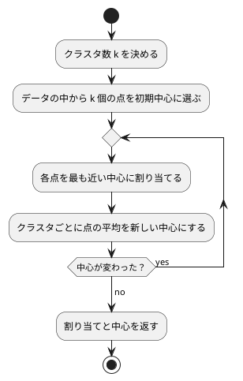

# 第 14 章: K-means によるクラスタリング

## 14.1 はじめに

[前章](13-principal-component-analysis.md) の主成分分析は、教師なし学習のうち「列を要約する」手法でした。この章で扱う **クラスタリング** は「行をグループに分ける」手法です。正解ラベルが無いまま、似たもの同士を同じグループにまとめます。

最も基本的なアルゴリズムが **K-means** です。あらかじめ決めたクラスタ数だけ「中心」を置き、各点を最も近い中心に割り当て、割り当てられた点の平均を新しい中心にする、という手続きを中心が動かなくなるまで繰り返します。

[Python 版の第 14 章](../python/14-k-means-clustering.md) は NumPy で K-means を自作し、scikit-learn の `KMeans` と突き合わせました。Elixir 版も同じく自作してから、`Scholar.Cluster.KMeans` と比べます。ただし、Scholar の KMeans には **初期中心を渡す口がありません**。前章で Scholar が Tribuo や Rumale より充実していたのとは逆に、ここは scikit-learn より狭いところです。比べるのは **同じ定義の SSE の大きさ** になります（14.13 節）。

## 14.2 K-means の仕組み



クラスタリングの良さは **SSE（誤差平方和）** で測ります。各点と、所属するクラスタの中心との距離の 2 乗を合計した値です。K-means は毎回の更新で SSE を下げますが、下がる方向にしか動かないので、初期中心によっては最もよい分け方の手前で止まります（**局所解**、14.12 節）。

クラスタ数を増やせば SSE は必ず下がるので、SSE だけでクラスタ数は決められません。クラスタ数に対して SSE をプロットし、減り方がゆるやかになる「肘」を探す方法を **エルボー法** と呼びます。

## 14.3 題材とデータ

卸売業者の顧客ごとの年間支出額（`Wholesale.csv`、440 件）を使います。列は `Channel`（販売チャネル）・`Region`（地域）と、6 つの商品カテゴリごとの支出額です。`Channel` と `Region` は区分を表す番号で支出額ではないので、この章では除きます。

支出額はカテゴリによって桁が違う（`Fresh` は数万、`Delicassen` は数千）ので、[第 13 章](13-principal-component-analysis.md) の標準化で列ごとに平均 0・標準偏差 1 にそろえてから距離を測ります。

## 14.4 TODO リストの作成

```text
[ ] 支出額の列を読み込む
[ ] 列ごとに標準化する
[ ] 2 点間の距離の 2 乗を求める
[ ] 各点を最も近い中心に割り当てる
[ ] クラスタごとに中心を更新する
[ ] SSE を計算する
[ ] 中心が変わらなくなるまで繰り返す
[ ] 初期中心をシードで選ぶ
[ ] クラスタ数ごとの SSE を求める（エルボー法）
[ ] 初期中心を複数試して最小の SSE を選ぶ
[ ] Scholar の KMeans と比べる
[ ] クラスタごとの特徴をまとめる
```

## 14.5 支出額の列を読み込む

`Channel` と `Region` を除いた列だけを、数値の特徴量にします。

```elixir
test "Channel と Region を除いた列を読み込む" do
  %{columns: columns, x: x} = C.spending(spending_table())

  assert columns == [:Fresh, :Milk]
  assert x == [%{Fresh: 100.0, Milk: 200.0}, %{Fresh: 300.0, Milk: 400.0}]
end

test "空欄があれば失敗する" do
  table = %{columns: [:Fresh], rows: [%{Fresh: ""}]}

  assert_raise ArgumentError, fn -> C.spending(table) end
end
```

```elixir
@doc "Channel と Region を除いた支出額の列を読み込む。欠損値があれば失敗する。"
def spending(table) do
  columns = Enum.reject(table.columns, &(&1 in @non_spending))

  %{
    columns: columns,
    x: Enum.map(table.rows, fn row -> Map.new(columns, &{&1, amount(row, &1)}) end)
  }
end
```

```elixir
defp amount(row, column) do
  case Chapter02.number(row, column) do
    nil -> raise ArgumentError, "空欄があります: #{column}"
    value -> value
  end
end
```

`Chapter02.number/2` は空欄に `nil` を返します（Elixir には `Option` が無いので、[第 2 章](02-data-preprocessing-and-triangulation.md) からこの流儀です）。この章のデータに欠損値は無いはずなので、`nil` を見たら **黙って 0 で埋めずに失敗させます**。`case` で受けるのは、`||` だと「値が 0.0 のときにも右辺が選ばれるのでは」という心配を読み手にさせないためです。

## 14.6 列ごとに標準化する

標準化は第 13 章の `standardizer/2`・`standardize_all/2` をそのまま使い、点（数値のリスト）に変換するところだけを書きます。

```elixir
@doc "第 13 章の標準化（件数で割る標準偏差）で列ごとにそろえ、1 件を 1 つの点にする。"
def standardize(x, columns) do
  x
  |> Chapter09.standardizer(columns)
  |> Chapter09.standardize_all(x)
  |> Chapter13.to_matrix(columns)
end
```

`x` が 2 回出てくるのは、`standardizer/2` が「学習した平均と標準偏差を持つマップ」を返すからです。学習と適用を分けてあるので、訓練データで学習した値を別のデータに使えます（[第 8 章](08-classification-and-preprocessing-pipeline.md) の前処理と同じ考え方です）。この章は分割をしないので、同じデータを 2 回渡します。

```elixir
test "標準化すると列ごとの平均が 0・標準偏差が 1 になる" do
  %{columns: columns, x: x} = C.spending(spending_table())
  points = C.standardize(x, columns)

  assert points == [[-1.0, -1.0], [1.0, 1.0]]
end
```

2 件しかないデータなら、標準化した値はちょうど `-1.0` と `1.0` になります。浮動小数点の比較を避けられる例を選んだので、`assert_in_delta` ではなく `==` で書けました。

## 14.7 各点を最も近い中心に割り当てる

距離は 2 乗のまま比べます。平方根を取っても大小は変わらないので、計算を省けます。

```elixir
@doc "2 点間の距離の 2 乗。"
def squared_distance(a, b) do
  Enum.sum(Enum.zip_with(a, b, fn x, y -> (x - y) * (x - y) end))
end
```

割り当てのテストには、「距離が同じなら先に並ぶ中心を選ぶ」というケースを入れました。

```elixir
test "1 次元の点を最も近い中心に割り当てる" do
  assert C.assign_clusters([[0.0], [1.0], [10.0], [11.0]], [[0.5], [10.5]]) == [0, 0, 1, 1]
end

test "2 次元の点をユークリッド距離で割り当てる" do
  assert C.assign_clusters(two_groups(), [[0.0, 0.0], [10.0, 10.0]]) == [0, 0, 0, 1, 1, 1]
end

test "距離が同じなら先に並ぶ中心を選ぶ" do
  assert C.assign_clusters([[1.0]], [[0.0], [2.0]]) == [0]
end
```

```elixir
def assign_clusters(points, centers) do
  Enum.map(points, fn point -> nearest(point, centers) end)
end
```

```elixir
# 最も近い中心の番号。距離が同じなら先に並ぶ中心を選ぶ。
defp nearest(point, centers) do
  {label, _distance} =
    centers
    |> Enum.with_index()
    |> Enum.reduce({0, :infinity}, fn {center, k}, {label, best} ->
      distance = squared_distance(point, center)
      if distance < best, do: {k, distance}, else: {label, best}
    end)

  label
end
```

ここも [第 13 章](13-principal-component-analysis.md) の符号の規則と同じ落とし穴があります。`Enum.min_by(centers, &squared_distance(point, &1))` と書くと中心そのものは取れますが、**同じ距離のときにどちらを返すか** が言語ごとに違い、境界上の点のクラスタ番号がずれます。番号も必要なので、`{番号, 距離}` の組を厳密な `<` で畳む `Enum.reduce/3` を書きました。Java 版の二重ループと同じ順序・同じ比較になり、数値が一致します。

初期値の `:infinity` はアトムです。Elixir では **数値よりアトムのほうが大きい** という全順序が決まっているので、`distance < :infinity` はどんな数値でも真になります。`Float.max_finite()` のような定数を持ち出さずに済む、Elixir らしい書き方です。

## 14.8 中心を更新する

クラスタごとに、割り当てられた点の平均を新しい中心にします。1 点も割り当てられなかったクラスタは、前の中心をそのまま残します（そうしないと中心が消えてクラスタ数が変わってしまいます）。

```elixir
test "平均が新しい中心になる" do
  assert C.update_centers([[0.0], [1.0], [10.0], [11.0]], [0, 0, 1, 1], [[0.0], [10.0]]) ==
           [[0.5], [10.5]]
end

test "点が 1 つも割り当てられなかったクラスタは中心を変えない" do
  assert C.update_centers([[0.0], [1.0]], [0, 0], [[0.0], [99.0]]) == [[0.5], [99.0]]
end
```

```elixir
def update_centers(points, labels, previous) do
  members = points |> Enum.zip(labels) |> Enum.group_by(&elem(&1, 1), &elem(&1, 0))

  previous
  |> Enum.with_index()
  |> Enum.map(fn {center, k} -> mean_point(Map.get(members, k), center) end)
end
```

```elixir
defp mean_point(nil, previous), do: previous

defp mean_point(assigned, _previous) do
  assigned
  |> Enum.zip_with(fn values -> Enum.sum(values) / length(assigned) end)
end
```

`Enum.group_by/3` は 3 番目の引数で「値をどう取り出すか」を書けるので、`{点, 番号}` の組から番号でまとめつつ点だけを集める処理が 1 行になります。

`mean_point/2` は **関数節で場合分け** しています。1 点も割り当てられなかったクラスタでは `Map.get(members, k)` が `nil` を返すので、`nil` を受ける節を先に書けば、本体に `if` を書かずに済みます。

平均を取る `Enum.zip_with(assigned, fn values -> ... end)` は、第 13 章の転置と同じ関数です。`assigned` が `[[1, 2], [3, 4]]` なら、各位置の値を集めた `[1, 3]` と `[2, 4]` に関数が適用されて `[2.0, 3.0]` が返ります。Java 版が合計用の配列と件数の配列を用意して二重ループで足していた処理が、1 つの式になります。

## 14.9 SSE を計算する

```elixir
@doc "各点と、所属するクラスタの中心との距離の 2 乗の合計（誤差平方和）。"
def sum_of_squared_errors(points, labels, centers) do
  points
  |> Enum.zip(labels)
  |> Enum.map(fn {point, label} -> squared_distance(point, Enum.at(centers, label)) end)
  |> Enum.sum()
end
```

足す順序は点の並び順です。ほかの言語版と同じ順序なので、浮動小数点の誤差まで含めて同じ値になります。

## 14.10 中心が変わらなくなるまで繰り返す

収束の判定は「新しい中心が前の中心と等しいか」です。Elixir のリストは値として比較できるので、`==` をそのまま使えます（Java 版が `Arrays.deepEquals` を必要としたところです）。

```elixir
@doc "中心が変わらなくなるか、更新の回数が上限に達するまで、割り当てと中心の更新を繰り返す。"
def fit(points, initial_centers, max_iterations \\ @default_max_iterations) do
  centers = converge(points, initial_centers, max_iterations)
  labels = assign_clusters(points, centers)

  %{
    labels: labels,
    centers: centers,
    sse: sum_of_squared_errors(points, labels, centers)
  }
end
```

```elixir
# 中心が動かなくなるまで繰り返す。上限に達したらそこで打ち切る。
defp converge(_points, centers, 0), do: centers

defp converge(points, centers, remaining) do
  next = update_centers(points, assign_clusters(points, centers), centers)

  if next == centers, do: centers, else: converge(points, next, remaining - 1)
end
```

`converge/3` は末尾再帰です。可変の変数を使わずに「中心が動かなくなるまで」を表せます。**残りの回数が 0 になる節を先に書く** のが Elixir の再帰の書き方で、Clojure 版が `loop`/`recur` で書いたところ、Java 版が `for` で書いたところにあたります。上限の既定値 300 は scikit-learn の `KMeans` と同じで、既定値付きの引数（`\\`）で表しました。

```elixir
test "最大反復回数に達したら収束していなくても打ち切る" do
  once = C.fit(three_pairs(), [[0.0], [2.0]], 1)
  none = C.fit(three_pairs(), [[0.0], [2.0]], 0)

  assert once.centers == [[0.5], [15.5]]
  assert none.centers == [[0.0], [2.0]]
  assert none.sse > once.sse
end
```

## 14.11 初期中心をシードで選ぶ

初期中心は、点の中からクラスタ数だけを重複なく選びます。乱数は [第 2 章](02-data-preprocessing-and-triangulation.md) で自作した線形合同法を使い回します。

```elixir
@doc """
シード付きの乱数で点を並べ替え、先頭から n_clusters 個を初期中心にする。

`GettingStartedMl.Random` は `java.util.Random` と同じ線形合同法なので、
Java 版・Scala 版・Clojure 版と同じ点を選ぶ。
"""
def choose_initial_centers(points, n_clusters, seed) do
  0..(length(points) - 1)//1
  |> Enum.to_list()
  |> GettingStartedMl.Random.shuffle(seed)
  |> Enum.take(n_clusters)
  |> Enum.map(&Enum.at(points, &1))
end
```

`GettingStartedMl.Random.shuffle/2` は `java.util.Random` の Fisher-Yates シャッフルで、Java の `Collections.shuffle(list, new Random(seed))` と同じ手順・同じ並びになります。**この章の数値が Java 版と一致するかどうかは、ここで決まります。** Nx の `Nx.Random`（Threefry）も Erlang の `:rand` も、どの言語版とも並びが合わないので、乱数生成器そのものを自作したのでした（[ADR 012](../../../adr/012-elixir-ml-libraries.md)）。

```elixir
test "シードで選んだ点そのものを初期中心にする" do
  centers = C.choose_initial_centers(three_pairs(), 3, 0)

  assert length(centers) == 3
  assert Enum.all?(centers, &(&1 in three_pairs()))
  assert Enum.uniq(centers) == centers
end
```

具体的にどの点が選ばれるかをテストに書くと、乱数の実装を変えたときに落ちます。ここでは「点そのものであること」「重複しないこと」という **性質** をテストにしました。乱数そのものの一致は第 2 章のテストが守っています。

## 14.12 局所解と複数回の試行

### 実データで起きたこと

ここまでの関数で、標準化した実データのエルボー法を試してみました。使い捨てのスクリプトで、初期中心 1 通りで k = 1 から 10 までの SSE を求め、シードを変えて表示した結果の一部です（小数第 2 位まで。確かめたあとでスクリプトは削除しました）。

| k | シード 0 | シード 1 | シード 5 |
|---|---------|---------|---------|
| 2 | 2267.09 | 1954.18 | 1956.12 |
| 4 | 1345.47 | 1533.99 | 1345.47 |
| 6 | 993.26 | 947.20 | 1015.81 |
| 7 | 934.29 | 952.13 | 908.79 |
| 9 | 719.53 | 758.35 | 793.95 |
| 10 | 754.63 | 618.17 | 877.40 |

シード 0 では k = 2 の SSE が 2267.09 で、シード 1 の 1954.18 より大きくなりました。シード 0 では k = 9 の 719.53 から k = 10 の 754.63 へ、シード 1 では k = 6 の 947.20 から k = 7 の 952.13 へ、シード 5 では k = 9 の 793.95 から k = 10 の 877.40 へ、k を増やしたのに SSE が増えています。**この表は [Java 版](../java/14-k-means-clustering.md)・[Scala 版](../scala/14-k-means-clustering.md)・[Clojure 版](../clojure/14-k-means-clustering.md) の同じ表と 1 桁も違いません。** 初期中心の選び方（自作の線形合同法による Fisher-Yates）も、中心の更新と SSE の足し算の順序もそろえたからです。

### 局所解をテストで再現する

1 次元に 3 組の点を並べた例で確かめます。3 つのクラスタに分けるなら、0 と 1、10 と 11、20 と 21 に分けるのが最適で、SSE は 0.5 × 3 = 1.5 です。ところが、左の組から 2 点・中央の組から 1 点を初期中心にすると、0 と 1 が別々のクラスタのまま、残りの 4 点が 1 つのクラスタにまとめられて止まります。

```elixir
test "初期中心によっては局所解に陥る" do
  assert_in_delta C.fit(three_pairs(), [[0.0], [1.0], [10.0]]).sse, 101.0, 1.0e-9
end

test "複数の初期中心の候補のうち SSE が最小の結果を返す" do
  result = C.best(three_pairs(), [[[0.0], [1.0], [10.0]], [[0.0], [10.0], [20.0]]])

  assert_in_delta result.sse, 1.5, 1.0e-9
  assert result.centers == [[0.5], [10.5], [20.5]]
end
```

複数の候補から最小を選ぶ処理と、シードをずらして候補を作る処理を分けて書きました。

```elixir
@doc "初期中心の候補ごとにクラスタリングし、SSE が最小の結果を返す。"
def best(points, initial_center_candidates) do
  initial_center_candidates
  |> Enum.map(&fit(points, &1))
  |> Enum.reduce(fn result, best -> if result.sse < best.sse, do: result, else: best end)
end

@doc "シードを 1 ずつずらして初期中心を n_init 通り選び、SSE が最小の結果を返す。"
def fit_with_restarts(points, n_clusters, seed, n_init \\ @default_n_init) do
  best(
    points,
    Enum.map(0..(n_init - 1)//1, &choose_initial_centers(points, n_clusters, seed + &1))
  )
end
```

`best/2` も `Enum.min_by/2` ではなく厳密な `<` の `Enum.reduce/2` です。SSE が同じ結果が並んだときに、Java 版の `min(Comparator)`（先に見つけた方を残す）と同じものを選ぶためです。この章では `nearest/2` とあわせて 2 か所、第 13 章の `normalize_signs/1` を入れると 3 か所、同じ理由で同じ書き方をしています。

`n_init` の既定値 10 は、scikit-learn の `KMeans` の `n_init` と同じです。

### エルボー法でクラスタ数を選ぶ

クラスタ数ごとの SSE を返します。

```elixir
@doc """
クラスタ数ごとに、初期中心を n_init 通り試した最小の SSE を返す。

マップはキーの順を保たないので、`{クラスタ数, SSE}` の組のリストにする。
"""
def sse_by_cluster_count(points, cluster_counts, seed, n_init \\ @default_n_init) do
  Enum.map(cluster_counts, fn n -> {n, fit_with_restarts(points, n, seed, n_init).sse} end)
end
```

戻り値は `[{1, 2640.0}, {2, 1954.18}, …]` の形です。Java 版は `LinkedHashMap`、Scala 版は `SeqMap` で順序を保ちましたが、Elixir のマップには順序を保つ実装がありません。クラスタ数の順に取り出したいので、組のリストにしました。第 13 章で「列の順はリストで持ち回る」と決めたのと同じ判断です。

## 14.13 Scholar の KMeans と比べる

### 初期中心を渡せない

Python 版では、scikit-learn の `KMeans` に同じ初期中心を配列で渡し、クラスタ番号・中心・SSE がすべて一致することを確かめました。`Scholar.Cluster.KMeans.fit/2` のオプションは `:num_clusters`・`:max_iterations`・`:num_runs`・`:tol`・`:weights`・`:init`・`:key` で、`:init` に渡せるのは **`:k_means_plus_plus` と `:random` という 2 つのアトムだけ** です。初期中心そのものを受け取るオプションはありません。

この事実を、学習用テストとして残します。

```elixir
test "初期中心そのものは渡せない" do
  # :init に渡せるのは :k_means_plus_plus と :random の 2 つだけ
  assert_raise NimbleOptions.ValidationError, fn ->
    KMeans.fit(Nx.tensor(two_groups(), type: :f64),
      num_clusters: 2,
      init: [[0.0, 0.0], [10.0, 10.0]]
    )
  end
end
```

Scholar はオプションの検証に NimbleOptions を使っているので、知らない値を渡すと `NimbleOptions.ValidationError` になります。「オプションが `{:in, [...]}` で宣言されている」という事実そのものをテストにするより、**実際に渡して落ちることを確かめる** ほうが、ライブラリを更新したときに気づけます。

同じ初期中心を渡せないので、クラスタ番号や中心の一致は確かめられません。ほかの言語版（Tribuo にも初期中心を渡す口はありませんでした）と同じく、同じクラスタ数での **SSE の大きさ** を比べます。

### 同じ定義の SSE で比べる

Scholar の `KMeans` は `:inertia`（SSE）を返しますが、これをそのまま使うと「同じものを測っているのか」が分かりません。Scholar が学習した中心に、自作の `assign_clusters/2` で割り当て直してから SSE を求めます。

```elixir
@doc "`Scholar.Cluster.KMeans` を k-means++ で学習し、中心を 1 行に 1 つずつ並べて返す。"
def scholar_centers(points, n_clusters, seed, n_init \\ @default_n_init) do
  model =
    KMeans.fit(Nx.tensor(points, type: :f64),
      num_clusters: n_clusters,
      num_runs: n_init,
      key: Nx.Random.key(seed)
    )

  Nx.to_list(model.clusters)
end

@doc "Scholar が学習した中心に自作の割り当てをして、自作と同じ定義の SSE を求める。"
def scholar_sse(points, n_clusters, seed, n_init \\ @default_n_init) do
  centers = scholar_centers(points, n_clusters, seed, n_init)

  sum_of_squared_errors(points, assign_clusters(points, centers), centers)
end
```

`:num_runs` の既定値は 10 で、自作の `n_init` と同じです。Scholar は内部で 10 通りの初期中心を試して最良のものを返すので、自作とそろえるために明示的に渡しています。`:key` に `Nx.Random.key(seed)` を渡さないと、Scholar は `System.system_time()` で鍵を作るので **実行するたびに結果が変わります**。テストが不安定にならないように、必ず渡します。

離れた 2 つの群れなら、初期中心の選び方が違っても同じところに落ち着くはずです。

```elixir
test "離れた 2 つの群れなら自作と同じ中心にたどり着く" do
  theirs = Enum.sort(C.scholar_centers(two_groups(), 2, 0))
  mine = Enum.sort(C.fit_with_restarts(two_groups(), 2, 0).centers)

  assert Enum.zip(mine, theirs)
         |> Enum.all?(fn {a, b} -> C.squared_distance(a, b) < 1.0e-9 end)
end
```

クラスタ番号は初期中心の選び方で入れ替わるので、中心を並べ替えてから比べます。

### Nx の既定のバックエンドは遅い

実データで k = 1 から 10 まで Scholar の KMeans を動かすと、合計で 80 秒ほどかかりました（k = 10 の 1 回だけで 14 秒です）。自作の同じ範囲は 2.4 秒です。Nx の既定のバックエンドが純粋な Erlang で書かれた `Nx.BinaryBackend` で、EXLA のようなネイティブのバックエンドを入れていないためです（[ADR 012](../../../adr/012-elixir-ml-libraries.md)）。

**リストで書いた自作より、テンソルで書いたライブラリのほうが 30 倍以上遅い** という逆転が起きています。表示のテストは既定の 60 秒では足りないので、タグで上限を上げました。

```elixir
# Scholar の KMeans を 10 通りのクラスタ数で学習するので、既定の 60 秒では足りない
@tag :data
@tag timeout: 600_000
```

## 14.14 実データでクラスタリングする

### クラスタごとの特徴をまとめる

標準化した値のままでは読めないので、元の単位（円）に戻した平均を、件数の多い順に並べます。

```elixir
@doc "クラスタごとの件数と、元の単位での列ごとの平均を、件数の多い順に並べる。"
def summarize_clusters(x, columns, labels) do
  x
  |> Enum.zip(labels)
  |> Enum.group_by(&elem(&1, 1), &elem(&1, 0))
  |> Enum.map(fn {cluster, rows} -> summary(cluster, rows, columns) end)
  |> Enum.sort_by(&{-&1.count, &1.cluster})
end
```

`Enum.group_by/3` が返すマップは順序を保たないので、並べ替えの基準に件数だけを使うと、件数が同じクラスタの並びが不定になります。`&{-&1.count, &1.cluster}` で「件数の降順、同数ならクラスタ番号の昇順」と明示しました。**タプルは要素を順に比べる** ので、複数の基準を書くのにちょうどよい形です。Java 版が `TreeMap` に入れてから安定ソートで得ていた順序と同じになります。

```elixir
test "件数が同じならクラスタ番号の昇順に並べる" do
  x = [%{Fresh: 10.0}, %{Fresh: 20.0}]

  assert Enum.map(C.summarize_clusters(x, [:Fresh], [1, 0]), & &1.cluster) == [0, 1]
end
```

### 実データのテスト

440 件・6 列になること、標準化したデータのクラスタ数 1 の SSE が「件数 × 列数」になること、クラスタ数を増やすほど SSE が減ることを確かめます。

```elixir
@tag :data
test "標準化したデータのクラスタ数 1 の SSE は件数と列数の積になる" do
  # 件数で割る標準偏差で標準化したので、列ごとの分散は 1 になる
  %{columns: columns, x: x} = wholesale()
  [{1, sse}] = C.sse_by_cluster_count(C.standardize(x, columns), [1], 0)

  assert_in_delta sse, 440.0 * 6, 1.0e-6
end

@tag :data
test "クラスタ数を増やすほど SSE が小さくなる" do
  %{columns: columns, x: x} = wholesale()
  sse = Enum.map(C.sse_by_cluster_count(C.standardize(x, columns), 1..10, 0), &elem(&1, 1))

  assert Enum.zip(sse, tl(sse)) |> Enum.all?(fn {a, b} -> b < a end)
end
```

1 つめは、標準化が「件数で割る標準偏差」なのでちょうど 2640 になるという性質です（不偏標準偏差なら 2634 になります）。`[{1, sse}] = ...` とパターンマッチで受けているので、返り値が 1 件でなければその場で落ちます。2 つめは `Enum.zip(sse, tl(sse))` で隣り合う 2 つを比べ、減り続けていることを確かめています。初期中心を 10 通り試すようにしたので、14.12 節で見た「k を増やすと SSE が増える」現象は起きません。

### 実行して結果を表示する

```text
データ件数: 440（支出額 6 列）
クラスタ数ごとの SSE（初期中心 10 通りの最小値）:
クラスタ数	自作	Scholar（k-means++）
1	2640.00	2640.00
2	1954.18	1954.73
3	1614.52	1632.87
4	1334.36	1329.41
5	1085.27	1075.51
6	947.20	923.05
7	888.22	829.72
8	775.24	753.01
9	690.81	676.57
10	618.17	602.40

クラスタ数 5 のクラスタごとの件数と平均支出額:
クラスタ	件数	Fresh	Milk	Grocery	Frozen	Detergents_Paper	Delicassen
2	265	8909	2967	3804	2248	989	962
1	96	5509	10556	16478	1420	7199	1659
0	65	31117	4260	5374	7225	849	2286
3	10	15965	34709	48537	3055	24875	2943
4	4	52022	31696	18491	29826	2699	19656
```

平均支出額を整数で表示するところで、1 か所つまずきました。Erlang の `:io_lib.format/2` は **精度 0 の `~.0f` を受け付けません**（`~.2f` や `~.4f` は使えます）。ほかの言語版の `%.0f` にあたる書式が無いので、`round/1` で整数に丸めてから文字列にしました。

```elixir
# :io_lib.format は精度 0 を受け付けないので、整数に丸めてから文字列にする
"#{summary.count}" | Enum.map(columns, &"#{round(summary.means[&1])}")
```

### 結果を読む

**自作の列（SSE）も、クラスタごとの件数と平均支出額も、[Java 版](../java/14-k-means-clustering.md)・[Scala 版](../scala/14-k-means-clustering.md)・[Clojure 版](../clojure/14-k-means-clustering.md) と完全に一致しました。** 初期中心の乱数と、中心の更新・SSE の足し算の順序をそろえたからです。**Scholar の列だけはほかの言語版（Tribuo）と違います。** どちらも k-means++ ですが、初期中心を選ぶ乱数が Tribuo の `java.util.Random` と Nx の Threefry で違うので、これは一致しなくて当然です。

**自作と Scholar の SSE を比べると**、k = 2（1954.18 対 1954.73）と k = 3（1614.52 対 1632.87）は自作のほうが小さく、k = 4 から 10 では Scholar（k-means++ で 10 通り）のほうが小さくなりました。差は k = 7 で最も大きく、自作の 888.22 に対して Scholar は 829.72 です。どちらも「初期中心を変えて 10 回試し、最小の SSE を使う」点は同じなので、違いは初期中心の選び方にあります。データの点からランダムに選ぶ自作より、互いに離れた点を選びやすい k-means++ のほうが、このデータでは局所解を避けやすかったと読めます。**Clojure 版（Tribuo の k-means++）でも k = 3 以降は同じ傾向が出ています。**

**エルボー法で読むと**、自作の SSE の減り方は k = 3 → 4 で 280.16、k = 4 → 5 で 249.09、k = 5 → 6 で 138.07、k = 6 → 7 で 58.98 と小さくなっていきますが、k = 7 → 8 では 112.98 と再び大きくなり、はっきりした肘は見えません。ここでは Python 版・Java 版・Scala 版・Clojure 版と同じくクラスタ数を 5 にしました。エルボーが 1 点に決まらないときは、クラスタを解釈できるかどうかも合わせて判断します。

クラスタ数 5 の結果は、次のように読めます。

- **265 件のクラスタ**: どの支出額も少なめの、最も多いグループ
- **96 件のクラスタ**: Grocery・Milk・Detergents_Paper が多めのグループ
- **65 件のクラスタ**: Fresh が突出して多いグループ
- **10 件のクラスタ**: Milk・Grocery・Detergents_Paper が非常に多いグループ
- **4 件のクラスタ**: Fresh・Milk・Frozen・Delicassen がどれも極端に多い顧客。グループというより外れ値に近い存在です

K-means は外れ値にも中心を 1 つ割いてしまうことが、この結果から分かります。

## 14.15 品質チェック

`nix develop .#elixir` の中で、整形の検査・警告・静的解析・テストとカバレッジをまとめて実行します。

```console
$ cd apps/elixir
$ mix format --check-formatted && mix compile --warnings-as-errors && mix credo --strict && mix test --cover
Checking 19 source files ...
…
249 mods/funs, found no issues.
…
162 tests, 0 failures
…
    98.48% | GettingStartedMl.Chapter14
```

第 14 章のテストは、部品のテスト 23 件と実データのテスト 4 件です。学習データが無い環境（`ML_DATA_DIR=/nonexistent mix test`）では、`:data` のテストが除外されてテスト全体は成功します。

この章で追加した依存はありません。第 7 章から使っている Scholar の `Scholar.Cluster.KMeans` を呼ぶだけです。

TDD の途中で済ませた設計の判断は次のとおりです。

- **不変のリストで通す** — 点も中心も素のリストにし、途中でテンソルに落とさなかった。テンソルにするのは Scholar に渡すときだけ
- **既定値付きの引数で既定値を表す** — `fit/3` の上限回数と `fit_with_restarts/4`・`sse_by_cluster_count/4`・`scholar_centers/4`・`scholar_sse/4` の `n_init` を `\\` で既定値付きにした。Java 版のオーバーロードは要らない
- **定義の共有** — Scholar との比較でも、SSE は自作の `assign_clusters/2` と `sum_of_squared_errors/3` で求め、同じ定義で比べた
- **標準化は第 9 章から、行列への変換は第 13 章から借りる** — 件数で割る標準偏差の標準化を 2 度書かず、`Chapter09.standardizer/2`・`standardize_all/2` と `Chapter13.to_matrix/2` を呼んだ

第 2 章の前処理と乱数、第 13 章の標準化は変更していません。

## 14.16 まとめ

この章では、K-means を割り当て・更新・SSE の小さな関数から組み立て、Scholar の `KMeans` と比べました。

1. **初期中心を引数で受け取る** — 乱数で選ぶ処理と分けたので、テストでは初期中心を固定して結果を確かめられた。局所解もテストで再現できた
2. **初期中心 1 通りではエルボー法を読めない** — 実データでシードごとに SSE の曲線が変わり、k を増やして SSE が増えることもあった。10 通り試した最小の SSE で比べた
3. **Scholar とは SSE の大きさで比べる** — `:init` に渡せるのはアトム 2 つだけで、初期中心そのものは渡せない。k = 4〜10 では k-means++ の Scholar のほうが小さかった
4. **Java 版・Scala 版・Clojure 版と数値が完全に一致した** — 初期中心の乱数（自作の線形合同法による Fisher-Yates）と、中心の更新・SSE の足し算の順序をそろえたので、シードごとの SSE の表も、最終的な SSE もクラスタごとの平均も同じ値になった

Elixir 版ならではの学びもありました。

- **収束は末尾再帰と関数節で書ける** — 「残りの回数が 0 なら打ち切る」節を先に書くだけで、可変の変数を使わずに済んだ。止まる条件も `next == centers` と値の比較で書ける
- **不変なら写しも比較も悩まない** — Java 版が `clone()` と `Arrays.deepEquals` で解いた問題が、リストではそもそも起きなかった
- **`:infinity` はどんな数値より大きい** — アトムと数値の全順序が決まっているので、初期値に `:infinity` をそのまま置けた
- **`Enum.min_by/2` に任せない** — 最も近い中心も、SSE が最小の結果も、ほかの言語版と同じものを選ぶには厳密な比較で畳む必要があった
- **タプルで複数の並べ替え基準を表せる** — `&{-&1.count, &1.cluster}` だけで「件数の降順、同数なら番号の昇順」になった
- **`:io_lib.format` に `~.0f` は無い** — 整数に丸めるときは `round/1` を使う
- **ライブラリのほうが遅いことがある** — Nx の既定のバックエンドは純粋な Erlang なので、リストで書いた自作より Scholar のほうが 30 倍以上遅かった

次の章では、ここまでに作ったモデルを Web API として公開します。
