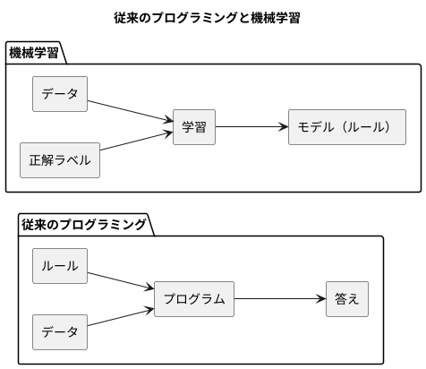
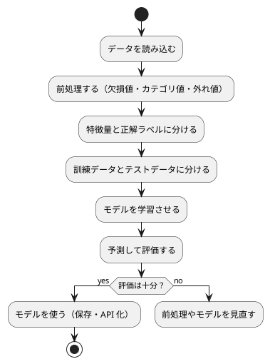

# 第 1 章: 機械学習とはじめてのテスト

## 1.1 はじめに

この章では、機械学習とは何かを確認したうえで、テスト駆動開発（TDD）で最初のプログラムを F# で作ります。題材は「きのこの山派か、たけのこの里派か」を身長・体重・年代から判定する問題です。

この章ではまだ機械学習のアルゴリズムを使いません。人間が考えたルールで判定し、その正解率を測るところまで進みます。「ルールを人間が書く」とはどういうことかを先に体験しておくと、第 3 章で「ルールをデータから学ばせる」ことの意味がはっきりします。

[Python 版の第 1 章](../python/01-machine-learning-and-first-test.md)・[Kotlin 版の第 1 章](../kotlin/01-machine-learning-and-first-test.md)・[TypeScript 版の第 1 章](../typescript/01-machine-learning-and-first-test.md) と同じ題材・同じ TODO リストで進めます。F# 版では、判別共用体・レコード型・パイプライン、そして「F# ではファイルの順番に意味がある」ことに注目しながら読んでください。

## 1.2 機械学習とは

### ルールを書くか、データに学ばせるか

従来のプログラミングでは、人間が判定のルールをコードとして書きます。

```fsharp
let predictByRule (features: Features) : Faction =
    if features.AgeGroup = KinokoAgeGroup then
        Kinoko
    else
        Takenoko
```

これはこの章で実際に作る関数です。`KinokoAgeGroup` は `20` で、「20 代ならきのこ派」というルールを表します。このルールは、人間がデータを眺めて立てた仮説にすぎません。データが増えたり傾向が変わったりすれば、人間がルールを書き直す必要があります。

機械学習では、ルールそのものをデータから導きます。人間が用意するのは「特徴量（判定の手がかり）」と「正解ラベル（本当の答え）」の組です。学習アルゴリズムがその組からルールを作り、未知のデータに当てはめて予測します。



### 機械学習のワークフロー

機械学習のプログラムは、おおむね次の流れで作ります。本シリーズの各章は、この流れのどこかを深掘りする構成になっています。



この章で扱うのは「データを読み込む」「特徴量と正解ラベルに分ける」「予測して評価する」の 3 つです。「学習させる」の代わりに、人間が書いたルールで予測します。

### 分類と回帰

| 種類 | 予測するもの | 例 |
|------|------------|-----|
| 分類 | どのグループに属するか（離散値） | きのこ派かたけのこ派か、アヤメの品種 |
| 回帰 | どれくらいの量か（連続値） | 映画の興行収入、住宅価格 |

この章の問題は、2 つのグループのどちらかを当てる分類です。

## 1.3 題材とデータ

### データの入手と配置

本シリーズの学習データは、書籍『スッキリわかる Python による機械学習入門』（インプレス, 2020）の配布データを使います。配布データは書籍購入者のみ利用できるため、リポジトリには含まれていません。[書籍サポートページ](https://sukkiri.jp/books/sukkiri_ml) から `sukkiri-ml-codes.zip` を入手し、リポジトリの `tmp/` に置いてから、リポジトリのルートで次を実行してください。

```bash
npx gulp data:setup
npx gulp data:check
```

`apps/data/sukkiri-ml/` に学習データが配置されます。このディレクトリは `.gitignore` の対象なので、誤ってコミットされることはありません。すべての言語の版が同じデータを参照します。

### KvsT.csv

この章で使うのは `KvsT.csv` です。19 人分のデータが次の 4 列で記録されています。

| 列 | 意味 | 値 |
|----|------|-----|
| 身長 | 身長（cm） | 整数 |
| 体重 | 体重（kg） | 整数 |
| 年代 | 年代 | 10, 20, 30, 40 のいずれか |
| 派閥 | きのこの山派かたけのこの里派か | `きのこ` または `たけのこ` |

「身長」「体重」「年代」が特徴量、「派閥」が正解ラベルです。列名が日本語であることと、ファイルの先頭に BOM（バイトオーダーマーク）が付いていることに注意してください。

## 1.4 TODO リストの作成

仕様をそのままコードにするには大きすぎるので、まず TODO リストに分解します。

> TODO リスト
>
> 何をテストすべきだろうか——着手する前に、必要になりそうなテストをリストに書き出しておこう。
>
> — テスト駆動開発

**TODO リスト**:

- [ ] CSV を読み込む
  - [ ] BOM 付き CSV の 1 行を人物として読み込む
  - [ ] 複数行を行の順に読み込む
- [ ] 特徴量と正解ラベルに分ける
- [ ] ルールで派閥を判定する
  - [ ] 20 代ならきのこ派と判定する
  - [ ] 20 代以外ならたけのこ派と判定する
- [ ] 正解率を計算する
- [ ] 実データで正解率を表示する

## 1.5 開発環境の準備

### プロジェクトの構成

F# の実装は `apps/dotnet/` にあります。この章を書き終えた時点の構成です。

```text
apps/dotnet/
├── MachineLearning.sln
├── global.json
├── Directory.Build.props
├── Directory.Packages.props
├── fsharplint.json
├── .editorconfig
├── .config/
│   └── dotnet-tools.json
├── src/
│   └── MachineLearning/
│       ├── MachineLearning.fsproj
│       ├── packages.lock.json
│       ├── Dataset.fs
│       ├── Chapter01/
│       │   ├── KinokoTakenoko.fs
│       │   └── Main.fs
│       └── Program.fs
└── tests/
    └── MachineLearning.Tests/
        ├── MachineLearning.Tests.fsproj
        ├── packages.lock.json
        ├── SetupTest.fs
        ├── DatasetTest.fs
        └── Chapter01/
            ├── KinokoTakenokoTest.fs
            └── KvsTDataTest.fs
```

本体（`src/MachineLearning`）とテスト（`tests/MachineLearning.Tests`）の 2 つのプロジェクトを、1 つのソリューション（`MachineLearning.sln`）にまとめています。

`global.json` で .NET SDK の版を 10.0.101 に固定しています。

```json
{
  "sdk": {
    "version": "10.0.101",
    "rollForward": "latestPatch"
  },
  "test": {
    "runner": "Microsoft.Testing.Platform"
  }
}
```

`test.runner` は、`dotnet test` がテストを動かす仕組みの指定です。.NET SDK 10 の `dotnet test` は、従来の仕組み（VSTest）で動くテストプロジェクトを次のエラーで止めます。

```text
error : Testing with VSTest target is no longer supported by Microsoft.Testing.Platform on .NET 10 SDK and later. If you use dotnet test, you should opt-in to the new dotnet test experience. For more information, see https://aka.ms/dotnet-test-mtp-error
```

本シリーズでは、新しい仕組みの Microsoft.Testing.Platform で動く xUnit v3 を使います。

2 つのプロジェクトに共通する設定は `Directory.Build.props` に書きます。このファイルは、同じディレクトリとその下のプロジェクトすべてに自動で読み込まれます。

```xml
<Project>
  <PropertyGroup>
    <TargetFramework>net10.0</TargetFramework>
    <!-- コンパイラの警告（パターンマッチの網羅漏れなど）をエラーにする -->
    <TreatWarningsAsErrors>true</TreatWarningsAsErrors>
    <!-- 依存関係の依存関係まで正確な版を packages.lock.json に記録する -->
    <RestorePackagesWithLockFile>true</RestorePackagesWithLockFile>
    <!-- FSharp.Core の版は Directory.Packages.props で固定する -->
    <DisableImplicitFSharpCoreReference>true</DisableImplicitFSharpCoreReference>
    <!-- .NET SDK 同梱の FSharp.Core（library-packs）は nuget.org のものとハッシュが違い、
         packages.lock.json の検証が環境によって失敗するので、nuget.org からだけ取る -->
    <DisableImplicitLibraryPacksFolder>true</DisableImplicitLibraryPacksFolder>
  </PropertyGroup>
  <ItemGroup>
    <PackageReference Include="FSharp.Core" />
  </ItemGroup>
</Project>
```

- `TreatWarningsAsErrors` は、コンパイラの警告をエラーとして扱います。F# のコンパイラは、`match` の場合分けの漏れを警告で知らせるので、これをエラーにして見落とさないようにします（第 3 章で効果を見ます）
- 依存ライブラリの版は `Directory.Packages.props` にまとめて書きます（**中央パッケージ管理**）。F# の標準ライブラリ FSharp.Core も、ここで版を固定します
- FSharp.Core と `DisableImplicitLibraryPacksFolder` の設定は、どちらも最初の設定では動かなかったために加えたものです。経緯は第 5 章で扱います

```xml
<Project>
  <PropertyGroup>
    <!-- 依存ライブラリの版をこのファイルにまとめる（中央パッケージ管理） -->
    <ManagePackageVersionsCentrally>true</ManagePackageVersionsCentrally>
  </PropertyGroup>
  <ItemGroup>
    <PackageVersion Include="coverlet.MTP" Version="10.0.1" />
    <!-- .NET SDK 10.0.101 に同梱の版 -->
    <PackageVersion Include="FSharp.Core" Version="10.0.101" />
    <PackageVersion Include="xunit.v3" Version="4.0.1" />
  </ItemGroup>
</Project>
```

整形の Fantomas と静的解析の FSharpLint は、プロジェクトのローカルツールとして `.config/dotnet-tools.json` に版を記録しています。依存パッケージとツールは次のコマンドで入れます。

```bash
cd apps/dotnet
dotnet tool restore
dotnet restore
```

### F# ではファイルの順番に意味がある

プロジェクトファイル（`.fsproj`）には、コンパイルするファイルを順番に並べます。

```xml
<Project Sdk="Microsoft.NET.Sdk">

  <PropertyGroup>
    <OutputType>Exe</OutputType>
  </PropertyGroup>

  <ItemGroup>
    <Compile Include="Dataset.fs" />
    <Compile Include="Chapter01/KinokoTakenoko.fs" />
    <Compile Include="Chapter01/Main.fs" />
    <Compile Include="Program.fs" />
  </ItemGroup>

</Project>
```

F# のコンパイラは、ファイルを上から順に読みます。あるファイルから使えるのは、それより **上に並んだファイル** の定義だけです。`Main.fs` は `KinokoTakenoko.fs` と `Dataset.fs` の関数を使うので、その下に置きます。この制約のおかげで、依存関係が一方向になり、循環した参照ができません。新しいファイルを作ったら、プロジェクトファイルの適切な位置に書き足す必要があります。

### 環境確認テスト

テスティングフレームワークが動くことを、最小のテストで確認します。

```fsharp
// tests/MachineLearning.Tests/SetupTest.fs
module MachineLearning.Tests.SetupTest

open Xunit

[<Fact>]
let ``テスト環境が動く`` () = Assert.Equal(2, 1 + 1)
```

- `[<Fact>]` は、その関数が 1 つのテストであることを xUnit に伝える **属性** です
- ``` ``テスト環境が動く`` ``` のように二重のバッククォートで囲むと、空白や日本語を含む文をそのまま関数名にできます。テストの一覧がそのまま仕様の一覧として読めるので、本シリーズではテスト名を日本語で書きます

```bash
dotnet test
```

```text
テストの実行の概要: 成功!
  合計: 1
  失敗: 0
  成功: 1
  スキップ済み: 0
  期間: 2s 882ms
```

実は、このテストは最初から通ったわけではありません。中央パッケージ管理を有効にしただけの設定では、テストが次のエラーで失敗しました。

```text
Unhandled exception. System.IO.FileNotFoundException: Could not load file or assembly 'FSharp.Core, Version=10.0.0.0, Culture=neutral, PublicKeyToken=b03f5f7f11d50a3a'. 指定されたファイルが見つかりません。
```

F# のプロジェクトは、通常は FSharp.Core を自動で参照します。ところが中央パッケージ管理を有効にすると、その自動の参照が効かなくなり、テストの実行ファイルの隣に FSharp.Core が置かれませんでした。そこで、自動の参照を無効にし（`DisableImplicitFSharpCoreReference`）、`Directory.Build.props` で明示して参照するようにしました。最小のテストを最初に動かしておくと、こうした環境の問題を、機械学習のコードを書き始める前に片付けられます。

### 学習データの場所を解決する

機械学習のコードに入る前に、学習データの場所を決める関数を TDD で作っておきます。学習データの場所は、環境変数 `ML_DATA_DIR` で指定でき、指定が無ければ `apps/data/sukkiri-ml/` を使います。環境変数を読む関数を引数で受け取るようにすると、テストでは本物の環境変数を書き換えずに済みます。

```fsharp
// tests/MachineLearning.Tests/DatasetTest.fs
module MachineLearning.Tests.DatasetTest

open Xunit
open MachineLearning.Dataset

[<Fact>]
let ``環境変数 ML_DATA_DIR があればそのディレクトリを使う`` () =
    let getenv name =
        if name = "ML_DATA_DIR" then Some "/data/ml" else None

    Assert.Equal("/data/ml", dataDirFrom getenv)
```

```text
tests\MachineLearning.Tests\DatasetTest.fs(4,22): error FS0039: 名前空間 'Dataset' が定義されていません。
tests\MachineLearning.Tests\DatasetTest.fs(11,30): error FS0039: 値またはコンストラクター 'dataDirFrom' が定義されていません。 次のいずれかの可能性はありませんか:
   Data
```

環境変数を読む関数の型は `string -> string option` とします。環境変数が無いことを `null` ではなく `None` で表すためです。

```fsharp
// src/MachineLearning/Dataset.fs
module MachineLearning.Dataset

/// 学習データのディレクトリ。環境変数 ML_DATA_DIR を読む。
let dataDirFrom (getenv: string -> string option) : string = getenv "ML_DATA_DIR" |> Option.get
```

`Option.get` は `Some` の中の値を取り出します。`None` のときは例外になるので、環境変数が無い場合のテストで失敗させます。

テストのファイルの先頭に `open System.IO` を加えて、2 つ目のテストを書きます。

```fsharp
[<Fact>]
let ``環境変数が無ければ apps/data/sukkiri-ml を使う`` () =
    let dir = dataDirFrom (fun _ -> None) |> Path.GetFullPath

    Assert.EndsWith(Path.Combine("apps", "data", "sukkiri-ml"), dir)
```

```text
失敗 MachineLearning.Tests.DatasetTest.環境変数が無ければ apps/data/sukkiri-ml を使う (20ms)
  Xunit.MicrosoftTestingPlatform.XunitException: System.ArgumentException : オプション値は None でした (Parameter 'option')
```

他の言語の版と同じく、既定の場所を `apps/dotnet/` から見た相対パス `../data/sukkiri-ml` にしました。

```fsharp
let dataDirFrom (getenv: string -> string option) : string =
    getenv "ML_DATA_DIR" |> Option.defaultValue "../data/sukkiri-ml"
```

ところが、テストはまだ失敗します。

```text
失敗 MachineLearning.Tests.DatasetTest.環境変数が無ければ apps/data/sukkiri-ml を使う (30ms)
  Assert.EndsWith() Failure: String end does not match
  String:       ···"ts\\MachineLearning.Tests\\bin\\Debug\\data\\sukkiri-ml"
  Expected end: "apps\\data\\sukkiri-ml"
```

相対パスが `tests/MachineLearning.Tests/bin/Debug/` を基準に解決されています。`dotnet test` は、テストをビルドした出力先（`bin/Debug/net10.0/`）をカレントディレクトリにして実行するからです。Python・Kotlin・TypeScript の版はプロジェクトのディレクトリでテストを実行するので、相対パスで済んでいました。

そこで、既定の場所をこのソースファイルの場所から求めます。

```fsharp
module MachineLearning.Dataset

open System
open System.IO

/// 学習データのディレクトリ。環境変数 ML_DATA_DIR が無ければ apps/data/sukkiri-ml を使う。
/// dotnet test はテストの出力先（bin/Debug/net10.0）で動くので、既定の場所はこのファイルの場所から求める。
let dataDirFrom (getenv: string -> string option) : string =
    getenv "ML_DATA_DIR"
    |> Option.defaultValue (Path.Combine(__SOURCE_DIRECTORY__, "..", "..", "..", "data", "sukkiri-ml"))

/// 環境変数を読んで学習データのディレクトリを返す。
let dataDir () : string =
    dataDirFrom (Environment.GetEnvironmentVariable >> Option.ofObj)
```

- `__SOURCE_DIRECTORY__` は、このソースファイルがあるディレクトリ（`apps/dotnet/src/MachineLearning`）に、コンパイル時に置き換わります。そこから 3 つ上がると `apps/` です。ビルドした環境のパスが埋め込まれるので、ビルドしたマシンでテストや実行をする本シリーズの使い方に向いた方法です
- `Environment.GetEnvironmentVariable` は、環境変数が無いと `null` を返す .NET の関数です。`Option.ofObj` で `null` を `None` に変えます。`>>` は、2 つの関数をつないで 1 つの関数にする **関数合成** です

```text
テストの実行の概要: 成功!
  合計: 3
  失敗: 0
  成功: 3
```

## 1.6 CSV を読み込む

### テストファースト

TODO リストの最初の項目「BOM 付き CSV の 1 行を人物として読み込む」から始めます。実装より先にテストを書きます。

> テストファースト
>
> いつテストを書くべきだろうか——それはテスト対象のコードを書く前だ。
>
> — テスト駆動開発

テストでは学習データそのものは使いません。一時ディレクトリに、架空の値を 1 行だけ書いた CSV を作ります。

```fsharp
// tests/MachineLearning.Tests/Chapter01/KinokoTakenokoTest.fs
module MachineLearning.Tests.Chapter01.KinokoTakenokoTest

open System.IO
open System.Text
open Xunit
open MachineLearning.Chapter01.KinokoTakenoko

/// BOM 付きの UTF-8 で、ヘッダーと rows を書いた一時ファイルのパスを返す
let writeCsv (rows: string) : string =
    let csvFile = Path.Combine(Directory.CreateTempSubdirectory("kvst-").FullName, "kvst.csv")
    File.WriteAllText(csvFile, "身長,体重,年代,派閥\n" + rows, UTF8Encoding(true))
    csvFile

[<Fact>]
let ``BOM 付き CSV を読み込んで人物のリストを返す`` () =
    let csvFile = writeCsv "165,58,30,きのこ\n"

    let people = loadPeople csvFile

    Assert.Equal<Person list>(
        [ { Height = 165.0
            Weight = 58.0
            AgeGroup = 30
            Faction = Kinoko } ],
        people
    )
```

- `UTF8Encoding(true)` は「BOM を書く UTF-8」です。配布データと同じ形式のファイルでテストするために使います
- `loadPeople csvFile` のように、F# の関数呼び出しは引数を空白で区切って並べます
- `[ ... ]` はリスト、`{ Height = 165.0; ... }` はレコードの値です。レコードは値で比べられるので、期待値をそのまま書いて `Assert.Equal` で比べられます
- 派閥は文字列ではなく、`Kinoko`（きのこ）か `Takenoko`（たけのこ）のどちらかを表す型にします。この型はこれから作ります

テストのファイルは、テストのプロジェクトファイルの `<Compile Include="..." />` にも書き足します。

### Red: 失敗を確認する

```bash
dotnet test
```

```text
tests\MachineLearning.Tests\Chapter01\KinokoTakenokoTest.fs(6,22): error FS0039: 名前空間 'Chapter01' が定義されていません。
tests\MachineLearning.Tests\Chapter01\KinokoTakenokoTest.fs(18,18): error FS0039: 値またはコンストラクター 'loadPeople' が定義されていません。
tests\MachineLearning.Tests\Chapter01\KinokoTakenokoTest.fs(20,18): error FS0039: 型 'Person' が定義されていません。
```

F# はテストを実行する前にコンパイルするので、まだ無いモジュール・関数・型は、コンパイルエラーとして知らせられます。TypeScript 版では Vitest が型を検査せずに実行したので「関数が無い」という実行時のエラーになりましたが、F# では型チェックとテストが 1 つの `dotnet test` の中で続けて行われます。

### Green: 仮実装

> 仮実装を経て本実装へ
>
> 失敗するテストを書いてから、最初に行う実装はどのようなものだろうか——ベタ書きの値を返そう。
>
> — テスト駆動開発

```fsharp
// src/MachineLearning/Chapter01/KinokoTakenoko.fs
module MachineLearning.Chapter01.KinokoTakenoko

/// きのこの山派か、たけのこの里派か
type Faction =
    | Kinoko
    | Takenoko

type Person =
    { Height: float
      Weight: float
      AgeGroup: int
      Faction: Faction }

let loadPeople (csvFile: string) : Person list =
    [ { Height = 165.0
        Weight = 58.0
        AgeGroup = 30
        Faction = Kinoko } ]
```

- `type Faction = | Kinoko | Takenoko` は **判別共用体** です。`Faction` の値は `Kinoko` か `Takenoko` のどちらかで、それ以外の値は作れません。文字列の `"きのこ"` と違い、`"きのこ "` のような打ち間違いの値が紛れ込むことがありません
- `type Person = { ... }` は **レコード型** です。フィールドの名前と型を並べます。レコードの値は作った後に書き換えられず、中身が同じなら等しいと判定されます
- `float` は倍精度の浮動小数点数、`int` は整数です
- レコードの値 `{ Height = 165.0; ... }` には型名を書いていません。F# は、フィールドの名前から `Person` 型だと **推論** します

```text
テストの実行の概要: 成功!
  合計: 4
  失敗: 0
  成功: 4
```

`csvFile` を使っていないのに、コンパイラは何も言いません。F# のコンパイラは、使っていない引数を既定では警告しないからです（警告番号 1182 を有効にすると警告します）。

### 三角測量

> 三角測量
>
> テストから最も慎重に一般化を引き出すやり方はどのようなものだろうか——2 つ以上の例があるときだけ、一般化を行うようにしよう。
>
> — テスト駆動開発

```fsharp
[<Fact>]
let ``複数行の CSV を読み込んで行の順に人物のリストを返す`` () =
    let csvFile = writeCsv "161,52,20,きのこ\n183,74,50,たけのこ\n"

    let people = loadPeople csvFile

    Assert.Equal<Person list>(
        [ { Height = 161.0
            Weight = 52.0
            AgeGroup = 20
            Faction = Kinoko }
          { Height = 183.0
            Weight = 74.0
            AgeGroup = 50
            Faction = Takenoko } ],
        people
    )
```

```text
失敗 MachineLearning.Tests.Chapter01.KinokoTakenokoTest.複数行の CSV を読み込んで行の順に人物のリストを返す (128ms)
  Assert.Equal() Failure: Collections differ
  Expected: [{ Height = 161.0
    Weight = 52.0
    AgeGroup = 20
    Faction = Kinoko }, { Height = 183.0
    Weight = 74.0
    AgeGroup = 50
    Faction = Takenoko }]
  Actual:   [{ Height = 165.0
    Weight = 58.0
    AgeGroup = 30
    Faction = Kinoko }]
```

レコードと判別共用体は、中身を読める形で表示されます。どのフィールドが違うかが、失敗のメッセージから分かります。

ヘッダー行の列名から値を取り出す形に一般化します。

```fsharp
module MachineLearning.Chapter01.KinokoTakenoko

open System.IO

/// きのこの山派か、たけのこの里派か
type Faction =
    | Kinoko
    | Takenoko

type Person =
    { Height: float
      Weight: float
      AgeGroup: int
      Faction: Faction }

let parseFaction (value: string) : Faction =
    match value with
    | "きのこ" -> Kinoko
    | "たけのこ" -> Takenoko
    | _ -> failwith $"派閥 {value} は、きのこ・たけのこのどちらでもありません"

let loadPeople (csvFile: string) : Person list =
    match File.ReadAllLines csvFile |> Array.toList with
    | [] -> []
    | headerLine :: lines ->
        let header = headerLine.Split ','

        let parse (line: string) =
            let values = line.Split ','
            let column name = values[Array.findIndex ((=) name) header]

            { Height = float (column "身長")
              Weight = float (column "体重")
              AgeGroup = int (column "年代")
              Faction = parseFaction (column "派閥") }

        lines |> List.filter (fun line -> line.Trim() <> "") |> List.map parse
```

- `match ... with` は **パターンマッチ** です。`[]` は空のリスト、`headerLine :: lines` は「先頭が `headerLine`、残りが `lines`」のリストに当てはまります。空のファイルとそうでないファイルを、場合分けで書き分けています
- `parseFaction` は、文字列を判別共用体の値に変えます。`_` は「それ以外のすべて」に当てはまるパターンで、`failwith` で例外を送出します。`$"..."` は、`{value}` の位置に値を埋め込む文字列です
- `|>` は **パイプライン演算子** です。`x |> f` は `f x` と同じ意味で、「`lines` から空行を除き、各行を `parse` で人物に変える」という処理を、書いた順に読めます
- `(=) name` は、`=` を関数として使い、`name` と等しいかを調べる関数を作ります。`Array.findIndex` は、条件を満たす最初の要素の位置を返します

```text
テストの実行の概要: 成功!
  合計: 5
  失敗: 0
  成功: 5
```

TypeScript 版では、ここで BOM の落とし穴にはまりました。ファイルの先頭の BOM が列名に残り、`"身長"` という列が見つからなかったのです。F# 版のテストも BOM 付きのファイルを使っていますが、そのまま通りました。.NET の `File.ReadAllLines` は、ファイルの先頭の BOM を見て文字コードを判定し、BOM を取り除いて読むからです。

### 列が無いときのエラー

`parseFaction` の `failwith` の分岐は、テストより先に書いてしまいました。後から、テストでこの振る舞いを約束します。あわせて、列が足りない CSV のテストも書きます。

```fsharp
[<Fact>]
let ``列が足りない CSV は列の名前を示すエラーになる`` () =
    let csvFile = Path.Combine(Directory.CreateTempSubdirectory("kvst-").FullName, "kvst.csv")
    File.WriteAllText(csvFile, "身長,体重,年代\n165,58,30\n")

    let error = Assert.Throws<exn>(fun () -> loadPeople csvFile |> ignore)

    Assert.Equal("列 派閥 が見つかりません", error.Message)

[<Fact>]
let ``派閥がきのこ・たけのこのどちらでもなければエラーになる`` () =
    let csvFile = writeCsv "165,58,30,すぎのこ\n"

    let error = Assert.Throws<exn>(fun () -> loadPeople csvFile |> ignore)

    Assert.Equal("派閥 すぎのこ は、きのこ・たけのこのどちらでもありません", error.Message)
```

- `Assert.Throws<exn>` は、渡した関数が `exn`（.NET の `Exception`）を送出することを確かめ、その例外を返します。`fun () -> ...` は引数の無い関数です
- `|> ignore` は、戻り値を使わないことを明示します。F# では、使わない戻り値を黙って捨てると警告になります

派閥のテストは、分岐を先に書いていたので、最初から通りました。列のテストは失敗しました。

```text
失敗 MachineLearning.Tests.Chapter01.KinokoTakenokoTest.列が足りない CSV は列の名前を示すエラーになる (14ms)
  Assert.Throws() Failure: Exception type was not an exact match
  Expected: typeof(System.Exception)
  Actual:   typeof(System.Collections.Generic.KeyNotFoundException)
  ---- System.Collections.Generic.KeyNotFoundException : 述語を満たすインデックスがコレクションに見つかりませんでした。
```

`Array.findIndex` は、見つからなければ `KeyNotFoundException` を送出します。例外にはなりますが、どの列が無いのかがメッセージから分かりません。見つからないかもしれない検索には `Array.tryFindIndex` を使います。

```fsharp
        let indexOf name =
            match Array.tryFindIndex ((=) name) header with
            | Some index -> index
            | None -> failwith $"列 {name} が見つかりません"

        let parse (line: string) =
            let values = line.Split ','
            let column name = values[indexOf name]
```

`Array.tryFindIndex` は、見つかれば `Some 位置`、見つからなければ `None` を返します。この `option` 型は「値が無いかもしれない」ことを型で表します。`match` で `Some` と `None` の両方を書かなければ、コンパイラが場合分けの漏れを警告し、`TreatWarningsAsErrors` によってエラーになります。TypeScript 版で `noUncheckedIndexedAccess` によって `undefined` を確かめたのと同じ役割を、F# では `option` 型とパターンマッチが担います。

```text
テストの実行の概要: 成功!
  合計: 7
  失敗: 0
  成功: 7
```

**TODO リスト**:

- [x] CSV を読み込む
  - [x] BOM 付き CSV の 1 行を人物として読み込む
  - [x] 複数行を行の順に読み込む
- [ ] 特徴量と正解ラベルに分ける
- [ ] ルールで派閥を判定する
  - [ ] 20 代ならきのこ派と判定する
  - [ ] 20 代以外ならたけのこ派と判定する
- [ ] 正解率を計算する
- [ ] 実データで正解率を表示する

## 1.7 特徴量と正解ラベルに分ける

```fsharp
[<Fact>]
let ``人物のリストを特徴量と正解ラベルに分ける`` () =
    let people =
        [ { Height = 161.0
            Weight = 52.0
            AgeGroup = 20
            Faction = Kinoko }
          { Height = 183.0
            Weight = 74.0
            AgeGroup = 50
            Faction = Takenoko } ]

    let features, labels = splitFeaturesAndLabels people

    Assert.Equal<Features list>(
        [ { Height = 161.0
            Weight = 52.0
            AgeGroup = 20 }
          { Height = 183.0
            Weight = 74.0
            AgeGroup = 50 } ],
        features
    )

    Assert.Equal<Faction list>([ Kinoko; Takenoko ], labels)
```

`let features, labels = ...` は、2 つの値の組（**タプル**）を 2 つの名前で受け取ります。

```text
tests\MachineLearning.Tests\Chapter01\KinokoTakenokoTest.fs(75,28): error FS0039: 値またはコンストラクター 'splitFeaturesAndLabels' が定義されていません。
tests\MachineLearning.Tests\Chapter01\KinokoTakenokoTest.fs(77,18): error FS0039: 型 'Features' が定義されていません。
```

やることが明らかな変換なので、明白な実装で進めます。

> 明白な実装
>
> シンプルな操作を実現するにはどうすればよいだろうか——そのまま実装しよう。
>
> — テスト駆動開発

```fsharp
/// 人物から正解ラベル（派閥）を除いた特徴量
type Features =
    { Height: float
      Weight: float
      AgeGroup: int }
```

```fsharp
let splitFeaturesAndLabels (people: Person list) : Features list * Faction list =
    let features =
        people
        |> List.map (fun person ->
            { Height = person.Height
              Weight = person.Weight
              AgeGroup = person.AgeGroup })

    features, people |> List.map (fun person -> person.Faction)
```

- 戻り値の型 `Features list * Faction list` は、2 つのリストの組です
- F# には TypeScript の `Omit` のように、既存の型からフィールドを除いた型を作る仕組みはありません。`Features` は、フィールドを並べて別に定義します

`Person` と `Features` は、`Height`・`Weight`・`AgeGroup` という同じ名前のフィールドを持ちます。このテストでは、`Faction` を含むレコードの値は `Person`、含まない値は `Features` と推論され、型の注釈を書かずにコンパイルできました。同じ名前のフィールドを持つ型が増えて推論が意図と違う型を選ぶときは、`{ Features.Height = ... }` のように型名を添えて指定できます。

```text
テストの実行の概要: 成功!
  合計: 8
  失敗: 0
  成功: 8
```

## 1.8 ルールで派閥を判定する

20 代のテストを書き、仮実装で Green にします。

```fsharp
[<Fact>]
let ``20 代ならきのこ派と判定する`` () =
    let features =
        { Height = 161.0
          Weight = 52.0
          AgeGroup = 20 }

    Assert.Equal(Kinoko, predictByRule features)
```

```text
tests\MachineLearning.Tests\Chapter01\KinokoTakenokoTest.fs(96,26): error FS0039: 値またはコンストラクター 'predictByRule' が定義されていません。
```

```fsharp
let predictByRule (features: Features) : Faction = Kinoko
```

三角測量として、20 代以外のテストを追加します。

```fsharp
[<Fact>]
let ``20 代以外ならたけのこ派と判定する`` () =
    let features =
        { Height = 183.0
          Weight = 74.0
          AgeGroup = 50 }

    Assert.Equal(Takenoko, predictByRule features)
```

```text
失敗 MachineLearning.Tests.Chapter01.KinokoTakenokoTest.20 代以外ならたけのこ派と判定する (57ms)
  Assert.Equal() Failure: Values differ
  Expected: Takenoko
  Actual:   Kinoko
```

```fsharp
/// 「20 代ならきのこ派」というルールの年代
[<Literal>]
let KinokoAgeGroup = 20

let predictByRule (features: Features) : Faction =
    if features.AgeGroup = KinokoAgeGroup then Kinoko else Takenoko
```

- F# の `=` は、代入ではなく等しいかどうかの比較です。値に名前を付けるのは `let` です
- F# の `if ... then ... else` は値を返す式です。三項演算子の代わりに、そのまま関数の戻り値にできます
- `[<Literal>]` は、値をコンパイル時の定数にする属性です

```text
テストの実行の概要: 成功!
  合計: 10
  失敗: 0
  成功: 10
```

## 1.9 正解率を計算する

すべて正解のテストと仮実装から始めます。

```fsharp
[<Fact>]
let ``すべての予測が正解なら正解率は 1`` () =
    Assert.Equal(1.0, accuracy [ Kinoko; Takenoko ] [ Kinoko; Takenoko ])
```

```text
tests\MachineLearning.Tests\Chapter01\KinokoTakenokoTest.fs(109,23): error FS0039: 値またはコンストラクター 'accuracy' が定義されていません。
```

```fsharp
let accuracy (predictions: 'T list) (labels: 'T list) : float = 1.0
```

`'T` は **型パラメーター** です。`accuracy` は派閥に限らず、どんな型の予測と正解ラベルでも使えます。

三角測量として、4 件中 3 件が正解の場合を加えます。

```fsharp
[<Fact>]
let ``4 件中 3 件の予測が正解なら正解率は 0.75`` () =
    let predictions = [ Kinoko; Kinoko; Takenoko; Takenoko ]
    let labels = [ Kinoko; Takenoko; Takenoko; Takenoko ]

    Assert.Equal(0.75, accuracy predictions labels)
```

```text
失敗 MachineLearning.Tests.Chapter01.KinokoTakenokoTest.4 件中 3 件の予測が正解なら正解率は 0.75 (9ms)
  Assert.Equal() Failure: Values differ
  Expected: 0.75
  Actual:   1
```

```fsharp
let accuracy (predictions: 'T list) (labels: 'T list) : float =
    let correct = List.zip predictions labels |> List.filter (fun (p, l) -> p = l) |> List.length
    float correct / float labels.Length
```

- `List.zip` は、2 つのリストを同じ位置どうしの組のリストにします。`fun (p, l) -> p = l` は、組を分解して予測と正解が等しいかを調べます
- F# は整数と小数を自動では変換しません。`correct / labels.Length` と書くと整数どうしの割り算になり、しかも戻り値の `float` と型が合わずにコンパイルエラーになります。`float` 関数で小数に変えてから割ります
- `p = l` で比べられるのは、`'T` が等しさを比べられる型のときだけです。F# はこの制約を型推論で自動的に付けます

件数がずれるのは前処理のバグなので、例外で知らせることをテストで約束します。

```fsharp
[<Fact>]
let ``予測と正解ラベルの件数が違えばエラーになる`` () =
    let error =
        Assert.Throws<exn>(fun () -> accuracy [ Kinoko ] [ Kinoko; Takenoko ] |> ignore)

    Assert.Equal("予測と正解ラベルの件数が違います", error.Message)
```

```text
失敗 MachineLearning.Tests.Chapter01.KinokoTakenokoTest.予測と正解ラベルの件数が違えばエラーになる (16ms)
  Assert.Throws() Failure: Exception type was not an exact match
  Expected: typeof(System.Exception)
  Actual:   typeof(System.ArgumentException)
  ---- System.ArgumentException : リストの長さが異なります。
  list1 is 1 element shorter than list2 (Parameter 'list1')
```

TypeScript 版では、件数が違っても黙って計算を続けてしまいました。F# 版では、`List.zip` が長さの違うリストを受け付けないので、すでに例外になっています。ただ、例外の種類とメッセージが、前処理のバグであることを伝えるものではありません。件数を先に確かめます。

```fsharp
let accuracy (predictions: 'T list) (labels: 'T list) : float =
    if predictions.Length <> labels.Length then
        failwith "予測と正解ラベルの件数が違います"

    let correct = List.zip predictions labels |> List.filter (fun (p, l) -> p = l) |> List.length
    float correct / float labels.Length
```

`<>` は「等しくない」です。`else` の無い `if` は、条件を満たすときに何かをする（ここでは例外を送出する）ための書き方です。

```text
テストの実行の概要: 成功!
  合計: 13
  失敗: 0
  成功: 13
```

## 1.10 実データで正解率を表示する

### データが無ければスキップする

実データを使うテストは、1.5 節で作った `dataDir` で学習データの場所を求め、学習データが配置されていなければスキップします。xUnit v3 の `Assert.SkipUnless` は、条件が偽のときにテストをスキップにします。

```fsharp
// tests/MachineLearning.Tests/Chapter01/KvsTDataTest.fs
module MachineLearning.Tests.Chapter01.KvsTDataTest

open System.IO
open Xunit
open MachineLearning.Dataset
open MachineLearning.Chapter01.KinokoTakenoko

let csvFile = Path.Combine(dataDir (), "KvsT.csv")

/// 学習データが無ければテストをスキップする
let requireData () =
    Assert.SkipUnless(File.Exists csvFile, "学習データ KvsT.csv が配置されていない（gulp data:setup）")

[<Fact>]
let ``実データから 19 人分を読み込む`` () =
    requireData ()

    Assert.Equal(19, (loadPeople csvFile).Length)

[<Fact>]
let ``ルールによる判定の正解率を実データで計算する`` () =
    requireData ()
    let features, labels = splitFeaturesAndLabels (loadPeople csvFile)

    let predictions = features |> List.map predictByRule

    Assert.Equal(14.0 / 19.0, accuracy predictions labels, 12)
```

- `features |> List.map predictByRule` は、関数をそのまま `List.map` に渡して各特徴量を判定します
- 浮動小数点数の比較には、`Assert.Equal` の 3 つ目の引数で比べる小数点以下の桁数を指定します

この 2 つのテストは、実装を書き終えた後に書いたので、最初から通りました。

### 結果を表示する

表示のテストを書きます。1 行を表示する関数を引数で受け取るようにし、テストでは表示する代わりにリストに集めます。

```fsharp
[<Fact>]
let ``実行するとデータ件数と正解率を表示する`` () =
    requireData ()
    let lines = ResizeArray<string>()

    MachineLearning.Chapter01.Main.run lines.Add

    Assert.Equal<string seq>([ "データ件数: 19"; "ルールによる判定の正解率: 0.7368" ], lines)
```

`ResizeArray` は、.NET の `List<T>`（要素を追加できるリスト）の F# での別名です。メソッド `lines.Add` を、そのまま関数として渡せます。

```text
tests\MachineLearning.Tests\Chapter01\KvsTDataTest.fs(34,31): error FS0039: 値、コンストラクター、名前空間、または型 'Main' が定義されていません。
```

```fsharp
// src/MachineLearning/Chapter01/Main.fs
module MachineLearning.Chapter01.Main

open System.IO
open MachineLearning.Dataset
open MachineLearning.Chapter01.KinokoTakenoko

/// KvsT.csv を読み込み、ルールによる判定の正解率を表示する
let run (print: string -> unit) : unit =
    let people = loadPeople (Path.Combine(dataDir (), "KvsT.csv"))
    let features, labels = splitFeaturesAndLabels people
    let predictions = features |> List.map predictByRule
    print $"データ件数: {people.Length}"
    print $"ルールによる判定の正解率: {accuracy predictions labels:F4}"
```

`{accuracy predictions labels:F4}` の `:F4` は、小数点以下 4 桁で書き出す書式の指定です。

コマンドラインからは、章の名前を引数にして実行します。プログラムの入り口（`[<EntryPoint>]`）は、プロジェクトファイルの最後に置いた `Program.fs` に書きます。

```fsharp
// src/MachineLearning/Program.fs
module MachineLearning.Program

[<EntryPoint>]
let main argv =
    match argv with
    | [| "chapter01" |] ->
        Chapter01.Main.run (printfn "%s")
        0
    | _ ->
        eprintfn "使い方: dotnet run --project src/MachineLearning -- chapter01"
        1
```

- `[| "chapter01" |]` は、「要素が `"chapter01"` の 1 つだけの配列」に当てはまるパターンです
- `printfn "%s"` は、文字列を受け取って 1 行表示する関数です。引数を 1 つ渡していない途中の状態の関数を、そのまま `run` に渡しています（**部分適用**）
- `main` の戻り値は終了コードです

```bash
dotnet run --project src/MachineLearning -- chapter01
```

```text
データ件数: 19
ルールによる判定の正解率: 0.7368
```

第 1 章には乱数を使う処理が無いので、他の言語の版と同じ 19 件・0.7368 になります。

データが無い環境では、実データのテスト 3 件がスキップされます。

```bash
ML_DATA_DIR=/nonexistent dotnet test
```

```text
スキップされました MachineLearning.Tests.Chapter01.KvsTDataTest.実行するとデータ件数と正解率を表示する (0ms)
スキップされました MachineLearning.Tests.Chapter01.KvsTDataTest.ルールによる判定の正解率を実データで計算する (0ms)
スキップされました MachineLearning.Tests.Chapter01.KvsTDataTest.実データから 19 人分を読み込む (0ms)
テストの実行の概要: 成功!
  合計: 16
  失敗: 0
  成功: 13
  スキップ済み: 3
```

**TODO リスト**:

- [x] CSV を読み込む
  - [x] BOM 付き CSV の 1 行を人物として読み込む
  - [x] 複数行を行の順に読み込む
- [x] 特徴量と正解ラベルに分ける
- [x] ルールで派閥を判定する
  - [x] 20 代ならきのこ派と判定する
  - [x] 20 代以外ならたけのこ派と判定する
- [x] 正解率を計算する
- [x] 実データで正解率を表示する

## 1.11 リファクタリング

### コードスタイルを整える

コードの整形には [Fantomas](https://fsprojects.github.io/fantomas/)、静的解析には [FSharpLint](https://fsprojects.github.io/FSharpLint/) を使います（設定は第 5 章で扱います）。まず整形が必要なファイルを確かめます。

```bash
dotnet fantomas --check .
```

```text
! .\src\MachineLearning\Chapter01\KinokoTakenoko.fs needs formatting.
! .\tests\MachineLearning.Tests\Chapter01\KinokoTakenokoTest.fs needs formatting.

2 files need formatting, 6 already formatted. Run dotnet fantomas . to format them.
```

`dotnet fantomas .` で整形すると、レコードの波かっこが別の行に置かれ、1 行に収まっていた `if ... then ... else` が複数行に分かれました。

```diff
 type Person =
-    { Height: float
-      Weight: float
-      AgeGroup: int
-      Faction: Faction }
+    {
+        Height: float
+        Weight: float
+        AgeGroup: int
+        Faction: Faction
+    }
```

```diff
 let predictByRule (features: Features) : Faction =
-    if features.AgeGroup = KinokoAgeGroup then Kinoko else Takenoko
+    if features.AgeGroup = KinokoAgeGroup then
+        Kinoko
+    else
+        Takenoko
```

本文のコードは書いた時点のもの、次の完成コードは整形した後のものです。整形の後も、テストはすべて通ります。静的解析の指摘もありません。

```bash
dotnet test
dotnet fsharplint lint MachineLearning.sln
```

```text
テストの実行の概要: 成功!
  合計: 16
  失敗: 0
  成功: 16
  スキップ済み: 0
```

```text
========== Summary: 0 warnings ==========
```

<details>
<summary>この章の完成コード（src/MachineLearning/Chapter01/KinokoTakenoko.fs）</summary>

```fsharp
module MachineLearning.Chapter01.KinokoTakenoko

open System.IO

/// きのこの山派か、たけのこの里派か
type Faction =
    | Kinoko
    | Takenoko

type Person =
    {
        Height: float
        Weight: float
        AgeGroup: int
        Faction: Faction
    }

/// 人物から正解ラベル（派閥）を除いた特徴量
type Features =
    {
        Height: float
        Weight: float
        AgeGroup: int
    }

let parseFaction (value: string) : Faction =
    match value with
    | "きのこ" -> Kinoko
    | "たけのこ" -> Takenoko
    | _ -> failwith $"派閥 {value} は、きのこ・たけのこのどちらでもありません"

let loadPeople (csvFile: string) : Person list =
    match File.ReadAllLines csvFile |> Array.toList with
    | [] -> []
    | headerLine :: lines ->
        let header = headerLine.Split ','

        let indexOf name =
            match Array.tryFindIndex ((=) name) header with
            | Some index -> index
            | None -> failwith $"列 {name} が見つかりません"

        let parse (line: string) =
            let values = line.Split ','
            let column name = values[indexOf name]

            {
                Height = float (column "身長")
                Weight = float (column "体重")
                AgeGroup = int (column "年代")
                Faction = parseFaction (column "派閥")
            }

        lines |> List.filter (fun line -> line.Trim() <> "") |> List.map parse

let splitFeaturesAndLabels (people: Person list) : Features list * Faction list =
    let features =
        people
        |> List.map (fun person ->
            {
                Height = person.Height
                Weight = person.Weight
                AgeGroup = person.AgeGroup
            })

    features, people |> List.map (fun person -> person.Faction)

/// 「20 代ならきのこ派」というルールの年代
[<Literal>]
let KinokoAgeGroup = 20

let predictByRule (features: Features) : Faction =
    if features.AgeGroup = KinokoAgeGroup then
        Kinoko
    else
        Takenoko

let accuracy (predictions: 'T list) (labels: 'T list) : float =
    if predictions.Length <> labels.Length then
        failwith "予測と正解ラベルの件数が違います"

    let correct =
        List.zip predictions labels |> List.filter (fun (p, l) -> p = l) |> List.length

    float correct / float labels.Length
```

</details>

## 1.12 まとめ

この章では、機械学習のワークフローのうち「読み込む」「特徴量と正解ラベルに分ける」「予測して評価する」を、F# の TDD で実装しました。

1. **コンパイルしてからテストする** — `dotnet test` は型チェックとテストを続けて行う。まだ無い関数や型はコンパイルエラーとして知らせられる
2. **判別共用体とレコード型** — 派閥を `Kinoko | Takenoko` で表し、ありえない値を作れないようにした。レコードは値で比べられるので、期待値をそのまま書いてテストできる
3. **`option` とパターンマッチ** — 見つからないかもしれない列を `Array.tryFindIndex` の `option` で受け取り、`match` で両方の場合を書いた
4. **ファイルの順番とパイプライン** — ファイルはプロジェクトファイルに依存の順に並べ、処理は `|>` で書いた順に読めるようにした
5. **実行する場所の違い** — `dotnet test` はテストの出力先で動くので、学習データの場所を `__SOURCE_DIRECTORY__` から求めた

人間が書いた「20 代ならきのこ派」というルールの正解率は、他の言語の版と同じ 0.7368 でした。次の章では、欠損値を含むアヤメのデータを型プロバイダで読み込み、訓練データとテストデータに分けます。
