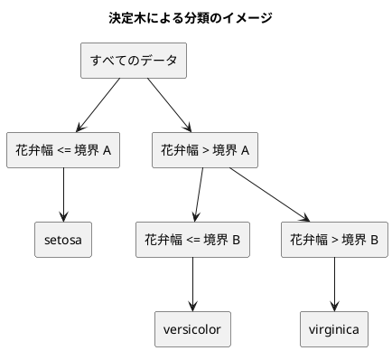

# 第 3 章: 決定木による分類と明白な実装

## 3.1 はじめに

第 1 章では「20 代ならきのこ派」というルールを人間が書き、第 2 章では欠損値を補完したアヤメのデータを訓練データとテストデータに分けました。この章では、「どの特徴量のどこで区切るか」をデータから自動で探すアルゴリズム、**決定木** を自作します。

自作したあとは、.NET の機械学習ライブラリ [ML.NET](https://dotnet.microsoft.com/apps/ai/ml-dotnet) に同じデータを学習させ、予測を突き合わせます。ただし ML.NET には、scikit-learn の `DecisionTreeClassifier` に当たる単一の決定木の学習器がありません。F# 版では、勾配ブースティングの学習器 FastTree に木を 1 本だけ作らせて代わりにします。

[Python 版の第 3 章](../python/03-decision-tree-and-obvious-implementation.md)・[Kotlin 版の第 3 章](../kotlin/03-decision-tree-and-obvious-implementation.md)・[TypeScript 版の第 3 章](../typescript/03-decision-tree-and-obvious-implementation.md) と同じ TODO リストで進めます。F# 版では、次の 3 点に注目してください。

- 木を **判別共用体** で表し、パターンマッチの **網羅性の検査** で場合分けの漏れをコンパイルエラーにする
- 学習の結果を「木という値」で返し、「学習する前に予測する」という誤りをそもそも書けないようにする
- C# 向けに作られた ML.NET の API（可変なクラスと `IDataView`）に、F# の不変な値を橋渡しする

## 3.2 決定木の仕組み

### データを 2 つに分けることを繰り返す

決定木は、データを「ある特徴量がある値以下か、より大きいか」で 2 つに分けることを繰り返します。分けた先で同じラベルばかりになったら、そこで分けるのをやめて、そのラベルを予測に使います。



### どこで分けるかをジニ不純度で決める

「よい分け方」とは、分けた後のそれぞれのグループで、ラベルがなるべく 1 種類にそろう分け方です。そろい具合を数値にしたものが **ジニ不純度** です。

ジニ不純度 = 1 − Σ（各ラベルの割合）²

| グループのラベル | 割合 | ジニ不純度 |
|----------------|------|-----------|
| setosa ×3 | setosa 1.0 | 1 − 1.0² = 0 |
| setosa ×1、virginica ×1 | 0.5、0.5 | 1 − (0.5² + 0.5²) = 0.5 |
| 3 品種 ×1 ずつ | 1/3 ずつ | 1 − 3 × (1/3)² = 2/3 |

ラベルが 1 種類にそろうと 0、混ざるほど大きくなります。分け方の候補ごとに、分けた後の左右のジニ不純度を件数で重み付けして平均し、最も小さくなる分け方を選びます。

## 3.3 TODO リストの作成

**TODO リスト**:

- [ ] ジニ不純度を計算する
- [ ] 最良の分割を探す
  - [ ] ラベルを完全に分けられる境界を見つける
  - [ ] 複数の特徴量から不純度が最も小さい特徴量と境界を選ぶ
  - [ ] ラベルが 1 種類なら分割しない
- [ ] 決定木を学習して予測する
- [ ] 木の深さを制限する
- [ ] 学習した木を表示する
- [ ] ML.NET の結果と突き合わせる
- [ ] 実データで深さと正解率を表示する

この章の実装は、他の言語の版で一度書いた決定木と同じ手順です。やることがはっきりしているので、仮実装と三角測量を細かく刻まず、テストを書いたらすぐに実装を書く **明白な実装** で進めます。

> 明白な実装
>
> シンプルな操作を実現するにはどうすればいいだろうか——そのまま実装しよう。
>
> — テスト駆動開発

明白な実装で進めてもテストが失敗したら、そのときは仮実装に戻って小さく刻みます。

## 3.4 ジニ不純度と最良の分割

### テスト

テストでは、花弁幅だけを特徴量に持つ行を作る関数を用意します。第 2 章と同じく、特徴量は列名から値への `Map` です。

```fsharp
// tests/MachineLearning.Tests/Chapter03/DecisionTreeTest.fs
module MachineLearning.Tests.Chapter03.DecisionTreeTest

open Xunit
open MachineLearning.Chapter03.DecisionTree

/// 花弁幅だけを特徴量に持つ行のリストを作る
let byPetalWidth (values: float list) : Map<string, float> list =
    values |> List.map (fun value -> Map.ofList [ "花弁幅", value ])

[<Fact>]
let ``1 種類のラベルだけならジニ不純度は 0`` () =
    Assert.Equal(0.0, gini [ "setosa"; "setosa"; "setosa" ])

[<Fact>]
let ``2 種類のラベルが半分ずつならジニ不純度は 0.5`` () =
    Assert.Equal(0.5, gini [ "setosa"; "virginica" ])

[<Fact>]
let ``3 種類のラベルが同じ数ならジニ不純度は 3 分の 2`` () =
    Assert.Equal(2.0 / 3.0, gini [ "setosa"; "versicolor"; "virginica" ], 12)

[<Fact>]
let ``ラベルを完全に分けられる境界を見つける`` () =
    let x = byPetalWidth [ 0.1; 0.2; 0.7; 0.8 ]
    let t = [ "setosa"; "setosa"; "virginica"; "virginica" ]

    match bestSplit x t with
    | Some split ->
        Assert.Equal("花弁幅", split.Feature)
        Assert.Equal(0.45, split.Threshold, 12)
        Assert.Equal(0.0, split.Impurity)
    | None -> Assert.Fail "分割が見つからない"

[<Fact>]
let ``ラベルが 1 種類なら分割しない`` () =
    Assert.Equal(None, bestSplit (byPetalWidth [ 0.1; 0.2; 0.7 ]) [ "setosa"; "setosa"; "setosa" ])
```

- `bestSplit` は、分け方が見つからないこともあるので `Split option` を返します。テストでは `match` で `Some` と `None` を場合分けし、`None` ならテストを失敗させます
- 3 品種のジニ不純度は 2/3 で、浮動小数点数では割り切れません。`Assert.Equal` の 3 つ目の引数で、小数第 12 位までで比べます

複数の特徴量から選ぶテストも加えます（完成したテストファイルにあります）。

```text
error FS0039: 名前空間 'Chapter03' が定義されていません。
error FS0039: 値またはコンストラクター 'gini' が定義されていません。
```

### ジニ不純度

```fsharp
// src/MachineLearning/Chapter03/DecisionTree.fs
module MachineLearning.Chapter03.DecisionTree

/// ジニ不純度。ラベルが 1 種類なら 0 で、ばらつくほど大きくなる
let gini (labels: 'L list) : float =
    let total = float labels.Length

    1.0
    - (labels
       |> List.countBy id
       |> List.sumBy (fun (_, count) -> (float count / total) ** 2.0))
```

- `List.countBy id` は、ラベルごとの件数を `(ラベル, 件数)` の組のリストにします。`id` は受け取った値をそのまま返す関数で、「ラベルそのもので数える」という意味になります
- ラベルの型は `'L` にしました。比べられる型であれば、文字列でも判別共用体でも使えます。第 1 章の `Faction`（`Kinoko | Takenoko`）をそのまま正解ラベルにすることもできます

### 最良の分割

```fsharp
/// 「特徴量 Feature の値が Threshold 以下なら左、それより大きければ右」という分け方
type Split =
    {
        Feature: string
        Threshold: float
        /// 分けた後の左右の不純度を件数で重み付けした平均
        Impurity: float
    }

/// 1 つの特徴量について、隣り合う値の中点を境界の候補にして、不純度が最も小さい分け方を返す
let private splitsOf (feature: string) (x: Map<string, float> list) (t: 'L list) : Split list =
    let pairs = List.zip (x |> List.map (fun row -> row[feature])) t |> List.sortBy fst
    let total = float pairs.Length

    [ 1 .. pairs.Length - 1 ]
    |> List.filter (fun i -> fst pairs[i - 1] <> fst pairs[i])
    |> List.map (fun i ->
        let left, right = List.splitAt i pairs
        let impurityOf (part: (float * 'L) list) = float part.Length * gini (List.map snd part)

        {
            Feature = feature
            Threshold = (fst pairs[i - 1] + fst pairs[i]) / 2.0
            Impurity = (impurityOf left + impurityOf right) / total
        })

/// 不純度が最も小さくなる分け方。ラベルが 1 種類か、分けられる値が無ければ None
let bestSplit (x: Map<string, float> list) (t: 'L list) : Split option =
    match x with
    | [] -> None
    | _ when gini t = 0.0 -> None
    | first :: _ ->
        first
        |> Map.keys
        |> Seq.toList
        |> List.collect (fun feature -> splitsOf feature x t)
        |> function
            | [] -> None
            | splits -> Some(List.minBy (fun split -> split.Impurity) splits)
```

- 特徴量の値で並べ替え、隣り合う値の中点を境界の候補にします。同じ値の間には境界を置けないので、`List.filter` で除きます
- `List.collect` は、特徴量ごとの候補のリストを 1 つのリストにつなげます
- `|> function | [] -> ... | splits -> ...` の `function` は、引数を 1 つ受け取ってすぐに `match` する関数の短い書き方です。パイプラインの最後で、「候補が無ければ `None`」を場合分けしています
- `List.minBy` は、最小の値を持つ要素のうち最初のものを返します。特徴量は `Map` のキーの順（文字列の順）に調べるので、不純度が同じなら、名前が先に並ぶ特徴量が選ばれます

`impurityOf` の引数の型注釈は、最初は書いていませんでした。すると次のコンパイルエラーになりました。

```text
error FS0072: このプログラムの場所の前方にある情報に基づく不確定の型のオブジェクトに対する参照です。場合によっては、オブジェクトの型を制約する型の注釈がこのプログラムの場所の前に必要です。この操作で参照が解決される可能性があります。
```

F# の型推論は、コードを上から下、左から右へ読んで型を決めます。`part.Length` の時点では `part` が何の型か分からないので、`.Length` というプロパティがあるかを判断できません。`(part: (float * 'L) list)` と型を書いて伝えます。F# では、プロパティやメソッドを呼ぶ前に型が分かっている必要がある、と覚えておきましょう。

## 3.5 決定木を学習して予測する

### 木を判別共用体で表す

決定木は、「葉（予測するラベル）」か「節（分け方と、左右の部分木）」のどちらかです。この「どちらか」を **判別共用体** で表します。

```fsharp
/// 決定木。葉は予測するラベル、節は分け方と左右の部分木を持つ
type Tree<'L> =
    | Leaf of 'L
    | Node of Split * Tree<'L> * Tree<'L>
```

`Node` の中に `Tree<'L>` があるので、木は自分自身を部分に持つ **再帰的な型** です。TypeScript 版の判別可能なユニオン（`kind: "leaf" | "node"`）と同じ考え方ですが、F# では型の定義そのものが場合分けになります。

### テスト

```fsharp
[<Fact>]
let ``境界の左右で異なるラベルを予測する`` () =
    let tree =
        fit None (byPetalWidth [ 0.1; 0.2; 0.7; 0.8 ]) [ "setosa"; "setosa"; "virginica"; "virginica" ]

    Assert.Equal<string list>([ "setosa"; "virginica" ], predict tree (byPetalWidth [ 0.15; 0.75 ]))
```

`fit` の最初の引数は深さの上限で、`None` なら制限しません。`fit` は学習した **木を返し**、`predict` はその木を受け取って予測します。

TypeScript 版の `DecisionTree` クラスは、学習した木を中に持ち、`fit` の前に `predict` を呼ぶとエラーを投げていました。そのためのテストもありました。F# 版では、`predict` は木を引数に取るので、木が無ければ呼べません。「学習する前に予測する」という誤りをコンパイラが防ぐので、そのテストは要りません。

### 再帰で木を作る

```fsharp
/// 最も多いラベル。同数なら先に現れたラベルを選ぶ
let majority (labels: 'L list) : 'L =
    labels |> List.countBy id |> List.maxBy snd |> fst

/// 深さの上限（None なら制限なし）まで、分け方を選んで再帰的に木を作る
let rec fit (maxDepth: int option) (x: Map<string, float> list) (t: 'L list) : Tree<'L> =
    let split = if maxDepth = Some 0 then None else bestSplit x t

    match split with
    | None -> Leaf(majority t)
    | Some split ->
        let goesLeft (row: Map<string, float>, _) = row[split.Feature] <= split.Threshold
        let left, right = List.zip x t |> List.partition goesLeft
        let childDepth = maxDepth |> Option.map (fun depth -> depth - 1)
        let fitPart part = fit childDepth (List.map fst part) (List.map snd part)
        Node(split, fitPart left, fitPart right)

let rec predictOne (tree: Tree<'L>) (row: Map<string, float>) : 'L =
    match tree with
    | Leaf label -> label
    | Node(split, left, right) ->
        if row[split.Feature] <= split.Threshold then
            predictOne left row
        else
            predictOne right row

let predict (tree: Tree<'L>) (rows: Map<string, float> list) : 'L list = rows |> List.map (predictOne tree)
```

- `let rec` は、関数の中で自分自身を呼ぶ **再帰関数** の宣言です。`rec` を付けないと、`fit` の中の `fit` は「まだ定義されていない名前」としてコンパイルエラーになります
- 分け方が見つからない（ラベルが 1 種類にそろった）か、深さの上限に達したら葉にします。そうでなければ、行を左右に分けて、それぞれで再び `fit` を呼びます
- `List.partition` は、条件を満たす要素と満たさない要素の 2 つのリストに分けます
- 深さの上限は `int option` です。`Option.map` で、`Some 3` なら `Some 2` に、`None`（制限なし）なら `None` のままにします。「制限なし」を `-1` や大きな数で表すと、うっかり引き算してしまう誤りが起きます
- `majority` の `List.maxBy` は、最大の件数を持つラベルのうち最初のものを返します。`List.countBy` はラベルが最初に現れた順に並べるので、同数なら葉の中で先に現れたラベルが選ばれます

### 網羅性の検査で場合分けの漏れを見つける

`predictOne` の `match` で、`Node` の場合を書き忘れたとします。

```fsharp
    match tree with
    | Leaf label -> label
```

F# のコンパイラは、判別共用体のすべての場合を `match` が扱っているかを調べます。

```text
error FS0025: この式のパターン マッチが不完全です たとえば、値 'Node (_, _, _)' はパターンに含まれないケースを示す可能性があります。
```

本来これは警告（warning）ですが、第 1 章で `Directory.Build.props` に `TreatWarningsAsErrors` を設定したので、コンパイルエラーになります。TypeScript 版では `never` を使って自分で網羅性の検査を仕込みましたが、F# では何も書かなくてもコンパイラが検査します。後で木に新しい種類の節を加えたときも、扱っていない `match` をすべてコンパイラが教えてくれます。

```text
テストの実行の概要: 成功!
```

## 3.6 木の深さを制限する

深さを制限しない決定木は、訓練データを最後まで分け切ります。訓練データには正解しますが、たまたまの違いまで覚えてしまい（**過学習**）、新しいデータには当たりにくくなることがあります。

```fsharp
let threeSpeciesX = byPetalWidth [ 0.1; 0.2; 0.3; 0.5; 0.6; 0.9 ]

let threeSpeciesT =
    [ "setosa"; "setosa"; "setosa"; "versicolor"; "versicolor"; "virginica" ]

[<Fact>]
let ``深さを制限しなければすべての訓練データを分け切る`` () =
    let tree = fit None threeSpeciesX threeSpeciesT

    Assert.Equal<string list>(threeSpeciesT, predict tree threeSpeciesX)

[<Fact>]
let ``深さを 1 に制限すると境界の先は多数派のラベルを予測する`` () =
    let tree = fit (Some 1) threeSpeciesX threeSpeciesT

    Assert.Equal<string list>([ "setosa"; "versicolor" ], predict tree (byPetalWidth [ 0.2; 0.95 ]))

[<Fact>]
let ``多数決が同数なら葉の中で先に現れたラベルを選ぶ`` () =
    Assert.Equal("a", majority [ "a"; "b"; "b"; "a" ])
    Assert.Equal("b", majority [ "b"; "a" ])
```

深さ 1 では、1 回だけ分けます。花弁幅 0.4 の境界の右には versicolor 2 件と virginica 1 件が入り、多数派の versicolor を予測します。

これらのテストは、3.5 節の `fit` のままで通りました。深さの制限は `fit` を書いたときに `int option` で入れていたためです。

## 3.7 学習した木を表示する

```fsharp
[<Fact>]
let ``節は条件ごとに字下げして表示する`` () =
    let tree =
        Node(
            {
                Feature = "花弁幅"
                Threshold = 0.4
                Impurity = 0.0
            },
            Leaf "setosa",
            Node(
                {
                    Feature = "花弁長さ"
                    Threshold = 0.75
                    Impurity = 0.0
                },
                Leaf "versicolor",
                Leaf "virginica"
            )
        )

    Assert.Equal<string list>(
        [
            "花弁幅 <= 0.4000"
            "  setosa"
            "花弁幅 > 0.4000"
            "  花弁長さ <= 0.7500"
            "    versicolor"
            "  花弁長さ > 0.7500"
            "    virginica"
        ],
        formatTree tree
    )
```

テストでは、判別共用体の値を `Node(...)` と `Leaf ...` で直接組み立てています。学習を通さずに、表示したい形の木をそのまま作れます。

```fsharp
/// 木を、条件ごとに字下げした行のリストにする
let rec formatTree (tree: Tree<'L>) : string list =
    let indent lines = lines |> List.map (fun line -> "  " + line)

    match tree with
    | Leaf label -> [ string label ]
    | Node(split, left, right) ->
        [ $"{split.Feature} <= {split.Threshold:F4}" ]
        @ indent (formatTree left)
        @ [ $"{split.Feature} > {split.Threshold:F4}" ]
        @ indent (formatTree right)
```

- 部分木を表示した行に、`indent` で 2 文字の空白を足します。深い部分木ほど、再帰の段数だけ字下げが重なります
- `{split.Threshold:F4}` は、補間文字列の中で書式を指定する書き方で、小数第 4 位まで表示します

```bash
dotnet test
```

```text
テストの実行の概要: 成功!
  合計: 46
  失敗: 0
  成功: 46
```

## 3.8 ML.NET の決定木と突き合わせる

### ML.NET には単一の決定木が無い

ML.NET の多クラス分類の学習器には、scikit-learn の `DecisionTreeClassifier` のような「決定木を 1 本だけ作る」ものがありません。木を使う学習器は、FastTree（勾配ブースティング）や FastForest（ランダムフォレスト）のように、木を何本も組み合わせるものです。

そこで [ADR 004](../../../adr/004-fsharp-ml-libraries.md) では、次の組み合わせで自作の決定木の代わりにすると決めました。

- 2 値分類の FastTree に、木を 1 本だけ作らせる（`numberOfTrees = 1`）
- 多クラスは、クラスごとに「そのクラスか、それ以外か」の 2 値分類器を作る **OneVersusAll** で組む
- 深さの上限の代わりに、葉の数の上限（`numberOfLeaves`）を指定する。深さ d の決定木の葉は最大 2 の d 乗個なので、それに合わせる

自作の決定木とは仕組みが違うので、境界の値までは一致しない前提で、**予測** を突き合わせます。

### ML.NET を導入する

```xml
<!-- Directory.Packages.props -->
    <PackageVersion Include="Microsoft.ML" Version="5.0.0" />
    <PackageVersion Include="Microsoft.ML.FastTree" Version="5.0.0" />
```

```xml
<!-- src/MachineLearning/MachineLearning.fsproj -->
    <PackageReference Include="Microsoft.ML" />
    <PackageReference Include="Microsoft.ML.FastTree" />
```

### F# の値を ML.NET に橋渡しする

ML.NET は C# 向けに作られていて、データを「引数なしのコンストラクターと、書き換えられるプロパティを持つクラス」で受け取ります。F# のレコードは不変で、引数なしのコンストラクターも無いので、そのままでは渡せません。

```fsharp
// src/MachineLearning/Chapter03/MlNetAdapter.fs
module MachineLearning.Chapter03.MlNetAdapter

open Microsoft.ML
open Microsoft.ML.Data

/// ML.NET に渡す 1 行。ML.NET は引数なしのコンストラクターと書き換えられるプロパティを持つクラスを求めるので、
/// [<CLIMutable>] を付けたレコードにする
[<CLIMutable>]
type MlRow = { Features: float32[]; Label: string }

/// ML.NET が返す予測。列の名前（PredictedLabel）でプロパティに対応づけられる
[<CLIMutable>]
type MlPrediction = { PredictedLabel: string }
```

- `[<CLIMutable>]` を付けたレコードは、コンパイルされると引数なしのコンストラクターと書き換えられるプロパティを持ちます。F# のコードからは、これまでどおり不変なレコードとして使えます
- ML.NET の学習器は、特徴量を `Features` という名前の `float32`（単精度の浮動小数点数）のベクトルの列で受け取ります

もう 1 つの問題は、ベクトルの長さです。ML.NET は、`Features` 列が何個の値を持つかを事前に知る必要があります。C# の例では `[VectorType(4)]` という属性で長さを書きますが、属性には定数しか書けません。自作の決定木は特徴量の数によらずに動くので、ML.NET との橋渡しも特徴量の数によらずに使えるようにしたいところです。そこで、実行時に長さを指定する `SchemaDefinition` を使います。

```fsharp
/// 特徴量の Map を、列名の順（Map のキーの順）に並べた float32 の配列にする
let private toVector (row: Map<string, float>) : float32[] =
    row |> Map.values |> Seq.map float32 |> Seq.toArray

/// 特徴量の数は実行時に決まるので、Features 列のベクトルの長さを SchemaDefinition で指定する
let private schemaFor (featureCount: int) : SchemaDefinition =
    let schema = SchemaDefinition.Create(typeof<MlRow>)
    schema["Features"].ColumnType <- VectorDataViewType(NumberDataViewType.Single, featureCount)
    schema
```

`<-` は、書き換えられるプロパティに値を代入する演算子です。ML.NET の API を使う部分だけは、可変な値を扱う書き方になります。

### テスト

```fsharp
// tests/MachineLearning.Tests/Chapter03/MlNetAdapterTest.fs
let x = byPetalWidth [ 0.1; 0.2; 0.3; 0.5; 0.6; 0.9 ]

let t = [ "setosa"; "setosa"; "setosa"; "versicolor"; "versicolor"; "virginica" ]

[<Fact>]
let ``文字列の正解ラベルで学習し、文字列のラベルで予測する`` () =
    let predictWith = trainFastTree 2 x t

    Assert.Equal<string list>([ "setosa"; "versicolor"; "virginica" ], predictWith (byPetalWidth [ 0.2; 0.55; 0.95 ]))

[<Fact>]
let ``訓練データから離れた値では自作の決定木と同じ予測をする`` () =
    let newX = byPetalWidth [ 0.15; 0.55; 0.95 ]

    let predictWith = trainFastTree 2 x t

    Assert.Equal<string list>(DecisionTree.predict (DecisionTree.fit None x t) newX, predictWith newX)
```

`trainFastTree` は、学習して **予測する関数を返す** 関数にします。ML.NET のモデルや `MLContext` は関数の中に閉じ込め、使う側からは「特徴量のリストを渡すとラベルのリストが返る関数」にしか見えないようにします。

### アダプターの実装

```fsharp
/// 木を 1 本だけ作る FastTree を、クラスごとの 2 値分類（OneVersusAll）で多クラスにして学習し、予測する関数を返す。
/// ML.NET には単一の決定木（CART）の学習器が無いので、勾配ブースティングの 1 本目の木で代わりにする。
/// 葉の数の上限 numberOfLeaves は、深さ d の決定木なら 2 の d 乗に当たる。
let trainFastTree
    (numberOfLeaves: int)
    (x: Map<string, float> list)
    (t: string list)
    : Map<string, float> list -> string list =
    let context = MLContext(seed = 0)
    let featureCount = x.Head.Count
    let schema = schemaFor featureCount

    let rows =
        List.map2
            (fun features label ->
                {
                    Features = toVector features
                    Label = label
                })
            x
            t

    let data = context.Data.LoadFromEnumerable(rows, schema)

    let fastTree =
        context.BinaryClassification.Trainers.FastTree(
            numberOfLeaves = numberOfLeaves,
            numberOfTrees = 1,
            minimumExampleCountPerLeaf = 1
        )

    let pipeline =
        EstimatorChain()
            .Append(context.Transforms.Conversion.MapValueToKey("Label"))
            .Append(context.MulticlassClassification.Trainers.OneVersusAll(fastTree))
            .Append(context.Transforms.Conversion.MapKeyToValue("PredictedLabel"))

    let model = pipeline.Fit(data)

    fun newX ->
        let newRows =
            newX
            |> List.map (fun features ->
                {
                    Features = toVector features
                    Label = ""
                })

        model.Transform(context.Data.LoadFromEnumerable(newRows, schema))
        |> fun predictions -> context.Data.CreateEnumerable<MlPrediction>(predictions, reuseRowObject = false)
        |> Seq.map (fun prediction -> prediction.PredictedLabel)
        |> Seq.toList
```

- `MLContext(seed = 0)` は、ML.NET のすべての操作の入り口です。乱数のシードを渡して、結果を再現できるようにします
- `LoadFromEnumerable(rows, schema)` で、レコードのリストを ML.NET のデータ（`IDataView`）にします
- パイプラインは、「文字列のラベルを番号（キー）にする」「OneVersusAll で学習する」「予測した番号を文字列のラベルに戻す」の 3 段です。ML.NET の分類器は、正解ラベルを番号で受け取るためです
- `minimumExampleCountPerLeaf = 1` は、葉に最低 1 件あればよいという指定です。既定では葉ごとに 10 件以上を求めるので、テストの 6 件のデータでは分けられません
- 最後に返す `fun newX -> ...` は、`model` と `context` を覚えている **クロージャ** です

```text
テストの実行の概要: 成功!
  合計: 48
  失敗: 0
  成功: 48
```

## 3.9 実データで深さと正解率を表示する

### 実行して表示する

深さの上限ごとに、自作の決定木の訓練データとテストデータの正解率と、テストデータの予測が ML.NET とどれだけ一致したかを表示します。

```fsharp
// src/MachineLearning/Chapter03/Main.fs
module MachineLearning.Chapter03.Main

open System.IO
open MachineLearning.Dataset
open MachineLearning.Chapter01.KinokoTakenoko
open MachineLearning.Chapter02.IrisPreprocessing
open MachineLearning.Chapter03.DecisionTree
open MachineLearning.Chapter03.MlNetAdapter

[<Literal>]
let TestSize = 0.3

[<Literal>]
let Seed = 0

let MaxDepths = [ Some 1; Some 2; Some 3; Some 4; Some 5; None ]

[<Literal>]
let TreeDepthToShow = 2

let private formatDepth (maxDepth: int option) : string =
    maxDepth |> Option.map string |> Option.defaultValue "制限なし"

/// 深さ d の決定木の葉の数の上限（2 の d 乗）。制限なしのときは訓練データの件数を上限にする
let private leavesFor (maxDepth: int option) (trainCount: int) : int =
    maxDepth |> Option.map (fun depth -> pown 2 depth) |> Option.defaultValue trainCount

/// iris.csv で深さごとの正解率、ML.NET との予測の一致数、深さ 2 の決定木を表示する
let run (print: string -> unit) : unit =
    let split = prepareIris (Path.Combine(dataDir (), "iris.csv")) TestSize Seed
    print "深さ\t訓練データ\tテストデータ\tML.NET と一致"

    for maxDepth in MaxDepths do
        let tree = fit maxDepth split.XTrain split.TTrain
        let train = accuracy (predict tree split.XTrain) split.TTrain
        let mine = predict tree split.XTest
        let test = accuracy mine split.TTest

        let library =
            trainFastTree (leavesFor maxDepth split.XTrain.Length) split.XTrain split.TTrain split.XTest

        let agreed =
            List.zip mine library |> List.filter (fun (a, b) -> a = b) |> List.length

        print $"{formatDepth maxDepth}\t{train:F4}\t{test:F4}\t{agreed}/{mine.Length}"

    print ""
    print $"深さ {TreeDepthToShow} の決定木:"

    fit (Some TreeDepthToShow) split.XTrain split.TTrain |> formatTree |> List.iter print
```

- 正解率は、第 1 章の `accuracy` をそのまま使います。第 1 章で `'T list` を受け取るジェネリックな関数にしていたので、派閥でも品種の文字列でも使えます
- `pown 2 depth` は、整数の累乗（2 の `depth` 乗）です
- `trainFastTree ... split.XTrain split.TTrain split.XTest` は、学習して返ってきた予測の関数に、そのままテストデータを渡しています

`Program.fs` の対応表に `"chapter03", Chapter03.Main.run` を加えて実行します。

```bash
dotnet run --project src/MachineLearning -- chapter03
```

```text
深さ	訓練データ	テストデータ	ML.NET と一致
1	0.6952	0.6000	32/45
2	0.9619	0.8889	45/45
3	0.9714	0.8889	43/45
4	0.9810	0.9111	44/45
5	1.0000	0.9111	44/45
制限なし	1.0000	0.9111	44/45

深さ 2 の決定木:
花弁幅 <= 0.2750
  Iris-setosa
花弁幅 > 0.2750
  花弁幅 <= 0.6900
    Iris-versicolor
  花弁幅 > 0.6900
    Iris-virginica
```

### 結果を読む

- 深さを増やすと訓練データの正解率は上がり、深さ 5 で 1.0 になります。一方、テストデータの正解率は 0.9111 で頭打ちです。深さを増やしても、新しいデータへの当たりやすさは上がっていません
- 深さ 2 の木は、花弁幅だけで 3 品種を分けています。Notebook の散布図（第 2 章）で見たとおり、花弁幅は品種による違いがはっきりした特徴量です
- 訓練データに入った行が他の言語の版と違うので、正解率の値は他の版と一致しません

### ML.NET と一致しない理由

深さ 2 では、テストデータの 45 件すべてで予測が一致しました。深さ 1 では 45 件中 32 件しか一致しません。

深さ 1 の自作の決定木は、1 回だけ分けて 2 つの葉を作ります。3 品種のうち 1 つは、どちらの葉でも予測されません。正解率が 0.6 程度にとどまるのはそのためです。

ML.NET の OneVersusAll は、品種ごとに「その品種か、それ以外か」を判定する木を **3 本** 作り、最も確からしいと判定した品種を選びます。3 本の木はそれぞれ別の境界で分けられるので、葉が 2 つずつでも 3 品種すべてを予測できます。深さ 1 どうしでは、比べている仕組みそのものが違うのです。

深さ 3 以上で 1〜2 件ずれるのは、次の違いによると考えられます。

- FastTree は、特徴量の値をあらかじめいくつかの区間に分け（ビン分割）、区間の境目だけを境界の候補にする。自作の決定木は、隣り合う値の中点をすべて候補にする
- FastTree は、ジニ不純度ではなく勾配ブースティングの損失を小さくするように分ける

仕組みの違う 2 つの実装が、深さ 2 で予測をすべて一致させたことは、自作の決定木が妥当に動いていることの裏付けになります。

### 実データのテスト

実測した値を、実データのテストとして残します。

```fsharp
// tests/MachineLearning.Tests/Chapter03/IrisDataTest.fs
[<Fact>]
let ``深さ 2 の決定木はテストデータの 45 件中 40 件を正しく分類する`` () =
    requireData ()
    let split = prepareIris csvFile 0.3 0

    let tree = fit (Some 2) split.XTrain split.TTrain

    Assert.Equal(40.0 / 45.0, accuracy (predict tree split.XTest) split.TTest, 12)
```

表示のテストも、第 2 章と同じく、`Main.run` の出力をまるごと比べます（完成したテストファイルにあります）。

```bash
dotnet fantomas .
dotnet fsharplint lint MachineLearning.sln
dotnet test
```

```text
========== Summary: 0 warnings ==========
テストの実行の概要: 成功!
  合計: 50
  失敗: 0
  成功: 50
```

## 3.10 Notebook で探索する

Notebook は `apps/fsharp/notebooks/chapter03_decision_tree_exploration.ipynb` にあります。第 2 章と同じく、先に `dotnet build` でプロジェクトをビルドしておきます。Polyglot Notebooks が廃止されていることは、[第 2 章の 2.10 節](02-data-preprocessing-and-triangulation.md) を参照してください。

```fsharp
let depths = [ 1..8 ]

let scores =
    depths
    |> List.map (fun depth ->
        let tree = fit (Some depth) split.XTrain split.TTrain
        accuracy (predict tree split.XTrain) split.TTrain, accuracy (predict tree split.XTest) split.TTest)

[
    Chart.Line(x = depths, y = (scores |> List.map fst), Name = "訓練データ")
    Chart.Line(x = depths, y = (scores |> List.map snd), Name = "テストデータ")
]
|> Chart.combine
|> Chart.withTitle "決定木の深さと正解率"
|> Chart.withXAxisStyle "深さの上限"
|> Chart.withYAxisStyle "正解率"
```

深さの上限を 1 から 8 まで変えて、訓練データとテストデータの正解率を折れ線グラフで重ねます。訓練データの正解率は深さ 5 で 1.0 に達し、それ以上深くしても変わりません。テストデータの正解率は深さ 4 以降 0.9111 のまま横ばいです。2 本の線の開きが、訓練データにだけ当てはまっている度合いを表しています。

グラフの画像は、第 2 章と同じ理由で記事に載せていません。

次の完成コードは、第 5 章で FSharpLint の設定を直したときに加えた `[<TailCall>]` 属性と、指摘を抑える理由のコメントを含みます（[第 5 章の 5.5 節](05-package-management-and-static-analysis.md)）。

<details>
<summary>この章の完成コード（src/MachineLearning/Chapter03/DecisionTree.fs）</summary>

```fsharp
module MachineLearning.Chapter03.DecisionTree

/// ジニ不純度。ラベルが 1 種類なら 0 で、ばらつくほど大きくなる
let gini (labels: 'L list) : float =
    let total = float labels.Length

    1.0
    - (labels
       |> List.countBy id
       |> List.sumBy (fun (_, count) -> (float count / total) ** 2.0))

/// 「特徴量 Feature の値が Threshold 以下なら左、それより大きければ右」という分け方
type Split =
    {
        Feature: string
        Threshold: float
        /// 分けた後の左右の不純度を件数で重み付けした平均
        Impurity: float
    }

/// 1 つの特徴量について、隣り合う値の中点を境界の候補にして、不純度が最も小さい分け方を返す
let private splitsOf (feature: string) (x: Map<string, float> list) (t: 'L list) : Split list =
    let pairs = List.zip (x |> List.map (fun row -> row[feature])) t |> List.sortBy fst
    let total = float pairs.Length

    [ 1 .. pairs.Length - 1 ]
    |> List.filter (fun i -> fst pairs[i - 1] <> fst pairs[i])
    |> List.map (fun i ->
        let left, right = List.splitAt i pairs

        let impurityOf (part: (float * 'L) list) =
            float part.Length * gini (List.map snd part)

        {
            Feature = feature
            Threshold = (fst pairs[i - 1] + fst pairs[i]) / 2.0
            Impurity = (impurityOf left + impurityOf right) / total
        })

/// 不純度が最も小さくなる分け方。ラベルが 1 種類か、分けられる値が無ければ None
let bestSplit (x: Map<string, float> list) (t: 'L list) : Split option =
    match x with
    | [] -> None
    | _ when gini t = 0.0 -> None
    | first :: _ ->
        first
        |> Map.keys
        |> Seq.toList
        |> List.collect (fun feature -> splitsOf feature x t)
        |> function
            | [] -> None
            | splits -> Some(List.minBy (fun split -> split.Impurity) splits)

/// 決定木。葉は予測するラベル、節は分け方と左右の部分木を持つ
type Tree<'L> =
    | Leaf of 'L
    | Node of Split * Tree<'L> * Tree<'L>

/// 最も多いラベル。同数なら先に現れたラベルを選ぶ
let majority (labels: 'L list) : 'L =
    labels |> List.countBy id |> List.maxBy snd |> fst

/// 深さの上限（None なら制限なし）まで、分け方を選んで再帰的に木を作る
// 左右の部分木を作ってから Node にまとめるので末尾再帰ではない。再帰の深さは木の深さまで
// fsharplint:disable-next-line EnsureTailCallDiagnosticsInRecursiveFunctions
let rec fit (maxDepth: int option) (x: Map<string, float> list) (t: 'L list) : Tree<'L> =
    let split = if maxDepth = Some 0 then None else bestSplit x t

    match split with
    | None -> Leaf(majority t)
    | Some split ->
        let goesLeft (row: Map<string, float>, _) = row[split.Feature] <= split.Threshold
        let left, right = List.zip x t |> List.partition goesLeft
        let childDepth = maxDepth |> Option.map (fun depth -> depth - 1)

        let fitPart part =
            fit childDepth (List.map fst part) (List.map snd part)

        Node(split, fitPart left, fitPart right)

[<TailCall>]
let rec predictOne (tree: Tree<'L>) (row: Map<string, float>) : 'L =
    match tree with
    | Leaf label -> label
    | Node(split, left, right) ->
        if row[split.Feature] <= split.Threshold then
            predictOne left row
        else
            predictOne right row

let predict (tree: Tree<'L>) (rows: Map<string, float> list) : 'L list = rows |> List.map (predictOne tree)

/// 木を、条件ごとに字下げした行のリストにする
// 左右の部分木の行を連結するので末尾再帰ではない。再帰の深さは木の深さまで
// fsharplint:disable-next-line EnsureTailCallDiagnosticsInRecursiveFunctions
let rec formatTree (tree: Tree<'L>) : string list =
    let indent lines =
        lines |> List.map (fun line -> "  " + line)

    match tree with
    | Leaf label -> [ string label ]
    | Node(split, left, right) ->
        [ $"{split.Feature} <= {split.Threshold:F4}" ]
        @ indent (formatTree left)
        @ [ $"{split.Feature} > {split.Threshold:F4}" ]
        @ indent (formatTree right)
```

</details>

## 3.11 まとめ

この章では、データから分け方を学ぶ決定木を自作し、ML.NET と予測を突き合わせました。

1. **明白な実装** — 手順がはっきりしている実装は、テストを書いたらすぐに書く。テストが失敗したら小さく刻む
2. **判別共用体と再帰** — 木を `Leaf | Node` で表し、`let rec` の再帰で作り、たどった。網羅性の検査が、場合分けの漏れをコンパイルエラーにした
3. **値として返す** — `fit` が木を返し、`predict` が木を受け取るので、「学習する前に予測する」誤りを書けない。深さの「制限なし」は `int option` の `None` で表した
4. **型推論の順番** — `part.Length` の前に型が分からないと FS0072 になる。型推論は上から下、左から右へ進む
5. **C# 向けの API への橋渡し** — `[<CLIMutable>]` のレコードと `SchemaDefinition` で F# の値を ML.NET に渡し、モデルは予測の関数に閉じ込めた。単一の決定木が無い ML.NET とは、仕組みの違いを踏まえて予測を突き合わせた

次の章では、ここまでのコードを Git で管理し、学習データを再配布しない仕組みと、乱数と .NET の版の関係を確かめます。
