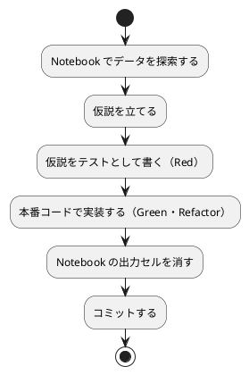
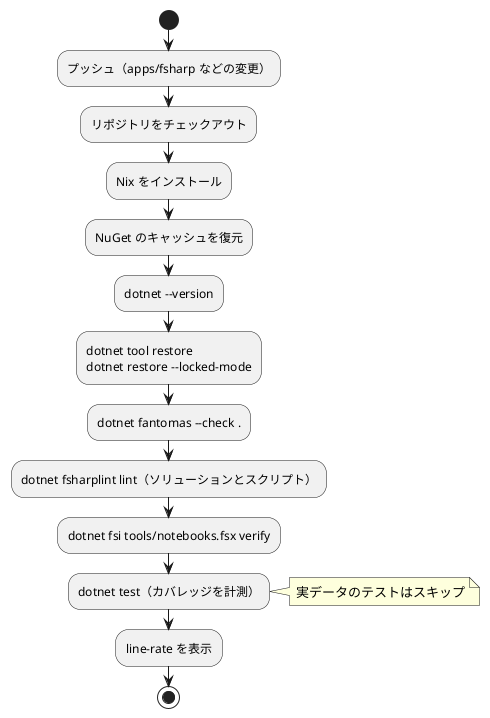

# 第 6 章: タスクランナーと CI/CD

## 6.1 はじめに

第 5 章までで、テスト（xUnit v3）、整形（Fantomas）、静的解析（FSharpLint）、警告をエラーにする設定、カバレッジ（coverlet）がそろいました。ただ、コマンドを覚えて毎回正しい順番で実行するのは手間で、実行し忘れも起きます。

この章では、次の 3 つを整えます。

1. **タスクランナー** — `dotnet` CLI のコマンドと、リポジトリ全体の Gulp のタスクの役割を分け、品質チェックを 1 つのタスクで実行できるようにする
2. **Notebook の運用** — Polyglot Notebooks の出力セルを消してからコミットする仕組みを、F# のスクリプトとして作る（第 2 章で予告したもの）
3. **CI/CD** — GitHub Actions で、プッシュのたびに同じ品質チェックを自動実行する

最後に、CI に載せるまでに起きた問題と、その調べ方を紹介します。

[Python 版の第 6 章](../python/06-task-runner-and-ci-cd.md) では tox を、[Kotlin 版の第 6 章](../kotlin/06-task-runner-and-ci-cd.md) では Gradle を、[TypeScript 版の第 6 章](../typescript/06-task-runner-and-ci-cd.md) では npm scripts をタスクランナーにしました。F# 版では、`dotnet` CLI には品質チェックをまとめる仕組みが無いので、まとめる役をリポジトリの Gulp に任せます。Notebook の出力セルは、Kotlin 版と同じく Python のツールに頼らず、.NET SDK だけで検査します。

## 6.2 タスクランナー — dotnet CLI と Gulp

### dotnet CLI のコマンド

F# 版で使うコマンドは、どれも `dotnet` CLI とそのローカルツールです。

| コマンド | 役割 | 章 |
|---------|------|----|
| `dotnet tool restore` | Fantomas・FSharpLint を入れる | 第 5 章 |
| `dotnet restore` | 依存パッケージを入れ、`packages.lock.json` を書き出す | 第 5 章 |
| `dotnet build` | ビルドする（型チェックを含む） | 第 1 章 |
| `dotnet test` | ビルドしてテストを実行する | 第 1 章 |
| `dotnet fantomas --check .` | 整形が必要なファイルがあれば失敗する | 第 5 章 |
| `dotnet fsharplint lint MachineLearning.sln` | 静的解析 | 第 5 章 |
| `dotnet fsi tools/notebooks.fsx verify` | Notebook の出力セルが残っていれば失敗する | 本章 |
| `dotnet run --project src/MachineLearning -- chapter03` | 章の `Main.run` を実行する | 第 1 章 |

Gradle の `check` や npm scripts の `check` と違い、`dotnet` CLI には「整形の検査・静的解析・テストをまとめて実行する」コマンドがありません。MSBuild のターゲットを自分で書けばまとめられますが、ローカルツールの呼び出しをプロジェクトファイルに書き込むことになり、F# のプロジェクトとしては見慣れない形になります。

### Gulp で品質チェックをまとめる

本リポジトリには、言語に依存しない作業を受け持つ Gulp（ルートの `gulpfile.js` と `ops/scripts/`）があり、各言語の版の環境を用意する `apps:setup:*` と、品質チェックを実行する `apps:check:*` のタスクを定義しています（`ops/scripts/apps.js`）。F# 版の定義は次のとおりです。

```javascript
  {
    name: 'fsharp',
    nix: 'dotnet',
    dir: path.join('apps', 'dotnet'),
    // global.json の SDK バージョンで解決できるかをアプリのディレクトリで確かめる
    tools: [{ cmd: 'dotnet', version: 'dotnet --version' }],
    setup: 'dotnet tool restore && dotnet restore --locked-mode && dotnet build --no-restore',
    // CI（.github/workflows/fsharp-ci.yml）と同じ順に、整形・静的解析・Notebook の出力・テストを検査する
    check: 'dotnet fantomas --check . && dotnet fsharplint lint MachineLearning.sln && dotnet fsharplint lint tools/notebooks.fsx && dotnet fsi tools/notebooks.fsx verify && dotnet test',
  },
```

- `setup` と `check` は、`apps/fsharp` で実行するシェルのコマンドです。`&&` でつないでいるので、どれか 1 つが失敗するとそこで止まります
- 順番は、速く終わり、直し方が機械的なものから並べています。書式の崩れは `dotnet fantomas .` で、出力セルは `strip` で直せるので先に、テストの失敗は原因を考える必要があるので最後に置いています
- `tools` のコマンド（`dotnet --version`）が失敗したら、つまり `global.json` の SDK が手元に無ければ、Nix が使える環境では `nix develop .#dotnet` の中で同じコマンドを実行します

この章で、`check` に Notebook の出力セルの検査（`dotnet fsi tools/notebooks.fsx verify`）と、スクリプトの静的解析を加えました。

```bash
# 品質チェックをまとめて実行する（リポジトリのルートで）
npx gulp apps:check:fsharp
```

学習データを配置した環境での結果です（一部を抜き出しています）。

```text
[apps\dotnet] dotnet fantomas --check . && dotnet fsharplint lint MachineLearning.sln && dotnet fsharplint lint tools/notebooks.fsx && dotnet fsi tools/notebooks.fsx verify && dotnet test
Running FSharpLint with 98 rules (42 enabled, 56 disabled)...
========== Summary: 0 warnings ==========
Running FSharpLint with 98 rules (42 enabled, 56 disabled)...
========== Summary: 0 warnings ==========
テストの実行の概要: 成功!
  合計: 53
  失敗: 0
  成功: 53
  スキップ済み: 0
```

`dotnet fantomas --check .` と `verify` は、問題が無ければ何も表示しません。

### dotnet CLI と Gulp の役割分担

| 道具 | 実行する場所 | 受け持つもの |
|------|------------|------------|
| `dotnet` CLI とローカルツール | `apps/fsharp` | F# 版の個々の作業（ビルド・テスト・整形・静的解析・Notebook の出力の検査） |
| Gulp | リポジトリのルート | 言語に依存しない作業（学習データの配置 `data:setup`、ドキュメントのビルド `mkdocs:build` など）と、各言語の版の品質チェックをまとめて呼ぶ `apps:check:*` |

TypeScript 版では、Gulp から `apps/node` のテストを呼ばず、品質チェックを npm scripts だけで完結させていました。F# 版では `dotnet` CLI にまとめる仕組みが無いので、まとめる役だけを Gulp に任せています。個々のコマンドは `dotnet` CLI のものなので、Gulp を入れていない環境でも、上の表のコマンドを順に実行すれば同じ検査ができます。CI（6.4 節）も、Gulp を使わずに同じコマンドを 1 つずつ実行します。

### 章の Main.run を実行する

各章の `Main.run` は、`Program.fs` の入り口から、章の名前を引数にして実行します。

```bash
dotnet run --project src/MachineLearning -- chapter03
```

- `--project` で実行するプロジェクトを指定し、`--` より後ろの引数をプログラムに渡します
- 章の名前が無いか間違っていると、使い方を表示して終了コード 1 で終わります

```text
使い方: dotnet run --project src/MachineLearning -- (chapter01 | chapter02 | chapter03)
```

### タスクの実行

```bash
# 品質チェックをまとめて実行する（リポジトリのルートで）
npx gulp apps:check:fsharp

# 個別に実行する（apps/fsharp で）
dotnet test
dotnet fantomas --check .
dotnet fsharplint lint MachineLearning.sln
dotnet fsi tools/notebooks.fsx verify

# 整形する（コードと Notebook の出力セル）
dotnet fantomas .
dotnet fsi tools/notebooks.fsx strip

# カバレッジを計測する
dotnet test --coverlet --coverlet-include '[MachineLearning]*' --coverlet-output-format cobertura --results-directory TestResults

# 章の Main.run を実行する（学習データが必要）
dotnet run --project src/MachineLearning -- chapter03

# Notebook を実行して動作を確認する（学習データと Jupyter が必要）
dotnet fsi tools/notebooks.fsx execute
```

### 環境変数を dotnet test に渡す

`dotnet test` と `dotnet run` は、実行したシェルの環境変数をそのままテストやプログラムに引き継ぎます。Python 版の tox の `passenv` や、Kotlin 版の Gradle の `inputs.property` のような設定は要りません。Gulp の `apps:check:fsharp` も、子プロセスに環境変数を引き継ぐので、`ML_DATA_DIR` を指定して実行できます。

## 6.3 Notebook による探索と出力セルの削除

### Polyglot Notebooks でデータを探索する

Notebook は `apps/fsharp/notebooks/` に置いています。VS Code の Polyglot Notebooks で開くと、F# のカーネルで実行できます。Notebook からは、`dotnet build` で作ったプロジェクトの DLL を読み込み、テスト済みの関数を呼びます。

```fsharp
#r "nuget: FSharp.Data, 8.2.0"
#r "nuget: Plotly.NET, 5.1.0"
#r "nuget: Plotly.NET.Interactive, 5.0.0"
#r "../src/MachineLearning/bin/Debug/net10.0/MachineLearning.dll"
```

Notebook の中で前処理や学習の処理を書き直すと、テストで守られたコードと Notebook のコードが別々に育ってしまいます。Notebook は、テスト済みのコードを使ってデータを **見る** 場所にします。Polyglot Notebooks が廃止されていることと、使う版は [第 2 章の 2.10 節](02-data-preprocessing-and-triangulation.md) を参照してください。

### Notebook で分かったことをテストに移す

Notebook は探索の場所であり、そこで分かったことは Notebook に残しただけでは守られません。次の流れで、分かったことをテストと本番コードに移します。



第 3 章では、Notebook で深さの上限を 1〜8 に変えたときの正解率を折れ線グラフにしました。深さ 2 の木の正解数（45 件中 40 件）は、Notebook の表だけに残さず、実データのテストにしています。第 4 章では、この数値がシード付きの乱数列に頼っていることから、乱数列そのものも学習用テストにしました。

### 出力セルを消してからコミットする

Notebook のファイル（`.ipynb`）には、コードに加えて実行結果（表・グラフ）が保存されます。出力を残したままコミットすると、次の問題が起きます。

- 出力に学習データの行が含まれ、データをコミットしない方針（第 4 章）に反する
- グラフのデータでファイルが大きくなり、差分が読めなくなる

第 2 章では、Python 版と同じ nbstripout で出力を消しました。ただ、nbstripout は Python のパッケージで、CI の Nix の `dotnet` 環境（共通の環境の Python 3 と .NET SDK）には入っていません。CI のために Python のパッケージを入れる手順を増やす代わりに、Kotlin 版と同じく、.NET SDK だけで動く道具を作ります。`.ipynb` の中身は JSON なので、.NET に標準で入っている `System.Text.Json` で読み書きできます。F# のプログラムは、プロジェクトを作らずに **スクリプト**（`.fsx`）として `dotnet fsi` で実行できるので、`apps/fsharp/tools/notebooks.fsx` に書きました。

```fsharp
// notebooks/ の Notebook の出力セルを検査・削除し、画面なしで実行する。
//
// 使い方（apps/fsharp で実行する）:
//     dotnet fsi tools/notebooks.fsx verify   出力セルが残っている Notebook があれば失敗する
//     dotnet fsi tools/notebooks.fsx strip    出力セルを消す
//     dotnet fsi tools/notebooks.fsx execute  すべて実行する（結果は bin/notebooks に書き出す。学習データと Jupyter が必要）

open System
open System.Diagnostics
open System.IO
open System.Text
open System.Text.Encodings.Web
open System.Text.Json
open System.Text.Json.Nodes

let notebookDir =
    Path.GetFullPath(Path.Combine(__SOURCE_DIRECTORY__, "..", "notebooks"))

let notebooks () : string list =
    Directory.GetFiles(notebookDir, "*.ipynb") |> Array.sort |> Array.toList

/// 実行したときに書き込まれるセルのメタデータ（nbstripout が既定で消すもの）
let executionMetadata = [ "execution"; "ExecuteTime"; "collapsed"; "scrolled" ]

let codeCells (notebook: JsonNode) : JsonObject list =
    notebook["cells"].AsArray()
    |> Seq.map (fun cell -> cell.AsObject())
    |> Seq.filter (fun cell -> cell["cell_type"].GetValue<string>() = "code")
    |> Seq.toList

/// 出力・実行番号・実行の記録のどれかが残っていれば、実行済みのセルとみなす
let isExecuted (cell: JsonObject) : bool =
    cell["outputs"].AsArray().Count > 0
    || not (isNull cell["execution_count"])
    || executionMetadata
       |> List.exists (fun key -> cell["metadata"].AsObject().ContainsKey key)
```

- `__SOURCE_DIRECTORY__` は、スクリプトのファイルがあるディレクトリ（`apps/fsharp/tools`）です。第 1 章の `Dataset.fs` と同じく、どこから実行しても `notebooks/` の場所が決まります
- `JsonNode.Parse` で読んだ JSON は、`JsonNode`（任意の値）・`JsonObject`（オブジェクト）・`JsonArray`（配列）で表されます。`AsObject()`・`AsArray()` で、期待する形に変えてから使います。形が違えば実行時に例外になるので、ここは型で守られていない部分です
- `cell["execution_count"]` は、JSON の `null` のとき F# では `null` になります。`isNull` で確かめます
- Jupyter で実行すると、出力と実行番号のほかに、セルのメタデータ `execution` に実行した時刻が書き込まれます。Kotlin 版は出力と実行番号だけを見ていましたが、F# 版では nbstripout が既定で消すメタデータも対象にしました

最初は `List.exists cell["metadata"].AsObject().ContainsKey` と、メソッドをそのまま関数として渡そうとしましたが、次のエラーになりました。

```text
notebooks.fsx(34,41): error FS0597: 複数の引数が連続する場合、スペースで区切るかタプル化します。関数またはメソッド アプリケーションに関する引数の場合、かっこで囲む必要があります。
```

関数の引数の位置に、インデクサー（`cell["metadata"]`）とメソッドの呼び出しが続く式を置くと、F# はどこまでが 1 つの引数かを決められません。`fun key -> ...` のラムダにして解決しました。

削除と書き出しは次のとおりです。

```fsharp
let clear (cell: JsonObject) : unit =
    cell["outputs"] <- JsonArray()
    cell["execution_count"] <- null
    let metadata = cell["metadata"].AsObject()
    executionMetadata |> List.iter (metadata.Remove >> ignore)

let load (path: string) : JsonNode = File.ReadAllText path |> JsonNode.Parse

let isDirty (path: string) : bool =
    load path |> codeCells |> List.exists isExecuted

/// Jupyter と同じ書式（字下げ 1、LF、日本語をエスケープしない、末尾に改行）で書き出す
let jsonOptions =
    JsonSerializerOptions(
        WriteIndented = true,
        IndentSize = 1,
        NewLine = "\n",
        Encoder = JavaScriptEncoder.UnsafeRelaxedJsonEscaping
    )

let save (path: string) (notebook: JsonNode) : unit =
    File.WriteAllText(path, notebook.ToJsonString jsonOptions + "\n", UTF8Encoding false)
```

- `JsonNode` は可変なオブジェクトで、`cell["outputs"] <- JsonArray()` で中身を書き換えます。F# のレコードやリストと違い、書き換えは元の値に及びます。このスクリプトでは、読み込んで書き換えて書き出すまでを 1 つの関数の中で行い、可変な値を外に出していません
- `metadata.Remove >> ignore` は、キーを消すメソッド（消せたかどうかを `bool` で返す）と `ignore` の **関数合成** です。戻り値の `bool` を捨て、`List.iter` に渡せる `string -> unit` の関数にしています
- 書き出しの設定は、Jupyter が保存する書式に合わせています。字下げを 1 文字（`IndentSize = 1`）、改行を LF（`NewLine = "\n"`）、日本語を `第` のようなエスケープにしない（`UnsafeRelaxedJsonEscaping`）、末尾に改行を付ける、の 4 つです。Windows で `NewLine` を指定しないと CRLF で書き出されます
- `UTF8Encoding false` は、BOM を付けない UTF-8 です。第 1 章の CSV と違い、Notebook の JSON に BOM は付けません

この書式でコミット済みの 2 つの Notebook を読んで書き戻すと、元のファイルとバイト単位で一致しました。出力の無い Notebook を書き直しても、差分が生まれません。

最後に、3 つのサブコマンドを登録します。

```fsharp
let verify () : int =
    match notebooks () |> List.filter isDirty with
    | [] -> 0
    | dirty ->
        let names = dirty |> List.map Path.GetFileName |> String.concat ", "
        eprintfn $"出力セルが残っている Notebook: {names}（dotnet fsi tools/notebooks.fsx strip で消す）"
        1

let strip () : int =
    for path in notebooks () |> List.filter isDirty do
        let notebook = load path
        codeCells notebook |> List.iter clear
        save path notebook
        printfn $"出力セルを消した: {Path.GetFileName path}"

    0

// ...（execute は後述）

let commands = Map.ofList [ "verify", verify; "strip", strip; "execute", execute ]

match fsi.CommandLineArgs |> Array.tail with
| [| name |] when commands.ContainsKey name -> exit (commands[name]())
| _ ->
    eprintfn "使い方: dotnet fsi tools/notebooks.fsx (verify | strip | execute)"
    exit 2
```

- `verify` は、出力の残っている Notebook の名前と、消し方（`strip`）を表示して、終了コード 1 を返します。CI で失敗したときに、次に何をすればよいかが分かるようにするためです
- `strip` は、出力の残っている Notebook だけを書き直します
- `fsi.CommandLineArgs` は、スクリプトに渡された引数の配列です。先頭はスクリプトのパスなので、`Array.tail` で除きます
- サブコマンドの名前から関数への `Map` を作り、引数が 1 つで名前が登録されていれば、その関数の戻り値を終了コードにします。第 1 章の `Program.fs` の `chapters` と同じ形です

コミットされている Notebook に対しては、`verify` は何も表示せずに成功します。

```bash
dotnet fsi tools/notebooks.fsx verify
echo $?
```

```text
0
```

第 3 章の Notebook を Jupyter で実行した結果（出力セル付き）で置き換えてから実行すると、失敗します。

```text
出力セルが残っている Notebook: chapter03_decision_tree_exploration.ipynb（dotnet fsi tools/notebooks.fsx strip で消す）
```

このときの終了コードは 1 です。`strip` で消すと、`verify` は再び成功します。

```bash
dotnet fsi tools/notebooks.fsx strip
dotnet fsi tools/notebooks.fsx verify
```

```text
出力セルを消した: chapter03_decision_tree_exploration.ipynb
```

同じ実行結果のファイルを nbstripout でも消して、`strip` の結果と比べました。改行コードを除いて、バイト単位で一致しました（手元の Windows では、nbstripout は CRLF で書き出しました。コミットするときは `.gitattributes` で LF になります）。第 2 章の手順で nbstripout を使っても、このスクリプトを使っても、コミットされる内容は同じです。

なお、Jupyter で実行した Notebook は、JSON のキーが名前の順に並び替えられ、カーネルの F# の版（`language_info` の `version`）が加わります。どちらも出力ではないので、`strip` は残します。

### 画面なしで Notebook を実行する

Notebook がテスト済みのコードの変更で動かなくなっていないかは、VS Code を使わずに確かめられます。第 2 章の 2.10 節の `jupyter nbconvert` を、すべての Notebook に順に実行するサブコマンドです。

```fsharp
/// 環境変数 JUPYTER で jupyter のコマンドを指定できる（既定は PATH の jupyter）
let execute () : int =
    let jupyter =
        Environment.GetEnvironmentVariable "JUPYTER"
        |> Option.ofObj
        |> Option.defaultValue "jupyter"

    let outputDir =
        Path.GetFullPath(Path.Combine(__SOURCE_DIRECTORY__, "..", "bin", "notebooks"))

    let run (path: string) =
        printfn $"実行: {Path.GetFileName path}"
        let startInfo = ProcessStartInfo(jupyter, WorkingDirectory = notebookDir)

        [
            "nbconvert"
            "--to"
            "notebook"
            "--execute"
            "--output-dir"
            outputDir
            "--ExecutePreprocessor.timeout=300"
            Path.GetFileName path
        ]
        |> List.iter startInfo.ArgumentList.Add

        use proc = Process.Start startInfo
        proc.WaitForExit()
        proc.ExitCode

    notebooks ()
    |> List.fold (fun code path -> if code = 0 then run path else code) 0
```

- 実行結果は `bin/notebooks/` に書き出し、`notebooks/` の元のファイルは変えません。`bin/` は `.gitignore` の対象（第 4 章）なので、出力セルの付いたファイルがコミットされる心配がありません
- 引数は 1 つずつ `ArgumentList` に加えます。1 つの文字列にまとめて渡すと、パスに空白があったときに分かれてしまいます
- `use proc = ...` の `use` は、スコープを抜けるときに `Dispose` を呼ぶ束縛です。プロセスの資源を確実に解放します
- `List.fold` で、失敗した Notebook があればそれ以降を実行せず、その終了コードを返します
- 学習データ・Jupyter・.NET Interactive のカーネル（第 2 章）が必要なので、CI では実行しません

手元では、Python 版の仮想環境の `jupyter` を環境変数 `JUPYTER` で指定して実行しました（出力の一部を抜き出しています）。

```bash
JUPYTER=../python/.venv/Scripts/jupyter.exe dotnet fsi tools/notebooks.fsx execute
```

```text
実行: chapter02_iris_exploration.ipynb
[NbConvertApp] Writing 41908 bytes to ...\apps\dotnet\bin\notebooks\chapter02_iris_exploration.ipynb
実行: chapter03_decision_tree_exploration.ipynb
[NbConvertApp] Writing 27668 bytes to ...\apps\dotnet\bin\notebooks\chapter03_decision_tree_exploration.ipynb
```

## 6.4 GitHub Actions による CI

### ワークフロー設定

プッシュのたびに品質チェックを自動実行するため、`.github/workflows/fsharp-ci.yml` を用意しています。この章で、スクリプトの静的解析と Notebook の出力セルの検査を加えました。

```yaml
name: F# CI

on:
  push:
    branches: [main, develop]
    paths:
      - "apps/fsharp/**"
      - ".github/workflows/fsharp-ci.yml"
      - "ops/nix/environments/dotnet/**"
      - "flake.nix"
      - "flake.lock"
  pull_request:
    branches: [main]
    paths:
      - "apps/fsharp/**"
      - ".github/workflows/fsharp-ci.yml"
      - "ops/nix/environments/dotnet/**"
      - "flake.nix"
      - "flake.lock"

permissions:
  contents: read

env:
  DOTNET_CLI_TELEMETRY_OPTOUT: "1"
  DOTNET_NOLOGO: "1"

jobs:
  test:
    runs-on: ubuntu-latest

    steps:
      - name: Checkout the repository
        uses: actions/checkout@v4

      - name: Install Nix
        uses: cachix/install-nix-action@v30
        with:
          nix_path: nixpkgs=channel:nixos-unstable

      # dotnet restore が再利用するダウンロード済みのパッケージ（~/.nuget/packages）を保存する
      - name: Cache NuGet packages
        uses: actions/cache@v4
        with:
          path: ~/.nuget/packages
          key: ${{ runner.os }}-nuget-${{ hashFiles('apps/fsharp/**/packages.lock.json', 'apps/fsharp/.config/dotnet-tools.json') }}
          restore-keys: |
            ${{ runner.os }}-nuget-

      - name: Show the .NET SDK version
        run: nix develop .#dotnet --command bash -c "cd apps/fsharp && dotnet --version"

      # packages.lock.json と食い違う依存があれば失敗させる
      - name: Restore tools and packages
        run: nix develop .#dotnet --command bash -c "cd apps/fsharp && dotnet tool restore && dotnet restore --locked-mode"

      - name: Check formatting
        run: nix develop .#dotnet --command bash -c "cd apps/fsharp && dotnet fantomas --check ."

      # ソリューションに含まれないスクリプト（tools/*.fsx）は別に指定する
      - name: Lint
        run: >-
          nix develop .#dotnet --command bash -c
          "cd apps/fsharp && dotnet fsharplint lint MachineLearning.sln && dotnet fsharplint lint tools/notebooks.fsx"

      # Notebook の出力セルには学習データが含まれうるので、残っていれば失敗させる
      - name: Check Notebook outputs
        run: nix develop .#dotnet --command bash -c "cd apps/fsharp && dotnet fsi tools/notebooks.fsx verify"

      # 学習データは再配布できないため CI には配置しない。実データのテストはスキップされる
      - name: Run tests with coverage
        run: >-
          nix develop .#dotnet --command bash -c
          "cd apps/fsharp && dotnet test --no-restore --coverlet --coverlet-include '[MachineLearning]*'
          --coverlet-output-format cobertura --results-directory TestResults"

      # 実データのテストがスキップされるので、手元より低い値になる。下限は設けず表示だけする
      - name: Show coverage
        run: grep -o -m 1 'line-rate="[0-9.]*"' apps/fsharp/TestResults/*.cobertura.*xml
```

### ワークフローのポイント

- **`paths` で対象を絞る** — F# の実装・このワークフロー・Nix の環境定義が変わったときだけ実行します。記事だけの変更や、ほかの言語の変更では実行されません
- **Nix で環境をそろえる** — `nix develop .#dotnet` で、`ops/nix/environments/dotnet/shell.nix` に定義した環境（.NET SDK 10.0.101）に入ってからコマンドを実行します。SDK の版は最初のステップで表示します
- **ロックファイルで依存関係を確かめる** — `dotnet restore --locked-mode` で、`packages.lock.json` と食い違う依存関係があれば失敗させます（第 5 章）。テストは `--no-restore` で、このステップで入れたパッケージを使います
- **NuGet のキャッシュを使う** — ダウンロードしたパッケージ（`~/.nuget/packages`）を保存します。キャッシュのキーには、パッケージとツールの版を決めるファイル（`packages.lock.json`・`dotnet-tools.json`）のハッシュを使い、版を変えたら新しいキャッシュになるようにしています
- **手元と同じコマンドを使う** — 各ステップは、6.2 節の `apps:check:fsharp` と同じコマンドを 1 つずつ実行します。ステップを分けておくと、GitHub の画面でどの検査が失敗したかがすぐに分かります
- **学習データは置かない** — 学習データは再配布できないので CI には置きません。実データのテストは `Assert.SkipUnless` でスキップされます
- **カバレッジは表示だけ** — 最後のステップは、カバレッジのファイルから `line-rate` を抜き出して表示します。第 5 章で見たように、計測に失敗してもテストは成功してしまいますが、ファイルが無ければこの `grep` が失敗するので、計測の失敗に気づけます
- **Notebook は検査だけ** — CI の環境には Jupyter が無いので、`verify` だけを実行し、`execute` は手元で行います。`dotnet fsi` は .NET SDK に含まれているので、Python のパッケージを入れずに検査できます

### CI パイプラインの流れ



第 1 章の時点で CI が成功したときのログの一部です。

```text
.NET development environment activated
  - .NET SDK: 10.0.101
========== Summary: 0 warnings ==========
Test run summary: Passed!
  succeeded: 13
  skipped: 3
line-rate="0.7659"
```

CI には学習データが無いので、第 1 章の時点では 13 件が成功し、実データのテスト 3 件がスキップされました。CI の Linux の環境では、テストの結果が英語で表示されます。

## 6.5 CI に載せるまでに起きた問題を調べる

F# 版の CI は、最初の実行で一度だけ失敗しました。そのほかの問題は手元で起きたものですが、そのうち 2 つは **何も失敗しない** という形で現れました。

### 1 つ目: CI だけで FSharp.Core のハッシュが合わない

最初の CI の実行（`c054a8c6`）は、`dotnet restore --locked-mode` のステップで失敗しました。

```text
MachineLearning.fsproj : error NU1403: Package content hash validation failed for FSharp.Core.10.0.101. The package is different than the last restore.
```

手元では同じコマンドが成功していたので、違いは環境にあります。版は同じ 10.0.101 で、違うのは中身のハッシュです。「CI の FSharp.Core は、手元とは別の場所から来ている」と仮説を立て、.NET SDK が同梱の FSharp.Core（`library-packs`）を暗黙のパッケージソースにしていることに行き当たりました。SDK 同梱のフォルダーを使わない設定を加えると、次の実行（`63bd9ffb`）で成功しました（第 5 章）。ロックファイルでハッシュまで確かめていたので、手元と CI で違うパッケージを使っていることに、テストより前の段階で気づけました。

### 2 つ目: 静的解析が何も検査していなかった

第 5 章で見たとおり、第 1 章で書いた `fsharplint.json` は、既定の設定を置き換えて 97 のルールをすべて無効にしていました。手元でも CI でも「0 warnings」で成功し続けていたので、失敗という形では現れません。出力の 1 行目の `0 enabled` に気づいて、初めて分かりました。

### 3 つ目: カバレッジのファイルができない

第 5 章で見たとおり、coverlet の計測の対象を絞らないと、テストは成功するのにカバレッジのファイルが作られませんでした。こちらも、終了コードは 0 です。CI では、最後の `grep` がファイルを見つけられずに失敗するので、この問題が起きれば気づけます。

### 4 つ目: Windows でだけ整形の差分が出る

Windows では、Fantomas は既定で CRLF で書き出します。Git は `.gitattributes` の設定で LF に変えてコミットするので、手元で整形するたびに全行が変わったように見えます。CI（Linux）では起きない、手元でだけの問題です。`.editorconfig` で Fantomas の改行コードも LF にそろえました（`889e9e3a`）。Notebook のスクリプトで `NewLine = "\n"` を指定したのも、同じ理由です。

### この経緯から学べること

- **CI と手元の違いを事実で突き合わせる** — 1 つ目は、版は同じでハッシュが違うという事実から、「パッケージの出どころが違う」という仮説を立てられました。ロックファイルがハッシュを記録していなければ、手元と CI で違う FSharp.Core を使っていることに気づけなかったかもしれません
- **「失敗しない」も疑う** — 2 つ目と 3 つ目は、どちらも成功という形で潜んでいました。検査の道具が「何を検査したか」（`42 enabled`）や、結果のファイルができたかを確かめて初めて、成功が本物だと言えます
- **検査の失敗を検出できる形にする** — 3 つ目は、CI の最後のステップが結果のファイルを読むので、計測の失敗が CI の失敗として現れます。Notebook の出力も、目で確かめるのではなく、`verify` の終了コードで CI に失敗させます

## 6.6 三種の神器と CI

第 4〜6 章で整えたものを、ソフトウェア開発の「三種の神器」（バージョン管理・テスティング・自動化）に当てはめると次のようになります。

| 三種の神器 | 道具 | 本シリーズでの使い方 |
|-----------|------|------------------|
| バージョン管理 | Git、Conventional Commits、`.gitignore`、`.gitattributes` | 学習データ・`bin/`・`obj/`・Notebook の出力をコミットしない。`packages.lock.json`・`global.json`・`dotnet-tools.json` はコミットする。改行コードを LF に固定する |
| テスティング | xUnit v3、coverlet | 単体テストは架空の値、実データのテストは `Assert.SkipUnless` でスキップ可能にする。乱数列は学習用テストで固定する |
| 自動化 | `dotnet` CLI（NuGet・ローカルツール）、Fantomas、FSharpLint、F# スクリプト、GitHub Actions、Nix、Gulp | 環境の再現、品質チェックの一括実行、Notebook の出力の検査、データの配置、CI |

### 利用可能なコマンド一覧

| コマンド | 内容 | 実行する場所 |
|---------|------|------------|
| `npx gulp data:setup` | 学習データを配置する | リポジトリのルート |
| `npx gulp data:check` | 学習データの配置を確認する | リポジトリのルート |
| `npx gulp apps:setup:fsharp` | ツールと依存パッケージを入れ、ビルドする | リポジトリのルート |
| `npx gulp apps:check:fsharp` | 整形の検査・静的解析・Notebook の出力の検査・テストをまとめて実行する | リポジトリのルート |
| `dotnet test` | ビルドしてテストを実行する | `apps/fsharp` |
| `dotnet fantomas .` | コードを整形する | `apps/fsharp` |
| `dotnet fsi tools/notebooks.fsx strip` | Notebook の出力セルを消す | `apps/fsharp` |
| `dotnet fsi tools/notebooks.fsx execute` | Notebook を実行して動作を確認する | `apps/fsharp` |
| `dotnet list package --vulnerable --include-transitive` | 依存関係の既知の脆弱性を確かめる | `apps/fsharp` |
| `dotnet run --project src/MachineLearning -- chapter03` | 章の `Main.run` を実行する | `apps/fsharp` |

<details>
<summary>この章の完成コード（tools/notebooks.fsx）</summary>

```fsharp
// notebooks/ の Notebook の出力セルを検査・削除し、画面なしで実行する。
//
// 使い方（apps/fsharp で実行する）:
//     dotnet fsi tools/notebooks.fsx verify   出力セルが残っている Notebook があれば失敗する
//     dotnet fsi tools/notebooks.fsx strip    出力セルを消す
//     dotnet fsi tools/notebooks.fsx execute  すべて実行する（結果は bin/notebooks に書き出す。学習データと Jupyter が必要）

open System
open System.Diagnostics
open System.IO
open System.Text
open System.Text.Encodings.Web
open System.Text.Json
open System.Text.Json.Nodes

let notebookDir =
    Path.GetFullPath(Path.Combine(__SOURCE_DIRECTORY__, "..", "notebooks"))

let notebooks () : string list =
    Directory.GetFiles(notebookDir, "*.ipynb") |> Array.sort |> Array.toList

/// 実行したときに書き込まれるセルのメタデータ（nbstripout が既定で消すもの）
let executionMetadata = [ "execution"; "ExecuteTime"; "collapsed"; "scrolled" ]

let codeCells (notebook: JsonNode) : JsonObject list =
    notebook["cells"].AsArray()
    |> Seq.map (fun cell -> cell.AsObject())
    |> Seq.filter (fun cell -> cell["cell_type"].GetValue<string>() = "code")
    |> Seq.toList

/// 出力・実行番号・実行の記録のどれかが残っていれば、実行済みのセルとみなす
let isExecuted (cell: JsonObject) : bool =
    cell["outputs"].AsArray().Count > 0
    || not (isNull cell["execution_count"])
    || executionMetadata
       |> List.exists (fun key -> cell["metadata"].AsObject().ContainsKey key)

let clear (cell: JsonObject) : unit =
    cell["outputs"] <- JsonArray()
    cell["execution_count"] <- null
    let metadata = cell["metadata"].AsObject()
    executionMetadata |> List.iter (metadata.Remove >> ignore)

let load (path: string) : JsonNode = File.ReadAllText path |> JsonNode.Parse

let isDirty (path: string) : bool =
    load path |> codeCells |> List.exists isExecuted

/// Jupyter と同じ書式（字下げ 1、LF、日本語をエスケープしない、末尾に改行）で書き出す
let jsonOptions =
    JsonSerializerOptions(
        WriteIndented = true,
        IndentSize = 1,
        NewLine = "\n",
        Encoder = JavaScriptEncoder.UnsafeRelaxedJsonEscaping
    )

let save (path: string) (notebook: JsonNode) : unit =
    File.WriteAllText(path, notebook.ToJsonString jsonOptions + "\n", UTF8Encoding false)

let verify () : int =
    match notebooks () |> List.filter isDirty with
    | [] -> 0
    | dirty ->
        let names = dirty |> List.map Path.GetFileName |> String.concat ", "
        eprintfn $"出力セルが残っている Notebook: {names}（dotnet fsi tools/notebooks.fsx strip で消す）"
        1

let strip () : int =
    for path in notebooks () |> List.filter isDirty do
        let notebook = load path
        codeCells notebook |> List.iter clear
        save path notebook
        printfn $"出力セルを消した: {Path.GetFileName path}"

    0

/// 環境変数 JUPYTER で jupyter のコマンドを指定できる（既定は PATH の jupyter）
let execute () : int =
    let jupyter =
        Environment.GetEnvironmentVariable "JUPYTER"
        |> Option.ofObj
        |> Option.defaultValue "jupyter"

    let outputDir =
        Path.GetFullPath(Path.Combine(__SOURCE_DIRECTORY__, "..", "bin", "notebooks"))

    let run (path: string) =
        printfn $"実行: {Path.GetFileName path}"
        let startInfo = ProcessStartInfo(jupyter, WorkingDirectory = notebookDir)

        [
            "nbconvert"
            "--to"
            "notebook"
            "--execute"
            "--output-dir"
            outputDir
            "--ExecutePreprocessor.timeout=300"
            Path.GetFileName path
        ]
        |> List.iter startInfo.ArgumentList.Add

        use proc = Process.Start startInfo
        proc.WaitForExit()
        proc.ExitCode

    notebooks ()
    |> List.fold (fun code path -> if code = 0 then run path else code) 0

let commands = Map.ofList [ "verify", verify; "strip", strip; "execute", execute ]

match fsi.CommandLineArgs |> Array.tail with
| [| name |] when commands.ContainsKey name -> exit (commands[name]())
| _ ->
    eprintfn "使い方: dotnet fsi tools/notebooks.fsx (verify | strip | execute)"
    exit 2
```

</details>

## 6.7 まとめ

この章では、品質チェックを自動化し、どの環境でも同じ手順で実行できるようにしました。

1. **dotnet CLI と Gulp** — 個々の作業は `dotnet` CLI とローカルツールで行い、まとめて実行する役だけを Gulp の `apps:check:fsharp` に任せる。環境変数はそのまま子プロセスに引き継がれる
2. **Notebook の運用** — テスト済みのコードを DLL で読み込み、分かったことはテストに移す。出力セルは F# スクリプト（`dotnet fsi tools/notebooks.fsx`）で検査・削除し、`verify` を Gulp と CI で実行する。Python に頼らず、.NET SDK だけで動く
3. **GitHub Actions** — Nix で .NET SDK をそろえ、`--locked-mode` で依存関係を確かめ、手元と同じコマンドを 1 ステップずつ実行する。学習データの無い CI では実データのテストがスキップされ、カバレッジは表示だけにする
4. **問題の調べ方** — CI と手元の違いを事実で突き合わせ、「失敗しない」ことも疑い、検査の失敗が CI の失敗として現れる形にする

第 2 部で、TDD を回し続けるための道具立てがそろいました。次の第 3 部では、回帰問題と、欠損値・カテゴリ値・外れ値を含む現実的なデータの前処理に取り組みます。
