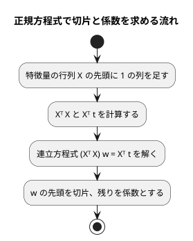

# 第 7 章: 線形回帰による数値予測

## 7.1 はじめに

第 1〜3 章では「きのこ派かたけのこ派か」「アヤメのどの品種か」という、グループを当てる **分類** を扱いました。この章からは、数値そのものを当てる **回帰** に進みます。題材は、映画の SNS での反響や主演俳優の露出度から、興行収入を予測する問題です。

この章では、最も基本的な回帰モデルである **線形回帰** を自作します。F# の標準ライブラリには行列の型がありません。F# 版では、行列を **配列の配列**（`float[][]`）で表し、積・転置・連立方程式を解く関数を TDD で書いたうえで、正規方程式で切片と係数を求めます。

次に、F# 向けの数値計算ライブラリ [FSharp.Stats](https://fslab.org/FSharp.Stats/) の線形回帰に置き換えて、係数と決定係数を突き合わせます。

[Python 版の第 7 章](../python/07-linear-regression.md)・[Kotlin 版の第 7 章](../kotlin/07-linear-regression.md)・[TypeScript 版の第 7 章](../typescript/07-linear-regression.md) と同じ TODO リストで進めます。F# 版では、次の 3 点に注目してください。

- 欠損値を `float option` で表すと、`option` と数値の比較がコンパイルエラーになり、欠損値の扱いを決めるまで先に進めない
- 行列を型の別名 `type Matrix = float[][]` で表し、`Array.transpose`・`Array.map2` など標準ライブラリの関数を組み合わせる。配列は書き換えられるので、関数の外に影響しない範囲でだけ書き換える
- FSharp.Stats の結果を、自作と同じ `LinearModel` のレコードに変換するアダプターを通して突き合わせる

## 7.2 線形回帰とは

### 特徴量の重み付きの和で予測する

線形回帰は、予測値を「切片」と「特徴量ごとの係数 × 特徴量」の和で表すモデルです。この章のデータに当てはめると次の式になります。

```text
予測値 = 切片 + 係数1 × SNS1 + 係数2 × SNS2 + 係数3 × actor + 係数4 × original
```

学習とは、訓練データに対して予測値と実測値のずれが最も小さくなるように、切片と係数を決めることです。ずれの大きさには「誤差の 2 乗の合計」を使います。これを最小にする方法を **最小二乗法** と呼びます。

### 正規方程式

最小二乗法の解は、行列を使うと 1 つの式で求められます。特徴量を行列 `X`、実測値をベクトル `t`、切片と係数をまとめたベクトルを `w` とすると、誤差の 2 乗の合計を最小にする `w` は次の **正規方程式** を満たします。

```text
(Xᵀ X) w = Xᵀ t
```

`X` の先頭には、すべての値が 1 の列を足しておきます。この列にかかる係数が切片になります。



この流れに必要な行列の操作は、**積**・**転置**・**連立方程式を解く** の 3 つです。逆行列を作らずに連立方程式として解くのは、他の言語の版と同じく、そのほうが数値計算の誤差が小さくなるためです。

## 7.3 題材とデータ

この章で使うのは `cinema.csv` です。100 本の映画について、次の 6 列が記録されています。

| 列 | 内容 | 値の範囲 | 欠損値 | F# での型 |
|----|------|---------|-------|----------|
| cinema_id | 映画の ID | 1000〜1989 | なし | `int` |
| SNS1 | SNS での反響の数（1 つ目の指標） | 0〜1000 | 1 件 | `float option` |
| SNS2 | SNS での反響の数（2 つ目の指標） | 0〜1500 | なし | `float option` |
| actor | 主演俳優のメディア露出の指標 | 約 5703〜約 12665 | 1 件 | `float option` |
| original | 原作の有無 | 0 または 1 | なし | `float option` |
| sales | 興行収入 | 7869〜11405 | なし | `float` |

「SNS1」「SNS2」「actor」「original」が特徴量、「sales」が正解ラベル（予測したい数値）です。`cinema_id` は映画を区別するための番号なので、特徴量には使いません。

特徴量の 4 列は、欠損値の有無にかかわらず、すべて `float option` として読みます。第 2 章の `countMissing`・`columnMeans`・`fillMissing` が `Map<string, float option>` を受け取るので、同じ形にそろえておけば再利用できます。SNS1 は整数の列ですが、`float` として読むので、Kotlin 版で起きた「整数の列に平均値（小数）が入らない」問題は起きません。

このデータには、SNS2 の値が大きいのに興行収入が低い、傾向から外れた映画が 1 本含まれています。このような **外れ値** は、最小二乗法の結果を大きく引っ張ります。誤差を 2 乗して足し合わせるので、大きく外れた 1 点の影響が大きくなるためです。

## 7.4 TODO リストの作成

**TODO リスト**:

- [ ] cinema.csv を読み込む
- [ ] 外れ値を取り除く
  - [ ] SNS2 が 1000 を超え、興行収入が 8500 未満の行を取り除く
  - [ ] 条件の片方だけを満たす行は残す
- [ ] 行列の関数を作る
  - [ ] 行列の積を求める
  - [ ] 転置行列を求める
  - [ ] 連立方程式を解く
- [ ] 正規方程式で線形回帰を学習する
  - [ ] 直線上の点から切片と係数を求める
  - [ ] 複数の特徴量から切片と係数を求める
- [ ] 学習したモデルで予測する
- [ ] 評価指標を計算する（MAE・RMSE・R²）
- [ ] FSharp.Stats と結果が一致することを確かめる
- [ ] 外れ値の除去・分割・補完をまとめる
- [ ] 実データで学習・評価して表示する

外れ値の条件「SNS2 が 1000 を超え、興行収入が 8500 未満」は、書籍『スッキリわかる Python による機械学習入門』の同じデータでの分析手順に合わせたものです。散布図で外れ値を確かめる手順は、7.13 節の Notebook で扱います。

## 7.5 データを読み込み外れ値を取り除く

### 読み込み

テストでは、架空の値を書いた CSV を一時ディレクトリに作ります。外れ値のテストもあわせて書き、まとめて Red を確認します。

```fsharp
// tests/MachineLearning.Tests/Chapter07/CinemaTest.fs
module MachineLearning.Tests.Chapter07.CinemaTest

open System
open System.IO
open Xunit
open MachineLearning.Chapter07.Cinema

/// ヘッダーと rows を書いた一時ファイルのパスを返す
let writeCsv (rows: string) : string =
    let csvFile =
        Path.Combine(Directory.CreateTempSubdirectory("cinema-").FullName, "cinema.csv")

    File.WriteAllText(csvFile, "cinema_id,SNS1,SNS2,actor,original,sales\n" + rows)
    csvFile

[<Fact>]
let ``CSV を読み込み、空欄を None にする`` () =
    let csvFile = writeCsv "1,,500,9000.5,1,9500\n"

    let rows = loadCinema csvFile

    Assert.Equal<CinemaRow list>(
        [
            {
                CinemaId = 1
                Features = Map.ofList [ "SNS1", None; "SNS2", Some 500.0; "actor", Some 9000.5; "original", Some 1.0 ]
                Sales = 9500.0
            }
        ],
        rows
    )

/// SNS2 と興行収入だけを持つ映画
let movie (sns2: float) (sales: float) : CinemaRow =
    {
        CinemaId = 0
        Features = Map.ofList [ "SNS2", Some sns2 ]
        Sales = sales
    }

[<Fact>]
let ``SNS2 が 1000 を超え、興行収入が 8500 未満の行を取り除く`` () =
    let rows = [ movie 1200.0 8000.0; movie 600.0 9500.0 ]

    Assert.Equal<CinemaRow list>([ movie 600.0 9500.0 ], removeOutliers rows)
```

`.fsproj` の `Compile` に章の順でテストファイルを加えてから実行します。

```text
error FS0039: 名前空間 'Chapter07' が定義されていません。
error FS0039: 値またはコンストラクター 'loadCinema' が定義されていません。
error FS0039: 型 'CinemaRow' が定義されていません。
error FS0039: レコード ラベル 'CinemaId' が定義されていません。
error FS0039: レコード ラベル 'Features' が定義されていません。
error FS0039: レコード ラベル 'Sales' が定義されていません。
```

### 型プロバイダで読み込む

第 2 章と同じく、FSharp.Data の `CsvProvider` で読み込みます。型の元にするサンプルは、学習データの行ではなく架空の値で書きます。

```fsharp
// src/MachineLearning/Chapter07/Cinema.fs
module MachineLearning.Chapter07.Cinema

open FSharp.Data
open MachineLearning.Chapter02.IrisPreprocessing

/// 型プロバイダが列の名前と型を知るためのサンプル。学習データの行ではなく、同じ列を持つ架空の値で書く。
[<Literal>]
let CinemaSample = "cinema_id,SNS1,SNS2,actor,original,sales\n1,,0.2,,0,0.5"

/// 特徴量の列は欠損値がありうるので float option、映画の ID は int、興行収入は float として読む
type CinemaCsv = CsvProvider<CinemaSample, Schema="int,float option,float option,float option,float option,float">

/// 映画の ID、特徴量（列名から値への Map）、興行収入
type CinemaRow =
    {
        CinemaId: int
        Features: Map<string, float option>
        Sales: float
    }

let loadCinema (csvFile: string) : CinemaRow list =
    CinemaCsv.Load(csvFile).Rows
    |> Seq.map (fun row ->
        {
            CinemaId = row.Cinema_id
            Features =
                Map.ofList
                    [
                        "SNS1", row.SNS1
                        "SNS2", row.SNS2
                        "actor", row.Actor
                        "original", row.Original
                    ]
            Sales = row.Sales
        })
    |> Seq.toList
```

- `Schema` で列ごとの型を指定します。第 2 章で確かめたとおり、指定しないと小数の列は `decimal`、空欄のある列は `string` と推論されます
- 型プロバイダは、列名 `cinema_id` を `Cinema_id`、`actor` を `Actor` のように、先頭を大文字にしたプロパティにします。`SNS1` のように先頭が大文字の列名はそのままです
- 特徴量は第 2 章の iris と同じく、列名から値への `Map` にします。第 2 章の関数がそのまま使えます

### Green: まず片方の条件だけで取り除く

外れ値の除去は、まず最初のテストが通る最小の実装として、SNS2 の条件だけで絞り込みます。最初は他の言語の版と同じ気持ちで、次のように書きました。

```fsharp
let removeOutliers (rows: CinemaRow list) : CinemaRow list =
    rows |> List.filter (fun row -> row.Features["SNS2"] <= 1000.0)
```

```text
error FS0001: この式に必要な型は    'float option'    ですが、ここでは次の型が指定されています    'float'
```

`row.Features["SNS2"]` の型は `float option` です。F# は `option` と数値を比べることを許しません。「値が無いときはどうするのか」を決めるまで、比較を書けないのです。TypeScript 版では `null` との比較を型チェックが止めましたが、F# では値が無いことが最初から型に表れています。

SNS2 が欠損している映画は、外れ値かどうか判断できないので残すことにします。

```fsharp
let removeOutliers (rows: CinemaRow list) : CinemaRow list =
    rows
    |> List.filter (fun row -> row.Features["SNS2"] |> Option.forall (fun sns2 -> sns2 <= 1000.0))
```

- `Option.forall` は、`Some` なら中の値で条件を調べ、`None` なら `true` を返します。「値があれば 1000 以下、無ければ残す」と読めます

```text
テストの実行の概要: 成功!
```

### 三角測量: 条件の片方だけを満たす行は残す

SNS2 が大きくても、興行収入も高ければ傾向どおりのデータです。2 つ目の例でこれを確かめます。

```fsharp
[<Fact>]
let ``条件の片方だけを満たす行は残す`` () =
    let rows = [ movie 1200.0 9800.0; movie 600.0 8000.0 ]

    Assert.Equal<CinemaRow list>(rows, removeOutliers rows)
```

```text
失敗 MachineLearning.Tests.Chapter07.CinemaTest.条件の片方だけを満たす行は残す (98ms)
  Assert.Equal() Failure: Collections differ
  Expected: [{ CinemaId = 0
    Features = map [("SNS2", Some 1200.0)]
    Sales = 9800.0 }, { CinemaId = 0
    Features = map [("SNS2", Some 600.0)]
    Sales = 8000.0 }]
  Actual:   [{ CinemaId = 0
    Features = map [("SNS2", Some 600.0)]
    Sales = 8000.0 }]
```

レコードは、比べるときも表示するときも中身の値で扱われるので、どの行が消えたかがそのまま読めます。

外れ値の判定に名前を付け、条件の値を名前付きの定数にします。

```fsharp
/// SNS2 がこの値を超え、かつ興行収入が OutlierSales 未満の映画を外れ値とする
[<Literal>]
let OutlierSns2 = 1000.0

[<Literal>]
let OutlierSales = 8500.0

/// SNS2 が欠損している映画は、外れ値かどうか判断できないので外れ値としない
let private isOutlier (row: CinemaRow) : bool =
    row.Features["SNS2"] |> Option.exists (fun sns2 -> sns2 > OutlierSns2)
    && row.Sales < OutlierSales

let removeOutliers (rows: CinemaRow list) : CinemaRow list = rows |> List.filter (isOutlier >> not)
```

- `Option.exists` は `Option.forall` の反対で、`None` なら `false` を返します。欠損している映画は外れ値ではない、という判断がそのまま書けます
- `isOutlier >> not` は **関数合成** です。`isOutlier` の結果を `not` に渡す新しい関数を作ります。`fun row -> not (isOutlier row)` と同じ意味です
- `private` なので、このモジュールの外からは見えません

```text
テストの実行の概要: 成功!
```

## 7.6 行列の関数を作る

### 行列の積: 仮実装

行列は、行の配列の配列 `float[][]` で表し、**型の別名**（type abbreviation）で `Matrix` という名前を付けます。別名なので、`float[][]` を受け取る関数にもそのまま渡せます。

```fsharp
// tests/MachineLearning.Tests/Chapter07/MatrixTest.fs
module MachineLearning.Tests.Chapter07.MatrixTest

open System
open Xunit
open MachineLearning.Chapter07.Matrix

[<Fact>]
let ``行列の積を求める`` () =
    let a = [| [| 1.0; 2.0 |]; [| 3.0; 4.0 |] |]
    let b = [| [| 5.0; 6.0 |]; [| 7.0; 8.0 |] |]

    Assert.Equal<Matrix>([| [| 19.0; 22.0 |]; [| 43.0; 50.0 |] |], multiply a b)
```

```text
error FS0039: 名前空間 'Matrix' が定義されていません。
error FS0039: 型 'Matrix' が定義されていません。 次のいずれかの可能性はありませんか:   MatrixTheoryData
```

`MatrixTheoryData` は xUnit v3 の型で、名前が似ているので候補に挙がっています。

仮実装では期待値をそのまま返します。

```fsharp
// src/MachineLearning/Chapter07/Matrix.fs
module MachineLearning.Chapter07.Matrix

/// 行列。行の配列の配列で表す（型の別名なので、float[][] とそのまま入れ替えられる）
type Matrix = float[][]

let multiply (a: Matrix) (b: Matrix) : Matrix = [| [| 19.0; 22.0 |]; [| 43.0; 50.0 |] |]
```

xUnit の `Assert.Equal` は、配列の中の配列まで要素ごとに比べます。F# の `=` も配列を中身で比べるので、行列同士をそのまま比べられます。

### 三角測量: 行数と列数が違う行列

2 行 3 列の行列と 3 行 1 列の行列の積は、2 行 1 列になります。

```fsharp
[<Fact>]
let ``行数と列数が違う行列の積を求める`` () =
    let a = [| [| 1.0; 2.0; 3.0 |]; [| 4.0; 5.0; 6.0 |] |]
    let b = [| [| 1.0 |]; [| 0.0 |]; [| 2.0 |] |]

    Assert.Equal<Matrix>([| [| 7.0 |]; [| 16.0 |] |], multiply a b)
```

```text
失敗 MachineLearning.Tests.Chapter07.MatrixTest.行数と列数が違う行列の積を求める (46ms)
  Assert.Equal() Failure: Collections differ
             ↓ (pos 0)
  Expected: [[7], [16]]
  Actual:   [[19, 22], [43, 50]]
             ↑ (pos 0)
```

積の i 行 j 列は、「左の行列の i 行目」と「右の行列の j 列目」の **内積**（対応する要素を掛けて足したもの）です。右の行列の列は、標準ライブラリの `Array.transpose` で行と列を入れ替えれば取り出せます。

```fsharp
/// 2 つのベクトルの対応する要素を掛けて足す（内積）
let dot (u: float[]) (v: float[]) : float = Array.map2 (*) u v |> Array.sum

let multiply (a: Matrix) (b: Matrix) : Matrix =
    let columns = Array.transpose b
    a |> Array.map (fun row -> columns |> Array.map (dot row))
```

- `Array.map2` は、2 つの配列の同じ位置の要素を組にして関数を適用します
- `(*)` は掛け算の演算子を関数として渡す書き方です。`(* ... *)` はコメントの記号ですが、F# は `(*)` だけは特別に演算子として扱います
- `dot row` は、`dot` に 1 つ目の引数だけを渡した **部分適用** です。「`row` との内積を求める関数」になり、それを各列に `Array.map` します

```text
テストの実行の概要: 成功!
```

### 積を求められない場合と転置

左の列数と右の行数が違う行列は掛けられません。あわせて、行と列を入れ替える転置のテストも書きます。

```fsharp
[<Fact>]
let ``左の列数と右の行数が違えば積を求められない`` () =
    let a = [| [| 1.0; 2.0 |] |]

    let error = Assert.Throws<ArgumentException>(fun () -> multiply a a |> ignore)

    Assert.Equal("左の行列の列数 2 と右の行列の行数 1 が違います", error.Message)

[<Fact>]
let ``行と列を入れ替える`` () =
    let a = [| [| 1.0; 2.0; 3.0 |]; [| 4.0; 5.0; 6.0 |] |]

    Assert.Equal<Matrix>([| [| 1.0; 4.0 |]; [| 2.0; 5.0 |]; [| 3.0; 6.0 |] |], transpose a)
```

```text
error FS0039: 値またはコンストラクター 'transpose' が定義されていません。 次のいずれかの可能性はありませんか:   Transactions
```

転置は `Array.transpose` そのものなので、名前を付けるだけです。`multiply` も `transpose` を使う形にします。

```fsharp
/// 行と列を入れ替える
let transpose (a: Matrix) : Matrix = Array.transpose a
```

すると、積を求められない場合のテストだけが、メッセージの違いで失敗しました。

```text
失敗 MachineLearning.Tests.Chapter07.MatrixTest.左の列数と右の行数が違えば積を求められない (12ms)
  Assert.Equal() Failure: Strings differ
             ↓ (pos 0)
  Expected: "左の行列の列数 2 と右の行列の行数 1 が違います"
  Actual:   "配列の長さが異なります。\narray1.Length = 2, array2.Length = 1 "···
```

例外そのものは、まだ何も書いていないのに投げられています。`Array.map2` が、2 つの配列の長さが違うと `ArgumentException` を投げるからです。Kotlin の `zip` は長さが違うと短いほうに合わせて黙って切り詰めるので、Kotlin 版では自分で確かめる必要がありました。F# の `map2` は黙りません。

ただ、「配列の長さが異なります」では、行列のどこが合わないのかが分かりません。行列の言葉でメッセージを出します。

```fsharp
let multiply (a: Matrix) (b: Matrix) : Matrix =
    if a[0].Length <> b.Length then
        raise (ArgumentException $"左の行列の列数 {a[0].Length} と右の行列の行数 {b.Length} が違います")

    let columns = transpose b
    a |> Array.map (fun row -> columns |> Array.map (dot row))
```

- `raise` は例外を投げる関数です。`if` に `else` が無いときは、`then` の側が `unit` を返す必要があります。`raise` はどんな型にもなれるので、そのまま書けます
- `$"..."` は **補間文字列** で、`{...}` の中に式を書けます

```text
テストの実行の概要: 成功!
```

### 連立方程式を解く: 仮実装と三角測量

`2x + y = 3`、`x + 3y = 5` の解は `x = 0.8`、`y = 1.4` です。計算誤差を許して比べるため、要素ごとに小数第 9 位まで比べるテスト用の関数を用意します。

```fsharp
/// 要素の数が同じで、要素ごとに小数第 9 位まで一致することを確かめる
let assertValues (expected: float seq) (actual: float seq) =
    Assert.Equal(Seq.length expected, Seq.length actual)
    Seq.iter2 (fun (e: float) (a: float) -> Assert.Equal(e, a, 9)) expected actual

[<Fact>]
let ``連立方程式の解を求める`` () =
    let a = [| [| 2.0; 1.0 |]; [| 1.0; 3.0 |] |]

    assertValues [ 0.8; 1.4 ] (solve a [| 3.0; 5.0 |])
```

- 引数を `float seq` にしたので、リスト・配列・`Map` の値のどれでも渡せます。`seq` は、F# のリストも配列も満たすインターフェース（`IEnumerable`）の別名です
- 右辺と解は、1 列の行列ではなく `float[]` のベクトルにしました。F# ではベクトルと行列の型を分けても、関数の組み合わせで困りません

```text
error FS0039: 値またはコンストラクター 'solve' が定義されていません。 次のいずれかの可能性はありませんか:   Some
```

仮実装で Green にします。

```fsharp
/// 連立方程式 a x = b の解 x を求める
let solve (a: Matrix) (b: float[]) : float[] = [| 0.8; 1.4 |]
```

三角測量として、3 元の連立方程式を加えます。解 `(1, -2, 3)` と各行との内積で右辺を作るので、期待値を手計算する必要がありません。

```fsharp
[<Fact>]
let ``3 元の連立方程式の解を求める`` () =
    let a = [| [| 4.0; 1.0; 2.0 |]; [| 1.0; 3.0; 0.0 |]; [| 2.0; 0.0; 5.0 |] |]

    let x = [| 1.0; -2.0; 3.0 |]
    let b = a |> Array.map (dot x)

    assertValues x (solve a b)
```

```text
失敗 MachineLearning.Tests.Chapter07.MatrixTest.3 元の連立方程式の解を求める (2ms)
  Assert.Equal() Failure: Values differ
  Expected: 3
  Actual:   2
```

`Expected: 3` と `Actual: 2` は、解の要素の数（3 つのはずが 2 つ）が違うという `assertValues` の 1 行目の失敗です。

### ガウスの消去法

連立方程式は **ガウスの消去法** で解きます。右辺 `b` を右に並べた行列（拡大係数行列）を作り、上から順に「対角成分より下を 0 にする」操作（前進消去）を行ったあと、下の行から解を 1 つずつ決めていきます（後退代入）。

この手順は、配列の要素を書き換えながら進めるのが素直です。F# の配列は書き換えられる（ミュータブルな）データ構造なので、`<-` で要素を書き換えられます。ただし書き換えるのは、関数の中で新しく作った配列だけにします。

```fsharp
let solve (a: Matrix) (b: float[]) : float[] =
    let n = a.Length
    // 右辺 b を右に並べた拡大係数行列。引数の a と b を書き換えないように、新しい配列を作る
    let augmented = Array.init n (fun i -> Array.append a[i] [| b[i] |])

    // 前進消去: 対角成分より下を 0 にする
    for pivot in 0 .. n - 1 do
        for i in pivot + 1 .. n - 1 do
            let factor = augmented[i][pivot] / augmented[pivot][pivot]

            for j in pivot..n do
                augmented[i][j] <- augmented[i][j] - factor * augmented[pivot][j]

    // 後退代入: 下の行から解を 1 つずつ決める
    let x = Array.create n 0.0

    for i in n - 1 .. -1 .. 0 do
        let known = Seq.sumBy (fun j -> augmented[i][j] * x[j]) { i + 1 .. n - 1 }
        x[i] <- (augmented[i][n] - known) / augmented[i][i]

    x
```

- `Array.append a[i] [| b[i] |]` は、行の末尾に右辺の値を足した **新しい配列** を返します。`augmented` の行は `a` の行とは別の配列なので、書き換えても引数の `a` は変わりません
- `for i in n - 1 .. -1 .. 0 do` は、`n - 1` から `0` まで 1 ずつ減らしながら繰り返します。真ん中の `-1` が増分です

ところが、コンパイルエラーになりました。

```text
error FS3873: This construct is deprecated. Sequence expressions should be of the form 'seq { ... }'
```

`{ i + 1 .. n - 1 }` は、古い F# で範囲の列を表す書き方でした。F# 10 では非推奨の警告になり、警告をエラーにする設定なのでコンパイルエラーになります。範囲はリスト `[ i + 1 .. n - 1 ]` で書きます。

```fsharp
        let known = List.sumBy (fun j -> augmented[i][j] * x[j]) [ i + 1 .. n - 1 ]
```

```text
テストの実行の概要: 成功!
```

### 対角成分が 0 の場合

この実装には弱点があります。`augmented[pivot][pivot]` で割っているので、対角成分が 0 になると解けません。`y = 2`、`x = 3` を表す連立方程式で確かめます。引数を書き換えないことも、あわせてテストに残します。

```fsharp
[<Fact>]
let ``対角成分が 0 でも行を入れ替えて解を求める`` () =
    let a = [| [| 0.0; 1.0 |]; [| 1.0; 0.0 |] |]

    assertValues [ 3.0; 2.0 ] (solve a [| 2.0; 3.0 |])

[<Fact>]
let ``引数の行列とベクトルを書き換えない`` () =
    let a = [| [| 0.0; 1.0 |]; [| 1.0; 0.0 |] |]
    let b = [| 2.0; 3.0 |]

    solve a b |> ignore

    Assert.Equal<Matrix>([| [| 0.0; 1.0 |]; [| 1.0; 0.0 |] |], a)
    Assert.Equal<float[]>([| 2.0; 3.0 |], b)
```

```text
失敗 MachineLearning.Tests.Chapter07.MatrixTest.対角成分が 0 でも行を入れ替えて解を求める (6ms)
  Assert.Equal() Failure: Values are not within 9 decimal places
  Expected: 3 (rounded from 3)
  Actual:   NaN (rounded from NaN)
```

`0.0 / 0.0` は例外にならず、`NaN`（非数）になります。浮動小数点数の計算は失敗しても黙って `NaN` や `Infinity` を返すので、テストで値を確かめることが大切です。引数を書き換えないテストは、この時点で通っています。

消去の前に、その列で絶対値が最も大きい行を対角の位置に入れ替えます（**部分ピボット選択**）。0 で割ることを避けられるうえ、小さな値で割ることによる誤差の拡大も抑えられます。

```fsharp
    for pivot in 0 .. n - 1 do
        // 部分ピボット選択: この列で絶対値が最も大きい行を対角の位置に入れ替える
        let largest = [ pivot .. n - 1 ] |> List.maxBy (fun i -> abs augmented[i][pivot])
        let row = augmented[pivot]
        augmented[pivot] <- augmented[largest]
        augmented[largest] <- row
```

```text
error FS3369: 構文 'expr1[expr2]' は引数として使用されている場合、あいまいです。https://aka.ms/fsharp-index-notation を参照してください。インデックス作成またはスライスを行う場合は、'expr1.[expr2]' を引数の位置に使用する必要があります。複数のカリー化された引数を持つ関数を呼び出す場合は、'expr1 [expr2]' のように間にスペースを追加します。
error FS0001: 型 'float array' は演算子 'abs' をサポートしていません
```

`abs augmented[i][pivot]` は、「`augmented[i][pivot]` の絶対値」とも、「`abs` に `augmented` と `[i]` と `[pivot]` の 3 つの引数を渡す」とも読めます。F# の関数呼び出しは引数を空白で並べるので、関数の引数の位置でインデックスを書くとあいまいになるのです。コンパイラは後者と解釈し、`abs` に配列を渡そうとして 2 つ目のエラーも出しました。かっこで囲んで意図を示します。

```fsharp
        let largest = [ pivot .. n - 1 ] |> List.maxBy (fun i -> abs (augmented[i][pivot]))
```

```text
テストの実行の概要: 成功!
```

行の入れ替えは、`augmented` の中の「行の配列への参照」を入れ替えるだけです。行の中身はコピーしません。

## 7.7 正規方程式で線形回帰を学習する

### 仮実装

学習結果は、切片と、列名ごとの係数を持つレコードで表します。最初のテストは、`t = 2x + 1` の直線上にある 4 点です。

```fsharp
// tests/MachineLearning.Tests/Chapter07/LinearRegressionTest.fs
module MachineLearning.Tests.Chapter07.LinearRegressionTest

open Xunit
open MachineLearning.Chapter07.LinearRegression
open MachineLearning.Tests.Chapter07.MatrixTest

/// 切片と係数が小数第 9 位まで一致し、係数の列名が同じことを確かめる
let assertModel (intercept: float) (coefficients: (string * float) list) (actual: LinearModel) =
    Assert.Equal(intercept, actual.Intercept, 9)
    Assert.Equal<string list>(List.map fst coefficients, actual.Coefficients |> Map.keys |> Seq.toList)
    assertValues (List.map snd coefficients) actual.Coefficients.Values

[<Fact>]
let ``直線上の点から切片と係数を求める`` () =
    let x = [ 0.0; 1.0; 2.0; 3.0 ] |> List.map (fun value -> Map.ofList [ "x", value ])
    let t = [ 1.0; 3.0; 5.0; 7.0 ]

    let model = fitLinearRegression x t

    assertModel 1.0 [ "x", 2.0 ] model
```

- `open MachineLearning.Tests.Chapter07.MatrixTest` で、行列のテストで作った `assertValues` を使います。F# のファイルはコンパイルの順に意味があるので、テストの `.fsproj` でも `MatrixTest.fs` をこのファイルより前に置きます

```text
error FS0039: 名前空間 'LinearRegression' が定義されていません。
error FS0039: 型 'LinearModel' が定義されていません。
error FS0072: このプログラムの場所の前方にある情報に基づく不確定の型のオブジェクトに対する参照です。場合によっては、オブジェクトの型を制約する型の注釈がこのプログラムの場所の前に必要です。この操作で参照が解決される可能性があります。
error FS0039: 値またはコンストラクター 'fitLinearRegression' が定義されていません。
```

FS0072 は、第 3 章でも見た「型が分からないのにプロパティを読もうとした」エラーです。`LinearModel` が無いので、`actual.Intercept` の `actual` の型が決まりません。

```fsharp
// src/MachineLearning/Chapter07/LinearRegression.fs
module MachineLearning.Chapter07.LinearRegression

/// 線形回帰の学習結果。切片と、特徴量の列名から係数への Map
type LinearModel =
    {
        Intercept: float
        Coefficients: Map<string, float>
    }

let fitLinearRegression (x: Map<string, float> list) (t: float list) : LinearModel =
    {
        Intercept = 1.0
        Coefficients = Map.ofList [ "x", 2.0 ]
    }
```

係数を `Map<string, float>` にしたので、係数と列名の対応が型に表れます。F# の `Map` はキーの順（文字列は序数の順）に並ぶので、この章の特徴量は `SNS1`・`SNS2`・`actor`・`original` の順になります。大文字は小文字より前に並ぶためです。

### 三角測量: 複数の特徴量

2 つ目の例は、特徴量が 2 つあり、係数に負の値を含むデータにします。`t = 3a - 2b + 5` を満たす 5 点から、切片 5、係数 3 と -2 が求まるはずです。

```fsharp
[<Fact>]
let ``複数の特徴量から切片と係数を求める`` () =
    let a = [ 0.0; 1.0; 0.0; 2.0; 1.0 ]
    let b = [ 0.0; 0.0; 1.0; 1.0; 3.0 ]
    let x = List.map2 (fun ai bi -> Map.ofList [ "a", ai; "b", bi ]) a b
    let t = List.map2 (fun ai bi -> 3.0 * ai - 2.0 * bi + 5.0) a b

    let model = fitLinearRegression x t

    assertModel 5.0 [ "a", 3.0; "b", -2.0 ] model
```

```text
失敗 MachineLearning.Tests.Chapter07.LinearRegressionTest.複数の特徴量から切片と係数を求める (29ms)
  Assert.Equal() Failure: Values are not within 9 decimal places
  Expected: 5 (rounded from 5)
  Actual:   1 (rounded from 1)
```

行ごとの `Map` を行列に変換する関数を用意し、正規方程式を実装します。

```fsharp
open MachineLearning.Chapter07.Matrix

/// 行ごとの Map から、features の列の順に値を並べた行列を作る
let toMatrix (features: string list) (rows: Map<string, float> list) : Matrix =
    rows
    |> List.map (fun row -> features |> List.map (fun feature -> row[feature]) |> List.toArray)
    |> List.toArray

/// 正規方程式 (Xᵀ X) w = Xᵀ t を解いて、切片と係数を求める
let fitLinearRegression (x: Map<string, float> list) (t: float list) : LinearModel =
    let features = x.Head |> Map.keys |> Seq.toList
    let design = toMatrix features x |> Array.map (Array.append [| 1.0 |])
    let designT = transpose design

    let weights =
        solve (multiply designT design) (designT |> Array.map (dot (List.toArray t)))

    {
        Intercept = weights[0]
        Coefficients = List.zip features (List.ofArray weights[1..]) |> Map.ofList
    }
```

| コード | 意味 |
|-------|------|
| `Array.map (Array.append [| 1.0 |])` | 各行の先頭に 1 を足す（計画行列） |
| `multiply designT design` | `Xᵀ X` |
| `designT \|> Array.map (dot (List.toArray t))` | `Xᵀ t`。`Xᵀ` の各行と `t` の内積 |
| `solve ...` | `(Xᵀ X) w = Xᵀ t` を解く |
| `weights[0]` / `weights[1..]` | 先頭が切片、残りが特徴量の列の順の係数。`[1..]` は 1 番目から最後までの **スライス** |
| `List.zip features ... \|> Map.ofList` | 列名と係数の組を `Map` にする |

`Array.append [| 1.0 |]` も部分適用です。「先頭に `[| 1.0 |]` を置いて、渡された配列をつなげる関数」になります。

```text
テストの実行の概要: 成功!
```

## 7.8 学習したモデルで予測する

予測は、モデルと特徴量を受け取る関数にします。第 15 章の API からも使うので、何をする関数かが名前だけで分かるように `predictLinearRegression` と名付けました。

```fsharp
let model =
    {
        Intercept = 1.0
        Coefficients = Map.ofList [ "a", 2.0; "b", -1.0 ]
    }

[<Fact>]
let ``切片と係数から予測値を計算する`` () =
    let x = [ Map.ofList [ "a", 1.0; "b", 4.0 ]; Map.ofList [ "a", 3.0; "b", 0.5 ] ]

    assertValues [ -1.0; 6.5 ] (predictLinearRegression model x)

[<Fact>]
let ``係数の無い列は予測に使わない`` () =
    let x = [ Map.ofList [ "a", 1.0; "b", 4.0; "cinema_id", 1375.0 ] ]

    assertValues [ -1.0 ] (predictLinearRegression model x)
```

Kotlin 版には「列の並び順が違っても列名で係数を対応させる」テストがありました。F# の `Map` には並び順が無いので、そのテストは要りません。代わりに、学習に使っていない列が混ざっていても無視することを確かめます。

```text
error FS0039: 値またはコンストラクター 'predictLinearRegression' が定義されていません。 次のいずれかの可能性はありませんか:   fitLinearRegression
```

計算式ははっきりしているので、明白な実装で進めます。

```fsharp
/// 係数を持つ列だけを使い、切片 + 係数 × 特徴量の和を行ごとに求める
let predictLinearRegression (model: LinearModel) (x: Map<string, float> list) : float list =
    let features = model.Coefficients |> Map.keys |> Seq.toList
    let weights = model.Coefficients |> Map.values |> Seq.toArray

    toMatrix features x
    |> Array.map (fun row -> model.Intercept + dot row weights)
    |> Array.toList
```

- `Map.keys` と `Map.values` は同じキーの順に並ぶので、列と係数の対応がずれません
- モデルを最初の引数にしたので、`predictLinearRegression model` と部分適用すれば「このモデルで予測する関数」になります

```text
テストの実行の概要: 成功!
```

## 7.9 評価指標を計算する

分類では「正解率」で評価しました。回帰の予測値はぴったり一致することがほとんどないため、「どれくらい外れたか」を数値にします。

| 指標 | 計算 | 読み方 |
|------|------|-------|
| MAE（平均絶対誤差） | 誤差の絶対値の平均 | 平均して実測値からどれだけ外れるか。単位は予測する値と同じ |
| RMSE（平均二乗誤差の平方根） | 誤差の 2 乗の平均の平方根 | 大きな誤差をより重く数える。単位は予測する値と同じ |
| R²（決定係数） | 1 - 誤差の 2 乗の合計 / 実測値と平均値の差の 2 乗の合計 | 1 に近いほど良い。「常に平均値を予測する」だけのモデルなら 0 |

### MAE: 仮実装と三角測量

実測値 3, 5, 7 に対して 2, 5, 9 と予測すると、誤差の絶対値は 1, 0, 2 なので MAE は 1 です。

```fsharp
// tests/MachineLearning.Tests/Chapter07/RegressionMetricsTest.fs
module MachineLearning.Tests.Chapter07.RegressionMetricsTest

open System
open Xunit
open MachineLearning.Chapter07.RegressionMetrics

let t = [ 3.0; 5.0; 7.0 ]

[<Fact>]
let ``誤差の絶対値の平均を求める`` () =
    Assert.Equal(1.0, meanAbsoluteError t [ 2.0; 5.0; 9.0 ], 12)
```

```text
error FS0039: 名前空間 'RegressionMetrics' が定義されていません。
error FS0039: 値またはコンストラクター 'meanAbsoluteError' が定義されていません。
```

仮実装で Green にします。

```fsharp
// src/MachineLearning/Chapter07/RegressionMetrics.fs
module MachineLearning.Chapter07.RegressionMetrics

let meanAbsoluteError (t: float list) (y: float list) : float = 1.0
```

三角測量として、誤差が 2, 3, 0（平均 5/3）になる例を追加します。

```fsharp
[<Fact>]
let ``予測が大きく外れるほど値が大きくなる`` () =
    Assert.Equal(5.0 / 3.0, meanAbsoluteError t [ 1.0; 8.0; 7.0 ], 12)
```

```text
失敗 MachineLearning.Tests.Chapter07.RegressionMetricsTest.予測が大きく外れるほど値が大きくなる (12ms)
  Assert.Equal() Failure: Values are not within 12 decimal places
  Expected: 1.666666666667 (rounded from 1.6666666666666667)
  Actual:   1 (rounded from 1)
```

3 つの指標はどれも「実測値 - 予測値」（残差）から計算します。残差を求める関数に名前を付けます。

```fsharp
/// 残差（実測値 - 予測値）。List.map2 は件数が違うと ArgumentException を投げる
let private residuals (t: float list) (y: float list) : float list = List.map2 (-) t y

let meanAbsoluteError (t: float list) (y: float list) : float = residuals t y |> List.averageBy abs
```

- `List.map2 (-) t y` は、`t` と `y` の同じ位置の要素で引き算したリストです。`(-)` は引き算の演算子を関数として渡しています
- `List.averageBy abs` は、各要素に `abs` を適用してから平均します

`List.map2` は、7.6 節の `Array.map2` と同じく、件数が違えば例外を投げます。件数の確認を自分で書かなくても、その振る舞いを仕様としてテストに残しておきます。

```fsharp
[<Fact>]
let ``実測値と予測値の件数が違えば ArgumentException を投げる`` () =
    Assert.Throws<ArgumentException>(fun () -> meanAbsoluteError t [ 1.0 ] |> ignore)
    |> ignore
```

### RMSE と R²: 明白な実装

MAE と同じ形なので、RMSE と R² はテストを書いてから明白な実装で進めます。R² のテストでは、「すべて正解なら 1」と「誤差の 2 乗の合計 5、実測値と平均値の差の 2 乗の合計 8 なら 1 - 5/8」の 2 つを確かめます。

```fsharp
[<Fact>]
let ``誤差の 2 乗の平均の平方根を求める`` () =
    Assert.Equal(sqrt (5.0 / 3.0), rootMeanSquaredError t [ 2.0; 5.0; 9.0 ], 12)

[<Fact>]
let ``予測がすべて正解なら決定係数は 1`` () =
    Assert.Equal(1.0, r2Score t [ 3.0; 5.0; 7.0 ], 12)

[<Fact>]
let ``平均値を予測し続けるモデルより良い分だけ決定係数は 1 に近づく`` () =
    Assert.Equal(1.0 - 5.0 / 8.0, r2Score t [ 2.0; 5.0; 9.0 ], 12)
```

```text
error FS0039: 値またはコンストラクター 'rootMeanSquaredError' が定義されていません。
error FS0039: 値またはコンストラクター 'r2Score' が定義されていません。
```

```fsharp
let rootMeanSquaredError (t: float list) (y: float list) : float =
    residuals t y |> List.averageBy (fun r -> r * r) |> sqrt

/// 決定係数。1 - 誤差の 2 乗の合計 / 実測値と平均値の差の 2 乗の合計
let r2Score (t: float list) (y: float list) : float =
    let residual = residuals t y |> List.sumBy (fun r -> r * r)
    let mean = List.average t
    let total = t |> List.sumBy (fun value -> (value - mean) * (value - mean))
    1.0 - residual / total
```

```text
テストの実行の概要: 成功!
```

R² の分母 `total` は「常に平均値を予測した場合の誤差」です。R² は、モデルがその単純な予測よりどれだけ誤差を減らせたかの割合と読めます。

## 7.10 FSharp.Stats に置き換える

### ML.NET の最小二乗法を使わない理由

.NET の機械学習ライブラリ ML.NET にも、最小二乗法の学習器 `Ols` があります。ただし `Ols` は Microsoft.ML.Mkl.Components が必要で、そのパッケージが依存する Intel MKL のネイティブライブラリは x64 向けだけが配布されています。arm64 の環境では動きません（[ADR 004](../../../adr/004-fsharp-ml-libraries.md)）。そこで F# 版では、F# 向けの数値計算ライブラリ FSharp.Stats の線形回帰を使います。FSharp.Stats は F# だけで書かれていて、特定の CPU に依存しません。

### 学習用テストで API を確かめる

FSharp.Stats の `LinearRegression.fit` に行列を渡すとき、「行が 1 件のデータか、列が 1 件のデータか」と「返す係数の並び」は、名前だけでは分かりません。7.7 節と同じ `t = 3a - 2b + 5` のデータで、学習用テストにして確かめます。

```fsharp
// tests/MachineLearning.Tests/Chapter07/StatsRegressionTest.fs
module MachineLearning.Tests.Chapter07.StatsRegressionTest

open System
open Xunit
open FSharp.Stats
open FSharp.Stats.Fitting
open MachineLearning.Chapter07.LinearRegression
open MachineLearning.Chapter07.RegressionMetrics
open MachineLearning.Chapter07.StatsRegression
open MachineLearning.Tests.Chapter07.MatrixTest

[<Fact>]
let ``学習用テスト: LinearRegression.fit は行を 1 件のデータとする行列を受け取り、切片・係数の順のベクトルを返す`` () =
    let a = [ 0.0; 1.0; 0.0; 2.0; 1.0 ]
    let b = [ 0.0; 0.0; 1.0; 1.0; 3.0 ]
    let xData = matrix (List.map2 (fun ai bi -> [ ai; bi ]) a b)
    let yData = vector (List.map2 (fun ai bi -> 3.0 * ai - 2.0 * bi + 5.0) a b)

    let coefficients = LinearRegression.fit (xData, yData)

    assertValues [ 5.0; 3.0; -2.0 ] coefficients.Coefficients

[<Fact>]
let ``学習用テスト: calculateDeterminationFromValue は実測値・予測値の順に受け取る`` () =
    let t = [ 3.0; 5.0; 7.0 ]
    let y = [ 2.0; 5.0; 9.0 ]

    Assert.Equal(1.0 - 5.0 / 8.0, GoodnessOfFit.calculateDeterminationFromValue t y, 12)
    Assert.NotEqual(1.0 - 5.0 / 8.0, GoodnessOfFit.calculateDeterminationFromValue y t)
```

- `matrix` と `vector` は、リストのリストやリストから FSharp.Stats の `Matrix<float>`・`Vector<float>` を作る関数です
- `LinearRegression.fit (xData, yData)` は、F# の関数ではなく .NET のメソッドとして定義されているので、引数をタプルの形で渡します
- 決定係数を求める `calculateDeterminationFromValue` は、実測値と予測値を入れ替えると値が変わります。ドキュメントには引数の順が書かれていないので、R² の定義どおりになる順をテストで確かめました

この 2 つのテストは、書いた時点で通りました。ライブラリの振る舞いを記録するためのテストです。

### 自作と同じ形で返すアダプター

FSharp.Stats の結果を、自作と同じ `LinearModel` に変換する関数を作ります。まずテストを書きます。乱数で作った特徴量 3 列にノイズを加えたデータ（`t = 4 + 1.5a - 0.5b + 2c + ノイズ`、30 件）で、自作と突き合わせます。

```fsharp
/// t = 4 + 1.5a - 0.5b + 2c にノイズを加えた 30 件
let noisyDataset () : Map<string, float> list * float list =
    let random = Random 0

    let rows =
        List.init 30 (fun _ ->
            Map.ofList
                [
                    "a", random.NextDouble() * 10.0
                    "b", random.NextDouble() * 10.0
                    "c", random.NextDouble() * 10.0
                ])

    let t =
        rows
        |> List.map (fun row ->
            let noise = random.NextDouble() - 0.5
            4.0 + 1.5 * row["a"] - 0.5 * row["b"] + 2.0 * row["c"] + noise)

    rows, t

[<Fact>]
let ``FSharp.Stats の切片と係数は自作の線形回帰と一致する`` () =
    let x, t = noisyDataset ()

    let mine = fitLinearRegression x t
    let library = fitWithFSharpStats x t

    Assert.Equal(mine.Intercept, library.Intercept, 9)
    Assert.Equal<string seq>(mine.Coefficients.Keys, library.Coefficients.Keys)
    assertValues mine.Coefficients.Values library.Coefficients.Values

[<Fact>]
let ``FSharp.Stats の決定係数は自作の決定係数と一致する`` () =
    let x, t = noisyDataset ()
    let y = predictLinearRegression (fitLinearRegression x t) x

    Assert.Equal(r2Score t y, r2WithFSharpStats t y, 12)
```

- `List.init 30 (fun _ -> ...)` は、30 件のリストを作ります。`_` は「引数（添字）を使わない」という意味です
- `rows, t` のように、2 つの値をカンマで並べると **タプル** になります。受け取る側は `let x, t = noisyDataset ()` と分解します
- `System.Random` には正規分布の乱数が無いので、ノイズは -0.5〜0.5 の一様な乱数にしました

```text
error FS0039: 名前空間 'StatsRegression' が定義されていません。
error FS0039: 値またはコンストラクター 'fitWithFSharpStats' が定義されていません。
error FS0039: 値またはコンストラクター 'r2WithFSharpStats' が定義されていません。
```

```fsharp
// src/MachineLearning/Chapter07/StatsRegression.fs
module MachineLearning.Chapter07.StatsRegression

open FSharp.Stats
open FSharp.Stats.Fitting
open MachineLearning.Chapter07.LinearRegression

/// FSharp.Stats の最小二乗法で学習し、自作と同じ LinearModel の形で返す
let fitWithFSharpStats (x: Map<string, float> list) (t: float list) : LinearModel =
    let features = x.Head |> Map.keys |> Seq.toList
    let fitted = LinearRegression.fit (matrix (toMatrix features x), vector t)

    {
        Intercept = fitted.Constant
        Coefficients = List.zip features (List.ofSeq fitted.Coefficients |> List.tail) |> Map.ofList
    }

/// FSharp.Stats の決定係数。実測値・予測値の順に渡す
let r2WithFSharpStats (t: float list) (y: float list) : float =
    GoodnessOfFit.calculateDeterminationFromValue t y
```

- 自作の `toMatrix` が返す `float[][]` を、そのまま FSharp.Stats の `matrix` に渡せます。型の別名にしておいた利点です
- `fitted.Constant` は切片です。係数のベクトルの先頭も切片なので、`List.tail` で先頭を除いてから列名と組にします
- このモジュールでは自作の `Matrix` モジュールを `open` していません。FSharp.Stats にも `Matrix` という名前の型とモジュールがあり、両方を開くとどちらを指すのかが読みにくくなるためです

```text
テストの実行の概要: 成功!
```

自作版と FSharp.Stats の違いをまとめます。

| 観点 | 自作版 | FSharp.Stats |
|------|-------|-------------|
| 学習の呼び出し | `fitLinearRegression x t` が `LinearModel` を返す | `LinearRegression.fit (xData, yData)` が `Coefficients` を返す |
| 入力 | 行ごとの `Map` のリストと `float list` | `Matrix<float>` と `Vector<float>` |
| 係数 | 列名つきの `Map` | 切片・係数の順に並んだベクトル。列名は持たない |
| 評価指標 | 関数ごと（`r2Score t y`） | `GoodnessOfFit` モジュールの関数 |

## 7.11 外れ値の除去・分割・補完をまとめる

### 前処理を 1 つの関数にする

実データに対する前処理を 1 つの関数にまとめます。外れ値の除去は、分割より前にデータ全体に対して行います。今回の条件はデータの取り違えのような「明らかにおかしい行」を除くためのもので、訓練データの統計量から決める値ではないからです。

```fsharp
[<Fact>]
let ``外れ値を除いて分割し、訓練データの平均で欠損値を補完する`` () =
    let csvFile =
        writeCsv (
            "1,100,300,9000.0,0,9200\n"
            + "2,,400,9500.0,1,9800\n"
            + "3,300,500,,1,10100\n"
            + "4,150,1200,8800.0,0,8100\n"
            + "5,250,700,9900.0,1,10300\n"
            + "6,120,650,9100.0,0,9400\n"
        )

    let split = prepareCinema csvFile 0.4 0

    Assert.Equal<string seq>([ "SNS1"; "SNS2"; "actor"; "original" ], split.XTrain.Head.Keys)
    Assert.Equal((3, 2), (split.XTrain.Length, split.XTest.Length))
    Assert.DoesNotContain(8100.0, split.TTrain @ split.TTest)

    Assert.All(
        split.XTrain @ split.XTest,
        (fun row -> Assert.All(row.Values, (fun value -> Assert.False(Double.IsNaN value))))
    )
```

4 行目（SNS2 が 1200、興行収入が 8100）が外れ値です。残りの 5 行を 4:6 に分けると、テストデータは 5 × 0.4 = 2 行になります。`@` はリストをつなげる演算子です。

```text
error FS0039: 値またはコンストラクター 'prepareCinema' が定義されていません。
error FS0072: このプログラムの場所の前方にある情報に基づく不確定の型のオブジェクトに対する参照です。場合によっては、オブジェクトの型を制約する型の注釈がこのプログラムの場所の前に必要です。この操作で参照が解決される可能性があります。
error FS0041: このプログラム ポイントよりも前の型情報に基づいて、メソッド 'All' の固有のオーバーロードを決定することができませんでした。型の注釈が必要な場合があります。既知の型の引数: 'a * (float -> unit)候補: - Assert.All<'T>(collection: 'T seq, action: Action<'T>) : unit - Assert.All<'T>(collection: Collections.Generic.IAsyncEnumerable<'T>, action: Action<'T>) : unit
```

`prepareCinema` が無いので `split` の型が決まらず、その先の `row.Values` や `Assert.All` のオーバーロードの選択まで連鎖してエラーになっています。最初のエラーから読みます。

### 第 2 章の関数を再利用する

分割と補完には、第 2 章の `splitTrainTest`・`columnMeans`・`fillMissing` を使います。第 2 章ではアヤメのために書いた関数ですが、`Map<string, float option>` を受け取るジェネリックな関数にしてあったので、映画のデータにもそのまま使えます。`splitTrainTest` は正解ラベルの型も `'T` なので、正解ラベルが `float` の `TrainTestSplit<Map<string, float>, float>` として受け取れます。

```fsharp
/// 読み込み、外れ値を除き、訓練データとテストデータに分け、訓練データの平均で欠損値を補完する
let prepareCinema (csvFile: string) (testSize: float) (seed: int) : TrainTestSplit<Map<string, float>, float> =
    let rows = loadCinema csvFile |> removeOutliers
    let x = rows |> List.map (fun row -> row.Features)
    let t = rows |> List.map (fun row -> row.Sales)
    let split = splitTrainTest testSize seed x t
    let means = columnMeans split.XTrain

    {
        XTrain = fillMissing means split.XTrain
        XTest = fillMissing means split.XTest
        TTrain = split.TTrain
        TTest = split.TTest
    }
```

- `fillMissing` を通ると、特徴量の型が `Map<string, float option>` から `Map<string, float>` に変わります。「欠損値が残っていない」ことが型に表れるので、`fitLinearRegression` には補完前のデータを渡せません
- 返すレコードの型は、戻り値の型注釈から `TrainTestSplit` だと推論されます

```text
テストの実行の概要: 成功!
```

## 7.12 実データで学習・評価する

### 結果を表示する

訓練データとテストデータを 8:2 に分け（シード 0）、自作の線形回帰で学習して、テストデータで評価します。FSharp.Stats で学習した切片・係数・決定係数も並べて表示します。

```fsharp
// src/MachineLearning/Chapter07/Main.fs
module MachineLearning.Chapter07.Main

open System.IO
open MachineLearning.Dataset
open MachineLearning.Chapter07.Cinema
open MachineLearning.Chapter07.LinearRegression
open MachineLearning.Chapter07.RegressionMetrics
open MachineLearning.Chapter07.StatsRegression

[<Literal>]
let TestSize = 0.2

[<Literal>]
let Seed = 0

let private formatCoefficients (coefficients: Map<string, float>) : string =
    coefficients
    |> Map.toList
    |> List.map (fun (name, value) -> $"{name}={value:F4}")
    |> String.concat ", "

/// cinema.csv で線形回帰を学習し、係数とテストデータの評価、FSharp.Stats との比較を表示する
let run (print: string -> unit) : unit =
    let csvFile = Path.Combine(dataDir (), "cinema.csv")
    let rows = loadCinema csvFile
    let split = prepareCinema csvFile TestSize Seed
    let model = fitLinearRegression split.XTrain split.TTrain
    let y = predictLinearRegression model split.XTest
    let library = fitWithFSharpStats split.XTrain split.TTrain
    let libraryY = predictLinearRegression library split.XTest

    print $"データ件数: {rows.Length}"
    print $"外れ値を除いた件数: {(removeOutliers rows).Length}"
    print $"訓練データ: {split.XTrain.Length} 件, テストデータ: {split.XTest.Length} 件"
    print $"切片: {model.Intercept:F2}"
    print $"係数: {formatCoefficients model.Coefficients}"

    print
        $"テストデータの評価: R2={r2Score split.TTest y:F4}, MAE={meanAbsoluteError split.TTest y:F2}, RMSE={rootMeanSquaredError split.TTest y:F2}"

    print $"FSharp.Stats: 切片={library.Intercept:F2}, 係数: {formatCoefficients library.Coefficients}"
    print $"FSharp.Stats の R2: {r2WithFSharpStats split.TTest libraryY:F4}"
```

- `{value:F4}` は、補間文字列の中で小数第 4 位までに整える書式指定です
- FSharp.Stats の予測にも、自作の `predictLinearRegression` を使っています。アダプターで同じ `LinearModel` にそろえたので、予測の関数を共有できます

`Program.fs` の対応表に `"chapter07", Chapter07.Main.run` を加えて実行します。

```bash
dotnet run --project src/MachineLearning -- chapter07
```

```text
データ件数: 100
外れ値を除いた件数: 99
訓練データ: 79 件, テストデータ: 20 件
切片: 6330.97
係数: SNS1=1.1481, SNS2=0.5122, actor=0.2748, original=242.5101
テストデータの評価: R2=0.7740, MAE=320.18, RMSE=396.73
FSharp.Stats: 切片=6330.97, 係数: SNS1=1.1481, SNS2=0.5122, actor=0.2748, original=242.5101
FSharp.Stats の R2: 0.7740
```

自作と FSharp.Stats で、切片・係数・決定係数が表示の桁まですべて一致しました。

実データのテストでは、外れ値の件数、実データでも FSharp.Stats と R² が一致すること、表示内容を確かめます。

```fsharp
// tests/MachineLearning.Tests/Chapter07/CinemaDataTest.fs
let csvFile = Path.Combine(dataDir (), "cinema.csv")

/// 学習データが無ければテストをスキップする
let requireData () =
    Assert.SkipUnless(File.Exists csvFile, "学習データ cinema.csv が配置されていない（gulp data:setup）")

[<Fact>]
let ``実データから外れ値を 1 件取り除く`` () =
    requireData ()
    let rows = loadCinema csvFile

    Assert.Equal((100, 99), (rows.Length, (removeOutliers rows).Length))

[<Fact>]
let ``実データで自作のモデルと FSharp.Stats の決定係数が一致する`` () =
    requireData ()
    let split = prepareCinema csvFile 0.2 0

    let mine =
        predictLinearRegression (fitLinearRegression split.XTrain split.TTrain) split.XTest

    let library =
        predictLinearRegression (fitWithFSharpStats split.XTrain split.TTrain) split.XTest

    Assert.Equal(r2Score split.TTest mine, r2WithFSharpStats split.TTest library, 9)
```

表示のテストは、第 2・3 章と同じく `Main.run` の出力をまるごと比べます（完成したテストファイルにあります）。先に `run` を書いてから実行結果をテストに固定したもので、Red を経ていないので、振る舞いを記録して後の変更から守るためのテストとして扱います。

### 係数を読む

係数は「ほかの特徴量を変えずに、その特徴量だけを 1 増やしたときの予測値の増え方」です。

- `original=242.5101` は、原作があると予測値が約 243 高くなることを表します
- `SNS1=1.1481` は、SNS1 が 100 増えると予測値が約 115 高くなることを表します

ただし、係数の大きさをそのまま特徴量の重要さとして比べることはできません。actor は約 5703〜約 12665、original は 0 か 1 というように、特徴量ごとに値の範囲が大きく違うからです。actor の係数 0.2748 は小さく見えますが、actor の値の幅は約 7000 あるので、予測値への影響は小さくありません。特徴量の範囲をそろえてから比べる **標準化** は、第 9 章で扱います。

### 評価指標を読む

テストデータ 20 件での MAE は 320.18、RMSE は 396.73 でした。興行収入は 7869〜11405 の範囲にあるので、平均して 300 前後外れる予測です。RMSE が MAE より大きいのは、大きく外れた予測が一部にあり、それを 2 乗で重く数えているためです。R² の 0.7740 は、常に平均値を予測する場合と比べて、誤差の 2 乗の合計を約 77% 減らせたことを表します。

Python 版の R² は 0.6811、Kotlin 版は 0.8469 でした。第 2 章で説明したとおり、乱数生成器が違うのでテストデータに入る映画が違い、評価の値も変わります。どれくらい変わりうるのかは、次の節の Notebook で確かめます。

## 7.13 Notebook で探索する

Notebook は `apps/dotnet/notebooks/chapter07_cinema_exploration.ipynb` にあります。第 2 章と同じく、先に `dotnet build` でプロジェクトをビルドしておきます。Polyglot Notebooks が廃止されていることは、[第 2 章の 2.10 節](02-data-preprocessing-and-triangulation.md) を参照してください。グラフの画像は記事には載せません（配布データの点をそのまま描いた図になるため）。

### 準備

```fsharp
#r "nuget: FSharp.Data, 8.2.0"
#r "nuget: FSharp.Stats, 0.6.0"
#r "nuget: Plotly.NET, 5.1.0"
#r "nuget: Plotly.NET.Interactive, 5.0.0"
#r "../src/MachineLearning/bin/Debug/net10.0/MachineLearning.dll"
```

```fsharp
open System.IO
open Plotly.NET
open MachineLearning.Dataset
open MachineLearning.Chapter02.IrisPreprocessing
open MachineLearning.Chapter07.Cinema
open MachineLearning.Chapter07.LinearRegression
open MachineLearning.Chapter07.RegressionMetrics

let cinemaCsv = Path.Combine(dataDir (), "cinema.csv")
let rows = loadCinema cinemaCsv
rows |> List.map (fun row -> row.Features) |> countMissing
```

欠損値の数は SNS1 と actor が 1、SNS2 と original が 0 でした。

### 相関を見る

特徴量と興行収入の **相関係数**（-1〜1 の値で、1 に近いほど「一方が大きいともう一方も大きい」関係が強い）を、FSharp.Stats の `Correlation.Seq.pearson` で求めます。

```fsharp
let featureNames = [ "SNS1"; "SNS2"; "actor"; "original" ]

// 欠損値のある行を除いてから、特徴量と興行収入の相関係数を求める
let complete =
    rows |> List.filter (fun row -> row.Features |> Map.forall (fun _ value -> value.IsSome))

let column (name: string) =
    complete |> List.map (fun row -> row.Features[name].Value)

let sales = complete |> List.map (fun row -> row.Sales)

featureNames
|> List.map (fun name -> {| 特徴量 = name; 相関係数 = FSharp.Stats.Correlation.Seq.pearson (column name) sales |})
|> List.sortByDescending (fun row -> row.相関係数)
|> List.toArray
```

- `{| ... |}` は **匿名レコード** です。型を定義せずに、名前付きの値の組を作れます。第 3 章で見たとおり、Notebook で表として表示するため、リストではなく配列にしています
- `value.IsSome` と `.Value` は `option` のプロパティです。`.Value` は `None` に対して呼ぶと例外になるので、`complete` で欠損値の無い行だけに絞ってから使っています

| 特徴量 | sales との相関係数（小数第 3 位で四捨五入） |
|-------|--------------------------------------|
| actor | 0.779 |
| SNS1 | 0.647 |
| SNS2 | 0.477 |
| original | 0.391 |

4 つの特徴量はいずれも興行収入と正の相関があり、actor が最も強い関係にあります。欠損値のある行を除いてから計算したので、Kotlin 版と同じ値になりました。Notebook では特徴量同士の相関係数も表にしていて、0.077〜0.449 の相関があります。特徴量同士に相関があると、係数は「ほかの特徴量では説明できない分」だけを表すようになります。そのため、相関係数の大きさの順と係数の大きさの順は一致しません。

### 散布図で外れ値を確かめる

SNS2 と興行収入の散布図で、`removeOutliers` が取り除く行を色分けします。

```fsharp
let kept = removeOutliers rows |> List.map (fun row -> row.CinemaId) |> Set.ofList
let outliers, normal = rows |> List.partition (fun row -> not (kept.Contains row.CinemaId))

let points (group: CinemaRow list) (name: string) =
    group
    |> List.choose (fun row -> row.Features["SNS2"] |> Option.map (fun sns2 -> sns2, row.Sales))
    |> fun xy -> Chart.Point(xy = xy, Name = name)

[ points normal "外れ値ではない"; points outliers "外れ値" ]
|> Chart.combine
|> Chart.withTitle "SNS2 と興行収入"
|> Chart.withXAxisStyle "SNS2"
|> Chart.withYAxisStyle "sales"
```

- `isOutlier` は `private` なので Notebook からは呼べません。公開している `removeOutliers` が残した映画の ID を集合（`Set`）にし、含まれない映画を外れ値として分けています
- `List.choose` は、`Some` を返した要素の中身だけを集めます。SNS2 が欠損している映画は点を描けないので除きます

散布図では、SNS2 が大きいほど興行収入も高い右上がりの傾向があります。その中で外れ値の点だけが、SNS2 が 1000 を超えているのに興行収入が低い位置にあり、傾向から大きく外れています。

### 実測値と予測値、残差

```fsharp
let split = prepareCinema cinemaCsv 0.2 0
let model = fitLinearRegression split.XTrain split.TTrain
let y = predictLinearRegression model split.XTest
let residuals = List.map2 (-) split.TTest y

Chart.Point(x = split.TTest, y = y)
|> Chart.withTitle "テストデータの実測値と予測値"
|> Chart.withXAxisStyle "実測値"
|> Chart.withYAxisStyle "予測値"
```

```fsharp
Chart.Point(x = y, y = residuals)
|> Chart.withTitle "予測値と残差（実測値 - 予測値）"
|> Chart.withXAxisStyle "予測値"
|> Chart.withYAxisStyle "残差"
```

```fsharp
{| 最小 = List.min residuals; 最大 = List.max residuals |}
```

| 残差 | 値（小数第 3 位で四捨五入） |
|------|------------------------|
| 最小 | -1082.020 |
| 最大 | 495.248 |

実測値と予測値の点は右上がりに並び、残差の点は 0 の上下にばらついています。線形のモデルで大きな傾向は捉えられていますが、残差の幅はおよそ -1082〜+495 あり、1 本ずつの予測にはまだ大きなずれが残ります。特に 1 本、予測より 1000 以上低い映画があり、これが RMSE を MAE より大きくしています。

### 外れ値を除く効果を、同じテストデータで比べる

外れ値を除くと本当に予測が良くなるのでしょうか。これを比べるときは、テストデータを同じにする必要があります。`prepareCinema` のように分割の前に行を除くと、行数が変わってシャッフルの結果も変わり、別のテストデータで比べることになってしまうからです。

そこで、データ全体を先に分割し、訓練データからだけ外れ値を除いて、同じテストデータで評価します。

```fsharp
/// 訓練データの平均で補完して学習し、SNS2 の係数とテストデータの決定係数を返す
let evaluate (train: CinemaRow list) (test: CinemaRow list) =
    let means = train |> List.map (fun row -> row.Features) |> columnMeans
    let fill (group: CinemaRow list) = group |> List.map (fun row -> row.Features) |> fillMissing means
    let fitted = fitLinearRegression (fill train) (train |> List.map (fun row -> row.Sales))
    let predicted = predictLinearRegression fitted (fill test)
    fitted.Coefficients["SNS2"], r2Score (test |> List.map (fun row -> row.Sales)) predicted

// 行ごと分割するので、x と t の両方に行そのものを渡す
let sameSplit = splitTrainTest 0.2 0 rows rows

[|
    let coefficient, r2 = evaluate sameSplit.XTrain sameSplit.XTest
    {| 学習 = "外れ値を残して学習"; SNS2の係数 = coefficient; テストデータのR2 = r2 |}
    let coefficient, r2 = evaluate (removeOutliers sameSplit.XTrain) sameSplit.XTest
    {| 学習 = "外れ値を除いて学習"; SNS2の係数 = coefficient; テストデータのR2 = r2 |}
|]
```

- `splitTrainTest` はジェネリックなので、特徴量の代わりに `CinemaRow` そのものを分けられます。行を丸ごと分ければ、あとで `removeOutliers` を訓練データにだけ適用できます
- `[| ... |]` の中に `let` と値を並べると、値だけを集めた配列になります（配列式）。同じ名前の `let` を 2 回書くと、2 つ目が 1 つ目を **隠す**（シャドーイング）ので、書き換えではありません

| 学習 | SNS2 の係数 | テストデータの R² |
|------|-----------|-----------------|
| 外れ値を残して学習 | 0.389 | 0.772 |
| 外れ値を除いて学習 | 0.528 | 0.768 |

79 件中の 1 件を除いただけで、SNS2 の係数は約 0.389 から約 0.528 に変わりました。外れ値が「SNS2 が大きいのに興行収入が低い」点だったため、SNS2 の係数を小さい方へ引っ張っていたのです。最小二乗法が外れ値に引っ張られやすいことが、係数の変化として確かめられます。

一方で、テストデータの R² は 0.772 から 0.768 へと、わずかに **下がりました**。Kotlin 版でも同じ向きでした。係数が「傾向どおり」に近づいても、このテストデータ 20 件での当てはまりが良くなるとは限りません。

### 分け方によって R² が変わる

最後に、シードだけを変えて `prepareCinema` で分割し、テストデータの R² を比べます。

```fsharp
[| for seed in 0..4 ->
       let s = prepareCinema cinemaCsv 0.2 seed
       {| シード = seed
          テストデータのR2 = r2Score s.TTest (predictLinearRegression (fitLinearRegression s.XTrain s.TTrain) s.XTest) |} |]
```

- `[| for seed in 0..4 -> ... |]` は、シードごとの結果を集めた配列を作る配列式です

| シード | テストデータの R² |
|-------|-----------------|
| 0 | 0.774 |
| 1 | 0.836 |
| 2 | 0.721 |
| 3 | 0.760 |
| 4 | 0.706 |

同じデータ・同じ手順でも、テストデータの R² は 0.706〜0.836 の幅で変わりました。テストデータが 20 件と少ないので、どの映画がテストデータに入るかで評価が大きく揺れるのです。7.12 節で見た他の言語の版との R² の違いも、テストデータに入る映画の違いによるものです。前の節の比較で出た 0.004 程度の差は、この揺れよりずっと小さい値です。1 回の分割の結果だけで「外れ値を除くと予測が良くなる（悪くなる）」とは言えません。

このことから、分け方による揺れを抑えて評価する方法が必要だと分かります。これが第 11 章で扱う **交差検証** です。

## 7.14 品質チェック

### Fantomas と FSharpLint

第 7 章のコードに `dotnet fantomas .` を実行すると、6 つのファイルが整形されました。1 行が長すぎる `Map.ofList [ ... ]` や関数呼び出しが、要素ごとの行に分けられています。記事のコードは整形後のものです。

```text
+ .\src\MachineLearning\Chapter07\Cinema.fs was formatted.
+ .\src\MachineLearning\Chapter07\LinearRegression.fs was formatted.
+ .\tests\MachineLearning.Tests\Chapter07\CinemaDataTest.fs was formatted.
+ .\tests\MachineLearning.Tests\Chapter07\CinemaTest.fs was formatted.
+ .\tests\MachineLearning.Tests\Chapter07\MatrixTest.fs was formatted.
+ .\tests\MachineLearning.Tests\Chapter07\StatsRegressionTest.fs was formatted.
```

テストの `noisyDataset` は、最初は「ノイズ」を式の末尾に `+ random.NextDouble() - 0.5` と直接書いていました。Fantomas はこの長い式を `- 0.5` の手前で折り返し、読みにくくなりました。`let noise = ...` と名前を付けて分けたところ、1 行に収まりました。整形の結果が読みにくいときは、式に名前を付けるきっかけになります。

FSharpLint の警告は 0 件でした。

### テストの実行結果

```bash
dotnet fantomas --check .
dotnet fsharplint lint MachineLearning.sln
dotnet test
```

第 7 章のテストは 29 件です。データが無い環境では、実データのテスト 3 件がスキップされます。

```text
========== Summary: 0 warnings ==========
テストの実行の概要: 成功!
```

<details>
<summary>この章の完成コード（src/MachineLearning/Chapter07/Matrix.fs）</summary>

```fsharp
module MachineLearning.Chapter07.Matrix

open System

/// 行列。行の配列の配列で表す（型の別名なので、float[][] とそのまま入れ替えられる）
type Matrix = float[][]

/// 2 つのベクトルの対応する要素を掛けて足す（内積）
let dot (u: float[]) (v: float[]) : float = Array.map2 (*) u v |> Array.sum

/// 行と列を入れ替える
let transpose (a: Matrix) : Matrix = Array.transpose a

let multiply (a: Matrix) (b: Matrix) : Matrix =
    if a[0].Length <> b.Length then
        raise (ArgumentException $"左の行列の列数 {a[0].Length} と右の行列の行数 {b.Length} が違います")

    let columns = transpose b
    a |> Array.map (fun row -> columns |> Array.map (dot row))

/// 連立方程式 a x = b の解 x を求める
let solve (a: Matrix) (b: float[]) : float[] =
    let n = a.Length
    // 右辺 b を右に並べた拡大係数行列。引数の a と b を書き換えないように、新しい配列を作る
    let augmented = Array.init n (fun i -> Array.append a[i] [| b[i] |])

    // 前進消去: 対角成分より下を 0 にする
    for pivot in 0 .. n - 1 do
        // 部分ピボット選択: この列で絶対値が最も大きい行を対角の位置に入れ替える
        let largest = [ pivot .. n - 1 ] |> List.maxBy (fun i -> abs (augmented[i][pivot]))
        let row = augmented[pivot]
        augmented[pivot] <- augmented[largest]
        augmented[largest] <- row

        for i in pivot + 1 .. n - 1 do
            let factor = augmented[i][pivot] / augmented[pivot][pivot]

            for j in pivot..n do
                augmented[i][j] <- augmented[i][j] - factor * augmented[pivot][j]

    // 後退代入: 下の行から解を 1 つずつ決める
    let x = Array.create n 0.0

    for i in n - 1 .. -1 .. 0 do
        let known = List.sumBy (fun j -> augmented[i][j] * x[j]) [ i + 1 .. n - 1 ]
        x[i] <- (augmented[i][n] - known) / augmented[i][i]

    x
```

</details>

<details>
<summary>この章の完成コード（src/MachineLearning/Chapter07/LinearRegression.fs）</summary>

```fsharp
module MachineLearning.Chapter07.LinearRegression

open MachineLearning.Chapter07.Matrix

/// 線形回帰の学習結果。切片と、特徴量の列名から係数への Map
type LinearModel =
    {
        Intercept: float
        Coefficients: Map<string, float>
    }

/// 行ごとの Map から、features の列の順に値を並べた行列を作る
let toMatrix (features: string list) (rows: Map<string, float> list) : Matrix =
    rows
    |> List.map (fun row -> features |> List.map (fun feature -> row[feature]) |> List.toArray)
    |> List.toArray

/// 正規方程式 (Xᵀ X) w = Xᵀ t を解いて、切片と係数を求める
let fitLinearRegression (x: Map<string, float> list) (t: float list) : LinearModel =
    let features = x.Head |> Map.keys |> Seq.toList
    let design = toMatrix features x |> Array.map (Array.append [| 1.0 |])
    let designT = transpose design

    let weights =
        solve (multiply designT design) (designT |> Array.map (dot (List.toArray t)))

    {
        Intercept = weights[0]
        Coefficients = List.zip features (List.ofArray weights[1..]) |> Map.ofList
    }

/// 係数を持つ列だけを使い、切片 + 係数 × 特徴量の和を行ごとに求める
let predictLinearRegression (model: LinearModel) (x: Map<string, float> list) : float list =
    let features = model.Coefficients |> Map.keys |> Seq.toList
    let weights = model.Coefficients |> Map.values |> Seq.toArray

    toMatrix features x
    |> Array.map (fun row -> model.Intercept + dot row weights)
    |> Array.toList
```

</details>

<details>
<summary>この章の完成コード（src/MachineLearning/Chapter07/RegressionMetrics.fs）</summary>

```fsharp
module MachineLearning.Chapter07.RegressionMetrics

/// 残差（実測値 - 予測値）。List.map2 は件数が違うと ArgumentException を投げる
let private residuals (t: float list) (y: float list) : float list = List.map2 (-) t y

let meanAbsoluteError (t: float list) (y: float list) : float = residuals t y |> List.averageBy abs

let rootMeanSquaredError (t: float list) (y: float list) : float =
    residuals t y |> List.averageBy (fun r -> r * r) |> sqrt

/// 決定係数。1 - 誤差の 2 乗の合計 / 実測値と平均値の差の 2 乗の合計
let r2Score (t: float list) (y: float list) : float =
    let residual = residuals t y |> List.sumBy (fun r -> r * r)
    let mean = List.average t
    let total = t |> List.sumBy (fun value -> (value - mean) * (value - mean))
    1.0 - residual / total
```

</details>

<details>
<summary>この章の完成コード（src/MachineLearning/Chapter07/StatsRegression.fs）</summary>

```fsharp
module MachineLearning.Chapter07.StatsRegression

open FSharp.Stats
open FSharp.Stats.Fitting
open MachineLearning.Chapter07.LinearRegression

/// FSharp.Stats の最小二乗法で学習し、自作と同じ LinearModel の形で返す
let fitWithFSharpStats (x: Map<string, float> list) (t: float list) : LinearModel =
    let features = x.Head |> Map.keys |> Seq.toList
    let fitted = LinearRegression.fit (matrix (toMatrix features x), vector t)

    {
        Intercept = fitted.Constant
        Coefficients = List.zip features (List.ofSeq fitted.Coefficients |> List.tail) |> Map.ofList
    }

/// FSharp.Stats の決定係数。実測値・予測値の順に渡す
let r2WithFSharpStats (t: float list) (y: float list) : float =
    GoodnessOfFit.calculateDeterminationFromValue t y
```

</details>

<details>
<summary>この章の完成コード（src/MachineLearning/Chapter07/Cinema.fs）</summary>

```fsharp
module MachineLearning.Chapter07.Cinema

open FSharp.Data
open MachineLearning.Chapter02.IrisPreprocessing

/// 型プロバイダが列の名前と型を知るためのサンプル。学習データの行ではなく、同じ列を持つ架空の値で書く。
[<Literal>]
let CinemaSample = "cinema_id,SNS1,SNS2,actor,original,sales\n1,,0.2,,0,0.5"

/// 特徴量の列は欠損値がありうるので float option、映画の ID は int、興行収入は float として読む
type CinemaCsv = CsvProvider<CinemaSample, Schema="int,float option,float option,float option,float option,float">

/// 映画の ID、特徴量（列名から値への Map）、興行収入
type CinemaRow =
    {
        CinemaId: int
        Features: Map<string, float option>
        Sales: float
    }

let loadCinema (csvFile: string) : CinemaRow list =
    CinemaCsv.Load(csvFile).Rows
    |> Seq.map (fun row ->
        {
            CinemaId = row.Cinema_id
            Features =
                Map.ofList
                    [
                        "SNS1", row.SNS1
                        "SNS2", row.SNS2
                        "actor", row.Actor
                        "original", row.Original
                    ]
            Sales = row.Sales
        })
    |> Seq.toList

/// SNS2 がこの値を超え、かつ興行収入が OutlierSales 未満の映画を外れ値とする
[<Literal>]
let OutlierSns2 = 1000.0

[<Literal>]
let OutlierSales = 8500.0

/// SNS2 が欠損している映画は、外れ値かどうか判断できないので外れ値としない
let private isOutlier (row: CinemaRow) : bool =
    row.Features["SNS2"] |> Option.exists (fun sns2 -> sns2 > OutlierSns2)
    && row.Sales < OutlierSales

let removeOutliers (rows: CinemaRow list) : CinemaRow list = rows |> List.filter (isOutlier >> not)

/// 読み込み、外れ値を除き、訓練データとテストデータに分け、訓練データの平均で欠損値を補完する
let prepareCinema (csvFile: string) (testSize: float) (seed: int) : TrainTestSplit<Map<string, float>, float> =
    let rows = loadCinema csvFile |> removeOutliers
    let x = rows |> List.map (fun row -> row.Features)
    let t = rows |> List.map (fun row -> row.Sales)
    let split = splitTrainTest testSize seed x t
    let means = columnMeans split.XTrain

    {
        XTrain = fillMissing means split.XTrain
        XTest = fillMissing means split.XTest
        TTrain = split.TTrain
        TTest = split.TTest
    }
```

</details>

## 7.15 まとめ

この章では、回帰問題の基本となる線形回帰を、配列の行列から自作し、FSharp.Stats と突き合わせました。

1. **option が欠損値の扱いを迫る** — `float option` と数値の比較は FS0001 になる。`Option.forall`・`Option.exists` で「値が無いときどうするか」を決めてから比べた
2. **配列の行列と標準ライブラリ** — `type Matrix = float[][]` の別名にし、`Array.transpose`・`Array.map2` と部分適用で積を書いた。`map2` は長さが違えば例外を投げるので、Kotlin の `zip` のように黙って切り詰めない
3. **局所的な書き換え** — ガウスの消去法は、関数の中で作った配列だけを `<-` で書き換えた。引数を書き換えないことはテストで守った。対角成分が 0 のときに黙って `NaN` になる問題を部分ピボット選択で直した
4. **コンパイラの指摘を読む** — `{ a .. b }` の範囲は F# 10 で非推奨（FS3873）、関数の引数の位置の `arr[i]` はあいまい（FS3369）。どちらもかっこや `[ ... ]` で意図をはっきり書く
5. **ライブラリとの突き合わせ** — ML.NET の `Ols` は x64 専用のネイティブライブラリに依存するので、FSharp.Stats を使った。行列の向きと R² の引数の順を学習用テストで確かめ、アダプターで自作と同じ `LinearModel` にそろえて、係数と決定係数が一致することを確かめた

実データでは、テストデータの R² が 0.7740 になりました。同時に、テストデータの分け方だけで R² が 0.706〜0.836 の幅で揺れることも分かりました。

次の章では、欠損値や文字列の列が多いタイタニック号の乗客データを使い、より実践的な分類と前処理パイプラインを作ります。
