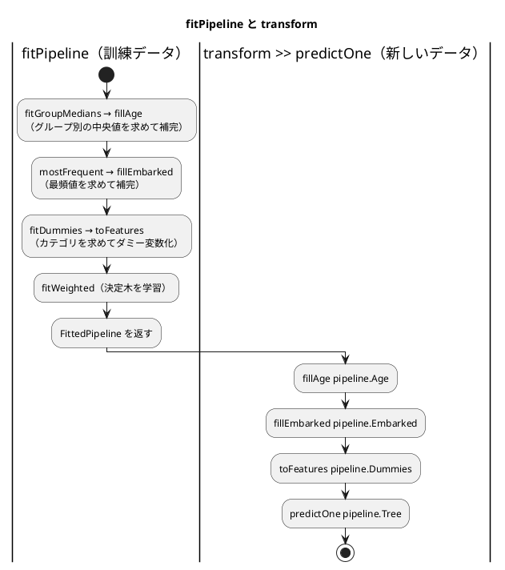

# 第 8 章: 実践的な分類と前処理パイプライン

## 8.1 はじめに

これまでの章のデータは、欠損値が少なく、特徴量もすべて数値でした。現実のデータはそうはいきません。この章で扱うタイタニック号の乗客データには、次の 3 つの難しさがあります。

- **欠損値が多い** — 年齢が 2 割近く欠けている
- **カテゴリ値がある** — 性別や乗船した港が文字列で記録されている
- **クラスが偏っている** — 生存者より死亡者のほうが多い

この章では、これらを 1 つずつ小さな部品として TDD で実装し、前処理からモデルまでを 1 つの **パイプライン** につなぎます。最後にそのパイプラインをファイルに保存し、読み込んで予測できるようにします。保存したパイプラインは、第 15 章で作る機械学習 API から使います。

[Python 版の第 8 章](../python/08-classification-and-preprocessing-pipeline.md) は scikit-learn の変換器・`Pipeline`・`class_weight` を、[Kotlin 版の第 8 章](../kotlin/08-classification-and-preprocessing-pipeline.md) は `interface Transformer` と Java のシリアライズを、[TypeScript 版の第 8 章](../typescript/08-classification-and-preprocessing-pipeline.md) は「学習した値はデータ、変換は関数」という分け方と zod による検証を使いました。F# 版では、次の 3 点に注目してください。

- **型引数を持つレコードで、前処理の段階を型にする** — 乗客を `PassengerOf<'Age, 'Embarked>` で表し、補完の前（`float option`）と後（`float`）を別の型にする。前処理を **関数の合成**（`>>`）でつなぐと、補完を飛ばしたパイプラインはコンパイルエラーになる
- **第 3 章の木をそのまま使って、重み付きの学習だけを足す** — 決定木の型 `Tree<'L>` と予測の関数は第 3 章のものを使い、この章では 1 件ごとの重みを通す学習の関数だけを書く。判別共用体は値で比べられるので、「重みがすべて 1 なら第 3 章と同じ木になる」ことを木ごと比べて確かめる
- **ライブラリの境界で形を変える** — .NET の System.Text.Json は判別共用体と組をキーにした `Map` を JSON にできない。保存する形（DTO）に変換し、読み込むときは `Result` で形の誤りを返す。ML.NET では、クラスの重みを **行の重み**（`ExampleWeightColumnName`）で表せることを確かめ、モデルを zip で保存する

## 8.2 題材とデータ

### Survived.csv

`Survived.csv` には、乗客 891 人の情報が記録されています。

| 列 | 意味 | 値 | 欠損値 |
|----|------|-----|------|
| PassengerId | 乗客の番号 | 整数 | 0 件 |
| Survived | 生存したか（正解ラベル） | 1（生存）または 0（死亡） | 0 件 |
| Pclass | 客室クラス | 1, 2, 3 | 0 件 |
| Sex | 性別 | `male` または `female` | 0 件 |
| Age | 年齢 | 小数 | 177 件 |
| SibSp | 同乗した兄弟・配偶者の数 | 整数 | 0 件 |
| Parch | 同乗した親・子の数 | 整数 | 0 件 |
| Ticket | チケット番号 | 文字列 | 0 件 |
| Fare | 運賃 | 小数 | 0 件 |
| Cabin | 客室番号 | 文字列 | 687 件 |
| Embarked | 乗船した港 | `C`・`Q`・`S` | 2 件 |

正解ラベルは生存 342 人、死亡 549 人で、死亡のほうが 1.6 倍ほど多くなっています。列名は英語なので、F# 版でもレコードのフィールド名に列名をそのまま使います。

### 使う特徴量と、使わない列

特徴量には `Pclass`・`Sex`・`Age`・`SibSp`・`Parch`・`Fare`・`Embarked` の 7 列を使います。`PassengerId` と `Ticket` は乗客を区別するための値で、生存との関係は期待できません。`Cabin` は 891 件中 687 件が欠けているので、今回は使いません。

### 年齢はグループごとの中央値で補完する

年齢の欠損値を全体の平均値で補完すると、1 等客室の年配の乗客も、3 等客室の若い乗客も、同じ年齢で埋まってしまいます。そこで、客室クラスと性別の組み合わせ（グループ）ごとの中央値で補完します。平均値でなく中央値を使うのは、一部の高齢の乗客に値が引っ張られにくいからです。

グループ分けに正解ラベル（`Survived`）を使ってはいけません。予測するときには、その乗客が生存したかは分からないからです。グループ分けに使えるのは、予測の時点で分かっている特徴量だけです。

## 8.3 TODO リストの作成

**TODO リスト**:

- [ ] CSV を読み込む
- [ ] 年齢の欠損値を補完する
  - [ ] 同じグループの中央値で補完する
  - [ ] グループごとに異なる中央値で補完する
  - [ ] 訓練データで求めた中央値を、別のデータの補完に使う
  - [ ] 訓練データに無いグループは、全体の中央値で補完する
- [ ] 乗船した港の欠損値を、最も多い値で補完する
- [ ] カテゴリ値を 0 と 1 の列（ダミー変数）にする
  - [ ] 訓練データと別のデータで、同じ列を作る
- [ ] クラスの重みを付けた決定木を作る
- [ ] 前処理とモデルを 1 つのパイプラインにつなぐ
- [ ] モデルを保存して読み込む
- [ ] 正解率と、見つけた生存者の数で評価する
- [ ] 実データでクラスの重みの効果を確かめる

## 8.4 CSV を読み込む

### Red: 1 行を型で表したテスト

第 2 章と同じく、型プロバイダ `CsvProvider` で読み込みます。テストでは、架空の乗客 1 人分の CSV を BOM 付きで一時ファイルに書き、読み込んだ結果を期待する値とまるごと比べます。

```fsharp
// tests/MachineLearning.Tests/Chapter08/SurvivedDataTest.fs
[<Fact>]
let ``BOM 付き CSV を読み込み、空欄を None にする`` () =
    let rows = loadSurvived (writeCsv "1,0,3,male,,0,0,X-1,8.5,,S\n")

    Assert.Equal<SurvivedRow list>(
        [
            {
                PassengerId = 1
                Survived = 0
                Ticket = "X-1"
                Cabin = None
                Passenger =
                    {
                        Pclass = 3
                        Sex = "male"
                        Age = None
                        SibSp = 0
                        Parch = 0
                        Fare = 8.5
                        Embarked = Some "S"
                    }
            }
        ],
        rows
    )
```

```text
error FS0039: 名前空間 'Chapter08' が定義されていません。
error FS0039: 型 'SurvivedRow' が定義されていません。
error FS0039: 値またはコンストラクター 'loadSurvived' が定義されていません。
```

### Green: 列の型を Schema で指定する

特徴量の 7 列を `Passenger`（乗客 1 人分の特徴量）とし、残りの列を足したものを `SurvivedRow` にします。欠けていることがある列は `option` にします。

```fsharp
// src/MachineLearning/Chapter08/SurvivedData.fs
module MachineLearning.Chapter08.SurvivedData

open FSharp.Data

/// 型プロバイダが列の名前と型を知るためのサンプル（架空の値）
[<Literal>]
let SurvivedSample =
    "PassengerId,Survived,Pclass,Sex,Age,SibSp,Parch,Ticket,Fare,Cabin,Embarked\n1,0,3,male,,0,0,X-1,8.5,,S"

type SurvivedCsv =
    CsvProvider<
        SurvivedSample,
        Schema="int,int,int,string,float option,int,int,string,float,string option,string option"
     >

/// 乗客 1 人分の特徴量
type Passenger =
    {
        Pclass: int
        Sex: string
        Age: float option
        SibSp: int
        Parch: int
        Fare: float
        Embarked: string option
    }

type SurvivedRow =
    {
        PassengerId: int
        Survived: int
        Passenger: Passenger
        Ticket: string
        Cabin: string option
    }
```

`loadSurvived` は、型プロバイダが作った行の型から `SurvivedRow` を組み立てるだけです（完成コードを参照）。

- `Schema` には、列の型をカンマ区切りで並べます。`float option` と書いた列は、空欄が `None` に、値が `Some 38.5` のようになります。`string option` も指定でき、空欄の港が `None` になります
- レコードの中にレコード（`Passenger`）を入れ子にできます。テストの期待値も、同じ形の入れ子のレコードで書きます

```text
テストの実行の概要: 成功!
```

### 三角測量と学習用テスト: Schema を書かなかったら

値のある行と、港が空欄の行で三角測量します。

```fsharp
[<Fact>]
let ``値のある列は型のとおりに、空欄の港は None に読み込む`` () =
    let row =
        loadSurvived (writeCsv "2,1,1,female,38.5,1,0,PC 17599,71.2833,C85,\n")
        |> List.head

    Assert.Equal(Some "C85", row.Cabin)
    Assert.Equal(Some 38.5, row.Passenger.Age)
    Assert.Equal(None, row.Passenger.Embarked)
```

このテストは追加した時点で通りました。TypeScript 版では `Number("male")` が `NaN` になり、Kotlin 版では 1 文字の列が `Char` として読まれて、この段階で Red になりました。F# 版では列の型を `Schema` で先に書いたので、そうした食い違いが起きていません。

`Schema` を書かなかったら何と推論されるのかを、第 2 章と同じく学習用テストで確かめておきます。

```fsharp
/// 学習用テスト: Schema を指定しないときに型プロバイダが推論する型
type NoSchemaCsv = FSharp.Data.CsvProvider<SurvivedSample>

[<Fact>]
let ``学習用テスト: Schema を指定しないと、空欄だけの列は string、1 文字の列も string と推論される`` () =
    let row = NoSchemaCsv.GetSample().Rows |> Seq.head

    Assert.IsType<string>(box row.Age) |> ignore
    Assert.IsType<string>(box row.Embarked) |> ignore
    Assert.IsType<decimal>(box row.Fare) |> ignore
```

サンプルで空欄しかない `Age` は `string`、小数の `Fare` は `decimal` と推論されました。型プロバイダはサンプルの値から型を決めるので、サンプルに無い情報（「この列は欠けることがある数値だ」）は `Schema` で伝える必要があります。1 文字の `Embarked` は `string` のままで、Kotlin 版のような `Char` にはなりませんでした。

## 8.5 年齢をグループごとの中央値で補完する

### 学習した値と、変換する関数に分ける

前処理の部品は、TypeScript 版と同じく次の 2 つに分けます。

| 役割 | 形 | 例 |
|------|-----|-----|
| 訓練データから値を求める | `fit〜` 関数。求めた値をレコードで返す | `fitGroupMedians groupOf valueOf rows` |
| 求めた値で変換する | 求めた値を最初の引数で受け取る関数 | `imputeGroupMedian imputer group value` |

変換する関数は、求めた値を引数で受け取らなければ呼べないので、`fit` する前に変換するコードは書けません。第 3 章の `fit` が木を返し、`predict` が木を受け取ったのと同じ形です。訓練データで `fit` し、テストデータには変換だけを使う、というデータリークを防ぐ使い方が自然に書けます。

F# 版の `fitGroupMedians` は、行からグループを取り出す関数（`groupOf`）と、値を取り出す関数（`valueOf`）を引数に取ります。乗客のレコードに限らず、どんな行にも使えるようにするためです。

### Red: 最初のテスト

同じグループ（1 等客室の女性）の中に、年齢 20・30・70 の乗客と、年齢が欠けた乗客がいるデータで試します。中央値は 30 です。テストの行は、`(グループ, 年齢)` の組にしました。グループは `(客室クラス, 性別)` の組です。

```fsharp
// tests/MachineLearning.Tests/Chapter08/TransformersTest.fs
/// (グループ, 年齢) の組のリストを、学習した中央値で補完した年齢のリストにする
let imputeAll (imputer: GroupMedians<'G>) (rows: ('G * float option) list) : float list =
    rows |> List.map (fun (group, age) -> imputeGroupMedian imputer group age)

[<Fact>]
let ``同じグループの中央値で欠損値を補完する`` () =
    let rows =
        [
            (1, "female"), Some 20.0
            (1, "female"), Some 30.0
            (1, "female"), Some 70.0
            (1, "female"), None
        ]

    let imputer = fitGroupMedians fst snd rows

    Assert.Equal<float list>([ 20.0; 30.0; 70.0; 30.0 ], imputeAll imputer rows)
```

`fitGroupMedians fst snd rows` の `fst` と `snd` は、組の 1 つ目と 2 つ目を返す関数です。行が `(グループ, 年齢)` の組なので、そのまま `groupOf` と `valueOf` に渡せます。

```text
error FS0039: 名前空間 'Transformers' が定義されていません。
error FS0039: 型 'GroupMedians' が定義されていません。
error FS0039: 値またはコンストラクター 'fitGroupMedians' が定義されていません。
error FS0039: 値またはコンストラクター 'imputeGroupMedian' が定義されていません。
```

### Green: 仮実装

欠損値を 30 で埋めるだけの仮実装にします。

```fsharp
// src/MachineLearning/Chapter08/Transformers.fs
module MachineLearning.Chapter08.Transformers

/// グループごとの中央値で補完するために、訓練データから求めた値
type GroupMedians<'G when 'G: comparison> = { Medians: Map<'G, float> }

let fitGroupMedians (groupOf: 'R -> 'G) (valueOf: 'R -> float option) (rows: 'R list) : GroupMedians<'G> =
    { Medians = Map.empty }

let imputeGroupMedian (imputer: GroupMedians<'G>) (group: 'G) (value: float option) : float =
    value |> Option.defaultValue 30.0
```

- `GroupMedians<'G>` は、グループの型 `'G` を型引数に持つレコードです。`when 'G: comparison` は「`'G` は大小を比べられる型」という **型の制約** で、`Map` のキーにするために必要です
- `Option.defaultValue 30.0` は、`Some` なら中の値を、`None` なら 30.0 を返します

```text
テストの実行の概要: 成功!
```

### 三角測量: グループごとに異なる中央値

1 等客室の女性（40・50 → 中央値 45）と、3 等客室の男性（10・20 → 中央値 15）の 2 グループで試します。

```fsharp
[<Fact>]
let ``グループごとに異なる中央値で補完する`` () =
    let rows =
        [
            (1, "female"), Some 40.0
            (1, "female"), Some 50.0
            (1, "female"), None
            (3, "male"), Some 10.0
            (3, "male"), Some 20.0
            (3, "male"), None
        ]

    let imputer = fitGroupMedians fst snd rows

    Assert.Equal<float list>([ 40.0; 50.0; 45.0; 10.0; 20.0; 15.0 ], imputeAll imputer rows)
```

```text
失敗 MachineLearning.Tests.Chapter08.TransformersTest.グループごとに異なる中央値で補完する (22ms)
  Assert.Equal() Failure: Collections differ
  Expected: [40, 50, 45, 10, 20, ···]
  Actual:   [40, 50, 30, 10, 20, ···]
```

### 学習用テスト: 組を Map のキーにできるか

グループごとの中央値は、`(客室クラス, 性別)` の組をキーにした `Map` に入れます。TypeScript 版では、配列を `Map` のキーにすると「同じ配列かどうか（参照）」で比べられ、要素が同じ別の配列では引けませんでした。F# ではどうかを、学習用テストで確かめます。

```fsharp
[<Fact>]
let ``学習用テスト: 組を Map のキーにすると、別に作った同じ値の組で引ける`` () =
    let medians = Map.ofList [ (1, "female"), 45.0 ]

    Assert.Equal(Some 45.0, Map.tryFind (1, "female") medians)
```

このテストは追加した時点で通ります。F# の組・レコード・判別共用体は、既定で **値で比べられる**（構造的等価性）ので、別に作った `(1, "female")` でも同じキーとして引けます。`Map` はキーを大小で並べて持つので、組の型が `comparison` の制約を満たす（`int` と `string` がどちらも比べられる）ことも必要です。

### Green: グループごとの中央値

```fsharp
/// 小さい順に並べて、件数が奇数なら真ん中の値、偶数なら真ん中の 2 つの平均
let median (values: float list) : float =
    let sorted = List.sort values
    let middle = sorted.Length / 2

    if sorted.Length % 2 = 1 then
        sorted[middle]
    else
        (sorted[middle - 1] + sorted[middle]) / 2.0

let fitGroupMedians (groupOf: 'R -> 'G) (valueOf: 'R -> float option) (rows: 'R list) : GroupMedians<'G> =
    {
        Medians =
            rows
            |> List.choose (fun row -> valueOf row |> Option.map (fun value -> groupOf row, value))
            |> List.groupBy fst
            |> List.map (fun (group, pairs) -> group, median (List.map snd pairs))
            |> Map.ofList
    }

let imputeGroupMedian (imputer: GroupMedians<'G>) (group: 'G) (value: float option) : float =
    value |> Option.defaultWith (fun () -> imputer.Medians[group])
```

- `List.choose` は、関数が `Some` を返した要素だけを集めます。年齢が `None` の行は、`Option.map` の結果も `None` なので、グループに加わりません
- `List.groupBy fst` で、グループごとに `(グループ, 年齢)` の組をまとめます
- `Option.defaultWith` は、`None` のときだけ関数を呼んで値を作ります。`Option.defaultValue` と違い、値が欠けていないときは中央値を引きにいきません

```text
テストの実行の概要: 成功!
```

### 訓練データで求めた値を別のデータに使う

データリークを防ぐための、この部品の一番大事な仕様です。訓練データ（2 等客室の男性 30・34 → 中央値 32）で `fit` し、別のデータを補完します。あわせて、訓練データに 1 人もいなかったグループの乗客を、全体の中央値で補完する仕様も書きます（訓練データの年齢 30・40・20 の中央値は 30）。

```fsharp
[<Fact>]
let ``訓練データで求めた中央値を別のデータの補完に使う`` () =
    let train = [ (2, "male"), Some 30.0; (2, "male"), Some 34.0 ]

    let imputer = fitGroupMedians fst snd train

    Assert.Equal(32.0, imputeGroupMedian imputer (2, "male") None)

[<Fact>]
let ``訓練データに無いグループは全体の中央値で補完する`` () =
    let train =
        [ (1, "female"), Some 30.0; (1, "female"), Some 40.0; (3, "male"), Some 20.0 ]

    let imputer = fitGroupMedians fst snd train

    Assert.Equal(30.0, imputeGroupMedian imputer (2, "female") None)
```

```text
失敗 MachineLearning.Tests.Chapter08.TransformersTest.訓練データに無いグループは全体の中央値で補完する (1ms)
  Xunit.MicrosoftTestingPlatform.XunitException: System.Collections.Generic.KeyNotFoundException : The given key was not present in the dictionary.
    場所: Microsoft.FSharp.Collections.MapTreeModule.throwKeyNotFound[a]()
```

1 つ目は、`fit` と変換を分けてあるので追加した時点で通りました。2 つ目は、`Map` に無いキーを `imputer.Medians[group]` で引いて、`KeyNotFoundException` になりました。TypeScript 版では同じ場面で `undefined` が年齢に入り、テストの期待値との比較で初めて気づきました。F# の `Map` のインデクサーは、無いキーで例外を投げるので、誤りがその場で分かります。

無いかもしれないキーは、`Map.tryFind` で引きます。戻り値は `float option` で、無ければ `None` です。全体の中央値は `fit` で求めておきます。

```fsharp
type GroupMedians<'G when 'G: comparison> =
    {
        Medians: Map<'G, float>
        /// 訓練データに無いグループのための、全体の中央値
        OverallMedian: float
    }
```

```fsharp
let fitGroupMedians (groupOf: 'R -> 'G) (valueOf: 'R -> float option) (rows: 'R list) : GroupMedians<'G> =
    let known =
        rows
        |> List.choose (fun row -> valueOf row |> Option.map (fun value -> groupOf row, value))

    {
        Medians =
            known
            |> List.groupBy fst
            |> List.map (fun (group, pairs) -> group, median (List.map snd pairs))
            |> Map.ofList
        OverallMedian = known |> List.map snd |> median
    }

/// 値が欠けていれば、グループの中央値で補う。訓練データに無いグループなら全体の中央値で補う
let imputeGroupMedian (imputer: GroupMedians<'G>) (group: 'G) (value: float option) : float =
    value
    |> Option.orElse (Map.tryFind group imputer.Medians)
    |> Option.defaultValue imputer.OverallMedian
```

- `Option.orElse b a` は、`a` が `Some` なら `a` を、`None` なら `b` を返します。パイプラインで読むと「値 → なければグループの中央値 → それもなければ全体の中央値」と、補う順番がそのまま上から下に並びます
- 最後の `Option.defaultValue` で `option` が外れ、戻り値は `float` になります。「補完した後の年齢は欠けていない」ことを、戻り値の型が表しています

```text
テストの実行の概要: 成功!
```

Kotlin 版では、年齢がすべて欠けたグループで中央値が求められず、パイプラインのテストが失敗しました。F# 版では、年齢が `None` の行はグループに加える前に `List.choose` で除かれるので、そのグループは `Medians` に現れず、「訓練データに無いグループ」と同じく全体の中央値で補完されます。この振る舞いを仕様としてテストに残しておきます（年齢 30・40 の中央値は 35）。このテストは追加した時点で通りました。

```fsharp
[<Fact>]
let ``値がすべて欠けたグループは全体の中央値で補完する`` () =
    let rows =
        [ (1, "female"), Some 30.0; (1, "female"), Some 40.0; (2, "female"), None ]

    let imputer = fitGroupMedians fst snd rows

    Assert.Equal(35.0, imputeGroupMedian imputer (2, "female") None)
```

## 8.6 乗船した港を最頻値で補完する

`Embarked` は文字列なので、中央値は使えません。訓練データで最も多い値（最頻値）で補完します。

```fsharp
[<Fact>]
let ``最も多い値を求め、欠損値をその値で補完する`` () =
    let train = [ Some "S"; Some "C"; Some "S"; None ]

    let embarked = mostFrequent train

    Assert.Equal<string list>([ "S"; "Q" ], [ None; Some "Q" ] |> List.map (Option.defaultValue embarked))

[<Fact>]
let ``最も多い値が同数なら先に現れた値を選ぶ`` () =
    Assert.Equal("C", mostFrequent [ Some "C"; Some "S"; None; Some "S"; Some "C" ])
```

```text
error FS0039: 値またはコンストラクター 'mostFrequent' が定義されていません。
```

最頻値の補完で「訓練データから求める値」は、最も多い値そのものです。求めた値で補完する関数は、標準ライブラリの `Option.defaultValue` で足ります。専用のレコードも変換の関数も要りません。

最も多い値を選ぶ処理は、第 3 章の決定木で葉のラベルを決めた `majority` と同じです。

```fsharp
open MachineLearning.Chapter03.DecisionTree

/// 欠けていない値のうち最も多い値。同数なら先に現れた値を選ぶ（第 3 章の majority と同じ）
let mostFrequent (values: 'V option list) : 'V = values |> List.choose id |> majority
```

- `List.choose id` は、`Some` の中の値だけを集め、`None` を除きます。`id` は受け取った値をそのまま返す関数で、ここでは「`option` をそのまま `List.choose` の判定に使う」という意味になります
- 第 3 章の `majority` はラベルの型 `'L` について書いてあったので、港の文字列にもそのまま使えます

```text
テストの実行の概要: 成功!
```

## 8.7 カテゴリ値をダミー変数にする

### Red → Green: 明白な実装

決定木は、`male` のような文字列を直接扱えません。カテゴリごとに 0 と 1 の列を作る **ダミー変数** に変換します。`male` と `female` の 2 列を作ると、片方がもう片方の裏返しになり情報が重複するので、並べて最初のカテゴリの列を落とします。

カテゴリの行は、列名からカテゴリの文字列への `Map` で表します。

```fsharp
[<Fact>]
let ``2 値のカテゴリを、最初のカテゴリを除いた 0 と 1 の列にする`` () =
    let rows =
        [
            Map.ofList [ "Sex", "female" ]
            Map.ofList [ "Sex", "male" ]
            Map.ofList [ "Sex", "male" ]
        ]

    let encoder = fitDummies rows

    Assert.Equal<Map<string, float> list>(
        [
            Map.ofList [ "Sex_male", 0.0 ]
            Map.ofList [ "Sex_male", 1.0 ]
            Map.ofList [ "Sex_male", 1.0 ]
        ],
        rows |> List.map (encodeDummies encoder)
    )
```

```text
error FS0039: 値またはコンストラクター 'fitDummies' が定義されていません。
error FS0039: 値またはコンストラクター 'encodeDummies' が定義されていません。
```

`fitDummies` で列ごとのカテゴリを覚え、`encodeDummies` で 1 行ずつ変換します。

```fsharp
/// ダミー変数にするために、訓練データから求めた値
type DummyEncoder =
    {
        /// 列ごとの、ダミー変数にするカテゴリ（並べて最初のカテゴリを除く）
        Categories: Map<string, string list>
    }

let fitDummies (rows: Map<string, string> list) : DummyEncoder =
    let categoriesOf column =
        rows
        |> List.map (fun row -> row[column])
        |> List.distinct
        |> List.sort
        |> List.tail

    {
        Categories =
            rows.Head
            |> Map.keys
            |> Seq.map (fun column -> column, categoriesOf column)
            |> Map.ofSeq
    }

/// カテゴリの列を、「列名_カテゴリ」という名前の 0 と 1 の列にする
let encodeDummies (encoder: DummyEncoder) (row: Map<string, string>) : Map<string, float> =
    encoder.Categories
    |> Map.toList
    |> List.collect (fun (column, categories) ->
        categories
        |> List.map (fun category -> $"{column}_{category}", (if row[column] = category then 1.0 else 0.0)))
    |> Map.ofList
```

- `List.distinct` で重複を除き、`List.sort` で並べ、`List.tail` で先頭（最初のカテゴリ）を除きます
- `encodeDummies` は、覚えたカテゴリごとに `"Sex_male", 1.0` のような組を作り、`Map.ofList` で 1 つの `Map` にします。`if ... then ... else` は値を返す **式** なので、組の 2 つ目にそのまま書けます

```text
テストの実行の概要: 成功!
```

### 別のデータにも同じ列を作る

Python 版で pandas の `get_dummies`、Kotlin 版で `pivotMatches`、TypeScript 版で素直な実装について確かめた落とし穴は、変換するデータに含まれるカテゴリの列しか作らないことでした。`S` しか無いデータでは、`S` まで「最初のカテゴリ」として落とされ、列が 1 つも残りません。

同じ仕様をテストに書きます。

```fsharp
[<Fact>]
let ``別のデータにも訓練データと同じ列を作る`` () =
    let train =
        [ "C"; "Q"; "S" ] |> List.map (fun port -> Map.ofList [ "Embarked", port ])

    let encoder = fitDummies train

    Assert.Equal<Map<string, float>>(
        Map.ofList [ "Embarked_Q", 0.0; "Embarked_S", 1.0 ],
        encodeDummies encoder (Map.ofList [ "Embarked", "S" ])
    )
```

このテストは追加した時点で通りました。`encodeDummies` は 1 行を受け取る関数なので、変換するデータ全体からカテゴリを求めることが、そもそも書けません。カテゴリは `fitDummies` が返したレコードからしか得られないので、訓練データとテストデータ（や、API に届いた 1 人分のデータ）で必ず同じ列ができます。関数の型が、落とし穴を避ける形を決めています。

## 8.8 クラスの重みを付けた決定木を作る

### なぜ自作するのか

死亡者のほうが多いデータで決定木を学習すると、死亡者を正しく分けることが優先され、生存者の見落としが増えがちです。scikit-learn では `class_weight="balanced"` を指定すると、少ないクラスの 1 件を重く数えて分割を選べます。

第 3 章の自作の決定木には重みがありません。そこで、1 件ごとの重みを受け取って木を作る関数を、この章のモジュールに書きます。第 3 章のファイルは変えません。決定木の型 `Tree<'L>`、分け方の型 `Split`、予測の `predict`・`predictOne`、表示の `formatTree` は、第 3 章のものをそのまま使います。重みが関わるのは木を **作る** 部分だけで、できた木をたどる部分は重みと無関係だからです。

ML.NET の FastTree は重みを受け取れます（この節の最後で確かめます）。ただし、第 3 章で見たとおり単一の決定木ではないので、自作の木とは仕組みが違います。

### 重み付きのジニ不純度

重み付きのジニ不純度は、ラベルの **件数** の代わりに **重みの合計** で割合を求めます。

重み付きジニ不純度 = 1 − Σ（そのラベルの重みの合計 / 全体の重みの合計）²

重みがすべて 1 なら、第 3 章のジニ不純度と同じ値になるはずです。これを最初のテストにします。正解ラベルは、生存 1・死亡 0 の整数で表します。

```fsharp
// tests/MachineLearning.Tests/Chapter08/WeightedTreeTest.fs
[<Fact>]
let ``重みがすべて 1 なら第 3 章のジニ不純度と同じ値になる`` () =
    let labels = [ 0; 1; 1 ]

    Assert.Equal(DecisionTree.gini labels, weightedGini labels [ 1.0; 1.0; 1.0 ])

[<Fact>]
let ``重みの大きいラベルほど多いものとして不純度を計算する`` () =
    Assert.Equal(0.375, weightedGini [ 0; 1 ] [ 1.0; 3.0 ], 12)
```

2 つ目は、ラベル 0 の重みが 1、ラベル 1 の重みが 3 なら、割合は 0.25 と 0.75 で、不純度は 1 − (0.25² + 0.75²) = 0.375 になる、というテストです。

```text
error FS0039: 名前空間 'WeightedTree' が定義されていません。
error FS0039: 値またはコンストラクター 'weightedGini' が定義されていません。
```

重みを無視して第 3 章の `gini` を呼ぶ仮実装では、2 つ目のテストが失敗します。

```text
失敗 MachineLearning.Tests.Chapter08.WeightedTreeTest.重みの大きいラベルほど多いものとして不純度を計算する (26ms)
  Assert.Equal() Failure: Values are not within 12 decimal places
  Expected: 0.375 (rounded from 0.375)
  Actual:   0.5 (rounded from 0.5)
```

```fsharp
// src/MachineLearning/Chapter08/WeightedTree.fs
/// ラベルごとの重みの合計。ラベルが最初に現れた順に並ぶ
let private sumWeightsByLabel (labels: 'L list) (weights: float list) : ('L * float) list =
    List.zip labels weights
    |> List.groupBy fst
    |> List.map (fun (label, pairs) -> label, List.sumBy snd pairs)

/// 重み付きのジニ不純度。ラベルの件数の代わりに重みの合計で割合を求める
let weightedGini (labels: 'L list) (weights: float list) : float =
    let total = List.sum weights

    1.0
    - (sumWeightsByLabel labels weights
       |> List.sumBy (fun (_, weight) -> (weight / total) ** 2.0))
```

計算の形を第 3 章の `gini` とそろえてあります。`List.groupBy` は `List.countBy` と同じくラベルが最初に現れた順に並べ、重みがすべて 1 なら重みの合計は件数と同じ値になるので、浮動小数点数の計算も同じ順で行われます。1 つ目のテストは、誤差を許さない `Assert.Equal` のまま通ります。

```text
テストの実行の概要: 成功!
```

### balanced の重み

scikit-learn の `balanced` と同じく、1 件の重みを「件数 / (クラスの数 × そのクラスの件数)」にします。ラベル 0 が 3 件、ラベル 1 が 1 件なら、0 の重みは 4 / (2 × 3)、1 の重みは 4 / (2 × 1) = 2 です。クラスごとの重みの合計は、どちらも 2 にそろいます。

重みの付け方は、「重み付けなし」と「balanced」の 2 つのどちらかなので、判別共用体で表します。

```fsharp
[<Fact>]
let ``balanced は少ないクラスほど 1 件の重みを大きくし、クラスごとの重みの合計をそろえる`` () =
    let weights = classWeights Balanced [ 0; 0; 0; 1 ]

    Assert.Equal<float list>([ 4.0 / 6.0; 4.0 / 6.0; 4.0 / 6.0; 2.0 ], weights)

[<Fact>]
let ``重み付けなしなら重みはすべて 1`` () =
    Assert.Equal<float list>([ 1.0; 1.0; 1.0 ], classWeights Unweighted [ 0; 1; 1 ])
```

```fsharp
/// クラスの重みの付け方
type ClassWeight =
    /// すべての行の重みを 1 にする
    | Unweighted
    /// 1 件の重みを「件数 / (クラスの数 × そのクラスの件数)」にして、クラスごとの重みの合計をそろえる
    | Balanced

/// 正解ラベルから、1 件ごとの重みを求める
let classWeights (classWeight: ClassWeight) (t: 'L list) : float list =
    match classWeight with
    | Unweighted -> t |> List.map (fun _ -> 1.0)
    | Balanced ->
        let counts = t |> List.countBy id |> Map.ofList

        t
        |> List.map (fun label -> float t.Length / float (counts.Count * counts[label]))
```

- Python 版の `class_weight="balanced"` は文字列なので、`"balanse"` のような打ち間違いは実行するまで分かりません。F# の判別共用体では、打ち間違いはコンパイルエラーになります。場合を増やしたときに `match` の書き忘れを網羅性の検査が見つけるのは、第 3 章で見たとおりです
- 「重み付けなし」を `None` という名前にすると、`option` の `None` と紛らわしいので、`Unweighted` にしました
- `counts.Count` は、`Map` のキーの数、つまりクラスの数です

### 重み付けなしなら第 3 章の決定木と同じ木を作る

木を作る処理は、第 3 章の `bestSplit`・`fit` と同じ手順に、1 件ごとの重みを通すだけです。そこで、「重みがすべて 1 なら第 3 章の決定木と同じ木を作る」ことを仕様にします。

第 3 章の木は判別共用体とレコードでできているので、`=` で **木そのもの** を比べられます。分け方の特徴量・境界・不純度から葉のラベルまで、すべてが一致するかを 1 つの `Assert.Equal` で確かめられます。TypeScript 版では予測の結果を比べていましたが、F# 版ではそれより強い仕様を書けます。

```fsharp
let fares = [ 8.0; 9.0; 13.0; 20.0; 60.0; 80.0 ]
let ages = [ 30.0; 22.0; 18.0; 45.0; 25.0; 33.0 ]

let x =
    List.map2 (fun fare age -> Map.ofList [ "Fare", fare; "Age", age ]) fares ages

let t = [ 0; 0; 1; 0; 1; 1 ]

[<Fact>]
let ``重みがすべて 1 なら第 3 章の決定木と同じ木を作る`` () =
    for maxDepth in [ Some 1; Some 2; None ] do
        Assert.Equal(DecisionTree.fit maxDepth x t, fitWeighted maxDepth x t (classWeights Unweighted t))
```

```text
error FS0039: 値またはコンストラクター 'classWeights' が定義されていません。
error FS0039: 値またはコンストラクター 'fitWeighted' が定義されていません。
```

第 3 章で作った手順をなぞる明白な実装です。

```fsharp
/// 重み付きの不純度が最も小さくなる分け方。ラベルが 1 種類か、分けられる値が無ければ None
let bestWeightedSplit (x: Map<string, float> list) (t: 'L list) (weights: float list) : Split option =
    match x with
    | [] -> None
    | _ when weightedGini t weights = 0.0 -> None
    | first :: _ ->
        first
        |> Map.keys
        |> Seq.toList
        |> List.collect (fun feature -> splitsOf feature x t weights)
        |> function
            | [] -> None
            | splits -> Some(List.minBy (fun split -> split.Impurity) splits)

/// 重みの合計が最も大きいラベル。同数なら先に現れたラベルを選ぶ
let weightedMajority (labels: 'L list) (weights: float list) : 'L =
    sumWeightsByLabel labels weights |> List.maxBy snd |> fst

/// 第 3 章の fit と同じ手順で、1 件ごとの重みを通して木を作る。木の型は第 3 章の Tree<'L> をそのまま使う
// 左右の部分木を作ってから Node にまとめるので末尾再帰ではない。再帰の深さは木の深さまで
// fsharplint:disable-next-line EnsureTailCallDiagnosticsInRecursiveFunctions
let rec fitWeighted (maxDepth: int option) (x: Map<string, float> list) (t: 'L list) (weights: float list) : Tree<'L> =
    let split =
        if maxDepth = Some 0 then
            None
        else
            bestWeightedSplit x t weights

    match split with
    | None -> Leaf(weightedMajority t weights)
    | Some split ->
        let goesLeft (row: Map<string, float>, _, _) = row[split.Feature] <= split.Threshold
        let left, right = List.zip3 x t weights |> List.partition goesLeft
        let childDepth = maxDepth |> Option.map (fun depth -> depth - 1)

        let fitPart part =
            let partX, partT, partWeights = List.unzip3 part
            fitWeighted childDepth partX partT partWeights

        Node(split, fitPart left, fitPart right)
```

特徴量ごとの分け方の候補を作る `splitsOf` は完成コードを参照してください。第 3 章との違いは次の 3 点です。

- 特徴量の値・ラベル・重みの 3 つ組を値の順に並べます。`List.zip3` で 3 つのリストを 3 つ組のリストにし、`List.unzip3` で戻します。`List.sortBy` は安定な並べ替えなので、同じ値の並び順は第 3 章と同じです
- 不純度を件数でなく重みの合計で重み付けし、葉のラベルを件数でなく重みの合計の多数決（`weightedMajority`）で決めます
- 戻り値の型は第 3 章の `Tree<'L>` です。`Leaf` と `Node` も第 3 章の判別共用体のケースで、`open MachineLearning.Chapter03.DecisionTree` だけで使えます
- FSharpLint の規則 FL0085 は、`let rec` の関数に `[<TailCall>]` 属性（末尾再帰であることをコンパイラに検査させる）を付けるよう求めます。`fitWeighted` は左右の部分木を作ってから `Node` にまとめるので末尾再帰ではなく、属性を付けると `error FS3569: メンバーまたは関数 'fitWeighted' には 'TailCallAttribute' 属性がありますが、末尾の再帰的な方法では使用されていません。` になりました。そこで、理由をコメントに書き、`fsharplint:disable-next-line` で次の行だけ規則を外しています。再帰の深さは木の深さまでなので、スタックが足りなくなる心配はありません

```text
テストの実行の概要: 成功!
```

### balanced で予測が変わる

`balanced` にすると予測が変わる例を作ります。運賃が 1 の乗客 4 人（全員死亡）と、2 の乗客 3 人（死亡 2 人・生存 1 人）です。分けられる境界は 1.5 しかないので、深さ 1 の木の右の葉には、死亡 2 人と生存 1 人が入ります。

- 重み付けなし: 死亡 2 件 対 生存 1 件で、右の葉は死亡（0）
- balanced: 死亡 6 件・生存 1 件なので、死亡の重みは 7 / 12、生存の重みは 7 / 2。右の葉は死亡 2 × 7/12 ≒ 1.17 対 生存 3.5 で、生存（1）

```fsharp
[<Fact>]
let ``balanced にすると少ないクラスが混ざった葉でも少ないクラスを予測する`` () =
    let byFare = List.map (fun fare -> Map.ofList [ "Fare", fare ])
    let fareX = byFare [ 1.0; 1.0; 1.0; 1.0; 2.0; 2.0; 2.0 ]
    let survived = [ 0; 0; 0; 0; 0; 0; 1 ]

    let predictWith classWeight =
        let tree = fitWeighted (Some 1) fareX survived (classWeights classWeight survived)
        DecisionTree.predict tree (byFare [ 1.0; 2.0 ])

    Assert.Equal<int list>([ 0; 0 ], predictWith Unweighted)
    Assert.Equal<int list>([ 0; 1 ], predictWith Balanced)
```

このテストは追加した時点で通りました。`classWeights` と `fitWeighted` を、重みを受け取る形で先に書いてあったからです。予測には第 3 章の `DecisionTree.predict` をそのまま使っています。

### ML.NET の行の重みでクラスの重みを表せるか

[ADR 004](../../../adr/004-fsharp-ml-libraries.md) では、ML.NET でクラスの重みを表せるかを、この章で確かめると決めていました。ML.NET の学習器には `class_weight` に当たる指定がありません。代わりに、多くの学習器が **行の重み** の列の名前（`exampleWeightColumnName`）を受け取ります。1 件ごとの重みを `balanced` の値にしておけば、クラスの重みと同じ効果になるはずです。

同じ運賃のデータで、木を 1 本だけ作る 2 値分類の FastTree（第 3 章と同じ代用）に、重みの列を渡す学習用テストを書きます。

```fsharp
// tests/MachineLearning.Tests/Chapter08/MlNetAdapterTest.fs
let byFare = List.map (fun fare -> Map.ofList [ "Fare", fare ])
let x = byFare [ 1.0; 1.0; 1.0; 1.0; 2.0; 2.0; 2.0 ]
let t = [ 0; 0; 0; 0; 0; 0; 1 ]
let newX = byFare [ 1.0; 2.0 ]

[<Fact>]
let ``学習用テスト: 行の重み（ExampleWeightColumnName）でクラスの重みを表せる`` () =
    let predictWith classWeight =
        let model = trainFastTree 2 x t (classWeights classWeight t)
        predictFastTree model newX

    Assert.Equal<int list>([ 0; 0 ], predictWith Unweighted)
    Assert.Equal<int list>([ 0; 1 ], predictWith Balanced)
```

```text
error FS0039: 名前空間 'MlNetAdapter' が定義されていません。
error FS0039: 値またはコンストラクター 'trainFastTree' が定義されていません。
error FS0039: 値またはコンストラクター 'predictFastTree' が定義されていません。
```

第 3 章のアダプターと同じく、`[<CLIMutable>]` のレコードと `SchemaDefinition` で ML.NET に渡します。違いは、正解ラベルが `bool`（生存したか）で、重みの列 `Weight` があることです。

```fsharp
// src/MachineLearning/Chapter08/MlNetAdapter.fs
/// ML.NET に渡す 1 行。生存したか（Label）と、行の重み（Weight）を持つ
[<CLIMutable>]
type WeightedRow =
    {
        Features: float32[]
        Label: bool
        Weight: float32
    }

/// ML.NET が返す 2 値分類の予測
[<CLIMutable>]
type BinaryPrediction = { PredictedLabel: bool }
```

```fsharp
/// 木を 1 本だけ作る FastTree を、行の重み（Weight 列）を付けて学習する
let trainFastTree
    (numberOfLeaves: int)
    (x: Map<string, float> list)
    (t: int list)
    (weights: float list)
    : ITransformer =
    let context = MLContext(seed = 0)

    let fastTree =
        context.BinaryClassification.Trainers.FastTree(
            exampleWeightColumnName = "Weight",
            numberOfLeaves = numberOfLeaves,
            numberOfTrees = 1,
            minimumExampleCountPerLeaf = 1
        )

    fastTree.Fit(toDataView context x t weights) :> ITransformer

/// 学習した FastTree で、生存（1）か死亡（0）かを予測する
let predictFastTree (model: ITransformer) (x: Map<string, float> list) : int list =
    let context = MLContext(seed = 0)

    let data =
        toDataView context x (x |> List.map (fun _ -> 0)) (x |> List.map (fun _ -> 1.0))

    context.Data.CreateEnumerable<BinaryPrediction>(model.Transform data, reuseRowObject = false)
    |> Seq.map (fun prediction -> if prediction.PredictedLabel then 1 else 0)
    |> Seq.toList
```

- 2 値分類なので、第 3 章のようにラベルを番号（キー）に変える段も、`OneVersusAll` も要りません。学習器 1 つだけなので、`EstimatorChain` も使わずに `fastTree.Fit` を直接呼びます
- `:> ITransformer` は **アップキャスト** で、学習済みモデルの具体的な型を、変換器の共通のインターフェースとして扱います。F# は C# と違い、インターフェースへの変換を自動では行わないので、戻り値の型に合わせて書きます
- 第 3 章のアダプターは「学習して、予測する関数を返す」形でした。この章ではモデルを zip に保存するので、学習（`trainFastTree`）と予測（`predictFastTree`）を分け、モデル（`ITransformer`）を値として受け渡します
- 予測のときも `Label` と `Weight` の列が要るので、0 と 1.0 の仮の値を入れています。`toDataView` は完成コードを参照してください

```text
テストの実行の概要: 成功!
```

重み付けなしでは `[0; 0]`、`balanced` の重みでは `[0; 1]` と、自作の木と同じく予測が変わりました。重みの列が無視されていれば、どちらも `[0; 0]` になるはずです。ML.NET では、クラスの重みを行の重みで表せることを確かめられました。

**TODO リスト**:

- [x] CSV を読み込む
- [x] 年齢の欠損値を補完する
- [x] 乗船した港の欠損値を、最も多い値で補完する
- [x] カテゴリ値を 0 と 1 の列（ダミー変数）にする
- [x] クラスの重みを付けた決定木を作る
- [ ] 前処理とモデルを 1 つのパイプラインにつなぐ
- [ ] モデルを保存して読み込む
- [ ] 正解率と、見つけた生存者の数で評価する
- [ ] 実データでクラスの重みの効果を確かめる

## 8.9 前処理とモデルをパイプラインにつなぐ

### 特徴量と正解ラベルに分ける

```fsharp
[<Fact>]
let ``特徴量の乗客と Survived 列に分ける`` () =
    let rows =
        loadSurvived (writeCsv "1,0,3,male,,0,0,X-1,8.5,,S\n2,1,1,female,38,1,0,X-2,71.3,C85,C\n")

    let x, t = splitFeaturesAndTarget rows

    Assert.Equal<Passenger list>(rows |> List.map (fun row -> row.Passenger), x)
    Assert.Equal<int list>([ 0; 1 ], t)
```

```fsharp
/// 特徴量（乗客）と正解ラベル（Survived 列）に分ける
let splitFeaturesAndTarget (rows: SurvivedRow list) : Passenger list * int list =
    rows |> List.map (fun row -> row.Passenger, row.Survived) |> List.unzip
```

8.4 節で特徴量を `Passenger` として入れ子にしておいたので、取り出すだけです。`List.unzip` は組のリストを、リストの組に分けます。

### Red: パイプラインで学習して予測する

架空の乗客 8 人の訓練データと、予測に使う 2 人のデータを用意します。女性が生存、男性が死亡という単純な規則にしておくと、欠損値を含む新しい乗客の予測結果を期待値として書けます。

```fsharp
// tests/MachineLearning.Tests/Chapter08/PipelineTest.fs
/// (Pclass, Sex, Age, SibSp, Parch, Fare, Embarked) の組から乗客を作る
let passenger (pclass, sex, age, sibSp, parch, fare, embarked) : Passenger =
    {
        Pclass = pclass
        Sex = sex
        Age = age
        SibSp = sibSp
        Parch = parch
        Fare = fare
        Embarked = embarked
    }

/// 女性が生存、男性が死亡という単純な規則の訓練データ。2 等客室の女性は 1 人だけで、年齢が欠けている
let trainX =
    [
        1, "female", Some 30.0, 0, 0, 80.0, Some "C"
        2, "female", None, 1, 0, 20.0, Some "S"
        3, "female", Some 22.0, 0, 1, 9.0, None
        3, "female", Some 18.0, 0, 0, 8.0, Some "Q"
        1, "male", Some 45.0, 0, 0, 60.0, Some "S"
        2, "male", None, 0, 0, 13.0, Some "S"
        3, "male", Some 25.0, 1, 0, 7.0, Some "S"
        3, "male", Some 33.0, 0, 0, 8.0, None
    ]
    |> List.map passenger

let trainT = [ 1; 1; 1; 1; 0; 0; 0; 0 ]

let newPassengers =
    [ 2, "female", None, 0, 0, 12.0, None; 1, "male", None, 1, 1, 70.0, Some "C" ]
    |> List.map passenger

let options =
    {
        MaxDepth = Some 3
        ClassWeight = Unweighted
    }

[<Fact>]
let ``欠損値を含むデータで学習して予測できる`` () =
    let pipeline = fitPipeline options trainX trainT

    Assert.Equal<int list>([ 1; 0 ], predict pipeline newPassengers)
```

- `passenger` は 7 つ組を受け取る関数です。引数の `(pclass, sex, ...)` は組の **分解**（パターン）で、要素に名前を付けています。TypeScript 版のラベル付きタプル型と同じく、順番を取り違えて文字列と数値を入れ替えると型の誤りになります
- リストの要素を改行で区切って並べるときは、`;` を省けます。1 行に並べるときは `;` で区切ります

```text
error FS0039: レコード ラベル 'MaxDepth' が定義されていません。
error FS0039: レコード ラベル 'ClassWeight' が定義されていません。
error FS0039: 値またはコンストラクター 'fitPipeline' が定義されていません。
error FS0039: 値またはコンストラクター 'predict' が定義されていません。
error FS0039: 名前空間 'Pipeline' が定義されていません。
```

決定木の設定は、深さの上限とクラスの重みをまとめたレコードにします。

```fsharp
/// 決定木の学習の設定
type TreeOptions =
    {
        /// 木の深さの上限。None なら制限しない
        MaxDepth: int option
        ClassWeight: ClassWeight
    }
```

### Green: 前処理を関数の合成でつなぐ

パイプラインは、学習した部品の値をまとめたレコードと、それを作る関数・使う関数で表します。前処理の各段階は、乗客を 1 人受け取って変換する関数にします。最初は、どの段階も `Passenger` を受け取って `Passenger` を返す形で書きました。

```fsharp
let fillAge (imputer: GroupMedians<int * string>) (passenger: Passenger) : Passenger =
    { passenger with
        Age = Some(imputeGroupMedian imputer (passenger.Pclass, passenger.Sex) passenger.Age)
    }

let fillEmbarked (embarked: string) (passenger: Passenger) : Passenger =
    { passenger with
        Embarked = Some(passenger.Embarked |> Option.defaultValue embarked)
    }

let private categoriesOf (passenger: Passenger) : Map<string, string> =
    Map.ofList [ "Sex", passenger.Sex; "Embarked", Option.get passenger.Embarked ]

let toFeatures (dummies: DummyEncoder) (passenger: Passenger) : Map<string, float> =
    let numbers =
        [
            "Pclass", float passenger.Pclass
            "Age", Option.get passenger.Age
            "SibSp", float passenger.SibSp
            "Parch", float passenger.Parch
            "Fare", passenger.Fare
        ]

    Map.ofList (numbers @ Map.toList (encodeDummies dummies (categoriesOf passenger)))

/// 学習済みの前処理を順につないだ、乗客を決定木に渡せる数値の列にする関数
let transform (pipeline: FittedPipeline) : Passenger -> Map<string, float> =
    fillAge pipeline.Age >> fillEmbarked pipeline.Embarked >> toFeatures pipeline.Dummies
```

- `{ passenger with Age = ... }` は **コピーと更新** の式で、`passenger` をコピーして `Age` だけを置き換えたレコードを作ります。元のレコードは変わりません
- `f >> g` は **関数の合成** で、「`f` を呼び、その結果で `g` を呼ぶ」関数を作ります。`transform` は、年齢の補完 → 港の補完 → 特徴量への変換を順につないだ、1 つの関数を返します
- `fillAge pipeline.Age` は、引数を 1 つだけ渡した **部分適用** で、残りの引数（乗客）を待つ関数になります。部分適用した関数どうしを `>>` でつなげるように、各関数は「学習した値」を先に、「変換する乗客」を最後に受け取る順にしてあります

`fitPipeline` は、前処理を順に学習・変換してから決定木を学習します（完成コードと同じ形です）。テストは通りました。

```text
テストの実行の概要: 成功!
```

### 補完を飛ばすとどうなるか

このパイプラインには弱点があります。`toFeatures` は、年齢と港が補完されていることを前提に `Option.get`（`None` なら例外を投げる）で値を取り出しています。補完を飛ばしたらどうなるかを、`transform` から `fillAge` を外して確かめます。

```fsharp
    fillEmbarked pipeline.Embarked >> toFeatures pipeline.Dummies
```

コンパイルは通り、テストの実行中に失敗しました。

```text
失敗 MachineLearning.Tests.Chapter08.PipelineTest.欠損値を含むデータで学習して予測できる (60ms)
  Xunit.MicrosoftTestingPlatform.XunitException: System.ArgumentException : オプション値は None でした (Parameter 'option')
    場所: Microsoft.FSharp.Core.OptionModule.GetValue[T](FSharpOption`1 option)
    場所: MachineLearning.Chapter08.Pipeline.toFeatures(DummyEncoder dummies, Passenger passenger)
```

`fillAge` を通った後も、年齢の型は `float option` のままです。「補完した後は欠けていない」という前提を、型は知りません。前処理の順番の誤りは、実行してみるまで分かりませんでした。

### リファクタリング: 型引数で補完の前後を表す

TypeScript 版は `Filled<R, K>` という型で「列 `K` の `null` を取り除いた行」を表しました。F# 版では、乗客のレコードに **型引数** を持たせます。年齢と港の型を外から決められるようにし、補完の前と後を別の型にします。

```fsharp
/// 乗客 1 人分の特徴量。年齢と乗船した港の型を型引数にして、補完の前と後を別の型で表す
type PassengerOf<'Age, 'Embarked> =
    {
        Pclass: int
        Sex: string
        Age: 'Age
        SibSp: int
        Parch: int
        Fare: float
        Embarked: 'Embarked
    }

/// 読み込んだままの乗客。年齢と乗船した港は欠けていることがある
type Passenger = PassengerOf<float option, string option>

/// 欠損値を補完した乗客
type FilledPassenger = PassengerOf<float, string>
```

- `type Passenger = PassengerOf<float option, string option>` は **型の略称** です。これまでの `Passenger` と同じフィールドと型を持つので、読み込みやテストのコードは 1 行も変えずに済みました
- `FilledPassenger` は、年齢が `float`、港が `string` の乗客です。欠けていないことが型に表れています

年齢の補完は、「年齢が `float option` の乗客」を受け取り「年齢が `float` の乗客」を返す関数になります。最初は、コピーと更新の式のまま型だけを変えてみました。

```fsharp
let fillAge (imputer: GroupMedians<int * string>) (passenger: PassengerOf<float option, 'E>) : PassengerOf<float, 'E> =
    { passenger with
        Age = imputeGroupMedian imputer (passenger.Pclass, passenger.Sex) passenger.Age
    }
```

```text
error FS0001: 型が一致しません。    'PassengerOf<float,'E>'    という指定が必要ですが、    'PassengerOf<float option,'E>'    が指定されました。型 'float' は型 'float option' と一致しません
```

コピーと更新の式は、元のレコードと **同じ型** のレコードを作ります。型引数が変わる更新はできないので、すべてのフィールドを書いて新しいレコードを作ります。

```fsharp
/// 年齢を補完する。乗船した港の型 'E はそのまま引き継ぐ
let fillAge (imputer: GroupMedians<int * string>) (passenger: PassengerOf<float option, 'E>) : PassengerOf<float, 'E> =
    {
        Pclass = passenger.Pclass
        Sex = passenger.Sex
        Age = imputeGroupMedian imputer (passenger.Pclass, passenger.Sex) passenger.Age
        SibSp = passenger.SibSp
        Parch = passenger.Parch
        Fare = passenger.Fare
        Embarked = passenger.Embarked
    }

/// 乗船した港を補完する。年齢の型 'A はそのまま引き継ぐ
let fillEmbarked (embarked: string) (passenger: PassengerOf<'A, string option>) : PassengerOf<'A, string> =
    {
        Pclass = passenger.Pclass
        Sex = passenger.Sex
        Age = passenger.Age
        SibSp = passenger.SibSp
        Parch = passenger.Parch
        Fare = passenger.Fare
        Embarked = passenger.Embarked |> Option.defaultValue embarked
    }

let private categoriesOf (passenger: FilledPassenger) : Map<string, string> =
    Map.ofList [ "Sex", passenger.Sex; "Embarked", passenger.Embarked ]

/// 補完した乗客を、数値の列とダミー変数の列からなる特徴量にする
let toFeatures (dummies: DummyEncoder) (passenger: FilledPassenger) : Map<string, float> =
    let numbers =
        [
            "Pclass", float passenger.Pclass
            "Age", passenger.Age
            "SibSp", float passenger.SibSp
            "Parch", float passenger.Parch
            "Fare", passenger.Fare
        ]

    Map.ofList (numbers @ Map.toList (encodeDummies dummies (categoriesOf passenger)))
```

- `fillAge` は、港の型を `'E` のまま引き継ぎます。港が補完済みかどうかに関係なく、年齢だけを補完できます。`fillEmbarked` も同じく、年齢の型 `'A` を引き継ぎます
- `toFeatures` は `FilledPassenger` だけを受け取るので、`Option.get` が要らなくなりました。「欠けていたら例外」という実行時の前提が、型の条件に置き換わっています

```text
テストの実行の概要: 成功!
```

同じ実験をもう一度します。`transform` から `fillAge` を外すと、今度はコンパイルエラーになりました。

```text
error FS0001: 型が一致しません。    'PassengerOf<float option,string> -> Map<string,float>'    という指定が必要ですが、    'FilledPassenger -> Map<string,float>'    が指定されました。型 'float' は型 'float option' と一致しません
```

港だけを補完した乗客（`PassengerOf<float option, string>`）は、`toFeatures` が求める `FilledPassenger` ではない、と `>>` の型の検査が知らせています。一方、`fillEmbarked pipeline.Embarked >> fillAge pipeline.Age >> toFeatures pipeline.Dummies` と **順番を入れ替える** だけなら、エラーなくコンパイルできました。年齢と港の補完は互いに依存しないので、どちらを先にしてもよいからです。型が止めるのは「補完を飛ばす」誤りだけで、正しい並べ方の自由は残っています（確かめた後、元に戻しています）。

### 学習して予測する

```fsharp
/// 学習済みの前処理とモデル。予測するときは、ここに覚えた値だけを使う
type FittedPipeline =
    {
        Age: GroupMedians<int * string>
        Embarked: string
        Dummies: DummyEncoder
        Tree: Tree<int>
    }

/// 学習済みの前処理を関数の合成でつないだ、乗客を決定木に渡せる特徴量にする関数
let transform (pipeline: FittedPipeline) : Passenger -> Map<string, float> =
    fillAge pipeline.Age
    >> fillEmbarked pipeline.Embarked
    >> toFeatures pipeline.Dummies

/// 前処理を順に学習・変換してから、決定木を学習する
let fitPipeline (options: TreeOptions) (x: Passenger list) (t: int list) : FittedPipeline =
    let age = fitGroupMedians (fun p -> p.Pclass, p.Sex) (fun p -> p.Age) x
    let ageFilled = x |> List.map (fillAge age)
    let embarked = ageFilled |> List.map (fun p -> p.Embarked) |> mostFrequent
    let filled = ageFilled |> List.map (fillEmbarked embarked)
    let dummies = filled |> List.map categoriesOf |> fitDummies
    let features = filled |> List.map (toFeatures dummies)

    {
        Age = age
        Embarked = embarked
        Dummies = dummies
        Tree = fitWeighted options.MaxDepth features t (classWeights options.ClassWeight t)
    }
```

- `fitPipeline` の中では、各段階の値の型が `Passenger` → `PassengerOf<float, string option>` → `FilledPassenger` → `Map<string, float>` と変わっていきます。型注釈は書いていませんが、コンパイラがすべて推論し、順番の誤りを見張っています
- 年齢の補完には、8.5 節の汎用の `fitGroupMedians` に「客室クラスと性別の組を取り出す関数」と「年齢を取り出す関数」を渡しています
- Python 版と Kotlin 版は、変換器のリストを受け取る汎用の `Pipeline` を作りました。F# 版では、変換器を `>>` でつなぐこと自体がパイプラインです。段階ごとに入力と出力の型が違っても、`>>` は前の関数の出力の型と次の関数の入力の型が合うことだけを求めるので、そのままつなげます

`fitPipeline` と `transform` は、次のように各部品を呼び出します。



`fitPipeline` のときだけ各部品が値を求め、`transform` のときは求めた値を使うだけです。

## 8.10 モデルを保存して読み込む

### 学習用テスト: System.Text.Json は F# の値をどこまで扱えるか

学習済みのパイプラインをファイルに保存しておけば、学習をやり直さずに予測だけを行えます。保存するのはモデル単体ではなく **パイプライン全体** です。前処理で求めた中央値やカテゴリも一緒に保存しないと、読み込んだ側で同じ前処理を再現できないからです。

`FittedPipeline` は、メソッドを持たない値だけでできています。.NET に標準で付いてくる JSON のライブラリ System.Text.Json で保存できそうです。新しいパッケージを入れずに済むのも利点です。F# の型をどこまで扱えるかを、学習用テストで確かめます。

```fsharp
// tests/MachineLearning.Tests/Chapter08/ModelFileTest.fs
type Sample =
    {
        Name: string
        Value: float option
        Items: int list
        Table: Map<string, float>
    }

[<Fact>]
let ``学習用テスト: レコード・option・リスト・文字列がキーの Map は JSON にして戻せる`` () =
    let sample =
        {
            Name = "a"
            Value = None
            Items = [ 1; 2 ]
            Table = Map.ofList [ "x", 0.5 ]
        }

    let json = JsonSerializer.Serialize sample

    Assert.Equal("""{"Name":"a","Value":null,"Items":[1,2],"Table":{"x":0.5}}""", json)
    Assert.Equal(sample, JsonSerializer.Deserialize<Sample> json)

[<Fact>]
let ``学習用テスト: 判別共用体は JSON にできない`` () =
    let tree: Tree<int> = Leaf 1

    Assert.Throws<NotSupportedException>(fun () -> JsonSerializer.Serialize tree |> ignore)
    |> ignore

[<Fact>]
let ``学習用テスト: 組がキーの Map は JSON にできない`` () =
    let medians = Map.ofList [ (1, "female"), 35.0 ]

    Assert.Throws<NotSupportedException>(fun () -> JsonSerializer.Serialize medians |> ignore)
    |> ignore
```

3 つの学習用テストは、追加した時点で通りました。

- レコード・`option`（`None` は `null`）・リスト・文字列がキーの `Map` は、JSON にして元に戻せます。戻したレコードは `=` で元のレコードと等しくなりました
- 判別共用体は、`F# discriminated union serialization is not supported. Consider authoring a custom converter for the type.` という `NotSupportedException` になります。第 3 章の決定木 `Tree<int>` は、そのままでは保存できません
- 組がキーの `Map` も、`The type 'System.Tuple`2[System.Int32,System.String]' is not a supported dictionary key` という `NotSupportedException` になります。JSON のオブジェクトのキーは文字列なので、組をキーの文字列にする方法が決まっていないからです

8.5 節で「組を `Map` のキーにできる」ことを確かめた `GroupMedians<int * string>` と、第 3 章の `Tree<int>` の両方が、JSON にできない型でした。

### 保存する形（DTO）に変換する

F# のコードの中では、判別共用体や組のキーは表現力の高い型です。それを JSON に合わせて変えるのではなく、保存するときだけ JSON にできる形（**DTO**: Data Transfer Object）に変換します。第 3 章で ML.NET に値を渡すときに `[<CLIMutable>]` のレコードに詰め替えたのと同じ考え方で、ライブラリとの **境界で形を変えます**。

```fsharp
[<Fact>]
let ``保存したパイプラインを読み込むと同じ予測をする`` () =
    let pipeline = fitPipeline options trainX trainT
    let modelFile = newModelFile ()

    saveModel modelFile pipeline

    match loadModel modelFile with
    | Ok loaded ->
        Assert.Equal(pipeline, loaded)
        Assert.Equal<int list>([ 1; 0 ], predict loaded newPassengers)
    | Error message -> Assert.Fail message
```

読み込みは失敗することがある（ファイルの形が違うかもしれない）ので、`loadModel` は `Result<FittedPipeline, string>` を返すことにします。`Result` は「成功（`Ok`）か失敗（`Error`）か」を表す判別共用体です。テストでは、読み込んだパイプラインが元のパイプラインと **値として等しい** ことも確かめます。

```text
error FS0039: 名前空間 'ModelFile' が定義されていません。
error FS0039: 値またはコンストラクター 'saveModel' が定義されていません。
error FS0039: 値またはコンストラクター 'loadModel' が定義されていません。
```

```fsharp
// src/MachineLearning/Chapter08/ModelFile.fs
/// 決定木を JSON にするための形。葉なら Label だけ、節なら Split・Left・Right だけを持つ
type TreeDto =
    {
        Label: int option
        Split: Split option
        Left: TreeDto option
        Right: TreeDto option
    }

/// 客室クラスと性別のグループの、年齢の中央値
type AgeMedianDto =
    {
        Pclass: int
        Sex: string
        Median: float
    }

/// 学習済みのパイプラインを JSON にするための形
type PipelineDto =
    {
        AgeMedians: AgeMedianDto list
        OverallAgeMedian: float
        Embarked: string
        Dummies: DummyEncoder
        Tree: TreeDto
    }
```

- 判別共用体の `Leaf`・`Node` は、どちらの場合かを `option` の有無で表すレコードにしました。第 3 章の `Split` はレコードなので、そのまま使えます
- 組がキーの `Map` は、`(客室クラス, 性別, 中央値)` のレコードのリストにしました
- `DummyEncoder` は文字列がキーの `Map` なので、そのまま使えます

木と DTO の変換は、パターンマッチで書きます。

```fsharp
// 左右の部分木を変換してからレコードにまとめるので末尾再帰ではない。再帰の深さは木の深さまで
// fsharplint:disable-next-line EnsureTailCallDiagnosticsInRecursiveFunctions
let rec private treeToDto (tree: Tree<int>) : TreeDto =
    match tree with
    | Leaf label ->
        {
            Label = Some label
            Split = None
            Left = None
            Right = None
        }
    | Node(split, left, right) ->
        {
            Label = None
            Split = Some split
            Left = Some(treeToDto left)
            Right = Some(treeToDto right)
        }

// 左右の部分木を変換してから結果をまとめるので末尾再帰ではない。再帰の深さは木の深さまで
// fsharplint:disable-next-line EnsureTailCallDiagnosticsInRecursiveFunctions
let rec private treeOfDto (dto: TreeDto) : Result<Tree<int>, string> =
    match dto with
    | {
          Label = Some label
          Split = None
          Left = None
          Right = None
      } -> Ok(Leaf label)
    | {
          Label = None
          Split = Some split
          Left = Some left
          Right = Some right
      } ->
        match treeOfDto left, treeOfDto right with
        | Ok left, Ok right -> Ok(Node(split, left, right))
        | Error message, _
        | _, Error message -> Error message
    | _ -> Error "葉でも節でもない木があります"
```

- `treeOfDto` の `{ Label = Some label; Split = None; ... }` は **レコードのパターン** です。フィールドの値の組み合わせで場合分けし、葉の形（`Label` だけがある）と節の形（`Split`・`Left`・`Right` がある）以外は `Error` にします
- `| Error message, _ | _, Error message -> Error message` は、2 つのパターンを `|` でつないだ **or パターン** です。左右どちらかの部分木が `Error` なら、その `Error` を返します

パイプラインの変換と、保存・読み込みです。

```fsharp
let private ofDto (dto: PipelineDto) : Result<FittedPipeline, string> =
    treeOfDto dto.Tree
    |> Result.map (fun tree ->
        {
            Age =
                {
                    Medians = dto.AgeMedians |> List.map (fun m -> (m.Pclass, m.Sex), m.Median) |> Map.ofList
                    OverallMedian = dto.OverallAgeMedian
                }
            Embarked = dto.Embarked
            Dummies = dto.Dummies
            Tree = tree
        })

/// 学習済みのパイプラインを JSON で保存する。保存先のディレクトリが無ければ作る
let saveModel (modelFile: string) (pipeline: FittedPipeline) : unit =
    Directory.CreateDirectory(Path.GetDirectoryName modelFile) |> ignore
    File.WriteAllText(modelFile, JsonSerializer.Serialize(toDto pipeline))

/// 保存したパイプラインを読み込む。形が違えば Error を返す
let loadModel (modelFile: string) : Result<FittedPipeline, string> =
    File.ReadAllText modelFile |> JsonSerializer.Deserialize<PipelineDto> |> ofDto
```

- `Result.map` は、`Ok` なら中の値に関数を適用し、`Error` ならそのまま返します。木の変換が成功したときだけ、パイプラインを組み立てます
- `toDto` は `ofDto` の逆向きの変換です（完成コードを参照）

```text
テストの実行の概要: 成功!
```

読み込んだパイプラインは、元のパイプラインと `=` で等しくなりました。中央値や境界の浮動小数点数も、JSON の文字列を経て同じ値に戻っています。

### 形の違うファイルを読み込む

形の違うファイルを読み込むとどうなるかを、テストに書きます。

```fsharp
[<Fact>]
let ``パイプラインの形をしていないファイルは読み込まない`` () =
    let modelFile = newModelFile ()
    Directory.CreateDirectory(Path.GetDirectoryName modelFile) |> ignore
    File.WriteAllText(modelFile, """{"Tree":{"Label":1}}""")

    Assert.True(Result.isError (loadModel modelFile))
```

```text
失敗 MachineLearning.Tests.Chapter08.ModelFileTest.パイプラインの形をしていないファイルは読み込まない (84ms)
  Xunit.MicrosoftTestingPlatform.XunitException: System.NullReferenceException : Object reference not set to an instance of an object.
    場所: Microsoft.FSharp.Primitives.Basics.List.map[T,TResult](FSharpFunc`2 mapping, FSharpList`1 x)
    場所: Microsoft.FSharp.Collections.ListModule.Map[T,TResult](FSharpFunc`2 mapping, FSharpList`1 list)
```

`Error` が返るのではなく、`NullReferenceException` になりました。System.Text.Json は、JSON に無い項目を **`null` で埋めて** レコードを作ります。`AgeMedians` は `AgeMedianDto list` 型なのに、中身は `null` でした。F# のコードは「レコードのフィールドが `null` になることはない」前提で書かれているので、`List.map` がそれを触って落ちました。一方、`{"Label":1}` の木は、足りない `Split`・`Left`・`Right` が `null`、つまり `None` として読まれ、葉として正しく変換されていました。

.NET 9 で加わった `RespectRequiredConstructorParameters` を有効にすると、F# のレコードのように **コンストラクター** の引数で値を受け取る型では、JSON に無い項目を `null` で埋めずに `JsonException` を投げます。読み込みの設定で有効にし、`JsonException` を `Error` に変えます。

```fsharp
/// 読み込むときの設定。JSON に無い項目があれば、null で埋めずに JsonException にする
let private readOptions =
    JsonSerializerOptions(RespectRequiredConstructorParameters = true)

/// 保存したパイプラインを読み込む。形が違えば Error を返す
let loadModel (modelFile: string) : Result<FittedPipeline, string> =
    try
        JsonSerializer.Deserialize<PipelineDto>(File.ReadAllText modelFile, readOptions)
        |> ofDto
    with :? JsonException as e ->
        Error e.Message
```

- `try ... with :? JsonException as e -> ...` は、`JsonException` 型の例外だけを捕まえます。`:?` は **型テストのパターン** です。それ以外の例外（ファイルが無いなど）は捕まえずに呼び出し元へ伝えます
- ライブラリが投げる例外を、F# の側では `Result` の `Error` に変えます。呼び出す側は `match` で `Ok` と `Error` を場合分けするので、読み込みの失敗を扱い忘れることがありません

```text
テストの実行の概要: 成功!
```

スクラッチパッドで確かめたところ、この設定では `option` のフィールドも「JSON に項目が必要」になりました。`saveModel` は `None` を `null` として必ず書き出すので、保存したファイルの読み込みには影響しません。ただし、`"Embarked": null` のように **明示的に** `null` と書かれた項目は、この設定でもそのまま `null` として読まれました。そこまで防ぐ必要があれば、DTO から変換するときに `isNull` で確かめます。

木の形の誤り（葉でも節でもない）が `Error` になることも、`System.Text.Json.Nodes.JsonNode` で保存したファイルの木だけを書き換えて確かめました（完成コードのテストを参照）。

### 乗客 1 人分を予測する

第 15 章の API は、乗客 1 人分のデータを受け取って予測を返します。そのための関数を用意しておきます。

```fsharp
[<Fact>]
let ``乗客 1 人分のデータから、生存（1）か死亡（0）かを予測する`` () =
    let pipeline = fitPipeline options trainX trainT

    Assert.Equal(1, predictPassenger pipeline newPassengers[0])
    Assert.Equal(0, predictPassenger pipeline newPassengers[1])
```

```text
error FS0039: 値またはコンストラクター 'predictPassenger' が定義されていません。 次のいずれかの可能性はありませんか:   predict
```

```fsharp
/// 乗客 1 人分のデータから、生存（1）か死亡（0）かを予測する
let predictPassenger (pipeline: FittedPipeline) : Passenger -> int =
    transform pipeline >> predictOne pipeline.Tree

let predict (pipeline: FittedPipeline) (x: Passenger list) : int list =
    x |> List.map (predictPassenger pipeline)
```

前処理の関数 `transform pipeline` に、第 3 章の `predictOne pipeline.Tree` をもう 1 段 `>>` でつなぐだけです。複数人の `predict` は、1 人分の関数を `List.map` で各乗客に使います。TypeScript 版は 1 人分を配列に包んで `predict` を呼び、先頭を取り出していましたが、F# 版では 1 人分の関数が先にあり、複数人の予測はその組み合わせになります。

### ML.NET のモデルを zip で保存する

ML.NET の学習済みモデル（`ITransformer`）は、ML.NET 自身の形式で zip ファイルに保存します。8.8 節の FastTree で確かめます。

```fsharp
[<Fact>]
let ``zip に保存したモデルを読み込むと同じ予測をする`` () =
    let model = trainFastTree 2 x t (classWeights Balanced t)

    let modelFile =
        Path.Combine(Directory.CreateTempSubdirectory("model-").FullName, "model", "survived.zip")

    saveFastTree modelFile model

    Assert.Equal<int list>([ 0; 1 ], predictFastTree (loadFastTree modelFile) newX)
```

```fsharp
/// 学習した FastTree を zip で保存する。保存先のディレクトリが無ければ作る
let saveFastTree (modelFile: string) (model: ITransformer) : unit =
    Directory.CreateDirectory(Path.GetDirectoryName modelFile) |> ignore
    MLContext(seed = 0).Model.Save(model, null, modelFile)

/// zip に保存した FastTree を読み込む
let loadFastTree (modelFile: string) : ITransformer =
    let model, _ = MLContext(seed = 0).Model.Load(modelFile)
    model
```

- `Model.Save` の 2 つ目の引数は入力データの列の定義（スキーマ）です。この章の予測では、入力の列を `toDataView` が毎回組み立てるので、`null` を渡して保存しても読み込んだモデルで予測できました
- `Model.Load` は、C# では `out` 引数でスキーマも返すメソッドです。F# では、`out` 引数を省くと戻り値と `out` の値の **組** が返るので、`let model, _ = ...` で分解できます

テストと実装を続けて書き、テストは通りました。ML.NET の zip に入るのは FastTree の木だけで、年齢の中央値やダミー変数のカテゴリは入りません。前処理を含めたパイプライン全体の保存には、JSON の `saveModel` を使います。

## 8.11 評価する

クラスの重みの効果を比べるために、正解率に加えて「実際の生存者のうち、何人を生存と予測できたか」を数えます。死亡者が多いデータでは、全員を死亡と予測しても正解率は 6 割を超えます。正解率だけを見ていると、生存者を見落とすモデルに気付けません（評価指標は第 11 章で詳しく扱います）。

```fsharp
[<Fact>]
let ``正解率と見つけた生存者の数を求める`` () =
    let pipeline = fitPipeline options trainX trainT

    let split =
        {
            XTrain = trainX
            XTest = newPassengers
            TTrain = trainT
            TTest = [ 1; 1 ]
        }

    Assert.Equal(
        {
            TrainAccuracy = 1.0
            TestAccuracy = 0.5
            FoundSurvivors = 1
            Survivors = 2
        },
        evaluate pipeline split
    )
```

```text
error FS0039: レコード ラベル 'TrainAccuracy' が定義されていません。
error FS0039: 値またはコンストラクター 'evaluate' が定義されていません。
```

```fsharp
type Evaluation =
    {
        TrainAccuracy: float
        TestAccuracy: float
        /// 実際の生存者のうち、生存と予測できた人数
        FoundSurvivors: int
        /// 実際の生存者の人数
        Survivors: int
    }

let evaluate (pipeline: FittedPipeline) (split: TrainTestSplit<Passenger, int>) : Evaluation =
    let predictions = predict pipeline split.XTest

    {
        TrainAccuracy = accuracy (predict pipeline split.XTrain) split.TTrain
        TestAccuracy = accuracy predictions split.TTest
        FoundSurvivors =
            List.zip predictions split.TTest
            |> List.filter (fun pair -> pair = (1, 1))
            |> List.length
        Survivors = split.TTest |> List.filter ((=) 1) |> List.length
    }
```

- 訓練データとテストデータの組には、第 2 章の `TrainTestSplit<'X, 'T>` を再利用します。テストでは、レコードのフィールド名から型が推論されるので、`TrainTestSplit` と書かずに組み立てられます
- 正解率には、第 1 章の `accuracy` をそのまま使います。第 1 章で `'T list` を受け取る関数にしていたので、整数のラベルにも使えます
- `pair = (1, 1)` は、組を値で比べています。「予測が生存（1）で、実際も生存（1）」の組だけを数えます
- `((=) 1)` は、演算子 `=` を関数として使い、最初の引数に 1 を部分適用したものです。「1 と等しいか」を判定する関数になります

```text
テストの実行の概要: 成功!
```

**TODO リスト**:

- [x] CSV を読み込む
- [x] 年齢の欠損値を補完する
  - [x] 同じグループの中央値で補完する
  - [x] グループごとに異なる中央値で補完する
  - [x] 訓練データで求めた中央値を、別のデータの補完に使う
  - [x] 訓練データに無いグループは、全体の中央値で補完する
- [x] 乗船した港の欠損値を、最も多い値で補完する
- [x] カテゴリ値を 0 と 1 の列（ダミー変数）にする
  - [x] 訓練データと別のデータで、同じ列を作る
- [x] クラスの重みを付けた決定木を作る
- [x] 前処理とモデルを 1 つのパイプラインにつなぐ
- [x] モデルを保存して読み込む
- [x] 正解率と、見つけた生存者の数で評価する
- [ ] 実データでクラスの重みの効果を確かめる

## 8.12 実データでクラスの重みの効果を確かめる

### 実行する

Python 版と同じく、テストデータの割合 0.2・シード 0 で分け、深さ 5 の決定木でクラスの重みなし（`Unweighted`）と `Balanced` を比べます。あわせて、前処理した同じデータで ML.NET の FastTree（葉の数の上限 2⁵ = 32、木は 1 本、行の重みあり）を学習し、テストデータの予測がいくつ一致するかを数えます。

`Balanced` のパイプラインを `apps/fsharp/model/survived.json` に、同じ前処理で学習した FastTree を `apps/fsharp/model/survived-mlnet.zip` に保存し、読み込んで架空の乗客 2 人を予測します。`model/` ディレクトリは `.gitignore` の対象です。

```fsharp
// src/MachineLearning/Chapter08/Main.fs
[<Literal>]
let TestSize = 0.2

[<Literal>]
let Seed = 0

[<Literal>]
let MaxDepth = 5

/// 学習済みのパイプラインとモデルの保存先（apps/fsharp/model/ は .gitignore の対象）
[<Literal>]
let ModelDirectory = "model"

let ClassWeights = [ Unweighted; Balanced ]

/// Survived.csv でクラスの重みの有無を比べ、ML.NET と突き合わせ、パイプラインを保存して読み込む
let runWith (modelDirectory: string) (print: string -> unit) : unit =
    let rows = loadSurvived (Path.Combine(dataDir (), "Survived.csv"))
    let x, t = splitFeaturesAndTarget rows
    let split = splitTrainTest TestSize Seed x t
    let survivors = t |> List.filter ((=) 1) |> List.length
    print $"データ件数: {rows.Length}（生存 {survivors}, 死亡 {rows.Length - survivors}）"
    print $"訓練データ: {split.XTrain.Length} 件, テストデータ: {split.XTest.Length} 件"

    let pipelines =
        ClassWeights
        |> List.map (fun classWeight ->
            classWeight,
            fitPipeline
                {
                    MaxDepth = Some MaxDepth
                    ClassWeight = classWeight
                }
                split.XTrain
                split.TTrain)
        |> Map.ofList

    for classWeight in ClassWeights do
        let pipeline = pipelines[classWeight]
        let result = evaluate pipeline split

        let fastTree =
            trainFastTree
                (pown 2 MaxDepth)
                (split.XTrain |> List.map (transform pipeline))
                split.TTrain
                (classWeights classWeight split.TTrain)

        let mlNet = predictFastTree fastTree (split.XTest |> List.map (transform pipeline))

        let agreed =
            List.zip (predict pipeline split.XTest) mlNet
            |> List.filter (fun (a, b) -> a = b)
            |> List.length

        print (
            $"classWeight={classWeight}: 訓練 {result.TrainAccuracy:F3}, テスト {result.TestAccuracy:F3}, "
            + $"生存者 {result.Survivors} 人中 {result.FoundSurvivors} 人を発見, ML.NET と一致 {agreed}/{split.XTest.Length}"
        )

    // 保存と読み込みは完成コードを参照

let run (print: string -> unit) : unit = runWith ModelDirectory print
```

- `runWith` は保存先のディレクトリを引数に取るので、テストからは一時ディレクトリを渡せます。`Program.fs` の対応表には、既定の保存先を使う `run` を登録します
- `Map.ofList` で、`ClassWeight` の判別共用体をキーにした `Map` を作っています。判別共用体は既定で比べられる（`comparison` の制約を満たす）ので、そのままキーにできます
- `{classWeight}` は、判別共用体のケースの名前（`Unweighted`・`Balanced`）で表示されます
- ML.NET との比較でも、特徴量は自作のパイプラインの `transform` で作ります。前処理を同じにして、木の作り方の違いだけを比べるためです

`Program.fs` の対応表に `"chapter08", Chapter08.Main.run` を加えて実行します。

```bash
dotnet run --project src/MachineLearning -- chapter08
```

```text
データ件数: 891（生存 342, 死亡 549）
訓練データ: 712 件, テストデータ: 179 件
classWeight=Unweighted: 訓練 0.858, テスト 0.821, 生存者 72 人中 54 人を発見, ML.NET と一致 175/179
classWeight=Balanced: 訓練 0.840, テスト 0.788, 生存者 72 人中 59 人を発見, ML.NET と一致 170/179
架空の乗客の予測（survived.json）: [1, 0]
架空の乗客の予測（survived-mlnet.zip）: [1, 0]
```

Python 版では、`balanced` にするとテストデータの生存者 69 人のうち見つけられた人数が 45 人から 51 人に増えました。Kotlin 版の分割の深さ 5 では、逆に 46 人から 45 人に減り、TypeScript 版の分割では 67 人のうち 40 人から 50 人に増えました。F# 版の分割（第 2 章の `shuffle` のとおり、テストデータに入る行が他の版と違う）では、72 人のうち 54 人から 59 人に増えました。その代わり、テストデータの正解率は 0.821 から 0.788 に下がっています。死亡者を生存と予測する誤りが増えたからです。

読み込んだパイプラインは、年齢が欠けた架空の乗客 2 人（1 等客室の女性、3 等客室の男性）を、それぞれ生存（1）・死亡（0）と予測しました。欠損値の補完からダミー変数化まで、保存したパイプラインの中で行われています。zip から読み込んだ ML.NET のモデルも、同じ前処理を通した特徴量で同じ予測をしました。

### 効果は深さによって変わる

深さを 1 から 10 まで変えて、見つけた生存者の数（テストデータの生存者は 72 人）と、テストデータの正解率、ML.NET の FastTree（葉の数の上限 2 の深さ乗）と予測が一致した件数（179 件中）を並べました。

| 深さ | 生存者（Unweighted） | 生存者（Balanced） | テスト（Unweighted） | テスト（Balanced） | ML.NET と一致（Unweighted） | ML.NET と一致（Balanced） |
|------|------|------|------|------|------|------|
| 1 | 54 | 54 | 0.799 | 0.799 | 179 | 179 |
| 2 | 54 | 59 | 0.799 | 0.726 | 179 | 179 |
| 3 | 57 | 58 | 0.804 | 0.749 | 177 | 174 |
| 4 | 57 | 58 | 0.816 | 0.788 | 179 | 164 |
| 5 | 54 | 59 | 0.821 | 0.788 | 175 | 170 |
| 6 | 54 | 59 | 0.810 | 0.793 | 163 | 165 |
| 7 | 54 | 59 | 0.821 | 0.799 | 165 | 161 |
| 8 | 56 | 57 | 0.827 | 0.810 | 164 | 160 |
| 9 | 56 | 58 | 0.827 | 0.788 | 164 | 162 |
| 10 | 50 | 56 | 0.832 | 0.810 | 163 | 164 |

- F# 版の分割では、重みを付けて見つけた生存者が減った深さはありませんでした。深さ 1 では評価がまったく変わらず、深さ 2 では生存者が 5 人増える代わりにテストデータの正解率が 0.799 から 0.726 に下がりました。重みは分割の選び方を変えるので、どの深さでどちらに効くかは、データの分け方しだいです
- ML.NET とは、深さ 1・2 では 179 件すべてで予測が一致し、深い木ほど一致が減りました。第 3 章で見たビン分割と損失の違いに加えて、FastTree は深さではなく **葉の数** で木の大きさを制限し、分けると得をする葉から順に分けていきます。葉の数の上限を 2 の深さ乗にしても、深さの制限と同じ形の木にはならないので、深い木ほど形の違いが大きくなると考えられます。どの分割で違ったのかまでは、確かめていません

「`balanced` にすれば生存者の見落としが減る」は、この分割では深さ 1 以外のすべてで成り立ちましたが、Kotlin 版の分割では成り立たない深さがありました。1 回の分割の結果から、いつでも成り立つ法則を導くことはできません。テストデータの結果を見て深さや重みを選び直すと、そのテストデータに合わせすぎた評価にもなります。本章では深さを Python 版と同じ 5 のままにし、選び方の正しい手順（交差検証）は第 11 章で扱います。

### 実データのテスト

実測した値と、第 3 章の決定木との突き合わせを、テストで固定します。

```fsharp
// tests/MachineLearning.Tests/Chapter08/SurvivedCsvTest.fs
[<Fact>]
let ``深さ 5 では balanced にすると見つけられる生存者が増える`` () =
    requireData ()
    let split = loadSplit ()

    Assert.Equal(54, (evaluateWith split 5 Unweighted).FoundSurvivors)
    Assert.Equal(59, (evaluateWith split 5 Balanced).FoundSurvivors)

[<Fact>]
let ``深さ 1 では balanced にしても評価が変わらない`` () =
    requireData ()
    let split = loadSplit ()

    Assert.Equal(evaluateWith split 1 Unweighted, evaluateWith split 1 Balanced)

[<Fact>]
let ``重み付けなしなら深さ 10 まで第 3 章の決定木と同じ木を作る`` () =
    requireData ()
    let split = loadSplit ()

    for maxDepth in 1..10 do
        let options =
            {
                MaxDepth = Some maxDepth
                ClassWeight = Unweighted
            }

        let pipeline = fitPipeline options split.XTrain split.TTrain
        let features = split.XTrain |> List.map (transform pipeline)

        Assert.Equal(DecisionTree.fit (Some maxDepth) features split.TTrain, pipeline.Tree)
```

- `Evaluation` はレコードなので、深さ 1 の 2 つの評価を `Assert.Equal` でまるごと比べられます
- 最後のテストは、実データの 712 件で、重み付けなしの自作の木が第 3 章の `DecisionTree.fit` と **木ごと** 一致することを、深さ 1〜10 のすべてで確かめています。重みを通す形に書き直しても、重みがすべて 1 なら第 3 章と同じ木になります
- ほかに、件数と欠損値の数を確かめるテストと、`Main.runWith` の出力をまるごと比べるテストがあります（完成コードを参照）

実データのテストは、実装を書いてから実データで値を確かめ、固定したものです。Red を経ていません。

```bash
dotnet fantomas .
dotnet fsharplint lint MachineLearning.sln
dotnet test -- --filter-namespace "MachineLearning.Tests.Chapter08"
```

```text
テストの実行の概要: 成功!
  合計: 36
  失敗: 0
  成功: 36
  スキップ済み: 0
```

第 8 章のテストは 36 件です。`--filter-namespace` は、xUnit v3 の Microsoft.Testing.Platform 用の絞り込みで、`--` の後ろに書いてテストの実行ファイルに渡します。データが無い環境では、実データのテスト 5 件がスキップされます。

```bash
ML_DATA_DIR=/nonexistent dotnet test -- --filter-namespace "MachineLearning.Tests.Chapter08"
```

```text
テストの実行の概要: 成功!
  合計: 36
  失敗: 0
  成功: 31
  スキップ済み: 5
```

**TODO リスト**:

- [x] 実データでクラスの重みの効果を確かめる

## 8.13 Notebook で探索する

Notebook は `apps/fsharp/notebooks/chapter08_survived_exploration.ipynb` にあります。第 2 章と同じく、先に `dotnet build` でプロジェクトをビルドしておきます。Polyglot Notebooks が廃止されていることは、[第 2 章の 2.10 節](02-data-preprocessing-and-triangulation.md) を参照してください。

```fsharp
open System.IO
open Plotly.NET
open MachineLearning.Dataset
open MachineLearning.Chapter02.IrisPreprocessing
open MachineLearning.Chapter03.DecisionTree
open MachineLearning.Chapter08.SurvivedData
open MachineLearning.Chapter08.WeightedTree
open MachineLearning.Chapter08.Pipeline

let rows = loadSurvived (Path.Combine(dataDir (), "Survived.csv"))
let x, t = splitFeaturesAndTarget rows
let split = splitTrainTest 0.2 0 x t
```

### クラス分布

```fsharp
let classCounts = t |> List.countBy id |> List.sortBy fst

Chart.Column(values = (classCounts |> List.map snd), Keys = (classCounts |> List.map (fst >> string)))
|> Chart.withTitle "生存（1）と死亡（0）の人数"
```

棒グラフでは、死亡（549 人）が生存（342 人）の 1.6 倍ほどの高さになります。この偏りが、8.8 節でクラスの重みを付けた理由です。`fst >> string` は、組の 1 つ目を取り出して文字列にする関数を、`>>` で合成したものです。

### 客室クラス・性別ごとの生存率

`Survived` は 0 と 1 なので、平均値がそのまま生存率になります。客室クラスと性別の組でグループ分けして平均を求めます。

```fsharp
let survivalRates =
    rows
    |> List.groupBy (fun row -> row.Passenger.Pclass, row.Passenger.Sex)
    |> List.map (fun ((pclass, sex), group) -> pclass, sex, group |> List.averageBy (fun row -> float row.Survived))
    |> List.sort
```

生存率（小数第 3 位で四捨五入）は次のとおりです。

| Pclass | female | male |
|--------|--------|------|
| 1 | 0.968 | 0.369 |
| 2 | 0.921 | 0.157 |
| 3 | 0.500 | 0.135 |

どの客室クラスでも、女性の生存率が男性を大きく上回ります。また、同じ性別でも客室クラスが上がるほど生存率が高くなります。性別と客室クラスが生存に強く関わるので、年齢の補完でもこの 2 つでグループを作りました。この表はデータ全体の集計なので、Python 版・Kotlin 版と同じ値です。

### 木の深さとクラスの重み

`MaxDepth` を 1 から 10 まで変え、クラスの重みの有無で、訓練データ・テストデータの正解率を並べます。

```fsharp
let depths = [ 1..10 ]

let scores =
    [ Unweighted; Balanced ]
    |> List.map (fun classWeight ->
        classWeight,
        depths
        |> List.map (fun depth ->
            let options = { MaxDepth = Some depth; ClassWeight = classWeight }
            evaluate (fitPipeline options split.XTrain split.TTrain) split))
```

テストデータの正解率を折れ線グラフにし、正解率の表も出力します（見つけた生存者の数は 8.12 節の表のとおりです）。

| 深さ | 訓練（Unweighted） | 訓練（Balanced） | テスト（Unweighted） | テスト（Balanced） |
|------|------------|----------------|--------------|------------------|
| 1 | 0.784 | 0.784 | 0.799 | 0.799 |
| 2 | 0.784 | 0.757 | 0.799 | 0.726 |
| 3 | 0.827 | 0.805 | 0.804 | 0.749 |
| 4 | 0.838 | 0.833 | 0.816 | 0.788 |
| 5 | 0.858 | 0.840 | 0.821 | 0.788 |
| 6 | 0.869 | 0.848 | 0.810 | 0.793 |
| 7 | 0.885 | 0.857 | 0.821 | 0.799 |
| 8 | 0.895 | 0.881 | 0.827 | 0.810 |
| 9 | 0.903 | 0.881 | 0.827 | 0.788 |
| 10 | 0.912 | 0.906 | 0.832 | 0.810 |

木を深くするほど訓練データの正解率は上がり続けます。テストデータの正解率は、Kotlin 版の分割のように深さ 6 以降で下がる傾向は見られず、深さ 10 の 0.832 が最も高くなりました。訓練データとの差は深さ 1 の −0.015 から深さ 10 の 0.080 まで広がっていて、訓練データに合わせすぎる **過学習** の兆しは出ています。ただし、テストデータ 179 件の 1 回の分割では、数件の違いで順位が入れ替わります。深さを選ぶ手順は、第 11 章の交差検証で改めて扱います。

### 混同行列

深さ 5・`Balanced` のパイプラインで、テストデータの予測と実際を突き合わせた表（混同行列）を作ります。

```fsharp
let balancedPipeline =
    fitPipeline { MaxDepth = Some 5; ClassWeight = Balanced } split.XTrain split.TTrain

let pairs = List.zip (predict balancedPipeline split.XTest) split.TTest
let count pair = pairs |> List.filter ((=) pair) |> List.length

[|
    {| 実際 = "死亡"; 死亡と予測 = count (0, 0); 生存と予測 = count (1, 0) |}
    {| 実際 = "生存"; 死亡と予測 = count (0, 1); 生存と予測 = count (1, 1) |}
|]
```

テストデータ 179 人の内訳は次のとおりです。

| | 死亡と予測 | 生存と予測 |
|---|---|---|
| 実際は死亡（107 人） | 82 | 25 |
| 実際は生存（72 人） | 13 | 59 |

生存者 72 人のうち 59 人を見つけ、13 人を見落としています。死亡者を生存と誤ったのは 25 人です。`{| ... |}` は **匿名レコード** で、型を定義せずにその場でフィールド名を付けた値を作れます。Notebook では、匿名レコードの配列が表として表示されます。

### 分割に使われた特徴量

Python 版では scikit-learn の `feature_importances_`（不純度の減少量の割合）を、Kotlin 版では Tribuo の `getTopFeatures` を見ました。自作の木には重要度を計算する機能が無いので、深さ 5・`Balanced` の木をたどって、各特徴量が節の条件に使われた回数を数えます。

```fsharp
/// 木の節の条件に使われた特徴量を、根から順にすべて集める
let rec featuresOf (tree: Tree<int>) : string list =
    match tree with
    | Leaf _ -> []
    | Node(split, left, right) -> split.Feature :: featuresOf left @ featuresOf right

let featureCounts =
    featuresOf balancedPipeline.Tree |> List.countBy id |> List.sortByDescending snd
```

| 特徴量 | 回数 |
|--------|------|
| Fare | 9 |
| Age | 8 |
| Pclass | 2 |
| SibSp | 2 |
| Sex_male | 1 |
| Parch | 1 |
| Embarked_Q | 1 |

回数が多いのは、値の種類が多い運賃と年齢でした。性別（`Sex_male`）は 1 回しか使われていませんが、それは木の **根**（最初の分割）です。第 3 章の `formatTree` で木を表示すると、1 行目は `Sex_male <= 0.5000` でした。使われた回数は「どれだけ細かく区切ったか」を表すだけで、重要度とは違います。最初に全体を分けた性別が、最も多くの乗客の予測を左右しています。

グラフの画像は、第 2 章と同じ理由で記事に載せていません。

<details>
<summary>この章の完成コード（src/MachineLearning/Chapter08/SurvivedData.fs・Transformers.fs）</summary>

```fsharp
module MachineLearning.Chapter08.SurvivedData

open FSharp.Data

/// 型プロバイダが列の名前と型を知るためのサンプル（架空の値）
[<Literal>]
let SurvivedSample =
    "PassengerId,Survived,Pclass,Sex,Age,SibSp,Parch,Ticket,Fare,Cabin,Embarked\n1,0,3,male,,0,0,X-1,8.5,,S"

type SurvivedCsv =
    CsvProvider<
        SurvivedSample,
        Schema="int,int,int,string,float option,int,int,string,float,string option,string option"
     >

/// 乗客 1 人分の特徴量。年齢と乗船した港の型を型引数にして、補完の前と後を別の型で表す
type PassengerOf<'Age, 'Embarked> =
    {
        Pclass: int
        Sex: string
        Age: 'Age
        SibSp: int
        Parch: int
        Fare: float
        Embarked: 'Embarked
    }

/// 読み込んだままの乗客。年齢と乗船した港は欠けていることがある
type Passenger = PassengerOf<float option, string option>

/// 欠損値を補完した乗客
type FilledPassenger = PassengerOf<float, string>

type SurvivedRow =
    {
        PassengerId: int
        Survived: int
        Passenger: Passenger
        Ticket: string
        Cabin: string option
    }

let loadSurvived (csvFile: string) : SurvivedRow list =
    SurvivedCsv.Load(csvFile).Rows
    |> Seq.map (fun row ->
        {
            PassengerId = row.PassengerId
            Survived = row.Survived
            Passenger =
                {
                    Pclass = row.Pclass
                    Sex = row.Sex
                    Age = row.Age
                    SibSp = row.SibSp
                    Parch = row.Parch
                    Fare = row.Fare
                    Embarked = row.Embarked
                }
            Ticket = row.Ticket
            Cabin = row.Cabin
        })
    |> Seq.toList

/// 特徴量（乗客）と正解ラベル（Survived 列）に分ける
let splitFeaturesAndTarget (rows: SurvivedRow list) : Passenger list * int list =
    rows |> List.map (fun row -> row.Passenger, row.Survived) |> List.unzip
```

```fsharp
module MachineLearning.Chapter08.Transformers

open MachineLearning.Chapter03.DecisionTree

/// グループごとの中央値で補完するために、訓練データから求めた値
type GroupMedians<'G when 'G: comparison> =
    {
        Medians: Map<'G, float>
        /// 訓練データに無いグループのための、全体の中央値
        OverallMedian: float
    }

/// 小さい順に並べて、件数が奇数なら真ん中の値、偶数なら真ん中の 2 つの平均
let median (values: float list) : float =
    let sorted = List.sort values
    let middle = sorted.Length / 2

    if sorted.Length % 2 = 1 then
        sorted[middle]
    else
        (sorted[middle - 1] + sorted[middle]) / 2.0

let fitGroupMedians (groupOf: 'R -> 'G) (valueOf: 'R -> float option) (rows: 'R list) : GroupMedians<'G> =
    let known =
        rows
        |> List.choose (fun row -> valueOf row |> Option.map (fun value -> groupOf row, value))

    {
        Medians =
            known
            |> List.groupBy fst
            |> List.map (fun (group, pairs) -> group, median (List.map snd pairs))
            |> Map.ofList
        OverallMedian = known |> List.map snd |> median
    }

/// 値が欠けていれば、グループの中央値で補う。訓練データに無いグループなら全体の中央値で補う
let imputeGroupMedian (imputer: GroupMedians<'G>) (group: 'G) (value: float option) : float =
    value
    |> Option.orElse (Map.tryFind group imputer.Medians)
    |> Option.defaultValue imputer.OverallMedian

/// 欠けていない値のうち最も多い値。同数なら先に現れた値を選ぶ（第 3 章の majority と同じ）
let mostFrequent (values: 'V option list) : 'V = values |> List.choose id |> majority

/// ダミー変数にするために、訓練データから求めた値
type DummyEncoder =
    {
        /// 列ごとの、ダミー変数にするカテゴリ（並べて最初のカテゴリを除く）
        Categories: Map<string, string list>
    }

let fitDummies (rows: Map<string, string> list) : DummyEncoder =
    let categoriesOf column =
        rows
        |> List.map (fun row -> row[column])
        |> List.distinct
        |> List.sort
        |> List.tail

    {
        Categories =
            rows.Head
            |> Map.keys
            |> Seq.map (fun column -> column, categoriesOf column)
            |> Map.ofSeq
    }

/// カテゴリの列を、「列名_カテゴリ」という名前の 0 と 1 の列にする
let encodeDummies (encoder: DummyEncoder) (row: Map<string, string>) : Map<string, float> =
    encoder.Categories
    |> Map.toList
    |> List.collect (fun (column, categories) ->
        categories
        |> List.map (fun category -> $"{column}_{category}", (if row[column] = category then 1.0 else 0.0)))
    |> Map.ofList
```

</details>

<details>
<summary>この章の完成コード（src/MachineLearning/Chapter08/WeightedTree.fs）</summary>

```fsharp
module MachineLearning.Chapter08.WeightedTree

open MachineLearning.Chapter03.DecisionTree

/// ラベルごとの重みの合計。ラベルが最初に現れた順に並ぶ
let private sumWeightsByLabel (labels: 'L list) (weights: float list) : ('L * float) list =
    List.zip labels weights
    |> List.groupBy fst
    |> List.map (fun (label, pairs) -> label, List.sumBy snd pairs)

/// 重み付きのジニ不純度。ラベルの件数の代わりに重みの合計で割合を求める
let weightedGini (labels: 'L list) (weights: float list) : float =
    let total = List.sum weights

    1.0
    - (sumWeightsByLabel labels weights
       |> List.sumBy (fun (_, weight) -> (weight / total) ** 2.0))

/// クラスの重みの付け方
type ClassWeight =
    /// すべての行の重みを 1 にする
    | Unweighted
    /// 1 件の重みを「件数 / (クラスの数 × そのクラスの件数)」にして、クラスごとの重みの合計をそろえる
    | Balanced

/// 決定木の学習の設定
type TreeOptions =
    {
        /// 木の深さの上限。None なら制限しない
        MaxDepth: int option
        ClassWeight: ClassWeight
    }

/// 正解ラベルから、1 件ごとの重みを求める
let classWeights (classWeight: ClassWeight) (t: 'L list) : float list =
    match classWeight with
    | Unweighted -> t |> List.map (fun _ -> 1.0)
    | Balanced ->
        let counts = t |> List.countBy id |> Map.ofList

        t
        |> List.map (fun label -> float t.Length / float (counts.Count * counts[label]))

/// 1 つの特徴量について、隣り合う値の中点を境界の候補にした分け方。不純度は重みの合計で重み付けする
let private splitsOf (feature: string) (x: Map<string, float> list) (t: 'L list) (weights: float list) : Split list =
    let rows =
        List.zip3 (x |> List.map (fun row -> row[feature])) t weights
        |> List.sortBy (fun (value, _, _) -> value)

    let valueAt i =
        let value, _, _ = rows[i]
        value

    let total = List.sum weights

    [ 1 .. rows.Length - 1 ]
    |> List.filter (fun i -> valueAt (i - 1) <> valueAt i)
    |> List.map (fun i ->
        let left, right = List.splitAt i rows

        let impurityOf (part: (float * 'L * float) list) =
            let labels = part |> List.map (fun (_, label, _) -> label)
            let partWeights = part |> List.map (fun (_, _, weight) -> weight)
            List.sum partWeights * weightedGini labels partWeights

        {
            Feature = feature
            Threshold = (valueAt (i - 1) + valueAt i) / 2.0
            Impurity = (impurityOf left + impurityOf right) / total
        })

/// 重み付きの不純度が最も小さくなる分け方。ラベルが 1 種類か、分けられる値が無ければ None
let bestWeightedSplit (x: Map<string, float> list) (t: 'L list) (weights: float list) : Split option =
    match x with
    | [] -> None
    | _ when weightedGini t weights = 0.0 -> None
    | first :: _ ->
        first
        |> Map.keys
        |> Seq.toList
        |> List.collect (fun feature -> splitsOf feature x t weights)
        |> function
            | [] -> None
            | splits -> Some(List.minBy (fun split -> split.Impurity) splits)

/// 重みの合計が最も大きいラベル。同数なら先に現れたラベルを選ぶ
let weightedMajority (labels: 'L list) (weights: float list) : 'L =
    sumWeightsByLabel labels weights |> List.maxBy snd |> fst

/// 第 3 章の fit と同じ手順で、1 件ごとの重みを通して木を作る。木の型は第 3 章の Tree<'L> をそのまま使う
// 左右の部分木を作ってから Node にまとめるので末尾再帰ではない。再帰の深さは木の深さまで
// fsharplint:disable-next-line EnsureTailCallDiagnosticsInRecursiveFunctions
let rec fitWeighted (maxDepth: int option) (x: Map<string, float> list) (t: 'L list) (weights: float list) : Tree<'L> =
    let split =
        if maxDepth = Some 0 then
            None
        else
            bestWeightedSplit x t weights

    match split with
    | None -> Leaf(weightedMajority t weights)
    | Some split ->
        let goesLeft (row: Map<string, float>, _, _) = row[split.Feature] <= split.Threshold
        let left, right = List.zip3 x t weights |> List.partition goesLeft
        let childDepth = maxDepth |> Option.map (fun depth -> depth - 1)

        let fitPart part =
            let partX, partT, partWeights = List.unzip3 part
            fitWeighted childDepth partX partT partWeights

        Node(split, fitPart left, fitPart right)
```

</details>

<details>
<summary>この章の完成コード（src/MachineLearning/Chapter08/Pipeline.fs・ModelFile.fs）</summary>

```fsharp
module MachineLearning.Chapter08.Pipeline

open MachineLearning.Chapter01.KinokoTakenoko
open MachineLearning.Chapter02.IrisPreprocessing
open MachineLearning.Chapter03.DecisionTree
open MachineLearning.Chapter08.SurvivedData
open MachineLearning.Chapter08.Transformers
open MachineLearning.Chapter08.WeightedTree

/// 学習済みの前処理とモデル。予測するときは、ここに覚えた値だけを使う
type FittedPipeline =
    {
        Age: GroupMedians<int * string>
        Embarked: string
        Dummies: DummyEncoder
        Tree: Tree<int>
    }

/// 年齢を補完する。乗船した港の型 'E はそのまま引き継ぐ
let fillAge (imputer: GroupMedians<int * string>) (passenger: PassengerOf<float option, 'E>) : PassengerOf<float, 'E> =
    {
        Pclass = passenger.Pclass
        Sex = passenger.Sex
        Age = imputeGroupMedian imputer (passenger.Pclass, passenger.Sex) passenger.Age
        SibSp = passenger.SibSp
        Parch = passenger.Parch
        Fare = passenger.Fare
        Embarked = passenger.Embarked
    }

/// 乗船した港を補完する。年齢の型 'A はそのまま引き継ぐ
let fillEmbarked (embarked: string) (passenger: PassengerOf<'A, string option>) : PassengerOf<'A, string> =
    {
        Pclass = passenger.Pclass
        Sex = passenger.Sex
        Age = passenger.Age
        SibSp = passenger.SibSp
        Parch = passenger.Parch
        Fare = passenger.Fare
        Embarked = passenger.Embarked |> Option.defaultValue embarked
    }

let private categoriesOf (passenger: FilledPassenger) : Map<string, string> =
    Map.ofList [ "Sex", passenger.Sex; "Embarked", passenger.Embarked ]

/// 補完した乗客を、数値の列とダミー変数の列からなる特徴量にする
let toFeatures (dummies: DummyEncoder) (passenger: FilledPassenger) : Map<string, float> =
    let numbers =
        [
            "Pclass", float passenger.Pclass
            "Age", passenger.Age
            "SibSp", float passenger.SibSp
            "Parch", float passenger.Parch
            "Fare", passenger.Fare
        ]

    Map.ofList (numbers @ Map.toList (encodeDummies dummies (categoriesOf passenger)))

/// 学習済みの前処理を関数の合成でつないだ、乗客を決定木に渡せる特徴量にする関数
let transform (pipeline: FittedPipeline) : Passenger -> Map<string, float> =
    fillAge pipeline.Age
    >> fillEmbarked pipeline.Embarked
    >> toFeatures pipeline.Dummies

/// 前処理を順に学習・変換してから、決定木を学習する
let fitPipeline (options: TreeOptions) (x: Passenger list) (t: int list) : FittedPipeline =
    let age = fitGroupMedians (fun p -> p.Pclass, p.Sex) (fun p -> p.Age) x
    let ageFilled = x |> List.map (fillAge age)
    let embarked = ageFilled |> List.map (fun p -> p.Embarked) |> mostFrequent
    let filled = ageFilled |> List.map (fillEmbarked embarked)
    let dummies = filled |> List.map categoriesOf |> fitDummies
    let features = filled |> List.map (toFeatures dummies)

    {
        Age = age
        Embarked = embarked
        Dummies = dummies
        Tree = fitWeighted options.MaxDepth features t (classWeights options.ClassWeight t)
    }

/// 乗客 1 人分のデータから、生存（1）か死亡（0）かを予測する
let predictPassenger (pipeline: FittedPipeline) : Passenger -> int =
    transform pipeline >> predictOne pipeline.Tree

let predict (pipeline: FittedPipeline) (x: Passenger list) : int list =
    x |> List.map (predictPassenger pipeline)

type Evaluation =
    {
        TrainAccuracy: float
        TestAccuracy: float
        /// 実際の生存者のうち、生存と予測できた人数
        FoundSurvivors: int
        /// 実際の生存者の人数
        Survivors: int
    }

let evaluate (pipeline: FittedPipeline) (split: TrainTestSplit<Passenger, int>) : Evaluation =
    let predictions = predict pipeline split.XTest

    {
        TrainAccuracy = accuracy (predict pipeline split.XTrain) split.TTrain
        TestAccuracy = accuracy predictions split.TTest
        FoundSurvivors =
            List.zip predictions split.TTest
            |> List.filter (fun pair -> pair = (1, 1))
            |> List.length
        Survivors = split.TTest |> List.filter ((=) 1) |> List.length
    }
```

```fsharp
module MachineLearning.Chapter08.ModelFile

open System.IO
open System.Text.Json
open MachineLearning.Chapter03.DecisionTree
open MachineLearning.Chapter08.Transformers
open MachineLearning.Chapter08.Pipeline

/// 決定木を JSON にするための形。葉なら Label だけ、節なら Split・Left・Right だけを持つ
type TreeDto =
    {
        Label: int option
        Split: Split option
        Left: TreeDto option
        Right: TreeDto option
    }

/// 客室クラスと性別のグループの、年齢の中央値
type AgeMedianDto =
    {
        Pclass: int
        Sex: string
        Median: float
    }

/// 学習済みのパイプラインを JSON にするための形
type PipelineDto =
    {
        AgeMedians: AgeMedianDto list
        OverallAgeMedian: float
        Embarked: string
        Dummies: DummyEncoder
        Tree: TreeDto
    }

// 左右の部分木を変換してからレコードにまとめるので末尾再帰ではない。再帰の深さは木の深さまで
// fsharplint:disable-next-line EnsureTailCallDiagnosticsInRecursiveFunctions
let rec private treeToDto (tree: Tree<int>) : TreeDto =
    match tree with
    | Leaf label ->
        {
            Label = Some label
            Split = None
            Left = None
            Right = None
        }
    | Node(split, left, right) ->
        {
            Label = None
            Split = Some split
            Left = Some(treeToDto left)
            Right = Some(treeToDto right)
        }

// 左右の部分木を変換してから結果をまとめるので末尾再帰ではない。再帰の深さは木の深さまで
// fsharplint:disable-next-line EnsureTailCallDiagnosticsInRecursiveFunctions
let rec private treeOfDto (dto: TreeDto) : Result<Tree<int>, string> =
    match dto with
    | {
          Label = Some label
          Split = None
          Left = None
          Right = None
      } -> Ok(Leaf label)
    | {
          Label = None
          Split = Some split
          Left = Some left
          Right = Some right
      } ->
        match treeOfDto left, treeOfDto right with
        | Ok left, Ok right -> Ok(Node(split, left, right))
        | Error message, _
        | _, Error message -> Error message
    | _ -> Error "葉でも節でもない木があります"

let private toDto (pipeline: FittedPipeline) : PipelineDto =
    {
        AgeMedians =
            pipeline.Age.Medians
            |> Map.toList
            |> List.map (fun ((pclass, sex), median) ->
                {
                    Pclass = pclass
                    Sex = sex
                    Median = median
                })
        OverallAgeMedian = pipeline.Age.OverallMedian
        Embarked = pipeline.Embarked
        Dummies = pipeline.Dummies
        Tree = treeToDto pipeline.Tree
    }

let private ofDto (dto: PipelineDto) : Result<FittedPipeline, string> =
    treeOfDto dto.Tree
    |> Result.map (fun tree ->
        {
            Age =
                {
                    Medians = dto.AgeMedians |> List.map (fun m -> (m.Pclass, m.Sex), m.Median) |> Map.ofList
                    OverallMedian = dto.OverallAgeMedian
                }
            Embarked = dto.Embarked
            Dummies = dto.Dummies
            Tree = tree
        })

/// 学習済みのパイプラインを JSON で保存する。保存先のディレクトリが無ければ作る
let saveModel (modelFile: string) (pipeline: FittedPipeline) : unit =
    Directory.CreateDirectory(Path.GetDirectoryName modelFile) |> ignore
    File.WriteAllText(modelFile, JsonSerializer.Serialize(toDto pipeline))

/// 読み込むときの設定。JSON に無い項目があれば、null で埋めずに JsonException にする
let private readOptions =
    JsonSerializerOptions(RespectRequiredConstructorParameters = true)

/// 保存したパイプラインを読み込む。形が違えば Error を返す
let loadModel (modelFile: string) : Result<FittedPipeline, string> =
    try
        JsonSerializer.Deserialize<PipelineDto>(File.ReadAllText modelFile, readOptions)
        |> ofDto
    with :? JsonException as e ->
        Error e.Message
```

</details>

<details>
<summary>この章の完成コード（src/MachineLearning/Chapter08/MlNetAdapter.fs）</summary>

```fsharp
module MachineLearning.Chapter08.MlNetAdapter

open System.IO
open Microsoft.ML
open Microsoft.ML.Data

/// ML.NET に渡す 1 行。生存したか（Label）と、行の重み（Weight）を持つ
[<CLIMutable>]
type WeightedRow =
    {
        Features: float32[]
        Label: bool
        Weight: float32
    }

/// ML.NET が返す 2 値分類の予測
[<CLIMutable>]
type BinaryPrediction = { PredictedLabel: bool }

let private toVector (row: Map<string, float>) : float32[] =
    row |> Map.values |> Seq.map float32 |> Seq.toArray

let private schemaFor (featureCount: int) : SchemaDefinition =
    let schema = SchemaDefinition.Create(typeof<WeightedRow>)
    schema["Features"].ColumnType <- VectorDataViewType(NumberDataViewType.Single, featureCount)
    schema

/// 特徴量・正解ラベル・重みを、ML.NET のデータ（IDataView）にする
let private toDataView
    (context: MLContext)
    (x: Map<string, float> list)
    (t: int list)
    (weights: float list)
    : IDataView =
    let rows =
        List.zip3 x t weights
        |> List.map (fun (features, label, weight) ->
            {
                Features = toVector features
                Label = (label = 1)
                Weight = float32 weight
            })

    context.Data.LoadFromEnumerable(rows, schemaFor x.Head.Count)

/// 木を 1 本だけ作る FastTree を、行の重み（Weight 列）を付けて学習する
let trainFastTree
    (numberOfLeaves: int)
    (x: Map<string, float> list)
    (t: int list)
    (weights: float list)
    : ITransformer =
    let context = MLContext(seed = 0)

    let fastTree =
        context.BinaryClassification.Trainers.FastTree(
            exampleWeightColumnName = "Weight",
            numberOfLeaves = numberOfLeaves,
            numberOfTrees = 1,
            minimumExampleCountPerLeaf = 1
        )

    fastTree.Fit(toDataView context x t weights) :> ITransformer

/// 学習した FastTree で、生存（1）か死亡（0）かを予測する
let predictFastTree (model: ITransformer) (x: Map<string, float> list) : int list =
    let context = MLContext(seed = 0)

    let data =
        toDataView context x (x |> List.map (fun _ -> 0)) (x |> List.map (fun _ -> 1.0))

    context.Data.CreateEnumerable<BinaryPrediction>(model.Transform data, reuseRowObject = false)
    |> Seq.map (fun prediction -> if prediction.PredictedLabel then 1 else 0)
    |> Seq.toList

/// 学習した FastTree を zip で保存する。保存先のディレクトリが無ければ作る
let saveFastTree (modelFile: string) (model: ITransformer) : unit =
    Directory.CreateDirectory(Path.GetDirectoryName modelFile) |> ignore
    MLContext(seed = 0).Model.Save(model, null, modelFile)

/// zip に保存した FastTree を読み込む
let loadFastTree (modelFile: string) : ITransformer =
    let model, _ = MLContext(seed = 0).Model.Load(modelFile)
    model
```

</details>

<details>
<summary>この章の完成コード（src/MachineLearning/Chapter08/Main.fs）</summary>

```fsharp
module MachineLearning.Chapter08.Main

open System.IO
open MachineLearning.Dataset
open MachineLearning.Chapter02.IrisPreprocessing
open MachineLearning.Chapter08.SurvivedData
open MachineLearning.Chapter08.WeightedTree
open MachineLearning.Chapter08.Pipeline
open MachineLearning.Chapter08.ModelFile
open MachineLearning.Chapter08.MlNetAdapter

[<Literal>]
let TestSize = 0.2

[<Literal>]
let Seed = 0

[<Literal>]
let MaxDepth = 5

/// 学習済みのパイプラインとモデルの保存先（apps/fsharp/model/ は .gitignore の対象）
[<Literal>]
let ModelDirectory = "model"

[<Literal>]
let PipelineFileName = "survived.json"

[<Literal>]
let MlNetFileName = "survived-mlnet.zip"

let ClassWeights = [ Unweighted; Balanced ]

/// 年齢が欠けた架空の乗客（1 等客室の女性、3 等客室の男性）
let NewPassengers: Passenger list =
    [
        {
            Pclass = 1
            Sex = "female"
            Age = None
            SibSp = 0
            Parch = 0
            Fare = 50.0
            Embarked = Some "C"
        }
        {
            Pclass = 3
            Sex = "male"
            Age = None
            SibSp = 0
            Parch = 0
            Fare = 8.0
            Embarked = Some "S"
        }
    ]

let private formatList (values: int list) : string =
    values |> List.map string |> String.concat ", " |> sprintf "[%s]"

/// Survived.csv でクラスの重みの有無を比べ、ML.NET と突き合わせ、パイプラインを保存して読み込む
let runWith (modelDirectory: string) (print: string -> unit) : unit =
    let rows = loadSurvived (Path.Combine(dataDir (), "Survived.csv"))
    let x, t = splitFeaturesAndTarget rows
    let split = splitTrainTest TestSize Seed x t
    let survivors = t |> List.filter ((=) 1) |> List.length
    print $"データ件数: {rows.Length}（生存 {survivors}, 死亡 {rows.Length - survivors}）"
    print $"訓練データ: {split.XTrain.Length} 件, テストデータ: {split.XTest.Length} 件"

    let pipelines =
        ClassWeights
        |> List.map (fun classWeight ->
            classWeight,
            fitPipeline
                {
                    MaxDepth = Some MaxDepth
                    ClassWeight = classWeight
                }
                split.XTrain
                split.TTrain)
        |> Map.ofList

    for classWeight in ClassWeights do
        let pipeline = pipelines[classWeight]
        let result = evaluate pipeline split

        let fastTree =
            trainFastTree
                (pown 2 MaxDepth)
                (split.XTrain |> List.map (transform pipeline))
                split.TTrain
                (classWeights classWeight split.TTrain)

        let mlNet = predictFastTree fastTree (split.XTest |> List.map (transform pipeline))

        let agreed =
            List.zip (predict pipeline split.XTest) mlNet
            |> List.filter (fun (a, b) -> a = b)
            |> List.length

        print (
            $"classWeight={classWeight}: 訓練 {result.TrainAccuracy:F3}, テスト {result.TestAccuracy:F3}, "
            + $"生存者 {result.Survivors} 人中 {result.FoundSurvivors} 人を発見, ML.NET と一致 {agreed}/{split.XTest.Length}"
        )

    let balanced = pipelines[Balanced]
    let pipelineFile = Path.Combine(modelDirectory, PipelineFileName)
    saveModel pipelineFile balanced

    match loadModel pipelineFile with
    | Ok loaded -> print $"架空の乗客の予測（{PipelineFileName}）: {formatList (predict loaded NewPassengers)}"
    | Error message -> print $"{PipelineFileName} を読み込めません: {message}"

    let mlNetFile = Path.Combine(modelDirectory, MlNetFileName)

    trainFastTree
        (pown 2 MaxDepth)
        (split.XTrain |> List.map (transform balanced))
        split.TTrain
        (classWeights Balanced split.TTrain)
    |> saveFastTree mlNetFile

    let mlNetPredictions =
        predictFastTree (loadFastTree mlNetFile) (NewPassengers |> List.map (transform balanced))

    print $"架空の乗客の予測（{MlNetFileName}）: {formatList mlNetPredictions}"

let run (print: string -> unit) : unit = runWith ModelDirectory print
```

</details>

## 8.14 まとめ

この章では、欠損値・カテゴリ値・クラスの偏りを含む現実的なデータで、前処理からモデルの保存までを TDD で実装しました。

1. **学習した値と変換の関数に分ける** — 補完とダミー変数化を、訓練データから求めた値（レコード）と、その値を最初の引数に取る変換の関数に分けた。ダミー変数化を 1 行ずつの関数にしたので、「変換するデータからカテゴリを求める」落とし穴はそもそも書けなかった
2. **型引数で段階を表し、`>>` でつなぐ** — `PassengerOf<'Age, 'Embarked>` で補完の前後を別の型にした。`Option.get` の実行時の例外は、補完を飛ばすと FS0001 になるコンパイルエラーに変わった。コピーと更新の式は型を変えられないことも確かめた
3. **第 3 章の木をそのまま使う** — 重み付きの学習だけを足し、`Tree<'L>`・`predict`・`formatTree` は第 3 章のものを使った。判別共用体は値で比べられるので、重みがすべて 1 なら第 3 章と同じ木になることを、架空のデータと実データの深さ 1〜10 で木ごと確かめた
4. **ライブラリの境界で形を変える** — System.Text.Json は判別共用体と組のキーを扱えないので DTO に変換し、足りない項目を `null` で埋める振る舞いは `RespectRequiredConstructorParameters` で止め、失敗を `Result` で返した。ML.NET では、クラスの重みを行の重み（`ExampleWeightColumnName`）で表せることと、モデルを zip で保存して読み込めることを確かめた
5. **1 回の分割の結果を一般化しない** — `Balanced` の効果は、F# 版の分割の深さ 5 では生存者が 54 人から 59 人に増えたが、正解率は下がった。Kotlin 版の分割では減る深さもあった

次の章では、住宅価格のデータを使い、標準化や多項式特徴量など、特徴量そのものを作り変える方法を学びます。
