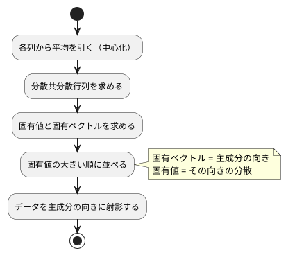

# 第 13 章: 主成分分析による次元削減

## 13.1 はじめに

ここまでの章では、正解ラベルのあるデータで予測をしてきました。この章から扱う **教師なし学習** では、正解ラベルを使わずに、データそのものの構造を調べます。

最初に扱うのは **主成分分析（PCA）** です。住宅価格のデータには 15 個もの列がありますが、列どうしは互いに関係しあっていて、実際にはもっと少ない数の「軸」で大部分を説明できることがあります。主成分分析は、データのばらつきを最もよく説明する新しい軸を探し、たくさんの列を少数の軸に要約します。

[Python 版の第 13 章](../python/13-principal-component-analysis.md)・[Kotlin 版の第 13 章](../kotlin/13-principal-component-analysis.md)・[TypeScript 版の第 13 章](../typescript/13-principal-component-analysis.md) と同じ題材と TODO リストで進めます。他の版は固有値分解だけをライブラリ（NumPy・Tribuo・ml-matrix）に任せました。F# 版では、固有値分解も **ヤコビ法** で自作し、最後に FSharp.Stats の `PCA.compute` と突き合わせます。F# 版で注目する点は次の 3 つです。

- 行列を `float[][]`（配列の配列）で表し、転置・内積・積を `Array` モジュールの関数の組み合わせで書く
- 固有ベクトルの **符号** のように「どちらでも正しい」ものを、テストで仕様として固定する。テストが偶然通っていないかを確かめる
- FSharp.Stats の `PCA.compute` の振る舞い（名前と違う値を返すプロパティ、標準出力への書き出し）を学習用テストで確かめてから使う

## 13.2 主成分分析とは

### ばらつきが最も大きい方向を探す

2 つの列が強く相関しているデータを散布図にすると、点は斜めの帯のように並びます。このとき、帯に沿った方向の 1 本の軸を取れば、2 つの列の情報をほぼ 1 つの数値で表せます。この「ばらつき（分散）が最も大きい方向」が **第 1 主成分** です。第 2 主成分は、第 1 主成分と直交する方向のうち、ばらつきが最も大きい方向です。

### 分散共分散行列の固有ベクトル

主成分は、次の手順で求められます。



**分散共分散行列** は、対角に各列の分散、それ以外に 2 列の共分散を並べた行列です。この行列の **固有ベクトル** が主成分の向き、**固有値** がその向きのデータの分散になります。行列 `A` の固有ベクトル `v` と固有値 `λ` は、`A v = λ v`（`A` を掛けても向きが変わらず、長さだけが `λ` 倍になる）を満たします。

### 寄与率

各主成分の固有値を、固有値の合計で割った値を **寄与率** と呼びます。その主成分が、データ全体のばらつきのうち何割を説明しているかを表します。第 1 主成分から順に寄与率を足したものが **累積寄与率** です。「累積寄与率が 0.8 に届くまでの主成分を使う」のように、残す軸の数を決める目安に使います。

## 13.3 題材とデータ

この章では、他の版と同じ `Boston.csv`（100 件）を、住宅価格 `PRICE` も含めたすべての列で使います。

| 列の種類 | 列 | 注意点 |
|---------|-----|--------|
| 数値 | ZN, INDUS, CHAS, NOX, RM, AGE, DIS, RAD, TAX, PTRATIO, B, LSTAT, PRICE | NOX と RAD に欠損値が 1 件ずつある |
| カテゴリ | CRIME | `high`・`low`・`very_low` の 3 種類の文字列 |

主成分分析は数値しか扱えず、欠損値があると計算できません。また、列ごとに単位や桁（TAX は数百、NOX は 1 未満）が違うと、桁の大きい列のばらつきが主成分を支配してしまいます。そこで次の前処理をしてから主成分分析をします。

1. 欠損値を列の平均値で補完する（第 2 章の `columnMeans`・`fillMissing` を再利用する）
2. CRIME をダミー変数（`low`・`very_low` の 2 列）に置き換える
3. すべての列を平均 0・標準偏差 1 に標準化する

この章は、訓練データとテストデータに分けず、乱数も使いません。前処理と固有値分解が他の版と同じ計算をしていれば、表示される値も他の版と一致するはずです。

## 13.4 TODO リストの作成

**TODO リスト**:

- [ ] 分散共分散行列を求める
  - [ ] 2 列の分散と共分散を並べる
  - [ ] 3 列でも各列の分散と 2 列ずつの共分散を並べる
- [ ] 対称行列の固有値分解を自作する
  - [ ] 対角行列なら対角成分が固有値になる
  - [ ] 対角成分以外が 0 でない行列でも固有ベクトルを求める
- [ ] 主成分を求める
  - [ ] 完全に相関する 2 列なら第 1 主成分だけで分散をすべて説明する
  - [ ] 寄与率の大きい順に、指定した数だけ並ぶ
  - [ ] 主成分の向き（符号）をそろえる
  - [ ] 主成分が固有ベクトルの性質を満たす
- [ ] データを主成分の向きに射影する
- [ ] 累積寄与率がしきい値に届く主成分の数を求める
- [ ] 主成分への影響が大きい列を求める
- [ ] Boston を前処理する（欠損値の補完・ダミー変数・標準化）
- [ ] 実データで寄与率と主成分の意味を表示する
- [ ] FSharp.Stats の PCA と突き合わせる

## 13.5 分散共分散行列を求める

### 行列を配列の配列で表す

行列は `float[][]`（`float` の配列の配列）で表し、外側の配列の 1 要素を 1 行（1 件のデータ）にします。第 2・3 章の `Map<string, float>` は列名で値を引くのに向いていましたが、この章では転置や積のような行列の計算が中心になるので、位置で引ける配列にします。列名は、必要な場面で別に持ちます。

### Red

`[1, 3, 5]` と `[2, 6, 10]` の 2 列は、2 列目がちょうど 1 列目の 2 倍です。分散は n − 1 で割ると 4 と 16、共分散は 8 になります。

```fsharp
// tests/MachineLearning.Tests/Chapter13/PcaTest.fs
module MachineLearning.Tests.Chapter13.PcaTest

open Xunit
open MachineLearning.Chapter13.Pca

/// 要素ごとに許容誤差を付けて行列を比べる
let assertMatrixEqual (expected: float[][]) (actual: float[][]) =
    Assert.Equal(expected.Length, actual.Length)

    Array.iter2
        (fun (expectedRow: float[]) (actualRow: float[]) ->
            Assert.Equal(expectedRow.Length, actualRow.Length)
            Array.iter2 (fun (e: float) (a: float) -> Assert.Equal(e, a, 1e-9)) expectedRow actualRow)
        expected
        actual

[<Fact>]
let ``2 列の分散と共分散を並べた行列を返す`` () =
    let x = [| [| 1.0; 2.0 |]; [| 3.0; 6.0 |]; [| 5.0; 10.0 |] |]

    assertMatrixEqual [| [| 4.0; 8.0 |]; [| 8.0; 16.0 |] |] (covarianceMatrix x)
```

- `[| ...; ... |]` は配列のリテラルです。リスト `[ ... ]` と違い、位置による参照（`x[i]`）が定数時間でできます
- `Assert.Equal(e, a, 1e-9)` の 3 つ目の引数に `float` を渡すと、「差が 1e-9 以内なら等しい」とみなす許容誤差になります。第 3 章で使った `int` の引数（小数第何位まで比べるか）とは別の多重定義です
- `Array.iter2` は、2 つの配列を先頭から組にして、組ごとに関数を実行します。長さが違うと例外になるので、先に長さを比べています

```text
error FS0039: 名前空間 'Chapter13' が定義されていません。
error FS0039: 値またはコンストラクター 'covarianceMatrix' が定義されていません。
```

### Green: 仮実装から三角測量へ

期待する行列をそのまま返す仮実装で Green にします。

```fsharp
// src/MachineLearning/Chapter13/Pca.fs
module MachineLearning.Chapter13.Pca

let covarianceMatrix (x: float[][]) : float[][] = [| [| 4.0; 8.0 |]; [| 8.0; 16.0 |] |]
```

三角測量には、手で計算できる 3 列の例を用意します。3 列目 `[0, 1, 5]` の平均は 2、平均との差は `[-2, -1, 3]` です。1 列目の差 `[-2, 0, 2]` との積の和は 10 なので共分散は 10 / 2 = 5、2 乗の和は 14 なので分散は 7 になります。

```fsharp
[<Fact>]
let ``3 列でも各列の分散と 2 列ずつの共分散を並べる`` () =
    let x = [| [| 1.0; 2.0; 0.0 |]; [| 3.0; 6.0; 1.0 |]; [| 5.0; 10.0; 5.0 |] |]

    assertMatrixEqual [| [| 4.0; 8.0; 5.0 |]; [| 8.0; 16.0; 10.0 |]; [| 5.0; 10.0; 7.0 |] |] (covarianceMatrix x)
```

```text
失敗 MachineLearning.Tests.Chapter13.PcaTest.3 列でも各列の分散と 2 列ずつの共分散を並べる (4ms)
  Assert.Equal() Failure: Values differ
  Expected: 3
  Actual:   2
```

失敗したのは、`assertMatrixEqual` の最初の行数の比較です。

中心化した行列を `Xc` とすると、分散共分散行列の `(i, j)` 要素は「`Xc` の i 列目と j 列目の内積 / (n − 1)」です。列を取り出しやすいように転置してから、列の組ごとに内積を取ります。

```fsharp
/// 列ごとの平均。x の 1 行が 1 件のデータを表す
let columnMeans (x: float[][]) : float[] =
    x |> Array.transpose |> Array.map Array.average

/// 2 つのベクトルの内積
let dot (a: float[]) (b: float[]) : float = Array.map2 (*) a b |> Array.sum

let covarianceMatrix (x: float[][]) : float[][] =
    let means = columnMeans x
    let centered = x |> Array.map (fun row -> Array.map2 (-) row means)
    let columns = Array.transpose centered
    let n = float x.Length

    columns
    |> Array.map (fun a -> columns |> Array.map (fun b -> dot a b / (n - 1.0)))
```

- `Array.transpose` は、配列の配列の行と列を入れ替えます。行列の転置そのものです
- `Array.map2 (*) a b` は、2 つの配列の同じ位置の要素を掛けた配列を返します。`(*)` のように演算子をかっこで囲むと、2 引数の関数として渡せます。`Array.map2 (-) row means` も同じ書き方で、行の各要素から列の平均を引いています
- 外側の `Array.map` が i 列目、内側の `Array.map` が j 列目を受け持ち、2 重のループを書かずに `(i, j)` 要素を並べています

```text
テストの実行の概要: 成功!
```

## 13.6 固有値分解を自作する

### ヤコビ法の考え方

他の版は、固有値分解をライブラリに任せました。FSharp.Stats にも固有値分解はありますが、F# 版では、主成分分析のすべての手順を自分の手で書いてから、ライブラリと突き合わせることにします。

分散共分散行列は **対称行列**（`(i, j)` 要素と `(j, i)` 要素が等しい）です。対称行列の固有値分解には、**ヤコビ法** という素直な方法があります。

- 対角行列（対角成分以外がすべて 0）なら、対角成分がそのまま固有値で、固有ベクトルは座標軸の向き（`(1, 0, 0)` など）になる
- 対角行列でなければ、2 つの軸 p・q の平面で座標を少し回転させて、`(p, q)` 要素を 0 にする。回転しても固有値は変わらない
- 回転を繰り返すと、対角成分以外がどんどん 0 に近づく。最後に対角成分が固有値、それまでの回転を掛け合わせた行列の列が固有ベクトルになる

固有ベクトルを 1 本ずつ求める **べき乗法**（行列を何度も掛けて、最も伸びる向きに近づける）もよく知られていますが、固有値どうしが近いと収束が遅くなります。Boston の寄与率には 0.0645 と 0.0623 のような近い値があるので、すべての固有値をまとめて求めるヤコビ法を選びます。

### 対角行列から始める

最初のテストは、回転が要らない対角行列です。対角成分 1・5・3 の行列なら、固有値は大きい順に 5・3・1 で、最大の固有値の固有ベクトルは 2 番目の座標軸 `(0, 1, 0)` です。

```fsharp
// tests/MachineLearning.Tests/Chapter13/EigenTest.fs
module MachineLearning.Tests.Chapter13.EigenTest

open Xunit
open MachineLearning.Chapter13.Eigen

let assertVectorEqual (expected: float[]) (actual: float[]) =
    Assert.Equal(expected.Length, actual.Length)
    Array.iter2 (fun (e: float) (a: float) -> Assert.Equal(e, a, 1e-9)) expected actual

[<Fact>]
let ``対角行列なら対角成分が固有値で、大きい順に並ぶ`` () =
    let diagonal = [| [| 1.0; 0.0; 0.0 |]; [| 0.0; 5.0; 0.0 |]; [| 0.0; 0.0; 3.0 |] |]

    let pairs = symmetricEigen diagonal

    assertVectorEqual [| 5.0; 3.0; 1.0 |] (pairs |> List.map (fun pair -> pair.Value) |> List.toArray)
    assertVectorEqual [| 0.0; 1.0; 0.0 |] pairs[0].Vector
```

```text
error FS0039: 名前空間 'Eigen' が定義されていません。
error FS0039: 値またはコンストラクター 'symmetricEigen' が定義されていません。
error FS0072: このプログラムの場所の前方にある情報に基づく不確定の型のオブジェクトに対する参照です。場合によっては、オブジェクトの型を制約する型の注釈がこのプログラムの場所の前に必要です。この操作で参照が解決される可能性があります。
```

FS0072 は、`symmetricEigen` が無いために `pairs` の型が分からず、`pair.Value` のプロパティを解決できなかったことによる連鎖的なエラーです（第 3 章で見たものと同じです）。

固有値と固有ベクトルの組をレコードにし、対角成分を並べ替えるだけの実装で Green にします。

```fsharp
// src/MachineLearning/Chapter13/Eigen.fs
module MachineLearning.Chapter13.Eigen

/// 固有値と、それに対応する長さ 1 の固有ベクトル
type EigenPair = { Value: float; Vector: float[] }

let private unitVector (n: int) (i: int) : float[] =
    Array.init n (fun j -> if i = j then 1.0 else 0.0)

/// 対称行列の固有値と固有ベクトルを、固有値の大きい順に返す
let symmetricEigen (a: float[][]) : EigenPair list =
    let n = a.Length

    [ 0 .. n - 1 ]
    |> List.map (fun i ->
        {
            Value = a[i][i]
            Vector = unitVector n i
        })
    |> List.sortByDescending (fun pair -> pair.Value)
```

- `Array.init n f` は、長さ `n` の配列を、位置 `i` から `f i` で要素を作って組み立てます
- `List.sortByDescending` は、関数が返す値の大きい順に並べ替えます

### 三角測量: 対角成分以外が 0 でない行列

対称行列 `[[2, 1], [1, 2]]` の固有値は 3 と 1 です。固有ベクトルの具体的な値を書く代わりに、固有ベクトルの定義 `A v = λ v` をそのままテストにします。

```fsharp
/// 行列とベクトルの積
let multiply (a: float[][]) (v: float[]) : float[] =
    a |> Array.map (fun row -> Array.map2 (*) row v |> Array.sum)

[<Fact>]
let ``対角成分以外が 0 でない行列でも、掛けると固有値倍になるベクトルを求める`` () =
    let symmetric = [| [| 2.0; 1.0 |]; [| 1.0; 2.0 |] |]

    let pairs = symmetricEigen symmetric

    assertVectorEqual [| 3.0; 1.0 |] (pairs |> List.map (fun pair -> pair.Value) |> List.toArray)

    for pair in pairs do
        assertVectorEqual (pair.Vector |> Array.map (fun v -> pair.Value * v)) (multiply symmetric pair.Vector)
```

```text
失敗 MachineLearning.Tests.Chapter13.EigenTest.対角成分以外が 0 でない行列でも、掛けると固有値倍になるベクトルを求める (9ms)
  Assert.Equal() Failure: Values are not within tolerance 1.0000000000000001E-09
  Expected: 3
  Actual:   2
```

対角成分の 2 をそのまま固有値として返しているので失敗しました。ここで回転を実装します。

### Green: 回転を繰り返す

```fsharp
/// 対角成分以外の 2 乗和がこれ以下になったら、対角行列になったとみなす
[<Literal>]
let Tolerance = 1e-24

/// 回転を繰り返す回数の上限（すべての非対角成分を 1 回ずつ回すのを 1 巡とする）
[<Literal>]
let MaxSweeps = 100

let private identity (n: int) : float[][] =
    Array.init n (fun i -> Array.init n (fun j -> if i = j then 1.0 else 0.0))

let private multiply (a: float[][]) (b: float[][]) : float[][] =
    let columns = Array.transpose b

    a
    |> Array.map (fun row -> columns |> Array.map (fun column -> Array.map2 (*) row column |> Array.sum))

/// 対角成分以外の要素の 2 乗和。0 に近いほど対角行列に近い
let private offDiagonal (a: float[][]) : float =
    seq {
        for i in 0 .. a.Length - 1 do
            for j in 0 .. a.Length - 1 do
                if i <> j then
                    yield a[i][j] * a[i][j]
    }
    |> Seq.sum
```

- `seq { ... }` は **シーケンス式** で、`for` と `if` で要素を 1 つずつ `yield` します。2 重の `for` の中で条件に合う要素だけを取り出す処理を、ループの見た目のまま書けます
- `identity` は単位行列、`multiply` は行列の積です。積は「左の行列の行」と「右の行列の列」の内積を並べたものなので、右の行列を転置して列を取り出しています

回転の角度は、`(p, q)` 要素がちょうど 0 になるように決めます。式の導出は線形代数の教科書に譲り、ここでは数値計算の定番の書き方（誤差が出にくい、角度の正接 `t` から cos・sin を求める方法）を使います。

```fsharp
/// (p, q) 要素と (q, p) 要素を 0 にする、p・q の 2 つの軸の平面での回転行列
let private rotation (a: float[][]) (p: int) (q: int) : float[][] =
    let theta = (a[q][q] - a[p][p]) / (2.0 * a[p][q])

    let t =
        (if theta >= 0.0 then 1.0 else -1.0) / (abs theta + sqrt (theta * theta + 1.0))

    let c = 1.0 / sqrt (t * t + 1.0)
    let s = t * c

    identity a.Length
    |> Array.mapi (fun i row ->
        row
        |> Array.mapi (fun j value ->
            if (i, j) = (p, p) || (i, j) = (q, q) then c
            elif (i, j) = (p, q) then s
            elif (i, j) = (q, p) then -s
            else value))
```

回転行列は、単位行列のうち `(p, p)`・`(q, q)`・`(p, q)`・`(q, p)` の 4 か所だけを cos と sin に置き換えたものです。`Array.mapi` は、要素と一緒に位置も関数に渡します。`(i, j) = (p, q)` のように組（タプル）どうしを `=` で比べられるので、「どの位置か」を読みやすく書けます。

1 巡（すべての非対角成分について 1 回ずつ回転する）の処理と、全体の繰り返しは次のとおりです。

```fsharp
/// すべての非対角成分について 1 回ずつ回転する（1 巡）。
/// a は Jᵀ a J に、v は v J に置き換わり、v の列には回転を掛け合わせた結果がたまっていく
let private sweep (a: float[][], v: float[][]) : float[][] * float[][] =
    let n = a.Length

    [
        for p in 0 .. n - 2 do
            for q in p + 1 .. n - 1 do
                p, q
    ]
    |> List.fold
        (fun (a: float[][], v) (p, q) ->
            if a[p][q] = 0.0 then
                a, v
            else
                let j = rotation a p q
                multiply (multiply (Array.transpose j) a) j, multiply v j)
        (a, v)

/// 対角行列に近づくか、上限の回数に達するまで 1 巡を繰り返す
[<TailCall>]
let rec private diagonalize (sweepsLeft: int) (a: float[][], v: float[][]) : float[][] * float[][] =
    if sweepsLeft = 0 || offDiagonal a <= Tolerance then
        a, v
    else
        diagonalize (sweepsLeft - 1) (sweep (a, v))

/// 対称行列の固有値と固有ベクトルを、固有値の大きい順に返す（ヤコビ法）。
/// 回転で対角行列に近づけると、対角成分が固有値、回転を掛け合わせた行列の列が固有ベクトルになる
let symmetricEigen (a: float[][]) : EigenPair list =
    let diagonal, vectors = diagonalize MaxSweeps (a, identity a.Length)
    let columns = Array.transpose vectors

    [ 0 .. a.Length - 1 ]
    |> List.map (fun i ->
        {
            Value = diagonal[i][i]
            Vector = columns[i]
        })
    |> List.sortByDescending (fun pair -> pair.Value)
```

- `[ for p in ... do for q in ... do p, q ]` は **リスト式** で、上三角の位置 `(p, q)` の組をすべて並べます
- `List.fold` は、状態（ここでは行列 `a` と、回転を掛け合わせた `v` の組）を初期値から始めて、要素ごとに更新していきます。行列を書き換えずに、回転のたびに新しい行列を作って次に渡します。`(p, q)` 要素がすでに 0 なら、回転は不要なのでそのまま渡します（`theta` の計算で 0 で割るのも避けられます）
- `let rec diagonalize` は、対角行列に近づくか上限に達するまで 1 巡を繰り返す再帰関数です。`MaxSweeps` は、万一収束しないときに無限に繰り返さないための上限です
- `diagonalize` の再帰呼び出しは、関数の最後に行う **末尾呼び出し** です。`[<TailCall>]` 属性を付けると、末尾呼び出しになっていない再帰呼び出しをコンパイラが警告（FS3569）で知らせます。末尾再帰の関数は、何回繰り返してもスタックを使い切りません（属性の付け方は 13.15 節）
- 行列は 15 × 15 程度なので、回転のたびに行列の積を 3 回計算しても、実行時間は問題になりません。速さより「`Jᵀ A J` を繰り返す」という式との対応の分かりやすさを選びました

```text
テストの実行の概要: 成功!
```

## 13.7 主成分を求める

### 完全に相関する 2 列

最初の 2 列のデータは、点がすべて `(1, 2)` 方向の直線上にあります。したがって第 1 主成分は長さ 1 の `(1, 2) / √5`、寄与率は第 1 主成分が 1、第 2 主成分が 0 になるはずです。

```fsharp
let assertVectorEqual (expected: float[]) (actual: float[]) =
    assertMatrixEqual [| expected |] [| actual |]

[<Fact>]
let ``完全に相関する 2 列なら第 1 主成分だけで分散をすべて説明する`` () =
    let x = [| [| 1.0; 2.0 |]; [| 3.0; 6.0 |]; [| 5.0; 10.0 |] |]

    let model = fitPca 2 x

    assertVectorEqual [| 1.0 / sqrt 5.0; 2.0 / sqrt 5.0 |] model.Components[0]
    assertVectorEqual [| 1.0; 0.0 |] model.ExplainedVarianceRatio
```

`fitPca` は、主成分の数を先、データを後に受け取ります。第 3 章の `fit maxDepth x t` と同じく、設定を先に渡して部分適用できる引数の順にしました。

```text
error FS0039: 値またはコンストラクター 'fitPca' が定義されていません。
error FS0072: このプログラムの場所の前方にある情報に基づく不確定の型のオブジェクトに対する参照です。場合によっては、オブジェクトの型を制約する型の注釈がこのプログラムの場所の前に必要です。この操作で参照が解決される可能性があります。
```

13.2 節の手順をそのまま実装します。固有値の大きい順に並べることは、`symmetricEigen` のテストで確かめ済みです。

```fsharp
open MachineLearning.Chapter13.Eigen

/// 学習した主成分分析のモデル。Components の 1 行が 1 つの主成分を表す
type PcaModel =
    {
        Mean: float[]
        Components: float[][]
        ExplainedVariance: float[]
        ExplainedVarianceRatio: float[]
    }

/// 分散共分散行列の固有値の大きい順に、nComponents 個の主成分を求める
let fitPca (nComponents: int) (x: float[][]) : PcaModel =
    let pairs = symmetricEigen (covarianceMatrix x)
    let total = pairs |> List.sumBy (fun pair -> pair.Value)
    let selected = pairs |> List.truncate nComponents |> List.toArray

    {
        Mean = columnMeans x
        Components = selected |> Array.map (fun pair -> pair.Vector)
        ExplainedVariance = selected |> Array.map (fun pair -> pair.Value)
        ExplainedVarianceRatio = selected |> Array.map (fun pair -> pair.Value / total)
    }
```

- 学習の結果は、不変なレコード `PcaModel` で返します。第 3 章の木と同じく、「学習する前に射影する」という誤りを書けません
- `List.truncate` は、先頭から最大 n 個を取り出します。`List.take` と違い、要素が n 個に満たなくても例外になりません

```text
テストの実行の概要: 成功!
```

### 寄与率の順と、すり抜けた符号のテスト

乱数で作った 4 列の人工データで、寄与率が大きい順に並ぶことを確かめます。2 つの隠れた変数を 4 列に混ぜ、小さなノイズを加えたデータです。Kotlin 版の `nextGaussian()` に当たる正規分布の乱数は .NET の `System.Random` に無いので、一様乱数 2 つから作る **ボックス＝ミュラー法** で作ります。

```fsharp
/// 平均 0・標準偏差 1 の正規分布に従う乱数（ボックス＝ミュラー法）
let gaussian (random: Random) : float =
    sqrt (-2.0 * log (1.0 - random.NextDouble()))
    * cos (2.0 * Math.PI * random.NextDouble())

/// 2 つの隠れた変数を 4 列に混ぜ、小さなノイズを加えた 40 行の架空のデータ
let mixedDataset () : float[][] =
    let random = Random 0
    let mixing = [| [| 2.0; 0.5 |]; [| 0.3; 1.0 |]; [| 1.0; -1.0 |]; [| 0.0; 0.2 |] |]

    Array.init 40 (fun _ ->
        let hidden = [| gaussian random; gaussian random |]

        mixing |> Array.map (fun weights -> dot weights hidden + gaussian random * 0.1))

[<Fact>]
let ``主成分は寄与率の大きい順に指定した数だけ並ぶ`` () =
    let model = fitPca 3 (mixedDataset ())

    let ratios = model.ExplainedVarianceRatio
    Assert.Equal(3, ratios.Length)
    Assert.Equal<float[]>(Array.sortDescending ratios, ratios)
```

- `NextDouble()` は 0 以上 1 未満の一様乱数を返します。`log 0` を避けるため、`1.0 - random.NextDouble()`（0 より大きく 1 以下）の対数を取っています
- `mixedDataset` は、呼ぶたびに `Random 0` から作り直すので、何度呼んでも同じデータを返します

固有ベクトル `v` が主成分の向きなら、逆向きの `−v` も同じ直線を表す固有ベクトルです。どちらの符号が返るかは計算方法によって決まり、決まった規則はありません。他の版と同じく、「絶対値が最大の要素が正になる」ように向きをそろえる、という仕様にします。まず、負の相関を持つ 2 列で第 1 主成分の向きを確かめるテストを書きました。

```fsharp
[<Fact>]
let ``主成分の向きは絶対値が最大の要素が正になるようにそろえる`` () =
    let x = [| [| 1.0; -2.0 |]; [| 3.0; -6.0 |]; [| 5.0; -10.0 |] |]

    let model = fitPca 1 x

    assertVectorEqual [| -1.0 / sqrt 5.0; 2.0 / sqrt 5.0 |] model.Components[0]
```

Red になるはずでしたが、実際には **2 つとも通ってしまいました**。

```text
テストの実行の概要: 成功!
```

寄与率の順は `symmetricEigen` が並べ替えるので通って当然ですが、符号のテストは、向きをそろえる処理がまだ無いのに通っています。自作の固有値分解が、たまたま期待どおりの向きを返しただけです。これでは、仕様を守る実装があることをテストが保証しません。

Red を確認できないテストは、何も確かめていないのと同じです。向きをそろえる前の主成分を、F# スクリプト（`dotnet fsi`）で一時的に表示しました。

```text
PROBE pos [|[|0.4472135955; 0.894427191|]; [|0.894427191; -0.4472135955|]|]
PROBE neg [|[|-0.4472135955; 0.894427191|]; [|0.894427191; 0.4472135955|]|]
```

`pos` は `(1, 2)` 方向、`neg` は `(1, −2)` 方向の直線上のデータです。4 本とも、絶対値が最大の要素が正でした。Kotlin 版で Tribuo が逆向きを返した `pos` の第 2 主成分も、ヤコビ法では正の向きです。

理由は回転の式にあります。2 × 2 の行列なら回転は 1 回で終わり、固有ベクトルは回転行列の列 `(c, −s)` と `(s, c)` そのものです。`t` の絶対値は 1 以下になるように選んでいるので、`c` は `|s|` 以上で、しかも正です。つまり 2 列のデータでは、絶対値が最大の要素は必ず正の `c` になり、負の向きは決して返りません。

2 列では Red にできないので、小さな整数の 4 行 3 列のデータを総当たりで試し、固有値がはっきり分かれていて、向きをそろえる前の主成分に負の向きが現れるデータを探しました。見つかったデータで、すべての主成分の向きを確かめるテストに書き直します。

```fsharp
[<Fact>]
let ``主成分の向きは絶対値が最大の要素が正になるようにそろえる`` () =
    let x =
        [|
            [| 0.0; 0.0; 0.0 |]
            [| 0.0; 2.0; 0.0 |]
            [| 3.0; 0.0; 1.0 |]
            [| 0.0; 3.0; 3.0 |]
        |]

    let model = fitPca 3 x

    for pc in model.Components do
        Assert.True(Array.maxBy abs pc > 0.0, $"%A{pc}")
```

- `Array.maxBy abs pc` は、絶対値が最大の **要素そのもの**（符号付き）を返します
- `Assert.True` の 2 つ目の引数は、失敗したときに表示するメッセージです。`$"%A{pc}"` は、補間文字列の中で `%A`（F# の値をそのまま見やすく表示する書式）を使う書き方です
- 変数名を `component` にしなかったのは、`component` が F# の将来のための **予約語** だからです

```text
失敗 MachineLearning.Tests.Chapter13.PcaTest.主成分の向きは絶対値が最大の要素が正になるようにそろえる (61ms)
  [|0.508339624; -0.7183085388; -0.4749985997|]
```

今度は期待どおり Red になりました。第 1 主成分の、絶対値が最大の要素 −0.718 が負です。各主成分について、絶対値が最大の要素の符号（+1 か −1）を行全体に掛ける `normalizeSigns` を実装し、`fitPca` から使います。

```fsharp
/// 固有ベクトルは符号が逆でも同じ向きを表すので、絶対値が最大の要素が正になるようにそろえる
let normalizeSigns (components: float[][]) : float[][] =
    components
    |> Array.map (fun pc ->
        let largest = pc |> Array.maxBy abs
        pc |> Array.map (fun value -> value * float (sign largest)))
```

```fsharp
        Components = selected |> Array.map (fun pair -> pair.Vector) |> normalizeSigns
```

F# の `sign` は `int`（1・0・−1）を返します。`float` と `int` は暗黙に変換されないので、`float (sign largest)` で `float` にしてから掛けています。

```text
テストの実行の概要: 成功!
```

`normalizeSigns` にも、他の版と同じ専用のテストを足して振る舞いを固定します。

```fsharp
[<Fact>]
let ``絶対値が最大の要素が正になるように主成分の向きをそろえる`` () =
    let components = [| [| 0.6; -0.8 |]; [| -0.8; 0.6 |] |]

    assertMatrixEqual [| [| -0.6; 0.8 |]; [| 0.8; -0.6 |] |] (normalizeSigns components)
```

### 性質をテストにする

主成分分析の結果が満たすべき **性質** もテストにします。自作の固有値分解を、特定の例の値ではなく数学的な性質で確かめます。

- 主成分は長さ 1 で、互いに直交する。主成分を並べた行列 `C` と転置の積 `C Cᵀ` は単位行列になる
- 主成分 `v` は分散共分散行列 `A` の固有ベクトルで、`A v` は `v` の「その主成分の分散」倍になる

```fsharp
/// 行列の積
let multiply (a: float[][]) (b: float[][]) : float[][] =
    let columns = Array.transpose b
    a |> Array.map (fun row -> columns |> Array.map (dot row))

[<Fact>]
let ``主成分は長さ 1 で互いに直交する`` () =
    let model = fitPca 3 (mixedDataset ())

    let gram = multiply model.Components (Array.transpose model.Components)

    assertMatrixEqual (Array.init 3 (fun i -> Array.init 3 (fun j -> if i = j then 1.0 else 0.0))) gram

[<Fact>]
let ``主成分は分散共分散行列に掛けると分散の倍数になる固有ベクトル`` () =
    let x = mixedDataset ()

    let model = fitPca 3 x

    let covariance = covarianceMatrix x

    Array.iter2
        (fun (pc: float[]) variance ->
            assertVectorEqual (pc |> Array.map (fun v -> v * variance)) (covariance |> Array.map (dot pc)))
        model.Components
        model.ExplainedVariance
```

`covariance |> Array.map (dot pc)` は、行列の各行と `pc` の内積を並べたもの、つまり行列とベクトルの積です。`dot pc` は `dot` に 1 つ目の引数だけを渡した **部分適用** で、「`pc` との内積を取る関数」になります。

どちらのテストも、実装を変えずに通ります。ヤコビ法が正しく動いていれば満たされる性質なので、あとで固有値分解の実装を差し替えたときの安全網になります。

## 13.8 データを主成分の向きに射影する

データを主成分の軸で表し直すには、平均を引いてから主成分の向きとの内積を取ります。平均が `(1, 2)`、主成分が `(0.6, 0.8)` のモデルに `(2, 3)` を渡すと、`(1, 1)` と `(0.6, 0.8)` の内積で 1.4 になります。

```fsharp
[<Fact>]
let ``平均を引いてから主成分の向きに射影する`` () =
    let model =
        {
            Mean = [| 1.0; 2.0 |]
            Components = [| [| 0.6; 0.8 |] |]
            ExplainedVariance = [| 1.0 |]
            ExplainedVarianceRatio = [| 1.0 |]
        }

    assertMatrixEqual [| [| 1.4 |]; [| 0.0 |] |] (transform model [| [| 2.0; 3.0 |]; [| 1.0; 2.0 |] |])
```

テストの `PcaModel` は、学習を経由せずにレコード式で直接組み立てています。F# は、フィールドの名前の組み合わせから `PcaModel` 型だと推論します。

## 13.9 必要な主成分の数を求める

寄与率が `[0.5, 0.25, 0.25]` のとき、累積寄与率は `[0.5, 0.75, 1.0]` です。しきい値 0.75 に届くのは 2 つ目です。射影のテストと一緒に書きました。

```fsharp
[<Fact>]
let ``累積寄与率がしきい値に届くまでの主成分の数を返す`` () =
    Assert.Equal(2, componentsNeeded 0.75 [| 0.5; 0.25; 0.25 |])
```

```text
error FS0039: 値またはコンストラクター 'transform' が定義されていません。
error FS0039: 値またはコンストラクター 'componentsNeeded' が定義されていません。 次のいずれかの可能性はありませんか:   ComponentModel   ComparisonIdentity
```

`transform` は明白な実装、`componentsNeeded` は 2 を返す仮実装で Green にします。

```fsharp
/// 平均を引いてから、主成分ごとの座標（主成分の向きとの内積）に変換する
let transform (model: PcaModel) (x: float[][]) : float[][] =
    x
    |> Array.map (fun row ->
        let centered = Array.map2 (-) row model.Mean
        model.Components |> Array.map (dot centered))

let componentsNeeded (threshold: float) (ratios: float[]) : int = 2
```

しきい値を 0.8 に上げると 3 つ必要になる例で三角測量します。

```fsharp
[<Fact>]
let ``しきい値を上げると必要な主成分の数が増える`` () =
    Assert.Equal(3, componentsNeeded 0.8 [| 0.5; 0.25; 0.25 |])
```

```text
  Assert.Equal() Failure: Values differ
  Expected: 3
  Actual:   2
```

`Array.scan` で累積和を取り、しきい値に届く最初の位置を `Array.findIndex` で求めます。

```fsharp
/// 累積寄与率がしきい値に届くまでに必要な主成分の数
let componentsNeeded (threshold: float) (ratios: float[]) : int =
    ratios |> Array.scan (+) 0.0 |> Array.findIndex (fun sum -> sum >= threshold)
```

`Array.scan (+) 0.0` は、`fold` の途中経過を **初期値も含めて** すべて並べます。`[0.5, 0.25, 0.25]` なら `[0.0, 0.5, 0.75, 1.0]` です。先頭に初期値の 0.0 が入るので、しきい値に届いた位置（0 から数える）がそのまま主成分の数になります。Kotlin 版の `runningReduce` は初期値を含まないので、位置に 1 を足していました。

あわせて、`covarianceMatrix` と `transform` に同じ中心化の処理が重複していたので、`private` な関数に切り出しました。

```fsharp
/// 各行から列の平均を引く（中心化）
let private center (means: float[]) (x: float[][]) : float[][] =
    x |> Array.map (fun row -> Array.map2 (-) row means)

let covarianceMatrix (x: float[][]) : float[][] =
    let columns = x |> center (columnMeans x) |> Array.transpose
    let n = float x.Length

    columns
    |> Array.map (fun a -> columns |> Array.map (fun b -> dot a b / (n - 1.0)))
```

```fsharp
/// 平均を引いてから、主成分ごとの座標（主成分の向きとの内積）に変換する
let transform (model: PcaModel) (x: float[][]) : float[][] =
    x
    |> center model.Mean
    |> Array.map (fun row -> model.Components |> Array.map (dot row))
```

`center` は平均を先、データを後に受け取るので、`x |> center means` とパイプラインの途中に置けます。

```text
テストの実行の概要: 成功!
```

## 13.10 主成分への影響が大きい列を求める

主成分の各要素は、元の列がその主成分にどれだけ強く関わるかを表します。絶対値の大きい順に列名を並べると、主成分の意味を読み取る手がかりになります。

```fsharp
[<Fact>]
let ``係数の絶対値が大きい順に列名と係数を返す`` () =
    let pc = [| 0.1; -0.7; 0.5 |]

    Assert.Equal<(string * float) list>([ "DIS", -0.7; "TAX", 0.5 ], topLoadings 2 [ "ZN"; "DIS"; "TAX" ] pc)
```

```text
error FS0039: 値またはコンストラクター 'topLoadings' が定義されていません。
```

```fsharp
/// 主成分の係数の絶対値が大きい順に、上位 k 個の列名と係数を返す
let topLoadings (k: int) (columns: string list) (pc: float[]) : (string * float) list =
    List.zip columns (List.ofArray pc)
    |> List.sortByDescending (fun (_, value) -> abs value)
    |> List.truncate k
```

`List.zip` で列名と係数の組を作り、係数の絶対値が大きい順に並べます。ラムダの引数 `(_, value)` は組を分解し、使わない列名を `_` で読み飛ばしています。

```text
テストの実行の概要: 成功!
```

## 13.11 Boston を前処理する

### ダミー変数

前処理は `src/MachineLearning/Chapter13/BostonStandardized.fs` に分けます。1 行は、第 2 章の iris と同じく「列名から `float option` への `Map`」とカテゴリの文字列で表します。テストには、CRIME の 3 種類と欠損値を含む 4 行の架空のデータを使います。

```fsharp
// tests/MachineLearning.Tests/Chapter13/BostonStandardizedTest.fs
module MachineLearning.Tests.Chapter13.BostonStandardizedTest

open Xunit
open MachineLearning.Chapter13.BostonStandardized

let bostonLike: BostonRow list =
    [
        "high", Some 5.0, 10.0
        "low", Some 6.0, 20.0
        "very_low", None, 30.0
        "low", Some 7.0, 40.0
    ]
    |> List.map (fun (crime, rm, price) ->
        {
            Features = Map.ofList [ "RM", rm; "PRICE", Some price ]
            Crime = crime
        })

[<Fact>]
let ``CRIME をダミー変数の列に置き換える`` () =
    let table = standardizeBoston [ "RM"; "PRICE" ] bostonLike

    Assert.Equal<string list>([ "RM"; "PRICE"; "low"; "very_low" ], table.Columns)
```

`standardizeBoston` は、数値の列の名前を引数で受け取ります。`Map` のキーは名前の順（`PRICE` が `RM` より先）に並ぶので、元の CSV の列の順を保つには、列の順を別に渡す必要があるからです。

```text
error FS0039: 名前空間 'BostonStandardized' が定義されていません。
error FS0039: 型 'BostonRow' が定義されていません。
error FS0039: レコード ラベル 'Features' が定義されていません。
error FS0039: レコード ラベル 'Crime' が定義されていません。
error FS0039: 値またはコンストラクター 'standardizeBoston' が定義されていません。
```

まず、補完とダミー変数だけを実装します。欠損値の補完は、第 2 章の `columnMeans`・`fillMissing` をそのまま使います。カテゴリを名前の順に並べて最初の `high` を除き、残りの `low`・`very_low` の列を足します。`low` も `very_low` も 0 なら `high` だと分かるので、3 列目は情報として重複するからです。

```fsharp
// src/MachineLearning/Chapter13/BostonStandardized.fs
module MachineLearning.Chapter13.BostonStandardized

open MachineLearning.Chapter02.IrisPreprocessing

/// 数値の特徴量（列名から値への Map、空欄は None）とカテゴリの列 CRIME
type BostonRow =
    {
        Features: Map<string, float option>
        Crime: string
    }

/// 列名と、1 行を数値の配列で表したデータ
type NumericTable = { Columns: string list; X: float[][] }

/// 欠損値を列の平均値で補完し、CRIME をダミー変数の列に置き換える
let standardizeBoston (columns: string list) (rows: BostonRow list) : NumericTable =
    let features = rows |> List.map (fun row -> row.Features)
    let filled = fillMissing (columnMeans features) features
    let crime = rows |> List.map (fun row -> row.Crime)
    // 名前の順で最初のカテゴリ（high）は、ほかのダミー変数がすべて 0 であることで表せるので除く
    let categories = crime |> List.distinct |> List.sort |> List.tail

    let x =
        List.map2
            (fun (row: Map<string, float>) value ->
                Array.append
                    (columns |> List.map (fun column -> row[column]) |> List.toArray)
                    (categories
                     |> List.map (fun category -> if value = category then 1.0 else 0.0)
                     |> List.toArray))
            filled
            crime

    {
        Columns = columns @ categories
        X = List.toArray x
    }
```

第 2 章の `columnMeans` は `Map<string, float option> list` を受け取る関数で、この章の `Pca.columnMeans`（`float[][]` を受け取る）とは別物です。このファイルでは `Pca` モジュールを開いていないので、名前はぶつかりません。

```text
テストの実行の概要: 成功!
```

### 補完と標準化

次に、標準化を求めるテストを足します。標準偏差は、他の版と同じく件数 n で割ります。

```fsharp
[<Fact>]
let ``欠損値を補完してから各列を平均 0 と標準偏差 1 にそろえる`` () =
    let table = standardizeBoston [ "RM"; "PRICE" ] bostonLike

    for values in Array.transpose table.X do
        let mean = Array.average values
        let std = sqrt (values |> Array.averageBy (fun v -> (v - mean) ** 2.0))
        Assert.Equal(0.0, mean, 1e-9)
        Assert.Equal(1.0, std, 1e-9)
```

```text
  Assert.Equal() Failure: Values are not within tolerance 1.0000000000000001E-09
  Expected: 0
  Actual:   6
```

最初の列 RM（補完後は 5・6・6・7）の平均 6 が、そのまま残っています。

標準化は列ごとの処理なので、行ごとに組み立てる今の書き方では入れにくくなります。「列の値のリスト」を並べてから、列ごとに標準化し、最後に転置して行の並びに戻す形に書き直しました。

```fsharp
/// 平均 0・標準偏差 1 にそろえる（標準偏差は件数 n で割る）
let standardize (values: float[]) : float[] =
    let mean = Array.average values
    let std = sqrt (values |> Array.averageBy (fun v -> (v - mean) ** 2.0))
    values |> Array.map (fun v -> (v - mean) / std)

/// 欠損値を列の平均値で補完し、CRIME をダミー変数の列に置き換えてから、すべての列を標準化する
let standardizeBoston (columns: string list) (rows: BostonRow list) : NumericTable =
    let features = rows |> List.map (fun row -> row.Features)
    let filled = fillMissing (columnMeans features) features
    let crime = rows |> List.map (fun row -> row.Crime)
    // 名前の順で最初のカテゴリ（high）は、ほかのダミー変数がすべて 0 であることで表せるので除く
    let categories = crime |> List.distinct |> List.sort |> List.tail

    let numeric =
        columns |> List.map (fun column -> filled |> List.map (fun row -> row[column]))

    let dummies =
        categories
        |> List.map (fun category -> crime |> List.map (fun value -> if value = category then 1.0 else 0.0))

    {
        Columns = columns @ categories
        X =
            numeric @ dummies
            |> List.map (List.toArray >> standardize)
            |> List.toArray
            |> Array.transpose
    }
```

- `numeric` と `dummies` は、どちらも「1 列の値のリスト」のリストです。`@` でつなげれば、数値の列とダミー変数の列を同じように扱えます
- `List.toArray >> standardize` は **関数合成** で、「配列にしてから標準化する」関数を 1 つ作っています
- 最後の `Array.transpose` で、列の並びを行の並び（1 行が 1 件）に戻します

```text
テストの実行の概要: 成功!
```

**TODO リスト**:

- [x] 分散共分散行列を求める
  - [x] 2 列の分散と共分散を並べる
  - [x] 3 列でも各列の分散と 2 列ずつの共分散を並べる
- [x] 対称行列の固有値分解を自作する
  - [x] 対角行列なら対角成分が固有値になる
  - [x] 対角成分以外が 0 でない行列でも固有ベクトルを求める
- [x] 主成分を求める
  - [x] 完全に相関する 2 列なら第 1 主成分だけで分散をすべて説明する
  - [x] 寄与率の大きい順に、指定した数だけ並ぶ
  - [x] 主成分の向き（符号）をそろえる
  - [x] 主成分が固有ベクトルの性質を満たす
- [x] データを主成分の向きに射影する
- [x] 累積寄与率がしきい値に届く主成分の数を求める
- [x] 主成分への影響が大きい列を求める
- [x] Boston を前処理する（欠損値の補完・ダミー変数・標準化）
- [ ] 実データで寄与率と主成分の意味を表示する
- [ ] FSharp.Stats の PCA と突き合わせる

## 13.12 実データで要約する

### 型プロバイダで読み込む

`Boston.csv` は、第 2 章と同じく `CsvProvider` で読みます。型の元にするサンプルは、同じ列を持つ架空の値で書きます。

```fsharp
open FSharp.Data

/// 型プロバイダが列の名前と型を知るための、架空の値のサンプル
[<Literal>]
let BostonSample =
    "CRIME,ZN,INDUS,CHAS,NOX,RM,AGE,DIS,RAD,TAX,PTRATIO,B,LSTAT,PRICE\n"
    + "high,0.1,0.1,0.1,,0.1,0.1,0.1,,0.1,0.1,0.1,0.1,0.1"

/// CRIME は文字列、ほかの列は空欄がありうる数値として読む
type BostonCsv =
    CsvProvider<
        BostonSample,
        Schema="string,float option,float option,float option,float option,float option,float option,float option,float option,float option,float option,float option,float option,float option"
     >
```

- `[<Literal>]` の値は、`+` で文字列をつないでもコンパイル時の定数のままです。型プロバイダの引数には定数しか渡せないので、長いサンプルを 2 行に分けて書けます
- `Schema` で、CRIME 以外の 13 列を `float option` として読ませます。第 2 章で確かめたとおり、指定しないと小数を含む列は `decimal` と推論されます

読み込んだ行を `BostonRow` にし、列の順を `NumericColumns` で渡して前処理します。

```fsharp
let NumericColumns =
    [
        "ZN"
        "INDUS"
        "CHAS"
        "NOX"
        "RM"
        "AGE"
        "DIS"
        "RAD"
        "TAX"
        "PTRATIO"
        "B"
        "LSTAT"
        "PRICE"
    ]

let loadBoston (csvFile: string) : BostonRow list =
    BostonCsv.Load(csvFile).Rows
    |> Seq.map (fun row ->
        {
            Features =
                Map.ofList
                    [
                        "ZN", row.ZN
                        "INDUS", row.INDUS
                        "CHAS", row.CHAS
                        "NOX", row.NOX
                        "RM", row.RM
                        "AGE", row.AGE
                        "DIS", row.DIS
                        "RAD", row.RAD
                        "TAX", row.TAX
                        "PTRATIO", row.PTRATIO
                        "B", row.B
                        "LSTAT", row.LSTAT
                        "PRICE", row.PRICE
                    ]
            Crime = row.CRIME
        })
    |> Seq.toList

let loadStandardizedBoston (csvFile: string) : NumericTable =
    loadBoston csvFile |> standardizeBoston NumericColumns
```

`row.ZN` や `row.CRIME` は、型プロバイダがサンプルの見出しから作ったプロパティです。列名を打ち間違えると、実行時ではなくコンパイル時にエラーになります。

### 表示のテストを先に書く

この章は分割も乱数も使わないので、前処理と固有値分解が他の版と同じ計算をしていれば、表示される値も一致するはずです。そこで、Kotlin 版の出力を期待値にして、表示のテストを先に書きました。

```fsharp
// tests/MachineLearning.Tests/Chapter13/BostonPcaDataTest.fs
let csvFile = Path.Combine(dataDir (), "Boston.csv")

/// 学習データが無ければテストをスキップする
let requireData () =
    Assert.SkipUnless(File.Exists csvFile, "学習データ Boston.csv が配置されていない（gulp data:setup）")

[<Fact>]
let ``CRIME をダミー変数にして 15 列の標準化済みデータにする`` () =
    requireData ()

    let table = loadStandardizedBoston csvFile

    Assert.Equal((100, 15), (table.X.Length, table.Columns.Length))

[<Fact>]
let ``実データの主成分も分散共分散行列の固有ベクトルになる`` () =
    requireData ()
    let x = (loadStandardizedBoston csvFile).X

    let model = fitPca 15 x

    let covariance = covarianceMatrix x

    Array.iter2
        (fun (pc: float[]) variance ->
            Array.iter2
                (fun (v: float) (av: float) -> Assert.Equal(v * variance, av, 1e-9))
                pc
                (covariance |> Array.map (dot pc)))
        model.Components
        model.ExplainedVariance

    Assert.Equal(1.0, Array.sum model.ExplainedVarianceRatio, 1e-9)

[<Fact>]
let ``実行すると寄与率と主成分の解釈を表示する`` () =
    requireData ()
    let lines = ResizeArray<string>()

    MachineLearning.Chapter13.Main.run lines.Add

    Assert.Equal<string seq>(
        [
            "データ件数: 100, 列数: 15"
            "寄与率: PC1 0.4110, PC2 0.1448, PC3 0.1019, PC4 0.0645, PC5 0.0623, PC6 0.0581"
            "累積寄与率が 0.8 に届く主成分の数: 6（累積寄与率 0.8427）"
            "第 1 主成分で影響の大きい列: INDUS 0.359, NOX 0.350, TAX 0.328"
            "第 2 主成分で影響の大きい列: PRICE 0.444, low 0.423, RM 0.405"
        ],
        lines
    )
```

`Assert.Equal((100, 15), (...))` のように、件数と列数を組にしてまとめて比べています。組は値として等しいかどうかを比べられます。

```text
error FS0039: 値、コンストラクター、名前空間、または型 'Main' が定義されていません。
```

### 結果を表示する

```fsharp
// src/MachineLearning/Chapter13/Main.fs
module MachineLearning.Chapter13.Main

open System.IO
open MachineLearning.Dataset
open MachineLearning.Chapter13.BostonStandardized
open MachineLearning.Chapter13.Pca

[<Literal>]
let Threshold = 0.8

[<Literal>]
let TopK = 3

[<Literal>]
let ComponentsToExplain = 2

let private formatLoadings (loadings: (string * float) list) : string =
    loadings
    |> List.map (fun (column, value) -> $"{column} {value:F3}")
    |> String.concat ", "

/// Boston.csv を標準化して主成分分析し、寄与率と主成分への影響が大きい列を表示する
let run (print: string -> unit) : unit =
    let table = loadStandardizedBoston (Path.Combine(dataDir (), "Boston.csv"))
    let model = fitPca table.Columns.Length table.X
    let ratios = model.ExplainedVarianceRatio
    let needed = componentsNeeded Threshold ratios
    let shown = ratios |> Array.truncate needed
    print $"データ件数: {table.X.Length}, 列数: {table.Columns.Length}"

    shown
    |> Array.mapi (fun i ratio -> $"PC{i + 1} {ratio:F4}")
    |> String.concat ", "
    |> fun text -> print $"寄与率: {text}"

    print $"累積寄与率が {Threshold} に届く主成分の数: {needed}（累積寄与率 {Array.sum shown:F4}）"

    for i in 0 .. ComponentsToExplain - 1 do
        let loadings = topLoadings TopK table.Columns model.Components[i]
        print $"第 {i + 1} 主成分で影響の大きい列: {formatLoadings loadings}"
```

- `Array.mapi` は、要素と一緒に位置を関数に渡します。位置に 1 を足して `PC1`・`PC2` の番号を作っています
- `|> fun text -> print ...` は、パイプラインの最後でラムダに値を渡す書き方です。組み立てた文字列に見出しを付けて表示しています

`Program.fs` の対応表に `"chapter13", Chapter13.Main.run` を加えます。

```text
テストの実行の概要: 成功!
```

3 件とも一度で通りました。表示は Kotlin 版・Python 版と小数第 4 位（係数は第 3 位）まで一致しています。これまでの章では分割の乱数が言語ごとに違うため、数値が他の版と一致しませんでした。この章では同じデータを同じ手順で計算しているので、NumPy の `eigh`・Tribuo の固有値分解・自作のヤコビ法という別々の実装から、同じ主成分と寄与率が得られています。主成分の向きまでそろっているのは、13.7 節の `normalizeSigns` で符号の規則を決めたからです。

### 結果を読む

- **第 1 主成分だけで 4 割を説明する**: 15 列のばらつきのうち 41.1% を、1 本の軸で説明できます
- **15 列を 6 本の軸に要約できる**: 累積寄与率 0.8 を目安にすると、6 つの主成分で全体の 84.3% を説明できます
- **第 1 主成分は「産業化・都市化」の軸と読める**: 非小売業の土地の割合（INDUS）、窒素酸化物の濃度（NOX）、固定資産税率（TAX）が同じ向きに強く効いています
- **第 2 主成分は「住環境のよさ」の軸と読める**: 住宅価格（PRICE）、部屋数（RM）、犯罪率が低い地区（low）が同じ向きに効いています

主成分の「意味」は計算で決まるものではなく、係数を見た人間の解釈です。符号の向きも `normalizeSigns` の規則で決めたものなので、「値が大きいほど都市化している」のか「小さいほど」なのかは、係数の符号とあわせて読む必要があります。

## 13.13 FSharp.Stats の PCA に置き換える

### 学習用テストで振る舞いを確かめる

[ADR 004](../../../adr/004-fsharp-ml-libraries.md) では、この章の置き換え先を FSharp.Stats 0.6.0 の `PCA.compute`（`FSharp.Stats.ML.Unsupervised` 名前空間）と決めました。ドキュメントコメントによると、`compute` は「列ごとに中心化されたデータ行列」を受け取り、次のプロパティを持つ結果を返します。

| プロパティ | ドキュメントコメントの説明 |
|-----------|--------------------------|
| `Loadings` | 列が主成分、行が特徴量の行列（R の `prcomp()` の `rotation`） |
| `PrincipalComponents` | 各データを主成分の向きに射影した値（R の `x`） |
| `VarianceOfComponent` | （説明なし） |
| `VarExplainedByComponentIndividual` | 主成分ごとの説明された分散 |
| `VarExplainedByComponentCumulative` | その累積 |

使う前に、13.7 節の「完全に相関する 2 列」を中心化したデータで、振る舞いを学習用テストで確かめます。`VarianceOfComponent` は名前のとおり主成分の分散（n − 1 で割って 20）を返すと予想しました。

```fsharp
// tests/MachineLearning.Tests/Chapter13/FSharpStatsPcaLearningTest.fs
open FSharp.Stats
open FSharp.Stats.ML.Unsupervised

/// 完全に相関する 2 列を、列の平均を引いて中心化したもの
let centered = matrix [ [ -2.0; -4.0 ]; [ 0.0; 0.0 ]; [ 2.0; 4.0 ] ]

[<Fact>]
let ``Loadings の列が主成分で、寄与率は大きい順に並ぶ`` () =
    let result = PCA.compute centered

    Assert.Equal(1.0 / sqrt 5.0, result.Loadings[0, 0], 1e-9)
    Assert.Equal(2.0 / sqrt 5.0, result.Loadings[1, 0], 1e-9)
    Assert.Equal(1.0, result.VarExplainedByComponentIndividual[0], 1e-9)
    Assert.Equal(0.0, result.VarExplainedByComponentIndividual[1], 1e-9)

[<Fact>]
let ``VarianceOfComponent は n - 1 で割った主成分の分散`` () =
    let result = PCA.compute centered

    Assert.Equal(20.0, result.VarianceOfComponent[0], 1e-9)
```

- `matrix` は、リストのリストから FSharp.Stats の行列型 `Matrix<float>` を作る関数です
- FSharp.Stats の行列は `result.Loadings[i, j]` のように、行と列の位置を 1 つのかっこで指定して要素を取り出します

```text
失敗 MachineLearning.Tests.Chapter13.FSharpStatsPcaLearningTest.VarianceOfComponent は n - 1 で割った主成分の分散 (1ms)
  Assert.Equal() Failure: Values are not within tolerance 1.0000000000000001E-09
  Expected: 20
  Actual:   4.4721359549995787
```

`VarExplainedByComponentIndividual` は、分散そのものではなく **寄与率**（合計が 1）でした。こちらは予想どおりです。一方、`VarianceOfComponent` は 20 ではなく 4.472 を返しました。4.472 は √20、つまり第 1 主成分の **標準偏差** です。R の `prcomp()` の `sdev`（標準偏差）に当たる値が、`Variance` という名前のプロパティで返っています。分かったことをテストに書き直します。

```fsharp
[<Fact>]
let ``VarianceOfComponent は名前に反して分散ではなく標準偏差を返す`` () =
    let result = PCA.compute centered

    // 第 1 主成分の分散（n - 1 で割る）は 20。その平方根が返る
    Assert.Equal(sqrt 20.0, result.VarianceOfComponent[0], 1e-9)
```

使い捨ての F# スクリプトで試したときには、ほかに 2 つのことに気づきました。

- `compute` を呼ぶと、`t : 6.32455532 - f: 5.656854249` のような途中の値が **標準出力に書き出される**
- 同じモジュールの `PCA.center` は、名前は「中心化」ですが、ドキュメントコメントにあるとおり標準偏差での割り算もする（標準化する）。割る標準偏差は、件数 n で割ったもの

どちらも学習用テストにしました。符号についても、`compute` が向きをそろえないことを確かめます。13.7 節で自作の主成分が負の向きになったデータを使います。

```fsharp
[<Fact>]
let ``compute は途中の値を標準出力に書き出す`` () =
    let original = Console.Out
    use writer = new StringWriter()
    Console.SetOut writer

    try
        PCA.compute centered |> ignore
    finally
        Console.SetOut original

    Assert.NotEqual<string>("", writer.ToString())

[<Fact>]
let ``center は平均を引くだけでなく、件数 n で割った標準偏差で割る`` () =
    let centeredByLibrary = PCA.center (matrix [ [ 1.0 ]; [ 3.0 ] ])

    Assert.Equal(-1.0, centeredByLibrary[0, 0], 1e-9)
    Assert.Equal(1.0, centeredByLibrary[1, 0], 1e-9)

[<Fact>]
let ``主成分の符号はそろえられていない`` () =
    let x =
        matrix [ [ 0.0; 0.0; 0.0 ]; [ 0.0; 2.0; 0.0 ]; [ 3.0; 0.0; 1.0 ]; [ 0.0; 3.0; 3.0 ] ]

    let means = [ 0.75; 1.25; 1.0 ]
    let centered = x |> Matrix.mapi (fun _ j value -> value - means[j])

    let result = PCA.compute centered

    let largestOfEachComponent =
        [ 0..2 ]
        |> List.map (fun j -> [ 0..2 ] |> List.map (fun i -> result.Loadings[i, j]) |> List.maxBy abs)

    Assert.Contains(largestOfEachComponent, fun value -> value < 0.0)
```

- `Console.SetOut` で標準出力の書き出し先を `StringWriter` に差し替え、`try ... finally` で必ず元に戻します
- `use writer = ...` は、スコープを抜けるときに `writer` を破棄（`Dispose`）する束縛です
- `[1, 3]` の平均は 2 で、平均との差は ±1 です。n で割った標準偏差は 1、n − 1 で割った標準偏差は √2 なので、結果が ±1 になれば「n で割っている」と分かります
- `Matrix.mapi` は、行・列の位置と要素を関数に渡して、新しい行列を作ります

標準出力は、プロセス全体で 1 つの共有された状態です。xUnit は、別のファイルのテストを並行して実行します。あるテストが標準出力を差し替えている間に、別のテストも差し替えて元に戻すと、書き出しが行方不明になりかねません。そこで、標準出力を差し替えるテストのモジュールには、同じ名前の `Collection` 属性を付けました。同じコレクションのテストは、並行せずに 1 つずつ実行されます。

```fsharp
[<Xunit.Collection("標準出力を書き換えるテスト")>]
module MachineLearning.Tests.Chapter13.FSharpStatsPcaLearningTest
```

F# のモジュールは、コンパイルされると静的なクラスになります。モジュールに付けた属性はそのクラスに付くので、xUnit から見ると「クラスに付けた `Collection` 属性」になります。後で作る `StatsPcaTest` と `BostonPcaDataTest` にも、同じ属性を付けます。

```text
テストの実行の概要: 成功!
```

### アダプターを作る

分かったことを踏まえて、FSharp.Stats の結果を自作と同じ `PcaModel` に変換するアダプターを作ります。テストは、完全に相関する 2 列で形を確かめるものと、13.7 節の人工データで自作と突き合わせるものの 2 つです。

```fsharp
// tests/MachineLearning.Tests/Chapter13/StatsPcaTest.fs
[<Xunit.Collection("標準出力を書き換えるテスト")>]
module MachineLearning.Tests.Chapter13.StatsPcaTest

open Xunit
open MachineLearning.Chapter13.Pca
open MachineLearning.Chapter13.StatsPca
open MachineLearning.Tests.Chapter13.PcaTest

[<Fact>]
let ``FSharp.Stats の PCA も自作と同じ形のモデルを返す`` () =
    let x = [| [| 1.0; 2.0 |]; [| 3.0; 6.0 |]; [| 5.0; 10.0 |] |]

    let model = fitPcaWithFSharpStats 2 x

    assertVectorEqual [| 3.0; 6.0 |] model.Mean
    assertVectorEqual [| 1.0 / sqrt 5.0; 2.0 / sqrt 5.0 |] model.Components[0]
    assertVectorEqual [| 20.0; 0.0 |] model.ExplainedVariance
    assertVectorEqual [| 1.0; 0.0 |] model.ExplainedVarianceRatio

[<Fact>]
let ``FSharp.Stats の PCA は自作と同じ主成分と寄与率を求める`` () =
    let x = mixedDataset ()

    let mine = fitPca 4 x
    let library = fitPcaWithFSharpStats 4 x

    assertMatrixEqual mine.Components library.Components
    assertVectorEqual mine.ExplainedVarianceRatio library.ExplainedVarianceRatio
```

`open MachineLearning.Tests.Chapter13.PcaTest` で、`PcaTest.fs` の `assertMatrixEqual` や `mixedDataset` を再利用しています。F# はファイルの順に意味があるので、`.fsproj` で `PcaTest.fs` を `StatsPcaTest.fs` より先に並べておく必要があります。

```text
error FS0039: 名前空間 'StatsPca' が定義されていません。
error FS0039: 値またはコンストラクター 'fitPcaWithFSharpStats' が定義されていません。 次のいずれかの可能性はありませんか:   fitPca
```

```fsharp
// src/MachineLearning/Chapter13/StatsPca.fs
module MachineLearning.Chapter13.StatsPca

open System
open System.IO
open FSharp.Stats
open FSharp.Stats.ML.Unsupervised
open MachineLearning.Chapter13.Pca

/// 標準出力への書き出しを捨てながら f を実行する。PCA.compute は途中の値を標準出力に書き出すため
let private withoutConsoleOutput (f: unit -> 'T) : 'T =
    let original = Console.Out
    Console.SetOut TextWriter.Null

    try
        f ()
    finally
        Console.SetOut original

/// FSharp.Stats の PCA で主成分分析し、自作の fitPca と同じ形の PcaModel にする
let fitPcaWithFSharpStats (nComponents: int) (x: float[][]) : PcaModel =
    let mean = columnMeans x
    let centered = x |> Array.map (fun row -> Array.map2 (-) row mean) |> matrix
    let result = withoutConsoleOutput (fun () -> PCA.compute centered)
    let loadings = result.Loadings
    // Loadings は列が主成分なので、1 行が 1 つの主成分になるように並べ替える
    let components =
        Array.init loadings.NumCols (fun j -> Array.init loadings.NumRows (fun i -> loadings[i, j]))

    {
        Mean = mean
        Components = components |> Array.truncate nComponents |> normalizeSigns
        // VarianceOfComponent は標準偏差なので、2 乗して分散にする
        ExplainedVariance =
            result.VarianceOfComponent
            |> Vector.toArray
            |> Array.truncate nComponents
            |> Array.map (fun std -> std * std)
        ExplainedVarianceRatio =
            result.VarExplainedByComponentIndividual
            |> Vector.toArray
            |> Array.truncate nComponents
    }
```

- `withoutConsoleOutput` は、関数 `f` を受け取って実行する **高階関数** です。標準出力を捨てる準備と後始末を 1 か所にまとめ、戻り値の型 `'T` はジェネリックにしたので、どんな計算にも使えます
- 中心化は、学習用テストで確かめたとおり `PCA.center` ではなく自分で行います。`PCA.center` は標準化までしてしまうからです（この章のデータはすでに標準化済みなので結果は変わりませんが、意図と違う関数は使いません）
- 主成分の向きは、自作と同じ `normalizeSigns` でそろえます。符号の規則を 1 つの関数にしておいたので、ライブラリの結果にもそのまま使えます

```text
テストの実行の概要: 成功!
```

2 つとも一度で通りました。人工データで、自作のヤコビ法と FSharp.Stats の 4 本の主成分と寄与率が、許容誤差 1e-9 で一致しています。

### 実データで突き合わせる

実データでも、15 本すべての寄与率と主成分が一致するかを表示します。表示のテストの期待値に 1 行足してから（Red を確認してから）、`Main.run` に実装を足しました。

```fsharp
            "FSharp.Stats の PCA と一致した数（許容誤差 1E-09）: 寄与率 15/15, 主成分 15/15"
```

```fsharp
/// FSharp.Stats の結果と一致したとみなす差の上限
[<Literal>]
let Tolerance = 1e-9

let private within (a: float) (b: float) : bool = abs (a - b) <= Tolerance

/// 2 つの配列を先頭から組にして、agree が真になる組の数を数える
let private countAgreed (agree: 'T -> 'T -> bool) (a: 'T[]) (b: 'T[]) : int =
    Array.map2 agree a b |> Array.filter id |> Array.length
```

```fsharp
    let library = fitPcaWithFSharpStats table.Columns.Length table.X
    let ratiosAgreed = countAgreed within ratios library.ExplainedVarianceRatio

    let componentsAgreed =
        countAgreed (Array.forall2 within) model.Components library.Components

    print
        $"FSharp.Stats の PCA と一致した数（許容誤差 {Tolerance}）: 寄与率 {ratiosAgreed}/{ratios.Length}, 主成分 {componentsAgreed}/{model.Components.Length}"
```

- `countAgreed` は、「一致したとみなす条件」を関数 `agree` として受け取ります。寄与率（`float` どうし）には `within` を、主成分（`float[]` どうし）には `Array.forall2 within`（すべての要素の組が `within` を満たすか）を渡して、同じ関数で数えています
- `Array.forall2 within` は、`Array.forall2` に 1 つ目の引数だけを渡した部分適用で、`float[] -> float[] -> bool` の関数になります
- `1e-9` を補間文字列で表示すると、.NET の既定の書式で `1E-09` になります

```bash
dotnet run --project src/MachineLearning -- chapter13
```

```text
データ件数: 100, 列数: 15
寄与率: PC1 0.4110, PC2 0.1448, PC3 0.1019, PC4 0.0645, PC5 0.0623, PC6 0.0581
累積寄与率が 0.8 に届く主成分の数: 6（累積寄与率 0.8427）
第 1 主成分で影響の大きい列: INDUS 0.359, NOX 0.350, TAX 0.328
第 2 主成分で影響の大きい列: PRICE 0.444, low 0.423, RM 0.405
FSharp.Stats の PCA と一致した数（許容誤差 1E-09）: 寄与率 15/15, 主成分 15/15
```

15 本の主成分すべてで、寄与率も主成分の向きも一致しました。`PCA.compute` が書き出す途中の値は `withoutConsoleOutput` で捨てているので、表示には出てきません。

### 自作とライブラリの役割

| 検証の手段 | 何を確かめたか |
|-----------|--------------|
| 固有値分解のテスト（`EigenTest`） | 自作のヤコビ法が、固有値を大きい順に並べ、`A v = λ v` を満たす固有ベクトルを返すこと |
| 性質のテスト（`PcaTest`） | 主成分が長さ 1 で直交し、分散共分散行列の固有ベクトルになっていること |
| 学習用テスト（`FSharpStatsPcaLearningTest`） | `PCA.compute` の `Loadings` の並び、寄与率、`VarianceOfComponent` が標準偏差であること、標準出力への書き出し、`PCA.center` が標準化すること、符号がそろっていないこと |
| 突き合わせ（`StatsPcaTest`・`Main.run`） | 人工データと実データで、自作と FSharp.Stats の主成分と寄与率が一致すること |

自作のヤコビ法と FSharp.Stats は、別々の計算方法で同じ答えを出しました。ライブラリに置き換えるなら、`fitPca` を `fitPcaWithFSharpStats` に替えるだけで、`transform`・`componentsNeeded`・`topLoadings` はそのまま使えます。どちらも同じ `PcaModel` を返すようにしたからです。

## 13.14 Notebook で探索する

Notebook は `apps/dotnet/notebooks/chapter13_pca_exploration.ipynb` にあります。先に `dotnet build` でプロジェクトをビルドしておきます。Polyglot Notebooks が廃止されていることは、[第 2 章の 2.10 節](02-data-preprocessing-and-triangulation.md) を参照してください。グラフの画像は、第 2 章と同じ理由で記事に載せていません。

### 準備

```fsharp
#r "nuget: FSharp.Data, 8.2.0"
#r "nuget: Plotly.NET, 5.1.0"
#r "nuget: Plotly.NET.Interactive, 5.0.0"
#r "../src/MachineLearning/bin/Debug/net10.0/MachineLearning.dll"
```

```fsharp
open System.IO
open Plotly.NET
open MachineLearning.Dataset
open MachineLearning.Chapter13.BostonStandardized
open MachineLearning.Chapter13.Pca

let bostonCsv = Path.Combine(dataDir (), "Boston.csv")
// 散布図の色分けに CRIME を使うので、標準化の前のデータも残しておく
let rows = loadBoston bostonCsv
let table = standardizeBoston NumericColumns rows
let model = fitPca table.Columns.Length table.X
```

### 主成分の数と累積寄与率

```fsharp
let counts = [ 1 .. table.Columns.Length ]
let cumulative = model.ExplainedVarianceRatio |> Array.scan (+) 0.0 |> Array.tail

[
    Chart.Line(x = counts, y = cumulative, Name = "累積寄与率", ShowMarkers = true)
    Chart.Line(x = counts, y = List.replicate counts.Length 0.8, Name = "目安 0.8")
]
|> Chart.combine
|> Chart.withTitle "主成分の数と累積寄与率"
|> Chart.withXAxisStyle "主成分の数"
|> Chart.withYAxisStyle "累積寄与率"
```

`Array.scan` の結果は先頭に初期値の 0.0 を含むので、`Array.tail` で除いて 15 個の累積寄与率にしています。目安の 0.8 は、同じ値を並べた折れ線で水平線として重ねました。累積寄与率は 1 本目で 0.411、2 本目で 0.556、3 本目で 0.658 と増え、増え方は本数が増えるほど小さくなります。0.8 の線を超えるのは 6 本目（0.843）です。

### 第 1・第 2 主成分の散布図

```fsharp
let scores =
    Array.zip (transform model table.X) (rows |> List.map (fun row -> row.Crime) |> List.toArray)

scores
|> Array.groupBy snd
|> Array.map (fun (crime, group) ->
    Chart.Point(x = (group |> Array.map (fun (pc, _) -> pc[0])), y = (group |> Array.map (fun (pc, _) -> pc[1])), Name = crime))
|> Chart.combine
|> Chart.withTitle "第 1・第 2 主成分で見た地区"
|> Chart.withXAxisStyle "PC1"
|> Chart.withYAxisStyle "PC2"
```

15 列のデータを 2 本の軸に写した散布図を、CRIME ごとに別の系列にして色分けします。色ごとの位置の違いを、CRIME ごとの平均で数値として確かめます。

```fsharp
scores
|> Array.groupBy snd
|> Array.sortBy fst
|> Array.map (fun (crime, group) ->
    {|
        CRIME = crime
        PC1 = group |> Array.averageBy (fun (pc, _) -> pc[0])
        PC2 = group |> Array.averageBy (fun (pc, _) -> pc[1])
    |})
```

CRIME ごとの平均（小数第 3 位で四捨五入）は次のとおりです。

| CRIME | PC1 | PC2 |
|-------|-----|-----|
| high | 3.474 | -0.386 |
| low | 0.409 | 1.590 |
| very_low | -1.942 | -0.602 |

犯罪率が `high` の地区は第 1 主成分（産業化・都市化）の値が大きく、`low` の地区は第 2 主成分（住環境のよさ）の値が大きくなっています。CRIME そのものも主成分の計算に含めているので、この分かれ方は予想どおりです。一方で、2 本の軸だけで 3 種類の地区がおおまかに分かれることは、15 列の情報の多くが 2 本の軸に集約されていることを示しています。

### 主成分への影響が大きい列

```fsharp
[ 0; 1 ]
|> List.collect (fun i ->
    topLoadings 5 table.Columns model.Components[i]
    |> List.map (fun (column, value) -> {| 主成分 = $"第 {i + 1} 主成分"; 列 = column; 係数 = value |}))
|> List.toArray
```

上位 5 列まで広げると、第 1 主成分には `very_low`（−0.315）と RAD（0.307）、第 2 主成分には PTRATIO（−0.340）と DIS（−0.293）が続きます。犯罪率がとても低い地区であることは、産業化・都市化の軸とは逆向きに効いています。

## 13.15 品質チェック

```bash
dotnet fantomas .
dotnet fsharplint lint MachineLearning.sln
dotnet test --filter-namespace "MachineLearning.Tests.Chapter13"
```

```text
テストの実行の概要: 成功!
  合計: 26
  失敗: 0
  成功: 26
  スキップ済み: 0
```

FSharpLint の警告は、この章のファイルでは 0 件です。第 13 章のテストは 26 件です。データが無い環境では、実データのテスト 3 件がスキップされます。`--filter-namespace` は、xUnit v3 を Microsoft.Testing.Platform で動かしているときに使える絞り込みで、この章のテストだけを実行します。

Fantomas は、`CsvProvider` の長い型引数を複数行に分け、`NumericColumns` のリストを 1 行 1 要素に整形しました。

FSharpLint は、最初に書いた `symmetricEigen` の中の `let rec diagonalize` に、規則 FL0085（EnsureTailCallDiagnosticsInRecursiveFunctions）の警告を出しました。

```text
The 'diagonalize' function has a "rec" keyword, but no [<TailCall>] attribute. Consider adding [<TailCall>] attribute to the function and <WarningsAsErrors>FS3569</WarningsAsErrors> property to project file (but only on .NET 8 and higher). NOTE: As this function is nested, you might need to convert it to private and non-nested (module-level or type-level) in case the version of F# you are using doesn't support adding attributes to nested functions.
```

`let rec` の関数には `[<TailCall>]` 属性を付けて、末尾再帰になっていることをコンパイラに確かめさせよ、という規則です。関数の中で定義した関数に属性を付けると、`error FS0010: 予期しない シンボル '[<' です 束縛内` でコンパイルできませんでした。警告のメッセージにあるとおり、`diagonalize` をモジュールの `private` な関数に移してから属性を付けています。プロジェクトは警告をエラーにしているので、末尾再帰でなくなれば FS3569 でビルドが止まります。

<details>
<summary>この章の完成コード（src/MachineLearning/Chapter13/Eigen.fs）</summary>

```fsharp
module MachineLearning.Chapter13.Eigen

/// 固有値と、それに対応する長さ 1 の固有ベクトル
type EigenPair = { Value: float; Vector: float[] }

/// 対角成分以外の 2 乗和がこれ以下になったら、対角行列になったとみなす
[<Literal>]
let Tolerance = 1e-24

/// 回転を繰り返す回数の上限（すべての非対角成分を 1 回ずつ回すのを 1 巡とする）
[<Literal>]
let MaxSweeps = 100

let private identity (n: int) : float[][] =
    Array.init n (fun i -> Array.init n (fun j -> if i = j then 1.0 else 0.0))

let private multiply (a: float[][]) (b: float[][]) : float[][] =
    let columns = Array.transpose b

    a
    |> Array.map (fun row -> columns |> Array.map (fun column -> Array.map2 (*) row column |> Array.sum))

/// 対角成分以外の要素の 2 乗和。0 に近いほど対角行列に近い
let private offDiagonal (a: float[][]) : float =
    seq {
        for i in 0 .. a.Length - 1 do
            for j in 0 .. a.Length - 1 do
                if i <> j then
                    yield a[i][j] * a[i][j]
    }
    |> Seq.sum

/// (p, q) 要素と (q, p) 要素を 0 にする、p・q の 2 つの軸の平面での回転行列
let private rotation (a: float[][]) (p: int) (q: int) : float[][] =
    let theta = (a[q][q] - a[p][p]) / (2.0 * a[p][q])

    let t =
        (if theta >= 0.0 then 1.0 else -1.0) / (abs theta + sqrt (theta * theta + 1.0))

    let c = 1.0 / sqrt (t * t + 1.0)
    let s = t * c

    identity a.Length
    |> Array.mapi (fun i row ->
        row
        |> Array.mapi (fun j value ->
            if (i, j) = (p, p) || (i, j) = (q, q) then c
            elif (i, j) = (p, q) then s
            elif (i, j) = (q, p) then -s
            else value))

/// すべての非対角成分について 1 回ずつ回転する（1 巡）。
/// a は Jᵀ a J に、v は v J に置き換わり、v の列には回転を掛け合わせた結果がたまっていく
let private sweep (a: float[][], v: float[][]) : float[][] * float[][] =
    let n = a.Length

    [
        for p in 0 .. n - 2 do
            for q in p + 1 .. n - 1 do
                p, q
    ]
    |> List.fold
        (fun (a: float[][], v) (p, q) ->
            if a[p][q] = 0.0 then
                a, v
            else
                let j = rotation a p q
                multiply (multiply (Array.transpose j) a) j, multiply v j)
        (a, v)

/// 対角行列に近づくか、上限の回数に達するまで 1 巡を繰り返す
[<TailCall>]
let rec private diagonalize (sweepsLeft: int) (a: float[][], v: float[][]) : float[][] * float[][] =
    if sweepsLeft = 0 || offDiagonal a <= Tolerance then
        a, v
    else
        diagonalize (sweepsLeft - 1) (sweep (a, v))

/// 対称行列の固有値と固有ベクトルを、固有値の大きい順に返す（ヤコビ法）。
/// 回転で対角行列に近づけると、対角成分が固有値、回転を掛け合わせた行列の列が固有ベクトルになる
let symmetricEigen (a: float[][]) : EigenPair list =
    let diagonal, vectors = diagonalize MaxSweeps (a, identity a.Length)
    let columns = Array.transpose vectors

    [ 0 .. a.Length - 1 ]
    |> List.map (fun i ->
        {
            Value = diagonal[i][i]
            Vector = columns[i]
        })
    |> List.sortByDescending (fun pair -> pair.Value)
```

</details>

<details>
<summary>この章の完成コード（src/MachineLearning/Chapter13/Pca.fs）</summary>

```fsharp
module MachineLearning.Chapter13.Pca

open MachineLearning.Chapter13.Eigen

/// 学習した主成分分析のモデル。Components の 1 行が 1 つの主成分を表す
type PcaModel =
    {
        Mean: float[]
        Components: float[][]
        ExplainedVariance: float[]
        ExplainedVarianceRatio: float[]
    }

/// 列ごとの平均。x の 1 行が 1 件のデータを表す
let columnMeans (x: float[][]) : float[] =
    x |> Array.transpose |> Array.map Array.average

/// 2 つのベクトルの内積
let dot (a: float[]) (b: float[]) : float = Array.map2 (*) a b |> Array.sum

/// 各行から列の平均を引く（中心化）
let private center (means: float[]) (x: float[][]) : float[][] =
    x |> Array.map (fun row -> Array.map2 (-) row means)

let covarianceMatrix (x: float[][]) : float[][] =
    let columns = x |> center (columnMeans x) |> Array.transpose
    let n = float x.Length

    columns
    |> Array.map (fun a -> columns |> Array.map (fun b -> dot a b / (n - 1.0)))

/// 固有ベクトルは符号が逆でも同じ向きを表すので、絶対値が最大の要素が正になるようにそろえる
let normalizeSigns (components: float[][]) : float[][] =
    components
    |> Array.map (fun pc ->
        let largest = pc |> Array.maxBy abs
        pc |> Array.map (fun value -> value * float (sign largest)))

/// 分散共分散行列の固有値の大きい順に、nComponents 個の主成分を求める
let fitPca (nComponents: int) (x: float[][]) : PcaModel =
    let pairs = symmetricEigen (covarianceMatrix x)
    let total = pairs |> List.sumBy (fun pair -> pair.Value)
    let selected = pairs |> List.truncate nComponents |> List.toArray

    {
        Mean = columnMeans x
        Components = selected |> Array.map (fun pair -> pair.Vector) |> normalizeSigns
        ExplainedVariance = selected |> Array.map (fun pair -> pair.Value)
        ExplainedVarianceRatio = selected |> Array.map (fun pair -> pair.Value / total)
    }

/// 平均を引いてから、主成分ごとの座標（主成分の向きとの内積）に変換する
let transform (model: PcaModel) (x: float[][]) : float[][] =
    x
    |> center model.Mean
    |> Array.map (fun row -> model.Components |> Array.map (dot row))

/// 累積寄与率がしきい値に届くまでに必要な主成分の数
let componentsNeeded (threshold: float) (ratios: float[]) : int =
    ratios |> Array.scan (+) 0.0 |> Array.findIndex (fun sum -> sum >= threshold)

/// 主成分の係数の絶対値が大きい順に、上位 k 個の列名と係数を返す
let topLoadings (k: int) (columns: string list) (pc: float[]) : (string * float) list =
    List.zip columns (List.ofArray pc)
    |> List.sortByDescending (fun (_, value) -> abs value)
    |> List.truncate k
```

</details>

## 13.16 まとめ

この章では、主成分分析を分散共分散行列と固有値分解から組み立て、FSharp.Stats と突き合わせました。

1. **配列の配列による行列** — 転置は `Array.transpose`、内積は `Array.map2 (*)` と `Array.sum`、積は「行と転置した列の内積」で書いた。演算子を `(*)` のように関数として渡せる
2. **固有値分解の自作** — 対角行列の仮実装から始め、対角でない行列で三角測量してヤコビ法の回転を入れた。行列を書き換えず、`List.fold` と再帰で回転を積み重ねた
3. **すり抜けたテストを Red にする** — 符号のテストが偶然通っていたことに気づき、2 列では負の向きが決して返らない理由を回転の式から確かめ、負の向きが返る 3 列のデータを探してから `normalizeSigns` を実装した
4. **学習用テストで予想を正す** — `VarianceOfComponent` が分散ではなく標準偏差を返すこと、`compute` が標準出力に書き出すこと、`center` が標準化することを確かめ、アダプターに反映した。標準出力のような共有された状態に触るテストは、`Collection` 属性で並行実行から外した
5. **同じ形で返す** — 自作と FSharp.Stats が同じ `PcaModel` を返すので、実データの 15 本の主成分と寄与率を同じ関数で突き合わせられた。分割も乱数も使わないこの章では、他の版とも同じ寄与率と主成分が得られた

次の章では、同じく教師なし学習の K-means で、データを似たもの同士のグループに分けます。
