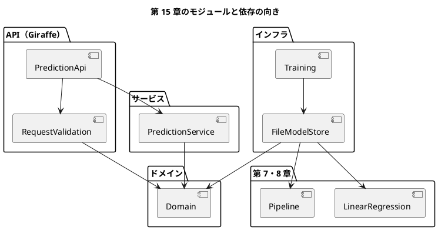

# 第 15 章: 機械学習 API とモジュール設計

## 15.1 はじめに

ここまでの章では、モデルを学習して評価するところまでを扱いました。モデルは、学習しただけでは誰の役にも立ちません。この章では、第 7 章の興行収入の予測と第 8 章の生存の予測を、**HTTP の API** として公開します。

API を作ると、機械学習とは別の関心事が増えます。

- 外から来る JSON が正しい形か（**入力の検証**）
- 学習済みモデルをどこから読み込むか（**モデルの置き場**）
- モデルが無いときや、予期しない例外が起きたときに、何を返すか（**エラーの扱い**）

これらを 1 つのファイルに書くと、変更が難しくなります。関心事ごとに層（モジュール）を分け、依存の向きをそろえます。

[Python 版の第 15 章](../python/15-machine-learning-api-and-module-design.md)・[Kotlin 版の第 15 章](../kotlin/15-machine-learning-api-and-module-design.md)・[TypeScript 版の第 15 章](../typescript/15-machine-learning-api-and-module-design.md) と同じ API を作ります。F# 版では、次の 3 点に注目してください。

- ドメインを **判別共用体** で表し、ありえない値（4 等の客室など）を型で作れないようにする
- 失敗を例外ではなく、組み込みの **`Result<'T, 'E>`** で返す。入力の検証では、**`and!`** の計算式で不正な理由をまとめて集める
- モデルの置き場を **関数のレコード** にして、テストではスタブに差し替える。インターフェースやクラスは使わない

## 15.2 レイヤードアーキテクチャ

### 4 つの層と依存の向き



| 層 | モジュール | 役割 |
|----|-----------|------|
| ドメイン | `Domain` | 映画・乗客・予測・エラーの型と、モデルと置き場の約束 |
| サービス | `PredictionService` | 置き場からモデルを読み込んで予測する |
| API | `RequestValidation`・`PredictionApi` | JSON を検証してドメインの型にし、HTTP の応答にする |
| インフラ | `FileModelStore`・`Training` | 学習済みモデルをファイルに保存し、読み込む |

- ドメインは、どの層にも依存しません。ML.NET も Giraffe も知りません
- サービスは、ドメインにだけ依存します。モデルがファイルにあるのか、メモリにあるのかを知りません
- F# では、ファイルの順番がそのまま依存の向きになります（第 1 章）。`.fsproj` に `Domain.fs`・`PredictionService.fs`・`RequestValidation.fs`・`PredictionApi.fs`・`FileModelStore.fs` の順に並べるので、ドメインが API を参照するような逆向きの依存は、そもそもコンパイルできません

### インサイドアウトで進める

内側の層（ドメイン・サービス）から作り、外側（API・インフラ）へ進めます。内側の層は外側を知らないので、スタブだけでテストできます。

## 15.3 TODO リストの作成

**TODO リスト**:

- [ ] ドメインの型を決める
- [ ] 予測サービスを作る
  - [ ] モデルが無ければ失敗を返す
  - [ ] ヘルスチェック
- [ ] 入力を検証する
  - [ ] 不正な理由をまとめて返す
  - [ ] 年齢と乗船港は省略できる
- [ ] Giraffe でエンドポイントを作る
  - [ ] 不正な入力は 422、モデルが無ければ 503、予期しない例外は 500
- [ ] モデルを保存して読み込む
- [ ] 実データで学習したモデルで動かす

## 15.4 ドメインと予測サービス

### ドメインを判別共用体で表す

```fsharp
// src/MachineLearning/Chapter15/Domain.fs
/// 興行収入を予測する映画の特徴量
type Movie =
    {
        Sns1: float
        Sns2: float
        Actor: float
        /// 原作があるか
        Original: bool
    }

/// 客室の等級
type Pclass =
    | First
    | Second
    | Third

type Sex =
    | Male
    | Female

/// 乗船した港
type Embarked =
    | Cherbourg
    | Queenstown
    | Southampton

/// 生存を予測する乗客。年齢と乗船港は分からないことがある
type Passenger =
    {
        Pclass: Pclass
        Sex: Sex
        Age: float option
        SibSp: int
        Parch: int
        Fare: float
        Embarked: Embarked option
    }
```

- 第 8 章では、客室の等級を `int`、性別と乗船港を `string` で表していました。CSV の値をそのまま持つためです。API のドメインでは、とりうる値を判別共用体で列挙します。`Pclass` の値は `First`・`Second`・`Third` の 3 つしか作れないので、「4 等の客室」はドメインの中に入り込めません
- 原作の有無も、`0.0` か `1.0` の数値ではなく `bool` にしました
- 分からないことがある年齢と乗船港は `option` です

### モデルと置き場を関数の型で表す

```fsharp
/// 予測できなかった理由
type PredictionError =
    /// 学習済みモデルが見つからない。持つのはモデルの名前だけで、ファイルのパスは持たない
    | ModelNotFound of model: string
    /// 学習済みモデルのファイルはあるが、読み込めない（壊れている・形が違う）
    | ModelUnreadable of model: string

/// 映画の特徴量から興行収入を予測するモデル
type SalesModel = Movie -> float

/// 乗客が生存するかを判定するモデル
type SurvivalModel = Passenger -> bool

/// 学習済みモデルの置き場。読み込めなければ Error を返す
type ModelStore =
    {
        LoadSalesModel: unit -> Result<SalesModel, PredictionError>
        LoadSurvivalModel: unit -> Result<SurvivalModel, PredictionError>
    }
```

- TypeScript 版では、エラーを `Error` を継承したクラスで表し、例外として投げていました。F# 版では、予測できなかった理由を **判別共用体** で表し、`Result` の `Error` として返します。呼び出す側は、失敗を `match` で扱うまで結果の値を取り出せません
- エラーはモデルの名前だけを持ち、ファイルのパスを持ちません。応答に内部の情報（サーバーのディレクトリ構成）が漏れないようにするためです
- モデルは「映画を受け取って金額を返す関数」そのものです。第 11 章の `Model<'T>` と同じく、関数の型に名前を付けています
- 置き場は、2 つの関数を持つ **レコード** です。TypeScript 版のインターフェースに当たりますが、レコードなので、テストでは `{ ... }` で直接作れ、`with` で一部だけ差し替えられます

### Red: スタブで予測サービスをテストする

```fsharp
// tests/MachineLearning.Tests/Chapter15/Stubs.fs
/// sns1 に 1000 を足すだけの興行収入のモデル
let stubSalesModel: SalesModel = fun movie -> 1000.0 + movie.Sns1

/// 女性なら生存と判定するだけのモデル
let stubSurvivalModel: SurvivalModel = fun passenger -> passenger.Sex = Female

/// 常にスタブのモデルを返す置き場
let stubModelStore: ModelStore =
    {
        LoadSalesModel = fun () -> Ok stubSalesModel
        LoadSurvivalModel = fun () -> Ok stubSurvivalModel
    }

/// モデルが 1 つも無い置き場
let emptyModelStore: ModelStore =
    {
        LoadSalesModel = fun () -> Error(ModelNotFound "cinema")
        LoadSurvivalModel = fun () -> Error(ModelNotFound "survived")
    }
```

```fsharp
// tests/MachineLearning.Tests/Chapter15/PredictionServiceTest.fs
[<Fact>]
let ``映画の特徴量から興行収入を予測する`` () =
    Assert.Equal(Ok { Sales = 1200.0 }, predictSales stubModelStore movie)

[<Fact>]
let ``モデルが無ければ ModelNotFound の失敗を返す`` () =
    Assert.Equal(Error(ModelNotFound "cinema"), predictSales emptyModelStore movie)

[<Fact>]
let ``モデルを読み込めればそれぞれ true を返す`` () =
    Assert.Equal({ Cinema = true; Survived = true }, health stubModelStore)
```

スタブのモデルは、学習もファイルも使わない、ただの関数です。`Result` の値も、レコードと同じく構造的に比べられるので、`Ok { Sales = 1200.0 }` をそのまま期待値に書けます。

```text
error FS0039: 名前空間 'Chapter15' が定義されていません。
error FS0039: 型 'SalesModel' が定義されていません。
```

### Green: Result.map で予測する

```fsharp
// src/MachineLearning/Chapter15/PredictionService.fs
/// モデルごとに読み込めるかどうか
type Health = { Cinema: bool; Survived: bool }

let predictSales (store: ModelStore) (movie: Movie) : Result<SalesPrediction, PredictionError> =
    store.LoadSalesModel() |> Result.map (fun model -> { Sales = model movie })

let predictSurvival (store: ModelStore) (passenger: Passenger) : Result<SurvivalPrediction, PredictionError> =
    store.LoadSurvivalModel()
    |> Result.map (fun model -> { Survived = model passenger })

let health (store: ModelStore) : Health =
    {
        Cinema = store.LoadSalesModel() |> Result.isOk
        Survived = store.LoadSurvivalModel() |> Result.isOk
    }

/// 利用者に見せるエラーの説明
let describe (error: PredictionError) : string =
    match error with
    | ModelNotFound model -> $"学習済みモデル {model} が見つかりません"
    | ModelUnreadable model -> $"学習済みモデル {model} を読み込めません"
```

- `Result.map` は、`Ok` なら中の値を変換し、`Error` ならそのまま通します。TypeScript 版では `mapResult` を自作しましたが、F# では標準ライブラリにあります
- `describe` の `match` は、エラーのすべての場合を扱います。最初は `ModelNotFound` だけでしたが、15.7 節で `ModelUnreadable` を加えたとき、コンパイラが次のエラーで知らせてくれました

```text
error FS0025: この式のパターン マッチが不完全です たとえば、値 'ModelUnreadable (_)' はパターンに含まれないケースを示す可能性があります。
```

エラーの種類を増やしたときに、説明を書き忘れることがありません。第 3 章の網羅性の検査が、ここでも効いています。

## 15.5 入力を検証する

### 何を検証するか

API の入力は、映画なら `{"sns1": 200, "sns2": 500, "actor": 3000, "original": 1}`、乗客なら `{"pclass": 1, "sex": "female", "age": null, "sib_sp": 0, "parch": 0, "fare": 50, "embarked": "C"}` の JSON です。項目名と、とりうる値は他の版と同じです。

- 数値の項目は 0 以上。`sib_sp`・`parch` は整数
- `original` は 0 か 1、`pclass` は 1・2・3、`sex` は `male`・`female`、`embarked` は `C`・`Q`・`S`
- `age` と `embarked` は省略でき、`null` も省略と同じ扱い
- 不正な項目がいくつあっても、**理由をまとめて** 返す

### Red: 理由をまとめて返すテスト

```fsharp
// tests/MachineLearning.Tests/Chapter15/RequestValidationTest.fs
[<Fact>]
let ``映画の JSON を Movie にする`` () =
    Assert.Equal(Ok movie, parseMovie movieJson)

[<Theory>]
[<InlineData("pclass", "4", "pclass は 1、2、3 のどれかにしてください")>]
[<InlineData("sex", "\"unknown\"", "sex は male、female のどれかにしてください")>]
[<InlineData("fare", "-1", "fare は 0 以上にしてください")>]
[<InlineData("embarked", "\"X\"", "embarked は C、Q、S のどれかにしてください")>]
[<InlineData("sib_sp", "0.5", "sib_sp は整数にしてください")>]
let ``乗客の特徴量が不正ならその理由を返す`` (field: string, value: string, reason: string) =
    Assert.Equal(Error [ reason ], parsePassenger (passengerJsonWith field value))

[<Fact>]
let ``不正な理由をまとめて返す`` () =
    let json =
        """{"pclass": 4, "sex": "female", "sib_sp": 0, "parch": 0, "fare": -1}"""

    Assert.Equal(
        Error [ "pclass は 1、2、3 のどれかにしてください"; "fare は 0 以上にしてください" ],
        parsePassenger json
    )
```

- `[<Theory>]` と `[<InlineData(...)>]` は、同じテストを入力を変えて何度も実行する xUnit の書き方です。1 行の `InlineData` が 1 回のテストになります
- `passengerJsonWith` は、正しい乗客の JSON の 1 つの項目だけを差し替えるテスト用の関数です。項目と値の組のリストから JSON を組み立てます
- `"""..."""` は、中に `"` をそのまま書ける三重引用符の文字列です

### 検証の結果を Result で表す

```fsharp
// src/MachineLearning/Chapter15/RequestValidation.fs
/// 検証の結果。正しければ値を、不正なら理由の一覧を持つ
type Validation<'T> = Result<'T, string list>
```

項目ごとの検証は、`Result` を返す小さな関数を `Result.bind` でつなげて書きます。

```fsharp
let private nonNegativeNumber name json =
    tryField name json
    |> required name
    |> Result.bind (number name)
    |> Result.bind (notNegative name)
```

「項目がある」「数値である」「0 以上である」を順に確かめ、どこかで失敗したら、その理由の `Error` がそのまま最後まで流れます。`Result.bind` は、`Ok` なら次の検証に進み、`Error` なら残りを飛ばします。

### and! で理由をまとめて集める

`Result.bind` でつなぐと、最初の失敗で止まります。1 つの項目の中ではそれで十分ですが、項目どうしは **全部** 検証して、理由をまとめて返したいところです。そこで、項目どうしを `and!` でつなぐ計算式（コンピュテーション式）を作ります。

```fsharp
/// 項目ごとの検証をまとめる計算式。and! でつないだ項目は、どれかが不正でも残りを検証し、理由をすべて集める
type ValidationBuilder() =
    member _.BindReturn(result: Validation<'T>, f: 'T -> 'U) : Validation<'U> = Result.map f result

    member _.MergeSources(left: Validation<'T>, right: Validation<'U>) : Validation<'T * 'U> =
        match left, right with
        | Ok l, Ok r -> Ok(l, r)
        | Error l, Error r -> Error(l @ r)
        | Error errors, Ok _
        | Ok _, Error errors -> Error errors

let validation = ValidationBuilder()
```

- `MergeSources` は、`and!` でつないだ 2 つの結果を 1 つにまとめる方法です。両方が `Error` なら、理由のリストを `@` でつなげます。ここが、「最初の失敗で止まらずに、理由を集める」仕組みです
- `BindReturn` は、まとめた結果から最後の値を作る方法です
- この 2 つのメソッドを持つクラスのインスタンス（`validation`）を作ると、`validation { ... }` の中で `let!` と `and!` が使えるようになります

```fsharp
let parsePassenger (body: string) : Validation<Passenger> =
    body
    |> parseWith (fun json ->
        validation {
            let! pclass =
                tryField "pclass" json
                |> required "pclass"
                |> Result.bind (oneOf "pclass" [ "1", First; "2", Second; "3", Third ])

            and! sex =
                tryField "sex" json
                |> required "sex"
                |> Result.bind (oneOf "sex" [ "male", Male; "female", Female ])

            and! age =
                json
                |> optional "age" (fun value -> number "age" value |> Result.bind (notNegative "age"))

            and! sibSp = nonNegativeInteger "sib_sp" json
            and! parch = nonNegativeInteger "parch" json
            and! fare = nonNegativeNumber "fare" json

            and! embarked =
                json
                |> optional "embarked" (oneOf "embarked" [ "C", Cherbourg; "Q", Queenstown; "S", Southampton ])

            return
                {
                    Pclass = pclass
                    Sex = sex
                    Age = age
                    SibSp = sibSp
                    Parch = parch
                    Fare = fare
                    Embarked = embarked
                }
        })
```

- `let!` と `and!` で並べた 7 つの検証は、互いに依存しません。すべてが `Ok` のときだけ `return` のレコードが作られ、1 つでも `Error` があれば、すべての理由を集めた `Error` になります
- `oneOf` は、JSON の値（`"1"` や `"female"`）を判別共用体の値（`First` や `Female`）に対応づけます。検証を通った値は、もう文字列ではありません。**検証と変換を同時に** 行うので、検証済みの値だけがドメインに入ります
- TypeScript 版では zod のスキーマで同じことをしました。F# では、ライブラリを使わずに言語の計算式で書けます

### inline と型の制約

「0 以上か」を確かめる `notNegative` は、`float` にも `int` にも使いたい関数です。最初は次のように書きました。

```fsharp
let private notNegative (name: string) (value: 'N) : Validation<'N> =
    if value >= LanguagePrimitives.GenericZero then
        Ok value
    else
        Error [ $"{name} は 0 以上にしてください" ]
```

すると、コンパイルエラーになりました。

```text
error FS0064: このコンストラクトによって、コードの総称性は型の注釈よりも低くなります。型変数 'N' は型 'float' に制約されました。
```

`LanguagePrimitives.GenericZero` は「その型の 0」ですが、.NET のジェネリックでは「数値型のどれか」という制約を表せません。F# のコンパイラは、最初に使われた `float` に型を固定してしまいました。関数を `inline` にすると、呼び出す場所ごとに実際の型（`float` や `int`）で関数の本体が展開されるので、どちらの型でも使えます。

```fsharp
/// inline にすると、呼び出す場所ごとに float・int など実際の型で展開される（GenericZero はその型の 0）
let inline private notNegative (name: string) (value: 'N) : Validation<'N> =
```

## 15.6 Giraffe でエンドポイントを作る

### Giraffe を導入する

[Giraffe](https://giraffe.wiki/) は、ASP.NET Core の上で動く F# 向けの Web フレームワークです。版は [ADR 004](../../../adr/004-fsharp-ml-libraries.md) のとおり 8.3.0 です。統合テストには、サーバーを起動せずに HTTP の要求を送れる `Microsoft.AspNetCore.TestHost` を使います。

```xml
<!-- Directory.Packages.props -->
    <PackageVersion Include="Giraffe" Version="8.3.0" />
    <PackageVersion Include="Microsoft.AspNetCore.TestHost" Version="10.0.12" />
```

```xml
<!-- src/MachineLearning/MachineLearning.fsproj -->
  <ItemGroup>
    <!-- 第 15 章の API（Giraffe）は ASP.NET Core の上で動く -->
    <FrameworkReference Include="Microsoft.AspNetCore.App" />
  </ItemGroup>
```

ASP.NET Core は NuGet のパッケージではなく、.NET SDK に含まれる共有フレームワークです。`FrameworkReference` で参照します。

### Red: TestHost で API をテストする

```fsharp
// tests/MachineLearning.Tests/Chapter15/PredictionApiTest.fs
/// 置き場を使う API を、ネットワークを使わないテスト用のサーバーで起動し、クライアントを返す
let clientWith (store: ModelStore) : Task<HttpClient> =
    task {
        let builder = WebApplication.CreateBuilder()
        builder.WebHost.UseTestServer() |> ignore
        let app = createWebApplication builder store
        do! app.StartAsync()
        return app.GetTestClient()
    }

[<Fact>]
let ``映画の特徴量を送ると予測した興行収入を返す`` () =
    task {
        let! actual = postJson stubModelStore "/cinema/sales" movieJson
        Assert.Equal((HttpStatusCode.OK, """{"sales":1200}"""), actual)
    }

[<Fact>]
let ``興行収入のモデルが無ければ 503 を返す`` () =
    task {
        let! actual = postJson emptyModelStore "/cinema/sales" movieJson
        Assert.Equal((HttpStatusCode.ServiceUnavailable, """{"detail":"学習済みモデル cinema が見つかりません"}"""), actual)
    }
```

- `UseTestServer()` に差し替えると、ネットワークのポートを開かずに、メモリの中で要求と応答をやりとりします
- `task { ... }` は、非同期の処理を書く計算式です。`let!` で非同期の結果を待ち、`do!` で値を返さない非同期の処理を待ちます。xUnit は `Task` を返すテストをそのまま扱えます

最初は、テストを同期で書いていました（`client.Send request`）。すると、すべてのテストが次の例外で失敗しました。

```text
System.NotSupportedException : This synchronous method is not supported due to the risk of threadpool exhaustion when running multiple tests in parallel. Use the asynchronous version of this method instead.
```

TestHost のクライアントは、同期の `Send` に対応していません。テストを並行して走らせたときにスレッドを使い果たすおそれがあるためです。`task { }` で `SendAsync` を待つ形に直しました。

### エンドポイントを組み立てる

```fsharp
// src/MachineLearning/Chapter15/PredictionApi.fs
/// 予測の結果を応答にする。モデルが無ければ 503 とその説明を返す
let private respond (result: Result<'T, PredictionError>) : HttpHandler =
    match result with
    | Ok prediction -> json prediction
    | Error error ->
        setStatusCode StatusCodes.Status503ServiceUnavailable
        >=> json {| detail = describe error |}

/// 本文を検証し、正しければ予測する。不正なら 422 と理由の一覧を返す
let private predictWith (parse: string -> Validation<'I>) (predict: 'I -> Result<'O, PredictionError>) : HttpHandler =
    fun next ctx ->
        task {
            let! body = ctx.ReadBodyFromRequestAsync()

            let handler =
                match parse body with
                | Error errors ->
                    setStatusCode StatusCodes.Status422UnprocessableEntity
                    >=> json {| detail = errors |}
                | Ok input -> respond (predict input)

            return! handler next ctx
        }

/// 経路と HTTP のメソッドから、処理を選ぶ
let webApp (store: ModelStore) : HttpHandler =
    choose
        [
            POST >=> route "/cinema/sales" >=> predictWith parseMovie (predictSales store)
            POST
            >=> route "/survived"
            >=> predictWith parsePassenger (predictSurvival store)
            GET >=> route "/health" >=> healthHandler store
            setStatusCode StatusCodes.Status404NotFound >=> json {| detail = "見つかりません" |}
        ]
```

- Giraffe の `HttpHandler` は、「要求を受け取って、応答を作るか、次に回す」関数です。`>=>` は、2 つのハンドラーを「前が成功したら後ろを実行する」とつなぐ演算子で、`POST >=> route "/cinema/sales" >=> ...` は「POST で、経路が /cinema/sales なら、予測する」と読めます
- `choose` は、リストのハンドラーを上から試し、最初に成功したものを使います。最後の 404 のハンドラーは、どれにも当たらなかった要求を受け止めます
- `predictWith` は、検証の関数と予測の関数を受け取る **高階関数** です。映画と乗客の 2 つのエンドポイントで、同じ「検証して、予測して、応答にする」流れを共有しています
- 検証の失敗（`Validation` の `Error`）は 422、予測の失敗（`PredictionError`）は 503 と、失敗の型ごとに状態コードが決まります。例外の型で分ける TypeScript 版より、どこで何が起きうるかが型に表れます

### 予期しない例外と JSON の設定

```fsharp
/// 予期しない例外は記録し、内部の情報を出さずに 500 を返す
let private errorHandler (error: exn) (logger: ILogger) : HttpHandler =
    logger.LogError(error, "予測中に例外が発生しました")

    clearResponse
    >=> setStatusCode StatusCodes.Status500InternalServerError
    >=> json {| detail = "予測中にエラーが発生しました" |}

/// JSON の項目名を camelCase にし、日本語をエスケープせずにそのまま書く
let private jsonOptions =
    JsonSerializerOptions(JsonSerializerDefaults.Web, Encoder = JavaScriptEncoder.Create(UnicodeRanges.All))
```

- `Result` で表していない失敗（モデルの中で起きた例外など）は、`UseGiraffeErrorHandler` に渡したハンドラーが受け止めます。例外のメッセージは記録だけして、応答には出しません
- System.Text.Json は、既定では日本語を `学` のようにエスケープします。`JavaScriptEncoder.Create(UnicodeRanges.All)` を指定して、読める形のまま返します

### 匿名レコードと項目の順

ヘルスチェックの応答は、最初は匿名レコード `{| status = status; models = models |}` で書いていました。すると、テストが次のように失敗しました。

```text
Expected: Tuple (OK, "{\"status\":\"ok\",\"models\":{\"cinema\":true,\"survived\":"···)
Actual:   Tuple (OK, "{\"models\":{\"cinema\":true,\"survived\":true},\"status\""···)
```

F# の匿名レコードは、フィールドを **名前の順** に並べます（第 2 章の Notebook の表と同じです）。JSON の項目の順は意味を持ちませんが、他の版と同じ順で返すために、名前付きのレコードにしました。名前付きのレコードは、書いた順に項目を並べます。

```fsharp
/// ヘルスチェックの応答。匿名レコードはフィールドを名前の順に並べるので、項目の順を決めるために名前を付ける
type HealthResponse = { Status: string; Models: Health }
```

## 15.7 モデルを保存して読み込む

### 第 7・8 章のモデルを約束に合わせる

置き場は、第 7 章の線形回帰と第 8 章のパイプラインを、ドメインの約束（`SalesModel`・`SurvivalModel`）に合わせます。

```fsharp
// src/MachineLearning/Chapter15/FileModelStore.fs
/// ドメインの乗客を、第 8 章のパイプラインが受け取る乗客にする
let toChapter08Passenger (passenger: Passenger) : SurvivedData.Passenger =
    {
        Pclass =
            match passenger.Pclass with
            | First -> 1
            | Second -> 2
            | Third -> 3
        Sex =
            match passenger.Sex with
            | Male -> "male"
            | Female -> "female"
        Age = passenger.Age
        SibSp = passenger.SibSp
        Parch = passenger.Parch
        Fare = passenger.Fare
        Embarked =
            passenger.Embarked
            |> Option.map (function
                | Cherbourg -> "C"
                | Queenstown -> "Q"
                | Southampton -> "S")
    }
```

判別共用体から CSV の値への変換は、すべての場合を `match` で書きます。場合を書き忘れれば、網羅性の検査がコンパイルエラーにします。

### ファイルが無い・読めないを区別する

```fsharp
/// ファイルが無ければ ModelNotFound、読み込めなければ ModelUnreadable にする
let private loadFile (name: string) (file: string) (read: string -> Result<'M, string>) : Result<'M, PredictionError> =
    if not (File.Exists file) then
        Error(ModelNotFound name)
    else
        read file |> Result.mapError (fun _ -> ModelUnreadable name)

/// ディレクトリに保存した学習済みモデルを、呼ばれるたびに読み込む置き場
let fileModelStore (directory: string) : ModelStore =
    {
        LoadSalesModel =
            fun () ->
                loadFile "cinema" (Path.Combine(directory, SalesModelFile)) readLinearModel
                |> Result.map (fun model movie ->
                    predictLinearRegression model [ toCinemaFeatures movie ] |> List.exactlyOne)
        LoadSurvivalModel =
            fun () ->
                loadFile "survived" (Path.Combine(directory, SurvivalModelFile)) ModelFile.loadModel
                |> Result.map (fun pipeline passenger -> predictPassenger pipeline (toChapter08Passenger passenger) = 1)
    }
```

- 壊れたファイルを「見つからない」と報告すると、利用者は原因を取り違えます。そこで、判別共用体に `ModelUnreadable` を加えて区別しました（15.4 節の FS0025 は、このときに出たものです）
- `Result.mapError` は、`Error` の中身だけを変換します。読み込みの詳しいエラーメッセージ（`string`）を、モデルの名前だけを持つ `ModelUnreadable` に置き換えて、内部の情報を外に出さないようにしています
- `Result.map (fun model movie -> ...)` は、2 つの引数を取る関数を返しています。`model` を覚えた「映画を受け取る関数」、つまり `SalesModel` になります
- 置き場は、呼ばれるたびにファイルを読み込みます。学習し直してファイルを置き換えれば、サーバーを再起動せずに新しいモデルが使われます

### 保存の形式

第 7 章の線形回帰（`LinearModel`）は、切片と係数の `Map` を持つレコードです。System.Text.Json は、F# のレコードと `Map` をそのまま JSON に書き、読み戻せました（スクリプトで確かめました）。

```json
{"Intercept":1.5,"Coefficients":{"SNS1":2}}
```

第 8 章のパイプラインは、第 8 章の `ModelFile` がすでに JSON で保存・読み込みしているので、それを使います。

```fsharp
// tests/MachineLearning.Tests/Chapter15/FileModelStoreTest.fs
[<Fact>]
let ``保存した線形回帰を読み込み、映画の特徴量から興行収入を予測する`` () =
    let directory = emptyDirectory ()
    saveSalesModel directory salesModel

    match (fileModelStore directory).LoadSalesModel() with
    | Ok predictSales ->
        // 100 + 2 × 200 + 0.5 × 500 + 1 × 3000 + 10 × 1（原作あり）
        Assert.Equal(3760.0, predictSales movie, 9)
    | Error error -> Assert.Fail $"%A{error}"

[<Fact>]
let ``モデルのファイルが壊れていれば ModelUnreadable を返す`` () =
    let directory = emptyDirectory ()
    File.WriteAllText(Path.Combine(directory, SalesModelFile), "{")

    Assert.Equal(Error(ModelUnreadable "cinema"), (fileModelStore directory).LoadSalesModel() |> Result.map ignore)
```

- 読み込んだモデルは関数なので、`=` で比べられません。`Result.map ignore` で `Ok` の中身を捨ててから、`Error` の側だけを比べています
- `$"%A{error}"` は、補間文字列の中で `%A`（F# の値を読める形で書く書式）を使う書き方です

## 15.8 実データで学習したモデルで動かす

### 学習と保存

第 7・8 章と同じ条件（テストデータの割合 0.2、シード 0、深さ 5、クラスの重みあり）で学習して保存します。

```fsharp
// src/MachineLearning/Chapter15/Training.fs
/// 第 7・8 章と同じ条件でモデルを学習し、ディレクトリに保存する
let trainAndSaveModels (dataDirectory: string) (modelDirectory: string) : unit =
    let cinema = prepareCinema (Path.Combine(dataDirectory, "cinema.csv")) TestSize Seed
    saveSalesModel modelDirectory (fitLinearRegression cinema.XTrain cinema.TTrain)

    let x, t =
        loadSurvived (Path.Combine(dataDirectory, "Survived.csv"))
        |> splitFeaturesAndTarget

    let survived = splitTrainTest TestSize Seed x t

    fitPipeline
        {
            MaxDepth = Some MaxDepth
            ClassWeight = Balanced
        }
        survived.XTrain
        survived.TTrain
    |> saveSurvivalModel modelDirectory
```

### 統合テスト

実データで学習して保存したモデルを、本物の置き場（`fileModelStore`）から読み込み、TestHost の API に送ります。

```fsharp
// tests/MachineLearning.Tests/Chapter15/TrainedModelsTest.fs
[<Fact>]
let ``実データで学習して保存したモデルで API が予測する`` () =
    task {
        requireData ()
        let directory = Directory.CreateTempSubdirectory("model-").FullName
        trainAndSaveModels (dataDir ()) directory
        let store = fileModelStore directory

        let! health = get store "/health"
        let! sales = postJson store "/cinema/sales" movieJson
        let! survived = postJson store "/survived" passengerJson

        Assert.Equal((HttpStatusCode.OK, """{"status":"ok","models":{"cinema":true,"survived":true}}"""), health)
        Assert.Equal(HttpStatusCode.OK, fst sales)
        Assert.StartsWith("""{"sales":""", snd sales)
        Assert.Equal((HttpStatusCode.OK, """{"survived":true}"""), survived)
    }
```

スタブで確かめた API に、本物の置き場を差し込むだけで、実データのモデルで動きます。置き場をレコードで表しておいたので、API の側は 1 行も変わっていません。

### 学習してサーバーを起動する

```fsharp
// src/MachineLearning/Chapter15/Main.fs
/// 置き場のモデルで予測する API を、指定したアドレスで起動する。止めるまで戻らない
let startServer (modelDirectory: string) (url: string) : unit =
    let app =
        createWebApplication (WebApplication.CreateBuilder()) (fileModelStore modelDirectory)

    app.Run url

/// 学習して保存してから、API を起動する
let run (print: string -> unit) : unit =
    trainAndReport ModelDirectory print
    startServer ModelDirectory $"http://{Host}:{Port}"
```

テストで使った `createWebApplication` を、本物のサーバーでもそのまま使います。違うのは、`WebApplicationBuilder` に `UseTestServer()` をしないことだけです。

```bash
dotnet run --project src/MachineLearning -- chapter15
```

```text
学習済みモデルを保存しました: cinema.json, survived.json
API を起動します: http://127.0.0.1:8015
```

別の端末から、`curl` で要求を送ります。

```bash
curl -s http://127.0.0.1:8015/health
curl -s -X POST -H "Content-Type: application/json" \
  -d '{"sns1": 200, "sns2": 500, "actor": 3000, "original": 1}' \
  http://127.0.0.1:8015/cinema/sales
curl -s -X POST -H "Content-Type: application/json" \
  -d '{"pclass": 1, "sex": "female", "sib_sp": 0, "parch": 0, "fare": 50, "embarked": "C"}' \
  http://127.0.0.1:8015/survived
curl -s -X POST -H "Content-Type: application/json" \
  -d '{"pclass": 3, "sex": "male", "age": 30, "sib_sp": 0, "parch": 0, "fare": 8, "embarked": "S"}' \
  http://127.0.0.1:8015/survived
curl -s -w " %{http_code}" -X POST -H "Content-Type: application/json" \
  -d '{"pclass": 4, "sex": "female", "sib_sp": 0, "parch": 0, "fare": -1}' \
  http://127.0.0.1:8015/survived
```

```text
{"status":"ok","models":{"cinema":true,"survived":true}}
{"sales":7883.711445215134}
{"survived":true}
{"survived":false}
{"detail":["pclass は 1、2、3 のどれかにしてください","fare は 0 以上にしてください"]} 422
```

- 1 等の女性の乗客は生存、3 等の 30 歳の男性の乗客は死亡と予測されました
- 年齢を省略した乗客も予測できています。欠けた年齢は、第 8 章のパイプラインが客室の等級と性別ごとの中央値で補完します
- 不正な項目が 2 つある要求には、422 と 2 つの理由がまとめて返りました

学習済みモデルは `apps/fsharp/model/` に保存されます。このディレクトリは `.gitignore` で除外しています（第 4 章）。

### テストの実行結果

```bash
dotnet test
```

```text
テストの実行の概要: 成功!
  合計: 313
  失敗: 0
  成功: 313
  スキップ済み: 0
```

第 1〜15 章のすべてのテストの件数です。第 15 章のテストは 38 件（`Theory` の入力ごとに 1 件と数えます）です。

<details>
<summary>この章の完成コード（src/MachineLearning/Chapter15/RequestValidation.fs）</summary>

```fsharp
module MachineLearning.Chapter15.RequestValidation

open System.Text.Json
open MachineLearning.Chapter15.Domain

/// 検証の結果。正しければ値を、不正なら理由の一覧を持つ
type Validation<'T> = Result<'T, string list>

/// 項目ごとの検証をまとめる計算式。and! でつないだ項目は、どれかが不正でも残りを検証し、理由をすべて集める
type ValidationBuilder() =
    member _.BindReturn(result: Validation<'T>, f: 'T -> 'U) : Validation<'U> = Result.map f result

    member _.MergeSources(left: Validation<'T>, right: Validation<'U>) : Validation<'T * 'U> =
        match left, right with
        | Ok l, Ok r -> Ok(l, r)
        | Error l, Error r -> Error(l @ r)
        | Error errors, Ok _
        | Ok _, Error errors -> Error errors

let validation = ValidationBuilder()

/// 項目の値。無い項目と null は None
let private tryField (name: string) (json: JsonElement) : JsonElement option =
    match json.TryGetProperty name with
    | true, value when value.ValueKind <> JsonValueKind.Null -> Some value
    | _ -> None

let private required (name: string) (value: JsonElement option) : Validation<JsonElement> =
    value |> Option.map Ok |> Option.defaultValue (Error [ $"{name} を指定してください" ])

let private number (name: string) (value: JsonElement) : Validation<float> =
    if value.ValueKind = JsonValueKind.Number then
        Ok(value.GetDouble())
    else
        Error [ $"{name} は数値にしてください" ]

let private integer (name: string) (value: JsonElement) : Validation<int> =
    match value.ValueKind, value.TryGetInt32() with
    | JsonValueKind.Number, (true, n) -> Ok n
    | _ -> Error [ $"{name} は整数にしてください" ]

/// inline にすると、呼び出す場所ごとに float・int など実際の型で展開される（GenericZero はその型の 0）
let inline private notNegative (name: string) (value: 'N) : Validation<'N> =
    if value >= LanguagePrimitives.GenericZero then
        Ok value
    else
        Error [ $"{name} は 0 以上にしてください" ]

/// JSON の値（数値か文字列）を、決められた値の一覧のどれかに対応づける
let private oneOf (name: string) (choices: (string * 'T) list) (value: JsonElement) : Validation<'T> =
    let raw =
        match value.ValueKind with
        | JsonValueKind.String -> value.GetString()
        | _ -> value.GetRawText()

    match choices |> List.tryFind (fun (key, _) -> key = raw) with
    | Some(_, choice) -> Ok choice
    | None ->
        let keys = choices |> List.map fst |> String.concat "、"
        Error [ $"{name} は {keys} のどれかにしてください" ]
```

（`nonNegativeNumber`・`parseWith`・`parseMovie`・`parsePassenger` は本文のとおりです。）

</details>

## 15.9 まとめ

この章では、第 7・8 章のモデルを HTTP の API として公開し、関心事ごとにモジュールを分けました。

1. **依存の向きとファイルの順番** — ドメイン・サービス・API・インフラの層に分け、F# のファイルの順番で依存の向きを強制した
2. **判別共用体のドメイン** — 客室の等級・性別・乗船港を判別共用体にし、ありえない値をドメインに入れないようにした。エラーを増やしたときは網羅性の検査が説明の書き忘れを知らせた
3. **Result と and!** — 失敗を例外ではなく `Result` で返し、入力の検証では `and!` の計算式で理由をまとめて集めた。検証と変換を同時に行い、検証済みの値だけをドメインに渡した
4. **関数のレコードで差し替える** — モデルの置き場を関数のレコードにして、テストではスタブ、本番ではファイルの置き場を差し込んだ
5. **TestHost による統合テスト** — サーバーを起動せずに API を確かめた。同期の送信が使えないことや、匿名レコードの項目の順といった、動かして初めて分かることをテストが見つけた

### シリーズの振り返り

F# 版では、同じ 15 章を「型で誤りを防ぐ」ことに注目して進めました。

- 第 2 章の `option` で欠損値を、第 3 章の判別共用体で決定木を、第 15 章の判別共用体でドメインを表し、ありえない状態を型で作れないようにした
- 第 3・15 章の網羅性の検査が、場合分けの漏れをコンパイルエラーにした
- 第 2・12・14 章の不変なデータと純粋な関数が、乱数やライブラリの振る舞いをテストで固定しやすくした
- 型プロバイダ（第 2・9・12 章）で CSV の形を、学習用テストで ML.NET・FSharp.Stats の癖を確かめた

### 次の言語へ

同じ題材を、ほかの言語の版でも読んでみてください。[Python 版](../python/index.md) では pandas と scikit-learn による標準的な書き方を、[Kotlin 版](../kotlin/index.md) ではデータフレームと Tribuo を、[TypeScript 版](../typescript/index.md) では型付きのレコードと ml.js を使っています。同じ問題を別の言語で解くと、それぞれの言語が何を得意とするかが見えてきます。
