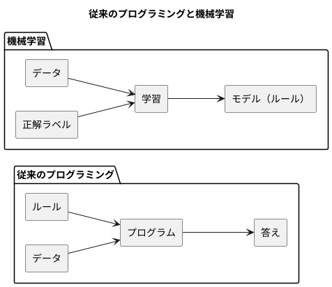
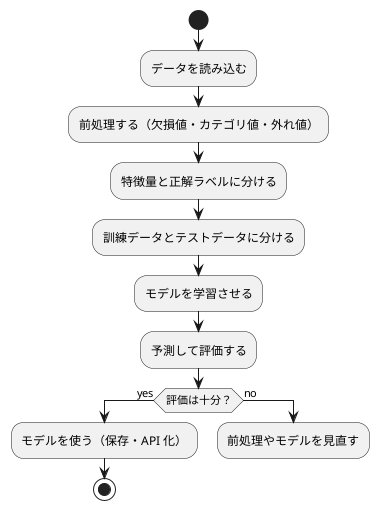

# 第 1 章: 機械学習とはじめてのテスト

## 1.1 はじめに

この章では、機械学習とは何かを確認したうえで、テスト駆動開発（TDD）で最初のプログラムを Go で作ります。題材は「きのこの山派か、たけのこの里派か」を身長・体重・年代から判定する問題です。

この章ではまだ機械学習のアルゴリズムを使いません。人間が考えたルールで判定し、その正解率を測るところまで進みます。「ルールを人間が書く」とはどういうことかを先に体験しておくと、第 3 章で「ルールをデータから学ばせる」ことの意味がはっきりします。

[Python 版の第 1 章](../python/01-machine-learning-and-first-test.md) と同じ題材・同じ TODO リストで進めます。Go 版では 2 つの版と対比します。1 つは [TypeScript 版](../typescript/01-machine-learning-and-first-test.md) で、機械学習のライブラリが限られる環境で自作を積み上げていく立場が同じです。もう 1 つは [Java 版](../java/01-machine-learning-and-first-test.md) で、同じ静的型付けのコンパイル言語でありながら、クラスも例外も継承も持たない Go がどう書くかを比べられます。

## 1.2 機械学習とは

### ルールを書くか、データに学ばせるか

従来のプログラミングでは、人間が判定のルールをコードとして書きます。

```go
func PredictByRule(features Features) string {
	if features.AgeGroup == kinokoAgeGroup {
		return "きのこ"
	}

	return "たけのこ"
}
```

これはこの章で実際に作る関数です。「20 代ならきのこ派」というルールは、人間がデータを眺めて立てた仮説にすぎません。データが増えたり傾向が変わったりすれば、人間がルールを書き直す必要があります。

機械学習では、ルールそのものをデータから導きます。人間が用意するのは「特徴量（判定の手がかり）」と「正解ラベル（本当の答え）」の組です。学習アルゴリズムがその組からルールを作り、未知のデータに当てはめて予測します。



### 機械学習のワークフロー

機械学習のプログラムは、おおむね次の流れで作ります。本シリーズの各章は、この流れのどこかを深掘りする構成になっています。



この章で扱うのは「データを読み込む」「特徴量と正解ラベルに分ける」「予測して評価する」の 3 つです。「学習させる」の代わりに、人間が書いたルールで予測します。

### 分類と回帰

| 種類 | 予測するもの | 例 |
|------|------------|-----|
| 分類 | どのグループに属するか（離散値） | きのこ派かたけのこ派か、アヤメの品種 |
| 回帰 | どれくらいの量か（連続値） | 映画の興行収入、住宅価格 |

この章の問題は、2 つのグループのどちらかを当てる分類です。

## 1.3 題材とデータ

### データの入手と配置

本シリーズの学習データは、書籍『スッキリわかる Python による機械学習入門』（インプレス, 2020）の配布データを使います。配布データは書籍購入者のみ利用できるため、リポジトリには含まれていません。[書籍サポートページ](https://sukkiri.jp/books/sukkiri_ml) から `sukkiri-ml-codes.zip` を入手し、リポジトリの `tmp/` に置いてから、リポジトリのルートで次を実行してください。

```bash
npx gulp data:setup
npx gulp data:check
```

`apps/data/sukkiri-ml/` に学習データが配置されます。このディレクトリは `.gitignore` の対象なので、誤ってコミットされることはありません。すべての言語版が同じデータを参照します。

### KvsT.csv

この章で使うのは `KvsT.csv` です。19 人分のデータが次の 4 列で記録されています。

| 列 | 意味 | 値 |
|----|------|-----|
| 身長 | 身長（cm） | 整数 |
| 体重 | 体重（kg） | 整数 |
| 年代 | 年代 | 10, 20, 30, 40 のいずれか |
| 派閥 | きのこの山派かたけのこの里派か | `きのこ` または `たけのこ` |

「身長」「体重」「年代」が特徴量、「派閥」が正解ラベルです。列名が日本語であることと、ファイルの先頭に BOM（バイトオーダーマーク）が付いていることに注意してください。

## 1.4 TODO リストの作成

仕様をそのままコードにするには大きすぎるので、まず TODO リストに分解します。

> TODO リスト
>
> 何をテストすべきだろうか——着手する前に、必要になりそうなテストをリストに書き出しておこう。
>
> — テスト駆動開発

**TODO リスト**:

- [ ] CSV を読み込む
  - [ ] BOM 付き CSV の 1 行を人物として読み込む
  - [ ] 複数行を行の順に読み込む
- [ ] 特徴量と正解ラベルに分ける
- [ ] ルールで派閥を判定する
  - [ ] 20 代ならきのこ派と判定する
  - [ ] 20 代以外ならたけのこ派と判定する
- [ ] 正解率を計算する
- [ ] 実データで正解率を表示する

## 1.5 開発環境の準備

### プロジェクトの構成

Go の実装は `apps/go/` にあります。ビルドと依存管理は Go Modules、テスティングフレームワークは標準の [`testing`](https://pkg.go.dev/testing) です。Java 版の Gradle + JUnit + AssertJ、TypeScript 版の npm + Vitest に当たるものが、すべて `go` コマンドと標準ライブラリに含まれています。

```text
apps/go/
├── go.mod
├── .gitignore
├── cmd/
│   └── chapters/
│       └── main.go
└── internal/
    ├── dataset/
    │   ├── datadir.go
    │   └── datadir_test.go
    ├── setup/
    │   └── setup_test.go
    └── chapter01/
        ├── kinokotakenoko.go
        ├── kinokotakenoko_test.go
        ├── kvstdata_test.go
        └── main.go
```

Go では、ディレクトリが 1 つのパッケージになります。Java 版のように「公開する型ごとに 1 ファイル」にする必要はなく、`Person`・`Features` と関数群を `kinokotakenoko.go` の 1 ファイルにまとめられます。この点は Kotlin 版の `KinokoTakenoko.kt` に近い構成です。

- `cmd/chapters/` は実行可能なコマンドです。`package main` の `main` 関数を持つディレクトリだけが実行ファイルになります
- `internal/` に置いたパッケージは、このモジュールの外からは import できません。Java の package-private に当たる可視性をディレクトリで表す仕組みです
- テストは対象と同じディレクトリに `_test.go` で置きます。Java 版・TypeScript 版のように `src/test/` と分けません

`go.mod` は、モジュールの名前と Go の版だけの 2 行です。

```text
module github.com/k2works/getting-started-machine-learning/apps/go

go 1.25
```

`go` 指令は、このモジュールが必要とする Go の最小の版です。1.25 にしているのは、Nix の環境（`nix develop .#go`）に入っているのが Go 1.25.5 で、手元の環境が Go 1.26.5 だからです。より新しい Go は古い `go` 指令のモジュールをそのままビルドできるので、両方の環境で同じように動きます。Java 版が Gradle のツールチェーンで JDK 21 を取得して版をそろえたのに対し、Go は「最小の版を宣言し、新しい処理系はそれを受け入れる」という形で互換性を保ちます。

依存はまだ 1 つもないので、`go.sum` もありません。第 7 章で gonum を追加するまで、標準ライブラリだけで進みます。

### 環境確認テスト

テスティングフレームワークが動くことを、最小のテストで確認します。

```go
// internal/setup/setup_test.go
package setup_test

import "testing"

func TestTestingFrameworkWorks(t *testing.T) {
	t.Parallel()

	if got, want := 1+1, 2; got != want {
		t.Errorf("1 + 1 = %d, want %d", got, want)
	}
}
```

```bash
cd apps/go
go test ./internal/setup/ -v
```

```text
=== RUN   TestTestingFrameworkWorks
=== PAUSE TestTestingFrameworkWorks
=== CONT  TestTestingFrameworkWorks
--- PASS: TestTestingFrameworkWorks (0.00s)
PASS
ok  	github.com/k2works/getting-started-machine-learning/apps/go/internal/setup	0.557s
```

標準の `testing` には、`assertThat`（AssertJ）や `expect`（Vitest）に当たるアサーションがありません。値を自分で比べ、違っていれば `t.Errorf` で報告します。書式は `関数名() = 実際の値, want 期待値` が慣習で、失敗メッセージの読み方が Go のプロジェクト間でそろいます。

- `if got, want := 1+1, 2; got != want` は、`if` の中で変数を宣言して条件に使う書き方です。`got`・`want` の有効範囲がこの `if` の中に閉じます
- `t.Parallel()` を呼んだテストは、ほかの `t.Parallel()` のテストと並行に実行されます。`=== PAUSE` は「並行実行のために一度止めた」、`=== CONT` は「再開した」という表示です
- テストのパッケージ名を `setup_test` にしているのは、テストを「外から使う人」と同じ立場で書くためです。同じディレクトリに `package setup` と `package setup_test` の両方を置けるのは Go の特別扱いで、後者からは公開されている識別子しか見えません

## 1.6 CSV を読み込む

### テストファースト

TODO リストの最初の項目「BOM 付き CSV の 1 行を人物として読み込む」から始めます。実装より先にテストを書きます。

> テストファースト
>
> いつテストを書くべきだろうか——それはテスト対象のコードを書く前だ。
>
> — テスト駆動開発

テストでは学習データそのものは使いません。`t.TempDir()` が用意する一時ディレクトリに、架空の値を 1 行だけ書いた CSV を作ります。

```go
// internal/chapter01/kinokotakenoko_test.go
package chapter01_test

import (
	"os"
	"path/filepath"
	"reflect"
	"testing"

	"github.com/k2works/getting-started-machine-learning/apps/go/internal/chapter01"
)

const header = "\uFEFF身長,体重,年代,派閥\n"

func writeCSV(t *testing.T, rows string) string {
	t.Helper()

	path := filepath.Join(t.TempDir(), "kvst.csv")
	if err := os.WriteFile(path, []byte(header+rows), 0o600); err != nil {
		t.Fatalf("CSV を書けません: %v", err)
	}

	return path
}

func TestLoadPeople(t *testing.T) {
	t.Parallel()

	tests := []struct {
		name string
		rows string
		want []chapter01.Person
	}{
		{
			name: "BOM 付き CSV を読み込んで人物のリストを返す",
			rows: "165,58,30,きのこ\n",
			want: []chapter01.Person{{Height: 165, Weight: 58, AgeGroup: 30, Faction: "きのこ"}},
		},
	}

	for _, test := range tests {
		t.Run(test.name, func(t *testing.T) {
			t.Parallel()

			got, err := chapter01.LoadPeople(writeCSV(t, test.rows))
			if err != nil {
				t.Fatalf("LoadPeople() でエラー: %v", err)
			}

			if !reflect.DeepEqual(got, test.want) {
				t.Errorf("LoadPeople() = %v, want %v", got, test.want)
			}
		})
	}
}
```

Go のテストで慣習になっているのが、この **表駆動テスト**です。テストケースを無名の構造体のスライス（可変長の配列）に並べ、同じ検査を `for` で回します。JUnit の `@ParameterizedTest` や Vitest の `it.each` に当たりますが、専用の仕組みではなく、ただの構造体とループで書けるのが特徴です。

- `t.Run(名前, 関数)` はサブテストを作ります。本シリーズでは、テストの一覧がそのまま仕様の一覧として読めるように、この名前を日本語で書きます
- `"\uFEFF"` は BOM の文字です。配布データと同じ形式のファイルでテストするために、先頭に付けています
- `t.TempDir()` は、テストごとに新しい一時ディレクトリを作り、テストの終了時に消します。JUnit の `@TempDir` に当たります
- `t.Helper()` を呼んだ関数の中で失敗すると、失敗の位置として呼び出し元の行が報告されます。補助関数の行が出て混乱するのを防ぐ指定です
- `t.Fatalf` はそのテストを打ち切り、`t.Errorf` は記録だけして続けます。`writeCSV` のように「ここで失敗したら以降の検査に意味が無い」場面では `Fatalf` を使います
- `0o600` はファイルの権限（所有者だけが読み書きできる）です。Go ではファイルを作るときに必ず権限を指定します

### 値の比較は `reflect.DeepEqual`

Go には、Java の record や Kotlin の data class のような「値による比較を自動で用意する」仕組みがありません。構造体は `==` で比較できますが、スライスは `==` で比較できないので、構造体のスライスを比べるには [`reflect.DeepEqual`](https://pkg.go.dev/reflect#DeepEqual) を使います。

| 言語 | 値の比較 | リストの比較 |
|------|---------|------------|
| Java | record が `equals` を自動生成 | AssertJ の `containsExactly` |
| Kotlin | data class が `equals` を自動生成 | `shouldBe`（Kotest） |
| TypeScript | 構造的型付け。`toEqual` が再帰的に比べる | Vitest の `toEqual` |
| Go | 構造体は `==`（比較可能なフィールドのみ）。スライスは不可 | `reflect.DeepEqual` |

`reflect.DeepEqual` は実行時にリフレクションで中身をたどるので、型が違えば内容が同じでも `false` になります。「期待値の型を書き間違えると必ず失敗する」という意味では安全ですが、どこが違ったのかは教えてくれません。差分を知るには、失敗メッセージに両方を出して自分で見比べます。

### Red: 失敗を確認する

`chapter01` パッケージがまだ存在しないので、テストは実行までたどり着きません。

```bash
go test ./internal/chapter01/
```

```text
github.com/k2works/getting-started-machine-learning/apps/go/internal/chapter01: no non-test Go files in apps/go/internal/chapter01
FAIL	github.com/k2works/getting-started-machine-learning/apps/go/internal/chapter01 [build failed]
```

Go では、テストファイルだけのディレクトリはパッケージとして成立しません。パッケージの宣言だけのファイルを置きます。

```go
// internal/chapter01/kinokotakenoko.go
// Package chapter01 は、人間が決めたルールできのこ派・たけのこ派を判定する。
package chapter01
```

```text
# github.com/k2works/getting-started-machine-learning/apps/go/internal/chapter01_test [.../chapter01.test]
internal/chapter01/kinokotakenoko_test.go:31:20: undefined: chapter01.Person
internal/chapter01/kinokotakenoko_test.go:36:22: undefined: chapter01.Person
internal/chapter01/kinokotakenoko_test.go:44:26: undefined: chapter01.LoadPeople
FAIL	github.com/k2works/getting-started-machine-learning/apps/go/internal/chapter01 [build failed]
```

Java 版・Kotlin 版と同じく、テストの実行より前の **コンパイル** の段階で「`Person` も `LoadPeople` も存在しない」と失敗します。TypeScript 版では型チェック（`tsc --noEmit`）とテストの実行が別の工程でしたが、Go では `go test` がコンパイルから実行までを一続きで行うので、型の誤りはそのままテストの失敗として現れます。

### Green: 仮実装

> 仮実装を経て本実装へ
>
> 失敗するテストを書いてから、最初に行う実装はどのようなものだろうか——ベタ書きの値を返そう。
>
> — テスト駆動開発

```go
// Person は学習データ KvsT.csv の 1 行。身長・体重・年代と、正解ラベルの派閥を持つ。
type Person struct {
	Height   int
	Weight   int
	AgeGroup int
	Faction  string
}

// LoadPeople は CSV を読み込んで人物のリストにする。
func LoadPeople(csvFile string) ([]Person, error) {
	return []Person{{Height: 165, Weight: 58, AgeGroup: 30, Faction: "きのこ"}}, nil
}
```

```text
--- PASS: TestLoadPeople (0.00s)
    --- PASS: TestLoadPeople/BOM_付き_CSV_を読み込んで人物のリストを返す (0.00s)
PASS
ok  	github.com/k2works/getting-started-machine-learning/apps/go/internal/chapter01	0.535s
```

サブテストの名前に含まれる空白が `_` に置き換えられています。これは `go test -run` でテスト名を指定できるようにするための変換で、日本語の文字はそのまま残ります。

構造体の宣言で気をつける点が 2 つあります。

- **フィールド名の大文字・小文字が可視性を決めます。** `Height` のように大文字で始まるものだけがパッケージの外から見えます。Java の `public`／`private`、Kotlin の `internal` に当たる区別を、キーワードではなく名前の形で表します
- **戻り値は `([]Person, error)` の 2 つです。** Go には例外がないので、失敗しうる関数は値とエラーを並べて返します。仮実装の段階では常に `nil`（エラー無し）を返します

`LoadPeople` の引数 `csvFile` は、仮実装では使っていません。Go のコンパイラは **使われていないローカル変数**をエラーにしますが、使われていない引数は通します。この違いは後で静的解析の話に戻ってきます。

### 三角測量

> 三角測量
>
> テストから最も慎重に一般化を引き出すやり方はどのようなものだろうか——2 つ以上の例があるときだけ、一般化を行うようにしよう。
>
> — テスト駆動開発

表駆動テストなので、一般化のための例は表に 1 行足すだけです。

```go
		{
			name: "複数行の CSV を読み込んで行の順に人物のリストを返す",
			rows: "161,52,20,きのこ\n183,74,50,たけのこ\n",
			want: []chapter01.Person{
				{Height: 161, Weight: 52, AgeGroup: 20, Faction: "きのこ"},
				{Height: 183, Weight: 74, AgeGroup: 50, Faction: "たけのこ"},
			},
		},
```

```text
--- FAIL: TestLoadPeople (0.00s)
    --- FAIL: TestLoadPeople/複数行の_CSV_を読み込んで行の順に人物のリストを返す (0.00s)
        kinokotakenoko_test.go:58: LoadPeople() = [{165 58 30 きのこ}], want [{161 52 20 きのこ} {183 74 50 たけのこ}]
FAIL
```

失敗したサブテストだけが報告され、同じ表のもう 1 件は通ったままです。`%v` は構造体を「フィールドの値を空白で並べた形」で表示します。フィールド名も出したいときは `%+v` を使います。record の `toString` が `Person[height=165, ...]` と名前付きで出る Java 版と比べると情報は少ないですが、列の順は構造体の宣言と同じなので読み違えにくくなっています。

ヘッダー行の列名から「何列目か」の対応表を作り、各行を `Person` に変換します。

```go
// bom は BOM（バイトオーダーマーク）の文字。
const bom = "\uFEFF"

// LoadPeople は BOM 付きの UTF-8 の CSV を読み込み、列名で値を取り出して人物のリストにする。
func LoadPeople(csvFile string) ([]Person, error) {
	content, err := os.ReadFile(csvFile)
	if err != nil {
		return nil, fmt.Errorf("CSV を読めません: %w", err)
	}

	lines := strings.Split(strings.ReplaceAll(string(content), "\r\n", "\n"), "\n")
	index := make(map[string]int)

	for i, name := range strings.Split(strings.TrimPrefix(lines[0], bom), ",") {
		index[name] = i
	}

	people := make([]Person, 0, len(lines)-1)

	for _, line := range lines[1:] {
		if strings.TrimSpace(line) == "" {
			continue
		}

		person, err := toPerson(index, strings.Split(line, ","))
		if err != nil {
			return nil, err
		}

		people = append(people, person)
	}

	return people, nil
}
```

- `os.ReadFile` はファイル全体をバイト列で読みます。改行で分ける前に `\r\n` を `\n` にそろえているので、Windows で作られた CSV でも同じ結果になります
- `strings.TrimPrefix(lines[0], bom)` で、ヘッダー行の先頭に付いた BOM を取り除きます
- `for i, name := range ...` は、添字と値の両方を受け取る繰り返しです。列名から列番号への `map` を作ります
- `make([]Person, 0, len(lines)-1)` は「長さ 0・容量 `len(lines)-1`」のスライスを作ります。`append` のたびに確保し直さないための指定です
- `%w` 付きの `fmt.Errorf` は、元のエラーを包んだ新しいエラーを作ります。呼び出し側は `errors.Is`・`errors.As` で元のエラーを取り出せます。Java の `new IOException(message, cause)` に当たる「原因を連ねる」仕組みです

### エラーを値で返す

列の取り出しは、失敗しうる処理の集まりです。Go には例外が無いので、1 つずつ `error` を確かめながら組み立てます。

```go
// toPerson は 1 行の値を Person にする。列が無い場合と数値でない場合はエラーを返す。
func toPerson(index map[string]int, values []string) (Person, error) {
	height, err := number(index, values, "身長")
	if err != nil {
		return Person{}, err
	}

	weight, err := number(index, values, "体重")
	if err != nil {
		return Person{}, err
	}

	ageGroup, err := number(index, values, "年代")
	if err != nil {
		return Person{}, err
	}

	faction, ok := text(index, values, "派閥")
	if !ok {
		return Person{}, fmt.Errorf("列がありません: %s", "派閥")
	}

	return Person{Height: height, Weight: weight, AgeGroup: ageGroup, Faction: faction}, nil
}

func number(index map[string]int, values []string, column string) (int, error) {
	cell, ok := text(index, values, column)
	if !ok {
		return 0, fmt.Errorf("列がありません: %s", column)
	}

	value, err := strconv.Atoi(cell)
	if err != nil {
		return 0, fmt.Errorf("%s を数値として読めません: %w", column, err)
	}

	return value, nil
}

func text(index map[string]int, values []string, column string) (string, bool) {
	position, ok := index[column]
	if !ok || position >= len(values) {
		return "", false
	}

	return values[position], true
}
```

ほかの言語版が「失敗するかもしれない」ことをどう表したかを並べると、Go の立ち位置がはっきりします。

| 言語 | 失敗の表し方 | 呼び出し側 |
|------|------------|-----------|
| Python | 例外を送出する | 必要なら `try` で捕まえる |
| Java | 検査例外 `IOException` を宣言する | `throws` で伝えるか `catch` する |
| Kotlin | 例外（検査例外は無い） | 必要なら `runCatching` |
| TypeScript | 例外、または判別可能なユニオン | `catch` か型の絞り込み |
| Go | `(値, error)` の多値返却 | 呼ぶたびに `if err != nil` |

Go の書き方は冗長です。`toPerson` の本体はほとんど `if err != nil { return ... }` で埋まっています。その代わり、失敗しうる箇所がコードの見た目にそのまま現れ、「握りつぶす」には `_` で明示的に捨てるしかありません。例外は書くときには軽いかわりに、どこから飛んでくるかがコードからは読めません。Go はその逆の選択をしています。

`text` が返す 2 つ目の値 `bool` は、Go の「カンマ ok」という慣習です。`index[column]` は、キーが無ければゼロ値（`int` なら 0）を返してしまうので、2 つ目の戻り値 `ok` で「本当にあったのか」を区別します。Java の `Map.get` が `null` を返して `NullPointerException` の原因になったのと同じ落とし穴を、戻り値を 2 つにすることで防いでいます。

```text
--- PASS: TestLoadPeople/BOM_付き_CSV_を読み込んで人物のリストを返す (0.00s)
--- PASS: TestLoadPeople/複数行の_CSV_を読み込んで行の順に人物のリストを返す (0.00s)
PASS
```

### BOM の落とし穴

`strings.TrimPrefix(lines[0], bom)` を `lines[0]` に戻すと、2 件とも失敗します。

```text
--- FAIL: TestLoadPeople (0.00s)
    --- FAIL: TestLoadPeople/BOM_付き_CSV_を読み込んで人物のリストを返す (0.00s)
        kinokotakenoko_test.go:54: LoadPeople() でエラー: 列がありません: 身長
    --- FAIL: TestLoadPeople/複数行の_CSV_を読み込んで行の順に人物のリストを返す (0.00s)
        kinokotakenoko_test.go:54: LoadPeople() でエラー: 列がありません: 身長
FAIL
```

`os.ReadFile` は BOM を取り除かないので、先頭の列名に BOM の文字（U+FEFF）が付いたまま残り、`"身長"` という列名で引けなくなります。Python の `csv` モジュール、Kotlin の `readLines`、Node.js の `readFile` と同じ落とし穴です。

失敗のしかたは Java 版と違います。Java 版は `Map.get` が返した `null` を `int` に変換しようとして `NullPointerException` になり、どの列名だったかは分かりませんでした。Go 版では「カンマ ok」で列の有無を確かめ、無ければ列名を添えたエラーを返しているので、`列がありません: 身長` と原因がそのまま読めます。例外が無い言語でも——というより、例外が無いからこそ、エラーに文脈を足す習慣が身につきます。

**TODO リスト**:

- [x] CSV を読み込む
  - [x] BOM 付き CSV の 1 行を人物として読み込む
  - [x] 複数行を行の順に読み込む
- [ ] 特徴量と正解ラベルに分ける
- [ ] ルールで派閥を判定する
  - [ ] 20 代ならきのこ派と判定する
  - [ ] 20 代以外ならたけのこ派と判定する
- [ ] 正解率を計算する
- [ ] 実データで正解率を表示する

## 1.7 特徴量と正解ラベルに分ける

例が 1 つで十分な変換なので、表駆動にはせず 1 本のテストで書きます。

```go
func TestSplitFeaturesAndLabels(t *testing.T) {
	t.Parallel()

	people := []chapter01.Person{
		{Height: 161, Weight: 52, AgeGroup: 20, Faction: "きのこ"},
		{Height: 183, Weight: 74, AgeGroup: 50, Faction: "たけのこ"},
	}

	features, labels := chapter01.SplitFeaturesAndLabels(people)

	wantFeatures := []chapter01.Features{{Height: 161, Weight: 52, AgeGroup: 20}, {Height: 183, Weight: 74, AgeGroup: 50}}
	if !reflect.DeepEqual(features, wantFeatures) {
		t.Errorf("特徴量 = %v, want %v", features, wantFeatures)
	}

	if want := []string{"きのこ", "たけのこ"}; !reflect.DeepEqual(labels, want) {
		t.Errorf("正解ラベル = %v, want %v", labels, want)
	}
}
```

`Features` も `SplitFeaturesAndLabels` もまだ無いので、1.6 節と同じく `undefined:` のコンパイルエラーになります。

やることが明らかな変換なので、明白な実装で進めます。

> 明白な実装
>
> シンプルな操作を実現するにはどうすればよいだろうか——そのまま実装しよう。
>
> — テスト駆動開発

```go
// Features は判定の手がかりになる特徴量。
type Features struct {
	Height   int
	Weight   int
	AgeGroup int
}

// SplitFeaturesAndLabels は人物のリストを特徴量と正解ラベルに分ける。
func SplitFeaturesAndLabels(people []Person) ([]Features, []string) {
	features := make([]Features, len(people))
	labels := make([]string, len(people))

	for i, person := range people {
		features[i] = Features{Height: person.Height, Weight: person.Weight, AgeGroup: person.AgeGroup}
		labels[i] = person.Faction
	}

	return features, labels
}
```

Java 版では「2 つのリストの組」を表すために `FeaturesAndLabels` という record を新しく作りました（Java には `Pair` も分解宣言も無いため）。Go には多値返却があるので、戻り値を 2 つ並べて `features, labels := ...` と受け取れます。Kotlin 版の `Pair` と分解宣言に近い書き心地ですが、組を表す型を経由しないぶん素直です。

一方で、多値返却には名前が付きません。`(([]Features, []string)` を見ただけでは、どちらが特徴量でどちらがラベルかは関数名とドキュメントに頼ることになります。戻り値が 3 つ 4 つと増えるなら、Java 版のように構造体で名前を付けたほうが読みやすくなります。

`make([]Features, len(people))` で最初から必要な長さを確保し、添字で埋めています。Java 版の Stream、TypeScript 版の `map` に当たる高階関数は Go の標準ライブラリには（この用途では）無いので、`for` で書くのが普通です。

## 1.8 ルールで派閥を判定する

20 代のテストを表に 1 行だけ書き、仮実装で Green にします。

```go
func TestPredictByRule(t *testing.T) {
	t.Parallel()

	tests := []struct {
		name     string
		features chapter01.Features
		want     string
	}{
		{name: "20 代ならきのこ派と判定する", features: chapter01.Features{Height: 161, Weight: 52, AgeGroup: 20}, want: "きのこ"},
	}

	for _, test := range tests {
		t.Run(test.name, func(t *testing.T) {
			t.Parallel()

			if got := chapter01.PredictByRule(test.features); got != test.want {
				t.Errorf("PredictByRule() = %q, want %q", got, test.want)
			}
		})
	}
}
```

```go
func PredictByRule(features Features) string {
	return "きのこ"
}
```

`%q` は文字列を引用符付きで表示する書式です。`"きのこ"` と `"きのこ "` のような、見た目で区別しにくい違いが分かります。

三角測量として、20 代以外の行を表に足します。

```go
		{name: "20 代以外ならたけのこ派と判定する", features: chapter01.Features{Height: 183, Weight: 74, AgeGroup: 50}, want: "たけのこ"},
```

```text
--- FAIL: TestPredictByRule (0.00s)
    --- FAIL: TestPredictByRule/20_代以外ならたけのこ派と判定する (0.00s)
        kinokotakenoko_test.go:101: PredictByRule() = "きのこ", want "たけのこ"
FAIL
```

Go の `if` は文なので値を返せません。条件演算子（`? :`）もないので、`if` と `return` で書きます。

```go
// kinokoAgeGroup は「20 代ならきのこ派」というルールの年代。
const kinokoAgeGroup = 20

// PredictByRule は人間が決めたルールで派閥を判定する。
func PredictByRule(features Features) string {
	if features.AgeGroup == kinokoAgeGroup {
		return "きのこ"
	}

	return "たけのこ"
}
```

`20` は最初から名前付きの定数にしました。Kotlin 版は第 5 章で detekt の指摘を受けて定数にしましたが、Go の `golangci-lint` の既定の検査器には、この数値を指摘するものは含まれていません（`mnd` は既定では無効です）。指摘されるかどうかにかかわらず、ルールの意味を名前で表すために定数にしています。

## 1.9 正解率を計算する

すべて正解のテストと仮実装から始めます。

```go
		{
			name:        "すべての予測が正解なら正解率は 1",
			predictions: []string{"きのこ", "たけのこ"},
			labels:      []string{"きのこ", "たけのこ"},
			want:        1.0,
		},
```

```go
func Accuracy(predictions, labels []string) (float64, error) {
	return 1.0, nil
}
```

三角測量として、4 件中 3 件が正解の場合と、件数が違う場合を加えます。件数がずれるのは前処理のバグなので、黙って計算せずにエラーで知らせることをテストで約束します。

```go
func TestAccuracy(t *testing.T) {
	t.Parallel()

	tests := []struct {
		name        string
		predictions []string
		labels      []string
		want        float64
		wantErr     bool
	}{
		{
			name:        "すべての予測が正解なら正解率は 1",
			predictions: []string{"きのこ", "たけのこ"},
			labels:      []string{"きのこ", "たけのこ"},
			want:        1.0,
		},
		{
			name:        "4 件中 3 件の予測が正解なら正解率は 0.75",
			predictions: []string{"きのこ", "きのこ", "たけのこ", "たけのこ"},
			labels:      []string{"きのこ", "たけのこ", "たけのこ", "たけのこ"},
			want:        0.75,
		},
		{
			name:        "予測と正解ラベルの件数が違えばエラーになる",
			predictions: []string{"きのこ"},
			labels:      []string{"きのこ", "たけのこ"},
			wantErr:     true,
		},
	}

	for _, test := range tests {
		t.Run(test.name, func(t *testing.T) {
			t.Parallel()

			got, err := chapter01.Accuracy(test.predictions, test.labels)
			if test.wantErr {
				if err == nil {
					t.Fatal("エラーを期待したが nil だった")
				}

				return
			}

			if err != nil {
				t.Fatalf("Accuracy() でエラー: %v", err)
			}

			if got != test.want {
				t.Errorf("Accuracy() = %v, want %v", got, test.want)
			}
		})
	}
}
```

表に `wantErr` の列を足し、「エラーになるはず」のケースを同じ表で扱えるようにしました。例外を検査するために別の書き方（`assertThatThrownBy`・`expect().toThrow()`）が要る言語と違い、Go ではエラーも普通の戻り値なので、表の 1 列として自然に並べられます。

```text
--- FAIL: TestAccuracy (0.00s)
    --- FAIL: TestAccuracy/4_件中_3_件の予測が正解なら正解率は_0.75 (0.00s)
        kinokotakenoko_test.go:155: Accuracy() = 1, want 0.75
    --- FAIL: TestAccuracy/予測と正解ラベルの件数が違えばエラーになる (0.00s)
        kinokotakenoko_test.go:144: エラーを期待したが nil だった
FAIL
```

`Accuracy() = 1` と出ているのは、`%v` が `float64` の 1.0 を「1」と表示するためです。小数点以下を必ず出したいときは `%f`・`%.4f` を使います。

```go
// Accuracy は予測が正解ラベルと一致した割合を返す。件数が違えばエラーを返す。
func Accuracy(predictions, labels []string) (float64, error) {
	if len(predictions) != len(labels) {
		return 0, fmt.Errorf("予測と正解ラベルの件数が違います: %d と %d", len(predictions), len(labels))
	}

	correct := 0

	for i, prediction := range predictions {
		if prediction == labels[i] {
			correct++
		}
	}

	return float64(correct) / float64(len(labels)), nil
}
```

- Kotlin の `require`、Java の `IllegalArgumentException` に当たるものは使わず、`error` を返します。Go にも `panic` はありますが、プログラムの誤りではなく「呼び出し側が扱うべき入力の問題」なので、エラーとして返すのが作法です
- エラーメッセージに実際の件数を入れています。エラーを値として組み立てるので、文脈を足すのに特別な仕組みは要りません
- Go では文字列を `==` で比較できます。Java の `equals` と違い、`==` が内容の比較になります
- `float64(correct) / float64(len(labels))` と明示的に変換しています。Go は数値型の暗黙の変換を行わないので、整数どうしの割り算になってしまう事故が起きません。変換を書き忘れるとコンパイルエラーになります

## 1.10 実データで正解率を表示する

### 学習データの場所を解決する

学習データの場所は、環境変数 `ML_DATA_DIR` で指定でき、指定が無ければ `apps/data/sukkiri-ml/` を使います。環境変数を読む関数を引数で受け取るようにすると、テストでは本物の環境変数を書き換えずに済みます。

```go
// internal/dataset/datadir_test.go
package dataset_test

import (
	"path/filepath"
	"strings"
	"testing"

	"github.com/k2works/getting-started-machine-learning/apps/go/internal/dataset"
)

func TestFrom(t *testing.T) {
	t.Parallel()

	t.Run("環境変数 ML_DATA_DIR が指定されていればそのディレクトリを返す", func(t *testing.T) {
		t.Parallel()

		got := dataset.From(func(string) (string, bool) { return "/tmp/ml-data", true })

		if want := "/tmp/ml-data"; got != want {
			t.Errorf("From() = %q, want %q", got, want)
		}
	})

	t.Run("環境変数が無ければ apps/data/sukkiri-ml を返す", func(t *testing.T) {
		t.Parallel()

		got := dataset.From(func(string) (string, bool) { return "", false })

		if want := filepath.Join("data", "sukkiri-ml"); !strings.HasSuffix(got, want) {
			t.Errorf("From() = %q, want suffix %q", got, want)
		}
	})
}
```

```go
// internal/dataset/datadir.go
// Package dataset は学習データのディレクトリを求める。
package dataset

import (
	"os"
	"path/filepath"
)

// From は学習データのディレクトリを返す。環境変数 ML_DATA_DIR が無ければ
// apps/data/sukkiri-ml を使う。getenv はテストで差し替えるために引数で受け取る。
func From(getenv func(string) (string, bool)) string {
	if value, ok := getenv("ML_DATA_DIR"); ok && value != "" {
		return value
	}

	return filepath.Join("..", "data", "sukkiri-ml")
}

// Current は実行中のプロセスの環境変数から学習データのディレクトリを返す。
func Current() string {
	return From(os.LookupEnv)
}
```

- 引数 `getenv` の型 `func(string) (string, bool)` は「文字列を受け取り、文字列と有無を返す関数」です。標準の [`os.LookupEnv`](https://pkg.go.dev/os#LookupEnv) がちょうどこの形をしているので、本番ではそれをそのまま渡します。Java 版は `Function<String, String>` と `Optional`、Kotlin 版は `(String) -> String?` で「値が無い場合」を表しましたが、Go では「カンマ ok」で表します
- Go には引数の既定値も関数のオーバーロードも無いので、引数なしの入口は `Current` という別の名前の関数にします
- `filepath.Join` は、OS に合わせた区切り文字でパスをつなぎます。テストの期待値も `filepath.Join("data", "sukkiri-ml")` で作り、Windows でも通るようにしています
- 既定の `../data/sukkiri-ml` は、`go test` がテストを「そのパッケージのディレクトリ」で実行することを前提にした相対パスです。このため、期待値は完全一致ではなく末尾の一致で確かめています

### データが無ければスキップする

実データを使うテストは、`t.Skip` で、データが配置されていなければスキップします。

```go
// internal/chapter01/kvstdata_test.go
// requireData は学習データが無ければテストを飛ばす。
func requireData(t *testing.T) string {
	t.Helper()

	csvFile := filepath.Join(dataset.Current(), "KvsT.csv")
	if _, err := os.Stat(csvFile); err != nil {
		t.Skip("学習データ KvsT.csv が配置されていない（gulp data:setup）")
	}

	return csvFile
}

func TestKvsTData(t *testing.T) {
	t.Parallel()

	t.Run("実データから 19 人分を読み込む", func(t *testing.T) {
		t.Parallel()

		people, err := chapter01.LoadPeople(requireData(t))
		if err != nil {
			t.Fatalf("LoadPeople() でエラー: %v", err)
		}

		if want := 19; len(people) != want {
			t.Errorf("件数 = %d, want %d", len(people), want)
		}
	})

	t.Run("ルールによる判定の正解率を実データで計算する", func(t *testing.T) {
		t.Parallel()

		people, err := chapter01.LoadPeople(requireData(t))
		if err != nil {
			t.Fatalf("LoadPeople() でエラー: %v", err)
		}

		features, labels := chapter01.SplitFeaturesAndLabels(people)

		predictions := make([]string, len(features))
		for i, feature := range features {
			predictions[i] = chapter01.PredictByRule(feature)
		}

		got, err := chapter01.Accuracy(predictions, labels)
		if err != nil {
			t.Fatalf("Accuracy() でエラー: %v", err)
		}

		if want := 14.0 / 19; math.Abs(got-want) > 1e-12 {
			t.Errorf("正解率 = %v, want %v", got, want)
		}
	})

	t.Run("実行するとデータ件数と正解率を表示する", func(t *testing.T) {
		t.Parallel()

		_ = requireData(t)

		var out bytes.Buffer
		if err := chapter01.Run(&out); err != nil {
			t.Fatalf("Run() でエラー: %v", err)
		}

		want := "データ件数: 19\nルールによる判定の正解率: 0.7368\n"
		if out.String() != want {
			t.Errorf("出力 = %q, want %q", out.String(), want)
		}
	})
}
```

- `t.Skip` は、そのテストをスキップ扱いにして打ち切ります。JUnit の `assumeTrue`、Vitest の `it.skipIf` に当たります。`t.Helper()` を呼んでいるので、スキップの理由に補助関数ではなく呼び出し元の行が記録されます
- 浮動小数点数の比較には `math.Abs(got-want) > 1e-12` で許容誤差を使います。AssertJ の `isCloseTo` に当たるものは標準にはないので、自分で書きます
- 出力の検査では、標準出力を差し替えるのではなく、`io.Writer` を引数で受け取る `Run` に `bytes.Buffer` を渡しています。Java 版は `System.setOut` で標準出力を一時的に差し替える補助クラスが必要でしたが、Go では「書き出し先をインターフェースで受け取る」だけで済みます。`t.Parallel()` を使うテストで、プロセス全体の状態を書き換えずに済むのも利点です

### 結果を表示する

```go
// internal/chapter01/main.go
package chapter01

import (
	"fmt"
	"io"
	"path/filepath"

	"github.com/k2works/getting-started-machine-learning/apps/go/internal/dataset"
)

// Run は実データでルールによる判定の正解率を表示する。
func Run(out io.Writer) error {
	people, err := LoadPeople(filepath.Join(dataset.Current(), "KvsT.csv"))
	if err != nil {
		return err
	}

	features, labels := SplitFeaturesAndLabels(people)

	predictions := make([]string, len(features))
	for i, feature := range features {
		predictions[i] = PredictByRule(feature)
	}

	accuracy, err := Accuracy(predictions, labels)
	if err != nil {
		return err
	}

	if _, err := fmt.Fprintf(out, "データ件数: %d\n", len(people)); err != nil {
		return fmt.Errorf("表示できません: %w", err)
	}

	if _, err := fmt.Fprintf(out, "ルールによる判定の正解率: %.4f\n", accuracy); err != nil {
		return fmt.Errorf("表示できません: %w", err)
	}

	return nil
}
```

[`io.Writer`](https://pkg.go.dev/io#Writer) は「`Write` メソッドを持つ」とだけ定めたインターフェースです。Go のインターフェースは **実装する側が宣言しません**。`os.Stdout` も `bytes.Buffer` も `Write` を持っているので、そのまま `io.Writer` として渡せます。Java のように `implements` を書く必要がなく、TypeScript の構造的型付けに近い考え方です。

`fmt.Fprintf` は書き込んだバイト数とエラーを返します。エラーを無視すると `errcheck`（golangci-lint の既定の検査器）に指摘されるので、`if _, err := ...; err != nil` で受け止めています。

`%.4f` は、ロケールに関係なく小数点をピリオドで表示します。Java 版で `Locale.ROOT` を明示する必要があったような、環境による表示の揺れはありません。

章ごとの `Run` は、`cmd/chapters` から名前で選んで実行します。

```go
// cmd/chapters/main.go
var chapters = map[string]func(io.Writer) error{
	"chapter01": chapter01.Run,
}
```

Go では関数も値なので、「章の名前から `Run` 関数への `map`」を作れます。章が増えたらこの表に 1 行足すだけです。

```bash
cd apps/go
go run ./cmd/chapters chapter01
```

```text
データ件数: 19
ルールによる判定の正解率: 0.7368
```

第 1 章には乱数を使う処理が無いので、Python 版・Java 版・TypeScript 版と同じ 19 件・0.7368 になります。

データが無い環境では、実データのテスト 3 件がスキップされます。

```bash
ML_DATA_DIR=/nonexistent go test ./internal/chapter01/ -v
```

```text
--- PASS: TestKvsTData (0.00s)
    --- SKIP: TestKvsTData/実データから_19_人分を読み込む (0.00s)
    --- SKIP: TestKvsTData/実行するとデータ件数と正解率を表示する (0.00s)
    --- SKIP: TestKvsTData/ルールによる判定の正解率を実データで計算する (0.00s)
PASS
```

学習データはリポジトリに入れられないので、CI では常にこの 3 件がスキップされます。

**TODO リスト**:

- [x] CSV を読み込む
  - [x] BOM 付き CSV の 1 行を人物として読み込む
  - [x] 複数行を行の順に読み込む
- [x] 特徴量と正解ラベルに分ける
- [x] ルールで派閥を判定する
  - [x] 20 代ならきのこ派と判定する
  - [x] 20 代以外ならたけのこ派と判定する
- [x] 正解率を計算する
- [x] 実データで正解率を表示する

## 1.11 リファクタリング

### テストの重複をまとめる

CSV を読み込むテストでは、ヘッダー行と CSV の書き出しが重複していました。ヘッダーを定数に、書き出しを `writeCSV` という補助関数にまとめてあります（1.6 節のコード）。表駆動テストでは、ケースごとに変わるのは「行の中身」だけなので、表には `rows` の文字列だけを並べます。

### 整形と静的解析

Go の検査は 4 つのコマンドの組み合わせです。CI（`.github/workflows/go-ci.yml`）もこの順に実行します。

| コマンド | 検査すること | 例 |
|---------|------------|-----|
| `gofmt -l .` | 整形 | インデント・空白・改行の位置 |
| `go vet ./...` | バグになりやすい書き方 | 書式指定子と引数の型の不一致 |
| `golangci-lint run` | 上記に加えたコーディング規約 | 使われていない定数、戻り値のエラーの無視 |
| `go test ./... -cover` | テストとカバレッジ | — |

`nix develop .#go` の中で実行します。

```bash
cd apps/go
gofmt -w .
go vet ./...
golangci-lint run
go test ./... -cover
```

リポジトリのルートで `npx gulp apps:check:go` を実行すると、この 4 つをまとめて走らせます。

`gofmt` は、ほかの言語の整形ツールと違って **設定がありません**。インデントはタブ、括弧の位置は 1 通りで、議論の余地がないように作られています。`gofmt -w .` で書き換え、`gofmt -l .` で「整形されていないファイルの名前」を出します。名前が 1 つでも出れば CI は失敗します。

```text
internal/chapter01/main.go
```

`go vet` は、コンパイルは通るが間違っている可能性が高い書き方を報告します。たとえば、`len(people)` を `people` と書き間違えると次のようになります。

```text
internal/chapter01/main.go:30:50: fmt.Fprintf format %d has arg people of wrong type []github.com/k2works/.../chapter01.Person
```

`golangci-lint` は、複数の検査器をまとめて走らせる道具です。既定では `errcheck`・`govet`・`ineffassign`・`staticcheck`・`unused` が有効で、`go vet` の指摘も `govet` として同じ形式で報告されます。

```text
internal/chapter01/main.go:30:50: printf: fmt.Fprintf format %d has arg people of wrong type []...chapter01.Person (govet)
	if _, err := fmt.Fprintf(out, "データ件数: %d\n", people); err != nil {
	                                                ^
1 issues:
* govet: 1
```

TDD の途中で役に立ったのは `unused` です。`PredictByRule` を仮実装（`return "きのこ"` だけ）に戻して失敗を確かめようとしたとき、本実装で導入した定数を残したままにしていたところ、次のように指摘されました。

```text
internal/chapter01/kinokotakenoko.go:15:7: const kinokoAgeGroup is unused (unused)
const kinokoAgeGroup = 20
      ^
1 issues:
* unused: 1
```

Java 版では Error Prone の `UnusedMethod` が同じ役割を果たしました。仮実装の段階では、まだ必要の無いコードを書かないという TDD の規律を、ツールが後押ししてくれます。

なお、Go の **コンパイラ自身**も、使われていないローカル変数と使われていない import をエラーにします。静的解析を導入するまでもなく、「書いたが使っていない」コードはビルドの時点で止まります。一方、使われていない引数（1.6 節の仮実装の `csvFile`）は通るので、そこは `golangci-lint` の担当になります。

### カバレッジ

```bash
go test ./... -cover
```

```text
	github.com/k2works/.../apps/go/cmd/chapters		coverage: 0.0% of statements
ok  	github.com/k2works/.../apps/go/internal/chapter01	0.835s	coverage: 81.7% of statements
ok  	github.com/k2works/.../apps/go/internal/dataset	1.330s	coverage: 75.0% of statements
ok  	github.com/k2works/.../apps/go/internal/setup	1.803s	coverage: [no statements]
```

学習データが無い環境では、実データのテストがスキップされるぶん `chapter01` は 66.2% に下がります。`dataset` の 75.0% は、`Current`（本物の環境変数を読む入口）にテストを書いていないためです。カバレッジの設定・しきい値は第 5 章で扱います。

<details>
<summary>この章の完成コード（internal/chapter01/kinokotakenoko.go）</summary>

```go
// Package chapter01 は、人間が決めたルールできのこ派・たけのこ派を判定する。
package chapter01

import (
	"fmt"
	"os"
	"strconv"
	"strings"
)

// bom は BOM（バイトオーダーマーク）の文字。
const bom = "\uFEFF"

// kinokoAgeGroup は「20 代ならきのこ派」というルールの年代。
const kinokoAgeGroup = 20

// Person は学習データ KvsT.csv の 1 行。身長・体重・年代と、正解ラベルの派閥を持つ。
type Person struct {
	Height   int
	Weight   int
	AgeGroup int
	Faction  string
}

// Features は判定の手がかりになる特徴量。
type Features struct {
	Height   int
	Weight   int
	AgeGroup int
}

// LoadPeople は BOM 付きの UTF-8 の CSV を読み込み、列名で値を取り出して人物のリストにする。
func LoadPeople(csvFile string) ([]Person, error) {
	content, err := os.ReadFile(csvFile)
	if err != nil {
		return nil, fmt.Errorf("CSV を読めません: %w", err)
	}

	lines := strings.Split(strings.ReplaceAll(string(content), "\r\n", "\n"), "\n")
	index := make(map[string]int)

	for i, name := range strings.Split(strings.TrimPrefix(lines[0], bom), ",") {
		index[name] = i
	}

	people := make([]Person, 0, len(lines)-1)

	for _, line := range lines[1:] {
		if strings.TrimSpace(line) == "" {
			continue
		}

		person, err := toPerson(index, strings.Split(line, ","))
		if err != nil {
			return nil, err
		}

		people = append(people, person)
	}

	return people, nil
}

// toPerson は 1 行の値を Person にする。列が無い場合と数値でない場合はエラーを返す。
func toPerson(index map[string]int, values []string) (Person, error) {
	height, err := number(index, values, "身長")
	if err != nil {
		return Person{}, err
	}

	weight, err := number(index, values, "体重")
	if err != nil {
		return Person{}, err
	}

	ageGroup, err := number(index, values, "年代")
	if err != nil {
		return Person{}, err
	}

	faction, ok := text(index, values, "派閥")
	if !ok {
		return Person{}, fmt.Errorf("列がありません: %s", "派閥")
	}

	return Person{Height: height, Weight: weight, AgeGroup: ageGroup, Faction: faction}, nil
}

func number(index map[string]int, values []string, column string) (int, error) {
	cell, ok := text(index, values, column)
	if !ok {
		return 0, fmt.Errorf("列がありません: %s", column)
	}

	value, err := strconv.Atoi(cell)
	if err != nil {
		return 0, fmt.Errorf("%s を数値として読めません: %w", column, err)
	}

	return value, nil
}

func text(index map[string]int, values []string, column string) (string, bool) {
	position, ok := index[column]
	if !ok || position >= len(values) {
		return "", false
	}

	return values[position], true
}

// SplitFeaturesAndLabels は人物のリストを特徴量と正解ラベルに分ける。
func SplitFeaturesAndLabels(people []Person) ([]Features, []string) {
	features := make([]Features, len(people))
	labels := make([]string, len(people))

	for i, person := range people {
		features[i] = Features{Height: person.Height, Weight: person.Weight, AgeGroup: person.AgeGroup}
		labels[i] = person.Faction
	}

	return features, labels
}

// PredictByRule は人間が決めたルールで派閥を判定する。
func PredictByRule(features Features) string {
	if features.AgeGroup == kinokoAgeGroup {
		return "きのこ"
	}

	return "たけのこ"
}

// Accuracy は予測が正解ラベルと一致した割合を返す。件数が違えばエラーを返す。
func Accuracy(predictions, labels []string) (float64, error) {
	if len(predictions) != len(labels) {
		return 0, fmt.Errorf("予測と正解ラベルの件数が違います: %d と %d", len(predictions), len(labels))
	}

	correct := 0

	for i, prediction := range predictions {
		if prediction == labels[i] {
			correct++
		}
	}

	return float64(correct) / float64(len(labels)), nil
}
```

</details>

## 1.12 まとめ

この章では、機械学習のワークフローのうち「読み込む」「特徴量と正解ラベルに分ける」「予測して評価する」を、Go の TDD で実装しました。

1. **コンパイルが最初の Red になる** — 存在しない型や関数は、テストの実行前に `undefined:` として報告された。`go test` がコンパイルから実行までを一続きで行う
2. **表駆動テストと `t.Run`** — テストケースを構造体のスライスに並べ、`t.Run` で日本語の名前を付けた。`t.Parallel` でサブテストを並行に走らせた
3. **構造体と `reflect.DeepEqual`** — 等価性は自動生成されないので、スライスの比較には `reflect.DeepEqual` を使った。Java の record・Kotlin の data class との違いが、テストの書き方に現れた
4. **例外が無い** — 失敗は `(値, error)` の多値返却で表し、呼ぶたびに `if err != nil` で受け止めた。「カンマ ok」で「値が無い場合」を区別し、Java 版で `NullPointerException` になった BOM の落とし穴を、列名付きのエラーとして報告できた
5. **`t.Skip` と `t.TempDir`** — 単体テストは一時ディレクトリの架空の CSV で書き、実データのテストは `t.Skip` でスキップした
6. **`io.Writer` で出力を差し替える** — 標準出力を書き換える代わりに、書き出し先をインターフェースで受け取った。並行に走るテストでもプロセスの状態を汚さない
7. **標準の道具で検査する** — `gofmt`・`go vet`・`golangci-lint`・`go test -cover` を最初から効かせた。コンパイラ自身も、使われていない変数・import をエラーにする

人間が書いた「20 代ならきのこ派」というルールの正解率は、Python 版・Java 版・TypeScript 版と同じ 0.7368 でした。次の章では、データフレームのライブラリを使わずに、構造体と `map` で欠損値を含むアヤメのデータを前処理し、訓練データとテストデータに分けます。
