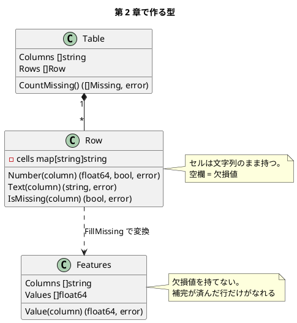
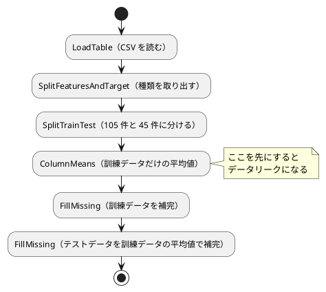

# 第 2 章: データの前処理と三角測量

## 2.1 はじめに

第 1 章では、欠損のないきれいなデータを読み込み、人間が書いたルールで判定しました。現実のデータには、空欄（欠損値）が混ざっています。

この章では、アヤメ（iris）のデータを題材に、欠損値を補完し、データを **訓練データ** と **テストデータ** に分けるところまでを TDD で実装します。

[Python 版の第 2 章](../python/02-data-preprocessing-and-triangulation.md)・[Kotlin 版の第 2 章](../kotlin/02-data-preprocessing-and-triangulation.md) と同じ TODO リストで進めます。Python 版は pandas、Kotlin 版は Kotlin DataFrame を使いましたが、Go 版は **データフレームのライブラリを使わず**、小さな表の型を自分で作ります。この立場は [TypeScript 版](../typescript/02-data-preprocessing-and-triangulation.md)・[Java 版](../java/02-data-preprocessing-and-triangulation.md) と同じです。Go でどう型を設計するか——欠損値をどう表すか、補完の前と後をどう区別するか、正解ラベルが文字列でも数値でも使える分割をどう書くか——に注目してください。

## 2.2 題材とデータ

### iris.csv

`iris.csv` には、アヤメの花 150 件の測定値と品種が記録されています。

| 列 | 意味 | Go 版での読み方 |
|----|------|---------------|
| がく片長さ | がく片の長さ | `row.Number("がく片長さ")` → `(float64, bool, error)` |
| がく片幅 | がく片の幅 | `row.Number("がく片幅")` → `(float64, bool, error)` |
| 花弁長さ | 花弁の長さ | `row.Number("花弁長さ")` → `(float64, bool, error)` |
| 花弁幅 | 花弁の幅 | `row.Number("花弁幅")` → `(float64, bool, error)` |
| 種類 | 品種（3 種類が 50 件ずつ） | `row.Text("種類")` → `(string, error)` |

特徴量の 4 列には合わせて 7 件の欠損値があります。Kotlin DataFrame は欠損値を含む列を `Double?` として、Java 版は空の `OptionalDouble` として読み込みました。Go には `null` 許容型も `Optional` もありません。第 1 章で使った **カンマ ok** の慣習をそのまま延長して、`(値, 値があるか, エラー)` の 3 値で返します。

### 訓練データとテストデータ

モデルの良し悪しは、学習に使っていないデータでどれだけ当たるかで測ります。そこで、150 件を 7 対 3 の 105 件（訓練データ）と 45 件（テストデータ）に分けます。欠損値を補完する平均値は **訓練データだけ** から求め、その値で両方を補完します。データ全体の平均値を使うと、テストデータの情報が学習側に漏れるためです（データリーク）。

### ほかの言語版と数値が変わる理由

分け方の手順（シード付きでシャッフルし、テストデータの件数を切り上げる）はほかの言語版と同じです。ただし乱数生成器が違います。Go 版は標準ライブラリの `math/rand` を使うので、NumPy とも Kotlin の `kotlin.random.Random` とも、Java 版・Scala 版の `java.util.Random` とも、C# 版の `Random` とも乱数列が一致しません。

たとえば 0 から 9 までを同じ手順・同じシード 0 で並べ替えると、Go と Java では次のように別の並びになります。

| 版 | `Shuffle([0..9], 0)` の結果 |
|----|---------------------------|
| Go（`math/rand`） | `[6 8 2 3 7 5 9 1 0 4]` |
| Java（`java.util.Random`） | `[4 8 9 6 3 5 2 1 7 0]` |

件数は同じ 105 件と 45 件ですが、どの行がテストデータに入るかは一致しません。第 3 章以降の正解率などの数値は、すべて Go 版の実測値です。

## 2.3 開発環境の準備

この章では依存を追加しません。CSV の読み込みも前処理も、第 1 章と同じ標準ライブラリ（`os`・`strings`・`strconv`・`math`・`math/rand`・`slices`）で書きます。`go.sum` はまだ生まれません。

データフレームのライブラリを使わないのは、Go に定番と呼べるものが無いからだけではありません。表の操作をライブラリに任せず自分で書くことで、欠損値の表し方や補完の前後の区別を、型の設計として考えられるからです。ライブラリの選定理由は [ADR 008](../../../adr/008-go-ml-libraries.md) を参照してください。

## 2.4 TODO リストの作成

**TODO リスト**:

- [ ] iris.csv を読み込む
  - [ ] BOM 付き CSV の列名に BOM が残らない
  - [ ] 空欄を欠損値（`ok == false`）として読み込む
  - [ ] 行末の空欄も欠損値として読み込む
- [ ] 列ごとの欠損値の数を数える
- [ ] 列ごとの平均値を求める
- [ ] 欠損値を補完する
  - [ ] 列ごとに指定した値で補完する
  - [ ] 元のデータは変更しない
- [ ] 特徴量と正解ラベルに分ける
- [ ] 訓練データとテストデータに分ける
  - [ ] テストデータの割合どおりの件数に分ける
  - [ ] すべての行を重複なくどちらかに入れる
  - [ ] 特徴量と正解ラベルの対応を保つ
  - [ ] 同じシードなら同じ分け方になる
  - [ ] シードが違えば違う分け方になる
- [ ] 訓練データの平均値で両方を補完する
- [ ] 実データで前処理の結果を表示する

Kotlin 版の TODO リストに「行末の空欄も欠損値として読み込む」を加えています。自分で CSV を分割するので、ライブラリが面倒を見てくれていた落とし穴を自分で踏むことになるためです（2.5 節）。

## 2.5 自作の表で読み込む

### データの表し方を決める

データフレームのライブラリを使わない代わりに、次の 3 つの型を作ります。



肝は **`Row` と `Features` を別の型にする** ことです。`Row` は空欄を持てますが、`Features` は `[]float64` なので持てません。補完していない行をうっかりモデルに渡すと、コンパイルが通りません。Java 版・C# 版と同じ設計判断です。

`Row` が内部に持つのは `map[string]string` で、これは **非公開のフィールド** です。Go では小文字で始まるフィールドはパッケージの外から見えないので、`NewRow` を通してしか作れず、中身を後から書き換えられません。

### テストファースト

CSV の読み込みから始めます。第 1 章と同じく、学習データそのものは使わず、`t.TempDir()` に架空の値を書きます。

```go
// internal/chapter02/table_test.go
package chapter02_test

const header = "\uFEFFがく片長さ,がく片幅,花弁長さ,花弁幅,種類\n"

func writeCSV(t *testing.T, rows string) string {
	t.Helper()

	path := filepath.Join(t.TempDir(), "iris.csv")
	if err := os.WriteFile(path, []byte(header+rows), 0o600); err != nil {
		t.Fatalf("CSV を書けません: %v", err)
	}

	return path
}

func loadTable(t *testing.T, rows string) chapter02.Table {
	t.Helper()

	table, err := chapter02.LoadTable(writeCSV(t, rows))
	if err != nil {
		t.Fatalf("LoadTable() でエラー: %v", err)
	}

	return table
}

func TestLoadTable(t *testing.T) {
	t.Parallel()

	t.Run("CSV を読み込むと列名の並びを保ち、BOM は残らない", func(t *testing.T) {
		t.Parallel()

		table := loadTable(t, "0.1,0.2,0.3,0.4,Iris-setosa\n")

		want := []string{"がく片長さ", "がく片幅", "花弁長さ", "花弁幅", "種類"}
		if !reflect.DeepEqual(table.Columns, want) {
			t.Errorf("列名 = %v, want %v", table.Columns, want)
		}
	})

	t.Run("空欄は欠損値として読み込む", func(t *testing.T) {
		t.Parallel()

		row := loadTable(t, "0.1,,0.3,0.4,Iris-setosa\n").Rows[0]

		if _, ok, err := row.Number("がく片幅"); err != nil || ok {
			t.Errorf("がく片幅 = (ok=%v, err=%v), want ok=false", ok, err)
		}

		value, ok, err := row.Number("がく片長さ")
		if err != nil || !ok || value != 0.1 {
			t.Errorf("がく片長さ = (%v, %v, %v), want (0.1, true, nil)", value, ok, err)
		}
	})
}
```

第 1 章では表駆動テストを使いましたが、ここでは `t.Run` を並べています。検査する内容がケースごとに違う（列名を比べる／欠損値かどうかを見る）ので、同じ表に押し込むとかえって読みにくくなるためです。表駆動にするのは「同じ検査を違う入力で繰り返すとき」だけにします。

`loadTable` は、読み込みの `error` をその場で受け止めて `Table` だけを返す補助関数です。Go では失敗しうる関数を呼ぶたびに `if err != nil` を書くことになるので、テストの本文が定型文で埋まります。`t.Helper()` を付けた補助関数にまとめると、テストの意図だけが残ります。

### Red: 失敗を確認する

第 1 章と同じく、まずパッケージの宣言だけを置いてコンパイルエラーを確認します。

```bash
go test ./internal/chapter02/
```

```text
# github.com/k2works/getting-started-machine-learning/apps/go/internal/chapter02_test [.../chapter02.test]
internal/chapter02/table_test.go:25:53: undefined: chapter02.Table
internal/chapter02/table_test.go:28:26: undefined: chapter02.LoadTable
internal/chapter02/table_test.go:82:20: undefined: chapter02.NewRow
internal/chapter02/table_test.go:98:20: undefined: chapter02.NewRow
internal/chapter02/table_test.go:116:23: undefined: chapter02.Missing
```

### Green: 明白な実装

第 1 章で `LoadPeople` を書いたときと同じ形なので、仮実装を挟まずに書きます。

> 明白な実装
>
> シンプルな操作を実現するにはどうすればよいだろうか——そのまま実装しよう。
>
> — テスト駆動開発

```go
// Row は CSV の 1 行。セルの文字列を列名で引けるように持つ。空欄は欠損値として扱う。
type Row struct {
	cells map[string]string
}

// NewRow はセルの対応表から行を作る。渡した map を写すので、後から変えても影響しない。
func NewRow(cells map[string]string) Row {
	copied := make(map[string]string, len(cells))
	for name, value := range cells {
		copied[name] = value
	}

	return Row{cells: copied}
}

// Number は数値の列を読む。空欄なら ok が false になる。
func (r Row) Number(column string) (float64, bool, error) {
	cell, err := r.Text(column)
	if err != nil {
		return 0, false, err
	}

	if strings.TrimSpace(cell) == "" {
		return 0, false, nil
	}

	value, err := strconv.ParseFloat(cell, 64)
	if err != nil {
		return 0, false, fmt.Errorf("%s を数値として読めません: %w", column, err)
	}

	return value, true, nil
}

// Text は文字列の列を読む。列が無ければエラーを返す。
func (r Row) Text(column string) (string, error) {
	cell, ok := r.cells[column]
	if !ok {
		return "", fmt.Errorf("列がありません: %s", column)
	}

	return cell, nil
}

// IsMissing はセルが空欄かどうかを返す。
func (r Row) IsMissing(column string) (bool, error) {
	cell, err := r.Text(column)
	if err != nil {
		return false, err
	}

	return strings.TrimSpace(cell) == "", nil
}
```

`func (r Row) Number(...)` の `(r Row)` は **レシーバー**で、この関数が `Row` のメソッドであることを表します。Java や Kotlin のように型の宣言の中にメソッドを書くのではなく、型とは別の場所に並べます。

- レシーバーが **値**（`r Row`）なので、メソッドは `Row` の写しを受け取ります。ポインタ（`r *Row`）にすれば元の値を変更できますが、`Row` は読むだけの型なので値にしています
- `Number` の戻り値は `(float64, bool, error)` の 3 つです。「値」「値があるか」「読み取りに失敗したか」を分けています。`ok == false` は正常な欠損値、`err != nil` は列名の間違いや数値でない文字列で、意味が違うので混ぜません
- `NewRow` は受け取った `map` を写します。Go の `map` は参照なので、写さずに持つと呼び出し側の変更が `Row` に透けてしまいます。Java 版の `Map.copyOf`、C# 版の `ToFrozenDictionary` に当たる防御です

この「写す」振る舞いは、テストで約束しておきます。

```go
	t.Run("Row は受け取った map を写して持ち、元の map の変更の影響を受けない", func(t *testing.T) {
		t.Parallel()

		cells := map[string]string{"がく片長さ": "0.1"}
		row := chapter02.NewRow(cells)
		cells["がく片長さ"] = "0.9"

		if value, _, _ := row.Number("がく片長さ"); value != 0.1 {
			t.Errorf("がく片長さ = %v, want 0.1", value)
		}
	})
```

表そのものは、第 1 章の `LoadPeople` とほぼ同じ手順で読みます。

```go
// Table は列名の並びと行のリスト。データフレームのライブラリの代わりに使う。
type Table struct {
	Columns []string
	Rows    []Row
}

// LoadTable は BOM 付きの UTF-8 の CSV を読み込む。
func LoadTable(csvFile string) (Table, error) {
	content, err := os.ReadFile(csvFile)
	if err != nil {
		return Table{}, fmt.Errorf("CSV を読めません: %w", err)
	}

	lines := strings.Split(strings.ReplaceAll(string(content), "\r\n", "\n"), "\n")
	columns := strings.Split(strings.TrimPrefix(lines[0], bom), ",")
	rows := make([]Row, 0, len(lines)-1)

	for _, line := range lines[1:] {
		if strings.TrimSpace(line) == "" {
			continue
		}

		values := strings.Split(line, ",")
		cells := make(map[string]string, len(columns))

		for i, name := range columns {
			if i < len(values) {
				cells[name] = values[i]
			} else {
				cells[name] = ""
			}
		}

		rows = append(rows, NewRow(cells))
	}

	return Table{Columns: columns, Rows: rows}, nil
}
```

`Table` は列名の並び（`Columns`）を持ちます。`map` は反復の順序が実行のたびに変わるので、列の順を保つには別にスライスで持つしかありません。この「順序付きの map」が要る場面は Go では珍しくなく、毎回この形で書きます。

### 行末の空欄と `strings.Split`

TODO リストに入れた「行末の空欄も欠損値として読み込む」は、Java 版では落とし穴でした。Java の `String.split(",")` は末尾の空文字列を落とすので、`"0.1,0.2,0.3,,"` が 3 要素になってしまいます。Go ではどうなるかをテストで確かめます。

```go
	t.Run("行の最後の列が空欄でも欠損値として読み込む", func(t *testing.T) {
		t.Parallel()

		row := loadTable(t, "0.1,0.2,0.3,,\n").Rows[0]

		if _, ok, _ := row.Number("花弁幅"); ok {
			t.Error("花弁幅 は欠損値のはず")
		}

		if text, err := row.Text("種類"); err != nil || text != "" {
			t.Errorf("種類 = (%q, %v), want (\"\", nil)", text, err)
		}
	})
```

このテストは、上の実装のまま通ります。`strings.Split` は区切り文字の数だけ必ず分けるので、末尾の空文字列も残るからです。

```text
["0.1" "0.2" "0.3" "" ""] 5
```

| 言語 | `"0.1,0.2,0.3,,"` を `,` で分けた結果 |
|------|------------------------------------|
| Java | `["0.1", "0.2", "0.3"]`（末尾の空文字列を落とす） |
| Go | `["0.1" "0.2" "0.3" "" ""]`（落とさない） |

Java 版が `split(",", -1)` の `-1` を思い出さなければならなかったのに対し、Go は既定の振る舞いが素直です。「同じ名前の関数でも、言語によって既定が違う」ことを、テストが先に教えてくれます。

`LoadTable` の `else { cells[name] = "" }` は、行のフィールドが列より **少ない** 場合（`"0.1,0.2"` のような壊れた行）への備えです。この枝を外すと、その列は `map` に入らないので `Text` が「列がありません」を返し、欠損値と区別がつかなくなります。

```text
IsMissing() でエラー: 列がありません: 花弁幅
```

「列名の間違い」と「欠損値」を別の返し方にしたので、どちらなのかがテストの失敗メッセージから読めます。

### 列ごとの欠損値の数

```go
// Missing は列名と欠損値の数の組。列の順に並べて返す。
type Missing struct {
	Column string
	Count  int
}

// CountMissing は列ごとの欠損値の数を、列の順に並べて返す。
func (t Table) CountMissing() ([]Missing, error) {
	counts := make([]Missing, 0, len(t.Columns))

	for _, column := range t.Columns {
		count := 0

		for _, row := range t.Rows {
			missing, err := row.IsMissing(column)
			if err != nil {
				return nil, err
			}

			if missing {
				count++
			}
		}

		counts = append(counts, Missing{Column: column, Count: count})
	}

	return counts, nil
}
```

戻り値を `map[string]int` ではなく `[]Missing` にしたのは、列の順を保つためです。Go の `map` は反復順が **意図的に** ランダム化されているので、`map` を返すと表示の順が毎回変わり、テストも書けません。「順序が意味を持つなら map を返さない」は Go でよく効く指針です。

テストは `reflect.DeepEqual` で丸ごと比べます。

```go
	t.Run("列ごとの欠損値の数を列の順に数える", func(t *testing.T) {
		t.Parallel()

		table := loadTable(t, "0.1,0.2,0.3,0.4,Iris-setosa\n,0.3,0.5,0.6,Iris-setosa\n,,0.7,0.8,Iris-virginica\n")

		got, err := table.CountMissing()
		if err != nil {
			t.Fatalf("CountMissing() でエラー: %v", err)
		}

		want := []chapter02.Missing{
			{Column: "がく片長さ", Count: 2},
			{Column: "がく片幅", Count: 1},
			{Column: "花弁長さ", Count: 0},
			{Column: "花弁幅", Count: 0},
			{Column: "種類", Count: 0},
		}
		if !reflect.DeepEqual(got, want) {
			t.Errorf("CountMissing() = %v, want %v", got, want)
		}
	})
```

**TODO リスト**:

- [x] iris.csv を読み込む
- [x] 列ごとの欠損値の数を数える
- [ ] 列ごとの平均値を求める
- [ ] 欠損値を補完する
- [ ] 特徴量と正解ラベルに分ける
- [ ] 訓練データとテストデータに分ける
- [ ] 訓練データの平均値で両方を補完する
- [ ] 実データで前処理の結果を表示する

## 2.6 平均値で欠損値を補完する

### 平均値を求める

欠損値を除いた平均値を、列ごとに求めます。テストの入力は 1 行あたり 2 列だけの架空の値です。

```go
func sample(sepalLength, sepalWidth string) chapter02.Row {
	return chapter02.NewRow(map[string]string{"がく片長さ": sepalLength, "がく片幅": sepalWidth})
}

func TestColumnMeans(t *testing.T) {
	t.Parallel()

	rows := []chapter02.Row{sample("0.1", "0.2"), sample("", "0.4"), sample("0.3", "0.9")}

	means, err := chapter02.ColumnMeans(rows, []string{"がく片長さ", "がく片幅"})
	if err != nil {
		t.Fatalf("ColumnMeans() でエラー: %v", err)
	}

	if math.Abs(means["がく片長さ"]-0.2) > 1e-12 || math.Abs(means["がく片幅"]-0.5) > 1e-12 {
		t.Errorf("平均値 = %v, want がく片長さ 0.2・がく片幅 0.5", means)
	}
}
```

`がく片長さ` は空欄を除いた `0.1` と `0.3` の平均で 0.2、`がく片幅` は 3 件の平均で 0.5 です。1 本のテストで「欠損を飛ばす」ことと「残りで平均を取る」ことの両方を約束しています。

```go
// ColumnMeans は欠損値を除いて、列ごとの平均値を求める。
func ColumnMeans(rows []Row, columns []string) (map[string]float64, error) {
	means := make(map[string]float64, len(columns))

	for _, column := range columns {
		sum, count := 0.0, 0

		for _, row := range rows {
			value, ok, err := row.Number(column)
			if err != nil {
				return nil, err
			}

			if ok {
				sum += value
				count++
			}
		}

		if count == 0 {
			return nil, fmt.Errorf("値がすべて空欄です: %s", column)
		}

		means[column] = sum / float64(count)
	}

	return means, nil
}
```

ここでは戻り値に `map` を使っています。補完するときに列名で引くだけで、順に並べる用途が無いからです。`CountMissing` が `[]Missing` を返したのと使い分けています。

`count == 0`（列の値が全部空欄）は、0 で割って `NaN` を返すより、エラーにするほうが親切です。Go の `float64` は 0 除算で例外にならず、黙って `NaN` や `+Inf` になります。「黙って壊れた値が下流に流れる」ことを防ぐのは、呼ばれる側の責任です。

### 補完して特徴量にする

補完の結果は `Row` ではなく `Features` にします。

```go
// Features は補完が済んだ 1 行分の特徴量。欠損値を持てないので、補完する前の行をモデルに渡せない。
type Features struct {
	Columns []string
	Values  []float64
}

// NewFeatures は列名と値から特徴量を作る。数が違えばエラーを返す。
func NewFeatures(columns []string, values []float64) (Features, error) {
	if len(columns) != len(values) {
		return Features{}, fmt.Errorf("列名と値の数が違います: %d と %d", len(columns), len(values))
	}

	return Features{Columns: slices.Clone(columns), Values: slices.Clone(values)}, nil
}

// Value は列名で値を読む。
func (f Features) Value(column string) (float64, error) {
	index := slices.Index(f.Columns, column)
	if index < 0 {
		return 0, fmt.Errorf("列がありません: %s", column)
	}

	return f.Values[index], nil
}
```

`slices.Clone` で両方のスライスを写しています。`Row` の `map` と同じ理由で、呼び出し側が持つスライスの変更が `Features` に透けないようにするためです。`slices` は Go 1.21 から標準ライブラリに入ったパッケージで、`Clone`・`Index`・`Sort` などのジェネリックな関数がそろっています。

補完の本体は、列の順に値を取り出し、欠損なら指定された値で埋めるだけです。

```go
// FillMissing は欠損値を列ごとに指定した値で補完し、特徴量にする。元の行は変更しない。
func FillMissing(rows []Row, columns []string, values map[string]float64) ([]Features, error) {
	filled := make([]Features, 0, len(rows))

	for _, row := range rows {
		numbers := make([]float64, len(columns))

		for i, column := range columns {
			value, ok, err := row.Number(column)
			if err != nil {
				return nil, err
			}

			if !ok {
				fill, found := values[column]
				if !found {
					return nil, fmt.Errorf("補完する値がありません: %s", column)
				}

				value = fill
			}

			numbers[i] = value
		}

		features, err := NewFeatures(columns, numbers)
		if err != nil {
			return nil, err
		}

		filled = append(filled, features)
	}

	return filled, nil
}
```

テストでは「補完の結果」と「元の行が変わっていないこと」の両方を確かめます。

```go
func TestFillMissing(t *testing.T) {
	t.Parallel()

	columns := []string{"がく片長さ", "がく片幅"}
	rows := []chapter02.Row{sample("0.1", ""), sample("", "0.4")}

	filled, err := chapter02.FillMissing(rows, columns, map[string]float64{"がく片長さ": 0.2, "がく片幅": 0.5})
	if err != nil {
		t.Fatalf("FillMissing() でエラー: %v", err)
	}

	want := []chapter02.Features{
		features(t, columns, []float64{0.1, 0.5}),
		features(t, columns, []float64{0.2, 0.4}),
	}
	if !reflect.DeepEqual(filled, want) {
		t.Errorf("FillMissing() = %v, want %v", filled, want)
	}

	if missing, _ := rows[0].IsMissing("がく片幅"); !missing {
		t.Error("元の行は変更しないはず")
	}
}
```

### `Features` をなぜ `==` で比べられないのか

第 1 章の `Person` は、フィールドが `int` と `string` だけだったので `==` で比較できました。`Features` はフィールドがスライスなので、`==` はコンパイルエラーになります。

| 言語 | 値の比較 | 補完後の型の比較 |
|------|---------|----------------|
| Java | record が `equals` を自動生成 | `List` の `equals` が中身を比べる |
| Kotlin | data class が `equals` を自動生成 | 同上 |
| TypeScript | 構造的型付け | Vitest の `toEqual` が再帰的に比べる |
| Go | 比較可能なフィールドだけの構造体は `==` | スライスを含むと `==` 不可。`reflect.DeepEqual` を使う |

Go でスライスを `==` で比べられないのは、「参照が同じか」と「中身が同じか」のどちらを意味させるかが決まらないからです。`nil` のスライスと長さ 0 のスライスをどう扱うかという問題もあります（`reflect.DeepEqual` はこの 2 つを **違う** と判定します）。この性質は 2.8 節の分割の実装に効いてきます。

なお `Features` を「列名と値を持つ構造体」にして `map[string]float64` にしなかったのは、順序を保つためと、第 7 章以降で行列に変換しやすくするためです。`map` にすると列の順が定まらず、モデルに渡す特徴量の並びが実行のたびに変わってしまいます。

## 2.7 特徴量と正解ラベルに分ける

正解ラベルの列（`種類`）を取り出し、残りを特徴量の列にします。

```go
// Target は正解ラベルの列。
const Target = "種類"

// SplitFeaturesAndTarget は正解ラベルの列を取り出し、残りの列を特徴量の列にする。
func SplitFeaturesAndTarget(table Table, target string) ([]string, []Row, []string, error) {
	columns := make([]string, 0, len(table.Columns))

	for _, column := range table.Columns {
		if column != target {
			columns = append(columns, column)
		}
	}

	labels := make([]string, 0, len(table.Rows))

	for _, row := range table.Rows {
		label, err := row.Text(target)
		if err != nil {
			return nil, nil, nil, err
		}

		labels = append(labels, label)
	}

	return columns, table.Rows, labels, nil
}
```

戻り値が 4 つになりました。Go の多値返却は便利ですが、ここが限界です。`([]string, []Row, []string, error)` という型だけでは、1 つ目と 3 つ目のどちらが列名でどちらがラベルなのかが読み取れません。呼び出し側で変数に名前を付けて初めて意味が通ります。

```go
	columns, rows, labels, err := SplitFeaturesAndTarget(table, Target)
```

Java 版・C# 版はここで組を表す型を作りました。Go でも同じようにできますが、この関数は `PrepareIris` からしか呼ばれない内部の手続きなので、型を増やさず多値のままにしています。**戻り値が 3 つを超え、かつ複数の場所から呼ばれるなら構造体にする** というのが、この先の章でも使う目安です。次の節で作る `TrainTestSplit` は、まさにその「構造体にしたほうがよい」側の例です。

第 1 章では正解ラベルを取り出すときに `Person` から `Features` へ写しましたが、ここでは `table.Rows` をそのまま返しています。補完は分割の **後** に行うので、この時点ではまだ `Row` のままにしておく必要があるからです。

## 2.8 訓練データとテストデータに分ける

### 分割結果をジェネリクスで表す

分割の結果は、4 本のスライス（訓練の特徴量・テストの特徴量・訓練のラベル・テストのラベル）です。多値返却で 4 つ返すと上と同じ読みにくさになるので、構造体にします。

```go
// TrainTestSplit は訓練データとテストデータ。X は特徴量の型、T は正解ラベルの型。
type TrainTestSplit[X, T any] struct {
	XTrain []X
	XTest  []X
	TTrain []T
	TTest  []T
}
```

`[X, T any]` は Go 1.18 から使える **型パラメータ**（ジェネリクス）です。`any` は「どんな型でもよい」という制約で、`interface{}` の別名です。

この章では `X` が `Features`、`T` が `string`（品種）ですが、第 7 章の回帰では `T` が `float64` になります。ジェネリクスにしておけば、同じ分割の関数を両方で使えます。

```go
	// 分類（第 3 章）
	var classification TrainTestSplit[Features, string]
	// 回帰（第 7 章）
	var regression TrainTestSplit[Features, float64]
```

| 言語 | 分割結果の表し方 |
|------|---------------|
| Java | `record TrainTestSplit<X, T>(List<X> xTrain, ...)` |
| Kotlin | `data class TrainTestSplit<X, T>(...)` |
| TypeScript | `type TrainTestSplit<X, T> = { xTrain: X[]; ... }` |
| Go | `type TrainTestSplit[X, T any] struct { XTrain []X; ... }` |

書き味はほとんど同じです。違うのは、Go のジェネリクスには **共変性がない**（`TrainTestSplit[Features, string]` を `TrainTestSplit[any, any]` として扱えない）ことと、型パラメータに対してメソッドを追加できないことです。この章の範囲では困りません。

### 仮実装

まず「7 対 3 に分かれること」だけをテストにします。

```go
	t.Run("テストデータの割合どおりの件数に分ける", func(t *testing.T) {
		t.Parallel()

		split, err := chapter02.SplitTrainTest(numbers, labels, 0.3, 0)
		if err != nil {
			t.Fatalf("SplitTrainTest() でエラー: %v", err)
		}

		if len(split.XTrain) != 7 || len(split.XTest) != 3 {
			t.Errorf("件数 = (%d, %d), want (7, 3)", len(split.XTrain), len(split.XTest))
		}

		if len(split.TTrain) != 7 || len(split.TTest) != 3 {
			t.Errorf("正解ラベルの件数 = (%d, %d), want (7, 3)", len(split.TTrain), len(split.TTest))
		}
	})
```

> 仮実装を経て本実装へ
>
> 失敗するテストを書いてから、最初に行う実装はどのようなものだろうか——ベタ書きの値を返そう。
>
> — テスト駆動開発

```go
// SplitTrainTest は訓練データとテストデータに分ける。
func SplitTrainTest[X, T any](x []X, t []T, testSize float64, seed int64) (TrainTestSplit[X, T], error) {
	return TrainTestSplit[X, T]{XTrain: x[:7], XTest: x[7:], TTrain: t[:7], TTest: t[7:]}, nil
}
```

`x[:7]` はスライスの先頭 7 件を指す **部分スライス**です。写しではなく元の配列を共有しますが、ここでは読むだけなので問題ありません。

この段階では `testSize` も `seed` も使っていません。第 1 章で触れたとおり、Go は使われていないローカル変数をコンパイルエラーにしますが、使われていない引数は通します。

### 三角測量: 件数を一般化する

> 三角測量
>
> テストから最も慎重に一般化を引き出すやり方はどのようなものだろうか——2 つ以上の例があるときだけ、一般化を行うようにしよう。
>
> — テスト駆動開発

20 件を 0.25 で分ける例を足します。

```go
	t.Run("件数が変わってもテストデータの割合どおりに分ける", func(t *testing.T) {
		t.Parallel()

		twenty := make([]int, 20)
		for i := range twenty {
			twenty[i] = i
		}

		split, err := chapter02.SplitTrainTest(twenty, twenty, 0.25, 0)
		if err != nil {
			t.Fatalf("SplitTrainTest() でエラー: %v", err)
		}

		if len(split.XTrain) != 15 || len(split.XTest) != 5 {
			t.Errorf("件数 = (%d, %d), want (15, 5)", len(split.XTrain), len(split.XTest))
		}
	})
```

```text
    preprocessing_test.go:116: 件数 = (7, 13), want (15, 5)
--- FAIL: TestSplitTrainTest/件数が変わってもテストデータの割合どおりに分ける (0.00s)
```

件数を計算に置き換えます。

```go
	trainCount := len(x) - int(math.Ceil(float64(len(x))*testSize))

	return TrainTestSplit[X, T]{
		XTrain: x[:trainCount], XTest: x[trainCount:],
		TTrain: t[:trainCount], TTest: t[trainCount:],
	}, nil
```

テストデータの件数を `math.Ceil` で **切り上げ**、訓練データを残りにします。150 件 × 0.3 = 45.0 はちょうど割り切れますが、割り切れない件数でも scikit-learn と同じ分け方になるよう、Python 版・Kotlin 版と手順をそろえています。

`int(math.Ceil(float64(len(x))*testSize))` と 2 回変換しているのは、Go が数値型の暗黙の変換を行わないためです。冗長ですが、`int` どうしの割り算になってしまう事故が起きません。

### 三角測量: 並び順に頼らない分け方にする

いまの実装は「先頭から順に切る」だけなので、シードを変えても分け方が変わりません。そこをテストで突きます。

```go
	t.Run("同じシードなら同じ分け方になる", func(t *testing.T) {
		t.Parallel()

		first, _ := chapter02.SplitTrainTest(numbers, labels, 0.3, 42)
		second, _ := chapter02.SplitTrainTest(numbers, labels, 0.3, 42)

		if !reflect.DeepEqual(first.TTest, second.TTest) {
			t.Errorf("同じシードで違う分け方: %v と %v", first.TTest, second.TTest)
		}
	})

	t.Run("シードが違えば違う分け方になる", func(t *testing.T) {
		t.Parallel()

		first, _ := chapter02.SplitTrainTest(numbers, labels, 0.3, 0)
		second, _ := chapter02.SplitTrainTest(numbers, labels, 0.3, 1)

		if reflect.DeepEqual(first.TTest, second.TTest) {
			t.Errorf("違うシードで同じ分け方: %v", first.TTest)
		}
	})
```

```text
    preprocessing_test.go:169: 違うシードで同じ分け方: [label7 label8 label9]
--- PASS: TestSplitTrainTest/件数が変わってもテストデータの割合どおりに分ける (0.00s)
--- PASS: TestSplitTrainTest/すべての行を重複なく訓練データとテストデータのどちらかに入れる (0.00s)
--- PASS: TestSplitTrainTest/同じシードなら同じ分け方になる (0.00s)
--- FAIL: TestSplitTrainTest/シードが違えば違う分け方になる (0.00s)
```

「同じシードなら同じ」は仮実装でも通ります（いつも同じ結果なので）。通るテストと落ちるテストが 1 組そろって初めて、シャッフルを入れる理由がはっきりします。

### Green: シード付きの乱数で並べ替える

```go
// Shuffle はシードを使って Fisher-Yates のシャッフルで並べ替える。元のスライスは変更しない。
func Shuffle[E any](items []E, seed int64) []E {
	random := rand.New(rand.NewSource(seed)) //nolint:gosec // 再現できる分割のための擬似乱数で、暗号用途ではない
	shuffled := slices.Clone(items)

	for i := len(shuffled) - 1; i >= 1; i-- {
		j := random.Intn(i + 1)
		shuffled[i], shuffled[j] = shuffled[j], shuffled[i]
	}

	return shuffled
}
```

- `rand.New(rand.NewSource(seed))` は、シードから決まる乱数生成器を新しく作ります。パッケージ変数の `rand.Intn` を直接呼ぶと、プログラム全体で 1 つの生成器を共有してしまい、並行に走るテストどうしが干渉します。**生成器を引数から作る** のが、再現できる実験の基本です
- `shuffled[i], shuffled[j] = shuffled[j], shuffled[i]` は Go の多重代入です。右辺が先に評価されるので、一時変数なしで入れ替えられます
- `slices.Clone` で写してから並べ替えるので、呼び出し側のスライスは変わりません

#### `//nolint:gosec` は何を黙らせているのか

`math/rand` は暗号用途には使えない擬似乱数です。[gosec](https://github.com/securego/gosec) という検査器を有効にすると、次のように指摘されます。

```text
internal/chapter02/preprocessing.go:137:12: G404: Use of weak random number generator (math/rand or math/rand/v2 instead of crypto/rand) (gosec)
	random := rand.New(rand.NewSource(seed))
	          ^
```

ここでは「シードから同じ並びを再現できること」が目的なので、`crypto/rand` に替えるわけにはいきません。そこで、行末に `//nolint:検査器名 // 理由` を書いて、その 1 行だけ指摘を抑えます。

```go
	random := rand.New(rand.NewSource(seed)) //nolint:gosec // 再現できる分割のための擬似乱数で、暗号用途ではない
```

`golangci-lint` の既定の検査器に gosec は含まれていないので、いまの設定では指摘されません。それでも書いておくのは、将来 gosec を有効にしたときに「見落とし」ではなく「判断済み」だと分かるようにするためです。抑制には必ず理由を添えます。理由の無い `//nolint` は、次に読む人が消してよいのかどうか判断できません。

#### 特徴量とラベルの対応を保つ

特徴量とラベルを別々にシャッフルすると対応が壊れます。組にしてから並べ替えます。

```go
// pair は並べ替えのあいだ、特徴量と正解ラベルの対応を保つための組。
type pair[X, T any] struct {
	x X
	t T
}

// SplitTrainTest は並べ替えてから、テストデータの割合（切り上げ）で訓練データとテストデータに分ける。
func SplitTrainTest[X, T any](x []X, t []T, testSize float64, seed int64) (TrainTestSplit[X, T], error) {
	if len(x) != len(t) {
		return TrainTestSplit[X, T]{}, fmt.Errorf("特徴量と正解ラベルの件数が違います: %d と %d", len(x), len(t))
	}

	pairs := make([]pair[X, T], len(x))
	for i := range x {
		pairs[i] = pair[X, T]{x: x[i], t: t[i]}
	}

	shuffled := Shuffle(pairs, seed)
	trainCount := len(shuffled) - int(math.Ceil(float64(len(shuffled))*testSize))
	split := TrainTestSplit[X, T]{}

	for i, p := range shuffled {
		if i < trainCount {
			split.XTrain = append(split.XTrain, p.x)
			split.TTrain = append(split.TTrain, p.t)
		} else {
			split.XTest = append(split.XTest, p.x)
			split.TTest = append(split.TTest, p.t)
		}
	}

	return split, nil
}
```

`pair` は小文字で始まるので、パッケージの外からは見えません。「並べ替えのあいだだけ使う道具」を公開しないで済むのが、Go の名前による可視性の使いどころです。

件数が違えばエラーにします。仮実装のままこのテストを走らせると、エラーではなく `panic` になります。

```text
--- FAIL: TestSplitTrainTest/件数が違えばエラーになる (0.00s)
panic: runtime error: slice bounds out of range [7:5] [recovered, repanicked]
```

`x[:7]` のような部分スライスは、範囲を超えると実行時に `panic` します。Go で `panic` はプログラムの誤りを表す仕組みで、ライブラリの入口で入力を検査して `error` に変えるのが作法です。第 1 章の `Accuracy` と同じ判断です。

#### ほかの言語版と分け方が一致しない

これで「同じシードなら同じ分け方」「シードが違えば違う分け方」の両方が通ります。ただし、同じ手順でも乱数生成器が違えば並びは違います。

```go
	numbers := []int{0, 1, 2, 3, 4, 5, 6, 7, 8, 9}
	chapter02.Shuffle(numbers, 0) // [6 8 2 3 7 5 9 1 0 4]
	chapter02.Shuffle(numbers, 1) // [4 8 2 5 3 9 0 7 6 1]
```

Java 版の `java.util.Random` はシード 0 で `[4 8 9 6 3 5 2 1 7 0]` を返します。件数（7 対 3）だけが一致し、どの要素がテストデータに入るかは一致しません。この事実は、実データのテストのコメントにも残してあります。

**TODO リスト**:

- [x] 列ごとの平均値を求める
- [x] 欠損値を補完する
- [x] 特徴量と正解ラベルに分ける
- [x] 訓練データとテストデータに分ける
- [ ] 訓練データの平均値で両方を補完する
- [ ] 実データで前処理の結果を表示する

## 2.9 前処理をまとめる

ここまでの部品を、正しい順番で 1 本につなぎます。順番が肝心です。**分けてから、訓練データだけで平均値を求め、その値で両方を補完します。**



```go
// PrepareIris は iris.csv を読み込み、分割してから訓練データの平均値で両方を補完する。
func PrepareIris(csvFile string, testSize float64, seed int64) (TrainTestSplit[Features, string], error) {
	table, err := LoadTable(csvFile)
	if err != nil {
		return TrainTestSplit[Features, string]{}, err
	}

	columns, rows, labels, err := SplitFeaturesAndTarget(table, Target)
	if err != nil {
		return TrainTestSplit[Features, string]{}, err
	}

	split, err := SplitTrainTest(rows, labels, testSize, seed)
	if err != nil {
		return TrainTestSplit[Features, string]{}, err
	}

	means, err := ColumnMeans(split.XTrain, columns)
	if err != nil {
		return TrainTestSplit[Features, string]{}, err
	}

	xTrain, err := FillMissing(split.XTrain, columns, means)
	if err != nil {
		return TrainTestSplit[Features, string]{}, err
	}

	xTest, err := FillMissing(split.XTest, columns, means)
	if err != nil {
		return TrainTestSplit[Features, string]{}, err
	}

	return TrainTestSplit[Features, string]{XTrain: xTrain, XTest: xTest, TTrain: split.TTrain, TTest: split.TTest}, nil
}
```

`if err != nil { return TrainTestSplit[Features, string]{}, err }` が 6 回並びます。Go でよく批判される書き方ですが、この関数の場合は **6 か所すべてが本当に失敗しうる** ので、素直に並べています。

ここで注目したいのは、`SplitTrainTest` が 2 つの型で呼ばれていることです。

- `SplitTrainTest(rows, labels, ...)` → `TrainTestSplit[Row, string]`
- 戻り値は `TrainTestSplit[Features, string]`

分割の時点では補完していないので `Row`、補完の後は `Features` です。型パラメータを書かずに `SplitTrainTest(rows, labels, ...)` と呼べているのは、Go が引数から型を推論するからです。

そして、この 2 つの型は **混ぜられません**。`TrainTestSplit[Row, string]` を返り値の型のつもりで返すとコンパイルエラーになります。「補完していない行をモデルに渡せない」という約束を、型パラメータが 1 段深いところまで運んでくれます。

## 2.10 実データで前処理の結果を表示する

### 実データのテスト

第 1 章と同じく、学習データが無ければスキップします。

```go
// internal/chapter02/irisdata_test.go
func requireData(t *testing.T) string {
	t.Helper()

	csvFile := filepath.Join(dataset.Current(), "iris.csv")
	if _, err := os.Stat(csvFile); err != nil {
		t.Skip("学習データ iris.csv が配置されていない（gulp data:setup）")
	}

	return csvFile
}

func TestIrisData(t *testing.T) {
	t.Parallel()

	t.Run("実データの列ごとの欠損値の数を数える", func(t *testing.T) {
		t.Parallel()

		table, err := chapter02.LoadTable(requireData(t))
		if err != nil {
			t.Fatalf("LoadTable() でエラー: %v", err)
		}

		got, err := table.CountMissing()
		if err != nil {
			t.Fatalf("CountMissing() でエラー: %v", err)
		}

		want := []chapter02.Missing{
			{Column: "がく片長さ", Count: 2},
			{Column: "がく片幅", Count: 1},
			{Column: "花弁長さ", Count: 2},
			{Column: "花弁幅", Count: 2},
			{Column: "種類", Count: 0},
		}
		if !reflect.DeepEqual(got, want) {
			t.Errorf("CountMissing() = %v, want %v", got, want)
		}
	})

	t.Run("実データを 105 件と 45 件に分けて欠損値を補完する", func(t *testing.T) {
		t.Parallel()

		split, err := chapter02.PrepareIris(requireData(t), 0.3, 0)
		if err != nil {
			t.Fatalf("PrepareIris() でエラー: %v", err)
		}

		if len(split.XTrain) != 105 || len(split.XTest) != 45 {
			t.Errorf("件数 = (%d, %d), want (105, 45)", len(split.XTrain), len(split.XTest))
		}
	})
}
```

欠損値は `がく片長さ` 2 件、`がく片幅` 1 件、`花弁長さ` 2 件、`花弁幅` 2 件の合わせて 7 件で、これはすべての言語版で一致します。件数（105 件と 45 件）も一致します。

一致しないのは、訓練データに入る行から求めた平均値です。実測値をテストに固定して、コメントに理由を書いておきます。

```go
		// Go の math/rand は Java・Scala の java.util.Random とも .NET の Random とも
		// 乱数列が違うので、分かれる行と平均値はほかの言語版と一致しない
		wants := map[string]float64{
			"がく片長さ": 0.4145192307692307,
			"がく片幅":  0.41721153846153847,
			"花弁長さ":  0.4921153846153846,
			"花弁幅":   0.44086538461538455,
		}
		for column, want := range wants {
			if math.Abs(means[column]-want) > 1e-12 {
				t.Errorf("%s の平均値 = %v, want %v", column, means[column], want)
			}
		}
```

「一致しない」ことを知っていて固定しているのだと、コメントが無ければ後から読む人には分かりません。数値を単に貼るのではなく、**なぜその数値なのか** を一緒に置いておきます。

### 結果を表示する

第 1 章と同じく、書き出し先を `io.Writer` で受け取ります。

```go
// internal/chapter02/main.go
const (
	testSize = 0.3
	seed     = 0
)

// Run はアヤメのデータの前処理の結果を表示する。
func Run(out io.Writer) error {
	csvFile := filepath.Join(dataset.Current(), "iris.csv")

	table, err := LoadTable(csvFile)
	if err != nil {
		return err
	}

	counts, err := table.CountMissing()
	if err != nil {
		return err
	}

	split, err := PrepareIris(csvFile, testSize, seed)
	if err != nil {
		return err
	}

	formatted := make([]string, len(counts))
	for i, missing := range counts {
		formatted[i] = fmt.Sprintf("%s=%d", missing.Column, missing.Count)
	}

	lines := []string{
		fmt.Sprintf("データ件数: %d", len(table.Rows)),
		"欠損値の数: " + strings.Join(formatted, ", "),
		fmt.Sprintf("訓練データ: %d 件, テストデータ: %d 件", len(split.XTrain), len(split.XTest)),
		"特徴量: " + strings.Join(split.XTrain[0].Columns, ", "),
	}

	for _, line := range lines {
		if _, err := fmt.Fprintln(out, line); err != nil {
			return fmt.Errorf("表示できません: %w", err)
		}
	}

	return nil
}
```

表示したい行をいったん `[]string` に組み立ててから、まとめて書き出しています。`fmt.Fprintln` は毎回エラーを返すので、行ごとに `if _, err := ...` を書くと本文が見えなくなるためです。**エラーの検査を 1 か所に寄せる** と、何を表示したいのかが先に読めます。

`cmd/chapters/main.go` の表に 1 行足します。

```go
var chapters = map[string]func(io.Writer) error{
	"chapter01": chapter01.Run,
	"chapter02": chapter02.Run,
}
```

```bash
cd apps/go
go run ./cmd/chapters chapter02
```

```text
データ件数: 150
欠損値の数: がく片長さ=2, がく片幅=1, 花弁長さ=2, 花弁幅=2, 種類=0
訓練データ: 105 件, テストデータ: 45 件
特徴量: がく片長さ, がく片幅, 花弁長さ, 花弁幅
```

出力そのものもテストで固定しています。

```go
		want := "データ件数: 150\n" +
			"欠損値の数: がく片長さ=2, がく片幅=1, 花弁長さ=2, 花弁幅=2, 種類=0\n" +
			"訓練データ: 105 件, テストデータ: 45 件\n" +
			"特徴量: がく片長さ, がく片幅, 花弁長さ, 花弁幅\n"
		if out.String() != want {
			t.Errorf("出力 = %q, want %q", out.String(), want)
		}
```

`%q` を使うと、期待値と実際の値が引用符付きで並び、改行も `\n` として見えます。末尾の改行の有無のような、目で追いにくい違いを見つけられます。

**TODO リスト**:

- [x] iris.csv を読み込む
- [x] 列ごとの欠損値の数を数える
- [x] 列ごとの平均値を求める
- [x] 欠損値を補完する
- [x] 特徴量と正解ラベルに分ける
- [x] 訓練データとテストデータに分ける
- [x] 訓練データの平均値で両方を補完する
- [x] 実データで前処理の結果を表示する

## 2.11 リファクタリング

### テストの重複をまとめる

テストには 3 種類の補助関数を置きました。いずれも `t.Helper()` を呼んでいるので、失敗の位置には呼び出し元の行が出ます。

| 補助関数 | 役目 |
|---------|------|
| `writeCSV` | 一時ディレクトリに架空の CSV を書く |
| `loadTable` | 読み込みのエラーを受け止めて `Table` を返す |
| `sample`・`features` | 2 列だけの `Row`・`Features` を短く作る |

Go のテストには「エラーが返ってきたら失敗させる」ためのアサーションが無いので、この形の補助関数が自然に増えます。増やしすぎるとテストが読めなくなるので、**その `_test.go` の中だけで使う** ことを原則にしています。

### 整形と静的解析

第 1 章と同じ 4 つのコマンドを通します。

```bash
cd apps/go
gofmt -l .
go vet ./...
golangci-lint run
go test ./... -cover
```

```text
0 issues.
```

この章で新しく効いたのは、**使われていない import をコンパイラが止める** ことです。`SplitTrainTest` を仮実装に戻して失敗を確かめようとしたとき、`math.Ceil` を使わなくなったのに import を残していて、テストが実行されませんでした。

```text
# github.com/k2works/getting-started-machine-learning/apps/go/internal/chapter02
internal/chapter02/preprocessing.go:5:2: "math" imported and not used
FAIL	github.com/k2works/getting-started-machine-learning/apps/go/internal/chapter02 [build failed]
```

Java 版・TypeScript 版では、使われていない import は静的解析の警告でした。Go ではビルドが止まります。TDD で行きつ戻りつするときは少し煩わしいですが、「もう使っていないもの」がコードに残り続けないという保証にもなります。

### カバレッジ

```bash
go test ./... -cover
```

```text
ok  	github.com/k2works/.../internal/chapter01	coverage: 81.7% of statements
ok  	github.com/k2works/.../internal/chapter02	coverage: 84.1% of statements
```

学習データが無い環境では、実データのテストがスキップされるぶん `chapter02` は 60.5% に下がります。CI では常にこの状態です。

```bash
ML_DATA_DIR=/nonexistent go test ./... -cover
```

```text
ok  	github.com/k2works/.../internal/chapter02	coverage: 60.5% of statements
```

## 2.12 可視化について

Go 版には Notebook の節を設けません。欠損値の分布や、品種ごとの特徴量の散布図は、[Python 版の第 2 章](../python/02-data-preprocessing-and-triangulation.md) と [Kotlin 版の第 2 章](../kotlin/02-data-preprocessing-and-triangulation.md) の「Notebook で探索する」の節を参照してください。訓練データに入る行は言語ごとに違いますが、「`Iris-setosa` は花弁長さ・花弁幅がほかの 2 品種よりはっきり小さい」という傾向は同じで、第 3 章の決定木はこの傾向を自動で見つけます。

<details>
<summary>この章の完成コード（internal/chapter02/preprocessing.go）</summary>

```go
package chapter02

import (
	"fmt"
	"math"
	"math/rand"
	"slices"
)

// Target は正解ラベルの列。
const Target = "種類"

// Features は補完が済んだ 1 行分の特徴量。欠損値を持てないので、補完する前の行をモデルに渡せない。
type Features struct {
	Columns []string
	Values  []float64
}

// NewFeatures は列名と値から特徴量を作る。数が違えばエラーを返す。
func NewFeatures(columns []string, values []float64) (Features, error) {
	if len(columns) != len(values) {
		return Features{}, fmt.Errorf("列名と値の数が違います: %d と %d", len(columns), len(values))
	}

	return Features{Columns: slices.Clone(columns), Values: slices.Clone(values)}, nil
}

// Value は列名で値を読む。
func (f Features) Value(column string) (float64, error) {
	index := slices.Index(f.Columns, column)
	if index < 0 {
		return 0, fmt.Errorf("列がありません: %s", column)
	}

	return f.Values[index], nil
}

// TrainTestSplit は訓練データとテストデータ。X は特徴量の型、T は正解ラベルの型。
type TrainTestSplit[X, T any] struct {
	XTrain []X
	XTest  []X
	TTrain []T
	TTest  []T
}

// ColumnMeans は欠損値を除いて、列ごとの平均値を求める。
func ColumnMeans(rows []Row, columns []string) (map[string]float64, error) {
	means := make(map[string]float64, len(columns))

	for _, column := range columns {
		sum, count := 0.0, 0

		for _, row := range rows {
			value, ok, err := row.Number(column)
			if err != nil {
				return nil, err
			}

			if ok {
				sum += value
				count++
			}
		}

		if count == 0 {
			return nil, fmt.Errorf("値がすべて空欄です: %s", column)
		}

		means[column] = sum / float64(count)
	}

	return means, nil
}

// FillMissing は欠損値を列ごとに指定した値で補完し、特徴量にする。元の行は変更しない。
func FillMissing(rows []Row, columns []string, values map[string]float64) ([]Features, error) {
	filled := make([]Features, 0, len(rows))

	for _, row := range rows {
		numbers := make([]float64, len(columns))

		for i, column := range columns {
			value, ok, err := row.Number(column)
			if err != nil {
				return nil, err
			}

			if !ok {
				fill, found := values[column]
				if !found {
					return nil, fmt.Errorf("補完する値がありません: %s", column)
				}

				value = fill
			}

			numbers[i] = value
		}

		features, err := NewFeatures(columns, numbers)
		if err != nil {
			return nil, err
		}

		filled = append(filled, features)
	}

	return filled, nil
}

// SplitFeaturesAndTarget は正解ラベルの列を取り出し、残りの列を特徴量の列にする。
func SplitFeaturesAndTarget(table Table, target string) ([]string, []Row, []string, error) {
	columns := make([]string, 0, len(table.Columns))

	for _, column := range table.Columns {
		if column != target {
			columns = append(columns, column)
		}
	}

	labels := make([]string, 0, len(table.Rows))

	for _, row := range table.Rows {
		label, err := row.Text(target)
		if err != nil {
			return nil, nil, nil, err
		}

		labels = append(labels, label)
	}

	return columns, table.Rows, labels, nil
}

// Shuffle はシードを使って Fisher-Yates のシャッフルで並べ替える。元のスライスは変更しない。
func Shuffle[E any](items []E, seed int64) []E {
	random := rand.New(rand.NewSource(seed)) //nolint:gosec // 再現できる分割のための擬似乱数で、暗号用途ではない
	shuffled := slices.Clone(items)

	for i := len(shuffled) - 1; i >= 1; i-- {
		j := random.Intn(i + 1)
		shuffled[i], shuffled[j] = shuffled[j], shuffled[i]
	}

	return shuffled
}

// pair は並べ替えのあいだ、特徴量と正解ラベルの対応を保つための組。
type pair[X, T any] struct {
	x X
	t T
}

// SplitTrainTest は並べ替えてから、テストデータの割合（切り上げ）で訓練データとテストデータに分ける。
func SplitTrainTest[X, T any](x []X, t []T, testSize float64, seed int64) (TrainTestSplit[X, T], error) {
	if len(x) != len(t) {
		return TrainTestSplit[X, T]{}, fmt.Errorf("特徴量と正解ラベルの件数が違います: %d と %d", len(x), len(t))
	}

	pairs := make([]pair[X, T], len(x))
	for i := range x {
		pairs[i] = pair[X, T]{x: x[i], t: t[i]}
	}

	shuffled := Shuffle(pairs, seed)
	trainCount := len(shuffled) - int(math.Ceil(float64(len(shuffled))*testSize))
	split := TrainTestSplit[X, T]{}

	for i, p := range shuffled {
		if i < trainCount {
			split.XTrain = append(split.XTrain, p.x)
			split.TTrain = append(split.TTrain, p.t)
		} else {
			split.XTest = append(split.XTest, p.x)
			split.TTest = append(split.TTest, p.t)
		}
	}

	return split, nil
}

// PrepareIris は iris.csv を読み込み、分割してから訓練データの平均値で両方を補完する。
func PrepareIris(csvFile string, testSize float64, seed int64) (TrainTestSplit[Features, string], error) {
	table, err := LoadTable(csvFile)
	if err != nil {
		return TrainTestSplit[Features, string]{}, err
	}

	columns, rows, labels, err := SplitFeaturesAndTarget(table, Target)
	if err != nil {
		return TrainTestSplit[Features, string]{}, err
	}

	split, err := SplitTrainTest(rows, labels, testSize, seed)
	if err != nil {
		return TrainTestSplit[Features, string]{}, err
	}

	means, err := ColumnMeans(split.XTrain, columns)
	if err != nil {
		return TrainTestSplit[Features, string]{}, err
	}

	xTrain, err := FillMissing(split.XTrain, columns, means)
	if err != nil {
		return TrainTestSplit[Features, string]{}, err
	}

	xTest, err := FillMissing(split.XTest, columns, means)
	if err != nil {
		return TrainTestSplit[Features, string]{}, err
	}

	return TrainTestSplit[Features, string]{XTrain: xTrain, XTest: xTest, TTrain: split.TTrain, TTest: split.TTest}, nil
}
```

</details>

## 2.13 まとめ

この章では、データフレームのライブラリを使わずに、構造体と `map` で表を作り、欠損値の補完と訓練・テストデータの分割を TDD で実装しました。

1. **欠損値は「カンマ ok」で表す** — `Optional` も `null` 許容型も無いので、`(値, 値があるか, エラー)` の 3 値で返した。正常な欠損（`ok == false`）と読み取りの失敗（`err != nil`）を混ぜない
2. **`Row` と `Features` を別の型にする** — 補完していない行をモデルに渡すとコンパイルが通らない。型パラメータのおかげで、`TrainTestSplit[Row, string]` と `TrainTestSplit[Features, string]` も混ざらない
3. **順序が意味を持つなら `map` を返さない** — Go の `map` は反復順がランダムなので、列ごとの欠損値の数は `[]Missing` で返した。平均値のように引くだけなら `map` でよい
4. **`slices.Clone` と `map` の写し** — スライスも `map` も参照なので、型の中に持つときは写す。`reflect.DeepEqual` で比べるのは、スライスを `==` で比較できないため
5. **ジェネリクスで分割を 1 つにまとめる** — `TrainTestSplit[X, T any]` と `SplitTrainTest[X, T]` は、分類（`string`）でも回帰（`float64`）でも使える。型は引数から推論される
6. **三角測量で分け方を一般化した** — 「7 対 3」の仮実装から、件数の計算、シードによる並べ替えへと、テストを 1 本ずつ足しながら進めた。通るテストと落ちるテストが 1 組そろうと、次に書く実装が決まる
7. **`//nolint` には理由を書く** — `math/rand` は gosec の指摘対象だが、再現できる分割にはこれが要る。抑制の理由をコードに残す

Go の `math/rand` は Java・.NET・NumPy のどれとも乱数列が違うので、どの行がテストデータに入るかはほかの言語版と一致しません。件数（105 件と 45 件）と欠損値の数（7 件）だけが一致します。次の章では、この訓練データから決定木を自作し、明白な実装と三角測量で品種を分類します。
