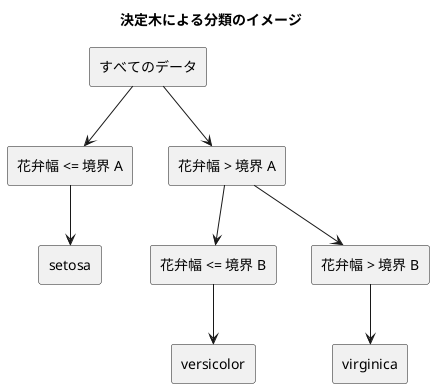

# 第 3 章: 決定木と明白な実装

## 3.1 はじめに

第 1 章では「20 代ならきのこ派」というルールを人間が書き、第 2 章では欠損値を補完した特徴量 `Features` を用意しました。この章では、「どの特徴量のどこで区切るか」をデータから自動で探すアルゴリズム、**決定木** を自作します。

[Python 版の第 3 章](../python/03-decision-tree-and-obvious-implementation.md)・[Kotlin 版の第 3 章](../kotlin/03-decision-tree-and-obvious-implementation.md) と同じ TODO リストで進めます。ただし、自作したあとにライブラリの決定木と突き合わせる節はありません。Go の数値計算ライブラリ [gonum](https://www.gonum.org/) には決定木が無く、自作が最終実装になるためです（3.9 節・[ADR 008](../../../adr/008-go-ml-libraries.md)）。この立場は、ライブラリの選択肢が限られる [TypeScript 版](../typescript/03-decision-tree-and-obvious-implementation.md) に近いものです。

Go 版で注目してほしいのは、**判別共用体（sealed interface・discriminated union）が無い言語で、木をどう表すか** です。Java 版は sealed interface と record、Kotlin 版は sealed interface と data class、TypeScript 版は判別可能なユニオンで木を表し、いずれも「場合分けの漏れ」をコンパイラが教えてくれました。Go にはその仕組みがありません。代わりに何ができて、何ができないかを実際に確かめます。

## 3.2 決定木の仕組み

### データを 2 つに分けることを繰り返す

決定木は、データを「ある特徴量がある値以下か、より大きいか」で 2 つに分けることを繰り返します。分けた先で同じラベルばかりになったら、そこで分けるのをやめて、そのラベルを予測に使います。



### どこで分けるかをジニ不純度で決める

「よい分け方」とは、分けた後のそれぞれのグループで、ラベルがなるべく 1 種類にそろう分け方です。そろい具合を数値にしたものが **ジニ不純度** です。

ジニ不純度 = 1 − Σ（各ラベルの割合）²

| グループのラベル | 割合 | ジニ不純度 |
|----------------|------|-----------|
| setosa ×3 | setosa 1.0 | 1 − 1.0² = 0 |
| setosa ×1、virginica ×1 | 0.5、0.5 | 1 − (0.5² + 0.5²) = 0.5 |
| 3 品種 ×1 ずつ | 1/3 ずつ | 1 − 3 × (1/3)² = 2/3 |

ラベルが 1 種類にそろうと 0、混ざるほど大きくなります。分け方の候補ごとに、分けた後の左右のジニ不純度を件数で重み付けして平均し、最も小さくなる分け方を選びます。

## 3.3 TODO リストの作成

**TODO リスト**:

- [ ] ジニ不純度を計算する
- [ ] 最良の分割を探す
  - [ ] ラベルを完全に分けられる境界を見つける
  - [ ] 複数の特徴量から最良の特徴量と境界を選ぶ
  - [ ] ラベルが 1 種類なら分割しない
- [ ] 決定木を学習して予測する
  - [ ] 1 種類のラベルだけを学習したらそのラベルを予測する
  - [ ] 境界の左右で異なるラベルを予測する
- [ ] 木の深さを制限する
- [ ] 学習した木を読める形で表示する
- [ ] 実データで深さと正解率の関係を表示する

Python 版・Kotlin 版・Java 版にある「ライブラリの決定木と突き合わせる」は、Go では対象が無いので外しています（3.9 節）。

## 3.4 ジニ不純度を計算する

### 仮実装から始める

表駆動テストの 1 行目は「ラベルが 1 種類なら 0」です。

```go
// internal/chapter03/decisiontree_test.go
func TestGini(t *testing.T) {
	t.Parallel()

	tests := []struct {
		name   string
		labels []string
		want   float64
	}{
		{name: "1 種類のラベルだけならジニ不純度は 0", labels: []string{"setosa", "setosa", "setosa"}, want: 0},
	}

	for _, test := range tests {
		t.Run(test.name, func(t *testing.T) {
			t.Parallel()

			if got := chapter03.Gini(test.labels); math.Abs(got-test.want) > 1e-12 {
				t.Errorf("Gini() = %v, want %v", got, test.want)
			}
		})
	}
}
```

> 仮実装を経て本実装へ
>
> 失敗するテストを書いてから、最初に行う実装はどのようなものだろうか——ベタ書きの値を返そう。
>
> — テスト駆動開発

```go
// Gini はジニ不純度。
func Gini(labels []string) float64 {
	return 0.0
}
```

浮動小数点数の比較には、最初から `math.Abs(got-want) > 1e-12` の許容誤差を使っています。理由は 3.5 節で実際に踏みます。

### 三角測量

表に 2 行足します。

```go
		{name: "2 種類のラベルが半分ずつならジニ不純度は 0.5", labels: []string{"setosa", "virginica"}, want: 0.5},
		{name: "3 種類のラベルが同じ数ならジニ不純度は 3 分の 2", labels: []string{"setosa", "versicolor", "virginica"}, want: 2.0 / 3},
```

```text
--- FAIL: TestGini (0.00s)
    --- FAIL: TestGini/3_種類のラベルが同じ数ならジニ不純度は_3_分の_2 (0.00s)
        decisiontree_test.go:78: Gini() = 0, want 0.6666666666666666
    --- FAIL: TestGini/2_種類のラベルが半分ずつならジニ不純度は_0.5 (0.00s)
        decisiontree_test.go:78: Gini() = 0, want 0.5
```

期待値を `2.0 / 3` と書いているのは、`0.6666666666666666` を手で写すと桁を間違えるからです。式のまま書けば、実装と同じ演算で期待値が作られます。`2 / 3` ではなく `2.0 / 3` にしないと整数の割り算で 0 になる点は、Go も C 系の言語と同じです。

定義どおりに実装します。

```go
// Gini はジニ不純度。ラベルが 1 種類なら 0 で、種類が多く均等なほど大きい。
func Gini(labels []string) float64 {
	total := float64(len(labels))
	sum := 0.0

	for _, entry := range counts(labels) {
		share := float64(entry.Count) / total
		sum += share * share
	}

	return 1.0 - sum
}
```

ラベルごとの件数を数える `counts` は、この後の「多数派のラベル」でも使うので、最初から分けておきます。

```go
// labelCount はラベルと、その件数。
type labelCount struct {
	Label string
	Count int
}

// counts はラベルごとの件数を、ラベルが先に現れた順に返す。
func counts(labels []string) []labelCount {
	order := make([]string, 0, len(labels))
	found := make(map[string]int, len(labels))

	for _, label := range labels {
		if _, ok := found[label]; !ok {
			order = append(order, label)
		}

		found[label]++
	}

	result := make([]labelCount, 0, len(order))
	for _, label := range order {
		result = append(result, labelCount{Label: label, Count: found[label]})
	}

	return result
}
```

数えるだけなら `map[string]int` を返せば済みます。そうしていないのは、**Go の `map` は反復順がランダム** だからです。`Gini` は足し算なので順序に影響されませんが、次に作る `Majority`（多数派のラベル）は「同数ならどちらを選ぶか」で結果が変わります。順序を決めない実装は、同点のときに実行のたびに違う答えを返します。

```go
// Majority は多数派のラベルを返す。同数なら先に現れたラベルを選ぶ。
func Majority(labels []string) string {
	best, bestCount := "", 0

	for _, entry := range counts(labels) {
		if entry.Count > bestCount {
			best, bestCount = entry.Label, entry.Count
		}
	}

	return best
}
```

`found[label]++` は、キーが無くても動きます。Go の `map` は、存在しないキーを読むとゼロ値（`int` なら 0）を返すからです。第 1 章では「存在しないキーとゼロ値の区別がつかない」ことをカンマ ok で解決しましたが、ここでは「無ければ 0 から数え始める」がそのまま欲しい振る舞いなので、そのまま使います。

**TODO リスト**:

- [x] ジニ不純度を計算する
- [ ] 最良の分割を探す

## 3.5 最良の分割を探す

### 分割を表す構造体

分割は「どの特徴量の、どの値を境にするか」と、その結果の不純度です。

```go
// Split は決定木の分割。特徴量の値が境界以下なら左、境界より大きければ右へ進む。
type Split struct {
	Feature   string
	Threshold float64
	Impurity  float64
}
```

フィールドが `string` と `float64` だけなので、この構造体は `==` で比較できます。第 2 章の `Features`（スライスを持つ）と違うところです。ただしテストでは `==` を使いません。理由はこの節の最後で分かります。

### テスト

`BestSplit` は「見つかったかどうか」も返す必要があります。ラベルが 1 種類なら、分けても意味がないからです。ここでもカンマ ok を使い、`(Split, bool, error)` を返します。

```go
	t.Run("ラベルを完全に分けられる境界を見つける", func(t *testing.T) {
		t.Parallel()

		split, found, err := chapter03.BestSplit(
			column(t, "花弁幅", 0.1, 0.2, 0.7, 0.8),
			[]string{"setosa", "setosa", "virginica", "virginica"},
		)
		if err != nil || !found {
			t.Fatalf("BestSplit() = (found=%v, err=%v)", found, err)
		}

		if split.Feature != "花弁幅" || math.Abs(split.Threshold-0.45) > 1e-12 || math.Abs(split.Impurity) > 1e-12 {
			t.Errorf("BestSplit() = %+v, want 花弁幅 0.45 不純度 0", split)
		}
	})
```

`column` は、1 列だけの `Features` を値の数だけ作るテスト用の補助関数です。

```go
// column は 1 列だけの特徴量を値の数だけ作る。
func column(t *testing.T, name string, values ...float64) []chapter02.Features {
	t.Helper()

	features := make([]chapter02.Features, len(values))

	for i, value := range values {
		got, err := chapter02.NewFeatures([]string{name}, []float64{value})
		if err != nil {
			t.Fatalf("NewFeatures() でエラー: %v", err)
		}

		features[i] = got
	}

	return features
}
```

`values ...float64` は **可変長引数** です。呼び出し側は `column(t, "花弁幅", 0.1, 0.2, 0.7, 0.8)` と値を並べるだけで済みます。

仮実装で始めます。

```go
// BestSplit は左右の不純度の重み付き平均が最も小さくなる分割を返す。
func BestSplit(x []chapter02.Features, t []string) (Split, bool, error) {
	return Split{Feature: "花弁幅", Threshold: 0.45, Impurity: 0}, true, nil
}
```

三角測量として、2 列のデータで「どちらの特徴量を選ぶか」を問うテストと、「1 種類なら分割しない」テストを足します。

```text
--- FAIL: TestBestSplit (0.00s)
    --- FAIL: TestBestSplit/ラベルが_1_種類なら分割しない (0.00s)
        decisiontree_test.go:134: BestSplit() = (found=true, err=<nil>), want found=false
    --- FAIL: TestBestSplit/複数の特徴量から不純度が最も小さくなる特徴量と境界を選ぶ (0.00s)
        decisiontree_test.go:125: BestSplit() = {Feature:花弁幅 Threshold:0.45 Impurity:0}, want 花弁長さ 0.4
```

`%+v` は構造体をフィールド名付きで表示する書式です。`%v` の `{花弁幅 0.45 0}` より、どの値がどのフィールドかが読めます。

すべての特徴量・すべての境界の候補を試して、最も不純度が小さいものを選びます。

```go
// BestSplit は左右の不純度の重み付き平均が最も小さくなる分割を返す。
// 見つからなければ ok が false になる。同じ不純度なら先に見つけた（列の順で前の）分割を選ぶ。
func BestSplit(x []chapter02.Features, t []string) (Split, bool, error) {
	if Gini(t) == 0.0 {
		return Split{}, false, nil
	}

	var best Split

	found := false

	for _, feature := range x[0].Columns {
		sorted, err := sortByFeature(x, t, feature)
		if err != nil {
			return Split{}, false, err
		}

		for i := 1; i < len(sorted); i++ {
			if sorted[i].value == sorted[i-1].value {
				continue
			}

			left := labelsOf(sorted[:i])
			right := labelsOf(sorted[i:])
			impurity := (float64(len(left))*Gini(left) + float64(len(right))*Gini(right)) / float64(len(sorted))

			if !found || impurity < best.Impurity {
				best = Split{
					Feature:   feature,
					Threshold: (sorted[i-1].value + sorted[i].value) / 2,
					Impurity:  impurity,
				}
				found = true
			}
		}
	}

	return best, found, nil
}
```

- 特徴量の値で並べ替え、隣り合う 2 つの **中点** を境界の候補にします。同じ値が続くところは境界にできないので飛ばします
- `impurity < best.Impurity` と厳密な不等号にしているので、同じ不純度なら先に見つけた分割が残ります。「先」は `x[0].Columns` の順、つまり CSV の列の順です。同点のときの選び方はライブラリによって違い、Kotlin 版・Java 版では Tribuo との予測の食い違いの原因になりました
- `var best Split` はゼロ値（すべてのフィールドが 0 や空文字列）の `Split` です。Go では宣言だけで必ず初期化されるので、Java の `null` に当たる状態がありません。「まだ見つけていない」は `found` で別に持ちます

並べ替えの補助は、第 2 章の `pair` と同じ発想です。

```go
// valueLabel は並べ替えのあいだ、特徴量の値と正解ラベルの対応を保つための組。
type valueLabel struct {
	value float64
	label string
}

func sortByFeature(x []chapter02.Features, t []string, feature string) ([]valueLabel, error) {
	pairs := make([]valueLabel, len(x))

	for i, features := range x {
		value, err := features.Value(feature)
		if err != nil {
			return nil, err
		}

		pairs[i] = valueLabel{value: value, label: t[i]}
	}

	sort.SliceStable(pairs, func(i, j int) bool { return pairs[i].value < pairs[j].value })

	return pairs, nil
}
```

`sort.SliceStable` は **安定な** 並べ替えです。値が同じ要素の元の順序が保たれるので、同じ値が並ぶデータでも結果が毎回同じになります。`sort.Slice`（不安定）を使うと、同じ入力でも境界の選ばれ方が変わりうるので、再現性のために安定なほうを選びます。

`func(i, j int) bool { ... }` は、その場で書く無名関数です。Java の `Comparator`、TypeScript の比較関数に当たります。引数が「要素そのもの」ではなく「添字」なのが Go の `sort.Slice` の特徴で、慣れるまで戸惑います。

### 浮動小数点数の落とし穴

境界を `math.Abs(split.Threshold-0.45) > 1e-12` で比べているのには理由があります。`split.Threshold != 0.45` と書くと、実装が正しくても失敗します。

```text
--- FAIL: TestBestSplit/ラベルを完全に分けられる境界を見つける (0.00s)
    decisiontree_test.go:99: BestSplit() = {Feature:花弁幅 Threshold:0.44999999999999996 Impurity:0}, want 花弁幅 0.45 不純度 0
```

`(0.2 + 0.7) / 2` は、2 進数の浮動小数点数では 0.45 ちょうどにならず 0.44999999999999996 になります。Python 版・Kotlin 版・Java 版と同じ落とし穴です。

Go にはもう一段ややこしいところがあります。**定数式は無限精度で計算される** ので、ソースに直接書いた `(0.2+0.7)/2 == 0.45` は `true` になります。

```go
	fmt.Println((0.2+0.7)/2 == 0.45) // true（定数式なので無限精度）

	a, b := 0.2, 0.7
	fmt.Println((a+b)/2 == 0.45) // false（float64 の計算）
```

「手元で試したら合ったのに、実装では合わない」が起こりうるということです。`Split` が `==` で比較できる構造体だからといって、テストで `got == want` と書いてはいけません。浮動小数点数を含む値は、必ずフィールドごとに許容誤差で比べます。

**TODO リスト**:

- [x] 最良の分割を探す
- [ ] 決定木を学習して予測する

## 3.6 決定木を学習して予測する

### 仮実装

```go
	t.Run("1 種類のラベルだけを学習するとそのラベルを予測する", func(t *testing.T) {
		t.Parallel()

		model := fit(t, chapter03.Unlimited(), column(t, "花弁幅", 0.1, 0.2), []string{"setosa", "setosa"})

		if got, want := predict(t, model, column(t, "花弁幅", 0.15, 0.9)), []string{"setosa", "setosa"}; !reflect.DeepEqual(got, want) {
			t.Errorf("Predict() = %v, want %v", got, want)
		}
	})
```

木を作る `Build` は、多数派のラベルを持つ葉を返すだけの仮実装から始めます。

```go
// Build は木を作る。
func Build(x []chapter02.Features, t []string, maxDepth int) (Tree, error) {
	return Leaf{Label: Majority(t)}, nil
}
```

### 三角測量

境界の左右で違うラベルを返すテストを足すと、仮実装では通りません。

```text
--- FAIL: TestDecisionTree/境界の左右で異なるラベルを予測する (0.00s)
    decisiontree_test.go:160: Predict() = [setosa setosa], want [setosa virginica]
--- FAIL: TestDecisionTree/深さを制限しなければすべての訓練データを分け切る (0.00s)
    decisiontree_test.go:171: Predict() = [setosa setosa setosa setosa setosa setosa], want [setosa setosa setosa versicolor versicolor virginica]
```

### 木を interface と型スイッチで表す

決定木は「葉」か「節」のどちらかです。ほかの言語版では、この「どちらか」を言語の仕組みで表せました。

| 言語 | 木の表し方 | 場合分け | 漏れの検査 |
|------|----------|---------|-----------|
| Kotlin | sealed interface + data class | `when` | コンパイラが網羅性を検査 |
| Java | sealed interface + record | `switch` のパターンマッチ | コンパイラが網羅性を検査 |
| TypeScript | 判別可能なユニオン | `switch` + `never` | `never` への代入で検査 |
| Go | interface + 構造体 | 型スイッチ | **検査されない** |

Go には sealed も判別共用体もありません。できるのは、**非公開のメソッドを持つインターフェース** で「このパッケージの外から実装を足せない」ことだけを保証する書き方です。

```go
// Tree は決定木。Leaf か Node のどちらか。
// Go には判別共用体が無いので、非公開のメソッドを持つインターフェースで、
// このパッケージの外から実装を足せないようにする。
type Tree interface {
	isTree()
}

// Leaf は予測するラベルを持つ葉。
type Leaf struct {
	Label string
}

func (Leaf) isTree() {}

// Node は分割と、左右の部分木を持つ節。
type Node struct {
	Split Split
	Left  Tree
	Right Tree
}

func (Node) isTree() {}
```

`isTree()` は何もしないメソッドです。小文字で始まるのでパッケージの外からは呼べず、外のパッケージは `Tree` を満たす型を作れません。実際に試すと、コンパイルの段階で止まります。

```go
type unknownTree struct{}

func TestOutside(t *testing.T) {
	var tree chapter03.Tree = unknownTree{}
	_ = tree
}
```

```text
internal/chapter03/outside_test.go:12:28: cannot use unknownTree{} (value of struct type unknownTree) as chapter03.Tree value in variable declaration: unknownTree does not implement chapter03.Tree (missing method isTree)
```

`func (Leaf) isTree() {}` のようにレシーバーの変数名を省けるのは、本体で使わないからです。「このメソッドは印にすぎない」ことが形で伝わります。

予測は **型スイッチ** で場合分けします。

```go
// PredictOne は 1 件の特徴量のラベルを予測する。
// Go は型スイッチの網羅性を検査しないので、知らない木は既定の分岐でエラーにする。
func PredictOne(tree Tree, features chapter02.Features) (string, error) {
	switch node := tree.(type) {
	case Leaf:
		return node.Label, nil
	case Node:
		left, err := goesLeft(node.Split, features)
		if err != nil {
			return "", err
		}

		if left {
			return PredictOne(node.Left, features)
		}

		return PredictOne(node.Right, features)
	default:
		return "", fmt.Errorf("知らない木です: %T", tree)
	}
}
```

`switch node := tree.(type)` が型スイッチです。`case Leaf:` の中では `node` が `Leaf` 型、`case Node:` の中では `Node` 型になります。Java の `switch` のパターンマッチ、Kotlin のスマートキャストと同じ働きです。`%T` は値の型名を表示する書式です。

### 網羅性は検査されない

`case Node:` を消すとどうなるかを、実際に試します。

```go
	switch node := tree.(type) {
	case Leaf:
		return node.Label, nil
	default:
		return "", fmt.Errorf("知らない木です: %T", tree)
	}
```

```bash
go vet ./internal/chapter03/
```

```text
```

何も言われません。コンパイルも通ります。間違いが分かるのは、テストを走らせたときです。

```text
--- FAIL: TestDecisionTree/深さを_1_に制限すると境界の先は多数派のラベルを予測する (0.00s)
    decisiontree_test.go:187: Predict() でエラー: 知らない木です: chapter03.Node
--- FAIL: TestDecisionTree/深さを制限しなければすべての訓練データを分け切る (0.00s)
    decisiontree_test.go:170: Predict() でエラー: 知らない木です: chapter03.Node
--- FAIL: TestDecisionTree/境界の左右で異なるラベルを予測する (0.00s)
    decisiontree_test.go:159: Predict() でエラー: 知らない木です: chapter03.Node
```

Java 版は `switch` に `Node` の節が無ければ **コンパイルエラー**、TypeScript 版は `never` への代入で **型エラー** になりました。Go はどちらでもなく、実行時に既定の分岐へ落ちます。

だからこそ `default:` でエラーを返す意味があります。`default` を書かないと、型スイッチは何もせずに抜けて、ゼロ値の `""` が返ります。予測が「空文字列」になるのは、`panic` よりたちの悪い壊れ方です。**網羅性を検査してくれない言語では、漏れたときに確実に気づく分岐を自分で置く** のがせめてもの備えになります。

| 言語 | 場合分けが漏れたとき |
|------|-------------------|
| Java・Kotlin | コンパイルエラー |
| TypeScript | 型エラー（`never` への代入） |
| Go | 既定の分岐に落ちる（何も書かなければゼロ値が返る） |

### 木を組み立てる

分割を見つけ、左右に分けて再帰します。

```go
// Build は深さの上限まで分割を繰り返して木を作る。maxDepth が負なら上限なし。
func Build(x []chapter02.Features, t []string, maxDepth int) (Tree, error) {
	if maxDepth == 0 {
		return Leaf{Label: Majority(t)}, nil
	}

	split, found, err := BestSplit(x, t)
	if err != nil {
		return nil, err
	}

	if !found {
		return Leaf{Label: Majority(t)}, nil
	}

	var leftX, rightX []chapter02.Features

	var leftT, rightT []string

	for i, features := range x {
		goesLeft, err := goesLeft(split, features)
		if err != nil {
			return nil, err
		}

		if goesLeft {
			leftX, leftT = append(leftX, features), append(leftT, t[i])
		} else {
			rightX, rightT = append(rightX, features), append(rightT, t[i])
		}
	}

	childDepth := maxDepth
	if maxDepth > 0 {
		childDepth = maxDepth - 1
	}

	left, err := Build(leftX, leftT, childDepth)
	if err != nil {
		return nil, err
	}

	right, err := Build(rightX, rightT, childDepth)
	if err != nil {
		return nil, err
	}

	return Node{Split: split, Left: left, Right: right}, nil
}
```

`var leftX, rightX []chapter02.Features` は、長さ 0 の `nil` スライスです。Go では `nil` のスライスに `append` できるので、`make` で作り直す必要はありません。Java の `null` なリストに `add` すると `NullPointerException` になるのと対照的で、「空の入れ物」と「無い」を同じ `nil` で扱えます。

戻り値の型は `Tree`（インターフェース）です。`Leaf` を返しても `Node` を返しても同じ関数の戻り値にできます。エラーのときは `nil` を返しますが、これは「インターフェースの `nil`」で、ゼロ値の構造体とは別物です。

### `DecisionTree` で包む

学習と予測の入口をまとめます。

```go
// DecisionTree は自作の決定木の分類器。Fit で学習してから Predict で予測する。
type DecisionTree struct {
	maxDepth int
	tree     Tree
}

// Fit は訓練データから木を作る。
func (d *DecisionTree) Fit(x []chapter02.Features, t []string) error {
	tree, err := Build(slices.Clone(x), slices.Clone(t), d.maxDepth)
	if err != nil {
		return err
	}

	d.tree = tree

	return nil
}

// Predict は特徴量ごとのラベルを予測する。
func (d *DecisionTree) Predict(x []chapter02.Features) ([]string, error) {
	if d.tree == nil {
		return nil, fmt.Errorf("Fit で学習してから Predict を呼んでください")
	}

	predictions := make([]string, len(x))

	for i, features := range x {
		prediction, err := PredictOne(d.tree, features)
		if err != nil {
			return nil, err
		}

		predictions[i] = prediction
	}

	return predictions, nil
}
```

`Fit` のレシーバーが `(d *DecisionTree)` と **ポインタ** になっているところが、これまでのメソッドとの違いです。`d.tree = tree` で自分の中身を書き換えるので、写しを受け取る値レシーバーでは学習結果が捨てられてしまいます。

「学習していないのに予測した」はエラーにします。

```go
	t.Run("学習する前に予測するとエラーになる", func(t *testing.T) {
		t.Parallel()

		_, err := chapter03.Unlimited().Predict(column(t, "花弁幅", 0.1))
		if err == nil {
			t.Fatal("エラーを期待したが nil だった")
		}

		if want := "Fit で学習してから Predict を呼んでください"; err.Error() != want {
			t.Errorf("エラー = %q, want %q", err.Error(), want)
		}
	})
```

`d.tree == nil` で「まだ学習していない」が分かるのは、`Tree` がインターフェースで、ゼロ値が `nil` だからです。第 2 章では `Features` のゼロ値と「未設定」を区別できず `bool` を添えましたが、インターフェースならゼロ値がそのまま「無い」を表せます。

**TODO リスト**:

- [x] 決定木を学習して予測する
- [ ] 木の深さを制限する

## 3.7 木の深さを制限する

深さを制限しなければ、決定木は訓練データを最後まで分け切ります。訓練データには完全に当たりますが、新しいデータには当たらない——過学習です。上限を付けられるようにします。

```go
	t.Run("深さを 1 に制限すると境界の先は多数派のラベルを予測する", func(t *testing.T) {
		t.Parallel()

		x, labels := threeSpecies(t)

		shallow, err := chapter03.WithMaxDepth(1)
		if err != nil {
			t.Fatalf("WithMaxDepth() でエラー: %v", err)
		}

		model := fit(t, shallow, x, labels)

		if got, want := predict(t, model, column(t, "花弁幅", 0.2, 0.95)), []string{"setosa", "versicolor"}; !reflect.DeepEqual(got, want) {
			t.Errorf("Predict() = %v, want %v", got, want)
		}
	})
```

`threeSpecies` は「境界の右側に versicolor 2 件と virginica 1 件が残る」ように作ったデータです。深さ 1 で止めると右は 1 つの葉になり、多数派の `versicolor` を返します。同点にならないようにわざと 2 対 1 にしてあります。

### 作り方に名前を付ける

Go には、コンストラクタもオーバーロードも引数の既定値もありません。作り方が 2 通りあるなら、**関数の名前を 2 つ** 用意します。

```go
// unlimited は深さを制限しないことを表す値。
const unlimited = -1

// Unlimited は深さを制限しない決定木を返す。
func Unlimited() *DecisionTree {
	return &DecisionTree{maxDepth: unlimited}
}

// WithMaxDepth は深さの上限を指定した決定木を返す。
func WithMaxDepth(maxDepth int) (*DecisionTree, error) {
	if maxDepth < 0 {
		return nil, fmt.Errorf("深さの上限は 0 以上にしてください: %d", maxDepth)
	}

	return &DecisionTree{maxDepth: maxDepth}, nil
}
```

| 言語 | 「深さ無制限」と「深さ指定」の作り分け |
|------|---------------------------------|
| Python | 既定値付きの引数 `max_depth=None` |
| Kotlin | 既定値付きの引数 + `null` |
| Java | static ファクトリ 2 つ |
| Go | 関数 2 つ（`Unlimited`・`WithMaxDepth`） |

`-1` を外から渡せないようにしているのが肝です。「制限なし」は `unlimited` という非公開の定数で内側に隠し、外には `Unlimited()` という名前だけを見せます。`WithMaxDepth(-1)` はエラーにするので、呼び出し側が意味を取り違えようがありません。

`&DecisionTree{...}` はポインタを返しています。`Fit` がポインタレシーバーなので、値で返すと「学習しても元が変わらない」という分かりにくいバグの元になります。**ポインタレシーバーのメソッドを持つ型は、ポインタで配る** のが Go の作法です。

`WithMaxDepth` だけが `error` を返し、`Unlimited` は返しません。失敗しようがない関数に `error` を付けると、呼び出し側が無意味な `if err != nil` を書くことになります。**返せるからといって返さない** のも設計の一部です。

**TODO リスト**:

- [x] 木の深さを制限する
- [ ] 学習した木を読める形で表示する

## 3.8 学習した木を表示する

木が何を学んだのかを読めるようにします。決定木の利点は、判断の根拠が人間に読める形で残ることです。

```go
	t.Run("節は条件ごとに字下げして表示する", func(t *testing.T) {
		t.Parallel()

		tree := chapter03.Node{
			Split: chapter03.Split{Feature: "花弁幅", Threshold: 0.4},
			Left:  chapter03.Leaf{Label: "setosa"},
			Right: chapter03.Node{
				Split: chapter03.Split{Feature: "花弁長さ", Threshold: 0.75},
				Left:  chapter03.Leaf{Label: "versicolor"},
				Right: chapter03.Leaf{Label: "virginica"},
			},
		}

		got, err := chapter03.Format(tree)
		if err != nil {
			t.Fatalf("Format() でエラー: %v", err)
		}

		want := strings.Join([]string{
			"花弁幅 <= 0.4000",
			"  setosa",
			"花弁幅 > 0.4000",
			"  花弁長さ <= 0.7500",
			"    versicolor",
			"  花弁長さ > 0.7500",
			"    virginica",
		}, "\n")
		if got != want {
			t.Errorf("Format() = %q, want %q", got, want)
		}
	})
```

期待値を `strings.Join` で行ごとに並べているのは、生の文字列に `\n` を埋め込むより字下げが目で追えるからです。`%q` で表示すれば、失敗したときも改行が `\n` として見えます。

葉だけの木を返す仮実装から始めます。

```go
// Format は木を文字列にする。
func Format(tree Tree) (string, error) {
	return "setosa", nil
}
```

```text
--- FAIL: TestFormat/節は条件ごとに字下げして表示する (0.00s)
    decisiontree_test.go:254: Format() = "setosa", want "花弁幅 <= 0.4000\n  setosa\n花弁幅 > 0.4000\n  花弁長さ <= 0.7500\n    versicolor\n  花弁長さ > 0.7500\n    virginica"
```

字下げを引数に持つ再帰で書きます。

```go
// Format は木を、条件ごとに字下げした文字列にする。
func Format(tree Tree) (string, error) {
	return format(tree, "")
}

func format(tree Tree, indent string) (string, error) {
	switch node := tree.(type) {
	case Leaf:
		return indent + node.Label, nil
	case Node:
		threshold := fmt.Sprintf("%.4f", node.Split.Threshold)

		left, err := format(node.Left, indent+"  ")
		if err != nil {
			return "", err
		}

		right, err := format(node.Right, indent+"  ")
		if err != nil {
			return "", err
		}

		return strings.Join([]string{
			fmt.Sprintf("%s%s <= %s", indent, node.Split.Feature, threshold),
			left,
			fmt.Sprintf("%s%s > %s", indent, node.Split.Feature, threshold),
			right,
		}, "\n"), nil
	default:
		return "", fmt.Errorf("知らない木です: %T", tree)
	}
}
```

公開する `Format` と、字下げを持ち回る非公開の `format` を分けています。Go には引数の既定値が無いので、「内部でだけ余分な引数を持つ再帰」はこの形になります。名前が大文字と小文字だけの違いなのは紛らわしく見えますが、可視性が名前で決まる Go ではよくある組み合わせです。

境界を `%.4f` で丸めているのは、3.5 節の 0.44999999999999996 をそのまま表示しないためです。表示は人が読むためのものなので、桁を落とします。

**TODO リスト**:

- [x] 学習した木を読める形で表示する
- [ ] 実データで深さと正解率の関係を表示する

## 3.9 ライブラリの決定木について

Python 版は scikit-learn、Kotlin 版・Java 版は Tribuo、TypeScript 版は ml-cart と、自作の決定木をライブラリと突き合わせました。Go 版ではこの節を設けません。

Go の数値計算ライブラリ [gonum](https://www.gonum.org/) が提供するのは、行列・統計・最適化・分布などの数値計算の基盤で、決定木のような学習アルゴリズムは含まれていません。決定木を持つ [GoLearn](https://github.com/sjwhitworth/golearn) は更新が止まっており、本シリーズでは使わないと決めました。したがって Go 版では **自作の決定木が最終的な実装** です。詳しくは [ADR 008](../../../adr/008-go-ml-libraries.md) を参照してください。

同じ判断は、ランダムフォレスト（第 10 章）・K-means（第 14 章）・ロジスティック回帰（第 10 章）にも当てはまります。一方、第 7 章の線形回帰や第 13 章の主成分分析は、gonum の行列演算で実装したうえでライブラリの結果と突き合わせられます。

ライブラリと突き合わせられないぶん、Go 版では「アルゴリズムの定義どおりに動くか」をテストで細かく固定しています。3.5 節の「同じ不純度なら列の順で前の分割を選ぶ」のような、実装ごとに分かれうる振る舞いを明文化しておくのが、比較対象が無い環境での自衛策です。

## 3.10 実データで深さと正解率を表示する

### 深さと正解率

第 2 章の `PrepareIris` でアヤメのデータを前処理し、深さを変えながら訓練データとテストデータの正解率を測ります。

```go
// internal/chapter03/main.go
const (
	testSize = 0.3
	seed     = 0
	// treeDepthToShow は最後に木そのものを表示する深さ。
	treeDepthToShow = 2
)

// maxDepths は正解率を比べる深さ。
var maxDepths = []int{1, 2, 3, 4, 5}

// Run は深さごとの正解率と、深さ 2 の決定木を表示する。
func Run(out io.Writer) error {
	split, err := chapter02.PrepareIris(filepath.Join(dataset.Current(), "iris.csv"), testSize, seed)
	if err != nil {
		return err
	}

	if _, err := fmt.Fprintln(out, "深さ\t訓練データ\tテストデータ"); err != nil {
		return fmt.Errorf("表示できません: %w", err)
	}

	for _, maxDepth := range maxDepths {
		model, err := WithMaxDepth(maxDepth)
		if err != nil {
			return err
		}

		if err := printAccuracy(out, fmt.Sprintf("%d", maxDepth), model, split); err != nil {
			return err
		}
	}

	if err := printAccuracy(out, "制限なし", Unlimited(), split); err != nil {
		return err
	}

	shallow, err := WithMaxDepth(treeDepthToShow)
	if err != nil {
		return err
	}

	if err := shallow.Fit(split.XTrain, split.TTrain); err != nil {
		return err
	}

	tree, ok := shallow.Tree()
	if !ok {
		return fmt.Errorf("決定木がまだ作られていません")
	}

	formatted, err := Format(tree)
	if err != nil {
		return err
	}

	if _, err := fmt.Fprintf(out, "\n深さ %d の決定木:\n%s\n", treeDepthToShow, formatted); err != nil {
		return fmt.Errorf("表示できません: %w", err)
	}

	return nil
}

// printAccuracy は木を作り、訓練データとテストデータの正解率を 1 行で表示する。
func printAccuracy(
	out io.Writer,
	label string,
	model *DecisionTree,
	split chapter02.TrainTestSplit[chapter02.Features, string],
) error {
	if err := model.Fit(split.XTrain, split.TTrain); err != nil {
		return err
	}

	train, err := accuracyOf(model, split.XTrain, split.TTrain)
	if err != nil {
		return err
	}

	test, err := accuracyOf(model, split.XTest, split.TTest)
	if err != nil {
		return err
	}

	if _, err := fmt.Fprintf(out, "%s\t%.4f\t%.4f\n", label, train, test); err != nil {
		return fmt.Errorf("表示できません: %w", err)
	}

	return nil
}
```

`printAccuracy` の引数に `chapter02.TrainTestSplit[chapter02.Features, string]` と型を書き下しているところで、第 2 章のジェネリクスが効いています。この関数は分類（ラベルが `string`）専用なので、型パラメータをここで具体化しています。

`Tree()` が `(Tree, bool)` を返すのも、これまでと同じカンマ ok です。学習していなければ `ok` が `false` になります。

正解率の計算には、第 1 章で書いた `chapter01.Accuracy` をそのまま使います。

```go
// accuracyOf は予測して正解率を求める。
func accuracyOf(model *DecisionTree, x []chapter02.Features, t []string) (float64, error) {
	predictions, err := model.Predict(x)
	if err != nil {
		return 0, err
	}

	return chapter01.Accuracy(predictions, t)
}
```

章ごとのパッケージが互いを import しています。`chapter03` は `chapter01`（正解率）と `chapter02`（`Features`・前処理）に依存し、逆向きの依存はありません。Go は **import の循環をコンパイルエラーにする** ので、章が進むほど依存が一方向に保たれていることがビルドで保証されます。

`cmd/chapters/main.go` の表に 1 行足して実行します。

```bash
cd apps/go
go run ./cmd/chapters chapter03
```

```text
深さ	訓練データ	テストデータ
1	0.6857	0.6222
2	0.9333	0.9556
3	0.9429	0.9556
4	0.9524	0.9778
5	0.9714	0.9778
制限なし	1.0000	1.0000

深さ 2 の決定木:
花弁幅 <= 0.2950
  Iris-setosa
花弁幅 > 0.2950
  花弁幅 <= 0.6900
    Iris-versicolor
  花弁幅 > 0.6900
    Iris-virginica
```

読み取れることは 3 つあります。

1. **深さ 1 では足りない** — 2 つにしか分けられないので、3 品種のうち 1 つは必ず取りこぼします（0.6222）
2. **深さ 2 で十分に当たる** — テストデータで 0.9556。45 件中 43 件が正解です
3. **深くするほど訓練データには当たるが、テストデータは頭打ちになる** — 制限なしでは訓練データが 1.0000 になりますが、これは訓練データを丸暗記しただけです。テストデータも 1.0000 なのは、このデータと分け方がたまたま素直だったためで、一般には過学習で下がります

深さ 2 の木は、`花弁幅` だけを 2 回使って 3 品種を分けています。第 2 章の可視化で見た「`Iris-setosa` は花弁幅がはっきり小さい」という傾向を、アルゴリズムが自分で見つけたということです。人間が第 1 章で「20 代ならきのこ派」と書いたのと同じ形のルールを、今度はデータから導けました。

### ほかの言語版と数値が一致しない

これらの数値は Go 版の実測値で、ほかの言語版とは一致しません。第 2 章で見たとおり、`math/rand` の乱数列がほかの言語と違うため、訓練データとテストデータに分かれる行そのものが違うからです。木の境界（0.2950・0.6900）も Go 版固有です。

テストにもそのことを書き添えてあります。

```go
		// Go の math/rand は分け方がほかの言語版と違うので、正解率も木の境界も一致しない
		want := "深さ\t訓練データ\tテストデータ\n" +
			"1\t0.6857\t0.6222\n" +
			...
```

一致するのは「深さ 1 では足りず、深さ 2 で大きく上がり、深くすると訓練データだけが 1.0 に近づく」という **傾向** です。アルゴリズムを学ぶうえで大事なのはそちらで、小数第 4 位まで同じになることではありません。

**TODO リスト**:

- [x] ジニ不純度を計算する
- [x] 最良の分割を探す
- [x] 決定木を学習して予測する
- [x] 木の深さを制限する
- [x] 学習した木を読める形で表示する
- [x] 実データで深さと正解率の関係を表示する

## 3.11 可視化について

Go 版には Notebook の節を設けません。決定木の構造図や、深さと正解率の折れ線グラフは、[Python 版の第 3 章](../python/03-decision-tree-and-obvious-implementation.md) と [Kotlin 版の第 3 章](../kotlin/03-decision-tree-and-obvious-implementation.md) の「Notebook で探索する」の節を参照してください。Go 版では、木の構造は 3.8 節の `Format` による文字列で読み、深さと正解率は表で読みます。図が無くても、判断の根拠が読める形で残るのが決定木の利点です。

<details>
<summary>この章の完成コード（internal/chapter03/decisiontree.go）</summary>

```go
// Package chapter03 は、ジニ不純度で分割する決定木を自作する。
package chapter03

import (
	"fmt"
	"slices"
	"sort"
	"strings"

	"github.com/k2works/getting-started-machine-learning/apps/go/internal/chapter02"
)

// unlimited は深さを制限しないことを表す値。
const unlimited = -1

// Split は決定木の分割。特徴量の値が境界以下なら左、境界より大きければ右へ進む。
type Split struct {
	Feature   string
	Threshold float64
	Impurity  float64
}

// Tree は決定木。Leaf か Node のどちらか。
// Go には判別共用体が無いので、非公開のメソッドを持つインターフェースで、
// このパッケージの外から実装を足せないようにする。
type Tree interface {
	isTree()
}

// Leaf は予測するラベルを持つ葉。
type Leaf struct {
	Label string
}

func (Leaf) isTree() {}

// Node は分割と、左右の部分木を持つ節。
type Node struct {
	Split Split
	Left  Tree
	Right Tree
}

func (Node) isTree() {}

// Gini はジニ不純度。ラベルが 1 種類なら 0 で、種類が多く均等なほど大きい。
func Gini(labels []string) float64 {
	total := float64(len(labels))
	sum := 0.0

	for _, entry := range counts(labels) {
		share := float64(entry.Count) / total
		sum += share * share
	}

	return 1.0 - sum
}

// labelCount はラベルと、その件数。
type labelCount struct {
	Label string
	Count int
}

// counts はラベルごとの件数を、ラベルが先に現れた順に返す。
func counts(labels []string) []labelCount {
	order := make([]string, 0, len(labels))
	found := make(map[string]int, len(labels))

	for _, label := range labels {
		if _, ok := found[label]; !ok {
			order = append(order, label)
		}

		found[label]++
	}

	result := make([]labelCount, 0, len(order))
	for _, label := range order {
		result = append(result, labelCount{Label: label, Count: found[label]})
	}

	return result
}

// Majority は多数派のラベルを返す。同数なら先に現れたラベルを選ぶ。
func Majority(labels []string) string {
	best, bestCount := "", 0

	for _, entry := range counts(labels) {
		if entry.Count > bestCount {
			best, bestCount = entry.Label, entry.Count
		}
	}

	return best
}

// BestSplit は左右の不純度の重み付き平均が最も小さくなる分割を返す。
// 見つからなければ ok が false になる。同じ不純度なら先に見つけた（列の順で前の）分割を選ぶ。
func BestSplit(x []chapter02.Features, t []string) (Split, bool, error) {
	if Gini(t) == 0.0 {
		return Split{}, false, nil
	}

	var best Split

	found := false

	for _, feature := range x[0].Columns {
		sorted, err := sortByFeature(x, t, feature)
		if err != nil {
			return Split{}, false, err
		}

		for i := 1; i < len(sorted); i++ {
			if sorted[i].value == sorted[i-1].value {
				continue
			}

			left := labelsOf(sorted[:i])
			right := labelsOf(sorted[i:])
			impurity := (float64(len(left))*Gini(left) + float64(len(right))*Gini(right)) / float64(len(sorted))

			if !found || impurity < best.Impurity {
				best = Split{
					Feature:   feature,
					Threshold: (sorted[i-1].value + sorted[i].value) / 2,
					Impurity:  impurity,
				}
				found = true
			}
		}
	}

	return best, found, nil
}

// valueLabel は並べ替えのあいだ、特徴量の値と正解ラベルの対応を保つための組。
type valueLabel struct {
	value float64
	label string
}

func sortByFeature(x []chapter02.Features, t []string, feature string) ([]valueLabel, error) {
	pairs := make([]valueLabel, len(x))

	for i, features := range x {
		value, err := features.Value(feature)
		if err != nil {
			return nil, err
		}

		pairs[i] = valueLabel{value: value, label: t[i]}
	}

	sort.SliceStable(pairs, func(i, j int) bool { return pairs[i].value < pairs[j].value })

	return pairs, nil
}

func labelsOf(pairs []valueLabel) []string {
	labels := make([]string, len(pairs))
	for i, pair := range pairs {
		labels[i] = pair.label
	}

	return labels
}

// Build は深さの上限まで分割を繰り返して木を作る。maxDepth が負なら上限なし。
func Build(x []chapter02.Features, t []string, maxDepth int) (Tree, error) {
	if maxDepth == 0 {
		return Leaf{Label: Majority(t)}, nil
	}

	split, found, err := BestSplit(x, t)
	if err != nil {
		return nil, err
	}

	if !found {
		return Leaf{Label: Majority(t)}, nil
	}

	var leftX, rightX []chapter02.Features

	var leftT, rightT []string

	for i, features := range x {
		goesLeft, err := goesLeft(split, features)
		if err != nil {
			return nil, err
		}

		if goesLeft {
			leftX, leftT = append(leftX, features), append(leftT, t[i])
		} else {
			rightX, rightT = append(rightX, features), append(rightT, t[i])
		}
	}

	childDepth := maxDepth
	if maxDepth > 0 {
		childDepth = maxDepth - 1
	}

	left, err := Build(leftX, leftT, childDepth)
	if err != nil {
		return nil, err
	}

	right, err := Build(rightX, rightT, childDepth)
	if err != nil {
		return nil, err
	}

	return Node{Split: split, Left: left, Right: right}, nil
}

func goesLeft(split Split, features chapter02.Features) (bool, error) {
	value, err := features.Value(split.Feature)
	if err != nil {
		return false, err
	}

	return value <= split.Threshold, nil
}

// PredictOne は 1 件の特徴量のラベルを予測する。
// Go は型スイッチの網羅性を検査しないので、知らない木は既定の分岐でエラーにする。
func PredictOne(tree Tree, features chapter02.Features) (string, error) {
	switch node := tree.(type) {
	case Leaf:
		return node.Label, nil
	case Node:
		left, err := goesLeft(node.Split, features)
		if err != nil {
			return "", err
		}

		if left {
			return PredictOne(node.Left, features)
		}

		return PredictOne(node.Right, features)
	default:
		return "", fmt.Errorf("知らない木です: %T", tree)
	}
}

// Format は木を、条件ごとに字下げした文字列にする。
func Format(tree Tree) (string, error) {
	return format(tree, "")
}

func format(tree Tree, indent string) (string, error) {
	switch node := tree.(type) {
	case Leaf:
		return indent + node.Label, nil
	case Node:
		threshold := fmt.Sprintf("%.4f", node.Split.Threshold)

		left, err := format(node.Left, indent+"  ")
		if err != nil {
			return "", err
		}

		right, err := format(node.Right, indent+"  ")
		if err != nil {
			return "", err
		}

		return strings.Join([]string{
			fmt.Sprintf("%s%s <= %s", indent, node.Split.Feature, threshold),
			left,
			fmt.Sprintf("%s%s > %s", indent, node.Split.Feature, threshold),
			right,
		}, "\n"), nil
	default:
		return "", fmt.Errorf("知らない木です: %T", tree)
	}
}

// DecisionTree は自作の決定木の分類器。Fit で学習してから Predict で予測する。
type DecisionTree struct {
	maxDepth int
	tree     Tree
}

// Unlimited は深さを制限しない決定木を返す。
func Unlimited() *DecisionTree {
	return &DecisionTree{maxDepth: unlimited}
}

// WithMaxDepth は深さの上限を指定した決定木を返す。
func WithMaxDepth(maxDepth int) (*DecisionTree, error) {
	if maxDepth < 0 {
		return nil, fmt.Errorf("深さの上限は 0 以上にしてください: %d", maxDepth)
	}

	return &DecisionTree{maxDepth: maxDepth}, nil
}

// Fit は訓練データから木を作る。
func (d *DecisionTree) Fit(x []chapter02.Features, t []string) error {
	tree, err := Build(slices.Clone(x), slices.Clone(t), d.maxDepth)
	if err != nil {
		return err
	}

	d.tree = tree

	return nil
}

// Tree は学習した木を返す。学習する前は ok が false になる。
func (d *DecisionTree) Tree() (Tree, bool) {
	return d.tree, d.tree != nil
}

// Predict は特徴量ごとのラベルを予測する。
func (d *DecisionTree) Predict(x []chapter02.Features) ([]string, error) {
	if d.tree == nil {
		return nil, fmt.Errorf("Fit で学習してから Predict を呼んでください")
	}

	predictions := make([]string, len(x))

	for i, features := range x {
		prediction, err := PredictOne(d.tree, features)
		if err != nil {
			return nil, err
		}

		predictions[i] = prediction
	}

	return predictions, nil
}
```

</details>

## 3.12 まとめ

この章では、ジニ不純度で分割する決定木を Go で自作し、実データで深さと正解率の関係を測りました。

1. **木は interface と型スイッチで表す** — 判別共用体が無いので、非公開のメソッドを持つインターフェースで「外から実装を足せない」ことだけを保証した。Java・Kotlin の sealed、TypeScript の判別可能なユニオンに比べて、保証できることが 1 段少ない
2. **網羅性はコンパイラが検査しない** — `case Node:` を消しても `go vet` も通り、実行時に既定の分岐へ落ちた。だからこそ `default:` でエラーを返す。書かなければゼロ値の `""` が予測として返る
3. **浮動小数点数は許容誤差で比べる** — `(0.2+0.7)/2` は 0.44999999999999996。Go では定数式だけが無限精度で計算されるので、「手元で試したら合った」が通用しない
4. **`map` の反復順に頼らない** — ラベルの件数を数える `counts` は、先に現れた順のスライスを返す。同点のときの選び方を決めるには、順序を自分で決めるしかない
5. **作り方には名前を付ける** — 既定値もオーバーロードも無いので、`Unlimited()` と `WithMaxDepth(n)` の 2 つの関数にした。「制限なし」を表す `-1` は非公開の定数に隠し、外から渡せないようにした
6. **状態を持つ型はポインタで配る** — `Fit` がポインタレシーバーなので、`DecisionTree` は `&DecisionTree{...}` で返す。値で返すと学習結果が捨てられる
7. **比較対象が無いぶん、振る舞いをテストに固定する** — gonum に決定木が無いので自作が最終実装になる。「同じ不純度なら列の順で前の分割を選ぶ」のような実装依存の振る舞いを、明文化して残した

深さ 2 の決定木は、`花弁幅` だけを 2 回使って 3 品種を分け、テストデータで 0.9556 の正解率を出しました。人間がルールを書いた第 1 章の 0.7368 と比べると、データからルールを導くことの意味がはっきりします。次の章では、ここまでのコードとデータをどう管理するか——バージョン管理と、リポジトリに入れられない学習データの扱いを扱います。
