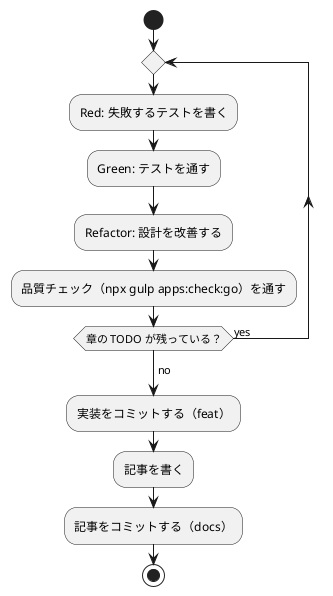

# 第 4 章: バージョン管理とデータ管理

## 4.1 はじめに

第 1 部では、TDD でデータを読み込み、前処理し、決定木で分類するプログラムを作りました。第 2 部では、そのプログラムを「変更を楽に安全にできる」状態に保つための道具立てを、バージョン管理（第 4 章）、パッケージ管理と静的解析（第 5 章）、タスクランナーと CI/CD（第 6 章）の順に整えます。

この章ではバージョン管理を扱います。機械学習のプロジェクトでは、コードに加えて **学習データ** と **学習済みモデル** というファイルが登場します。これらをコードと同じようにコミットしてよいとは限りません。この章では、Git で何を管理し、何を管理しないか、そして実験の結果を再現できるようにするには何を固定すればよいかを学びます。

Git の使い方は言語に依存しないので、[Python 版の第 4 章](../python/04-version-control-and-data-management.md)・[TypeScript 版の第 4 章](../typescript/04-version-control-and-data-management.md)・[Java 版の第 4 章](../java/04-version-control-and-data-management.md) と同じ構成で進めます。Go 版では、除外すべきものがほかの言語版より少ないこと、`go test` が **パッケージのディレクトリで走る** ためにデータの場所の解決が変わること、そして `math/rand` のシードが再現性にどう効くかに注目してください。

## 4.2 コミットメッセージの重要性

コミット履歴は「なぜこの変更をしたのか」の記録です。機械学習のプロジェクトでは、「前処理を変えたら正解率が変わった」「ライブラリと予測が一致しない原因をテストに残した」といった変化の理由を、あとから追跡できることが特に重要になります。

コミットは次の 2 つを守ると追いやすくなります。

- **1 コミット 1 目的** — 機能追加と設定変更、実装と記事を 1 つのコミットに混ぜない
- **形式をそろえる** — 種類と対象がひと目で分かる書式でメッセージを書く

## 4.3 Conventional Commits

### フォーマット

本シリーズでは [Conventional Commits](https://www.conventionalcommits.org/ja/) の形式でコミットメッセージを書きます。

```text
<type>(<scope>): <subject>

<body>

<footer>
```

`scope` には変更の対象を書きます。本リポジトリでは、Go 版の実装なら `go`（`apps/go` に置いているため）、記事シリーズなら `getting-start-ml`、Nix の環境定義なら `nix`、ADR なら `adr` のように書きます。

### コミットタイプ

| type | 用途 |
|------|------|
| `feat` | 新機能（章の実装など） |
| `fix` | バグ修正 |
| `test` | テストの追加・修正 |
| `refactor` | 振る舞いを変えないコードの変更 |
| `docs` | ドキュメントだけの変更（記事など） |
| `chore` | ビルドやツール、依存関係の変更 |
| `ci` | CI の設定の変更 |

### 実践例

本リポジトリの実際のコミット履歴から、Go 版のライブラリ選定から第 3 章までを抜き出します（古い順）。

```bash
git log --oneline -- apps/go docs/article/getting-start-ml/go .github/workflows/go-ci.yml docs/adr/008-go-ml-libraries.md
```

```text
290b59d docs(adr): Go 版のライブラリを選定する ADR 008 を追加する
3d2ca79 feat(go): Go 版の雛形（Go Modules・標準の testing）を追加する
ecac3fa feat(go): 第 1 章のきのこ派・たけのこ派の判定を TDD で実装する
f328ebd ci(go): Go CI と apps:check:go タスクを追加する
521d9e0 docs(getting-start-ml): Go 版の第 1 章と Go 版トップを追加する
9f3c00e docs(getting-start-ml): Go 版の第 1 章を登録し、B39 の完了を執筆計画に反映する
997da75 feat(go): 第 2 章の表・欠損値の補完・訓練データとテストデータへの分割を追加する
f1f534a feat(go): 第 3 章のジニ不純度で分割する決定木を追加する
```

type と scope だけで、どのコミットが何のための変更かを区別できます。ライブラリの選定（`docs(adr)`）、プロジェクトの雛形（`feat(go)`）、CI（`ci(go)`）、記事（`docs(getting-start-ml)`）が分かれているので、たとえば「実装だけを追いたい」ときは `feat(go)` のコミットだけを見れば済みます。

TypeScript 版・Java 版の履歴には、章ごとに `chore(node)`・`chore(java)` という依存関係を追加するコミットが挟まっていました。Go 版の第 1〜3 章にはそれがありません。ここまでの実装が標準ライブラリだけで書けていて、依存関係を 1 つも足していないからです（4.4 節と第 5 章で詳しく見ます）。

## 4.4 何をコミットし、何をコミットしないか

機械学習のプロジェクトには、コミットしてはいけないファイルが増えます。理由は大きく 3 つあります。

| 分類 | 例 | コミットしない理由 |
|------|-----|------------------|
| 再配布できないもの | 学習データ | ライセンスで利用者が限られている |
| 再生成できるもの | ビルドした実行ファイル、カバレッジのプロファイル、学習済みモデル、モジュールキャッシュ | 大きく、差分が読めず、コードと `go.mod`・`go.sum` とデータから作り直せる |
| 秘匿すべきもの | `.env` の認証情報 | 漏洩すると取り返しがつかない |

### 学習データ

本シリーズの学習データは、書籍『スッキリわかる Python による機械学習入門』の配布データです。配布データの利用は書籍購入者に限られており、本リポジトリは公開されているので、データはコミットしません。ルートの `.gitignore` で、データの置き場所 `apps/data/` をまるごと除外しています。この設定は全言語版で共通です。

```text
# 依存関係
node_modules/

# 環境変数（暗号化済みの .env.vault とテンプレートの .env.example は管理対象）
.env

# 学習データ（書籍購入者のみ利用可のため再配布しない。docs/article/getting-start-ml/outline.md を参照）
apps/data/

# ビルド成果物・一時ファイル
site/
tmp/

# IDE・エディタの個人設定
.idea/workspace.xml
.vscode/

# Claude Code の個人設定
.claude/settings.local.json
# エージェントの作業用 worktree
.claude/worktrees/

# OS
.DS_Store
Thumbs.db
```

### Go プロジェクト固有のファイル

`apps/go/.gitignore` は 3 行だけです。

```text
bin/
model/
coverage.out
```

| パス | 中身 |
|------|------|
| `bin/` | `go build -o bin/...` で作る実行ファイル |
| `model/` | 学習済みモデルの保存先（第 8 章で使う） |
| `coverage.out` | `go test -coverprofile=coverage.out` が作るカバレッジのプロファイル（第 5 章） |

TypeScript 版の `node_modules/`、Java 版の `.gradle/`・`build/` に当たる行がありません。Go では、依存パッケージもビルドの中間結果もプロジェクトの中に置かれないからです。

| 置き場所 | 中身 | 既定の場所 |
|---------|------|-----------|
| モジュールキャッシュ（`GOMODCACHE`） | ダウンロードした依存モジュールの展開先 | `~/go/pkg/mod` |
| ビルドキャッシュ | コンパイル結果の中間ファイル | `~/.cache/go-build`（macOS は `~/Library/Caches/go-build`） |

どちらもホームディレクトリの下にあり、プロジェクトの外です。そのため `.gitignore` に書く必要がなく、`git status` に現れることもありません。第 6 章で見るように、CI ではこの 2 つのディレクトリをキャッシュします。

依存モジュールをプロジェクトの中に置く方法（`go mod vendor` が作る `vendor/` ディレクトリ）もありますが、本シリーズでは使いません。理由は第 5 章の「vendoring を使わない理由」で説明します。

一方で、**`go.mod` と `go.sum` はコミットします**。`go.mod` には直接の依存とその版が、`go.sum` にはすべての依存モジュールのハッシュが記録されます。この 2 つがあれば、モジュールキャッシュをコミットしなくても、まったく同じ依存関係を作り直せます。TypeScript 版の `package.json`・`package-lock.json`、Java 版の `gradle/libs.versions.toml` に当たるものです。第 1〜3 章の時点では依存が 1 つも無いので `go.sum` はまだ存在せず、`go.mod` も 3 行です。

```text
module github.com/k2works/getting-started-machine-learning/apps/go

go 1.25
```

学習済みモデルは、コードと学習データがあれば作り直せます。モデルのファイルをコミットするより、「どのコードとどのデータから、どの設定で作ったか」をコミットで追えるようにするほうが、再現性の面でも役に立ちます。

### 除外されていることを確かめる

`.gitignore` が意図どおりに効いているかは、`git check-ignore -v` で確認できます。どのファイルの何行目の規則で除外されたかが表示されます。

```bash
git check-ignore -v apps/data/sukkiri-ml/iris.csv apps/go/bin/ apps/go/model/ apps/go/coverage.out
```

```text
.gitignore:8:apps/data/	apps/data/sukkiri-ml/iris.csv
apps/go/.gitignore:1:bin/	apps/go/bin/
apps/go/.gitignore:2:model/	apps/go/model/
apps/go/.gitignore:3:coverage.out	apps/go/coverage.out
```

ディレクトリのパスは末尾に `/` を付けて指定しています。末尾が `/` の規則はディレクトリだけに当てはまるので、まだ存在しないパスを `/` なしで調べると、除外されていないように見えます。

データを配置したあとに `git status --short` を実行し、`apps/data/` 以下のファイルが一覧に出てこないことも確かめておきます。

### 改行コードを固定する

コミットするファイルの中身も、環境によって変わることがあります。Windows の Git は、既定の設定（`core.autocrlf=true`）でチェックアウトするときに改行コードを CRLF に変えます。一方 `gofmt` は改行コードを LF にそろえるので、CRLF のファイルは「整形されていない」と報告されます。試しに CRLF の Go ファイルを `internal/zzdemo/crlf.go` として置いて検査すると、ファイル名が出ました（確認が済んだら消します）。

```bash
gofmt -l .
```

```text
internal/zzdemo/crlf.go
```

興味深いのは、`go vet` と `golangci-lint` は同じファイルに何も言わないことです。改行コードはコンパイラにも静的解析にも影響しないので、指摘するのは整形の検査だけです。第 6 章で見るように CI は `gofmt -l` の出力が空であることを要求するので、CRLF のファイルが 1 つあるだけで CI が落ちます。

そこで、ルートの `.gitattributes` で `apps/go` 以下の改行コードを LF に固定しています。`text=auto` はテキストと判定したファイルだけを変換の対象にし、`eol=lf` はチェックアウトするときの改行コードを LF にします。

```text
*.nix text eol=lf
*.sh text eol=lf
Dockerfile text eol=lf
.vimrc text eol=lf
gradlew text eol=lf
apps/node/** text=auto eol=lf
apps/fsharp/** text=auto eol=lf
apps/csharp/** text=auto eol=lf
apps/go/** text=auto eol=lf
```

設定が効いているかは、`git ls-files --eol` で確認できます。`i/` がリポジトリの中の改行コード、`w/` が作業ディレクトリの改行コード、`attr/` が当てはまった属性です。

```bash
git ls-files --eol apps/go/go.mod apps/go/internal/dataset/datadir.go apps/go/cmd/chapters/main.go
```

```text
i/lf    w/lf    attr/text=auto eol=lf 	apps/go/cmd/chapters/main.go
i/lf    w/lf    attr/text=auto eol=lf 	apps/go/go.mod
i/lf    w/lf    attr/text=auto eol=lf 	apps/go/internal/dataset/datadir.go
```

Java 版では Gradle Wrapper の `gradlew` だけを LF に固定していました。Go 版は、TypeScript 版と同じく整形の検査がすべてのファイルに及ぶので、ディレクトリ全体に設定しています。

## 4.5 データの入手手順をコードにする

データをコミットしない代わりに、**データの入手と配置の手順** をリポジトリに残します。手順が文章だけだと、人によって置き場所がずれたり、ファイルが足りないまま実行して分かりにくいエラーになったりします。

本リポジトリでは、配置と確認を Gulp のタスクにしています（`ops/scripts/data.js`）。このタスクは言語に依存しないので、全言語版で同じものを使います。

```bash
npx gulp data:setup
npx gulp data:check
```

配布 ZIP を `tmp/` に置いてから `data:setup` を実行し、`data:check` で揃っているかを確かめます。`data:help` の表示と、失敗したときの表示は [Python 版の 4.5 節](../python/04-version-control-and-data-management.md)・[TypeScript 版の 4.5 節](../typescript/04-version-control-and-data-management.md) を参照してください。

### プログラムからデータの場所を知る

Go の実装は、第 1 章で作った `dataset` パッケージでデータの場所を解決します。環境変数 `ML_DATA_DIR` があればその場所を、無ければ `apps/data/sukkiri-ml/` を使います。

```go
// internal/dataset/datadir.go
// From は学習データのディレクトリを返す。環境変数 ML_DATA_DIR が無ければ
// apps/data/sukkiri-ml を使う。getenv はテストで差し替えるために引数で受け取る。
func From(getenv func(string) (string, bool)) string {
	if value, ok := getenv("ML_DATA_DIR"); ok && value != "" {
		return value
	}

	return filepath.Join("..", "data", "sukkiri-ml")
}

// Current は実行中のプロセスの環境変数から学習データのディレクトリを返す。
func Current() string {
	return From(os.LookupEnv)
}
```

Java 版では、既定の引数が無いので「環境変数を読む関数を受け取るメソッド」と「`System::getenv` を渡すだけのメソッド」の 2 つに分けていました。Go にも既定の引数が無いので、同じ形になります。違うのは戻り値で、Java の `System.getenv` は見つからないと `null` を返し、TypeScript の `process.env[name]` は `undefined` を返しますが、Go の `os.LookupEnv` は `(値, 見つかったか)` の 2 つを返します。Go には `null` も `Optional` も無く、「値があるかどうか」は `bool` を添えて表すのが標準ライブラリの流儀です。`From` の引数の型 `func(string) (string, bool)` がその形をそのまま写しているので、テストからは `map` を引く偽の関数を渡すだけで両方の場合を確かめられます。

`filepath.Join` を使っているのは、Windows で区切り文字が `\` になるようにするためです。文字列で `"../data/sukkiri-ml"` と書いても Go の標準ライブラリはたいてい受け付けますが、エラーメッセージに出る道筋がその環境の書き方になります。

### go test はパッケージのディレクトリで走る

ここで、ほかの言語版には無い落とし穴があります。既定のパス `../data/sukkiri-ml` は **何から見た相対パスなのか** です。

`go run ./cmd/chapters chapter01` を `apps/go` で実行すると、プロセスの作業ディレクトリは `apps/go` なので、`../data/sukkiri-ml` は `apps/data/sukkiri-ml` を指します。ところが `go test ./...` は、**テストごとにそのパッケージのディレクトリを作業ディレクトリにして** 実行します。`internal/chapter01` のテストから見た `../data/sukkiri-ml` は `apps/go/internal/data/sukkiri-ml` で、そこにデータはありません。

そのため、データを配置していても、`apps/go` で `go test ./...` を実行すると実データのテストはスキップされます。

```bash
go test ./internal/chapter01/ -run TestKvsTData -count=1 -v
```

```text
=== RUN   TestKvsTData
=== RUN   TestKvsTData/実データから_19_人分を読み込む
=== RUN   TestKvsTData/ルールによる判定の正解率を実データで計算する
=== RUN   TestKvsTData/実行するとデータ件数と正解率を表示する
--- PASS: TestKvsTData (0.00s)
    --- SKIP: TestKvsTData/実データから_19_人分を読み込む (0.00s)
    --- SKIP: TestKvsTData/実行するとデータ件数と正解率を表示する (0.00s)
    --- SKIP: TestKvsTData/ルールによる判定の正解率を実データで計算する (0.00s)
ok  	github.com/k2works/getting-started-machine-learning/apps/go/internal/chapter01	0.318s
```

実データのテストを走らせたいときは、`ML_DATA_DIR` を渡します。パッケージのディレクトリから見た相対パス（`internal/chapterNN` なら `../../../data/sukkiri-ml`）か、絶対パスを指定します。

```bash
ML_DATA_DIR=../../../data/sukkiri-ml go test ./internal/chapter01/ -run TestKvsTData -count=1 -v
```

```text
--- PASS: TestKvsTData (0.00s)
    --- PASS: TestKvsTData/実データから_19_人分を読み込む (0.00s)
    --- PASS: TestKvsTData/実行するとデータ件数と正解率を表示する (0.00s)
    --- PASS: TestKvsTData/ルールによる判定の正解率を実データで計算する (0.00s)
ok  	github.com/k2works/getting-started-machine-learning/apps/go/internal/chapter01	0.384s
```

Java 版では、Gradle のテストの作業ディレクトリがプロジェクトのディレクトリ（`apps/java`）なので、`../data/sukkiri-ml` がテストからもそのまま使えました。代わりに「Gradle はタスクの入力が変わらなければテストを再実行しないので、`ML_DATA_DIR` を入力として宣言する」という手当てが要りました。Go にはその心配はありませんが、代わりに作業ディレクトリのほうに気をつける必要があります。ツールが違えば、気をつける場所も変わります。

なお `go test` には結果のキャッシュがあり、コードも環境変数も変わっていなければ前回の結果をそのまま表示します（`(cached)` と出ます）。環境変数を変えたときは再実行されますが、確実に走らせたいときは `-count=1` を付けます。

### データが無い環境でもテストを通す

コミットしないデータに依存するテストは、データの無い環境（CI や、データをまだ入手していない読者の環境）では失敗してしまいます。Go 版では、標準の `testing` の `t.Skip` で、データが無ければそのテストを飛ばします。

```go
// requireData は学習データが無ければテストを飛ばす。
func requireData(t *testing.T) string {
	t.Helper()

	csvFile := filepath.Join(dataset.Current(), "KvsT.csv")
	if _, err := os.Stat(csvFile); err != nil {
		t.Skip("学習データ KvsT.csv が配置されていない（gulp data:setup）")
	}

	return csvFile
}
```

TypeScript 版の `describe.skipIf`、Java 版の `Assumptions.assumeTrue` に当たるものです。違いは 2 つあります。

1. **条件を先に評価しない** — `describe.skipIf` はテストを集める段階で条件を評価しますが、`t.Skip` はテストの本体の中で呼びます。「`describe` の本体にファイルの読み込みを書いてはいけない」という TypeScript 版の注意は、Go では要りません
2. **CSV のパスを返す関数にできる** — `requireData` は「データが無ければ飛ばし、あればパスを返す」の 2 つの役目を 1 つにまとめています。`t.Helper()` を呼んでおくと、失敗したときの行番号が呼び出し元のものになります

スキップされたテストは、`go test ./... -v` で `--- SKIP` として表示されます。データの無い場所を `ML_DATA_DIR` に指定すると、その様子を確かめられます。

```bash
ML_DATA_DIR=/nonexistent go test ./...
```

```text
?   	github.com/k2works/getting-started-machine-learning/apps/go/cmd/chapters	[no test files]
ok  	github.com/k2works/getting-started-machine-learning/apps/go/internal/chapter01	1.168s
ok  	github.com/k2works/getting-started-machine-learning/apps/go/internal/chapter02	0.612s
ok  	github.com/k2works/getting-started-machine-learning/apps/go/internal/chapter03	2.276s
ok  	github.com/k2works/getting-started-machine-learning/apps/go/internal/dataset	1.760s
ok  	github.com/k2works/getting-started-machine-learning/apps/go/internal/setup	2.810s
```

第 3 章までの時点では、`-v` を付けて数えると 64 件のうち 9 件がスキップされ、55 件が成功します。スキップされる 9 件は、第 1〜3 章の `TestKvsTData`・`TestIrisData`（実データを読む表駆動テスト）の中身です。`ML_DATA_DIR` を実データの場所に向けると、この 9 件も実行されます。

単体テストは架空の値で作ったデータで書き、実データのテストは `t.Skip` で守る、という 2 段構えにすると、CI ではデータ無しでも品質チェックが回り、手元ではデータを使った確認もできます。単体テストのデータに配布データの行をそのまま写さないことも大切です。テストのコードはコミットされるので、写した行はデータの再配布になってしまいます。

## 4.6 実験を再現できるようにする

機械学習の結果は、コードとデータが同じでも、次のものが違うと変わります。

| 変わる原因 | 固定する方法 | 本リポジトリでの置き場所 |
|-----------|------------|----------------------|
| 乱数（データの分割、モデルの初期値） | シードを指定する | 各章のコード（第 2 章の `seed`） |
| 乱数を作るアルゴリズム | `rand.New(rand.NewSource(seed))` を使い、並べ替えも自分で書く | `internal/chapter02/preprocessing.go` の `Shuffle` |
| ライブラリのバージョン | 版とハッシュを記録する | `apps/go/go.mod`・`go.sum`（第 5 章） |
| Go のバージョン | `go` 指令と Nix の環境定義で指定する | `apps/go/go.mod`、`ops/nix/environments/go/shell.nix`（第 5・6 章） |

### 乱数のシード

第 2 章の `Shuffle` は、シードから作った乱数生成器で Fisher-Yates の並べ替えをします。

```go
// Shuffle はシードを使って Fisher-Yates のシャッフルで並べ替える。元のスライスは変更しない。
func Shuffle[E any](items []E, seed int64) []E {
	random := rand.New(rand.NewSource(seed)) //nolint:gosec // 再現できる分割のための擬似乱数で、暗号用途ではない
	shuffled := slices.Clone(items)

	for i := len(shuffled) - 1; i >= 1; i-- {
		j := random.Intn(i + 1)
		shuffled[i], shuffled[j] = shuffled[j], shuffled[i]
	}

	return shuffled
}
```

同じシード 0 で 2 回、シード 1 で 1 回、そしてシードを指定しない `rand.Shuffle`（パッケージ変数の乱数生成器を使う）で 1 回、0〜9 の並べ替えを実行してみます。

```go
items := []int{0, 1, 2, 3, 4, 5, 6, 7, 8, 9}
fmt.Println(chapter02.Shuffle(items, 0))
fmt.Println(chapter02.Shuffle(items, 0))
fmt.Println(chapter02.Shuffle(items, 1))

shuffled := append([]int(nil), items...)
rand.Shuffle(len(shuffled), func(i, j int) { shuffled[i], shuffled[j] = shuffled[j], shuffled[i] })
fmt.Println(shuffled)
```

2 回実行した結果です。

```text
[6 8 2 3 7 5 9 1 0 4]
[6 8 2 3 7 5 9 1 0 4]
[4 8 2 5 3 9 0 7 6 1]
[6 8 9 5 0 4 3 7 1 2]
```

```text
[6 8 2 3 7 5 9 1 0 4]
[6 8 2 3 7 5 9 1 0 4]
[4 8 2 5 3 9 0 7 6 1]
[6 9 1 0 5 2 4 3 7 8]
```

シードを指定した 3 行は、実行を繰り返しても同じ並びになり、シードを変えると並びが変わります。最後の行だけが実行のたびに変わりました。Go 1.20 以降、`math/rand` のパッケージ変数の乱数生成器は起動のたびに自動で種が変わるようになったからです。逆に言えば、**再現性が要るところでは `rand.New(rand.NewSource(seed))` で自分の乱数生成器を作る** 必要があります。

第 2 章では、この性質を次の 2 つのテストで固定しました。テストがあるので、うっかりシードを使わない実装に変えてしまっても気付けます。

```go
	t.Run("同じシードなら同じ分け方になる", func(t *testing.T) {
		t.Parallel()

		first, _ := chapter02.SplitTrainTest(numbers, labels, 0.3, 42)
		second, _ := chapter02.SplitTrainTest(numbers, labels, 0.3, 42)

		if !reflect.DeepEqual(first.TTest, second.TTest) {
			t.Errorf("同じシードで違う分け方: %v と %v", first.TTest, second.TTest)
		}
	})

	t.Run("シードが違えば違う分け方になる", func(t *testing.T) {
		t.Parallel()

		first, _ := chapter02.SplitTrainTest(numbers, labels, 0.3, 0)
		second, _ := chapter02.SplitTrainTest(numbers, labels, 0.3, 1)

		if reflect.DeepEqual(first.TTest, second.TTest) {
			t.Errorf("違うシードで同じ分け方: %v", first.TTest)
		}
	})
```

### 乱数のアルゴリズムも固定する

シードを固定しても、乱数を作るアルゴリズムが変われば結果は変わります。Kotlin 版では、標準ライブラリの `Random(seed)` の乱数列が同じになるのは同じ版の Kotlin の間だけだと、ドキュメントに書かれていました。Java 版では逆に、`java.util.Random` のアルゴリズム（48 ビットの線形合同法）が仕様の一部で、どの実装・どの版でも同じ数列が返ることが保証されていました。

Go の `math/rand` のドキュメントは、そのどちらの言明もしていません。「シミュレーションのような用途に向く擬似乱数で、セキュリティ用途には使わないこと」とは書かれていますが、数列が版をまたいで同じであるとも、変わりうるとも書かれていません。そこで、手元の 2 つの版で実際に確かめました。

```go
items := []int{0, 1, 2, 3, 4, 5, 6, 7, 8, 9}
random := rand.New(rand.NewSource(0))
shuffled := append([]int(nil), items...)

for i := len(shuffled) - 1; i >= 1; i-- {
	j := random.Intn(i + 1)
	shuffled[i], shuffled[j] = shuffled[j], shuffled[i]
}

fmt.Println(runtime.Version(), shuffled)
```

```text
go1.26.5 [6 8 2 3 7 5 9 1 0 4]
go1.25.5 [6 8 2 3 7 5 9 1 0 4]
```

Nix の環境（Go 1.25.5）でも手元（Go 1.26.5）でも同じ並びになりました。分かっていることをまとめます。

| 事柄 | 根拠 | 確かさ |
|------|------|-------|
| 同じシードの `rand.New(rand.NewSource(seed))` は、同じ呼び出しに同じ数列を返す | Go 1.25.5 と 1.26.5 で実行して確かめた | 手元の版では同じだった。ドキュメントでの保証は見当たらない |
| パッケージ変数の乱数生成器（`rand.Shuffle` など）は実行のたびに変わる | 上の 2 回の実行 | Go 1.20 以降の仕様 |
| `math/rand/v2` は別のアルゴリズム | `math/rand/v2` には `NewSource(int64)` が無く、PCG や ChaCha8 を選んで使う | 同じシードでも v1 と同じ並びにはならない |

そのため Go 版では、並べ替えのアルゴリズム（Fisher-Yates）を自分のコードに書き、乱数生成器も `math/rand`（v1）の `NewSource` に固定しています。TypeScript 版が mulberry32 を自作したのと同じ考え方で、「結果を決めるものをリポジトリの中に置く」ほど再現性は強くなります。それでも乱数生成器そのものは標準ライブラリなので、Go の版は第 5・6 章の仕組み（`go.mod` の `go` 指令と Nix の環境）で固定します。

### ほかの言語版と数値が一致しない理由

同じシード 0 でも、Python 版・Kotlin 版・Java 版・TypeScript 版・Go 版でテストデータに入る行は違います。乱数を作るアルゴリズムが NumPy・Kotlin・Java・mulberry32・Go の `math/rand` で違うためです。実際、第 3 章の深さ 2 の決定木がテストデータ 45 件のうち正しく分類した数は、Kotlin 版が 42 件、Java 版が 43 件、Go 版も 43 件でした。数が同じでも、同じ行を当てているとは限りません。

記事に載せる正解率などの数値は、シードと版を固定した実装を実データで動かした結果です。数値をテストで固定するときは、どのシードで得た値かを必ずコードに残します。

## 4.7 TDD とコミットのタイミング

TDD のサイクルとコミットは、次のように対応させると履歴が読みやすくなります。



- テストが通らない状態ではコミットしない
- 実装と記事は別のコミットにする
- 依存関係の追加（`chore`）、CI の変更（`ci`）も、それぞれ別のコミットにする
- 学習データ・モデル・`coverage.out` がステージングされていないことを、コミットの前に `git status` で確かめる

第 1〜3 章の実際の履歴は 4.3 節のとおりです。ライブラリを 1 つも足していないので、TypeScript 版・Java 版にあった「章ごとの `chore`」がありません。第 7 章で gonum を入れるときに、Go 版でも `chore(go)` のコミットが 1 つ増えます。

## 4.8 まとめ

この章では、機械学習のプロジェクトでのバージョン管理を学びました。

1. **Conventional Commits** — type と scope で、変更の種類と対象が分かるコミットメッセージを書く。理由は本文に書く
2. **コミットしないものを決める** — 再配布できない学習データ、再生成できる実行ファイル・カバレッジのプロファイル・モデルを `.gitignore` で除外する。依存モジュールとビルドの中間結果はホームディレクトリのキャッシュにあるので、除外の対象にすらならない。`go.mod` と `go.sum` はコミットする
3. **改行コードを固定する** — `.gitattributes` で `apps/go` 以下を LF にし、Windows でも `gofmt -l` の検査が通るようにする
4. **入手手順をコードにする** — データを置く場所と確認方法を Gulp タスクにし、プログラムからは `dataset.Current` で場所を解決する
5. **作業ディレクトリに気をつける** — `go test` はパッケージのディレクトリで走るので、相対パスの既定値はテストからは届かない。実データのテストは `ML_DATA_DIR` で場所を渡す
6. **データが無くてもテストを通す** — 実データのテストは `t.Skip` で飛ばす。`t.Helper` を呼んでおくと失敗の行番号が読みやすくなる
7. **再現性** — シードを渡した `rand.New(rand.NewSource(seed))` と、自分で書いた Fisher-Yates で乱数の結果を固定する。パッケージ変数の乱数生成器は Go 1.20 以降、実行のたびに変わる

次の章では、依存と Go の版を固定する Go Modules の仕組みと、コードの品質を機械的に確かめる `gofmt`・`go vet`・golangci-lint を扱います。
