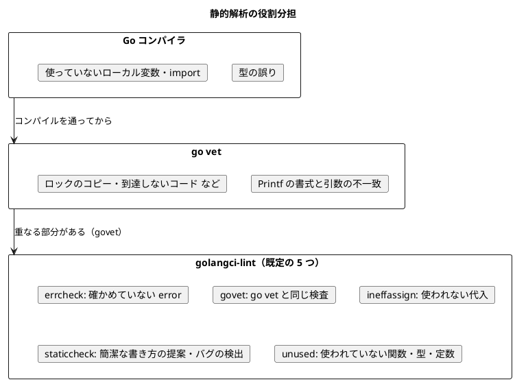

# 第 5 章: パッケージ管理と静的解析

## 5.1 はじめに

前の章では、何をコミットし、何をコミットしないかを決めました。この章では、コミットした情報から **同じ環境を作り直す** 仕組み（パッケージ管理）と、コードの品質を **機械的に確かめる** 仕組み（整形・静的解析・カバレッジ）を整えます。

Go の道具立てはほかの言語版とかなり違います。TypeScript 版は npm・TypeScript コンパイラ・ESLint・Prettier・Vitest のカバレッジと、役割ごとに別のパッケージを入れていました。Java 版は Gradle・Spotless・Error Prone・PMD・JaCoCo で、`build.gradle.kts` は 100 行を超えます。Go 版に設定ファイルはありません。`go.mod` が 3 行あるだけで、整形・静的解析・テスト・カバレッジはすべて `go` コマンドに入っています。

| 役割 | Go | TypeScript 版 | Java 版 |
|------|-----|--------------|---------|
| 依存の解決 | `go` コマンド（Go Modules） | npm | Gradle |
| 依存の記録 | `go.mod`・`go.sum` | `package.json`・`package-lock.json` | `gradle/libs.versions.toml` |
| 整形 | `gofmt` | Prettier | Spotless + google-java-format |
| 型検査 | Go コンパイラ | `tsc --noEmit` | Java コンパイラ |
| 静的解析 | `go vet`・golangci-lint | ESLint | Error Prone・PMD |
| テスト | `go test` | Vitest | JUnit（Gradle 経由） |
| カバレッジ | `go test -cover` | `@vitest/coverage-v8` | JaCoCo |
| 設定ファイル | なし（`go.mod` のみ） | `package.json`・`tsconfig.json`・`eslint.config.js`・`.prettierrc`・`vitest.config.ts` | `build.gradle.kts`・`settings.gradle.kts`・`libs.versions.toml`・`pmd-ruleset.xml` |

「設定できない」ことは制約であると同時に、決めなくてよいということでもあります。この章では、その割り切りがどこまで通用し、どこで自分で決める必要があるのかを見ていきます。

## 5.2 Go Modules によるパッケージ管理

### go.mod

Go のプロジェクトは `go.mod` で始まります。`apps/go/go.mod` は 3 行です。

```text
module github.com/k2works/getting-started-machine-learning/apps/go

go 1.25
```

| 行 | 意味 |
|----|------|
| `module ...` | このモジュールのパス。パッケージを import するときの接頭辞になる |
| `go 1.25` | このモジュールが前提とする Go の言語バージョン |

モジュールパスはリポジトリの URL の形にするのが慣習です。公開する予定が無くても、この形にしておくと import のパスが一意になり、将来 `go get` で取得できるようになります。

```go
import (
	"github.com/k2works/getting-started-machine-learning/apps/go/internal/chapter01"
	"github.com/k2works/getting-started-machine-learning/apps/go/internal/dataset"
)
```

第 1 章のテストは、このパスを使って実装を読み込みます。

`internal/` という名前には意味があります。`internal` の下のパッケージは、`internal` の親（ここでは `apps/go`）の中からしか import できません。他人のモジュールから使われないことをコンパイラが保証してくれるので、公開 API を気にせず作り替えられます。Java の package-private、TypeScript の「`index.ts` から export しない」に当たる仕組みが、ディレクトリ名で表されています。

### 依存を足す

第 1〜3 章の実装に依存はありません。標準ライブラリの `encoding/csv`・`math`・`math/rand`・`sort`・`testing` で足りているからです。TypeScript 版は第 2 章で csv-parse、第 3 章で ml-cart を入れ、Java 版は第 3 章で Tribuo を入れていました。Go 版で最初の依存が増えるのは第 7 章の gonum です。

依存を足す動きを先に見ておきます。使い捨てのモジュールで `go get` を実行すると、`go.mod` に `require` の行が増え、`go.sum` が作られます。

```bash
go mod init example.com/demo
go get gonum.org/v1/gonum@v0.17.0
```

```text
go: creating new go.mod: module example.com/demo
go: added gonum.org/v1/gonum v0.17.0
```

```text
module example.com/demo

go 1.25.5

require gonum.org/v1/gonum v0.17.0 // indirect
```

```text
gonum.org/v1/gonum v0.17.0 h1:VbpOemQlsSMrYmn7T2OUvQ4dqxQXU+ouZFQsZOx50z4=
gonum.org/v1/gonum v0.17.0/go.mod h1:El3tOrEuMpv2UdMrbNlKEh9vd86bmQ6vqIcDwxEOc1E=
```

`// indirect` は「まだどのコードからも import されていない」という印です。実際に import してから `go mod tidy` を実行すると、この印が消えます。

```bash
go mod tidy
```

```text
module example.com/demo

go 1.25.5

require gonum.org/v1/gonum v0.17.0
```

`go mod tidy` は、コードを読んで「import されているのに `go.mod` に無い依存」を足し、「`go.mod` にあるのに import されていない依存」を消します。npm の `package.json` を手で直すのに当たる作業が、コードのほうから自動で決まるところが Go の特徴です。

### 本番依存と開発依存の区別がない

TypeScript 版の `package.json` には `dependencies` と `devDependencies` があり、Java 版の Gradle には `implementation` と `testImplementation` がありました。**`go.mod` にはこの区別がありません。** テストでしか使わないライブラリも、同じ `require` に並びます。

区別が要らないのは、Go のビルドがパッケージ単位で必要なものだけをリンクするからです。`_test.go` からしか import されないパッケージは、`go build` が作る実行ファイルに入りません。「配布物を小さくするために本番依存を分ける」という動機が、そもそも生じないわけです。

そのぶん、「どの依存がテスト専用か」は `go.mod` を見ても分かりません。`go mod why <モジュール>` で、どのパッケージから辿り着いたかを調べます。

一方、**コード生成やリンティングに使うツール** は、Go 1.24 以降 `tool` 指令で記録できます。使い捨てのモジュールで試すと、次のようになりました。

```bash
go get -tool golang.org/x/tools/cmd/stringer@v0.30.0
```

```text
module example.com/demo

go 1.25.5

require gonum.org/v1/gonum v0.17.0

require (
	golang.org/x/mod v0.23.0 // indirect
	golang.org/x/sync v0.12.0 // indirect
	golang.org/x/tools v0.30.0 // indirect
)

tool golang.org/x/tools/cmd/stringer
```

```bash
go tool
```

```text
asm
cgo
compile
cover
link
preprofile
vet
golang.org/x/tools/cmd/stringer
```

`go tool` の一覧に、Go 本体のツール（`vet`・`cover` など）と並んで自分で足したツールが出ます。TypeScript 版の `devDependencies` に入れたツールを `npx` で呼ぶのと同じ関係です。本シリーズでは、使うツール（`gofmt`・`go vet`・golangci-lint）がすべて Go 本体か Nix の環境に入っているので、`tool` 指令は使っていません。

### go.sum とモジュールの検証

`go.sum` には、依存モジュールの内容のハッシュが記録されます。1 つの依存につき 2 行で、`h1:` の行はモジュール全体の、`/go.mod h1:` の行はその `go.mod` のハッシュです。

これが何のためにあるのかは、書き換えてみるとはっきりします。ハッシュを 0 で埋めてからビルドすると、次のように止まりました。

```text
verifying gonum.org/v1/gonum@v0.17.0: checksum mismatch
	downloaded: h1:VbpOemQlsSMrYmn7T2OUvQ4dqxQXU+ouZFQsZOx50z4=
	go.sum:     h1:0000000000000000000000000000000000000000000=

SECURITY ERROR
This download does NOT match an earlier download recorded in go.sum.
The bits may have been replaced on the origin server, or an attacker may
have intercepted the download attempt.

For more information, see 'go help module-auth'.
```

「配信元のファイルが差し替えられたか、ダウンロードが横取りされた可能性がある」とまで書いてあります。`package-lock.json` の `integrity` と同じ役割ですが、Go はさらに公開されたチェックサムデータベース（`sum.golang.org`）とも突き合わせるので、`go.sum` に無い新しいモジュールでも改ざんに気付けます。

いま手元にあるモジュールが `go.sum` と一致しているかは `go mod verify` で確かめられます。

```bash
go mod verify
```

```text
all modules verified
```

### モジュールキャッシュ

ダウンロードしたモジュールは、プロジェクトの中ではなく `GOMODCACHE` に展開されます。

```bash
go env GOMODCACHE
du -sh $(go env GOMODCACHE)/gonum.org/v1/gonum@v0.17.0
```

```text
/Users/k2works/go/pkg/mod
 19M	/Users/k2works/go/pkg/mod/gonum.org/v1/gonum@v0.17.0
```

キャッシュはマシンに 1 つで、すべてのプロジェクトが共有します。`node_modules/` のようにプロジェクトごとに複製されないので、同じライブラリを使う 10 個のプロジェクトがあってもディスク上は 1 つです。CI では、このディレクトリとビルドキャッシュ（`~/.cache/go-build`）を保存して次回に使い回します（第 6 章）。

依存をあらかじめ取得するコマンドは `go mod download` です。依存が 1 つも無い第 1〜3 章の状態で実行すると、そのことを教えてくれます。

```bash
go mod download
```

```text
go: no module dependencies to download
```

npm の `npm ci` に当たるのがこのコマンドですが、`go build` や `go test` が必要に応じて自動で取得するので、必須ではありません。本リポジトリのタスク（第 6 章の `apps:setup:go`）では、CI の最初のステップで依存を揃えるために明示的に呼んでいます。

### vendoring を使わない理由

`go mod vendor` を実行すると、依存のソースが `vendor/` ディレクトリに複製され、以降のビルドはネットワークもモジュールキャッシュも見なくなります。使い捨てのモジュールで試すと、gonum 1 つで 2.7 MB になりました。

```bash
go mod vendor
du -sh vendor
```

```text
2.7M	vendor
```

本シリーズでは使いません。理由は 3 つあります。

1. **`go.sum` で再現性は足りている** — 版もハッシュも記録されていて、`go mod verify` で検証できる
2. **差分が読めない** — 依存を上げるたびに数千行の差分がコミットに入り、レビューで自分の変更が埋もれる
3. **リポジトリが大きくなる** — 第 4 章で「再生成できるものはコミットしない」と決めた方針と衝突する

ネットワークから切り離されたビルド環境が要件になる場合や、依存の配信元が消える不安がある場合は、vendoring が正しい選択になります。本シリーズはそのどちらにも当たりません。

## 5.3 Go のバージョンを固定する

### go 指令とツールチェーン

`go.mod` の `go 1.25` は、このモジュールが前提とする **言語バージョン** です。これより新しい文法を使うとコンパイルエラーになり、これより古い Go でビルドしようとすると「Go 1.25 以降が必要」と言われます。

Go には、もう 1 つ `GOTOOLCHAIN` という仕組みがあります。既定は `auto` で、`go.mod` が要求する版より手元の Go が古ければ、必要な版を自動でダウンロードして使います。

```bash
go env GOTOOLCHAIN GOVERSION
```

```text
auto
go1.25.5
```

Java 版の Gradle ツールチェーン（`JavaLanguageVersion.of(21)`）に近い仕組みですが、Go は言語バージョンと実行するツールチェーンを分けているところが違います。`go 1.25` と書いておけば、Go 1.26 の環境では 1.26 のコンパイラが 1.25 の言語仕様で翻訳します。

### 2 つの環境で動かす

本リポジトリでは、2 つの環境で同じコードを動かしています。

| 環境 | Go の版 | 用途 |
|------|--------|------|
| Nix（`nix develop .#go`） | 1.25.5 | CI と、ツールを揃えたいとき |
| 手元のマシン | 1.26.5 | 日常の編集 |

`go.mod` の `go` 指令を 1.25 にしてあるので、どちらでも `go test ./...` が通ります。Nix の環境定義（`ops/nix/environments/go/shell.nix`）には、Go 本体のほかに開発用のツールが並びます。

```nix
  buildInputs = baseShell.buildInputs ++ (with packages; [
    go
    gopls
    gotools
    delve
    golangci-lint
  ]);
```

| パッケージ | 中身 | 実際に入る版 |
|-----------|------|------------|
| `go` | コンパイラ・`gofmt`・`go vet`・`go test` | 1.25.5 |
| `gopls` | 言語サーバー（エディタの補完・定義ジャンプ） | 0.21.0 |
| `gotools` | `goimports` などの補助ツール | — |
| `delve` | デバッガ | — |
| `golangci-lint` | 静的解析のとりまとめ | 2.7.2 |

版を確かめておきます。`flake.lock` で固定された nixpkgs から入るので、nixpkgs の最新（執筆時点では golangci-lint 2.8.0）ではなく、固定された 2.7.2 が入ります。記事に載せる指摘の文言は、この 2.7.2 で実際に出たものです。

```bash
nix develop .#go --command bash -c "go version; golangci-lint version"
```

```text
go version go1.25.5 darwin/amd64
golangci-lint has version 2.7.2 built with go1.25.5 from v2.7.2 on 1970-01-01T00:00:00Z
```

TypeScript 版では `.nvmrc` と `package.json` の `engines` で Node.js の版を宣言し、`engine-strict` で下限を強制していました。Go 版でそれに当たるのは `go.mod` の `go` 指令ひとつです。ツールの版まで含めて揃えたいときは、Nix の環境に入ります。

## 5.4 整形 — gofmt

### 設定を持たない整形

`gofmt` は Go に同梱されている整形ツールです。**設定項目がありません。** インデントはタブ、演算子の前後の空白、括弧の位置、import の並び順は、すべて決まっています。Prettier の `printWidth` や google-java-format の 2 スペースのような選択肢がないので、プロジェクトごとにスタイルを議論する余地がありません。

検査には `-l`（list）を使います。整形されていないファイルの名前だけを表示し、すべて整っていれば何も出しません。

```bash
gofmt -l .
```

整っていれば何も表示されません。

何が違うのかは `-d`（diff）で見ます。わざと崩したファイルを置いて実行してみます。

```bash
gofmt -d ./internal/zzdemo/bad.go
```

```text
diff ./internal/zzdemo/bad.go.orig ./internal/zzdemo/bad.go
--- ./internal/zzdemo/bad.go.orig
+++ ./internal/zzdemo/bad.go
@@ -2,7 +2,7 @@
 
 import "fmt"
 
-func Badly(  ) {
-  x:=1
-    fmt.Println( x )
+func Badly() {
+	x := 1
+	fmt.Println(x)
 }
```

直すときは `-w`（write）でファイルを上書きします。エディタは保存時に `gofmt`（または import の整理も行う `goimports`）を走らせる設定が標準的なので、実際には手で実行することはほとんどありません。

```bash
gofmt -w .
```

`gofmt -l` は終了コードでは失敗を伝えません（整形されていないファイルがあっても 0 を返します）。そのため検査では「出力が空であること」を条件にします。第 6 章で見る CI とタスクが `test -z "$(gofmt -l .)"` という形になっているのはこのためです。

## 5.5 型検査 — Go コンパイラ

TypeScript 版では、Vitest が型を検査しないので `tsc --noEmit` を別に走らせる必要がありました。Go ではコンパイルとテストが同じコマンドなので、型の誤りは `go build` と `go test` が同時に見つけます。

Go のコンパイラは、ほかの言語なら「リンターの仕事」とされることまでエラーにします。代表が、使っていないローカル変数と使っていない import です。

```go
func Unused() int {
	limit := 3

	return 1
}
```

```bash
go build ./internal/zzdemo/
```

```text
# github.com/k2works/getting-started-machine-learning/apps/go/internal/zzdemo
internal/zzdemo/bad.go:4:2: declared and not used: limit
```

警告ではなくエラーなので、ビルドもテストも通りません。「使っていない変数が残っているコードはコミットできない」という規律が、言語の仕様として強制されます。Java では未使用のローカル変数は警告にもならず、Error Prone や PMD を入れて初めて指摘されるところです。

なお、パッケージレベルの変数・関数・型は、使われていなくてもコンパイラは何も言いません（他のパッケージから使われるかもしれないからです）。そこは次の節の `unused` が受け持ちます。

## 5.6 静的解析 — go vet と golangci-lint

### 2 つのツールの役割



`go vet` は Go に同梱されていて、コンパイルは通るが怪しいコードを報告します。golangci-lint は多数の検査器（linter）を並行して走らせるとりまとめ役で、`go vet` も `govet` という名前で内側に持っています。

設定ファイルを置いていないので、golangci-lint は既定の構成で動きます。

```bash
golangci-lint config path
```

```text
level=warning msg="No config file detected"
```

既定で有効な検査器は 5 つです。

```bash
golangci-lint help linters
```

```text
Enabled by default linters:
errcheck: Errcheck is a program for checking for unchecked errors in Go code. These unchecked errors can be critical bugs in some cases.
govet: Vet examines Go source code and reports suspicious constructs. It is roughly the same as 'go vet' and uses its passes. [auto-fix]
ineffassign: Detects when assignments to existing variables are not used. [fast]
staticcheck: It's the set of rules from staticcheck. [auto-fix]
unused: Checks Go code for unused constants, variables, functions and types.
```

この下に「Disabled by default linters」として 100 以上が並びます。Java 版が PMD のルールセットを XML で選び、TypeScript 版が ESLint のルールを設定ファイルで足したのに対して、Go 版は **既定の 5 つだけを使う** と決めました。増やすかどうかは、指摘に価値があるかを見てから決めます（後述の `mnd` の例）。

### わざと違反を入れて、検査が効いていることを確かめる

検査は「動いているつもり」が一番危ないので、違反を入れて失敗することを確かめます。5 つの検査器それぞれに引っかかるファイルを置いてみます。

```go
// Package zzdemo は静的解析の確認用。
package zzdemo

import (
	"fmt"
	"os"
)

// Demo は違反を並べた関数。
func Demo() {
	fmt.Printf("%d\n", "1.0")

	count := 0
	count = 10
	count = 20
	fmt.Println(count)

	os.WriteFile("a.txt", []byte("a"), 0o600)
}

func unusedHelper() string {
	return "使われていない"
}

// HasSetosa は名前が setosa かどうかを返す。
func HasSetosa(name string) bool {
	if name == "setosa" {
		return true
	}
	return false
}
```

まず `go vet` です。

```bash
go vet ./internal/zzdemo/
```

```text
# github.com/k2works/getting-started-machine-learning/apps/go/internal/zzdemo
internal/zzdemo/demo.go:11:14: fmt.Printf format %d has arg "1.0" of wrong type string
```

`%d` に文字列を渡した誤りを 1 件だけ報告しました。次に golangci-lint です。

```bash
golangci-lint run ./internal/zzdemo/
```

```text
internal/zzdemo/demo.go:18:14: Error return value of `os.WriteFile` is not checked (errcheck)
	os.WriteFile("a.txt", []byte("a"), 0o600)
	            ^
internal/zzdemo/demo.go:11:14: printf: fmt.Printf format %d has arg "1.0" of wrong type string (govet)
	fmt.Printf("%d\n", "1.0")
	            ^
internal/zzdemo/demo.go:14:2: ineffectual assignment to count (ineffassign)
	count = 10
	^
internal/zzdemo/demo.go:27:2: S1008: should use 'return name == "setosa"' instead of 'if name == "setosa" { return true }; return false' (staticcheck)
	if name == "setosa" {
	^
internal/zzdemo/demo.go:21:6: func unusedHelper is unused (unused)
func unusedHelper() string {
     ^
5 issues:
* errcheck: 1
* govet: 1
* ineffassign: 1
* staticcheck: 1
* unused: 1
```

5 件すべてを、検査器の名前つきで報告しました。末尾の集計で、どの検査器が何件出したかが分かります。`go vet` が見つけた 1 件が `govet` として含まれているので、golangci-lint だけでも足りるように見えます。それでも本シリーズが両方を走らせているのは、`go vet` が Go に同梱されていて外部のツールが無い環境でも動く、いわば最後の砦だからです。golangci-lint が版の差で動かなくなっても、`go vet` は必ず走ります。

違反を消すと、検査は静かになります。

```bash
golangci-lint run
```

```text
0 issues.
```

### errcheck と Go のエラー処理

5 つのうち、Go らしさが最もよく出るのが `errcheck` です。Go には例外が無く、失敗しうる処理は `(値, error)` を返します。返された `error` を見ないコードは、失敗を握りつぶしていることになります。

つまずきやすいのは `defer` で閉じるときです。

```go
func Read(name string) error {
	file, err := os.Open(name)
	if err != nil {
		return err
	}
	defer file.Close()

	return nil
}
```

```text
internal/zzdemo/demo.go:11:18: Error return value of `file.Close` is not checked (errcheck)
	defer file.Close()
	                ^
```

Go の教科書によく出る `defer file.Close()` が、そのままでは指摘されます。読み込みだけなら閉じる際の誤りを無視してよいので、意図して捨てていることを `_ =` で示します。

```go
	defer func() { _ = file.Close() }()
```

本シリーズの第 1 章では、そもそもこの問題が起きない書き方をしています。CSV の読み込みに `os.ReadFile` を使い、ファイルを開いたままにしないからです。

```go
	content, err := os.ReadFile(csvFile)
	if err != nil {
		return nil, fmt.Errorf("CSV を読めません: %w", err)
	}
```

Java 版では、閉じ忘れを try-with-resources が防ぎ、失敗は検査例外が呼び出し元に押し上げます。Go はどちらも言語に無いぶん、`errcheck` が「見ていない `error`」を数え上げる役をしています。

### 指摘を抑える — nolint

既定の 5 つ以外も、必要なら `--enable` で足せます。たとえば `mnd`（magic number detector）を有効にすると、第 3 章の決定木にこう言われます。

```bash
golangci-lint run --enable=mnd ./internal/chapter03/
```

```text
internal/chapter03/decisiontree.go:128:57: Magic number: 2, in <assign> detected (mnd)
					Threshold: (sorted[i-1].value + sorted[i].value) / 2,
					                                                   ^
1 issues:
* mnd: 1
```

指しているのは「2 つの値の中点」を求める式です。この `2` に名前を付けても読みやすくはならないので、`mnd` は有効にしていません。検査器は多ければよいというものではなく、**直す価値のある指摘だけを出す構成** を選びます。

どうしても 1 か所だけ抑えたいときは、`//nolint:` のコメントに理由を添えます。第 2 章の乱数がその例です。

```go
	random := rand.New(rand.NewSource(seed)) //nolint:gosec // 再現できる分割のための擬似乱数で、暗号用途ではない
```

`gosec`（セキュリティの検査器）は既定では無効なので、この行がいま何かを抑えているわけではありません。それでも書いてあるのは、`gosec` を有効にする人が現れたときに「ここは分かったうえで `math/rand` を使っている」と伝えるためです。抑制のコメントは、**何を抑えるか** より **なぜ抑えるか** のほうが大切です。

## 5.7 コードカバレッジ — go test -cover

カバレッジも `go test` に入っています。`-cover` を付けるだけで、パッケージごとの割合が出ます。

```bash
go test ./... -cover
```

```text
	github.com/k2works/getting-started-machine-learning/apps/go/cmd/chapters		coverage: 0.0% of statements
ok  	github.com/k2works/getting-started-machine-learning/apps/go/internal/chapter01	1.124s	coverage: 66.2% of statements
ok  	github.com/k2works/getting-started-machine-learning/apps/go/internal/chapter02	1.744s	coverage: 60.5% of statements
ok  	github.com/k2works/getting-started-machine-learning/apps/go/internal/chapter03	2.260s	coverage: 64.6% of statements
ok  	github.com/k2works/getting-started-machine-learning/apps/go/internal/dataset	3.301s	coverage: 75.0% of statements
ok  	github.com/k2works/getting-started-machine-learning/apps/go/internal/setup	2.807s	coverage: [no statements]
```

行ごとの内訳を見るには、プロファイルを書き出してから `go tool cover` で読みます。

```bash
go test ./... -count=1 -coverprofile=coverage.out
go tool cover -func=coverage.out | tail -9
```

```text
github.com/k2works/getting-started-machine-learning/apps/go/internal/chapter03/decisiontree.go:306:	Fit			80.0%
github.com/k2works/getting-started-machine-learning/apps/go/internal/chapter03/decisiontree.go:318:	Tree			0.0%
github.com/k2works/getting-started-machine-learning/apps/go/internal/chapter03/decisiontree.go:323:	Predict			88.9%
github.com/k2works/getting-started-machine-learning/apps/go/internal/chapter03/main.go:24:		Run			0.0%
github.com/k2works/getting-started-machine-learning/apps/go/internal/chapter03/main.go:76:		printAccuracy		0.0%
github.com/k2works/getting-started-machine-learning/apps/go/internal/chapter03/main.go:104:		accuracyOf		0.0%
github.com/k2works/getting-started-machine-learning/apps/go/internal/dataset/datadir.go:11:		From			100.0%
github.com/k2works/getting-started-machine-learning/apps/go/internal/dataset/datadir.go:20:		Current			0.0%
total:													(statements)		60.6%
```

`go tool cover -html=coverage.out` を実行すると、通った行を緑、通っていない行を赤で塗った HTML がブラウザで開きます。JaCoCo や `@vitest/coverage-v8` のレポートに当たるものです。`coverage.out` は第 4 章で `.gitignore` に入れました。

### 数字の読み方に注意する

上の 60.6% という数字は、**学習データが無い状態** で測ったものです。実データのテストがスキップされるので、`Run` と `Current` は一度も呼ばれず 0.0% になっています。`ML_DATA_DIR` で実データの場所を渡して測り直すと、同じコードのまま 79.2% に上がりました。

| 測り方 | 全体のカバレッジ |
|--------|----------------|
| `go test ./... -cover`（データ無し） | 60.6% |
| `ML_DATA_DIR=... go test ./... -cover`（データ有り） | 79.2% |

同じリポジトリでも、測る環境で 19 ポイント動きます。カバレッジに下限を設けて CI で強制する運用にするなら、**どちらの条件で測った数字なのか** を決めておかないと意味がありません。本シリーズは CI に学習データを置けない（再配布できない）ので、下限は設けず、数字は傾向を見るために使います。

Go のカバレッジが数えるのは「文（statement）」で、Java の JaCoCo が数える分岐（branch）ではありません。`if` の両方の枝を通らなくても、その `if` の文を通れば数えられます。100% に近づけること自体を目的にしないほうがよい、というのはどの言語でも同じですが、Go では特に「文のカバレッジであること」を踏まえて読みます。

## 5.8 まとめ

この章では、Go の依存と品質の道具立てを見ました。

1. **Go Modules** — `go.mod` に module パスと `go` 指令、`go.sum` に依存のハッシュ。`go mod tidy` がコードから依存を決め、`go mod verify` が改ざんを検出する
2. **本番依存と開発依存の区別が無い** — テスト専用の依存も同じ `require` に並ぶ。ビルドが必要なものだけをリンクするので、分ける動機が生じない。ツールは `tool` 指令で記録できる
3. **キャッシュはプロジェクトの外** — モジュールキャッシュもビルドキャッシュもホームディレクトリにあり、`.gitignore` の対象にならない。vendoring は使わない
4. **版の固定** — `go.mod` の `go` 指令で言語バージョンを、Nix の環境で Go 1.25.5 と golangci-lint 2.7.2 を固定する
5. **gofmt** — 設定を持たない整形。`-l` の出力が空であることを検査の条件にする
6. **コンパイラが多くを引き受ける** — 使っていないローカル変数・import はコンパイルエラー。型検査を別に走らせる必要がない
7. **go vet と golangci-lint** — 既定の 5 つ（errcheck・govet・ineffassign・staticcheck・unused）だけを使う。検査器を足すかどうかは、指摘に直す価値があるかで決める
8. **カバレッジ** — `go test -cover` と `go tool cover`。学習データの有無で 60.6% と 79.2% に分かれるので、どの条件で測った数字かを明示する

次の章では、これらのコマンドを 1 つのタスクにまとめ、GitHub Actions で自動的に走らせます。
