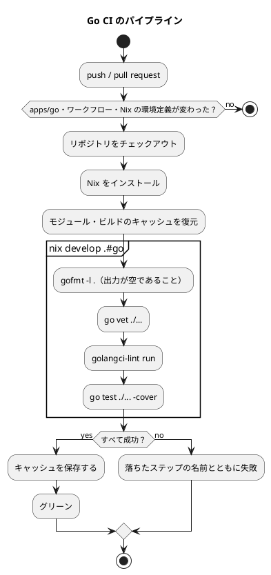

# 第 6 章: タスクランナーと CI/CD

## 6.1 はじめに

前の章で、整形・静的解析・テスト・カバレッジの道具がそろいました。ただし、そろっているだけでは使われません。4 つのコマンドを毎回手で打つのは面倒で、打ち忘れれば検査は無かったことになります。

この章では、次の 2 つを整えます。

- **タスクランナー** — 品質チェックを 1 つのコマンドにまとめ、手元でいつでも実行できるようにする
- **CI（継続的インテグレーション）** — 同じ検査を GitHub Actions で自動的に実行し、壊れた状態が main に入らないようにする

TypeScript 版は npm scripts の `check`、Java 版は Gradle の `check` にまとめていました。Go には、そのような **タスクを定義する仕組みがありません**。この章では、その穴を何で埋めるかから始めます。

## 6.2 タスクランナー — go コマンドと Gulp

### Go にタスクの定義は無い

`package.json` の `scripts` や `build.gradle.kts` の `tasks` に当たるものは、Go の `go.mod` にありません。`go` コマンドそのものがビルドツールであり、テストランナーであり、整形ツールでもあるので、「コマンドを組み合わせたタスク」を書く場所が用意されていないのです。

Go のプロジェクトがこの穴を埋める方法は、おおむね次の 3 つです。

| 方法 | 利点 | 欠点 |
|------|------|------|
| `Makefile` を置く | 追加の依存が要らない。慣習として広く使われている | Windows で素直に動かない。タブとスペースの区別など make 固有の癖がある |
| タスクランナーを入れる（Task・Mage など） | Go か YAML でタスクを書ける | 依存が 1 つ増える |
| 既にあるタスクランナーを使う | 追加の依存が要らない | そのタスクランナーがある環境が前提になる |

本リポジトリは 3 つ目を選びました。14 言語版のサンプル実装が 1 つのリポジトリに同居していて、学習データの配置（第 4 章の `data:setup`）などを Gulp のタスクで受け持っているからです。Go 版のためだけに `Makefile` や Task を足すより、既にあるところに 1 行足すほうが、読者が覚えることが少なくなります。

### apps.js の Go の定義

`ops/scripts/apps.js` に、Go 版の定義を足しています。

```javascript
  {
    name: 'go',
    nix: 'go',
    dir: path.join('apps', 'go'),
    tools: [{ cmd: 'go', version: 'go version' }],
    setup: 'go mod download',
    // CI（.github/workflows/go-ci.yml）と同じ順に、整形・vet・lint・テストを検査する
    check: 'test -z "$(gofmt -l .)" && go vet ./... && golangci-lint run && go test ./... -cover',
  },
```

| 項目 | 意味 |
|------|------|
| `dir` | 実行する場所（`apps/go`） |
| `tools` | 前提になるコマンドと、それが使えるかを確かめる方法 |
| `setup` | 依存を取得する（`apps:setup:go`） |
| `check` | 品質チェック（`apps:check:go`） |

`check` は 4 つのコマンドを `&&` でつないだものです。前が成功したときだけ次に進むので、整形が崩れていればそこで止まります。Java 版が `./gradlew check` の 1 語で済んでいたのと比べると素朴ですが、**同じ 1 行が CI にもそのまま載る** ので、手元と CI がずれません。

`tools` に書いた `go version` が失敗したとき（Go が入っていないとき）は、Gulp が `nix develop .#go` の中で同じコマンドを実行します。読者は Go を入れていなくても、Nix さえあれば検査を実行できます。

### タスクの実行

```bash
npx gulp apps:check:go
```

```text
[20:41:46] Using gulpfile ~/IdeaProjects/getting-started-machine-learning/.claude/worktrees/agent-a027bb6aeeb053c12/gulpfile.js
[20:41:46] Starting 'apps:check:go'...

[apps/go] test -z "$(gofmt -l .)" && go vet ./... && golangci-lint run && go test ./... -cover
0 issues.
	github.com/k2works/getting-started-machine-learning/apps/go/cmd/chapters		coverage: 0.0% of statements
ok  	github.com/k2works/getting-started-machine-learning/apps/go/internal/chapter01	1.124s	coverage: 66.2% of statements
ok  	github.com/k2works/getting-started-machine-learning/apps/go/internal/chapter02	1.744s	coverage: 60.5% of statements
ok  	github.com/k2works/getting-started-machine-learning/apps/go/internal/chapter03	2.260s	coverage: 64.6% of statements
ok  	github.com/k2works/getting-started-machine-learning/apps/go/internal/dataset	3.301s	coverage: 75.0% of statements
ok  	github.com/k2works/getting-started-machine-learning/apps/go/internal/setup	2.807s	coverage: [no statements]
[20:41:52] Finished 'apps:check:go' after 5.52 s
```

手元の Go で `go version` が成功したので、Nix を使わずに実行されました。第 1〜3 章の全体で 6 秒弱です。Java 版の Gradle は、前回の結果を使い回して（`UP-TO-DATE`）4 秒ほどでした。Go はタスクの「最新かどうか」を持たない代わりに、コンパイル結果のキャッシュ（第 5 章）とテスト結果のキャッシュで速さを保っています。

### 失敗したときの表示

整形の崩れたファイルを置いて実行すると、こうなります。

```text
[20:42:10] Starting 'apps:check:go'...

[apps/go] test -z "$(gofmt -l .)" && go vet ./... && golangci-lint run && go test ./... -cover
[20:42:10] 'apps:check:go' errored after 60 ms
[20:42:10] Error: go: test -z "$(gofmt -l .)" && go vet ./... && golangci-lint run && go test ./... -cover に失敗しました。ツールのバージョンが合わない場合は nix develop .#go で実行してください。
Command failed: test -z "$(gofmt -l .)" && go vet ./... && golangci-lint run && go test ./... -cover
```

失敗したことは分かりますが、**どのファイルが崩れているのかが表示されません**。`gofmt -l` の出力は `test -z` の引数として飲み込まれてしまうからです。原因を知るには、もう一度 `gofmt -l .` を実行します（第 5 章）。次の節で見る CI は、この不便を `|| (gofmt -l . && exit 1)` で補っています。

### 章の main を実行する

各章には `Run(out io.Writer) error` があり、`cmd/chapters` から章を選んで呼べます。

```go
var chapters = map[string]func(io.Writer) error{
	"chapter01": chapter01.Run,
	"chapter02": chapter02.Run,
	"chapter03": chapter03.Run,
}
```

引数が無いか、知らない名前を渡すと、使える名前を教えて終了コード 1 で終わります。

```bash
go run ./cmd/chapters
```

```text
使い方: go run ./cmd/chapters (chapter01 | chapter02 | chapter03)
exit status 1
```

学習データを配置してあれば、章の処理を実行できます。

```bash
go run ./cmd/chapters chapter02
```

```text
データ件数: 150
欠損値の数: がく片長さ=2, がく片幅=1, 花弁長さ=2, 花弁幅=2, 種類=0
訓練データ: 105 件, テストデータ: 45 件
特徴量: がく片長さ, がく片幅, 花弁長さ, 花弁幅
```

`Run` が `os.Stdout` に直接書かず `io.Writer` を受け取るのは、テストから同じ関数を呼んで出力を固定するためです（第 1 章）。`fmt.Println` で書いていたら、この出力はテストできませんでした。Java 版が `PrintStream` を、TypeScript 版が `(line: string) => void` を受け取っていたのと同じ考え方です。

Java 版には `./gradlew runChapter -Pchapter=03` というタスクがありましたが、Go では `go run ./cmd/chapters chapter03` がそのまま短いので、タスクを用意していません。

## 6.3 Notebook について

Python 版と Kotlin 版では、この節で Notebook によるデータの探索と、出力セルを消してからコミットする仕組みを扱いました。Go 版では Notebook を使わず、データの様子は各章の `Run` の出力とテストで確かめています。

Notebook で分かったことをテストに移す流れと、出力セルに学習データが残らないようにする仕組みは、[Python 版の 6.3 節](../python/06-task-runner-and-ci-cd.md)（nbstripout）と [Kotlin 版の 6.3 節](../kotlin/06-task-runner-and-ci-cd.md)（Gradle のタスクで出力セルを検査・削除）を参照してください。グラフによる可視化も、Python 版・Kotlin 版の各章を参照してください。

## 6.4 go コマンドと Gulp の分担

2 つの層は、次のように分担しています。

| 役割 | `go` コマンド（`apps/go`） | Gulp（リポジトリのルート） |
|------|--------------------------|------------------------|
| 何を知っているか | Go のソース・依存・パッケージの構成 | 言語ごとのアプリの場所・前提ツール・学習データの場所 |
| 品質チェックの中身 | 持たない（4 つのコマンドを人が並べる） | `apps.js` の `check` に 1 行で持つ |
| 前提ツールが無いとき | `GOTOOLCHAIN` が Go 本体だけを取得する | Nix の環境（`nix develop .#go`）に切り替える |
| 全言語をまとめて | 扱わない | `apps:check` で、学習データの確認（`data:check`）と全言語の検査を続けて実行する |

Java 版・TypeScript 版では「検査の中身はビルドツール側に置き、Gulp は呼ぶだけ」と分担できました。Go にはその置き場所が無いので、4 つのコマンドを並べた 1 行が `apps.js` と CI の 2 か所に書かれています。増やすときは 2 か所を直す必要がある、というのが Go 版で払っている代償です。

## 6.5 GitHub Actions による CI

### ワークフロー設定

`.github/workflows/go-ci.yml` の全文です。

```yaml
name: Go CI

on:
  push:
    branches: [main, develop]
    paths:
      - "apps/go/**"
      - ".github/workflows/go-ci.yml"
      - "ops/nix/environments/go/**"
      - "flake.nix"
      - "flake.lock"
  pull_request:
    branches: [main]
    paths:
      - "apps/go/**"
      - ".github/workflows/go-ci.yml"
      - "ops/nix/environments/go/**"
      - "flake.nix"
      - "flake.lock"

permissions:
  contents: read

jobs:
  test:
    runs-on: ubuntu-latest

    steps:
      - name: Checkout the repository
        uses: actions/checkout@v4

      - name: Install Nix
        uses: cachix/install-nix-action@v30
        with:
          nix_path: nixpkgs=channel:nixos-unstable

      # go が取得するモジュールとビルドのキャッシュを保存する
      - name: Cache Go modules
        uses: actions/cache@v4
        with:
          path: |
            ~/go/pkg/mod
            ~/.cache/go-build
          key: ${{ runner.os }}-go-${{ hashFiles('apps/go/go.sum', 'apps/go/go.mod') }}
          restore-keys: |
            ${{ runner.os }}-go-

      # gofmt は整形の崩れたファイル名を出すだけなので、出力があれば失敗させる
      - name: Check formatting
        run: >-
          nix develop .#go --command bash -c
          "cd apps/go && test -z \"$(gofmt -l .)\" || (gofmt -l . && exit 1)"

      - name: Vet
        run: nix develop .#go --command bash -c "cd apps/go && go vet ./..."

      - name: Lint
        run: nix develop .#go --command bash -c "cd apps/go && golangci-lint run"

      # 学習データは再配布できないため CI には配置しない。実データのテストはスキップされる
      - name: Run tests with coverage
        run: nix develop .#go --command bash -c "cd apps/go && go test ./... -cover"
```

### ワークフローのポイント

| 設定 | 理由 |
|------|------|
| `paths` | Go 版に関係のない変更（ほかの言語版・記事）では走らせない。14 言語版が同居するリポジトリなので、この絞り込みが無いと毎回すべての CI が動く |
| `ops/nix/environments/go/**`・`flake.lock` を `paths` に含める | 環境定義が変われば Go のビルドも変わる。Go の版や golangci-lint の版が上がったことに、ここで気付ける |
| `permissions: contents: read` | ワークフローに与える権限を読み取りだけにする。検査しかしないので書き込みは要らない |
| Nix で環境をそろえる | 手元・CI のどちらも Go 1.25.5・golangci-lint 2.7.2 になる。GitHub が用意する Go の版に左右されない |
| キャッシュの対象が 2 つ | モジュールキャッシュ（`~/go/pkg/mod`）とビルドキャッシュ（`~/.cache/go-build`）。第 5 章で見たとおり、どちらもプロジェクトの外にある |
| キャッシュのキーに `go.sum` と `go.mod` | 依存が変わったときだけキャッシュを作り直す。`go.sum` がまだ無くても `hashFiles` は `go.mod` だけでハッシュを作る |
| ステップを 4 つに分ける | どの検査で落ちたかが GitHub の画面でひと目で分かる。`&&` で 1 行にまとめた Gulp のタスクとの違い |
| 学習データを置かない | 配布データは再配布できない。実データのテストは `t.Skip` でスキップされる（第 4 章） |

### CI パイプラインの流れ



実際の実行の記録です。最初の実行なのでキャッシュはまだありません。

```text
Cache not found for input keys: Linux-go-015bdc89fc5af40921a40d6ef20a035f139db4bff9a279e69c98fa15cf265162, Linux-go-
```

Nix の環境に入り、Go の版が表示されてから検査が走ります。

```text
Go development environment activated
  - Go: go version go1.25.5 linux/amd64
  - gopls: golang.org/x/tools/gopls v0.21.0
```

lint とテストの結果です。学習データが無いので、実データのテストはスキップされています。

```text
0 issues.
```

```text
	github.com/k2works/getting-started-machine-learning/apps/go/cmd/chapters		coverage: 0.0% of statements
ok  	github.com/k2works/getting-started-machine-learning/apps/go/internal/chapter01	0.008s	coverage: 66.2% of statements
ok  	github.com/k2works/getting-started-machine-learning/apps/go/internal/dataset	0.005s	coverage: 75.0% of statements
ok  	github.com/k2works/getting-started-machine-learning/apps/go/internal/setup	0.006s	coverage: [no statements]
```

ジョブ全体で 56 秒でした。そのほとんどは Nix の環境を作る時間で、Go の検査そのものは 2 秒ほどです。カバレッジは表示するだけで、下限を設けて失敗させることはしていません。第 5 章で見たとおり、学習データの有無でカバレッジが 60.6% と 79.2% に分かれるので、データの無い CI の数字に下限を設けても意味が薄いからです。

## 6.6 整形の検査で気をつけたこと

このワークフローで 1 か所だけ、書き方に注意が要るところがあります。整形の検査です。

```yaml
      - name: Check formatting
        run: >-
          nix develop .#go --command bash -c
          "cd apps/go && test -z \"$(gofmt -l .)\" || (gofmt -l . && exit 1)"
```

`gofmt -l` は、整形されていないファイルがあっても終了コード 0 を返します（第 5 章）。そのため「出力が空であること」を `test -z` で確かめ、空でなければ `||` の後ろでもう一度 `gofmt -l .` を実行してファイル名を表示してから、`exit 1` で失敗させています。6.2 節で見た Gulp のタスクが「どのファイルか分からない」問題を、CI 側では解いているわけです。

ここで、シェルの引用符の入れ子に落とし穴があります。`$( )` が **どちらのシェルで展開されるか** です。二重引用符の中に書いた `$(gofmt -l .)` は、`nix develop` を起動する **外側のシェル** が先に展開します。つまり、`cd apps/go` が効く前の、リポジトリのルートで、ランナーに入っている Go の `gofmt` が実行されます。

実際に確かめました。`apps/go` の外（リポジトリのルート）に整形の崩れた Go ファイルを 1 つ置いてから、同じコマンドを実行します。

```bash
nix develop .#go --command bash -c "cd apps/go && test -z \"$(gofmt -l .)\" || (gofmt -l . && exit 1)"
```

```text
(exit 1)
```

`apps/go` の中には崩れたファイルが無いのに失敗し、しかもファイル名が表示されませんでした（`||` の後ろの `gofmt -l .` は `apps/go` の中で走り、そこには崩れたファイルが無いので何も出ないまま `exit 1` に進みます）。逆に、崩れたファイルを `apps/go` の中に置いた場合は、外側の `gofmt` もそれを見つけ、内側の `gofmt -l .` がファイル名を表示しました。

```text
internal/zzdemo/bad.go
(exit 1)
```

本シリーズでは Go ファイルを `apps/go` にしか置いていないので、結果として検査は意図どおりに働いています。それでも、この書き方には次の性質があることを知っておく必要があります。

| 性質 | 影響 |
|------|------|
| 検査の範囲がリポジトリ全体になる | `apps/go` の外に Go ファイルを置くと、Go 版と関係なく Go CI が落ちる |
| 使われる `gofmt` がランナーのもの | Nix で固定した 1.25.5 ではなく、GitHub のイメージに入っている版で整形が判定される |
| 崩れた場所によってはファイル名が出ない | 外側で見つかり内側で見つからない場合、手がかりが終了コードだけになる |

`$( )` を内側のシェルで展開させたい（つまり Nix の中の `gofmt` で `apps/go` だけを見たい）なら、外側の引用符を単引用符にするか、`run: |` のブロック形式で書いて変数に受けるのが確実です。**引用符の入れ子は、書いたとおりに動いているかを必ず実験で確かめる** ——これは Java 版が YAML の「`: `」で CI を落とした経緯（[Java 版の 6.6 節](../java/06-task-runner-and-ci-cd.md)）と同じ教訓です。CI の 1 行は、手元で同じ 1 行を走らせて確かめられます。

## 6.7 三種の神器と CI

第 4〜6 章で整えたものを、ソフトウェア開発の「三種の神器」（バージョン管理・テスティング・自動化）に当てはめると次のようになります。

| 三種の神器 | 道具 | 本シリーズでの使い方 |
|-----------|------|------------------|
| バージョン管理 | Git、Conventional Commits、`.gitignore`、`.gitattributes` | 学習データ・実行ファイル・カバレッジのプロファイル・モデルをコミットしない。`go.mod`・`go.sum` はコミットする |
| テスティング | 標準の `testing`、表駆動テスト、`go test -cover` | 単体テストは架空の値、実データのテストは `t.Skip` でスキップ可能にする |
| 自動化 | `go` コマンド、`gofmt`、`go vet`、golangci-lint、GitHub Actions、Nix、Gulp | 環境の再現、品質チェックの一括実行、データの配置、CI |

### 利用可能なコマンド一覧

| コマンド | 内容 | 実行する場所 |
|---------|------|------------|
| `npx gulp data:setup` | 学習データを配置する | リポジトリのルート |
| `npx gulp data:check` | 学習データの配置を確認する | リポジトリのルート |
| `npx gulp apps:setup:go` | 依存を取得する（`go mod download`） | リポジトリのルート |
| `npx gulp apps:check:go` | 整形・`go vet`・golangci-lint・テストをまとめて実行する（Go が無ければ Nix の中で） | リポジトリのルート |
| `gofmt -l .` | 整形されていないファイルを一覧する | `apps/go` |
| `gofmt -w .` | コードを整形する | `apps/go` |
| `go vet ./...` | 標準の静的解析を実行する | `apps/go` |
| `golangci-lint run` | 既定の 5 つの検査器を実行する | `apps/go` |
| `go test ./... -cover` | テストとカバレッジを実行する | `apps/go` |
| `go test ./... -coverprofile=coverage.out` + `go tool cover -html=coverage.out` | カバレッジのレポートを見る | `apps/go` |
| `go run ./cmd/chapters chapter03` | 章の処理を実行する（学習データが必要） | `apps/go` |

Windows の PowerShell では、`apps:check:go` が実行する `test -z "$(gofmt -l .)"` は bash の構文なので、`cmd.exe` では動きません。Nix か WSL の中で実行するか、`gofmt -l .` の出力を目で確かめてから残りの 3 つを実行してください。

## 6.8 まとめ

この章では、品質チェックを自動化し、どの環境でも同じ手順で実行できるようにしました。

1. **Go にタスクの定義は無い** — `Makefile`・Task・既存のタスクランナーのどれかで埋める。本リポジトリは Gulp の `apps:check:go` に 1 行で持たせた
2. **同じ 1 行を手元と CI に置く** — 検査の中身をビルドツールに集約できないぶん、`apps.js` とワークフローの 2 か所を同じ順に保つ
3. **GitHub Actions** — `paths` で Go 版に関係する変更に絞り、Nix で Go 1.25.5 と golangci-lint 2.7.2 をそろえ、4 つの検査をステップに分ける。モジュールとビルドのキャッシュを保存する
4. **学習データの無い CI** — 実データのテストはスキップされ、カバレッジは表示だけにする
5. **引用符の入れ子を実験で確かめる** — `"$( )"` は外側のシェルで展開される。CI の 1 行は手元で再現して、意図どおりに動いているかを確かめる

第 2 部で、TDD を回し続けるための道具立てがそろいました。次の第 3 部では、回帰問題と、欠損値・カテゴリ値・外れ値を含む現実的なデータの前処理に取り組みます。
