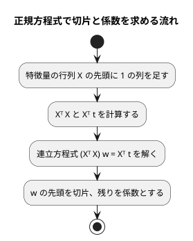

# 第 7 章: 線形回帰による数値予測

## 7.1 はじめに

第 1〜3 章では、グループを当てる **分類** を扱いました。この章からは、数値そのものを当てる **回帰** に進みます。題材は、映画の SNS での反響や主演俳優の露出度から、興行収入を予測する問題です。

この章では、最も基本的な回帰モデルである **線形回帰** を実装します。ここで Go 版はほかの言語版と分かれます。[Java 版の第 7 章](../java/07-linear-regression.md) は `double[][]` を包む不変のクラスを、[Kotlin 版](../kotlin/07-linear-regression.md) は演算子オーバーロードで `a * b` と書ける型を、それぞれ **自作** しました。Go 版は行列を自作せず、[gonum](https://www.gonum.org/) の `mat` パッケージを使います。その判断の理由は 7.5 節で説明します。

この章は、Go 版で初めて外部の依存を入れる章でもあります。第 1〜3 章は標準ライブラリだけで書きました。ここから `go.mod` に gonum が 1 つだけ加わります。

[Python 版の第 7 章](../python/07-linear-regression.md) と同じく、外れ値の除去と回帰の評価指標（MAE・RMSE・決定係数 R²）も実装します。この章の `LinearModel` と評価指標は、第 11〜13 章でも使います。

## 7.2 線形回帰とは

### 特徴量の重み付きの和で予測する

線形回帰は、予測値を「切片」と「特徴量ごとの係数 × 特徴量」の和で表すモデルです。この章のデータに当てはめると次の式になります。

```text
予測値 = 切片 + 係数1 × SNS1 + 係数2 × SNS2 + 係数3 × actor + 係数4 × original
```

学習とは、訓練データに対して予測値と実測値のずれが最も小さくなるように、切片と係数を決めることです。ずれの大きさには「誤差の 2 乗の合計」を使います。これを最小にする方法を **最小二乗法** と呼びます。

### 正規方程式

最小二乗法の解は、行列を使うと 1 つの式で求められます。特徴量を行列 `X`、実測値をベクトル `t`、切片と係数をまとめたベクトルを `w` とすると、誤差の 2 乗の合計を最小にする `w` は次の **正規方程式** を満たします。

```text
(Xᵀ X) w = Xᵀ t
```

`X` の先頭には、すべての値が 1 の列を足しておきます。この列にかかる係数が切片になります。



この流れに必要な行列の操作は、**積**・**転置**・**連立方程式を解く** の 3 つです。Java 版・Kotlin 版は、この 3 つを持つ小さな行列の型を自作しました。Go 版は gonum の `mat` にすべて揃っているので、自作しません。

## 7.3 題材とデータ

この章で使うのは `cinema.csv` です。100 本の映画について、次の 6 列が記録されています。

| 列 | 内容 | 欠損値 |
|----|------|-------|
| cinema_id | 映画の ID | なし |
| SNS1 | SNS での反響の数（1 つ目の指標） | 1 件 |
| SNS2 | SNS での反響の数（2 つ目の指標） | なし |
| actor | 主演俳優のメディア露出の指標 | 1 件 |
| original | 原作の有無（0 または 1） | なし |
| sales | 興行収入 | なし |

「SNS1」「SNS2」「actor」「original」が特徴量、「sales」が正解ラベル（予測したい数値）です。`cinema_id` は映画を区別するための番号なので、特徴量には使いません。

このデータには、SNS2 の値が大きいのに興行収入が低い、傾向から外れた映画が 1 本含まれています。このような **外れ値** は、最小二乗法の結果を大きく引っ張ります。誤差を 2 乗して足し合わせるので、大きく外れた 1 点の影響が大きくなるためです。散布図で外れ値を確かめる手順は、[Python 版](../python/07-linear-regression.md) と [Kotlin 版の 7.13 節](../kotlin/07-linear-regression.md) の Notebook を参照してください。Go 版には Notebook と可視化の節を設けません。

第 2 章で作った `Row` はセルを文字列のまま持ち、`Number` で読むときに `float64` にします。列の型を推論する段階が無いので、Kotlin 版の 7.11 節で起きた「整数と推論された列に補完した小数が入らない」問題は、Go 版では起きません。

## 7.4 TODO リストの作成

**TODO リスト**:

- [ ] 正規方程式で線形回帰を学習する
  - [ ] 直線上の点から切片と係数を求める
  - [ ] 複数の特徴量から切片と係数を求める
- [ ] 学習したモデルで予測する
- [ ] 評価指標を計算する（MAE・RMSE・R²）
- [ ] 外れ値を取り除く
- [ ] 外れ値の除去・分割・補完をまとめる
- [ ] gonum の単回帰と結果が一致することを確かめる
- [ ] 実データで学習・評価して表示する

Java 版・Kotlin 版の TODO リストは「行列の積を求める」「転置行列を求める」「連立方程式を解く」の 3 つから始まりました。Go 版の TODO リストにはそれがありません。行列を自作しないからです。そのぶん、この章は「モデルをどう表すか」と「ライブラリの呼び方をどう包むか」に集中できます。

## 7.5 なぜ行列を自作しないのか

Go には標準ライブラリに行列の型がありません。そこまでは Java・Kotlin と同じです。違うのは、Go には **gonum** という、数値計算の事実上の標準ライブラリがあることです。

| | Java 版 | Kotlin 版 | Go 版 |
|---|---|---|---|
| 行列 | 自作（`Matrix`） | 自作（演算子オーバーロード） | gonum の `mat` |
| 機械学習 | Tribuo | Smile | gonum（決定木などは自作） |
| 行列の積 | `a.times(b)` | `a * b` | `c.Mul(a, b)` |

[ADR 008](../../../adr/008-go-ml-libraries.md) では、次の理由で gonum の `mat` を使うと決めました。

- gonum は BSD 3 条項ライセンスで、Go の数値計算では標準的に使われている
- 第 13 章の主成分分析でも `stat.PC` と `mat` を使うので、どちらにしても gonum は入る
- 行列を自作して見せる価値は Java 版・Kotlin 版・TypeScript 版ですでに果たしている。Go 版は「ライブラリがあるものは使い、無いものだけ自作する」という一貫した立場を示すほうが読者の役に立つ

裏を返すと、Go 版は「gonum に無いもの」——決定木（第 3 章・第 8 章）、ロジスティック回帰とランダムフォレスト（第 10 章）、K-means（第 14 章）——を自作します。同じ「ライブラリが限られる環境」の [TypeScript 版](../typescript/07-linear-regression.md) と読み比べると、どこに線を引いたかがはっきりします。

依存はこの章で初めて追加します。

```bash
cd apps/go
go get gonum.org/v1/gonum@v0.17.0
```

```text
go: added gonum.org/v1/gonum v0.17.0
```

`go.mod` は次のようになります。依存は 1 つだけです。

```text
module github.com/k2works/getting-started-machine-learning/apps/go

go 1.25

require gonum.org/v1/gonum v0.17.0
```

`go get` を実行した直後は `// indirect`（間接依存）と書かれています。まだどのソースも import していないからです。実際に import してから `go mod tidy` を実行すると、この注釈が消えて直接依存になります。Go のモジュールは「実際の import を正とする」ので、使っていない依存は自動的に落ちます。

## 7.6 正規方程式で線形回帰を学習する

### Red: コンパイルできないところから

第 1 章と同じく、存在しない関数を呼ぶテストから始めます。`t = 3 + 2 × x1` を満たす 3 点なら、切片 3・係数 2 が求まるはずです。

```go
// internal/chapter07/linearregression_test.go（抜粋）
func TestFit(t *testing.T) {
	t.Parallel()

	// t = 3 + 2 * x1 を満たす 3 点。切片 3、係数 2 が求まるはず。
	x := []chapter02.Features{
		featuresOf(t, []string{"x1"}, []float64{0}),
		featuresOf(t, []string{"x1"}, []float64{1}),
		featuresOf(t, []string{"x1"}, []float64{2}),
	}
	target := []float64{3, 5, 7}

	model, err := chapter07.Fit(x, target)
	if err != nil {
		t.Fatalf("学習できません: %v", err)
	}

	if math.Abs(model.Intercept-3) > tolerance {
		t.Errorf("切片が違います: %v", model.Intercept)
	}

	coefficient, err := model.Coefficient("x1")
	if err != nil {
		t.Fatalf("係数を読めません: %v", err)
	}

	if math.Abs(coefficient-2) > tolerance {
		t.Errorf("係数が違います: %v", coefficient)
	}
}
```

テストだけを置いて実行すると、Go はパッケージがテストファイルしか持たないことを先に報告します。

```console
$ go test ./internal/chapter07/
github.com/k2works/.../internal/chapter07: no non-test Go files in .../internal/chapter07
FAIL	github.com/k2works/.../internal/chapter07 [build failed]
FAIL
```

パッケージ宣言だけのファイル `internal/chapter07/linearregression.go` を置くと、いつもの Red になります。

```console
$ go test ./internal/chapter07/
# github.com/k2works/.../internal/chapter07_test [github.com/k2works/.../internal/chapter07.test]
internal/chapter07/linearregression_test.go:37:26: undefined: chapter07.Fit
FAIL	github.com/k2works/.../internal/chapter07 [build failed]
FAIL
```

テストヘルパーの `featuresOf` は、第 2 章の `NewFeatures` がエラーを返すので、それを `t.Fatalf` に変える小さな関数です。Go のテストでは、この「エラーを受け止めてテストを止める」ヘルパーが頻繁に要ります。`t.Helper()` を呼んでおくと、失敗したときの行番号が呼び出し側の行になります。

```go
// internal/chapter07/linearregression_test.go（抜粋）
// featuresOf はテスト用に特徴量を作る。作れなければテストを止める。
func featuresOf(t *testing.T, columns []string, values []float64) chapter02.Features {
	t.Helper()

	features, err := chapter02.NewFeatures(columns, values)
	if err != nil {
		t.Fatalf("特徴量を作れません: %v", err)
	}

	return features
}
```

### Green: 仮実装

学習したモデルを表す型を決めます。切片は 1 つの `float64` で済みますが、係数は「どの列の係数か」が分からなければ使えません。Java 版は `LinkedHashMap<String, Double>` で列の順を保ちましたが、Go の `map` は反復の順序が **意図的にランダム化** されているので、順序が要る場面では使えません。第 2 章の `Features` と同じく、列名のスライスと値のスライスを並べて持ちます。

```go
// internal/chapter07/linearregression.go（抜粋）
// LinearModel は学習した線形回帰のモデル。切片と、列名の順に並んだ係数を持つ。
type LinearModel struct {
	Intercept    float64
	Columns      []string
	Coefficients []float64
}
```

そのうえで、`Fit` は最初のテストを通すだけの値を返します。

```go
// Fit は訓練データから切片と係数を求める。
func Fit(x []chapter02.Features, t []float64) (LinearModel, error) {
	return NewLinearModel(3, x[0].Columns, []float64{2})
}
```

```console
$ go test ./internal/chapter07/
ok  	github.com/k2works/.../internal/chapter07	0.566s
```

### 三角測量: 特徴量を 2 つにする

仮実装を追い出すために、平面の上の 4 点でテストを足します。

```go
// internal/chapter07/linearregression_test.go（抜粋）
func TestFitMultiple(t *testing.T) {
	t.Parallel()

	// t = 1 + 2 * x1 - 3 * x2 を満たす 4 点。
	columns := []string{"x1", "x2"}
	x := []chapter02.Features{
		featuresOf(t, columns, []float64{0, 0}),
		featuresOf(t, columns, []float64{1, 0}),
		featuresOf(t, columns, []float64{0, 1}),
		featuresOf(t, columns, []float64{1, 1}),
	}
	target := []float64{1, 3, -2, 0}

	model, err := chapter07.Fit(x, target)
	if err != nil {
		t.Fatalf("学習できません: %v", err)
	}

	expected := map[string]float64{"x1": 2, "x2": -3}

	if math.Abs(model.Intercept-1) > tolerance {
		t.Errorf("切片が違います: %v", model.Intercept)
	}

	for column, want := range expected {
		got, err := model.Coefficient(column)
		if err != nil {
			t.Fatalf("係数を読めません: %v", err)
		}

		if math.Abs(got-want) > tolerance {
			t.Errorf("%s の係数が違います: %v（期待 %v）", column, got, want)
		}
	}
}
```

期待値を `map` に置いていますが、ここでは順序が結果に影響しないので問題ありません。「順序が要るかどうか」で `map` とスライスを使い分けます。

仮実装は、係数が 1 つしか無いので、モデルを作る段階で失敗します。

```console
$ go test ./internal/chapter07/
--- FAIL: TestFitMultiple (0.00s)
    linearregression_test.go:71: 学習できません: 列名と係数の数が違います: 2 と 1
FAIL
FAIL	github.com/k2works/.../internal/chapter07	0.571s
```

パニックではなく、`NewLinearModel` が返したエラーとして報告されています。Go では「作れない値は作らせない」構築関数に、この種の検査を集めておくと、あとの処理が素直になります。

### gonum で正規方程式を解く

本実装です。まず計画行列を作ります。`mat.NewDense` は、行数・列数と、行を横につないだ 1 本のスライスを受け取ります。2 次元のスライス（`[][]float64`）ではありません。

```go
// internal/chapter07/linearregression.go（抜粋）
// DesignMatrix は先頭に 1 の列を足した特徴量の行列（計画行列）を作る。1 の列の係数が切片になる。
func DesignMatrix(x []chapter02.Features) (*mat.Dense, error) {
	if len(x) == 0 {
		return nil, fmt.Errorf("訓練データが空です")
	}

	columns := len(x[0].Columns) + 1
	values := make([]float64, 0, len(x)*columns)

	for _, features := range x {
		if len(features.Values) != columns-1 {
			return nil, fmt.Errorf("行によって特徴量の数が違います: %d と %d", len(features.Values), columns-1)
		}

		values = append(values, 1)
		values = append(values, features.Values...)
	}

	return mat.NewDense(len(x), columns, values), nil
}
```

次に `(Xᵀ X) w = Xᵀ t` を解きます。

```go
// Fit は正規方程式 (Xᵀ X) w = Xᵀ t を解いて、切片と係数を求める。
func Fit(x []chapter02.Features, t []float64) (LinearModel, error) {
	if len(x) != len(t) {
		return LinearModel{}, fmt.Errorf("特徴量と実測値の件数が違います: %d と %d", len(x), len(t))
	}

	design, err := DesignMatrix(x)
	if err != nil {
		return LinearModel{}, err
	}

	target := mat.NewVecDense(len(t), slices.Clone(t))

	var normal mat.Dense

	normal.Mul(design.T(), design)

	var moment mat.VecDense

	moment.MulVec(design.T(), target)

	var weights mat.VecDense
	if err := weights.SolveVec(&normal, &moment); err != nil {
		return LinearModel{}, fmt.Errorf("正規方程式を解けません: %w", err)
	}

	return NewLinearModel(weights.AtVec(0), x[0].Columns, mat.Col(nil, 0, weights.SliceVec(1, weights.Len())))
}
```

gonum の書き方には、ほかの言語のライブラリと違うところが 3 つあります。

1. **結果を受け取る側が計算を呼ぶ。** `c := a.Mul(b)` ではなく `c.Mul(a, b)` です。`var normal mat.Dense` は「ゼロ値の行列」で、`Mul` が必要な大きさに確保してくれます。返り値ではなくレシーバーに書くので、同じ行列を使い回してメモリの確保を減らせます
2. **転置はコピーを作らない。** `design.T()` は元の行列を「行と列を入れ替えて見る」ビューを返します。Java 版の `transpose()` は新しい配列を作っていました
3. **解けないときはエラーになる。** `SolveVec` は `error` を返します。行列が特異（実質的に同じ特徴量が 2 つあるなど）なら、`NaN` が静かに広がるのではなく、そこで止まります。Java 版は自作のガウスの消去法で `NaN` が返る場面を 7.5 節で扱いましたが、gonum は `mat.Condition` のエラーとして報告します。`%w` で包んでおけば、呼び出し側で `errors.As` を使って元の原因を調べられます

最後の行の `mat.Col(nil, 0, weights.SliceVec(1, weights.Len()))` は、「解の 2 番目以降を `[]float64` として取り出す」という意味です。`SliceVec` はコピーを作らずに部分ベクトルを見るので、`mat.Col` で素の `[]float64` に写してから `NewLinearModel` に渡します。

```console
$ go test ./internal/chapter07/
ok  	github.com/k2works/.../internal/chapter07	1.482s
```

### 正規方程式を解かずに済ませることもできる

gonum の `SolveVec` は、正方行列でなくても呼べます。行数が列数より多い場合は、最小二乗解を QR 分解で求めます。つまり、`Xᵀ X` を作らずに `w.SolveVec(design, target)` と書くだけでも、同じ答えが得られます。手元で 5 点の単回帰を両方の書き方で解いて確かめました。

```text
QR: 0.0500000000 1.9900000000
NE: 0.0500000000 1.9900000000
```

数値計算の観点では、QR のほうが条件数の悪いデータに強く、実務ではこちらが勧められます。それでも本章が正規方程式を明示的に組み立てるのは、[ADR 008](../../../adr/008-go-ml-libraries.md) の方針どおり、ほかの言語版と同じ式を同じ順で見せるためです。`Xᵀ X` と `Xᵀ t` を自分で書いてみると、7.2 節の式とコードが 1 対 1 で対応します。

## 7.7 学習したモデルで予測する

予測は「切片 + 係数 × 特徴量」の和です。係数は列名で対応させるので、渡された特徴量の列の並び順が違っても正しく計算できます。

```go
// internal/chapter07/linearregression.go（抜粋）
// Predict は 1 行分の特徴量の予測値を返す。係数は列名で対応させるので、列の並び順は問わない。
func (m LinearModel) Predict(features chapter02.Features) (float64, error) {
	sum := m.Intercept

	for i, column := range m.Columns {
		value, err := features.Value(column)
		if err != nil {
			return 0, err
		}

		sum += m.Coefficients[i] * value
	}

	return sum, nil
}

// PredictAll は行ごとの予測値を返す。
func (m LinearModel) PredictAll(x []chapter02.Features) ([]float64, error) {
	predictions := make([]float64, len(x))

	for i, features := range x {
		prediction, err := m.Predict(features)
		if err != nil {
			return nil, err
		}

		predictions[i] = prediction
	}

	return predictions, nil
}
```

Java 版は `predict(Features)` と `predict(List<Features>)` をオーバーロードで同じ名前にしました。Go にオーバーロードは無いので、`Predict` と `PredictAll` という別の名前にします。名前が増えるのは短所ですが、呼び出し側を読むときに「1 件か全件か」が名前だけで分かるという長所もあります。

## 7.8 評価指標を計算する

回帰の評価指標を 3 つ実装します。どれも「実測値と予測値の差」から求まるので、差を作る部分を非公開の関数にまとめ、そこで件数の検査もします。

```go
// internal/chapter07/metrics.go（抜粋）
// residuals は実測値と予測値の差を返す。件数が違えばエラーを返す。
func residuals(t, y []float64) ([]float64, error) {
	if len(t) != len(y) {
		return nil, fmt.Errorf("実測値と予測値の件数が違います: %d と %d", len(t), len(y))
	}

	if len(t) == 0 {
		return nil, fmt.Errorf("実測値がありません")
	}

	differences := make([]float64, len(t))
	for i := range t {
		differences[i] = t[i] - y[i]
	}

	return differences, nil
}
```

3 つの指標は、どれも `func([]float64, []float64) (float64, error)` という同じ形をしています。Go の関数型は名前の無い型なので、この形をそのままテストの表に入れられます。

```go
// internal/chapter07/metrics_test.go（抜粋）
	// 実測値と、そこから 1・2・3 ずれた予測値。
	target := []float64{10, 20, 30}
	predictions := []float64{11, 18, 33}

	tests := []struct {
		name   string
		metric func([]float64, []float64) (float64, error)
		want   float64
	}{
		{
			name:   "平均絶対誤差は誤差の絶対値の平均",
			metric: chapter07.MeanAbsoluteError,
			want:   (1.0 + 2.0 + 3.0) / 3,
		},
		{
			name:   "二乗平均平方根誤差は誤差の 2 乗の平均の平方根",
			metric: chapter07.RootMeanSquaredError,
			want:   math.Sqrt((1.0 + 4.0 + 9.0) / 3),
		},
		{
			name:   "決定係数は 1 から残差平方和を全平方和で割った値を引いた値",
			metric: chapter07.R2Score,
			want:   1 - 14.0/200.0,
		},
	}
```

期待値を `(1.0 + 2.0 + 3.0) / 3` のように「計算式のまま」書いているのは、読んだ人が定義と突き合わせられるようにするためです。`0.6666666666666666` と書いてしまうと、その数が何なのかコードから読み取れません。

実装は定義どおりです。決定係数だけ、実測値がすべて同じ場合に 0 で割ってしまうので、エラーを返します。

```go
// internal/chapter07/metrics.go（抜粋）
// R2Score は決定係数（R²）。1 から「残差の 2 乗の合計 ÷ 平均との差の 2 乗の合計」を引いた値。
func R2Score(t, y []float64) (float64, error) {
	differences, err := residuals(t, y)
	if err != nil {
		return 0, err
	}

	mean := 0.0
	for _, value := range t {
		mean += value
	}

	mean /= float64(len(t))

	deviations := make([]float64, len(t))
	for i, value := range t {
		deviations[i] = value - mean
	}

	total := sumOfSquares(deviations)
	if total == 0 {
		return 0, fmt.Errorf("実測値がすべて同じなので決定係数を求められません")
	}

	return 1 - sumOfSquares(differences)/total, nil
}
```

浮動小数点の 0 除算は Go でもパニックにならず `+Inf` や `NaN` になります。黙って `NaN` を返すより、理由の分かるエラーで止めるほうが、呼び出した側で対処できます。

## 7.9 外れ値の除去・分割・補完をまとめる

### 外れ値を取り除く

外れ値の条件は「SNS2 が 1000 を超え、かつ興行収入が 8500 未満」です。この条件は、書籍『スッキリわかる Python による機械学習入門』の同じデータでの分析手順に合わせたものです。

```go
// internal/chapter07/cinema.go（抜粋）
const (
	// outlierSNS2 は外れ値とみなす SNS2 の下限。
	outlierSNS2 = 1000
	// outlierSales は外れ値とみなす興行収入の上限。
	outlierSales = 8500
)

// isOutlier は「SNS2 が多いのに興行収入が少ない」行かどうかを返す。
func isOutlier(row chapter02.Row) (bool, error) {
	sns2, err := number(row, "SNS2")
	if err != nil {
		return false, err
	}

	sales, err := number(row, CinemaTarget)
	if err != nil {
		return false, err
	}

	return sns2 > outlierSNS2 && sales < outlierSales, nil
}
```

`isOutlier` が `(bool, error)` を返すので、フィルタを高階関数で書けません。Java 版は `table.rows().stream().filter(row -> !isOutlier(row)).toList()` の 1 行でしたが、Go では素直なループになります。

```go
// RemoveOutliers は外れ値の行を除いた表を返す。元の表は変更しない。
func RemoveOutliers(table chapter02.Table) (chapter02.Table, error) {
	rows := make([]chapter02.Row, 0, len(table.Rows))

	for _, row := range table.Rows {
		outlier, err := isOutlier(row)
		if err != nil {
			return chapter02.Table{}, err
		}

		if !outlier {
			rows = append(rows, row)
		}
	}

	return chapter02.Table{Columns: table.Columns, Rows: rows}, nil
}
```

Go 1.23 以降には `slices` や `iter` のイテレータがありますが、どれも「エラーを返す述語」を前提にしていません。エラーを値で返す言語では、「途中で失敗しうる処理はループで書く」のが読みやすい形です。行数は増えますが、どの行で失敗したかを返す余地が残ります。

テストは架空の 3 行で書きます。学習データの行はテストにも記事にも書きません。

```go
// internal/chapter07/cinema_test.go（抜粋）
	// 2 行目だけが「SNS2 が 1000 を超えるのに興行収入が 8500 未満」の外れ値。
	csvFile := writeCSV(t, "cinema_id,SNS1,SNS2,actor,original,sales\n"+
		"1,100,900,5000,0,9000\n"+
		"2,120,1200,5200,1,8000\n"+
		"3,130,1100,5300,0,9500\n")
```

3 行目は SNS2 が 1000 を超えていますが興行収入が 9500 なので、条件の片方しか満たさず残ります。この「片方だけ満たす行」をテストに入れておくと、条件を `&&` から `||` に書き間違えたときに気づけます。

### 前処理を 1 つの関数にまとめる

外れ値の除去・分割・補完の順序は決まっています。**分割してから、訓練データの平均値で両方を補完** します。テストデータの平均値を混ぜると、テストデータの情報が訓練に漏れてしまうからです（第 2 章で扱った「データリーク」）。

```go
// internal/chapter07/cinema.go（抜粋）
// PrepareCinema は外れ値を除き、分割してから訓練データの平均値で両方の欠損値を補完する。
func PrepareCinema(csvFile string, testSize float64, seed int64) (chapter02.TrainTestSplit[chapter02.Features, float64], error) {
	empty := chapter02.TrainTestSplit[chapter02.Features, float64]{}

	loaded, err := chapter02.LoadTable(csvFile)
	if err != nil {
		return empty, err
	}

	table, err := RemoveOutliers(loaded)
	if err != nil {
		return empty, err
	}
	// …（中略：sales を取り出して分割し、訓練データの平均値で補完する）…
}
```

`empty` という変数を先に用意しているのは、エラーを返すたびに `chapter02.TrainTestSplit[chapter02.Features, float64]{}` と長いジェネリクスの型を書かずに済ませるためです。Go には「エラーのときの戻り値を省略する」書き方が無いので、戻り値の型が長い関数ではこの工夫が効きます。

第 2 章の `TrainTestSplit[X, T any]` がジェネリクスなので、第 2 章（正解ラベルが `string`）と第 7 章（正解ラベルが `float64`）で同じ型を使い回せます。Go 1.18 より前なら、型ごとに別の構造体を書くか `any` にするしかありませんでした。

## 7.10 gonum の単回帰と突き合わせる

gonum の `stat` パッケージには `LinearRegression` があります。ただし、これは **単回帰**（特徴量が 1 つ）だけです。重回帰を解く関数はないので、7.6 節のように `mat` で正規方程式を解く必要がありました。

`stat.LinearRegression` を、この章のモデルの形に包みます。

```go
// internal/chapter07/gonumregression.go
// SimpleLinearRegression は gonum の stat.LinearRegression で単回帰を学習する。
// gonum の単回帰は特徴量を 1 つしか取れないので、列名で 1 列だけ取り出して渡す。
func SimpleLinearRegression(x []chapter02.Features, t []float64, column string) (LinearModel, error) {
	if len(x) != len(t) {
		return LinearModel{}, fmt.Errorf("特徴量と実測値の件数が違います: %d と %d", len(x), len(t))
	}

	values := make([]float64, len(x))

	for i, features := range x {
		value, err := features.Value(column)
		if err != nil {
			return LinearModel{}, err
		}

		values[i] = value
	}

	// 第 3 引数の weights は nil で「すべて重み 1」、第 4 引数の origin は
	// false で「切片を求める（原点を通らせない）」を表す。
	intercept, slope := stat.LinearRegression(values, t, nil, false)

	return NewLinearModel(intercept, []string{column}, []float64{slope})
}
```

`stat.LinearRegression` は `(alpha, beta float64)` を返します。`error` を返しません。件数が合っていなければパニックします。ライブラリの流儀（パニック）と本シリーズの流儀（エラーを返す）が違うので、包む側で先に検査しておきます。**ライブラリの都合をアプリケーションの境界で吸収する** のは、どの言語でも同じ考え方です。

突き合わせのテストは、直線に乗らない 5 点で行います。直線に乗る点だと、どんな解き方でも同じ答えになってしまい、最小二乗解が一致することの確認になりません。

```go
// internal/chapter07/gonumregression_test.go（抜粋）
	// 直線に乗らない 5 点。正規方程式と stat.LinearRegression が同じ最小二乗解を出すはず。
	columns := []string{"x1"}
	x := []chapter02.Features{
		featuresOf(t, columns, []float64{1}),
		featuresOf(t, columns, []float64{2}),
		featuresOf(t, columns, []float64{3}),
		featuresOf(t, columns, []float64{4}),
		featuresOf(t, columns, []float64{5}),
	}
	target := []float64{2.1, 3.9, 6.2, 7.8, 10.1}
```

許容誤差 `1e-9` の範囲で、切片も係数も一致しました。自作した正規方程式の組み立てが正しいことを、独立した実装で裏づけられたことになります。

Java 版は Tribuo の `SLMTrainer`・`LARSTrainer` と重回帰まで突き合わせられました。Go 版で突き合わせられるのは単回帰だけです。重回帰の答えを検証する別の実装が gonum に無いので、7.6 節の三角測量（既知の平面の上の点）が、重回帰での唯一の裏づけになります。

## 7.11 実データで学習・評価する

### 結果を表示する

第 1〜3 章と同じく、`Run(out io.Writer) error` を作り、その出力を固定するテストを書きます。実データが無ければ `t.Skip` で飛ばします。

期待値を空文字列にして実行し、実際の出力を失敗メッセージで確かめました。

```console
$ ML_DATA_DIR=... go test ./internal/chapter07/ -run TestCinemaData
--- FAIL: TestCinemaData (0.00s)
    --- FAIL: TestCinemaData/実行すると係数と評価指標を表示する (0.00s)
        cinemadata_test.go:89: 出力 = "データ件数: 100\n外れ値を除いた件数: 99\n訓練データ: 79 件, テストデータ: 20 件\n切片: 6392.98\n係数: SNS1=1.2610, SNS2=0.5934, actor=0.2577, original=201.1699\nテストデータの評価: R2=0.6591, MAE=342.40, RMSE=409.68\n単回帰（SNS2 のみ・gonum）: 切片=8979.41, 係数=1.3074\n", want ""
FAIL
```

Go のテストは、期待値と実際の値をきれいに並べてくれません。`%q` で囲むと改行が `\n` として 1 行に表示されるので、長い出力は読みにくくなります。それでも、改行やタブがそのまま見えるので「どこが違うか」は分かります。内容を確かめてから、これを期待値にします。

```console
$ go run ./cmd/chapters chapter07
データ件数: 100
外れ値を除いた件数: 99
訓練データ: 79 件, テストデータ: 20 件
切片: 6392.98
係数: SNS1=1.2610, SNS2=0.5934, actor=0.2577, original=201.1699
テストデータの評価: R2=0.6591, MAE=342.40, RMSE=409.68
単回帰（SNS2 のみ・gonum）: 切片=8979.41, 係数=1.3074
```

### ほかの言語版と数値が一致しないのはなぜか

| 版 | 訓練 / テスト | R² | 切片 |
|---|---|---|---|
| Go 版 | 79 件 / 20 件 | 0.6591 | 6392.98 |
| [Java 版](../java/07-linear-regression.md) | 79 件 / 20 件 | 0.6184 | 6114.60 |
| [Kotlin 版](../kotlin/07-linear-regression.md) | 79 件 / 20 件 | 0.8469 | — |

件数は 3 つとも同じです。外れ値を 1 件除いた 99 件を、同じ割合（テスト 20%・切り上げ）で分けているからです。違うのは **どの映画がテストデータに入るか** です。

第 2 章で見たとおり、Go の `math/rand` は Java の `java.util.Random` とも .NET の `Random` とも乱数列が違います。同じ Fisher-Yates のアルゴリズムに同じシード 0 を与えても、並びが変わります。100 件ほどのデータでは、20 件のテストデータにどの映画が入るかで R² が大きく動きます。Kotlin 版の 0.8469 と Java 版の 0.6184 の開きも、同じ理由です。

このばらつき自体が、**1 回の分割で測った評価値をそのまま信じてはいけない** という教訓です。分割を変えて何度も測る交差検証は、第 11 章で扱います。

### 係数を読む

係数は「その特徴量が 1 増えたとき、ほかの特徴量が同じなら、予測値がどれだけ増えるか」を表します。

- `original=201.1699`: 原作がある映画は、ない映画より興行収入の予測が約 201 大きい
- `SNS1=1.2610`・`SNS2=0.5934`: SNS での反響が 1 増えるごとに、予測が約 1.26・約 0.59 大きくなる
- `actor=0.2577`: 主演俳優の露出の指標が 1 増えるごとに、予測が約 0.26 大きくなる

係数の大きさは、特徴量の単位に左右されます。`original` は 0 か 1 しか取らず、`actor` は数千〜1 万を超える値を取るので、係数の大小をそのまま「影響の大きさ」と読むことはできません。影響の大きさを比べるには、特徴量をそろえた尺度に変換（標準化）してから学習します。標準化は第 9 章で扱います。

単回帰の行も、同じことを示しています。SNS2 だけで予測すると係数は 1.3074 ですが、4 つの特徴量をすべて使うと SNS2 の係数は 0.5934 に下がります。SNS1 と SNS2 は同じ「SNS での反響」を測った指標で、互いに相関があるためです。相関のある特徴量が並ぶと、係数は 2 つに分け合われます。

### 評価指標を読む

- `R2=0.6591`: テストデータの興行収入のばらつきのうち、約 66% をこのモデルで説明できている
- `MAE=342.40`: 予測は平均して約 342 外れている
- `RMSE=409.68`: MAE より大きいのは、大きく外れた予測が 2 乗で重く数えられるため

## 7.12 品質チェック

`apps/go` を作業ディレクトリにして、整形・静的解析・テストを実行します。

```console
$ gofmt -l .
$ go vet ./...
$ golangci-lint run
0 issues.
```

第 7 章のテストの実行結果です（学習データを配置した状態）。

```text
--- PASS: TestFit (0.00s)
--- PASS: TestFitMultiple (0.00s)
--- PASS: TestRegressionMetrics (0.00s)
    --- PASS: TestRegressionMetrics/平均絶対誤差は誤差の絶対値の平均 (0.00s)
    --- PASS: TestRegressionMetrics/二乗平均平方根誤差は誤差の_2_乗の平均の平方根 (0.00s)
    --- PASS: TestRegressionMetrics/決定係数は_1_から残差平方和を全平方和で割った値を引いた値 (0.00s)
--- PASS: TestRegressionMetricsCountMismatch (0.00s)
--- PASS: TestRemoveOutliers (0.00s)
--- PASS: TestPrepareCinemaFillsMissingWithTrainMean (0.00s)
--- PASS: TestSimpleLinearRegressionMatchesNormalEquation (0.00s)
--- PASS: TestCinemaData (0.00s)
    --- PASS: TestCinemaData/外れ値を_1_件除いて_99_件になる (0.00s)
    --- PASS: TestCinemaData/テストデータの決定係数が_0.6591_になる (0.00s)
    --- PASS: TestCinemaData/実行すると係数と評価指標を表示する (0.00s)
ok  	github.com/k2works/.../internal/chapter07	0.443s	coverage: 78.8% of statements
```

サブテストの名前に含まれる空白は、Go が自動的に `_` に置き換えます。日本語の名前は、そのまま読めます。

学習データが無い環境（`ML_DATA_DIR=/nonexistent go test ./...`）では、`TestCinemaData` の 3 件がスキップされ、テストは成功します。

## 7.13 まとめ

この章では、gonum の `mat` で正規方程式を解く線形回帰を Go の TDD で実装しました。

1. **あるものは使う、無いものは作る** — Go には行列の型が標準ライブラリに無いが、gonum という事実上の標準がある。Java 版・Kotlin 版が自作した行列を、Go 版は `mat` に任せた。決定木や K-means は gonum に無いので自作する、という線引きが [ADR 008](../../../adr/008-go-ml-libraries.md) の方針
2. **gonum は結果を受け取る側が計算を呼ぶ** — `c.Mul(a, b)` の形で、ゼロ値の行列が必要な大きさを確保する。転置 `T()` はコピーを作らないビュー
3. **`SolveVec` はエラーを返す** — 特異な行列で `NaN` が静かに広がるのではなく、`error` として止まる。`%w` で包んで呼び出し側に渡した
4. **順序が要るなら `map` を使わない** — Go の `map` は反復の順序がランダム化されている。係数は列名のスライスと値のスライスで持った。Java 版の `LinkedHashMap` に当たるものは Go に無い
5. **エラーを返す述語はループで書く** — 外れ値の除去は、Java 版の `stream().filter()` の 1 行ではなく、`error` を受け止めるループになった。行数は増えるが、どこで失敗したかを返せる
6. **ライブラリの流儀を境界で吸収する** — `stat.LinearRegression` はパニックする設計なので、包む側で件数を検査してエラーを返すようにした
7. **数値はほかの言語版と一致しない** — `math/rand` の乱数列が違うので分け方が変わり、R² は Go 版 0.6591・Java 版 0.6184・Kotlin 版 0.8469 とばらついた。100 件のデータで 1 回だけ測った値の不安定さが、そのまま出ている

この章の `LinearModel` と評価指標は、第 11 章の評価、第 12 章の正則化、第 13 章の主成分分析でも使います。次の章では、欠損値や文字列の列が多いタイタニック号の乗客データを使い、より実践的な分類と前処理パイプラインを作ります。gonum に決定木は無いので、第 3 章の決定木を重み付きに拡張するところから始めます。
