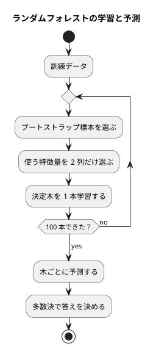

# 第 10 章: ロジスティック回帰とアンサンブル学習

## 10.1 はじめに

前の章は、gonum の統計関数と行列を使える「ライブラリに頼れる章」でした。この章は逆です。**gonum にはロジスティック回帰もランダムフォレストもありません**。Go で機械学習をやるとはどういうことかが、いちばんはっきり出る章です。

作るのは次の 3 つです。

| 作るもの | 何をするか |
|---------|-----------|
| ロジスティック回帰 | ソフトマックスで確率を出し、勾配降下法で重みを学習する |
| ランダムフォレスト | 第 3 章の決定木を 100 本作り、多数決で予測する |
| 特徴量の重要度 | 分割で減った不純度から、どの特徴量が効いたかを測る |

そして 4 つのモデルを **同じインターフェース** で評価します。Go のインターフェースは実装側で「implements」と書かないので、第 3 章で作った決定木は 1 行も直さずにこのインターフェースを満たします。ここが Java 版との大きな違いです。

[Python 版の第 10 章](../python/10-logistic-regression-and-ensemble.md) と同じ題材・同じ TODO リストで進めます。対比の相手は [TypeScript 版](../typescript/10-logistic-regression-and-ensemble.md)（ライブラリが無いので自作する立場が同じ）と [Java 版](../java/10-logistic-regression-and-ensemble.md)（Tribuo のロジスティック回帰とランダムフォレストが使えるので、自作と突き合わせられる）です。

### ライブラリ未対応について

ほかの章では「自作したあとにライブラリの実装と突き合わせる」節を置いてきました。この章ではその節を **省きます**。理由は [ADR 008](../../../adr/008-go-ml-libraries.md) に書いたとおりです。

- gonum の `stat` にあるのは、平均・分散・共分散行列・主成分分析・ROC・単回帰などの **統計の道具** で、分類器は含まれない
- GoLearn には決定木やランダムフォレストがあるが、最新のコミットが 2022 年 12 月でタグも無く、3 年以上更新されていない。依存に加える判断はしなかった

したがって、この章の **自作が Go 版の最終実装** です。TypeScript 版が ml.js の未成熟さに対して取った立場と同じで、Java 版（Tribuo あり）・Python 版（scikit-learn あり）とは分かれます。突き合わせの相手がいないぶん、テストで押さえるべきことが増えます。これは「ライブラリが無い言語で機械学習を書く」ときの現実的なコストです。

## 10.2 TODO リストの作成

```text
- [ ] ソフトマックス関数（確率の合計が 1、あふれない）
- [ ] 交差エントロピー（損失）
- [ ] 勾配降下法でロジスティック回帰を学習する
- [ ] 多数決
- [ ] ブートストラップ標本
- [ ] 特徴量の部分集合を選ぶ
- [ ] ランダムフォレストを学習する
- [ ] 決定木 1 本の特徴量の重要度
- [ ] 森の特徴量の重要度（木ごとに正規化してから平均する）
- [ ] 4 つのモデルを同じインターフェースで評価する
```

## 10.3 ソフトマックス関数

### 仕組み

ロジスティック回帰は、品種ごとに「スコア」を計算し、それを確率に変換して、いちばん確率の高い品種を答えにします。スコアから確率への変換がソフトマックス関数です。

品種 k のスコアを z_k とすると、確率は exp(z_k) を全品種の exp の和で割ったものになります。指数を取るので必ず正の数になり、和で割るので合計が 1 になります。

### 仮実装

TDD の作法に従い、まず「確率の合計は 1」より弱いテストから始めます。

```go
	t.Run("同じスコアなら確率は等しくなる", func(t *testing.T) {
		t.Parallel()

		got := chapter10.Softmax([]float64{0, 0})

		if want := []float64{0.5, 0.5}; !reflect.DeepEqual(got, want) {
			t.Errorf("Softmax() = %v, want %v", got, want)
		}
	})
```

仮実装は `return []float64{0.5, 0.5}` です。これを書くと、この 1 件は通りますが、あとから足した 2 件がこう落ちます。

```text
--- FAIL: TestSoftmax (0.00s)
    --- FAIL: TestSoftmax/スコアが大きい品種の確率が高くなる (0.00s)
        ensemble_test.go:93: Softmax() = [0.5 0.5], 2 番目のほうが高いはずです
    --- FAIL: TestSoftmax/大きなスコアでもあふれない (0.00s)
        ensemble_test.go:83: Softmax()[0] = 0.5, want 0.3333333333333333
FAIL
```

仮実装が通ってしまう範囲がテストの弱さです。三角測量（別の入力を足して一般化を強制する）でその範囲を潰します。

### 大きな値でもあふれない

素直に `math.Exp(z)` を計算すると、スコアが大きいときにあふれます。実際に測ると、`math.Exp(1000)` は `+Inf` です。

```text
    zzrepro_test.go:26: 最大値を引かずに exp を取ると: +Inf
```

`+Inf / +Inf` は `NaN` なので、確率が計算できなくなります。そこで **全スコアから最大値を引いてから** 指数を取ります。分母と分子の両方が同じ定数倍されるだけなので、結果は変わりません。

```go
// Softmax はスコアを、合計が 1 になる確率に変換する。
// 最大値を引いてから exp を求めるので、大きな値でもあふれない。
func Softmax(z []float64) []float64 {
	max := slices.Max(z)
	exps := make([]float64, len(z))
	total := 0.0

	for i, value := range z {
		exps[i] = math.Exp(value - max)
		total += exps[i]
	}

	for i := range exps {
		exps[i] /= total
	}

	return exps
}
```

`slices.Max`（Go 1.21 以降）は、ジェネリクスで型ごとの書き分けなしに使えます。Java 版の `Arrays.stream(z).max().orElseThrow()` に当たりますが、空のスライスでは `panic` するので、呼び出し側が空を渡さないことが前提です。この関数は非公開の `scores` からしか呼ばれず、品種が 0 個ということはないので、`error` を返す形にはしませんでした。**「起きえない失敗まで `error` にしない」** のも Go の設計判断の 1 つです。

測った値です。

```text
    zzrepro_test.go:22: softmax([0,1]) = [0.2689414213699951 0.7310585786300049]
    zzrepro_test.go:23: softmax([2.0,1.0,0.1]) = [0.6590011388859679 0.24243297070471392 0.09856589040931818]
    zzrepro_test.go:24: あふれない: [0.3333333333333333 0.3333333333333333 0.3333333333333333]
```

## 10.4 交差エントロピー

学習を進めるには「どれくらい外しているか」を測る値が要ります。分類では交差エントロピーを使い、**正解の品種に付けた確率の対数の平均** にマイナスを付けます。正解に 1.0 を付ければ 0、正解に低い確率しか付けなければ大きくなります。

```go
// CrossEntropy は交差エントロピー。正解の品種の確率の対数の平均に、マイナスを付けたもの。
func CrossEntropy(probabilities [][]float64, targets []int) float64 {
	sum := 0.0
	for i, probability := range probabilities {
		sum += math.Log(probability[targets[i]] + epsilon)
	}

	return -sum / float64(len(probabilities))
}
```

`epsilon`（1e-12）を足しているのは、確率がちょうど 0 のときに `math.Log(0)` が `-Inf` になるのを避けるためです。Java 版・TypeScript 版も同じ手当てをしています。

テストは「正解の確率が 1 なら 0 に近い」と「外すほど大きくなる」の 2 本です。絶対値そのものより、**大小関係**を押さえるほうが、学習が進んでいることの確認になります。

## 10.5 ロジスティック回帰

### 状態を持つ構造体

学習したパラメータを持つので、メソッドはポインタレシーバにします。

```go
// LogisticRegression はソフトマックスと勾配降下法によるロジスティック回帰。
type LogisticRegression struct {
	learningRate float64
	epochs       int
	classes      []string
	// weights[特徴量][品種]
	weights [][]float64
	bias    []float64
	losses  []float64
}
```

フィールドはすべて非公開で、`Classes()` と `Losses()` だけを公開します。Go では「同じパッケージからは非公開フィールドも見える」ので、テストを `chapter10_test` という **別パッケージ** に置くことで、外から使える API だけをテストしていることが保証されます。第 1 章から続けている書き方です。

コンストラクタは慣習に従って `New` 始まりの関数にします。Java 版のオーバーロードされたコンストラクタは、Go では名前の違う関数になります。

```go
// NewLogisticRegression は学習率 1.0、繰り返し 5000 回のロジスティック回帰を返す。
func NewLogisticRegression() *LogisticRegression {
	return NewLogisticRegressionWith(defaultLearningRate, defaultEpochs)
}

// NewLogisticRegressionWith は学習率と繰り返しの回数を指定する。
func NewLogisticRegressionWith(learningRate float64, epochs int) *LogisticRegression {
	return &LogisticRegression{learningRate: learningRate, epochs: epochs}
}
```

Go にはオプション引数も既定値もありません。「よく使う既定」と「全部指定する版」の 2 つを並べるのが素直で、増えてきたら Functional Option パターン（`New(opts ...Option)`）に移ります。この章では 2 つで足ります。

### 勾配降下法で学習する

やることは単純な繰り返しです。

1. 全データのスコアを計算し、ソフトマックスで確率にする
2. 損失（交差エントロピー）を記録する
3. 誤差（確率 − 正解、正解の品種だけ 1 を引く）を求める
4. 誤差から勾配を求め、重みと切片を学習率の分だけ動かす

```go
	for range l.epochs {
		probabilities := make([][]float64, len(rows))
		for i, row := range rows {
			probabilities[i] = Softmax(l.scores(row))
		}

		l.losses = append(l.losses, CrossEntropy(probabilities, targets))

		// 誤差は「確率 − 正解」。正解の品種だけ 1 を引く
		errors := make([][]float64, len(rows))
		for i, probability := range probabilities {
			errors[i] = slices.Clone(probability)
			errors[i][targets[i]] -= 1.0
		}

		l.update(rows, errors)
	}
```

`for range l.epochs`（整数で回す `range`）は Go 1.22 以降の書き方で、使わないループ変数を `_` で受ける必要がありません。

「損失が単調に小さくなること」をテストにしています。数値そのものを固定するより、**学習が進んでいるという性質** を押さえるほうが、学習率を変えたときに壊れにくくなります。

```go
		losses := model.Losses()
		if losses[0] <= losses[len(losses)-1] {
			t.Errorf("最初の損失 %v と最後の損失 %v: 小さくなるはずです", losses[0], losses[len(losses)-1])
		}
```

アヤメの訓練データ（105 件・3 品種）で測った損失です。

```text
    zzrepro_test.go:20: 損失: 最初 1.0986, 100 回目 0.4152, 最後 0.1875
```

最初の 1.0986 は ln 3 ＝ 1.0986 とぴったり一致します。重みが全部 0 の状態では 3 品種に等しく 1/3 ずつの確率を割り当てるので、理屈どおりです。「最初の損失が ln（品種数）になる」のは、実装が正しいことの手軽な確認になります。

繰り返しの回数は結果に効きます。100 回で止めるとテストデータの正解率は 0.8667 でしたが、既定の 5000 回では 0.9333 まで上がりました。

### 予測

```go
// Predict はスコアが最大の品種を予測する。
func (l *LogisticRegression) Predict(x []chapter02.Features) ([]string, error) {
	if len(l.classes) == 0 {
		return nil, fmt.Errorf("Fit で学習してから Predict を呼んでください")
	}
	// （中略）
```

Java 版は `IllegalStateException` を投げるところです。Go には例外が無いので `error` を返しますが、**呼び出し側が `err` を無視すれば `nil` のスライスが返るだけ** になります。例外と違い、無視しても実行は止まりません。だからこそ `golangci-lint` の `errcheck` が「`error` を捨てたコード」を指摘するようになっており、静的解析が例外機構の代わりの安全網になっています。

品種の並びは名前の順（`slices.Sort`）にそろえます。学習データの並び順に依存すると、シードを変えたときに重みの列の意味が変わってしまいます。

```text
    zzrepro_test.go:21: 品種: [Iris-setosa Iris-versicolor Iris-virginica]
```

## 10.6 ランダムフォレスト

### 仕組み

決定木は深く育てると訓練データを丸暗記します（第 3 章で、深さ制限なしの木が訓練データの正解率 1.0000 になったとおりです）。ランダムフォレストは、**わざと条件を変えた木をたくさん作って多数決** にすることで、1 本ごとの暗記を打ち消します。変える条件は 2 つです。

1. **ブートストラップ標本**: 訓練データから、重複を許して同じ件数を選び直す
2. **特徴量の部分集合**: 各木が使える列を絞る（この章では 4 列のうち 2 列）



### 多数決とブートストラップ標本

多数決は、第 3 章で作った `Majority`（同数なら先に現れたラベル）をそのまま使えます。**前の章の部品が次の章で効く** のは、本シリーズが自作を積み上げている利点です。

```go
// MajorityVote はサンプルごとに、最も多い予測を選ぶ。同数なら先に現れた予測を選ぶ。
func MajorityVote(votes [][]string) []string {
	predictions := make([]string, len(votes[0]))

	for sample := range predictions {
		labels := make([]string, len(votes))
		for i, vote := range votes {
			labels[i] = vote[sample]
		}

		predictions[sample] = chapter03.Majority(labels)
	}

	return predictions
}
```

`votes` は「木 × サンプル」の 2 次元です。サンプルごとに縦に串刺しして集計するので、内側でいったん詰め替えます。

ブートストラップ標本は、乱数で行番号を選ぶだけです。

```go
// BootstrapSample は 0 から size - 1 までの行番号を、重複を許して size 個選ぶ。
func BootstrapSample(size int, random *rand.Rand) []int {
	rows := make([]int, size)
	for i := range rows {
		rows[i] = random.Intn(size)
	}

	return rows
}
```

乱数源を引数で受け取るのがポイントです。関数の中で `rand.New` すると、同じ森の中の木がすべて同じ標本になってしまいます。**同じシードなら同じ結果** というテストも、引数で渡す形だから書けます。

```go
	t.Run("同じシードなら同じ標本になる", func(t *testing.T) {
		first := chapter10.BootstrapSample(10, rand.New(rand.NewSource(1)))
		second := chapter10.BootstrapSample(10, rand.New(rand.NewSource(1)))

		if !reflect.DeepEqual(first, second) {
			t.Errorf("%v と %v: 同じシードなら一致するはずです", first, second)
		}
	})
```

`rand.New(rand.NewSource(seed))` には `golangci-lint` の `gosec` が「弱い乱数」と警告を出します。ここでは **再現できることが目的** なので、理由を書いて `//nolint:gosec` で抑えます。第 2 章の分割でも同じ判断をしました。抑制にはコメントで理由を残すのが規律です。

### 森を作る

```go
	random := rand.New(rand.NewSource(r.seed)) //nolint:gosec // 再現できる森のための擬似乱数で、暗号用途ではない
	allColumns := x[0].Columns
	trees := make([]FittedTree, 0, r.nEstimators)

	for range r.nEstimators {
		rows := BootstrapSample(len(x), random)
		columns := chooseColumns(allColumns, r.maxFeatures, random)
		// （中略）標本と列を絞った特徴量で、決定木を 1 本学習する
		trees = append(trees, FittedTree{Columns: columns, Rows: rows, Model: tree})
	}
```

森全体で 1 つの乱数源を使い回すので、100 本の木はすべて違う標本・違う列になります。学習した木は、あとで重要度を求めるために「どの列を使ったか」「どの行を使ったか」と一緒に `FittedTree` に持たせます。

列の選び方は、並べ替えて先頭から 2 つ取り、**元の列の順に戻して** から使います。列の順が木ごとにばらばらだと、特徴量の並びが意味を持つ処理（決定木の分割の優先順）で結果が変わってしまうからです。

```go
// chooseColumns は列を並べ替えて先頭から maxFeatures 個選び、元の列の順に戻して返す。
func chooseColumns(allColumns []string, maxFeatures int, random *rand.Rand) []string {
	shuffled := slices.Clone(allColumns)
	random.Shuffle(len(shuffled), func(i, j int) { shuffled[i], shuffled[j] = shuffled[j], shuffled[i] })

	chosen := shuffled[:maxFeatures]
	columns := make([]string, 0, maxFeatures)

	for _, column := range allColumns {
		if slices.Contains(chosen, column) {
			columns = append(columns, column)
		}
	}

	return columns
}
```

`rand.Shuffle` は標準ライブラリにある Fisher-Yates です。第 2 章では分割の再現性を説明するために自分で書きましたが、ここでは標準のものを使います。

森の効き目は、木の本数を変えると分かります。1 本だけの森（列は「がく片長さ」と「花弁長さ」の 2 つが当たりました）は、訓練 0.9143・テスト 0.6667 と振るいませんでしたが、100 本にすると訓練 1.0000・テスト 0.9556 になりました。**弱い木をたくさん束ねると強くなる** というアンサンブル学習の主張が、そのまま数字に出ています。

## 10.7 特徴量の重要度

### 計算方法

決定木は、分割するたびにジニ不純度を下げています。「その分割でどれだけ不純度が下がったか」に、その節に来た件数を掛けて足し合わせれば、特徴量ごとの貢献度になります。

```go
	totals[node.Split.Feature] += float64(len(t)) * (chapter03.Gini(t) - node.Split.Impurity)
```

`node.Split.Impurity` は、第 3 章で分割を選ぶときに計算した「左右の不純度の重み付き平均」です。第 3 章で `Split` に `Impurity` を持たせておいたおかげで、ここで計算し直さずに済みました。

木をたどる処理は、Go では **型アサーション** で書きます。

```go
	node, ok := tree.(chapter03.Node)
	if !ok {
		// 葉には分割が無いので、減った不純度も無い
		return nil
	}
```

Java 版は `switch (tree) { case Leaf ignored -> ...; case Node node -> ... }` というパターンマッチで、`sealed interface` なのでコンパイラが網羅性を検査してくれます。Go にはそれがないので、「葉なら何もしない」を `!ok` の分岐として書きます。第 3 章で決定木をインターフェースと型スイッチで表すと決めた判断の、そのままの帰結です。

### 森の重要度は「木ごとに正規化してから平均する」

ここには選択肢があります。

| 方法 | 内容 | 問題 |
|------|------|------|
| 合計してから正規化 | 全部の木の不純度の減少を足し、最後に 1 にそろえる | 木ごとに件数や深さが違うと、たまたま大きく育った木の影響が強くなる |
| **木ごとに正規化してから平均** | 木 1 本ずつ合計 1 にそろえ、本数で割って平均する | 1 本 1 票になり、木の大きさに左右されない |

本シリーズはすべての言語版で後者を採ります。scikit-learn の `RandomForestClassifier.feature_importances_` と同じ考え方です。

```go
	for _, fitted := range forest.Trees() {
		// （中略）その木が使った行と列だけを取り出す
		importances, err := TreeImportances(tree, selected, sampleT)
		if err != nil {
			return nil, err
		}

		for _, importance := range importances {
			totals[importance.Feature] += importance.Value / float64(len(forest.Trees()))
		}
	}

	return normalize(x[0].Columns, totals), nil
```

「その木が使った行と列だけを取り出す」のが要点です。木は絞られた列と標本で学習しているので、同じ条件で木をたどらないと、分割の条件に使った列が特徴量に無い、ということになります。`FittedTree` に `Rows` と `Columns` を持たせたのはこのためでした。

木が使わなかった特徴量は、その木では 0 として平均に入ります。結果として「よく選ばれ、よく効いた特徴量」が大きくなります。

返り値は `map` ではなく `[]Importance`（構造体のスライス）にしました。Go の `map` は反復の順序が決まっていないので、**列の順に並べて表示したいなら `map` を返してはいけません**。Java 版は `LinkedHashMap` で順序を保てますが、Go では型で表現するしかありません。

## 10.8 モデル共通のインターフェース

### インターフェースは使う側が宣言する

4 つのモデルを同じループで評価するために、インターフェースを定義します。

```go
// Classifier は Fit で学習し、Predict でラベルを予測する分類器。
// Go のインターフェースは実装側で宣言しないので、第 3 章の決定木もそのまま満たす。
type Classifier interface {
	Fit(x []chapter02.Features, t []string) error
	Predict(x []chapter02.Features) ([]string, error)
}
```

ここが Go のいちばん効いた場面です。Java 版では第 3 章の決定木を `Classifier` として使うために、`DecisionTreeClassifier` というラッパーを新しく書きました（`implements Classifier` と宣言する必要があるからです）。Go は **構造的部分型** なので、第 3 章の `*chapter03.DecisionTree` は `Fit` と `Predict` を同じシグネチャで持っているというだけで、この `Classifier` を満たします。第 3 章のコードは 1 行も変えていません。

「インターフェースは実装する側ではなく、使う側のパッケージに置く」のが Go の作法です。第 3 章は自分が将来どう使われるかを知らなくてよく、第 10 章が必要な形を宣言します。依存の向きが逆になるので、あとから抽象を足すのが楽になります。

`error` を返すシグネチャで統一できたのも、第 3 章から一貫して `error` を返す形にしてきたおかげです。片方が `panic` する設計だったら、この統一はできませんでした。

### 4 つのモデルを同じ形で評価する

```go
// Evaluate はモデルを訓練データで学習させてから、訓練データとテストデータの正解率を求める。
func Evaluate(model Classifier, split chapter02.TrainTestSplit[chapter02.Features, string]) (Score, error) {
	if err := model.Fit(split.XTrain, split.TTrain); err != nil {
		return Score{}, err
	}

	train, err := accuracyOf(model, split.XTrain, split.TTrain)
	if err != nil {
		return Score{}, err
	}

	test, err := accuracyOf(model, split.XTest, split.TTest)
	if err != nil {
		return Score{}, err
	}

	return Score{Train: train, Test: test}, nil
}
```

正解率は第 1 章の `chapter01.Accuracy` をそのまま使います。第 1 章では人間の書いたルールの正解率を測る関数でしたが、モデルの予測でも同じものです。

モデルの一覧は、名前と一緒にスライスで持ちます（`map` では順序が決まらないため）。

```go
	return []NamedModel{
		{Name: fmt.Sprintf("決定木（深さ %d）", shallowDepth), Model: tree},
		{Name: "ロジスティック回帰", Model: NewLogisticRegression()},
		{Name: fmt.Sprintf("ランダムフォレスト（%d 本）", nEstimators), Model: NewRandomForest(nEstimators, maxFeatures, seed)},
		{Name: fmt.Sprintf("ランダムフォレスト（%d 本・深さ %d）", nEstimators, shallowDepth), Model: shallowForest},
	}, nil
```

テストでは、この一覧を回して「どのモデルも架空のデータなら訓練データを言い当てる」ことを確かめています。モデルを足したときに、評価の側を直さなくてよいことの確認でもあります。

## 10.9 実データで比べる

`go run ./cmd/chapters chapter10` の実行結果です。データはアヤメ（150 件・4 特徴量・3 品種）で、訓練 105 件・テスト 45 件に分けています。

```text
モデル	訓練データ	テストデータ
決定木（深さ 2）	0.9333	0.9556
ロジスティック回帰	0.9333	0.9333
ランダムフォレスト（100 本）	1.0000	0.9556
ランダムフォレスト（100 本・深さ 2）	0.9238	0.9556

ランダムフォレスト（100 本）の特徴量の重要度:
がく片長さ	0.1994
がく片幅	0.1627
花弁長さ	0.1828
花弁幅	0.4551
```

読み取れることです。

1. **テストデータではどのモデルもほぼ横並び**（0.9333〜0.9556）。アヤメは易しい問題なので、モデルの差より前処理と分け方のほうが効きます
2. **ランダムフォレストは訓練データを 1.0000 で暗記している**のに、テストデータでは決定木と同じ 0.9556 です。深さを制限しない木を束ねている以上、訓練データへの当てはまりは 1.0 になります。それでもテストデータで落ちていないのが、多数決の効果です
3. **深さ 2 に制限した森**は訓練データが 0.9238 と最も低いのに、テストデータは 0.9556 です。訓練データに当てはめすぎないほうがよい、という前の章からの教訓がここでも出ています
4. **花弁幅の重要度が 0.4551 と突出** しています。第 3 章で作った深さ 2 の決定木が、2 回とも花弁幅で分割していたことと一致します。100 本の木の平均という別の測り方でも同じ結論になったのは、心強い裏取りです

### ほかの言語版と数値は一致しません

Java 版・Scala 版・C# 版の同じ章と、この数値は一致しません。訓練データとテストデータの分け方が、`math/rand` の実装に依存するからです（[Go 版の執筆計画](../outline.md) のとおり、`math/rand` と `java.util.Random` では同じシードでも生成される並びが違います）。加えて、ランダムフォレストのブートストラップ標本と列の選択も乱数に依存します。

一致させたいなら、分割済みのデータをファイルで共有するか、言語をまたいで同じ乱数アルゴリズムを実装するしかありません。本シリーズは「同じ結論が出ること」を確かめる方針を採り、各章の数値は **その言語で実測したもの** だけを載せています。

そのぶん、テストでは出力を丸ごと固定しています。

```go
		want := "モデル\t訓練データ\tテストデータ\n" +
			"決定木（深さ 2）\t0.9333\t0.9556\n" +
			"ロジスティック回帰\t0.9333\t0.9333\n" +
			// （中略）
```

ライブラリと突き合わせられない以上、**自分の実装が昨日と同じ答えを出すこと** を保証するのがテストの役目になります。実データが無い環境では `t.Skip` で飛ぶので、`ML_DATA_DIR=/nonexistent go test ./...` も成功します。

## 10.10 Notebook による探索

決定境界の描画や損失曲線のグラフは、[Python 版の 10.11](../python/10-logistic-regression-and-ensemble.md) と [Kotlin 版](../kotlin/10-logistic-regression-and-ensemble.md) の可視化の節を参照してください。Go 版では Notebook と可視化の節を作りません。

## 10.11 リファクタリング

- **`SelectColumns` を公開する**。「特徴量から指定した列だけを取り出す」処理は、森の学習・予測・重要度の 3 か所で要るので、1 つの関数にまとめました
- **`normalize` を共有する**。木 1 本と森の両方で「合計 1 にそろえて列の順に並べる」ので、非公開の関数に切り出しました
- **`newTree` でコンストラクタの分岐を隠す**。深さ制限の有無で `chapter03.Unlimited()` と `chapter03.WithMaxDepth()` を呼び分ける分岐が、ループの中に出てこないようにしました
- **`printImportances` を分ける**。`Run` が長くなったので、正解率の表と重要度の表を分けました

検査は前の章と同じ 4 つ（`gofmt -l .`・`go vet ./...`・`golangci-lint run`・`go test ./... -cover`）で、`golangci-lint` は `0 issues.` でした。

## 10.12 まとめ

- **gonum にロジスティック回帰もランダムフォレストも無い**ので、自作が Go 版の最終実装になる。突き合わせの節は置かない（ADR 008）。GoLearn は 3 年以上更新が止まっているので採らない
- **ソフトマックスは最大値を引いてから exp を取る**。引かないと `math.Exp(1000)` が `+Inf` になり、確率が `NaN` になる
- **損失の初期値は ln（品種数）になる**。3 品種なら 1.0986 で、実測と一致した。実装が正しいことの手軽な確認になる
- **アンサンブルは効く**。1 本の木ではテストの正解率が 0.6667 だったのに、100 本の多数決では 0.9556 になった
- **重要度は木ごとに正規化してから平均する**。木の大きさに左右されないようにするため。花弁幅が 0.4551 で突出し、第 3 章の決定木の分割と一致した
- **Go のインターフェースは使う側が宣言する**。第 3 章の決定木は 1 行も直さずに `Classifier` を満たした。Java 版が必要としたラッパークラスが要らない
- **順序が要る場面で `map` を返さない**。Go の `map` は反復順が決まらないので、モデルの一覧も重要度も構造体のスライスにした
- **`error` で統一したことが効いた**。全モデルが `Fit(...) error` と `Predict(...) ([]string, error)` を持つので、インターフェース 1 つで束ねられた

次の章では、正解率だけでは足りない評価指標（適合率・再現率・F 値）と交差検証を扱います。
