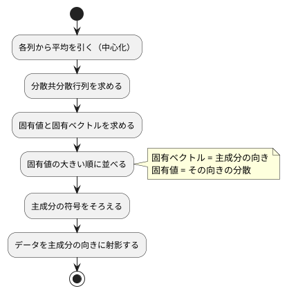

# 第 13 章: 主成分分析による次元削減

## 13.1 はじめに

ここまでの章では、正解ラベルのあるデータで予測をしてきました。この章から扱う **教師なし学習** では、正解ラベルを使わずに、データそのものの構造を調べます。

最初に扱うのは **主成分分析（PCA）** です。住宅価格のデータには 15 個の列がありますが、列どうしは互いに関係しあっていて、実際にはもっと少ない数の「軸」で大部分を説明できます。主成分分析は、データのばらつきを最もよく説明する新しい軸を探し、たくさんの列を少数の軸に要約します。

Go でこの章がおもしろいのは、**gonum に主成分分析そのものがある**（`stat.PC`）ことです。第 10 章のように「ライブラリが無いので全部自作する」章とも、第 7 章のように「ライブラリの結果をそのまま使う」章とも違います。この章では次のようにします。

| 役割 | 使うもの |
|------|---------|
| 中心化・分散共分散行列・並べ替え・符号そろえ・射影 | 自作（最終実装） |
| 固有値分解 | gonum の `mat.EigenSym` |
| 突き合わせの相手 | gonum の `stat.PC`（特異値分解による主成分分析） |

[Python 版の第 13 章](../python/13-principal-component-analysis.md) は NumPy の固有値分解で自作し、scikit-learn の `PCA` と突き合わせました。この章の構図はそれとほぼ同じで、`numpy.linalg.eigh` が `mat.EigenSym` に、`sklearn.decomposition.PCA` が `stat.PC` に対応します。[Java 版](../java/13-principal-component-analysis.md) は Tribuo に主成分分析が無いため突き合わせの相手がありませんでした。Go は相手がいる分、**符号の向き** という落とし穴にはっきり出会えます。

## 13.2 主成分分析とは

### ばらつきが最も大きい方向を探す

2 つの列が強く相関しているデータを散布図にすると、点は斜めの帯のように並びます。このとき、帯に沿った 1 本の軸を取れば、2 つの列の情報をほぼ 1 つの数値で表せます。この「ばらつき（分散）が最も大きい方向」が **第 1 主成分** です。第 2 主成分は、第 1 主成分と直交する方向のうち、ばらつきが最も大きい方向です。

### 分散共分散行列の固有ベクトル

主成分は、次の手順で求められます。



**分散共分散行列** は、対角に各列の分散、それ以外に 2 列の共分散を並べた行列です。この行列の **固有ベクトル** が主成分の向き、**固有値** がその向きのデータの分散になります。行列 `A` の固有ベクトル `v` と固有値 `λ` は、`A v = λ v`（`A` を掛けても向きが変わらず、長さだけが `λ` 倍になる）を満たします。

### 寄与率

各主成分の固有値を、固有値の合計で割った値を **寄与率** と呼びます。その主成分が、データ全体のばらつきのうち何割を説明しているかを表します。第 1 主成分から順に足したものが **累積寄与率** です。「累積寄与率が 0.8 に届くまでの主成分を使う」のように、残す軸の数を決める目安に使います。

## 13.3 題材とデータ

この章では、[第 9 章](09-feature-engineering.md) と同じ `Boston.csv`（100 件）を、住宅価格 `PRICE` も含めたすべての列で使います。学習データの入手と配置は [第 1 章](01-machine-learning-and-first-test.md) の「題材とデータ」を参照してください。

| 列の種類 | 列 | 注意点 |
|---------|-----|--------|
| 数値 | ZN, INDUS, CHAS, NOX, RM, AGE, DIS, RAD, TAX, PTRATIO, B, LSTAT, PRICE | NOX と RAD に欠損値がある |
| カテゴリ | CRIME | `high`・`low`・`very_low` の 3 種類の文字列 |

主成分分析は数値しか扱えず、欠損値があると計算できません。また、列ごとに単位や桁（TAX は数百、NOX は 1 未満）が違うと、桁の大きい列のばらつきが主成分を支配してしまいます。そこで次の前処理をしてから主成分分析をします。

1. CRIME をダミー変数（`CRIME_low`・`CRIME_very_low` の 2 列）に置き換える
2. 欠損値を列の平均値で補完する
3. すべての列を平均 0・標準偏差 1 に標準化する

この 3 つはすべて [第 9 章](09-feature-engineering.md) と [第 2 章](02-data-preprocessing-and-triangulation.md) で作った部品（`chapter09.Encode`・`chapter09.Categories`・`chapter02.ColumnMeans`・`chapter02.FillMissing`・`chapter09.Fit`）の組み合わせで済みます。新しく書くのは「組み合わせる順番」だけです。

この章では訓練データとテストデータに分けません。主成分分析は正解を予測するモデルではなく、手元のデータ全体の構造を要約する手法だからです。分割をしないということは、**第 7 章から悩まされてきた「言語ごとに乱数が違うので数値が一致しない」問題が、この章には無い** ということでもあります。

## 13.4 TODO リストの作成

**TODO リスト**:

- [ ] 分散共分散行列を求める
  - [ ] 2 列の分散と共分散を並べる
  - [ ] 3 列でも各列の分散と 2 列ずつの共分散を並べる
- [ ] gonum の固有値分解（`mat.EigenSym`）の振る舞いを確かめる
- [ ] 主成分を求める
  - [ ] 完全に相関する 2 列なら第 1 主成分だけで分散をすべて説明する
  - [ ] 寄与率の大きい順に、指定した数だけ並ぶ
  - [ ] 主成分の向き（符号）をそろえる
  - [ ] 主成分が固有ベクトルの性質を満たす
- [ ] データを主成分の向きに射影する
- [ ] 累積寄与率がしきい値に届く主成分の数を求める
- [ ] 主成分への影響が大きい列を求める
- [ ] gonum の `stat.PC` と突き合わせる
- [ ] Boston を前処理する（ダミー変数・欠損値の補完・標準化）
- [ ] 実データで寄与率と主成分の意味を表示する

## 13.5 分散共分散行列を求める

### Red

手で計算できる小さな例から始めます。`{{1, 2}, {2, 4}, {3, 6}}` の平均は 2 と 4、平均からの差は `(-1,-2)`・`(0,0)`・`(1,2)` です。件数から 1 を引いた 2 で割るので、分散は 1 と 4、共分散は 2 になります。

三角測量の相手には、3 列目がずっと 1 のまま動かない例を選びます。動かない列の分散も共分散も 0 になるはずです。

```go
func TestCovarianceMatrix(t *testing.T) {
	t.Parallel()

	tests := []struct {
		name string
		x    [][]float64
		want [][]float64
	}{
		{
			// 平均は 2 と 4。差は (-1,-2), (0,0), (1,2) なので、
			// 分散は 2/2=1 と 8/2=4、共分散は 4/2=2 になる
			name: "2 列の分散と共分散を並べる",
			x:    [][]float64{{1, 2}, {2, 4}, {3, 6}},
			want: [][]float64{{1, 2}, {2, 4}},
		},
		{
			// 3 列目は平均 1 のまま動かないので、分散も共分散も 0 になる
			name: "3 列でも各列の分散と 2 列ずつの共分散を並べる",
			x:    [][]float64{{1, 2, 1}, {2, 4, 1}, {3, 6, 1}},
			want: [][]float64{{1, 2, 0}, {2, 4, 0}, {0, 0, 0}},
		},
	}

	for _, test := range tests {
		t.Run(test.name, func(t *testing.T) {
			t.Parallel()

			got, err := chapter13.CovarianceMatrix(test.x)
			if err != nil {
				t.Fatalf("CovarianceMatrix() でエラー: %v", err)
			}

			for j := range test.want {
				for k := range test.want[j] {
					if !closeTo(got[j][k], test.want[j][k]) {
						t.Errorf("共分散[%d][%d] = %v, want %v", j, k, got[j][k], test.want[j][k])
					}
				}
			}
		})
	}
}
```

中身をまだ計算せず、大きさだけ合った 0 の行列を返す状態で走らせると、こう落ちます。

```text
--- FAIL: TestCovarianceMatrix (0.00s)
    --- FAIL: TestCovarianceMatrix/3_列でも各列の分散と_2_列ずつの共分散を並べる (0.00s)
        pca_test.go:63: 共分散[0][0] = 0, want 1
        pca_test.go:63: 共分散[0][1] = 0, want 2
        pca_test.go:63: 共分散[1][0] = 0, want 2
        pca_test.go:63: 共分散[1][1] = 0, want 4
    --- FAIL: TestCovarianceMatrix/2_列の分散と共分散を並べる (0.00s)
        pca_test.go:63: 共分散[0][0] = 0, want 1
```

### Green

Java 版・Kotlin 版は第 7 章で作った行列型の転置と積を再利用しました。Go 版の第 7 章は行列型を作らず `[][]float64` をそのまま扱ってきたので、この章も同じ方針にします。`Xcᵀ Xc` の要素は「中心化した 2 つの列の積の和」なので、二重ループで直接書けます。

```go
// CovarianceMatrix は列ごとの分散と、2 列ずつの共分散を並べた行列を返す。件数から 1 を引いた数で割る。
func CovarianceMatrix(x [][]float64) ([][]float64, error) {
	means, err := ColumnMeans(x)
	if err != nil {
		return nil, err
	}

	if len(x) < 2 {
		return nil, fmt.Errorf("分散共分散行列には 2 件以上が必要です: %d 件", len(x))
	}

	centered := center(x, means)
	columns := len(means)
	covariance := make([][]float64, columns)

	for j := range covariance {
		covariance[j] = make([]float64, columns)

		for k := range covariance[j] {
			sum := 0.0
			for _, row := range centered {
				sum += row[j] * row[k]
			}

			covariance[j][k] = sum / float64(len(x)-1)
		}
	}

	return covariance, nil
}
```

中心化は `Transform` でも使うので、最初から関数に切り出しておきます。Go のスライスは参照なので、引数で受け取った `x` を書き換えないように `slices.Clone` で写してから引きます。ここを忘れると、呼び出した側の元データが壊れます。

```go
// center は各列から平均を引く（中心化）。元のスライスは変更しない。
func center(x [][]float64, means []float64) [][]float64 {
	centered := make([][]float64, len(x))

	for i, row := range x {
		centered[i] = slices.Clone(row)
		for j := range centered[i] {
			centered[i][j] -= means[j]
		}
	}

	return centered
}
```

### 入力の検証を 1 か所にまとめる

`[][]float64` は「長方形である」ことを型で保証しません。列の数がそろっていない並びを渡されたら、計算の途中で範囲外アクセスになって panic します。Go では panic ではなく `error` を返したいので、検証を `validate` にまとめて、`ColumnMeans`・`CovarianceMatrix`・`Transform` の入口で呼びます。

```go
// validate は 1 件も無い、列の数がそろっていない、といった点数の並びを弾く。
func validate(x [][]float64) error {
	if len(x) == 0 {
		return fmt.Errorf("データが 1 件もありません")
	}

	for i, row := range x {
		if len(row) != len(x[0]) {
			return fmt.Errorf("%d 件目の列の数が違います: %d と %d", i+1, len(row), len(x[0]))
		}
	}

	if len(x[0]) == 0 {
		return fmt.Errorf("列が 1 つもありません")
	}

	return nil
}
```

Java 版・Kotlin 版は行列型（`Matrix`）を作ってこの不変条件をコンストラクタで守りました。Go 版は型を増やさない代わりに、**関数の入口で検証して error を返す** という形にしています。どちらも「壊れた入力を計算の奥まで持ち込まない」という同じ目的で、守り方の置き場所が違うだけです。

エラーの条件もテストにします。

```go
tests := []struct {
	name string
	x    [][]float64
}{
	{name: "1 件も無ければエラー", x: [][]float64{}},
	{name: "1 件だけならエラー", x: [][]float64{{1, 2}}},
	{name: "列の数がそろっていなければエラー", x: [][]float64{{1, 2}, {3}}},
}
```

## 13.6 gonum の固有値分解を確かめる

### 学習用テストを書く

次に必要なのは固有値分解です。gonum には対称行列専用の `mat.EigenSym` があります。**使う前に、振る舞いを学習用テストで確かめます**。知りたいのは次の 3 つです。

1. 固有値は大きい順に並ぶのか、小さい順に並ぶのか
2. 固有ベクトルは行に並ぶのか、列に並ぶのか
3. 対称でない行列を渡したらどうなるのか

固有値が 1 と 3 になる行列 `[[2, 1], [1, 2]]` で確かめます。

```go
// 固有値が 1 と 3 になる対称行列
symmetric := mat.NewSymDense(2, []float64{2, 1, 1, 2})

t.Run("固有値は小さい順に並ぶ", func(t *testing.T) {
	t.Parallel()

	var decomposition mat.EigenSym
	if ok := decomposition.Factorize(symmetric, true); !ok {
		t.Fatal("Factorize() が false を返しました")
	}

	want := []float64{1, 3}
	for i, value := range decomposition.Values(nil) {
		if !closeTo(value, want[i]) {
			t.Errorf("固有値[%d] = %v, want %v", i, value, want[i])
		}
	}
})
```

結果は **小さい順** でした。主成分は寄与率の大きい順に並べたいので、自分で逆順にする必要があります。Java 版の Tribuo は大きい順だったので、ここは言語版ごとに違う部分です。

固有ベクトルは `VectorsTo` で受け取ります。こちらは **列** に 1 本ずつ並び、長さは 1 です。

```go
var vectors mat.Dense
decomposition.VectorsTo(&vectors)

for j := range columns {
	column := mat.Col(nil, j, &vectors)
	if got := dot(column, column); !closeTo(got, 1) {
		t.Errorf("%d 列目の長さの 2 乗 = %v, want 1", j, got)
	}
}
```

`mat.Col(nil, j, &vectors)` は「`j` 列目を新しいスライスに取り出す」という意味です。第 1 引数に書き込み先を渡せますが、`nil` を渡すと新しく確保してくれます。gonum のこの「出力先を引数で受け取る」形は `VectorsTo(&vectors)` も同じで、呼ぶ側が領域を用意する Go らしい設計です。

### 対称でない行列を渡したら

3 つ目が Go らしい結果でした。Tribuo は対称でない行列に「空の `Optional`」を返しますが、gonum は **対称行列を別の型（`mat.SymDense`）にしている** ので、そもそも対称でない行列を渡せません。では、`mat.NewSymDense` に対称でない数値を渡すとどうなるのか。

```go
t.Run("対称でない値を渡すと右上の三角だけが使われる", func(t *testing.T) {
	t.Parallel()

	// Tribuo は対称でない行列に空の Optional を返すが、gonum は
	// 対称行列を別の型にしていて、左下（ここでは 3）を読まずに右上の 2 で埋める
	asymmetric := mat.NewSymDense(2, []float64{1, 2, 3, 4})

	if got := asymmetric.At(1, 0); !closeTo(got, 2) {
		t.Errorf("左下の要素 = %v, want 2", got)
	}
})
```

エラーにも panic にもならず、**左下の 3 は黙って捨てられ、右上の 2 が使われます**。これは知らないと気づけない振る舞いです。学習用テストに書いておけば、`CovarianceMatrix` が対称な行列を返している限りは問題ないと安心できますし、将来誰かが対称でない行列を渡したときに「なぜか値が違う」と悩む前にこのテストを読めます。

### 大きい順に並べ替える

確かめた振る舞いをもとに、固有値分解を 1 つの関数に閉じ込めます。ここで「小さい順を大きい順に」「列を行に」という 2 つの読み替えを済ませてしまえば、`Fit` の側は素直に書けます。

```go
// eigen は対称行列を固有値分解し、固有値と固有ベクトル（1 行に 1 つ）を大きい順に返す。
// gonum の mat.EigenSym は小さい順に並べるので、ここで逆に並べ替える。
func eigen(symmetric [][]float64) ([]float64, [][]float64, error) {
	size := len(symmetric)
	flat := make([]float64, 0, size*size)

	for _, row := range symmetric {
		flat = append(flat, row...)
	}

	var decomposition mat.EigenSym
	if ok := decomposition.Factorize(mat.NewSymDense(size, flat), true); !ok {
		return nil, nil, fmt.Errorf("固有値分解に失敗しました")
	}

	ascending := decomposition.Values(nil)

	var vectors mat.Dense
	decomposition.VectorsTo(&vectors)

	values := make([]float64, size)
	descending := make([][]float64, size)

	for i := range size {
		source := size - 1 - i
		values[i] = ascending[source]
		descending[i] = mat.Col(nil, source, &vectors)
	}

	return values, descending, nil
}
```

`Factorize` は成功したかどうかを `bool` で返します。gonum は「失敗するかもしれない計算」を例外ではなく真偽値で返すので、`if ok := ...; !ok` で受けて `error` に変換します。`[][]float64` から `mat.SymDense` への詰め替え（`flat` への平らな並べ直し）も、この関数の中だけで終わります。

## 13.7 主成分を求める

### 完全に相関する 2 列

まず、2 列目が 1 列目の 2 倍という、情報が実質 1 列しか無いデータで考えます。第 1 主成分の寄与率は 1、第 2 主成分は 0 になるはずです。主成分の向きは `(1, 2)` を長さ 1 にしたもの、つまり `(1/√5, 2/√5)` です。

```go
t.Run("完全に相関する 2 列なら第 1 主成分だけで分散をすべて説明する", func(t *testing.T) {
	t.Parallel()

	model, err := chapter13.Fit([][]float64{{1, 2}, {2, 4}, {3, 6}}, 2)
	if err != nil {
		t.Fatalf("Fit() でエラー: %v", err)
	}

	if !closeTo(model.ExplainedVarianceRatio[0], 1) {
		t.Errorf("第 1 主成分の寄与率 = %v, want 1", model.ExplainedVarianceRatio[0])
	}

	if !closeTo(model.ExplainedVarianceRatio[1], 0) {
		t.Errorf("第 2 主成分の寄与率 = %v, want 0", model.ExplainedVarianceRatio[1])
	}

	// 2 列目の動きは 1 列目の 2 倍なので、主成分の向きは (1, 2) を長さ 1 にしたもの
	want := []float64{1 / math.Sqrt(5), 2 / math.Sqrt(5)}
	for j, value := range want {
		if !closeTo(model.Components[0][j], value) {
			t.Errorf("第 1 主成分[%d] = %v, want %v", j, model.Components[0][j], value)
		}
	}
})
```

### モデルを構造体で返す

主成分分析の結果は「平均・主成分・分散・寄与率」の 4 つ組です。Java 版は record、Kotlin 版は data class にしました。Go には record がないので構造体にします。

```go
// Model は学習した主成分分析のモデル。
type Model struct {
	// Mean は列ごとの平均
	Mean []float64
	// Components は主成分を 1 行に 1 つずつ、寄与率の大きい順に並べたもの
	Components [][]float64
	// ExplainedVariance は主成分ごとの分散（固有値）
	ExplainedVariance []float64
	// ExplainedVarianceRatio は主成分ごとの寄与率
	ExplainedVarianceRatio []float64
}
```

Java 版の `PcaModel` はコンストラクタで `List.copyOf` して変更できないようにしていました。Go の構造体のフィールドはスライスなので、外から書き換えられます。「変更できない型」を Go で作るには、フィールドを小文字にしてメソッド越しにしか読めなくする必要がありますが、この章では素直に公開して、`Fit` が返すスライスが呼び出し側と共有されないこと（`slices.Clone` で写していること）だけを守ります。

`Fit` は分散共分散行列・固有値分解・寄与率・符号そろえを順に呼ぶだけです。

```go
// Fit は分散共分散行列を固有値分解し、寄与率の大きい順に nComponents 個の主成分を求める。
// 固有値分解だけを gonum の mat.EigenSym に任せ、並べ替えと符号そろえは自分で行う。
func Fit(x [][]float64, nComponents int) (Model, error) {
	covariance, err := CovarianceMatrix(x)
	if err != nil {
		return Model{}, err
	}

	if nComponents < 1 || nComponents > len(covariance) {
		return Model{}, fmt.Errorf("主成分の数が範囲の外です: %d（列は %d）", nComponents, len(covariance))
	}

	values, vectors, err := eigen(covariance)
	if err != nil {
		return Model{}, err
	}

	total := 0.0
	for _, value := range values {
		total += value
	}

	if total == 0 {
		return Model{}, fmt.Errorf("すべての列の分散が 0 です")
	}

	means, err := ColumnMeans(x)
	if err != nil {
		return Model{}, err
	}

	model := Model{
		Mean:                   means,
		Components:             NormalizeSigns(vectors[:nComponents]),
		ExplainedVariance:      slices.Clone(values[:nComponents]),
		ExplainedVarianceRatio: make([]float64, nComponents),
	}

	for i, value := range model.ExplainedVariance {
		model.ExplainedVarianceRatio[i] = value / total
	}

	return model, nil
}
```

寄与率の分母 `total` は、**取り出す `nComponents` 個ではなく、すべての固有値の合計** です。ここを取り出した分だけの合計にすると、寄与率の合計が必ず 1 になってしまい、「6 本で 84% を説明できる」という話ができなくなります。

### 性質をテストにする

具体的な数値を手で計算できるのは、13.7 節の冒頭のような小さな例だけです。3 列以上になると、期待値を手計算で書くのは現実的ではありません。そこで **主成分が満たすべき性質** をテストにします。

```go
for i, component := range model.Components {
	if !closeTo(dot(component, component), 1) {
		t.Errorf("第 %d 主成分の長さの 2 乗 = %v, want 1", i+1, dot(component, component))
	}

	// 分散共分散行列を掛けると、固有値（= その主成分の分散）倍になる
	for j := range component {
		got := dot(covariance[j], component)
		if want := model.ExplainedVariance[i] * component[j]; !closeTo(got, want) {
			t.Errorf("共分散 × 第 %d 主成分[%d] = %v, want %v", i+1, j, got, want)
		}
	}
}

for i := range model.Components {
	for k := i + 1; k < len(model.Components); k++ {
		if got := dot(model.Components[i], model.Components[k]); !closeTo(got, 0) {
			t.Errorf("第 %d 主成分と第 %d 主成分の内積 = %v, want 0", i+1, k+1, got)
		}
	}
}
```

`A v = λ v`（固有ベクトルの定義）・長さが 1・互いに直交、の 3 つです。どんなデータを渡してもこの 3 つは成り立つので、具体的な数値を知らなくても実装を検証できます。

## 13.8 符号をそろえる

### 固有ベクトルは向きが 2 つある

固有ベクトル `v` が `A v = λ v` を満たすなら、`-v` も同じ式を満たします。つまり **主成分の向きは、軸としては同じでも、符号が逆の 2 通りがあり得ます**。どちらが返るかは、分解の実装（LAPACK のどのルーチンを呼ぶか）で決まります。

この章では、Python 版・Kotlin 版・Java 版と同じ規則でそろえます。「絶対値が最大の要素が正になるように、必要なら全体の符号を反転する」です。

```go
// NormalizeSigns は、固有ベクトルは符号が逆でも同じ向きを表すので、
// 絶対値が最大の要素が正になるようにそろえる。元のスライスは変更しない。
func NormalizeSigns(components [][]float64) [][]float64 {
	normalized := make([][]float64, len(components))

	for i, component := range components {
		normalized[i] = slices.Clone(component)

		largest := 0.0
		for _, value := range component {
			if math.Abs(value) > math.Abs(largest) {
				largest = value
			}
		}

		if largest < 0 {
			for j := range normalized[i] {
				normalized[i][j] *= -1
			}
		}
	}

	return normalized
}
```

テストは単体では書けます。

```go
{
	name:       "絶対値が最大の要素が負なら全体の符号を反転する",
	components: [][]float64{{0.3, -0.9}},
	want:       [][]float64{{-0.3, 0.9}},
},
{
	name:       "絶対値が最大の要素が正ならそのまま",
	components: [][]float64{{-0.3, 0.9}},
	want:       [][]float64{{-0.3, 0.9}},
},
```

### 符号そろえが無いと本当に困るのか

ここが Java 版との大きな違いです。Java 版は「符号のテストが、ライブラリがたまたま正の向きを返していたせいで、実装が空でも通ってしまった」という落とし穴に出会いました。Go 版では、**突き合わせる相手（`stat.PC`）がいるので、符号をそろえないと実データで即座に食い違います**。

`NormalizeSigns` を「何もしない」実装に戻して、実データのテストを走らせると、こうなりました。

```text
--- FAIL: TestBostonPcaData/実データでも_gonum_の_stat.PC_と一致する (0.01s)
    bostonpca_test.go:110: 第 2 主成分[0] = -0.15338930053708713, want 0.153389300537088
    bostonpca_test.go:110: 第 2 主成分[1] = 0.028358666693865314, want -0.02835866669386508
    bostonpca_test.go:110: 第 2 主成分[2] = 0.19795373387472995, want -0.19795373387472945
```

第 1 主成分と第 3 主成分は一致するのに、**第 2 主成分だけ全部の符号が逆** です。`mat.EigenSym`（固有値分解）と `stat.PC`（特異値分解）が、同じ軸に対して逆向きのベクトルを返したからです。値そのものは小数第 13 位まで一致しているので、間違っているのはどちらでもなく、**向きを決める規則を自分で持っていなかった** ことが問題です。

表示にも同じことが起きます。

```text
第 1 主成分で影響の大きい列: INDUS -0.359, NOX -0.350, TAX -0.328
第 2 主成分で影響の大きい列: PRICE -0.444, CRIME_low -0.423, RM -0.405
```

符号をそろえた最終的な出力（13.12 節）では、これがすべて正になります。「都市化が進むほど値が大きい軸」なのか「小さい軸」なのかは計算では決まらないので、**規則で決めて固定する** しかありません。決めたからこそ、Python 版・Java 版・Kotlin 版と同じ符号の結果を比べられます。

## 13.9 データを主成分の向きに射影する

学習したモデルで、データを新しい軸の座標に置き換えます。平均を引いてから、各主成分との内積を取るだけです。

```go
// Transform は平均を引いてから、データを主成分の向きに射影する。
func (m Model) Transform(x [][]float64) ([][]float64, error) {
	if err := validate(x); err != nil {
		return nil, err
	}

	if len(x[0]) != len(m.Mean) {
		return nil, fmt.Errorf("列の数が学習時と違います: %d と %d", len(x[0]), len(m.Mean))
	}

	centered := center(x, m.Mean)
	projected := make([][]float64, len(centered))

	for i, row := range centered {
		projected[i] = make([]float64, len(m.Components))

		for k, component := range m.Components {
			sum := 0.0
			for j, value := range row {
				sum += value * component[j]
			}

			projected[i][k] = sum
		}
	}

	return projected, nil
}
```

`Transform` は `Model` のメソッドにしました。第 9 章の `Standardizer.Transform` と同じ形です。Go では「学習した結果を持つ値」と「それを使う操作」を、構造体とメソッドで自然に組にできます。

テストは、完全に相関する 2 列を射影すると 1 本の軸に並ぶ（第 2 主成分の値がすべて 0 になる）ことと、中心の点が原点に移ることを確かめます。

```go
for i, row := range projected {
	if !closeTo(row[1], 0) {
		t.Errorf("%d 件目の第 2 主成分の値 = %v, want 0", i+1, row[1])
	}
}

// 中心の (2, 4) は原点に移る
if !closeTo(projected[1][0], 0) {
	t.Errorf("中心の第 1 主成分の値 = %v, want 0", projected[1][0])
}
```

## 13.10 必要な主成分の数と、影響の大きい列

累積寄与率がしきい値に届くまでの数を数えます。

```go
// ComponentsNeeded は累積寄与率がしきい値に届くまでの主成分の数を返す。
func ComponentsNeeded(ratios []float64, threshold float64) int {
	cumulative := 0.0

	for i, ratio := range ratios {
		cumulative += ratio
		if cumulative >= threshold {
			return i + 1
		}
	}

	return len(ratios)
}
```

この関数は入力を検証しません。寄与率のスライスは `Fit` が作ったものを渡す前提で、しきい値に届かなければ全部を使う、という素直な仕様だからです。「届かない」ケースもテストに入れておきます。

```go
tests := []struct {
	name      string
	threshold float64
	want      int
}{
	{name: "第 1 主成分で届く", threshold: 0.5, want: 1},
	{name: "2 つ目で届く", threshold: 0.7, want: 2},
	{name: "3 つ目で届く", threshold: 0.8, want: 3},
	{name: "届かなければすべて使う", threshold: 1.5, want: 4},
}
```

主成分の「意味」を読むには、係数の絶対値が大きい列を見ます。列名と係数の組には名前を付けて `Loading` 型にします。

```go
// Loading は主成分の向きに対する 1 つの列の係数。
type Loading struct {
	// Column は列名
	Column string
	// Value は主成分の向きの成分（符号付き）
	Value float64
}

// TopLoadings は主成分の係数の絶対値が大きい順に、列名と係数を k 個返す。
func TopLoadings(component []float64, columns []string, k int) ([]Loading, error) {
	if len(component) != len(columns) {
		return nil, fmt.Errorf("主成分の成分の数と列名の数が違います: %d と %d", len(component), len(columns))
	}

	loadings := make([]Loading, len(columns))
	for j, column := range columns {
		loadings[j] = Loading{Column: column, Value: component[j]}
	}

	slices.SortStableFunc(loadings, func(a, b Loading) int {
		return cmpDescending(math.Abs(a.Value), math.Abs(b.Value))
	})

	if k > len(loadings) {
		k = len(loadings)
	}

	return loadings[:k], nil
}
```

`slices.SortStableFunc` の比較関数は「負なら前、正なら後ろ」を返します。Java の `Comparator.comparingDouble(...).reversed()` に当たるものが標準にはないので、大きい順の比較を小さな関数に切り出しました。**安定ソート**（`SortStableFunc`）を選んでいるのは、係数の絶対値が同じ列があったときに、列の順序が実行のたびに変わらないようにするためです。出力を固定するテストを書く以上、ここは安定でなければなりません。

`Loading` は比較できる型（フィールドが `string` と `float64` だけ）なので、テストでは `==` でそのまま比べられます。

```go
want := []chapter13.Loading{{Column: "B", Value: -0.8}, {Column: "C", Value: 0.5}}
for i := range want {
	if got[i] != want[i] {
		t.Errorf("%d 番目 = %+v, want %+v", i+1, got[i], want[i])
	}
}
```

## 13.11 gonum の stat.PC と突き合わせる

### 同じ形に詰め替える

`stat.PC` は「中心化 → 特異値分解」を一度に行う型です。自作と比べるために、同じ `Model` に詰め替えます。

```go
// GonumFit は gonum の stat.PC で主成分分析をする。
// stat.PC は中心化から特異値分解までをまとめて行うので、自作の Fit と同じ形の Model に詰め替える。
func GonumFit(x [][]float64, nComponents int) (Model, error) {
	means, err := ColumnMeans(x)
	if err != nil {
		return Model{}, err
	}

	if nComponents < 1 || nComponents > len(means) {
		return Model{}, fmt.Errorf("主成分の数が範囲の外です: %d（列は %d）", nComponents, len(means))
	}

	flat := make([]float64, 0, len(x)*len(means))
	for _, row := range x {
		flat = append(flat, row...)
	}

	// 第 2 引数の weights は nil で「すべて重み 1」を表す。
	// 成功したかどうかは戻り値の真偽で返り、失敗したときの結果は使えない。
	var pc stat.PC
	if ok := pc.PrincipalComponents(mat.NewDense(len(x), len(means), flat), nil); !ok {
		return Model{}, fmt.Errorf("gonum の主成分分析に失敗しました")
	}

	variances := pc.VarsTo(nil)

	var vectors mat.Dense
	pc.VectorsTo(&vectors)

	// 以下、寄与率を求めて NormalizeSigns した Model を返す
```

gonum の API の癖が 3 つ出ています。

| 癖 | 意味 |
|----|------|
| `PrincipalComponents` が `bool` を返す | 失敗したかどうかは戻り値で分かる。失敗したあとに `VarsTo` を呼んでも結果は意味を持たない |
| `VarsTo` / `VectorsTo` で取り出す | 結果は `PC` の中に持たれていて、呼ぶ側が受け取り先を渡す。`nil` を渡せば確保してくれる |
| 寄与率は自分で求める | `VarsTo` が返すのは主成分ごとの **分散** で、寄与率（比率）は入っていない。合計で割るのは自分の仕事 |

scikit-learn の `PCA` には `explained_variance_ratio_` がありますが、gonum には無いので、Python 版が 1 行で済ませていたところを自分で書きます。

### 一致することをテストにする

分散・寄与率・主成分の向きの 3 つを突き合わせます。

```go
for i := range mine.ExplainedVariance {
	if !closeTo(mine.ExplainedVariance[i], theirs.ExplainedVariance[i]) {
		t.Errorf("第 %d 主成分の分散 = %v, want %v",
			i+1, theirs.ExplainedVariance[i], mine.ExplainedVariance[i])
	}
	...
}
```

分散が一致したことで、`VarsTo` が返しているのは **分散共分散行列の固有値そのもの**（件数から 1 を引いて割る定義）だと確かめられました。学習用テストでも、2 列の例で「分散の合計が元の 2 列の分散の和になる」ことを固定しています。

符号については、「そろえる前は、同じ向きか、ちょうど逆向きのどちらかになる」という形でテストにしました。どちらになるかはデータ次第なので、テストでどちらかに決め打ちはできません。

```go
// 符号をそろえる前の主成分は、自作の主成分と同じ向きか、ちょうど逆向きのどちらかになる
same := true
opposite := true

for j := range raw {
	if !closeTo(raw[j], mine.Components[0][j]) {
		same = false
	}

	if !closeTo(raw[j], -mine.Components[0][j]) {
		opposite = false
	}
}

if !same && !opposite {
	t.Errorf("gonum の主成分 %v が自作の %v と同じ軸を指していません", raw, mine.Components[0])
}

if same == opposite {
	t.Errorf("同じ向きと逆向きの判定が両立しました: %v", raw)
}
```

「同じでもあり逆でもある」が成り立つのは、ベクトルが全部 0 のときだけです。`same == opposite` を弾くことで、テストが空振りしていないことも確かめています。

## 13.12 実データで要約する

### 前処理を組み立てる

第 9 章と第 2 章の部品を、分割しない形でつなぎ直します。

```go
// StandardizeBoston は CRIME をダミー変数にし、欠損値を列の平均値で補完してから、すべての列を標準化する。
// 正解ラベルを予測しないので、PRICE も 1 つの列として扱い、訓練データとテストデータに分けない。
func StandardizeBoston(table chapter02.Table) ([]chapter02.Features, error) {
	crimes := make([]string, 0, len(table.Rows))

	for _, row := range table.Rows {
		crime, err := row.Text(BostonCategory)
		if err != nil {
			return nil, err
		}

		crimes = append(crimes, crime)
	}

	encoded, err := chapter09.Encode(table, BostonCategory, chapter09.Categories(crimes))
	if err != nil {
		return nil, err
	}

	means, err := chapter02.ColumnMeans(encoded.Rows, encoded.Columns)
	if err != nil {
		return nil, err
	}

	filled, err := chapter02.FillMissing(encoded.Rows, encoded.Columns, means)
	if err != nil {
		return nil, err
	}

	standardizer, err := chapter09.Fit(filled)
	if err != nil {
		return nil, err
	}

	return standardizer.Transform(filled)
}
```

5 つの処理を並べるのに、`err` の確認が 5 回出てきます。Java 版なら例外が自動で伝わるので `return` が 1 つで済むところです。Go では冗長に見えますが、どの処理が失敗し得るかが読んだだけで分かる、という取り引きです。

第 9 章の `Standardizer` は **母標準偏差**（件数で割る）を使います。分散共分散行列は件数から 1 を引いて割るので、標準化したあとでも各列の分散はぴったり 1 ではなく `n/(n-1)` = 100/99 になります。寄与率は比率なので、この差は結果に影響しません。

### 実データのテスト

学習データが無い環境では飛ばすテストとして、前処理の結果・寄与率の合計・gonum との一致・表示の 4 つを固定します。

```go
t.Run("実データでも gonum の stat.PC と一致する", func(t *testing.T) {
	t.Parallel()

	_, points := bostonPoints(t)

	mine, err := chapter13.Fit(points, 6)
	...

	// 実データでは固有値分解と特異値分解の誤差が積もるので、小数第 9 位までは求めない
	const dataTolerance = 1e-8
```

小さな例では `1e-9` で一致しましたが、100 件 15 列では固有値分解と特異値分解の誤差が積もるので、実データのテストだけ幅を `1e-8` に広げています。それでも小数第 8 位まで一致するので、突き合わせとしては十分です。

### 結果を表示する

```go
// Run はボストンの住宅価格の 15 列を主成分分析し、寄与率と主成分の意味を表示する。
func Run(out io.Writer) error {
	features, err := LoadBoston(filepath.Join(dataset.Current(), "Boston.csv"))
	if err != nil {
		return err
	}
	...
}
```

`go run ./cmd/chapters chapter13` の実行結果です。

```text
データ件数: 100, 列数: 15
寄与率: PC1 0.4110, PC2 0.1448, PC3 0.1019, PC4 0.0645, PC5 0.0623, PC6 0.0581
累積寄与率が 0.8 に届く主成分の数: 6（累積寄与率 0.8427）
第 1 主成分で影響の大きい列: INDUS 0.359, NOX 0.350, TAX 0.328
第 2 主成分で影響の大きい列: PRICE 0.444, CRIME_low 0.423, RM 0.405
```

### 結果を読む

- **第 1 主成分だけで 4 割を説明する**: 15 列のばらつきのうち 41.1% を、1 本の軸で説明できます
- **15 列を 6 本の軸に要約できる**: 累積寄与率 0.8 を目安にすると、6 つの主成分で全体の 84.3% を説明できます
- **第 1 主成分は「産業化・都市化」の軸と読める**: 非小売業の土地の割合（INDUS）、窒素酸化物の濃度（NOX）、固定資産税率（TAX）が同じ向きに強く効いています
- **第 2 主成分は「住環境のよさ」の軸と読める**: 住宅価格（PRICE）、犯罪率が低い地区（CRIME_low）、部屋数（RM）が同じ向きに効いています

主成分の「意味」は計算で決まるものではなく、係数を見た人間の解釈です。符号の向きも 13.8 節の規則で決めたものなので、「値が大きいほど都市化している」のかどうかは、係数の符号とあわせて読む必要があります。

### ほかの言語版と数値が一致します

第 7 章から第 10 章では、訓練データとテストデータの分け方が言語ごとの乱数の違いで変わるため、数値がほかの言語版と一致しませんでした。この章は **分割も乱数も使わない** ので、Java 版・Kotlin 版・Python 版とまったく同じ寄与率・同じ主成分が得られています（Kotlin 版はダミー変数の列名が `CRIME_low` ではなく `low` です）。符号までそろっているのは、3 つの言語版が同じ「絶対値が最大の要素を正にする」規則を採ったからです。

## 13.13 ライブラリへの置き換えについて

この章は、ほかの章と違って **gonum に同じことをする機能がありました**。それでも自作を最終実装として残したのは、次の理由です。

| 観点 | 判断 |
|------|------|
| 学ぶ目的 | 中心化・分散共分散行列・固有値分解・寄与率という手順を、自分で組み立てることがこの章の主題 |
| 検証 | `stat.PC` と突き合わせることで、自作が正しいことを毎回のテストで確かめられる |
| 符号 | `stat.PC` は符号をそろえてくれない。ほかの言語版と同じ向きにそろえる規則は、どちらにせよ自分で持つ必要がある |
| 寄与率 | `VarsTo` は分散までで、寄与率は自分で求める必要がある |

つまり、`stat.PC` に完全に置き換えたとしても、符号そろえと寄与率は自分で書くことになります。それなら、固有値分解だけをライブラリに任せて手順を自分で持ち、ライブラリを **検証の相手** に使うほうが、この章の目的に合っています。[ADR 008](../../../adr/008-go-ml-libraries.md) の方針（gonum にあるものは使い、無いものは自作する）から外れないように、固有値分解と突き合わせの両方で gonum を使っています。

## 13.14 Notebook による探索と可視化

Go 版では Notebook と可視化の節を設けません。主成分の数と累積寄与率のグラフ、第 1・第 2 主成分の散布図、主成分への影響が大きい列の棒グラフは、[Python 版の第 13 章](../python/13-principal-component-analysis.md) と [Kotlin 版の第 13 章](../kotlin/13-principal-component-analysis.md) の Notebook の節を参照してください。数値は 13.12 節のとおり一致しているので、グラフもそのまま読み替えられます。

## 13.15 リファクタリング

TODO リストをすべて終えてから、`gofmt -l .`・`go vet ./...`・`golangci-lint run`・`go test ./... -cover` をかけました。指摘はありませんでした。TDD の途中で済ませたリファクタリングは次の 3 つです。

- **中心化の重複** — `CovarianceMatrix` と `Transform` の中心化を `center` に切り出した
- **検証の重複** — 3 つの関数が同じ形のチェックをしていたので `validate` にまとめた
- **固有値分解の詰め替え** — `[][]float64` と `mat.SymDense` の行き来、小さい順から大きい順への並べ替え、列から行への読み替えを、すべて `eigen` の中に閉じ込めた

第 2 章・第 9 章のコードは変更していません。学習データが無い環境（`ML_DATA_DIR=/nonexistent go test ./...`）では、`TestBostonPcaData` の 4 つのテストがスキップされ、残りは通ります。

## 13.16 まとめ

この章では、主成分分析を分散共分散行列と固有値分解から組み立てました。

1. **分散共分散行列** — `[][]float64` の二重ループで `Xcᵀ Xc / (n − 1)` を求め、手で計算できる 2 列の例と、動かない列を含む 3 列の例で三角測量した
2. **学習用テストで API の癖を固定する** — `mat.EigenSym` が固有値を小さい順に返すこと、固有ベクトルが列に並ぶこと、対称でない値を渡すと右上の三角だけが使われることをテストにした
3. **性質をテストにする** — 具体的な数値を手計算できない場面では、`A v = λ v`・長さ 1・直交、という主成分の性質で検証した
4. **符号は規則で決める** — 固有値分解と特異値分解は同じ軸に逆向きのベクトルを返すことがある。実装どうしの食い違いを実データのテストで見てから、`NormalizeSigns` で向きを固定した
5. **ライブラリは置き換え先ではなく検証の相手にもなる** — `stat.PC` と突き合わせることで、自作の実装が毎回のテストで検証される

Go ならではの学びもありました。

- **gonum は「失敗」を bool で返す** — `Factorize` も `PrincipalComponents` も例外ではなく真偽値なので、`error` への変換は自分の仕事になる
- **gonum は「出力先」を引数で受け取る** — `VectorsTo(&dst)`・`VarsTo(nil)`・`mat.Col(nil, j, m)` のように、確保するかどうかを呼ぶ側が選べる
- **型で守る代わりに関数の入口で守る** — 行列型を作らない分、`validate` を 1 か所に置いて `error` を返す形で不変条件を守った
- **安定ソートを選ぶ** — 出力を固定するテストを書くなら、同じ値が並んだときに順序が揺れない `slices.SortStableFunc` を使う

次の章では、同じく教師なし学習の K-means で、データを似たもの同士のグループに分けます。gonum にクラスタリングは無いので、今度は全部自作です。
