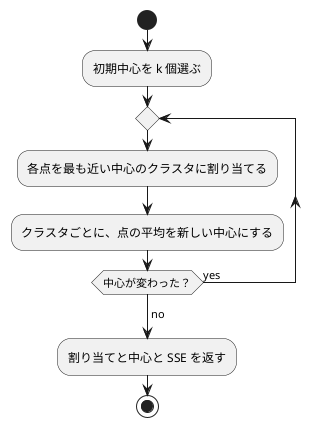

# 第 14 章: K-means によるクラスタリング

## 14.1 はじめに

[第 13 章](13-principal-component-analysis.md) に続く教師なし学習の 2 つ目は、**クラスタリング** です。正解ラベルの無いデータを、似たもの同士のグループ（クラスタ）に分けます。この章で作る **K-means** は、クラスタリングのもっとも基本的な手法です。

第 13 章では gonum に主成分分析（`stat.PC`）があり、自作と突き合わせられました。この章は逆です。**gonum にクラスタリングはありません**。第 10 章のロジスティック回帰・ランダムフォレストと同じく、自作が最終実装になります。

[Python 版の第 14 章](../python/14-k-means-clustering.md) は scikit-learn の `KMeans` と突き合わせ、[Java 版](../java/14-k-means-clustering.md) は Tribuo の `KMeansTrainer`（k-means++）と比べました。Go 版で対比の相手になるのは [TypeScript 版](../typescript/14-k-means-clustering.md) です。ライブラリが無い環境で、どこまでを自分で決めて、どこをテストで固定するか、という立場が同じです。

## 14.2 K-means の仕組み

K-means は、クラスタ数 `k` をあらかじめ決めておき、次の 2 つを交互に繰り返します。



この繰り返しは、**誤差平方和（SSE: Sum of Squared Errors）** を必ず小さくします。SSE は「各点と、所属するクラスタの中心との距離の 2 乗の合計」です。割り当ての更新も中心の更新も SSE を増やさないので、繰り返せばいつか中心が動かなくなります。

ただし、たどり着く先は **初期中心に依存します**。SSE が最小になる分け方（大域解）ではなく、その近くで止まってしまう分け方（局所解）になることがあります。対策は単純で、初期中心を何通りか試して、いちばん SSE が小さい結果を選びます（scikit-learn の `n_init` と同じ考え方）。

クラスタ数 `k` は自分で決める必要があります。`k` を増やせば SSE は必ず小さくなるので、「SSE が最小の `k`」を選ぶことには意味がありません。そこで **エルボー法** を使います。`k` ごとの SSE を並べ、減り方が緩やかになる「ひじ」のあたりを選びます。

## 14.3 題材とデータ

この章では `Wholesale.csv`（440 件）を使います。卸売業者の顧客ごとの、商品区分別の年間支出額です。学習データの入手と配置は [第 1 章](01-machine-learning-and-first-test.md) の「題材とデータ」を参照してください。

| 列 | 内容 |
|----|------|
| Channel, Region | 販売チャネルと地域を表す番号。支出額ではない |
| Fresh | 生鮮食品 |
| Milk | 乳製品 |
| Grocery | 食料雑貨 |
| Frozen | 冷凍食品 |
| Detergents_Paper | 洗剤・紙製品 |
| Delicassen | 惣菜 |

Channel と Region は「1 か 2」「1 から 3」の番号で、大小に意味がありません。距離を測る対象にすると意味のない差が入るので、支出額の 6 列だけを使います。

支出額は列ごとに桁が違う（Fresh は 1 万を超え、Delicassen は千のオーダー）ので、[第 9 章](09-feature-engineering.md) の標準化で平均 0・標準偏差 1 にそろえてから距離を測ります。そろえないと、金額の大きい列だけで距離が決まってしまいます。

この章も訓練データとテストデータには分けません。クラスタリングは予測をしないからです。ただし **初期中心を選ぶのに乱数を使う** ので、第 7 章から第 10 章と同じく、数値はほかの言語版と一致しません（14.13 節）。

## 14.4 TODO リストの作成

**TODO リスト**:

- [ ] 支出額の列を読み込む（Channel・Region を除く）
- [ ] 列ごとに標準化する
- [ ] 2 点間の距離の 2 乗を求める
- [ ] 各点を最も近い中心に割り当てる
- [ ] クラスタごとに中心を更新する
- [ ] 誤差平方和（SSE）を求める
- [ ] 中心が変わらなくなるまで繰り返す
  - [ ] 更新の回数に上限を設ける
- [ ] 初期中心をシードで選ぶ
- [ ] 初期中心を何通りか試して SSE が最小の結果を選ぶ
- [ ] クラスタ数ごとの SSE を求める（エルボー法）
- [ ] クラスタごとの件数と平均支出額をまとめる
- [ ] 実データでクラスタリングして表示する

## 14.5 点の表し方を決める

最初に決めるのは、点をどう表すかです。第 13 章と同じく `[][]float64`（1 件 1 行）にします。

Java 版は `double[][]` を使いつつ、結果の `record` には `List<Integer>` と `Matrix` を入れました。`record` の成分に配列を使うと `equals` が参照の比較になってしまうからです。Go には自動生成の `==` がなく、スライスは `==` で比べられない（コンパイルエラーになる）ので、**そもそも「うっかり参照比較になる」事故が起きません**。比較が必要なところでは `slices.Equal` を明示的に呼びます。

```go
// Result は K-means の結果。
type Result struct {
	// Labels は点ごとのクラスタ番号
	Labels []int
	// Centers はクラスタの中心を 1 行に 1 つずつ並べたもの
	Centers [][]float64
	// SSE は誤差平方和
	SSE float64
}
```

## 14.6 2 点間の距離

### Red

距離そのものではなく **距離の 2 乗** を使います。比較にしか使わないなら平方根は要りませんし、SSE の定義にも 2 乗が入っています。

```go
tests := []struct {
	name string
	a    []float64
	b    []float64
	want float64
}{
	{name: "同じ点なら 0", a: []float64{1, 2}, b: []float64{1, 2}, want: 0},
	{name: "3 と 4 の直角三角形なら 25", a: []float64{0, 0}, b: []float64{3, 4}, want: 25},
	{name: "3 次元でも各軸の差の 2 乗を足す", a: []float64{1, 1, 1}, b: []float64{2, 3, 5}, want: 21},
}
```

いつも 0 を返す実装で走らせると、「同じ点なら 0」だけが通り、残りが落ちます。

```text
--- FAIL: TestSquaredDistance (0.00s)
    --- FAIL: TestSquaredDistance/3_次元でも各軸の差の_2_乗を足す (0.00s)
        kmeans_test.go:49: SquaredDistance() = 0, want 21
    --- FAIL: TestSquaredDistance/3_と_4_の直角三角形なら_25 (0.00s)
        kmeans_test.go:49: SquaredDistance() = 0, want 25
```

### 公開する関数と、内側で使う関数を分ける

K-means は距離の計算を何万回も呼びます。毎回 `error` を返して確かめるのは無駄です。そこで、**検証つきの公開関数と、検証しない内側の関数** に分けます。

```go
// squaredDistance は 2 点間の距離の 2 乗。長さがそろっていることは呼ぶ前に確かめる。
func squaredDistance(a, b []float64) float64 {
	sum := 0.0

	for j, value := range a {
		d := value - b[j]
		sum += d * d
	}

	return sum
}

// SquaredDistance は 2 点間の距離の 2 乗を返す。次元が違えばエラーを返す。
func SquaredDistance(a, b []float64) (float64, error) {
	if len(a) != len(b) {
		return 0, fmt.Errorf("点の次元が違います: %d と %d", len(a), len(b))
	}

	return squaredDistance(a, b), nil
}
```

Go では、先頭が大文字の名前だけがパッケージの外から見えます。小文字の `squaredDistance` はこのパッケージの中からしか呼べないので、「呼ぶ前に検証済みである」という約束をパッケージの中で守れば十分です。この章の公開関数（`AssignClusters`・`UpdateCenters`・`SumOfSquaredErrors`・`Fit`）はすべて、入口で `validate` を呼んでから小文字の実装に渡す、という同じ形にしています。

```go
// validate は点と中心の並びが計算できる形かを確かめる。
func validate(points, centers [][]float64) error {
	if len(points) == 0 {
		return fmt.Errorf("点が 1 つもありません")
	}

	if len(centers) == 0 {
		return fmt.Errorf("中心が 1 つもありません")
	}

	dimensions := len(points[0])
	for i, point := range points {
		if len(point) != dimensions {
			return fmt.Errorf("%d 番目の点の次元が違います: %d と %d", i+1, len(point), dimensions)
		}
	}

	for k, center := range centers {
		if len(center) != dimensions {
			return fmt.Errorf("%d 番目の中心の次元が違います: %d と %d", k+1, len(center), dimensions)
		}
	}

	return nil
}
```

Java 版は例外を投げず、次元が違えば `ArrayIndexOutOfBoundsException` になるままでした。Go は「エラーは値で返す」言語なので、**壊れた入力は外周で `error` にして返し、内側は素直に計算する** という二層にするのが素直です。

## 14.7 各点を最も近い中心に割り当てる

テストには、左下と右上に 3 点ずつある架空のデータを使います。実データの行は使いません。

```go
// 左下と右上に 2 つのかたまりがある、架空の 6 点。
var twoBlobs = [][]float64{
	{0, 0}, {0, 1}, {1, 0},
	{10, 10}, {10, 11}, {11, 10},
}
```

中心を `(0,0)` と `(10,10)` に置けば、前半 3 点がクラスタ 0、後半 3 点がクラスタ 1 になるはずです。

```go
got, err := chapter14.AssignClusters(twoBlobs, centers)
...
want := []int{0, 0, 0, 1, 1, 1}
if !slices.Equal(got, want) {
	t.Errorf("AssignClusters() = %v, want %v", got, want)
}
```

**距離が同じときにどうするか** も決めてテストにします。ここでは「番号の小さいクラスタに入れる」にしました。決めておかないと、実装を少し書き換えただけで割り当てが変わり、出力を固定するテストが揺れます。

```go
t.Run("距離が同じなら番号の小さいクラスタに入れる", func(t *testing.T) {
	t.Parallel()

	got, err := chapter14.AssignClusters([][]float64{{1, 0}}, [][]float64{{0, 0}, {2, 0}})
	...
})
```

実装は、最も近い中心を探すだけです。

```go
func assignClusters(points, centers [][]float64) []int {
	labels := make([]int, len(points))

	for i, point := range points {
		nearest := 0
		best := squaredDistance(point, centers[0])

		for k := 1; k < len(centers); k++ {
			if distance := squaredDistance(point, centers[k]); distance < best {
				nearest = k
				best = distance
			}
		}

		labels[i] = nearest
	}

	return labels
}
```

`distance < best`（`<=` ではない）にしているのが、「同じなら番号の小さいほう」という決まりです。また、最も近い中心までの距離を `best` に覚えておくことで、Java 版のように毎回 2 回ずつ距離を計算し直さずに済みます。

## 14.8 中心を更新する

クラスタごとに、割り当てられた点の平均を新しい中心にします。悩ましいのは **点が 1 つも割り当てられなかったクラスタ** です。0 で割ると `NaN` になり、以降の距離がすべて `NaN` になって割り当てが壊れます。ここでは「前の中心をそのまま残す」ことにしました。

```go
t.Run("点が 1 つも無いクラスタは前の中心を残す", func(t *testing.T) {
	t.Parallel()

	labels := []int{0, 0, 0, 0, 0, 0}
	previous := [][]float64{{0, 0}, {99, 99}}

	got, err := chapter14.UpdateCenters(twoBlobs, labels, previous)
	...
	if want := []float64{99, 99}; !slices.Equal(got[1], want) {
		t.Errorf("空のクラスタの中心 = %v, want %v", got[1], want)
	}
})
```

実装では、合計を入れておいた行をそのまま平均に割り、空のクラスタだけ前の中心を **写して** 置き換えます。

```go
	for k, sum := range sums {
		if counts[k] == 0 {
			sums[k] = slices.Clone(previous[k])
			continue
		}

		for j := range sum {
			sum[j] /= float64(counts[k])
		}
	}
```

`slices.Clone` を忘れて `sums[k] = previous[k]` と書くと、返した中心と引数の中心が同じスライスを指します。次の繰り返しで書き換えたつもりが、呼び出し側の値まで変わってしまう。Go でスライスを返す関数を書くときの定番の落とし穴です。

クラスタ番号が範囲の外だったときもエラーにします。これを見落とすと、`counts[labels[i]]++` が範囲外アクセスで panic します。

```go
	for i, label := range labels {
		if label < 0 || label >= len(previous) {
			return nil, fmt.Errorf("%d 番目のクラスタ番号が範囲の外です: %d", i+1, label)
		}
	}
```

## 14.9 SSE を計算する

各点と、所属する中心との距離の 2 乗を足すだけです。

```go
func sumOfSquaredErrors(points [][]float64, labels []int, centers [][]float64) float64 {
	sum := 0.0
	for i, point := range points {
		sum += squaredDistance(point, centers[labels[i]])
	}

	return sum
}
```

テストは「中心と点が一致していれば 0」と「`(3,4)` が原点に割り当てられていれば 25」の 2 つです。あとで実データのテストで、もっと強い性質（標準化したデータのクラスタ数 1 の SSE は件数 × 列数になる）を使います。

## 14.10 中心が変わらなくなるまで繰り返す

### 収束の判定

中心が前回と同じになったら止めます。`[][]float64` の比較は `==` では書けないので、`slices` パッケージを組み合わせます。

```go
// equalCenters は 2 つの中心の並びが同じ値かを返す。
func equalCenters(a, b [][]float64) bool {
	return slices.EqualFunc(a, b, slices.Equal[[]float64])
}
```

`slices.EqualFunc` は「外側の要素どうしを、渡した関数で比べる」ので、内側の比較に `slices.Equal` を渡せば 2 次元の比較になります。`slices.Equal[[]float64]` は、ジェネリック関数の型引数を明示して関数値として渡す書き方です。Java 版の `Arrays.deepEquals` に当たるものが Go の標準ライブラリには無いので、こう組み立てます。

### 回数の上限

浮動小数点の計算では、理屈のうえでは止まるはずでも、値が細かく揺れて止まらないことがあります。scikit-learn と同じく 300 回を上限にします。

```go
const (
	// DefaultMaxIterations は更新の回数の既定の上限（scikit-learn の KMeans と同じ）。
	DefaultMaxIterations = 300
	// DefaultNInit は初期中心を試す回数の既定値（scikit-learn の KMeans の n_init と同じ）。
	DefaultNInit = 10
)
```

```go
// FitWithMaxIterations は中心が変わらなくなるか、更新の回数が maxIterations に達するまで繰り返す。
func FitWithMaxIterations(points, initialCenters [][]float64, maxIterations int) (Result, error) {
	if err := validate(points, initialCenters); err != nil {
		return Result{}, err
	}

	if maxIterations < 1 {
		return Result{}, fmt.Errorf("更新の回数の上限は 1 以上です: %d", maxIterations)
	}

	centers := initialCenters

	for range maxIterations {
		next := updateCenters(points, assignClusters(points, centers), centers)
		if equalCenters(next, centers) {
			break
		}

		centers = next
	}

	labels := assignClusters(points, centers)

	return Result{
		Labels:  labels,
		Centers: centers,
		SSE:     sumOfSquaredErrors(points, labels, centers),
	}, nil
}
```

`for range maxIterations` は Go 1.22 で入った「整数で回す range」です。カウンタを使わないループを `for i := 0; i < n; i++` と書かなくてよくなりました。

上限で打ち切られることをテストで確かめるには、**1 回の更新では終わらない初期中心** を選ぶ必要があります。最初に `(0,0)` と `(1,1)` で書いたら、1 回の更新でもう収束してしまい、テストが落ちました。縦に並べた `(0,0)` と `(0,1)` なら、右上のかたまりが最初は両方とも 2 番目のクラスタに入るので、2 回以上かかります。

```go
// 縦に並んだ中心から始めると、1 回の更新ではかたまりに分かれきらない
initial := [][]float64{{0, 0}, {0, 1}}

once, err := chapter14.FitWithMaxIterations(twoBlobs, initial, 1)
...
converged, err := chapter14.Fit(twoBlobs, initial)
...
if once.SSE <= converged.SSE {
	t.Errorf("1 回で打ち切った SSE %v が、収束した SSE %v 以下になりました", once.SSE, converged.SSE)
}
```

## 14.11 初期中心をシードで選ぶ

点を並べ替えて、先頭から `k` 個を初期中心にします。並べ替えには **第 2 章の `Shuffle`**（`math/rand` と Fisher-Yates）をそのまま使います。同じシードなら同じ初期中心になるので、結果を固定するテストが書けます。

```go
// ChooseInitialCenters はシード付きの乱数で点を並べ替え、先頭から nClusters 個を初期中心にする。
// 第 2 章の Shuffle（math/rand + Fisher-Yates）を使うので、同じシードなら同じ初期中心になる。
func ChooseInitialCenters(points [][]float64, nClusters int, seed int64) ([][]float64, error) {
	if nClusters < 1 || nClusters > len(points) {
		return nil, fmt.Errorf("クラスタ数が範囲の外です: %d（点は %d 個）", nClusters, len(points))
	}

	shuffled := chapter02.Shuffle(points, seed)
	centers := make([][]float64, nClusters)

	for k := range centers {
		centers[k] = slices.Clone(shuffled[k])
	}

	return centers, nil
}
```

`chapter02.Shuffle` はジェネリックな関数（`Shuffle[E any](items []E, seed int64) []E`）なので、`[][]float64` にもそのまま使えます。第 2 章では `Row` の並べ替えに使ったものが、型を書き換えずに点の並べ替えに使えるのは、型引数のありがたみです。

ここでも `slices.Clone` が要ります。`Shuffle` が写すのは **外側のスライス** だけで、内側の `[]float64` は元の点と共有されています。中心はこのあと更新で書き換わるので、写さずに使うと **元のデータが壊れます**。テストで縛っておきます。

```go
t.Run("返した中心を書き換えても元の点は変わらない", func(t *testing.T) {
	t.Parallel()

	points := [][]float64{{1, 2}, {3, 4}}

	centers, err := chapter14.ChooseInitialCenters(points, 2, 0)
	...
	centers[0][0] = 99

	for i, point := range points {
		if point[0] == 99 {
			t.Errorf("%d 番目の点が書き換わりました: %v", i, point)
		}
	}
})
```

選んだ中心が元の点のどれかであること、重複しないことも確かめます。並べ替えて先頭から取る方式なら、同じ点が 2 度選ばれることはありません。

## 14.12 局所解と複数回の試行

### 局所解をテストで再現する

架空の 6 点でも局所解は作れます。クラスタ数 3 で、**3 つの中心をすべて左下のかたまりに置く** と、右上の 3 点が 1 つのクラスタにまとまったまま、左下が分かれずに止まります。

```go
t.Run("初期中心の選び方が悪いと局所解で止まる", func(t *testing.T) {
	t.Parallel()

	// 3 つの中心をすべて左下のかたまりに置くと、右上の 3 点が 1 つのクラスタにまとまり、
	// 左下は 3 つに分かれないまま止まる
	stuck, err := chapter14.Fit(twoBlobs, [][]float64{{0, 0}, {0, 1}, {1, 0}})
	...
	if !closeTo(stuck.SSE, 8.0/3) {
		t.Errorf("局所解の SSE = %v, want %v", stuck.SSE, 8.0/3)
	}

	best, err := chapter14.FitWithRestarts(twoBlobs, 3, 0, chapter14.DefaultNInit)
	...
	if !closeTo(best.SSE, 11.0/6) {
		t.Errorf("初期中心を 10 通り試した SSE = %v, want %v", best.SSE, 11.0/6)
	}
})
```

SSE は 8/3 ≒ 2.67 と 11/6 ≒ 1.83 で、初期中心の選び方だけで 3 割以上違います。**K-means は「答えが 1 つに決まるアルゴリズム」ではない** ということが、6 点のテストではっきり見えます。

### シードをずらして何通りか試す

対策は、初期中心を変えて何度か走らせ、SSE が最小の結果を選ぶことです。

```go
// FitWithRestarts はシードを 1 ずつずらして初期中心を nInit 通り選び、SSE が最小の結果を返す。
func FitWithRestarts(points [][]float64, nClusters int, seed int64, nInit int) (Result, error) {
	if nInit < 1 {
		return Result{}, fmt.Errorf("初期中心を試す回数は 1 以上です: %d", nInit)
	}

	best := Result{}

	for i := range nInit {
		centers, err := ChooseInitialCenters(points, nClusters, seed+int64(i))
		if err != nil {
			return Result{}, err
		}

		result, err := Fit(points, centers)
		if err != nil {
			return Result{}, err
		}

		if i == 0 || result.SSE < best.SSE {
			best = result
		}
	}

	return best, nil
}
```

`i == 0 || result.SSE < best.SSE` としているのは、`Result{}` の `SSE` が 0 なので「初回は必ず採用する」を明示するためです。Java 版は `Stream.min(comparing(...))` で書けましたが、Go では最小値を探すループを自分で書きます。ここで `math.Inf(1)` を初期値にする手もありますが、**エラーを返し得るループの中で最小値を選ぶ** 以上、どのみちループになるので、素直に書きました。

### エルボー法

クラスタ数ごとに、初期中心を 10 通り試した最小の SSE を求めます。

```go
// ClusterSSE はクラスタ数と、そのときの誤差平方和。
type ClusterSSE struct {
	// Clusters はクラスタ数
	Clusters int
	// SSE は初期中心を何通りか試したときの最小の誤差平方和
	SSE float64
}
```

Java 版は `Map<Integer, Double>` を `LinkedHashMap` で「順番を保つマップ」として返しました。Go のマップは **繰り返しの順序が実行のたびにランダムになる** 言語仕様なので、順番に意味があるものをマップで返してはいけません。スライスで返します。表示の順序が毎回変わらないことは、この選択で保証されます。

テストでは「クラスタ数を増やすと SSE は小さくなる（大きくならない）」という性質を確かめます。

```go
for i := 1; i < len(results); i++ {
	if results[i].SSE > results[i-1].SSE+tolerance {
		t.Errorf("クラスタ数 %d の SSE %v が、%d の %v より大きくなりました",
			results[i].Clusters, results[i].SSE, results[i-1].Clusters, results[i-1].SSE)
	}
}
```

## 14.13 実データでクラスタリングする

### 支出額を読み込む

Channel と Region を落として、残り 6 列を数値として読みます。欠損値があればエラーにします（このデータには欠損値がありません）。

```go
	for i, row := range table.Rows {
		values := make([]float64, len(columns))

		for j, column := range columns {
			value, ok, err := row.Number(column)
			if err != nil {
				return nil, err
			}

			if !ok {
				return nil, fmt.Errorf("%d 行目の %s が欠損値です", i+1, column)
			}

			values[j] = value
		}
		...
	}
```

第 2 章の `Row.Number` は `(float64, bool, error)` の 3 つを返します。「読めなかった（エラー）」と「空欄だった（欠損値）」を区別するためです。Java 版の `Optional<Double>` を `orElseThrow()` する代わりに、Go ではこの `ok` を見て自分でエラーメッセージを作ります。何行目のどの列かまで書けるので、データが増えたときに探しやすくなります。

### クラスタごとの特徴をまとめる

クラスタ番号ごとに件数と、**元の単位での** 平均支出額を求めます。標準化した値の平均では「牛乳をよく買う層」といった読み方ができないので、標準化する前の `Features` から平均を取ります。

```go
	// 件数が同じときにクラスタ番号の順が保たれるように、安定ソートで並べ替える
	slices.SortStableFunc(summaries, func(a, b ClusterSummary) int {
		return b.Count - a.Count
	})
```

件数の多い順に並べます。ここでも安定ソート（`SortStableFunc`）です。件数が同じクラスタがあったとき、並びが実行のたびに変わると、出力を固定するテストが揺れます。クラスタ番号の小さい順にそろえたリストを安定ソートすれば、同数のときは番号順になります。

### 実データのテスト

学習データが無ければ飛ばすテストとして、次を固定しました。

| テスト | 何を確かめるか |
|--------|--------------|
| 区分の列を除いた 6 列を 440 件読み込む | 前処理の入口 |
| クラスタ数 1 の SSE は件数 × 列数になる | 標準化と SSE の定義の整合 |
| 初期中心を 10 通り試すと 1 通りより SSE が小さくなる | 局所解が実データでも起きること |
| クラスタごとの件数の合計が全体の件数になる | まとめの整合と、件数の多い順 |
| 実行すると SSE の表とクラスタごとの特徴を表示する | 出力の固定 |

2 つ目が少し面白い性質です。第 9 章の標準化は **件数で割る標準偏差**（母標準偏差）なので、標準化した各列の分散はちょうど 1 になります。クラスタ数 1 のときの中心は全体の平均、つまり原点なので、SSE は「各列の分散 × 件数」の合計、すなわち `440 × 6 = 2640` にぴったり一致します。

```go
// 第 9 章の標準化は件数で割る標準偏差なので、標準化した各列の分散はちょうど 1 になる。
// クラスタ数 1 のときの中心は全体の平均（原点）なので、SSE は 440 × 6 になる
results, err := chapter14.SSEByClusterCount(points, []int{1}, 0, 1)
...
if want := 440.0 * 6; !closeTo(results[0].SSE, want) {
```

もし標準化を「件数から 1 を引いて割る」標本標準偏差に変えたら、この値は 2640 からずれます。前処理の定義と SSE の定義が食い違っていないことを、1 つの数値で押さえられるテストです。

3 つ目のテストは、実データでも局所解が起きることを示します。実測はこうでした。

```text
初期中心 1 通りの SSE = 1243.15, 10 通りの SSE = 1061.00
```

1 通りしか試さないと、SSE が 17% も大きい分け方で止まっていました。架空の 6 点で見た現象が、440 件でもそのまま起きています。

### 実行して結果を表示する

`go run ./cmd/chapters chapter14` の実行結果です。

```text
データ件数: 440（支出額 6 列）
クラスタ数ごとの SSE（初期中心 10 通りの最小値）:
クラスタ数	SSE
1	2640.00
2	1954.04
3	1619.95
4	1325.98
5	1061.00
6	947.09
7	830.83
8	761.04
9	690.61
10	606.47

クラスタ数 5 のクラスタごとの件数と平均支出額:
クラスタ	件数	Fresh	Milk	Grocery	Frozen	Detergents_Paper	Delicassen
1	269	9115	2954	3786	2277	979	976
4	96	5509	10556	16478	1420	7199	1659
3	63	32958	4997	5885	8423	955	2463
0	11	16911	34864	46126	3245	23008	4177
2	1	36847	43950	20170	36534	239	47943
```

### 結果を読む

SSE は 1 から 5 にかけて大きく減り（2640 → 1061）、そのあとは緩やかになります。「ひじ」は 5 のあたりと読めます。

クラスタ数 5 の内訳は、次のように読めます。

- **クラスタ 1（269 件）**: すべての区分で支出が少ない、小口の顧客層。全体の 6 割を占める
- **クラスタ 4（96 件）**: 食料雑貨（16,478）と洗剤・紙製品（7,199）が多い。小売店のような顧客層
- **クラスタ 3（63 件）**: 生鮮食品（32,958）が突出している。飲食店のような顧客層
- **クラスタ 0（11 件）**: どの区分も桁違いに多い大口顧客
- **クラスタ 2（1 件）**: 惣菜が 47,943 と極端に多い 1 件だけのクラスタ

最後の 1 件だけのクラスタは、K-means が **外れ値に弱い** ことを示しています。平均で中心を決めるので、極端な点は自分ひとりのクラスタを作ってしまいがちです。気になるなら、第 9 章の外れ値の扱いを先に入れるか、中央値を使う手法（k-medoids）を選ぶことになります。

### ほかの言語版と数値は一致しません

第 13 章とは違い、この章は **初期中心を選ぶのに乱数を使います**。第 2 章の `Shuffle` は `math/rand` を使った Fisher-Yates なので、Java の `Collections.shuffle`（`java.util.Random`）や Python の `numpy.random` とは並びが変わります。したがって、SSE の表もクラスタの内訳もほかの言語版とは一致しません。

比べられるのは **傾向** です。「クラスタ数 5 のあたりに SSE のひじがある」「小口の顧客が過半を占め、食料雑貨型と生鮮型に分かれ、大口がわずかにいる」という読み方は、[Python 版](../python/14-k-means-clustering.md)・[Java 版](../java/14-k-means-clustering.md) と同じ形です。数値の一致ではなく、**データの構造の読み取りが同じかどうか** で比べます。

## 14.14 ライブラリへの置き換えは省略します

この章では、自作をライブラリの実装に置き換える節を **省きます**。gonum（v0.17.0）にクラスタリングのパッケージが無いためです。[ADR 008](../../../adr/008-go-ml-libraries.md) のとおり、gonum に無いアルゴリズム（決定木・ランダムフォレスト・ロジスティック回帰・K-means）は自作を最終実装とし、この章のためだけに別の機械学習ライブラリを足すことはしません。

Java 版は Tribuo の `KMeansTrainer` と比べ、k-means++ による初期中心の選び方の違いを見ました。Go でその比較をしたい場合は、初期中心の選び方だけを差し替えられるように `Fit(points, initialCenters)` が分かれているので、`ChooseInitialCenters` に並ぶ形で k-means++ を書き足せます。この章の範囲では、`stat.Mean` のような統計関数を除いて **gonum に頼るところがありません**。

その代わりに、この章では次の形で実装を検証しています。

| 検証の手段 | 何を確かめたか |
|-----------|--------------|
| 架空の 6 点のテスト | 割り当て・中心の更新・SSE・収束・局所解を、手で計算できる値で確かめた |
| 性質のテスト | クラスタ数を増やすと SSE は大きくならないこと、件数の合計が全体と合うこと |
| 実データのテスト | クラスタ数 1 の SSE が件数 × 列数になること、10 通り試すと SSE が下がること、出力が固定されること |

## 14.15 Notebook による探索と可視化

Go 版では Notebook と可視化の節を設けません。エルボー図、クラスタごとの散布図、支出額のレーダーチャートは、[Python 版の第 14 章](../python/14-k-means-clustering.md) と [Kotlin 版の第 14 章](../kotlin/14-k-means-clustering.md) の Notebook の節を参照してください。乱数が違うのでクラスタ番号と細かい数値は変わりますが、読み取り方は同じです。

## 14.16 リファクタリング

TODO リストをすべて終えてから、`gofmt -l .`・`go vet ./...`・`golangci-lint run`・`go test ./... -cover` をかけました。指摘はありませんでした。TDD の途中で済ませたリファクタリングは次の 3 つです。

- **検証と計算を分ける** — 公開関数で `validate` を呼び、小文字の関数は検証しないで計算に集中させた
- **距離の計算を 1 回にする** — 最も近い中心を探すループで、最短距離を覚えて比べるようにした
- **マップをスライスに変える** — クラスタ数ごとの SSE は順序に意味があるので、マップではなく `[]ClusterSSE` で返すようにした

第 2 章の `Shuffle` と第 9 章の `Standardizer` は変更していません。学習データが無い環境（`ML_DATA_DIR=/nonexistent go test ./...`）では、`TestSpendingData` の 5 つのテストがスキップされ、残りは通ります。

## 14.17 まとめ

この章では、K-means を割り当てと中心の更新から組み立てました。

1. **2 つの操作の繰り返し** — 割り当てと中心の更新はどちらも SSE を増やさないので、繰り返せば止まる。止まらない場合に備えて上限（300 回）も置いた
2. **決め事はテストにする** — 距離が同じときは番号の小さいクラスタへ、点の無いクラスタは前の中心を残す、という判断をテストで固定した
3. **局所解は避けられない** — 初期中心をすべて片方のかたまりに置くと、SSE が 8/3 の分け方で止まる。10 通り試すと 11/6 まで下がる。実データでも 1243.15 から 1061.00 に下がった
4. **クラスタ数はエルボー法で選ぶ** — SSE は k を増やせば必ず減るので、減り方が緩やかになる位置（この題材では 5）を選んだ
5. **ライブラリが無い章の検証** — 架空の小さなデータ・性質・実データの不変量（件数 × 列数）の 3 段構えで、自作の実装を検証した

Go ならではの学びもありました。

- **スライスは `==` で比べられない** — `record` の配列で起きる「うっかり参照比較」が起きない代わりに、`slices.Equal`・`slices.EqualFunc` を明示的に組み合わせる
- **マップの順序は保証されない** — 順番に意味があるものはスライスで返す。Java の `LinkedHashMap` に当たるものは無い
- **`slices.Clone` を忘れると壊れる** — 中心は更新で書き換わるので、元の点と共有してはいけない
- **公開と非公開でエラーの扱いを分けられる** — 大文字の関数は `error` を返し、小文字の関数は検証済みの前提で素直に計算する
- **ジェネリックな部品は型を越えて使える** — 第 2 章の `Shuffle[E any]` が、`Row` の並べ替えにも点の並べ替えにもそのまま使えた

次の章では、ここまで作ってきた機械学習の部品を、外から呼べる API とモジュールの形に整えます。
