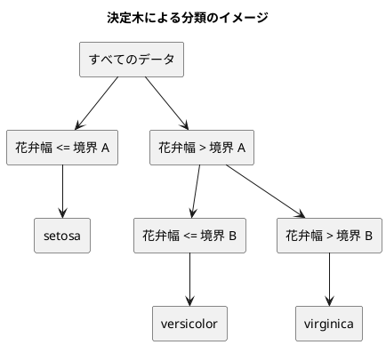

# 第 3 章: 決定木による分類と明白な実装

## 3.1 はじめに

第 1 章では「20 代ならきのこ派」というルールを人間が書き、第 2 章では欠損値を補完した特徴量を用意しました。この章では、「どの特徴量のどこで区切るか」をデータから自動で探すアルゴリズム、**決定木** を自作します。

ほかの言語版は、ここで自作したあとに機械学習ライブラリの決定木と突き合わせます。Java 版・Scala 版・Clojure 版は Tribuo の CART と、Python 版は scikit-learn と、PHP 版は Rubix ML と。**Haskell 版には、突き合わせる相手がいません。**

**Haskell に scikit-learn にあたるものはありません。** `hlearn` は保守が止まっており、現在の GHC ではビルドできません（[ADR 014](../../../adr/014-haskell-ml-libraries.md)）。Haskell 版で突き合わせられるのは線形代数の層（第 7・12・13 章の hmatrix）だけで、決定木・ランダムフォレスト・K-means はすべて自作のままです。これは [Elixir 版](../elixir/index.md)（Scholar に決定木が無い）よりさらに狭い範囲です。

結果として、**この章で作る木がそのまま最終実装になります**。第 8 章でも第 10 章でも、決定木が要る場面ではここで書いたコードを呼びます。「ライブラリが育っていない領域では、自作がそのまま本番の実装になる」——この章はその実例です。

そして、突き合わせる相手がいないぶん、**数値の正しさは自分で保証しなければなりません**。第 2 章で乱数をそろえたおかげで、Java 版・Elixir 版・PHP 版の記事に載っている正解率と木の境界が、そのまま期待値として使えます。ライブラリの代わりに、**ほかの言語版の記事が突き合わせの相手になります**。

Haskell 版では、次の 3 点に注目してください。

- 木を **代数的データ型** で表す。`data Tree = Leaf Text | Branch Split Tree Tree` と書けば、「木は葉か節のどちらかである」ことが型に書かれ、**場合分けの漏れをコンパイラが止めます**。Elixir 版がマップの鍵で見分けて網羅性を諦めたところ、PHP 版が共用型 `Leaf|Node` で表したところが、Haskell では `data` 1 つで済みます
- **失敗が再帰の奥から型で伝わる**。分割も学習も予測も `Either String` を返し、`do` 記法・`<$>`・`<*>`・`traverse` で連なります。例外を投げる Elixir 版・PHP 版とは正反対です
- **同点のときにどちらを選ぶかで、標準の関数が食い違う**。`minimumBy` と `sortOn` は先を残すのに、`maximumBy` は **後ろ** を返します。Clojure 版が `max-key` で踏んだのと同じ穴が、Haskell にも別の形で開いています

## 3.2 決定木の仕組み

### データを 2 つに分けることを繰り返す

決定木は、データを「ある特徴量がある値以下か、より大きいか」で 2 つに分けることを繰り返します。分けた先で同じラベルばかりになったら、そこで分けるのをやめて、そのラベルを予測に使います。



### どこで分けるかをジニ不純度で決める

「よい分け方」とは、分けた後のそれぞれのグループで、ラベルがなるべく 1 種類にそろう分け方です。そろい具合を数値にしたものが **ジニ不純度** です。

ジニ不純度 = 1 − Σ（各ラベルの割合）²

| グループのラベル | 割合 | ジニ不純度 |
|----------------|------|-----------|
| setosa ×3 | setosa 1.0 | 1 − 1.0² = 0 |
| setosa ×1、virginica ×1 | 0.5、0.5 | 1 − (0.5² + 0.5²) = 0.5 |
| 3 品種 ×1 ずつ | 1/3 ずつ | 1 − 3 × (1/3)² = 2/3 |

ラベルが 1 種類にそろうと 0、混ざるほど大きくなります。分け方の候補ごとに、分けた後の左右のジニ不純度を件数で重み付けして平均し、最も小さくなる分け方を選びます。

## 3.3 TODO リストの作成

**TODO リスト**:

- [ ] ジニ不純度を計算する
- [ ] いちばん多いラベルを返す
  - [ ] 同数なら先に現れたラベルを返す
- [ ] 最良の分割を探す
  - [ ] ラベルを完全に分けられる境界を見つける
  - [ ] 複数の特徴量から最良の特徴量と境界を選ぶ
  - [ ] ラベルが 1 種類なら分割しない
- [ ] 決定木を学習して予測する
- [ ] 木の深さを制限する
- [ ] 学習した木を読める形で表示する
- [ ] 実データで深さと正解率の関係を表示する

ほかの言語版の TODO リストにあった「ライブラリの決定木と突き合わせる」が、Haskell 版にはありません。**代わりに、実データの正解率を Java 版・Elixir 版・PHP 版の記事の数値と突き合わせます。**

## 3.4 ジニ不純度を計算する

### 仮実装から始める

ラベルが 1 種類ならジニ不純度は 0 です。

```haskell
it "ラベルが一種類なら零になる" $
  gini ["a", "a", "a"] `shouldBe` 0.0
```

`gini` がまだ無いので、テストは**実行される前に**落ちます。**Red がコンパイルエラーとして出る**のが、Python 版・Ruby 版・Elixir 版との違いです。

```text
error: [GHC-88464]
    Variable not in scope: gini :: [Text] -> a0
```

仮実装で `0.0` を返して Green にします。

### 三角測量

2 種類が半分ずつ、空のリスト、3 種類が均等、の 3 本を足します。

```haskell
it "二種類が半々なら零点五になる" $
  gini ["a", "a", "b", "b"] `shouldBe` 0.5

it "空なら零になる" $
  gini [] `shouldBe` 0.0

it "三種類が均等なら三分の二になる" $
  abs (gini ["a", "b", "c"] - 2 / 3) < 1e-12 `shouldBe` True
```

**最初の 3 本は `shouldBe` で厳密に比べ、最後の 1 本だけ差で比べています。** `0.5` も `0.0` も 2 進数で正確に表せますが、`2/3` は表せません。**期待値が正確に表せるかどうかで使い分ける**という第 2 章の方針をそのまま続けています。

「空なら 0」は、後で `bestSplit` から空のグループが渡りうるので置いています。ゼロ除算で `NaN` になるのを避けるためです。

### Green: 明白な実装

```haskell
-- | ジニ不純度。ラベルが 1 種類なら 0 で、種類が多く均等なほど大きい。
gini :: [Text] -> Double
gini [] = 0.0
gini labels = 1.0 - sum [ratio n * ratio n | n <- M.elems (countLabels labels)]
 where
  total = fromIntegral (length labels) :: Double
  ratio n = fromIntegral n / total
```

`ratio n * ratio n` と 2 回書いているのは、`**` が `Floating` の演算子で、整数の 2 乗には重いからです。`^ (2 :: Int)` とも書けますが、指数の型を注釈しないと**曖昧な型**としてコンパイルが止まります（`-Wtype-defaults` が `-Werror` で効きます）。掛け算 1 つのほうが読みやすく、注釈も要りません。

空のリストを別の等式で書いているのは、`total` が 0 になってゼロ除算を起こすからです。**場合分けが等式の左側に出る**ので、`if` を書かずに済みます。

`countLabels` はラベルごとの件数を数える補助関数です。

```haskell
countLabels :: [Text] -> M.Map Text Int
countLabels = foldl' (\counts label -> M.insertWith (+) label 1 counts) M.empty
```

## 3.5 いちばん多いラベルを返す

分けるのをやめたとき、そのグループのいちばん多いラベルを予測に使います。同数なら先に現れたほうを選ぶ、と決めます。**この約束が、ほかの言語版と同じ木を得るための条件です。**

```haskell
it "多数派のラベルを返す" $
  majority ["a", "b", "a"] `shouldBe` Right "a"

it "同数なら先に現れたほうを返す" $
  majority ["b", "a", "a", "b"] `shouldBe` Right "b"

it "ラベルが無ければ求められない" $
  majority [] `shouldBe` Left "正解ラベルがありません"
```

### `maximumBy` は同値なら後ろを返す

素直に書くなら `maximumBy (comparing count)` です。しかし **`Data.List.maximumBy` は、同値のとき後ろのものを返します**。定義が「今より小さくなければ新しいほうを採る」畳み込みだからです。`["b", "a", "a", "b"]` は `a` も `b` も 2 個なので、`b` ではなく `a` が返ってしまいます。

これは Clojure 版が `max-key`（同値なら後ろ）で踏んだ穴と同じものです。Elixir の `Enum.max_by/2` は同値なら先を返すと文書で保証されているので、Elixir 版はここで何もしなくて済みました。**「同点のときどちらを返すか」は言語ごとに違い、文書を読むか試すまで分かりません。**

さらに紛らわしいことに、**`minimumBy` は同値なら先を返します**（「今より大きければ入れ替える」なので、等しければ入れ替えない）。同じモジュールの対になる関数で振る舞いが逆です。3.6 節ではこちらをそのまま使えます。

### Green: たどる順を自分で決める

```haskell
majority :: [Text] -> Either String Text
majority labels =
  case nub labels of
    [] -> Left "正解ラベルがありません"
    -- head は -Wx-partial が止めるので、空かどうかをパターンで分ける。
    (first : rest) -> Right (foldl' pick first rest)
 where
  counts = countLabels labels
  count label = M.findWithDefault 0 label counts
  pick best candidate
    | count candidate > count best = candidate
    | otherwise = best
```

`nub` が最初に現れた順で重複を落とし、`pick` が「**今より多いときだけ**入れ替える」ので、同数なら先が残ります。`>` を `>=` にすると Clojure 版・`maximumBy` と同じ振る舞いになり、木の形が変わります。**比較演算子 1 文字が仕様です。**

### `head` はコンパイルエラーになる

最初は `foldl' pick (head ordered) (drop 1 ordered)` と書きました。GHC 9.10 はこれをエラーにします。

```text
error: [GHC-63394] [-Wx-partial, -Werror=x-partial]
    In the use of ‘head’ ...
    "This is a partial function, it throws an error on empty lists."
```

**`head` と `tail` は警告の対象になりました**（GHC 9.8 以降の `-Wx-partial`）。このプロジェクトは `-Wall -Werror` なのでエラーです。直し方は「空かどうかをパターンで分ける」ことで、`case nub labels of [] -> ...; (first : rest) -> ...` がまさにそれです。**空のときに何を返すかを書かされ、その結果 `Left "正解ラベルがありません"` が自然に出てきました。** 部分関数を禁じられたことが、そのままエラー処理の設計になっています。

同じ穴は 3.6 節の `zip vs (tail vs)` にもあり、そちらは `zip vs (drop 1 vs)` にしました。`drop 1` は空のリストでも空を返す全域関数です。

## 3.6 最良の分割を探す

### 分割を型にする

分割は「どの列を、どこで切り、その結果の不純度はいくつか」の 3 つ組です。

```haskell
data Split = Split
  { splitFeature :: Text
  , splitThreshold :: Double
  , splitImpurity :: Double
  }
  deriving (Eq, Show)
```

`deriving (Eq, Show)` を書くと、**テストで `shouldBe` に分割をそのまま渡せます**。期待値を組み立てて 1 行で比べられ、失敗したときは中身が表示されます。Elixir 版がマップを、PHP 版がクラスを使ったところと結果は似ていますが、**比較と表示の実装を書かずに手に入る**のが違いです。

### テスト

```haskell
it "ラベルを完全に分けられる境界を見つける" $ do
  let x = map (feature "花弁幅") [0.1, 0.2, 0.8, 0.9]
      t = ["setosa", "setosa", "virginica", "virginica"]
  bestSplit x t ["花弁幅"]
    `shouldBe` Right (Just (Split "花弁幅" 0.5 0.0))
```

**戻り値が `Either String (Maybe Split)` です。** 二重になっているのは、2 種類の「値が無い」を区別しているからです。

- `Left` — **失敗**。指定された列が特徴量に無い
- `Right Nothing` — **失敗ではない**。ラベルが 1 種類、あるいは値がすべて同じで、分けるところが無い

Elixir 版・PHP 版は後者を `nil`／`null` で表し、前者は例外にしました。**Haskell は 2 つとも戻り値の型に書きます。** 呼ぶ側は `do` 記法で `Left` を素通りさせ、`Nothing` だけを `case` で見ます。

境界のテストも足しておきます。

```haskell
it "ラベルが一種類なら分割しない" $ do
  let x = map (feature "幅") [0.1, 0.2]
  bestSplit x ["a", "a"] ["幅"] `shouldBe` Right Nothing

it "値がすべて同じなら分割しない" $ do
  let x = map (feature "幅") [0.5, 0.5]
  bestSplit x ["a", "b"] ["幅"] `shouldBe` Right Nothing

it "同じ不純度なら列の順で前の分割を選ぶ" $ do
  let x =
        [ M.fromList [("左", 0.1), ("右", 0.1)]
        , M.fromList [("左", 0.9), ("右", 0.9)]
        ]
      t = ["a", "b"]
  fmap (fmap splitFeature) (bestSplit x t ["左", "右"]) `shouldBe` Right (Just "左")
  fmap (fmap splitFeature) (bestSplit x t ["右", "左"]) `shouldBe` Right (Just "右")
```

最後の 1 本が仕様の固定です。**どちらの列でも同じように分けられる**架空のデータを作り、列の順を入れ替えると選ばれる列も入れ替わることを確かめています。`fmap (fmap ...)` の二重は、`Either` の中の `Maybe` の中を触るためです。

### Green: 候補を列挙して選ぶ

```haskell
candidates :: [Features] -> [Text] -> Text -> Either String [Split]
candidates x t feature = do
  values <- traverse (`featureValue` feature) x
  let sorted = sortOn fst (zip values t)
      sortedValues = map fst sorted
      labels = map snd sorted
  pure
    [ Split feature ((before + after) / 2.0) (weightedGini (take i labels) (drop i labels))
    | (i, before, after) <- zip3 [1 ..] sortedValues (drop 1 sortedValues)
    , before /= after
    ]
```

`zip3 [1 ..] sortedValues (drop 1 sortedValues)` が、隣り合う値の組とその位置をまとめて作ります。**`[1 ..]` は無限リストです。** `zip3` が短いほうで止まるので、長さを数えて範囲を作る必要がありません。遅延評価があるおかげで「無限に続く添字」を書いても、実際に作られるのは必要な個数だけです。

`sortOn` は **安定** です（`Data.List` の文書が保証しています）。同じ値の並びが元の順のまま残るので、同点の扱いが Elixir 版の `Enum.sort_by`・PHP 8 の `usort` と一致します。

選ぶところはこうです。

```haskell
bestSplit :: [Features] -> [Text] -> [Text] -> Either String (Maybe Split)
bestSplit [] _ _ = Right Nothing
bestSplit x t columns
  | gini t == 0.0 = Right Nothing
  | otherwise = do
      found <- concat <$> traverse (candidates x t) columns
      pure $ case found of
        [] -> Nothing
        -- minimumBy は同値なら先のものを返すので、列の順がそのまま優先順になる。
        _ -> Just (minimumBy (comparing splitImpurity) found)
```

`traverse (candidates x t) columns` が効いています。`candidates` は `Either String [Split]` を返すので、そのまま `map` すると `[Either String [Split]]` になります。`traverse` は**それを裏返して** `Either String [[Split]]` にし、**どれか 1 つでも失敗したら全体を `Left` に**します。列が 1 つでも見つからなければ、そこで探索は止まります。第 1 章で CSV の行を人物に変換したときと同じ形が、ここでも出てきました。

`gini t == 0.0` の判定が先にあるので、**ラベルが 1 種類のときは候補を 1 つも作りません**。遅延評価のおかげで `|` のガードが順に試され、`otherwise` に落ちなければ `candidates` は評価されません。

### 遅延評価は候補の列を流す

候補の数は決して少なくありません。実データの訓練データは 105 件・4 列なので、1 回の `bestSplit` でおよそ 400 個の `Split` が作られます。それが木の節の数だけ繰り返されます。

**遅延評価は、この列を「作ってから選ぶ」ではなく「作りながら選ぶ」に変えます。** `minimumBy` はリストを先頭から畳み込むので、`concat` が繋いだリストは消費された先から回収されます。`Split` の 3 つのフィールドも、比較に使う `splitImpurity` だけが必要に応じて計算されます。

ただし、**遅延評価は万能ではありません**。`splitImpurity` は結局すべて比較されるので、全部計算されます。ここで効いているのは「同時に全部をメモリに置かなくてよい」ことであって、「計算しなくて済む」ことではありません。遅延評価が計算そのものを省いてくれるのは、`gini t == 0.0` で早く返るときのように、**値が使われない**場合だけです。

### 期待値は 2.5 だが、実データの境界は 0.2950

境界は「隣り合う値の中点」です。テストの `[0.1, 0.2, 0.8, 0.9]` なら 0.2 と 0.8 の中点で 0.5 になります。実データでは 0.2950 という半端な値が出ますが、これは iris.csv の値が 0〜1 に収まる形で配布されているためで、生の測定値（センチメートル）ではありません。

## 3.7 決定木を学習して予測する

### 木を代数的データ型で表す

```haskell
data Tree
  = Leaf Text
  | Branch Split Tree Tree
  deriving (Eq, Show)
```

**この 3 行が、この章でいちばん Haskell らしいところです。**

「木は葉か節のどちらかである」「葉はラベルを持つ」「節は分割と左右の部分木を持つ」が、そのまま型に書いてあります。そして **`Tree` を受け取る関数で場合分けを 1 つ忘れると、コンパイルが止まります**。

```text
error: [GHC-62161] [-Wincomplete-patterns, Werror=incomplete-patterns]
    Pattern match(es) are non-exhaustive
    In an equation for ‘predictOne’:
        Patterns of type ‘Tree’, ‘Features’ not matched: (Branch _ _ _) _
```

ほかの言語版と並べると違いが見えます。

| 言語版 | 木の表し方 | 場合分けの漏れはいつ分かるか |
|--------|-----------|------------------------|
| Haskell 版 | `data Tree = Leaf ... \| Branch ...` | **コンパイル時**（`-Werror=incomplete-patterns`） |
| PHP 版 | 共用型 `Leaf\|Node` | 静的解析（PHPStan）を走らせたとき |
| Elixir 版 | マップ（鍵があるかで見分ける） | 実行時（`FunctionClauseError`） |
| Clojure 版 | マップ（`leaf?` で分岐） | 実行時 |

**同じ構造を、同じように書いているのに、間違いが見つかる時点が 3 段階ちがいます。** 型を書く手間と、間違いが見つかる早さは釣り合っています。

`deriving (Eq, Show)` の効きめもここで出ます。テストが木を丸ごと比べられます。

```haskell
it "分けられなければ葉になる" $
  fit (map (feature "幅") [0.1, 0.2]) ["a", "a"] ["幅"] Nothing
    `shouldBe` Right (Leaf "a")
```

### 学習

```haskell
fit :: [Features] -> [Text] -> [Text] -> Maybe Int -> Either String Tree
fit x t columns maxDepth
  | length x /= length t =
      Left (printf "特徴量と正解ラベルの件数が違います: %d と %d" (length x) (length t))
  | otherwise = build x t maxDepth
 where
  build xs ts depth = do
    split <- if depth == Just 0 then Right Nothing else bestSplit xs ts columns
    case split of
      Nothing -> Leaf <$> majority ts
      Just s -> do
        sides <- traverse (side s) (zip xs ts)
        let next = subtract 1 <$> depth
            left = [pair | (goesLeft, pair) <- sides, goesLeft]
            right = [pair | (goesLeft, pair) <- sides, not goesLeft]
        Branch s
          <$> build (map fst left) (map snd left) next
          <*> build (map fst right) (map snd right) next
```

**入口の検査と再帰を分けています。** 件数の一致は最初の 1 回だけ確かめればよく、再帰の中で毎回確かめる必要はありません。`fit` がガードで検査し、`build` が再帰します。

**深さの上限を `Maybe Int` で表しています。** `Nothing` が「上限なし」で、`Just 0` で分割をやめます。減らすのは `subtract 1 <$> depth` で、`Nothing` はそのまま `Nothing` になります。**「上限なしのときは減らさない」という場合分けを書かなくて済みます。** Elixir 版は `if max_depth, do: max_depth - 1` と書き、PHP 版は `$maxDepth === null ? null : $maxDepth - 1` と書きました。`<$>` がその `if` を引き受けています。

`Branch s <$> build ... <*> build ...` が、左右の部分木を作ります。**どちらかの再帰が `Left` を返せば、全体が `Left` になります。** 第 1 章で CSV の 1 行を人物にしたときと同じ形が、木の再帰にも同じように効きます。「失敗するかもしれない計算を組み立てる」書き方は、対象が行でも木でも変わりません。

`side` が 1 件ずつ「左へ行くか」を判定します。ここも列が無ければ `Left` です。

```haskell
side s (features, label) = do
  value <- featureValue features (splitFeature s)
  pure (value <= splitThreshold s, (features, label))
```

**判定を先にまとめてから振り分けています。** `partition` を使えば 1 手ですが、`partition` の述語は `Bool` を返す純粋な関数で、`Either` を返せません。**失敗しうる判定で振り分ける標準の関数が無い**ので、`traverse` で判定だけ済ませてから、リスト内包表記で 2 つに分けています。Elixir 版の `Enum.split_with/2` が 1 行だったところが 3 行になりました。**失敗を型で扱う代償が出た数少ない場所です。**

### 予測

```haskell
predictOne :: Tree -> Features -> Either String Text
predictOne (Leaf label) _ = Right label
predictOne (Branch s left right) features = do
  value <- featureValue features (splitFeature s)
  predictOne (if value <= splitThreshold s then left else right) features

predict :: Tree -> [Features] -> Either String [Text]
predict tree = traverse (predictOne tree)
```

**再帰的なデータ構造を、再帰的な関数でたどっています。** 2 つの等式が `Tree` の 2 つの構築子にそのまま対応します。パターンで `Branch s left right` と書くと、**判定と取り出しが同時に起きます**。PHP 版が `$tree instanceof Leaf` で判定してからフィールドを読んだところが、1 行になっています。

`predict` は `traverse` 1 つです。1 件でも予測できなければ全体が `Left` になります。**点を線にする関数がすでに標準にある**ので、書くことがありません。

境界の値がどちらへ行くかもテストで固定します。

```haskell
it "境界の値は左へ進む" $ do
  let tree = Branch (Split "幅" 0.5 0.0) (Leaf "左") (Leaf "右")
  predictOne tree (feature "幅" 0.5) `shouldBe` Right "左"
  predictOne tree (feature "幅" 0.5000001) `shouldBe` Right "右"
```

`<=` か `<` かで結果が変わるので、テストに書いておきます。木を直接組み立てられるのも `data` で表した御利益です。

### 深さの制限

```haskell
it "深さを制限すると分割の回数が減る" $ do
  let x = map (feature "幅") [0.1, 0.4, 0.6, 0.9]
      t = ["a", "b", "c", "d"]
      shallow = expectRight $ fit x t ["幅"] (Just 1)
      deep = expectRight $ fit x t ["幅"] Nothing
  depth shallow `shouldBe` 1
  depth deep `shouldBe` 3
```

テスト側に `depth` を書いています。

```haskell
depth :: Tree -> Int
depth (Leaf _) = 0
depth (Branch _ left right) = 1 + max (depth left) (depth right)
```

**3 行で書けるのは、木がただのデータだからです。** 本体に「深さを測る」機能を足さなくても、テストが自分で測れます。

## 3.8 学習した木を表示する

```haskell
formatTree :: Tree -> String
formatTree = go ""
 where
  go indent (Leaf label) = indent <> T.unpack label <> "\n"
  go indent (Branch s left right) =
    printf "%s%s <= %s\n" indent feature border
      <> go (indent <> "  ") left
      <> printf "%s%s > %s\n" indent feature border
      <> go (indent <> "  ") right
   where
    feature = T.unpack (splitFeature s)
    -- printf はロケールに依らないので、小数点は常に「.」になる。
    border = printf "%.4f" (splitThreshold s) :: String
```

`border = printf "%.4f" ... :: String` の型注釈が要ります。**`Text.Printf.printf` の戻り値は型クラスで多相** で、`String` にも `IO ()` にもなれます。どちらか決まらないと曖昧な型としてコンパイルが止まるので、ここで `String` と書いています。使う側が型を決める、という Haskell らしい設計ですが、**書くたびに注釈が要る**面倒さもついてきます。

肝心なのは、**`printf` がロケールに依らないこと**です。小数点は常に `.` になり、ドイツ語圏の環境で `,` になることはありません。Clojure 版の `clojure.core/format` がロケール依存で既知の制限になっているのと対照的です。

`go` を `where` に置いて字下げを持ち回っているのは、公開する `formatTree` の引数を 1 つに保つためです。Elixir 版は既定引数（`indent \\ ""`）で同じことをしました。**Haskell に既定引数が無いので、内側の関数に押し込みます。**

## 3.9 実データで深さと正解率を表示する

### 突き合わせる相手がいない

ここでほかの言語版なら、ライブラリの決定木と予測を突き合わせます。**Haskell には決定木のライブラリが無いので、できません。**

代わりに、**ほかの言語版の記事に載っている数値を期待値にします。** 第 2 章で乱数をそろえたので、訓練データに入る 105 行は Java 版・Elixir 版・PHP 版と同じです。同じデータに同じアルゴリズムを当てれば、同じ正解率と同じ境界が出るはずです。出なければ、どちらかの実装が間違っています。

```haskell
it "深さごとの正解率がほかの言語版と一致する" $ do
  contents <- irisOrSkip
  let split = expectRight $ C2.prepareIris contents 0.3 0
      score maxDepth = do
        tree <- fit (C2.xTrain split) (C2.tTrain split) featureColumns maxDepth
        train <- scoreTree tree (C2.xTrain split) (C2.tTrain split)
        test <- scoreTree tree (C2.xTest split) (C2.tTest split)
        pure (round4 train, round4 test)
  traverse score [Just 1, Just 2, Just 3, Just 4, Just 5, Nothing]
    `shouldBe` Right
      [ (0.6762, 0.6444)
      , (0.9333, 0.9556)
      , (0.9524, 0.9556)
      , (0.9619, 0.9556)
      , (0.9810, 0.9333)
      , (1.0000, 0.9333)
      ]
```

**表を丸ごと 1 本のテストで固定しています。** `traverse` が「深さごとに計算して、1 つでも失敗したら `Left`」をまとめ、期待値はリテラルのリストです。深さ 2 のテストデータの正解率 `0.9556` は、Java 版・Elixir 版・PHP 版の記事と同じ値です。

`round4` は小数点以下 4 桁に丸める補助関数で、記事の表と同じ桁で比べるために置いています。

実データが無い環境ではテストを飛ばします。

```haskell
irisOrSkip :: IO BL.ByteString
irisOrSkip = do
  found <- Dataset.exists "iris.csv"
  unless found $ pendingWith "学習データがありません"
  file <- Dataset.path "iris.csv"
  BL.readFile file
```

### 第 1 章の `accuracy` を型クラスで広げる

正解率は第 1 章で書きました。そのまま呼ぼうとして、コンパイルが止まりました。

```text
error: [GHC-83865]
    • Couldn't match type ‘GettingStartedMl.Chapter01.Faction’ with ‘Text’
```

第 1 章の `accuracy` は `[Faction] -> [Faction] -> Either String Double` です。**きのこ派・たけのこ派にしか使えません。** この章のラベルはアヤメの品種（`Text`）なので、型が合いません。

Elixir 版・PHP 版は第 1 章のものをそのまま呼べました。型を宣言していないからです。**Haskell では、抽象を書いたぶんだけしか再利用できません。**

ここで選択肢が 2 つあります。この章に「アヤメ用の正解率」を新しく書くか、**第 1 章の定義そのものを広げる**かです。中身は 1 行も変わらないので、後者にしました。必要なのは「同じかどうかを比べられる」ことだけです。

```haskell
accuracy :: (Eq a) => [a] -> [a] -> Either String Double
accuracy predictions labels
  | length predictions /= length labels =
      Left (printf "予測と正解ラベルの件数が違います: %d と %d" (length predictions) (length labels))
  | null labels = Left "正解ラベルがありません"
  | otherwise = Right (fromIntegral hits / fromIntegral (length labels))
 where
  hits = length (filter id (zipWith (==) predictions labels))
```

`(Eq a) =>` が「`a` が何であれ、等しいかを比べられさえすればよい」という約束です。**変わったのは型だけ**で、本体は 1 文字も変えていません。この章では `import GettingStartedMl.Chapter01 (accuracy)` と書いて、そのまま使います。

**同じ意味のものを 2 つ書かずに済んだ**のが大事なところです。型が合わないときに「この章用のものを新しく書く」と、同じ計算が 2 か所に増えます。型クラスで広げれば 1 つで足ります。型が邪魔をしたように見えて、実は**どこを抽象すべきかを教えてくれた**ことになります。

これが Haskell 版の型クラスの最初の実例になります。Rust 版のトレイト・Scala 版の型クラス・PHP 版の interface・Elixir 版の behaviour と同じ「約束」を、関数 1 つの水準で書いた形です。第 10 章ではモデルそのものを型クラスで抽象します。

**型がついていることの費用と便益が、同じ場所で見えました。** 第 1 章の `accuracy` は派閥しか受け取らないので、アヤメの品種を渡す間違いをコンパイラが止めます。同時に、正しい使い方まで止めてしまいます。型を広げる（`Eq a` にする）と両方が通りますが、広げすぎれば止めてくれなくなります。**どこまで抽象するかは設計の判断**で、型が自動で決めてくれるわけではありません。

### 列の順を定数として持つ

```haskell
featureColumns :: [Text]
featureColumns = ["がく片長さ", "がく片幅", "花弁長さ", "花弁幅"]
```

**列の順を、リテラルのリストとして持っています。** 第 2 章で見たとおり `Map` はキーの順で並ぶので、特徴量のマップから鍵を取り出すと CSV の順とは違う並びになります。分割の選び方が「同じ不純度なら列の順で前」である以上、**列の順は結果を左右する仕様**であって、たまたまの副産物にしてはいけません。

### 深さごとの正解率を表示する

```haskell
report :: BL.ByteString -> Either String String
report contents = do
  split <- C2.prepareIris contents 0.3 0
  rows <- traverse (accuracyRow split) maxDepths
  tree <- fit (C2.xTrain split) (C2.tTrain split) featureColumns (Just 2)
  pure $
    "深さ\t訓練データ\tテストデータ\n"
      <> concat rows
      <> "\n深さ 2 の決定木:\n"
      <> formatTree tree

accuracyRow :: C2.Split Features -> Maybe Int -> Either String String
accuracyRow split maxDepth = do
  tree <- fit (C2.xTrain split) (C2.tTrain split) featureColumns maxDepth
  train <- scoreTree tree (C2.xTrain split) (C2.tTrain split)
  test <- scoreTree tree (C2.xTest split) (C2.tTest split)
  pure (printf "%s\t%.4f\t%.4f\n" (maybe "制限なし" show maxDepth) train test)
```

第 1 章・第 2 章と同じく、**ファイルを読む `run` と、文字列を組み立てる `report` を分けています。** `report` は純粋関数なので、テストが出力を丸ごと確かめられます。

`maybe "制限なし" show maxDepth` が、`Nothing` を「制限なし」に、`Just 2` を `"2"` に変えます。Elixir 版の `max_depth || "制限なし"` と同じ働きですが、**`Nothing` の場合を必ず書かされる**のが違いです。第 2 章で見たとおり、`Maybe` は「無いかもしれない」ことを忘れさせません。

実行します。

```text
$ cabal repl -v0 <<< "GettingStartedMl.Chapter03.run >>= either putStrLn putStr"
深さ	訓練データ	テストデータ
1	0.6762	0.6444
2	0.9333	0.9556
3	0.9524	0.9556
4	0.9619	0.9556
5	0.9810	0.9333
制限なし	1.0000	0.9333

深さ 2 の決定木:
花弁幅 <= 0.2950
  Iris-setosa
花弁幅 > 0.2950
  花弁幅 <= 0.6500
    Iris-versicolor
  花弁幅 > 0.6500
    Iris-virginica
```

**この表は Java 版・Scala 版・Clojure 版・Elixir 版・PHP 版とまったく同じ数値です。** 深さ 2 の木の境界（0.2950・0.6500）まで一致しました。

ライブラリの決定木と突き合わせられなくても、**ほかの言語版の自作の決定木と突き合わせられました**。第 2 章で乱数をそろえた効果が、章をまたいで確かめられたことになります。突き合わせの相手がライブラリでなくなっただけで、**「別々に書かれた実装が同じ数値を出す」という保証の形は変わりません**。

表そのものも読みどころです。

- **深さ 1 では 0.6444** — 1 回しか分けられないので、3 品種を 2 つにしか分けられません
- **深さ 2 で 0.9556** — 花弁幅だけを 2 回使って、3 品種をほぼ分け切っています
- **訓練データの正解率は深さとともに上がり続け、制限なしで 1.0000** — 訓練データを完全に覚えました
- **テストデータの正解率は深さ 5 から下がる（0.9556 → 0.9333）** — これが **過学習** です。訓練データに合わせすぎて、見ていないデータに弱くなりました

「訓練データで 100% 当たる」ことが良いことではない、というのがこの表の教えです。第 1 章で「学習に使ったデータで性能を測ってはいけない」と書いた理由が、数字として出ています。

木の中身も読めます。**花弁幅だけで 3 品種がほぼ分かれています。** 0.2950 以下なら `Iris-setosa`、0.6500 より大きければ `Iris-virginica`。これは第 2 章の散布図で人が見つけられる傾向と同じで、**決定木はそれを自動で見つけた**ことになります。

テストを走らせます。

```text
$ npx gulp apps:check:haskell
28 examples, 0 failures
```

（この章の分だけの数です。）

### `fit` という名前は Hspec とぶつかる

テストを書いていて、こんなエラーが出ました。

```text
error: [GHC-87543]
    Ambiguous occurrence ‘fit’.
    It could refer to either ‘GettingStartedMl.Chapter03.fit’ ...
           or ‘Test.Hspec.fit’ ...
```

**Hspec にも `fit` があります。** こちらは「focused `it`」で、「この例だけを走らせる」印です。機械学習の `fit`（学習する）とは何の関係もありませんが、名前が同じです。

```haskell
-- Test.Hspec の fit は「この例だけを走らせる」印。名前が衝突するので隠す。
import Test.Hspec hiding (fit)
```

`hiding` で片方を隠して解決しました。**Haskell の import は既定ですべてを取り込む**ので、この手の衝突は避けられません。見返りは、**衝突が実行時ではなくコンパイル時に、どちらの名前かを示して報告される**ことです。動的な言語なら後から取り込んだほうが黙って勝ちます。

## 3.10 自作が最終実装になるということ

この章の決定木は、第 8 章・第 10 章でもそのまま使われます。ほかの言語版が「第 3 章で自作したものを、第 8 章以降はライブラリに置き換える」と進むところを、Haskell 版は**自作のまま進みます**。

これが良いことなのか悪いことなのかは、両面あります。

**悪い面**は素直です。ライブラリの決定木は、枝刈り・欠損値の扱い・カテゴリ変数の扱い・並列化など、この章では書かない工夫を積んでいます。実務で大きなデータを扱うなら、自作の木では足りません。Haskell で決定木が要る仕事をするなら、この現状は素直に不利です。

**良い面**は、この章を書いた側から見えます。ライブラリに置き換える前提だと、自作のコードは「ライブラリを理解するための踏み台」になりがちです。Haskell 版の決定木は捨てられません。**捨てられないコードは、捨てられるコードより丁寧に書かれます。** 同点のときの選び方を決めきったのも、境界の扱いをテストで固定したのも、「この先ずっとこれを使う」からです。

そして、**アルゴリズムが自分の手の内にあること**の値打ちがあります。第 2 章の乱数と同じです。ジニ不純度で分割を選ぶ決定木は、この章の 200 行ほどで全部です。境界の値がなぜ 0.2950 なのかを問われたら、`candidates` が中点を取っているところまで辿れます。

加えて Haskell では、**自作のコードを型が支えます**。木が `data` で表されている以上、場合分けを忘れた枝は残りません。ライブラリが無いことの埋め合わせを、型検査が一部引き受けています。

## 3.11 可視化について

Haskell 版には Notebook の節を設けません。深さと正解率の折れ線グラフは [Kotlin 版の第 3 章](../kotlin/03-decision-tree-and-obvious-implementation.md) の「Notebook で探索する」の節を、scikit-learn による木の図は [Python 版の第 3 章](../python/03-decision-tree-and-obvious-implementation.md) を参照してください。Haskell 版で深さと正解率の関係を見るには、3.9 節の表と `formatTree` の出力が同じ役割を果たします。

## 3.12 まとめ

この章では、決定木を自作しました。ライブラリと突き合わせる代わりに、ほかの言語版の数値と突き合わせました。Haskell に固有の論点は次のとおりです。

1. **決定木のライブラリが無いので、自作が最終実装になる** — ランダムフォレストもない。突き合わせられるのは線形代数の層だけで、Elixir 版よりさらに狭い（[ADR 014](../../../adr/014-haskell-ml-libraries.md)）。捨てられないコードは丁寧に書かれる、という別の値打ちがある
2. **木は代数的データ型で表す** — `data Tree = Leaf Text | Branch Split Tree Tree`。場合分けの漏れは **コンパイル時** に止まる（`-Werror=incomplete-patterns`）。PHP 版の共用型（静的解析で検出）・Elixir 版のマップ（実行時に検出）と、間違いが見つかる時点が 3 段階ちがう
3. **`deriving (Eq, Show)` でテストが木を丸ごと比べられる** — 比較と表示を書かずに手に入る。テスト側に 3 行の `depth` を書けるのも、木がただのデータだから
4. **`maximumBy` は同値なら後ろ、`minimumBy` は先** — 同じモジュールの対になる関数で振る舞いが逆。`majority` は畳み込みを自分で書き、`bestSplit` は `minimumBy` をそのまま使えた。`sortOn` は安定
5. **`head` はコンパイルエラーになる** — GHC 9.8 以降の `-Wx-partial`。空の場合を書かされた結果、`Left "正解ラベルがありません"` が自然に出てきた。**部分関数の禁止が、そのままエラー処理の設計になる**
6. **失敗が再帰の奥から型で伝わる** — `Either String (Maybe Split)` で「失敗」と「分けるところが無い」を型で区別する。`traverse` が「1 つでも失敗したら全体が失敗」を引き受け、`Branch s <$> build ... <*> build ...` が木の再帰でも同じ形になる
7. **失敗しうる判定で振り分ける標準の関数が無い** — `partition` の述語は `Either` を返せないので、`traverse` で判定してからリスト内包表記で 2 つに分けた。Elixir 版の `Enum.split_with/2` が 1 行だったところが 3 行に。**失敗を型で扱う代償**
8. **`Maybe Int` の深さは `<$>` で減らせる** — `subtract 1 <$> depth`。「上限なしなら減らさない」という場合分けを書かずに済む
9. **第 1 章の `accuracy` は再利用できなかった** — `[Faction] -> [Faction]` だったため。`(Eq a) => [a] -> [a]` に抽象して解決した。**型を宣言していない Elixir 版・PHP 版がそのまま呼べたところ**で、抽象を書く費用と便益が同時に見えた。Haskell 版の型クラスの最初の実例
10. **`printf` は戻り値の型を注釈しないと決まらない** — `String` にも `IO ()` にもなれる多相。代わりにロケールには依らないので、小数点は常に `.`
11. **`fit` は `Test.Hspec.fit` とぶつかる** — Hspec の `fit` は「この例だけを走らせる」印。`import Test.Hspec hiding (fit)` で解決。衝突がコンパイル時に、名前を示して報告される
12. **Java 版・Elixir 版・PHP 版と完全に一致した** — 深さごとの正解率も、深さ 2 の木の境界（0.2950・0.6500）も同じ。ライブラリと突き合わせられなくても、**別々に書かれた実装が同じ数値を出す**という保証の形は変わらない

**TODO リスト（この章の完了時点）**:

- [x] ジニ不純度を計算する
- [x] いちばん多いラベルを返す
- [x] 最良の分割を探す
- [x] 決定木を学習して予測する
- [x] 木の深さを制限する
- [x] 学習した木を読める形で表示する
- [x] 実データで深さと正解率の関係を表示する

深さ 2 の決定木のテストデータの正解率は 0.9556 で、テストデータの正解率は深さ 5 から下がり始めました。次の章では、ここまでのコードとデータをどう管理するか（バージョン管理とデータ管理）を扱います。

Haskell 版のほかの章は [Haskell 版のトップ](index.md) から辿れます。
