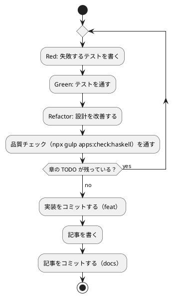

# 第 4 章: バージョン管理とデータ管理

## 4.1 はじめに

第 1 部では、TDD でデータを読み込み、前処理し、決定木で分類するプログラムを Haskell で作りました。第 2 部では、そのプログラムを「変更を楽に安全にできる」状態に保つための道具立てを、バージョン管理（第 4 章）、パッケージ管理と静的解析（第 5 章）、タスクランナーと CI/CD（第 6 章）の順に整えます。

この章ではバージョン管理を扱います。機械学習のプロジェクトでは、コードに加えて **学習データ** と **学習済みモデル** というファイルが登場します。これらをコードと同じようにコミットしてよいとは限りません。この章では、Git で何を管理し、何を管理しないか、そして実験の結果を再現できるようにするには何を固定すればよいかを学びます。

Git の使い方は言語に依存しないので、[Python 版の第 4 章](../python/04-version-control-and-data-management.md)・[PHP 版の第 4 章](../php/04-version-control-and-data-management.md) と同じ構成で進めます。Haskell 版で注目するのは次の 3 点です。

- **cabal と HPC が作るファイル** を除外する。`dist-newstyle/` が、Node の `node_modules/`・PHP の `vendor/`・Elixir の `_build/` に当たります。加えてカバレッジの計測が撒く `*.tix` と `.hpc/` が増えます
- **改行を守る道具の守備範囲が狭い**。fourmolu は CRLF を終了コード **100** で指摘しますが、見るのは `src` と `test` の `.hs` だけです。`*.cabal`・`fourmolu.yaml`・`.hlint.yaml`・シェルスクリプト・CI の YAML はすべて外にあります
- **スキップの仕組みが一段しかない**。Hspec には PHP の `#[Group('data')]` に当たるグループ分けの仕組みが標準では無く、**実行時に `pendingWith` で外す**一手です。そのかわり、外したことがカバレッジの数字にはっきり出ます

## 4.2 コミットメッセージの重要性

コミット履歴は「なぜこの変更をしたのか」の記録です。機械学習のプロジェクトでは、「前処理を変えたら正解率が変わった」「ライブラリと予測が一致しない原因をテストに残した」といった変化の理由を、あとから追跡できることが特に重要になります。

コミットは次の 2 つを守ると追いやすくなります。

- **1 コミット 1 目的** — 機能追加と設定変更、実装と記事を 1 つのコミットに混ぜない
- **なぜを書く** — 何をしたかは差分を見れば分かります。差分に残らないのは「なぜそうしたか」です

Haskell 版では、コードに残らない判断がいくつもありました。「機械学習のライブラリが無いのでアルゴリズムはすべて自作する」「線形代数だけは hmatrix と突き合わせるために `openblas` を環境に足す」「`System.Random` ではなく `java.util.Random` と同じ線形合同法を自作する」。これらは [ADR 014](../../../adr/014-haskell-ml-libraries.md) にまとめ、実装より先にコミットしています。**決定を記録してから、その決定に従うコードを書く**という順番です。

## 4.3 Conventional Commits

### フォーマット

```text
<type>(<scope>): <subject>

<body>

<footer>
```

- **type** — 変更の種類（`feat`・`fix`・`docs`・`refactor`・`test`・`build`・`ci`・`chore`）
- **scope** — 変更の対象（`haskell`・`getting-start-ml` など）
- **subject** — 何をしたかを一行で

### コミットタイプ

| type | 使う場面 | Haskell 版での例 |
|------|---------|----------------|
| `feat` | 機能の追加 | 章の実装を足す |
| `fix` | 不具合の修正 | `readInt` が `"170cm"` を通していたのを直す |
| `docs` | ドキュメント | 記事を書く、ADR を足す |
| `refactor` | 振る舞いを変えない改善 | 重複した関数をまとめる |
| `test` | テストだけの変更 | 三角測量のテストを足す |
| `build` | ビルドの設定・依存 | `*.cabal` に `build-depends` を足す |
| `ci` | CI の設定 | `.github/workflows/haskell-ci.yml` を直す |

Haskell 版では `build` が出てくる場面がほかの言語版より多くなります。**モジュールを 1 つ足すたびに `*.cabal` の `exposed-modules` と `other-modules` に名前を書く**からです（第 5 章）。ファイルを置くだけで済む Ruby 版・Elixir 版とは違います。

### 実践例

```text
feat(haskell): 第 2 章の前処理と自作の乱数を追加する

java.util.Random と同じ線形合同法を自作した。System.Random はほかの
言語版と並びが合わないため。Haskell の Int は溢れると折り返すので、
PHP 版で必要だった乗算の分割は要らない。

シード 0 の nextInt 100 の並び [60, 48, 29, 47, 15] と、shuffle [0..9] 0 の
[4, 8, 9, 6, 3, 5, 2, 1, 7, 0] をテストで固定した。
```

body に書いたのは、差分を見ても分からないことだけです。「なぜ標準の乱数を使わないのか」「なぜ PHP 版のような細工が要らないのか」「何を根拠に正しいと言えるのか」。

## 4.4 何をコミットし、何をコミットしないか

Git に入れるのは、**人が書いたもの** と **再生成できないもの** です。

| 分類 | 例 | コミットするか |
|------|----|-------------|
| ソースコード | `src/`・`test/` の `.hs` | する |
| 設定 | `*.cabal`・`cabal.project`・`fourmolu.yaml`・`.hlint.yaml` | する |
| 記事・ADR | `docs/` の Markdown | する |
| ビルドの成果物 | `dist-newstyle/` | しない（再生成できる） |
| カバレッジの計測結果 | `*.tix`・`.hpc/` | しない（再生成できる） |
| 学習データ | `apps/data/` | **しない**（再配布できない） |
| 学習済みモデル | `model/` | しない（再生成できる） |

### 学習データ

本シリーズが使う学習データは書籍の購入者だけが使えるもので、**再配布できません**。リポジトリのルートの `.gitignore` で除外しています。

```text
# 依存関係
node_modules/

# 環境変数（暗号化済みの .env.vault とテンプレートの .env.example は管理対象）
.env

# 学習データ（書籍購入者のみ利用可のため再配布しない。docs/article/getting-start-ml/outline.md を参照）
apps/data/

# ビルド成果物・一時ファイル
site/
tmp/
```

再配布できないという理由がなくても、学習データをコミットしない判断はよくあります。大きなファイルは Git の履歴を重くしますし、差分がほとんど読めないからです。

### Haskell プロジェクト固有のファイル

`apps/haskell/.gitignore` では、cabal のビルド結果、GHC が置く環境ファイル、HPC の計測結果、学習済みモデルの保存先を除外しています。

```text
# cabal のビルド結果
dist-newstyle/
.ghc.environment.*

# カバレッジの結果
*.tix
.hpc/

# 学習済みモデルの保存先（第 15 章）
model/
```

| パス | 中身 | ほかの言語版で対応するもの |
|------|------|------------------------|
| `dist-newstyle/` | 取ってきた依存、コンパイルした `.o`・`.hi`、テストの実行ファイル、HPC の HTML | Elixir の `_build/`＋`deps/`、PHP の `vendor/`＋`build/`、Rust の `target/` |
| `.ghc.environment.*` | `cabal build --write-ghc-environment-files` や `cabal repl` が置く、どのパッケージが見えるかを GHC に伝えるファイル | （ほかの言語版には無い） |
| `*.tix` | HPC が実行時に書き出す、どの式を何回通ったかの生の記録 | （Elixir の `cover/` に近いが、こちらは **実行したディレクトリに落ちる**） |
| `.hpc/` | HPC の `.mix`（どの式がどこにあるかの対応表）の置き場 | 同上 |
| `model/` | 学習済みモデルの保存先（第 8 章で使う） | ほかの言語版と同じ |

`dist-newstyle/` に注目してください。**cabal は依存もビルド結果も 1 つのディレクトリにまとめます。** PHP が `vendor/`（依存）と `build/`（成果物）に分かれ、Elixir が `deps/` と `_build/` に分かれていたのに対し、Haskell では区別がありません。第 2 章まで書いた時点で 17 MB あります。章が増えれば増えます。

`*.tix` が独立した行になっているのには理由があります。HPC の計測結果は **テストの実行ファイルを起動したディレクトリに `<実行ファイル名>.tix` として落ちます**。`dist-newstyle/` の中に入るとは限りません。`cabal test` から起動すれば `dist-newstyle/` の下に行きますが、実行ファイルを手で起動すればその場に落ちます。**置き場所が起動のしかたで変わるので、名前の形で除外します。**

### 除外されていることを確かめる

`.gitignore` が意図どおりに効いているかは、`git check-ignore -v` で確認できます。どのファイルの何行目の規則で除外されたかが表示されます。

```bash
git check-ignore -v apps/data/sukkiri-ml/KvsT.csv apps/haskell/dist-newstyle/ apps/haskell/model/ apps/haskell/spec.tix apps/haskell/.hpc/ tmp/sukkiri-ml-codes.zip
```

```text
.gitignore:8:apps/data/	apps/data/sukkiri-ml/KvsT.csv
apps/haskell/.gitignore:2:dist-newstyle/	apps/haskell/dist-newstyle/
apps/haskell/.gitignore:10:model/	apps/haskell/model/
apps/haskell/.gitignore:6:*.tix	apps/haskell/spec.tix
apps/haskell/.gitignore:7:.hpc/	apps/haskell/.hpc/
.gitignore:12:tmp/	tmp/sukkiri-ml-codes.zip
```

ディレクトリのパスは末尾に `/` を付けて指定しています。`model/` のように末尾が `/` の規則はディレクトリだけに当てはまるので、まだ存在しないパスを `/` なしで調べると、除外されていないように見えます。`spec.tix` はファイルなので `/` を付けません。

データを配置したあとに `git status --short` を実行し、`apps/data/` 以下のファイルが一覧に出てこないことも確かめておきます。

なお、**Haskell 版には `composer.lock`・`mix.lock` に当たるファイルがありません**。cabal には作る手段（`cabal freeze`）がありますが、この版では置いていません。理由と、代わりに何で版を決めているかは第 5 章で扱います。

### 改行を `.gitattributes` でそろえる

Git が管理するのはファイルの中身なので、改行コードも管理の対象です。Windows で作業した人のコミットに CRLF が混ざると、差分が全行に出て読めなくなります。

[PHP 版](../php/04-version-control-and-data-management.md)では PHP-CS-Fixer が CRLF を指摘しました。Haskell の整形の道具はどうなのかを確かめるため、CRLF のファイルを置いて 2 つの道具にかけてみます。

```bash
printf 'module GettingStartedMl.Violation (f) where\r\n\r\nf :: Int -> Int\r\nf x = x + 1\r\n' > src/GettingStartedMl/Violation.hs
fourmolu --mode check src/GettingStartedMl/Violation.hs; echo "EXIT=$?"
hlint src/GettingStartedMl/Violation.hs; echo "EXIT=$?"
```

```text
src/GettingStartedMl/Violation.hs
@@ -1,5 +1,5 @@
- module GettingStartedMl.Violation (f) where
- 
- f :: Int -> Int
- f x = x + 1
+ module GettingStartedMl.Violation (f) where

+ f :: Int -> Int
+ f x = x + 1
+
EXIT=100
No hints
EXIT=0
```

**fourmolu は CRLF を指摘し、hlint は何も言いません。** 守っているものが違うからです。fourmolu は「ソースの見た目」を見るので改行も対象になりますが、hlint は「式の書き方」を見るので改行は関心の外です。

fourmolu の差分の表示にも注目してください。**見た目がまったく同じ行が、削除と追加に対になって並んでいます。** 2 行目の `- ` のうしろには、見えていませんが CR が残っています。[PHP 版](../php/04-version-control-and-data-management.md)の PHP-CS-Fixer が全行を対にして出したのと同じ困り方で、**CRLF が混ざったときに Git の差分がどう見えるかの予行演習**になっています。

それでもリポジトリのルートの `.gitattributes` には 1 行足してあります。

```text
apps/haskell/** text=auto eol=lf
```

`text=auto` は「テキストと判断したファイルを正規化する」、`eol=lf` は「作業ツリーに取り出すときも LF にする」という指定です。fourmolu があるのになぜ要るのか。答えは **守備範囲** です。検査に書いてあるのは次の 1 行です。

```bash
fourmolu --mode check src test
```

つまり `src/` と `test/` の `.hs` だけです。プロジェクトを構成するファイルを並べると、外にあるものの多さが分かります。

| ファイル | fourmolu が見るか | `.gitattributes` が守るか |
|---------|-----------------|------------------------|
| `src/`・`test/` の `.hs` | **見る** | 守る |
| `getting-started-ml.cabal` | 見ない | **守る** |
| `cabal.project` | 見ない | **守る** |
| `fourmolu.yaml`・`.hlint.yaml` | 見ない | **守る** |
| `tools/coverage-threshold.sh` | 見ない | **守る**（`*.sh text eol=lf` でも守られる） |
| `.github/workflows/haskell-ci.yml` | 見ない | `apps/haskell/**` の外。YAML は別途 |

`*.cabal` に CRLF が混ざると、依存を 1 つ足しただけでファイル全体が差分に出ます。**道具が守れるのはコードだけで、プロジェクトを構成するファイルの大半は道具の外にあります。** 2 層で守る理由はここにあります。

## 4.5 データの入手手順をコードにする

データをコミットしない代わりに、**データの入手と配置の手順** をリポジトリに残します。手順が文章だけだと、人によって置き場所がずれたり、ファイルが足りないまま実行して分かりにくいエラーになったりします。

本リポジトリでは、配置と確認を Gulp のタスクにしています（`ops/scripts/data.js`）。このタスクは言語に依存しないので、全言語で同じものを使います。

```bash
npx gulp data:setup
npx gulp data:check
```

### プログラムからデータの場所を知る

置き場をコードに直書きすると、CI や別の機械で動かせなくなります。環境変数で差し替えられるようにします。

```haskell
-- | 学習データのディレクトリを求める。
module GettingStartedMl.Dataset (
  envName,
  defaultDir,
  dir,
  path,
  exists,
) where

import System.Directory (doesFileExist)
import System.Environment (lookupEnv)
import System.FilePath ((</>))

-- | 実データの置き場をテストや CI から差し替えるための環境変数の名前。
envName :: String
envName = "ML_DATA_DIR"

-- | 既定の置き場。テストは apps/haskell で走るので、相対パスで apps/data に届く。
defaultDir :: FilePath
defaultDir = ".." </> "data" </> "sukkiri-ml"

-- | 学習データのディレクトリを返す。
dir :: IO FilePath
dir = do
  value <- lookupEnv envName
  pure $ case value of
    Just v | not (null v) -> v
    _ -> defaultDir

-- | 学習データのファイルへの道を返す。
path :: String -> IO FilePath
path name = (</> name) <$> dir

-- | 学習データがあるかを返す。実データのテストはこれで外す。
exists :: String -> IO Bool
exists name = path name >>= doesFileExist
```

3 つ、Haskell らしいところがあります。

**1 つめは `dir` の型が `IO FilePath` であることです。** 環境変数を読むのは外の世界を覗く操作なので、型に `IO` が現れます。[第 1 章](01-machine-learning-and-first-test.md)で「`IO` を境界に閉じ込める」と書きましたが、その境界の位置がここにも現れています。**データの場所を決めるところまでが `IO` で、読み込んだ中身を処理する関数はすべて純粋関数**です。

**2 つめは `lookupEnv` が `Maybe String` を返すことです。** 「環境変数が無い」ことが `Nothing` として型に出るので、取り出す前に場合分けを書くことになります。PHP の `getenv()` が「無いときは `false`」を返して `false` と空文字列の区別が面倒だったのとは違い、`Nothing` と `Just ""` は別の値です。そのうえで、空文字列を「指定していない」と同じ扱いにすると決めています。

```haskell
    Just v | not (null v) -> v
    _ -> defaultDir
```

ガードの付いたパターンを使うと、`Just ""` は 1 本目に当たらず `_` に落ちます。**「無い」と「空」を別の値として受け取り、扱いは同じにする**と書けるわけです。

**3 つめは `</>` でパスをつなぐことです。** 文字列を `++` でつなぐと区切りの `/` を二重にしたり忘れたりします。`System.FilePath` の `</>` は、つなぎ目を 1 つに整えます。

### 環境変数をテストに渡す

環境変数を読む関数のテストには、注意すべき点が 1 つあります。

```haskell
spec :: Spec
spec = do
  describe "学習データの置き場" $ do
    it "環境変数が無ければ既定の置き場を使う" $ do
      unsetEnv envName
      dir `shouldReturn` defaultDir

    it "環境変数があればその置き場を使う" $ do
      setEnv envName "/tmp/ml"
      actual <- dir
      unsetEnv envName
      actual `shouldBe` "/tmp/ml"
```

**環境変数はプロセス全体で共有される状態です。** テストの中で `setEnv` したまま終わると、次のテストがその値を見ます。しかも Hspec は既定でテストの順番を乱数で入れ替える（`Randomized with seed ...` と表示されます）ので、**順番に依存したテストは、たまにしか落ちません**。ここでは各テストの最後に `unsetEnv` を呼んで、自分が汚したものを自分で片付けています。

これは純粋関数のテストとは性格が違う仕事です。`predictByRule` や `accuracy` のテストには後始末が要りません。引数と戻り値しか見ていないからです。**後始末が要るかどうかで、その関数が外の世界に触っているかが分かります。** Haskell ではそれが型（`IO`）にも現れているので、二重に見えています。

## 4.6 データが無い環境でもテストを通す

学習データはリポジトリに無いので、そのままではデータを使うテストが落ちます。CI でも、データを持っていない読者の手元でも落ちます。**データが無いときは「落ちる」のではなく「外す」**のが正しい振る舞いです。

Haskell 版では `Dataset.exists` と Hspec の `pendingWith` を組み合わせます。

```haskell
  describe "実データ" $ do
    it "ルールによる判定の正解率がほかの言語版と一致する" $ do
      -- 学習データは配布物なのでリポジトリに無い。無ければこのテストは外す。
      found <- Dataset.exists "KvsT.csv"
      unless found $ pendingWith "学習データがありません"
      actual <- run
      actual `shouldBe` Right "データ件数: 19\nルールによる判定の正解率: 0.7368\n"
```

`pendingWith` はテストを「保留」にして、そこで実行を打ち切ります。`unless found $ ...` は「見つからなければ」なので、データがあるときだけ先に進みます。

データが無い状態で走らせると、こう出ます。

```text
GettingStartedMl.Chapter01
  ...
  実データ
    ルールによる判定の正解率がほかの言語版と一致する [‐]
      # PENDING: 学習データがありません
GettingStartedMl.Chapter02
  ...
  実データ
    前処理の結果がほかの言語版と一致する [‐]
      # PENDING: 学習データがありません
    前処理の結果を表示する [‐]
      # PENDING: 学習データがありません

Finished in 0.0060 seconds
44 examples, 0 failures, 3 pending
```

`[✔]` でも `[✘]` でもなく `[‐]` で表示され、**最後の行に `3 pending` と数が出ます**。外したことが黙って消えず、理由まで表示されるのが大事なところです。データを置いて走らせると `44 examples, 0 failures` になり、`pending` の行が消えます。

### スキップの仕組みは一段しかない

ほかの言語版と並べると、Haskell 版の素朴さが見えます。

| 言語版 | 外す仕組み | 段数 |
|-------|----------|------|
| PHP 版 | `#[Group('data')]`（実行前に外す）＋ `markTestSkipped`（実行時に外す） | 2 |
| Elixir 版 | `@tag :data`（`ExUnit.configure` で除外）＋ 実行時の判定 | 2 |
| **Haskell 版** | **`pendingWith`（実行時に外す）だけ** | **1** |

PHP 版・Elixir 版では、「データのテストを最初から走らせない」という指定が外側にありました。Hspec にも `--skip` や `--match` でテストを選ぶ手段はありますが、**「データが無いかどうか」は走ってみないと分からない**ので、結局は実行時の判定が要ります。段を増やしても得るものが無いので、一段で済ませています。

### 外したぶんはカバレッジに出る

一段しかないことには、うれしい副作用があります。**外したテストが通るはずだったコードは、カバレッジの数字に穴として現れます。**

```bash
cabal test --enable-coverage
./tools/coverage-threshold.sh 80
```

データが無いとき。

```text
式カバレッジ: 83% (554/663), しきい値: 80%
```

データを置いたとき。

```text
式カバレッジ: 94% (626/663), しきい値: 80%
```

**11 ポイント、式にして 72 個の差があります。** これは `run` や `report` のような、ファイルを読んで結果を組み立てる部分です。カバレッジのしきい値を 80% にしてあるのは、この差を見込んでのことです。データが無い CI でも通り、データがあれば余裕が出ます。

「スキップしたら、そのぶんカバレッジが落ちる」というのは当たり前のようですが、**しきい値を決めるときに見落としやすい**ところです。手元でデータを置いて 94% を見てからしきい値を 90% にすると、データの無い CI が落ちます。**しきい値は、いちばん条件の悪い環境で測った数字を基準に決めます。**

## 4.7 実験を再現できるようにする

機械学習では「同じコードを動かしたのに結果が違う」ことが起きます。原因のほとんどは乱数です。訓練データとテストデータの分割、モデルの初期値、アンサンブルの標本抽出。どれも乱数を使います。

### 乱数のシード

[第 2 章](02-data-preprocessing-and-triangulation.md)で見たとおり、Haskell 版は `java.util.Random` と同じ 48 ビットの線形合同法を自作しています。

```haskell
mask, multiplier, increment :: Int
mask = 0xFFFFFFFFFFFF
multiplier = 0x5DEECE66D
increment = 0xB

-- | シードから状態を作る。@java.util.Random@ の @setSeed@ と同じ。
newSeed :: Int -> Seed
newSeed seed = Seed ((seed `xor` multiplier) .&. mask)

-- | 状態を 1 つ進める。
advance :: Seed -> Seed
advance (Seed s) = Seed ((s * multiplier + increment) .&. mask)
```

**仕様の式がそのまま書けています。** `s * multiplier` は 48 ビットと 35 ビットの掛け算なので 83 ビットになりますが、Haskell の `Int` は 64 ビットで**溢れると折り返す**ので、`.&. mask` で下位 48 ビットを取れば正しい答えになります。[PHP 版](../php/04-version-control-and-data-management.md)では、同じ掛け算が静かに浮動小数点数に化けてしまうため、状態を上下 24 ビットに分ける細工が必要でした。

### 状態を引数と戻り値で受け渡す

もう 1 つ、Haskell 版に固有の性質があります。

```haskell
nextInt :: Int -> Seed -> (Int, Seed)
```

**乱数の状態がどこにも隠れていません。** 引数で受け取り、次の状態を戻り値で返します。大域の状態を持たないので、次のことが型だけから言えます。

- 同じ `Seed` を渡せば、必ず同じ値が返る（`nextInt` に `IO` が付いていないので、外の世界を読む余地がない）
- ほかのテストが先に乱数を引いても、こちらの結果は変わらない
- 「シードを設定し忘れた」という間違いが起こらない（状態を渡さないと型が合わない）

PHP 版の `mt_srand` や Python の `random.seed()` のような「大域の状態を設定する」関数は、設定し忘れると静かに違う結果を返します。**Haskell では、設定し忘れるとコンパイルが通りません。**

そのかわり、書く側には手間があります。乱数を使うたびに次の状態を持ち回る必要があり、`shuffle` の中でも再帰の引数として運んでいます。

```haskell
  go i s table
    | i < 1 = table
    | otherwise =
        let (j, next) = nextInt (i + 1) s
         in go (i - 1) next (swap i j table)
```

`s` を使ったら `next` を次に渡す、という書き方を守らないと、同じ乱数を 2 回使ってしまいます。**「状態を明示する」ことは、間違いを型で防ぐ代わりに、正しく持ち回る責任を書く側に移す取り引き**です。

### テストで固定する

```haskell
-- | 同じ状態から続けて n 個の値を取り出す。
takeInts :: Int -> Int -> Int -> [Int]
takeInts bound seed = go (newSeed seed)
 where
  go _ 0 = []
  go s n = let (v, s2) = nextInt bound s in v : go s2 (n - 1)

spec :: Spec
spec = do
  describe "線形合同法" $ do
    it "java.util.Random と同じ並びを返す" $
      -- Java 版・Scala 版・Clojure 版・Elixir 版・PHP 版と同じ並び。
      takeInts 100 0 5 `shouldBe` [60, 48, 29, 47, 15]

  describe "Fisher-Yates の並べ替え" $ do
    it "ほかの言語版と一致する" $
      shuffle [0 .. 9 :: Int] 0 `shouldBe` [4, 8, 9, 6, 3, 5, 2, 1, 7, 0]
```

`takeInts` が状態の持ち回りを引き受けています。**乱数の列を作る補助の関数をテスト側に書くことになる**のは、状態を明示する設計の当然の帰結です。

この 2 本は **仕様を写し取った証拠** です。片方でも落ちたら、ほかの言語版と数値が合わなくなります。第 2 章で、訓練データのがく片長さの平均が Java 版・Elixir 版・PHP 版と一致したのは、この 2 本が通っているからです。

### 仕様で決まっていること、決まっていないこと

Clojure 版は、`java.util.Random` のアルゴリズムが Java の仕様の一部であることを根拠に「どの JDK でも同じ数列になる」と言えました。Haskell 版の根拠は違います。**自分のコードだから同じになる**、です。

| 事柄 | 根拠 | 確かさ |
|------|------|-------|
| 同じシードで同じ並びを返す | `nextInt :: Int -> Seed -> (Int, Seed)` に `IO` が無く、状態以外の入力が無い | **型が保証する**。GHC の版にはよらない |
| Java 版・Elixir 版・PHP 版と同じ並びになる | 7 つの言語版で実行して確かめた | 手順を写し取ってそろえた結果 |
| `Int` が溢れて折り返すこと | GHC の `Int` は少なくとも 30 ビットとしか仕様に書かれていないが、実装は 64 ビット | **仕様ではなく実装に頼っている**。溢れさせたくなければ `Int64` を使う |
| `System.Random` は再現できるが並びが違う | 別のアルゴリズム（splitmix） | シードを固定すれば再現はできるが、ほかの言語版と一致しない |

3 行目が Haskell 版に固有の注意です。**`Int` の幅は言語の仕様では決まっていません。** Haskell 2010 は「少なくとも $-2^{29}$ から $2^{29}-1$ までを含む」としか言っていません。この実装は GHC の `Int` が 64 ビットであることに頼っています。幅を仕様として固定したいなら `Data.Int` の `Int64` を使うべきで、それが正しい書き方です。ここでは「`Int` は 64 ビットで折り返す」ことを [ADR 014](../../../adr/014-haskell-ml-libraries.md) に事実として記録したうえで `Int` のままにしています。**頼っていることを記録するのが、頼らないことの次に良い方法**です。

同じシードでも、言語が違えば分け方は変わります。乱数を作るアルゴリズムが NumPy・Ruby・JVM で違うからです。Haskell 版は自作によってその差を消したので、第 2 章の訓練データのがく片長さの平均（0.4215384615384616）が Java 版・Elixir 版・PHP 版と一致しました。記事に載せる正解率などの数値は、シードと版を固定した実装を実データで動かした結果です。数値をテストで固定するときは、どのシードで得た値かを必ずコードに残します。

## 4.8 TDD とコミットのタイミング

TDD のサイクルとコミットは、次のように対応させると履歴が読みやすくなります。



- テストが通らない状態ではコミットしない
- 実装と記事は別のコミットにする
- ビルドの設定や依存関係の変更（`build`）、CI の変更（`ci`）も、それぞれ別のコミットにする
- 学習データ・モデル・`dist-newstyle/`・`*.tix` がステージングされていないことを、コミットの前に `git status` で確かめる

Haskell 版では、CI の定義（`.github/workflows/haskell-ci.yml`）と `apps:check:haskell` タスクを、雛形と第 1 章のコミットに含めています。品質チェックの仕組みは、守るコードが少ないうちに入れるほうが、あとから全部の指摘に一度に向き合うより楽です。ウォーキングスケルトン（動く骨組み）に CI を通してから肉付けする、という順番です。

とくに `-Wall -Werror` は最初から入れるものです。**あとから既存のコードに `-Werror` をかけると、網羅していないパターンマッチと使っていない束縛が一斉に噴き出します。** 第 5 章で見るとおり、これは「警告」ではなく「エラー」なので、1 つでも残っているとビルドが通りません。**厳しい設定は、守るコードが 1 ファイルのうちに入れます。**

## 4.9 まとめ

この章では、機械学習のプロジェクトでのバージョン管理を学びました。

1. **Conventional Commits** — type と scope で、変更の種類と対象が分かるコミットメッセージを書く。コードに残らない判断（機械学習のライブラリが無いこと、`openblas` を環境に足したこと、乱数を自作したこと）は ADR にして、実装より前にコミットする。Haskell 版は **モジュールを足すたびに `*.cabal` を触る**ので `build` の出番が多い
2. **コミットしないものを決める** — 再配布できない学習データと、再生成できる `dist-newstyle/`・`*.tix`・`.hpc/`・`model/` を `.gitignore` で除外する。`dist-newstyle/` は **依存とビルド結果が同じ場所**にあり、第 2 章の時点で 17 MB。`*.tix` は **起動したディレクトリに落ちる**ので、置き場所ではなく名前の形で除外する
3. **ロックファイルが無い** — `composer.lock`・`mix.lock` に当たるファイルをこの版は置いていない。何で版を決めているかは第 5 章
4. **改行は 2 層で守る** — fourmolu は CRLF を指摘する（終了コード **100**）が、hlint は何も言わず、fourmolu が見るのも `src`・`test` の `.hs` だけ。`*.cabal`・設定の YAML・シェルスクリプトは外にあるので、`.gitattributes` に `apps/haskell/** text=auto eol=lf` を足す
5. **入手手順をコードにする** — データを置く場所と確認方法を Gulp タスクにし、プログラムからは `Dataset.dir` で場所を解決する。**環境変数を読むので型は `IO FilePath`** になり、そこが `IO` と純粋関数の境界になる。`lookupEnv` は `Maybe String` を返すので「無い」と「空」を別の値として受け取れる
6. **データが無くてもテストを通す** — `Dataset.exists` と `pendingWith` の**一段構え**。PHP 版・Elixir 版の二段構えと違って外側の仕組みが無いが、「データが無いか」は走らないと分からないので一段で足りる。`[‐]` と `3 pending` に出る
7. **スキップはカバレッジを動かす** — データが無いと 83% (554/663)、あると 94% (626/663)。**11 ポイントの差**。しきい値（80%）は条件のいちばん悪い環境で測った数字を基準に決める
8. **再現性** — `java.util.Random` の 3 つの定数を自分で書いた。**`Int` が 64 ビットで折り返す**ので仕様の式がそのまま書ける。状態を引数と戻り値で持ち回るので、**シードを設定し忘れるとコンパイルが通らない**。ただし `Int` の幅は言語の仕様では決まっていないので、頼っていることを ADR に記録した

次の章では、`*.cabal` による依存と版の管理、GHC の `-Wall -Werror`、fourmolu と hlint の守備範囲の違い、そして HPC によるカバレッジを扱います。**Ruby 版が型の道具を使わないと決め、PHP 版が漸進的に型を足すと決めたのに対し、Haskell 版は最初から型で表す**という三者の違いも、そこで並べます。

Haskell 版のほかの章は [Haskell 版のトップ](index.md) から辿れます。
