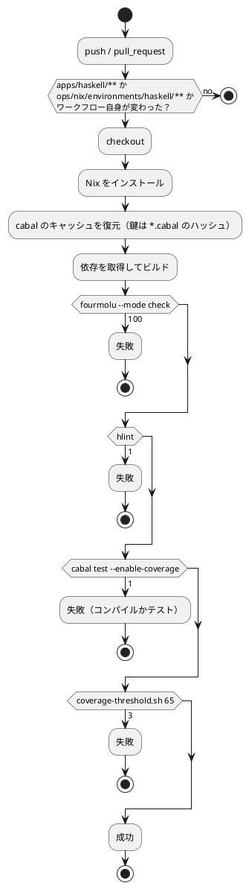

# 第 6 章: タスクランナーと CI/CD

## 6.1 はじめに

前の章で、整形・静的解析・テスト・カバレッジという 4 つの検査を用意しました。この章では、それらを **いつでも・誰でも・同じように実行できる** 状態にします。

道具は 3 段に分かれます。

| 段 | 道具 | 受け持ち |
|----|------|---------|
| 言語の中 | cabal | ビルド・テスト・REPL |
| リポジトリ | Gulp（`ops/scripts/`） | 言語をまたいだ作業、Nix への切り替え、学習データの配置 |
| 自動 | GitHub Actions | push のたびに同じ検査を走らせる |

Haskell 版の見どころは 3 つです。

- **cabal にまとめ役がない**。PHP の `composer check`・Elixir の `mix alias` に当たる「複数のコマンドをまとめて 1 語にする」仕組みが cabal にはありません。4 つの検査の並びを、Gulp と CI の 2 箇所に書くことになります
- **章を実行する入口がない**。`executable` のターゲットを作っていないので、`cabal repl` に式を流し込みます。ここに **例外が起きても終了コードが 0 になる** という落とし穴があります
- **Nix の環境定義に 2 度手を入れた**。整形と静的解析の道具が入っていなかったこと（[PHP 版](../php/06-task-runner-and-ci-cd.md)の pcov と同じ形で、第 3 波で 2 回目）と、hmatrix のために C ライブラリが要ったことです

## 6.2 タスクランナー — cabal

### 使うコマンド

| コマンド | 内容 |
|---------|------|
| `cabal build` | ライブラリをコンパイルする |
| `cabal build --only-dependencies --enable-tests` | 依存だけを先に取ってきてビルドする |
| `cabal test` | テストを実行する |
| `cabal test --test-show-details=direct` | テストの名前を 1 本ずつ表示する |
| `cabal test --enable-coverage` | カバレッジを計測しながらテストする |
| `cabal repl` | REPL を起動する |
| `cabal clean` | `dist-newstyle/` を消す |
| `cabal freeze` | 解決した版を `cabal.project.freeze` に書き出す（この版では使わない） |

`cabal test` の既定の表示は素っ気ないものです。

```text
1 of 1 test suites (1 of 1 test cases) passed.
```

**「1 個のテストスイートが通った」としか言いません。** Hspec が 44 本走らせていることは出てきません。cabal から見れば、テストスイートは「0 で終われば成功」の実行ファイル 1 個だからです。中身を見るには `--test-show-details=direct` を付けます。

```bash
cabal test --test-show-details=direct
```

```text
GettingStartedMl.Chapter01
  ルールによる判定
    二十代はきのこ派と判定する [✔]
...
Finished in 0.0060 seconds
44 examples, 0 failures, 3 pending
```

**`direct` は「Hspec の出力をそのまま流す」という指定です。** 既定の `always` や `failures` は出力をいったんファイルに溜めるので、色も記号も落ちます。手元で走らせるときは `direct` を付ける習慣にします。

### まとめ役が無い

第 5 章の最後に書いた 4 つの検査は、こう並べるしかありません。

```bash
fourmolu --mode check src test && hlint src test && cabal test --enable-coverage && ./tools/coverage-threshold.sh 65
```

**cabal には、この並びに名前を付けて `cabal check` のように呼ぶ仕組みがありません。** `cabal check` というコマンドは存在しますが、これは「パッケージを Hackage に上げる前の体裁の検査」で、まったく別のものです。

| 言語版 | まとめ役 | 検査の並びを書く場所 |
|-------|--------|------------------|
| PHP 版 | `composer check`（`composer.json` の `scripts`） | **`composer.json` だけ** |
| Elixir 版 | 無し（`mix` の alias は使わなかった） | Gulp と CI に二重 |
| **Haskell 版** | **無し** | **Gulp と CI に二重** |

PHP 版では検査の中身が `composer.json` 1 箇所にあり、Gulp も CI も `composer check` を呼ぶだけでした。Haskell 版はそうできません。`ops/scripts/apps.js` と `.github/workflows/haskell-ci.yml` の両方に同じ 4 つが書かれ、**片方を変えたらもう片方も変える**必要があります。コメントで結び付けてあります。

```javascript
    // CI（.github/workflows/haskell-ci.yml）と同じ順に、整形・静的解析・テスト・カバレッジを検査する
```

重複は避けたいものですが、ここでは受け入れています。**CI では 4 つをステップに分けたいから**です（6.7 節）。GitHub の画面で「どこで落ちたか」が一目で分かるほうが、重複を消すことより価値があります。

`cabal.project` に `scripts` のようなものを足したくなりますが、cabal にその機能はありません。シェルスクリプトや `Makefile` を置く手もありますが、**リポジトリ全体のまとめ役がすでに Gulp なので、そこに寄せています**。道具を増やさない、という判断です。

### 章の処理を実行する

ほかの言語版では、章の処理を実行する入口がありました。Elixir 版は `mix run -e`、PHP 版は `php -r` です。Haskell 版はどうするか。

**`executable` のターゲットを作っていません。** 章ごとに `main` を書くと、15 章ぶんの `executable` が `*.cabal` に並びます。代わりに `cabal repl` に式を流し込みます。

```bash
echo 'GettingStartedMl.Chapter01.run >>= either fail putStrLn' | cabal repl -v0 lib:getting-started-ml
```

```text
データ件数: 19
ルールによる判定の正解率: 0.7368
```

読み方は次のとおりです。`run` の型は `IO (Either String String)` なので、`>>=` で中身を取り出し、`either fail putStrLn` で「失敗なら `fail`、成功なら表示」に振り分けます。`-v0` は cabal 自身のビルドの進捗を黙らせる指定です。

`lib:getting-started-ml` と書いて **どのターゲットを開くかを明示しています**。省いてもこの構成ではライブラリが選ばれますが、テストスイートを開きたい場面（`test:spec`）もあるので、意図を書いておきます。第 5 章で見た「ターゲットごとに設定がある」という構造が、ここにも顔を出しています。

### 落とし穴: 例外が起きても終了コードは 0

データが無い状態で同じことをします。

```bash
echo 'GettingStartedMl.Chapter01.run >>= either fail putStrLn' | cabal repl -v0 lib:getting-started-ml
echo "EXIT=$?"
```

```text
*** Exception: ../data/sukkiri-ml/KvsT.csv: openBinaryFile: does not exist (No such file or directory)
EXIT=0
```

**例外で止まったのに、終了コードは 0 です。**

理由は単純で、**GHCi は式の評価で例外が飛んでもメッセージを出して次のプロンプトに戻るだけ**だからです。入力が尽きれば正常に終了します。GHCi にとって「例外が飛んだ」は、対話の中の日常の出来事であって、プロセスの失敗ではありません。

これは無視できない落とし穴です。[PHP 版](../php/06-task-runner-and-ci-cd.md)では、キャッチされない例外で止まると終了コードが **255** になりました。値は変でも、**失敗したことは伝わります**。Haskell 版のこの形は、**失敗を伝えません**。

```bash
# これは「成功した」と判断されてしまう
echo '...' | cabal repl -v0 lib:getting-started-ml && echo "OK"
```

したがって、**この書き方は記事の中で結果を見せるためのものであって、スクリプトや CI に書くものではありません。** CI が動かすのはテストスイート（`cabal test`）だけで、そちらは失敗すれば 1 で終わります。**「手で確かめるための実行」と「自動で検査するための実行」を混ぜない**、という線引きがここにあります。

どうしてもスクリプトから章を走らせたいなら、`executable` のターゲットを 1 つ作り、`main` が `exitFailure` を呼ぶようにします。この版でそうしなかったのは、章を実行する必要が「記事を書くとき」に限られるからです。**必要になったら作る**、という判断です。

### 環境変数を渡す

学習データの置き場は `ML_DATA_DIR` で差し替えられます（第 4 章）。

```bash
ML_DATA_DIR=/path/to/data cabal test --test-show-details=direct
```

```bash
echo 'GettingStartedMl.Chapter02.run >>= either fail putStrLn' | ML_DATA_DIR=/path/to/data cabal repl -v0 lib:getting-started-ml
```

環境変数は cabal を経由して、コンパイルされたコードの `lookupEnv` まで届きます。cabal 自身は中身を知りません。**プロセスの環境は、ビルドの道具を素通りします。**

## 6.3 Notebook について

Haskell にも IHaskell という Jupyter のカーネルがありますが、本シリーズの Haskell 版では Notebook を扱いません。第 3 波の共通の方針です。探索と可視化は [Python 版](../python/index.md) と [Kotlin 版](../kotlin/index.md) を参照してください。

理由は 2 つあります。1 つは、IHaskell が GHC の版に強く結びついていて、環境を組むのが重いこと。もう 1 つは、**Haskell 版の価値が「型で表す」ことにあり、Notebook の断片的な実行とは相性がよくない**ことです。この版の関数は `Either String a` を返すので、Notebook のセルでは毎回パターンマッチを書くことになります。REPL で 1 行ずつ試すなら `cabal repl` で足ります。

## 6.4 Nix の環境定義

`ops/nix/environments/haskell/shell.nix` です。

```nix
{ packages ? import <nixpkgs> { } }:
let
  baseShell = import ../../shells/shell.nix { inherit packages; };
in
packages.mkShell {
  inputsFrom = [ baseShell ];
  buildInputs = with packages; [
    ghc
    stack
    cabal-install
    haskell-language-server
    # 整形・静的解析・テストの道具。素の環境には無く、手元の PATH のものが
    # 見えてしまっていたので、環境の側で版を固定する。
    haskellPackages.fourmolu
    haskellPackages.hlint
    haskellPackages.hspec-discover
    # hmatrix は BLAS/LAPACK の C ライブラリを要求する。素の環境には無く、
    # cabal が configure の段階で「Missing (or bad) C libraries: blas, lapack」
    # で止まっていた。
    openblas
    pkg-config
  ];

  shellHook = baseShell.shellHook + ''
    # hmatrix のような C ライブラリを要求するパッケージのために、
    # openblas の場所を cabal と GHC に伝える。
    export LIBRARY_PATH="${packages.openblas}/lib:$LIBRARY_PATH"
    export PKG_CONFIG_PATH="${packages.openblas.dev}/lib/pkgconfig:$PKG_CONFIG_PATH"
    echo "Welcome to the Haskell development environment!"
    ghc --version
    cabal --version
    stack --version
  '';
}
```

この定義には **2 回、手を入れました**。

### 1 回目: 整形と静的解析の道具

[第 1 章](01-machine-learning-and-first-test.md)で見たとおり、素の環境には fourmolu も hlint も入っていませんでした。

```bash
nix develop .#haskell
which fourmolu hlint
```

```text
/usr/local/bin/fourmolu
/usr/local/bin/hlint
```

`/usr/local/bin` は Nix の外、**手元の機械に入っているもの**です。第 5 章で確かめたとおり、手元は fourmolu 0.20.0.0、Nix の中は 0.19.0.1 と版が違います。これが見えていると、検査が通るかどうかが機械ごとに変わります。

**これは PHP 版で pcov が無かったのとまったく同じ形で、第 3 波で 2 回続きました。** Nix の言語ごとの環境は「言語とビルドの道具」までは入れてくれますが、**「その言語圏で標準的に使われる検査の道具」までは入れてくれません**。言語を足すときは、`which` で 1 つずつ確かめるのが習慣として要ります。

### 2 回目: openblas

第 7 章で使う hmatrix は、BLAS と LAPACK という C のライブラリを要求します。素の環境では configure の段階で止まりました。

```text
Error: [Cabal-4345]
Missing dependencies on foreign libraries:
* Missing (or bad) C libraries: blas, lapack
```

**Haskell のパッケージなのに、足りないのは C のライブラリです。** `build-depends` に書いても解決しません。cabal が解決できるのは Hackage のパッケージだけで、**C のライブラリは OS（ここでは Nix）の仕事**だからです。

`openblas` を `buildInputs` に足し、`shellHook` で場所を伝えると通ります。

```nix
export LIBRARY_PATH="${packages.openblas}/lib:$LIBRARY_PATH"
export PKG_CONFIG_PATH="${packages.openblas.dev}/lib/pkgconfig:$PKG_CONFIG_PATH"
```

`LIBRARY_PATH` はリンカに、`PKG_CONFIG_PATH` は `pkg-config` に場所を教えます。2 つ要るのは、**cabal が場所を探す経路が 2 通りある**からです。

C ライブラリへの依存を環境に足すかどうかは、判断の要る選択でした。[Elixir 版](../elixir/index.md)では EXLA（巨大な XLA のバイナリ）を「記事の『動かしてみる』の敷居が上がる」という理由で避けています。Haskell 版は足す側に倒しました。BLAS と LAPACK は数値計算の標準的な土台で Nix でも軽く入ること、そして **足さなければ突き合わせる相手が 1 つも無くなる**ことが理由です（[ADR 014](../../../adr/014-haskell-ml-libraries.md)）。

**環境定義に手を入れる判断は、言語の選択と同じくらい記事の性格を決めます。** 「この言語で書くと何が確かめられるか」が、環境に何を入れたかで変わるからです。

## 6.5 cabal と Gulp の分担

リポジトリ全体の作業を受け持つ Gulp のタスクに、Haskell を足してあります（`ops/scripts/apps.js`）。

```javascript
  {
    name: 'haskell',
    nix: 'haskell',
    dir: path.join('apps', 'haskell'),
    // fourmolu と hlint は Nix の環境にしかないので、そろっていなければ Nix の中で実行する
    tools: [{ cmd: 'cabal', version: 'cabal --version' }, { cmd: 'fourmolu', version: 'fourmolu --version' }, { cmd: 'hlint', version: 'hlint --version' }],
    setup: 'cabal build --only-dependencies --enable-tests',
    // CI（.github/workflows/haskell-ci.yml）と同じ順に、整形・静的解析・テスト・カバレッジを検査する
    check:
      'fourmolu --mode check src test && hlint src test && cabal test --enable-coverage && ./tools/coverage-threshold.sh 65',
  },
```

`tools` に **3 つ**並んでいます。Gulp はこれを順に確かめ、1 つでも欠けていれば Nix の環境（`nix develop .#haskell`）に切り替えます。

実行するとこう出ます。

```bash
npx gulp apps:check:haskell
```

```text
haskell: ローカルの cabal が使えないため、nix develop .#haskell の中で実行します。
```

**手元に `cabal` がありません。**

```bash
which cabal ghc
```

```text
cabal not found
ghc not found
```

fourmolu と hlint は手元にあるのに、cabal と GHC はありません。**言語本体が無いのに検査の道具だけがある**という、ちぐはぐな状態です。第 1 章でこれに気づかなければ、「手元の fourmolu 0.20.0.0 で整形を検査し、Nix の GHC 9.10.3 でビルドする」という混ざった状態で作業していたはずです。

結果として、`apps:check:haskell` は **常に Nix の中で走ります**。Elixir 版では、手元の Elixir 1.19.5 が条件を満たしてしまい、Nix の 1.18.4 と表示が食い違いました。Haskell 版でそれが起きないのは、**3 つとも要求しているから**です。

### 2 つのタスクランナーの分担

| 役割 | cabal（`apps/haskell`） | Gulp（リポジトリのルート） |
|------|---------------------|------------------------|
| 何を知っているか | ソース・依存・ビルドのターゲット | 言語ごとのアプリの場所・前提ツール・学習データの場所 |
| 品質チェックの中身 | **持てない**（まとめ役の機能が無い） | **持つ**（`check` に 4 つの並びを書く） |
| 前提ツールが無いとき | 何もできない | Nix の環境に切り替える |
| 全言語をまとめて | 扱わない | `apps:check` で、学習データの確認（`data:check`）と全言語の検査を続けて実行する |

PHP 版とちょうど逆になっています。PHP 版は `composer.json` が検査の中身を持ち、Gulp は呼ぶだけでした。**Haskell 版は cabal が持てないので、Gulp が持ちます。** 「どちらが持つか」は言語の道具にまとめ役があるかで決まり、**設計の好みでは決められません**。

## 6.6 4 つの検査が本当に効いていることを確かめる

設定を書いただけでは、本当に検査されているか分かりません。**わざと違反を入れて落ちることを確かめる** のが確実です。4 つを 1 つずつ壊しました。

| 壊したもの | コマンド | 終了コード |
|-----------|---------|----------|
| 整形（`f    :: Int -> Int`・`x+1`） | `fourmolu --mode check src test` | **100** |
| 書き方（`map id xs`） | `hlint src test` | **1** |
| 落ちる表明（`(1 + 1 :: Int) shouldBe 3`） | `cabal test` | **1** |
| カバレッジ（しきい値を 99 にする） | `./tools/coverage-threshold.sh 99` | **3** |

**終了コードは 100・1・1・3 です。** 3 つの値が出てきます。PHP 版の 8・1・1・3、Elixir 版の 1・1・4・2 と、値も並びも違いますが、**「1 とは限らない」という性質は同じ**です。

fourmolu の 100 は飛び抜けています。**シェルでは終了コードが 1 バイト（0〜255）なので、100 はまだ収まっています**が、値を数えて判定するスクリプトを書いていたら間違いなく見落とします。カバレッジの 3 は自作のスクリプトで決めた値です。**自分で決めた値がここに並んでいる**ことに注目してください。ほかの 3 つは道具の作者が決めた値ですが、4 つめはプロジェクトの約束です。

`&&` でつないだ 1 行や CI のステップは「0 かどうか」で判断するので、この違いは問題になりません。しかし「終了コードが 1 なら失敗として扱い、それ以外は成功」と書いたスクリプトがあれば、**整形の失敗とカバレッジ割れを両方とも見逃します**。値をハードコードせずに `if ! コマンド; then` や `set -e` の形で書く、というのは、こういう場面のための習慣です。

落ちるテストの表示も見ておきます。

```text
GettingStartedMl.Violation
  わざと落ちる
    一足す一は三ではない [✘]

Failures:

  test/GettingStartedMl/ViolationSpec.hs:8:20:
  1) GettingStartedMl.Violation.わざと落ちる 一足す一は三ではない
       expected: 3
        but got: 2

  To rerun use: --match "/GettingStartedMl.Violation/わざと落ちる/一足す一は三ではない/" --seed 719113969

Randomized with seed 719113969

Finished in 0.0031 seconds
45 examples, 1 failure, 3 pending
```

3 つ、読み取れることがあります。

**1 つめは `expected:` と `but got:` の順です。** 期待値が先、実際の値が後。`shouldBe` の引数も「実際の値 `shouldBe` 期待値」なので、**引数の順と表示の順が逆**です。PHPUnit も同じ逆転をしていました。慣れるまでは読み違えやすいところです。

**2 つめは `To rerun use:` の行です。** 落ちたテストだけをもう一度走らせるコマンドが、**日本語のテスト名をそのまま含んだ形**で表示されます。コピーして貼れば、そのテストだけを回せます。Hspec がテスト名に日本語を許すことの実利がここに出ています。

**3 つめは `--seed 719113969` です。** Hspec は既定でテストの順番を乱数で入れ替えます。順番に依存したテスト（第 4 章の環境変数の例）があると、**この種によって落ちたり落ちなかったりします**。落ちた種が表示されるので、同じ順番を再現できます。**テストの実行にも再現性の仕組みが要る**という、第 4 章の話の続きです。

### 5 つめの隠れた検査

表には 4 つしか書いていませんが、**`cabal test` の中にもう 1 つ検査が隠れています**。`-Wall -Werror` によるコンパイルです。第 5 章で壊したコードは、テストの実行までたどり着きません。

```text
Error: [Cabal-7125]
Failed to build getting-started-ml-0.1.0.0.
```

**ビルドの失敗とテストの失敗が、同じコマンドの同じ終了コード 1 になります。** CI では出力が残るので区別できますが、手元で `&&` の 1 行を走らせているときは「テストが落ちた」と早合点しやすいところです。**`Failed to build` という行が出ていたら、それはテストではなくコンパイルの失敗です。**

これらの実験は、一時的なファイル（`src/GettingStartedMl/Violation.hs`・`test/GettingStartedMl/ViolationSpec.hs`）を置いて行い、確かめてから消しました。**壊して確かめたら、必ず元に戻します。** `*.cabal` の `exposed-modules`・`other-modules` に書き足した行も戻します（第 5 章で見たとおり、Haskell ではファイルを置くだけでは足りません）。

## 6.7 GitHub Actions による CI

### ワークフロー設定

`.github/workflows/haskell-ci.yml` です。

```yaml
name: Haskell CI

on:
  push:
    branches: [main]
    paths:
      - 'apps/haskell/**'
      - 'ops/nix/environments/haskell/**'
      - '.github/workflows/haskell-ci.yml'
  pull_request:
    paths:
      - 'apps/haskell/**'
      - 'ops/nix/environments/haskell/**'
      - '.github/workflows/haskell-ci.yml'

jobs:
  test:
    runs-on: ubuntu-latest
    steps:
      - uses: actions/checkout@v5

      - uses: cachix/install-nix-action@v31
        with:
          github_access_token: ${{ secrets.GITHUB_TOKEN }}

      - name: Cache cabal packages
        uses: actions/cache@v4
        with:
          path: |
            ~/.local/state/cabal
            ~/.cabal
            apps/haskell/dist-newstyle
          key: ${{ runner.os }}-haskell-${{ hashFiles('apps/haskell/*.cabal') }}
          restore-keys: |
            ${{ runner.os }}-haskell-

      - name: Install dependencies
        run: |
          nix develop .#haskell --command bash -c 'cd apps/haskell && cabal update && cabal build --only-dependencies --enable-tests'

      - name: Check formatting
        run: |
          nix develop .#haskell --command bash -c 'cd apps/haskell && fourmolu --mode check src test'

      - name: HLint
        run: |
          nix develop .#haskell --command bash -c 'cd apps/haskell && hlint src test'

      # 実データのテストは学習データが無ければ pending になる
      - name: Test with coverage
        run: |
          nix develop .#haskell --command bash -c 'cd apps/haskell && cabal test --enable-coverage'

      # cabal には最低カバレッジのしきい値の機能が無いので、HPC の結果を読んで判定する
      - name: Check coverage threshold
        run: |
          nix develop .#haskell --command bash -c 'cd apps/haskell && ./tools/coverage-threshold.sh 65'
```

### ワークフローのポイント

**`paths` で対象を絞っています。** ほかの言語版のコードや記事だけを変えたときに Haskell CI を走らせても意味がありません。`ops/nix/environments/haskell/**` が入っているのは、環境定義を変えたら検査をやり直す必要があるからです。

**手元と同じ 4 つを、同じ順で、ステップに分けて実行します。** 1 行にまとめることもできますが、分けてあるのは **GitHub の画面で「どこで落ちたか」が一目で分かる**ようにするためです。6.2 節で書いた「検査の並びが Gulp と CI に二重になる」という重複は、この利益と引き換えです。

**`nix develop .#haskell --command` を各ステップで呼んでいます。** シェルの状態はステップをまたいで残らないので、毎回入り直します。`shellHook` の `LIBRARY_PATH` の設定も毎回効きます。

**学習データはありません。** CI では実データのテストが `pending` になり、カバレッジが落ちます（第 4 章）。しきい値はこの状態で通る値にしてあります。

### しきい値は 80% から 65% に下げた

[第 4 章](04-version-control-and-data-management.md)を書いた時点では、しきい値を 80% にしていました。データが無いときで 83%、あるときで 94% だったので、80% なら両方で通ります。**いちばん条件の悪い環境を基準にする**という原則どおりの決め方でした。

ところが、章が 15 個そろったところで CI が落ちました。

| 時点 | 式の数 | データ無し | データ有り |
|------|-------|----------|----------|
| 第 4 章（第 1〜3 章まで） | 663 | 83% | 94% |
| 全 15 章 | 8206 | **71%** | 93% |

データが有るときは 94% → 93% とほとんど動いていないのに、**無いときだけ 83% → 71% と 12 ポイント落ちています**。章が増えるにつれて実データを使うテストが増え、それが `pending` になるぶんの穴が広がったからです。

原則は正しかったのに、**その原則が指す数字のほうが動きました**。決め方を間違えたのではなく、決めた時点の測定値がいつまでも通用すると思っていたのが間違いです。65% に下げました。

しきい値を置くときは、**それがどの環境で測った数字か**に加えて、**規模が変わったら測り直す**ことも決めておく必要があります。

### キャッシュの落とし穴

キャッシュの指定を読み直してください。

```yaml
          path: |
            ~/.local/state/cabal
            ~/.cabal
            apps/haskell/dist-newstyle
          key: ${{ runner.os }}-haskell-${{ hashFiles('apps/haskell/*.cabal') }}
```

3 つを保存しています。役割が違います。

| パス | 中身 | 消えたらどうなるか |
|------|------|-----------------|
| `~/.local/state/cabal`・`~/.cabal` | Hackage から取ってきたパッケージのソースと、ビルド済みの成果物 | ダウンロードとビルドをやり直す（遅い） |
| `apps/haskell/dist-newstyle` | **このプロジェクトのビルド結果** | コンパイルをやり直す（遅い） |

鍵は **`*.cabal` のハッシュ** です。依存を変えれば鍵が変わり、キャッシュが作り直されます。第 5 章で見たとおりこの版にはロックファイルが無いので、**鍵にできるのは `*.cabal` しかありません**。

ここに落とし穴があります。**`*.cabal` が変わらなくても、Hackage の側で新しい版が出れば、解決される版は変わりえます。** `bytestring` に範囲が書かれていないので、cabal は「今あるいちばん新しいもの」を選びます。キャッシュが効いている間は古い版のまま、キャッシュが切れた日に突然新しい版になる——というずれが起こりえます。

**これがロックファイルを置かないことの代償です。** 第 5 章では「Nix が上流を固定しているので、その下にもう 1 枚置く価値が小さい」と書きましたが、価値がゼロではありません。**ここが、この版でいちばん弱いところです。** 固定していない直接の依存は 4 個（cassava・unordered-containers・vector・hspec）なので、実際に壊れる確率は低く、壊れたときの原因も追いやすい——という見積もりのうえでこの形にしています。**弱さを知ったうえで受け入れるのと、知らずに済ませるのは別です。**

もう 1 つ。**`dist-newstyle` には、どの版でビルドしたかが焼き込まれています。** `restore-keys` で古いキャッシュを拾ったときに、`*.cabal` が変わっていればビルドし直されますが、**キャッシュを正しさの前提にしてはいけません**。おかしな失敗が続いたら、まずキャッシュを捨てて確かめます。

### CI パイプラインの流れ



## 6.8 三種の神器と CI

第 4〜6 章で整えたものを、ソフトウェア開発の「三種の神器」（バージョン管理・テスティング・自動化）に当てはめると次のようになります。

| 三種の神器 | 道具 | 本シリーズでの使い方 |
|-----------|------|------------------|
| バージョン管理 | Git、Conventional Commits、`.gitignore`、`.gitattributes` | 学習データ・`dist-newstyle/`・`*.tix`・`.hpc/`・モデルをコミットしない。**ロックファイルは置かない**。改行は fourmolu と Git の 2 層で LF にそろえる |
| テスティング | Hspec、HPC、自作のしきい値 | 単体テストは架空の値、実データのテストは `Dataset.exists` と `pendingWith`。しきい値は自分で書く。**`-Wall -Werror` によるコンパイルが 5 つめの検査** |
| 自動化 | Gulp、fourmolu、hlint、GitHub Actions、Nix | 環境（**C ライブラリを含む**）の再現、品質チェックの一括実行、データの配置、CI |

### 利用可能なコマンド一覧

| コマンド | 内容 | 実行する場所 |
|---------|------|------------|
| `npx gulp data:setup` | 学習データを配置する | リポジトリのルート |
| `npx gulp data:check` | 学習データの配置を確認する | リポジトリのルート |
| `npx gulp apps:check:haskell` | Haskell の品質チェックを実行する（常に Nix の中で） | リポジトリのルート |
| `nix develop .#haskell` | Haskell の環境に入る | リポジトリのルート |
| `cabal build` | ライブラリをビルドする | `apps/haskell` |
| `cabal test --test-show-details=direct` | テストを名前つきで実行する | `apps/haskell` |
| `cabal test --enable-coverage` | カバレッジを計測しながらテストする | `apps/haskell` |
| `fourmolu --mode check src test` | 整形されているかを検査する | `apps/haskell` |
| `fourmolu --mode inplace src test` | コードを整形する | `apps/haskell` |
| `hlint src test` | 静的解析を実行する | `apps/haskell` |
| `./tools/coverage-threshold.sh 65` | カバレッジのしきい値を判定する | `apps/haskell` |
| `echo 'GettingStartedMl.Chapter01.run >>= either fail putStrLn' \| cabal repl -v0 lib:getting-started-ml` | 章の処理を実行する（学習データが必要。**終了コードは当てにならない**） | `apps/haskell` |

## 6.9 まとめ

この章では、品質チェックを自動化し、どの環境でも同じ手順で実行できるようにしました。

1. **cabal にまとめ役が無い** — PHP の `composer check`・Elixir の alias に当たる仕組みが無いので、4 つの検査の並びを Gulp と CI に二重に書く。`cabal check` は別物（Hackage 向けの体裁の検査）。重複を受け入れるのは、**CI でステップを分けて「どこで落ちたか」を見たい**から
2. **章の実行に入口を作っていない** — `executable` を章ごとに作ると 15 個並ぶので、`cabal repl` に式を流し込む。`lib:getting-started-ml` の指定が要るのは、cabal が **ターゲットごとに設定を持つ**から
3. **`cabal repl` は例外が飛んでも終了コード 0** — GHCi にとって例外は対話の日常であってプロセスの失敗ではない。PHP 版の 255 は変な値だが**失敗は伝わった**のに対し、こちらは伝わらない。**手で確かめる実行と、自動で検査する実行を混ぜない**
4. **Nix の環境定義に 2 回手を入れた** — 整形と静的解析の道具が無く手元の `/usr/local/bin` が見えていたこと（PHP 版の pcov と同じ形で第 3 波 2 回目）と、hmatrix のための **C ライブラリ**。`build-depends` では解決できない依存が世の中にはある
5. **Gulp は常に Nix の中で走る** — 手元に **cabal も GHC も無いのに fourmolu と hlint だけある**、というちぐはぐな状態だったので、3 つとも要求する判定にした。PHP 版とは逆に、**検査の中身を持つのは Gulp の側**。まとめ役があるかで決まり、好みでは決められない
6. **4 つとも壊して確かめた** — 終了コードは **100・1・1・3**。4 つめは自分で決めた値。加えて **`-Wall -Werror` によるコンパイルが 5 つめの検査**として `cabal test` の中に隠れていて、テストの失敗と同じ 1 になる。`Failed to build` の行で見分ける
7. **Hspec の失敗の表示** — `expected:` が先で `but got:` が後（`shouldBe` の引数とは逆）。`To rerun use:` に**日本語のテスト名がそのまま**出る。`--seed` が表示されるので、**順番に依存して落ちたテストを再現できる**
8. **GitHub Actions** — Nix で環境をそろえ、手元と同じ 4 つをステップに分けて実行する。キャッシュの鍵は**ロックファイルが無いので `*.cabal` のハッシュ**にするしかない。**`*.cabal` が変わらないまま Hackage の側の版が動きうる**のが、この版のいちばん弱いところ

第 2 部で、TDD を回し続けるための道具立てがそろいました。次の第 3 部では、回帰問題と、欠損値・カテゴリ値・外れ値を含む現実的なデータの前処理に取り組みます。第 7 章では、正規方程式をガウス・ジョルダン法で自作してから hmatrix の `<\>` と突き合わせます。**この章で `openblas` を環境に足したのは、そのためです。**

Haskell 版のほかの章は [Haskell 版のトップ](index.md) から辿れます。
