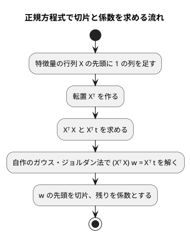

# 第 7 章: 線形回帰による数値予測

## 7.1 はじめに

第 1〜3 章では、グループを当てる **分類** を扱いました。この章からは、数値そのものを当てる **回帰** に進みます。題材は、映画の SNS での反響や主演俳優の露出度から、興行収入を予測する問題です。

この章では、最も基本的な回帰モデルである **線形回帰** を自作します。そして Haskell 版では、この章に特別な意味があります。

**Haskell には scikit-learn にあたるものがありません。** 決定木も、ロジスティック回帰も、K-means も、主成分分析も、全部自作です。突き合わせられる相手がいるのは **線形代数の層だけ**で、この章はその数少ない章の 1 つです（[ADR 014](../../../adr/014-haskell-ml-libraries.md)）。[Elixir 版](../elixir/index.md) が Scholar に決定木を持たないのと同じ事情で、Haskell 版はさらに範囲が狭くなっています。

その「突き合わせる相手」が hmatrix です。hmatrix は BLAS/LAPACK という C のライブラリを呼びます。**そしてこの章では、hmatrix が「ビルドは通るのに実行すると必ず落ちる」状態に出会いました。** 7.9 節で、何が起きていたのかを扱います。数値計算の章でありながら、**いちばん時間を取ったのは数値の話ではありませんでした。**

Notebook による探索と可視化の節は設けません。散布図で外れ値を確かめる手順は [Python 版](../python/07-linear-regression.md) と [Kotlin 版の 7.13 節](../kotlin/07-linear-regression.md) を参照してください。

## 7.2 線形回帰とは

### 特徴量の重み付きの和で予測する

線形回帰は、予測値を「切片」と「特徴量ごとの係数 × 特徴量」の和で表すモデルです。この章のデータに当てはめると次の式になります。

```text
予測値 = 切片 + 係数1 × SNS1 + 係数2 × SNS2 + 係数3 × actor + 係数4 × original
```

学習とは、訓練データに対して予測値と実測値のずれが最も小さくなるように、切片と係数を決めることです。ずれの大きさには「誤差の 2 乗の合計」を使います。これを最小にする方法を **最小二乗法** と呼びます。

### 正規方程式

最小二乗法の解は、行列を使うと 1 つの式で求められます。特徴量を行列 `X`、実測値をベクトル `t`、切片と係数をまとめたベクトルを `w` とすると、誤差の 2 乗の合計を最小にする `w` は次の **正規方程式** を満たします。

```text
(Xᵀ X) w = Xᵀ t
```

`X` の先頭には、すべての値が 1 の列を足しておきます。この列にかかる係数が切片になります。



逆行列を作らずに連立方程式として解くのは、Python 版・Java 版・Clojure 版・Elixir 版・PHP 版と同じく、そのほうが数値計算の誤差が小さくなるためです。

## 7.3 題材とデータ

この章で使うのは `cinema.csv` です。100 本の映画について、次の 6 列が記録されています。

| 列 | 内容 | 欠損値 |
|----|------|-------|
| cinema_id | 映画の ID | なし |
| SNS1 | SNS での反響の数（1 つ目の指標） | 1 件 |
| SNS2 | SNS での反響の数（2 つ目の指標） | なし |
| actor | 主演俳優のメディア露出の指標 | 1 件 |
| original | 原作の有無（0 または 1） | なし |
| sales | 興行収入 | なし |

「SNS1」「SNS2」「actor」「original」が特徴量、「sales」が正解ラベル（予測したい数値）です。`cinema_id` は映画を区別するための番号なので、特徴量には使いません。

```haskell
-- | 映画のデータの特徴量の列。cinema_id は映画を区別する番号なので使わない。
featureColumns :: [Text]
featureColumns = ["SNS1", "SNS2", "actor", "original"]
```

[第 2 章](02-data-preprocessing-and-triangulation.md) の `Csv` はセルを `Text` のまま持ち、`optionalNumber` で読むときに `Maybe Double` にします。列の型を推論する段階が無いので、Kotlin 版が Kotlin DataFrame の型推論で困った問題（SNS1 が `Int?` と推論され、補完した平均値が入らない）は起きません。

## 7.4 TODO リストの作成

```text
TODO リスト（第 7 章）

- [ ] 残差・MAE・RMSE・決定係数を計算する
- [ ] 切片と係数を持つモデルを表す
- [ ] 計画行列（先頭が 1 の列）を作る
- [ ] ガウス・ジョルダン法で連立方程式を解く
- [ ] 正規方程式を解いて学習する
- [ ] 外れ値を取り除く
- [ ] 外れ値の除去・分割・補完を 1 つの手順にまとめる
- [ ] hmatrix の最小二乗解と突き合わせる
- [ ] 実データで学習し、係数と評価指標を表示する
```

PHP 版・Elixir 版では「ガウス・ジョルダン法で連立方程式を解く」がありませんでした。MathPHP や Nx が持っているからです。Haskell 版では hmatrix も持っていますが、**それでも自作します。** 突き合わせる相手として使うためには、こちら側に自作の実装が要るからです。Java 版・Clojure 版と同じ立ち位置になります。

## 7.5 評価指標を計算する

### Red: 残差から始める

回帰の評価指標は、すべて「実測値と予測値の差（残差）」から作れます。まず残差から書きます。

```haskell
it "残差は実測値から予測値を引いた値" $
  residuals [3.0, 5.0] [1.0, 2.0] `shouldBe` Right [2.0, 3.0]

it "件数が違えば残差を求められない" $
  residuals [1.0] [1.0, 2.0] `shouldBe` Left "実測値と予測値の件数が違います: 1 と 2"
```

### Green

```haskell
residuals :: [Double] -> [Double] -> Either String [Double]
residuals t y
  | length t /= length y =
      Left (printf "実測値と予測値の件数が違います: %d と %d" (length t) (length y))
  | null t = Left "実測値がありません"
  | otherwise = Right (zipWith (-) t y)
```

3 つの評価指標は、どれもここから 2 行で書けます。

```haskell
meanAbsoluteError :: [Double] -> [Double] -> Either String Double
meanAbsoluteError t y = do
  r <- residuals t y
  pure (sum (map abs r) / fromIntegral (length r))
```

`do` 記法が `Either` でも使えるので、**「失敗するかもしれない計算をつなぐ」のがそのまま書けます**。`residuals` が `Left` を返したら、そこで止まって `Left` が返ります。Rust 版の `?` 演算子と同じ働きを、ここでは `do` と `<-` がしています。

### 決定係数だけ、失敗の種類が 1 つ増える

```haskell
it "完全に当たれば決定係数は一" $
  r2Score [1.0, 2.0, 3.0] [1.0, 2.0, 3.0] `shouldBe` Right 1.0

it "平均を答え続ければ決定係数は零" $
  r2Score [1.0, 2.0, 3.0] [2.0, 2.0, 2.0] `shouldBe` Right 0.0

it "実測値がすべて同じなら決定係数を求められない" $
  r2Score [2.0, 2.0] [2.0, 2.0] `shouldBe` Left "実測値がすべて同じ値なので決定係数を求められません"
```

決定係数は「平均との差の 2 乗の合計」で割るので、実測値がすべて同じだと 0 で割ることになります。**Haskell の `Double` は 0 で割っても落ちません。** `NaN` が返ってきて、そのまま計算が進み、表示するところまで気づきません。だから割る前に確かめて `Left` を返します。

```haskell
  if total == 0.0
    then Left "実測値がすべて同じ値なので決定係数を求められません"
    else Right (1.0 - sumOfSquares r / total)
```

「落ちないから安全」ではありません。**`NaN` は、落ちないぶん見つけにくい失敗** です。

## 7.6 モデルを表す

### 列名と係数を別々のリストで持つ

```haskell
data LinearModel = LinearModel
  { modelIntercept :: Double
  , modelColumns :: [Text]
  , modelCoefficients :: [Double]
  }
  deriving (Eq, Show)
```

`M.Map Text Double` で持ちたくなりますが、そうしません。**`M.Map` はキーの順で並ぶ**ので、表示したい順（SNS1, SNS2, actor, original）が保てないからです。[第 2 章](02-data-preprocessing-and-triangulation.md) で列の順をリストで持ち回ったのと同じ理由です。

作るときに数が合っていることを確かめます。

```haskell
it "列名と係数の数が違えばモデルを作れない" $
  model 0.0 ["a", "b"] [1.0] `shouldBe` Left "列名と係数の数が違います: 2 と 1"
```

`LinearModel` のコンストラクタを直接使えば検査を通さずに作れてしまいますが、**モジュールから輸出しているのは `model` だけではなく型全体**なので、ここは規律で守っています。輸出を絞って完全に守ることもできますが、テストからフィールドを読みたいので、この章では読み取りを優先しました。

### 列名で係数を読む

```haskell
coefficient :: LinearModel -> Text -> Either String Double
coefficient m name =
  case lookup name (zip (modelColumns m) (modelCoefficients m)) of
    Nothing -> Left ("係数がありません: " <> T.unpack name)
    Just value -> Right value
```

予測も、列名で特徴量を引きます。**係数と特徴量を列名で対応させるので、`M.Map` に入っている順は問いません。**

```haskell
it "予測値は切片と係数の重み付きの和" $ do
  m <- expectRight (model 1.0 ["a", "b"] [2.0, 3.0])
  predict m [M.fromList [("a", 10.0), ("b", 100.0)]] `shouldBe` Right [321.0]

it "特徴量が足りなければ予測できない" $ do
  m <- expectRight (model 1.0 ["a"] [2.0])
  predict m [M.empty] `shouldBe` Left "特徴量がありません: a"
```

## 7.7 ガウス・ジョルダン法で連立方程式を解く

### Red

```haskell
it "ガウス・ジョルダン法で連立方程式を解く" $
  solveLinearSystem [[2.0, 1.0], [1.0, 3.0]] [5.0, 10.0] `shouldBe` Right [1.0, 3.0]

it "行の順が入れ替わっていても解ける" $
  solveLinearSystem [[0.0, 1.0], [1.0, 0.0]] [3.0, 2.0] `shouldBe` Right [2.0, 3.0]

it "特異行列は解けない" $
  solveLinearSystem [[1.0, 2.0], [2.0, 4.0]] [1.0, 2.0]
    `shouldBe` Left "解けません。特異行列です"
```

2 つめが **部分ピボット選択** のテストです。左上が 0 の行列でも、絶対値が最大の行を軸に選べば解けます。3 つめは、解が 1 つに決まらない場合です。

### Green

```haskell
solveLinearSystem :: [[Double]] -> [Double] -> Either String [Double]
solveLinearSystem a b
  | length a /= length b =
      Left (printf "行列と定数の件数が違います: %d と %d" (length a) (length b))
  | null a = Left "連立方程式が空です"
  | any ((/= length a) . length) a = Left "正方行列ではありません"
  | otherwise = map last <$> eliminate 0 (zipWith (\row rhs -> row <> [rhs]) a b)
```

不変のリストで消去法を書くので、「行を書き換える」のではなく「**書き換えた行のリストを作って次に渡す**」形になります。

```haskell
  eliminate i rows
    | i == size = Right rows
    | otherwise = do
        let (before, rest) = splitAt i rows
        (pivotRow, others) <- pickPivot i rest
        let normalized = map (/ (pivotRow !! i)) pivotRow
            reduce row = zipWith (\v p -> v - (row !! i) * p) row normalized
        eliminate (i + 1) (map reduce before <> (normalized : map reduce others))
```

Java 版・Clojure 版が書いた消去法と、やっていることは同じです。違うのは、**途中の状態が変数の書き換えではなく、再帰の引数として現れる**ことだけです。`before`（もう済んだ行）と `others`（まだの行）を分けて、両方に同じ `reduce` を当てています。ガウス・ジョルダン法（後退代入をせず、上も下も消す）にしたのは、この形が素直に書けるからです。

`!!` によるリストの添字参照は `O(n)` なので、この実装は `O(n⁴)` です。この章で解くのは 5×5 なので問題になりません。**大きさが決まっている場所で、読みやすさを取る** 判断です。

## 7.8 正規方程式を解いて学習する

### Red: 答えの分かっているデータ

切片 1、係数 2 と -3 になるデータを作って、それが返ってくることを確かめます。

```haskell
squareX :: [M.Map Text Double]
squareX =
  [ M.fromList [("a", 1.0), ("b", 0.0)]
  , M.fromList [("a", 0.0), ("b", 1.0)]
  , M.fromList [("a", 1.0), ("b", 1.0)]
  ]

squareT :: [Double]
squareT = [3.0, -2.0, 0.0]
```

### 計画行列

先頭に 1 の列を足すところを、別の関数にします。

```haskell
it "先頭に一の列を足す" $
  designMatrix [M.fromList [("a", 2.0), ("b", 3.0)]] ["a", "b"]
    `shouldBe` Right [[1.0, 2.0, 3.0]]
```

```haskell
designMatrix :: [M.Map Text Double] -> [Text] -> Either String [[Double]]
designMatrix x columns = traverse (fmap (1.0 :) . (`featureRow` columns)) x
```

`traverse` が「全部変換して、1 つでも失敗したら全体を失敗にする」をやってくれます。列が足りなければ `Left` です。

### Green: 学習

```haskell
fit :: [M.Map Text Double] -> [Double] -> [Text] -> Either String LinearModel
fit x t columns
  | null x = Left "訓練データが空です"
  | length x /= length t =
      Left (printf "特徴量と実測値の件数が違います: %d と %d" (length x) (length t))
  | otherwise = do
      design <- designMatrix x columns
      let transposed = transpose design
          normal = [[sum (zipWith (*) r c) | c <- transpose design] | r <- transposed]
          rhs = [sum (zipWith (*) r t) | r <- transposed]
      weights <- solveLinearSystem normal rhs
      case weights of
        [] -> Left "解が空です"
        (intercept : coefficients) -> model intercept columns coefficients
```

行列の積を `[[sum (zipWith (*) r c) | c <- ...] | r <- ...]`（内包表記の二重）で書けるのは、行列をリストのリストとして扱っているからです。Clojure 版がベクタのベクタをそのまま行列として扱ったのと同じ発想です。

最後の `case` は要ります。`weights` が空リストでないことはコードを読めば分かりますが、**型としては空リストがありえる**ので、`-Wincomplete-uni-patterns` が `-Werror` で止めます。「起こらないはずの場合」も、型が要求するなら書きます。

さらに `-Wall` は、**書いた節が網羅していないかどうかを全部見ています**。「[第 2 章](02-data-preprocessing-and-triangulation.md) でテストの中の `let Right x = ...` が止められた」のと同じ仕組みが、実装でも効いています。

## 7.9 hmatrix と突き合わせる——ビルドは通るのに実行すると落ちる

ここが、この章でいちばん時間を取ったところです。

### hmatrix に解かせる 2 通り

自作と比べるために、hmatrix の呼び方を 2 通り用意しました。

```haskell
-- 1. 計画行列をそのまま渡して、最小二乗解を求める（正規方程式を作らない）
hmatrixFit x t columns = do
  design <- checkedDesign x t columns
  toModel columns (LA.toList (LA.fromLists design LA.<\> LA.fromList t))

-- 2. 正規方程式を組み立て、その (Xᵀ X) w = Xᵀ t だけを hmatrix に解かせる
hmatrixNormalFit x t columns = do
  design <- checkedDesign x t columns
  let matrix = LA.fromLists design
      transposed = LA.tr matrix
  toModel columns (LA.toList ((transposed LA.<> matrix) LA.<\> (transposed LA.#> LA.fromList t)))
```

1 は `X w ≈ t` を直接解きます。`Xᵀ X` を作らないので、条件数が悪化しません。hmatrix のソースを読むと、`<\>` は `linearSolveSVD`、つまり **LAPACK の DGELSS（特異値分解による最小二乗）** を呼びます。[Elixir 版](../elixir/07-linear-regression.md) の Scholar が `Nx.LinAlg.pinv`（SVD）で解いていたのと同じ系統です。

2 は自作とまったく同じ正規方程式を作って、解くところだけを hmatrix に任せます。**自作との違いが「解き方」だけになる** ようにした比較用です。[PHP 版](../php/07-linear-regression.md) の Rubix ML の `Ridge` がこちらの形（正規方程式を `inverse()` で解く）でした。

### すべての LAPACK 呼び出しが落ちる

テストを走らせたら、hmatrix を使うテストが全部落ちました。

```text
uncaught exception: ErrorCall
linearSolveSVDR: code -7
 ** On entry to DGELSS parameter number  7 had an illegal value
```

数値が合わない、ではありません。**呼び出しそのものが失敗しています。** 2×2 の小さな連立方程式でも同じでした。

```text
linearSolve (DGESV, 2x2)  → Nothing
   ** On entry to DGESV parameter number 1 had an illegal value
linearSolveLS (DGELS)     → code -2
linearSolveSVD (DGELSS)   → code -7
pinv (DGESDD)             → code -2
```

DGESV の第 1 引数は行列の大きさ `N` です。2×2 を渡しているので 2 のはずで、それが「不正な値」と言われています。**渡した数が、向こうで別の数として読まれている** ということです。

### 原因: BLAS/LAPACK の整数幅がそろっていない

Nix の環境が渡していた openblas を調べました。

```console
$ strings .../libopenblasp-r0.3.30.dylib | grep USE64BITINT
OpenBLAS 0.3.30  USE64BITINT DYNAMIC_ARCH NO_AFFINITY
```

`USE64BITINT` は「**整数の引数が 64 ビット**」という意味です。この構成を ILP64 と呼びます。一方 hmatrix は 32 ビットの整数（LP64）で宣言して呼びます。32 ビットの `2` を 64 ビットとして読むと、上位 32 ビットに何が入っているか分かりません。それが「parameter number 1 had an illegal value」の正体です。

**これは数値精度の問題ではなく、呼び出し規約（ABI）の不一致です。** そしてやっかいなのは、**ビルドは完全に通る**ことです。シンボル `dgesv_` は確かに存在するので、リンクは成功します。型が合わないことを、C のリンカは知りません。

| | 何を確かめたか | 結果 |
|---|-------------|------|
| `cabal build` | シンボル `dgesv_` があるか | 成功 |
| 実行 | 整数の幅が合っているか | **失敗** |

[ADR 014](../../../adr/014-haskell-ml-libraries.md) を書いた時点では、hmatrix が**ビルドできること**しか確かめていませんでした。「ライブラリが使える」の確認が、ビルドの成功で止まっていたのです。

### 直し方: 環境が渡すものを取り替える

nixpkgs には、BLAS と LAPACK の「どの実装を使うか」を切り替えるためのラッパーとして `blas` と `lapack` があり、**既定は `isILP64 = false`（32 ビット整数）** です。環境定義の `openblas` をこの 2 つに差し替えました。

```nix
buildInputs = with packages; [
  # ...
  blas
  lapack
  pkg-config
];
```

中身を見ると、同じ openblas を 32 ビット整数でビルドしたものを包み直したものでした。

```console
$ otool -L .../lapack-3/lib/liblapack.dylib
	.../openblas-0.3.30/lib/libopenblas.0.dylib
$ strings .../openblas-0.3.30/lib/libopenblasp-r0.3.30.dylib | grep "OpenBLAS 0.3.30"
OpenBLAS 0.3.30 DYNAMIC_ARCH NO_AFFINITY
```

`USE64BITINT` が消えています。これで hmatrix の呼び出しが通るようになりました。

### 直したのに直らない: cabal のビルド済みパッケージ

ところが、環境を直したあとも同じエラーが出ました。**cabal がビルド済みの hmatrix を使い回していたから** です。

`LIBRARY_PATH` は環境変数なので、**cabal はそれをパッケージの同一性（ハッシュ）に含めません**。依存の版もビルドの旗も何も変わっていないので、cabal から見れば `hmatrix-0.20.2` は「もうビルドしてある」ままです。C のライブラリへのリンクは **ビルドしたときに焼き付いている** のに、cabal はそこを見ていません。

```console
$ otool -L ~/.local/state/cabal/store/ghc-9.10.3-1498/hmtrx-0.20.2-.../lib/...
```

ビルド済みのものを退避してから作り直して、ようやく通りました。

**「環境を直した」と「環境を直したものでビルドし直した」は別です。** ビルドの成果物をキャッシュする仕組みは、キャッシュの鍵に入っていないものが変わったときに何も教えてくれません。C のライブラリに依存するパッケージでは、環境を変えたら **そのパッケージを作り直す** ところまでが 1 組の作業になります。

### 実測: 4 通りの解き方を比べる

ようやく測れました。実データ（79 件・5 列）で、4 通りの解き方を比べます。

| 解き方 | 何に何を渡すか | 切片 |
|-------|-------------|------|
| 自作のガウス・ジョルダン法 | 正規方程式 `(Xᵀ X) w = Xᵀ t` | 6114.5955056944080 |
| `<\>`（DGELSS） | 計画行列 `X w ≈ t` をそのまま | 6114.5955056943860 |
| `linearSolveLS`（DGELS） | 計画行列 `X w ≈ t` をそのまま | 6114.5955056943980 |
| `<\>`（DGELSS） | 正規方程式 `(Xᵀ X) w = Xᵀ t` | **6114.5955055106010** |

係数も同じ傾向です。

| 列 | 自作 | `<\>`（計画行列） | `<\>`（正規方程式） |
|----|------|----------------|------------------|
| SNS1 | 1.3803702543274192 | 1.3803702543274097 | 1.3803702543070122 |
| SNS2 | 0.5217797476455560 | 0.5217797476455518 | 0.5217797476364563 |
| actor | 0.2900051032720410 | 0.2900051032720429 | 0.2900051032921965 |
| original | 208.8826814882299 | 208.8826814882288 | 208.8826814816428 |

読み取れることが 3 つあります。

**1. 4 つのうち 3 つは 12 桁まで一致する。** 自作のガウス・ジョルダン法（正規方程式）と、計画行列をそのまま渡した DGELSS・DGELS です。**解き方も、渡した行列も、実装も違うのに 12 桁そろいました。** 「最小二乗解はただ 1 つ」ということが、別々の道から確かめられた形です。

**2. 正規方程式を hmatrix に渡したものだけが 9 桁でずれる。** 同じ `<\>`、同じ DGELSS です。違うのは渡した行列だけで、`Xᵀ X` を作ると **条件数が 2 乗になる**（悪条件がより悪くなる）という教科書どおりのことが、そのまま出ました。この章のデータは 4 列の桁が 4 つ以上違うので、もともと条件がよくありません。

**3. それでも自作は 12 桁に届いている。** 自作も正規方程式を解いているのに、ずれたのは hmatrix のほうでした。部分ピボット選択つきの消去法と、特異値の打ち切りがある DGELSS とで、悪条件の行列に対する振る舞いが違う、ということです。**「SVD のほうが安定」は、渡すものが同じときの話** だと分かります。

残差平方和も測りました。

| 解き方 | 訓練データの残差平方和 |
|-------|---------------------|
| 自作のガウス・ジョルダン法 | 11083165.678050067 |
| `<\>`（計画行列） | 11083165.678050065 |
| `<\>`（正規方程式） | 11083165.678050070 |

**3 つとも下 2 桁しか違いません。** 係数が 9 桁でずれていたものも、残差平方和はほぼ同じです。最小二乗解のまわりでは**谷底が平らなので、係数のほうが先にぶれる**ということを、そのまま見ていることになります。「解に届いているか」を残差平方和だけで判定すると、この差は見えません。

[Elixir 版](../elixir/07-linear-regression.md) では Scholar の `pinv`（SVD）が最小二乗解に届かず、[PHP 版](../php/07-linear-regression.md) では Rubix ML の `Ridge`（正規方程式を `inverse()` で解く）が 12 桁一致しました。3 つの言語版を並べると、こうなります。

| | 解き方 | 結果 |
|---|-------|------|
| Scholar（Elixir） | 特徴量の行列に `pinv`（SVD） | 最小二乗解に届かない |
| Rubix ML（PHP） | 正規方程式を `inverse()` | 12 桁一致 |
| hmatrix `<\>`（計画行列） | `X w ≈ t` に DGELSS（SVD） | 12 桁一致 |
| hmatrix `<\>`（正規方程式） | `(Xᵀ X) w = Xᵀ t` に DGELSS（SVD） | 9 桁 |

ずれ方の大きさは違います。Elixir 版の Scholar は `original` の係数が 209 と 579 に分かれるほど外れましたが、hmatrix に正規方程式を渡した場合は 9 桁目からのずれで、表示の桁では区別が付きません。**同じ「SVD で解いた」でも、届かない・3 桁落ちる・12 桁一致する、の 3 通りが出ています。**

**アルゴリズムの名前（SVD か、消去法か）だけでは結果を予想できません。** 何を渡すか、その実装がどれだけ正確か、という 2 つが効きます。3 つの言語版を並べて、ようやく言えることです。


### 何を学んだか

1. **「ビルドが通る」は「使える」ではない** — C のライブラリに依存するパッケージでは、リンクが通っても呼び出し規約が合っているとは限らない。**ライブラリを採用すると決める前に、そのライブラリの関数を 1 回実行してみる**
2. **BLAS/LAPACK には整数幅が 2 通りある** — LP64（32 ビット）と ILP64（64 ビット）。数値計算のライブラリを C の層まで降りて使う言語では、どの言語でも同じ落とし穴がある。Nix のように「環境が何を渡すか」を書く仕組みでは、渡すものの構成まで見る必要がある
3. **落ちてくれたのは幸運だった** — LAPACK が引数を検査して「illegal value」と言ってくれたから気づけた。検査の無い関数を呼んでいたら、**壊れた数値が静かに返ってきていた**かもしれない
4. **環境を直しただけでは直らない** — ビルド済みのパッケージに、C のライブラリへのリンクが焼き付いている。cabal のキャッシュの鍵に `LIBRARY_PATH` は入っていない。**環境を変えたら、その環境で作り直す**

## 7.10 外れ値の除去・分割・補完をまとめる

### 外れ値を取り除く

映画のデータには、SNS での反響がとても大きいのに興行収入が小さい映画が 1 本あります。

```haskell
-- | SNS2 が大きく、それなのに興行収入が小さい行を外れ値とする。
isOutlier :: Row -> Either String Bool
isOutlier row = do
  sns2 <- optionalNumber row "SNS2"
  sales <- optionalNumber row targetColumn
  pure (maybe False (> outlierSns2) sns2 && maybe False (< outlierSales) sales)
```

`optionalNumber` は `Maybe Double` を返すので、**欠損のときにどう扱うかを書かないと通りません**。ここでは `maybe False` として「値が無ければ外れ値ではない」と決めています。`nil` を比較演算子に渡して暗黙に偽になる言語と違い、**決めたことがコードに残ります**。

### 前処理を 1 つの関数にまとめる

```haskell
prepareCinema :: BL.ByteString -> Double -> Int -> Either String (Split (M.Map Text Double))
prepareCinema contents testSize seed = do
  table <- loadTable contents >>= removeOutliers
  labels <- traverse (`text` targetColumn) (tableRows table)
  split <- splitTrainTest (tableRows table) labels testSize seed
  means <- columnMeans (xTrain split) featureColumns
  filledTrain <- fillMissing (xTrain split) featureColumns means
  filledTest <- fillMissing (xTest split) featureColumns means
  pure split {xTrain = filledTrain, xTest = filledTest}
```

順番が重要です。**外れ値を除いてから分割し、訓練データだけから平均を求めて、両方を補完します。** テストデータの平均を補完に混ぜると、テストデータの情報が訓練に漏れます（リーク）。[第 2 章](02-data-preprocessing-and-triangulation.md) で立てた約束をそのまま使っています。

`do` の 7 行が、そのまま前処理の手順になっています。どこか 1 つでも失敗すれば `Left` が返り、残りは実行されません。**「失敗したら以降を飛ばす」を書かなくてよい** のが `Either` のモナドです。

`splitTrainTest` は正解ラベルを `[Text]` で受け取る設計なので、数値のラベルを文字列のまま渡し、使うときに `targetValues` で数値に戻しています。回りくどく見えますが、**第 2 章の分割を「分類でも回帰でも同じもの」として使い回す** ための代償です。分割の並びが Java 版・Elixir 版・PHP 版と一致するという性質は、この 1 つの関数に閉じ込めてあります。

## 7.11 実データで学習・評価する

### 結果を表示する

```bash
cabal repl lib:getting-started-ml
```

```haskell
ghci> GettingStartedMl.Chapter07.run >>= either putStrLn putStr
```

```text
データ件数: 100
外れ値を除いた件数: 99
訓練データ: 79 件, テストデータ: 20 件
切片: 6114.60
係数: SNS1=1.3804, SNS2=0.5218, actor=0.2900, original=208.8827
hmatrix の切片: 6114.60, 係数: SNS1=1.3804, SNS2=0.5218, actor=0.2900, original=208.8827
テストデータの評価: R2=0.6184, MAE=302.20, RMSE=376.14
```

自作と hmatrix は、表示の桁（小数第 2 位・第 4 位）では区別が付きません。7.9 節で見たとおり、違いは 12 桁目から先にあります。

### ほかの言語版との一致

**この章の数値は、Java 版・Scala 版・Clojure 版・Elixir 版・PHP 版の第 7 章とすべて一致しました。**

| 項目 | Haskell 版 | Java 版・Scala 版・Clojure 版・Elixir 版・PHP 版 |
|------|-----------|-------------------------------------------|
| データ件数 | 100 | 100 |
| 外れ値を除いた件数 | 99 | 99 |
| 訓練データ・テストデータ | 79 件・20 件 | 79 件・20 件 |
| 切片 | 6114.60 | 6114.60 |
| 係数 | SNS1=1.3804, SNS2=0.5218, actor=0.2900, original=208.8827 | 同じ |
| R²・MAE・RMSE | 0.6184・302.20・376.14 | 同じ |

完全な精度でも比べられます。

| 項目 | Haskell 版（自作） | PHP 版（MathPHP の LU 分解） |
|------|------------------|--------------------------|
| 切片 | 6114.5955056944080 | 6114.5955056944 |
| SNS1 | 1.3803702543274192 | 1.3803702543274086 |
| SNS2 | 0.5217797476455560 | 0.5217797476455519 |
| actor | 0.2900051032720410 | 0.2900051032720421 |
| original | 208.8826814882298800 | 208.8826814882276600 |
| 訓練データの残差平方和 | 11083165.678050067 | 11083165.678050069 |

12〜13 桁まで一致しています。Elixir 版の切片 6114.595505694404 とも 13 桁目まで同じです。

一致した理由は 2 つです。

1. **分割が同じ** — [第 2 章](02-data-preprocessing-and-triangulation.md) で `java.util.Random` と同じ 48 ビットの線形合同法を自作し、Fisher-Yates も同じ手順にそろえました。同じシードなら同じ行が同じ側に入ります
2. **倍精度で計算している** — Haskell の `Double` は IEEE 754 の倍精度で、JVM の `double` と同じ表現・同じ丸めです。Nx のように「既定が単精度」という罠がありません。**型を書かなくても倍精度なのは、型推論が `Double` に決めてくれるから** です（`Float` にしたければ、そう書く必要があります）

ただし、**「同じ計算をしている」わけではありません**。Java 版・Clojure 版はガウスの消去法、Haskell 版はガウス・ジョルダン法、Elixir 版は `Nx.LinAlg.solve/2`、PHP 版は MathPHP の LU 分解です。**表示の桁（小数第 2 位・第 4 位）で一致していることを確かめたうえで、完全な精度でも 12 桁まで一致することを別に確かめた** という二段構えになっています。

### 係数を読む

係数は「その特徴量が 1 増えたとき、ほかの特徴量が同じなら、予測値がどれだけ増えるか」を表します。

- `original=208.8827`: 原作がある映画は、ない映画より興行収入の予測が約 209 大きい
- `SNS1=1.3804`・`SNS2=0.5218`: SNS での反響が 1 増えるごとに、予測が約 1.38・約 0.52 大きくなる
- `actor=0.2900`: 主演俳優の露出の指標が 1 増えるごとに、予測が約 0.29 大きくなる

係数の大きさは、特徴量の単位に左右されます。この 4 列は桁が 4 つ以上違うので、係数の大小をそのまま「影響の大きさ」と読むことはできません。影響の大きさを比べるには、標準化してから学習します。標準化は第 9 章で扱います。

### 評価指標を読む

テストデータの決定係数は 0.6184 です。興行収入のばらつきのうち、約 62% をこのモデルで説明できているという意味になります。MAE は 302.20 で、平均すると約 302 の誤差で当たっています。RMSE は 376.14 で、MAE より大きくなっています。**RMSE が MAE より大きいのは、大きく外した予測がいくつかある** ことを示します。2 乗するので、大きな誤差の影響が強く出るためです。

## 7.12 品質チェック

```console
$ fourmolu --mode check src test
$ hlint src test
No hints
$ cabal test --enable-coverage
$ ./tools/coverage-threshold.sh 80
```

`npx gulp apps:check:haskell` で、この 4 つをまとめて実行します。カバレッジのしきい値は cabal に機能が無いので、HPC の結果を読む判定を自作してあります（[第 1 章](01-machine-learning-and-first-test.md)）。

### 検査に止められたところ

1. **`Test.Hspec` が `fit` を輸出している** — 学習の関数に `fit` という名前を付けたら、テストで「あいまいです」と言われました。Hspec の `fit` は「そのテストだけに注目する（focused it）」関数です。`import Test.Hspec hiding (fit)` で解決しました。**名前の衝突が、実行時の取り違えではなくコンパイルエラーになる** ので、気づかないまま別のものを呼ぶことがありません
2. **解が空リストの場合を書かないと通らない** — `let (intercept : coefficients) = weights` は `-Wincomplete-uni-patterns` で止まります。`case` にして `[] -> Left "解が空です"` を書きました
3. **浮動小数点の一致をそのまま書けない** — 「切片 1、係数 2 と -3」のテストで、係数が `2.000000000000001` になりました。`shouldBe` ではなく許容誤差付きの比較にしました。**自作の消去法でも、順序を変えれば最後の桁は動きます**

## 7.13 まとめ

この章では、正規方程式による線形回帰を Haskell の TDD で自作し、hmatrix と突き合わせました。

1. **ガウス・ジョルダン法を自作した** — hmatrix も持っているが、突き合わせる相手として使うためには自作が要る。不変のリストで書くので、途中の状態が再帰の引数として現れる
2. **`do` 記法が「失敗するかもしれない計算」をつなぐ** — `Either` のモナドなので、失敗したら以降を飛ばすことを書かなくてよい。Rust の `?` 演算子と同じ働き
3. **`NaN` は落ちないぶん見つけにくい** — 決定係数の 0 割りを、計算する前に `Left` で止めた。「落ちないから安全」ではない
4. **`M.Map` はキーの順で並ぶ** — 係数は列名のリストと値のリストで持つ。第 2 章から続く形
5. **「ビルドが通る」は「使える」ではない** — hmatrix は BLAS/LAPACK の整数幅がそろっていないと、リンクは成功するのに呼び出しが全部失敗する。**ライブラリを採用する前に、その関数を 1 回実行する**
6. **「環境を直した」と「環境を直したものでビルドし直した」は別** — cabal のキャッシュの鍵に `LIBRARY_PATH` は入っていない。C のライブラリへのリンクはビルドしたときに焼き付く
7. **同じ関数でも、何を渡すかで精度が変わった** — `<\>` に計画行列をそのまま渡すと自作と 12 桁一致し、`Xᵀ X` を作って渡すと 9 桁に落ちた。**アルゴリズムの名前（SVD か消去法か）だけでは結果を予想できない**
8. **残差平方和では見えない差がある** — 係数が 9 桁でずれていても、残差平方和は下 2 桁しか違わなかった。最小二乗解のまわりは谷底が平らなので、**「解に届いたか」を残差だけで判定すると差を見落とす**
9. **ほかの 5 つの言語版と 12 桁まで一致した** — 分割をそろえたことと、`Double` が倍精度であることの 2 つによる。ただし解き方は言語版ごとに違う。**どの桁までの一致を主張しているかは、書く側が意識する**
10. **「起こらないはずの場合」も型が要求するなら書く** — 空リストの節、欠損値の節。`-Wall -Werror` が全部指摘する

**TODO リスト（この章の完了時点）**:

- [x] 残差・MAE・RMSE・決定係数を計算する
- [x] 切片と係数を持つモデルを表す
- [x] 計画行列（先頭が 1 の列）を作る
- [x] ガウス・ジョルダン法で連立方程式を解く
- [x] 正規方程式を解いて学習する
- [x] 外れ値を取り除く
- [x] 外れ値の除去・分割・補完を 1 つの手順にまとめる
- [x] hmatrix の最小二乗解と突き合わせる
- [x] 実データで学習し、係数と評価指標を表示する

次の章では、欠損値や文字列の列が多いタイタニック号の乗客データを使い、より実践的な分類と前処理パイプラインを作ります。**この章とは逆に、突き合わせる相手が 1 つもありません。** 前処理のライブラリも決定木のライブラリも Haskell には無いので、全部自作です。何が自作の正しさを支えるのかを、正面から扱います。

Haskell 版のほかの章は [Haskell 版のトップ](index.md) から辿れます。
