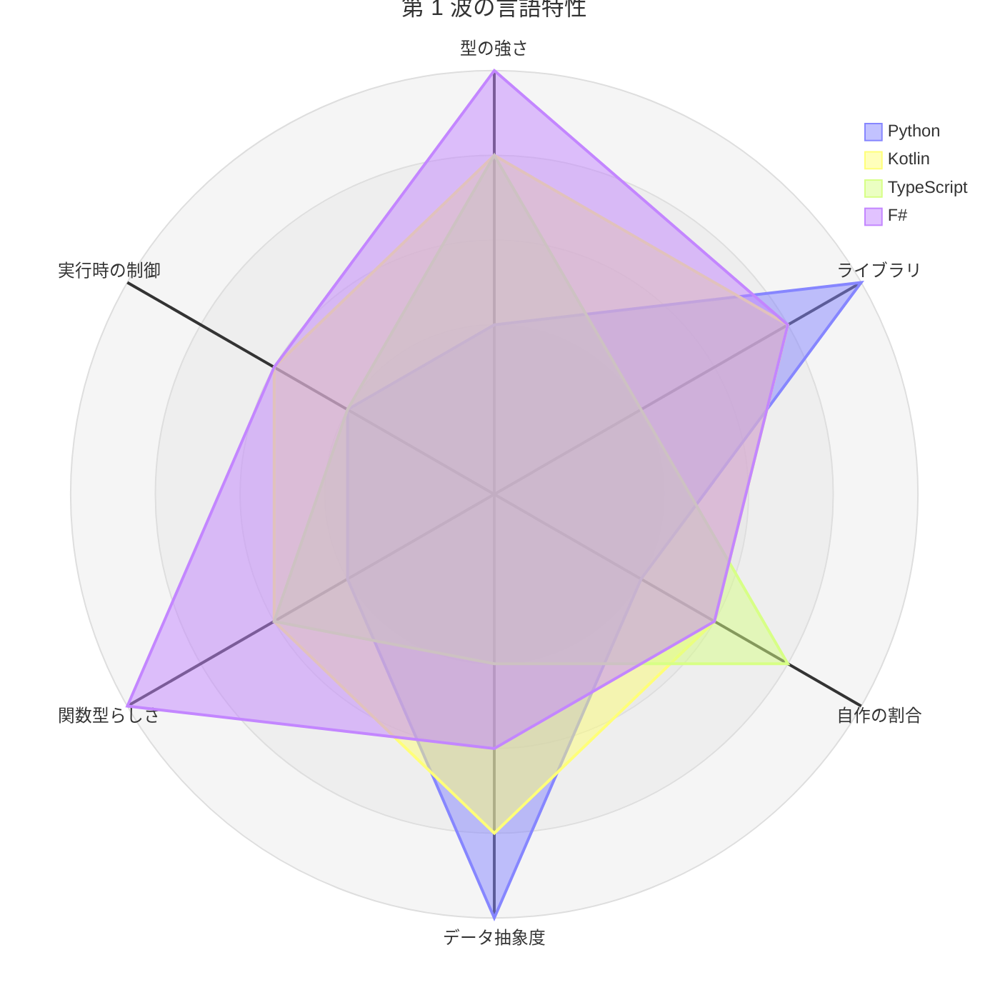
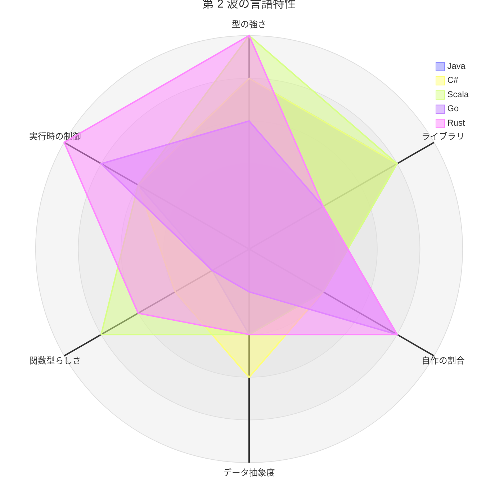
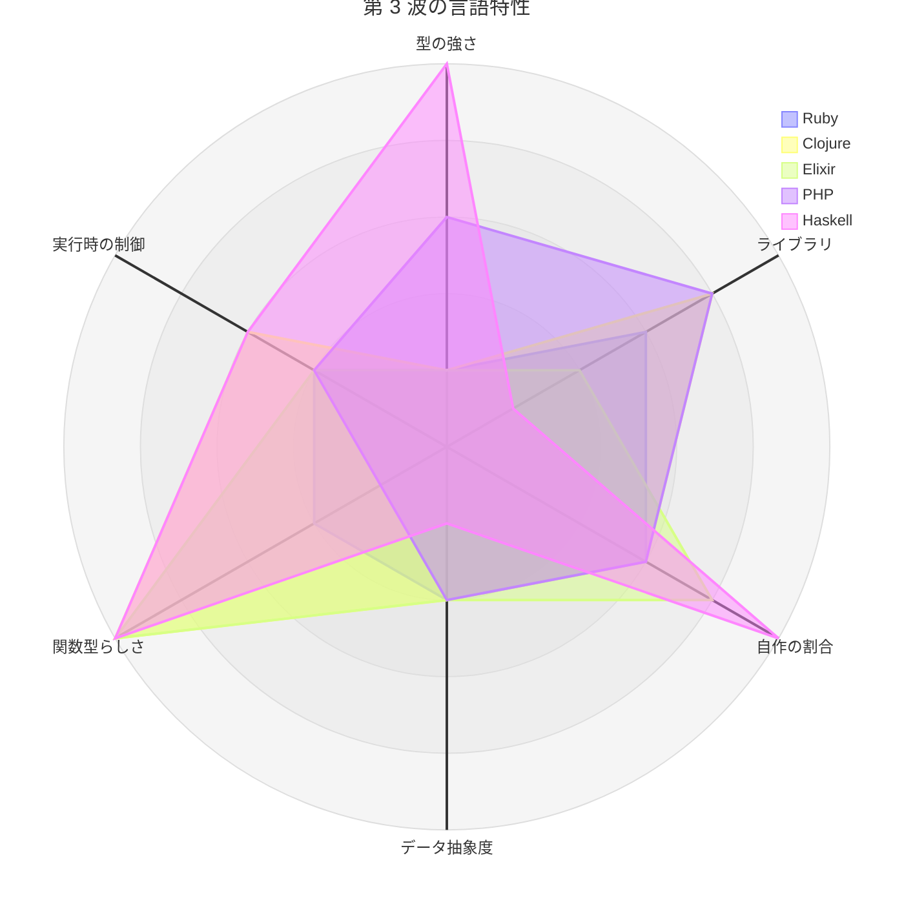
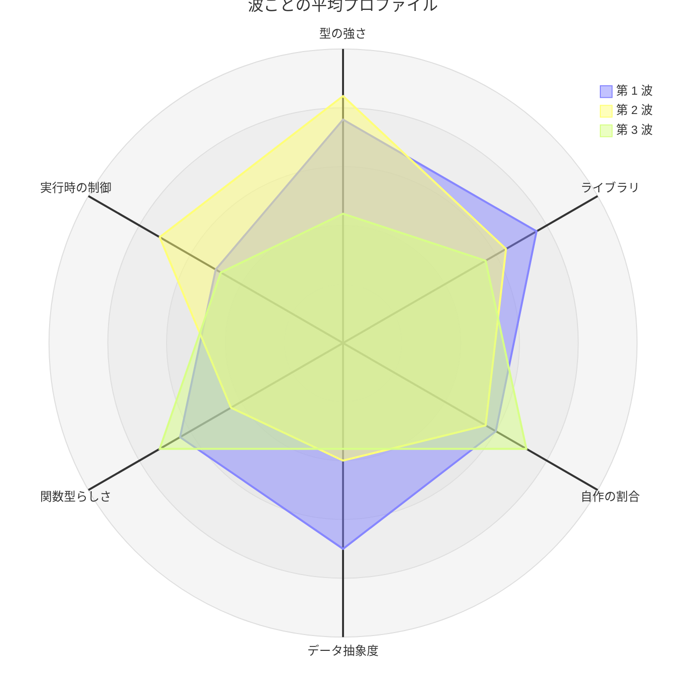

# 第 5 章: 学習ロードマップ

## 5.1 どの版から読むか

14 の言語版は、同じ題材・同じ TODO リストで書いています。どの版から読んでも、機械学習と TDD の内容は同じです。違いは、言語とライブラリで何を学べるかです。

| 目的 | おすすめの版 | 理由 |
|------|------------|------|
| 機械学習を仕事で使いたい | [Python](../python/index.md) | 参照実装。pandas・scikit-learn・FastAPI という事実上の標準の道具で、多くの章で自作とライブラリの結果が一致するところまで確かめられる。付録 A の総合演習がある |
| 型のある言語で機械学習を書きたい（JVM） | [Kotlin](../kotlin/index.md) | データフレームと静的型付けを両立する。ライブラリ（Tribuo）との違いを学習用テストで突き止める過程が多い |
| ライブラリが少ない環境で自作する力をつけたい | [Go](../go/index.md)・[TypeScript](../typescript/index.md)・[Elixir](../elixir/index.md)・[Haskell](../haskell/index.md) | 決定木も評価指標も自作が最終実装になる。**Haskell 版は機械学習のライブラリが 1 つも無く、この軸で最も極端** |
| 型で誤りを防ぐ設計を学びたい | [F#](../fsharp/index.md)・[Rust](../rust/index.md)・[Haskell](../haskell/index.md) | 代数的データ型・`option`／`Option`／`Maybe`・`Result`／`Either`・網羅性の検査で、ありえない状態を型で作れないようにする |
| Web 開発者で、機械学習を API として組み込みたい | [TypeScript](../typescript/index.md)・[Python](../python/index.md)・[PHP](../php/index.md) の第 15 章から逆にたどる | 第 15 章の API は第 7・8 章のモデルを使う。必要な章に戻りながら読める |
| 業務で使う JVM の言語で書きたい | [Java](../java/index.md)・[Scala](../scala/index.md)・[Clojure](../clojure/index.md) | どれも同じ Tribuo 4.3.2 を同じ JDK 21 で呼ぶ。**数値が完全に一致するので、書き方の違いだけを読み比べられる** |
| .NET で書きたい | [C#](../csharp/index.md) か [F#](../fsharp/index.md) | どちらも ML.NET を使う。C# は命令型、F# は関数型。こちらも数値が完全に一致する |
| 所有権とゼロコスト抽象化を学びたい | [Rust](../rust/index.md) | どこで複製するか、誰がデータを所有するかを毎回決める。並行性を型（`Send`・`Sync`）で保証する |
| 明示的で小さい言語が好み | [Go](../go/index.md) | 例外も判別共用体もジェネリクスの制約も最小限。標準ライブラリだけで API まで書ける |
| 動的型付けで、型を書かずに進めたい | [Ruby](../ruby/index.md) | 共通の型を 1 つも宣言しない（ダックタイピング）。RBS・Steep もあえて使わず、型の誤りをテストで捕まえる |
| 動的型付けだが、型の道具は使いたい | [PHP](../php/index.md) | `declare(strict_types=1)` と PHPStan のレベル 9 で配列の形まで検査する。**Ruby 版と正反対の選択**を、同じ動的型付けの言語で読み比べられる |
| 不変のデータと関数だけで書きたい | [Clojure](../clojure/index.md)・[Elixir](../elixir/index.md)・[F#](../fsharp/index.md) | 行列も木もパイプラインも素のデータ。Clojure はスレッディングマクロ、Elixir はパイプライン演算子と関数節 |
| 副作用を型で区切る設計を見たい | [Haskell](../haskell/index.md) | 「データの読み込みだけが `IO` で、前処理も学習も評価も純粋関数」が型で保証され、第 15 章ではそれがそのまま層の分離になる |

迷ったら、Python 版から読み始めてください。Python 版は、本シリーズの章の節構成を決めた版で、ほかの版は Python 版の同じ章を参照しながら書いています。

## 5.2 章の読み進め方

15 章は 5 部に分かれています。

| 部 | 章 | 内容 | 前提 |
|----|----|------|------|
| 第 1 部: 機械学習と TDD の基本サイクル | 1〜3 | ルールによる判定、前処理と分割、決定木 | なし |
| 第 2 部: 開発環境と自動化 | 4〜6 | バージョン管理、パッケージ管理と静的解析、タスクランナーと CI | 第 1 部 |
| 第 3 部: 回帰と実践的な前処理 | 7〜9 | 線形回帰、前処理パイプライン、特徴量エンジニアリング | 第 1 部 |
| 第 4 部: モデルの改善と評価 | 10〜12 | ロジスティック回帰とアンサンブル、評価指標と交差検証、正則化 | 第 1・3 部 |
| 第 5 部: 教師なし学習と実運用 | 13〜15 | 主成分分析、K-means、機械学習 API | 第 1・3 部（第 15 章は第 7・8 章のモデルを使う） |

- 第 1 部は、どの版でも最初に読んでください。第 2 章の分割と第 3 章の決定木は、後の章で何度も再利用します
- 第 2 部は、機械学習の内容を含みません。先に第 3〜5 部を読み、あとで開発環境を整えるときに戻っても構いません
- 第 3 部以降は、章ごとの独立性が高く、興味のある章から読めます。ただし第 10 章は第 3 章の決定木を、第 15 章は第 7・8 章のモデルを使います

各章は「TODO リスト → テスト（Red）→ 実装（Green）→ リファクタリング → ライブラリとの突き合わせ → 実データ → Notebook での探索」の順に進みます。記事のコードを写しながら、実際にテストを失敗させてから実装すると、TDD の手触りをつかめます。

**ライブラリとの突き合わせの節が無い章もあります。** Go 版・Elixir 版・Haskell 版は、置き換え先が無い章で「自作が最終実装である」と明記し、代わりに「値の分かっている入力」「満たすべき性質」「ほかの言語版の数値」で正しさを支えました。特に Haskell 版の第 11 章は、**シリーズで唯一、突き合わせの節そのものが存在しない章**です。

## 5.3 版をまたいで読み比べる

1 つの版を読み終えたら、別の版の同じ章を読み比べると、言語の違いがはっきり見えます。特に違いが大きい章を挙げます。

| 章 | 読み比べると見えること | 参照 |
|----|---------------------|------|
| 第 2 章 | データフレーム（Python・Kotlin）と、型やマップでデータを表す（ほかの 12 言語）違い。**乱数生成器の自作**（TypeScript・Elixir・PHP・Haskell）。「値が無い」の表し方（`Option`・`Maybe`・null 許容・多値返却） | 本解説の [第 2 章](02-data-structure-comparison.md) |
| 第 3 章 | 木の型と網羅性の検査（4 段階に分かれる）。ライブラリと 1 件だけ予測が違う原因の突き止め方（Kotlin・TypeScript・Rust・Ruby・PHP） | 本解説の [第 3 章](03-algorithm-implementation-comparison.md) |
| 第 5 章 | パッケージ管理と静的解析の道具の違い。F# 版では静的解析が何も検査していなかったことに気付く過程、Rust 版ではクレートの版が型を分けること、**Ruby 版では `RUBYLIB` が古い gem を読み込んでいたこと**、**PHP 版ではカバレッジドライバが環境に無かったこと** | 本解説の [第 1 章](01-language-and-library-overview.md) |
| 第 7 章 | 行列を自作するか、ライブラリを使うか、包まずにそのまま扱うか（Clojure）。**「SVD で解いた」が 3 つの版で 3 通りになる**（Elixir・PHP・Haskell） | 本解説の [第 4 章](04-library-ecosystem-comparison.md) |
| 第 9 章 | 標準偏差の割り方（件数か件数 − 1 か）、Shift_JIS の取り違えの現れ方（**例外・U+FFFD への置換・不正バイナリ・静かな文字化けの 4 通り**） | 本解説の [第 2 章](02-data-structure-comparison.md)・[第 4 章](04-library-ecosystem-comparison.md) |
| 第 11 章 | 評価関数を関数として渡す設計と、交差検証の遅延評価（**Clojure の 32 件チャンク、Haskell の `traverse` が遅延しないこと**） | 本解説の [第 3 章](03-algorithm-implementation-comparison.md) |
| 第 12 章 | 罰則の尺度がライブラリごとに違うこと。ラッソが無い版（Elixir・PHP・Haskell）は座標降下法を自作した | 本解説の [第 4 章](04-library-ecosystem-comparison.md) |
| 第 15 章 | 失敗の表し方（例外・検査例外・`Result`・`Either`・番兵のエラー）と入力の検証、置き場の約束の表し方（interface・behaviour・protocol・レコード・約束のテスト） | 本解説の [第 3 章](03-algorithm-implementation-comparison.md) |

読み比べの順は、次の 8 つがおすすめです。

**ライブラリの有無で比べる**

- **Python → Go（または Elixir）**: ライブラリがそろった環境と、そろっていない環境の差が分かります。「ライブラリが何をしてくれていたか」が、自作することで見えてきます
- **PHP → Elixir**: 同じ第 3 波で、**置き換えの範囲が正反対**です。PHP（Rubix ML）は決定木もランダムフォレストもあり第 3 章から突き合わせられ、Elixir（Scholar）は決定木が無いので第 3 章から自作が最終実装になります。**ライブラリの成熟度が記事の重心をどう動かすか**が、同じ章を並べると一目で分かります
- **Elixir → Haskell**: さらに狭い側へ進みます。Haskell には機械学習のライブラリが無く、突き合わせられるのは線形代数（hmatrix）と統計（statistics）だけです。**第 11 章は突き合わせの節が存在しません**

**型の使い方で比べる**

- **Python → F#（または Rust・Haskell）**: 同じ処理を、実行時のテストで確かめる書き方と、型で防ぐ書き方で比べられます
- **Ruby → PHP → Haskell**: 「型をどこまで書くか」の三者比較です。**Ruby は書かない**（RBS・Steep をあえて使わない）、**PHP は書くが飛ばせる**（`declare(strict_types=1)` と PHPStan は自分で選んで導入する）、**Haskell は飛ばせない**（書かなくても推論され、網羅していないパターンマッチは `-Wall -Werror` で止まる）。第 3 章の木の型と第 15 章の置き場の約束を並べると、この差がいちばん出ます

**同じ数値で、書き方だけを比べる**

- **Java → Scala → Clojure**: 同じ JVM・同じ Tribuo 4.3.2・同じ JDK 21・**同じ数値**で、命令型・式指向・データ指向の書き方だけが違います。自作と CART の相違件数まで一致するので、言語の違いだけを取り出して読めます
- **C# → F#**: 同じ .NET・同じ ML.NET・同じ数値で、命令型と関数型を比べられます
- **Elixir → PHP → Haskell**: **この 3 つは乱数生成器を自作しました。** `java.util.Random` と同じ 48 ビットの線形合同法を書いたので、シード 0 の並びが `[4, 8, 9, 6, 3, 5, 2, 1, 7, 0]` になり、**JVM の言語版（Java・Kotlin・Scala・Clojure）と一致します**。分割が同じなので、あとの章の数値もそろい、食い違ったときは原因が乱数ではないと分かります。書き方の違いはそこに集中して読めます——PHP は整数が溢れると float に化けるので上下 24 ビットに分けて掛け、Haskell と Java は折り返すので仕様をそのまま書けます

## 5.4 環境を用意する

サンプルコードは、言語ごとに `apps/` の下にあります。

| 版 | サンプルコード | 環境の用意 | 検査 |
|----|------------|----------|------|
| Python | `apps/python/` | `npx gulp apps:setup:python` | `npx gulp apps:check:python` |
| Kotlin | `apps/kotlin/` | `npx gulp apps:setup:kotlin` | `npx gulp apps:check:kotlin` |
| TypeScript | `apps/node/` | `npx gulp apps:setup:node` | `npx gulp apps:check:node` |
| F# | `apps/fsharp/` | `npx gulp apps:setup:fsharp` | `npx gulp apps:check:fsharp` |
| Java | `apps/java/` | `npx gulp apps:setup:java` | `npx gulp apps:check:java` |
| C# | `apps/csharp/` | `npx gulp apps:setup:csharp` | `npx gulp apps:check:csharp` |
| Scala | `apps/scala/` | `npx gulp apps:setup:scala` | `npx gulp apps:check:scala` |
| Go | `apps/go/` | `npx gulp apps:setup:go` | `npx gulp apps:check:go` |
| Rust | `apps/rust/` | `npx gulp apps:setup:rust` | `npx gulp apps:check:rust` |
| Ruby | `apps/ruby/` | `npx gulp apps:setup:ruby` | `npx gulp apps:check:ruby` |
| Clojure | `apps/clojure/` | `npx gulp apps:setup:clojure` | `npx gulp apps:check:clojure` |
| Elixir | `apps/elixir/` | `npx gulp apps:setup:elixir` | `npx gulp apps:check:elixir` |
| PHP | `apps/php/` | `npx gulp apps:setup:php` | `npx gulp apps:check:php` |
| Haskell | `apps/haskell/` | `npx gulp apps:setup:haskell` | `npx gulp apps:check:haskell` |

ツールが見つからないか版が合わない場合、タスクは Nix が導入されていれば対応する Nix の環境（`nix develop .#python`・`.#kotlin`・`.#node`・`.#dotnet`・`.#java`・`.#scala`・`.#go`・`.#rust`・`.#ruby`・`.#clojure`・`.#elixir`・`.#php`・`.#haskell`）の中で実行します。

**手元の処理系と Nix の処理系は、版が違うことがあります。** Ruby 版は Nix の Ruby 3.3 を前提にし（macOS 同梱の 2.6 では動きません）、Clojure は `java` コマンドが 25 でも JDK 21 で動き、Elixir は `erl` が OTP 28 でも自分が持つ OTP 27 で動きます。各版の第 1 章の環境構築の節に書いてあります。

**第 3 波では、環境定義そのものに手を入れる必要が 3 回ありました。** Clojure には clj-kondo と cljfmt が、PHP にはカバレッジドライバ（pcov）が、Haskell には fourmolu・hlint と BLAS/LAPACK が、素の環境に入っていませんでした。その経緯は各版の第 5〜6 章の題材になっています。

学習データは、書籍の配布データを使います。ライセンス上の理由でリポジトリには含めていないので、配布 ZIP（`sukkiri-ml-codes.zip`）を入手して `tmp/` に置き、`npx gulp data:setup` で `apps/data/sukkiri-ml/` に配置してください（[シリーズの概要](../index.md) の「学習データ」を参照）。学習データが無い環境でも、自作のテストデータを使うテストは通り、実データを使うテストだけがスキップされます。手順の詳細は、各版の第 1 章の「題材とデータ」を参照してください。

## 5.5 これからの版

本シリーズは、言語を 3 つの波に分けて追加しました。**第 1 波・第 2 波・第 3 波の 14 言語は、すべて全 15 章を書き終えています。**

| 波 | 言語 | 状況 |
|----|------|------|
| 第 1 波 | Python・Kotlin・TypeScript・F# | 完了 |
| 第 2 波 | Java・C#・Scala・Go・Rust | 完了 |
| 第 3 波 | Ruby・Clojure・Elixir・PHP・Haskell | 完了 |

3 つの波を通して、比べる軸は次のように増えました。

| 波 | 新しく見えた軸 |
|----|--------------|
| 第 1 波 | データフレームを使うか、型でデータを表すか。ライブラリがそろっているか |
| 第 2 波 | 同じ実行環境の 2 言語は数値が一致する（Java と Scala、C# と F#）。**ライブラリが非決定的なことがある**（linfa） |
| 第 3 波 | **型をどこまで書くか**（Ruby・PHP・Haskell の三者比較）。**ライブラリの成熟度**（PHP は広い、Elixir は狭い、Haskell は無い）。**乱数生成器を自作すれば言語をまたいで数値がそろう**。**C ライブラリへの依存は 3 段で確認する**（Haskell） |

新しい版を追加するときは、本解説の各表に行と列を加えて更新します。第 2 波・第 3 波を加えたときは、表が横に広がりすぎたので、**波ごとに分けるか、標準偏差の割り方や余りの扱いのような「まとまり」で縦持ちに組み替えました**。

## 5.6 言語特性のレーダーチャート

本章までに見てきた違いを、6 つの軸で 0〜5 に置き直して図にします。**この点数は本シリーズの 15 章を書いた結果から付けたもので、言語の優劣ではありません。**「この版を読むと何が濃く出るか」の目安です。

| 軸 | 0 に近い | 5 に近い | 根拠にした章 |
|----|---------|---------|------------|
| 型の強さ | 型を書かない。誤りはテストで捕まえる | 判別共用体と網羅性の検査で、ありえない状態を作れない | 各版の第 12 章、本章の第 3 章 |
| ライブラリ（成熟度） | 機械学習のライブラリが無く、線形代数だけ | 前処理から評価まで事実上の標準がそろう | 本章の第 4 章 |
| 自作の割合 | ほとんどの章でライブラリに置き換わる | 決定木も評価指標も乱数も自作が最終実装 | 本章の第 3・4 章 |
| データ抽象度（データ表現） | 配列とレコードを自分で組む | データフレームで列単位に扱える | 本章の第 2 章 |
| 関数型らしさ | 可変オブジェクトと命令型のループが中心 | 不変データとパイプラインだけで書く | 各版の第 10・11 章 |
| 実行時の制御 | 実行環境に任せる | 所有権・複製・並行性を自分で決める | 各版の第 9・15 章 |

### 第 1 波（Python・Kotlin・TypeScript・F#）

Python はライブラリとデータフレームが最も強く、型と自作が最も弱い——参照実装としてちょうど反対側に F# が来ます。TypeScript は型の強さは F# に近いのに、ライブラリが弱いため自作が増えます。**「型の強さ」と「自作の割合」は独立した軸である**ことが、この 4 言語だけでも見えます。

### 第 2 波（Java・C#・Scala・Go・Rust）

Java・C#・Scala はライブラリ（Tribuo・ML.NET）がそろっているので自作が少なく、形がほぼ重なります。**重ならないのは「関数型らしさ」だけで、そこが Scala 版を読む理由になります。** Go と Rust は逆側に寄り、ライブラリが弱い分だけ自作と実行時の制御が伸びます。Rust の linfa は非決定的な結果を返すことがあり、それも自作を後押ししました。

### 第 3 波（Ruby・Clojure・Elixir・PHP・Haskell）

第 3 波は差が最も大きい波です。**Ruby（型を書かない）→ PHP（`declare(strict_types=1)` と PHPStan のレベル 9）→ Haskell（飛ばせない）が「型の強さ」で 1・3・5 に並び**、同じ図の中で三者比較できます。Haskell は機械学習のライブラリが 1 つも無いため「ライブラリの成熟度」が 1、「自作の割合」が 5 という、14 言語で最も極端な形になります。Clojure と Elixir は「関数型らしさ」で重なり、分かれるのはライブラリの成熟度（Tribuo と Scholar）です。

### 14 言語の点数

図では重なりで読み取りにくいので、同じ値を表にも載せます。

| 言語 | 型の強さ | ライブラリ | 自作の割合 | データ抽象度 | 関数型らしさ | 実行時の制御 |
|------|---------|-----------|-----------|------------|------------|------------|
| [Python](../python/index.md) | 2 | 5 | 2 | 5 | 2 | 2 |
| [Kotlin](../kotlin/index.md) | 4 | 4 | 3 | 4 | 3 | 3 |
| [TypeScript](../typescript/index.md) | 4 | 2 | 4 | 2 | 3 | 2 |
| [F#](../fsharp/index.md) | 5 | 4 | 3 | 3 | 5 | 3 |
| [Java](../java/index.md) | 4 | 4 | 2 | 2 | 1 | 3 |
| [C#](../csharp/index.md) | 4 | 4 | 2 | 3 | 2 | 3 |
| [Scala](../scala/index.md) | 5 | 4 | 2 | 2 | 4 | 3 |
| [Go](../go/index.md) | 3 | 2 | 4 | 1 | 1 | 4 |
| [Rust](../rust/index.md) | 5 | 2 | 4 | 2 | 3 | 5 |
| [Ruby](../ruby/index.md) | 1 | 3 | 3 | 2 | 2 | 2 |
| [Clojure](../clojure/index.md) | 1 | 4 | 3 | 2 | 5 | 3 |
| [Elixir](../elixir/index.md) | 1 | 2 | 4 | 2 | 5 | 2 |
| [PHP](../php/index.md) | 3 | 4 | 3 | 2 | 1 | 2 |
| [Haskell](../haskell/index.md) | 5 | 1 | 5 | 1 | 5 | 3 |

### 図の読み方

1. **形が重なる版どうしは、書き方の違いだけを読み比べられる** — Java・C#（と Scala の関数型以外）がその例です
2. **凹んだ軸が、その版の記事の重心になる** — ライブラリが凹んでいる版（Haskell・Go・TypeScript・Elixir）は自作の章が濃く、型が凹んでいる版（Ruby・Clojure）はテストの章が濃くなります
3. **同じ形を目指す必要はない** — Python 版と Haskell 版はほぼ正反対ですが、どちらも同じ 15 章を書き終えています

## 5.7 総合スコア比較

6 軸を合計すると、版ごとの「濃さ」を 1 つの数で比べられます。**この合計は言語の優劣ではなく、「6 軸のうちいくつが強く出たか」です。**合計が低い版は弱い版ではなく、どの軸も突出しない読みやすい版です。

| 版 | 波 | 合計（30 点満点） | 偏り（最大 − 最小） |
|----|----|-----------------|-------------------|
| [F#](../fsharp/index.md) | 第 1 波 | 23 | 2 |
| [Rust](../rust/index.md) | 第 2 波 | 21 | 3 |
| [Kotlin](../kotlin/index.md) | 第 1 波 | 21 | 1 |
| [Haskell](../haskell/index.md) | 第 3 波 | 20 | 4 |
| [Scala](../scala/index.md) | 第 2 波 | 20 | 3 |
| [Clojure](../clojure/index.md) | 第 3 波 | 18 | 4 |
| [Python](../python/index.md) | 第 1 波 | 18 | 3 |
| [C#](../csharp/index.md) | 第 2 波 | 18 | 2 |
| [TypeScript](../typescript/index.md) | 第 1 波 | 17 | 2 |
| [Elixir](../elixir/index.md) | 第 3 波 | 16 | 4 |
| [Java](../java/index.md) | 第 2 波 | 16 | 3 |
| [Go](../go/index.md) | 第 2 波 | 15 | 3 |
| [PHP](../php/index.md) | 第 3 波 | 15 | 3 |
| [Ruby](../ruby/index.md) | 第 3 波 | 13 | 2 |

**合計と偏りは別のことを表します。**

- **合計が高い版**（F# 23・Rust 21・Kotlin 21）は、多くの軸が同時に強く出ます。1 つの版で幅広く学べる代わりに、読む量も増えます
- **偏りが大きい版**（Haskell・Clojure・Elixir が 4）は、特定の軸だけが突き抜けます。Haskell は「型の強さ 5・関数型らしさ 5・自作 5」と「ライブラリ 1・データ抽象度 1」が同居し、**14 言語で最も尖った形**です
- **偏りが小さい版**（Kotlin 1・F# 2・Ruby 2）は形が丸く、どの章も似た手応えで進みます。Kotlin は合計 21 で偏り 1——**強さが特定の軸に寄らない唯一の版**です
- **合計が最も低い Ruby（13）は、最初に読む版として扱えます。**型も自作もライブラリも突出しないので、機械学習の手順そのものに集中できます

### 波ごとの平均プロファイル

14 言語を 1 枚に重ねると読めないので、波ごとに平均した形を重ねます。

| 波 | 型の強さ | ライブラリ | 自作の割合 | データ抽象度 | 関数型らしさ | 実行時の制御 | 合計の平均 |
|----|---------|-----------|-----------|------------|------------|------------|-----------|
| 第 1 波 | 3.8 | 3.8 | 3.0 | 3.5 | 3.2 | 2.5 | 19.8 |
| 第 2 波 | 4.2 | 3.2 | 2.8 | 2.0 | 2.2 | 3.6 | 18.0 |
| 第 3 波 | 2.2 | 2.8 | 3.6 | 1.8 | 3.6 | 2.4 | 16.4 |

**波を追うごとに、重心が「ライブラリとデータ抽象度」から「自作と関数型らしさ」へ移りました。**

- **データ抽象度は 3.5 → 2.0 → 1.8 と下がり続けます。** データフレームを持つのは第 1 波の Python・Kotlin にほぼ限られ、第 2 波以降は配列とレコードを自分で組むのが標準になりました
- **ライブラリは 3.8 → 3.2 → 2.8 と下がり、自作は 3.0 → 2.8 → 3.6 と第 3 波で跳ね上がります。** 第 3 波でライブラリの成熟度の幅（PHP の Rubix ML から Haskell の「無し」まで）が最も開いたためです
- **型の強さは第 2 波が最高（4.2）で、第 3 波が最低（2.2）です。** 第 2 波は静的型付けの 5 言語、第 3 波は動的型付けが 3 言語を占めます。**この落差が、第 3 波で「型をどこまで書くか」という新しい軸を生みました**
- **実行時の制御は第 2 波（3.6）が突出します。** Go と Rust を含む波だけが、所有権・複製・並行性を記事の主題に据えています

合計の平均は波を追うごとに下がりますが、これは第 3 波が易しいという意味ではありません。**軸が減ったのではなく、軸ごとの散らばりが増えた**ためです（第 3 波の偏りは 2〜4 と最も広い）。

## 5.8 まとめ

1. **迷ったら Python 版から** — 参照実装で、ライブラリとの突き合わせが最も多い。目的に応じて残りの 13 言語から選ぶ
2. **第 1 部から読む** — 第 2・3 章は後の章で再利用する。第 2 部は後回しにしてもよい
3. **版をまたいで読み比べる** — 第 2・3・5・7・9・11・12・15 章は、言語による違いが特に大きい
4. **ライブラリの成熟度で読み比べる** — PHP（広い）→ Elixir（狭い）→ Haskell（無い）と並べると、ライブラリが記事の重心をどう動かすかが見える
5. **型の使い方で読み比べる** — Ruby（書かない）→ PHP（書くが飛ばせる）→ Haskell（飛ばせない）は、同じ章で三者比較できる
6. **同じ数値の版を読み比べる** — Java・Scala・Clojure（JVM・Tribuo）、C# と F#（.NET・ML.NET）、Elixir・PHP・Haskell（自作の乱数で JVM 版と一致）は、書き方の違いだけを取り出して読める
7. **テストを失敗させてから実装する** — 記事の順に Red・Green・Refactor を回すと、TDD の手触りがつかめる
8. **レーダーチャートで当たりを付ける** — 5.6 の図で形が近い版は書き方の違いだけを、正反対の版は言語が設計に与える影響を読み比べられる
9. **合計と偏りで読む順を決める** — 5.7 の合計が低く偏りも小さい Ruby から入り、合計が高い F#・Rust・Kotlin で幅を広げ、偏りが大きい Haskell・Clojure・Elixir で尖った設計を見る、という順にたどれる
