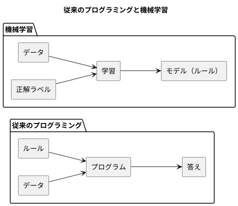
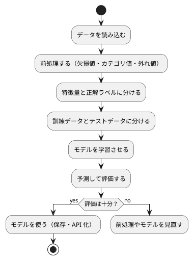

# 第 1 章: 機械学習とはじめてのテスト

## 1.1 はじめに

この章では、機械学習とは何かを確認したうえで、テスト駆動開発（TDD）で最初のプログラムを Java で作ります。題材は「きのこの山派か、たけのこの里派か」を身長・体重・年代から判定する問題です。

この章ではまだ機械学習のアルゴリズムを使いません。人間が考えたルールで判定し、その正解率を測るところまで進みます。「ルールを人間が書く」とはどういうことかを先に体験しておくと、第 3 章で「ルールをデータから学ばせる」ことの意味がはっきりします。

[Python 版の第 1 章](../python/01-machine-learning-and-first-test.md) と同じ題材・同じ TODO リストで進めます。Java 版は [Kotlin 版の第 1 章](../kotlin/01-machine-learning-and-first-test.md) と同じ JVM・Gradle・JUnit Platform の上で書くので、同じことを Java で書くとどうなるかに注目しながら読んでください。

## 1.2 機械学習とは

### ルールを書くか、データに学ばせるか

従来のプログラミングでは、人間が判定のルールをコードとして書きます。

```java
public static String predictByRule(Features features) {
  return features.ageGroup() == KINOKO_AGE_GROUP ? "きのこ" : "たけのこ";
}
```

これはこの章で実際に作るメソッドです。「20 代ならきのこ派」というルールは、人間がデータを眺めて立てた仮説にすぎません。データが増えたり傾向が変わったりすれば、人間がルールを書き直す必要があります。

機械学習では、ルールそのものをデータから導きます。人間が用意するのは「特徴量（判定の手がかり）」と「正解ラベル（本当の答え）」の組です。学習アルゴリズムがその組からルールを作り、未知のデータに当てはめて予測します。



### 機械学習のワークフロー

機械学習のプログラムは、おおむね次の流れで作ります。本シリーズの各章は、この流れのどこかを深掘りする構成になっています。



この章で扱うのは「データを読み込む」「特徴量と正解ラベルに分ける」「予測して評価する」の 3 つです。「学習させる」の代わりに、人間が書いたルールで予測します。

### 分類と回帰

| 種類 | 予測するもの | 例 |
|------|------------|-----|
| 分類 | どのグループに属するか（離散値） | きのこ派かたけのこ派か、アヤメの品種 |
| 回帰 | どれくらいの量か（連続値） | 映画の興行収入、住宅価格 |

この章の問題は、2 つのグループのどちらかを当てる分類です。

## 1.3 題材とデータ

### データの入手と配置

本シリーズの学習データは、書籍『スッキリわかる Python による機械学習入門』（インプレス, 2020）の配布データを使います。配布データは書籍購入者のみ利用できるため、リポジトリには含まれていません。[書籍サポートページ](https://sukkiri.jp/books/sukkiri_ml) から `sukkiri-ml-codes.zip` を入手し、リポジトリの `tmp/` に置いてから、リポジトリのルートで次を実行してください。

```bash
npx gulp data:setup
npx gulp data:check
```

`apps/data/sukkiri-ml/` に学習データが配置されます。このディレクトリは `.gitignore` の対象なので、誤ってコミットされることはありません。すべての言語版が同じデータを参照します。

### KvsT.csv

この章で使うのは `KvsT.csv` です。19 人分のデータが次の 4 列で記録されています。

| 列 | 意味 | 値 |
|----|------|-----|
| 身長 | 身長（cm） | 整数 |
| 体重 | 体重（kg） | 整数 |
| 年代 | 年代 | 10, 20, 30, 40 のいずれか |
| 派閥 | きのこの山派かたけのこの里派か | `きのこ` または `たけのこ` |

「身長」「体重」「年代」が特徴量、「派閥」が正解ラベルです。列名が日本語であることと、ファイルの先頭に BOM（バイトオーダーマーク）が付いていることに注意してください。

## 1.4 TODO リストの作成

仕様をそのままコードにするには大きすぎるので、まず TODO リストに分解します。

> TODO リスト
>
> 何をテストすべきだろうか——着手する前に、必要になりそうなテストをリストに書き出しておこう。
>
> — テスト駆動開発

**TODO リスト**:

- [ ] CSV を読み込む
  - [ ] BOM 付き CSV の 1 行を人物として読み込む
  - [ ] 複数行を行の順に読み込む
- [ ] 特徴量と正解ラベルに分ける
- [ ] ルールで派閥を判定する
  - [ ] 20 代ならきのこ派と判定する
  - [ ] 20 代以外ならたけのこ派と判定する
- [ ] 正解率を計算する
- [ ] 実データで正解率を表示する

## 1.5 開発環境の準備

### プロジェクトの構成

Java の実装は `apps/java/` にあります。ビルドには Gradle（Gradle Wrapper で版を固定）、テスティングフレームワークには [JUnit 6](https://junit.org/)、アサーションには [AssertJ](https://assertj.github.io/doc/) を使います。

```text
apps/java/
├── build.gradle.kts
├── settings.gradle.kts
├── config/pmd/ruleset.xml
├── gradle/
│   ├── gradle-daemon-jvm.properties
│   ├── libs.versions.toml
│   └── wrapper/
├── gradlew
├── gradlew.bat
└── src/
    ├── main/java/
    │   ├── dataset/
    │   │   └── DataDir.java
    │   └── chapter01/
    │       ├── Features.java
    │       ├── FeaturesAndLabels.java
    │       ├── KinokoTakenoko.java
    │       ├── Main.java
    │       └── Person.java
    └── test/java/
        ├── setup/
        │   └── SetupTest.java
        ├── support/
        │   └── StdoutCapture.java
        ├── dataset/
        │   └── DataDirTest.java
        └── chapter01/
            ├── KinokoTakenokoTest.java
            ├── KvsTDataTest.java
            └── LoadPeopleTest.java
```

Java では、公開するクラスごとに 1 つのファイルを作り、ファイル名をクラス名と同じにします。Kotlin 版では `KinokoTakenoko.kt` の 1 ファイルに data class と関数をまとめましたが、Java 版では record ごとにファイルが分かれます。

ビルドの設定は Kotlin 版と同じ構成です。`settings.gradle.kts` では、ビルドに使う JDK 21 が手元に無ければ自動で取得するプラグインを設定しています。

```kotlin
plugins {
    // toolchain で指定した JDK が無ければ自動で取得する
    id("org.gradle.toolchains.foojay-resolver-convention") version "1.0.0"
}

rootProject.name = "getting-started-ml"
```

ビルドファイルは Java のプロジェクトでも Kotlin DSL（`build.gradle.kts`）で書きます。`build.gradle.kts` のうち、テストに関わる部分は次のとおりです。

```kotlin
plugins {
    java
}

repositories {
    mavenCentral()
}

dependencies {
    testImplementation(platform(libs.junit.bom))
    testImplementation(libs.junit.jupiter)
    testImplementation(libs.assertj.core)
    testRuntimeOnly(libs.junit.platform.launcher)
}

java {
    toolchain {
        languageVersion = JavaLanguageVersion.of(21)
    }
}

tasks.test {
    useJUnitPlatform()
    testLogging {
        events("passed", "skipped", "failed")
        exceptionFormat = org.gradle.api.tasks.testing.logging.TestExceptionFormat.FULL
        showStackTraces = false
    }
    jvmArgs("-Dfile.encoding=UTF-8", "-Dstdout.encoding=UTF-8")
    // 学習データの場所（未指定なら ../data/sukkiri-ml）。値が変わればテストを再実行する
    val mlDataDir = providers.environmentVariable("ML_DATA_DIR")
    inputs.property("mlDataDir", mlDataDir.orElse(""))
    mlDataDir.orNull?.let { environment("ML_DATA_DIR", it) }
}
```

- `platform(libs.junit.bom)` は、JUnit の各モジュールの版を BOM（部品表）でそろえる指定です。`junit-jupiter` と `junit-platform-launcher` には版を書かず、BOM の版（6.1.3）に従わせます
- `java.toolchain` は、手元の Java の版に関係なく JDK 21 でコンパイル・テストすることを指定します。手元に JDK 25 しか無くても、Gradle が JDK 21 を用意して使います
- `testLogging` は、テストごとの結果と、失敗したときの期待値・実際の値をコンソールに表示します
- `-Dfile.encoding=UTF-8` は、Windows のコンソールで日本語のテスト名や出力が文字化けしないようにする設定です

ビルドファイルには、ほかに整形（Spotless）・静的解析（Error Prone・PMD）・カバレッジ（JaCoCo）の設定があり、`./gradlew check` でテストと一緒に実行されます。これらは第 5 章で詳しく扱います。

### 環境確認テスト

テスティングフレームワークが動くことを、最小のテストで確認します。

```java
// src/test/java/setup/SetupTest.java
package setup;

import static org.assertj.core.api.Assertions.assertThat;

import org.junit.jupiter.api.DisplayName;
import org.junit.jupiter.api.Test;

class SetupTest {
  @Test
  @DisplayName("テスティングフレームワークが動作する")
  void testingFrameworkWorks() {
    assertThat(1 + 1).isEqualTo(2);
  }
}
```

```bash
cd apps/java
./gradlew test
```

Windows の PowerShell では `.\gradlew.bat test` と実行します。

```text
SetupTest > テスティングフレームワークが動作する PASSED
BUILD SUCCESSFUL in 3s
```

Java のメソッド名には空白を含められないので、Kotlin 版のようにバッククォートで日本語の名前を付けることはできません。代わりに JUnit の `@DisplayName` で表示名を付けます。テストの一覧がそのまま仕様の一覧として読めるように、本シリーズでは表示名を日本語で書きます。

`assertThat(実際の値).isEqualTo(期待値)` は AssertJ の書き方です。JUnit の `assertEquals(期待値, 実際の値)` と比べて、引数の順を取り違えにくく、`containsExactly` のようにリストに向いた検査も続けて書けます。

テストのクラスを `setup` パッケージに置いているのは、静的解析の PMD が「名前の無いパッケージのクラス」を指摘するためです（`NoPackage`）。Kotlin 版は `SetupTest.kt` を名前の無いパッケージに置いていましたが、Java 版ではすべてのクラスを名前付きのパッケージに置きます。

## 1.6 CSV を読み込む

### テストファースト

TODO リストの最初の項目「BOM 付き CSV の 1 行を人物として読み込む」から始めます。実装より先にテストを書きます。

> テストファースト
>
> いつテストを書くべきだろうか——それはテスト対象のコードを書く前だ。
>
> — テスト駆動開発

テストでは学習データそのものは使いません。JUnit の `@TempDir` が用意する一時ディレクトリに、架空の値を 1 行だけ書いた CSV を作ります。

```java
// src/test/java/chapter01/LoadPeopleTest.java
package chapter01;

import static org.assertj.core.api.Assertions.assertThat;

import java.io.IOException;
import java.nio.charset.StandardCharsets;
import java.nio.file.Files;
import java.nio.file.Path;
import org.junit.jupiter.api.DisplayName;
import org.junit.jupiter.api.Test;
import org.junit.jupiter.api.io.TempDir;

class LoadPeopleTest {
  @TempDir Path directory;

  @Test
  @DisplayName("BOM 付き CSV を読み込んで人物のリストを返す")
  void readsCsvWithBom() throws IOException {
    Path csvFile =
        Files.writeString(
            directory.resolve("kvst.csv"),
            "\uFEFF身長,体重,年代,派閥\n165,58,30,きのこ\n",
            StandardCharsets.UTF_8);

    var people = KinokoTakenoko.loadPeople(csvFile);

    assertThat(people).containsExactly(new Person(165, 58, 30, "きのこ"));
  }
}
```

- `"\uFEFF"` は BOM の文字です。配布データと同じ形式のファイルでテストするために、先頭に付けています
- `@TempDir` を付けたフィールドには、テストごとに新しい一時ディレクトリが入り、テストの後に消されます
- `var` はローカル変数の型を右辺から推論させる書き方です（Java 10 以降）
- ファイルの読み書きは `IOException`（検査例外）を送出しうるので、テストのメソッドにも `throws IOException` を書きます。Kotlin には検査例外が無いので、この宣言は Java だけに現れます

### Red: 失敗を確認する

```text
> Task :compileTestJava FAILED
src/test/java/chapter01/LoadPeopleTest.java:27: エラー: シンボルを見つけられません
    var people = KinokoTakenoko.loadPeople(csvFile);
                 ^
  シンボル:   変数 KinokoTakenoko
  場所: クラス LoadPeopleTest
src/test/java/chapter01/LoadPeopleTest.java:29: エラー: シンボルを見つけられません
    assertThat(people).containsExactly(new Person(165, 58, 30, "きのこ"));
                                           ^
  シンボル:   クラス Person
  場所: クラス LoadPeopleTest
```

Java も Kotlin と同じく、テストの実行より前の **コンパイル** の段階で「`KinokoTakenoko` も `Person` も存在しない」と失敗します。コンパイラのメッセージが日本語なのは、`javac` が OS のロケールに合わせて表示するためです。

### Green: 仮実装

> 仮実装を経て本実装へ
>
> 失敗するテストを書いてから、最初に行う実装はどのようなものだろうか——ベタ書きの値を返そう。
>
> — テスト駆動開発

```java
// src/main/java/chapter01/Person.java
package chapter01;

/** 学習データ KvsT.csv の 1 行。身長・体重・年代と、正解ラベルの派閥を持つ。 */
public record Person(int height, int weight, int ageGroup, String faction) {}
```

```java
// src/main/java/chapter01/KinokoTakenoko.java
package chapter01;

import java.nio.file.Path;
import java.util.List;

/** きのこ派・たけのこ派の判定。 */
public final class KinokoTakenoko {
  private KinokoTakenoko() {}

  public static List<Person> loadPeople(Path csvFile) {
    return List.of(new Person(165, 58, 30, "きのこ"));
  }
}
```

`record`（Java 16 以降）は、宣言に並べた成分から、コンストラクタ・読み出し用のメソッド（`height()` など）・値による比較（`equals`・`hashCode`）・表示（`toString`）を自動で用意します。成分は生成後に変更できません。Kotlin の data class とほぼ同じ役割ですが、読み出しは `person.height` ではなく `person.height()` と書き、`copy` に当たるメソッドはありません。

Java には関数をクラスの外に置く書き方が無いので、処理は `KinokoTakenoko` クラスの `static` メソッドにします。インスタンスを作る必要が無いので、コンストラクタを `private` にして、`final` で継承も禁じます。

```text
LoadPeopleTest > BOM 付き CSV を読み込んで人物のリストを返す PASSED
SetupTest > テスティングフレームワークが動作する PASSED
BUILD SUCCESSFUL
```

### 三角測量

> 三角測量
>
> テストから最も慎重に一般化を引き出すやり方はどのようなものだろうか——2 つ以上の例があるときだけ、一般化を行うようにしよう。
>
> — テスト駆動開発

```java
  @Test
  @DisplayName("複数行の CSV を読み込んで行の順に人物のリストを返す")
  void readsRowsInOrder() throws IOException {
    Path csvFile =
        Files.writeString(
            directory.resolve("kvst.csv"),
            "\uFEFF身長,体重,年代,派閥\n161,52,20,きのこ\n183,74,50,たけのこ\n",
            StandardCharsets.UTF_8);

    var people = KinokoTakenoko.loadPeople(csvFile);

    assertThat(people)
        .containsExactly(new Person(161, 52, 20, "きのこ"), new Person(183, 74, 50, "たけのこ"));
  }
```

```text
LoadPeopleTest > 複数行の CSV を読み込んで行の順に人物のリストを返す FAILED
    org.opentest4j.AssertionFailedError:
    Expecting actual:
      [Person[height=165, weight=58, ageGroup=30, faction=きのこ]]
    to contain exactly (and in same order):
      [Person[height=161, weight=52, ageGroup=20, faction=きのこ],
        Person[height=183, weight=74, ageGroup=50, faction=たけのこ]]
    but some elements were not found:
      [Person[height=161, weight=52, ageGroup=20, faction=きのこ],
        Person[height=183, weight=74, ageGroup=50, faction=たけのこ]]
    and others were not expected:
      [Person[height=165, weight=58, ageGroup=30, faction=きのこ]]
```

record の `toString` と AssertJ の `containsExactly` のおかげで、「見つからなかった要素」と「余計な要素」が分けて表示されます。

ヘッダー行の列名から「何列目か」の対応表を作り、各行を `Person` に変換します。

```java
package chapter01;

import java.io.IOException;
import java.nio.charset.StandardCharsets;
import java.nio.file.Files;
import java.nio.file.Path;
import java.util.Arrays;
import java.util.List;
import java.util.Map;
import java.util.function.Function;
import java.util.stream.Collectors;
import java.util.stream.IntStream;

/** きのこ派・たけのこ派の判定。 */
public final class KinokoTakenoko {
  private static final String BOM = "\uFEFF";

  private KinokoTakenoko() {}

  /** BOM 付きの UTF-8 の CSV を読み込み、列名で値を取り出して人物のリストにする。 */
  public static List<Person> loadPeople(Path csvFile) throws IOException {
    List<String> lines = Files.readAllLines(csvFile, StandardCharsets.UTF_8);
    List<String> header = Arrays.asList(stripBom(lines.getFirst()).split(","));
    Map<String, Integer> index =
        IntStream.range(0, header.size())
            .boxed()
            .collect(Collectors.toMap(header::get, Function.identity()));
    return lines.stream()
        .skip(1)
        .filter(line -> !line.isBlank())
        .map(line -> line.split(","))
        .map(
            values ->
                new Person(
                    Integer.parseInt(values[index.get("身長")]),
                    Integer.parseInt(values[index.get("体重")]),
                    Integer.parseInt(values[index.get("年代")]),
                    values[index.get("派閥")]))
        .toList();
  }

  private static String stripBom(String line) {
    return line.startsWith(BOM) ? line.substring(BOM.length()) : line;
  }
}
```

- `IntStream.range(0, header.size())` で列番号を並べ、`Collectors.toMap(header::get, Function.identity())` で「列名 → 列番号」の `Map` を作ります。Kotlin 版の `withIndex().associate { ... }` に当たります。`boxed()` は `int` の列を `Integer` の列に変える操作で、`Map` の値にするために必要です
- `lines.stream().skip(1)` でヘッダー行を飛ばし、`map` で各行を `Person` に変換し、`toList()`（Java 16 以降）で変更できないリストにします
- `lines.getFirst()` は Java 21 で加わったメソッドで、`lines.get(0)` と同じです
- `loadPeople` は `Files.readAllLines` の `IOException` をそのまま呼び出し側へ伝えるので、`throws IOException` を宣言します

```text
LoadPeopleTest > BOM 付き CSV を読み込んで人物のリストを返す PASSED
LoadPeopleTest > 複数行の CSV を読み込んで行の順に人物のリストを返す PASSED
SetupTest > テスティングフレームワークが動作する PASSED
BUILD SUCCESSFUL
```

### BOM の落とし穴

`stripBom` を外すと、BOM 付きの CSV を読むテストが次のように失敗します。

```text
LoadPeopleTest > BOM 付き CSV を読み込んで人物のリストを返す FAILED
    java.lang.NullPointerException: Cannot invoke "java.lang.Integer.intValue()" because the return value of "java.util.Map.get(Object)" is null
```

`Files.readAllLines` は BOM を取り除かないので、先頭の列名に BOM の文字（U+FEFF）が付いたまま残り、`"身長"` という列名で引けなくなります。Python の `csv` モジュールや Kotlin の `readLines` と同じ落とし穴です。

失敗のしかたは Kotlin 版と違います。Kotlin 版は `getValue` を使ったので「キー `身長` が無い」と分かる例外になりました。Java の `Map.get` はキーが無ければ `null` を返し、それを `int` に変換しようとしたところで `NullPointerException` になります。Java のコンパイラは `null` を検査しないので、「値が無い場合」はコードを書く人が気をつけるしかありません。メッセージから原因（`Map.get` が `null` を返した）は読み取れますが、どの列名だったかまでは分かりません。

**TODO リスト**:

- [x] CSV を読み込む
  - [x] BOM 付き CSV の 1 行を人物として読み込む
  - [x] 複数行を行の順に読み込む
- [ ] 特徴量と正解ラベルに分ける
- [ ] ルールで派閥を判定する
  - [ ] 20 代ならきのこ派と判定する
  - [ ] 20 代以外ならたけのこ派と判定する
- [ ] 正解率を計算する
- [ ] 実データで正解率を表示する

## 1.7 特徴量と正解ラベルに分ける

残りのテストは `KinokoTakenokoTest` にまとめ、JUnit の `@Nested` で対象のメソッドごとに内側のクラスに分けます。

```java
// src/test/java/chapter01/KinokoTakenokoTest.java
class KinokoTakenokoTest {
  @Nested
  class SplitFeaturesAndLabels {
    @Test
    @DisplayName("人物のリストを特徴量と正解ラベルに分ける")
    void splitsPeople() {
      var people = List.of(new Person(161, 52, 20, "きのこ"), new Person(183, 74, 50, "たけのこ"));

      FeaturesAndLabels split = KinokoTakenoko.splitFeaturesAndLabels(people);

      assertThat(split.features())
          .containsExactly(new Features(161, 52, 20), new Features(183, 74, 50));
      assertThat(split.labels()).containsExactly("きのこ", "たけのこ");
    }
  }
}
```

`FeaturesAndLabels`・`Features`・`splitFeaturesAndLabels` がまだ無いので、1.6 節と同じく「シンボルを見つけられません」のコンパイルエラーになります。

やることが明らかな変換なので、明白な実装で進めます。

> 明白な実装
>
> シンプルな操作を実現するにはどうすればよいだろうか——そのまま実装しよう。
>
> — テスト駆動開発

```java
// src/main/java/chapter01/Features.java
/** 判定の手がかりになる特徴量。 */
public record Features(int height, int weight, int ageGroup) {}
```

```java
// src/main/java/chapter01/FeaturesAndLabels.java
/** 特徴量と正解ラベルの組。同じ位置の要素が同じ人物を表す。 */
public record FeaturesAndLabels(List<Features> features, List<String> labels) {}
```

```java
  /** 人物のリストを特徴量と正解ラベルに分ける。 */
  public static FeaturesAndLabels splitFeaturesAndLabels(List<Person> people) {
    List<Features> features =
        people.stream().map(p -> new Features(p.height(), p.weight(), p.ageGroup())).toList();
    List<String> labels = people.stream().map(Person::faction).toList();
    return new FeaturesAndLabels(features, labels);
  }
```

Kotlin 版は戻り値を `Pair` にして、分解宣言 `val (features, labels) = ...` で受け取りました。Java には `Pair` も分解宣言も無いので、2 つのリストを持つ record `FeaturesAndLabels` を作り、`split.features()`・`split.labels()` で取り出します。型に名前が付くぶん記述は増えますが、「何と何の組か」が型の名前と成分の名前で読めるようになります。

## 1.8 ルールで派閥を判定する

20 代のテストを書き、仮実装で Green にします。

```java
  @Nested
  class PredictByRule {
    @Test
    @DisplayName("20 代ならきのこ派と判定する")
    void twentiesAreKinoko() {
      assertThat(KinokoTakenoko.predictByRule(new Features(161, 52, 20))).isEqualTo("きのこ");
    }
  }
```

```java
  public static String predictByRule(Features features) {
    return "きのこ";
  }
```

三角測量として、20 代以外のテストを追加します。

```java
    @Test
    @DisplayName("20 代以外ならたけのこ派と判定する")
    void othersAreTakenoko() {
      assertThat(KinokoTakenoko.predictByRule(new Features(183, 74, 50))).isEqualTo("たけのこ");
    }
```

```text
KinokoTakenokoTest > PredictByRule > 20 代以外ならたけのこ派と判定する FAILED
    org.opentest4j.AssertionFailedError:
    expected: "たけのこ"
     but was: "きのこ"
```

Java の `if` は文なので値を返せません。値を返す条件分岐には、条件演算子 `条件 ? 真のときの値 : 偽のときの値` を使います。

```java
  /** 「20 代ならきのこ派」というルールの年代 */
  private static final int KINOKO_AGE_GROUP = 20;

  /** 人間が決めたルールで派閥を判定する。 */
  public static String predictByRule(Features features) {
    return features.ageGroup() == KINOKO_AGE_GROUP ? "きのこ" : "たけのこ";
  }
```

`20` は最初から名前付きの定数にしました。Kotlin 版は第 5 章で detekt の指摘を受けて定数にしましたが、Java 版で使う PMD の quickstart のルールセットには、この数値を指摘するルールは含まれていません。指摘されるかどうかにかかわらず、ルールの意味を名前で表すために定数にしています。

## 1.9 正解率を計算する

すべて正解のテストと仮実装から始めます。

```java
  @Nested
  class Accuracy {
    @Test
    @DisplayName("すべての予測が正解なら正解率は 1")
    void allCorrect() {
      assertThat(KinokoTakenoko.accuracy(List.of("きのこ", "たけのこ"), List.of("きのこ", "たけのこ")))
          .isEqualTo(1.0);
    }
  }
```

```java
  public static double accuracy(List<String> predictions, List<String> labels) {
    return 1.0;
  }
```

三角測量として、4 件中 3 件が正解の場合と、件数が違う場合を加えます。件数がずれるのは前処理のバグなので、黙って計算せずに例外で知らせることをテストで約束します。

```java
    @Test
    @DisplayName("4 件中 3 件の予測が正解なら正解率は 0.75")
    void threeOfFour() {
      var predictions = List.of("きのこ", "きのこ", "たけのこ", "たけのこ");
      var labels = List.of("きのこ", "たけのこ", "たけのこ", "たけのこ");

      assertThat(KinokoTakenoko.accuracy(predictions, labels)).isEqualTo(0.75);
    }

    @Test
    @DisplayName("予測と正解ラベルの件数が違えばエラーになる")
    void sizeMismatch() {
      assertThatThrownBy(() -> KinokoTakenoko.accuracy(List.of("きのこ"), List.of("きのこ", "たけのこ")))
          .isInstanceOf(IllegalArgumentException.class);
    }
```

```text
KinokoTakenokoTest > Accuracy > 4 件中 3 件の予測が正解なら正解率は 0.75 FAILED
    org.opentest4j.AssertionFailedError:
    expected: 0.75
     but was: 1.0

KinokoTakenokoTest > Accuracy > 予測と正解ラベルの件数が違えばエラーになる FAILED
    java.lang.AssertionError:
    Expecting code to raise a throwable.
```

```java
  /** 予測が正解ラベルと一致した割合を返す。 */
  public static double accuracy(List<String> predictions, List<String> labels) {
    if (predictions.size() != labels.size()) {
      throw new IllegalArgumentException("予測と正解ラベルの件数が違います");
    }
    long correct =
        IntStream.range(0, labels.size())
            .filter(i -> predictions.get(i).equals(labels.get(i)))
            .count();
    return (double) correct / labels.size();
  }
```

- Kotlin の `require` に当たる関数は Java の標準ライブラリに無いので、`if` と `throw` で書きます
- Java の標準ライブラリには 2 つのリストを組にする `zip` が無いので、`IntStream.range` で位置を並べ、同じ位置の予測と正解ラベルを比べます
- 文字列の比較には `==` ではなく `equals` を使います。`==` は同じオブジェクトかどうかを比べるので、内容が同じでも別に作られた文字列では偽になりえます
- `(double) correct` で `double` に変換してから割ります。整数どうしの割り算は整数の割り算になり、3 / 4 は 0 になってしまうためです

## 1.10 実データで正解率を表示する

### 学習データの場所を解決する

学習データの場所は、環境変数 `ML_DATA_DIR` で指定でき、指定が無ければ `apps/data/sukkiri-ml/` を使います。環境変数を読む関数を引数で受け取るようにすると、テストでは本物の環境変数を書き換えずに済みます。

```java
// src/test/java/dataset/DataDirTest.java
package dataset;

import static org.assertj.core.api.Assertions.assertThat;

import java.nio.file.Path;
import java.util.Map;
import org.junit.jupiter.api.DisplayName;
import org.junit.jupiter.api.Test;

class DataDirTest {
  @Test
  @DisplayName("環境変数 ML_DATA_DIR が指定されていればそのディレクトリを返す")
  void usesEnvironmentVariable() {
    Map<String, String> env = Map.of("ML_DATA_DIR", "/tmp/ml-data");

    assertThat(DataDir.dataDir(env::get)).isEqualTo(Path.of("/tmp/ml-data"));
  }

  @Test
  @DisplayName("環境変数が無ければ apps の data ディレクトリを返す")
  void defaultsToAppsData() {
    assertThat(DataDir.dataDir(name -> null)).isEqualTo(Path.of("../data/sukkiri-ml"));
  }
}
```

```text
src/test/java/dataset/DataDirTest.java:16: エラー: シンボルを見つけられません
src/test/java/dataset/DataDirTest.java:22: エラー: シンボルを見つけられません
```

```java
// src/main/java/dataset/DataDir.java
package dataset;

import java.nio.file.Path;
import java.util.Optional;
import java.util.function.Function;

/** 学習データのディレクトリを求める。 */
public final class DataDir {
  private DataDir() {}

  /** 環境変数 ML_DATA_DIR が無ければ apps/data/sukkiri-ml を使う。 */
  public static Path dataDir(Function<String, String> getenv) {
    return Optional.ofNullable(getenv.apply("ML_DATA_DIR"))
        .map(Path::of)
        .orElse(Path.of("../data/sukkiri-ml"));
  }

  /** 実行中のプロセスの環境変数から学習データのディレクトリを求める。 */
  public static Path dataDir() {
    return dataDir(System::getenv);
  }
}
```

- 引数 `getenv` の型 `Function<String, String>` は「文字列を受け取り、文字列を返す関数」です。Kotlin の `(String) -> String?` と違い、`null` を返しうるかどうかは型に表れません
- Java には引数の既定値が無いので、引数なしの `dataDir()` を別のメソッド（オーバーロード）として用意し、本物の環境変数を読む `System::getenv` を渡します
- `Optional.ofNullable(...).map(Path::of).orElse(...)` は、Kotlin の `?.let(::File) ?: ...` に当たる書き方です。「null でなければ `Path` に変換し、null なら既定の場所を使う」と読みます
- テストでは `env::get`（`Map` から値を引くメソッドへの参照）や `name -> null`（常に null を返すラムダ）を渡しています
- 既定の `../data/sukkiri-ml` は、Gradle がテストを `apps/java/` で実行することを前提にした相対パスです

### データが無ければスキップする

実データを使うテストは、JUnit の `Assumptions.assumeTrue` で、データが配置されていなければスキップします。

```java
// src/test/java/chapter01/KvsTDataTest.java
class KvsTDataTest {
  private final Path csvFile = DataDir.dataDir().resolve("KvsT.csv");

  @BeforeEach
  void requireData() {
    assumeTrue(Files.exists(csvFile), "学習データ KvsT.csv が配置されていない（gulp data:setup）");
  }

  @Test
  @DisplayName("実データから 19 人分を読み込む")
  void loadsNineteenPeople() throws IOException {
    assertThat(KinokoTakenoko.loadPeople(csvFile)).hasSize(19);
  }

  @Test
  @DisplayName("ルールによる判定の正解率を実データで計算する")
  void accuracyOfRule() throws IOException {
    FeaturesAndLabels split =
        KinokoTakenoko.splitFeaturesAndLabels(KinokoTakenoko.loadPeople(csvFile));

    var predictions = split.features().stream().map(KinokoTakenoko::predictByRule).toList();

    assertThat(KinokoTakenoko.accuracy(predictions, split.labels()))
        .isCloseTo(14.0 / 19, within(1e-12));
  }

  @Test
  @DisplayName("実行するとデータ件数と正解率を表示する")
  void mainPrintsSummary() throws Exception {
    String output = StdoutCapture.capture(() -> Main.main(new String[0]));

    assertThat(output).isEqualTo("データ件数: 19\nルールによる判定の正解率: 0.7368\n");
  }
}
```

- `@BeforeEach` のメソッドは各テストの前に呼ばれ、`assumeTrue` の条件が偽ならそのテストはスキップ扱いになります
- `map(KinokoTakenoko::predictByRule)` は、メソッド参照を `map` に渡して各特徴量を判定します
- 浮動小数点数の比較には、AssertJ の `isCloseTo` と `within` で許容誤差を指定します

`StdoutCapture.capture` は、標準出力を一時的に差し替えて `main` の出力を取り出すテスト用のメソッドです。どの章のテストからも使えるように `support` パッケージに置きます。

```java
// src/test/java/support/StdoutCapture.java
/** 標準出力に書かれた内容を取り出す。 */
public final class StdoutCapture {
  private StdoutCapture() {}

  /** 標準出力に書く処理。例外を投げてよい。 */
  @FunctionalInterface
  public interface Block {
    void run() throws Exception;
  }

  // 元の System.out は後で戻すために保持するだけで、閉じてはいけない
  @SuppressWarnings("PMD.CloseResource")
  public static String capture(Block block) throws Exception {
    PrintStream original = System.out;
    ByteArrayOutputStream buffer = new ByteArrayOutputStream();
    try (PrintStream capturing = new PrintStream(buffer, true, StandardCharsets.UTF_8)) {
      System.setOut(capturing);
      block.run();
    } finally {
      System.setOut(original);
    }
    return buffer.toString(StandardCharsets.UTF_8).replace("\r\n", "\n");
  }
}
```

- 標準の `Runnable` は検査例外を投げられないので、`throws Exception` を宣言した関数型インターフェース `Block` を作りました。`main` が `IOException` を投げうるためです
- 差し替え用の `PrintStream` は `try` の括弧の中で作り（try-with-resources）、使い終わったら必ず閉じます。最初はブロックの外で作っていたので、PMD の `CloseResource` に「閉じていない」と指摘されました
- 元の `System.out` も同じルールで指摘されますが、こちらは後で戻すために持っておくだけで、閉じてはいけません。そこで理由をコメントに書いたうえで、このメソッドだけ `@SuppressWarnings("PMD.CloseResource")` で指摘を抑えています

`main` と表示のテストは、実データで出力を確かめながら書いたので、Red を経ずに通っています。出力を固定し、変更で表示が変わったことに気づけるようにするためのテストです。

### 結果を表示する

```java
// src/main/java/chapter01/Main.java
package chapter01;

import dataset.DataDir;
import java.io.IOException;
import java.util.List;
import java.util.Locale;

/** 実データでルールによる判定の正解率を表示する。 */
public final class Main {
  private Main() {}

  public static void main(String[] args) throws IOException {
    List<Person> people = KinokoTakenoko.loadPeople(DataDir.dataDir().resolve("KvsT.csv"));
    FeaturesAndLabels split = KinokoTakenoko.splitFeaturesAndLabels(people);
    List<String> predictions =
        split.features().stream().map(KinokoTakenoko::predictByRule).toList();
    System.out.println("データ件数: " + people.size());
    System.out.println(
        "ルールによる判定の正解率: "
            + String.format(
                Locale.ROOT, "%.4f", KinokoTakenoko.accuracy(predictions, split.labels())));
  }
}
```

`String.format` に `Locale.ROOT` を渡しているのは、実行環境のロケールによっては小数点がカンマ（`0,7368`）で表示されるためです。テストで表示を固定する場合は、ロケールに依存しない書式にしておきます。

章ごとの `main` は、`runChapter` タスクで実行します。

```bash
./gradlew runChapter -Pchapter=01
```

```text
データ件数: 19
ルールによる判定の正解率: 0.7368
```

第 1 章には乱数を使う処理が無いので、Python 版・Kotlin 版と同じ 19 件・0.7368 になります。

データが無い環境では、実データのテスト 3 件がスキップされます。

```bash
ML_DATA_DIR=/nonexistent ./gradlew test
```

```text
KvsTDataTest > 実行するとデータ件数と正解率を表示する SKIPPED
KvsTDataTest > ルールによる判定の正解率を実データで計算する SKIPPED
KvsTDataTest > 実データから 19 人分を読み込む SKIPPED
BUILD SUCCESSFUL in 9s
```

**TODO リスト**:

- [x] CSV を読み込む
  - [x] BOM 付き CSV の 1 行を人物として読み込む
  - [x] 複数行を行の順に読み込む
- [x] 特徴量と正解ラベルに分ける
- [x] ルールで派閥を判定する
  - [x] 20 代ならきのこ派と判定する
  - [x] 20 代以外ならたけのこ派と判定する
- [x] 正解率を計算する
- [x] 実データで正解率を表示する

## 1.11 リファクタリング

### テストの重複をまとめる

CSV を読み込むテストでは、ヘッダー行と CSV の書き出しが重複していました。ヘッダーを定数に、書き出しをヘルパーメソッドにまとめます。

```java
class LoadPeopleTest {
  private static final String HEADER = "\uFEFF身長,体重,年代,派閥\n";

  @TempDir Path directory;

  private Path writeCsv(String rows) throws IOException {
    return Files.writeString(directory.resolve("kvst.csv"), HEADER + rows, StandardCharsets.UTF_8);
  }

  @Test
  @DisplayName("BOM 付き CSV を読み込んで人物のリストを返す")
  void readsCsvWithBom() throws IOException {
    Path csvFile = writeCsv("165,58,30,きのこ\n");

    var people = KinokoTakenoko.loadPeople(csvFile);

    assertThat(people).containsExactly(new Person(165, 58, 30, "きのこ"));
  }
```

### コードスタイルと静的解析

`./gradlew check` は、テストに加えて次の 3 つを検査し、1 つでも指摘があれば失敗します（設定は第 5 章で扱います）。

| ツール | 検査すること | 例 |
|--------|------------|-----|
| [Spotless](https://github.com/diffplug/spotless)（google-java-format） | 整形 | インデント・改行の位置 |
| [Error Prone](https://errorprone.info/) | コンパイル時に、バグになりやすい書き方 | 作ったのに投げない例外、使われないメソッド |
| [PMD](https://pmd.github.io/) | コーディング規約 | 名前の無いパッケージ、閉じていないリソース |

```bash
./gradlew spotlessApply
./gradlew check
```

`spotlessApply` は、整形の指摘を自動で直します。

TDD の途中で役に立ったのは Error Prone です。仮実装に戻して失敗を確かめようとしたとき、本実装の `stripBom` を残したままにしていたところ、コンパイルが次のように止まりました。

```text
KinokoTakenoko.java:28: 警告: [UnusedMethod] Method 'stripBom' is never used.
  private static String stripBom(String line) {
                        ^
    (see https://errorprone.info/bugpattern/UnusedMethod)
  Did you mean to remove this line?
エラー: 警告が見つかり-Werrorが指定されました
```

コンパイラの警告をエラーとして扱う設定（`-Werror`）にしているので、使われていないコードが残っているとテストまで進みません。仮実装の段階では、まだ必要の無いコードを書かないという TDD の規律を、ツールが後押ししてくれます。

```text
BUILD SUCCESSFUL
```

<details>
<summary>この章の完成コード（src/main/java/chapter01/KinokoTakenoko.java）</summary>

```java
package chapter01;

import java.io.IOException;
import java.nio.charset.StandardCharsets;
import java.nio.file.Files;
import java.nio.file.Path;
import java.util.Arrays;
import java.util.List;
import java.util.Map;
import java.util.function.Function;
import java.util.stream.Collectors;
import java.util.stream.IntStream;

/** きのこ派・たけのこ派の判定。 */
public final class KinokoTakenoko {
  private static final String BOM = "\uFEFF";

  /** 「20 代ならきのこ派」というルールの年代 */
  private static final int KINOKO_AGE_GROUP = 20;

  private KinokoTakenoko() {}

  /** BOM 付きの UTF-8 の CSV を読み込み、列名で値を取り出して人物のリストにする。 */
  public static List<Person> loadPeople(Path csvFile) throws IOException {
    List<String> lines = Files.readAllLines(csvFile, StandardCharsets.UTF_8);
    List<String> header = Arrays.asList(stripBom(lines.getFirst()).split(","));
    Map<String, Integer> index =
        IntStream.range(0, header.size())
            .boxed()
            .collect(Collectors.toMap(header::get, Function.identity()));
    return lines.stream()
        .skip(1)
        .filter(line -> !line.isBlank())
        .map(line -> line.split(","))
        .map(
            values ->
                new Person(
                    Integer.parseInt(values[index.get("身長")]),
                    Integer.parseInt(values[index.get("体重")]),
                    Integer.parseInt(values[index.get("年代")]),
                    values[index.get("派閥")]))
        .toList();
  }

  private static String stripBom(String line) {
    return line.startsWith(BOM) ? line.substring(BOM.length()) : line;
  }

  /** 人物のリストを特徴量と正解ラベルに分ける。 */
  public static FeaturesAndLabels splitFeaturesAndLabels(List<Person> people) {
    List<Features> features =
        people.stream().map(p -> new Features(p.height(), p.weight(), p.ageGroup())).toList();
    List<String> labels = people.stream().map(Person::faction).toList();
    return new FeaturesAndLabels(features, labels);
  }

  /** 人間が決めたルールで派閥を判定する。 */
  public static String predictByRule(Features features) {
    return features.ageGroup() == KINOKO_AGE_GROUP ? "きのこ" : "たけのこ";
  }

  /** 予測が正解ラベルと一致した割合を返す。 */
  public static double accuracy(List<String> predictions, List<String> labels) {
    if (predictions.size() != labels.size()) {
      throw new IllegalArgumentException("予測と正解ラベルの件数が違います");
    }
    long correct =
        IntStream.range(0, labels.size())
            .filter(i -> predictions.get(i).equals(labels.get(i)))
            .count();
    return (double) correct / labels.size();
  }
}
```

</details>

## 1.12 まとめ

この章では、機械学習のワークフローのうち「読み込む」「特徴量と正解ラベルに分ける」「予測して評価する」を、Java の TDD で実装しました。

1. **コンパイルが最初の Red になる** — 存在しないクラスやメソッドは、テストの実行前にコンパイラが知らせた
2. **record** — 値による比較と読みやすい `toString` で、テストの期待値と失敗メッセージが簡潔になった。Kotlin の `Pair` の代わりに、組にも名前付きの record を使った
3. **null はコンパイラが検査しない** — `Map.get` の `null` は実行時の `NullPointerException` になった。`Optional` で「値が無い場合」をコードの上で明示した
4. **関数を引数で渡す** — 環境変数を読む関数を `Function` で受け取り、テストで差し替えられるようにした
5. **学習データと切り離したテスト** — 架空の値の CSV で単体テストを書き、実データのテストは `assumeTrue` でスキップした
6. **静的解析を最初から効かせる** — Error Prone と PMD の指摘で、残ったコードや閉じていないリソースに早く気づけた

人間が書いた「20 代ならきのこ派」というルールの正解率は、Python 版・Kotlin 版と同じ 0.7368 でした。次の章では、データフレームのライブラリを使わずに、record のリストと Stream API で欠損値を含むアヤメのデータを前処理し、訓練データとテストデータに分けます。
