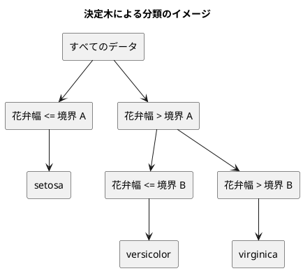

# 第 3 章: 決定木による分類と明白な実装

## 3.1 はじめに

第 1 章では「20 代ならきのこ派」というルールを人間が書き、第 2 章では欠損値を補完した特徴量 `Features` を用意しました。この章では、「どの特徴量のどこで区切るか」をデータから自動で探すアルゴリズム、**決定木** を自作します。

自作したあとは、JVM の機械学習ライブラリ [Tribuo](https://tribuo.org/) の決定木（CART）に同じデータを学習させ、予測を突き合わせます。[Python 版の第 3 章](../python/03-decision-tree-and-obvious-implementation.md) では scikit-learn と予測がすべて一致し、[Kotlin 版の第 3 章](../kotlin/03-decision-tree-and-obvious-implementation.md) では深さ 3 以上で 1 件だけ一致しない予測が見つかりました。Java 版は Kotlin 版と同じ Tribuo を使うので、Kotlin 版で突き止めた「同点のときの選び方の違い」がそのまま現れるかを確かめます。

Java 版では、木を **sealed interface と record** で表し、**`switch` のパターンマッチ** で葉と節を場合分けする書き方に注目してください。Kotlin 版の sealed interface・data class・`when` と、ほぼ 1 対 1 に対応します。

## 3.2 決定木の仕組み

### データを 2 つに分けることを繰り返す

決定木は、データを「ある特徴量がある値以下か、より大きいか」で 2 つに分けることを繰り返します。分けた先で同じラベルばかりになったら、そこで分けるのをやめて、そのラベルを予測に使います。



### どこで分けるかをジニ不純度で決める

「よい分け方」とは、分けた後のそれぞれのグループで、ラベルがなるべく 1 種類にそろう分け方です。そろい具合を数値にしたものが **ジニ不純度** です。

ジニ不純度 = 1 − Σ（各ラベルの割合）²

| グループのラベル | 割合 | ジニ不純度 |
|----------------|------|-----------|
| setosa ×3 | setosa 1.0 | 1 − 1.0² = 0 |
| setosa ×1、virginica ×1 | 0.5、0.5 | 1 − (0.5² + 0.5²) = 0.5 |
| 3 品種 ×1 ずつ | 1/3 ずつ | 1 − 3 × (1/3)² = 2/3 |

ラベルが 1 種類にそろうと 0、混ざるほど大きくなります。分け方の候補ごとに、分けた後の左右のジニ不純度を件数で重み付けして平均し、最も小さくなる分け方を選びます。

## 3.3 TODO リストの作成

**TODO リスト**:

- [ ] ジニ不純度を計算する
- [ ] 最良の分割を探す
  - [ ] ラベルを完全に分けられる境界を見つける
  - [ ] 複数の特徴量から最良の特徴量と境界を選ぶ
  - [ ] ラベルが 1 種類なら分割しない
- [ ] 決定木を学習して予測する
  - [ ] 1 種類のラベルだけを学習したらそのラベルを予測する
  - [ ] 境界の左右で異なるラベルを予測する
- [ ] 木の深さを制限する
- [ ] 学習した木を読める形で表示する
- [ ] Tribuo の決定木と突き合わせる
  - [ ] `Features` を Tribuo のデータセットに変換する
  - [ ] 予測が一致しない場合は原因を突き止める
- [ ] 実データで深さと正解率の関係を表示する

## 3.4 ジニ不純度を計算する

### 仮実装から始める

ラベルが 1 種類ならジニ不純度は 0 です。

```java
// src/test/java/chapter03/DecisionTreeTest.java
class DecisionTreeTest {
  @Nested
  class Gini {
    @Test
    @DisplayName("1 種類のラベルだけならジニ不純度は 0")
    void pure() {
      assertThat(DecisionTrees.gini(List.of("Iris-setosa", "Iris-setosa", "Iris-setosa")))
          .isEqualTo(0.0);
    }
  }
}
```

`DecisionTrees` が無いのでコンパイルエラーになります（Red）。仮実装で 0 を返します。

```java
// src/main/java/chapter03/DecisionTrees.java
/** 決定木を作り、予測し、表示する関数。 */
public final class DecisionTrees {
  private DecisionTrees() {}

  public static double gini(List<String> labels) {
    return 0.0;
  }
}
```

Kotlin 版はトップレベルの関数 `gini` にしましたが、Java には関数をクラスの外に置く書き方が無いので、第 1 章の `KinokoTakenoko` と同じく `static` メソッドだけを持つクラスにします。

### 三角測量

2 種類のラベルが半分ずつの場合と、3 品種が 1 件ずつの場合を加えます。

```java
    @Test
    @DisplayName("2 種類のラベルが半分ずつならジニ不純度は 0.5")
    void half() {
      assertThat(DecisionTrees.gini(List.of("Iris-setosa", "Iris-virginica"))).isEqualTo(0.5);
    }

    @Test
    @DisplayName("3 種類のラベルが同じ数ならジニ不純度は 3 分の 2")
    void three() {
      assertThat(DecisionTrees.gini(List.of("Iris-setosa", "Iris-versicolor", "Iris-virginica")))
          .isCloseTo(2.0 / 3, within(1e-12));
    }
```

```text
DecisionTreeTest > Gini > 2 種類のラベルが半分ずつならジニ不純度は 0.5 FAILED
    org.opentest4j.AssertionFailedError: 
    expected: 0.5
     but was: 0.0
DecisionTreeTest > Gini > 1 種類のラベルだけならジニ不純度は 0 PASSED
DecisionTreeTest > Gini > 3 種類のラベルが同じ数ならジニ不純度は 3 分の 2 FAILED
    java.lang.AssertionError: 
    Expecting actual:
      0.0
    to be close to:
      0.6666666666666666
    by less than 1.0E-12 but difference was 0.6666666666666666.
    (a difference of exactly 1.0E-12 being considered valid)
3 tests completed, 2 failed
```

2/3 は小数で正確に表せないので、`isCloseTo` と `within` で誤差を許容して比べます。例が揃ったので、定義どおりに一般化します。

```java
  /** ジニ不純度。ラベルが 1 種類なら 0 で、種類が多く均等なほど大きい。 */
  public static double gini(List<String> labels) {
    double total = labels.size();
    return 1.0
        - counts(labels).values().stream().mapToDouble(count -> Math.pow(count / total, 2)).sum();
  }

  /** ラベルごとの件数を、ラベルが先に現れた順に並べて返す。 */
  private static Map<String, Integer> counts(List<String> labels) {
    Map<String, Integer> counts = new LinkedHashMap<>();
    labels.forEach(label -> counts.merge(label, 1, Integer::sum));
    return counts;
  }
```

- `counts.merge(label, 1, Integer::sum)` は、キーが無ければ 1 を入れ、あれば今の値に 1 を足します。Kotlin 版の `groupingBy { it }.eachCount()` に当たります
- `total` を `double` にしているのは、`int` 同士の割り算が切り捨てになるためです。`count / total` は `int` を `double` で割るので、`double` の割り算になります
- `LinkedHashMap` で「先に現れた順」を保っているのは、3.6 節の多数決で使うためです

## 3.5 最良の分割を探す

### 分割を表す record

分割は「どの特徴量を」「どの値（境界）で」分けたか、「分けた後の不純度」の 3 つで表します。

```java
// src/main/java/chapter03/Split.java
/** 決定木の分割。特徴量の値が境界以下なら左、境界より大きければ右へ進む。 */
public record Split(String feature, double threshold, double impurity) {}
```

### テスト

テスト用の特徴量を短く作れるように、1 列だけの `Features` を並べるヘルパーを用意します。

```java
// src/test/java/chapter03/Samples.java
/** テスト用の特徴量を作る。 */
final class Samples {
  private Samples() {}

  /** 1 列だけの特徴量を値の数だけ作る。 */
  static List<Features> column(String name, double... values) {
    return Arrays.stream(values)
        .mapToObj(v -> new Features(List.of(name), new double[] {v}))
        .toList();
  }
}
```

`double... values` は **可変長引数** です。`column("花弁幅", 0.1, 0.2, 0.7, 0.8)` のように、値をいくつでも並べて渡せます。メソッドの中では `double[]` として受け取ります。

```java
  @Nested
  class BestSplit {
    @Test
    @DisplayName("ラベルを完全に分けられる境界を見つける")
    void separates() {
      var x = column("花弁幅", 0.1, 0.2, 0.7, 0.8);
      var t = List.of("setosa", "setosa", "virginica", "virginica");

      Split split = DecisionTrees.bestSplit(x, t).orElseThrow();

      assertThat(split.feature()).isEqualTo("花弁幅");
      assertThat(split.threshold()).isCloseTo(0.45, within(1e-12));
      assertThat(split.impurity()).isCloseTo(0.0, within(1e-12));
    }

    @Test
    @DisplayName("複数の特徴量から不純度が最も小さくなる特徴量と境界を選ぶ")
    void choosesBestFeature() {
      var columns = List.of("がく片長さ", "花弁長さ");
      var x =
          List.of(
              new Features(columns, new double[] {0.1, 0.2}),
              new Features(columns, new double[] {0.3, 0.1}),
              new Features(columns, new double[] {0.2, 0.9}),
              new Features(columns, new double[] {0.4, 0.6}));
      var t = List.of("setosa", "setosa", "virginica", "virginica");

      Split split = DecisionTrees.bestSplit(x, t).orElseThrow();

      assertThat(split.feature()).isEqualTo("花弁長さ");
      assertThat(split.threshold()).isCloseTo(0.4, within(1e-12));
    }

    @Test
    @DisplayName("ラベルが 1 種類なら分割しない")
    void noSplitForPureLabels() {
      assertThat(
              DecisionTrees.bestSplit(
                  column("花弁幅", 0.1, 0.2, 0.7), List.of("setosa", "setosa", "setosa")))
          .isEmpty();
    }
  }
```

`bestSplit` の戻り値は `Optional<Split>` にします。Kotlin 版の `Split?` に当たり、「分割できないときは空」を型で表します。テストでは `orElseThrow()` で中身を取り出し、空なら例外でテストを失敗させます。

特徴量ごとに値を並べ替え、隣り合う値の間をすべて境界の候補にして、分けた後の不純度が最小になる候補を選びます。やり方がはっきりしているので、明白な実装で書きます。

```java
  /** 左右の不純度の重み付き平均が最も小さくなる分割。同じ不純度なら先に見つけた（列の順で前の）分割を選ぶ。 */
  public static Optional<Split> bestSplit(List<Features> x, List<String> t) {
    if (gini(t) == 0.0) {
      return Optional.empty();
    }
    Split best = null;
    for (String feature : x.getFirst().columns()) {
      List<Integer> order =
          IntStream.range(0, x.size())
              .boxed()
              .sorted(Comparator.comparingDouble(i -> x.get(i).value(feature)))
              .toList();
      List<Double> values = order.stream().map(i -> x.get(i).value(feature)).toList();
      List<String> labels = order.stream().map(t::get).toList();
      for (int i = 1; i < order.size(); i++) {
        if (values.get(i).equals(values.get(i - 1))) {
          continue;
        }
        List<String> left = labels.subList(0, i);
        List<String> right = labels.subList(i, labels.size());
        double impurity = (left.size() * gini(left) + right.size() * gini(right)) / order.size();
        if (best == null || impurity < best.impurity()) {
          best = new Split(feature, (values.get(i - 1) + values.get(i)) / 2, impurity);
        }
      }
    }
    return Optional.ofNullable(best);
  }
```

- Kotlin 版は値とラベルを `zip` で組にしてから `sortedBy` で並べ替えました。Java の標準ライブラリには `zip` も `Pair` も無いので、行の位置（0, 1, 2, ...）を特徴量の値の順に並べ替え、その位置で値とラベルを取り出します。`Comparator.comparingDouble(...)` は「この値で比べる」という比較の仕方を作ります
- 同じ値が続くところには境界を置けないので飛ばします。`values` は `List<Double>`（箱に包んだ値）なので、`==` ではなく `equals` で比べます。`Double` 同士の `==` は同じオブジェクトかどうかを比べてしまうためです
- 不純度が「より小さい」ときだけ更新するので、同じ不純度の候補が複数あれば、先に見つかった（列の順・値の順で前の）候補が残ります。この性質は 3.9 節で重要になります
- 最後に `Optional.ofNullable(best)` で、`null` のままなら空の `Optional` にします。`null` をメソッドの中だけに閉じ込め、外には見せません

```text
DecisionTreeTest > BestSplit > ラベルが 1 種類なら分割しない PASSED
DecisionTreeTest > BestSplit > 複数の特徴量から不純度が最も小さくなる特徴量と境界を選ぶ PASSED
DecisionTreeTest > BestSplit > ラベルを完全に分けられる境界を見つける PASSED
```

### 浮動小数点数の落とし穴

境界を `isCloseTo` で比べているのには理由があります。`isEqualTo(0.45)` と書くと、実装が正しくても次のように失敗します。

```text
DecisionTreeTest > BestSplit > ラベルを完全に分けられる境界を見つける FAILED
    org.opentest4j.AssertionFailedError: 
    expected: 0.45
     but was: 0.44999999999999996
```

`(0.2 + 0.7) / 2` は、2 進数の浮動小数点数では 0.45 ちょうどにならず 0.44999999999999996 になります。Python 版・Kotlin 版と同じ落とし穴です。Kotlin 版は data class の `equals` で `Split` をまるごと比べようとして、誤差を許容できずにフィールドごとに比べる関数を作りました。Java 版は最初から AssertJ でフィールドごとに比べ、境界と不純度には `within(1e-12)` を付けています。

## 3.6 決定木を学習して予測する

### 仮実装

Python 版・Kotlin 版と同じく、`fit` で学習し `predict` で予測する形にします。`fit` が自分自身を返すと、作成と学習を 1 行で書けます。

```java
  @Nested
  class FitAndPredict {
    @Test
    @DisplayName("1 種類のラベルだけを学習するとそのラベルを予測する")
    void singleLabel() {
      DecisionTree model =
          DecisionTree.unlimited().fit(column("花弁幅", 0.1, 0.2), List.of("setosa", "setosa"));

      assertThat(model.predict(column("花弁幅", 0.15, 0.9))).containsExactly("setosa", "setosa");
    }
  }
```

Kotlin 版は `DecisionTree()` とコンストラクタで作りましたが、Java 版は `DecisionTree.unlimited()` という **static ファクトリメソッド** で作ります。理由は 3.7 節で説明します。

仮実装では、最初のラベルを覚えておいて返します。

```java
public final class DecisionTree {
  private String label = "";

  private DecisionTree() {}

  /** 深さを制限しない決定木。 */
  public static DecisionTree unlimited() {
    return new DecisionTree();
  }

  /** 訓練データから木を作る。 */
  public DecisionTree fit(List<Features> x, List<String> t) {
    label = t.getFirst();
    return this;
  }

  /** 特徴量ごとのラベルを予測する。 */
  public List<String> predict(List<Features> x) {
    return x.stream().map(features -> label).toList();
  }
}
```

### 三角測量

```java
    @Test
    @DisplayName("境界の左右で異なるラベルを予測する")
    void leftAndRight() {
      DecisionTree model =
          DecisionTree.unlimited()
              .fit(
                  column("花弁幅", 0.1, 0.2, 0.7, 0.8),
                  List.of("setosa", "setosa", "virginica", "virginica"));

      assertThat(model.predict(column("花弁幅", 0.15, 0.75))).containsExactly("setosa", "virginica");
    }
```

```text
DecisionTreeTest > FitAndPredict > 1 種類のラベルだけを学習するとそのラベルを予測する PASSED
DecisionTreeTest > FitAndPredict > 境界の左右で異なるラベルを予測する FAILED
    org.opentest4j.AssertionFailedError: 
    Expecting actual:
      ["setosa", "setosa"]
    to contain exactly (and in same order):
      ["setosa", "virginica"]
    but some elements were not found:
      ["virginica"]
    and others were not expected:
      ["setosa"]
2 tests completed, 1 failed
```

### 木を sealed interface と record で表す

木は「葉」と「節」の 2 種類のデータでできています。

- **葉（`Leaf`）**: 予測するラベルを持つ
- **節（`Node`）**: 分割と、左右の子（葉か節）を持つ

```java
// src/main/java/chapter03/Tree.java
/** 決定木。葉（Leaf）か節（Node）のどちらかで、ほかの実装は許さない。 */
public sealed interface Tree permits Leaf, Node {}
```

```java
// src/main/java/chapter03/Leaf.java
/** 予測するラベルを持つ葉。 */
public record Leaf(String label) implements Tree {}
```

```java
// src/main/java/chapter03/Node.java
/** 分割と、左右の部分木を持つ節。 */
public record Node(Split split, Tree left, Tree right) implements Tree {}
```

`sealed interface`（Java 17 以降）は、実装できる型を `permits` に並べたものだけに限るインターフェースです。Kotlin の sealed interface は同じパッケージ・同じモジュールの中なら実装を足せましたが、Java では `permits` に名前を書いた型だけが実装できます（同じファイルに書く場合は `permits` を省略できます）。record は暗黙に `final` なので、`Leaf` と `Node` をさらに継承されることもありません。

木を作る処理と予測する処理は、どちらも **再帰** で書けます。

```java
  /** 深さの上限まで分割を繰り返して木を作る。maxDepth が負なら上限なし。 */
  static Tree build(List<Features> x, List<String> t, int maxDepth) {
    Optional<Split> split = maxDepth == 0 ? Optional.empty() : bestSplit(x, t);
    if (split.isEmpty()) {
      return new Leaf(majority(t));
    }
    Split s = split.get();
    List<Integer> left =
        IntStream.range(0, x.size()).filter(i -> goesLeft(s, x.get(i))).boxed().toList();
    List<Integer> right =
        IntStream.range(0, x.size()).filter(i -> !goesLeft(s, x.get(i))).boxed().toList();
    int childDepth = maxDepth < 0 ? maxDepth : maxDepth - 1;
    return new Node(
        s,
        build(pick(x, left), pick(t, left), childDepth),
        build(pick(x, right), pick(t, right), childDepth));
  }

  private static boolean goesLeft(Split split, Features features) {
    return features.value(split.feature()) <= split.threshold();
  }

  /** 多数派のラベル。同数なら先に現れたラベルを選ぶ。 */
  static String majority(List<String> labels) {
    String best = null;
    int bestCount = 0;
    for (Map.Entry<String, Integer> entry : counts(labels).entrySet()) {
      if (entry.getValue() > bestCount) {
        best = entry.getKey();
        bestCount = entry.getValue();
      }
    }
    return best;
  }
```

```java
  /** 1 件の特徴量のラベルを予測する。 */
  public static String predictOne(Tree tree, Features features) {
    return switch (tree) {
      case Leaf leaf -> leaf.label();
      case Node node ->
          goesLeft(node.split(), features)
              ? predictOne(node.left(), features)
              : predictOne(node.right(), features);
    };
  }
```

- `switch (tree) { case Leaf leaf -> ...; case Node node -> ...; }` は **`switch` のパターンマッチ**（Java 21 以降）です。`tree` が `Leaf` なら変数 `leaf` に `Leaf` 型で入り、`leaf.label()` と書けます。Kotlin の `when (tree) { is Leaf -> tree.label ... }` のスマートキャストに当たります
- `switch` を **式** として使い、結果をそのまま `return` しています。`->` の右側の値が `switch` 全体の値になります
- 深さの「上限なし」は負の数（`-1`）で表します。Kotlin 版は `Int?` の `null` で表し、`maxDepth?.minus(1)` で null のまま子に渡しました。Java の `int` は `null` を持てないので、負なら減らさずにそのまま渡します
- `majority` は、件数が「より多い」ときだけ更新するので、同数なら先に現れたラベルが残ります。Kotlin 版の `maxBy` と同じ選び方で、この性質も 3.9 節で重要になります

### 網羅性の検査を確かめる

`predictOne` の `switch` には `default` がありません。`Tree` が `sealed` で、実装が `Leaf` と `Node` の 2 つだけだとコンパイラが知っているので、2 つの `case` で **すべての場合を尽くしている** と判断できるからです。

試しに `case Node node -> ...` を消してコンパイルすると、次のように止まります。

```text
DecisionTrees.java:100: エラー: switch式がすべての可能な入力値をカバーしていません
    return switch (tree) {
           ^
```

`Tree` に 3 つ目の種類を足した場合も同じで、場合分けが漏れている `switch` がすべてコンパイルエラーになります。`default` を書いてしまうとこの検査が効かなくなるので、sealed interface の `switch` には `default` を書きません。Kotlin 版の `when` で `else` を書かなかったのと同じ考え方です。

### DecisionTree で包む

`DecisionTree` は、学習した木を持ち、`fit` と `predict` を提供します。

```java
  /** 訓練データから木を作る。 */
  public DecisionTree fit(List<Features> x, List<String> t) {
    tree = DecisionTrees.build(x, t, maxDepth);
    return this;
  }

  /** 学習した木。学習する前は空。 */
  public Optional<Tree> tree() {
    return Optional.ofNullable(tree);
  }

  /** 特徴量ごとのラベルを予測する。 */
  public List<String> predict(List<Features> x) {
    if (tree == null) {
      throw new IllegalStateException("fit で学習してから predict を呼んでください");
    }
    return x.stream().map(features -> DecisionTrees.predictOne(tree, features)).toList();
  }
```

- 学習する前の `tree` は `null` ですが、外には `Optional<Tree>` として見せます。Kotlin 版の `var tree: Tree? = null` と `private set` の組に当たります
- 学習する前に `predict` を呼ぶと `IllegalStateException` にします。Kotlin 版の `checkNotNull` と同じ例外です

## 3.7 木の深さを制限する

分割を止めずに続けると、訓練データを 1 件ずつ分け切るまで木が深くなります。訓練データを丸暗記した状態（**過学習**）になり、未知のデータで当たらなくなります。そこで深さの上限を指定できるようにします。

3 品種のうち、境界の右側に versicolor 2 件と virginica 1 件が残るデータを `Samples` に用意します。

```java
  /** 3 品種のうち、境界の右側に versicolor 2 件と virginica 1 件が残るデータ。 */
  static List<Features> threeSpeciesX() {
    return column("花弁幅", 0.1, 0.2, 0.3, 0.5, 0.6, 0.9);
  }

  static List<String> threeSpeciesT() {
    return List.of("setosa", "setosa", "setosa", "versicolor", "versicolor", "virginica");
  }
```

```java
    @Test
    @DisplayName("深さを制限しなければすべての訓練データを分け切る")
    void unlimitedDepth() {
      DecisionTree model =
          DecisionTree.unlimited().fit(Samples.threeSpeciesX(), Samples.threeSpeciesT());

      assertThat(model.predict(Samples.threeSpeciesX())).isEqualTo(Samples.threeSpeciesT());
    }

    @Test
    @DisplayName("深さを 1 に制限すると境界の先は多数派のラベルを予測する")
    void depthOne() {
      DecisionTree model =
          DecisionTree.withMaxDepth(1).fit(Samples.threeSpeciesX(), Samples.threeSpeciesT());

      assertThat(model.predict(column("花弁幅", 0.2, 0.95))).containsExactly("setosa", "versicolor");
    }

    @Test
    @DisplayName("学習する前に予測するとエラーになる")
    void predictBeforeFit() {
      assertThatThrownBy(() -> DecisionTree.unlimited().predict(column("花弁幅", 0.1)))
          .isInstanceOf(IllegalStateException.class)
          .hasMessage("fit で学習してから predict を呼んでください");
    }
```

`Samples` をテストのクラスとは別のファイルにしたのは、3.9 節の Tribuo のテストからも使うためです。Kotlin 版は `internal` 関数にしましたが、Java 版はクラスとメソッドに `public` を付けない（パッケージの中からだけ見える）ことで、同じ `chapter03` パッケージのテストに限って使えるようにしています。

### static ファクトリで作り方に名前を付ける

Kotlin 版は `class DecisionTree(private val maxDepth: Int? = null)` と、引数の既定値で「制限なし」を表しました。Java には引数の既定値も `null` を持てる `int` もありません。コンストラクタを 2 つ用意する（オーバーロード）こともできますが、`new DecisionTree()` と `new DecisionTree(2)` では、引数が深さの上限だと名前から読み取れません。

そこでコンストラクタを `private` にして、作り方ごとに名前の付いた static メソッドを用意しました。

```java
public final class DecisionTree {
  private static final int UNLIMITED = -1;

  private final int maxDepth;
  private Tree tree;

  private DecisionTree(int maxDepth) {
    this.maxDepth = maxDepth;
  }

  /** 深さを制限しない決定木。 */
  public static DecisionTree unlimited() {
    return new DecisionTree(UNLIMITED);
  }

  /** 深さの上限を指定した決定木。 */
  public static DecisionTree withMaxDepth(int maxDepth) {
    if (maxDepth < 0) {
      throw new IllegalArgumentException("深さの上限は 0 以上にしてください");
    }
    return new DecisionTree(maxDepth);
  }
```

- `DecisionTree.unlimited()` と `DecisionTree.withMaxDepth(2)` は、呼び出し側で何を作っているかが読めます
- 「上限なし」を `-1` で表すことは `DecisionTree` の中だけの約束で、外からは見えません。`withMaxDepth` は負の数を受け付けないので、呼び出し側が `-1` を渡して「上限なし」の意味にすることはできません

仮実装の段階で `maxDepth` のフィールドだけを先に足すと、Error Prone が止めます。

```text
DecisionTree.java:11: 警告: [UnusedVariable] The field 'maxDepth' is never read.
    private final int maxDepth;
                      ^
    (see https://errorprone.info/bugpattern/UnusedVariable)
  Did you mean to remove this line?
エラー: 警告が見つかり-Werrorが指定されました
```

第 1 章の `UnusedMethod` と同じく、使われないものを先に書かないという TDD の規律をツールが後押ししています。

## 3.8 学習した木を表示する

決定木の長所は、学習した結果を人が読めることです。木をテキストで表示する `format` を作ります。

```java
  @Nested
  class Format {
    @Test
    @DisplayName("葉だけの木はラベルを表示する")
    void leaf() {
      assertThat(DecisionTrees.format(new Leaf("setosa"))).isEqualTo("setosa");
    }

    @Test
    @DisplayName("節は条件ごとに字下げして表示する")
    void node() {
      Tree tree =
          new Node(
              new Split("花弁幅", 0.4, 0.0),
              new Leaf("setosa"),
              new Node(
                  new Split("花弁長さ", 0.75, 0.0), new Leaf("versicolor"), new Leaf("virginica")));

      assertThat(DecisionTrees.format(tree))
          .isEqualTo(
              """
              花弁幅 <= 0.4000
                setosa
              花弁幅 > 0.4000
                花弁長さ <= 0.7500
                  versicolor
                花弁長さ > 0.7500
                  virginica""");
    }
  }
```

第 2 章と同じく、期待する表示をテキストブロックで書きます。閉じる `"""` を最後の行の末尾に置くと、最後の改行を含まない文字列になります。Kotlin 版の `trimIndent()` に当たる処理（共通の字下げを取り除く）は、テキストブロックが自動で行います。

```java
  /** 木を、条件ごとに字下げした文字列にする。 */
  public static String format(Tree tree) {
    return format(tree, "");
  }

  private static String format(Tree tree, String indent) {
    return switch (tree) {
      case Leaf leaf -> indent + leaf.label();
      case Node node -> {
        String feature = node.split().feature();
        String threshold = String.format(Locale.ROOT, "%.4f", node.split().threshold());
        yield String.join(
            "\n",
            indent + feature + " <= " + threshold,
            format(node.left(), indent + "  "),
            indent + feature + " > " + threshold,
            format(node.right(), indent + "  "));
      }
    };
  }
```

- `case Node node -> { ... }` のように `->` の右側を波かっこのブロックにすると、途中に変数を置けます。ブロックの値は `yield` で返します
- Kotlin 版は `indent: String = ""` と既定値付きの引数にしましたが、Java では引数 1 つの `format` を公開し、字下げを受け取る `format` を `private` にしています
- 第 1 章と同じく、`Locale.ROOT` で小数点がカンマにならないようにしています

## 3.9 Tribuo の決定木と突き合わせる

### Features を Tribuo のデータセットに変換する

Tribuo のデータの単位は、1 件分の特徴量（名前と値の組）と正解ラベルを持つ **事例（`Example`）** で、事例を集めたものが **データセット（`MutableDataset`）** です。第 2 章の `Features` は列名のリストと `double` の配列を持つので、`ArrayExample`（特徴量名の配列と値の配列を受け取る）にそのまま橋渡しできます。

Tribuo の決定木は `tribuo-classification-tree` にあり、すでに `build.gradle.kts` の依存に入っています。

```kotlin
dependencies {
    implementation(libs.tribuo.classification.tree)
}
```

まず、変換結果を確かめるテストを書きます。

```java
// src/test/java/chapter03/TribuoTreesTest.java
class TribuoTreesTest {
  @Test
  @DisplayName("特徴量を特徴量名つきの事例に変換する")
  void toDataset() {
    var columns = List.of("花弁長さ", "花弁幅");
    var x =
        List.of(
            new Features(columns, new double[] {0.1, 0.2}),
            new Features(columns, new double[] {0.6, 0.8}));

    MutableDataset<Label> dataset = TribuoTrees.toDataset(x, List.of("setosa", "virginica"));

    assertThat(dataset.size()).isEqualTo(2);
    assertThat(dataset.getFeatureIDMap().keySet()).containsExactlyInAnyOrder("花弁長さ", "花弁幅");
    assertThat(dataset.getOutputInfo().getDomain())
        .extracting(Label::getLabel)
        .containsExactlyInAnyOrder("setosa", "virginica");
  }

  @Test
  @DisplayName("分割候補や多数決が同じにならなければ Tribuo の CART と自作の決定木は同じ予測をする")
  void sameAsMine() {
    var x = Samples.threeSpeciesX();
    var t = Samples.threeSpeciesT();
    var newX = column("花弁幅", 0.2, 0.4, 0.55, 0.75, 0.95);

    var tribuo = TribuoTrees.predict(TribuoTrees.train(x, t, TribuoTrees.UNLIMITED), newX);

    assertThat(tribuo).isEqualTo(DecisionTree.unlimited().fit(x, t).predict(newX));
  }
}
```

`extracting(Label::getLabel)` は、要素ごとに値を取り出してから検査する AssertJ の書き方です。

```java
// src/main/java/chapter03/TribuoTrees.java
/** 特徴量を Tribuo の事例に変え、Tribuo の CART で学習・予測する。 */
public final class TribuoTrees {
  /** 深さを制限しないことを表す値 */
  public static final int UNLIMITED = Integer.MAX_VALUE;

  private static final LabelFactory LABEL_FACTORY = new LabelFactory();

  /** 子の節に必要な事例の重みの最小値。1 にすると、自作の木と同じく 1 件になるまで分けられる。 */
  private static final float MIN_CHILD_WEIGHT = 1.0f;

  private TribuoTrees() {}

  private static Example<Label> toExample(Features features, Label label) {
    return new ArrayExample<>(label, features.columns().toArray(String[]::new), features.values());
  }

  /** 特徴量と正解ラベルを、Tribuo のデータセットにする。 */
  public static MutableDataset<Label> toDataset(List<Features> x, List<String> t) {
    List<Example<Label>> examples =
        IntStream.range(0, x.size())
            .mapToObj(i -> toExample(x.get(i), new Label(t.get(i))))
            .toList();
    var provenance = new SimpleDataSourceProvenance("features", LABEL_FACTORY);
    return new MutableDataset<>(new ListDataSource<>(examples, LABEL_FACTORY, provenance));
  }

  /** ジニ不純度で分割する CART を学習する。 */
  public static Model<Label> train(List<Features> x, List<String> t, int maxDepth) {
    var trainer =
        new CARTClassificationTrainer(maxDepth, MIN_CHILD_WEIGHT, 0.0f, 1.0f, new GiniIndex(), 0L);
    return trainer.train(toDataset(x, t));
  }

  /** 学習したモデルで、特徴量ごとのラベルを予測する。 */
  public static List<String> predict(Model<Label> model, List<Features> x) {
    return x.stream()
        .map(features -> model.predict(toExample(features, LabelFactory.UNKNOWN_LABEL)))
        .map(prediction -> prediction.getOutput().getLabel())
        .toList();
  }
}
```

- `features.columns().toArray(String[]::new)` は、列名のリストを `String` の配列にします。`features.values()` は第 2 章で作った「写しを返す」メソッドなので、Tribuo に渡した配列を Tribuo が書き換えても `Features` は変わりません
- Kotlin 版は空の `MutableDataset` を作ってから 1 件ずつ `add` しました。Java 版は事例のリストを `ListDataSource` に包み、データセットのコンストラクタに渡しています。どちらもデータの出どころの記録（provenance）を付けます。Tribuo は、モデルがどのデータとどの設定で学習したかをモデル自身に記録する設計になっています
- Tribuo の事例は必ずラベルを持つので、予測するときは未知を表す `LabelFactory.UNKNOWN_LABEL` を渡します
- Tribuo の「深さの上限なし」は `Integer.MAX_VALUE` で表します。自作の `DecisionTree` の `-1` とは別の約束なので、`TribuoTrees.UNLIMITED` という名前の定数にしました

`CARTClassificationTrainer` の引数は Kotlin 版と同じです。

| 引数 | 渡した値 | 意味 |
|------|---------|------|
| maxDepth | 呼び出し側で指定 | 木の深さの上限。制限なしは `Integer.MAX_VALUE` |
| minChildWeight | `1.0f` | 件数（重み）がこの値に満たない節は分割しない |
| minImpurityDecrease | `0.0f` | 分割に必要な不純度の減少量の下限 |
| fractionFeaturesInSplit | `1.0f` | 分割ごとに調べる特徴量の割合。1.0 ですべて調べる |
| impurity | `new GiniIndex()` | ジニ不純度で分割を選ぶ |
| seed | `0L` | 乱数のシード |

`minChildWeight` の既定値は 5 で、件数が 5 未満の節は分割しません。自作の決定木は 1 件になるまで分け切るので、突き合わせでは `1.0f` にして条件をそろえます。試しに 5 に戻すと、小さなデータの突き合わせのテストが次のように失敗しました。境界の右側に残る 3 件（versicolor 2 件と virginica 1 件）を Tribuo が分割せず、多数派の versicolor を予測したためです。

```text
TribuoTreesTest > 分割候補や多数決が同じにならなければ Tribuo の CART と自作の決定木は同じ予測をする FAILED
    org.opentest4j.AssertionFailedError: 
    expected: ["setosa", "setosa", "versicolor", "versicolor", "virginica"]
     but was: ["setosa", "setosa", "versicolor", "versicolor", "versicolor"]
```

### 同点のときの選び方の違いをテストに残す

Kotlin 版では、iris で予測を比べたところ深さ 3 以上で 1 件だけ一致せず、その原因が 2 つの「同点」の扱いの違いだと突き止めました（[ADR 002](../../../adr/002-kotlin-ml-libraries.md)）。Tribuo は Java 製なので、Java から使っても同じ振る舞いのはずです。Kotlin 版と同じ学習用テストで確かめます。

```java
  @Test
  @DisplayName("葉の多数決が同数のとき自作は先に現れたラベルを選ぶが Tribuo は出現順に依存しない")
  void majorityTie() {
    var x = column("花弁幅", 0.1, 0.1);
    var orders = List.of(List.of("b", "a"), List.of("a", "b"));

    var mine = orders.stream().map(t -> DecisionTree.unlimited().fit(x, t).predict(x).getFirst());
    var tribuo =
        orders.stream()
            .map(
                t ->
                    TribuoTrees.predict(TribuoTrees.train(x, t, TribuoTrees.UNLIMITED), x)
                        .getFirst())
            .distinct();

    assertThat(mine).containsExactly("b", "a");
    assertThat(tribuo).hasSize(1);
  }

  @Test
  @DisplayName("同じ不純度の分割候補が複数あるとき自作は列の順で選ぶが Tribuo は特徴量名の順で選ぶ")
  void impurityTie() {
    var columns = List.of("b", "a");
    var x =
        List.of(
            new Features(columns, new double[] {0.1, 0.1}),
            new Features(columns, new double[] {0.9, 0.9}));
    var t = List.of("left", "right");
    var newX = List.of(new Features(columns, new double[] {0.2, 0.8}));

    assertThat(DecisionTree.unlimited().fit(x, t).predict(newX)).containsExactly("left");
    assertThat(TribuoTrees.predict(TribuoTrees.train(x, t, TribuoTrees.UNLIMITED), newX))
        .containsExactly("right");
  }
```

- **多数決が同数のとき**: 同じ値の 2 件は分割できないので、ラベルが 1 件ずつの葉になります。自作の `majority` は同数なら先に現れたラベルを返すので、ラベルの並び順で予測が変わります。Tribuo はどちらの並び順でも同じラベルを予測します
- **同じ不純度の候補が複数あるとき**: 列 `b` と `a` のどちらでも完全に分けられます。自作の決定木は列の順で最初に見つかった `b` で分け、Tribuo は特徴量名の順で先の `a` で分けます。新しいデータは `b` では左、`a` では右に進むので、予測が分かれます

AssertJ は `Stream` にも直接 `containsExactly` や `hasSize` を使えるので、`mine`・`tribuo` をリストにせずに検査しています。

どちらのテストも通り、Kotlin 版で確かめた Tribuo の振る舞いが Java からでも同じであることが分かりました。どちらも「どちらを選んでも不純度は同じ」場面での選び方の違いで、どちらかが間違っているわけではありません。

### 実データで突き合わせる

実データのテストでは、深さを変えて自作と Tribuo の予測を比べます。JUnit の **パラメータ化テスト** を使うと、深さごとに 1 つのテストとして結果が表示されます。

```java
// src/test/java/chapter03/IrisDataTest.java
class IrisDataTest {
  private final Path csvFile = DataDir.dataDir().resolve("iris.csv");

  @BeforeEach
  void requireData() {
    assumeTrue(Files.exists(csvFile), "学習データ iris.csv が配置されていない（gulp data:setup）");
  }

  private TrainTestSplit<Features, String> irisSplit() throws IOException {
    return Preprocessing.prepareIris(csvFile, 0.3, 0);
  }

  @Test
  @DisplayName("深さ 2 の決定木はテストデータの 45 件中 43 件を正しく分類する")
  void depthTwoAccuracy() throws IOException {
    var split = irisSplit();

    var predictions =
        DecisionTree.withMaxDepth(2).fit(split.xTrain(), split.tTrain()).predict(split.xTest());

    assertThat(KinokoTakenoko.accuracy(predictions, split.tTest()))
        .isCloseTo(43.0 / 45, within(1e-12));
  }

  @ParameterizedTest(name = "深さ {0}")
  @ValueSource(ints = {1, 2, 3, 4, 5, TribuoTrees.UNLIMITED})
  @DisplayName("この分割ではどの深さでも Tribuo の CART とテストデータの予測が一致する")
  void sameAsTribuo(int maxDepth) throws IOException {
    var split = irisSplit();
    DecisionTree mine =
        maxDepth == TribuoTrees.UNLIMITED
            ? DecisionTree.unlimited()
            : DecisionTree.withMaxDepth(maxDepth);

    List<String> ours = mine.fit(split.xTrain(), split.tTrain()).predict(split.xTest());
    List<String> tribuo =
        TribuoTrees.predict(
            TribuoTrees.train(split.xTrain(), split.tTrain(), maxDepth), split.xTest());

    assertThat(IntStream.range(0, ours.size()).filter(i -> !ours.get(i).equals(tribuo.get(i))))
        .isEmpty();
  }
}
```

- `@ParameterizedTest` と `@ValueSource(ints = {...})` で、同じテストを値ごとに実行します。`name = "深さ {0}"` の `{0}` には引数の値が入ります。Kotlin 版は kotlin.test にパラメータ化テストが無いので `for` で回しましたが、JUnit を直接使う Java 版では深さごとに結果が分かれて表示されます
- 予測が違う位置を `IntStream.range(...).filter(...)` で求め、それが空であることを確かめます。一致しないときは、違う位置が失敗メッセージに表示されます
- 正解率の計算には、第 1 章の `KinokoTakenoko.accuracy` をそのまま再利用しています

```text
IrisDataTest > この分割ではどの深さでも Tribuo の CART とテストデータの予測が一致する > 深さ 1 PASSED
IrisDataTest > この分割ではどの深さでも Tribuo の CART とテストデータの予測が一致する > 深さ 2 PASSED
IrisDataTest > この分割ではどの深さでも Tribuo の CART とテストデータの予測が一致する > 深さ 3 PASSED
IrisDataTest > この分割ではどの深さでも Tribuo の CART とテストデータの予測が一致する > 深さ 4 PASSED
IrisDataTest > この分割ではどの深さでも Tribuo の CART とテストデータの予測が一致する > 深さ 5 PASSED
IrisDataTest > この分割ではどの深さでも Tribuo の CART とテストデータの予測が一致する > 深さ 2147483647 PASSED
```

Java 版では、**深さ 1〜5 と制限なしのどれでも、テストデータ 45 件の予測が Tribuo と全件一致** しました。Kotlin 版は深さ 3 以上で 1 件ずつ一致しませんでしたが、これは Tribuo の振る舞いが変わったからではありません。第 2 章で見たとおり、Java 版は `java.util.Random` で分けるので、訓練データとテストデータに入る行が Kotlin 版と違います。Java 版の分割では、テストデータの予測が「多数決が同数の葉」や「同じ不純度の分割候補の違いで進む先が変わる行」に当たらなかった、ということです。同点の扱いの違いそのものは、上の 2 つの学習用テストが分割に関係なく確かめています。

テスト名に「この分割では」と付けたのはそのためです。分け方が変われば一致しなくなることもありうるので、全件一致を一般的な性質として約束しているのではなく、この分割での観察を固定しています。なお、制限なしの深さは `TribuoTrees.UNLIMITED`（`Integer.MAX_VALUE`）をそのまま引数にしているので、表示名は「深さ 2147483647」になります。

参考までに、`minChildWeight` を既定値の 5 に戻しても、この分割の実データの突き合わせは全件一致のままでした（小さなデータの突き合わせは前述のとおり失敗します）。

実データのテストは、調べた結果を固定するためのものです。

## 3.10 実データで深さと正解率を表示する

### 深さと正解率

`./gradlew runChapter -Pchapter=03` で、深さごとの正解率と、深さ 2 の木を表示します。表示のテストは、第 1 章・第 2 章と同じく、記事に載せる出力を固定するためのものです。

```java
  @Test
  @DisplayName("実行すると深さごとの正解率と深さ 2 の決定木を表示する")
  void mainPrintsSummary() throws Exception {
    String output = StdoutCapture.capture(() -> Main.main(new String[0]));

    assertThat(output)
        .isEqualTo(
            """
            深さ\t訓練データ\tテストデータ
            1\t0.6762\t0.6444
            2\t0.9333\t0.9556
            3\t0.9524\t0.9556
            4\t0.9619\t0.9556
            5\t0.9810\t0.9333
            制限なし\t1.0000\t0.9333

            深さ 2 の決定木:
            花弁幅 <= 0.2950
              Iris-setosa
            花弁幅 > 0.2950
              花弁幅 <= 0.6500
                Iris-versicolor
              花弁幅 > 0.6500
                Iris-virginica
            """);
  }
```

テキストブロックの中でも `\t` のエスケープでタブを書けます。

```java
// src/main/java/chapter03/Main.java
/** 深さごとの正解率と、深さ 2 の決定木を表示する。 */
public final class Main {
  private static final double TEST_SIZE = 0.3;
  private static final long SEED = 0;
  private static final List<Integer> MAX_DEPTHS = List.of(1, 2, 3, 4, 5);
  private static final int TREE_DEPTH_TO_SHOW = 2;

  private Main() {}

  public static void main(String[] args) throws IOException {
    TrainTestSplit<Features, String> split =
        Preprocessing.prepareIris(DataDir.dataDir().resolve("iris.csv"), TEST_SIZE, SEED);
    System.out.println("深さ\t訓練データ\tテストデータ");
    for (int maxDepth : MAX_DEPTHS) {
      printAccuracy(String.valueOf(maxDepth), DecisionTree.withMaxDepth(maxDepth), split);
    }
    printAccuracy("制限なし", DecisionTree.unlimited(), split);

    DecisionTree shallow =
        DecisionTree.withMaxDepth(TREE_DEPTH_TO_SHOW).fit(split.xTrain(), split.tTrain());
    System.out.println();
    System.out.println("深さ " + TREE_DEPTH_TO_SHOW + " の決定木:");
    System.out.println(DecisionTrees.format(shallow.tree().orElseThrow()));
  }

  private static void printAccuracy(
      String label, DecisionTree model, TrainTestSplit<Features, String> split) {
    model.fit(split.xTrain(), split.tTrain());
    double train = KinokoTakenoko.accuracy(model.predict(split.xTrain()), split.tTrain());
    double test = KinokoTakenoko.accuracy(model.predict(split.xTest()), split.tTest());
    System.out.println(label + "\t" + format(train) + "\t" + format(test));
  }

  private static String format(double value) {
    return String.format(Locale.ROOT, "%.4f", value);
  }
}
```

Kotlin 版は `listOf(1, 2, 3, 4, 5, null)` と「制限なし」を `null` で並べ、`${maxDepth ?: "制限なし"}` で表示を切り替えました。Java 版の `DecisionTree` は作り方ごとにファクトリが分かれているので、深さ 1〜5 をループで回した後、「制限なし」を `DecisionTree.unlimited()` で別に表示しています。

```bash
./gradlew runChapter -Pchapter=03
```

```text
深さ	訓練データ	テストデータ
1	0.6762	0.6444
2	0.9333	0.9556
3	0.9524	0.9556
4	0.9619	0.9556
5	0.9810	0.9333
制限なし	1.0000	0.9333

深さ 2 の決定木:
花弁幅 <= 0.2950
  Iris-setosa
花弁幅 > 0.2950
  花弁幅 <= 0.6500
    Iris-versicolor
  花弁幅 > 0.6500
    Iris-virginica
```

この結果から 2 つのことが読み取れます。

- **木が深くなるほど訓練データの正解率は上がり、制限なしでは 1.0 になる**。訓練データを分け切っているからです
- **テストデータの正解率は深さ 2〜4 の 0.9556 が最も高く、深さ 5 と制限なしでは 0.9333 に下がる**。深い木は訓練データの細かな違いまで覚えてしまい、未知のデータでは外れやすくなります。これが過学習です

深さ 2 の決定木は、テストデータの 45 件中 43 件（0.9556）を正しく分類しました。Kotlin 版の深さ 2 は 45 件中 42 件（0.9333）でした。訓練データとテストデータに入った行が違うので、数値は言語ごとに変わります。

深さ 2 の木は「花弁幅が 0.295 以下なら setosa、0.65 以下なら versicolor、それより大きければ virginica」と読めます。Kotlin 版の境界は 0.275 と 0.69 でした。Java 版の境界と深さ 2 の正解率は、偶然 Python 版と同じ値になっていますが、訓練データに入った行が同じというわけではありません。値は違っても、花弁幅だけで 3 品種を分けるという木の形は、どの言語でも同じです。

テストの実行結果です。

```bash
./gradlew test --tests "chapter03.*"
```

第 3 章のテストは 25 件（パラメータ化テストを深さごとに数えた件数）すべて通ります。データが無い環境では、実データのテスト 8 件がスキップされ、残りの 17 件が通ります。

```text
IrisDataTest > 実行すると深さごとの正解率と深さ 2 の決定木を表示する SKIPPED
IrisDataTest > 深さ 2 の決定木はテストデータの 45 件中 43 件を正しく分類する SKIPPED
IrisDataTest > この分割ではどの深さでも Tribuo の CART とテストデータの予測が一致する > 深さ 1 SKIPPED
IrisDataTest > この分割ではどの深さでも Tribuo の CART とテストデータの予測が一致する > 深さ 2 SKIPPED
IrisDataTest > この分割ではどの深さでも Tribuo の CART とテストデータの予測が一致する > 深さ 3 SKIPPED
IrisDataTest > この分割ではどの深さでも Tribuo の CART とテストデータの予測が一致する > 深さ 4 SKIPPED
IrisDataTest > この分割ではどの深さでも Tribuo の CART とテストデータの予測が一致する > 深さ 5 SKIPPED
IrisDataTest > この分割ではどの深さでも Tribuo の CART とテストデータの予測が一致する > 深さ 2147483647 SKIPPED
BUILD SUCCESSFUL
```

`@BeforeEach` の `assumeTrue` は、パラメータ化テストの値ごとにも呼ばれるので、深さごとにスキップされます。

**TODO リスト**:

- [x] ジニ不純度を計算する
- [x] 最良の分割を探す
  - [x] ラベルを完全に分けられる境界を見つける
  - [x] 複数の特徴量から最良の特徴量と境界を選ぶ
  - [x] ラベルが 1 種類なら分割しない
- [x] 決定木を学習して予測する
  - [x] 1 種類のラベルだけを学習したらそのラベルを予測する
  - [x] 境界の左右で異なるラベルを予測する
- [x] 木の深さを制限する
- [x] 学習した木を読める形で表示する
- [x] Tribuo の決定木と突き合わせる
  - [x] `Features` を Tribuo のデータセットに変換する
  - [x] 予測が一致しない場合は原因を突き止める
- [x] 実データで深さと正解率の関係を表示する

## 3.11 可視化について

Java 版には Notebook の節を設けません。深さと正解率の折れ線グラフや、Tribuo の `getTopFeatures`（特徴量が分割に使われた回数）は、[Kotlin 版の第 3 章](../kotlin/03-decision-tree-and-obvious-implementation.md) の「Notebook で探索する」の節を、scikit-learn による木の図は [Python 版の第 3 章](../python/03-decision-tree-and-obvious-implementation.md) を参照してください。Java 版で深さと正解率の関係を見るには、3.10 節の表が同じ役割を果たします。

<details>
<summary>この章の完成コード（src/main/java/chapter03/DecisionTrees.java）</summary>

```java
package chapter03;

import chapter02.Features;
import java.util.Comparator;
import java.util.LinkedHashMap;
import java.util.List;
import java.util.Locale;
import java.util.Map;
import java.util.Optional;
import java.util.stream.IntStream;

/** 決定木を作り、予測し、表示する関数。 */
public final class DecisionTrees {
  private DecisionTrees() {}

  /** ジニ不純度。ラベルが 1 種類なら 0 で、種類が多く均等なほど大きい。 */
  public static double gini(List<String> labels) {
    double total = labels.size();
    return 1.0
        - counts(labels).values().stream().mapToDouble(count -> Math.pow(count / total, 2)).sum();
  }

  /** ラベルごとの件数を、ラベルが先に現れた順に並べて返す。 */
  private static Map<String, Integer> counts(List<String> labels) {
    Map<String, Integer> counts = new LinkedHashMap<>();
    labels.forEach(label -> counts.merge(label, 1, Integer::sum));
    return counts;
  }

  /** 多数派のラベル。同数なら先に現れたラベルを選ぶ。 */
  static String majority(List<String> labels) {
    String best = null;
    int bestCount = 0;
    for (Map.Entry<String, Integer> entry : counts(labels).entrySet()) {
      if (entry.getValue() > bestCount) {
        best = entry.getKey();
        bestCount = entry.getValue();
      }
    }
    return best;
  }

  /** 左右の不純度の重み付き平均が最も小さくなる分割。同じ不純度なら先に見つけた（列の順で前の）分割を選ぶ。 */
  public static Optional<Split> bestSplit(List<Features> x, List<String> t) {
    if (gini(t) == 0.0) {
      return Optional.empty();
    }
    Split best = null;
    for (String feature : x.getFirst().columns()) {
      List<Integer> order =
          IntStream.range(0, x.size())
              .boxed()
              .sorted(Comparator.comparingDouble(i -> x.get(i).value(feature)))
              .toList();
      List<Double> values = order.stream().map(i -> x.get(i).value(feature)).toList();
      List<String> labels = order.stream().map(t::get).toList();
      for (int i = 1; i < order.size(); i++) {
        if (values.get(i).equals(values.get(i - 1))) {
          continue;
        }
        List<String> left = labels.subList(0, i);
        List<String> right = labels.subList(i, labels.size());
        double impurity = (left.size() * gini(left) + right.size() * gini(right)) / order.size();
        if (best == null || impurity < best.impurity()) {
          best = new Split(feature, (values.get(i - 1) + values.get(i)) / 2, impurity);
        }
      }
    }
    return Optional.ofNullable(best);
  }

  /** 深さの上限まで分割を繰り返して木を作る。maxDepth が負なら上限なし。 */
  static Tree build(List<Features> x, List<String> t, int maxDepth) {
    Optional<Split> split = maxDepth == 0 ? Optional.empty() : bestSplit(x, t);
    if (split.isEmpty()) {
      return new Leaf(majority(t));
    }
    Split s = split.get();
    List<Integer> left =
        IntStream.range(0, x.size()).filter(i -> goesLeft(s, x.get(i))).boxed().toList();
    List<Integer> right =
        IntStream.range(0, x.size()).filter(i -> !goesLeft(s, x.get(i))).boxed().toList();
    int childDepth = maxDepth < 0 ? maxDepth : maxDepth - 1;
    return new Node(
        s,
        build(pick(x, left), pick(t, left), childDepth),
        build(pick(x, right), pick(t, right), childDepth));
  }

  private static boolean goesLeft(Split split, Features features) {
    return features.value(split.feature()) <= split.threshold();
  }

  private static <E> List<E> pick(List<E> values, List<Integer> positions) {
    return positions.stream().map(values::get).toList();
  }

  /** 1 件の特徴量のラベルを予測する。 */
  public static String predictOne(Tree tree, Features features) {
    return switch (tree) {
      case Leaf leaf -> leaf.label();
      case Node node ->
          goesLeft(node.split(), features)
              ? predictOne(node.left(), features)
              : predictOne(node.right(), features);
    };
  }

  /** 木を、条件ごとに字下げした文字列にする。 */
  public static String format(Tree tree) {
    return format(tree, "");
  }

  private static String format(Tree tree, String indent) {
    return switch (tree) {
      case Leaf leaf -> indent + leaf.label();
      case Node node -> {
        String feature = node.split().feature();
        String threshold = String.format(Locale.ROOT, "%.4f", node.split().threshold());
        yield String.join(
            "\n",
            indent + feature + " <= " + threshold,
            format(node.left(), indent + "  "),
            indent + feature + " > " + threshold,
            format(node.right(), indent + "  "));
      }
    };
  }
}
```

</details>

<details>
<summary>この章の完成コード（src/main/java/chapter03/DecisionTree.java）</summary>

```java
package chapter03;

import chapter02.Features;
import java.util.List;
import java.util.Optional;

/** 自作の決定木の分類器。fit で学習してから predict で予測する。 */
public final class DecisionTree {
  private static final int UNLIMITED = -1;

  private final int maxDepth;
  private Tree tree;

  private DecisionTree(int maxDepth) {
    this.maxDepth = maxDepth;
  }

  /** 深さを制限しない決定木。 */
  public static DecisionTree unlimited() {
    return new DecisionTree(UNLIMITED);
  }

  /** 深さの上限を指定した決定木。 */
  public static DecisionTree withMaxDepth(int maxDepth) {
    if (maxDepth < 0) {
      throw new IllegalArgumentException("深さの上限は 0 以上にしてください");
    }
    return new DecisionTree(maxDepth);
  }

  /** 訓練データから木を作る。 */
  public DecisionTree fit(List<Features> x, List<String> t) {
    tree = DecisionTrees.build(x, t, maxDepth);
    return this;
  }

  /** 学習した木。学習する前は空。 */
  public Optional<Tree> tree() {
    return Optional.ofNullable(tree);
  }

  /** 特徴量ごとのラベルを予測する。 */
  public List<String> predict(List<Features> x) {
    if (tree == null) {
      throw new IllegalStateException("fit で学習してから predict を呼んでください");
    }
    return x.stream().map(features -> DecisionTrees.predictOne(tree, features)).toList();
  }
}
```

</details>

`Tree.java`・`Leaf.java`・`Node.java`・`Split.java`・`TribuoTrees.java`・`Main.java` は、本文に載せたものが完成版です（`TribuoTrees.java`・`Main.java` は import 文を省略しています）。

## 3.12 まとめ

この章では、決定木を自作し、Tribuo の決定木と予測を突き合わせました。

1. **仮実装と三角測量** — ジニ不純度と `fit`・`predict` を、ベタ書きの値から 2 つ目の例で一般化した。`bestSplit` のように手順がはっきりしたものは明白な実装で書いた
2. **sealed interface と record** — 木を `Tree permits Leaf, Node` で表し、`switch` のパターンマッチで場合分けした。`case` を 1 つ消すとコンパイラが「すべての可能な入力値をカバーしていません」と止めることを確かめた
3. **null を外に見せない** — 分割できないことを `Optional<Split>`、学習前の木を `Optional<Tree>` で表した
4. **static ファクトリ** — 引数の既定値も null 許容の `int` も無い Java では、`DecisionTree.unlimited()` と `withMaxDepth(n)` で作り方に名前を付けた
5. **Tribuo への橋渡し** — 第 2 章の `Features`（列名と `double` の配列）を `ArrayExample` にそのまま渡した。同点の多数決・同じ不純度の分割候補の扱いが自作と違うことを学習用テストで確かめ、Kotlin 版と同じ振る舞いだった
6. **この分割では全件一致** — Java 版の分割では、深さ 1〜5 と制限なしのどれでも Tribuo と予測が一致した。Kotlin 版で 1 件違ったのは分割の違いによるもので、同点の扱いの違いは分割に関係なくテストで固定した

深さ 2 の決定木の正解率は 45 件中 43 件（0.9556）で、テストデータの正解率は深さ 5 から下がり始めました。次の章では、ここまでのコードとデータをどう管理するか（バージョン管理とデータ管理）を扱います。
