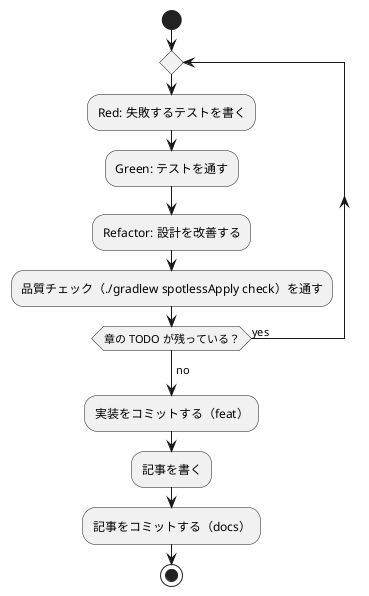

# 第 4 章: バージョン管理とデータ管理

## 4.1 はじめに

第 1 部では、TDD でデータを読み込み、前処理し、決定木で分類するプログラムを Java で作りました。第 2 部では、そのプログラムを「変更を楽に安全にできる」状態に保つための道具立てを、バージョン管理（第 4 章）、パッケージ管理と静的解析（第 5 章）、タスクランナーと CI/CD（第 6 章）の順に整えます。

この章ではバージョン管理を扱います。機械学習のプロジェクトでは、コードに加えて **学習データ** と **学習済みモデル** というファイルが登場します。これらをコードと同じようにコミットしてよいとは限りません。この章では、Git で何を管理し、何を管理しないか、そして実験の結果を再現できるようにするには何を固定すればよいかを学びます。

Git の使い方は言語に依存しないので、[Python 版の第 4 章](../python/04-version-control-and-data-management.md)・[Kotlin 版の第 4 章](../kotlin/04-version-control-and-data-management.md) と同じ構成で進めます。Java 版では、Gradle が作るファイルの除外と、`java.util.Random` のシードの再現性が **Java の仕様で決められている** 点に注目してください。Kotlin 版の `kotlin.random.Random` とは、ここが大きく違います。

## 4.2 コミットメッセージの重要性

コミット履歴は「なぜこの変更をしたのか」の記録です。機械学習のプロジェクトでは、「前処理を変えたら正解率が変わった」「ライブラリと予測が一致しない原因をテストに残した」といった変化の理由を、あとから追跡できることが特に重要になります。

コミットは次の 2 つを守ると追いやすくなります。

- **1 コミット 1 目的** — 機能追加と設定変更、実装と記事を 1 つのコミットに混ぜない
- **形式をそろえる** — 種類と対象がひと目で分かる書式でメッセージを書く

## 4.3 Conventional Commits

### フォーマット

本シリーズでは [Conventional Commits](https://www.conventionalcommits.org/ja/) の形式でコミットメッセージを書きます。

```text
<type>(<scope>): <subject>

<body>

<footer>
```

`scope` には変更の対象を書きます。本リポジトリでは、言語別の実装なら `java`、記事シリーズなら `getting-start-ml`、ADR なら `adr`、CI の定義なら `ci` のように書きます。

### コミットタイプ

| type | 用途 |
|------|------|
| `feat` | 新機能（章の実装など） |
| `fix` | バグ修正 |
| `test` | テストの追加・修正 |
| `refactor` | 振る舞いを変えないコードの変更 |
| `docs` | ドキュメントだけの変更（記事など） |
| `build` | ビルドの設定や依存関係の変更 |
| `chore` | そのほかの雑務 |
| `ci` | CI の設定の変更 |

Kotlin 版では依存関係の変更を `chore` にしていましたが、Java 版では `build` を使っています。どちらも Conventional Commits が例に挙げている type です。1 つのシリーズの中で使い分けを決めておけば、どちらでも構いません。

### 実践例

本リポジトリの実際のコミット履歴から、Java 版の計画から第 3 章までを抜き出します（古い順）。

```text
99552a14 docs(getting-start-ml): Java 版執筆計画と B24 のステップ計画を追加する
5795ec2f docs(adr): Java 版のライブラリを選定する ADR 005 を追加する
a2d50d4e feat(java): Java 版の雛形（Gradle Wrapper・JDK 21 ツールチェーン・JUnit 6・AssertJ）を追加する
fd59b386 build(java): Spotless・Error Prone・PMD・JaCoCo を check に組み込み、違反で失敗することを確かめる
31738c1f feat(java): 第 1 章のきのこ派・たけのこ派の判定を TDD で実装する
0e09a05b fix(java): BOM の定数を見えない文字ではなくエスケープで書く
bf2aacce fix(java): テストの BOM もエスケープで書く
417f0ff4 docs(getting-start-ml): Java 版トップと第 1 章を追加し、索引と nav に登録する
560c5b82 ci(java): Java CI と apps:check:java タスクを追加する
6caec3e3 fix(ci): Java CI のカバレッジ表示のステップを YAML のブロック形式で書く
37109f82 feat(java): 第 2 章の CSV の表（Table・Row）と欠損値の数え上げを追加し、BOM の文字の混入を check で検査する
a93b7aeb feat(java): 第 2 章の欠損値の補完・特徴量・訓練データとテストデータへの分割を追加する
f1fbd024 feat(java): 第 3 章の自作の決定木（sealed interface と record）を追加する
baa2e755 feat(java): 第 3 章の Tribuo の CART との突き合わせと実データでの確認を追加する
a82e3aa5 build(java): 第 7〜14 章で使う Tribuo のモジュールを依存に加える
```

`git log --oneline` で見ると、どのコミットが何のための変更かを type と scope だけで区別できます。ビルドの設定（`build(java)`）、実装（`feat(java)`）、記事（`docs`）、CI（`ci(java)`）を分けてあるので、たとえば「静的解析の設定がいつ入ったか」を知りたいときは `build(java)` のコミットだけを見れば済みます。

`fix` のコミットにも注目してください。`0e09a05b` と `bf2aacce` は、ソースに BOM の文字（U+FEFF）がそのまま入っていたのを、`\uFEFF` のエスケープに直したコミットです。見た目では区別できない問題なので、あとから「なぜエスケープで書いているのか」と疑問に思ったときに、この履歴が理由を教えてくれます。この問題は第 5 章で、検査のタスクとして再発を防ぎます。

## 4.4 何をコミットし、何をコミットしないか

機械学習のプロジェクトには、コミットしてはいけないファイルが増えます。理由は大きく 3 つあります。

| 分類 | 例 | コミットしない理由 |
|------|-----|------------------|
| 再配布できないもの | 学習データ | ライセンスで利用者が限られている |
| 再生成できるもの | ビルド成果物、Gradle のキャッシュ、学習済みモデル | 大きく、差分が読めず、コードとデータから作り直せる |
| 秘匿すべきもの | `.env` の認証情報 | 漏洩すると取り返しがつかない |

### 学習データ

本シリーズの学習データは、書籍『スッキリわかる Python による機械学習入門』の配布データです。配布データの利用は書籍購入者に限られており、本リポジトリは公開されているので、データはコミットしません。ルートの `.gitignore` で、データの置き場所 `apps/data/` をまるごと除外しています。この設定は全言語で共通です。

```text
# 依存関係
node_modules/

# 環境変数（暗号化済みの .env.vault とテンプレートの .env.example は管理対象）
.env

# 学習データ（書籍購入者のみ利用可のため再配布しない。docs/article/getting-start-ml/outline.md を参照）
apps/data/

# ビルド成果物・一時ファイル
site/
tmp/

# IDE・エディタの個人設定
.idea/
.vscode/

# Claude Code の個人設定
.claude/settings.local.json
# エージェントの作業用 worktree
.claude/worktrees/

# OS
.DS_Store
Thumbs.db
```

### Java プロジェクト固有のファイル

`apps/java/.gitignore` では、Gradle が作るディレクトリと、学習済みモデルの保存先 `model/` を除外しています。

```text
.gradle/
build/
model/
```

| パス | 中身 |
|------|------|
| `.gradle/` | Gradle がプロジェクトごとに持つキャッシュ（タスクの実行履歴など） |
| `build/` | コンパイル結果・テストレポート・PMD と JaCoCo のレポート |
| `model/` | 学習済みモデルの保存先（第 8 章で使う） |

Kotlin 版の `.gitignore` にあった `.kotlin/`（Kotlin コンパイラの作業ファイル）と `.ipynb_checkpoints/`（Notebook の自動保存）は、Java 版にはありません。Java のコンパイラはプロジェクトの中に作業ファイルを作らず、Java 版では Notebook を使わないからです。除外する規則は、実際に生成されるファイルに合わせて最小限にしておきます。使われない規則が残っていると、「このファイルはどこで作られるのか」と読み手を迷わせます。

一方で、**Gradle Wrapper のファイルはコミットします**。`gradlew`・`gradlew.bat`・`gradle/wrapper/gradle-wrapper.jar`・`gradle/wrapper/gradle-wrapper.properties` があれば、Gradle を入れていない環境でも、決まった版の Gradle で同じビルドができます。Wrapper は第 5 章で詳しく扱います。

学習済みモデルは、コードと学習データがあれば作り直せます。モデルのファイルをコミットするより、「どのコードとどのデータから、どの設定で作ったか」をコミットで追えるようにするほうが、再現性の面でも役に立ちます。

### 除外されていることを確かめる

`.gitignore` が意図どおりに効いているかは、`git check-ignore -v` で確認できます。どのファイルの何行目の規則で除外されたかが表示されます。

```bash
git check-ignore -v apps/data/sukkiri-ml/iris.csv apps/java/build/ apps/java/.gradle/ apps/java/model/ tmp/sukkiri-ml-codes.zip
```

```text
.gitignore:8:apps/data/	apps/data/sukkiri-ml/iris.csv
apps/java/.gitignore:2:build/	apps/java/build/
apps/java/.gitignore:1:.gradle/	apps/java/.gradle/
apps/java/.gitignore:3:model/	apps/java/model/
.gitignore:12:tmp/	tmp/sukkiri-ml-codes.zip
```

ディレクトリのパスは末尾に `/` を付けて指定しています。`model/` のように末尾が `/` の規則はディレクトリだけに当てはまるので、まだ存在しないパスを `/` なしで調べると、除外されていないように見えます。

データを配置したあとに `git status --short` を実行し、`apps/data/` 以下のファイルが一覧に出てこないことも確かめておきます。

## 4.5 データの入手手順をコードにする

データをコミットしない代わりに、**データの入手と配置の手順** をリポジトリに残します。手順が文章だけだと、人によって置き場所がずれたり、ファイルが足りないまま実行して分かりにくいエラーになったりします。

本リポジトリでは、配置と確認を Gulp のタスクにしています（`ops/scripts/data.js`）。このタスクは言語に依存しないので、全言語で同じものを使います。

```bash
npx gulp data:setup
npx gulp data:check
```

配布 ZIP を `tmp/` に置いてから `data:setup` を実行し、`data:check` で揃っているかを確かめます。`data:help` の表示と、失敗したときの表示は [Python 版の 4.5 節](../python/04-version-control-and-data-management.md) と [Kotlin 版の 4.5 節](../kotlin/04-version-control-and-data-management.md) を参照してください。

### プログラムからデータの場所を知る

Java の実装は、第 1 章で作った `dataset.DataDir` でデータの場所を解決します。環境変数 `ML_DATA_DIR` があればその場所を、無ければ `apps/data/sukkiri-ml/` を使います。

```java
// src/main/java/dataset/DataDir.java
package dataset;

import java.nio.file.Path;
import java.util.Optional;
import java.util.function.Function;

/** 学習データのディレクトリを求める。 */
public final class DataDir {
  private DataDir() {}

  /** 環境変数 ML_DATA_DIR が無ければ apps/data/sukkiri-ml を使う。 */
  public static Path dataDir(Function<String, String> getenv) {
    return Optional.ofNullable(getenv.apply("ML_DATA_DIR"))
        .map(Path::of)
        .orElse(Path.of("../data/sukkiri-ml"));
  }

  /** 実行中のプロセスの環境変数から学習データのディレクトリを求める。 */
  public static Path dataDir() {
    return dataDir(System::getenv);
  }
}
```

Kotlin 版は既定の引数（`getenv: (String) -> String? = System::getenv`）で 1 つの関数にまとめていましたが、Java には既定の引数が無いので、環境変数を読む関数を受け取るメソッドと、`System::getenv` を渡すだけのメソッドの 2 つに分けています。テストからは前者に架空の環境変数を渡して確かめ、本番のコードからは後者を呼びます。データの場所をコードに直接書かず、1 か所で解決するようにしておくと、CI や読者の環境など置き場所が違う場合にも環境変数だけで切り替えられます。

環境変数を Gradle のテストに渡すところにも注意が必要です。Gradle はタスクの入力が変わらなければテストを再実行しないので、`ML_DATA_DIR` を変えても、前回の結果がそのまま使われてしまいます。`build.gradle.kts` では、Kotlin 版と同じく、環境変数をテストタスクの入力として宣言しています。

```kotlin
tasks.test {
    // ...
    // 学習データの場所（未指定なら ../data/sukkiri-ml）。値が変わればテストを再実行する
    val mlDataDir = providers.environmentVariable("ML_DATA_DIR")
    inputs.property("mlDataDir", mlDataDir.orElse(""))
    mlDataDir.orNull?.let { environment("ML_DATA_DIR", it) }
}
```

Java 版でも、ビルドの設定は Kotlin DSL（`build.gradle.kts`）で書いています。アプリのコードは Java、ビルドの設定は Kotlin という組み合わせです。Gradle の設定は Groovy DSL（`build.gradle`）でも書けますが、Kotlin DSL のほうが IDE の補完と型のチェックが効き、Kotlin 版と設定を見比べやすいので、こちらを選びました。

### データが無い環境でもテストを通す

コミットしないデータに依存するテストは、データの無い環境（CI や、データをまだ入手していない読者の環境）では失敗してしまいます。Java 版では、JUnit の `Assumptions.assumeTrue` で、データが無ければテストをスキップします。

```java
class IrisDataTest {
  private final Path csvFile = DataDir.dataDir().resolve("iris.csv");

  @BeforeEach
  void requireData() {
    assumeTrue(Files.exists(csvFile), "学習データ iris.csv が配置されていない（gulp data:setup）");
  }

  // ...
}
```

データの無い場所を `ML_DATA_DIR` に指定すると、スキップされることを確かめられます。

```bash
ML_DATA_DIR=/nonexistent ./gradlew test --tests "chapter03.*"
```

```text
IrisDataTest > 実行すると深さごとの正解率と深さ 2 の決定木を表示する SKIPPED
IrisDataTest > 深さ 2 の決定木はテストデータの 45 件中 43 件を正しく分類する SKIPPED
IrisDataTest > この分割ではどの深さでも Tribuo の CART とテストデータの予測が一致する > 深さ 1 SKIPPED
IrisDataTest > この分割ではどの深さでも Tribuo の CART とテストデータの予測が一致する > 深さ 2 SKIPPED
IrisDataTest > この分割ではどの深さでも Tribuo の CART とテストデータの予測が一致する > 深さ 3 SKIPPED
IrisDataTest > この分割ではどの深さでも Tribuo の CART とテストデータの予測が一致する > 深さ 4 SKIPPED
IrisDataTest > この分割ではどの深さでも Tribuo の CART とテストデータの予測が一致する > 深さ 5 SKIPPED
IrisDataTest > この分割ではどの深さでも Tribuo の CART とテストデータの予測が一致する > 深さ 2147483647 SKIPPED
BUILD SUCCESSFUL in 1m 16s
```

`@ParameterizedTest` で深さごとに分けたテストも、1 件ずつスキップとして表示されます（`2147483647` は、深さの上限を設けない場合を表す `TribuoTrees.UNLIMITED`、つまり `Integer.MAX_VALUE` です）。

単体テストは架空の値で作ったデータで書き、実データのテストは `assumeTrue` で守る、という 2 段構えにすると、CI ではデータ無しでも品質チェックが回り、手元ではデータを使った確認もできます。単体テストのデータに配布データの行をそのまま写さないことも大切です。テストのコードはコミットされるので、写した行はデータの再配布になってしまいます。

## 4.6 実験を再現できるようにする

機械学習の結果は、コードとデータが同じでも、次のものが違うと変わります。

| 変わる原因 | 固定する方法 | 本リポジトリでの置き場所 |
|-----------|------------|----------------------|
| 乱数（データの分割、モデルの初期値） | シードを指定する | 各章のコード（第 2 章の `seed`、Tribuo のトレーナーの `seed`） |
| ライブラリのバージョン | 版を 1 か所に固定する | `apps/java/gradle/libs.versions.toml`（第 5 章） |
| JDK と Gradle のバージョン | ツールチェーンと Wrapper で固定する | `build.gradle.kts` の `JavaLanguageVersion.of(21)`、`gradle/wrapper/gradle-wrapper.properties`（第 5 章） |

Kotlin 版の表にあった「Kotlin のバージョン」の行は、Java 版にはありません。Java 版で乱数を作るのは JDK の標準ライブラリだからです。その理由を次に見ます。

### 乱数のシード

第 2 章の `splitTrainTest` は、`java.util.Random(seed)` で作った乱数生成器を `Collections.shuffle` に渡して、行の番号を並べ替えていました。

```java
    List<Integer> positions = new ArrayList<>(IntStream.range(0, x.size()).boxed().toList());
    Collections.shuffle(positions, new Random(seed));
```

同じ書き方で、同じシード 0 で 2 回、シード 1 で 1 回、シードを指定せずに 1 回、0〜9 の並べ替えを実行してみます。

```java
import java.util.ArrayList;
import java.util.Collections;
import java.util.List;
import java.util.Random;
import java.util.stream.IntStream;

public class Shuffle {
  static List<Integer> shuffled(Random random) {
    List<Integer> values = new ArrayList<>(IntStream.range(0, 10).boxed().toList());
    Collections.shuffle(values, random);
    return values;
  }

  public static void main(String[] args) {
    System.out.println(shuffled(new Random(0)));
    System.out.println(shuffled(new Random(0)));
    System.out.println(shuffled(new Random(1)));
    System.out.println(shuffled(new Random()));
  }
}
```

JDK 11 からは、1 つのファイルのプログラムをコンパイルせずに `java Shuffle.java` で実行できます。JDK 21 で 1 回、JDK 25 で 2 回実行した結果です。

```text
[4, 8, 9, 6, 3, 5, 2, 1, 7, 0]
[4, 8, 9, 6, 3, 5, 2, 1, 7, 0]
[6, 9, 7, 8, 4, 2, 0, 3, 1, 5]
[0, 8, 9, 1, 5, 4, 7, 2, 6, 3]
```

```text
[4, 8, 9, 6, 3, 5, 2, 1, 7, 0]
[4, 8, 9, 6, 3, 5, 2, 1, 7, 0]
[6, 9, 7, 8, 4, 2, 0, 3, 1, 5]
[2, 1, 8, 9, 7, 0, 5, 6, 3, 4]
```

```text
[4, 8, 9, 6, 3, 5, 2, 1, 7, 0]
[4, 8, 9, 6, 3, 5, 2, 1, 7, 0]
[6, 9, 7, 8, 4, 2, 0, 3, 1, 5]
[8, 7, 4, 0, 3, 9, 1, 5, 6, 2]
```

シードを指定した 3 行は、実行を繰り返しても、JDK の版を変えても同じ並びになり、シードを変えると並びが変わります。シードを指定しない最後の行だけが、実行のたびに変わりました。手元にあった JDK 17 でも、シードを指定した 3 行は同じ並びでした。

第 2 章では、この性質を次の 2 つのテストで固定しました。テストがあるので、うっかりシードを使わない実装に変えてしまっても気付けます。

```java
    @Test
    @DisplayName("同じシードなら同じ分け方になる")
    void sameSeedSameSplit() {
      assertThat(Preprocessing.splitTrainTest(x, t, 0.3, 42).tTest())
          .isEqualTo(Preprocessing.splitTrainTest(x, t, 0.3, 42).tTest());
    }

    @Test
    @DisplayName("シードが違えば違う分け方になる")
    void differentSeedDifferentSplit() {
      assertThat(Preprocessing.splitTrainTest(x, t, 0.3, 0).tTest())
          .isNotEqualTo(Preprocessing.splitTrainTest(x, t, 0.3, 1).tTest());
    }
```

### 仕様で決まっていること、決まっていないこと

Kotlin 版では、`kotlin.random.Random(seed)` の乱数列が同じになるのは同じ版の Kotlin の間だけで、将来の版でアルゴリズムが変わりうる、とドキュメントに書かれていました。`java.util.Random` は事情が違います。JDK 21 の `java.util.Random` の API ドキュメントは、次のように定めています。

> If two instances of `Random` are created with the same seed, and the same sequence of method calls is made for each, they will generate and return identical sequences of numbers. In order to guarantee this property, particular algorithms are specified for the class `Random`. Java implementations must use all the algorithms shown here for the class `Random`, for the sake of absolute portability of Java code.
>
> — [Java SE 21 API: java.util.Random](https://docs.oracle.com/en/java/javase/21/docs/api/java.base/java/util/Random.html)

`Random` のアルゴリズム（48 ビットの線形合同法）は仕様の一部で、どの Java の実装も、どの版もこれに従わなければなりません。同じシードから同じ順でメソッドを呼べば、同じ数列が返ることが保証されています。

ただし、保証されているのは `Random` が返す数列までです。並べ替えの `Collections.shuffle` について、API ドキュメントは「This implementation traverses the list backwards, ...」と、**この実装** がリストを後ろからたどって要素を入れ替える、という説明をしています。これは実装の説明で、`Random` のように「すべての実装が従わなければならない」とは書かれていません。`Random` のどのメソッドを何回呼ぶかが将来の版で変われば、同じシードでも並びが変わる余地は残ります。

分かっていることをまとめると、次のとおりです。

| 事柄 | 根拠 | 確かさ |
|------|------|-------|
| 同じシードの `Random` は、同じ呼び出しに同じ数列を返す | `java.util.Random` の仕様 | すべての Java の実装・版で保証される |
| 同じシードの `Collections.shuffle` は同じ並びを返す | JDK 17・21・25 で実行して確かめた | 手元の版では同じだった。仕様では保証されていない |

本シリーズでは、JDK の版をツールチェーンで 21 に固定しています（第 5 章）。これで、`Collections.shuffle` の実装が将来変わっても、ツールチェーンを上げるまでは結果が変わりません。第 3 章の IrisDataTest が「45 件中 43 件」という数値を固定できているのは、シードと JDK の版の両方を固定しているからです。JDK を上げて数値のテストが失敗したら、まず並べ替えの結果が変わっていないかを疑います。

同じ理由で、Python 版・Kotlin 版・Java 版では、同じシード 0 でもテストデータに入る行が違います。乱数を作るアルゴリズムが NumPy・Kotlin・Java で違うためです。実際、第 3 章の深さ 2 の決定木の正解数は、Kotlin 版が 45 件中 42 件、Java 版が 45 件中 43 件でした。記事に載せる正解率などの数値は、シードと版を固定した実装を実データで動かした結果です。数値をテストで固定するときは、どのシードで得た値かを必ずコードに残します。

## 4.7 TDD とコミットのタイミング

TDD のサイクルとコミットは、次のように対応させると履歴が読みやすくなります。



- テストが通らない状態ではコミットしない
- 実装と記事は別のコミットにする
- ビルドの設定や依存関係の変更（`build`）、CI の変更（`ci`）も、それぞれ別のコミットにする
- 学習データ・モデルがステージングされていないことを、コミットの前に `git status` で確かめる

第 3 章の実際の履歴です。自作の決定木と、Tribuo との突き合わせを別のコミットにしています。

```text
f1fbd024 feat(java): 第 3 章の自作の決定木（sealed interface と record）を追加する
baa2e755 feat(java): 第 3 章の Tribuo の CART との突き合わせと実データでの確認を追加する
```

前半のコミットは架空の値の単体テストだけで完結し、後半のコミットで Tribuo という外部のライブラリと実データが入ってきます。コミットを分けておくと、Tribuo と予測が合わなくなったときに、自作の決定木そのものが変わったのか、突き合わせの側が変わったのかを、履歴から切り分けられます。

## 4.8 まとめ

この章では、機械学習のプロジェクトでのバージョン管理を学びました。

1. **Conventional Commits** — type と scope で、変更の種類と対象が分かるコミットメッセージを書く
2. **コミットしないものを決める** — 再配布できない学習データ、再生成できるビルド成果物・モデル、秘匿すべき認証情報を `.gitignore` で除外する。除外の規則は実際に生成されるファイルに合わせる。Gradle Wrapper はコミットする
3. **入手手順をコードにする** — データを置く場所と確認方法を Gulp タスクにし、プログラムからは `DataDir.dataDir()` で場所を解決する。環境変数は Gradle のテストの入力として宣言する
4. **データが無くてもテストを通す** — 実データのテストは `assumeTrue` でスキップする
5. **再現性** — `java.util.Random` の数列は仕様で保証されるが、`Collections.shuffle` の並べ方は仕様では保証されない。シードに加えて、JDK・ライブラリ・Gradle の版を固定する

次の章では、ライブラリ・JDK・Gradle の版を固定する Gradle の仕組みと、コードの品質を機械的に確かめる静的解析ツールを扱います。
