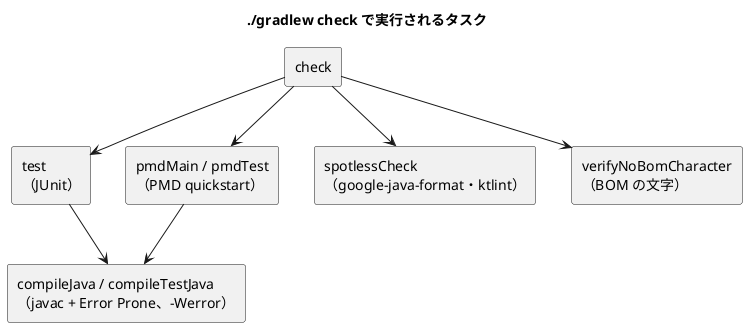
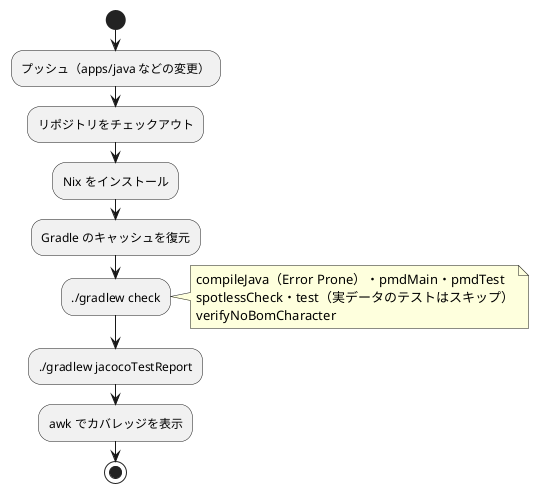

# 第 6 章: タスクランナーと CI/CD

## 6.1 はじめに

第 5 章までで、テスト（JUnit）、整形（Spotless）、静的解析（Error Prone・PMD）、BOM の文字の検査（`verifyNoBomCharacter`）、カバレッジ（JaCoCo）がそろいました。ただ、コマンドを覚えて毎回正しい順番で実行するのは手間で、実行し忘れも起きます。

この章では、次の 3 つを整えます。

1. **タスクランナー** — Gradle のタスクで品質チェックに名前を付け、`./gradlew check` の 1 つのコマンドで実行できるようにする
2. **Gradle と Gulp の分担** — リポジトリ全体の作業を受け持つ Gulp のタスクから、Java の品質チェックを呼び出す
3. **CI/CD** — GitHub Actions で、プッシュのたびに同じ品質チェックを自動実行する

最後に、Java CI の最初の実行が失敗した原因と、その直し方を紹介します。

[Python 版の第 6 章](../python/06-task-runner-and-ci-cd.md) では tox をタスクランナーにしました。Java 版では、[Kotlin 版の第 6 章](../kotlin/06-task-runner-and-ci-cd.md) と同じく、ビルドツールの Gradle がタスクランナーを兼ねます。

## 6.2 タスクランナー — Gradle

### タスクと check への集約

Gradle では、ビルドの手順を **タスク** として定義します。Java 版の `check` に集まるタスクは、ほとんどがプラグインが自動で加えるものです。

| タスク | 加えるもの | 中身 |
|-------|----------|------|
| `test` | `java` プラグイン | JUnit のテスト |
| `pmdMain`・`pmdTest` | `pmd` プラグイン | PMD の検査（本番のコードとテストのコード） |
| `spotlessCheck` | Spotless のプラグイン | 整形の崩れの検査（Java と Gradle のスクリプト） |
| `verifyNoBomCharacter` | `build.gradle.kts` で自分で加えた | BOM の文字の検査 |

Error Prone はタスクではなく、`compileJava`・`compileTestJava` の中で動きます。`test` や `pmdMain` はコンパイル済みのクラスを使うので、`check` を実行すると、その前に必ずコンパイルと Error Prone の検査が走ります。

自分で書いたタスクだけは、`dependsOn` で `check` に加えています。

```kotlin
tasks.named("check") {
    dependsOn("verifyNoBomCharacter")
}
```

`check` から実際にどのタスクが実行されるかは、`--dry-run`（`-m`）で、実行せずに一覧できます。

```bash
./gradlew check --dry-run
```

```text
:compileJava SKIPPED
:processResources SKIPPED
:classes SKIPPED
:pmdMain SKIPPED
:compileTestJava SKIPPED
:processTestResources SKIPPED
:testClasses SKIPPED
:pmdTest SKIPPED
:spotlessJava SKIPPED
:spotlessJavaCheck SKIPPED
:spotlessKotlinGradle SKIPPED
:spotlessKotlinGradleCheck SKIPPED
:spotlessCheck SKIPPED
:test SKIPPED
:verifyNoBomCharacter SKIPPED
:check SKIPPED
```

ここでの `SKIPPED` は「dry-run なので実行しなかった」という意味です。実行の順番どおりに並ぶので、`check` の中身を確かめるのに使えます。



JaCoCo のタスクは `check` に入れていません。`jacocoTestCoverageVerification`（カバレッジの下限の検査）はプラグインが用意しますが、第 5 章で述べたとおり下限を設けていないので使わず、レポートを作る `jacocoTestReport` は必要なときに実行します。

検査のタスクの一覧は、`tasks` タスクで表示できます。自分で書いたタスクには `group` と `description` を付けているので、一覧に説明が表示されます。

```bash
./gradlew tasks --group verification
```

```text
Verification tasks
------------------
check - Runs all checks.
jacocoTestCoverageVerification - Verifies code coverage metrics based on specified rules for the test task.
jacocoTestReport - Generates code coverage report for the test task.
spotlessApply - Applies code formatting steps to sourcecode in-place.
spotlessCheck - Checks that sourcecode satisfies formatting steps.
spotlessDiagnose
spotlessJava
spotlessJavaApply
spotlessJavaCheck
spotlessJavaDiagnose
spotlessKotlinGradle
spotlessKotlinGradleApply
spotlessKotlinGradleCheck
spotlessKotlinGradleDiagnose
test - Runs the test suite.
verifyNoBomCharacter - ソースに BOM の文字がそのまま入っていないかを検査する
```

PMD の `pmdMain`・`pmdTest` は、この一覧には出てきません。`./gradlew tasks --all` を実行すると、「Other tasks」の中に表示されます。一覧に出ないタスクも `check` からは実行されることは、上の `--dry-run` で確かめられます。

### 章の main を実行する

各章の `Main` クラスの `main` メソッドは、`runChapter` タスクで実行します。

```kotlin
// 章ごとの main を実行する: ./gradlew runChapter -Pchapter=01
tasks.register<JavaExec>("runChapter") {
    group = "application"
    description = "章の main メソッドを実行する"
    val chapter = providers.gradleProperty("chapter").orElse("01")
    mainClass.set(chapter.map { "chapter$it.Main" })
    classpath = sourceSets["main"].runtimeClasspath
    jvmArgs("-Dfile.encoding=UTF-8", "-Dstdout.encoding=UTF-8")
}
```

- `tasks.register<JavaExec>` は、Java のプログラムを実行するタスクを登録します
- `-Pchapter=03` で渡した値を `providers.gradleProperty("chapter")` で受け取り、`chapter03.Main` を実行します
- Kotlin 版では `Main.kt` のトップレベル関数が `MainKt` というクラスになるので `chapter$it.MainKt` と書きましたが、Java 版は `Main.java` に `Main` クラスを書くので、クラス名がそのまま `Main` です
- `-Dstdout.encoding=UTF-8` は、標準出力の文字コードを指定するシステムプロパティです。Windows の端末でも日本語の出力が化けないようにしています

```bash
./gradlew tasks --group application
```

```text
Application tasks
-----------------
runChapter - 章の main メソッドを実行する
```

### タスクの実行

```bash
# 整形してから、品質チェックをまとめて実行する
./gradlew spotlessApply check

# 個別に実行する
./gradlew test
./gradlew spotlessCheck
./gradlew pmdMain pmdTest
./gradlew verifyNoBomCharacter

# カバレッジのレポートを作る
./gradlew jacocoTestReport

# 章の main を実行する（学習データが必要）
./gradlew runChapter -Pchapter=03
```

Gradle は、入力と出力が前回から変わっていないタスクを実行しません（`UP-TO-DATE`）。2 回目の `./gradlew check` がすぐ終わるのはこのためです。一方で、入力を正しく宣言していないと、変わったはずのタスクまで飛ばされます。テストの `ML_DATA_DIR` を入力として宣言したのは、このためです。逆に、出力を宣言していないタスクは、入力が変わらなくても毎回実行されます（6.4 節の `verifyNoBomCharacter`）。

### 環境変数を Gradle に渡す

Python 版の tox は、既定では環境変数をテストに渡さないので、`passenv` で `ML_DATA_DIR` を渡しました。Gradle のテストタスクには環境変数がそのまま引き継がれますが、第 4 章で見たとおり、テストの **入力** として宣言しないと、値を変えてもテストが再実行されません。Kotlin 版と同じ設定です。

```kotlin
    // 学習データの場所（未指定なら ../data/sukkiri-ml）。値が変わればテストを再実行する
    val mlDataDir = providers.environmentVariable("ML_DATA_DIR")
    inputs.property("mlDataDir", mlDataDir.orElse(""))
    mlDataDir.orNull?.let { environment("ML_DATA_DIR", it) }
```

この設定が無いと何が起きるかは、[Kotlin 版の 6.5 節](../kotlin/06-task-runner-and-ci-cd.md) で紹介しています。

## 6.3 Notebook について

Python 版と Kotlin 版では、この節で Notebook によるデータの探索と、出力セルを消してからコミットする仕組みを扱いました。Java 版では Notebook を使わず、データの様子は各章の `Main` の出力とテストで確かめています。

Notebook で分かったことをテストに移す流れと、出力セルに学習データが残らないようにする仕組みは、[Python 版の 6.3 節](../python/06-task-runner-and-ci-cd.md)（nbstripout）と [Kotlin 版の 6.3 節](../kotlin/06-task-runner-and-ci-cd.md)（Gradle のタスクで出力セルを検査・削除）を参照してください。グラフによる可視化も、Python 版・Kotlin 版の各章を参照してください。

## 6.4 Gradle と Gulp の分担

本リポジトリには、言語ごとのビルドツールとは別に、リポジトリ全体の作業を受け持つ Gulp のタスクがあります（`ops/scripts/`）。第 4 章の `data:setup` もその 1 つです。Java の品質チェックは、Gulp の `apps:check:java` タスクからも実行できます。

```javascript
  {
    name: 'java',
    nix: 'java',
    dir: path.join('apps', 'java'),
    tools: [{ cmd: 'java', version: 'java -version' }],
    setup: `${process.platform === 'win32' ? 'gradlew.bat' : './gradlew'} testClasses`,
    check: `${process.platform === 'win32' ? 'gradlew.bat' : './gradlew'} check`,
  },
```

これは `ops/scripts/apps.js` の、Java 版の定義です。`apps:setup:java` は依存関係を取得してテストまでコンパイルし（`testClasses`）、`apps:check:java` は `./gradlew check` を実行します。Windows では `gradlew.bat` を使います。

`tools` には、前提になるコマンドと、それが使えるかを確かめる方法を書きます。`java -version` が失敗したとき（JDK が入っていないとき）は、Nix の `java` 環境（`nix develop .#java`）の中で同じコマンドを実行します。JDK 21 そのものはツールチェーンが用意するので、Gulp が確かめるのは「`gradlew` を起動できる JDK があるか」だけです。

```bash
npx gulp apps:check:java
```

```text
[01:04:44] Using gulpfile ~/IdeaProjects/getting-started-machine-learning/.claude/worktrees/agent-a92382a07909a7fb1/gulpfile.js
[01:04:45] Starting 'apps:check:java'...

[apps/java] ./gradlew check
> Task :compileJava UP-TO-DATE
> Task :processResources NO-SOURCE
> Task :classes UP-TO-DATE
> Task :pmdMain UP-TO-DATE
> Task :compileTestJava UP-TO-DATE
> Task :processTestResources NO-SOURCE
> Task :testClasses UP-TO-DATE
> Task :pmdTest UP-TO-DATE
> Task :spotlessJava UP-TO-DATE
> Task :spotlessJavaCheck UP-TO-DATE
> Task :spotlessKotlinGradle UP-TO-DATE
> Task :spotlessKotlinGradleCheck UP-TO-DATE
> Task :spotlessCheck UP-TO-DATE
> Task :test UP-TO-DATE
> Task :verifyNoBomCharacter
> Task :check

BUILD SUCCESSFUL in 3s
10 actionable tasks: 1 executed, 9 up-to-date
Consider enabling configuration cache to speed up this build: https://docs.gradle.org/9.7.1/userguide/configuration_cache_enabling.html
[01:04:49] Finished 'apps:check:java' after 4.35 s
```

手元の既定の JDK（25）で `java -version` が成功したので、Nix を使わずにそのまま `./gradlew check` が実行されました。直前に同じ検査を実行していたので、ほとんどのタスクが `UP-TO-DATE` で飛ばされ、4 秒ほどで終わっています。ただし、`verifyNoBomCharacter` だけは毎回実行されています。このタスクは入力（`inputs.files`）を宣言していますが、出力を宣言していません。Gradle は、出力の無いタスクを最新（`UP-TO-DATE`）とは判断しないので、入力が変わらなくても毎回実行します。ソースを読むだけの軽い検査なので、実行時間の上では困りません。

2 つのタスクランナーは、次のように分担しています。

| 役割 | Gradle（`apps/java`） | Gulp（リポジトリのルート） |
|------|---------------------|------------------------|
| 何を知っているか | Java のソース・依存関係・検査の設定 | 言語ごとのアプリの場所・前提ツール・学習データの場所 |
| 品質チェックの中身 | `check` に集約する（6.2 節） | 持たない。`./gradlew check` を呼ぶだけ |
| 前提ツールが無いとき | ツールチェーンが JDK 21 を取得する | Nix の環境に切り替える |
| 全言語をまとめて | 扱わない | `apps:check` で、学習データの確認（`data:check`）と全言語の検査を続けて実行する |

品質チェックの中身を Gradle の `check` だけに置き、Gulp は呼び出すだけにしているので、検査を増やしたときに直すのは `build.gradle.kts` の 1 か所です。手元で `./gradlew check` を実行しても、`npx gulp apps:check:java` を実行しても、次に見る CI でも、同じ検査が走ります。

## 6.5 GitHub Actions による CI

### ワークフロー設定

プッシュのたびに品質チェックを自動実行するため、`.github/workflows/java-ci.yml` を用意しています。

```yaml
name: Java CI

on:
  push:
    branches: [main, develop]
    paths:
      - "apps/java/**"
      - ".github/workflows/java-ci.yml"
      - "ops/nix/environments/java/**"
      - "flake.nix"
      - "flake.lock"
  pull_request:
    branches: [main]
    paths:
      - "apps/java/**"
      - ".github/workflows/java-ci.yml"
      - "ops/nix/environments/java/**"
      - "flake.nix"
      - "flake.lock"

permissions:
  contents: read

jobs:
  test:
    runs-on: ubuntu-latest

    steps:
      - name: Checkout the repository
        uses: actions/checkout@v4

      - name: Install Nix
        uses: cachix/install-nix-action@v30
        with:
          nix_path: nixpkgs=channel:nixos-unstable

      - name: Cache Gradle
        uses: actions/cache@v4
        with:
          path: |
            ~/.gradle/caches
            ~/.gradle/wrapper
          key: ${{ runner.os }}-gradle-java-${{ hashFiles('apps/java/**/*.gradle.kts', 'apps/java/gradle/libs.versions.toml', 'apps/java/gradle/wrapper/gradle-wrapper.properties') }}
          restore-keys: |
            ${{ runner.os }}-gradle-java-

      # 学習データは再配布できないため CI には配置しない。実データのテストはスキップされる
      - name: Run tests, formatting check, Error Prone and PMD
        run: nix develop .#java --command bash -c "cd apps/java && ./gradlew check --console=plain"

      # 実データのテストがスキップされるので、手元より低い値になる。下限は設けず表示だけする
      - name: Show coverage
        run: |
          nix develop .#java --command bash -c "cd apps/java && ./gradlew jacocoTestReport --console=plain"
          awk -F, 'NR>1{m+=$4;c+=$5}END{printf "Instruction coverage: %.1f%%\n", 100*c/(m+c)}' apps/java/build/reports/jacoco/test/jacocoTestReport.csv
```

### ワークフローのポイント

- **`paths` で対象を絞る** — Java の実装・このワークフロー・Nix の環境定義が変わったときだけ実行します。記事だけの変更や、ほかの言語の変更では実行されません
- **Nix で環境をそろえる** — `nix develop .#java` で、`ops/nix/environments/java/shell.nix` に定義した環境（JDK・Maven・Gradle）に入ってからコマンドを実行します
- **Gradle は Wrapper を使う** — Nix の環境にも Gradle（執筆時点では 8.14.3）が入っていますが、CI では `./gradlew` を使い、Wrapper で固定した Gradle 9.7.1 でビルドします
- **Gradle のキャッシュを使う** — ダウンロードした Gradle と依存ライブラリ（`~/.gradle/caches`・`~/.gradle/wrapper`）を保存します。キャッシュのキーには、依存ライブラリの版を決めるファイル（`*.gradle.kts`・`libs.versions.toml`・Wrapper の設定）のハッシュを使い、版を変えたら新しいキャッシュになるようにしています。キーの接頭辞は `gradle-java-` として、Java CI が `restore-keys` で Kotlin CI のキャッシュを復元しないようにしています。Kotlin CI の接頭辞も、はじめは `gradle-` だけで Java CI のキャッシュに一致しえたので、`gradle-kotlin-` に改めました
- **手元と同じコマンドを使う** — 各ステップは手元と同じ `./gradlew check` と `./gradlew jacocoTestReport` を実行します
- **学習データは置かない** — 学習データは再配布できないので CI には置きません。実データのテストは `assumeTrue` でスキップされます
- **カバレッジは表示だけ** — JaCoCo の CSV から命令単位のカバレッジを計算してログに出します。`awk` は Nix の環境の外（GitHub のランナー）で実行するので、パスはリポジトリのルートからの `apps/java/build/...` です

### CI パイプラインの流れ



第 3 章までの実装と、第 7〜14 章で使う Tribuo の依存を入れた時点で、CI が成功したときのログの一部です（`gh run view 35452404102 --log` で取得し、時刻の列を除いています）。

```text
Cache hit for restore-key: Linux-gradle-java-692e77f4d68d838069abbd488551f2517888e360737c8b16547cfca919ce8776
Cache Size: ~263 MB (276151136 B)
Cache restored successfully
```

依存に Tribuo のモジュールを加えたので、`libs.versions.toml` のハッシュが変わり、キーと完全に一致するキャッシュはありませんでした。そこで `restore-keys` の接頭辞 `Linux-gradle-java-` に一致する前回のキャッシュが復元され、足りない依存だけがダウンロードされました。ジョブの最後には、新しいキーでキャッシュが保存されています。

```text
Cache saved with key: Linux-gradle-java-21f168583042c63b8f5a7af0ca0bbb9628e0180a5e6babc8ceae03906f628e84
```

`./gradlew check` のステップです。

```text
Java development environment activated
  - JDK: javac 21.0.9
  - Maven: Apache Maven 3.9.12 (848fbb4bf2d427b72bdb2471c22fced7ebd9a7a1)
  - Gradle: Welcome to Gradle 8.14.3!
...
Welcome to Gradle 9.7.1!
...
Starting a Gradle Daemon (subsequent builds will be faster)
> Task :compileJava
> Task :processResources NO-SOURCE
> Task :classes
> Task :compileTestJava
> Task :processTestResources NO-SOURCE
> Task :testClasses
> Task :pmdMain
> Task :spotlessJava
> Task :spotlessJavaCheck
> Task :spotlessKotlinGradle
> Task :spotlessKotlinGradleCheck
> Task :spotlessCheck
> Task :pmdTest
> Task :test
...
KvsTDataTest > 実データから 19 人分を読み込む SKIPPED
...
IrisDataTest > 深さ 2 の決定木はテストデータの 45 件中 43 件を正しく分類する SKIPPED
...
> Task :verifyNoBomCharacter
> Task :check
BUILD SUCCESSFUL in 29s
```

Nix の環境の表示は Gradle 8.14.3 ですが、`./gradlew` は Wrapper の Gradle 9.7.1 で動いています。Nix の環境の JDK 21.0.9 がツールチェーンと Gradle デーモンの条件（JDK 21）を満たすので、CI で JDK がダウンロードされることはありませんでした。

カバレッジを表示するステップです。

```text
> Task :compileJava UP-TO-DATE
> Task :processResources NO-SOURCE
> Task :classes UP-TO-DATE
> Task :compileTestJava UP-TO-DATE
> Task :processTestResources NO-SOURCE
> Task :testClasses UP-TO-DATE
> Task :test UP-TO-DATE
> Task :jacocoTestReport
BUILD SUCCESSFUL in 1s
Instruction coverage: 82.3%
```

前のステップの `test` の結果がそのまま使われ（`UP-TO-DATE`）、レポートを作るだけなので 1 秒で終わっています。CI には学習データが無いので、テストは 48 件が成功し、実データのテスト 14 件がスキップされました。カバレッジは、第 5 章で手元のデータなしの環境で計測した値と同じ 82.3% です。

## 6.6 CI の最初の実行が失敗した

Java CI の最初の実行（`ci(java): Java CI と apps:check:java タスクを追加する`）は、0 秒で失敗しました。

```bash
gh run list --workflow java-ci.yml
```

```text
completed	success	docs(getting-start-ml): B25〜B28 の並行作業の割り当てを執筆計画に書く	Java CI	main	push	35452404102	1m24s	2026-09-19T15:37:40Z
completed	success	fix(ci): Java CI のカバレッジ表示のステップを YAML のブロック形式で書く	Java CI	main	push	35449655367	1m54s	2026-09-19T14:44:29Z
completed	failure	ci(java): Java CI と apps:check:java タスクを追加する	Java CI	main	push	35449618924	0s	2026-09-19T14:43:45Z
```

```bash
gh run view 35449618924
```

```text
X main Java CI · 35449618924
Triggered via push about 1 hour ago

X This run likely failed because of a workflow file issue.
```

ジョブが 1 つも始まらずに失敗し、「ワークフローのファイルに問題があるらしい」とだけ表示されています。テストの失敗ではなく、ワークフローの定義そのものを GitHub が読めなかったのです。

### 原因: YAML の「: 」

最初の定義では、カバレッジを表示するステップを 1 行で書いていました。

```yaml
      - name: Show coverage
        run: nix develop .#java --command bash -c "cd apps/java && ./gradlew jacocoTestReport --console=plain && awk -F, 'NR>1{m+=\$4;c+=\$5}END{printf \"Instruction coverage: %.1f%%\n\", 100*c/(m+c)}' build/reports/jacoco/test/jacocoTestReport.csv"
```

`run:` の値は、引用符で始まっていないので、YAML では **プレーンスカラー**（引用符の無い文字列）として読まれます。プレーンスカラーの中に「`: `」（コロンと空白）が現れると、YAML はそこを「キー: 値」の区切りだと解釈します。この行には `Instruction coverage: %.1f` の「`: `」があり、1 つの値の中に 2 つ目の区切りが現れたことになって、YAML として不正になりました。

失敗したときのファイルを取り出して手元の PyYAML で読むと、YAML として読めない場所が分かります。

```bash
git show 6caec3e3^:.github/workflows/java-ci.yml > old-ci.yml
python3 -c "import yaml; yaml.safe_load(open('old-ci.yml'))"
```

```text
yaml.scanner.ScannerError: mapping values are not allowed here
  in "old-ci.yml", line 53, column 175
```

53 行目の 175 文字目は、`coverage:` の直後です。

### 直し方: ブロック形式で書く

`fix(ci)` のコミットで、`run:` の値を `|` で始まるブロック形式（リテラルブロックスカラー）に書き直しました。

```yaml
      - name: Show coverage
        run: |
          nix develop .#java --command bash -c "cd apps/java && ./gradlew jacocoTestReport --console=plain"
          awk -F, 'NR>1{m+=$4;c+=$5}END{printf "Instruction coverage: %.1f%%\n", 100*c/(m+c)}' apps/java/build/reports/jacoco/test/jacocoTestReport.csv
```

ブロック形式では、字下げされた行がそのまま文字列になり、「`: `」も引用符も特別な意味を持ちません。あわせて、コマンドを 2 行に分けました。

- 1 行目は、Nix の環境の中で Gradle のタスクだけを実行します
- 2 行目の `awk` は、Nix の外で実行します。`awk` はランナーにもともと入っているので、Nix の環境に入る必要がありません

1 行に詰め込んでいたときは、`bash -c "..."` の二重引用符の中に `awk` のプログラムを入れたので、`\$4` や `\"` のように、シェルのためのエスケープが何重にも必要でした。2 行に分けると、`awk` のプログラムを手元の端末で打つのと同じ形で書けます。YAML の問題を直すつもりの変更で、シェルのエスケープも要らなくなり、読みやすくなりました。

### この経緯から学べること

- **失敗の種類を見分ける** — 実行時間 0 秒で、ジョブが 1 つも始まっていなければ、テストではなくワークフローの定義を疑います。`gh run view` の「workflow file issue」がその手がかりです
- **手元で再現する** — GitHub の画面の表示が短くても、同じ YAML を手元のパーサーで読めば、行と列まで分かります
- **複数行のコマンドはブロック形式で書く** — `run:` に長いコマンドを 1 行で書くと、YAML の特別な文字（「`: `」「` #`」など）とシェルの引用符が絡み合います。最初から `|` のブロック形式で書き、1 行に 1 つのコマンドを置くほうが安全です
- **環境の中で動かすものを最小にする** — Nix の環境が必要なのは JDK を使う Gradle だけです。環境の外で済むものを外に出すと、引用符の入れ子が減ります

## 6.7 三種の神器と CI

第 4〜6 章で整えたものを、ソフトウェア開発の「三種の神器」（バージョン管理・テスティング・自動化）に当てはめると次のようになります。

| 三種の神器 | 道具 | 本シリーズでの使い方 |
|-----------|------|------------------|
| バージョン管理 | Git、Conventional Commits、`.gitignore`、`.gitattributes` | 学習データ・ビルド成果物・モデルをコミットしない。Gradle Wrapper はコミットする |
| テスティング | JUnit、AssertJ、JaCoCo | 単体テストは架空の値、実データのテストは `assumeTrue` でスキップ可能にする |
| 自動化 | Gradle（Wrapper・バージョンカタログ・タスク）、Spotless、Error Prone、PMD、GitHub Actions、Nix、Gulp | 環境の再現、品質チェックの一括実行、BOM の文字の検査、データの配置、CI |

### 利用可能なコマンド一覧

| コマンド | 内容 | 実行する場所 |
|---------|------|------------|
| `npx gulp data:setup` | 学習データを配置する | リポジトリのルート |
| `npx gulp data:check` | 学習データの配置を確認する | リポジトリのルート |
| `npx gulp apps:check:java` | Java の品質チェックを実行する（JDK が無ければ Nix の中で） | リポジトリのルート |
| `./gradlew check` | コンパイル（Error Prone）・テスト・PMD・Spotless・BOM の文字の検査をまとめて実行する | `apps/java` |
| `./gradlew spotlessApply` | コードを整形する | `apps/java` |
| `./gradlew jacocoTestReport` | カバレッジのレポートを作る | `apps/java` |
| `./gradlew runChapter -Pchapter=03` | 章の `main` を実行する | `apps/java` |

Windows の PowerShell では、`./gradlew` の代わりに `.\gradlew.bat` を使います。

## 6.8 まとめ

この章では、品質チェックを自動化し、どの環境でも同じ手順で実行できるようにしました。

1. **Gradle のタスク** — 品質チェックを `check` にまとめる。プラグインが加えるタスクと自分で書いたタスクを `--dry-run` で確かめ、自分で書いたタスクには `group` と `description` を付ける。環境変数はテストの入力として宣言する
2. **Gradle と Gulp の分担** — 検査の中身は Gradle の `check` だけに置き、Gulp の `apps:check:java` は前提ツールを確かめて呼び出すだけにする
3. **GitHub Actions** — Nix で環境をそろえ、手元と同じ `./gradlew check` を実行する。学習データの無い CI では実データのテストがスキップされ、カバレッジは表示だけにする
4. **YAML の落とし穴** — `run:` に長いコマンドを書くときはブロック形式にする。ジョブが始まらずに失敗したら、ワークフローの定義を手元のパーサーで確かめる

第 2 部で、TDD を回し続けるための道具立てがそろいました。次の第 3 部では、回帰問題と、欠損値・カテゴリ値・外れ値を含む現実的なデータの前処理に取り組みます。
