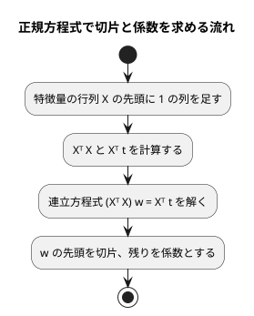

# 第 7 章: 線形回帰による数値予測

## 7.1 はじめに

第 1〜3 章では、グループを当てる **分類** を扱いました。この章からは、数値そのものを当てる **回帰** に進みます。題材は、映画の SNS での反響や主演俳優の露出度から、興行収入を予測する問題です。

この章では、最も基本的な回帰モデルである **線形回帰** を自作します。Python 版は NumPy の行列演算を使い、[Kotlin 版の第 7 章](../kotlin/07-linear-regression.md) は演算子オーバーロードで `a * b` と書ける行列の型を作りました。Java には演算子オーバーロードが無いので、`double[][]` を包む **不変のクラス** を作り、積は `a.times(b)` とメソッドで書きます。連立方程式を解く処理まで実装したうえで、正規方程式で切片と係数を求めます。

次に、Tribuo の線形回帰に置き換えて結果を突き合わせます。[Python 版の第 7 章](../python/07-linear-regression.md) と同じく、外れ値の除去と回帰の評価指標（MAE・RMSE・決定係数 R²）も実装します。この章の行列と評価指標は、第 11〜13 章でも使います。

## 7.2 線形回帰とは

### 特徴量の重み付きの和で予測する

線形回帰は、予測値を「切片」と「特徴量ごとの係数 × 特徴量」の和で表すモデルです。この章のデータに当てはめると次の式になります。

```text
予測値 = 切片 + 係数1 × SNS1 + 係数2 × SNS2 + 係数3 × actor + 係数4 × original
```

学習とは、訓練データに対して予測値と実測値のずれが最も小さくなるように、切片と係数を決めることです。ずれの大きさには「誤差の 2 乗の合計」を使います。これを最小にする方法を **最小二乗法** と呼びます。

### 正規方程式

最小二乗法の解は、行列を使うと 1 つの式で求められます。特徴量を行列 `X`、実測値をベクトル `t`、切片と係数をまとめたベクトルを `w` とすると、誤差の 2 乗の合計を最小にする `w` は次の **正規方程式** を満たします。

```text
(Xᵀ X) w = Xᵀ t
```

`X` の先頭には、すべての値が 1 の列を足しておきます。この列にかかる係数が切片になります。



この流れに必要な行列の操作は、**積**・**転置**・**連立方程式を解く** の 3 つです。Java の標準ライブラリにも行列の型は無いので、この 3 つを持つ小さな行列の型を自作します。逆行列を作らずに連立方程式として解くのは、Python 版・Kotlin 版と同じく、そのほうが数値計算の誤差が小さくなるためです。

## 7.3 題材とデータ

この章で使うのは `cinema.csv` です。100 本の映画について、次の 6 列が記録されています。

| 列 | 内容 | 欠損値 |
|----|------|-------|
| cinema_id | 映画の ID | なし |
| SNS1 | SNS での反響の数（1 つ目の指標） | 1 件 |
| SNS2 | SNS での反響の数（2 つ目の指標） | なし |
| actor | 主演俳優のメディア露出の指標 | 1 件 |
| original | 原作の有無（0 または 1） | なし |
| sales | 興行収入 | なし |

「SNS1」「SNS2」「actor」「original」が特徴量、「sales」が正解ラベル（予測したい数値）です。`cinema_id` は映画を区別するための番号なので、特徴量には使いません。

Kotlin 版では、Kotlin DataFrame が SNS1 を `Int?`（欠損値を含む整数の列）と推論し、補完した平均値（小数）が入らないという問題が 7.11 節で起きました。Java 版は第 2 章の `Table`・`Row` でセルを文字列のまま持ち、`Row.number` で読むときに `double` にするので、列の型を推論する段階がありません。この問題は Java 版では起きません。

このデータには、SNS2 の値が大きいのに興行収入が低い、傾向から外れた映画が 1 本含まれています。このような **外れ値** は、最小二乗法の結果を大きく引っ張ります。誤差を 2 乗して足し合わせるので、大きく外れた 1 点の影響が大きくなるためです。

## 7.4 TODO リストの作成

**TODO リスト**:

- [ ] 行列の型を作る
  - [ ] 行列の積を求める
  - [ ] 転置行列を求める
  - [ ] 連立方程式を解く
- [ ] 評価指標を計算する（MAE・RMSE・R²）
- [ ] 正規方程式で線形回帰を学習する
  - [ ] 直線上の点から切片と係数を求める
  - [ ] 複数の特徴量から切片と係数を求める
- [ ] 学習したモデルで予測する
- [ ] 外れ値を取り除く
  - [ ] SNS2 が 1000 を超え、興行収入が 8500 未満の行を取り除く
  - [ ] 条件の片方だけを満たす行は残す
- [ ] 外れ値の除去・分割・補完をまとめる
- [ ] Tribuo と結果が一致することを確かめる
- [ ] 実データで学習・評価して表示する

Kotlin 版は「読み込み → 外れ値 → 行列」の順に進めましたが、Java 版は CSV の読み込みを第 2 章の `Table.load` に任せるので、土台になる行列の型から始めます。外れ値の条件「SNS2 が 1000 を超え、興行収入が 8500 未満」は、書籍『スッキリわかる Python による機械学習入門』の同じデータでの分析手順に合わせたものです。散布図で外れ値を確かめる手順は、[Python 版](../python/07-linear-regression.md) と [Kotlin 版の 7.13 節](../kotlin/07-linear-regression.md) の Notebook を参照してください。Java 版には Notebook と可視化の節を設けません。

## 7.5 行列の型を作る

### 行列の積: テストファースト

最初のテストは、2 行 2 列の行列どうしの積です。

```java
// src/test/java/chapter07/MatrixTest.java
@Test
@DisplayName("行列の積を求める")
void times() {
  var a = Matrix.of(new double[][] {{1, 2}, {3, 4}});
  var b = Matrix.of(new double[][] {{5, 6}, {7, 8}});

  assertThat(a.times(b)).isEqualTo(Matrix.of(new double[][] {{19, 22}, {43, 50}}));
}
```

`Matrix` クラスがまだ無いので、第 1 章と同じくコンパイルが最初の Red になります。

```text
/…/apps/java/src/test/java/chapter07/MatrixTest.java:15: エラー: シンボルを見つけられません
    assertThat(a.times(b)).isEqualTo(Matrix.of(new double[][] {{19, 22}, {43, 50}}));
                                     ^
  シンボル:   変数 Matrix
  場所: クラス MatrixTest
エラー3個

> Task :compileTestJava FAILED
```

### Green: 仮実装

期待値をそのまま返す仮実装でテストを通します。`isEqualTo` で行列どうしを比べるので、`equals` は先に中身で比べるように書きます。

```java
// src/main/java/chapter07/Matrix.java（仮実装）
public final class Matrix {
  private final double[][] values;

  private Matrix(double[][] values) {
    this.values = values;
  }

  public static Matrix of(double[][] values) {
    return new Matrix(values);
  }

  public Matrix times(Matrix other) {
    return Matrix.of(new double[][] {{19, 22}, {43, 50}});
  }

  @Override
  public boolean equals(Object other) {
    return other instanceof Matrix that && Arrays.deepEquals(values, that.values);
  }

  @Override
  public int hashCode() {
    return Arrays.deepHashCode(values);
  }

  @Override
  public String toString() {
    return "Matrix" + Arrays.deepToString(values);
  }
}
```

Kotlin 版は `data class Matrix(val rows: List<List<Double>>)` と書くだけで、`equals`・`hashCode`・`toString` が中身で比べる形になりました。Java の `record` も同じことをしますが、第 2 章の `Features` で見たとおり、成分が配列だと既定の `equals` は配列の **参照** を比べてしまいます（Error Prone の `ArrayRecordComponent`）。そこで record ではなくクラスにし、2 次元配列を比べる `Arrays.deepEquals` を使います。1 次元の `Arrays.equals` では、行の配列どうしを参照で比べてしまう点に注意します。

### 三角測量: 行数と列数が違う行列

2 つ目のテストで、仮実装を一般化させます。

```java
@Test
@DisplayName("行数と列数が違う行列の積を求める")
void timesRectangular() {
  var a = Matrix.of(new double[][] {{1, 2, 3}, {4, 5, 6}});
  var b = Matrix.of(new double[][] {{1}, {0}, {2}});

  assertThat(a.times(b)).isEqualTo(Matrix.of(new double[][] {{7}, {16}}));
}
```

```text
MatrixTest > 行列の積を求める PASSED

MatrixTest > 行数と列数が違う行列の積を求める FAILED
    org.opentest4j.AssertionFailedError: 
    expected: Matrix[[7.0], [16.0]]
     but was: Matrix[[19.0, 22.0], [43.0, 50.0]]
```

`toString` を `Arrays.deepToString` で書いておいたので、失敗メッセージで行列の中身が読めます。積は 3 重のループで書きます。左の列数と右の行数が違う場合は、例外にします。

```java
  /** 行列の積。左の列数と右の行数が同じでなければならない。 */
  public Matrix times(Matrix other) {
    if (columnCount() != other.rowCount()) {
      throw new IllegalArgumentException(
          "左の行列の列数 " + columnCount() + " と右の行列の行数 " + other.rowCount() + " が違います");
    }
    double[][] product = new double[rowCount()][other.columnCount()];
    for (int i = 0; i < rowCount(); i++) {
      for (int j = 0; j < other.columnCount(); j++) {
        double sum = 0;
        for (int k = 0; k < columnCount(); k++) {
          sum += values[i][k] * other.values[k][j];
        }
        product[i][j] = sum;
      }
    }
    return new Matrix(product);
  }
```

Kotlin 版は `rows.map { row -> other.columns.map { column -> row.zip(column).sumOf { … } } }` と、行と列の組み合わせを関数の組み合わせで書きました。Java でも Stream API で同じ形に書けますが、`double[][]` を扱うなら添字のループのほうが短く、途中で箱詰め（`Double` への変換）も起きません。

### 不変にする

`Matrix` は第 11〜13 章でも使うので、作ったあとで中身が変わらないことを保証しておきます。`of` が受け取った配列をそのまま持つと、呼び出し側が元の配列を書き換えたときに行列も変わってしまいます。テストで確かめます。

```java
@Test
@DisplayName("作ったあとで元の配列を変えても行列は変わらない")
void copied() {
  double[][] rows = {{1, 2}};
  var a = Matrix.of(rows);

  rows[0][0] = 9;

  assertThat(a.get(0, 0)).isEqualTo(1.0);
}
```

`of` では行ごとに `clone` で写し、あわせて行によって列数が違う配列（ジャグ配列）を拒否します。値を取り出す `column` と `toArray` も写しを返します。一方、`times` や `transpose` が内部で作った新しい配列は外に漏れないので、写さずに `private` のコンストラクタへ渡します。Kotlin の `List` は読み取り専用のインターフェースなので、この写しは要りませんでした。

### 転置と連立方程式

転置は `column(j)` を行として並べ直すだけです。連立方程式 `A x = b` は、Kotlin 版と同じく **ガウスの消去法** で解きます。係数の行列の右に `b` を並べた拡大係数行列を作り、上から順に対角成分より下を 0 にしていき（前進消去）、下の行から順に解を求めます（後退代入）。

テストは、2 元・3 元の連立方程式と、対角成分が 0 の場合の 3 つです。3 元のテストでは、解 `(1, -2, 3)` から `b = A x` を積で作っているので、期待値を手で計算する必要がありません。

```java
@Test
@DisplayName("対角成分が 0 でも行を入れ替えて解を求める")
void zeroPivot() {
  var a = Matrix.of(new double[][] {{0, 1}, {1, 0}});

  assertThat(a.solve(Matrix.columnVector(2, 3)).column(0))
      .containsExactly(new double[] {3, 2}, within(1e-9));
}
```

行を入れ替えない素朴な消去法では、このテストは次のように失敗しました。対角成分の 0 で割ったため、`NaN` になります。

```text
MatrixTest > 連立方程式 > 対角成分が 0 でも行を入れ替えて解を求める FAILED
    org.opentest4j.AssertionFailedError: 
    Expecting actual:
      [NaN, NaN]
    to contain exactly (and in same order):
      [3.0, 2.0]
    but some elements were not found:
      [3.0, 2.0]
    and others were not expected:
      [NaN, NaN]
    when comparing values using double comparator at precision 1.0E-9 (values are considered equal if diff == precision)
```

Java の浮動小数点の割り算は、0 で割っても例外を投げず `NaN` や `Infinity` を返します。整数の割り算とは違う振る舞いなので、テストで確かめておく価値があります。各段で、その列の絶対値が最も大きい行を対角の位置に持ってくる **部分ピボット選択** を加えると通ります。

なお、この Red を再現しようとして行の入れ替えの呼び出しだけを消すと、使われなくなった `private` メソッドを Error Prone が `UnusedMethod` として指摘し、コンパイルが失敗しました。`-Werror` で警告をエラーにしているためで、使われないコードが残らない仕組みが働いています。

<details>
<summary>完成した Matrix.java</summary>

```java
// src/main/java/chapter07/Matrix.java
package chapter07;

import java.util.Arrays;

/**
 * 変更できない行列。第 11〜13 章でも使う。
 *
 * <p>値は double の 2 次元配列で持つ。受け取るときも返すときも配列を写すので、外から中身を変えられない。
 */
public final class Matrix {
  private final double[][] values;

  private Matrix(double[][] values) {
    this.values = values;
  }

  /** 行の配列から行列を作る。どの行も同じ長さでなければならない。 */
  public static Matrix of(double[][] rows) {
    if (rows.length == 0 || rows[0].length == 0) {
      throw new IllegalArgumentException("行列は 1 行 1 列以上でなければなりません");
    }
    double[][] copy = new double[rows.length][];
    for (int i = 0; i < rows.length; i++) {
      if (rows[i].length != rows[0].length) {
        throw new IllegalArgumentException("行によって列数が違います");
      }
      copy[i] = rows[i].clone();
    }
    return new Matrix(copy);
  }

  /** 値を縦に並べた 1 列の行列（列ベクトル）を作る。 */
  public static Matrix columnVector(double... values) {
    double[][] rows = new double[values.length][];
    for (int i = 0; i < values.length; i++) {
      rows[i] = new double[] {values[i]};
    }
    return of(rows);
  }

  public int rowCount() {
    return values.length;
  }

  public int columnCount() {
    return values[0].length;
  }

  /** i 行 j 列の値（0 始まり）。 */
  public double get(int i, int j) {
    return values[i][j];
  }

  /** j 列目の値の写し。 */
  public double[] column(int j) {
    double[] column = new double[rowCount()];
    for (int i = 0; i < rowCount(); i++) {
      column[i] = values[i][j];
    }
    return column;
  }

  /** 行の配列の写し。 */
  public double[][] toArray() {
    return Arrays.stream(values).map(double[]::clone).toArray(double[][]::new);
  }

  /** 行列の積。左の列数と右の行数が同じでなければならない。 */
  public Matrix times(Matrix other) {
    if (columnCount() != other.rowCount()) {
      throw new IllegalArgumentException(
          "左の行列の列数 " + columnCount() + " と右の行列の行数 " + other.rowCount() + " が違います");
    }
    double[][] product = new double[rowCount()][other.columnCount()];
    for (int i = 0; i < rowCount(); i++) {
      for (int j = 0; j < other.columnCount(); j++) {
        double sum = 0;
        for (int k = 0; k < columnCount(); k++) {
          sum += values[i][k] * other.values[k][j];
        }
        product[i][j] = sum;
      }
    }
    return new Matrix(product);
  }

  /** 行と列を入れ替えた行列。 */
  public Matrix transpose() {
    double[][] transposed = new double[columnCount()][];
    for (int j = 0; j < columnCount(); j++) {
      transposed[j] = column(j);
    }
    return new Matrix(transposed);
  }

  /** 正方行列 A について、A x = b を満たす列ベクトル x を部分ピボット選択つきのガウスの消去法で求める。 */
  public Matrix solve(Matrix b) {
    int n = rowCount();
    double[][] augmented = new double[n][];
    for (int i = 0; i < n; i++) {
      augmented[i] = Arrays.copyOf(values[i], n + 1);
      augmented[i][n] = b.values[i][0];
    }
    for (int pivot = 0; pivot < n; pivot++) {
      swap(augmented, pivot, largestRow(augmented, pivot));
      for (int i = pivot + 1; i < n; i++) {
        double factor = augmented[i][pivot] / augmented[pivot][pivot];
        for (int j = pivot; j <= n; j++) {
          augmented[i][j] -= factor * augmented[pivot][j];
        }
      }
    }
    double[] x = new double[n];
    for (int i = n - 1; i >= 0; i--) {
      double known = 0;
      for (int j = i + 1; j < n; j++) {
        known += augmented[i][j] * x[j];
      }
      x[i] = (augmented[i][n] - known) / augmented[i][i];
    }
    return columnVector(x);
  }

  private static int largestRow(double[][] augmented, int pivot) {
    int largest = pivot;
    for (int i = pivot + 1; i < augmented.length; i++) {
      if (Math.abs(augmented[i][pivot]) > Math.abs(augmented[largest][pivot])) {
        largest = i;
      }
    }
    return largest;
  }

  private static void swap(double[][] rows, int i, int j) {
    double[] row = rows[i];
    rows[i] = rows[j];
    rows[j] = row;
  }

  @Override
  public boolean equals(Object other) {
    return other instanceof Matrix that && Arrays.deepEquals(values, that.values);
  }

  @Override
  public int hashCode() {
    return Arrays.deepHashCode(values);
  }

  @Override
  public String toString() {
    return "Matrix" + Arrays.deepToString(values);
  }
}
```

</details>

## 7.6 評価指標を計算する

回帰の評価指標を 3 つ実装します。`t` は実測値、`y` は予測値です。

| 指標 | 意味 | 小さい・大きいどちらが良いか |
|------|------|--------------------------|
| MAE（平均絶対誤差） | 誤差の絶対値の平均 | 小さいほど良い |
| RMSE（平均二乗誤差の平方根） | 誤差の 2 乗の平均の平方根。大きく外れた予測を重く見る | 小さいほど良い |
| R²（決定係数） | 1 −（残差の 2 乗の合計 ÷ 平均との差の 2 乗の合計）。平均値を予測し続けるモデルより良い分だけ 1 に近づく | 1 に近いほど良い |

テストは Kotlin 版と同じ架空の値です。

```java
// src/test/java/chapter07/RegressionMetricsTest.java
package chapter07;

import static org.assertj.core.api.Assertions.assertThat;
import static org.assertj.core.api.Assertions.assertThatThrownBy;
import static org.assertj.core.api.Assertions.within;

import java.util.List;
import org.junit.jupiter.api.DisplayName;
import org.junit.jupiter.api.Nested;
import org.junit.jupiter.api.Test;

class RegressionMetricsTest {
  private static final List<Double> T = List.of(3.0, 5.0, 7.0);

  @Nested
  @DisplayName("MAE")
  class MeanAbsoluteError {
    @Test
    @DisplayName("誤差の絶対値の平均を求める")
    void average() {
      assertThat(RegressionMetrics.meanAbsoluteError(T, List.of(2.0, 5.0, 9.0)))
          .isCloseTo(1.0, within(1e-12));
    }

    @Test
    @DisplayName("予測が大きく外れるほど値が大きくなる")
    void larger() {
      assertThat(RegressionMetrics.meanAbsoluteError(T, List.of(1.0, 8.0, 7.0)))
          .isCloseTo(5.0 / 3, within(1e-12));
    }

    @Test
    @DisplayName("実測値と予測値の件数が違えばエラーになる")
    void sizeMismatch() {
      assertThatThrownBy(() -> RegressionMetrics.meanAbsoluteError(T, List.of(1.0)))
          .isInstanceOf(IllegalArgumentException.class)
          .hasMessage("実測値と予測値の件数が違います");
    }
  }

  @Test
  @DisplayName("RMSE は誤差の 2 乗の平均の平方根になる")
  void rootMeanSquaredError() {
    assertThat(RegressionMetrics.rootMeanSquaredError(T, List.of(2.0, 5.0, 9.0)))
        .isCloseTo(Math.sqrt(5.0 / 3), within(1e-12));
  }

  @Nested
  @DisplayName("R²")
  class R2Score {
    @Test
    @DisplayName("予測がすべて正解なら 1 になる")
    void perfect() {
      assertThat(RegressionMetrics.r2Score(T, T)).isCloseTo(1.0, within(1e-12));
    }

    @Test
    @DisplayName("平均値を予測し続けるモデルより良い分だけ 1 に近づく")
    void betterThanMean() {
      assertThat(RegressionMetrics.r2Score(T, List.of(2.0, 5.0, 9.0)))
          .isCloseTo(1 - 5.0 / 8, within(1e-12));
    }
  }
}
```

`@Nested` の内部クラスでテストをまとめると、テストの表示名が `RegressionMetricsTest > MAE > 誤差の絶対値の平均を求める` のように階層になります。Kotlin 版はクラスを分けて `MeanAbsoluteErrorTest` などとしましたが、JUnit の `@Nested` を使うと、1 つのファイルの中で同じ対象のテストを入れ子にできます。

```java
// src/main/java/chapter07/RegressionMetrics.java
package chapter07;

import java.util.List;
import java.util.stream.IntStream;

/** 回帰の評価指標。t は実測値、y は予測値。第 11・12 章でも使う。 */
public final class RegressionMetrics {
  private RegressionMetrics() {}

  private static double[] residuals(List<Double> t, List<Double> y) {
    if (t.size() != y.size()) {
      throw new IllegalArgumentException("実測値と予測値の件数が違います");
    }
    return IntStream.range(0, t.size()).mapToDouble(i -> t.get(i) - y.get(i)).toArray();
  }

  /** 平均絶対誤差（MAE）。誤差の絶対値の平均。 */
  public static double meanAbsoluteError(List<Double> t, List<Double> y) {
    double sum = 0;
    for (double residual : residuals(t, y)) {
      sum += Math.abs(residual);
    }
    return sum / t.size();
  }

  /** 平均二乗誤差の平方根（RMSE）。 */
  public static double rootMeanSquaredError(List<Double> t, List<Double> y) {
    return Math.sqrt(sumOfSquares(residuals(t, y)) / t.size());
  }

  /** 決定係数（R²）。1 から「残差の 2 乗の合計 ÷ 平均との差の 2 乗の合計」を引いた値。 */
  public static double r2Score(List<Double> t, List<Double> y) {
    double residual = sumOfSquares(residuals(t, y));
    double mean = t.stream().mapToDouble(Double::doubleValue).average().orElseThrow();
    double total = sumOfSquares(t.stream().mapToDouble(value -> value - mean).toArray());
    return 1 - residual / total;
  }

  private static double sumOfSquares(double[] values) {
    double sum = 0;
    for (double value : values) {
      sum += value * value;
    }
    return sum;
  }
}
```

Kotlin 版はトップレベル関数でしたが、Java では関数をクラスの中に置く必要があるので、インスタンスを作らない `final` クラスに `static` メソッドとして置きます。第 11〜13 章からは `RegressionMetrics.r2Score(t, y)` のように呼びます。

## 7.7 正規方程式で線形回帰を学習する

### 直線上の点から切片と係数を求める

入力の特徴量には、第 2 章の `Features`（欠損値を持てない 1 行分の特徴量）のリストを使います。まず、`t = 2x + 1` の直線上の 4 点から、切片 1 と係数 2 が求まることを確かめます。続いて、`t = 3a − 2b + 5` の平面上の 5 点で、特徴量が複数ある場合を三角測量します。

```java
// src/test/java/chapter07/LinearRegressionTest.java（学習）
  @Nested
  @DisplayName("学習")
  class Fit {
    @Test
    @DisplayName("直線上の点から切片と係数を求める")
    void line() {
      var x =
          rows(
              List.of("x"), new double[] {0}, new double[] {1}, new double[] {2}, new double[] {3});
      var t = List.of(1.0, 3.0, 5.0, 7.0);

      var model = LinearRegression.fit(x, t);

      assertModel(1.0, List.of("x"), new double[] {2}, model);
    }

    @Test
    @DisplayName("複数の特徴量から切片と係数を求める")
    void plane() {
      double[][] ab = {{0, 0}, {1, 0}, {0, 1}, {2, 1}, {1, 3}};
      var x = rows(List.of("a", "b"), ab);
      List<Double> t = new ArrayList<>();
      for (double[] row : ab) {
        t.add(3 * row[0] - 2 * row[1] + 5);
      }

      var model = LinearRegression.fit(x, t);

      assertModel(5.0, List.of("a", "b"), new double[] {3, -2}, model);
    }
  }
```

`assertModel` は、係数の列名が **この順で** 並んでいることも確かめます。係数を列名で引ける `Map` にするとき、順序が大事になるからです。

### 係数の順序を保つ Map

学習の結果は、切片と列名つきの係数を持つ `LinearModel` という record にします。

```java
// src/main/java/chapter07/LinearModel.java
package chapter07;

import chapter02.Features;
import java.util.Collections;
import java.util.LinkedHashMap;
import java.util.List;
import java.util.Map;

/**
 * 学習した線形回帰のモデル。切片と、列名つきの係数を持つ。
 *
 * <p>係数は列の順を保つ。Map.copyOf は順を保たないので、LinkedHashMap に写してから変更できないように包む。
 */
public record LinearModel(double intercept, Map<String, Double> coefficients) {
  public LinearModel {
    coefficients = Collections.unmodifiableMap(new LinkedHashMap<>(coefficients));
  }

  /** 列名と、同じ順に並んだ係数からモデルを作る。 */
  public static LinearModel of(double intercept, List<String> columns, double[] coefficients) {
    if (columns.size() != coefficients.length) {
      throw new IllegalArgumentException("列名と係数の数が違います");
    }
    Map<String, Double> named = new LinkedHashMap<>();
    for (int i = 0; i < coefficients.length; i++) {
      named.put(columns.get(i), coefficients[i]);
    }
    return new LinearModel(intercept, named);
  }

  /** 1 行分の特徴量の予測値。係数は列名で対応させるので、列の並び順は問わない。 */
  public double predict(Features features) {
    double sum = intercept;
    for (Map.Entry<String, Double> coefficient : coefficients.entrySet()) {
      sum += coefficient.getValue() * features.value(coefficient.getKey());
    }
    return sum;
  }

  /** 行ごとの予測値。 */
  public List<Double> predict(List<Features> x) {
    return x.stream().map(this::predict).toList();
  }
}
```

Kotlin の `mapOf` や `toMap` は、要素を入れた順を保つ `LinkedHashMap` を返しました。Java の `Map.of`・`Map.copyOf` は、変更できない Map を返しますが **順序を保証しません**。record のコンパクトコンストラクタで `Map.copyOf` を使うと、係数の表示順が実行ごとに変わりうる、ということです。そこで `LinkedHashMap` に写してから `Collections.unmodifiableMap` で包みます。

`predict` は係数を列名で対応させるので、予測に渡す特徴量の列の並び順が学習時と違っても正しく計算できます。この性質もテストに残しました。

```java
// src/test/java/chapter07/LinearRegressionTest.java（予測）
  @Nested
  @DisplayName("予測")
  class Predict {
    private final LinearModel model = LinearModel.of(1.0, List.of("a", "b"), new double[] {2, -1});

    @Test
    @DisplayName("切片と係数から予測値を計算する")
    void predict() {
      var x = rows(List.of("a", "b"), new double[] {1, 4}, new double[] {3, 0.5});

      assertThat(model.predict(x)).containsExactly(-1.0, 6.5);
    }

    @Test
    @DisplayName("列の並び順が違っても列名で係数を対応させる")
    void byName() {
      var x = rows(List.of("b", "a"), new double[] {4, 1}, new double[] {0.5, 3});

      assertThat(model.predict(x)).containsExactly(-1.0, 6.5);
    }
  }
```

### 学習

学習は、7.2 節の流れをそのまま行列のメソッドで書きます。

```java
// src/main/java/chapter07/LinearRegression.java
package chapter07;

import chapter02.Features;
import java.util.Arrays;
import java.util.List;

/** 正規方程式で線形回帰を学習する。 */
public final class LinearRegression {
  private LinearRegression() {}

  /** 先頭に 1 の列を足した特徴量の行列（計画行列）を作る。1 の列の係数が切片になる。 */
  static Matrix designMatrix(List<Features> x) {
    double[][] rows = new double[x.size()][];
    for (int i = 0; i < x.size(); i++) {
      double[] values = x.get(i).values();
      rows[i] = new double[values.length + 1];
      rows[i][0] = 1;
      System.arraycopy(values, 0, rows[i], 1, values.length);
    }
    return Matrix.of(rows);
  }

  /** (Xᵀ X) w = Xᵀ t を解いて、切片と係数を求める。列名は先頭の行の特徴量から取る。 */
  public static LinearModel fit(List<Features> x, List<Double> t) {
    Matrix design = designMatrix(x);
    Matrix target = Matrix.columnVector(t.stream().mapToDouble(Double::doubleValue).toArray());
    Matrix transposed = design.transpose();
    double[] weights = transposed.times(design).solve(transposed.times(target)).column(0);
    return LinearModel.of(
        weights[0], x.getFirst().columns(), Arrays.copyOfRange(weights, 1, weights.length));
  }
}
```

Kotlin 版の `(design.transpose() * design).solve(design.transpose() * target)` は、Java では `transposed.times(design).solve(transposed.times(target))` になります。演算子が無い分だけ長くなりますが、メソッドの連鎖として左から読めます。

## 7.8 外れ値の除去・分割・補完をまとめる

### 外れ値を取り除く

外れ値の条件は「SNS2 が 1000 を超え、かつ興行収入が 8500 未満」です。条件の両方を満たす行だけを除くことを、片方だけを満たす行を残すテストで三角測量します。表は第 2 章の `Table` と `Row` で、架空の値から作ります。

```java
// src/test/java/chapter07/CinemaTest.java（抜粋）
  @Nested
  @DisplayName("外れ値の除去")
  class RemoveOutliers {
    @Test
    @DisplayName("SNS2 が 1000 を超え売上が 8500 未満の行を取り除く")
    void remove() {
      var table = table("1200,8000", "600,9500");

      assertThat(sns2(Cinema.removeOutliers(table))).containsExactly("600");
    }

    @Test
    @DisplayName("条件の片方だけを満たす行は残す")
    void keep() {
      var table = table("1200,9800", "600,8000");

      assertThat(sns2(Cinema.removeOutliers(table))).containsExactly("1200", "600");
    }
  }
```

### 前処理を 1 つのメソッドにする

外れ値の除去は、分割より前にデータ全体に対して行います。今回の条件はデータの取り違えのような「明らかにおかしい行」を除くためのもので、訓練データの統計量から決める値ではないからです。その後の分割と補完には、第 2 章の `Preprocessing.splitTrainTest`・`columnMeans`・`fillMissing` を使います。第 2 章で分割に型引数を持たせたので、正解ラベルが `Double` の `TrainTestSplit<Features, Double>` として受け取れます。

```java
  @Test
  @DisplayName("外れ値を除き特徴量を選んで分割し欠損値を補完する")
  void prepare(@TempDir Path directory) throws IOException {
    Path csvFile = directory.resolve("cinema.csv");
    Files.writeString(
        csvFile,
        HEADER
            + "1,100,300,9000.0,0,9200\n"
            + "2,,400,9500.0,1,9800\n"
            + "3,300,500,,1,10100\n"
            + "4,150,1200,8800.0,0,8100\n"
            + "5,250,700,9900.0,1,10300\n"
            + "6,120,650,9100.0,0,9400\n");

    var split = Cinema.prepare(csvFile, 0.4, 0);

    assertThat(split.xTrain().getFirst().columns())
        .containsExactly("SNS1", "SNS2", "actor", "original");
    assertThat(List.of(split.xTrain().size(), split.xTest().size())).containsExactly(3, 2);
    assertThat(split.tTrain()).doesNotContain(8100.0);
    assertThat(split.tTest()).doesNotContain(8100.0);
  }
```

4 行目（SNS2 が 1200、興行収入が 8100）が外れ値です。残りの 5 行を分けると、テストデータは 5 × 0.4 = 2 行になります。補完が済んでいることは、戻り値が `Features`（欠損値を持てない型）であることで型が保証しているので、Kotlin 版の `countMissing` による確認は要りません。JUnit の `@TempDir` は、テストごとに一時ディレクトリを作って後で消してくれます。

```java
// src/main/java/chapter07/Cinema.java
package chapter07;

import chapter02.Features;
import chapter02.Preprocessing;
import chapter02.Row;
import chapter02.Table;
import chapter02.TrainTestSplit;
import java.io.IOException;
import java.nio.file.Path;
import java.util.List;
import java.util.Map;

/** 映画の興行収入のデータ（cinema.csv）の前処理。 */
public final class Cinema {
  /** 特徴量の列 */
  public static final List<String> FEATURES = List.of("SNS1", "SNS2", "actor", "original");

  /** 正解ラベルの列 */
  public static final String TARGET = "sales";

  /** SNS2 がこの値を超え、かつ興行収入が OUTLIER_SALES 未満の映画を外れ値とする */
  private static final double OUTLIER_SNS2 = 1000;

  private static final double OUTLIER_SALES = 8500;

  private Cinema() {}

  private static double number(Row row, String column) {
    return row.number(column).orElseThrow(() -> new IllegalArgumentException("欠損値です: " + column));
  }

  private static boolean isOutlier(Row row) {
    return number(row, "SNS2") > OUTLIER_SNS2 && number(row, TARGET) < OUTLIER_SALES;
  }

  /** 外れ値の行を除いた表を返す。 */
  public static Table removeOutliers(Table table) {
    return new Table(
        table.columns(), table.rows().stream().filter(row -> !isOutlier(row)).toList());
  }

  /** 外れ値を除き、分割してから訓練データの平均値で両方の欠損値を補完する。 */
  public static TrainTestSplit<Features, Double> prepare(Path csvFile, double testSize, long seed)
      throws IOException {
    Table table = removeOutliers(Table.load(csvFile));
    List<Double> t = table.rows().stream().map(row -> number(row, TARGET)).toList();
    TrainTestSplit<Row, Double> split =
        Preprocessing.splitTrainTest(table.rows(), t, testSize, seed);
    Map<String, Double> means = Preprocessing.columnMeans(split.xTrain(), FEATURES);
    return new TrainTestSplit<>(
        Preprocessing.fillMissing(split.xTrain(), FEATURES, means),
        Preprocessing.fillMissing(split.xTest(), FEATURES, means),
        split.tTrain(),
        split.tTest());
  }
}
```

## 7.9 Tribuo に置き換える

### どのトレーナーが最小二乗解になるかを確かめる

Tribuo には線形回帰のトレーナーが複数あります。Kotlin 版で調べた結果（ADR 002）を、Java 版でも確かめました。乱数で作った特徴量 3 列にノイズを加えた架空のデータ（`t = 4 + 1.5a - 0.5b + 2c + ノイズ`、30 件）で、使い捨てのテストを書いて最初の 1 件の予測値を比べた結果です。

| 学習方法 | 最初の 1 件の予測値 |
|---------|-------------------|
| 自作（正規方程式） | 28.884235137468824 |
| `SLMTrainer(true)` | 28.884235137468863 |
| `LARSTrainer()` | 28.884235137468863 |
| `SLMTrainer(false)` | 31.118855730190532 |
| `LinearSGDTrainer`（二乗誤差、AdaGrad 学習率 0.1、100 エポック） | 30.270267223728762 |

- `SLMTrainer(true)` と `LARSTrainer()` は、自作と小数第 13 位まで一致しました。Tribuo の 2 つの値は Kotlin 版と同じです
- 自作の値は、Kotlin 版（28.884235137468828）と末尾の桁が違います。積の足し算を、Kotlin 版は `zip` と `sumOf`、Java 版は添字のループで行っていて、浮動小数点の足し算の順序が変わると丸め誤差も変わるためです。テストは `within(1e-9)` の許容誤差で比べます
- `SLMTrainer(false)` は一致しません。このとき学習した重みのベクトルは大きさが 4（特徴量 3 つとバイアス）で、バイアスの位置には値がありませんでした
- `LinearSGDTrainer` は勾配降下法で少しずつ係数を近づけるトレーナーなので、この設定では最小二乗解に届いていません。勾配降下法は第 10 章で扱います

このうち、`SLMTrainer(true)` と `LARSTrainer()` の 2 つをテストに残します。

### 特徴量を Tribuo のデータセットに変換する

第 3 章の `TribuoTrees` と同じく、事例（`Example`）とデータセット（`MutableDataset`）に変換するアダプターを作ります。回帰では、正解ラベルが `Label` ではなく数値を持つ `Regressor` になります。トレーナーは引数で受け取り、`SLMTrainer(true)` と `LARSTrainer()` を同じメソッドで試せるようにします。

```java
// src/main/java/chapter07/TribuoRegression.java
package chapter07;

import chapter02.Features;
import java.util.List;
import java.util.stream.IntStream;
import org.tribuo.Example;
import org.tribuo.Model;
import org.tribuo.MutableDataset;
import org.tribuo.Trainer;
import org.tribuo.datasource.ListDataSource;
import org.tribuo.impl.ArrayExample;
import org.tribuo.provenance.SimpleDataSourceProvenance;
import org.tribuo.regression.RegressionFactory;
import org.tribuo.regression.Regressor;

/** 特徴量を Tribuo の回帰の事例に変え、Tribuo のトレーナーで学習・予測する。 */
public final class TribuoRegression {
  /** 予測する数値の名前 */
  public static final String OUTPUT_NAME = Cinema.TARGET;

  private static final RegressionFactory REGRESSION_FACTORY = new RegressionFactory();

  private TribuoRegression() {}

  private static Example<Regressor> toExample(Features features, Regressor output) {
    return new ArrayExample<>(output, features.columns().toArray(String[]::new), features.values());
  }

  /** 特徴量と実測値を、Tribuo のデータセットにする。 */
  public static MutableDataset<Regressor> toDataset(List<Features> x, List<Double> t) {
    List<Example<Regressor>> examples =
        IntStream.range(0, x.size())
            .mapToObj(i -> toExample(x.get(i), new Regressor(OUTPUT_NAME, t.get(i))))
            .toList();
    var provenance = new SimpleDataSourceProvenance("features", REGRESSION_FACTORY);
    return new MutableDataset<>(new ListDataSource<>(examples, REGRESSION_FACTORY, provenance));
  }

  /** 渡したトレーナーで学習する。 */
  public static Model<Regressor> train(
      Trainer<Regressor> trainer, List<Features> x, List<Double> t) {
    return trainer.train(toDataset(x, t));
  }

  /** 学習したモデルで、特徴量ごとの数値を予測する。 */
  public static List<Double> predict(Model<Regressor> model, List<Features> x) {
    return x.stream()
        .map(features -> model.predict(toExample(features, RegressionFactory.UNKNOWN_REGRESSOR)))
        .map(prediction -> prediction.getOutput().getValues()[0])
        .toList();
  }
}
```

- `new Regressor(OUTPUT_NAME, value)` は、名前（`"sales"`）と数値を持つ正解ラベルです。Tribuo の回帰は複数の数値を同時に予測できるので、`getValues()` は配列を返します。この章では 1 つだけなので `[0]` で取り出します
- 予測するときは、第 3 章の `LabelFactory.UNKNOWN_LABEL` と同じく、未知を表す `RegressionFactory.UNKNOWN_REGRESSOR` を渡します
- `train` の引数の型は `Trainer<Regressor>` です。`SLMTrainer` も `LARSTrainer` もこのインターフェースを実装しているので、どちらも渡せます

テストは次のとおりです。予測値の比較には AssertJ の `zipSatisfy` を使い、2 つのリストを先頭から 1 件ずつ組にして許容誤差つきで比べます。

```java
// src/test/java/chapter07/TribuoRegressionTest.java（抜粋）
  @Test
  @DisplayName("SLMTrainer(true) の予測は自作の線形回帰の予測と一致する")
  void slmMatchesMine() {
    var data = noisyDataset();

    var model = TribuoRegression.train(new SLMTrainer(true), data.x(), data.t());

    assertThat(TribuoRegression.predict(model, data.x()))
        .zipSatisfy(
            LinearRegression.fit(data.x(), data.t()).predict(data.x()),
            (tribuo, mine) -> assertThat(tribuo).isCloseTo(mine, within(1e-9)));
  }
```

`LARSTrainer` のテストは、トレーナーを `new LARSTrainer()` に替えただけです。`noisyDataset` は、特徴量と正解ラベルの組を `private record Noisy(List<Features> x, List<Double> t)` で返します。Kotlin 版は `Pair` と分解宣言 `val (x, t) = …` を使いましたが、Java では組に名前を付けた record を使います。

### 係数を突き合わせる

予測値が一致したので、係数も一致するはずです。ところが、学習したモデル（`SparseLinearModel`）の重みを取り出すと、自作の係数とは違う値でした。

| 特徴量 | 自作の係数 | `SparseLinearModel` の重み |
|--------|----------|--------------------------|
| a | 1.4967484681545709 | 0.5294490880561531 |
| b | -0.56959990171371 | -0.22329887049401564 |
| c | 1.9280374530469377 | 0.7595789924844588 |

ADR 002 に記録したとおり、`SLMTrainer(true)` は学習の前に、特徴量と正解ラベルをそれぞれ「平均を引き、平均との差の 2 乗の合計の平方根で割る」形に変換します。重みは、この変換後の空間での値です。そこで、重みに「正解ラベルの変換の大きさ ÷ 特徴量の変換の大きさ」を掛けて元の単位に戻せば、自作の係数と一致するはずです。これを Java で確かめる学習用テストにしました。

```java
  @Test
  @DisplayName("Tribuo の重みは正規化した空間の値で、元の単位に戻すと自作の係数と一致する")
  void weightsInNormalizedSpace() {
    var data = noisyDataset();
    var model =
        (SparseLinearModel) TribuoRegression.train(new SLMTrainer(true), data.x(), data.t());
    var weights = model.getWeights().values().iterator().next();
    double[] t = data.t().stream().mapToDouble(Double::doubleValue).toArray();

    var coefficients = LinearRegression.fit(data.x(), data.t()).coefficients();

    for (String name : COLUMNS) {
      double[] column = data.x().stream().mapToDouble(row -> row.value(name)).toArray();
      double weight = weights.get(model.getFeatureIDMap().getID(name));
      assertThat(weight).isNotCloseTo(coefficients.get(name), within(1e-3));
      assertThat(weight * centeredNorm(t) / centeredNorm(column))
          .isCloseTo(coefficients.get(name), within(1e-9));
    }
  }
```

```java
  /** 平均との差の 2 乗の合計の平方根。 */
  private static double centeredNorm(double[] values) {
    double mean = java.util.Arrays.stream(values).average().orElseThrow();
    return Math.sqrt(java.util.Arrays.stream(values).map(v -> (v - mean) * (v - mean)).sum());
  }
```

- `(SparseLinearModel)` は、`Model<Regressor>` として受け取ったモデルを、重みを取り出せる具体的な型として扱うキャストです。Kotlin の `as SparseLinearModel` にあたります
- 重みのベクトルの何番目がどの特徴量かは、`getFeatureIDMap().getID(name)` で引きます。Kotlin 版は列の順の添字 `weights.get(i)` で引きましたが、第 3 章で見たとおり Tribuo は特徴量を名前の順に並べるので、名前で引くほうが列の順に左右されません
- 重みそのものは自作の係数と一致しない（`isNotCloseTo`）ことも確かめ、「元の単位に戻す」変換が意味を持つことをテストに残しました

### 評価指標を突き合わせる

Tribuo の `RegressionEvaluator` は、MAE・RMSE・R² をまとめて計算します。自作の評価指標と一致することも確かめます。

```java
  @Test
  @DisplayName("Tribuo の評価器の MAE・RMSE・R² は自作の評価指標と一致する")
  void evaluatorMatchesMine() {
    var data = noisyDataset();
    var model = TribuoRegression.train(new SLMTrainer(true), data.x(), data.t());
    var y = TribuoRegression.predict(model, data.x());

    var evaluation =
        new RegressionEvaluator().evaluate(model, TribuoRegression.toDataset(data.x(), data.t()));

    var target = new Regressor(TribuoRegression.OUTPUT_NAME, Double.NaN);
    assertThat(evaluation.mae(target))
        .isCloseTo(RegressionMetrics.meanAbsoluteError(data.t(), y), within(1e-9));
    assertThat(evaluation.rmse(target))
        .isCloseTo(RegressionMetrics.rootMeanSquaredError(data.t(), y), within(1e-9));
    assertThat(evaluation.r2(target))
        .isCloseTo(RegressionMetrics.r2Score(data.t(), y), within(1e-9));
  }
```

`evaluation.mae(target)` は、名前で指定した 1 つの出力の値を返します。引数の `Regressor` は名前だけが使われるので、値には `Double.NaN` を渡しています。Kotlin 版は、全出力の値を名前から引ける `mae()` の戻り値に `values.single()` を使いました。

自作版と Tribuo の違いをまとめます。

| 観点 | 自作版 | Tribuo |
|------|-------|--------|
| 学習の呼び出し | `LinearRegression.fit(x, t)` が新しい `LinearModel` を返す | `trainer.train(dataset)` がモデルを返す |
| 入力 | `List<Features>` と `List<Double>` | 事例を集めた `MutableDataset<Regressor>` |
| 係数 | 元の単位の係数を列名つきの `Map` で持つ | 正規化した空間の重みを `SparseVector` で持つ |
| 評価指標 | メソッドごと（`RegressionMetrics.r2Score(t, y)`） | `RegressionEvaluator` がまとめて計算する |

## 7.10 実データで学習・評価する

### 結果を表示する

実データのテストは、第 1〜3 章と同じく、データが無ければ `assumeTrue` でスキップします。まず、外れ値が 1 件除かれることと、実データでも自作と Tribuo の R² が一致することを確かめます。

```java
// src/test/java/chapter07/CinemaDataTest.java（抜粋）
  @Test
  @DisplayName("実データで自作のモデルと Tribuo の SLMTrainer・LARSTrainer の R² が一致する")
  void sameR2AsTribuo() throws IOException {
    var split = Cinema.prepare(csvFile, 0.2, 0);
    double mine =
        RegressionMetrics.r2Score(
            split.tTest(),
            LinearRegression.fit(split.xTrain(), split.tTrain()).predict(split.xTest()));

    for (var trainer : List.of(new SLMTrainer(true), new LARSTrainer())) {
      var model = TribuoRegression.train(trainer, split.xTrain(), split.tTrain());
      double tribuo =
          RegressionMetrics.r2Score(split.tTest(), TribuoRegression.predict(model, split.xTest()));
      assertThat(tribuo).isCloseTo(mine, within(1e-9));
    }
  }
```

`List.of(new SLMTrainer(true), new LARSTrainer())` の要素の型を、`var` のもとでコンパイラが共通の上位の型として推論するので、ループの中でどちらも `train` に渡せます。

次に、`Main` の出力を固定するテストを、期待値を空文字列にして書き、実際の出力を失敗メッセージで確かめました。

```text
CinemaDataTest > 実行すると学習した係数と評価指標を表示する FAILED
    org.opentest4j.AssertionFailedError: 
    expected: 
      ""
     but was: 
      "データ件数: 100
      外れ値を除いた件数: 99
      訓練データ: 79 件, テストデータ: 20 件
      切片: 6114.60
      係数: SNS1=1.3804, SNS2=0.5218, actor=0.2900, original=208.8827
      テストデータの評価: R2=0.6184, MAE=302.20, RMSE=376.14
      "
```

内容を確かめてから、これを期待値にします。

```java
// src/main/java/chapter07/Main.java
package chapter07;

import chapter02.Features;
import chapter02.Table;
import chapter02.TrainTestSplit;
import dataset.DataDir;
import java.io.IOException;
import java.nio.file.Path;
import java.util.List;
import java.util.Locale;
import java.util.stream.Collectors;

/** 映画の興行収入を線形回帰で予測し、係数と評価指標を表示する。 */
public final class Main {
  private static final double TEST_SIZE = 0.2;
  private static final long SEED = 0;

  private Main() {}

  public static void main(String[] args) throws IOException {
    Path csvFile = DataDir.dataDir().resolve("cinema.csv");
    Table table = Table.load(csvFile);
    TrainTestSplit<Features, Double> split = Cinema.prepare(csvFile, TEST_SIZE, SEED);
    LinearModel model = LinearRegression.fit(split.xTrain(), split.tTrain());
    List<Double> y = model.predict(split.xTest());
    String coefficients =
        model.coefficients().entrySet().stream()
            .map(entry -> entry.getKey() + "=" + fourDecimals(entry.getValue()))
            .collect(Collectors.joining(", "));
    System.out.println("データ件数: " + table.rows().size());
    System.out.println("外れ値を除いた件数: " + Cinema.removeOutliers(table).rows().size());
    System.out.println(
        "訓練データ: " + split.xTrain().size() + " 件, テストデータ: " + split.xTest().size() + " 件");
    System.out.println("切片: " + twoDecimals(model.intercept()));
    System.out.println("係数: " + coefficients);
    System.out.println(
        "テストデータの評価: R2="
            + fourDecimals(RegressionMetrics.r2Score(split.tTest(), y))
            + ", MAE="
            + twoDecimals(RegressionMetrics.meanAbsoluteError(split.tTest(), y))
            + ", RMSE="
            + twoDecimals(RegressionMetrics.rootMeanSquaredError(split.tTest(), y)));
  }

  private static String fourDecimals(double value) {
    return String.format(Locale.ROOT, "%.4f", value);
  }

  private static String twoDecimals(double value) {
    return String.format(Locale.ROOT, "%.2f", value);
  }
}
```

```console
$ ./gradlew -q runChapter -Pchapter=07
データ件数: 100
外れ値を除いた件数: 99
訓練データ: 79 件, テストデータ: 20 件
切片: 6114.60
係数: SNS1=1.3804, SNS2=0.5218, actor=0.2900, original=208.8827
テストデータの評価: R2=0.6184, MAE=302.20, RMSE=376.14
```

Kotlin 版の同じ出力は `R2=0.8469` でした。件数（訓練 79 件・テスト 20 件）は同じですが、どの映画がテストデータに入るかが違います。Java 版の分割は第 2 章の `Preprocessing.splitTrainTest` で、`java.util.Random(0)` を使う `Collections.shuffle` で並べ替えます。Kotlin 版・Python 版とは乱数の生成器が違うので、同じシード 0 でも分け方が変わり、係数と評価指標も変わります。Kotlin 版の 7.13 節で見たとおり、100 件ほどのデータでは、分け方によって R² が大きく変わります。

### 係数を読む

係数は「その特徴量が 1 増えたとき、ほかの特徴量が同じなら、予測値がどれだけ増えるか」を表します。

- `original=208.8827`: 原作がある映画は、ない映画より興行収入の予測が約 209 大きい
- `SNS1=1.3804`・`SNS2=0.5218`: SNS での反響が 1 増えるごとに、予測が約 1.38・約 0.52 大きくなる
- `actor=0.2900`: 主演俳優の露出の指標が 1 増えるごとに、予測が約 0.29 大きくなる

係数の大きさは、特徴量の単位に左右されます。`original` は 0 か 1 しか取らず、`actor` は数千〜1 万を超える値を取るので、係数の大小をそのまま「影響の大きさ」と読むことはできません。影響の大きさを比べるには、特徴量をそろえた尺度に変換（標準化）してから学習します。標準化は第 9 章で扱います。7.9 節で見た Tribuo の重みは、まさにこの「そろえた尺度」での値でした。

### 評価指標を読む

- `R2=0.6184`: テストデータの興行収入のばらつきのうち、約 62% をこのモデルで説明できている
- `MAE=302.20`: 予測は平均して約 302 外れている
- `RMSE=376.14`: MAE より大きいのは、大きく外れた予測が 2 乗で重く数えられるため

## 7.11 品質チェック

`./gradlew spotlessApply check` で、整形・コンパイル（Error Prone）・PMD・テストをまとめて実行しました。

```console
$ ./gradlew spotlessApply check
…
> Task :check

BUILD SUCCESSFUL in 2m 26s
```

第 7 章のテストの実行結果です（学習データを配置した状態）。

```text
CinemaDataTest > 実行すると学習した係数と評価指標を表示する PASSED
CinemaDataTest > 実データで自作のモデルと Tribuo の SLMTrainer・LARSTrainer の R² が一致する PASSED
CinemaDataTest > 実データから外れ値を 1 件取り除く PASSED
CinemaTest > 外れ値を除き特徴量を選んで分割し欠損値を補完する PASSED
CinemaTest > 外れ値の除去 > SNS2 が 1000 を超え売上が 8500 未満の行を取り除く PASSED
CinemaTest > 外れ値の除去 > 条件の片方だけを満たす行は残す PASSED
LinearRegressionTest > 予測 > 列の並び順が違っても列名で係数を対応させる PASSED
LinearRegressionTest > 予測 > 切片と係数から予測値を計算する PASSED
LinearRegressionTest > 学習 > 直線上の点から切片と係数を求める PASSED
LinearRegressionTest > 学習 > 複数の特徴量から切片と係数を求める PASSED
MatrixTest > 行と列を入れ替える PASSED
MatrixTest > 連立方程式 > 対角成分が 0 でも行を入れ替えて解を求める PASSED
MatrixTest > 連立方程式 > 連立方程式の解を求める PASSED
MatrixTest > 連立方程式 > 3 元の連立方程式の解を求める PASSED
MatrixTest > 積 > 左の列数と右の行数が違えば積を求められない PASSED
MatrixTest > 積 > 行列の積を求める PASSED
MatrixTest > 積 > 行数と列数が違う行列の積を求める PASSED
MatrixTest > 作成 > 作ったあとで元の配列を変えても行列は変わらない PASSED
MatrixTest > 作成 > 行によって列数が違う配列からは作れない PASSED
MatrixTest > 作成 > 列ベクトルは値を縦に並べた 1 列の行列になる PASSED
RegressionMetricsTest > RMSE は誤差の 2 乗の平均の平方根になる PASSED
RegressionMetricsTest > MAE > 予測が大きく外れるほど値が大きくなる PASSED
RegressionMetricsTest > MAE > 誤差の絶対値の平均を求める PASSED
RegressionMetricsTest > MAE > 実測値と予測値の件数が違えばエラーになる PASSED
RegressionMetricsTest > R² > 予測がすべて正解なら 1 になる PASSED
RegressionMetricsTest > R² > 平均値を予測し続けるモデルより良い分だけ 1 に近づく PASSED
TribuoRegressionTest > Tribuo の評価器の MAE・RMSE・R² は自作の評価指標と一致する PASSED
TribuoRegressionTest > 特徴量の行を数値の正解ラベル付きの事例に変換する PASSED
TribuoRegressionTest > LARSTrainer の予測も自作の線形回帰の予測と一致する PASSED
TribuoRegressionTest > SLMTrainer(true) の予測は自作の線形回帰の予測と一致する PASSED
TribuoRegressionTest > Tribuo の重みは正規化した空間の値で、元の単位に戻すと自作の係数と一致する PASSED
BUILD SUCCESSFUL in 1m 21s
```

学習データが無い環境（`ML_DATA_DIR=/nonexistent ./gradlew test`）では、`CinemaDataTest` の 3 件が `SKIPPED` になり、ビルドは成功します。

## 7.12 まとめ

この章では、行列の型から作り、正規方程式による線形回帰を Java の TDD で実装しました。

1. **配列を包む不変のクラス** — `double[][]` を `private final` で持ち、受け取るときと返すときに写した。`equals` は `Arrays.deepEquals` で中身を比べた
2. **演算子が無ければメソッドで書く** — Kotlin 版の `a * b` は `a.times(b)` になった。行列の計算は添字のループで書くと短く、箱詰めも起きない
3. **浮動小数点の 0 除算は例外にならない** — 行を入れ替えない消去法は `NaN` を返した。部分ピボット選択で解けるようにした
4. **順序を保つ Map** — `Map.copyOf` は順序を保たないので、係数は `LinkedHashMap` に写して変更できないように包んだ
5. **型が前処理を保証する** — 補完の結果が `Features` なので、欠損値が残っていないことを数えて確かめる必要がなかった。Kotlin 版の「整数の列に小数は入らない」問題も、セルを文字列で持つ Java 版では起きなかった
6. **Tribuo との突き合わせ** — `SLMTrainer(true)` と `LARSTrainer()` の予測は自作と一致し、`SparseLinearModel` の重みは正規化した空間の値で、元の単位に戻すと自作の係数と一致した。`RegressionEvaluator` の MAE・RMSE・R² も自作と一致した

この章の `Matrix`・`LinearModel`・`RegressionMetrics` は、第 11 章の評価、第 12 章の正則化、第 13 章の主成分分析でも使います。次の章では、欠損値や文字列の列が多いタイタニック号の乗客データを使い、より実践的な分類と前処理パイプラインを作ります。
