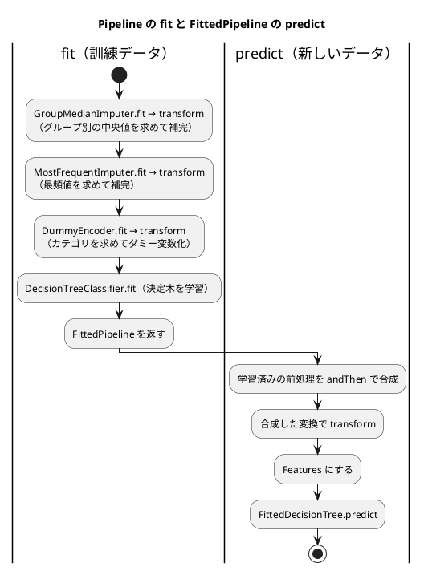

# 第 8 章: 実践的な分類と前処理パイプライン

## 8.1 はじめに

これまでの章のデータは、欠損値が少なく、特徴量もすべて数値でした。この章で扱うタイタニック号の乗客データには、次の 3 つの難しさがあります。

- **欠損値が多い** — 年齢が 2 割近く欠けている
- **カテゴリ値がある** — 性別や乗船した港が文字列で記録されている
- **クラスが偏っている** — 生存者より死亡者のほうが多い

この章では、これらを 1 つずつ小さな部品として TDD で実装し、前処理からモデルまでを 1 つの **パイプライン** につなぎます。最後にそのパイプラインをファイルに保存し、読み込んで予測できるようにします。保存したモデルは、第 15 章で作る機械学習 API から使います。

[Python 版の第 8 章](../python/08-classification-and-preprocessing-pipeline.md) は scikit-learn の変換器と `Pipeline` を、[Kotlin 版の第 8 章](../kotlin/08-classification-and-preprocessing-pipeline.md) は Kotlin DataFrame と自分で定義した `interface Transformer` を使いました。Java 版は、Kotlin 版と同じ設計を次の形で書きます。

- **データは第 2 章の `Table` と `Row` のまま扱う** — セルを文字列で持つ表なので、Kotlin 版で Red の原因になった「型の推定」（1 文字の列が `Char` に、null だけの列が `Nothing?` になる）が起きない。その代わり、数値を文字列に戻して書き込む手間がかかる
- **前処理の約束をインターフェースで表し、学習済みの前処理を関数の合成でつなぐ** — `FittedTransformer` は抽象メソッドが 1 つの関数型インターフェースで、`andThen` で合成できる
- **クラスの重みを付けた決定木を自作する** — Tribuo の決定木にはクラスの重み付けが無い（[ADR 002](../../../adr/002-kotlin-ml-libraries.md)）ので、第 3 章の決定木を 1 件ごとの重みを受け取る形に書き直す。Tribuo とは重み付けなしで突き合わせる
- **Java のシリアライズで保存し、読み込むクラスを許可リストで絞る** — record は `serialVersionUID` を書かなくてよいことも確かめる

## 8.2 題材とデータ

### Survived.csv

`Survived.csv` には、乗客 891 人の情報が記録されています。

| 列 | 意味 | 値 | 欠損値 |
|----|------|-----|------|
| PassengerId | 乗客の番号 | 整数 | 0 件 |
| Survived | 生存したか（正解ラベル） | 1（生存）または 0（死亡） | 0 件 |
| Pclass | 客室クラス | 1, 2, 3 | 0 件 |
| Sex | 性別 | `male` または `female` | 0 件 |
| Age | 年齢 | 小数 | 177 件 |
| SibSp | 同乗した兄弟・配偶者の数 | 整数 | 0 件 |
| Parch | 同乗した親・子の数 | 整数 | 0 件 |
| Ticket | チケット番号 | 文字列 | 0 件 |
| Fare | 運賃 | 小数 | 0 件 |
| Cabin | 客室番号 | 文字列 | 687 件 |
| Embarked | 乗船した港 | `C`・`Q`・`S` | 2 件 |

正解ラベルは生存 342 人、死亡 549 人です。件数と欠損値の数は、8.12 節の実データのテストで確かめます。

### 使う特徴量と、使わない列

特徴量には `Pclass`・`Sex`・`Age`・`SibSp`・`Parch`・`Fare`・`Embarked` の 7 列を使います。`PassengerId` と `Ticket` は乗客を区別するための値で、生存との関係は期待できません。`Cabin` は 891 件中 687 件が欠けているので、今回は使いません。

### 年齢はグループごとの中央値で補完する

年齢の欠損値を全体の平均値で補完すると、1 等客室の年配の乗客も、3 等客室の若い乗客も、同じ年齢で埋まってしまいます。そこで、客室クラスと性別の組み合わせ（グループ）ごとの中央値で補完します。

グループ分けに正解ラベル（`Survived`）を使ってはいけません。予測するときには、その乗客が生存したかは分からないからです。

## 8.3 TODO リストの作成

**TODO リスト**:

- [ ] CSV を読み込む
- [ ] 年齢の欠損値を補完する
  - [ ] 同じグループの中央値で補完する
  - [ ] グループごとに異なる中央値で補完する
  - [ ] 訓練データで求めた中央値を、別のデータの補完に使う
  - [ ] 訓練データに無いグループは、全体の中央値で補完する
- [ ] 乗船した港の欠損値を、最も多い値で補完する
- [ ] カテゴリ値を 0 と 1 の列（ダミー変数）にする
  - [ ] 訓練データと別のデータで、同じ列を作る
- [ ] クラスの重みを付けた決定木を作る
- [ ] 前処理とモデルを 1 つのパイプラインにつなぐ
- [ ] モデルを保存して読み込む
- [ ] 正解率と、見つけた生存者の数で評価する
- [ ] 実データでクラスの重みの効果を確かめる

## 8.4 CSV を読み込む

Kotlin 版は `readCSV` に型を推定させたので、1 文字の値の列 `Embarked` が `Char` 型で読み込まれ、`colTypes` で文字列に直しました。Java 版は、第 2 章の `Table.load` をそのまま使います。`Table.load` は BOM を取り除き、すべてのセルを文字列のまま `Row` に入れるので、`Embarked` は最初から `"S"` のような文字列です。空欄は空文字列で、`Row.isMissing` が欠損値と判断します。

```java
// 第 2 章の Row（抜粋）
public OptionalDouble number(String column) { ... } // 空欄なら空の OptionalDouble
public String text(String column) { ... }           // 文字列の列を読む
public boolean isMissing(String column) { ... }     // セルが空欄かどうか
```

数値の列は `number`、`Sex` や `Embarked` のような文字列の列は `text` で読みます。型を決めるのは読み込むときではなく **使うとき** なので、型の推定に驚かされることはありません。代わりに、前処理で求めた中央値を表に書き戻すときは、数値を文字列にして書き込む必要があります。

この章の前処理は、`Table` を受け取って新しい `Table` を返す形にします。行を書き換えるときは、元の行を変えずに新しい行を作る小さな関数を用意しました。

```java
// src/main/java/chapter08/Rows.java
package chapter08;

import chapter02.Row;
import java.util.HashMap;
import java.util.Map;

/** 行を書き換えた新しい行を作る。 */
final class Rows {
  private Rows() {}

  /** 列の値を置き換えた（列が無ければ足した）新しい行を返す。元の行は変更しない。 */
  static Row with(Row row, String column, String value) {
    Map<String, String> cells = new HashMap<>(row.cells());
    cells.put(column, value);
    return new Row(cells);
  }
}
```

`Row` は変更できない record（第 2 章で `Map.copyOf` で写している）なので、写しの `HashMap` を書き換えてから新しい `Row` を作ります。

テストでは、CSV と同じくカンマ区切りの文字列から表を作るヘルパーを使います。

```java
// src/test/java/chapter08/Tables.java
package chapter08;

import chapter02.Row;
import chapter02.Table;
import java.util.Arrays;
import java.util.HashMap;
import java.util.List;
import java.util.Map;

/** テスト用の表を作り、列の値を読む。 */
final class Tables {
  private Tables() {}

  /** 1 つ目の引数を列名の並び、残りを行として、カンマ区切りの文字列から表を作る。空欄は欠損値。 */
  static Table table(String header, String... lines) {
    List<String> columns = List.of(header.split(","));
    List<Row> rows = Arrays.stream(lines).map(line -> row(columns, line)).toList();
    return new Table(columns, rows);
  }

  private static Row row(List<String> columns, String line) {
    String[] values = line.split(",", -1);
    Map<String, String> cells = new HashMap<>();
    for (int i = 0; i < columns.size(); i++) {
      cells.put(columns.get(i), values[i]);
    }
    return new Row(cells);
  }

  /** 数値の列の値を、上から順に並べる。欠損値があれば失敗する。 */
  static List<Double> numbers(Table table, String name) {
    return table.rows().stream().map(row -> row.number(name).orElseThrow()).toList();
  }

  /** 文字列の列の値を、上から順に並べる。 */
  static List<String> texts(Table table, String name) {
    return table.rows().stream().map(row -> row.text(name)).toList();
  }
}
```

## 8.5 年齢をグループごとの中央値で補完する

### 前処理の部品をインターフェースで定義する

Kotlin 版と同じく、前処理の約束を 2 つのインターフェースで表します。

```java
// src/main/java/chapter08/Transformer.java
/** 訓練データから変換に必要な値を求める前処理。 */
public interface Transformer {
  FittedTransformer fit(Table x);
}
```

```java
// src/main/java/chapter08/FittedTransformer.java
/** fit で求めた値を使ってデータを変換する前処理。 */
@FunctionalInterface
public interface FittedTransformer {
  Table transform(Table x);
}
```

`fit` は求めた値を持つ **別の型** `FittedTransformer` を返します。`transform` を持つのは `FittedTransformer` だけなので、`fit` する前に `transform` を呼ぶコードはコンパイルできません。

`@FunctionalInterface` は、抽象メソッドが 1 つだけのインターフェース（関数型インターフェース）であることをコンパイラに確かめさせる注釈です。Kotlin の `fun interface` に当たり、ラムダ式で実装を作れます。

### Red: 最初のテスト

同じグループ（1 等客室の女性）の中に、年齢 20・30・70 の乗客と、年齢が欠けた乗客がいるデータで試します。中央値は 30 です。

```java
// src/test/java/chapter08/TransformersTest.java
class TransformersTest {
  @Nested
  @DisplayName("GroupMedianImputer")
  class GroupMedianImputerTest {
    private final GroupMedianImputer imputer =
        new GroupMedianImputer("Age", List.of("Pclass", "Sex"));

    @Test
    @DisplayName("同じグループの中央値で欠損値を補完する")
    void sameGroup() {
      var x = table("Pclass,Sex,Age", "1,female,20", "1,female,30", "1,female,70", "1,female,");

      var filled = imputer.fit(x).transform(x);

      assertThat(numbers(filled, "Age")).containsExactly(20.0, 30.0, 70.0, 30.0);
    }
  }
}
```

`@Nested` を付けた内側のクラスで、部品ごとにテストをまとめます。表示名は「TransformersTest > GroupMedianImputer > …」のように入れ子になります。

```text
src/test/java/chapter08/TransformersTest.java:16: エラー: シンボルを見つけられません
    private final GroupMedianImputer imputer =
                  ^
  シンボル:   クラス GroupMedianImputer
  場所: クラス TransformersTest.GroupMedianImputerTest
src/test/java/chapter08/TransformersTest.java:17: エラー: シンボルを見つけられません
        new GroupMedianImputer("Age", List.of("Pclass", "Sex"));
            ^
  シンボル:   クラス GroupMedianImputer
  場所: クラス TransformersTest.GroupMedianImputerTest
エラー2個
```

### Green: 仮実装

`fit` は、欠損値を 30 で埋めるだけの `FittedTransformer` をラムダ式で返します。前処理の設定（補完する列とグループ分けの列）は record の成分にします。

```java
// src/main/java/chapter08/GroupMedianImputer.java
public record GroupMedianImputer(String column, List<String> by) implements Transformer {
  public GroupMedianImputer {
    by = List.copyOf(by);
  }

  @Override
  public FittedTransformer fit(Table x) {
    return table ->
        new Table(
            table.columns(),
            table.rows().stream()
                .map(row -> row.isMissing(column) ? Rows.with(row, column, "30.0") : row)
                .toList());
  }
}
```

`table -> new Table(...)` は、`FittedTransformer` の `transform` をラムダ式で実装しています。戻り値の型が関数型インターフェースなので、Kotlin の `FittedTransformer { ... }` のような型名を書く必要もありません。

```text
TransformersTest > GroupMedianImputer > 同じグループの中央値で欠損値を補完する PASSED
BUILD SUCCESSFUL in 46s
```

### 三角測量: グループごとに異なる中央値

1 等客室の女性（40・50 → 中央値 45）と、3 等客室の男性（10・20 → 中央値 15）の 2 グループで試します。

```java
    @Test
    @DisplayName("グループごとに異なる中央値で補完する")
    void differentGroups() {
      var x =
          table(
              "Pclass,Sex,Age",
              "1,female,40",
              "1,female,50",
              "1,female,",
              "3,male,10",
              "3,male,20",
              "3,male,");

      var filled = imputer.fit(x).transform(x);

      assertThat(numbers(filled, "Age")).containsExactly(40.0, 50.0, 45.0, 10.0, 20.0, 15.0);
    }
```

```text
TransformersTest > GroupMedianImputer > グループごとに異なる中央値で補完する FAILED
    org.opentest4j.AssertionFailedError: 
    Expecting actual:
      [40.0, 50.0, 30.0, 10.0, 20.0, 30.0]
    to contain exactly (and in same order):
      [40.0, 50.0, 45.0, 10.0, 20.0, 15.0]
    but some elements were not found:
      [45.0, 15.0]
    and others were not expected:
      [30.0, 30.0]
TransformersTest > GroupMedianImputer > 同じグループの中央値で欠損値を補完する PASSED
2 tests completed, 1 failed
```

`fit` で、グループごとの年齢のリストを集めて中央値を求めます。求めた値は、record `FittedGroupMedianImputer` に持たせます。

```java
  @Override
  public FittedTransformer fit(Table x) {
    Map<List<String>, List<Double>> groups =
        x.rows().stream()
            .filter(row -> !row.isMissing(column))
            .collect(
                Collectors.groupingBy(
                    this::groupOf,
                    Collectors.mapping(
                        row -> row.number(column).orElseThrow(), Collectors.toList())));
    Map<List<String>, Double> medians =
        groups.entrySet().stream()
            .collect(Collectors.toMap(Map.Entry::getKey, entry -> median(entry.getValue())));
    return new FittedGroupMedianImputer(column, by, medians);
  }

  private List<String> groupOf(Row row) {
    return by.stream().map(row::text).toList();
  }

  /** 中央値。件数が偶数なら中央の 2 つの平均。 */
  static double median(List<Double> values) {
    double[] sorted = values.stream().mapToDouble(Double::doubleValue).sorted().toArray();
    int middle = sorted.length / 2;
    return sorted.length % 2 == 1 ? sorted[middle] : (sorted[middle - 1] + sorted[middle]) / 2;
  }

  /** fit で求めたグループごとの中央値を持ち、欠損値を補完する。 */
  public record FittedGroupMedianImputer(
      String column, List<String> by, Map<List<String>, Double> medians)
      implements FittedTransformer {
    public FittedGroupMedianImputer {
      by = List.copyOf(by);
      medians = Map.copyOf(medians);
    }

    @Override
    public Table transform(Table x) {
      return new Table(x.columns(), x.rows().stream().map(this::fill).toList());
    }

    private Row fill(Row row) {
      if (!row.isMissing(column)) {
        return row;
      }
      List<String> group = by.stream().map(row::text).toList();
      return Rows.with(row, column, String.valueOf(medians.get(group)));
    }
  }
```

| 式 | 意味 |
|----|------|
| `Collectors.groupingBy(キー, 下流)` | キーごとに要素を集めた `Map` を作る。Kotlin の `groupBy` に当たる |
| `Collectors.mapping(変換, Collectors.toList())` | 集めるときに要素を変換する（行 → 年齢の数値） |
| `this::groupOf` | メソッド参照。`row -> groupOf(row)` と同じ |
| `Map.copyOf` | 変更できない写しを作る。record の成分を外から変えられないようにする |

Kotlin DataFrame の `groupBy(...).median(...)` に当たる処理を、Stream API で組み立てました。グループのキーを `List.of("1", "female")` のようなリストにしたのは、リストが要素の値で等しいかを比べるので、`Map` のキーにそのまま使えるからです。中央値は、Kotlin DataFrame の `median` と同じく、件数が偶数なら中央の 2 つの平均にしています。

`FittedGroupMedianImputer` は `GroupMedianImputer` の中に入れ子にした record です。入れ子の record は暗黙に `static` なので、外側のインスタンスを持ちません。

```text
TransformersTest > GroupMedianImputer > グループごとに異なる中央値で補完する PASSED
TransformersTest > GroupMedianImputer > 同じグループの中央値で欠損値を補完する PASSED
BUILD SUCCESSFUL in 45s
```

### 訓練データで求めた値を別のデータに使う

データリークを防ぐための、この部品の一番大事な仕様です。訓練データ（2 等客室の男性 30・34 → 中央値 32）で `fit` し、別のデータを `transform` します。あわせて、訓練データに 1 人もいなかったグループの乗客を、全体の中央値で補完する仕様も書きます（訓練データの年齢 30・40・20 の中央値は 30）。

```java
    @Test
    @DisplayName("訓練データで求めた中央値を別のデータの補完に使う")
    void fitOnTrain() {
      var train = table("Pclass,Sex,Age", "2,male,30", "2,male,34");
      var other = table("Pclass,Sex,Age", "2,male,");

      var filled = imputer.fit(train).transform(other);

      assertThat(numbers(filled, "Age")).containsExactly(32.0);
    }

    @Test
    @DisplayName("訓練データに無いグループは全体の中央値で補完する")
    void unseenGroup() {
      var train = table("Pclass,Sex,Age", "1,female,30", "1,female,40", "3,male,20");
      var other = table("Pclass,Sex,Age", "2,female,");

      var filled = imputer.fit(train).transform(other);

      assertThat(numbers(filled, "Age")).containsExactly(30.0);
    }
```

```text
TransformersTest > GroupMedianImputer > グループごとに異なる中央値で補完する PASSED
TransformersTest > GroupMedianImputer > 同じグループの中央値で欠損値を補完する PASSED
TransformersTest > GroupMedianImputer > 訓練データに無いグループは全体の中央値で補完する FAILED
    java.lang.NumberFormatException: For input string: "null"
TransformersTest > GroupMedianImputer > 訓練データで求めた中央値を別のデータの補完に使う PASSED
4 tests completed, 1 failed
```

Kotlin 版では 2 つとも失敗しました。1 つ目の失敗は、年齢が欠けた 1 人分のデータの `Age` 列が `Nothing?`（null しか入らない型）の列として作られたためでした。Java 版の `Table` は列の型を持たないので、このテストは追加した時点で通ります。

2 つ目の失敗は予想どおりです。ただし、失敗の仕方に Java らしさが出ています。`medians.get(group)` は、キーが無いと `null` を返します。`String.valueOf(null の Double)` は例外を投げずに文字列 `"null"` を返すので、補完の時点では失敗せず、テストが年齢を数値として読んだところで `NumberFormatException` になりました。

全体の中央値は `fit` で求めておき、`getOrDefault` でグループの中央値が無いときに使います。

```java
    double overallMedian = median(groups.values().stream().flatMap(List::stream).toList());
    return new FittedGroupMedianImputer(column, by, medians, overallMedian);
```

```java
  /** fit で求めたグループごとの中央値と全体の中央値を持ち、欠損値を補完する。 */
  public record FittedGroupMedianImputer(
      String column, List<String> by, Map<List<String>, Double> medians, double overallMedian)
      implements FittedTransformer {
```

```java
      return Rows.with(row, column, String.valueOf(medians.getOrDefault(group, overallMedian)));
```

`groups.values().stream().flatMap(List::stream)` は、グループごとの年齢のリストを 1 つの流れにつなぎます。欠損値はグループを作る前に除いてあるので、全体の中央値にも欠損値は入りません。

```text
TransformersTest > GroupMedianImputer > グループごとに異なる中央値で補完する PASSED
TransformersTest > GroupMedianImputer > 同じグループの中央値で欠損値を補完する PASSED
TransformersTest > GroupMedianImputer > 訓練データに無いグループは全体の中央値で補完する PASSED
TransformersTest > GroupMedianImputer > 訓練データで求めた中央値を別のデータの補完に使う PASSED
BUILD SUCCESSFUL in 1m 23s
```

### 年齢がすべて欠けたグループ

Kotlin 版は、8.9 節のパイプラインのテストで「年齢がすべて欠けたグループ」の穴を見つけました。Kotlin DataFrame の `median` がそのグループに null を返し、数値への変換で失敗したのです。Java 版の `fit` は、欠損値の行を除いてからグループを作るので、年齢がすべて欠けたグループは `medians` に現れず、「訓練データに無いグループ」と同じく全体の中央値で補完されるはずです。仕様として先にテストにします。元の表を変更しないことも固定しておきます。

```java
    @Test
    @DisplayName("年齢がすべて欠けたグループは全体の中央値で補完する")
    void allMissingGroup() {
      var x = table("Pclass,Sex,Age", "1,female,30", "1,female,40", "2,female,");

      var filled = imputer.fit(x).transform(x);

      assertThat(numbers(filled, "Age")).containsExactly(30.0, 40.0, 35.0);
    }

    @Test
    @DisplayName("元の表は変更しない")
    void keepsOriginal() {
      var x = table("Pclass,Sex,Age", "1,male,30", "1,male,");

      imputer.fit(x).transform(x);

      assertThat(x.rows().get(1).isMissing("Age")).isTrue();
    }
```

どちらも追加した時点で通りました（次の節の実行結果に含まれています）。

## 8.6 乗船した港を最頻値で補完する

`Embarked` は文字列なので、中央値は使えません。訓練データで最も多い値（最頻値）で補完します。仕組みは `GroupMedianImputer` と同じなので、明白な実装で進めます。

```java
  @Nested
  @DisplayName("MostFrequentImputer")
  class MostFrequentImputerTest {
    private final MostFrequentImputer imputer = new MostFrequentImputer("Embarked");

    @Test
    @DisplayName("訓練データで最も多い値で欠損値を補完する")
    void mostFrequent() {
      var train = table("Embarked", "S", "C", "S", "");
      var other = table("Embarked", "", "Q");

      var filled = imputer.fit(train).transform(other);

      assertThat(texts(filled, "Embarked")).containsExactly("S", "Q");
    }
  }
```

```text
src/test/java/chapter08/TransformersTest.java:94: エラー: シンボルを見つけられません
```

```java
// src/main/java/chapter08/MostFrequentImputer.java
package chapter08;

import chapter02.Row;
import chapter02.Table;
import java.util.LinkedHashMap;
import java.util.Map;

/** 文字列の列の欠損値を、訓練データで最も多い値（最頻値）で補完する前処理。 */
public record MostFrequentImputer(String column) implements Transformer {
  @Override
  public FittedTransformer fit(Table x) {
    Map<String, Integer> counts = new LinkedHashMap<>();
    x.rows().stream()
        .filter(row -> !row.isMissing(column))
        .forEach(row -> counts.merge(row.text(column), 1, Integer::sum));
    String mostFrequent = null;
    int bestCount = 0;
    for (Map.Entry<String, Integer> entry : counts.entrySet()) {
      if (entry.getValue() > bestCount) {
        mostFrequent = entry.getKey();
        bestCount = entry.getValue();
      }
    }
    return new FittedMostFrequentImputer(column, mostFrequent);
  }

  /** fit で求めた最頻値を持ち、欠損値を補完する。 */
  public record FittedMostFrequentImputer(String column, String mostFrequent)
      implements FittedTransformer {
    @Override
    public Table transform(Table x) {
      return new Table(x.columns(), x.rows().stream().map(this::fill).toList());
    }

    private Row fill(Row row) {
      return row.isMissing(column) ? Rows.with(row, column, mostFrequent) : row;
    }
  }
}
```

値ごとの件数を `LinkedHashMap` に数え、最も多い値を選びます。`LinkedHashMap` は値が最初に現れた順を保ち、`>` で比べているので、同数の値が複数あれば先に現れた値が選ばれます。第 3 章の `majority` と同じ選び方で、Kotlin 版の `maxBy` とも同じです。pandas の `mode()` は同数の値を並べ替えて返すので、Python 版とは同数のときに選ぶ値が違うことがあります。

Kotlin 版では、港だけが欠けた 1 人分のデータで `Nothing?` の列の問題がもう一度起きました。Java 版では起きないので、そのテストは作っていません。

```text
TransformersTest > GroupMedianImputer > 年齢がすべて欠けたグループは全体の中央値で補完する PASSED
TransformersTest > GroupMedianImputer > グループごとに異なる中央値で補完する PASSED
TransformersTest > GroupMedianImputer > 同じグループの中央値で欠損値を補完する PASSED
TransformersTest > GroupMedianImputer > 訓練データに無いグループは全体の中央値で補完する PASSED
TransformersTest > GroupMedianImputer > 元の表は変更しない PASSED
TransformersTest > GroupMedianImputer > 訓練データで求めた中央値を別のデータの補完に使う PASSED
TransformersTest > MostFrequentImputer > 訓練データで最も多い値で欠損値を補完する PASSED
BUILD SUCCESSFUL in 34s
```

## 8.7 カテゴリ値をダミー変数にする

### Red → Green: 素直な実装

決定木は、`male` のような文字列を直接扱えません。カテゴリごとに 0 と 1 の列を作る **ダミー変数** に変換します。`male` と `female` の 2 列を作ると、片方がもう片方の裏返しになり情報が重複するので、最初のカテゴリの列を落とします。

Kotlin 版は、Kotlin DataFrame の `pivotMatches` の振る舞いを学習用テストで確かめてから自作に進みました。Java 版にはデータフレームのライブラリが無いので、最初から自作します。

```java
  @Nested
  @DisplayName("DummyEncoder")
  class DummyEncoderTest {
    @Test
    @DisplayName("2 値のカテゴリを、最初のカテゴリを除いた 0 と 1 の列にする")
    void twoCategories() {
      var x = table("Pclass,Sex", "1,female", "3,male", "2,male");
      var encoder = new DummyEncoder(List.of("Sex"));

      var encoded = encoder.fit(x).transform(x);

      assertThat(encoded.columns()).containsExactly("Pclass", "Sex_male");
      assertThat(numbers(encoded, "Sex_male")).containsExactly(0.0, 1.0, 1.0);
    }
  }
```

`transform` するデータ自身からカテゴリを求める、素直な実装にします。

```java
// src/main/java/chapter08/DummyEncoder.java
public record DummyEncoder(List<String> columns) implements Transformer {
  public DummyEncoder {
    columns = List.copyOf(columns);
  }

  @Override
  public FittedTransformer fit(Table x) {
    return table -> encode(table, dummiesOf(table));
  }

  private Map<String, List<String>> dummiesOf(Table x) {
    Map<String, List<String>> dummies = new LinkedHashMap<>();
    for (String column : columns) {
      List<String> categories = categoriesOf(x, column);
      dummies.put(column, categories.subList(1, categories.size()));
    }
    return dummies;
  }
```

`categoriesOf` と `encode` は完成コードと同じです（下に載せます）。`categoriesOf` は列の値を重複なく並べ替え、`subList(1, …)` で最初のカテゴリを落とします。`encode` は、表の列名の並びから元の列を除いてダミー変数の列を末尾に足し、各行にはカテゴリごとの `"1"` か `"0"` のセルを足します。

```text
TransformersTest > DummyEncoder > 2 値のカテゴリを、最初のカテゴリを除いた 0 と 1 の列にする PASSED
```

### 三角測量: 別のデータにも同じ列を作る

訓練データとテストデータ（や、API に届いた 1 人分のデータ）で別々にカテゴリを求めると、列の数が変わり、モデルに渡せなくなります。これを仕様としてテストにします。

```java
    @Test
    @DisplayName("別のデータにも訓練データと同じ列を作る")
    void sameColumns() {
      var train = table("Embarked", "C", "Q", "S");
      var other = table("Embarked", "S", "S");
      var encoder = new DummyEncoder(List.of("Embarked"));

      var encoded = encoder.fit(train).transform(other);

      assertThat(encoded.columns()).containsExactly("Embarked_Q", "Embarked_S");
      assertThat(numbers(encoded, "Embarked_Q")).containsExactly(0.0, 0.0);
      assertThat(numbers(encoded, "Embarked_S")).containsExactly(1.0, 1.0);
    }
```

```text
TransformersTest > DummyEncoder > 別のデータにも訓練データと同じ列を作る FAILED
    org.opentest4j.AssertionFailedError: 
    Expecting actual:
      []
    to contain exactly (and in same order):
      ["Embarked_Q", "Embarked_S"]
    but could not find the following elements:
      ["Embarked_Q", "Embarked_S"]
```

列が 1 つもできませんでした。`S` しか無いデータでは、唯一のカテゴリである `S` まで「最初のカテゴリ」として落とされてしまいます。Python 版・Kotlin 版と同じ失敗です。

`fit` で訓練データのカテゴリを覚え、`transform` では覚えたカテゴリの列を作ります。仮実装のラムダ式を、覚えた値を持つ record に置き換えます。

```java
  @Override
  public FittedTransformer fit(Table x) {
    return new FittedDummyEncoder(dummiesOf(x));
  }
```

```java
  /** fit で求めたカテゴリを持ち、どのデータにも同じダミー変数の列を作る。 */
  public record FittedDummyEncoder(Map<String, List<String>> dummies)
      implements FittedTransformer {
    public FittedDummyEncoder {
      dummies = Collections.unmodifiableMap(new LinkedHashMap<>(dummies));
    }

    @Override
    public Table transform(Table x) {
      return encode(x, dummies);
    }
  }
```

`Map.copyOf` ではなく `LinkedHashMap` に写しているのは、`Map.copyOf` の返す `Map` が要素の順を保たないからです。`Sex` → `Embarked` の順にダミー変数の列を並べたいので、順を保つ `LinkedHashMap` に写し、`Collections.unmodifiableMap` で変更できないようにしました。

```text
TransformersTest > DummyEncoder > 2 値のカテゴリを、最初のカテゴリを除いた 0 と 1 の列にする PASSED
TransformersTest > DummyEncoder > 別のデータにも訓練データと同じ列を作る PASSED
```

`transform` するデータに無いカテゴリ（`Q`）も、覚えた列として 0 で作られます。

## 8.8 クラスの重みを付けた決定木を作る

### なぜ自作するのか

死亡者のほうが多いデータで決定木を学習すると、死亡者を正しく分けることが優先され、生存者の見落としが増えがちです。scikit-learn では `class_weight="balanced"` を指定すると、少ないクラスの 1 件を重く数えて分割を選べます。

Tribuo の決定木（`CARTClassificationTrainer`）はクラスの重み付けに対応していません（[ADR 002](../../../adr/002-kotlin-ml-libraries.md) で、`WeightedLabels` を実装していないことを確認しました。Tribuo は Java 製なので、Java から使っても同じです）。第 3 章の自作の決定木にも重みはありません。そこで、第 3 章の決定木を、1 件ごとの重みを受け取る形に書き直します。第 3 章のコードは変えず、この章の中に作ります。

### 重み付きのジニ不純度

重み付きのジニ不純度は、ラベルの **件数** の代わりに **重みの合計** で割合を求めます。

重み付きジニ不純度 = 1 − Σ（そのラベルの重みの合計 / 全体の重みの合計）²

重みがすべて 1 なら、第 3 章のジニ不純度と同じ値になるはずです。これを最初のテストにします。ラベルは生存・死亡を表す `Integer` にします。

```java
// src/test/java/chapter08/DecisionTreeClassifierTest.java
class DecisionTreeClassifierTest {
  @Test
  @DisplayName("重みがすべて 1 なら第 3 章のジニ不純度と同じ値になる")
  void unitWeights() {
    var labels = List.of(0, 1, 1);

    assertThat(WeightedTrees.weightedGini(labels, List.of(1.0, 1.0, 1.0)))
        .isEqualTo(DecisionTrees.gini(labels.stream().map(String::valueOf).toList()));
  }
}
```

```text
src/test/java/chapter08/DecisionTreeClassifierTest.java:16: エラー: シンボルを見つけられません
    assertThat(WeightedTrees.weightedGini(labels, List.of(1.0, 1.0, 1.0)))
               ^
  シンボル:   変数 WeightedTrees
  場所: クラス DecisionTreeClassifierTest
```

第 3 章の `DecisionTrees` に合わせて、重み付きの木を作る関数は `WeightedTrees` クラスの `static` メソッドにします。仮実装は、重みを無視して第 3 章の `gini` を呼ぶだけです。

```java
// src/main/java/chapter08/WeightedTrees.java
public final class WeightedTrees {
  private WeightedTrees() {}

  /** 重み付きのジニ不純度。ラベルの件数の代わりに重みの合計で割合を求める。 */
  public static double weightedGini(List<Integer> labels, List<Double> weights) {
    return DecisionTrees.gini(labels.stream().map(String::valueOf).toList());
  }
}
```

重みに差がある例で三角測量します。ラベル 0 の重みが 1、ラベル 1 の重みが 3 なら、割合は 0.25 と 0.75 で、不純度は 1 − (0.25² + 0.75²) = 0.375 です。

```java
  @Test
  @DisplayName("重みの大きいラベルほど多いものとして不純度を計算する")
  void weighted() {
    assertThat(WeightedTrees.weightedGini(List.of(0, 1), List.of(1.0, 3.0)))
        .isCloseTo(0.375, within(1e-12));
  }
```

```text
DecisionTreeClassifierTest > 重みがすべて 1 なら第 3 章のジニ不純度と同じ値になる PASSED
DecisionTreeClassifierTest > 重みの大きいラベルほど多いものとして不純度を計算する FAILED
    java.lang.AssertionError: 
    Expecting actual:
      0.5
    to be close to:
      0.375
    by less than 1.0E-12 but difference was 0.125.
    (a difference of exactly 1.0E-12 being considered valid)
2 tests completed, 1 failed
```

```java
  /** 重み付きのジニ不純度。ラベルの件数の代わりに重みの合計で割合を求める。 */
  public static double weightedGini(List<Integer> labels, List<Double> weights) {
    double total = sum(weights);
    return 1.0
        - weightSums(labels, weights).values().stream()
            .mapToDouble(weight -> Math.pow(weight / total, 2))
            .sum();
  }

  /** ラベルごとの重みの合計を、ラベルが先に現れた順に並べて返す。 */
  private static Map<Integer, Double> weightSums(List<Integer> labels, List<Double> weights) {
    Map<Integer, Double> sums = new LinkedHashMap<>();
    for (int i = 0; i < labels.size(); i++) {
      sums.merge(labels.get(i), weights.get(i), Double::sum);
    }
    return sums;
  }
```

ラベルごとの重みの合計を、第 3 章の `counts` と同じく `LinkedHashMap` に集めます。`merge(キー, 値, Double::sum)` は、キーが無ければ値を入れ、あれば足し合わせます。計算の形（`Math.pow(割合, 2)` を先に現れたラベルの順に足す）を第 3 章の `gini` とそろえてあるので、重みがすべて 1 なら浮動小数点数の計算も同じ順に行われ、1 つ目のテストは誤差を許容しない `isEqualTo` のまま通ります。

### balanced の重み

scikit-learn の `balanced` と同じく、1 件の重みを「件数 / (クラスの数 × そのクラスの件数)」にします。ラベル 0 が 3 件、ラベル 1 が 1 件なら、0 の重みは 4 / (2 × 3)、1 の重みは 4 / (2 × 1) = 2 です。クラスごとの重みの合計は、どちらも 2 にそろいます。

```java
  @Test
  @DisplayName("少ないクラスほど 1 件の重みを大きくし、クラスごとの重みの合計をそろえる")
  void balancedWeights() {
    var weights = WeightedTrees.balancedWeights(List.of(0, 0, 0, 1));

    assertThat(weights).containsExactly(4.0 / 6, 4.0 / 6, 4.0 / 6, 2.0);
    assertThat(weights.get(0) + weights.get(1) + weights.get(2))
        .isCloseTo(weights.get(3), within(1e-12));
  }
```

```text
src/test/java/chapter08/DecisionTreeClassifierTest.java:31: エラー: シンボルを見つけられません
    var weights = WeightedTrees.balancedWeights(List.of(0, 0, 0, 1));
                               ^
  シンボル:   メソッド balancedWeights(List<Integer>)
  場所: クラス WeightedTrees
```

定義どおりの明白な実装です。`(double)` で先に小数にしてから割らないと、整数の割り算で小数点以下が切り捨てられます。

```java
  /** クラスの件数に反比例する重み（件数 / (クラスの数 × そのクラスの件数)）を 1 件ごとに求める。 */
  public static List<Double> balancedWeights(List<Integer> t) {
    Map<Integer, Integer> counts = new LinkedHashMap<>();
    t.forEach(label -> counts.merge(label, 1, Integer::sum));
    return t.stream()
        .map(label -> (double) t.size() / (counts.size() * counts.get(label)))
        .toList();
  }
```

### 重み付けなしなら第 3 章の決定木と同じ

木を作る処理は、第 3 章の `bestSplit`・`build`・`predictOne` と同じ手順に、1 件ごとの重みを通すだけです。そこで、「重み付けなしなら第 3 章の決定木と同じ予測をする」ことを仕様にします。数値の特徴量 2 つと 0・1 のラベルを持つ架空のデータで、深さを 3 通りに変えて比べます。

```java
  private static List<Features> fareAndAge(double[]... rows) {
    return Arrays.stream(rows).map(row -> new Features(List.of("Fare", "Age"), row)).toList();
  }

  @ParameterizedTest(name = "深さ {0}（-1 は制限なし）")
  @ValueSource(ints = {1, 2, DecisionTreeClassifier.UNLIMITED})
  @DisplayName("重み付けなしなら第 3 章の決定木と同じ予測をする")
  void sameAsChapter03(int maxDepth) {
    var x =
        fareAndAge(
            new double[] {8, 30},
            new double[] {9, 22},
            new double[] {13, 18},
            new double[] {20, 45},
            new double[] {60, 25},
            new double[] {80, 33});
    var t = List.of(0, 0, 1, 0, 1, 1);
    var chapter03 =
        maxDepth == DecisionTreeClassifier.UNLIMITED
            ? DecisionTree.unlimited()
            : DecisionTree.withMaxDepth(maxDepth);
    var expected = chapter03.fit(x, t.stream().map(String::valueOf).toList()).predict(x);

    var predictions = new DecisionTreeClassifier(maxDepth, ClassWeight.NONE).fit(x, t).predict(x);

    assertThat(predictions.stream().map(String::valueOf).toList()).isEqualTo(expected);
  }
```

`double[]... rows` は可変長引数で、乗客 1 人分の値の配列を並べて渡せます。特徴量は第 2 章の `Features` をそのまま使います。

```text
src/test/java/chapter08/DecisionTreeClassifierTest.java:48: エラー: シンボルを見つけられません
  @ValueSource(ints = {1, 2, DecisionTreeClassifier.UNLIMITED})
                             ^
  シンボル:   変数 DecisionTreeClassifier
  場所: クラス DecisionTreeClassifierTest
```

第 3 章で作った手順をなぞる明白な実装です。クラスの重みの指定は、まず `NONE` だけを持つ enum にします。木の型は、第 3 章の `Tree`・`Leaf`・`Node` と同じく sealed interface と record で作ります。ラベルが `int` になるので、第 3 章の型は使い回せません。

```java
// src/main/java/chapter08/ClassWeight.java
/** クラスの重みの付け方。 */
public enum ClassWeight {
  /** 重みを付けない（すべて 1） */
  NONE,
}
```

```java
// src/main/java/chapter08/TreeNode.java
/** 重み付きの決定木。葉（LeafNode）か節（SplitNode）のどちらか。 */
public sealed interface TreeNode permits LeafNode, SplitNode {}
```

```java
// src/main/java/chapter08/LeafNode.java
package chapter08;

/** 予測するラベルを持つ葉。 */
public record LeafNode(int label) implements TreeNode {}
```

```java
// src/main/java/chapter08/SplitNode.java
package chapter08;

/** 特徴量の値が境界以下なら左、境界より大きければ右へ進む節。 */
public record SplitNode(String feature, double threshold, TreeNode left, TreeNode right)
    implements TreeNode {}
```

```java
// src/main/java/chapter08/DecisionTreeClassifier.java
/** クラスの重みを付けられる決定木の分類器。fit で学習済みの木を返す。maxDepth が負なら深さの上限なし。 */
public record DecisionTreeClassifier(int maxDepth, ClassWeight classWeight) {
  /** 深さを制限しないことを表す値 */
  public static final int UNLIMITED = -1;

  /** 訓練データから木を作る。 */
  public FittedDecisionTree fit(List<Features> x, List<Integer> t) {
    List<Double> weights = t.stream().map(label -> 1.0).toList();
    return new FittedDecisionTree(WeightedTrees.build(x, t, weights, maxDepth));
  }
}
```

```java
// src/main/java/chapter08/FittedDecisionTree.java
/** 学習済みの決定木。 */
public record FittedDecisionTree(TreeNode root) {
  /** 特徴量ごとのラベルを予測する。 */
  public List<Integer> predict(List<Features> x) {
    return x.stream().map(features -> WeightedTrees.predictOne(root, features)).toList();
  }
}
```

`WeightedTrees` に、多数決・分割の選択・木の構築・予測を足します。

```java
  /** 重みの合計が最も大きいラベル。同じなら先に現れたラベルを選ぶ。 */
  static int weightedMajority(List<Integer> labels, List<Double> weights) {
    int best = labels.getFirst();
    double bestWeight = 0.0;
    for (Map.Entry<Integer, Double> entry : weightSums(labels, weights).entrySet()) {
      if (entry.getValue() > bestWeight) {
        best = entry.getKey();
        bestWeight = entry.getValue();
      }
    }
    return best;
  }

  /** 左右の重み付き不純度の、重みによる平均が最も小さくなる分割。同じ不純度なら先に見つけた分割を選ぶ。 */
  static Optional<Split> bestSplit(List<Features> x, List<Integer> t, List<Double> w) {
    if (weightedGini(t, w) == 0.0) {
      return Optional.empty();
    }
    Split best = null;
    for (String feature : x.getFirst().columns()) {
      List<Integer> order =
          IntStream.range(0, x.size())
              .boxed()
              .sorted(Comparator.comparingDouble(i -> x.get(i).value(feature)))
              .toList();
      List<Double> values = order.stream().map(i -> x.get(i).value(feature)).toList();
      List<Integer> labels = order.stream().map(t::get).toList();
      List<Double> weights = order.stream().map(w::get).toList();
      for (int i = 1; i < order.size(); i++) {
        if (values.get(i).equals(values.get(i - 1))) {
          continue;
        }
        List<Double> left = weights.subList(0, i);
        List<Double> right = weights.subList(i, weights.size());
        double impurity =
            (sum(left) * weightedGini(labels.subList(0, i), left)
                    + sum(right) * weightedGini(labels.subList(i, labels.size()), right))
                / sum(weights);
        if (best == null || impurity < best.impurity()) {
          best = new Split(feature, (values.get(i - 1) + values.get(i)) / 2, impurity);
        }
      }
    }
    return Optional.ofNullable(best);
  }

  /** 深さの上限まで分割を繰り返して木を作る。maxDepth が負なら上限なし。 */
  static TreeNode build(List<Features> x, List<Integer> t, List<Double> w, int maxDepth) {
    Optional<Split> split = maxDepth == 0 ? Optional.empty() : bestSplit(x, t, w);
    if (split.isEmpty()) {
      return new LeafNode(weightedMajority(t, w));
    }
    Split s = split.get();
    List<Integer> left =
        IntStream.range(0, x.size())
            .filter(i -> x.get(i).value(s.feature()) <= s.threshold())
            .boxed()
            .toList();
    List<Integer> right =
        IntStream.range(0, x.size())
            .filter(i -> x.get(i).value(s.feature()) > s.threshold())
            .boxed()
            .toList();
    int childDepth = maxDepth < 0 ? maxDepth : maxDepth - 1;
    return new SplitNode(
        s.feature(),
        s.threshold(),
        build(pick(x, left), pick(t, left), pick(w, left), childDepth),
        build(pick(x, right), pick(t, right), pick(w, right), childDepth));
  }

  private static <E> List<E> pick(List<E> values, List<Integer> positions) {
    return positions.stream().map(values::get).toList();
  }

  /** 1 件の特徴量のラベルを予測する。 */
  static int predictOne(TreeNode node, Features features) {
    return switch (node) {
      case LeafNode leaf -> leaf.label();
      case SplitNode split ->
          features.value(split.feature()) <= split.threshold()
              ? predictOne(split.left(), features)
              : predictOne(split.right(), features);
    };
  }
```

第 3 章との違いは次の 3 点です。

- 並べ替えた位置の順に、ラベルに加えて重みも取り出します。分割の不純度は件数でなく重みの合計で重み付けし、葉のラベルは件数でなく重みの合計の多数決（`weightedMajority`）で決めます
- 分割の候補には、第 3 章の record `Split`（特徴量・境界・不純度）をそのまま使います。`public` にしてあったので、別のパッケージから使えます
- 第 3 章の `DecisionTree` は `fit` で自分の中に木を持ちましたが、`DecisionTreeClassifier` の `fit` は学習済みの木 `FittedDecisionTree` を返します。前処理の部品と同じく、学習前に予測を呼べない形です

```text
DecisionTreeClassifierTest > 重みがすべて 1 なら第 3 章のジニ不純度と同じ値になる PASSED
DecisionTreeClassifierTest > 少ないクラスほど 1 件の重みを大きくし、クラスごとの重みの合計をそろえる PASSED
DecisionTreeClassifierTest > 重みの大きいラベルほど多いものとして不純度を計算する PASSED
DecisionTreeClassifierTest > 重み付けなしなら第 3 章の決定木と同じ予測をする > 深さ 1（-1 は制限なし） PASSED
DecisionTreeClassifierTest > 重み付けなしなら第 3 章の決定木と同じ予測をする > 深さ 2（-1 は制限なし） PASSED
DecisionTreeClassifierTest > 重み付けなしなら第 3 章の決定木と同じ予測をする > 深さ -1（-1 は制限なし） PASSED
```

### balanced で予測が変わる

`balanced` にすると予測が変わる例を作ります。運賃が 1.0 の乗客 4 人（全員死亡）と、2.0 の乗客 3 人（死亡 2 人・生存 1 人）です。分けられる境界は 1.5 しかないので、深さ 1 の木の右の葉には、死亡 2 人と生存 1 人が入ります。

- 重み付けなし: 死亡 2 件 対 生存 1 件で、右の葉は死亡（0）
- balanced: 死亡 6 件・生存 1 件なので、死亡の重みは 7 / 12、生存の重みは 7 / 2。右の葉は死亡 2 × 7/12 ≒ 1.17 対 生存 3.5 で、生存（1）

```java
  @Test
  @DisplayName("balanced にすると、少ないクラスが混ざった葉でも少ないクラスを予測する")
  void balanced() {
    var fare = column("Fare", 1, 1, 1, 1, 2, 2, 2);
    var survived = List.of(0, 0, 0, 0, 0, 0, 1);
    var newX = column("Fare", 1, 2);

    var none = new DecisionTreeClassifier(1, ClassWeight.NONE).fit(fare, survived);
    var balanced = new DecisionTreeClassifier(1, ClassWeight.BALANCED).fit(fare, survived);

    assertThat(none.predict(newX)).containsExactly(0, 0);
    assertThat(balanced.predict(newX)).containsExactly(0, 1);
  }

  private static List<Features> column(String name, double... values) {
    return Arrays.stream(values)
        .mapToObj(v -> new Features(List.of(name), new double[] {v}))
        .toList();
  }
```

```text
src/test/java/chapter08/DecisionTreeClassifierTest.java:79: エラー: シンボルを見つけられません
    var balanced = new DecisionTreeClassifier(1, ClassWeight.BALANCED).fit(fare, survived);
                                                            ^
  シンボル:   変数 BALANCED
  場所: クラス ClassWeight
```

enum に `BALANCED` を足すと、コンパイルは通り、テストが失敗します。`fit` がまだ重みを使っていないからです。

```java
public enum ClassWeight {
  /** 重みを付けない（すべて 1） */
  NONE,
  /** クラスの件数に反比例する重みを付ける */
  BALANCED,
}
```

```text
DecisionTreeClassifierTest > balanced にすると、少ないクラスが混ざった葉でも少ないクラスを予測する FAILED
    org.opentest4j.AssertionFailedError: 
    Expecting actual:
      [0, 0]
    to contain exactly (and in same order):
      [0, 1]
    but some elements were not found:
      [1]
    and others were not expected:
      [0]
```

`fit` で、クラスの重みの指定に応じて 1 件ごとの重みを作ります。

```java
  /** 訓練データから木を作る。 */
  public FittedDecisionTree fit(List<Features> x, List<Integer> t) {
    List<Double> weights =
        switch (classWeight) {
          case NONE -> t.stream().map(label -> 1.0).toList();
          case BALANCED -> WeightedTrees.balancedWeights(t);
        };
    return new FittedDecisionTree(WeightedTrees.build(x, t, weights, maxDepth));
  }
```

`switch` 式（Java 14 以降）は、Kotlin の `when` と同じく値を返します。enum のすべての値を `case` に書いたので `default` は要りません。将来 `ClassWeight` に 3 つ目の値を足すと、ここがコンパイルエラーになり、重みの作り方を書き忘れることがありません。

```text
DecisionTreeClassifierTest > 重み付けなしなら第 3 章の決定木と同じ予測をする > 深さ 2（-1 は制限なし） PASSED
DecisionTreeClassifierTest > 重み付けなしなら第 3 章の決定木と同じ予測をする > 深さ -1（-1 は制限なし） PASSED
BUILD SUCCESSFUL in 16s
```

## 8.9 前処理とモデルをパイプラインにつなぐ

### 特徴量と正解ラベルに分ける

使う特徴量の列を `FEATURES` にまとめ、CSV の行から特徴量の表と `Survived` 列の正解ラベルを作る関数を用意します。テスト用に、架空の乗客 8 人の訓練データと、予測に使う 2 人のデータも用意します。女性が生存、男性が死亡という単純な規則にしておくと、欠損値を含む新しい乗客の予測結果を期待値として書けます。

```java
// src/test/java/chapter08/Passengers.java
package chapter08;

import chapter02.Table;
import java.util.List;

/** テスト用の架空の乗客。女性が生存し、男性が死亡する単純な規則にしてある。 */
final class Passengers {
  private Passengers() {}

  /** 特徴量の列（Pclass,Sex,Age,SibSp,Parch,Fare,Embarked）の順に並べた行から表を作る。 */
  static Table passengers(String... lines) {
    return Tables.table(String.join(",", SurvivedData.FEATURES), lines);
  }

  /** 年齢や港が欠けた乗客を含む、8 人の訓練データ。 */
  static Table trainX() {
    return passengers(
        "1,female,30,0,0,80,C",
        "2,female,,1,0,20,S",
        "3,female,22,0,1,9,",
        "3,female,18,0,0,8,Q",
        "1,male,45,0,0,60,S",
        "2,male,,0,0,13,S",
        "3,male,25,1,0,7,S",
        "3,male,33,0,0,8,");
  }

  static List<Integer> trainT() {
    return List.of(1, 1, 1, 1, 0, 0, 0, 0);
  }

  /** 年齢が欠けた 2 人。1 人目は港も欠けている。 */
  static Table newPassengers() {
    return passengers("2,female,,0,0,12,", "1,male,,1,1,70,C");
  }
}
```

`newPassengers` の 2 人は年齢がどちらも欠けています。Kotlin 版では `Age` 列が null だけの列になり、`Nothing?` の型が問題になりました。Java 版では空文字列のセルが並ぶだけです。

```java
// src/test/java/chapter08/PipelineTest.java
class PipelineTest {
  @Test
  @DisplayName("CSV の行から特徴量の列の表と Survived 列の正解ラベルを作る")
  void featuresAndTarget() {
    Table csv =
        Tables.table(
            "PassengerId,Survived,Pclass,Sex,Age,SibSp,Parch,Ticket,Fare,Cabin,Embarked",
            "1,1,2,female,28,0,1,X-2,15,,C");

    assertThat(SurvivedData.features(csv.rows()).columns())
        .containsExactly("Pclass", "Sex", "Age", "SibSp", "Parch", "Fare", "Embarked");
    assertThat(SurvivedData.target(csv.rows())).containsExactly(1);
  }

  @Test
  @DisplayName("欠損値を含むデータで学習して予測できる")
  void fitAndPredict() {
    var pipeline = Pipeline.build(3, ClassWeight.NONE);

    var fitted = pipeline.fit(trainX(), trainT());

    assertThat(fitted.predict(newPassengers())).containsExactly(1, 0);
  }

  @Test
  @DisplayName("クラスの重みと深さをモデルに渡す")
  void modelSettings() {
    var pipeline = Pipeline.build(5, ClassWeight.BALANCED);

    assertThat(pipeline.model()).isEqualTo(new DecisionTreeClassifier(5, ClassWeight.BALANCED));
  }
}
```

3 つ目のテストは、record の `equals` が成分の値で比べることを使って、モデルの設定をまとめて確かめています。

```text
src/test/java/chapter08/Passengers.java:12: エラー: シンボルを見つけられません
    return Tables.table(String.join(",", SurvivedData.FEATURES), lines);
                                         ^
  シンボル:   変数 SurvivedData
  場所: クラス Passengers
src/test/java/chapter08/PipelineTest.java:21: エラー: シンボルを見つけられません
    assertThat(SurvivedData.features(csv.rows()).columns())
               ^
  シンボル:   変数 SurvivedData
  場所: クラス PipelineTest
...
src/test/java/chapter08/PipelineTest.java:39: エラー: シンボルを見つけられません
    var pipeline = Pipeline.build(5, ClassWeight.BALANCED);
                   ^
  シンボル:   変数 Pipeline
  場所: クラス PipelineTest
エラー5個
```

### パイプラインで学習して予測する

```java
// src/main/java/chapter08/SurvivedData.java
package chapter08;

import chapter02.Row;
import chapter02.Table;
import java.util.List;

/** Survived.csv の特徴量の列と正解ラベルの列。 */
public final class SurvivedData {
  /** モデルに渡す特徴量の列 */
  public static final List<String> FEATURES =
      List.of("Pclass", "Sex", "Age", "SibSp", "Parch", "Fare", "Embarked");

  /** 正解ラベルの列（1 が生存、0 が死亡） */
  public static final String TARGET = "Survived";

  private SurvivedData() {}

  /** 行を、特徴量の列だけを並べた表にする。行がほかの列を持っていても使わない。 */
  public static Table features(List<Row> rows) {
    return new Table(FEATURES, rows);
  }

  /** 行の Survived 列を、整数の正解ラベルにする。 */
  public static List<Integer> target(List<Row> rows) {
    return rows.stream().map(row -> Integer.parseInt(row.text(TARGET))).toList();
  }
}
```

`features` は、行はそのままに、列名の並びだけを `FEATURES` にした表を作ります。CSV の行は `PassengerId` や `Survived` のセルも持っていますが、前処理とモデルは表の列名の並びに従うので、それらの列は使われません。

学習前の `Pipeline` は、前処理を順に `fit` と `transform` で進めます。

```java
// src/main/java/chapter08/Pipeline.java
package chapter08;

import chapter02.Table;
import java.util.ArrayList;
import java.util.List;

/** 前処理を順に fit・transform してから、モデルを学習する。 */
public record Pipeline(List<Transformer> transformers, DecisionTreeClassifier model) {
  public Pipeline {
    transformers = List.copyOf(transformers);
  }

  /** Survived.csv 用のパイプライン。年齢・港の補完とダミー変数化の後に、決定木で分類する。 */
  public static Pipeline build(int maxDepth, ClassWeight classWeight) {
    return new Pipeline(
        List.of(
            new GroupMedianImputer("Age", List.of("Pclass", "Sex")),
            new MostFrequentImputer("Embarked"),
            new DummyEncoder(List.of("Sex", "Embarked"))),
        new DecisionTreeClassifier(maxDepth, classWeight));
  }

  /** 訓練データで前処理とモデルを学習する。前処理は、前の前処理で変換したデータで fit する。 */
  public FittedPipeline fit(Table x, List<Integer> t) {
    List<FittedTransformer> fitted = new ArrayList<>();
    Table prepared = x;
    for (Transformer transformer : transformers) {
      FittedTransformer fittedTransformer = transformer.fit(prepared);
      fitted.add(fittedTransformer);
      prepared = fittedTransformer.transform(prepared);
    }
    return new FittedPipeline(fitted, model.fit(FittedPipeline.toFeatures(prepared), t));
  }
}
```

学習済みの `FittedPipeline` は、学習済みの前処理を **関数の合成** で 1 つの変換にしてから使います。そのために、`FittedTransformer` に合成のメソッドを足しました。

```java
// src/main/java/chapter08/FittedTransformer.java
/** fit で求めた値を使ってデータを変換する前処理。 */
@FunctionalInterface
public interface FittedTransformer {
  Table transform(Table x);

  /** この変換の後に next の変換を行う、合成した変換を返す。 */
  default FittedTransformer andThen(FittedTransformer next) {
    return x -> next.transform(transform(x));
  }

  /** 何も変えない変換。合成の初期値に使う。 */
  static FittedTransformer identity() {
    return x -> x;
  }
}
```

`default` メソッドは、インターフェースに実装を持たせる書き方です。抽象メソッドは `transform` だけのままなので、関数型インターフェースであることは変わりません。JDK の `java.util.function.Function` の `andThen`・`identity` と同じ名前にしてあります。

```java
// src/main/java/chapter08/FittedPipeline.java
/** 学習済みの前処理とモデル。予測するときは前処理の transform だけを使う。 */
public record FittedPipeline(List<FittedTransformer> transformers, FittedDecisionTree model) {
  public FittedPipeline {
    transformers = List.copyOf(transformers);
  }

  /** 学習済みの前処理を順に合成して、データを変換する。 */
  public Table transform(Table x) {
    return transformers.stream()
        .reduce(FittedTransformer.identity(), FittedTransformer::andThen)
        .transform(x);
  }
```

`reduce(初期値, 合成)` は、`identity().andThen(補完 1).andThen(補完 2).andThen(ダミー変数)` と同じ変換を作ります。Kotlin 版の `fold` に当たります。残りの `features`・`predict`・`toFeatures` は完成コードと同じで、前処理の済んだ表の列を順に数値として読み、第 2 章の `Features` にします。

`Pipeline.fit` では `for` 文とローカル変数で書きました。前処理を 1 つ `fit` するたびに、その前処理で変換したデータを次の前処理の `fit` に渡す必要があり、合成だけでは書けないからです。Kotlin 版は `Pair` を初期値にした `fold` で書きましたが、Java には `Pair` が無いので、ここは素直な `for` 文にしています。

```text
PipelineTest > CSV の行から特徴量の列の表と Survived 列の正解ラベルを作る PASSED
PipelineTest > 欠損値を含むデータで学習して予測できる PASSED
PipelineTest > クラスの重みと深さをモデルに渡す PASSED
```

Kotlin 版では、ここで「年齢がすべて欠けたグループ」の穴が見つかり、パイプラインのテストが失敗しました。Java 版は、8.5 節で確かめたとおりその場合も全体の中央値で補完するので、最初から通りました。

`Pipeline` の `fit` と `predict` は、次のように各部品を順に呼び出します。



## 8.10 モデルを保存して読み込む

### Java のシリアライズで保存する

学習済みのパイプラインをファイルに保存しておけば、学習をやり直さずに予測だけを行えます。保存するのはモデル単体ではなく **パイプライン全体** です。前処理で求めた中央値やカテゴリも一緒に保存しないと、読み込んだ側で同じ前処理を再現できないからです。

```java
// src/test/java/chapter08/ModelFilesTest.java
class ModelFilesTest {
  @TempDir Path directory;

  @Test
  @DisplayName("保存したパイプラインを読み込むと同じ予測をする")
  void saveAndLoad() throws Exception {
    var pipeline = Pipeline.build(3, ClassWeight.NONE).fit(trainX(), trainT());
    var modelFile = directory.resolve("model/survived.ser");

    ModelFiles.save(pipeline, modelFile);
    var loaded = ModelFiles.load(modelFile);

    assertThat(loaded.predict(newPassengers())).containsExactly(1, 0);
  }
}
```

`@TempDir` を付けたフィールドには、JUnit がテストごとに一時ディレクトリを作って渡し、テストの後に消します。

JDK 標準の `ObjectOutputStream` と `ObjectInputStream` で、オブジェクトをそのままファイルに書き出し、読み戻します。

```java
// src/main/java/chapter08/ModelFiles.java
public final class ModelFiles {
  private ModelFiles() {}

  /** パイプライン全体（前処理で求めた値とモデル）を Java のシリアライズで保存する。 */
  public static void save(FittedPipeline pipeline, Path modelFile) throws IOException {
    Path parent = modelFile.toAbsolutePath().getParent();
    Files.createDirectories(parent);
    try (var out = new ObjectOutputStream(Files.newOutputStream(modelFile))) {
      out.writeObject(pipeline);
    }
  }

  /** 保存したパイプラインを読み込む。 */
  public static FittedPipeline load(Path modelFile) throws IOException, ClassNotFoundException {
    try (var in = new ObjectInputStream(Files.newInputStream(modelFile))) {
      return (FittedPipeline) in.readObject();
    }
  }
}
```

`try (...)` は try-with-resources で、ブロックを抜けるときにストリームを必ず閉じます（Kotlin の `use` に当たります）。

```text
ModelFilesTest > 保存したパイプラインを読み込むと同じ予測をする FAILED
    java.io.NotSerializableException: chapter08.FittedPipeline
```

JVM のシリアライズは、`java.io.Serializable` を実装したクラスのオブジェクトしか書き出せません。保存するのは学習済みの型だけなので、`FittedPipeline`・`FittedTransformer`・`FittedDecisionTree`・`TreeNode` に `Serializable` を付けます。学習前の `Pipeline` や `Transformer` には付けません。

```java
public interface FittedTransformer extends Serializable {
```

```java
public sealed interface TreeNode extends Serializable permits LeafNode, SplitNode {}
```

```java
public record FittedDecisionTree(TreeNode root) implements Serializable {
```

```java
public record FittedPipeline(List<FittedTransformer> transformers, FittedDecisionTree model)
    implements Serializable {
```

インターフェースに `Serializable` を付けると、それを実装した record（`FittedGroupMedianImputer` など）もシリアライズできるようになります。これで通ると思いましたが、別のクラスで失敗しました。

```text
ModelFilesTest > 保存したパイプラインを読み込むと同じ予測をする FAILED
    java.io.NotSerializableException: java.util.ImmutableCollections$SubList
```

`java.util.ImmutableCollections$SubList` は、8.7 節の `dummiesOf` で `toList()` の結果に `subList(1, …)` を呼んだときに返る **部分リスト** です。`toList()` や `List.of` が返す変更できないリストはシリアライズできますが、その部分リストはシリアライズできません。どちらも `List` 型なので、コンパイラは違いに気付けません。`FittedDummyEncoder` のコンストラクタで、カテゴリのリストを `List.copyOf` で写します。

```java
    public FittedDummyEncoder {
      // Map.copyOf は順序を保たないので、列の順を保つ LinkedHashMap に写す。
      // subList が返す部分リストはシリアライズできないので、List.copyOf で写す
      Map<String, List<String>> copy = new LinkedHashMap<>();
      dummies.forEach((column, categories) -> copy.put(column, List.copyOf(categories)));
      dummies = Collections.unmodifiableMap(copy);
    }
```

```text
ModelFilesTest > 保存したパイプラインを読み込むと同じ予測をする PASSED
BUILD SUCCESSFUL in 14s
```

保存したものを読み込むテストが無ければ、この問題は実際にモデルを保存するまで見つかりませんでした。

### record は serialVersionUID を書かなくてよい

Kotlin 版では、detekt の `SerialVersionUIDInSerializableClass` の指摘に従い、シリアライズするクラスすべてに `serialVersionUID` を書きました。`serialVersionUID` はクラスの版の番号で、書かないとクラスの形から自動で計算した値が使われ、読み込むときに値が合わないと失敗します。

Java 版では、`-Xlint:all -Werror` でコンパイルしても警告は出ませんでした。この章でシリアライズするクラスが、すべて record（とインターフェース）だからです。record のシリアライズは、成分の名前と値だけを書き出し、読み込むときは正規のコンストラクタを通して復元します。`serialVersionUID` の一致も求めないので、書く必要がありません。コンストラクタを通るので、`List.copyOf` などのコンストラクタでの検査や写しも、読み込むときに同じく行われます。

「成分を変えたら古いモデルファイルは読み込まずに学習し直す」という扱いは、Kotlin 版と同じです。record の成分の名前や型が変わると、読み込んだ値をコンストラクタに渡せず失敗します。

### 読み込むクラスを制限する

Python 版では「信頼できないところから受け取ったモデルファイルは読み込まない」と注意しました。JVM のシリアライズにも同じ危険があります。`readObject` は、ファイルに書かれたクラスのオブジェクトを **何でも** 作ってから返します。キャストで型を確かめるのは、オブジェクトを作った後です。

モデルとは無関係のクラス（`java.awt.Point`）を書き込んだファイルで確かめます。

```java
  @Test
  @DisplayName("許可していないクラスを含むファイルは読み込まない")
  void rejectsUnknownClass() throws Exception {
    var modelFile = directory.resolve("unknown.ser");
    try (var out = new ObjectOutputStream(Files.newOutputStream(modelFile))) {
      out.writeObject(new Point(1, 2));
    }

    assertThatThrownBy(() -> ModelFiles.load(modelFile)).isInstanceOf(InvalidClassException.class);
  }
```

```text
ModelFilesTest > 保存したパイプラインを読み込むと同じ予測をする PASSED
ModelFilesTest > 許可していないクラスを含むファイルは読み込まない FAILED
    java.lang.AssertionError: 
    Expecting actual throwable to be an instance of:
      java.io.InvalidClassException
    but was:
      java.lang.ClassCastException: class java.awt.Point cannot be cast to class chapter08.FittedPipeline (java.awt.Point is in module java.desktop of loader 'bootstrap'; chapter08.FittedPipeline is in unnamed module of loader 'app')
```

`ClassCastException` になったということは、`Point` のオブジェクトが **作られてから** キャストで失敗したということです。作られる途中で処理を実行するクラスが含まれていれば、読み込んだだけでその処理が動いてしまいます。

JDK 9 以降の `ObjectInputFilter` で、読み込めるクラスを許可リストで絞ります。

```java
// src/main/java/chapter08/ModelFiles.java
package chapter08;

import java.io.IOException;
import java.io.ObjectInputFilter;
import java.io.ObjectInputStream;
import java.io.ObjectOutputStream;
import java.nio.file.Files;
import java.nio.file.Path;

/** 学習済みのパイプラインをファイルに保存し、読み込む。 */
public final class ModelFiles {
  /** 保存したパイプラインの復元に必要なクラスだけを許可し、それ以外のクラスが含まれていたら読み込みを止める */
  private static final ObjectInputFilter MODEL_CLASSES =
      ObjectInputFilter.Config.createFilter("chapter08.*;java.lang.*;java.util.*;!*");

  private ModelFiles() {}

  /** パイプライン全体（前処理で求めた値とモデル）を Java のシリアライズで保存する。 */
  public static void save(FittedPipeline pipeline, Path modelFile) throws IOException {
    Path parent = modelFile.toAbsolutePath().getParent();
    Files.createDirectories(parent);
    try (var out = new ObjectOutputStream(Files.newOutputStream(modelFile))) {
      out.writeObject(pipeline);
    }
  }

  /** 保存したパイプラインを読み込む。許可していないクラスが含まれていれば InvalidClassException で失敗する。 */
  public static FittedPipeline load(Path modelFile) throws IOException, ClassNotFoundException {
    try (var in = new ObjectInputStream(Files.newInputStream(modelFile))) {
      in.setObjectInputFilter(MODEL_CLASSES);
      return (FittedPipeline) in.readObject();
    }
  }
}
```

フィルタの文字列は `;` で区切ったパターンを先頭から順に調べ、最初に当てはまったもので決まります。`chapter08.*` は `chapter08` パッケージのクラス、`java.lang.*` と `java.util.*` は `Double`・`LinkedHashMap`・`List.copyOf` の返すリストなどを許可します。最後の `!*` で、それ以外のクラスをすべて拒否します。Kotlin 版は Kotlin の空のリストのために `kotlin.collections.*` も許可しましたが、Java 版には要りません。

```text
ModelFilesTest > 保存したパイプラインを読み込むと同じ予測をする PASSED
ModelFilesTest > 許可していないクラスを含むファイルは読み込まない PASSED
BUILD SUCCESSFUL in 16s
```

## 8.11 評価する

クラスの重みの効果を比べるために、正解率に加えて「実際の生存者のうち、何人を生存と予測できたか」を数えます。死亡者が多いデータでは、全員を死亡と予測しても正解率は 6 割を超えます。正解率だけを見ていると、生存者を見落とすモデルに気付けません（評価指標は第 11 章で詳しく扱います）。

```java
  @Test
  @DisplayName("正解率と、見つけた生存者の数を求める")
  void evaluate() {
    var split =
        new TrainTestSplit<>(trainX().rows(), newPassengers().rows(), trainT(), List.of(1, 1));
    var pipeline = Pipeline.build(3, ClassWeight.NONE).fit(trainX(), trainT());

    var evaluation = Evaluation.evaluate(pipeline, split);

    assertThat(evaluation).isEqualTo(new Evaluation(1.0, 0.5, 1, 2));
  }
```

訓練データとテストデータの組には、第 2 章の `TrainTestSplit<X, T>` を再利用します。行を分けてから前処理するので、型は `TrainTestSplit<Row, Integer>` です。`new TrainTestSplit<>(...)` の `<>`（ダイヤモンド演算子）は、型引数を引数から推論させる書き方です。

```text
src/test/java/chapter08/PipelineTest.java:53: エラー: シンボルを見つけられません
    var evaluation = Evaluation.evaluate(pipeline, split);
                     ^
  シンボル:   変数 Evaluation
  場所: クラス PipelineTest
src/test/java/chapter08/PipelineTest.java:55: エラー: シンボルを見つけられません
    assertThat(evaluation).isEqualTo(new Evaluation(1.0, 0.5, 1, 2));
                                         ^
  シンボル:   クラス Evaluation
  場所: クラス PipelineTest
エラー2個
```

```java
// src/main/java/chapter08/Evaluation.java
package chapter08;

import chapter02.Row;
import chapter02.TrainTestSplit;
import java.util.List;
import java.util.stream.IntStream;

/** 訓練データとテストデータの正解率と、テストデータの生存者のうち生存と予測できた人数。 */
public record Evaluation(
    double trainAccuracy, double testAccuracy, int foundSurvivors, int survivors) {
  private static final int SURVIVED = 1;

  /** 学習済みのパイプラインを、訓練データとテストデータで評価する。 */
  public static Evaluation evaluate(FittedPipeline pipeline, TrainTestSplit<Row, Integer> split) {
    List<Integer> predictions = pipeline.predict(SurvivedData.features(split.xTest()));
    List<Integer> labels = split.tTest();
    return new Evaluation(
        accuracy(pipeline.predict(SurvivedData.features(split.xTrain())), split.tTrain()),
        accuracy(predictions, labels),
        (int)
            IntStream.range(0, labels.size())
                .filter(i -> predictions.get(i) == SURVIVED && labels.get(i) == SURVIVED)
                .count(),
        (int) labels.stream().filter(label -> label == SURVIVED).count());
  }

  private static double accuracy(List<Integer> predictions, List<Integer> labels) {
    long correct =
        IntStream.range(0, labels.size())
            .filter(i -> predictions.get(i).equals(labels.get(i)))
            .count();
    return (double) correct / labels.size();
  }
}
```

第 1 章の `accuracy` は `List<String>` を受け取るので、`Integer` の正解ラベル用に、同じ計算のメソッドを `private` で置いています。`predictions.get(i).equals(labels.get(i))` と `equals` で比べているのは、`Integer` 同士を `==` で比べると値ではなく参照を比べてしまうからです（`-128`〜`127` はキャッシュされた同じオブジェクトになるので、`0` と `1` なら偶然正しく動いてしまいます）。`predictions.get(i) == SURVIVED` のように片方が `int` なら、`Integer` が `int` に変換されてから比べるので問題ありません。

```text
PipelineTest > CSV の行から特徴量の列の表と Survived 列の正解ラベルを作る PASSED
PipelineTest > 正解率と、見つけた生存者の数を求める PASSED
PipelineTest > 欠損値を含むデータで学習して予測できる PASSED
PipelineTest > クラスの重みと深さをモデルに渡す PASSED
BUILD SUCCESSFUL in 52s
```

**TODO リスト**:

- [x] CSV を読み込む
- [x] 年齢の欠損値を補完する
  - [x] 同じグループの中央値で補完する
  - [x] グループごとに異なる中央値で補完する
  - [x] 訓練データで求めた中央値を、別のデータの補完に使う
  - [x] 訓練データに無いグループは、全体の中央値で補完する
- [x] 乗船した港の欠損値を、最も多い値で補完する
- [x] カテゴリ値を 0 と 1 の列（ダミー変数）にする
  - [x] 訓練データと別のデータで、同じ列を作る
- [x] クラスの重みを付けた決定木を作る
- [x] 前処理とモデルを 1 つのパイプラインにつなぐ
- [x] モデルを保存して読み込む
- [x] 正解率と、見つけた生存者の数で評価する
- [ ] 実データでクラスの重みの効果を確かめる

## 8.12 実データでクラスの重みの効果を確かめる

### 実行する

Python 版と同じく、テストデータの割合 0.2・シード 0 で分け、深さ 5 の決定木でクラスの重みなし（`NONE`）と `BALANCED` を比べます。`BALANCED` のパイプラインを `apps/java/model/survived.ser` に保存し、読み込んで架空の乗客 2 人を予測します。`model/` ディレクトリは `.gitignore` の対象です。

```java
// src/main/java/chapter08/Main.java
package chapter08;

import chapter02.Preprocessing;
import chapter02.Row;
import chapter02.Table;
import chapter02.TrainTestSplit;
import dataset.DataDir;
import java.io.IOException;
import java.nio.file.Path;
import java.util.EnumMap;
import java.util.HashMap;
import java.util.List;
import java.util.Locale;
import java.util.Map;

/** クラスの重みごとの評価結果を表示し、学習済みのパイプラインを保存して読み込む。 */
public final class Main {
  /** 学習済みのパイプラインの保存先（apps/java/model/ は .gitignore の対象） */
  public static final Path MODEL_FILE = Path.of("model/survived.ser");

  private static final double TEST_SIZE = 0.2;
  private static final long SEED = 0;
  private static final int MAX_DEPTH = 5;

  /** 年齢が分からない架空の乗客 2 人（1 等客室の女性と、3 等客室の男性） */
  private static final Table NEW_PASSENGERS =
      SurvivedData.features(
          List.of(
              passenger("1", "female", "", "0", "0", "50", "C"),
              passenger("3", "male", "", "0", "0", "8", "S")));

  private Main() {}

  /** 特徴量の列の順に並べた値から、乗客 1 人分の行を作る。空文字列は欠損値。 */
  private static Row passenger(String... values) {
    Map<String, String> cells = new HashMap<>();
    for (int i = 0; i < values.length; i++) {
      cells.put(SurvivedData.FEATURES.get(i), values[i]);
    }
    return new Row(cells);
  }

  public static void main(String[] args) throws IOException, ClassNotFoundException {
    main(MODEL_FILE);
  }

  /** 保存先を指定して実行する。テストから一時ディレクトリを渡すために使う。 */
  public static void main(Path modelFile) throws IOException, ClassNotFoundException {
    List<Row> rows = Table.load(DataDir.dataDir().resolve("Survived.csv")).rows();
    List<Integer> t = SurvivedData.target(rows);
    TrainTestSplit<Row, Integer> split = Preprocessing.splitTrainTest(rows, t, TEST_SIZE, SEED);
    long survived = t.stream().filter(label -> label == 1).count();
    System.out.println(
        "データ件数: " + rows.size() + "（生存 " + survived + ", 死亡 " + (t.size() - survived) + "）");
    System.out.println(
        "訓練データ: " + split.xTrain().size() + " 件, テストデータ: " + split.xTest().size() + " 件");

    Map<ClassWeight, FittedPipeline> pipelines = new EnumMap<>(ClassWeight.class);
    for (ClassWeight classWeight : ClassWeight.values()) {
      FittedPipeline pipeline =
          Pipeline.build(MAX_DEPTH, classWeight)
              .fit(SurvivedData.features(split.xTrain()), split.tTrain());
      pipelines.put(classWeight, pipeline);
      Evaluation result = Evaluation.evaluate(pipeline, split);
      System.out.printf(
          Locale.ROOT,
          "classWeight=%s: 訓練 %.3f, テスト %.3f, 生存者 %d 人中 %d 人を発見%n",
          classWeight,
          result.trainAccuracy(),
          result.testAccuracy(),
          result.survivors(),
          result.foundSurvivors());
    }

    ModelFiles.save(pipelines.get(ClassWeight.BALANCED), modelFile);
    List<Integer> predictions = ModelFiles.load(modelFile).predict(NEW_PASSENGERS);
    System.out.println("保存したモデル: " + modelFile.getFileName());
    System.out.println("架空の乗客の予測: " + predictions);
  }
}
```

- 引数が `String[]` の `main` が、`runChapter` から実行される入口です。テストからは保存先を渡せるように、`main(Path modelFile)` を別に用意しています（同じ名前で引数の違うメソッドを定義する **オーバーロード**）
- `EnumMap` は、キーが enum の `Map` です。`ClassWeight.values()` の順（`NONE` → `BALANCED`）に結果を持ちます
- `System.out.printf` の書式 `%.3f` で小数点以下 3 桁に丸め、`%n` で改行します。`Locale.ROOT` を渡すのは、実行環境のロケールによって小数点が `,` にならないようにするためです
- `MODEL_FILE` の相対パスは、Gradle が `apps/java/` で実行することを前提にしています

```bash
./gradlew runChapter -Pchapter=08
```

```text
データ件数: 891（生存 342, 死亡 549）
訓練データ: 712 件, テストデータ: 179 件
classWeight=NONE: 訓練 0.854, テスト 0.799, 生存者 79 人中 59 人を発見
classWeight=BALANCED: 訓練 0.848, テスト 0.804, 生存者 79 人中 65 人を発見
保存したモデル: survived.ser
架空の乗客の予測: [1, 0]
```

Java 版の分割（第 2 章のとおり `java.util.Random(0)` で並べ替えるので、Python 版・Kotlin 版とはテストデータに入る行が違う）では、テストデータの生存者は 79 人でした。深さ 5 では、`balanced` にすると見つけられた生存者が 59 人から 65 人に増え、テストデータの正解率も 0.799 から 0.804 に上がりました。Python 版（45 人 → 51 人）と同じ向きの結果です。Kotlin 版の分割では、深さ 5 で 46 人から 45 人に 1 人減っていました。

読み込んだモデルは、年齢が欠けた架空の乗客 2 人（1 等客室の女性、3 等客室の男性）を、それぞれ生存（1）・死亡（0）と予測しました。欠損値の補完からダミー変数化まで、保存したパイプラインの中で行われています。

### 効果は深さによって変わる

深さを 1 から 10 まで変えて、見つけた生存者の数を実測しました（テストデータの生存者は 79 人）。

| 深さ | NONE | BALANCED | テストの正解率（NONE → BALANCED） |
|------|------|----------|------|
| 1 | 57 | 57 | 0.782 → 0.782 |
| 2 | 41 | 68 | 0.765 → 0.737 |
| 3 | 59 | 69 | 0.810 → 0.771 |
| 4 | 59 | 65 | 0.810 → 0.816 |
| 5 | 59 | 65 | 0.799 → 0.804 |
| 6 | 59 | 64 | 0.810 → 0.782 |
| 7 | 56 | 61 | 0.804 → 0.816 |
| 8 | 60 | 58 | 0.816 → 0.827 |
| 9 | 58 | 58 | 0.799 → 0.827 |
| 10 | 56 | 58 | 0.788 → 0.799 |

深さ 2 では、重みを付けると見つけた生存者が 41 人から 68 人に大きく増えましたが、正解率は 0.765 から 0.737 に下がりました。死亡者を生存と予測する誤りが増えたからです。深さ 8 では、見つけた生存者は 60 人から 58 人に減りました。

Java 版の分割では、多くの深さで `balanced` が見落としを減らしましたが、Kotlin 版の分割では深さ 4・5・8 で減っていました。「`balanced` にすれば生存者の見落としが減る」は、1 つの分割で観察した傾向で、いつでも成り立つ法則ではありません。テストデータの結果を見て深さや重みを選び直すと、そのテストデータに合わせすぎた評価になってしまいます。本章では深さを Python 版と同じ 5 のままにし、選び方の正しい手順（交差検証）は第 11 章で扱います。

### 実データのテスト

実測した値と、Tribuo・第 3 章の決定木との突き合わせを、テストで固定します。

```java
// src/test/java/chapter08/SurvivedDataTest.java
package chapter08;

import static org.assertj.core.api.Assertions.assertThat;
import static org.assertj.core.api.Assertions.within;
import static org.junit.jupiter.api.Assumptions.assumeTrue;
import static org.junit.jupiter.params.provider.Arguments.arguments;

import chapter02.Features;
import chapter02.Preprocessing;
import chapter02.Row;
import chapter02.Table;
import chapter02.TrainTestSplit;
import chapter03.DecisionTree;
import chapter03.TribuoTrees;
import dataset.DataDir;
import java.io.IOException;
import java.nio.file.Files;
import java.nio.file.Path;
import java.util.List;
import java.util.stream.IntStream;
import java.util.stream.Stream;
import org.junit.jupiter.api.BeforeEach;
import org.junit.jupiter.api.DisplayName;
import org.junit.jupiter.api.Test;
import org.junit.jupiter.api.io.TempDir;
import org.junit.jupiter.params.ParameterizedTest;
import org.junit.jupiter.params.provider.Arguments;
import org.junit.jupiter.params.provider.MethodSource;
import org.junit.jupiter.params.provider.ValueSource;
import support.StdoutCapture;

class SurvivedDataTest {
  private final Path csvFile = DataDir.dataDir().resolve("Survived.csv");

  @BeforeEach
  void requireData() {
    assumeTrue(Files.exists(csvFile), "学習データ Survived.csv が配置されていない（gulp data:setup）");
  }

  private TrainTestSplit<Row, Integer> survivedSplit() throws IOException {
    List<Row> rows = Table.load(csvFile).rows();
    return Preprocessing.splitTrainTest(rows, SurvivedData.target(rows), 0.2, 0);
  }

  private static FittedPipeline fit(
      TrainTestSplit<Row, Integer> split, int maxDepth, ClassWeight w) {
    return Pipeline.build(maxDepth, w).fit(SurvivedData.features(split.xTrain()), split.tTrain());
  }

  private static Evaluation evaluate(
      TrainTestSplit<Row, Integer> split, int maxDepth, ClassWeight classWeight) {
    return Evaluation.evaluate(fit(split, maxDepth, classWeight), split);
  }

  /** 2 つの予測のうち、違うものの件数。 */
  private static long mismatches(List<String> a, List<String> b) {
    return IntStream.range(0, a.size()).filter(i -> !a.get(i).equals(b.get(i))).count();
  }

  private static List<String> strings(List<Integer> labels) {
    return labels.stream().map(String::valueOf).toList();
  }

  @Test
  @DisplayName("実データの件数と欠損値の数を確認する")
  void countsAndMissing() throws IOException {
    Table table = Table.load(csvFile);

    assertThat(table.rows()).hasSize(891);
    assertThat(table.countMissing())
        .containsEntry("Age", 177)
        .containsEntry("Cabin", 687)
        .containsEntry("Embarked", 2);
  }

  @Test
  @DisplayName("深さ 2 では balanced にすると見つけられる生存者が 41 人から 68 人に増える")
  void depthTwo() throws IOException {
    var split = survivedSplit();

    assertThat(evaluate(split, 2, ClassWeight.NONE).foundSurvivors()).isEqualTo(41);
    assertThat(evaluate(split, 2, ClassWeight.BALANCED).foundSurvivors()).isEqualTo(68);
  }

  @Test
  @DisplayName("深さ 5 では balanced にすると見つけられる生存者が 59 人から 65 人に増える")
  void depthFive() throws IOException {
    var split = survivedSplit();

    var none = evaluate(split, 5, ClassWeight.NONE);
    var balanced = evaluate(split, 5, ClassWeight.BALANCED);

    assertThat(none.foundSurvivors()).isEqualTo(59);
    assertThat(balanced.foundSurvivors()).isEqualTo(65);
    assertThat(balanced.testAccuracy()).isCloseTo(0.804, within(1e-3));
  }

  /** 深さと、Tribuo の CART と予測が違う件数（実測した値）。 */
  static Stream<Arguments> mismatchesWithTribuo() {
    return Stream.of(
        arguments(1, 0L),
        arguments(2, 0L),
        arguments(3, 0L),
        arguments(4, 0L),
        arguments(5, 2L),
        arguments(6, 0L),
        arguments(7, 0L),
        arguments(8, 0L),
        arguments(9, 1L),
        arguments(10, 0L));
  }

  @ParameterizedTest(name = "深さ {0} で {1} 件")
  @MethodSource("mismatchesWithTribuo")
  @DisplayName("前処理後のテストデータ 179 件で Tribuo の CART と予測が違う件数")
  void comparedWithTribuo(int maxDepth, long expected) throws IOException {
    var split = survivedSplit();
    var pipeline = fit(split, maxDepth, ClassWeight.NONE);
    List<Features> xTrain = pipeline.features(SurvivedData.features(split.xTrain()));
    List<Features> xTest = pipeline.features(SurvivedData.features(split.xTest()));

    var tribuo =
        TribuoTrees.predict(TribuoTrees.train(xTrain, strings(split.tTrain()), maxDepth), xTest);

    assertThat(mismatches(strings(pipeline.model().predict(xTest)), tribuo)).isEqualTo(expected);
  }

  @ParameterizedTest(name = "深さ {0}")
  @ValueSource(ints = {1, 2, 3, 4, 5, 6, 7, 8, 9, 10})
  @DisplayName("重み付けなしなら、前処理後のテストデータで第 3 章の決定木と予測が一致する")
  void sameAsChapter03(int maxDepth) throws IOException {
    var split = survivedSplit();
    var pipeline = fit(split, maxDepth, ClassWeight.NONE);
    List<Features> xTrain = pipeline.features(SurvivedData.features(split.xTrain()));
    List<Features> xTest = pipeline.features(SurvivedData.features(split.xTest()));

    var chapter03 =
        DecisionTree.withMaxDepth(maxDepth).fit(xTrain, strings(split.tTrain())).predict(xTest);

    assertThat(strings(pipeline.model().predict(xTest))).isEqualTo(chapter03);
  }

  @Test
  @DisplayName("実行すると評価結果を表示してモデルを保存する")
  void mainPrintsSummary(@TempDir Path directory) throws Exception {
    Path modelFile = directory.resolve("survived.ser");

    String output = StdoutCapture.capture(() -> Main.main(modelFile));

    assertThat(modelFile).exists();
    assertThat(output)
        .isEqualTo(
            """
            データ件数: 891（生存 342, 死亡 549）
            訓練データ: 712 件, テストデータ: 179 件
            classWeight=NONE: 訓練 0.854, テスト 0.799, 生存者 79 人中 59 人を発見
            classWeight=BALANCED: 訓練 0.848, テスト 0.804, 生存者 79 人中 65 人を発見
            保存したモデル: survived.ser
            架空の乗客の予測: [1, 0]
            """);
  }
}
```

実データのテストは、実装を書いてから実データで値を確かめ、固定したものです。Red を経ていません。

- **Tribuo との突き合わせ** — 前処理した訓練データで、第 3 章の `TribuoTrees.train`（ジニ不純度、`minChildWeight` 1）と重み付けなしの自作の木を学習させ、前処理したテストデータ 179 件の予測を比べました。深さ 1〜4・6〜8・10 は全件一致し、深さ 5 で 2 件、深さ 9 で 1 件の予測が違いました。第 3 章で確かめた違いの原因（同数の多数決、同じ不純度の分割候補の選び方）のどちらによるものかは確かめていません。自作の木の特徴量の列を、Tribuo と同じ特徴量名の順に並べ替えても、深さ 5 の 2 件の違いは残りました
- **第 3 章の決定木との突き合わせ** — 重み付けなしの自作の木は、深さ 1〜10 のすべてで第 3 章の `DecisionTree` と予測が一致しました。重み付きに書き直しても、重みがすべて 1 なら第 3 章の木と同じ木になることを、実データでも確かめています

テストの表示名に期待値を入れるため、Tribuo との突き合わせは `@MethodSource` で「深さと、違う件数」の組を渡しています。`@CsvSource` で渡すと、表示名の `{0}` が `"1"` のように引用符付きで表示されたので、整数の引数を作る `@MethodSource` にしました。

```bash
./gradlew test --tests "chapter08.*"
```

第 8 章のテストは 46 件すべて通ります。データが無い環境（`ML_DATA_DIR=/nonexistent ./gradlew test`）では、実データのテスト 24 件がスキップされ、残りの 22 件が通ります。

### リファクタリング

`./gradlew spotlessApply check` は、Spotless・Error Prone・PMD の指摘なしで通りました。そのうえで、次の 2 つを整えました。

- `GroupMedianImputer` の `fit` と `FittedGroupMedianImputer` の `transform` で、行のグループを求める同じ式を書いていたので、`static` メソッド `groupOf(row, by)` にまとめた
- `Main` の結果の表示を、文字列の `+` の連結から `printf` の書式にした。google-java-format が連結を 1 項ずつ折り返して読みにくくなっていた

**TODO リスト**:

- [x] 実データでクラスの重みの効果を確かめる

## 8.13 探索と可視化

クラス分布、性別・客室クラス別の生存率、木の深さとクラスの重み、混同行列、分割に使われた特徴量の探索と可視化は、[Python 版の 8.13 節](../python/08-classification-and-preprocessing-pipeline.md) と [Kotlin 版の 8.13 節](../kotlin/08-classification-and-preprocessing-pipeline.md) を参照してください。Java 版では、深さごとの結果を 8.12 節の表にまとめました。

## 8.14 まとめ

この章では、欠損値・カテゴリ値・クラスの偏りを含む現実的なデータで、前処理からモデルの保存までを TDD で実装しました。

1. **前処理を小さな部品に分け、約束を型で表す** — 補完とダミー変数化を `Transformer` にし、`fit` が学習済みの `FittedTransformer` を返す形にして、学習前に `transform` できないようにした。学習済みの前処理は `andThen` の合成で 1 つの変換にした
2. **データの表し方がテストの Red を変える** — セルを文字列で持つ `Table` では、Kotlin 版の `Char`・`Nothing?` の問題は起きず、年齢がすべて欠けたグループも最初から全体の中央値で補完できた。代わりに、`null` の中央値が文字列 `"null"` になる失敗が現れた
3. **ライブラリに無い機能は、既存の実装を広げて自作する** — Tribuo の決定木に無いクラスの重みを、第 3 章の決定木に重みを通す形で実装し、重みがすべて 1 なら第 3 章の木と同じ予測になることを、架空のデータと実データの両方で確かめた
4. **保存と読み込みを安全にする** — Java のシリアライズでパイプライン全体を保存し、`ObjectInputFilter` で読み込めるクラスを許可リストに絞った。保存して読み込むテストが、シリアライズできない部分リストを見つけた。record は `serialVersionUID` を書かなくてよい
5. **1 回の分割の結果を一般化しない** — Java 版の分割では深さ 5 で `balanced` が見落としを減らしたが、Kotlin 版の分割では減らさなかった。効果が深さとデータの分け方に左右されることを実測した

第 15 章の API は、この章の `Pipeline.build` で学習して `ModelFiles.save` で保存したパイプラインを `ModelFiles.load` で読み込み、`SurvivedData.features` で作った表を `FittedPipeline.predict` に渡して予測します。

次の章では、住宅価格のデータを使い、標準化や多項式特徴量など、特徴量そのものを作り変える方法を学びます。

<details>
<summary>完成コード: 前処理（Transformer・FittedTransformer・GroupMedianImputer・MostFrequentImputer・DummyEncoder）</summary>

```java
// src/main/java/chapter08/Transformer.java
package chapter08;

import chapter02.Table;

/** 訓練データから変換に必要な値を求める前処理。 */
public interface Transformer {
  FittedTransformer fit(Table x);
}
```

```java
// src/main/java/chapter08/FittedTransformer.java
package chapter08;

import chapter02.Table;
import java.io.Serializable;

/** fit で求めた値を使ってデータを変換する前処理。 */
@FunctionalInterface
public interface FittedTransformer extends Serializable {
  Table transform(Table x);

  /** この変換の後に next の変換を行う、合成した変換を返す。 */
  default FittedTransformer andThen(FittedTransformer next) {
    return x -> next.transform(transform(x));
  }

  /** 何も変えない変換。合成の初期値に使う。 */
  static FittedTransformer identity() {
    return x -> x;
  }
}
```

```java
// src/main/java/chapter08/GroupMedianImputer.java
package chapter08;

import chapter02.Row;
import chapter02.Table;
import java.util.List;
import java.util.Map;
import java.util.stream.Collectors;

/** 数値の列の欠損値を、同じグループ（by の列の値の組）の中央値で補完する前処理。 */
public record GroupMedianImputer(String column, List<String> by) implements Transformer {
  public GroupMedianImputer {
    by = List.copyOf(by);
  }

  @Override
  public FittedTransformer fit(Table x) {
    Map<List<String>, List<Double>> groups =
        x.rows().stream()
            .filter(row -> !row.isMissing(column))
            .collect(
                Collectors.groupingBy(
                    row -> groupOf(row, by),
                    Collectors.mapping(
                        row -> row.number(column).orElseThrow(), Collectors.toList())));
    Map<List<String>, Double> medians =
        groups.entrySet().stream()
            .collect(Collectors.toMap(Map.Entry::getKey, entry -> median(entry.getValue())));
    double overallMedian = median(groups.values().stream().flatMap(List::stream).toList());
    return new FittedGroupMedianImputer(column, by, medians, overallMedian);
  }

  /** 行のグループ。by の列の値を並べたリストで、Map のキーに使う。 */
  static List<String> groupOf(Row row, List<String> by) {
    return by.stream().map(row::text).toList();
  }

  /** 中央値。件数が偶数なら中央の 2 つの平均。 */
  static double median(List<Double> values) {
    double[] sorted = values.stream().mapToDouble(Double::doubleValue).sorted().toArray();
    int middle = sorted.length / 2;
    return sorted.length % 2 == 1 ? sorted[middle] : (sorted[middle - 1] + sorted[middle]) / 2;
  }

  /** fit で求めたグループごとの中央値と全体の中央値を持ち、欠損値を補完する。 */
  public record FittedGroupMedianImputer(
      String column, List<String> by, Map<List<String>, Double> medians, double overallMedian)
      implements FittedTransformer {
    public FittedGroupMedianImputer {
      by = List.copyOf(by);
      medians = Map.copyOf(medians);
    }

    @Override
    public Table transform(Table x) {
      return new Table(x.columns(), x.rows().stream().map(this::fill).toList());
    }

    private Row fill(Row row) {
      if (!row.isMissing(column)) {
        return row;
      }
      double median = medians.getOrDefault(groupOf(row, by), overallMedian);
      return Rows.with(row, column, String.valueOf(median));
    }
  }
}
```

```java
// src/main/java/chapter08/MostFrequentImputer.java
package chapter08;

import chapter02.Row;
import chapter02.Table;
import java.util.LinkedHashMap;
import java.util.Map;

/** 文字列の列の欠損値を、訓練データで最も多い値（最頻値）で補完する前処理。 */
public record MostFrequentImputer(String column) implements Transformer {
  @Override
  public FittedTransformer fit(Table x) {
    Map<String, Integer> counts = new LinkedHashMap<>();
    x.rows().stream()
        .filter(row -> !row.isMissing(column))
        .forEach(row -> counts.merge(row.text(column), 1, Integer::sum));
    String mostFrequent = null;
    int bestCount = 0;
    for (Map.Entry<String, Integer> entry : counts.entrySet()) {
      if (entry.getValue() > bestCount) {
        mostFrequent = entry.getKey();
        bestCount = entry.getValue();
      }
    }
    return new FittedMostFrequentImputer(column, mostFrequent);
  }

  /** fit で求めた最頻値を持ち、欠損値を補完する。 */
  public record FittedMostFrequentImputer(String column, String mostFrequent)
      implements FittedTransformer {
    @Override
    public Table transform(Table x) {
      return new Table(x.columns(), x.rows().stream().map(this::fill).toList());
    }

    private Row fill(Row row) {
      return row.isMissing(column) ? Rows.with(row, column, mostFrequent) : row;
    }
  }
}
```

```java
// src/main/java/chapter08/DummyEncoder.java
package chapter08;

import chapter02.Row;
import chapter02.Table;
import java.util.ArrayList;
import java.util.Collections;
import java.util.LinkedHashMap;
import java.util.List;
import java.util.Map;

/** カテゴリ値の列を、最初のカテゴリを除いたカテゴリごとの 0 と 1 の列（ダミー変数）にする前処理。 */
public record DummyEncoder(List<String> columns) implements Transformer {
  public DummyEncoder {
    columns = List.copyOf(columns);
  }

  @Override
  public FittedTransformer fit(Table x) {
    return new FittedDummyEncoder(dummiesOf(x));
  }

  /** 列ごとに、ダミー変数にするカテゴリ（最初のカテゴリを除く）を求める。 */
  private Map<String, List<String>> dummiesOf(Table x) {
    Map<String, List<String>> dummies = new LinkedHashMap<>();
    for (String column : columns) {
      List<String> categories = categoriesOf(x, column);
      dummies.put(column, categories.subList(1, categories.size()));
    }
    return dummies;
  }

  /** 列の値を重複なく並べ替える。欠損値は除く。 */
  private static List<String> categoriesOf(Table x, String column) {
    return x.rows().stream()
        .filter(row -> !row.isMissing(column))
        .map(row -> row.text(column))
        .distinct()
        .sorted()
        .toList();
  }

  /** fit で求めたカテゴリを持ち、どのデータにも同じダミー変数の列を作る。 */
  public record FittedDummyEncoder(Map<String, List<String>> dummies) implements FittedTransformer {
    public FittedDummyEncoder {
      // Map.copyOf は順序を保たないので、列の順を保つ LinkedHashMap に写す。
      // subList が返す部分リストはシリアライズできないので、List.copyOf で写す
      Map<String, List<String>> copy = new LinkedHashMap<>();
      dummies.forEach((column, categories) -> copy.put(column, List.copyOf(categories)));
      dummies = Collections.unmodifiableMap(copy);
    }

    @Override
    public Table transform(Table x) {
      return encode(x, dummies);
    }
  }

  /** 元の列を除き、ダミー変数の列を末尾に足す。 */
  static Table encode(Table x, Map<String, List<String>> dummies) {
    List<String> columns = new ArrayList<>(x.columns());
    dummies.forEach(
        (column, categories) -> {
          columns.remove(column);
          categories.forEach(category -> columns.add(column + "_" + category));
        });
    List<Row> rows = x.rows().stream().map(row -> encode(row, dummies)).toList();
    return new Table(columns, rows);
  }

  private static Row encode(Row row, Map<String, List<String>> dummies) {
    Row encoded = row;
    for (Map.Entry<String, List<String>> entry : dummies.entrySet()) {
      String value = row.text(entry.getKey());
      for (String category : entry.getValue()) {
        encoded =
            Rows.with(encoded, entry.getKey() + "_" + category, value.equals(category) ? "1" : "0");
      }
    }
    return encoded;
  }
}
```

</details>

<details>
<summary>完成コード: 決定木（ClassWeight・TreeNode・DecisionTreeClassifier・FittedDecisionTree・WeightedTrees）</summary>

```java
// src/main/java/chapter08/ClassWeight.java
package chapter08;

/** クラスの重みの付け方。 */
public enum ClassWeight {
  /** 重みを付けない（すべて 1） */
  NONE,
  /** クラスの件数に反比例する重みを付ける */
  BALANCED,
}
```

```java
// src/main/java/chapter08/TreeNode.java
package chapter08;

import java.io.Serializable;

/** 重み付きの決定木。葉（LeafNode）か節（SplitNode）のどちらか。 */
public sealed interface TreeNode extends Serializable permits LeafNode, SplitNode {}
```

```java
// src/main/java/chapter08/DecisionTreeClassifier.java
package chapter08;

import chapter02.Features;
import java.util.List;

/** クラスの重みを付けられる決定木の分類器。fit で学習済みの木を返す。maxDepth が負なら深さの上限なし。 */
public record DecisionTreeClassifier(int maxDepth, ClassWeight classWeight) {
  /** 深さを制限しないことを表す値 */
  public static final int UNLIMITED = -1;

  /** 訓練データから木を作る。 */
  public FittedDecisionTree fit(List<Features> x, List<Integer> t) {
    List<Double> weights =
        switch (classWeight) {
          case NONE -> t.stream().map(label -> 1.0).toList();
          case BALANCED -> WeightedTrees.balancedWeights(t);
        };
    return new FittedDecisionTree(WeightedTrees.build(x, t, weights, maxDepth));
  }
}
```

```java
// src/main/java/chapter08/FittedDecisionTree.java
package chapter08;

import chapter02.Features;
import java.io.Serializable;
import java.util.List;

/** 学習済みの決定木。 */
public record FittedDecisionTree(TreeNode root) implements Serializable {
  /** 特徴量ごとのラベルを予測する。 */
  public List<Integer> predict(List<Features> x) {
    return x.stream().map(features -> WeightedTrees.predictOne(root, features)).toList();
  }
}
```

```java
// src/main/java/chapter08/WeightedTrees.java
package chapter08;

import chapter02.Features;
import chapter03.Split;
import java.util.Comparator;
import java.util.LinkedHashMap;
import java.util.List;
import java.util.Map;
import java.util.Optional;
import java.util.stream.IntStream;

/** 1 件ごとの重みを使って決定木を作り、予測する関数。 */
public final class WeightedTrees {
  private WeightedTrees() {}

  /** 重み付きのジニ不純度。ラベルの件数の代わりに重みの合計で割合を求める。 */
  public static double weightedGini(List<Integer> labels, List<Double> weights) {
    double total = sum(weights);
    return 1.0
        - weightSums(labels, weights).values().stream()
            .mapToDouble(weight -> Math.pow(weight / total, 2))
            .sum();
  }

  /** ラベルごとの重みの合計を、ラベルが先に現れた順に並べて返す。 */
  private static Map<Integer, Double> weightSums(List<Integer> labels, List<Double> weights) {
    Map<Integer, Double> sums = new LinkedHashMap<>();
    for (int i = 0; i < labels.size(); i++) {
      sums.merge(labels.get(i), weights.get(i), Double::sum);
    }
    return sums;
  }

  /** クラスの件数に反比例する重み（件数 / (クラスの数 × そのクラスの件数)）を 1 件ごとに求める。 */
  public static List<Double> balancedWeights(List<Integer> t) {
    Map<Integer, Integer> counts = new LinkedHashMap<>();
    t.forEach(label -> counts.merge(label, 1, Integer::sum));
    return t.stream()
        .map(label -> (double) t.size() / (counts.size() * counts.get(label)))
        .toList();
  }

  /** 重みの合計が最も大きいラベル。同じなら先に現れたラベルを選ぶ。 */
  static int weightedMajority(List<Integer> labels, List<Double> weights) {
    int best = labels.getFirst();
    double bestWeight = 0.0;
    for (Map.Entry<Integer, Double> entry : weightSums(labels, weights).entrySet()) {
      if (entry.getValue() > bestWeight) {
        best = entry.getKey();
        bestWeight = entry.getValue();
      }
    }
    return best;
  }

  /** 左右の重み付き不純度の、重みによる平均が最も小さくなる分割。同じ不純度なら先に見つけた分割を選ぶ。 */
  static Optional<Split> bestSplit(List<Features> x, List<Integer> t, List<Double> w) {
    if (weightedGini(t, w) == 0.0) {
      return Optional.empty();
    }
    Split best = null;
    for (String feature : x.getFirst().columns()) {
      List<Integer> order =
          IntStream.range(0, x.size())
              .boxed()
              .sorted(Comparator.comparingDouble(i -> x.get(i).value(feature)))
              .toList();
      List<Double> values = order.stream().map(i -> x.get(i).value(feature)).toList();
      List<Integer> labels = order.stream().map(t::get).toList();
      List<Double> weights = order.stream().map(w::get).toList();
      for (int i = 1; i < order.size(); i++) {
        if (values.get(i).equals(values.get(i - 1))) {
          continue;
        }
        List<Double> left = weights.subList(0, i);
        List<Double> right = weights.subList(i, weights.size());
        double impurity =
            (sum(left) * weightedGini(labels.subList(0, i), left)
                    + sum(right) * weightedGini(labels.subList(i, labels.size()), right))
                / sum(weights);
        if (best == null || impurity < best.impurity()) {
          best = new Split(feature, (values.get(i - 1) + values.get(i)) / 2, impurity);
        }
      }
    }
    return Optional.ofNullable(best);
  }

  /** 深さの上限まで分割を繰り返して木を作る。maxDepth が負なら上限なし。 */
  static TreeNode build(List<Features> x, List<Integer> t, List<Double> w, int maxDepth) {
    Optional<Split> split = maxDepth == 0 ? Optional.empty() : bestSplit(x, t, w);
    if (split.isEmpty()) {
      return new LeafNode(weightedMajority(t, w));
    }
    Split s = split.get();
    List<Integer> left =
        IntStream.range(0, x.size())
            .filter(i -> x.get(i).value(s.feature()) <= s.threshold())
            .boxed()
            .toList();
    List<Integer> right =
        IntStream.range(0, x.size())
            .filter(i -> x.get(i).value(s.feature()) > s.threshold())
            .boxed()
            .toList();
    int childDepth = maxDepth < 0 ? maxDepth : maxDepth - 1;
    return new SplitNode(
        s.feature(),
        s.threshold(),
        build(pick(x, left), pick(t, left), pick(w, left), childDepth),
        build(pick(x, right), pick(t, right), pick(w, right), childDepth));
  }

  private static <E> List<E> pick(List<E> values, List<Integer> positions) {
    return positions.stream().map(values::get).toList();
  }

  /** 1 件の特徴量のラベルを予測する。 */
  static int predictOne(TreeNode node, Features features) {
    return switch (node) {
      case LeafNode leaf -> leaf.label();
      case SplitNode split ->
          features.value(split.feature()) <= split.threshold()
              ? predictOne(split.left(), features)
              : predictOne(split.right(), features);
    };
  }

  private static double sum(List<Double> values) {
    return values.stream().mapToDouble(Double::doubleValue).sum();
  }
}
```

</details>

<details>
<summary>完成コード: パイプライン（Pipeline・FittedPipeline）</summary>

```java
// src/main/java/chapter08/Pipeline.java
package chapter08;

import chapter02.Table;
import java.util.ArrayList;
import java.util.List;

/** 前処理を順に fit・transform してから、モデルを学習する。 */
public record Pipeline(List<Transformer> transformers, DecisionTreeClassifier model) {
  public Pipeline {
    transformers = List.copyOf(transformers);
  }

  /** Survived.csv 用のパイプライン。年齢・港の補完とダミー変数化の後に、決定木で分類する。 */
  public static Pipeline build(int maxDepth, ClassWeight classWeight) {
    return new Pipeline(
        List.of(
            new GroupMedianImputer("Age", List.of("Pclass", "Sex")),
            new MostFrequentImputer("Embarked"),
            new DummyEncoder(List.of("Sex", "Embarked"))),
        new DecisionTreeClassifier(maxDepth, classWeight));
  }

  /** 訓練データで前処理とモデルを学習する。前処理は、前の前処理で変換したデータで fit する。 */
  public FittedPipeline fit(Table x, List<Integer> t) {
    List<FittedTransformer> fitted = new ArrayList<>();
    Table prepared = x;
    for (Transformer transformer : transformers) {
      FittedTransformer fittedTransformer = transformer.fit(prepared);
      fitted.add(fittedTransformer);
      prepared = fittedTransformer.transform(prepared);
    }
    return new FittedPipeline(fitted, model.fit(FittedPipeline.toFeatures(prepared), t));
  }
}
```

```java
// src/main/java/chapter08/FittedPipeline.java
package chapter08;

import chapter02.Features;
import chapter02.Row;
import chapter02.Table;
import java.io.Serializable;
import java.util.List;

/** 学習済みの前処理とモデル。予測するときは前処理の transform だけを使う。 */
public record FittedPipeline(List<FittedTransformer> transformers, FittedDecisionTree model)
    implements Serializable {
  public FittedPipeline {
    transformers = List.copyOf(transformers);
  }

  /** 学習済みの前処理を順に合成して、データを変換する。 */
  public Table transform(Table x) {
    return transformers.stream()
        .reduce(FittedTransformer.identity(), FittedTransformer::andThen)
        .transform(x);
  }

  /** 前処理をして、モデルに渡す特徴量にする。 */
  public List<Features> features(Table x) {
    return toFeatures(transform(x));
  }

  /** 前処理をしてから、1 行ごとのラベル（1 が生存、0 が死亡）を予測する。 */
  public List<Integer> predict(Table x) {
    return model.predict(features(x));
  }

  /** 前処理の済んだ表を特徴量にする。欠損値が残っていれば失敗する。 */
  static List<Features> toFeatures(Table x) {
    return x.rows().stream().map(row -> toFeatures(x.columns(), row)).toList();
  }

  private static Features toFeatures(List<String> columns, Row row) {
    double[] values = new double[columns.size()];
    for (int i = 0; i < values.length; i++) {
      String column = columns.get(i);
      values[i] =
          row.number(column)
              .orElseThrow(() -> new IllegalArgumentException("欠損値が残っています: " + column));
    }
    return new Features(columns, values);
  }
}
```

</details>

<details>
<summary>完成コード: テスト（TransformersTest・DecisionTreeClassifierTest・PipelineTest・ModelFilesTest）</summary>

```java
// src/test/java/chapter08/TransformersTest.java
package chapter08;

import static chapter08.Tables.numbers;
import static chapter08.Tables.table;
import static chapter08.Tables.texts;
import static org.assertj.core.api.Assertions.assertThat;

import java.util.List;
import org.junit.jupiter.api.DisplayName;
import org.junit.jupiter.api.Nested;
import org.junit.jupiter.api.Test;

class TransformersTest {
  @Nested
  @DisplayName("GroupMedianImputer")
  class GroupMedianImputerTest {
    private final GroupMedianImputer imputer =
        new GroupMedianImputer("Age", List.of("Pclass", "Sex"));

    @Test
    @DisplayName("同じグループの中央値で欠損値を補完する")
    void sameGroup() {
      var x = table("Pclass,Sex,Age", "1,female,20", "1,female,30", "1,female,70", "1,female,");

      var filled = imputer.fit(x).transform(x);

      assertThat(numbers(filled, "Age")).containsExactly(20.0, 30.0, 70.0, 30.0);
    }

    @Test
    @DisplayName("グループごとに異なる中央値で補完する")
    void differentGroups() {
      var x =
          table(
              "Pclass,Sex,Age",
              "1,female,40",
              "1,female,50",
              "1,female,",
              "3,male,10",
              "3,male,20",
              "3,male,");

      var filled = imputer.fit(x).transform(x);

      assertThat(numbers(filled, "Age")).containsExactly(40.0, 50.0, 45.0, 10.0, 20.0, 15.0);
    }

    @Test
    @DisplayName("訓練データで求めた中央値を別のデータの補完に使う")
    void fitOnTrain() {
      var train = table("Pclass,Sex,Age", "2,male,30", "2,male,34");
      var other = table("Pclass,Sex,Age", "2,male,");

      var filled = imputer.fit(train).transform(other);

      assertThat(numbers(filled, "Age")).containsExactly(32.0);
    }

    @Test
    @DisplayName("訓練データに無いグループは全体の中央値で補完する")
    void unseenGroup() {
      var train = table("Pclass,Sex,Age", "1,female,30", "1,female,40", "3,male,20");
      var other = table("Pclass,Sex,Age", "2,female,");

      var filled = imputer.fit(train).transform(other);

      assertThat(numbers(filled, "Age")).containsExactly(30.0);
    }

    @Test
    @DisplayName("年齢がすべて欠けたグループは全体の中央値で補完する")
    void allMissingGroup() {
      var x = table("Pclass,Sex,Age", "1,female,30", "1,female,40", "2,female,");

      var filled = imputer.fit(x).transform(x);

      assertThat(numbers(filled, "Age")).containsExactly(30.0, 40.0, 35.0);
    }

    @Test
    @DisplayName("元の表は変更しない")
    void keepsOriginal() {
      var x = table("Pclass,Sex,Age", "1,male,30", "1,male,");

      imputer.fit(x).transform(x);

      assertThat(x.rows().get(1).isMissing("Age")).isTrue();
    }
  }

  @Nested
  @DisplayName("MostFrequentImputer")
  class MostFrequentImputerTest {
    private final MostFrequentImputer imputer = new MostFrequentImputer("Embarked");

    @Test
    @DisplayName("訓練データで最も多い値で欠損値を補完する")
    void mostFrequent() {
      var train = table("Embarked", "S", "C", "S", "");
      var other = table("Embarked", "", "Q");

      var filled = imputer.fit(train).transform(other);

      assertThat(texts(filled, "Embarked")).containsExactly("S", "Q");
    }
  }

  @Nested
  @DisplayName("DummyEncoder")
  class DummyEncoderTest {
    @Test
    @DisplayName("2 値のカテゴリを、最初のカテゴリを除いた 0 と 1 の列にする")
    void twoCategories() {
      var x = table("Pclass,Sex", "1,female", "3,male", "2,male");
      var encoder = new DummyEncoder(List.of("Sex"));

      var encoded = encoder.fit(x).transform(x);

      assertThat(encoded.columns()).containsExactly("Pclass", "Sex_male");
      assertThat(numbers(encoded, "Sex_male")).containsExactly(0.0, 1.0, 1.0);
    }

    @Test
    @DisplayName("別のデータにも訓練データと同じ列を作る")
    void sameColumns() {
      var train = table("Embarked", "C", "Q", "S");
      var other = table("Embarked", "S", "S");
      var encoder = new DummyEncoder(List.of("Embarked"));

      var encoded = encoder.fit(train).transform(other);

      assertThat(encoded.columns()).containsExactly("Embarked_Q", "Embarked_S");
      assertThat(numbers(encoded, "Embarked_Q")).containsExactly(0.0, 0.0);
      assertThat(numbers(encoded, "Embarked_S")).containsExactly(1.0, 1.0);
    }
  }
}
```

```java
// src/test/java/chapter08/DecisionTreeClassifierTest.java
package chapter08;

import static org.assertj.core.api.Assertions.assertThat;
import static org.assertj.core.api.Assertions.within;

import chapter02.Features;
import chapter03.DecisionTree;
import chapter03.DecisionTrees;
import java.util.Arrays;
import java.util.List;
import org.junit.jupiter.api.DisplayName;
import org.junit.jupiter.api.Test;
import org.junit.jupiter.params.ParameterizedTest;
import org.junit.jupiter.params.provider.ValueSource;

class DecisionTreeClassifierTest {
  @Test
  @DisplayName("重みがすべて 1 なら第 3 章のジニ不純度と同じ値になる")
  void unitWeights() {
    var labels = List.of(0, 1, 1);

    assertThat(WeightedTrees.weightedGini(labels, List.of(1.0, 1.0, 1.0)))
        .isEqualTo(DecisionTrees.gini(labels.stream().map(String::valueOf).toList()));
  }

  @Test
  @DisplayName("重みの大きいラベルほど多いものとして不純度を計算する")
  void weighted() {
    assertThat(WeightedTrees.weightedGini(List.of(0, 1), List.of(1.0, 3.0)))
        .isCloseTo(0.375, within(1e-12));
  }

  @Test
  @DisplayName("少ないクラスほど 1 件の重みを大きくし、クラスごとの重みの合計をそろえる")
  void balancedWeights() {
    var weights = WeightedTrees.balancedWeights(List.of(0, 0, 0, 1));

    assertThat(weights).containsExactly(4.0 / 6, 4.0 / 6, 4.0 / 6, 2.0);
    assertThat(weights.get(0) + weights.get(1) + weights.get(2))
        .isCloseTo(weights.get(3), within(1e-12));
  }

  private static List<Features> fareAndAge(double[]... rows) {
    return Arrays.stream(rows).map(row -> new Features(List.of("Fare", "Age"), row)).toList();
  }

  @ParameterizedTest(name = "深さ {0}（-1 は制限なし）")
  @ValueSource(ints = {1, 2, DecisionTreeClassifier.UNLIMITED})
  @DisplayName("重み付けなしなら第 3 章の決定木と同じ予測をする")
  void sameAsChapter03(int maxDepth) {
    var x =
        fareAndAge(
            new double[] {8, 30},
            new double[] {9, 22},
            new double[] {13, 18},
            new double[] {20, 45},
            new double[] {60, 25},
            new double[] {80, 33});
    var t = List.of(0, 0, 1, 0, 1, 1);
    var chapter03 =
        maxDepth == DecisionTreeClassifier.UNLIMITED
            ? DecisionTree.unlimited()
            : DecisionTree.withMaxDepth(maxDepth);
    var expected = chapter03.fit(x, t.stream().map(String::valueOf).toList()).predict(x);

    var predictions = new DecisionTreeClassifier(maxDepth, ClassWeight.NONE).fit(x, t).predict(x);

    assertThat(predictions.stream().map(String::valueOf).toList()).isEqualTo(expected);
  }

  @Test
  @DisplayName("balanced にすると、少ないクラスが混ざった葉でも少ないクラスを予測する")
  void balanced() {
    var fare = column("Fare", 1, 1, 1, 1, 2, 2, 2);
    var survived = List.of(0, 0, 0, 0, 0, 0, 1);
    var newX = column("Fare", 1, 2);

    var none = new DecisionTreeClassifier(1, ClassWeight.NONE).fit(fare, survived);
    var balanced = new DecisionTreeClassifier(1, ClassWeight.BALANCED).fit(fare, survived);

    assertThat(none.predict(newX)).containsExactly(0, 0);
    assertThat(balanced.predict(newX)).containsExactly(0, 1);
  }

  private static List<Features> column(String name, double... values) {
    return Arrays.stream(values)
        .mapToObj(v -> new Features(List.of(name), new double[] {v}))
        .toList();
  }
}
```

```java
// src/test/java/chapter08/PipelineTest.java
package chapter08;

import static chapter08.Passengers.newPassengers;
import static chapter08.Passengers.trainT;
import static chapter08.Passengers.trainX;
import static org.assertj.core.api.Assertions.assertThat;

import chapter02.Table;
import chapter02.TrainTestSplit;
import java.util.List;
import org.junit.jupiter.api.DisplayName;
import org.junit.jupiter.api.Test;

class PipelineTest {
  @Test
  @DisplayName("CSV の行から特徴量の列の表と Survived 列の正解ラベルを作る")
  void featuresAndTarget() {
    Table csv =
        Tables.table(
            "PassengerId,Survived,Pclass,Sex,Age,SibSp,Parch,Ticket,Fare,Cabin,Embarked",
            "1,1,2,female,28,0,1,X-2,15,,C");

    assertThat(SurvivedData.features(csv.rows()).columns())
        .containsExactly("Pclass", "Sex", "Age", "SibSp", "Parch", "Fare", "Embarked");
    assertThat(SurvivedData.target(csv.rows())).containsExactly(1);
  }

  @Test
  @DisplayName("欠損値を含むデータで学習して予測できる")
  void fitAndPredict() {
    var pipeline = Pipeline.build(3, ClassWeight.NONE);

    var fitted = pipeline.fit(trainX(), trainT());

    assertThat(fitted.predict(newPassengers())).containsExactly(1, 0);
  }

  @Test
  @DisplayName("クラスの重みと深さをモデルに渡す")
  void modelSettings() {
    var pipeline = Pipeline.build(5, ClassWeight.BALANCED);

    assertThat(pipeline.model()).isEqualTo(new DecisionTreeClassifier(5, ClassWeight.BALANCED));
  }

  @Test
  @DisplayName("正解率と、見つけた生存者の数を求める")
  void evaluate() {
    var split =
        new TrainTestSplit<>(trainX().rows(), newPassengers().rows(), trainT(), List.of(1, 1));
    var pipeline = Pipeline.build(3, ClassWeight.NONE).fit(trainX(), trainT());

    var evaluation = Evaluation.evaluate(pipeline, split);

    assertThat(evaluation).isEqualTo(new Evaluation(1.0, 0.5, 1, 2));
  }
}
```

```java
// src/test/java/chapter08/ModelFilesTest.java
package chapter08;

import static chapter08.Passengers.newPassengers;
import static chapter08.Passengers.trainT;
import static chapter08.Passengers.trainX;
import static org.assertj.core.api.Assertions.assertThat;
import static org.assertj.core.api.Assertions.assertThatThrownBy;

import java.awt.Point;
import java.io.InvalidClassException;
import java.io.ObjectOutputStream;
import java.nio.file.Files;
import java.nio.file.Path;
import org.junit.jupiter.api.DisplayName;
import org.junit.jupiter.api.Test;
import org.junit.jupiter.api.io.TempDir;

class ModelFilesTest {
  @TempDir Path directory;

  @Test
  @DisplayName("保存したパイプラインを読み込むと同じ予測をする")
  void saveAndLoad() throws Exception {
    var pipeline = Pipeline.build(3, ClassWeight.NONE).fit(trainX(), trainT());
    var modelFile = directory.resolve("model/survived.ser");

    ModelFiles.save(pipeline, modelFile);
    var loaded = ModelFiles.load(modelFile);

    assertThat(loaded.predict(newPassengers())).containsExactly(1, 0);
  }

  @Test
  @DisplayName("許可していないクラスを含むファイルは読み込まない")
  void rejectsUnknownClass() throws Exception {
    var modelFile = directory.resolve("unknown.ser");
    try (var out = new ObjectOutputStream(Files.newOutputStream(modelFile))) {
      out.writeObject(new Point(1, 2));
    }

    assertThatThrownBy(() -> ModelFiles.load(modelFile)).isInstanceOf(InvalidClassException.class);
  }
}
```

</details>
